## 第二章：数据存储格式**


你可能习惯于将计算机视为用于存储程序、文件和图形的硬件设备。在本书中，我们将以不同的方式看待计算机：它们是由数十亿个双态开关和一个或多个*控制单元*——这些设备能够检测并改变开关的状态。

在第一章中，我们讨论了如何通过输入和输出与计算机外部的世界进行通信。在本章中，我们将开始探索计算机如何对数据进行编码以便存储在内存中，并且我们将编写一些 C 语言程序来探讨这些概念。

### **开关与开关组**

无论你在计算机上做什么——播放视频、发布社交媒体动态、编写程序——都是通过双态开关之间的组合相互作用来完成的。每一种开关组合都表示计算机可能处于的一个状态。如果你想描述计算机上发生的事情，你可以列出一个开关组合。用简单的英语表达，这就像是“第一个开关打开，第二个开关也打开，但第三个开关关闭，而第四个开关打开。”但是以这种方式描述计算机是很困难的，因为现代计算机使用的是数十亿个开关。相反，我们使用一种更简洁的数字表示法。

#### ***用位表示开关***

你可能熟悉*十进制系统*，它使用数字 0 到 9 来书写数字。我们希望用数字表示开关，但我们的开关只有 2 种状态，而不是 10 种。在这里，*二进制系统*——一种使用`0`和`1`的二位系统——就显得非常有用了。

我们将使用*二进制数字*，通常简称为*位*，来表示开关的状态。一个位可以有两个值：`0`，表示开关是“关闭”的，和`1`，表示开关是“打开”的。如果我们愿意，也可以将这些数字的值反过来分配；重要的是我们要保持一致。让我们使用位来简化关于开关的描述：我们有一台计算机，其中第一个、第二个和第四个开关是打开的，第三个开关是关闭的。用二进制表示就是`1101`。

#### ***表示位组***

即使是二进制，有时我们也会有很多位，导致数字变得难以阅读。在这种情况下，我们使用*十六进制数字*来表示位模式。十六进制系统有 16 个数字，每个数字可以表示一组 4 个位。表 2-1 显示了 4 位的所有 16 种可能组合及其对应的十六进制数字。使用十六进制一段时间后，你可能会记住这个表格，但如果忘记了，网上搜索一个十六进制转二进制的转换器会很方便。

**表 2-1：** 4 位的十六进制表示

| **一个十六进制数字** | **四个二进制数字（位）** |
| --- | --- |
| `0` | `0000` |
| `1` | `0001` |
| `2` | `0010` |
| `3` | `0011` |
| `4` | `0100` |
| `5` | `0101` |
| `6` | `0110` |
| `7` | `0111` |
| `8` | `1000` |
| `9` | `1001` |
| `a` | `1010` |
| `b` | `1011` |
| `c` | `1100` |
| `d` | `1101` |
| `e` | `1110` |
| `f` | `1111` |

使用十六进制表示时，我们可以用一个数字表示`1101`，即“开，开，关，开”——`d`[16] = `1101`[2]。

**注意**

*当上下文不清晰时，我会在本文中使用下标来表示数字的进制。例如，100[10]表示十进制，100*[16]表示十六进制，100*[2]表示二进制。*

*八进制*系统基于数字 8，虽然不常见，但你偶尔会遇到它。八个八进制数字从`0`到`7`，每个数字代表一组三个比特。表 2-2 展示了每组三个比特与其对应的单个八进制数字之间的关系。

**表 2-2：** 3 比特的八进制表示

| **一个八进制数字** | **三个二进制数字（比特）** |
| --- | --- |
| `0` | `000` |
| `1` | `001` |
| `2` | `010` |
| `3` | `011` |
| `4` | `100` |
| `5` | `101` |
| `6` | `110` |
| `7` | `111` |

例如，我们使用的 4 比特示例`1101`[2]，在八进制中表示为`15`[8]。

#### ***使用十六进制数字***

十六进制数字在需要指定一组开关状态时特别方便，比如 16 个或 32 个开关。每四个比特位可以用一个十六进制数字来表示。例如：

```
6c2a16 = 01101100001010102

0123abcd16 = 000000010010001110101011110011012
```

单一比特位通常无法用于存储数据。计算机中一次可以访问的最小比特数被定义为*字节*。在大多数现代计算机中，一个字节由 8 个比特组成，但也有例外。例如，CDC 6000 系列科学主机计算机使用的是 6 位字节。

在 C 和 C++编程语言中，数字前加`0x`——即零和小写字母*x*——表示该数字是以十六进制表示的。若数字前仅加`0`，则表示八进制表示。C++允许通过在数字前加`0b`来指定二进制值。虽然`0b`表示二进制的语法不是 C 标准的一部分，但我们的编译器`gcc`支持这一语法。因此，当我们在本书中编写 C 或 C++代码时，这些都表示相同的含义：

```
100 = 0x64 = 0144 = 0b01100100
```

如果你使用不同的 C 编译器，可能无法使用`0b`语法来指定二进制。

**你的回合**

2.1     将以下比特模式转换为十六进制：

(a)     `0100 0101 0110 0111`

(b)     `1000 1001 1010 1011`

(c)     `1111 1110 1101 1100`

(d)     `0000 0010 0101 0010`

2.2     将以下十六进制模式转换为二进制：

(a)     `83af`

(b)     `9001`

(c)     `aaaa`

(d)     `5555`

2.3     以下每个表示多少比特？

(a)     `ffffffff`

(b)     `7fff58b7def0`

(c)     `1111`[2]

(d)     `1111`[16]

2.4     以下每个需要多少个十六进制数字来表示？

(a)     8 比特

(b)     32 比特

(c)     64 比特

(d)     10 比特

(e)     20 比特

(f)     7 比特

### **二进制与十进制的数学等价性**

在上一节中，你学习了二进制数字是如何自然地表示计算机内部开关状态的。你还学到了我们可以用十六进制表示四个开关的状态，通过一个字符。在这一节中，我将向你展示二进制数系统的一些数学性质，以及它如何与我们更为熟悉的十进制（基数 10）数系统互相转换。

#### ***了解位置符号系统***

按照约定，当我们写数字时，使用位置符号系统。*位置符号系统*意味着符号的值取决于它在符号组中的位置。在我们熟悉的十进制数系统中，我们使用符号 0、1、...、9 来表示数字。

在数字 50 中，符号 5 的值是 50，因为它位于*十位*，任何在该位置的数字都会乘以 10。在数字 500 中，符号 5 的值是 500，因为它位于*百位*。符号 5 在任何位置的值都是一样的，但其值取决于它在数字中所处的位置。

更进一步地，在十进制数系统中，整数 123 意味着


或者：

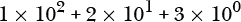

在这个例子中，最右边的数字 3 是*最低有效数字*，因为它对数字总值的贡献最小。最左边的数字 1 是*最高有效数字*，因为它对数字总值的贡献最大。

**另一种数字系统**

在位置符号系统发明之前，人们使用计数系统来跟踪数量。*罗马数字*系统就是一种著名的计数系统示例。它使用符号 I 表示 1，V 表示 5，X 表示 10，L 表示 50，等等。要表示两个物品，你只需用两个 I：II。类似地，XX 表示 20 个物品。

罗马数字系统的两个主要规则是，表示较大值的符号排在前面；如果一个表示较小值的符号出现在较大符号之前，则较小符号的值会从紧接其后的较大符号的值中被减去。例如，IV 代表 4，因为 I（1）小于 V（5），所以从 V 的值中减去 I 的值。

罗马数字系统中没有零的符号，因为在计数系统中不需要符号 0。在位置符号系统中，我们需要一个符号来标记该位置没有值，但该位置仍然对表示的值起作用：在 500 中的零告诉我们，十位和个位没有值。只有百位上有一个 5 的值。

位置符号的发明极大简化了算术运算，并导致了我们今天所知的数学。如果你需要说服自己，可以在罗马数字系统中试着将 60（LX）除以 3（III）。(答案：XX。)

十进制数系统的*基数*或*进制*是 10。这意味着有 10 个符号来表示数字 0 到 9。将一个数字向左移动一位会使其值增加 10 倍。将其向右移动一位会使其值减少 10 倍。位置记数法可以推广到任何基数 *r*，即

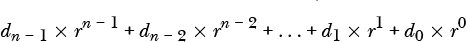

其中数字中有 *n* 位，每个 *d[i]* 是一个单独的数字，满足 0 *≤ d[i]* < *r*。

这个表达式告诉我们如何确定数字中每一位的值。我们通过从右边开始按顺序计数，从零开始来确定每一位的位置。在每个位置，我们将基数 *r* 提到该位置的幂次方，然后将其与该数字的值相乘。将所有结果相加，我们就得到了该数字所表示的值。

二进制数系统的进制是 2，因此只有两个符号来表示数字。这意味着 *d[i]* = `0`、`1`，我们可以将该表达式写为

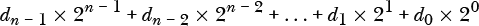

其中数字中有 *n* 位，每个 *d[i]* = `0` 或 `1`。

在下一节中，我们将把二进制数转换为无符号十进制数并反向转换。*有符号*数字可以是正数或负数，但*无符号*数字没有符号。我们将在第三章中讨论有符号数字。

#### ***二进制转换为无符号十进制***

你可以通过计算 2 的位置次方，然后将其与该位置上的位值相乘，轻松地将二进制转换为十进制。例如：

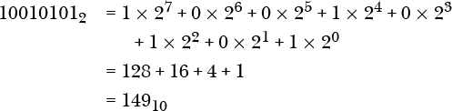

使用伪代码，二进制转换为十进制的过程可以总结为：

```
Let result = 0
Repeat for each i = 0, ..., (n - 1)
    Add di × 2i to result
```

在每个位位置，算法计算 2*^i* 并将其与相应的位值（`0` 或 `1`）相乘。

**注意**

*尽管我们此时只考虑整数，但该算法确实可以推广到小数值。只需将进制 *r* 的指数继续扩展到负值——即 *r^(n – *1*)*，*r^(n – *2*)*，...，*r¹*，*r⁰*，*r^(–*1*)*，*r^(–*2*)*，... 这将在第十九章中详细讨论。*

**轮到你了**

2.5     查看本节中的广义方程，十进制数 29,458,254 和十六进制数 `29458254` 的 *r*、*n* 和每个 *d[i]* 的值是什么？

2.6     将以下 8 位二进制数转换为十进制：

(a)     `1010 1010`

(b)     `0101 0101`

(c)     `1111 0000`

(d)     `0000 1111`

(e)     `1000 0000`

(f)     `0110 0011`

(g)     `0111 1011`

(h)     `1111 1111`

2.7     将以下 16 位二进制数转换为十进制：

(a)     `1010 1011 1100 1101`

(b)     `0001 0011 0011 0100`

(c)     `1111 1110 1101 1100`

(d)     `0000 0111 1101 1111`

(e)     `1000 0000 0000 0000`

(f)     `0000 0100 0000 0000`

(g)     `0111 1011 1010 1010`

(h)     `0011 0000 0011 1001`

2.8     开发一个算法将十六进制转为十进制，并将以下 16 位数字转换为十进制：

(a)     `a000`

(b)     `ffff`

(c)     `0400`

(d)     `1111`

(e)     `8888`

(f)     `0190`

(g)     `abcd`

(h)     `5555`

#### ***无符号十进制转二进制***

如果我们想将一个无符号十进制整数 *N* 转换为二进制，我们将其设置为与之前的二进制数表达式相等，得到方程

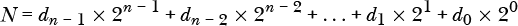

其中每个 *d[i]* = `0` 或 `1`。我们将这个方程两边都除以 2，右边每个 2 的指数减 1，得到

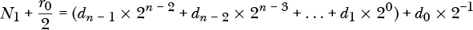

其中 *N*[1] 是整数部分，余数 *r*[0] 对于偶数为 `0`，对于奇数为 `1`。稍作改写，我们得到等效方程：

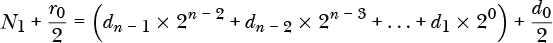

右侧括号内的所有项都是整数。方程两边的整数部分必须相等，分数部分也必须相等。也就是说，我们得到

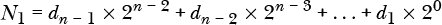 和：

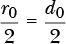

因此，你可以看到 *d*[0] = *r*[0]。将 *r*[0] /2（即 *d*[0]/2）从扩展方程的两边相减，得到：

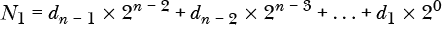

再次，我们将两边都除以 2：

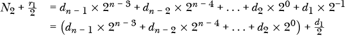

使用与之前相同的推理，*d*[1] = *r*[1]。我们可以通过从右到左反复除以 2，并使用余数作为相应位的值来得到一个数字的二进制表示。这个过程总结在以下算法中，其中斜杠（`/`）是整数除法运算符，百分号（`%`）是取模运算符：

```
quotient = N
i = 0
di = quotient % 2
quotient = quotient / 2
While quotient != 0
    i = i + 1
    di = quotient % 2
    quotient = quotient / 2
```

一些编程任务需要特定的位模式，例如，编程硬件设备。在这些情况下，指定位模式而不是数值更为自然。我们可以将位分成四组，并使用十六进制表示每一组。例如，如果我们的算法要求使用零和一交替出现的位——`0101 0101 0101 0101 0101 0101 0101 0101`——我们可以将其转换为十进制值 431,655,765，或者我们也可以用十六进制表示为 `0x55555555`（在 C/C++ 语法中）。一旦你记住了表 2-1，你会发现使用十六进制表示位模式更加轻松。

本节讨论的内容仅涉及无符号整数。带符号整数的表示依赖于 CPU 的一些架构特性，我们将在第三章中讨论。

**轮到你了**

2.9     将以下无符号十进制整数转换为其 8 位十六进制表示：

(a)     100

(b)     123

(c)     10

(d)     88

(e)     255

(f)     16

(g)     32

(h)     128

2.10     将以下无符号十进制整数转换为其 16 位十六进制表示：

(a)     1,024

(b)     1,000

(c)     32,768

(d)     32,767

(e)     256

(f)     65,535

(g)     4,660

(h)     43,981

2.11     发明一种代码，允许你存储带有加号或减号的字母成绩（即成绩 A、A–、B+、B、B–、. . . 、D、D–、F）。你的代码需要多少位？

### **数据存储在内存中**

现在我们有了开始讨论数据如何存储在计算机内存中的语言。我们将从内存是如何组织的开始。计算机中用于存储程序指令和数据的内存一般有两种类型：

**随机存取内存 (RAM)**

一旦一个位（开关）被设置为`0`或`1`，它将保持该状态，直到控制单元主动改变它或电源被切断。控制单元既可以读取位的状态，也可以改变位的状态。

*随机存取内存*这个名称是误导性的。在这里，*随机存取*意味着访问内存中的任何字节所需的时间相同，而不是在读取字节时涉及任何随机性。我们将 RAM 与*顺序访问内存 (SAM)*进行对比，后者访问字节所需的时间取决于其在某个序列中的位置。SAM 的一个例子是磁带，通常用于备份，在那里检索速度并不那么重要。访问字节所需的时间取决于存储在磁带上的字节的物理位置与当前磁带位置的关系。

**只读内存 (ROM)**

控制单元可以读取 ROM 中每个位的状态，但不能改变它。你可以通过专用硬件重新编程某些类型的 ROM，但当电源关闭时，位将保持在新的状态。ROM 也被称为*非易失性内存 (NVM)*。

#### ***内存地址***

内存中的每个字节都有一个位置或地址，类似于办公大楼中的房间号。特定字节的地址是固定不变的。也就是说，从内存开始的第 957 个字节将始终是第 957 个字节。然而，任何给定字节中每个位的状态（`0` 或 `1`）是可以改变的。

计算机科学家通常使用十六进制表示内存中每个字节的地址，编号从零开始。因此，我们可以说第 957 个字节的地址是`0x3bc`（即十进制的 956）。

内存中的前 16 个字节的地址是`0`、`1`、`2`、`3`、`4`、`5`、`6`、`7`、`8`、`9`、`a`、`b`、`c`、`d`、`e`和`f`。使用这种表示法

```
<address> : <content>
```

我们可以展示内存中前 16 个字节的内容，如表 2-3 所示（这里的内容是任意的）。

**表 2-3：** 内存前 16 个字节的示例内容

| **地址** | **内容** | **地址** | **内容** |
| --- | --- | --- | --- |
| `0x00000000` | `0x6a` | `0x00000008` | `0xf0` |
| `0x00000001` | `0xf0` | `0x00000009` | `0x02` |
| `0x00000002` | `0x5e` | `0x0000000a` | `0x33` |
| `0x00000003` | `0x00` | `0x0000000b` | `0x3c` |
| `0x00000004` | `0xff` | `0x0000000c` | `0xc3` |
| `0x00000005` | `0x51` | `0x0000000d` | `0x3c` |
| `0x00000006` | `0xcf` | `0x0000000e` | `0x55` |
| `0x00000007` | `0x18` | `0x0000000f` | `0xaa` |

每个字节的内容由两个十六进制数字表示，这些数字指定字节的 8 位的精确状态。

但是，字节的 8 位状态能告诉我们什么呢？程序员在将数据存储到内存时，需要考虑两个问题：

**存储数据需要多少位？**

为了回答这个问题，我们需要知道该数据项允许多少种不同的值。请查看表 2-1（4 位）和表 2-2（3 位）中可以表示的不同值的数量。我们可以用 *n* 位表示最多 2*^n* 种不同的值。还要注意的是，我们可能并不会使用在分配空间内所有可能的位模式。

**存储数据的代码是什么？**

我们日常生活中处理的大多数数据不是以零和一的形式表示的。为了将其存储在计算机内存中，程序员必须决定如何将数据编码成零和一。

在本章的其余部分，你将看到我们如何利用一个或多个字节中位的状态将字符和无符号整数存储到内存中。

#### ***字符***

当你编程时，几乎总是在操作文本字符串，这些字符串是字符数组。你写的第一个程序可能是一个“Hello, World!”程序。如果你用 C 语言写的，可能会使用类似这样的语句：

```
printf("Hello, World!\n");
```

或者，在 C++ 中：

```
cout < "Hello, World!" < endl;
```

当将这些语句翻译成机器代码时，编译器必须做两件事：

+   将每个字符存储在内存中的一个位置，以便控制单元可以访问它们。

+   生成机器指令将字符写到屏幕上。

我们将从考虑如何在内存中存储一个单独的字符开始。

##### **编码字符**

用于计算机存储字符编码的最常见标准是 *Unicode UTF-8*。它使用 1 到 4 个字节来存储一个称为 *代码点* 的数字，该数字表示一个字符。一个 Unicode 代码点写作 U+*h*，其中 *h* 是四到六个十六进制数字。操作系统和显示硬件将一个或多个代码点与一个 *字形* 关联，字形就是我们在屏幕上或纸上看到的内容。例如，U+0041 是拉丁大写字母 *A* 的代码点，而在本书使用的字体中，它对应的字形是 A。

UTF-8 向后兼容一个较旧的标准，即 *美国信息交换标准代码*，或 *ASCII*（发音为“ask-ee”）。ASCII 使用 7 位来指定一个包含 128 个字符的字符集中的每个代码点，该字符集包括英语字母（大写和小写）、数字、特殊字符和控制字符。在本书的所有编程中，我们只会使用 UTF-8 的 ASCII 子集中的字符，U+0000 到 U+007F。

表 2-4 展示了用于表示十六进制数字的字符的 Unicode 代码点，以及在我们的编程环境中存储这些字符的对应 8 位模式。稍后在本书中，你将有机会使用这个表格，当你学习如何从整数的字符表示转换为其二进制表示时。目前，注意到虽然数字字符是按照连续的位模式顺序组织的，但它们与字母字符之间有一个间隙。

**表 2-4：** 一些十六进制字符的 UTF-8 代码点

| **代码点** | **字符描述** | **字符字形** | **位模式** |
| --- | --- | --- | --- |
| U+0030 | 数字零 | `0` | `0x30` |
| U+0031 | 数字一 | `1` | `0x31` |
| U+0032 | 数字二 | `2` | `0x32` |
| U+0033 | 数字三 | `3` | `0x33` |
| U+0034 | 数字四 | `4` | `0x34` |
| U+0035 | 数字五 | `5` | `0x35` |
| U+0036 | 数字六 | `6` | `0x36` |
| U+0037 | 数字七 | `7` | `0x37` |
| U+0038 | 数字八 | `8` | `0x38` |
| U+0039 | 数字九 | `9` | `0x39` |
| U+0061 | 拉丁小写字母 a | `a` | `0x61` |
| U+0062 | 拉丁小写字母 b | `b` | `0x62` |
| U+0063 | 拉丁小写字母 c | `c` | `0x63` |
| U+0064 | 拉丁小写字母 d | `d` | `0x64` |
| U+0065 | 拉丁小写字母 e | `e` | `0x65` |
| U+0066 | 拉丁小写字母 f | `f` | `0x66` |

尽管十六进制数值部分与代码点 U+0000 到 U+007F 的位模式相同，但这并不一定适用于其他字符。例如，U+00B5 是微符号的代码点，它在内存中以 16 位模式 `0xc2b5` 存储，并且在本书中使用的字体显示为字形 *µ*。

UTF-8 使用每个字符 1 字节来存储代码点 U+0000 到 U+007F。字节中的位 6 和位 5（记住，位从右到左编号，从 0 开始）指定了四个字符组，如 表 2-5 所示。特殊字符大多是标点符号。例如，空格字符是 U+0020，分号字符（;）是 U+003B。

**表 2-5：** 字符组在代码点 U+0000 到 U+007F 中的分布

| **位 6** | **位 5** | **字符类型** |
| --- | --- | --- |
| `0` | `0` | 控制字符 |
| `0` | `1` | 数字字符和特殊字符 |
| `1` | `0` | 大写字母和特殊字符 |
| `1` | `1` | 小写字母和特殊字符 |

你可以通过在 Linux 终端窗口中输入命令 `man ascii` 来生成与 ASCII 字符对应的代码点表。 (你可能需要在计算机上安装 `ascii` 程序。) 这个表非常庞大，不适合记忆，但它有助于大致了解其组织结构。

你可以在 *[`www.unicode.org/releases/`](https://www.unicode.org/releases/)* 了解更多关于 Unicode 的信息。若想了解更多关于 Unicode 的形成过程，我推荐 Joel Spolsky 的《每个软件开发者必须绝对了解的 Unicode 和字符集最基本知识（没有借口！）》一文，链接在 *[`www.joelonsoftware.com/2003/10/08/the-absolute-minimum-every-software-developer-absolutely-positively-must-know-about-unicode-and-character-sets-no-excuses/`](https://www.joelonsoftware.com/2003/10/08/the-absolute-minimum-every-software-developer-absolutely-positively-must-know-about-unicode-and-character-sets-no-excuses/)*。

**轮到你了**

2.12     许多人使用大写字母表示字母的十六进制字符。我所知道的每种编程语言都接受这两种大小写。使用大写十六进制字符的位模式重新做 表 2-4。

2.13     为小写字母字符创建一个 ASCII 表。

2.14     为大写字母字符创建一个 ASCII 表。

2.15     为标点符号创建一个 ASCII 表。

##### **存储文本字符串**

回到 `Hello, World!\n`，编译器将这个文本字符串作为一个常量字符数组存储。为了指定这个数组的范围，C 风格的字符串使用代码点 U+0000（ASCII `NUL`）作为字符串结尾的 *哨兵* 值，哨兵值是一个唯一值，用来标示字符序列的结束。因此，编译器必须为这个字符串分配 15 个字节：13 个字节用于 `Hello, World!`，1 个字节用于换行符 `\n`，1 个字节用于 `NUL`。 表 2-6 显示了这个文本字符串如何从内存位置 `0x4004a1` 开始存储。

**表 2-6：** `Hello, World!\n` 存储在内存中

| **地址** | **内容** | **地址** | **内容** |
| --- | --- | --- | --- |
| `0x4004a1` | `0x48` | `0x4004a9` | `0x6f` |
| `0x4004a2` | `0x65` | `0x4004aa` | `0x72` |
| `0x4004a3` | `0x6c` | `0x4004ab` | `0x6c` |
| `0x4004a4` | `0x6c` | `0x4004ac` | `0x64` |
| `0x4004a5` | `0x6f` | `0x4004ad` | `0x21` |
| `0x4004a6` | `0x2c` | `0x4004ae` | `0x0a` |
| `0x4004a7` | `0x20` | `0x4004af` | `0x00` |
| `0x4004a8` | `0x57` | — | — |

C 使用 U+000A（ASCII `LF`）作为换行符（在此示例中位于地址 `0x4004ae`），尽管 C 语法要求程序员写出两个字符 `\n`。文本字符串以 `NUL` 字符（位于 `0x4004af`）结尾。

在 Pascal 语言中，字符串的长度由字符串中的第一个字节指定，该字节被视为一个 8 位无符号整数。（这也是 Pascal 中文本字符串限制为 256 个字符的原因。）C++ 的字符串类有更多功能，但实际的文本字符串仍然存储为 C 风格的文本字符串，嵌套在 C++ 字符串实例中。

#### ***无符号整数***

由于无符号整数可以用任何进制表示，最明显的存储方式可能就是使用二进制数系统。如果我们从右到左给一个字节的位编号，那么最低位将存储在位 0，接下来的位存储在位 1，以此类推。例如，整数 123[10] = `7b`[16]，因此它存储的字节状态将是`01111011`[2]。仅使用一个字节会将无符号整数的范围限制在 0 到 255[10]之间，因为`ff`[16] = 255[10]。在我们的编程环境中，无符号整数的默认大小是 4 字节，允许的范围是 0 到 4,294,967,295[10]。

使用二进制数系统的一个限制是，在对十进制数进行算术操作之前，你需要将其从字符字符串转换为二进制数系统。例如，十进制数 123 将以字符字符串格式存储为四个字节`0x31`、`0x32`、`0x33`和`0x00`，而在无符号整数格式中，它将以 4 字节的二进制数`0x0000007b`存储。在另一端，为了大多数现实世界的显示用途，二进制数需要转换为它们的十进制字符表示。

*二进制编码十进制（BCD）*是另一种存储整数的编码方式。它为每个十进制数字使用 4 位，如表 2-7 所示。

**表 2-7：** 二进制编码十进制

| **十进制数字** | **BCD 码** |
| --- | --- |
| 0 | `0000` |
| 1 | `0001` |
| 2 | `0010` |
| 3 | `0011` |
| 4 | `0100` |
| 5 | `0101` |
| 6 | `0110` |
| 7 | `0111` |
| 8 | `1000` |
| 9 | `1001` |

例如，在一个 16 位的存储位置中，十进制数 1,234 将以 BCD 格式存储为`0001 0010 0011 0100`（在二进制数系统中，它将是`0000 0100 1101 0010`）。

由于只有可能的 16 种组合中的 10 种被使用，剩余的六种位模式被浪费了。这意味着，如果我们使用 BCD，一个 16 位的存储位置可以存储 0 到 9,999 之间的值，而如果使用二进制，它的范围则是 0 到 65,535。这是内存利用效率较低的一种方式。另一方面，BCD 在字符格式和整数格式之间的转换更简单，正如你将在第十六章中学到的那样。

BCD 在专门处理数字业务数据的系统中非常重要，因为这些系统通常比执行数学运算更频繁地打印数字。COBOL 是一种面向业务应用的编程语言，支持打包 BCD 格式，其中每个 8 位字节存储两个 BCD 码数字。这里，*最后*（4 位）的数字用于存储数字的符号，如表 2-8 所示。使用的具体代码取决于实现。

**表 2-8：** 打包 BCD 格式的示例符号代码

| **符号** | **符号代码** |
| --- | --- |
| + | `1010` |
| – | `1011` |
| + | `1100` |
| – | `1101` |
| + | `1110` |
| 无符号 | `1111` |

例如，`0001 0010 0011 1010` 表示 +123，`0001 0010 0011 1011` 表示 -123，`0001 0010 0011 1111` 表示 123。

接下来，我们将使用 C 编程语言来探讨这些概念。如果你是 C 新手，这个讨论将为你提供语言的介绍。

### **使用 C 探索数据格式**

在这一节中，我们将使用 C 编程语言编写我们的第一个程序。这些特定的程序展示了数字在内存中存储的方式与我们人类读取它们的方式之间的差异。C 语言使我们能够接近硬件，理解核心概念，同时处理许多底层的细节。你应该不会觉得本书中的简单 C 程序太难，尤其是如果你已经会使用其他语言编程的话。

如果你曾经在更高级的语言中学习编程，如 C++、Java 或 Python，你可能学过面向对象编程。C 不支持面向对象的编程范式；它是一种*过程式*编程语言。C 程序被分为*函数*，函数是一个命名的编程语句组。其他编程语言也使用*过程*和*子程序*这些术语，根据语言的不同，它们之间可能有一些细微的区别。

#### ***使用 C 和 C++ I/O 库***

大多数高级编程语言都包含一个标准库，可以将其视为语言的一部分。一个*标准库*包含可以在语言中用于执行常见任务的函数和数据结构，如终端 I/O（向屏幕写入和从键盘读取）。C 包含 *C 标准库*，C++ 包含 *C++ 标准库*。

C 程序员使用 `stdio` 库中的函数进行终端 I/O，而 C++ 程序员则使用 `iostream` 库中的函数。例如，读取键盘输入的整数，给它加 100，并将结果写入屏幕的 C 代码序列如下：

```
int x;
scanf("%i", &x);
x += 100;
printf("%i", x);
```

C++ 的代码序列大致如下：

```
int x;
cin << x;
x +=100;
cout << x;
```

在这两个示例中，代码从键盘读取字符（每个字符作为一个独立的 `char`），并将 `char` 序列转换为相应的 `int` 格式。然后，它将 `int` 加 100 后，再将结果转换回 `char` 序列并在屏幕上显示。前面的 C 或 C++ I/O 库函数完成了 `char` 序列和 `int` 存储格式之间的必要转换。

图 2-1 显示了 C 应用程序、I/O 库和操作系统之间的关系。

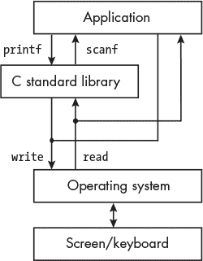

*图 2-1：I/O 库与应用程序和操作系统的关系*

当从键盘读取时，`scanf`库函数首先调用`read` *系统调用* 函数，这是操作系统中的一个函数，用于从键盘读取字符。键盘上的输入是一个字符串，每个字符都是`char`数据类型。`scanf`库函数将这个字符串转换为应用程序所需的`int`数据类型。`printf`库函数则将`int`数据类型转换为对应的字符串，并调用`write`系统调用函数将每个字符写入屏幕。

在图 2-1 中，一个应用程序可以直接调用`read`和`write`函数来传输字符。我们将在第十六章中深入探讨这一点，届时我们将编写自己的转换函数。尽管 C/C++库函数在这方面做得比我们好得多，但亲自实现这个功能将帮助你更好地理解数据是如何存储在内存中并被软件操作的。

**注意**

*即使你熟悉 GNU* make *程序，学习如何使用它来构建你的程序也是值得的。此时可能看起来有点多余，但对于简单的程序来说，学习起来更容易。手册可以通过几种格式在* [`www.gnu.org/software/make/manual/`](https://www.gnu.org/software/make/manual/) *获取，我对使用它的评论可以在我的网站上找到，网址是* [`rgplantz.github.io`](https://rgplantz.github.io)。

#### ***编写和执行你的第一个 C 程序***

大多数编程书籍从一个简单的程序开始，这个程序仅仅是将“Hello, World!”打印到计算机屏幕上，但我们将从一个程序开始，它读取一个十六进制值，既作为无符号整数，也作为文本字符串（示例 2-1）。

*int_and_string.c*

```
➊ // Read and display an integer and a text string.

➋ #include <stdio.h>

   int main(void)
   {
    ➌ unsigned int an_int;
       char a_string[10];

    ➍ printf("Enter a number in hexadecimal: ");
    ➎ scanf("%x", &an_int);
       printf("Enter it again: ");
    ❻ scanf("%s", a_string);
    ❼ printf("The integer is %u and the string is %s\n", an_int, a_string);

    ❽ return 0;
   }
```

*示例 2-1：显示整数和文本字符串之间差异的程序*

我们以一些文档开始我们的代码，这些文档简要描述了程序的功能❶。当编写自己的源文件时，您也应当在文档中包括您的名字和编写日期（在本书的示例程序中为了节省空间，我省略了这些内容）。在一行中，紧跟两个斜杠字符`//`后的所有文本都是注释。C 语言还允许我们使用`/*`开始一个多行注释，并用`*/`结束它。注释是给人类读者看的，对程序本身没有任何影响。

实际影响程序的第一个操作是使用 `#include` 指令包含*头文件*，即 *stdio.h* ❷。正如你将要学习的，C 编译器需要知道传递给或从函数返回的每个数据项的类型。头文件用于提供每个函数的*原型声明*，以指定这些数据类型。*stdio.h* 头文件定义了 C 标准库中许多函数的接口，告诉编译器在我们的源代码中遇到这些函数的调用时该怎么做。*stdio.h* 头文件已经安装在你的计算机上，存放在编译器知道的位置。

本清单中的其余代码是 C `main` 函数的定义。所有 C 程序都由函数组成，这些函数具有以下一般格式：

```
return-data-type function-name(parameter-list)
{
    function-body
}
```

当一个 C 程序被执行时，操作系统首先设置一个*托管环境*或*独立环境*，这会为你的计算机配置资源以运行该程序。托管环境包括对 C 标准库中函数的访问，而独立环境则不包括。书中大部分程序运行在托管环境中。关于如何在第二十一章的“管理调用”部分使用独立环境，我会在第 474 页进行说明。

在 C 托管环境中，程序的执行从 `main` 函数开始，这意味着你编写的程序必须包含一个名为 `main` 的函数。`main` 函数可以调用其他函数，而这些函数又可以调用其他函数。但是，程序控制通常会最终回到 `main` 函数，然后返回到 C 托管环境。

当在 C 中调用一个函数时，调用函数可以在调用中包含一个*参数*列表，作为输入传递给被调用的函数。这些输入作为被调用函数中执行计算的*参数*。例如，在清单 2-1 中，当程序首次启动时，`main` 函数调用了 `printf` 函数，并传递了一个参数，即文本字符串 ❹。`printf` 函数使用这个文本字符串来确定屏幕上显示的内容。在第十四章中，我们将仔细查看参数如何传递给函数，以及它们如何作为参数在函数中使用。清单 2-1 中的 `main` 函数不需要来自 C 托管环境的数据；我们通过在其定义中使用 `void` 作为参数列表来表示这一点。

执行完成后，函数通常会返回到调用函数。当返回时，被调用函数可以将一个数据项传递给调用函数。`main`函数应该返回一个整数值给 C 语言环境，表示程序在执行过程中是否检测到任何错误。因此，`main`的返回数据类型是`int`。Listing 2-1 中的`main`函数将整数 0 返回给 C 语言环境，并将此值传递给操作系统。

在 Listing 2-1 中，我们在`main`函数的函数体开始部分定义了两个变量：一个无符号整数`an_int`和一个文本字符串`a_string` ❸。大多数现代编程语言允许我们在代码的任何地方引入新变量，但 C 语言要求它们必须在函数开始时列出。（这一规则有一些例外，但它们超出了本书的范围。）可以把它当作是在给出如何使用它们的指令之前，先列出食谱中的原料。我们通过引入变量名并指定其数据类型来*定义*一个变量。`[10]`符号告诉编译器为`a_string`变量分配一个长度为 10 的`char`数组，这样我们就可以存储一个最多 9 个字符的 C 风格文本字符串。（第 10 个`char`是终止的`NUL`字符。）我们将在第十七章详细讨论数组。

程序使用 C 标准库中的`printf`函数在屏幕上显示文本。对`printf`的调用中的第一个参数是一个*格式字符串*，它是由普通字符（除了`%`）组成的文本字符串，用于在屏幕上显示。

`printf`的最简单格式字符串就是你想打印的文本，没有任何变量。如果你想打印变量的值，格式字符串就充当了你想打印的文本模板。在文本字符串中，你希望打印变量值的位置由一个*转换说明符*标记。每个转换说明符以`%`字符开头，变量名按照它们在模板中出现的顺序列出，位于格式字符串后面 ❼。

`%`字符是每个转换说明符的开头，后面紧跟一个或多个转换代码字符，用以告诉`printf`如何显示变量的值。表 2-9 展示了`printf`和`scanf`格式字符串的一些常见转换说明符。

**表 2-9：** 一些常见的转换说明符

| **转换说明符** | **表示方式** |
| --- | --- |
| `%u` | 无符号十进制整数 |
| `%d` 或 `%i` | 有符号十进制整数 |
| `%f` | 浮点数 |
| `%x` | 十六进制 |
| `%s` | 文本字符串 |

转换说明符可以包含其他指定属性的字符，例如显示字段的宽度、值是否在字段内左对齐或右对齐等等。我这里不再详细讲解；要了解更多内容，请阅读`printf`的 man 页面 3（输入 man 3 printf 命令查看 man 页面）。

调用 C 标准库函数`scanf`时，第一个参数也是格式字符串。我们在格式字符串中使用相同的转换说明符来告诉`scanf`函数如何解释键盘输入的字符 ❺。我们通过使用*地址运算符*（&）来告诉`scanf`将输入的整数存储在变量`&an_int`中。当将数组的名称传递给函数时，C 会传递数组的地址，因此在调用`scanf`读取文本字符串时，我们不需要使用`&`运算符 ❻。

在`scanf`的格式字符串中，除了这些转换说明符外，格式字符串中的其他字符必须与键盘输入完全匹配。例如，格式字符串

```
scanf("1 %i and 2 %i", &one_int, &two_int);
```

需要类似下面的输入：

```
1 123 and 2 456
```

这将从键盘读取整数 123 和 456。你可以阅读 man 页面 3 了解`scanf`的更多信息（输入 man 3 scanf 命令）。

最后，`main`函数向 C 托管环境返回 0，C 托管环境将此值传递给操作系统。值 0 告诉操作系统一切顺利 ❽。

在我的计算机上编译并运行列表 2-1 中的程序，得到了以下输出：

```
$ gcc -Wall -o int_and_string int_and_string.c
$ ./int_and_string
Enter a hexadecimal value: 123abc
Enter it again: 123abc
The integer is 1194684 and the string is 123abc
$
```

列表 2-1 中的程序演示了一个重要概念：十六进制是人类为了表示位模式而使用的便捷方式。一个数字本身并不是二进制、十进制或十六进制的；它仅仅是一个值。并且，可以在这三种数字进制中等价地表示一个特定的值。事实上，它还可以在*任何*数字进制（2、16、285 等等）中等价表示，但由于计算机由二进制开关组成，因此从二进制数制的角度来看存储在计算机中的数值是有意义的。

**轮到你了**

2.16     编写一个十六进制到十进制转换的 C 程序。程序将允许用户输入一个十六进制数，并打印出对应的十进制值。输出应该是这样的：`0x7b = 123`。

2.17     编写一个十进制到十六进制转换的 C 程序。程序将允许用户输入一个十进制数，然后打印出对应的十六进制值。输出应该是这样的：`123 = 0x7b`。

2.18     将程序列表 2-1 中最后一个`printf`语句的`%u`改为`%i`。如果输入`ffffffff`，程序会打印什么？

### **使用调试器检查内存**

现在我们已经开始编写程序，你需要学习如何使用 GNU 调试器`gdb`。一个*调试器*是一个允许你在观察和控制程序行为的同时运行程序的工具。当你使用调试器时，它就像你是一个木偶师，而你的程序是一个精心控制的木偶。你主要的控制工具是*断点*；当你设置一个断点并且程序在运行时遇到它时，程序会暂停并将控制权交还给调试器。控制权交给调试器后，你可以查看程序变量中存储的值，这可以帮助你找出程序中的错误。

如果你觉得这一切显得有些过早——到目前为止我们的程序很简单，似乎不需要调试——我保证，学习如何在简单的例子中使用调试器，要比在一个复杂的且无法运行的程序上学习要好得多。即使你编写的是没有错误的程序，`gdb`也是学习本书内容的一个有价值的工具。在接下来的`gdb`会话中，我将展示如何确定一个变量在内存中的存储位置，并查看存储在那里的是十进制值还是十六进制值。你将看到如何在一个运行中的程序上使用`gdb`，以说明前面几页讨论的概念。

你将在第九章和第十章中看到更多内容，但这里列出的`gdb`命令足以让你开始使用：

b source_filename:line_number   在指定的 source_filename 文件中的 line_number 行设置一个断点。代码在遇到该断点时会停止运行，并将控制权交回给`gdb`，让你测试代码中的各种元素。

c   从当前的位置继续程序执行。

h command   获取如何使用命令的帮助。

i r   显示寄存器的内容（*info registers*）。(你将在第九章中学习 CPU 寄存器。)

l line_number   列出以指定 line_number 为中心的 10 行源代码。

print expression   评估表达式并打印其值。

printf "format", var1, var2, ..., varn   以给定格式显示 var1, var2, ..., varn 的值。`"`format`"`字符串遵循与 C 标准库中`printf`相同的规则。

r   在`gdb`控制下运行已加载的程序。

x/nfs memory_address   以指定格式 f 和大小 s，从 memory_address 开始显示（检查）内存中的 n 个值。

#### ***使用你的调试器***

让我们通过使用`gdb`在清单 2-1 中逐步执行程序，探索到目前为止覆盖的一些概念。阅读时请在你的电脑上跟着操作；当你实际使用`gdb`时，理解它会更容易。请注意，你在电脑上看到的地址可能与你在这个示例中看到的不同。

我将通过使用`gcc`命令来编译程序：

```
$ gcc -g -Wall -o int_and_string int_and_string.c
```

`-g` 选项告诉编译器将调试信息包含在可执行程序中。`-Wall` 选项告诉编译器发出警告，提醒你代码中看似正确的 C 代码可能并非你想要写的内容。例如，它会警告你在函数中声明了一个从未使用过的变量，这可能意味着你忘记了什么。

`-o` 选项指定输出文件的名称，即可执行程序。

在编译程序后，我可以使用此命令在 `gdb` 的控制下运行程序：

```
$ gdb ./int_and_string
--snip--
Reading symbols from ./int_and_string...
(gdb) l
1       // Read and display an integer and a text string.
2
3       #include <stdio.h>
4
5       int main(void)
6       {
7           unsigned int an_int;
8           char a_string[10];
9
10          printf("Enter a number in hexadecimal: ");
(gdb)
11          scanf("%x", &an_int);
12          printf("Enter it again: ");
13          scanf("%s", a_string);
14          
15          printf("The integer is %u and the string is %s\n", an_int, a_string);
16
17          return 0;
18      }
(gdb)
```

`gdb` 启动时的消息，我已从之前的输出中删除以节省空间，包含有关调试器的信息，并参考其使用文档。

`l` 命令列出 10 行源代码，然后将控制权交回给 `gdb` 程序，显示 `(gdb)` 提示符。按回车键可以重复上一个命令，`l` 会显示接下来的（最多）10 行。

断点用于停止程序并将控制权返回给调试器。我喜欢在函数即将调用另一个函数时设置断点，这样我可以检查传递给被调用函数的参数变量的值。此 `main` 函数在第 15 行调用 `printf`，所以我在这里设置了断点。由于我已经在查看源代码并希望设置断点的位置，因此不需要指定文件名：

```
(gdb) b 15
Breakpoint 1 at 0x80c: file int_and_string.c, line 15.
```

如果 `gdb` 在执行程序时遇到此语句，它将在*执行语句之前*暂停，并将控制权交回给调试器。

设置好断点后，我运行程序：

```
(gdb) r
Starting program: /home/bob/progs/chapter_02/int_and_string/int_and_string
Enter a hexadecimal value: 123abc
Enter it again: 123abc

Breakpoint 1, main () at int_and_string.c:15
15   printf("The integer is %u and the string is %s\n", an_int, a_string);
```

`r` 命令从头开始执行程序。当程序到达断点时，控制权返回给 `gdb`，它将显示下一个准备执行的程序语句。在继续执行之前，我会显示传递给 `printf` 函数的两个变量的内容：

```
(gdb) print an_int
$1 = 1194684
(gdb) print a_string
$2 = "123abc\000\000\000"
```

我们可以使用 `print` 命令来显示当前存储在变量中的值。`gdb` 从源代码中知道每个变量的数据类型。它会以十进制显示 `int` 类型的变量。当显示 `char` 类型的变量时，`gdb` 会尽力显示与代码点值相对应的字符图形。如果没有相应的字符图形，`gdb` 会以 `\` 后跟三个*八进制*数字来显示代码点值（见 表 2-2）。例如，`NUL` 没有对应的字符图形，所以 `gdb` 在我输入的文本字符串末尾显示 `\000`。

`printf` 命令可以格式化显示的值。格式化字符串与 C 标准库中的 `printf` 函数相同：

```
(gdb) printf "an_int = %u = %#x\n", an_int, an_int
an_int = 1194684 = 0x123abc
(gdb) printf "a_string = %s\n", a_string
a_string = 123abc
```

`gdb` 还提供了一个命令 `x`，用于直接检查内存内容（即实际的位模式）。它的帮助消息简洁明了，但提供了你所需的所有信息：

```
(gdb) help x
Examine memory: x/FMT ADDRESS.
ADDRESS is an expression for the memory address to examine.
FMT is a repeat count followed by a format letter and a size letter.
Format letters are o(octal), x(hex), d(decimal), u(unsigned decimal),
 t(binary), f(float), a(address), i(instruction), c(char) and s(string).
Size letters are b(byte), h(halfword), w(word), g(giant, 8 bytes).
The specified number of objects of the specified size are printed
according to the format.
Defaults for format and size letters are those previously used.
Default count is 1\. Default address is following last thing printed
with this command or "print".
```

`x` 命令需要提供一个内存区域的地址来显示内容。我们可以使用 `print` 命令来查找变量的地址：

```
(gdb) print &an_int
$3 = (unsigned int *) 0x7fffffef7c
```

我们可以使用`x`命令以三种不同的方式显示`an_int`的内容——一个十进制字（`1dw`），一个十六进制字（`1xw`），以及四个十六进制字节（`4xb`）——如下所示：

```
(gdb) x/1dw 0x7fffffef7c
0x7fffffef7c: 1194684 
(gdb) x/1xw 0x7fffffef7c
0x7fffffef7c: 0x00123abc
(gdb) x/4xb 0x7fffffef7c
0x7fffffef7c: ❶ 0xbc  0x3a     0x12     0x00
```

**注意**

*一个* 单词 *的大小取决于你使用的计算机环境。在我们的环境中，它是 4 个字节。*

这些四个字节的显示可能看起来乱序了。第一个字节❶位于行左侧显示的地址。行中的下一个字节位于后续地址`0x7fffffef7d`。因此，该行显示了位于内存地址`0x7fffffef7c`、`0x7fffffef7d`、`0x7fffffef7e`和`0x7fffffef7f`处的字节，从左到右依次排列，组成了变量`an_int`。当单独显示这四个字节时，最不重要的字节*首先*出现在内存中。这就是所谓的*小端存储顺序*；我将在之后的`gdb`教程中进一步解释。

我们也可以通过首先获取`a_string`变量的地址来显示其内容：

```
(gdb) print &a_string
$4 = (char (*)[10]) 0x7fffffef70
```

接下来，我们将以两种方式查看`a_string`的内容，分别是 10 个字符（`10c`）和 10 个十六进制字节（`10xb`）：

```
(gdb) x/10c 0x7fffffef70
0x7fffffef70:   49 '1'  50 '2'  51 '3'  97 'a'  98 'b'  99 'c'  0 '\000'  0 '\000'
0x7fffffef78:   0 '\000'  0 '\000'
(gdb) x/10xb 0x7fffffef70
0x7fffffef70:   0x31    0x32    0x33    0x61    0x62    0x63    0x00    0x00
0x7fffffef78:   0x00    0x00
```

字符显示会以十进制显示每个字符的代码点及其字符字形。十六进制字节显示仅以十六进制显示每个字节的代码点。两种显示都显示了标记我们输入的六个字符字符串结束的`NUL`字符。由于我们请求显示 10 个字节，剩余的 3 个字节包含与我们的文本字符串无关的随机值，通常称为*垃圾值*。

最后，我继续执行程序并退出`gdb`：

```
(gdb) c
Continuing.
The integer is 1194684 and the string is 123abc
[Inferior 1 (process 2289) exited normally]
(gdb) q
$
```

#### ***理解内存中的字节存储顺序***

完整的 4 字节显示和内存中`0x7fffffef7c`处整数值的 1 字节显示之间的差异，说明了一个名为*字节序*（endianess）或字节存储顺序的概念。我们通常从左到右读取数字，左侧的数字比右侧的数字更具意义（占用更多）。

##### **小端存储**

数据在内存中存储时，*最不* 重要的字节在多字节值中位于地址编号最小的地方。也就是说，内存中存储的是“最小”（计数最少）的字节。

当我们逐字节检查内存时，每个字节都会显示在按地址升序排列的内存地址中：

```
0x7fffffef7c: 0xbc
0x7fffffef7d: 0x3a
0x7fffffef7e: 0x12
0x7fffffef7f: 0x00
```

初看之下，值似乎是反向存储的，因为值的最不重要的（“小端”）字节首先存储在内存中。当我们命令`gdb`显示整个 4 字节值时，它知道我们是小端环境，并会重新排列字节的显示顺序，使其正确：

```
0x7fffffef7c: 0x00123abc
```

##### **大端存储**

数据在内存中存储时，*最* 重要的字节在多字节值中位于地址编号最小的地方。也就是说，内存中存储的是“最大”（计数最多）的字节。

如果我们在一台大端计算机上运行之前的程序，比如使用 PowerPC 架构的计算机，我们将看到以下内容（假设变量位于相同的地址）：

```
(gdb) x/1xw 0x7fffffef7c
0x7ffffff2ec: 0x00123abc
(gdb) x/4xb 0x7fffffef7c   [BIG-ENDIAN COMPUTER, NOT OURS!]
0x7ffffff2ec: 0x00 0x12 0x3a 0xbc
```

即，在大端计算机中，4 个字节将以以下方式存储：

```
0x7fffffef7c: 0x00
0x7fffffef7d: 0x12
0x7fffffef7e: 0x3a
0x7fffffef7f: 0xbc
```

再次，`gdb` 会知道这是一个大端计算机，因此会以正确的顺序显示完整的 4 字节值。

在绝大多数编程场景中，字节序并不是一个问题。然而，你需要了解它，因为在调试器中检查内存时它可能会让人困惑。字节序也是不同计算机之间通信时的问题。例如，*传输控制协议/互联网协议（TCP/IP）* 被定义为大端，有时也叫做 *网络字节顺序*。AArch64 架构中的指令以小端顺序存储。数据可以存储为任意顺序，但我们环境中的默认顺序是小端，操作系统会为互联网通信重新排序字节。如果你为操作系统本身或者可能没有操作系统的嵌入式系统编写通信软件，你也需要了解字节顺序。

**你的回合**

2.19     在 列表 2-1 中输入程序。用 `gdb` 跟踪程序。使用你得到的数字，解释 `an_int` 和 `a_string` 变量在内存中的存储位置以及每个位置存储的内容。

### **你学到的内容**

**比特**   计算机是由开/关开关组成的，我们可以用比特表示它们。

**十六进制**   这是基于 16 的数字系统。每个十六进制数字，`0` 到 `f`，代表 4 位。

**字节**   这是 8 位的一个组。该比特模式可以用两个十六进制数字表示。

**十进制与二进制转换**   这两种数字系统在数学上是等价的。

**内存寻址**   内存中的字节按顺序编号（寻址）。字节的地址通常以十六进制表示。

**字节序**   一个超过 1 字节的整数可以将最高位字节存储在最低字节地址（大端）或将最低位字节存储在最低字节地址（小端）。我们的环境是小端。

**UTF-8 编码**   这是用于将字符存储在内存中的编码。

**字符串**   C 风格的字符串是一个由字符组成的数组，以 `NUL` 字符结束。

printf   这个 C 库函数用于在屏幕上输出格式化的数据。

scanf   这个 C 库函数用于从键盘读取格式化数据。

**调试**   `gdb` 调试器可以用来查看变量在程序执行的每一步中如何变化。

在下一章中，你将学习如何在二进制数字系统中进行加法和减法运算，适用于无符号和有符号整数。这将揭示使用固定数量的比特表示数值时可能出现的一些潜在错误。
