## 第三章：**计算机算术**


计算的现实是我们有有限的比特数。在上一章中，你学到了每个数据项必须适应固定数量的比特，这取决于它的数据类型。本章将向你展示，这一限制甚至使我们最基本的数学运算变得复杂。对于有符号和无符号的数字，有限的比特数是一个我们在纸上或脑中做数学时通常不会想到的约束。

CPU 包括用于一组单比特 *状态标志* 的内存。它们中有一个 *进位标志（C）* 和一个 *溢出标志（V）*，使我们能够检测到加法或减法操作后，二进制数的结果超过了分配给数据类型的比特数。我们将在后续章节中深入探讨进位标志和溢出标志，但现在让我们看看加法和减法如何影响它们。

### **十进制数系统中的无符号整数**

当计算机做算术时，它们是在二进制数系统中进行的。这些运算一开始可能看起来很困难，但如果你记得手工做十进制算术的细节，二进制算术就变得容易多了。虽然现在大多数人使用计算器做加法，但回顾手工做加法所需的所有步骤将帮助我们开发出在二进制和十六进制中进行加法和减法的算法。

**注意**

*大多数计算机架构提供其他进制的算术指令，但那些是比较专业的。我们在本书中不会讨论这些。*

#### ***加法***

让我们限制在两位十进制数上。考虑这两个数字，*x* = 67 和 *y* = 79。用手工在纸上加法会是这样的：

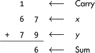

我们从右侧开始，首先加上个位上的两个十进制数字：7 + 9 = 16，超过了 10，差 6。我们通过在和的个位放一个 6，并将 1 进位到十位上来表示：

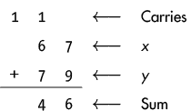

接下来，我们加上十位上的三个十进制数字：1（来自个位的进位）+ 6 + 7。三个数字的和超过了 10，差 4，我们通过在十位放一个 4，并记录最终进位为 1 来表示。因为我们只用两位数字，所以没有百位。

以下算法展示了加两个十进制整数，*x* 和 *y* 的过程。在这个算法中，*x[i]* 和 *y[i]* 分别是 *x* 和 *y* 的第 *i* 位数字，从右到左编号：

```
Let Carry0 = 0 
Repeat for each i = 0, ..., (N - 1)               // Starting in ones place 

    Sumi = (xi + yi + Carryi) % 10                // Remainder 
    Carryi + 1 = (xi + yi + Carryi) / 10           // Integer division
```

这个算法之所以有效，是因为我们在写数字时使用了位置表示法；数字向左移动一位，值就增加 10 倍。当前位进位到左边一位时总是 0 或 1。

我们在 `/` 和 `%` 操作中使用 10，因为十进制数系统中恰好有 10 个数字：0, 1, 2, . . . , 9。由于我们在 *N* 位系统中工作，我们将结果限制为 *N* 位。最终的进位，*Carry[N]*，要么是 0，要么是 1，并且它是结果的一部分，与 *N* 位的和一起。

#### ***减法***

对于减法，有时你需要从被减数的下一个高位借位（即被减的数字）。我们将使用之前用过的数字（67 和 79）来进行减法，并分步骤说明，以便你理解这个过程。借位的工作将在两个数字上方的借位行中进行：

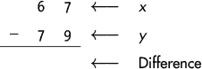

首先，我们需要从十位上的 6 借 1，并把它加到个位上的 7。然后，我们就可以从 17 中减去 9，得到 8：

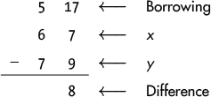

接下来，我们需要从两位数以外的地方借位，我们通过在“进位”位置标记一个 1 来表示。这样我们就得到了十位上的 15，然后从中减去 7：

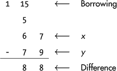

这在下面的算法中有所体现，其中 *x* 是被减数，*y* 是被减数（*减数*）。如果在这个算法结束时 *Borrow* 为 1，这表明你必须从两个数的 *N* 位数以外的地方借位，因此 *N* 位的结果是错误的。虽然它叫做 *进位标志*，但它的作用是表明操作结果无法适应数据类型的位数。因此，进位标志在减法操作完成时显示 *Borrow* 的值（来自超出数据类型大小的部分）：

```
Let Borrow = 0
Repeat for each i = 0, ..., (N - 1)
➊ If y[i] ≤ x[i]
       Let Difference[i] = x[i] - y[i]
   Else
    ➋ Let j = i + 1
    ➌ While (x[j] = 0) and (j < N)
           Add 1 to j
    ➍ If j = N
        ➎ Let Borrow = 1
           Subtract 1 from j
           Add 10 to x[j]
    ❻ While j > i
           Subtract 1 from x[j]
           Subtract 1 from j
           Add 10 to x[j]
    ❼ Let Difference[i] = x[i] - y[i]
```

这个算法看起来并没有那么复杂（但我花了很长时间才搞明白！）。如果我们正在减的数字与被减数的数字相同或更大❶，我们就完成了该位的操作。否则，我们需要从左边的下一个位借位❷。如果我们尝试从的下一个数字是 0，我们需要继续向左移动，直到找到一个非零数字，或者直到我们到达数字的最左端❸。如果我们达到为数字分配的位数❹，我们通过将 *Borrow* 设置为 1 来表示这一点❺。

在我们从左边的各位借位之后，我们会回到当前处理的位置❻，并进行减法❼。当你在纸上做减法时，你会自动在脑海中完成这些步骤，但在二进制和十六进制系统中，可能不会那么直观。（我会作弊，把中间的借位写成十进制。）

如果你遇到困难，不用担心。你不需要深入理解这个算法来理解本书中的内容，但我认为通过它可以帮助你学习如何为其他计算问题开发算法。将日常程序转化为编程语言使用的逻辑语句通常是一个困难的任务。

### **二进制系统中的无符号整数**

在本节中，您将学习如何对无符号二进制整数执行加法和减法运算。在继续之前，请仔细查看 表 3-1（特别是二进制位模式）。您可能不会立刻记住这个表，但在您使用二进制和十六进制数字系统一段时间后，您会发现将 10、`a` 或 `1010` 看作是相同的数字，只是在不同的数字系统中表示。

**表 3-1：** 十六进制数字的对应位模式和无符号十进制值

| **一个十六进制数字** | **四个二进制位（比特）** | **无符号十进制** |
| --- | --- | --- |
| `0` | `0000` | 0 |
| `1` | `0001` | 1 |
| `2` | `0010` | 2 |
| `3` | `0011` | 3 |
| `4` | `0100` | 4 |
| `5` | `0101` | 5 |
| `6` | `0110` | 6 |
| `7` | `0111` | 7 |
| `8` | `1000` | 8 |
| `9` | `1001` | 9 |
| `a` | `1010` | 10 |
| `b` | `1011` | 11 |
| `c` | `1100` | 12 |
| `d` | `1101` | 13 |
| `e` | `1110` | 14 |
| `f` | `1111` | 15 |

现在您已经熟悉了 表 3-1，我们来讨论无符号整数。这样做时，请不要忘记，就数字的值而言，无论我们将整数视为十进制、十六进制还是二进制，它们在数学上是等价的。然而，我们可能会想知道计算机在二进制中执行算术时，是否得到与我们使用十进制算术进行相同计算时相同的结果。让我们仔细看一些具体的运算。

#### ***加法***

在接下来的示例中，我们使用 4 位值。首先，考虑将两个无符号整数 2 和 4 相加：

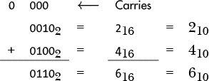

十进制值 2 在二进制中表示为 `0010`，而十进制 4 在二进制中表示为 `0100`。进位标志，或称 `C`，等于 `0`，因为加法运算的结果也是 4 位长。我们像在十进制中一样，在相同的位置上进行加法操作（这里以二进制和十六进制显示，进位只在二进制中显示）。

接下来，考虑两个更大的整数。在保持我们 4 位存储空间的情况下，我们将两个无符号整数 4 和 14 相加：

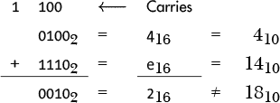

在这种情况下，进位标志等于 `1`，因为运算结果超过了我们为存储整数分配的 4 位。因此，我们的结果是错误的。如果我们将进位标志包括在结果中，我们将得到一个 5 位值，结果为 `10010`[2] = 18[10]，这是正确的。在这种情况下，我们需要在软件中考虑进位标志。

#### ***减法***

让我们从 4 中减去 14，或者从`1110`中减去`0100`：

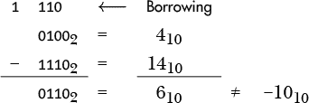

CPU 可以通过将进位标志设置为`1`，表示我们必须从 4 位之外借位，这意味着此减法的 4 位结果是错误的。

这些 4 位算术示例可以推广到计算机执行的任何大小的算术运算。AArch64 架构有一个加法指令，当没有最终进位时，它将进位标志设置为`0`；如果加法结果有最终进位，则将进位标志设置为`1`。类似地，还有一个减法指令，如果减法不需要借位，它会将进位标志设置为`0`；如果减法需要借位，则将进位标志设置为`1`。

**注意**

*我们的 C 编译器并没有使用这些加法和减法指令。在执行加法或减法运算时，并没有进位或借位的指示。我们将在第十五章中详细讨论这一点，当时我们会讨论如何将汇编语言嵌入到 C 代码中。*

**轮到你了**

3.1     存储一个十进制数字需要多少位？发明一种用于在 32 位中存储八个十进制数字的编码。使用这种编码，二进制加法是否能产生正确的结果？你在第二章中见过这种编码，并了解了它的有用性。

3.2     开发一个算法，用于在二进制数系统中加法定长整数。

3.3     开发一个算法，用于在十六进制数系统中加法定长整数。

3.4     开发一个算法，用于在二进制数系统中减去定长整数。

3.5     开发一个算法，用于在十六进制数系统中减去定长整数。

### **加法和减法的有符号整数**

当表示非零有符号十进制整数时，有两种可能性：它们可以是正数或负数。由于只有两种选择，我们只需要使用 1 位作为符号位。我们可以使用*符号幅度码*，通过简单地使用最高位来表示有符号数——比如`0`表示正，`1`表示负。但如果这样做，我们会遇到一些问题。举个例子，考虑加法 +2 和 -2：

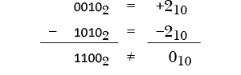

结果，`1100`[2]，在我们的代码中等于 –4[10]，这在算术上是不正确的。我们对于无符号数使用的简单加法方法，在使用符号幅度码时，对于有符号数将无法正确工作。

一些计算机架构在使用有符号十进制整数时确实使用 1 位作为符号位。它们有一个特殊的*有符号加法*指令来处理类似的情况。（顺便提一句：这类计算机有+0 和–0！）但大多数计算机使用不同的编码方式来表示有符号数，从而允许使用简单的加法指令进行有符号加法。让我们现在来看一下。

#### ***理解二的补码***

在数学中，*补码*是指必须加上去才能使其“完整”的数值。当将这一概念应用于数字时，*完整*的定义取决于你所使用的基数（或进制）以及你允许表示数字的位数。如果*x*是基数*r*下的*n*位数，那么它的*基数补码*，¬*x*，被定义为使得*x* + (¬*x*) = *radix^n*，其中*radix^n*是 1 后跟*n*个 0。例如，如果我们使用的是两位十进制数，那么 37 的基数补码是 63，因为 37 + 63 = 10² = 100。换句话说，将一个数字与它的基数补码相加会得到 0，进位超出*n*位数。

另一个有用的概念是*缩小基数补码*，它的定义是使得*x* + *diminished_radix_complement* = *radix^n* – 1。例如，37 的缩小基数补码是 62，因为 37 + 62 = 10² – 1 = 99。如果你将一个数字与它的缩小基数补码相加，结果是基数中最大位数的*n*个数字：在这个例子中是两个 9（基数 10 的两位数）。

为了了解基数补码如何表示负数，考虑一个录音带播放器，它播放一盘包含磁带的录音带，磁带在两个卷轴之间来回绕动。

磁带上的音频录音是一个模拟信号，不包含关于磁带位置的信息。许多录音带播放器都有一个四位数的计数器，表示磁带的位置。你可以插入一盘磁带并按下重置按钮，将计数器设为 0000。当你向前或向后移动磁带时，计数器会记录移动。这些计数器提供了磁带位置的“编码”表示，单位是任意的。现在，假设我们可以插入一盘磁带，设法将其移到中心，然后按下重置按钮。向前移动磁带（正方向）将使计数器递增。向后移动磁带（负方向）将使计数器递减。特别地，如果我们从 0000 开始，移动到+1，磁带计数器上的“代码”将显示 0001。另一方面，如果我们从 0000 开始，移动到–1，磁带计数器上的“代码”将显示 9999。

我们可以使用磁带系统执行之前示例中的运算，(+2) + (–2)：

1.  将磁带向前移动到(+2)；计数器显示 0002。

1.  通过将磁带向后移动两步，给计数器加上(–2)；现在计数器显示 0000，这在我们的编码中代表 0。

接下来，我们将执行相同的运算，从(–2)开始，然后加上(+2)：

1.  将磁带向后移动到(–2)；计数器显示 9998。

1.  通过将磁带向前移动两步，给计数器加上(+2)；现在计数器显示 0000，但有进位（9998 + 2 = 0000，进位 = 1）。

如果我们忽略进位，答案是正确的：9998 是 0002 的 10 的补码（基数为 10）。当使用基数补码表示法加两个带符号整数时，进位是无关紧要的。加两个带符号数字时，结果可能无法适应为存储结果分配的位数，就像无符号数字一样。但是我们的“磁带”示例刚刚说明，进位标志可能不会告诉我们结果无法适应。我们将在下一节讨论这个问题。

计算机使用二进制数字系统，其中的基数是 2。让我们来看一下用于表示带符号整数的 *二进制补码* 表示法。它使用与带符号十进制整数在位模式中表示的“磁带计数器”相同的通用模式。

表 3-2 显示了 4 位值的十六进制、二进制和带符号十进制（以二进制补码表示法）之间的对应关系。在二进制中，将“磁带”从 0 向后移动一位（负数），从 `0000` 到 `1111`。在十六进制中，从 `0` 到 `f`。

**表 3-2：** 四位二进制补码表示法

| **一个十六进制数字** | **四个二进制数字（位）** | **带符号十进制** |
| --- | --- | --- |
| `8` | `1000` | –8 |
| `9` | `1001` | –7 |
| `a` | `1010` | –6 |
| `b` | `1011` | –5 |
| `c` | `1100` | –4 |
| `d` | `1101` | –3 |
| `e` | `1110` | –2 |
| `f` | `1111` | –1 |
| `0` | `0000` |   0 |
| `1` | `0001` | +1 |
| `2` | `0010` | +2 |
| `3` | `0011` | +3 |
| `4` | `0100` | +4 |
| `5` | `0101` | +5 |
| `6` | `0110` | +6 |
| `7` | `0111` | +7 |

这是关于此表的一些重要观察：

+   每个正数的高位是 `0`，每个负数的高位是 `1`。

+   尽管改变一个数字的符号（即取反）比单纯改变高位更复杂，但通常会将高位称为 *符号位*。

+   该表示法允许比正数多一个负数。

+   这种表示法（使用 4 位）能够表示的整数范围 *x* 为：

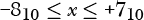

或者：

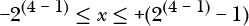

最后的观察可以推广到 *n* 位的以下公式：

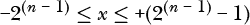

使用二进制补码表示法时，任何 *n* 位整数 *x* 的负值定义为：

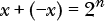

请注意，2*^n* 在二进制中写成 `1` 后跟 *n* 个 `0`。换句话说，在 *n* 位二进制补码表示法中，将一个数加上它的负值会得到 *n* 个 `0` 和一个进位 `1`。

#### ***计算二进制补码***

我们将通过使用二进制补码表示法推导出计算一个数字负值的方法。解出 *x* 的定义方程，我们得到：

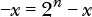

这对数学家来说可能看起来很奇怪，但请记住，在这个方程中，*x* 被限制为 *n* 位，而 2*^n* 有 *n* + 1 位（`1` 后跟 *n* 个 `0`）。

例如，如果我们想在 8 位二进制中计算–123（使用二的补码表示），我们进行如下算术运算：

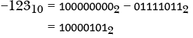

这个减法运算容易出错，所以让我们对计算–*x*的方程式做一些代数处理。我们将两边都减去 1，并稍微调整一下：

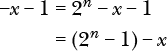

这给我们带来了：

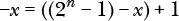

如果这看起来比我们的第一个方程式更复杂，不用担心。我们来考虑量 (2*^n* – 1)。因为 2*^n* 在二进制中是 `1` 后跟 *n* 个 `0`，所以 (2*^n* – 1) 就是 *n* 个 `1`。例如，对于 *n* = 8：

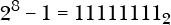

因此，我们可以说：


其中 11 *. . .* 1[2] 表示 *n* 个`1`。

虽然这可能一开始不明显，但当你考虑之前在 8 位二进制下计算–123 的示例时，你会发现这个减法是多么简单。设 *x* = 123，得到：

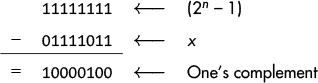

或者，使用十六进制表示，得到：

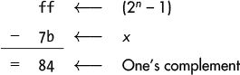 因为这里所有量都有 *n* 位，所以这个计算很简单——只需翻转所有位，得到减小的基数补码，也称为二进制系统中的*一的补码*。`1`变为`0`，`0`变为`1`。

计算负数所需要做的就是将`1`加到结果中。最后，我们得到以下结果：

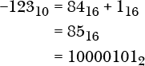

**提示**

*为了重新检查你的算术运算，注意你正在转换的数值是偶数还是奇数。这在所有数字进制中都是相同的。*

**轮到你了**

3.6     开发一个算法，将带符号十进制整数转换为二的补码二进制。

3.7     开发一个算法，将二的补码二进制表示的整数转换为带符号十进制。

3.8     以下 16 位十六进制值以二的补码表示。它们对应的带符号十进制数是什么？

(a)     `1234`

(b)     `ffff`

(c)     `8000`

(d)     `7fff`

3.9     展示如何将以下每个带符号十进制整数存储为 16 位二的补码表示。请用十六进制给出你的答案：

(a)     +1,024

(b)     –1,024

(c)     –256

(d)     –32,767

### **二进制中带符号整数的加法与减法**

用来表示值的位数是在程序编写时由计算机架构和使用的编程语言决定的。这就是为什么如果结果过大，你不能像在纸上那样增加更多数字（位）。对于无符号整数，解决这个问题的方法是进位标志，它指示两个无符号整数的和是否超过了分配给它的位数。在这一节中，你将学习到，两个带符号数相加也可能会得到超过分配位数的结果，但在这种情况下，只有进位标志并不能指示错误。

CPU 可以通过使用 *溢出标志* `V` 来指示符号数的和超出了它的位数。溢出标志的值是通过一个可能一开始看起来不直观的操作计算得出的：倒数第二个进位和最终进位的 *异或 (XOR)* 运算。举个例子，假设我们正在相加两个 8 位数 `15`[16] 和 `6f`[16]：

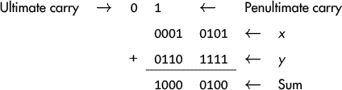

在这个例子中，进位是 `0`，倒数第二个进位是 `1`。`V` 标志等于最终进位和倒数第二个进位的异或，`V` = `C` ⊻ *(penultimate_carry)*，其中 ⊻ 是异或运算符。在这个例子中，`V` = `0` ⊻ `1` = `1`。

逐一查看，我们会看到为什么 `V` 标志指示了在二进制补码表示下加法结果的有效性。在接下来的三节中，我们将讨论三种可能的情况：两个数的符号相反，两个数都为正，或者两个数都为负。

#### ***符号相反的两个数***

设 *x* 为负数，*y* 为正数。我们可以将 *x* 和 *y* 表示为二进制如下：

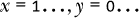

也就是说，一个数的高位（符号位）是 `1`，而另一个数的高位（符号位）是 `0`，无论其他位是什么。

*x* + *y* 的结果始终保持在二进制补码表示的范围内：

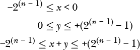

如果我们将 *x* 和 *y* 相加，可能会有两种进位结果：

+   如果倒数第二个进位是 `0`：

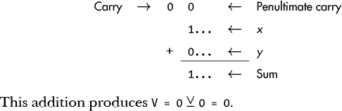 * 如果倒数第二个进位是 `1`：

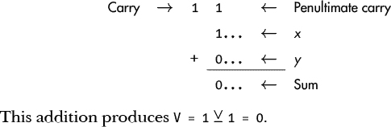

相加两个符号相反的整数时，溢出标志 `0` 总是为零，因此和始终在分配的范围内。

#### ***两个正数***

如果 *x* 和 *y* 都是正数，我们可以将它们表示为二进制如下：

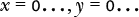

在这里，无论其他位是什么，两个数的高位（符号位）都是 `0`。

再次，如果我们将 *x* 和 *y* 相加，可能会有两种进位结果：

+   如果倒数第二个进位是 `0`：


这个加法产生了 `V = 0` ⊻ `0 = 0`。和的高位是 `0`，因此是正数，并且和在范围内。

+   如果倒数第二个进位是 `1`：

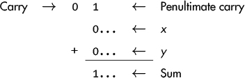

这个加法产生了 `V = 0` ⊻ `1 = 1`。和的高位是 `1`，因此是负数。两个正数相加不可能得到负数，因此和必定超出了分配的范围。

#### ***两个负数***

如果 *x* 和 *y* 都是负数，我们可以将它们表示为二进制如下：

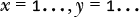 在这种情况下，两个数的高位（符号位）都是 `1`，无论其他位是什么。

如果我们将 *x* 和 *y* 相加，可能会有两种进位结果：

+   如果倒数第二个进位是 `0`：

    这给出了`V = 1` ⊻ `0 = 1`。和的高位是`0`，所以它是正数。但两个负数相加不能得到正数，因此和已经超出了分配的范围。  

+   如果倒数第二个进位是`1`：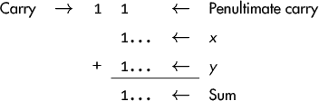  

    这给出了`V = 1` ⊻ `1 = 0`。和的高位是`1`，所以它是负数，且和在范围内。  

我们在这里不会讨论减法。相同的规则也适用，邀请你自行探索。  

我们可以根据你刚才学到的内容以及我们在第 40 页《二进制系统中的无符号整数》中所做的内容，陈述以下加法或减法规则：  

+   当程序将结果视为无符号时，进位标志`C`的值为`0`，当且仅当结果在*n*位范围内；`V`不相关。  

+   当程序将结果视为有符号时，溢出标志`V`的值为`0`，当且仅当结果在*n*位范围内；`C`不相关。  

**注意**  

*使用二进制补码表示法意味着 CPU 不需要额外的指令来进行有符号加法和减法，从而简化了硬件。CPU 只看到位模式。AArch64 架构包括加法和减法指令，根据相应二进制运算规则设置* C *和* V *，无论程序如何处理数字。有符号和无符号的区别完全由程序决定。每次加法或减法操作后，程序应检查无符号整数的* C *或有符号整数的* V *的状态，并至少指示和是否出错。许多高级语言不会执行此检查，这可能导致一些难以察觉的程序错误。*  

### **整数编码的循环特性**  

无符号整数和有符号整数使用的符号表示法具有循环特性——对于给定的位数，每个编码“回绕”。图 3-1 使用 3 位数字的“解码环”展示了这一点。  

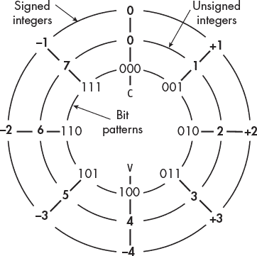  

*图 3-1：3 位有符号和无符号整数的“解码环”*  

要使用此解码环加法或减法两个整数，请按照以下步骤操作：  

1.  选择与所用整数类型（有符号或无符号）对应的解码环。  

1.  移动到解码环上对应第一个整数的位置。  

1.  沿着该环移动与第二个整数相等的“辐条”数量。顺时针移动表示加法，逆时针移动表示减法。

如果未超出无符号整数的上限或未超出有符号整数的下限，则结果是正确的。  

**轮到你了**  

3.10 使用图 3-1 中的解码环进行以下算术运算。请指出结果是“正确”还是“错误”：  

(a) 无符号整数：1 + 3  

(b) 无符号整数：3 + 4  

(c) 无符号整数：5 + 6  

(d) 有符号整数：（+1）+（+3）  

(e) 有符号整数：（–3）–（+3）  

(f)     有符号整数：（+3）+（–4）

3.11     将下列一对 8 位数字（以十六进制显示）相加，并指明结果是“正确”还是“错误”。首先将它们视为无符号值，然后再视为有符号值（以二补码存储）：

(a)     `55 + aa`

(b)     `55 + f0`

(c)     `80 + 7b`

(d)     `63 + 7b`

(e)     `0f + ff`

(f)     `80 + 80`

3.12     将下列一对 16 位数字（以十六进制显示）相加，并指明结果是“正确”还是“错误”。首先将它们视为无符号值，然后再视为有符号值（以二补码存储）：

(a)     `1234 + edcc`

(b)     `1234 + fedc`

(c)     `8000 + 8000`

(d)     `0400 + ffff`

(e)     `07d0 + 782f`

(f)     `8000 + ffff`

### **你所学到的**  

**二进制运算**   计算机在二进制数字系统中执行加法和减法。两个数字相加可能会得到一个比每个数字宽 1 位的结果。从一个数字中减去另一个数字可能需要从超出两个数字宽度的 1 位借位。

**有符号/无符号表示**   位模式可以被视为表示有符号或无符号整数。二补码表示法通常用于表示有符号整数。

**进位标志**   CPU 包括一个 1 位的进位标志`C`，它可以显示加法或减法的结果是否超过了无符号整数所允许的位数。

**溢出标志**   CPU 包括一个 1 位的溢出标志`V`，它可以显示加法或减法的结果是否超过了使用二补码表示的有符号整数所允许的位数。

在下一章，你将学习如何进行布尔代数。虽然一开始可能觉得有点陌生，但一旦我们开始，你会发现它实际上比初等代数要简单。因为在布尔代数中，所有的结果都只会是`0`或`1`！
