## 第四章：布尔代数**

*布尔代数*由 19 世纪的英国数学家乔治·布尔发展，他致力于用数学严密性解决逻辑问题。他为操作逻辑值建立了一个数学系统，其中变量的唯一可能值为*真*和*假*，通常分别表示为`1`和`0`。

布尔代数中的基本运算包括*合取*（AND）、*析取*（OR）和*否定*（NOT）。这将其与初等代数区分开来，后者包括实数的无限集合，并使用加法、减法、乘法和除法等算术运算。（指数运算是重复乘法的简化表示法。）

当数学家和逻辑学家在以越来越复杂和抽象的方式扩展布尔代数领域时，工程师们则在学习如何通过电路中的开关来利用电流流动执行逻辑运算。这两个领域并行发展，直到 1930 年代中期，一名研究生克劳德·香农证明了电气开关可以用来实现所有布尔代数表达式的功能。（在描述开关电路时，布尔代数有时被称为*开关代数*。）香农的发现打开了无限的可能性，布尔代数也因此成为计算机的数学基础。

在本章中，我将从基本布尔运算符的描述开始。接下来，你将学习它们的逻辑规则，这些规则构成了布尔代数的基础。然后，我将解释如何将布尔变量和运算符组合成代数表达式，以形成布尔逻辑函数。最后，我将讨论简化布尔函数的技术。在接下来的章节中，你将学习如何利用电子开关实现逻辑功能，并将这些功能连接到逻辑电路中，以执行计算机的基本功能：算术、逻辑运算和存储。

### **基本布尔运算符**

布尔运算符作用于称为*操作数*的值或值对。有几个符号用于表示每个布尔运算符，我将在每个运算符的描述中提到。在本书中，我将介绍逻辑学家使用的符号。

我将使用真值表来展示每个运算的结果。*真值表*显示所有可能的操作数组合的结果。例如，考虑两个比特*x*和*y*的加法。存在四种可能的值组合，其中一种是加法，结果会有一个和以及一个可能的进位。表 4-1 展示了如何在真值表中表示这一点。

**表 4-1：** 两比特加法的真值表

| ***x*** | ***y*** | ***进位*** | ***和*** |
| --- | --- | --- | --- |
| 0 | 0 | 0 | 0 |
| 0 | 1 | 0 | 1 |
| 1 | 0 | 0 | 1 |
| 1 | 1 | 1 | 0 |

我还将提供 *门* 的电子电路表示，这些门是实现布尔运算符的电子设备。你将在 第五章 到 第八章 中学习更多关于这些设备的内容，在这些章节中，你还将看到物理设备的实际行为与真值表中显示的理想数学行为略有不同。

与初等代数一样，你可以将这些基本运算符结合起来定义二次运算符。你将在本章末尾定义 XOR 运算符时看到一个例子。现在，让我们先来看看这些基本运算符：

**与（AND）**

与运算符是一个 *二元运算符*，意味着它作用于两个操作数。仅当 *两个* 操作数都为 `1` 时，AND 运算的结果才为 `1`；否则，结果为 `0`。在逻辑学中，这个操作被称为 *合取*。我将用 ∧ 来表示 AND 操作。使用 *·* 符号或简单地使用 AND 也很常见。

图 4-1 显示了一个与门的电路符号和定义输出的真值表，操作数为 *x* 和 *y*。

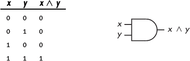

*图 4-1：作用于两个变量的与门，* x *和* y

如真值表所示，与运算符具有类似于初等代数中乘法的性质，这就是为什么一些人用 *·* 符号来表示它。

**或（OR）**

或运算符也是一个二元运算符。如果至少有一个操作数为 `1`，则 OR 运算的结果为 `1`；否则，结果为 `0`。在逻辑学中，这个操作被称为 *析取*。我将用 ∨ 来表示 OR 操作。使用 + 符号或简单地使用 OR 也很常见。图 4-2 显示了一个或门的电路符号和定义输出的真值表，操作数为 *x* 和 *y*。

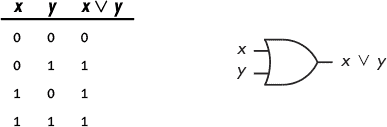

*图 4-2：作用于两个变量的或门，* x *和* y

真值表显示，或运算符遵循类似于初等代数中加法的规则，这就是为什么一些人用 + 符号来表示它。

**非（NOT）**

非运算符是一个 *一元运算符*，它只作用于一个操作数。当操作数为 `0` 时，NOT 运算的结果为 `1`；当操作数为 `1` 时，结果为 `0`。非操作的其他名称包括 *补码* 和 *反转*。我将用 ¬ 来表示 NOT 操作。使用 `'` 符号、在变量上方的下划线或简单地使用 NOT 也很常见。图 4-3 显示了一个非门的电路符号和定义输出的真值表，操作数为 *x*。

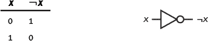

*图 4-3：作用于一个变量的非门，* x

如你所见，非运算符具有类似于初等代数中算术取反的性质，但也有一些显著的不同之处。

AND 是乘法性质，OR 是加法性质，这并非偶然。乔治·布尔发展了他的代数，以将数学严谨性应用于逻辑，并使用加法和乘法来操作逻辑语句。他基于使用 AND 进行乘法、OR 进行加法来制定这些规则。在下一节中，你将学习如何使用这些运算符与 NOT 一起表示逻辑语句。

### **布尔表达式**

就像你可以使用初等代数运算符将变量组合成像（*x* + *y*）这样的表达式一样，你也可以使用布尔运算符将变量组合成布尔表达式。

然而，有一个显著的区别。布尔表达式是由值（`0` 和 `1`）和文字构成的。在布尔代数中，*文字*是指在表达式中使用的单一变量实例或其补集。在表达式中

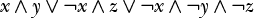

有三个变量（*x*、*y* 和 *z*）以及七个文字。在布尔表达式中，你会发现每个变量都有它的补集形式和非补集形式，因为每种形式都是一个独立的文字。

我们可以使用∧或∨运算符来组合文字。像初等代数一样，布尔代数表达式由*项*组成——由运算符作用于文字的组，例如（*x* ∨ *y*）或（*a* ∧ *b*）——*运算优先级*（或*运算顺序*）指定在求值表达式时如何应用这些运算符。表 4-2 列出了布尔运算符的优先级规则。与初等代数一样，括号内的表达式优先计算。

**表 4-2：** 布尔代数运算符的优先级规则

| **运算** | **符号** | **优先级** |
| --- | --- | --- |
| NOT | ¬*x* | 最高 |
| AND | *x* ∧ *y* | 中级 |
| OR | *x* ∨ *y* | 最低 |

现在你已经知道了三个基本布尔运算符的工作原理，接下来我们将研究它们在代数表达式中遵循的一些规则。正如你在本章后面将看到的那样，我们可以利用这些规则来简化布尔表达式，从而简化我们在硬件中实现这些表达式的方式。

知道如何简化布尔表达式对于硬件开发者和软件编程者来说都是一项重要工具。计算机仅仅是布尔逻辑的物理表现形式。即使你对编程的唯一兴趣是编写程序，你写下的每一条编程语句最终都是由完全符合布尔代数系统的硬件来执行的。我们的编程语言通过抽象化隐藏了其中的很多细节，但它们仍然使用布尔表达式来实现编程逻辑。

### **布尔代数规则**

当你将布尔代数中的 AND 和 OR 与初等代数中的乘法和加法进行比较时，你会发现布尔代数的一些规则很熟悉，但也有一些显著不同。

#### ***与初等代数相同的规则***

让我们从相同的规则开始；在下一部分，我们将讨论不同的规则。这些规则如下：

**与运算和或运算是结合性的**

我们说一个运算符是*结合性的*，如果我们可以改变在表达式中应用两个或更多次运算符的顺序，而不会改变表达式的值。数学上表示为：

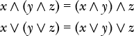

为了证明与运算和或运算的结合性规则，让我们使用穷举真值表，如表 4-3 和表 4-4 所示。表 4-3 列出了变量 *x*、*y* 和 *z* 的所有可能值，以及术语 (*y* ∧ *z*) 和 (*x* ∧ *y*) 的中间计算结果。在最后两列中，我计算了等式两边每个表达式的值，证明了这两个等式是成立的。

**表 4-3：** 与运算的结合性

| ***x*** | ***y*** | ***z*** | (***y*** ∧ ***z***) | (***x*** ∧ ***y***) | ***x*** ∧ (***y*** ∧ ***z***) | (***x*** ∧ ***y***) ∧ ***z*** |
| --- | --- | --- | --- | --- | --- | --- |
| `0` | `0` | `0` | `0` | `0` | `0` | `0` |
| `0` | `0` | `1` | `0` | `0` | `0` | `0` |
| `0` | `1` | `0` | `0` | `0` | `0` | `0` |
| `0` | `1` | `1` | `1` | `0` | `0` | `0` |
| `1` | `0` | `0` | `0` | `0` | `0` | `0` |
| `1` | `0` | `1` | `0` | `0` | `0` | `0` |
| `1` | `1` | `0` | `0` | `1` | `0` | `0` |
| `1` | `1` | `1` | `1` | `1` | `1` | `1` |

表 4-4 列出了变量 *x*、*y* 和 *z* 的所有可能值，以及术语 (*y* ∨ *z*) 和 (*x* ∨ *y*) 的中间计算结果。在最后两列中，我计算了等式两边每个表达式的值，进一步证明了这两个等式是成立的。

**表 4-4：** 或运算的结合性

| ***x*** | ***y*** | ***z*** | (***y*** ∨ ***z***) | (***x*** ∨ ***y***) | ***x*** ∨ (***y*** ∨ ***z***) | (***x*** ∨ ***y***) ∨ ***z*** |
| --- | --- | --- | --- | --- | --- | --- |
| `0` | `0` | `0` | `0` | `0` | `0` | `0` |
| `0` | `0` | `1` | `1` | `0` | `1` | `1` |
| `0` | `1` | `0` | `1` | `1` | `1` | `1` |
| `0` | `1` | `1` | `1` | `1` | `1` | `1` |
| `1` | `0` | `0` | `0` | `1` | `1` | `1` |
| `1` | `0` | `1` | `1` | `1` | `1` | `1` |
| `1` | `1` | `0` | `1` | `1` | `1` | `1` |
| `1` | `1` | `1` | `1` | `1` | `1` | `1` |

这种策略适用于本节所示的每个规则，但我这里只会通过真值表来展示结合性规则。你将在“你的转机”部分的练习 4.1 中，完成其他规则的真值表。

**与运算和或运算具有单位值**

一个*单位值*是特定于某个运算的值，使用该运算对一个具有单位值的量进行运算时，结果是原始量的值。对于与运算（AND）和或运算（OR），单位值分别是 `1` 和 `0`：

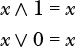

**与运算和或运算是交换性的**

我们可以说，如果可以反转操作数的顺序而不改变操作结果，则该运算符是*交换律*的：

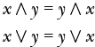

**AND 对 OR 具有分配性**

对经过 OR 运算的数量应用 AND 运算符时，可以将 AND 运算符*分配*到每一个 OR 运算的数量：

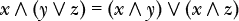

与初等代数不同，累加型的 OR 对乘法型的 AND 是分配的。你将在下一节看到这一点。

**AND 具有废除值（也称为消亡值）**

*废除值*是指对一个数量进行该废除值操作后，结果仍然是废除值。AND 的废除值是 `0`：

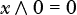 我们习惯于在初等代数中将 0 作为乘法的废除值，但加法没有废除值的概念。你将在下一节了解 OR 运算的废除值。

**NOT 表示自反**

一个运算符表现出*自反性*，如果对一个数量应用两次该运算符后，结果仍然是原始数量：

自反性仅仅是双重补集的应用：NOT(NOT true) = true。这类似于初等代数中的双重否定。

#### ***与初等代数不同的规则***

尽管 AND 是乘法型的，OR 是加法型的，但这些逻辑运算与算术运算之间存在显著差异。这些差异源于布尔代数处理的是评估为真或假的逻辑表达式，而初等代数处理的是无限多的实数集合。在这一节中，你将看到一些可能让你想起初等代数的表达式，但布尔代数的规则不同。那些规则是：

**OR 对 AND 具有分配性**

对于通过 AND 运算得到的数量，应用 OR 运算符时可以将 OR 运算符分配到每一个 AND 运算的数量：

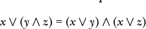

因为加法在初等代数中不对乘法具有分配性，你可能会忽视这种布尔表达式的操作方式。

首先，我们来看初等代数。使用加法作为 OR，乘法作为 AND 的时候，在之前的方程中我们得到：

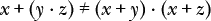

当我们代入 *x* = 1，*y* = 2 和 *z* = 3 时，左边的表达式得到：

1 + (2 · 3) = 7

然后，右边的表达式得到：

(1 + 2) · (1 + 3) = 12

因此，在初等代数中，加法对于乘法*不*具有分配性。

用真值表展示 OR 在布尔代数中对 AND 的分配性是最好的方法，如 表 4-5 所示。

**表 4-5：** OR 对 AND 的分配性

| ***x*** | ***y*** | ***z*** | ***x*** ∨ (***y*** ∧ ***z***) | (***x*** ∨ ***y***) ∧ (***x*** ∨ ***z***) |
| --- | --- | --- | --- | --- |
| `0` | `0` | `0` | `0` | `0` |
| `0` | `0` | `1` | `0` | `0` |
| `0` | `1` | `0` | `0` | `0` |
| `0` | `1` | `1` | `1` | `1` |
| `1` | `0` | `0` | `1` | `1` |
| `1` | `0` | `1` | `1` | `1` |
| `1` | `1` | `0` | `1` | `1` |
| `1` | `1` | `1` | `1` | `1` |

比较两个右侧列，你可以看出，将变量*x*与每个 AND 操作的变量*y*和*z*进行或（OR）运算，得到的结果与将*x*与每个变量进行或（OR）运算，再将两个或（OR）结果进行与（AND）运算的结果相同。因此，分配律成立。

**或（OR）有一个消除值（也称为湮灭值）**

在初等代数中加法没有消除值，但在布尔代数中，或（OR）的消除值是`1`：

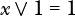

**与（AND）和或（OR）都有补值**

*补值*是变量的减基补值。你在第三章中学到，某个量与该量的减基补值的和等于（*基数* – 1）。由于布尔代数中的基数为 2，`0`的补值是`1`，`1`的补值是`0`。因此，布尔量的补值就是该量的非（NOT），即：

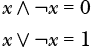

补值展示了与（AND）和或（OR）逻辑运算与乘法和加法算术运算之间的一个区别。在初等代数中：

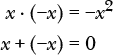

即使我们将*x*限制为 0 或 1，在初等代数中，1 · (–1) = –1，1 + (–1) = 0。

**与（AND）和或（OR）是幂等的**

如果一个运算符是*幂等的*，将其应用于两个相同的操作数会得到该操作数。换句话说：

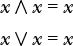

这与初等代数中的情况不同，在初等代数中，重复将一个数乘以它本身是指数运算，重复将一个数加到它本身则相当于乘法。

**德摩根定律适用**

在布尔代数中，与（AND）和或（OR）运算之间的特殊关系由*德摩根定律*表达，该定律指出：

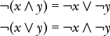

第一个方程表示两个布尔量的与（AND）的非（NOT）等于这两个量的非（NOT）的或（OR）。第二个方程表示两个布尔量的或（OR）的非（NOT）等于这两个量的非（NOT）的与（AND）。

这种关系是*对偶原则*的一个例子，在布尔代数中，若你将每个`0`替换为`1`，每个`1`替换为`0`，每个与（AND）替换为或（OR），每个或（OR）替换为与（AND），该等式仍然成立。回顾刚刚给出的规则，你会发现除了自反外，所有规则都有对偶运算。德摩根定律是对偶的最佳例子之一；你将在完成“你的练习”4.2 节练习时看到这一原则的应用。

**你的练习**

4.1     使用真值表证明本节中给出的布尔代数规则。

4.2     证明德摩根定律。

### **布尔函数**

计算机的功能基于布尔逻辑，这意味着计算机的各种操作是由布尔函数指定的。布尔函数看起来有点像初等代数中的函数，但变量可以是未补充或已补充的形式。变量和常量通过布尔运算符连接。布尔函数的结果只能是 `1` 或 `0`（真或假）。

当我们在第 41 页的第三章讨论二进制数系统中的加法时，你会看到，在加两个位，*x* 和 *y* 时，我们必须在计算中考虑可能的进位到它们的位位置。导致进位为 `1` 的条件是：

当前位位置没有进位，*x* = `1`，且 *y* = `1`，或者

当前位位置有进位，*x* = `0`，且 *y* = `1`，或者

当前位位置有进位，*x* = `1`，且 *y* = `0`，或者

当前位位置有进位，*x* = `1`，且 *y* = `1`。

我们可以用布尔函数更简洁地表示这个

其中 *x* 是一个位，*y* 是另一个位，*c[in]* 是来自下一位位置的进位，*C[out]*(*c[in]*, *x*, *y*) 是当前位位置加法的进位。我们将在本节中使用这个方程，但首先，让我们思考一下布尔函数和初等代数函数之间的区别。

像初等代数函数一样，布尔代数函数也可以进行数学操作，但数学运算是不同的。初等代数的运算是在无限的实数集上进行的，而布尔函数只在两个可能的值 `0` 或 `1` 上操作。初等代数函数可以评估为任意实数，但布尔函数只能评估为 `0` 或 `1`。

这个差异意味着我们必须以不同的方式思考布尔函数。例如，看看这个初等代数函数：

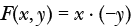

你可能会这样理解：“如果我将 *x* 的值乘以 *y* 的负值，我将得到 *F*(*x*, *y*) 的值。”然而，对于布尔函数

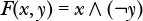

只有四种可能性。如果 *x* = 1 且 *y* = 0，那么 *F*(*x*, *y*) = `1`；对于其他三种情况，*F*(*x*, *y*) = `0`。而你可以将任何数字代入初等代数函数，但布尔代数函数会告诉你哪些变量值导致该函数的结果为 `1`。我认为初等代数函数是在*要求*我代入变量值进行评估，而布尔代数函数则是*告诉*我哪些变量值会使函数结果为 `1`。

也有更简单的方式来表达进位的条件，这些简化使得我们能够用更少的逻辑门实现布尔进位函数，从而降低成本和功耗。在本节及接下来的章节中，你将了解布尔代数的数学性质是如何让函数简化变得更加容易和简洁的。

#### ***规范和或最小项之和***

布尔函数的*规范形式*明确显示了在定义该函数的每个项中，问题中的每个变量是否取反，就像我们之前用简单语言描述产生进位为`1`的条件一样。这确保了你已经考虑了函数定义中的所有可能组合。

我们将使用第 62 页的进位方程来说明这些概念。尽管方程中的括号不是必需的，但我已将它们添加以帮助你看到方程的形式。括号显示了四个*乘积项*，这些项中的所有字面量仅通过与运算进行操作。然后将这四个乘积项进行或运算。由于或运算类似于加法，因此右侧被称为*积和*。它也被称为*析取标准形式*。

让我们更仔细地看看这些乘积项。每个乘积项都包含了这个方程中所有变量的字面量（正向或取反形式）。一个有 *n* 个变量的方程有 2*^n*种变量值的排列；一个*最小项*是一个乘积项，准确地指定了其中一种排列。由于有四种 *c[in]*、*x* 和 *y* 的取值组合可以产生进位 `1`，因此前面的方程有四个可能的八个最小项。一种通过将所有评估为`1`的最小项求和（或运算）定义的布尔函数，被称为*规范和*，*最小项之和*，或*完整析取标准形式*。由最小项之和定义的函数当至少有一个最小项的值为`1`时，函数的值也为`1`。

对于每个最小项，恰好有一组变量的取值使得该最小项的值为`1`。例如，前一个方程中的最小项（*c[in]* ∧ *x* ∧ ¬*y*）仅在 *c[in]* = `1`，*x* = `1`，*y* = `0` 时取值为`1`。一个不包含问题中所有变量（无论是正向还是取反形式）的乘积项，将总是对于更多的变量取值组合评估为`1`，而不是最小项。例如，(*c[in]* ∧ *x*) 对于 *c[in]* = `1`，*x* = `1`，*y* = `0` 和 *c[in]* = `1`，*x* = `1`，*y* = `1` 时都取值为`1`。（我们称它们为*最小*项，因为它们最小化了评估为`1`的情况数。）

与其列出一个函数中所有的文字常量，逻辑设计师通常使用符号*m[i]*来指定第*i*个最小项，其中*i*是通过将文字常量按顺序排列并将其视为二进制数字时，表示该数字的整数。例如，*c[in]* = `1`，*x* = `1`，*y* = `0`，得到的二进制数为`110`，即十进制数 6；因此，该最小项是*m*[6]。

表 4-6 显示了指定进位的三变量函数的所有八个可能最小项。

**表 4-6：** 使进位为 `1` 的条件

| ***c******[in]*** | ***x*** | ***y*** | 最小项 | ***C****[out]***(***c******[in]******, x, y***) |
| --- | --- | --- | --- | --- |
| `0` | `0` | `0` | *m*[0]     (¬*c[in]* ∧ ¬*x* ∧ ¬*y*) | `0` |
| `0` | `0` | `1` | *m*[1]     (¬*c[in]* ∧ ¬*x* ∧ *y*) | `0` |
| `0` | `1` | `0` | *m*[2]     (¬*c[in]* ∧ *x* ∧ ¬*y*) | `0` |
| `0` | `1` | `1` | *m*[3]     (¬*c[in]* ∧ *x* ∧ *y*) | `1` |
| `1` | `0` | `0` | *m*[4]     (*c[in]* ∧ ¬*x* ∧ ¬*y*) | `0` |
| `1` | `0` | `1` | *m*[5]     (*c[in]* ∧ ¬*x* ∧ *y*) | `1` |
| `1` | `1` | `0` | *m*[6]     (*c[in]* ∧ *x* ∧ ¬*y*) | `1` |
| `1` | `1` | `1` | *m*[7]     (*c[in]* ∧ *x* ∧ y) | `1` |

*C[out]*(*c[in]*, *x*, *y*)列显示了在我们的方程中，哪些最小项使其值为`1`。

使用这种符号将布尔方程写为标准和并式，并使用∑符号表示求和，我们可以将进位函数重新表述为：

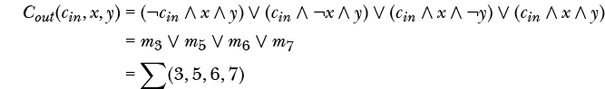

我们这里只是一个简单的例子。对于更复杂的函数，列出所有最小项容易出错。简化后的符号更易于操作，且有助于避免出错。

#### ***标准积或最大项积***

根据可用组件和个人选择等因素，设计师可能更倾向于处理当函数值为`0`而非`1`的情况。在我们的示例中，这意味着设计中指定了进位补码为`0`的情况。为了了解这个过程，接下来我们对指定进位的方程两边取补，运用德摩根定律：

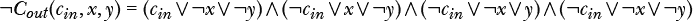

因为我们对方程两边取了补，所以现在得到的是¬*C[out]*的布尔方程，即进位的补码。因此，我们需要寻找使¬*C[out]*的值为`0`而非`1`的条件。在这个方程中，由于布尔运算符的优先级规则，括号是必需的。括号表示四个*和项*，即所有文字常量仅通过“或”运算进行处理的项。然后，四个和项通过“与”运算相乘。由于“与”运算类似于乘法，因此右侧称为*和项的积*，也可以说是*合取标准形式*。

每个和项都包含该方程中的所有变量，以文字形式（无补充或补充形式）。与 *最小项* 是指定变量的 2*^n* 种排列中的单一排列的 *积* 项不同，*最大项* 是指定这些排列之一的 *和* 项。通过将所有计算结果为 `0` 的最大项相乘（AND 运算），定义的布尔函数称为 *规范积*，即 *最大项积* 或 *完全合取范式*。

每个最大项都精确地标识出使该项在 OR 连接时计算结果为 `0` 的一组变量值。例如，前面方程中的最大项 (¬*c[in]* ∨ ¬*x* ∨ *y*) 只有在 *c[in]* = `1`，*x* = `1`，*y* = `0` 时计算结果为 `0`。但是，如果和项中没有包含问题中的所有变量，无论是原始形式还是补充形式，它总是会对多个变量值集合计算出 `0`。例如，和项 (¬*c[in]* ∨ ¬*x*) 对于此示例中的三个变量的两组值计算出 `0`，即 *c[in]* = `1`，*x* = `1`，*y* = `0` 和 *c[in]* = `1`，*x* = `1`，*y* = `1`。（我们称它们为 *最大* 项，因为它们最小化了计算为 `0` 的情况数量，从而 *最大化* 了计算为 `1` 的情况数量。）

与其写出函数中的所有文字，逻辑设计师通常使用符号 *M[i]* 来指定第 *i* 个最大项，其中 *i* 是由问题中文字值拼接而成的二进制数的整数值。例如，将 *c[in]* = `1`，*x* = `1`，*y* = `0` 拼接起来得到 `110`，这就是最大项 *M*[6]。表 4-7 中的真值表显示了导致进位为 `0` 的最大项。请注意，当 *c[in]* = `1`，*x* = `1`，*y* = `0` 时，最大项 *M*[6] = (¬*c[in]* ∨ ¬*x* ∨ *y*) 计算结果为 `0`。

表 4-7 显示了指定进位补码的三变量函数的所有八个可能的最大项。

**表 4-7：** 使进位补码为 `0` 的条件

| ***c******[in]*** | ***x*** | ***y*** | 最大项 | **¬*****C******[out]***(***c******[in]******, x, y***) |
| --- | --- | --- | --- | --- |
| `0` | `0` | `0` | *M*[0]     (*c[in]* ∨ *x* ∨ *y*) | `1` |
| `0` | `0` | `1` | *M*[1]     (*c[in]* ∨ *x* ∨ ¬*y*) | `1` |
| `0` | `1` | `0` | *M*[2]     (*c[in]* ∨ ¬*x* ∨ *y*) | `1` |
| `0` | `1` | `1` | *M*[3]     (*c[in]* ∨ ¬*x* ∨ ¬*y*) | `0` |
| `1` | `0` | `0` | *M*[4]     (¬*c[in]* ∨ *x* ∨ *y*) | `1` |
| `1` | `0` | `1` | *M*[5]     (¬*c[in]* ∨ *x* ∨ ¬*y*) | `0` |
| `1` | `1` | `0` | *M*[6]     (¬*c[in]* ∨ ¬*x* ∨ *y*) | `0` |
| `1` | `1` | `1` | *M*[7]     (¬*c[in]* ∨ ¬*x* ∨ ¬*y*) | `0` |

¬*C[out]*(*c[in]*, *x*, *y*) 列显示了我们的方程中哪些最大项导致其计算结果为 `0`。

使用这种符号表示法将布尔方程写成标准积形式，并使用∏符号表示乘法，我们可以将进位补函数重新表述为：

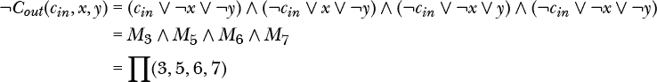

在表 4-7 中，你会看到这些条件导致进位补值为`0`，从而使进位为`1`。这表明，使用最小项或最大项是等效的。

#### ***标准布尔形式的比较***

表 4-8 显示了三变量问题的所有最小项和最大项。比较对应的最小项和最大项揭示了最小项和最大项的对偶性：可以通过使用德摩根定律，将每个变量取反并互换或门和与门来从另一项构造出对偶。

**表 4-8：** 三变量问题的标准项

| **最小项 = 1** | ***x*** | ***y*** | ***z*** | **最大项 = 0** |
| --- | --- | --- | --- | --- |
| *m*[0]     ¬*x* ∧ ¬*y* ∧ ¬*z* | `0` | `0` | `0` | *M*[0]     *x* ∨ *y* ∨ *z* |
| *m*[1]     ¬*x* ∧ ¬*y* ∧ *z* | `0` | `0` | `1` | *M*[1]     *x* ∨ *y* ∨ ¬*z* |
| *m*[2]     ¬*x* ∧ *y* ∧ ¬*z* | `0` | `1` | `0` | *M*[2]     *x* ∨ ¬*y* ∨*z* |
| *m*[3]     ¬*x* ∧ *y* ∧ *z* | `0` | `1` | `1` | *M*[3]     *x* ∨ ¬*y* ∨ ¬*z* |
| *m[4]*     *x* ∧ ¬*y* ∧ ¬*z* | `1` | `0` | `0` | *M*[4]     ¬*x* ∨ *y* ∨ *z* |
| *m*[5]     *x* ∧ ¬*y* ∧ *z* | `1` | `0` | `1` | *M*[5]     ¬*x* ∨ *y* ∨ ¬*z* |
| *m*[6]     *x* ∧ *y* ∧ ¬*z* | `1` | `1` | `0` | *M*[6]     ¬*x* ∨ ¬*y* ∨ *z* |
| *m*[7]     *x* ∧ *y* ∧ *z* | `1` | `1` | `1` | *M*[7]     ¬*x* ∨ ¬*y* ∨ ¬*z* |

图 4-4 中的维恩图提供了使用最小项和最大项这两个术语的原因的图示。

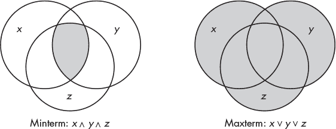

*图 4-4：三变量的最小项和最大项之间的关系*

标准形式给出了函数的完整且唯一的陈述，因为它们考虑了变量值的所有可能组合。然而，通常有更简化的解决方案。本章的其余部分将致力于布尔函数简化的方法。

### **布尔表达式简化**

在硬件中实现布尔函数时，每个∧运算符表示一个与门（AND gate），每个∨运算符表示一个或门（OR gate），每个¬运算符表示一个非门（NOT gate）。通常，硬件的复杂性与使用的与门和或门的数量有关（非门较简单，通常不会显著增加复杂性）。更简化的硬件使用更少的组件，从而节省成本和空间，并减少功耗。这些节省在手持设备和可穿戴设备中尤为重要。本节将介绍如何操作布尔表达式，以减少与门和或门的数量，从而简化硬件实现。

#### ***最简表达式***

在简化函数时，从规范形式之一开始，以确保你已考虑到所有可能的情况。为了将问题转化为规范形式，创建一个列出问题中所有可能组合的真值表。从真值表中，列出定义函数的最小项或最大项将变得容易。

拥有规范表达式后，下一步是寻找一个功能等价的*最小表达式*，这是一个使用最少字面量和布尔运算符实现与规范表达式相同功能的表达式。为了简化表达式，我们应用布尔代数规则，以减少项数和每个项中的字面量数量，而不改变表达式的逻辑意义。

最小表达式有两种类型，具体取决于是使用最小项（minterms）还是最大项（maxterms）：

**最小和积**

当从最小项描述问题时，最小表达式，称为 *最小和积*，是一个和积表达式，其中所有其他在数学上等价的和积表达式至少有与其相同数量的乘积项，且具有相同数量乘积项的表达式至少有与其相同数量的字面量。作为最小和积的一个例子，考虑以下方程：

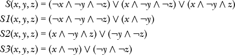

*S* 处于规范形式，因为每一个乘积项都明确显示了三个变量的贡献。其他三个函数是 *S* 的简化形式。尽管这三个函数的乘积项数量相同，*S3* 是 *S* 的最小和积，因为它的乘积项比 *S1* 和 *S2* 包含更少的字面量。

**最小积和**

当从最大项描述问题时，最小表达式，称为 *最小积和*，是一个积和表达式，其中所有其他在数学上等价的积和表达式至少有与其相同数量的和项，且具有相同数量和项的表达式至少有与其相同数量的字面量。作为最小积和的一个例子，考虑以下方程：

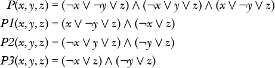 *P* 处于规范形式，其他三个函数是 *P* 的简化形式。尽管这三个函数的和项数量与 *P* 相同，*P3* 是 *P* 的最小积和，因为它的乘积项比 *P1* 和 *P2* 包含更少的字面量。

一个问题可能有多个最小解。良好的硬件设计通常涉及找到多个最小解，并在可用硬件的背景下评估每个解。这不仅仅是使用更少的门电路；例如，当我们讨论硬件实现时，你会学到，合理放置的非门（NOT gate）可以减少硬件复杂度。

在接下来的两部分中，你将学习找到最小表达式的两种方法。

#### ***使用代数运算进行最小化***

为了说明简化布尔函数复杂性的重要性，让我们回到进位函数：

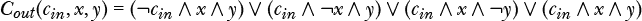

方程右侧的表达式是最小项的和。图 4-5 展示了实现此功能的电路。它需要四个与门和一个或门。与门输入端的小圆圈表示该输入处有一个非门。

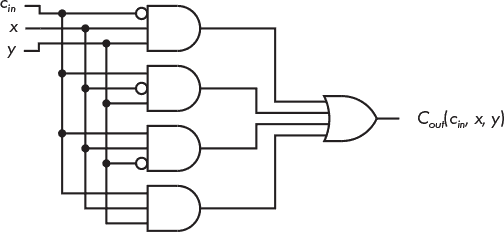

*图 4-5：生成加法两个数字时的进位值的硬件实现*

让我们尝试简化在图 4-5 中实现的布尔表达式，看看是否能减少硬件需求。请注意，可能没有单一的解决路径，也可能有多个正确的解决方案。我这里仅展示一种方式。

首先，我们将做一些看起来可能有些奇怪的事情。我们将使用幂等性规则，将第四项复制两次：

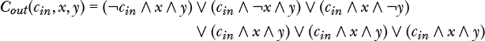 接下来，我们将稍微调整乘积项，以便将三个原始项中的每一项与(*c[in]* ∧ *x* ∧ *y*)进行或运算：

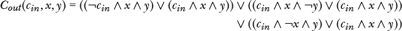

现在，我们可以使用与或分配规则，将与运算分配到或运算上，提取出与`1`的项：

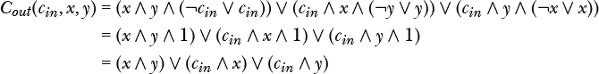

图 4-6 展示了这个功能的电路。我们不仅消除了一个与门，而且每个与门和或门的输入减少了一个。

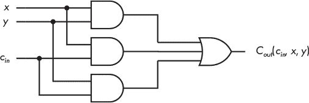

*图 4-6：简化的硬件实现，用于生成加法两个数字时的进位值*

比较图 4-5 和图 4-6 中的电路，我们可以看到布尔代数帮助我们简化了硬件实现。这种简化来自于用通俗的语言表达出导致进位为`1`的条件。方程的原始标准形式表示，当满足以下四种情况时，进位*C[out]*(*c[in]*, *x*, *y*)将为`1`：

如果*c[in]* = `0`，*x* = `1`，且*y* = `1`

如果*c[in]* = `1`，*x* = `0`，且*y* = `1`

如果*c[in]* = `1`，*x* = `1`，且*y* = `0`

如果*c[in]* = `1`，*x* = `1`，且*y* = `1`

最小化可以更简洁地表述：当*c[in]*、*x*和*y*中至少有两个为`1`时，进位为`1`。

**注意**

*这些指定加法进位的逻辑电路和第三章中的减法算法示例，展示了编程错误的常见来源之一。指定看似非常简单的活动，将其转换为计算机可以执行的简单逻辑步骤，可能是一个非常繁琐且容易出错的过程。*

我们通过从最小项和的形式开始，得到了 图 4-6 中的解；换句话说，我们处理的是生成进位 `1` 的 *c[in]*、*x* 和 *y* 的值。正如你在“标准积项或最大项积项”一节中所看到的 第 64 页，由于进位必须为 `1` 或 `0`，从生成进位补码 `0` 的 *c[in]*、*x* 和 *y* 的值出发，并将方程写成最大项的积项也是完全有效的。

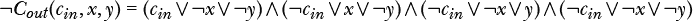

为了简化这个方程，我们将采取与最小项和相同的方法，首先将最后一项复制两次，得到：

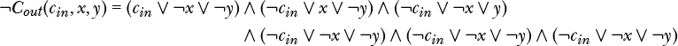

加入一些括号有助于澄清简化过程：

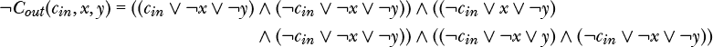

接下来，我们将使用 OR 对 AND 的分配。因为这比较复杂，我会详细讲解如何简化该方程中第一组积项的步骤；其他两个分组的步骤类似。OR 对 AND 的分配具有如下通用形式：

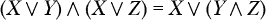

我们第一组中的和项共享一个 (¬*x* ∨ ¬*y*)，因此我们将在通用形式中进行以下替换：

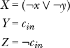

进行替换并使用 AND 的补码规则，我们得到：

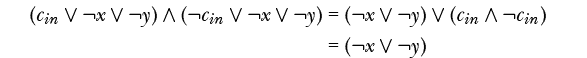

并且对其他两个分组应用相同的运算，我们得到：

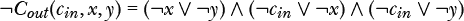

图 4-7 显示了该功能的电路实现。该电路生成进位的补码。我们需要对输出 ¬*C[out]*(*c[in]*, *x*, *y*) 进行补码运算，以获得进位的值。

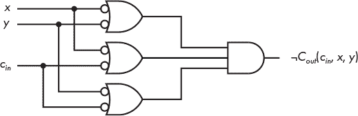

*图 4-7：当加法运算中生成进位的补码时，简化的硬件实现*

如果你比较 图 4-7 和 图 4-6，你可以从图形上看到德摩根定律，其中 OR 被转化为 AND，且输入值被取补。你可能会觉得 图 4-6 中的电路看起来更简单，因为 图 4-7 中的电路需要在六个输入 OR 门上加上 NOT 门。但正如你将在下一章中学到的那样，由于构建逻辑门的设备本身的电子特性，情况可能并非如此。

这里需要理解的一个重要观点是，解决问题的方法不止一种。硬件工程师的工作之一就是根据成本、组件可用性等因素，决定哪种解决方案最好。

#### ***使用卡诺图最小化***

用于最小化布尔函数的代数运算可能并不总是显而易见的。你可能会发现使用逻辑语句的图形表示更容易理解。

一个常用的图形工具用于处理布尔函数的是 *卡诺图*，也称为 *K-map*。卡诺图由摩里斯·卡诺（Maurice Karnaugh）于 1953 年发明，他是贝尔实验室的通信工程师，提供了一种可视化的方式来找到与代数方法相同的简化方式。它可以与乘积和（使用最小项）或和之积（使用最大项）一起使用。这里，我将展示它们的工作原理，从最小项开始。

##### **使用卡诺图简化乘积和之和**

卡诺图是一个矩形网格，每个最小项对应一个单元格。对于 *n* 个变量，共有 2*^n* 个单元格。图 4-8 是一个显示两个变量 *x* 和 *y* 的所有四个可能最小项的卡诺图。纵轴用于绘制 *x*，横轴用于绘制 *y*。每行的 *x* 值通过紧邻行左侧的数字（`0` 或 `1`）显示，每列的 *y* 值显示在列顶部。

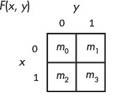

*图 4-8：两变量最小项在卡诺图中的映射*

为了说明如何使用卡诺图，我们来看一个两个变量的任意函数：

首先，在与方程中出现的每个最小项对应的单元格中放置`1`，如图 4-9 所示。

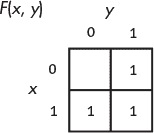

*图 4-9：任意函数* F*(*x*, *y*) *的卡诺图*

在与每个求值为`1`的最小项对应的单元格中放置`1`，图示了方程何时求值为`1`。右侧的两个单元格对应最小项*m*[1]和*m*[3]，（¬*x* ∧ *y*）和（*x* ∧ *y*）。由于这些项是按“或”运算组合的，只要其中一个最小项求值为`1`，*F*(*x*, *y*) 就求值为`1`。使用分配律和补充规则，我们得到结果：

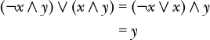

这在代数上显示，当 *y* 为`1`时，*F*(*x*, *y*) 的值为`1`，接下来通过简化此卡诺图你会看到这一点。

两个最小项（¬*x* ∧ *y*）和（*x* ∧ *y*）之间的唯一区别是从 *x* 变为 ¬*x*。卡诺图的排列方式使得仅有一个变量在共享边的两个单元格之间发生变化，这一要求称为*邻接规则*。

要使用卡诺图进行简化，您需要在和积卡诺图中将两个相邻的单元分组，这两个单元的值为`1`。然后，消除它们之间不同的变量，并将这两个积项合并在一起。重复此过程可以简化方程。每个分组都会在最终的和积表达式中消除一个积项。此方法可以扩展到有两个以上变量的方程，但所分组的单元数量必须是 2 的倍数，而且只能分组相邻的单元。邻接关系从边缘到边缘、从上下边界进行环绕。您可以在图 4-18 中看到一个例子，位置在第 79 页。

要查看这些操作如何运作，请参考图 4-10 中的卡诺图分组。

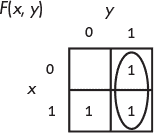

*图 4-10：*F*(*x, y*)中的两个最小项分组*

这个分组是我们之前所做的代数运算的图形表示，其中*F*(*x*, *y*)在*y* = `1`时为`1`，不管*x*的值是多少。因此，分组通过消除*x*将两个最小项合并成一个积项。

从上一个分组可以看出，我们的最终简化函数将包含*y*项。接下来，我们再做一个分组，找到下一个项。首先，我们将代数化简原始方程。返回到原始方程*F*(*x*, *y*)，我们可以使用幂等性规则来复制一个最小项：

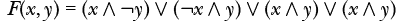

现在，我们将对第一个积项和我们刚刚添加的积项进行一些代数运算：

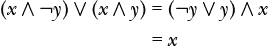

我们可以直接在卡诺图上进行操作，而不是使用代数运算，正如在图 4-11 中所示。该图显示了不同的分组可以包含相同的单元（最小项）。

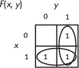

*图 4-11：一个卡诺图分组，显示（*x ∧ ¬y*）* ∨ (¬x ∧ y*)* ∨ *（*x ∧ y*）= *x ∨ y*

底行中的分组表示积项*x*，右列中的分组表示*y*，这为我们提供了以下最小化结果：

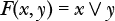 请注意，在两个分组中都包含的单元（*x* ∧ *y*）是我们在代数解法中通过幂等规则复制的项。您可以把将一个单元包含在多个分组中看作是添加该单元的副本，就像我们之前在代数运算中所做的那样，然后将它与组中的其他单元合并，从而将其移除。

当函数中只有两个变量时，邻接规则会自动满足。添加另一个变量后，我们需要考虑如何排序卡诺图中的单元，以便能够使用邻接规则来简化布尔表达式。

##### **卡诺图中的单元排序**

二进制码和二进制编码十进制（BCD）码的一个问题是，相邻值之间的差异通常涉及多个比特的变化。1943 年，弗兰克·格雷提出了一种编码，即*格雷码*，其中相邻值仅有一个比特不同。尽管在格雷码中编码值会使得算术运算变得复杂，但它简化了显示值之间的邻接关系，这帮助我们如何在卡诺图中排列单元格。

构造格雷码非常简单。首先从一个比特开始：

| **十进制** | **格雷码** |
| --- | --- |
| `0` | `0` |
| `1` | `1` |

添加一个比特，首先写出现有模式的镜像：

| **格雷码** |
| --- |
| `0` |
| `1` |
| `1` |
| `0` |

然后，在每个原始比特模式的前面加上一个`0`，并在镜像集的前面加上一个`1`，就得到了两位的格雷码，如表 4-9 所示。

**表 4-9：** 两位的格雷码

| **十进制** | **格雷码** |
| --- | --- |
| 0 | `00` |
| 1 | `01` |
| 2 | `11` |
| 3 | `10` |

这就是为什么格雷码有时被称为*反射二进制码（RBC）*的原因。表 4-10 展示了四位的格雷码。

**表 4-10：** 四位的格雷码

| **十进制** | **格雷码** | **二进制** |
| --- | --- | --- |
|   0 | `0000` | `0000` |
|   1 | `0001` | `0001` |
|   2 | `0011` | `0010` |
|   3 | `0010` | `0011` |
|   4 | `0110` | `0100` |
|   5 | `0111` | `0101` |
|   6 | `0101` | `0110` |
|   7 | `0100` | `0111` |
|   8 | `1100` | `1000` |
|   9 | `1101` | `1001` |
| 10 | `1111` | `1010` |
| 11 | `1110` | `1011` |
| 12 | `1010` | `1100` |
| 13 | `1011` | `1101` |
| 14 | `1001` | `1110` |
| 15 | `1000` | `1111` |

我们来比较表 4-10 中十进制值 7 和 8 的二进制码与格雷码。7 和 8 的二进制码分别是`0111`和`1000`；在十进制值只变化 1 时，所有四个比特都会改变。但是 7 和 8 的格雷码分别是`0100`和`1100`；只有一个比特发生变化，这符合卡诺图的邻接规则。

请注意，在相邻值之间只变化一个比特的模式，在比特模式回绕时也成立。也就是说，从最高值（四位时为 15）到最低值（0）时，只有一个比特发生变化。

##### **使用三变量卡诺图**

为了理解邻接性特性的重要性，我们来考虑一个更复杂的函数。我们将使用卡诺图来简化进位函数，该函数有三个变量。添加一个新变量意味着我们需要将单元格的数量翻倍以容纳最小项。为了保持图的二维结构，我们将新变量添加到已有的变量的一侧。我们需要总共八个单元格（2³），因此我们将其绘制为宽四格、高两格的形式。我们将 *z* 添加到 y 轴，并按照 图 4-12 所示，在卡诺图中将 *y* 和 *z* 放在水平轴上，*x* 放在垂直轴上。

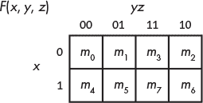

*图 4-12：三变量最小项的卡诺图映射*

三变量卡诺图上方的比特模式顺序是 `00`，`01`，`11`，`10`，与 表 4-9 中的格雷码顺序 `00`，`01`，`10`，`11` 不同。邻接规则在卡诺图的边缘也是适用的——即从 *m*[2] 到 *m*[0] 或从 *m*[6] 到 *m*[4]——这意味着组合可以跨越图的边缘。 （其他轴标记方案也可以使用，正如本节末尾所展示的那样。）

你在本章之前看到过，进位可以表示为四个最小项的和：

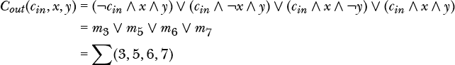

图 4-13 显示了这些四个最小项在卡诺图中的位置。

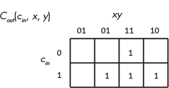

*图 4-13：进位函数的卡诺图*

我们寻找可以组合在一起的邻接单元格，从而消除乘积项中的一个变量。如前所述，这些组合可以重叠，得到如 图 4-14 所示的三组。

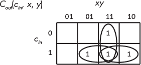

*图 4-14：进位函数的最小积和形式 =* 1

使用 图 4-14 中卡诺图的三组，我们得到与代数运算得到的相同的方程：

 ##### **使用卡诺图简化和积形式**

使用显示进位补集为 `0` 的函数也是有效的。我们使用最大项来做到这一点：

图 4-15 显示了三变量卡诺图中最大项的排列。

*图 4-15：三变量最大项的卡诺图映射*

在处理最大项表示法时，你标记出评估为 `0` 的单元格。最小化过程与处理最小项时相同，只不过你需要组合那些包含 `0` 的单元格。

图 4-16 显示了 ¬*C[out]*(*c[in]*, *x*, *y*)，即进位的补集的最小化。

*图 4-16：NOT 进位的最小和积形式的函数 =* 0

图 4-16 中的卡诺图得出了我们代数计算中得到的相同的和积形式，这个结果表示进位补码为`0`：

比较图 4-14 与图 4-16 可以清晰地展示德摩根定律。在进行此比较时，请记住，图 4-14 显示了需要加和的积项，图 4-16 显示了需要乘积的和项，结果是补码。因此，我们在从一个卡诺图转换到另一个时，会交换`0`和`1`，并交换与或运算。

为了进一步强调最小项与最大项的对偶性，可以对比图 4-17(a)与(b)。

*图 4-17： (a) 一个最小项与 (b) 一个最大项的比较*

图 4-17(a)显示了该函数：

尽管这不是必须的，通常也不这么做，但我们在每个表示未包含在该函数中的最小项的单元格中放置了`0`。

类似地，在图 4-17(b)中，我们在每个表示未包含在该函数中的最大项的单元格中放置了`1`：

这个比较直观地展示了最小项如何指定卡诺图中最少数量的`1`，而最大项如何指定最多数量的`1`。

##### **探索卡诺图中的更大组合**

到目前为止，我们在卡诺图中只将两个单元格组合在一起。在这里，我将展示一个更大组合的示例。考虑一个当 3 位数为偶数时输出`1`的函数。表 4-11 显示了真值表。它使用`1`表示数字为偶数，使用`0`表示奇数。

**表 4-11：3 位数字的偶数值**

| **最小项** | ***x*** | ***y*** | ***z*** | **数字** | ***偶数*** (***x, y, z***) |
| --- | --- | --- | --- | --- | --- |
| *m*[0] | `0` | `0` | `0` | 0 | `1` |
| *m*[1] | `0` | `0` | `1` | 1 | `0` |
| *m*[2] | `0` | `1` | `0` | 2 | `1` |
| *m*[3] | `0` | `1` | `1` | 3 | `0` |
| *m*[4] | `1` | `0` | `0` | 4 | `1` |
| *m*[5] | `1` | `0` | `1` | 5 | `0` |
| *m*[6] | `1` | `1` | `0` | 6 | `1` |
| *m*[7] | `1` | `1` | `1` | 7 | `0` |

该函数的标准积和形式为：

图 4-18 在卡诺图中显示了这些最小项，四个项被组合在一起。我们可以将所有四个项组合在一起，因为它们都有相邻的边。

*图 4-18：显示 3 位数字偶数值的卡诺图*

从图 4-18 中的卡诺图，我们可以写出当 3 位数为偶数时的方程式：

卡诺图显示，无论*x*和*y*的值如何，只要*z* = `0`即可。

##### **向卡诺图添加更多变量**

每次你向卡诺图中添加一个变量时，你需要将单元格的数量加倍。卡诺图工作的唯一要求是按照相邻规则排列最小项（或最大项）。图 4-19 显示了四变量卡诺图的最小项。*y* 和 *z* 变量位于横轴上，*w* 和 *x* 变量位于纵轴上。

*图 4-19：四变量最小项在卡诺图上的映射*

到目前为止，我们假设我们的函数中包含了每个最小项（或最大项）。但是设计并非在真空中进行的。我们可能知道整体设计中的其他组件，告知我们某些变量值的组合永远不会发生。接下来，我将向你展示如何在函数简化过程中考虑这一知识。卡诺图提供了一种特别清晰的方式来可视化这种情况。

##### **使用“无关”单元格**

有时，你会知道变量可能具有的值。如果你知道哪些值的组合永远不会发生，那么代表这些组合的最小项（或最大项）就不相关了。例如，你可能需要一个函数来指示两个可能事件中的一个是否发生，但你知道这两个事件不能同时发生。我们将这两个事件命名为 *x* 和 *y*，并让 `0` 表示事件未发生，`1` 表示事件已发生。表 4-12 显示了我们函数 *F*(*x*, *y*) 的真值表。

**表 4-12：** *x* 或 *y* 发生，但不同时发生的真值表

| ***x*** | ***y*** | ***F*** (**x**, **y**) |
| --- | --- | --- |
| `0` | `0` | `0` |
| `0` | `1` | `1` |
| `1` | `0` | `1` |
| `1` | `1` | × |

我们可以通过在该行中放置 *×* 来表明这两个事件不能同时发生。我们可以画出一个卡诺图，表示无法在系统中存在的最小项，并用 *×* 标记，如图 4-20 所示。*×* 代表一个 *无关* 单元格；将该单元格与其他单元格分组不会影响函数的求值。

*图 4-20：* F*(*x, y*) 的卡诺图，显示了一个“无关”单元格*

因为表示最小项 (*x* ∧ *y*) 的单元格是一个“无关”单元格，我们可以选择将其包括在内，或不包括在内，进行最简化分组，得到如图所示的两个分组。图 4-20 显示的卡诺图为我们提供了解决方案

这就是一个简单的或门。你可能已经猜到这个解决方案，而无需使用卡诺图。当你学习第七章末尾的两个数字逻辑电路设计时，你将看到“无关”单元格的更有趣应用。

卡诺图可以用于简化仅有两层逻辑的情况：与门组连接到或门，或门组连接到与门。正如你将在接下来的几章中看到的，大多数逻辑设计涉及超过两层的逻辑。卡诺图可以提供一些有用的指导，但你需要仔细考虑整体设计。你将会在 第六章 中看到一个使用卡诺图设计具有三层逻辑的加法器电路的例子。

### **组合基本布尔运算符**

如本章前面提到的，我们可以组合基本的布尔运算符来实现更复杂的布尔运算符。现在你已经知道如何处理布尔函数，我们将设计一个常见的运算符——*异或*，通常称为 *XOR*，并使用三种基本运算符：与门、或门和非门来实现它。它如此常用，以至于有了专用的电路符号。让我们来看一下：

**XOR**

XOR 是一个二元运算符。当且仅当两个操作数中有一个为 `1` 时，结果为 `1`；否则，结果为 `0`。我将使用 ⊻ 来表示 XOR 运算，也常用 ⊕ 符号。 图 4-21 展示了输入 *x* 和 *y* 的 XOR 门操作。

*图 4-21：作用于两个变量 *x* 和 *y* 的 XOR 门*

该操作的最小项实现为：

XOR 运算符可以通过两个与门、两个非门和一个或门实现，如 图 4-22 所示。

*图 4-22：由与门、或门和非门组成的 XOR 门*

我们当然可以设计更多的布尔运算符，但接下来的章节将继续学习如何使用简单的开关在硬件中实现这些运算符。正如你将发现的那样，你在本章学到的理想最简解决方案，可能并不总是最好的解决方案，因为涉及到开关的电气特性、逻辑层次的复杂性、硬件组件的可用性等因素。

**你的回合**

4.3     设计一个函数，检测所有的 4 位整数中偶数。

4.4     为该函数找出一个最简的积和表达式：

4.5     为该函数找出一个最简的和积表达式：

4.6     变量在卡诺图中的排列是任意的，但最小项（或最大项）需要与标记一致。使用 图 4-12 中的符号，标明每个最小项的位置：

4.7    卡诺图的变量排列是任意的，但最小项（或最大项）必须与标记一致。使用图 4-12 中的标记法，展示每个最小项的位置：

4.8    为五个变量创建卡诺图。你可能需要回顾表 4-10 中的格雷码，并将其扩展为五位。

4.9    设计一个逻辑函数，用于检测单一数字的质数。假设数字以 4 位 BCD 编码（见表 2-7）。该函数在每个质数上为`1`。

### **你学到了什么**

**布尔运算符**  三个基本的布尔运算符是 AND、OR 和 NOT。

**布尔代数规则**  布尔代数提供了一种数学方法来处理逻辑规则。AND 类似于乘法，OR 则类似于初等代数中的加法。

**简化布尔代数表达式**  布尔函数指定了计算机的功能。简化这些函数有助于实现更简洁的硬件设计。

**卡诺图**  这为简化布尔表达式提供了一种图形化的方法。

**格雷码**  这展示了如何在卡诺图中排列单元格。

**组合基本布尔运算符**  XOR 可以通过 AND、OR 和 NOT 运算符组合实现。

下一章将介绍基础电子学，为理解晶体管如何用作开关提供基础。从这一点出发，我们将探讨晶体管开关如何用来实现逻辑门。
