## 第五章：逻辑门**

在上一章，你学习了布尔代数表达式以及如何使用逻辑门实现它们。在这一章，你将学习如何使用*晶体管*在硬件中实现逻辑门，晶体管是用来实现我们在本书中讨论的开关的固态电子设备。

为了帮助你理解晶体管的工作原理，我们将从电子学的简单介绍开始。接下来，你将学习如何将晶体管成对连接，以实现更快的开关速度并减少电力消耗。我们将在本章的最后讨论一些关于使用晶体管构建逻辑门的实际注意事项。

### **电子学速成课程**

你不需要成为电气工程师就能理解逻辑门的工作原理，但理解一些基本概念会有所帮助。在本节中，我将简要介绍电子电路的基本概念。我们将从两个定义开始：

**电流** 指的是电荷的运动。电荷的单位是*库伦（C）*。1 库伦每秒（1 C/s）的流动定义为 1*安培（A）*，通常简写为*安*。电流只有在电路中从电源的一侧到另一侧有完全连接的路径时才会流动。

**电压** 也叫*电势差*，指的是电路中两个点之间每单位电荷的电能差。一*伏特（V）*定义为在导体（电流流经的介质）上两个点之间的电差，当 1 安培（A）的电流通过导体时，消耗 1 瓦特（W）的功率。

一台计算机由以下电子元件构成：

+   提供电力的电源

+   影响电流流动和电压水平的无源元件，但其特性无法被其他电子元件改变

+   在一个或多个电子元件的控制下，能够在电源、无源元件和其他有源元件的各种组合之间切换的有源元件

+   连接其他元件的导体

让我们来看一下这些电子元件如何工作。

#### ***电源和电池***

在几乎所有国家，电力以*交流电（AC）*的形式提供。对于交流电，电压大小与时间的关系图呈现正弦波形状。计算机电路使用*直流电（DC）*电源，直流电与交流电不同，不随时间变化。电源用于将交流电转换为直流电，如图 5-1 所示。

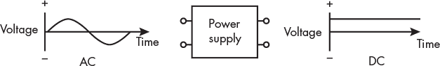

*图 5-1：交流电/直流电电源*

电池也提供直流电电源。在绘制电路时，我们将使用电池符号（图 5-2）来表示直流电源。图 5-2 中的电源提供 5 伏特直流电。

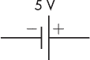

*图 5-2：5 V 直流电源的电路符号*

在之前的章节中，你已经看到计算机中发生的一切都是基于 `1` 和 `0` 的系统。但这些 `1` 和 `0` 是如何在物理上表示的呢？计算机电路通过区分两个不同的电压水平来表示逻辑 `0` 和逻辑 `1`。例如，逻辑 `0` 可能由 0 V 直流电表示，逻辑 `1` 由 5 V 直流电表示。反过来也可以实现：5 V 作为逻辑 `0`，0 V 作为逻辑 `1`。唯一的要求是硬件设计的一致性。幸运的是，程序员不需要关心实际使用的电压；这最好交给计算机硬件工程师处理。

**注意**

*电子设备被设计成在一定范围的电压下可靠工作。例如，一个设计为工作在标称 5 V 的设备，通常有 ±5% 的公差，即 4.75 V 到 5.25 V。*

计算机电路中的元件不断在两种电压水平之间切换。每次电压切换都需要时间，这限制了电路完成操作的速度。正如你将在“晶体管”一节中看到的，在第 96 页，加快切换时间会消耗更多的电力，并产生热量。过多的热量可能损坏元件，进而限制计算速度。电路元件的时间依赖特性是计算机硬件工程师设计时需要重点考虑的因素。我们将在下一节详细讨论这些特性。

#### ***无源元件***

所有电路都具有以下电磁特性，这些特性分布在整个电路中：

**电阻**   阻碍电流流动，从而消耗能量。电能转化为热能。

**电容**   将能量储存在电场中。电容两端的电压不能瞬间变化。

**电感**   将能量储存在磁场中。电流通过电感时不能瞬间变化。

储能为电场需要时间，因此*电容器阻碍电压随时间变化*。储能为磁场也需要时间，因此*电感阻碍电流随时间变化*。这两种特性与电阻一起被统称为*阻抗*。阻抗对变化的阻碍减慢了计算机中发生的开关操作，而电阻则消耗电能。我们将在本节余下的部分讨论这些特性的基本时序特性，但对于功耗的讨论会留给更深入的书籍。

为了感受这些属性的影响，我们将考虑用于将这些属性放置在电路中特定位置的离散电子设备：电阻器、电容器和电感器。这些属于一种称为*无源元件*的广泛电子元件类别，它们不能被电子控制；它们只是消耗或储存能量。图 5-3 显示了我们将在此讨论的无源电子设备的电路符号。

*图 5-3：无源设备的电路符号*

##### **开关**

*开关*有两种位置：开和关。在开的位置，两个端点之间没有连接，不发生导电。当开关关闭时，两个端点之间的连接完成，从而导电。图 5-3(a)中的符号通常表示手动操作的开关。在第 96 页的“晶体管”部分中，您将了解到计算机使用晶体管作为开关来控制开关的开闭，从而实现计算机的开/关逻辑。

##### **电阻器**

*电阻器*用于限制电路中特定位置的电流量。通过限制电流流入电容器或电感器，电阻器影响这些设备（在第 90 页的“电容器”部分和第 93 页的“电感器”部分讨论）的能量储存建立时间。电阻的大小通常与电容或电感的大小一起选择，以提供特定的时间特性。电阻器还用于将通过设备的电流限制到非破坏性的水平。

由于它限制电流流动，电阻器会不可逆地将电能转化为热能。与电容器或电感器不同，电阻器不会储存能量，后者可以在稍后的时间将储存的能量返回电路。

单个电阻器的电压与电流关系由*欧姆定律*给出，

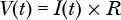 其中*V*(*t*)是时刻*t*电阻器两端的电压差，*I*(*t*)是时刻*t*流过电阻器的电流，*R*是电阻器的阻值。电阻器的阻值以*欧姆*为单位。

图 5-4 所示的电路图显示了两个电阻器通过开关连接到一个提供 5 伏电压的电源。希腊字母Ω用来表示欧姆，而 kΩ表示 10³欧姆。由于电流只能在闭合路径中流动，开关未闭合时电流不会流动。

*图 5-4：两个串联电阻器与电源和开关*

在图 5-4 中，两个电阻处于相同的路径上，因此当开关闭合时，相同的电流 *I* 会通过它们每一个。处于相同电流流动路径上的电阻称为*串联连接*。为了确定从电源流出的电流，我们需要计算电流路径中的总电阻。在这个例子中，这是两个电阻的总和：

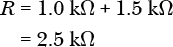

因此，5 V 电压应用于总计 2.5 kΩ 的电阻。解出 *I*，并省略 *t* 因为电源电压不随时间变化，得到：

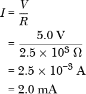

其中 mA 表示毫安。

我们现在可以通过将电阻值和电流相乘来确定图 5-4 中 A 点和 B 点之间的电压差：

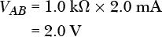

类似地，B 点和 C 点之间的电压差为：

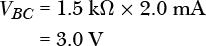 因此，将电阻串联连接起到*电压分配器*的作用，将 5 V 电压分配到两个电阻上：1.0 kΩ 电阻上的 2.0 V 和 1.5 kΩ 电阻上的 3.0 V。

图 5-5 显示了两个电阻*并联连接*的情况。

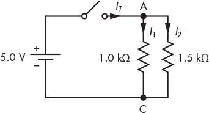

*图 5-5：两个电阻并联*

在图 5-5 中，当开关闭合时，电源的全部电压 5 V 被施加在 A 点和 C 点之间。因此，每个电阻两端都有 5 V 电压，我们可以使用欧姆定律来计算流过每个电阻的电流：

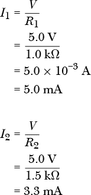

当开关闭合时，电源的总电流 *I[T]* = *I*[1] + *I*[2] 会在 A 点被分配到两个电阻上。它必须等于通过两个电阻的电流之和：

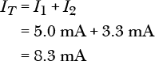

##### **电容器**

*电容器*以*电场*的形式储存能量，本质上是静止的电荷。电容器最初允许电流流入。但它不会提供持续的电流流动路径，而是储存电荷，形成电场，并导致电流随着时间减少。

由于建立电场需要时间，电容器常用于平滑电压的快速变化。当电流突然增加并流入电容器时，电容器会吸收电荷。然后，当电流突然减少时，电容器会释放储存的电荷。

电容器两端的电压随着时间变化，遵循以下规律：

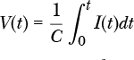

其中 *V*(*t*) 是电容器在时间 *t* 时的电压差，*I*(*t*) 是时间 *t* 时流过电容器的电流，*C* 是电容器的电容值，以*法拉*（F）为单位。

**注意**

*如果你还没有学习微积分，* ∫ *符号表示* 积分，*可以看作是“无限小求和。”这个方程说明，电压随着时间从 0 增加到当前时刻 *t* 时会逐步累积。你将在 图 5-7 中看到这个过程的图形视图。*

图 5-6 显示了一个 1.0 微法（μF）电容器通过 1.0 kΩ 电阻充电的过程。

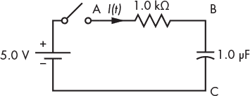

*图 5-6：电容器与电阻串联*

正如你将在本章后面看到的，这个电路是一个粗略模拟，模拟的是一个晶体管的输出连接到另一个晶体管的输入。第一个晶体管的输出（它就像 图 5-6 中的电源加电阻）具有电阻，第二个晶体管的输入具有电容。第二个晶体管的开关行为取决于（等效）电容器两端的电压 *V[BC]*(*t*) 达到阈值。

我们来看一下电容器两端电压达到阈值所需的时间。假设当开关第一次闭合时，电容器两端的电压 *V[BC]* 为 0 V，电流通过电阻流入电容器。电阻器两端的电压加上电容器两端的电压必须等于电源提供的电压。即：

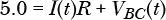

从电容器两端电压 *V[BC]* 为 0 V 开始，当开关首次闭合时，电源的完整 5.0 V 将出现在电阻器两端。因此，电路中的初始电流将为：

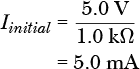 这种初始电流冲击电容器的过程导致电容器两端的电压逐渐升高，接近电源电压。前面的积分方程表明，随着电容器两端电压接近其最终值，电压的积累以指数方式减小。

随着电容器两端电压 *V[BC]*(*t*) 的增加，电阻器两端电压 *V[AB]*(*t*) 必须减少。当电容器两端的电压最终等于电源电压时，电阻器两端的电压为 0 V，电路中的电流为零。电流流动的指数递减速率由电阻值与电容值的乘积 *RC* 给出，称为*时间常数*。对于本例中的 *R* 和 *C* 值，我们得到：

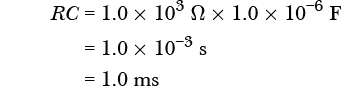

其中 s 为秒，ms 为毫秒。

假设在 图 5-6 中，当开关闭合时电容器两端电压为 0 V，那么电容器两端随时间变化的电压由下式给出：

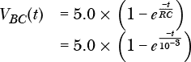

图 5-7 显示了图 5-6 中电路的图形表示。左侧的 y 轴表示电容器两端的电压，而右侧的 y 轴表示电阻器两端的电压。请注意，两个刻度方向相反。

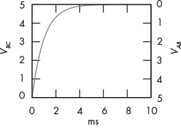

*图 5-7：电容器随时间充电*

在时间 *t* = 1.0 毫秒（一个时间常数）时，电容器两端的电压为：

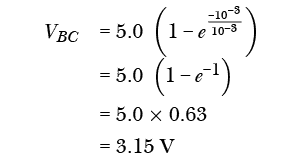

这超过了计算机中常用的典型晶体管的阈值电压。你将在本章稍后部分了解更多相关内容。

六个时间常数之后，电容器两端的电压为：

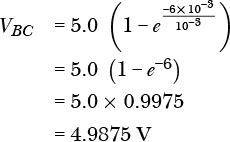

此时，电阻器两端的电压基本为 0 V，电流非常小。

##### **电感器**

一个*电感器*以*磁场*的形式储存能量，磁场是由运动中的电荷产生的。电感器最初会阻止电荷的流动，需要时间来建立磁场。通过提供电荷流动（电流）的连续路径，电感器创造出磁场。

在计算机中，电感器主要用于电源以及将电源与 CPU 连接的电路。如果你能看到计算机内部，你可能会在主板上靠近 CPU 的位置看到一个小型的（大约 1 厘米直径）环状设备，绕着它有电线。这是一个电感器，用于平滑供给 CPU 的电源。

尽管电感器或电容器都可以用来平滑电源，但电感器是通过抵抗电流变化来实现的，而电容器则是通过抵抗电压变化来实现的。关于选择使用哪个，或者是否同时使用它们来平滑电源的问题，超出了本书的范围。

在时间 *t* 时，电感器两端的电压 *V*(*t*) 与通过电感器的电流 *I*(*t*) 之间的关系为：

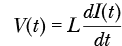

其中 *L* 是电感器的值，以*亨利 (H)* 为单位。

**注意**

*再次，我们在这里使用了一些微积分。* dI*(*t*)/*dt *表示微分，即* I*(*t*) 随时间 *t* 变化的速率。这个方程表示，时间 *t* 时的电压与该时刻 *I*(*t*) 的变化速率成正比。（你将在图 5-9 中看到这个图形表示。）*

图 5-8 显示了一个 1.0 μH 的电感器与一个 1.0 kΩ 的电阻器串联连接。

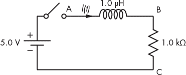

*图 5-8：电感器与电阻器串联*

当开关断开时，电流不会通过此电路。当开关闭合时，电感器最初会阻碍电流的流动，并且电感器中需要一定的时间来建立磁场。在开关关闭之前，电流未通过电阻器，因此电阻器两端的电压，*V[BC]*，为 0V。电感器两端的电压，*V[AB]*，为电源的完整 5V。随着电流开始流过电感器，电阻器两端的电压，*V[BC]*(*t*)，逐渐增大。这导致电感器两端的电压呈指数性下降。当电感器两端的电压最终达到 0V 时，电阻器两端的电压为 5V，电路中的电流为 5.0 mA。

指数电压下降的速率由时间常数*L*/*R*给出。使用图 5-8 中的*R*和*L*值，我们得到：

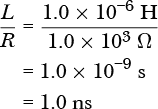

其中 ns 为纳秒。

当开关闭合时，电感器两端随时间变化的电压由以下公式给出：

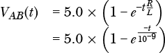

如图 5-9 所示，左侧的 y 轴显示了图 5-8 中电路的电阻器两端的电压，而右侧的 y 轴显示了电感器两端的电压。请注意，刻度的方向是相反的。

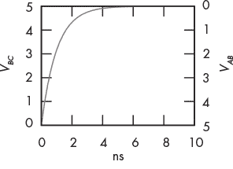

*图 5-9：电感器随时间充电*

在时间*t* = 1.0 ns（一个时间常数）时，电感器两端的电压为：

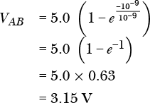大约经过 6 纳秒（六个时间常数）后，电感器两端的电压基本等于 0V。此时，电源的完整电压跨越电阻器，电流稳定为 5.0 mA。

图 5-8 中的电路展示了电感器如何与 CPU 电源一起使用。此电路中的电源模拟计算机电源，而电阻器模拟 CPU，CPU 从电源中消耗电能。电源产生的电压包含*噪声*，即叠加在直流电平上的小型高频波动。如图 5-9 所示，提供给 CPU 的电压，*V[BC]*(*t*)，在短时间内变化不大。串联在电源与 CPU 之间的电感器作用是平滑电压，供电给 CPU。

#### ***功率消耗***

硬件设计中一个重要的部分是功率消耗，尤其是在电池供电的设备中。在我们讨论的三种电磁属性中，电阻是主要的功率消耗者。

*能量*是引起变化的能力，而*功率*是衡量能量多快被用来产生变化的指标。能量的基本单位是*焦耳 (J)*。功率的基本单位是*瓦特 (W)*，它定义为每秒消耗 1 焦耳（J/s）。例如，我有一个备用电池，能存储 240 瓦时（Wh）的能量。这意味着它能储存足够的能量来提供 240 瓦特的功率持续 1 小时，或 240 Wh *×* 3,600 秒/小时 = 864,000 J。伏特和安培的单位被定义为 1 W = 1 V *×* 1 A。这导致了功率的公式，

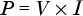

其中，*P*是所用功率，*V*是组件两端的电压，*I*是流过它的电流。

在短暂的充电时间后，电容器会阻止电流流动。这个方程表明，电容器的功率消耗随后趋近于零。充电电容器所使用的能量以电场的形式储存。类似地，电感器两端的电压在短暂充电时间后趋近于零，导致电感器消耗的功率为零。电感器将充电能量以磁场的形式储存。

然而，电阻器并不存储能量。只要电阻器两端存在电压差，电流就会流过它。

电阻器使用的功率，*R*，由以下公式给出：

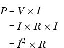

这些功率在电阻器中转化为热量。由于功率消耗与电流的平方成正比，一个常见的硬件设计目标是减少电流流动的量。

本节讨论了计算机工程师在其设计中包含的理想化的无源组件。在现实中，每个组件都包含电阻、电容和电感三个特性的元素，硬件设计工程师需要考虑这些。由于这些二次效应通常微妙且麻烦，设计时必须加以注意。

本章的其余部分将讨论*有源组件*，这些组件通过电子控制并用于实现构成计算机基础的开关。正如你将看到的，主动组件包括电阻和电容，它们影响所用电路的设计。

### **晶体管**

在前几章中，我将计算机描述为一组双态开关，并讨论了如何通过这些开关的设置 `0` 或 `1` 来表示数据。接着，我们探讨了如何使用逻辑门将`0`和`1`组合起来，实现逻辑功能。在本节中，你将学习如何使用晶体管实现构成计算机的双态开关。

*晶体管*是一种其电阻可以通过电子方式控制的设备，因此它是一个有源元件。电子控制的能力使得晶体管构成的开关与本章前面提到的可以机械控制的简单开关不同。在研究晶体管如何作为开关之前，让我们先看看如何使用机械的开关实现逻辑门。我们将使用 NOT 门作为示例。

图 5-10 显示了两个按钮开关串联连接在 5 V 和 0 V 之间。

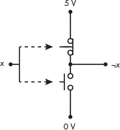

*图 5-10：由两个按钮开关组成的 NOT 门*

上面的开关是常闭的。当按下其按钮（从左侧）时，两个小圆圈之间的连接被断开，从而在此点上打开电路。下面的开关是常开的。当按下其按钮时，两个小圆圈之间建立连接，从而在此点上完成电路。

我们将 5 V 代表 `1`，0 V 代表 `0`。这个 NOT 门的输入 *x* 同时按下两个按钮。我们将以以下方式控制 *x*：当 *x* = `1` 时，我们按下这两个按钮；当 *x* = `0` 时，我们不按按钮。当按钮没有被按下时 (*x* = `0`)，5 V 会连接到输出端，¬*x*，表示 `1`。当按钮被按下时 (*x* = `1`)，5 V 被断开，0 V 连接到输出端，表示 `0`。因此，输入 `1` 会得到输出 `0`，输入 `0` 会得到输出 `1`。

早期的计算设备使用机械开关来实现其逻辑，但按照今天的标准，这些计算机的运算速度非常慢。现代计算机使用晶体管，晶体管是一种由半导体材料制成的电子设备，可以在电子控制下快速地在导通状态和非导通状态之间切换。

就像使用机械控制的按钮开关的示例一样，我们使用两种不同的电压来表示 `1` 和 `0`。例如，我们可能使用高电压，例如 +5 V，来表示 `1`，使用低电压，例如 0 V，来表示 `0`。但是，晶体管可以通过电子方式开关，这使得它们比最初计算机中使用的机械开关要快得多。晶体管还占用更少的空间，并且消耗更少的电力。

在接下来的章节中，我们将介绍现代计算机中常用的两种晶体管：MOSFET 开关和 CMOS 开关。

#### ***MOSFET 开关***

在当今计算机逻辑电路中，最常用的开关晶体管是*金属氧化物半导体场效应晶体管（MOSFET）*。MOSFET 有多种类型，使用不同的电压等级和极性。我将描述最常见的类型——*增强型 MOSFET*的行为，并将其他类型的详细内容留给更深入的书籍。在这里的简要讨论将帮助你理解它们的基本工作原理。

MOSFET 的基本材料通常是硅，它是一种*半导体*，意味着它能够导电，但导电性不强。通过添加杂质（这一过程称为*掺杂*）可以改善其导电性。根据杂质的类型，电导率可以是电子流动或缺少电子的流动（称为*空穴*）。由于电子带负电荷，因此导电子的类型被称为*N 型*，而导空穴的类型被称为*P 型*。MOSFET 的主要导电通道是*通道*，它连接在 MOSFET 的*源极*和*漏极*端子之间。*栅极*由相反类型的半导体材料构成，并控制通道中的导电性。

图 5-11 展示了两种基本的 MOSFET 类型：N-channel 和 P-channel。在这里，我展示了每个 MOSFET 如何通过电阻连接到 5 V 电源。

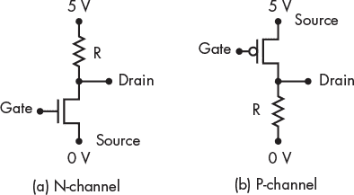

*图 5-11：两种基本类型的 MOSFET*

这些是简化的电路，目的是提供讨论 MOSFET 工作原理的背景。每个 MOSFET 有三个连接点或*端子*。栅极作为输入端子，施加在栅极上的电压（相对于施加在源极上的电压）控制通过 MOSFET 的电流流动。漏极作为输出端子。N-channel MOSFET 的源极连接到电源的低电压端，而 P-channel 的源极则连接到高电压端。

在学习了布尔代数中的补码之后，你可能不会对这两种类型的 MOSFET 具有互补的行为感到惊讶。你将在接下来的章节中看到我们如何将它们以互补对的方式连接，从而使得开关速度更快、效率更高，而不是仅使用一种类型。

首先，我们将研究每种 MOSFET 作为单一开关设备的工作方式，从 N-channel MOSFET 开始。

##### **N-channel MOSFET**

在图 5-11(a)中，N-channel MOSFET 的漏极通过电阻 R 与电源的 5 V 端连接，源极则连接到 0 V 端。

当加到栅极的电压相对于源极为正时，N 通道 MOSFET 的漏极和源极之间的电阻减小。当这个电压达到一个阈值，通常在 1 V 范围内时，电阻变得非常低，从而为漏极和源极之间的电流提供了一个良好的导电路径。由此产生的电路等效于图 5-12(a)。

在图 5-12(a)中，电流从电源的 5 V 连接流向 0 V 连接，通过电阻器 R。漏极的电压将为 0 V。这个电流流动的问题是电阻器消耗功率，简单地将其转化为热量。稍后你会看到我们为什么不希望通过增加电阻来限制电流流动，从而减少功耗。

*图 5-12：N 通道 MOSFET 开关等效电路：（a）开关闭合，（b）开关打开*

如果加到栅极的电压切换为几乎与加到源极的电压相同——在此例中为 0 V——则 MOSFET 关闭，产生如图 5-12(b)所示的等效电路。漏极通常连接到另一个 MOSFET 的栅极，当其从一种状态切换到另一种状态时，只会短暂地吸收电流。状态切换后的短暂时刻，漏极与另一个 MOSFET 栅极的连接不再吸收电流。由于没有电流流过电阻器，电阻器上没有电压差。因此，漏极的电压将为 5 V。

电阻器被认为是作为*上拉装置*起作用的，因为当 MOSFET 关闭时，电路通过电阻器完成，电阻器作用是将漏极的电压拉高到电源的高电压。

##### **P 通道 MOSFET**

现在，让我们看一下 P 通道 MOSFET，如图 5-11(b)所示。漏极通过电阻器 R 连接到低电压（0 V），源极连接到高电压电源（5 V）。当加到栅极的电压切换为几乎与加到源极的电压相同时，MOSFET 关闭。在这种情况下，电阻器作为*下拉装置*作用，将漏极的电压拉低到 0 V。图 5-13(a)显示了等效电路。

当加到栅极的电压相对于源极为负时，P 通道 MOSFET 的漏极和源极之间的电阻减小。当这个电压达到一个阈值，通常在 -1 V 范围内时，电阻变得非常低，为漏极和源极之间的电流提供了一个良好的导电路径。图 5-13(b)显示了当栅极相对于源极为 -5 V 时产生的等效电路。

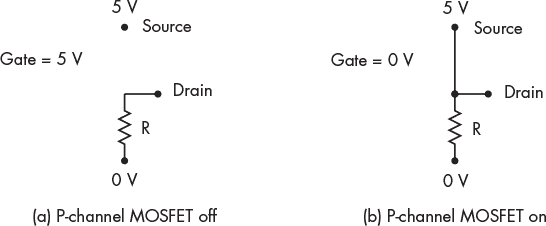

*图 5-13：P 型 MOSFET 开关等效电路：（a）开关打开，（b）开关关闭*

图 5-11 中的 MOSFET 电路电阻对两种 MOSFET 类型都存在一些问题。我们接下来将讨论这些问题。

##### **MOSFET 电路中的电阻**

图 5-12(a) 和 图 5-13(b) 中的等效电路显示，当相应的 MOSFET 处于开启状态时，它就像一个闭合的开关，从而导致电流流过上拉或下拉电阻。MOSFET 处于开启状态时，通过电阻的电流会消耗功率，这些功率会转化为热量。

除了 MOSFET 在开启状态时使用功率的上拉和下拉电阻外，这种硬件设计还有另一个问题。尽管 MOSFET 的栅极几乎不消耗电流以保持开启或关闭状态，但要改变其状态需要短暂的电流脉冲。这个电流由连接到栅极的设备提供，可能来自另一个 MOSFET 的漏极。在本书中我不打算深入细节，但可以说明，从另一个 MOSFET 的漏极提供的电流量通常受到其上拉或下拉电阻的限制。这个情况本质上与图 5-6 和 图 5-7 中的情形相同，您会看到电容充电所需的时间在电阻值较大时更长。

因此，这里有一个权衡：电阻越大，电流流动越小，这会减少 MOSFET 开启状态下的功耗。但较大的电阻也会减少漏极处可用电流的量，从而增加将 MOSFET 切换到漏极的时间。我们面临一个困境：小的上拉和下拉电阻增加功耗，但大的电阻会降低计算机的速度。

#### ***CMOS 开关***

我们可以通过 *互补金属氧化物半导体（CMOS）* 技术来解决这个困境。为了了解这个原理，让我们去除上拉和下拉电阻，并将 P 型和 N 型 MOSFET 的漏极连接起来。P 型 MOSFET 将替代 N 型电路中的上拉电阻，而 N 型 MOSFET 将替代 P 型电路中的下拉电阻。我们还将连接两个栅极，得到图 5-14 中所示的电路。

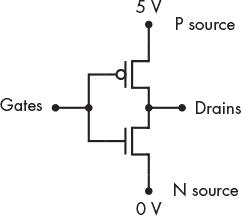

*图 5-14：CMOS 反相器（NOT）电路*

图 5-15(a) 显示了在较高电源电压 5 V 下的等效电路。上拉 MOSFET（P 通道）关闭，下拉 MOSFET（N 通道）打开，因此漏极被拉到较低的电源电压 0 V。在 图 5-15(b) 中，栅极处于较低的电源电压 0 V，这使得 P 通道 MOSFET 打开，而 N 通道 MOSFET 关闭。P 通道 MOSFET 将漏极拉到较高的电源电压 5 V。

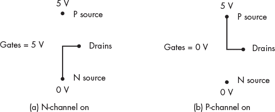

*图 5-15：一个 CMOS 反相器等效电路：（a）上拉开路，下拉闭路，（b）上拉闭路，下拉开路*

我在 表 5-1 中总结了这种行为。

**表 5-1：** 单个 CMOS 的真值表

| **门** | **漏极** |
| --- | --- |
| 0 V | 5 V |
| 5 V | 0 V |

如果我们将门连接作为输入，将漏极连接作为输出，并且让 5 V 为逻辑 `1`，0 V 为逻辑 `0`，那么 CMOS 实现了一个 NOT 门。

使用 CMOS 电路的两个主要优点是：

+   它们消耗的功率非常小。由于 N 通道和 P 通道 MOSFET 的开关速度差异，开关期间只会流过少量电流。较少的电流意味着较少的热量，这通常是芯片设计中的限制因素。

+   电路的响应速度更快。MOSFET 可以比电阻器更快地提供输出电流，进而充电下一个 MOSFET 的栅极。这使我们能够构建更快的计算机。

图 5-16 显示了一个使用三个 CMOS 实现的与门。

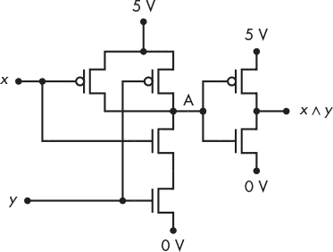

*图 5-16：使用三个 CMOS 晶体管的与门*

表 5-2 中的真值表显示了前两个 CMOS 的中间输出（图 5-16 中的 A 点）。

**表 5-2：** 图 5-16 中与门的真值表

| ***x*** | ***y*** | **A** | ***x ∧ y*** |
| --- | --- | --- | --- |
| `0` | `0` | `1` | `0` |
| `0` | `1` | `1` | `0` |
| `1` | `0` | `1` | `0` |
| `1` | `1` | `0` | `1` |

从真值表中，我们可以看到 A 点的信号是 ¬(*x* ∧ *y*)。A 点到输出的电路是一个 NOT 门。A 点的结果被称为 *NAND* 运算。它比与门少使用两个晶体管。我们将在下一节讨论这一点的含义。

### **NAND 和 NOR 门**

正如你在上一节中所学到的，晶体管的固有设计意味着大多数电路会反转信号。也就是说，对于大多数电路，输入端的高电压会在输出端产生低电压，反之亦然。因此，与门通常需要在输出端添加一个 NOT 门，以实现真正的与运算。

你还学到，使用 NAND 门生成 NOT(AND)比普通的 AND 门需要更少的晶体管。这种组合非常常见，以至于它有了一个名字：*NAND 门*。当然，我们还有一个与 OR 门等效的门，称为*NOR 门*：

**NAND**   一个二元运算符，只有在*两个*操作数都为`1`时才会返回`0`，否则返回`1`。我们将使用¬(*x* ∧ *y*)来表示 NAND 运算。图 5-17 展示了 NAND 门的硬件符号，并附有一个真值表，显示了其对输入*x*和*y*的操作。

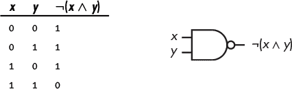

*图 5-17：NAND 门作用于两个变量，*x*和*y*

**NOR**   一个二元运算符，当至少一个操作数为`1`时，结果为`0`，否则结果为`1`。我们将使用¬(*x* ∨ *y*)来表示 NOR 运算。图 5-18 展示了 NOR 门的硬件符号，并附有一个真值表，显示了其对输入*x*和*y*的操作。

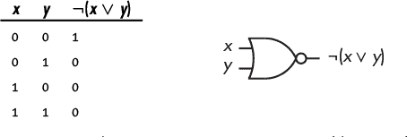

*图 5-18：NOR 门作用于两个变量，*x*和*y*

注意图 5-17 和图 5-18 中 NAND 门和 NOR 门输出端的小圆圈。这表示*NOT*，就像你在图 4-3 中看到的 NOT 门一样。

尽管在前一章中我们明确展示了当门的输入被补充时使用的 NOT 门，但通常会简单地在输入端使用这些小圆圈来表示补充。例如，图 5-19 显示了一个 OR 门，其两个输入都被补充。

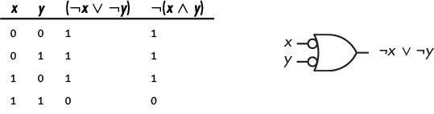

*图 5-19：NAND 门的另一种绘制方式*

如真值表所示，这是实现 NAND 门的另一种方式。正如你在第四章中学到的，德摩根定律证明了这一点：

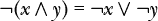

### **NAND 作为通用门**

关于 NAND 门的一个有趣特性是，它们可以用来构建 AND、OR 和 NOT 门。这意味着 NAND 门可以用于实现任何布尔函数。从这个角度看，你可以把 NAND 门看作是*通用门*。回想一下德摩根定律，NOR 门也可以作为通用门，这应该不会让你感到惊讶。但由于 CMOS 晶体管的物理特性，NAND 门更快且占用更少空间，因此几乎总是首选方案。

让我们了解如何使用 NAND 门构建 AND、OR 或 NOT 门。要使用 NAND 门构建 NOT 门，只需将信号连接到 NAND 门的两个输入端，如图 5-20 所示。

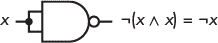

*图 5-20：由 NAND 门构建的 NOT 门*

要构建 AND 门，我们可以观察到图 5-21 中的第一个 NAND 门产生¬(*x* ∧ *y*)，并将其连接到一个如图 5-20 所示的 NOT 门，从而产生(*x* ∧ *y*)。

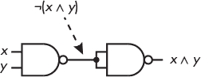

*图 5-21：由两个 NAND 门构建的与门（AND gate）*

我们可以使用德摩根定律（De Morgan's law）推导出一个或门（OR gate）。考虑以下内容：

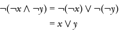

所以，为了实现或门（OR），我们需要三个 NAND 门，如图 5-22 所示。位于 *x* 和 *y* 输入的两个 NAND 门被连接成非门（NOT gates），产生 ¬*x* 和 ¬*y*，这会在第三个 NAND 门的输出端产生 ¬(¬*x* ∧ ¬*y*)。

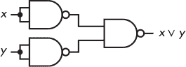

*图 5-22：由三个 NAND 门构建的或门（OR gate）*

看起来我们正在增加复杂性来用 NAND 门构建电路，但请考虑以下函数：

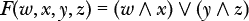

如果不了解逻辑门是如何构建的，那么用图 5-23 所示的电路来实现这个功能是合情合理的。

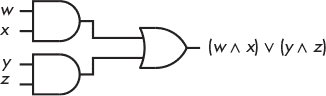

*图 5-23：使用两个与门（AND gates）和一个或门（OR gate）的 F*(*w, x, y, z*)*

虽然看起来我们可能走错了方向，但让我们给这个电路增加一些硬件。内卷性质表明 ¬(¬*x*) = *x*，因此我们可以在每个路径上添加两个非门（NOT gates），如图 5-24 所示。

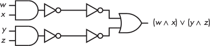

*图 5-24：使用两个与门（AND gates）、一个或门（OR gate）和四个非门（NOT gates）的 F*(*w, x, y, z*)*

比较在输入 *w*、*x*、*y* 和 *z* 上操作的两个与门（AND gate）/非门（NOT gate）组合与图 5-17，我们可以看到它们每一个实际上只是一个 NAND 门。它们将在两个最左边的非门输出中产生 ¬(*w* ∧ *x*) 和 ¬(*y* ∧ *z*)。

从图 5-19 中应用德摩根定律可以看到，(¬*a*) ∨ (¬*b*) = ¬(*a* ∧ *b*)。换句话说，我们可以用一个单一的 NAND 门替代两个最右边的非门和或门的组合：

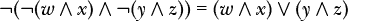

结果电路，如图 5-25 所示，使用了三个 NAND 门。

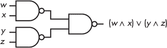

*图 5-25：使用三个 NAND 门的 F*(*w, x, y, z*)*

从简单地查看图 5-23 和图 5-25 中的逻辑电路图来看，可能会觉得我们在这个电路转换中没有获得什么。然而，我们在前一节中看到，一个 NAND 门（图 5-16 中的 A 点）比与门少用了两个晶体管。因此，NAND 门的实现更节能、速度更快，或门也是如此。

从与门（AND）/或门（OR）/非门（NOT）设计到只使用 NAND 门的转换非常简单：

1.  将该函数表示为最简的乘积和。

1.  将乘积（与（AND）项）和最终的和（或（OR））转换为 NAND 门。

1.  对于任何只有一个文字（literal）的乘积，添加一个 NAND 门。

我在这里说的关于 NAND 门的内容同样适用于 NOR 门。你只需应用德摩根定律来求得所有内容的补集。但如前所述，NAND 门通常比 NOR 门更快且占用更少的空间，因此几乎总是首选方案。

与软件一样，硬件设计是一个迭代过程。大多数问题没有唯一的解决方案，你通常需要开发多个设计，并在可用硬件的上下文中分析每一个设计。正如前面的例子所示，看起来相同的两个解决方案在硬件层面上可能是非常不同的。

**轮到你了**

5.1 使用 NOR 门设计一个 NOT 门、一个 AND 门和一个 OR 门。

5.2 设计一个使用 NAND 门的电路，检测两个 2 位整数 *x* 和 *y* 的“低于”条件，*F*(*x*, *y*) = 1。对于无符号整数比较，通常使用低于/高于，而对于有符号整数比较，通常使用小于/大于。

### **你学到的内容**

**基础电子学概念** 电阻、电容和电感会影响电子电路中的电压和电流流动。

**晶体管** 半导体器件，可以用作电子控制的开关。

**MOSFET** 用于计算机中实现逻辑门的最常用开关器件。金属氧化物半导体场效应晶体管有 N 型和 P 型两种类型。

**CMOS** N 型和 P 型 MOSFET 在互补配置中配对，以提高开关速度并减少功耗。

**NAND 和 NOR 门** 由于晶体管的固有电子特性，这些门比 AND 和 OR 门需要更少的晶体管。

在下一章中，你将学习如何将简单的逻辑门连接在电路中，以实现构建计算机所需的复杂操作。
