## 第六章：**6  

组合逻辑电路**  

  

在上一章中，你了解了计算机的基本组成部分——逻辑门。计算机是由逻辑门的组合构成的，这些逻辑门被称为*逻辑电路*，用于处理数字信息。  

在本章以及接下来的两章中，我们将探讨如何构建一些构成 CPU、内存和其他设备的逻辑电路。我不会描述这些单元的全部内容；相反，我们将查看其中的一些小部分，并讨论其背后的概念。目标是提供一个关于这些逻辑电路背后思想的入门概览。  

### **逻辑电路的两种类型**

逻辑电路有两种类型。*组合逻辑电路*的输出仅依赖于任何特定时刻给定的输入，而不依赖于任何先前的输入。*时序逻辑电路*的输出依赖于先前和当前的输入。  

为了阐明这两种类型，我们考虑一个电视遥控器。你可以通过在遥控器上输入数字来选择一个特定的频道。频道选择仅依赖于你输入的数字，而忽略了你之前正在查看的频道。因此，输入与输出之间的关系是组合的。  

遥控器还有一个输入，用于调节频道的升高或降低。这个输入依赖于先前选择的频道和之前上下频道按钮的序列。频道上下按钮展示了一个时序输入/输出的关系。  

我们将在下一章探讨时序逻辑电路。在本章中，我们将通过几个组合逻辑电路的例子来了解它们是如何工作的。  

**信号电压水平**  

电子逻辑电路用高电压或低电压来表示`1`和`0`。我们将表示`1`的电压称为*有效电压*。如果我们使用更高的电压来表示`1`，那么该信号称为*高电平有效*。如果我们使用较低的电压来表示`1`，那么该信号称为*低电平有效*。  

一个高电平信号可以连接到一个低电平输入，但硬件设计师必须考虑到这种差异。例如，如果所需的逻辑输入为低电平输入的是`1`，则所需电压是两种电压中较低的；如果连接到该输入的信号是高电平的，则逻辑`1`是两种电压中较高的，信号必须先被反向才能在低电平输入中被解释为`1`。  

我在本书中讨论逻辑电路时只使用逻辑电平——`0`和`1`——而避免使用硬件中实际的电压水平，但你应该了解这些术语，因为它们在与他人交谈或阅读组件规格书时可能会出现。  

### **加法器**  

我们将从 CPU 中执行的最基本操作之一开始：加法运算两个比特。我们的最终目标是加法运算两个 *n* 位数。  

从第二章回顾，二进制数中的位从右向左编号（最低有效位到最高有效位），从 0 开始。我将从展示如何在第*i*位位置添加两个位开始，并通过展示如何添加两个 4 位数并考虑每个位位置的进位来完成讨论。

#### ***半加器***

可以用几种电路进行加法运算。我们将从*半加器*开始，它简单地将一个数的当前位位置上的两个位相加（以二进制表示）。这在表 6-1 中的真值表中展示，其中*x[i]*是数*x*的第*i*位，*y[i]*列中的值表示数*y*的第*i*位。*Sum[i]*是数*Sum*的第*i*位，*Carry[i]* [+ 1]是从添加位*x[i]*和*y[i]*得到的进位。

**表 6-1:** 使用半加器添加两个位的真值表

| ***x******[i]*** | ***y******[i]*** | ***Carry*****[*i* + 1]** | ***Sum***[***i***] |
| --- | --- | --- | --- |
| `0` | `0` | `0` | `0` |
| `0` | `1` | `0` | `1` |
| `1` | `0` | `0` | `1` |
| `1` | `1` | `1` | `0` |

和是两个输入的异或，进位是两个输入的与。图 6-1 展示了半加器的逻辑电路。

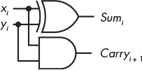

*图 6-1：半加器逻辑电路*

但这里有一个缺陷：半加器只能处理两个输入位。它可以用来添加两个数的同一位位置的两个位，但它不考虑可能来自下一个低阶位位置的进位。将此进位作为第三个输入包括进来将得到一个全加器。

#### ***全加器***

与半加器不同，*全加器*电路有三个 1 位输入：*Carry[i]*、*x[i]*和*y[i]*。*Carry[i]*是将两个上一个位位置的位相加时产生的进位（右边的位）。例如，如果我们正在添加位位置 5 的两个位，那么全加器的输入是位位置 5 的两个位加上位于位置 4 的进位。表 6-2 显示了结果。

**表 6-2:** 使用全加器添加两个位的真值表

| ***Carry****[i]*** | ***x******[i]*** | ***y****[i]*** | ***Carry***[***i*** + 1] | ***Sum***[***i***] |
| --- | --- | --- | --- | --- |
| `0` | `0` | `0` | `0` | `0` |
| `0` | `0` | `1` | `0` | `1` |
| `0` | `1` | `0` | `0` | `1` |
| `0` | `1` | `1` | `1` | `0` |
| `1` | `0` | `0` | `0` | `1` |
| `1` | `0` | `1` | `1` | `0` |
| `1` | `1` | `0` | `1` | `0` |
| `1` | `1` | `1` | `1` | `1` |

要设计一个全加器电路，我们从指定*Sum[i]*为`1`的函数开始，作为来自表 6-2 的积和项：

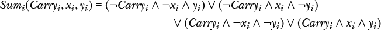

此方程式中没有明显的简化，因此让我们看看*Sum[i]*的卡诺图，如图 6-2 所示。

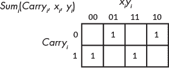

*图 6-2：三个比特的和的卡诺图，*进位[i]*，x[i]*和*y[i]*

在图 6-2 中没有明显的分组，因此我们剩下四个积项来计算前面方程中的*Sum[i]*。

你在第四章中学到，*进位[i]* + 1 可以通过以下方程表示：

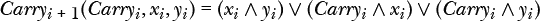

这两个函数共同构成了全加器的电路，如图 6-3 所示。

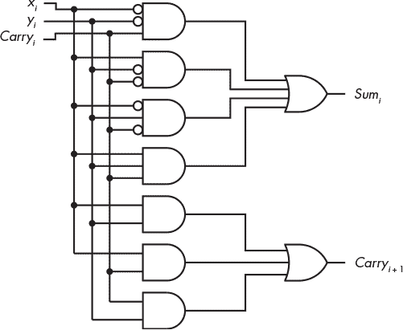

*图 6-3：全加器电路*

全加器使用九个逻辑门。在接下来的部分中，我们将看到是否能找到一个更简单的电路。

#### ***由两个半加器构成的全加器***

为了看是否能找到一个更简单的方案来加法两位和来自下一低阶位的进位，让我们回到*Sum[i]*的方程。利用分配法则，我们可以将其重新排列如下：

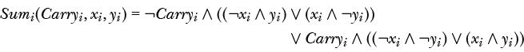

在第四章中，你学到了第一个积项中括号里的量是*x[i]*和*y[i]*的异或（XOR）：

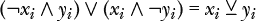

因此，我们得出：

让我们操作第二个积项中的括号里的量。回忆一下布尔代数中 *x ∧ ¬x* = 0，所以我们可以写出如下式子：

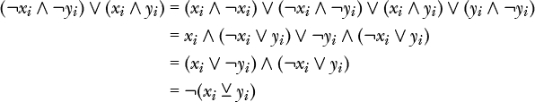

因此：

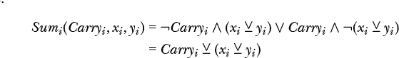

我们将进行一些操作，开发出一个*进位[i]* [+ 1]的布尔函数，这个操作可能会显得违反直觉。让我们从加法三个比特时的进位卡诺图开始（见图 4-14），但去除两个分组，如图 6-4 中虚线所示。

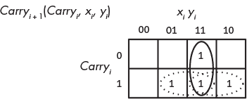

*图 6-4：来自图 4-14 的卡诺图，重新绘制去除了两个重叠分组（虚线）*

这将给我们以下方程：

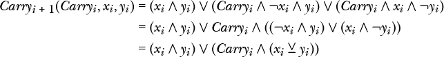 注意，这个方程中的两个项，(*x[i] ∧ y[i]*) 和 (*x[i]* ⊻ *y[i]*), 已经通过半加器生成（见图 6-1）。通过第二个半加器和一个或门，我们可以实现一个全加器，如图 6-5 所示。

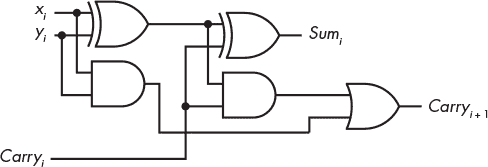

*图 6-5：使用两个半加器的全加器*

现在你应该理解了*半加器*和*全加器*这两个术语的来源。

更简单的电路不一定更好。事实上，我们不能仅凭观察图 6-3 和 6-5 中的两个全加器电路就判断哪一个更好。好的工程设计取决于许多因素，例如每个逻辑门的实现方式、逻辑门的成本及其可用性等等。我在这里展示了两种替代方案，以表明不同的方法可以导致不同但功能等效的设计。

#### ***波纹进位加法和减法电路***

现在你知道如何加两个给定位置的比特，并加上来自下一个低位位置的进位。但是大多数程序处理的数值都有很多比特，因此我们需要一种方法来加两个*n*位数的每个位的对应比特。这可以通过*n*位加法器来实现，它可以通过*n*个全加器来构建。图 6-6 展示了一个 4 位加法器。

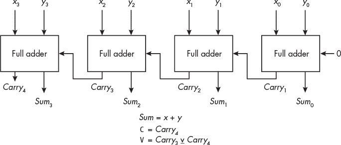

*图 6-6：一个 4 位加法器*

加法从右侧的全加器开始，接收两个最低位的比特，*x*[0]和*y*[0]。由于这是最低位，因此没有进位，*c*[0] = `0`。该位的和是*s*[0]，并且来自此加法的进位*c*[1]被连接到左侧下一个全加器的进位输入，在那里它与*x*[1]和*y*[1]相加。因此，第*i*个全加器将操作数的两个*i*位加起来，并加上来自(*i* - 1)个全加器的进位（其值为`0`或`1`）。

每个全加器处理一个比特（通常称为*切片*）的总宽度。每个位位置的进位将加到下一个更高位位置的比特上。加法过程从最低位流向最高位，以一种波动效应进行，这也赋予了这种加法方法名称——*波纹进位加法*。

请注意，在图 6-6 中，我们有`C`和`V`，分别是*进位标志*和*溢出标志*。你在第三章中已经学习了进位和溢出。AArch64 架构包括记录进位和溢出是否发生的加法和减法指令。你将在第九章中学到更多内容。

让我们看看如何使用类似的思路来实现减法。回想一下，在二进制补码表示法中，一个数的负值是通过取它的二进制补码，翻转所有位并加上`1`来实现的。因此，我们可以通过以下方式从*x*中减去*y*：

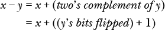

如果我们对每个*y[i]*取反，并将初始进位设为`1`，而不是`0`，那么我们就可以在图 6-5 中的加法器实现减法。每个*y[i]*可以通过与`1`进行异或操作来取反。这就得到了图 6-7 中的 4 位电路，当*func* = `0`时，它会加两个 4 位数，当*func* = `1`时，它会减这两个数。

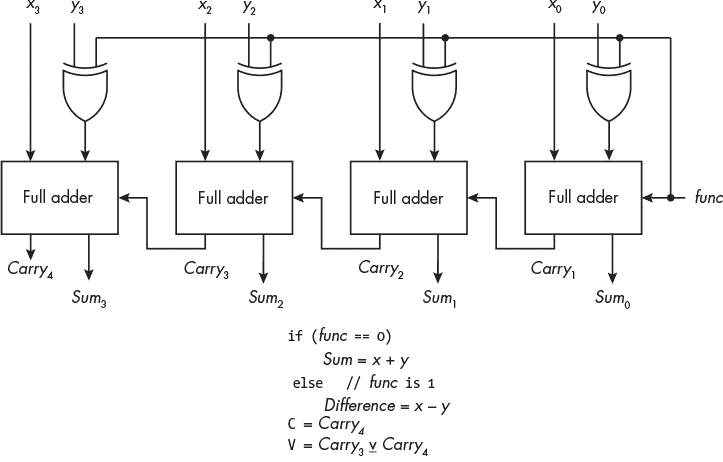

*图 6-7：一个 4 位加法器/减法器*

当然，在从右到左计算和时会有时间延迟。通过电路设计，利用已知的中间进位值 *c[i]*，可以显著减少计算时间，但我在本书中不会详细讲解这些细节。让我们转到下一个电路类型。

**你的回合**

6.1 在第三章中，你学习了进位标志（`C`）和溢出标志（`V`）。CPU 还具有零标志（`Z`）和负标志（`N`）。当算术操作的结果为零时，`Z` 标志为 `1`；如果结果是负数，并且该数字被认为是二补码表示，则 `N` 标志为 `1`。设计一个电路，使用图 6-7 中的全加器输出，*s*[0]、*s*[1]、*s*[2]、*s*[3]、*c*[3] 和 *c*[4]，并输出 `C`、`V`、`N` 和 `Z` 标志。

### **解码器**

计算机中的许多地方需要根据一个数字选择多个连接中的一个。例如，正如你将在第八章中看到的，CPU 有一小部分组织成 *寄存器* 的内存，用于计算。AArch64 架构提供了 31 个通用的 64 位寄存器。如果一条指令使用其中一个寄存器，则必须使用指令中的 5 位来选择应该使用哪个 31 个寄存器之一。

这个选择可以通过 *解码器* 完成。解码器的输入是寄存器的 4 位数字，输出是连接到指定寄存器的 16 个可能连接中的一个。

解码器有 *n* 个二进制输入，可以产生最多 2*^n* 个二进制输出。最常见的解码器类型，有时称为 *线路解码器*，它根据每个输入位模式只选择一个输出线并将其设为 `1`。解码器通常还包括一个 *使能* 输入。表 6-3 是一个带有 *使能* 输入的 3×8（三个输入，八个输出）解码器的真值表，展示了其工作原理。

**表 6-3：** 带有*使能*的 3×8 解码器真值表

|  | **输入** | **输出** |
| --- | --- | --- |
| ***使能*** | ***x***[2] | ***x***[1] | ***x***[0] | ***y***[7] | ***y***[6] | ***y***[5] | ***y***[4] | ***y***[3] | ***y***[2] | ***y***[1] | ***y***[0] |
| --- | --- | --- | --- | --- | --- | --- | --- | --- | --- | --- | --- |
| `0` | `0` | `0` | `0` | `0` | `0` | `0` | `0` | `0` | `0` | `0` | `0` |
| `0` | `0` | `0` | `1` | `0` | `0` | `0` | `0` | `0` | `0` | `0` | `0` |
| `0` | `0` | `1` | `0` | `0` | `0` | `0` | `0` | `0` | `0` | `0` | `0` |
| `0` | `0` | `1` | `1` | `0` | `0` | `0` | `0` | `0` | `0` | `0` | `0` |
| `0` | `1` | `0` | `0` | `0` | `0` | `0` | `0` | `0` | `0` | `0` | `0` |
| `0` | `1` | `0` | `1` | `0` | `0` | `0` | `0` | `0` | `0` | `0` | `0` |
| `0` | `1` | `1` | `0` | `0` | `0` | `0` | `0` | `0` | `0` | `0` | `0` |
| `0` | `1` | `1` | `1` | `0` | `0` | `0` | `0` | `0` | `0` | `0` | `0` |
| `1` | `0` | `0` | `0` | `0` | `0` | `0` | `0` | `0` | `0` | `0` | `1` |
| `1` | `0` | `0` | `1` | `0` | `0` | `0` | `0` | `0` | `0` | `1` | `0` |
| `1` | `0` | `1` | `0` | `0` | `0` | `0` | `0` | `0` | `1` | `0` | `0` |
| `1` | `0` | `1` | `1` | `0` | `0` | `0` | `0` | `1` | `0` | `0` | `0` |
| `1` | `1` | `0` | `0` | `0` | `0` | `0` | `1` | `0` | `0` | `0` | `0` |
| `1` | `1` | `0` | `1` | `0` | `0` | `1` | `0` | `0` | `0` | `0` | `0` |
| `1` | `1` | `1` | `0` | `0` | `1` | `0` | `0` | `0` | `0` | `0` | `0` |
| `1` | `1` | `1` | `1` | `1` | `0` | `0` | `0` | `0` | `0` | `0` | `0` |

当 *Enable* = `0` 时，所有输出线都是 `0`。当 *Enable* = `1` 时，输入的 3 位数 *x* = *x*[2]*x*[1]*x*[0] 会选择哪个输出线被设置为 `1`。因此，该解码器可用于用 3 位数字选择八个寄存器中的一个。（我这里没有使用 AArch64 架构中的所有 31 个寄存器，以保持表格的合理大小。）

在表 6-3 中指定的 3×8 行解码器可以通过四输入与门实现，如图 6-8 所示。

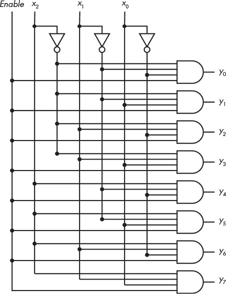

*图 6-8：带有 Enable 的 3×8 解码器电路*

解码器比初看起来的更具多功能性。每一个可能的输入可以视为一个最小项（如需复习最小项，参见第四章中的“标准和或最小项”部分，见第 62 页）。表 6-3 中的行解码器显示，当最小项为 `1` 且 *Enable* 为 `1` 时，只有一个输出为 `1`。因此，解码器可以看作是一个“最小项生成器”。

我们从第四章知道，任何逻辑表达式都可以表示为最小项的或，因此可以通过对解码器的输出进行或运算来实现任何逻辑表达式。例如，如果回顾全加器的卡诺图（参见图 6-2 和图 6-4），你可能会看到 *Sum[i]*(*Carry[i]*, *x[i]*, *y[i]*) 和 *Carry**i* + 1 可以表示为最小项的或运算，

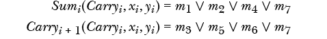

其中，下标 *i* 表示 *x*、*y* 和 *Carry* 的位切片，*m* 上的下标是最小项符号的一部分。

我们可以用 3×8 解码器和两个四输入或门实现全加器的每个位切片，如图 6-9 所示。一个 *n* 位加法器需要 *n* 个这样的电路。

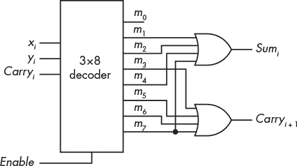

*图 6-9：用 3×8 解码器实现的全加器的 1 位切片*

图 6-8 中的解码器电路需要八个与门和三个非门。图 6-9 中的全加器增加了两个或门，总共需要 13 个逻辑门。与图 6-5 中的全加器设计相比，该设计仅需要五个逻辑门（两个异或门、两个与门和一个或门），看起来使用解码器构建全加器会增加电路的复杂性。然而，请记住，设计必须考虑其他因素，如元件的可用性、元件成本等。

**轮到你了**

6.2    你可能见过七段显示器，它们用于显示数字。七段显示器中的每个段通过将`1`应用到连接该段的输入引脚来点亮。假设你有一个 8 位输入的七段显示器，它点亮段和小数点，如下图所示：

例如，你可以使用位模式`0110 1101`显示数字 5。然而，写一个程序使用 BCD 编码来表示单个数字会更方便。设计一个解码器，将 BCD 中的数字转换为七段显示器上的段模式。

### **多路复用器**

在前一节中，你了解了如何使用*n*位数来选择应设置为`1`的 2*^n*个输出线路中的一个。相反的情况也会发生，即我们需要选择哪些输入应该被传递。例如，在进行加法等算术操作时，数字可能来自 CPU 内部的不同位置。（你将在接下来的几章中学习更多内容。）操作本身将由一个算术单元执行，而 CPU 需要从所有可能的位置中选择操作的输入。

能够做出这种选择的设备叫做*多路复用器（MUX）*。它可以通过使用*n*个选择线路，在 2*^n*个输入线路之间切换。图 6-10 展示了一个四路多路复用器的电路。

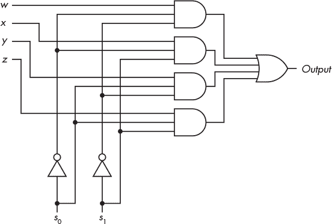

*图 6-10：四路多路复用器电路*

输出为：

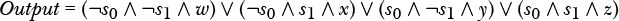

在使用与门和或门时，随着输入数量的增加，实施一个多路复用器所需的晶体管数量会变得很大。每个输入到多路复用器的输入都需要一个三输入与门，每个与门的输出连接到或门的一个输入。所以，或门的输入数量等于多路复用器的输入数量。

这个四路多路复用器需要一个四输入的或门。如果我们尝试扩大规模，*n*输入的或门将为较大的*n*带来一些技术电子问题。通过使用一种能够断开其输出信号与输入信号连接的门，可以避免使用*n*输入的或门，接下来我们将讨论这种门。

### **三态缓冲器**

被称为*三态缓冲器*的逻辑门有三个可能的输出：`0`、`1`和“无连接”。“无连接”输出实际上是一个高阻抗连接，也称为*高 Z*或*开放*。三态缓冲器有一个数据输入和一个*Enable*输入，其行为如图 6-11 所示。

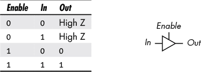

*图 6-11：三态缓冲器*

当*Enable* = `1`时，输出等于输入，并且连接到三态缓冲器之后的电路元件上。但当*Enable* = `0`时，输出实际上是断开的。这与`0`不同，断开意味着它对连接的电路元件没有任何影响。

“无连接”输出使我们可以物理连接多个三态缓冲器的输出，但只选择其中一个将其输入传递到公共输出线上。图 6-12 中的四路多路复用器展示了我们如何通过使用*n*个三态缓冲器来避免使用*n*输入的或门。

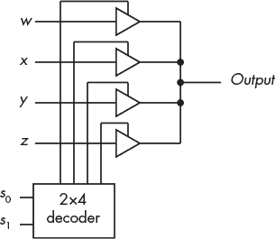

*图 6-12：由解码器和三态缓冲器构建的四路多路复用器*

图 6-12 中的 2×4 解码器选择连接输入*w*、*x*、*y*或*z*的三态缓冲器，以将其中一个输入连接到输出，形成四路多路复用器。图 6-13 展示了多路复用器使用的电路符号，以及展示其行为的真值表。

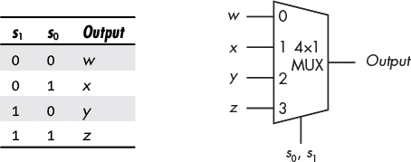

*图 6-13：四路多路复用器*

作为一个使用这种四路多路复用器的例子，考虑一台有四个寄存器和一个加法器的计算机。我们将寄存器命名为*w*、*x*、*y* 和 *z*。如果我们将每个寄存器中对应位置的比特连接到多路复用器，那么我们可以使用 2 位选择器*s*[1]*s*[0]来选择哪个寄存器将提供输入给加法器。例如，位置 5 的每个比特，*w*[5]、*x*[5]、*y*[5] 和 *z*[5]，将连接到多路复用器 5 的一个输入。如果*s*[1]*s*[0] = `10`，则加法器的输入将是*y*[5]。

### **可编程逻辑器件**

到目前为止，我们讨论的是使用单独逻辑门的硬件设计。如果设计发生变化，逻辑门的配置也会发生变化。这几乎总是意味着承载逻辑门并将它们连接起来的电路板需要重新设计。变化也通常意味着需要订购不同类型的逻辑门，这可能既昂贵又需要时间。通过使用*可编程逻辑器件（PLDs）*来实现所需的逻辑功能，可以减少这些问题。

PLD 包含许多 AND 门和 OR 门，可以编程实现布尔函数。输入及其补码值连接到 AND 门。所有 AND 门一起称为*AND 平面*或*AND 阵列*。从 AND 门输出的信号连接到 OR 门，所有 OR 门一起称为*OR 平面*或*OR 阵列*。根据类型，一个或两个平面可以编程实现组合逻辑。在使用 PLD 时，设计变更仅需要改变设备的编程方式，而不是购买不同的设备，这意味着电路板无需重新设计。

PLD 有多种类型。大多数可以由用户编程。有些在制造时预编程，有些甚至可以由用户擦除和重新编程。编程技术范围从指定制造掩模（对于预编程设备）到廉价的电子编程系统。在本节中，我们将看看 PLD 的三个主要类别。

#### ***可编程逻辑阵列***

在*可编程逻辑阵列（PLA）*中，AND 平面和 OR 平面都是可编程的。PLA 用于实现逻辑函数。图 6-14 提供了具有两个输入变量和这些变量两种可能输出函数的 PLA 的一般思路。

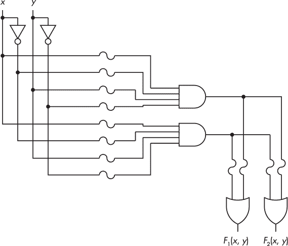

*图 6-14：可编程逻辑阵列的简化电路*

每个输入变量，无论是其未补码形式还是补码形式，都通过保险丝输入到 AND 门中。*保险丝*是用于保护电路的薄导体片。如果通过它的电流足够大，导体会熔化，打开电路并停止电流流动。可编程逻辑器件可以通过断开（或*烧断*）适当的保险丝来编程，从而移除输入到逻辑门的信号。某些设备使用*反保险丝*代替保险丝；这些通常是开路的，编程它们意味着完成连接而不是移除连接。可以重新编程的设备具有可以烧断然后再连接的保险丝。

在图 6-14 中，电路图中的 S 形线代表保险丝。这些保险丝可以被烧断或保持不变，以便编程每个 AND 门输出输入变量*x*,¬*x*, *y*, 和 ¬*y*的乘积。由于每个输入及其补码都作为输入到每个 AND 门中，任何 AND 门都可以被编程以输出一个最小项。

由 AND 门平面产生的乘积连接到 OR 门的输入，同样通过保险丝。因此，根据哪些 OR 门的保险丝保持不变，每个 OR 门的输出就是一个乘积和的总和。可能还有额外的逻辑电路用于选择不同的输出之间。您已经看到，任何布尔函数都可以表达为乘积和，因此通过烧断保险丝，此逻辑器件可以编程实现任何布尔函数。

一个 PLA 通常比图 6-14 中显示的更大，后者已经复杂到难以绘制。为了简化绘制，通常使用类似图 6-15 的示意图来指定设计。

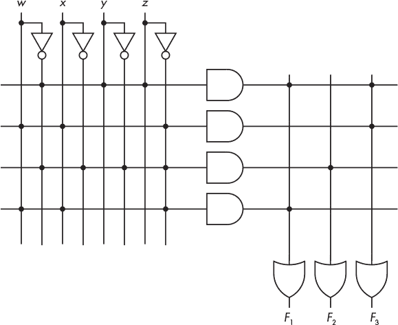

*图 6-15：可编程逻辑阵列的示意图，其中的点表示连接*

这个图可能有点难以理解。在图 6-14 中，每个与门有多个输入：每个变量一个，每个变量的补集一个。在图 6-15 中，我们使用一条单独的水平线连接到每个与门的输入，以表示多根导线（变量和补集），因此图 6-15 中的每个与门有八个输入，尽管我们只画了一条线。

垂直线和水平线交点处的点表示保险丝未被切断的地方，从而形成连接。例如，最上方水平线上的三个点表示有三个输入连接到那个与门。最上方与门的输出为：

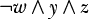

再次参考图 6-14，你可以看到每个与门的输出都连接到每个或门（通过保险丝）。因此，或门也有多个输入——每个与门一个——而通向或门输入的垂直线代表多根导线。图 6-15 中的 PLA 已被编程以提供以下三种功能：

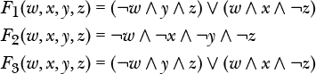

由于与门阵列可以产生所有可能的最小项，而或门阵列可以提供任何最小项的和，PLA 可以用来实现任何可能的逻辑功能。如果我们想改变功能，只需简单地编程另一个 PLA 并替换旧的即可。

#### ***只读存储器***

虽然 PLD 没有内存（意味着当前状态不受输入先前状态的影响），但它们可以用来制造*非易失性*内存——即在断电时仍能保持内容的内存。*只读存储器（ROM）*用于存储比特模式，这些模式可以表示数据或程序指令。程序只能读取存储在 ROM 中的数据或程序；ROM 的内容不能通过写入新的数据或程序指令来改变。ROM 通常用于具有固定功能集的设备中，如手表、汽车发动机控制单元和家电。事实上，我们的生活中充满了由存储在 ROM 中的程序控制的设备。

ROM 可以作为 PLD 实现，其中只有或门平面可以编程。与门平面保持连接，提供所有最小项。我们可以将 ROM 的输入视为地址；然后，或门平面被编程以在每个地址提供位模式。例如，在图 6-16 中示意的 ROM 设备有两个输入，*a*[1]和*a*[0]，它们提供一个 2 位的地址。

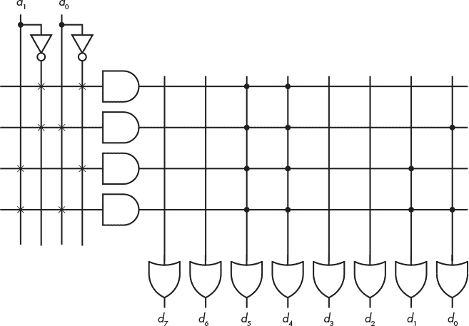

*图 6-16：一个 4 字节 ROM 设备*

在图 6-16 中的*×*连接表示永久连接，显示与门平面是固定的。每个与门在 ROM 设备中的每个地址生成一个最小项。或门平面可以生成最多 2*^n*个 8 位字节，其中 *n* 是输入到与门平面的地址输入位数。到或门的连接（点）表示存储在相应地址的位模式。表 6-4 显示了一个 ROM 设备，其中或门平面已经被编程为存储四个字符 0、1、2 和 3（以 ASCII 码表示）。

**表 6-4：** 一个存储四个 ASCII 字符的 ROM 设备

| **最小项** | **地址** | **内容** | **ASCII 字符** |
| --- | --- | --- | --- |
| ¬*a*[1]¬*a*[0] | `00` | `00110000` | 0 |
| ¬*a*[1]*a*[0] | `01` | `00110001` | 1 |
| *a*[1] ¬*a*[0] | `10` | `00110010` | 2 |
| *a*[1]*a*[0] | `11` | `00110011` | 3 |

尽管在此示例中我们仅存储了数据，但计算机指令是位模式，因此我们同样可以将整个程序存储在 ROM 设备中。与 PLA 一样，如果需要更改程序，只需重新编程另一个 ROM 设备并替换旧的设备。

ROM 设备有多种类型。尽管在制造过程中 ROM 设备的位模式是固定的，*可编程只读存储器（PROM）*设备则由使用者进行编程。此外，还有*可擦除可编程只读存储器（EPROM）*设备，可以通过紫外线光擦除后再进行重新编程。

#### ***可编程阵列逻辑***

在*可编程阵列逻辑（PAL）*设备中，每个或门都被永久连接到一组与门上。只有与门平面是可编程的。图 6-17 中示意的 PAL 设备有四个输入和两个输出，每个输出最多可以是四个乘积的和。

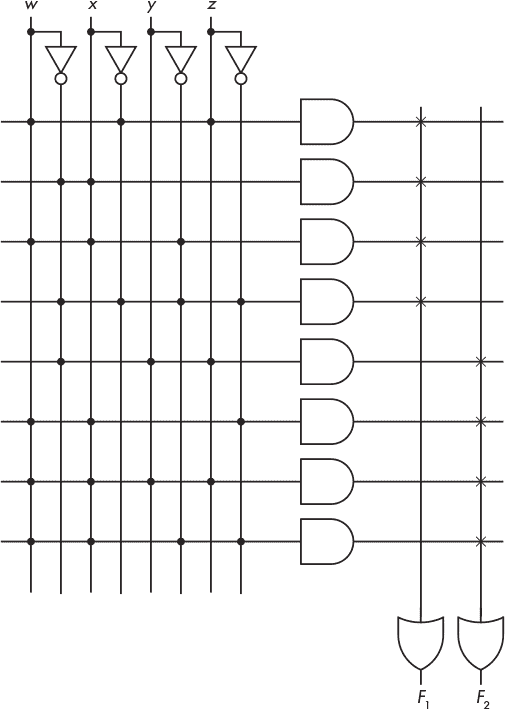

*图 6-17：一个具有两种功能的可编程阵列逻辑设备*

在或门平面中，“*×*”连接表示顶部四个与门进行或运算，产生 *F*1，底部四个与门进行或运算，产生 *F*2。此图中的与门平面已经被编程为生成这两个功能：

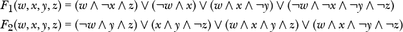

在这里介绍的三种可编程逻辑设备中，PLA 设备是最灵活的，因为我们可以编程 OR 平面和 AND 平面，但它也是最昂贵的。ROM 设备的灵活性较差：它可以编程生成任意组合的最小项，然后将它们 OR 在一起。我们知道任何函数都可以作为最小项的 OR 来实现，因此我们可以用 ROM 设备生成任何函数，但 ROM 设备不允许我们最小化函数，因为所有的积项必须是最小项。

PAL 设备是最不灵活的，因为在 AND 平面中编程的所有积项都会被 OR 在一起。因此，我们不能通过编程 OR 平面来选择哪些最小项包含在函数中。然而，PAL 设备允许我们进行一些布尔函数最小化。如果所需的函数可以在 PAL 设备中实现，那么使用 PAL 设备将比使用 ROM 或 PLA 设备更便宜。

**轮到你了**

6.3 设计一个 ROM 设备，存储四个字符 a、b、c 和 d。

6.4 设计一个 ROM 设备，存储四个字符 A、B、C 和 D。

6.5 比较两个值以确定哪个较大，或者它们是否相同，是计算中的常见操作。执行此类比较的硬件设备称为*比较器*。使用可编程逻辑设备设计一个比较器，用于比较两个 2 位值。你的比较器将有三个输出：相等、大于和小于。

### **你学到了什么**

**组合逻辑电路** 这些电路仅依赖于任何时刻的输入。它们没有记忆输入之前的效果。示例包括加法器、解码器、多路复用器和可编程逻辑设备。

**半加器** 该电路有两个 1 位输入，并产生两个 1 位输出：输入的和以及该和的进位。

**全加器** 该电路有三个 1 位输入，并产生两个 1 位输出：输入的和以及该和的进位。

**脉冲进位加法器** 该电路使用*n*个全加器来加法*n*位数。每个全加器的进位输出是下一个更高位位置的全加器的三个输入之一。

**解码器** 一种根据 2*^n*个输入选择*n*个输出之一的设备。

**多路复用器（MUX）** 一种根据*n*位选择信号选择 2*^n*个输入中的一个的设备。

**可编程逻辑阵列（PLA）** 一种用于生成最小项的或逻辑组合以实现布尔函数的硬件设备。

**只读存储器（ROM）** 非易失性存储器，输入为数据或指令的地址。

**可编程阵列逻辑（PAL）** 一种用于在硬件中实现布尔函数的设备。它比 PLA 或 ROM 设备灵活性较差，但也更便宜。

在下一章，你将学习顺序逻辑电路，它们使用反馈来保持其活动的记忆。
