## 第七章：顺序逻辑电路**

在上一章中，你学习了组合逻辑电路，它们仅依赖于当前的输入。换句话说，组合逻辑电路是瞬时的（除了电子元件需要的稳定时间）：它们的输出仅依赖于在观察输出时的输入。另一方面，*顺序逻辑电路*依赖于当前输入和过去输入。它们有一个时间历史，可以通过电路的当前状态来总结。

从形式上讲，*系统状态*是对系统的一种描述，使得在时间 *t*[0] 时的状态和从时间 *t*[0] 到时间 *t*[1] 的输入能够唯一地确定在时间 *t*[1] 时的状态，以及从时间 *t*[0] 到时间 *t*[1] 的输出。换句话说，系统状态提供了影响系统的所有因素的总结。知道系统在任意时刻 *t* 的状态，你就能知道从此时起系统的行为如何。这些状态是如何产生的则无关紧要。

系统状态的概念通过*有限状态机*得以体现，有限状态机是一种计算的数学模型，它存在于有限个状态中的某一个。有限状态机的外部输入使得它从一个状态转移到另一个状态，或者保持在同一状态，同时可能产生一个输出。顺序逻辑电路用于实现有限状态机。如果一个顺序逻辑电路的输出仅依赖于它所处的状态，那么它被称为*摩尔状态机*。如果输出还依赖于导致状态转换的输入，那么它被称为*梅利状态机*。

在本章中，你将学习如何在逻辑电路中使用*反馈*来保持门电路在特定的状态下，从而实现存储。我们将使用*状态图*来展示输入如何导致顺序逻辑电路在不同状态之间转换，以及相应的输出是什么。你还将学习如何使用时钟同步顺序逻辑电路，以提供可靠的结果。

### **锁存器**

我们将首先学习的顺序逻辑电路是*锁存器*，它是一个 1 位存储设备，依据输入可以处于两种状态之一。锁存器可以通过连接两个或更多的逻辑门来构造，使得一个门的输出作为另一个门的输入；只要电源保持连接，这样就能保持两个门的输出处于相同的状态。锁存器的状态不依赖于时间。（术语*锁存器*也用于描述一个多位存储设备，其行为类似于这里描述的 1 位设备。）

#### ***使用 NOR 门的 SR 锁存器***

最基本的锁存器是 *置位-复位 (SR)* 锁存器。它有两个输入，*S* 和 *R*，以及两个状态，*置位* 和 *复位*。该状态作为主要输出，*Q*。通常还会提供补充输出，¬*Q*。当输出为 *Q* = `1` 和 ¬*Q* = `0` 时，SR 锁存器处于置位状态。当 *Q* = `0` 和 ¬*Q* = `1` 时，它处于复位状态。图 7-1 展示了使用 NOR 门实现 SR 锁存器的简单示例。

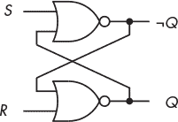

*图 7-1：SR 锁存器的 NOR 门实现*

每个 NOR 门的输出都被送入另一个门的输入。正如我在本章中描述电路的行为时，你将看到这种反馈是保持锁存器处于某一状态的原因。

SR 锁存器有四种可能的输入组合，如下所述：

***S*** **=** 0**,** ***R*** **=** 0**：保持当前状态**

如果锁存器处于置位状态 (*Q* = `1` 和 ¬*Q* = `0`)，输入 *S* = `0` 和 *R* = `0` 将导致上方 NOR 门输出 ¬(`0` ∨ `1`) = `0`，下方 NOR 门输出 ¬(`0` ∨ `0`) = `1`。相反，如果锁存器处于复位状态 (*Q* = `0` 和 ¬*Q* = `1`)，则上方 NOR 门输出为 ¬(`0` ∨ `0`) = `1`，下方 NOR 门输出为 ¬(`1` ∨ `0`) = `0`。因此，两个 NOR 门之间的交叉反馈维持了锁存器当前的状态。

***S*** **=** 1**,** ***R*** **=** 0**：置位 (*****Q*** **=** 1**)**

如果锁存器处于复位状态，这些输入将导致上方 NOR 门输出为 ¬(`1` ∨ `0`) = `0`，从而将 ¬*Q* 改为 `0`。这一输出被反馈至下方 NOR 门的输入，得到 ¬(`0` ∨ `0`) = `1`。下方 NOR 门输出的反馈保持上方 NOR 门输出为 ¬(`1` ∨ `1`) = `0`。锁存器随后进入置位状态 (*Q* = `1` 和 ¬*Q* = `0`)。

如果锁存器处于置位状态，则上方的 NOR 门输出 ¬(`1` ∨ `1`) = `0`，下方的 NOR 门输出为 ¬(`0` ∨ `0`) = `1`。因此，锁存器保持在置位状态。

***S*** **=** 0**,** ***R*** **=** 1**：复位 (*****Q*** **=** 0**)**

如果锁存器处于置位状态，则下方的 NOR 门输出 ¬(`0` ∨ `1`) = `0`，从而将 *Q* 改为 `0`。这一输出被反馈至上方 NOR 门的输入，得到 ¬(`0` ∨ `0`) = `1`。上方 NOR 门输出的反馈保持下方 NOR 门的输出为 ¬(`1` ∨ `1`) = `0`。锁存器随后进入复位状态（*Q* = `0`，¬*Q* = `1`）。

如果锁存器已经处于复位状态，则下方的 NOR 门输出 ¬(`1` ∨ `1`) = `0`，上方的 NOR 门输出为 ¬(`0` ∨ `0`) = `1`，因此锁存器保持在复位状态。

***S*** **=** 1**,** ***R*** **=** 1**：不允许**

如果*Q* = `0` 且 ¬*Q* = `1`，则上部的 NOR 门产生 ¬(`1` ∨ `0`) = `0`。这一结果被反馈到下部 NOR 门的输入，产生 ¬(`0` ∨ `1`) = `0`。这将导致*Q* = ¬*Q*，这与布尔代数定律不一致。

如果*Q* = `1` 且 ¬*Q* = `0`，则下部的 NOR 门产生 ¬(`0` ∨ `1`) = `0`。这一结果被反馈到上部 NOR 门的输入，产生 ¬(`1` ∨ `0`) = `0`。这将导致*Q* = ¬*Q*，这是不一致的。电路必须设计成避免这种输入组合。

为了简化，我们可以通过图示表示这一逻辑。图 7-2 介绍了一种图形化方式来展示 NOR 门 SR 锁存器的行为：状态图。在该图中，当前状态显示在气泡中，且对应的主输出位于状态下方。带有箭头的线显示状态之间的可能转换，并标注了导致状态转换到下一状态的输入。

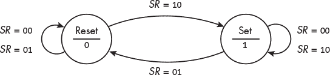

*图 7-2：NOR 门 SR 锁存器的状态图*

图 7-2 中的两个圆圈表示 SR 锁存器的两个可能状态：设置或重置。线上的标签显示了导致每次状态转换的输入组合*SR*。例如，当锁存器处于重置状态时，有两个可能的输入，*SR* = `00` 和 *SR* = `01`，这将使其保持在该状态。输入*SR* = `10`会使其转换到设置状态。由于输出仅依赖于状态，而不依赖于输入，因此锁存器是一个摩尔状态机。

熟悉图论的人会认识到，状态图是一个有向图：状态是顶点，导致转换的输入是边。尽管这些内容超出了本书的范围，但图论中的工具在设计过程中是非常有用的。

和图论一样，我们也可以通过*状态转换表*以表格形式展示相同的行为，如表 7-1 所示。

**表 7-1：** NOR 门 SR 锁存器状态转换表

| ***S*** | ***R*** | ***Q*** | ***Q***[***next***] |
| --- | --- | --- | --- |
| `0` | `0` | `0` | `0` |
| `0` | `0` | `1` | `1` |
| `0` | `1` | `0` | `0` |
| `0` | `1` | `1` | `0` |
| `1` | `0` | `0` | `1` |
| `1` | `0` | `1` | `1` |
| `1` | `1` | `0` | x |
| `1` | `1` | `1` | x |

在表 7-1 中，*S* 和 *R* 是输入，*Q* 是当前状态下的输出，*Q[next]* 显示由于相应输入所导致的下一状态的输出。底部两行中的 x 表示一种不可能的情况。

对于 NOR 门 SR 锁存器，两个输入通常保持在 `0`，从而维持当前状态，使输出为*Q*。暂时将*R*改为 `1` 会使状态重置，从而将输出更改为*Q* = `0`，如状态转换表中的*Q[next]*列所示。暂时将*S*改为 `1` 会使状态设置，从而使输出为*Q* = `1`。

如前所述，输入组合 *S* = *R* = `1` 不被允许，因为这会导致 SR 锁存器处于不一致状态，正如状态转换表中的 *Q[next]* 列所示的禁止行，那里标有 x。

#### ***使用 NAND 门的 SR 锁存器***

它们的构造物理特性使得 NAND 门比 NOR 门更快。让我们从 NOR 门输出的方程式开始：

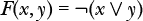

从德摩根定律，我们得到以下结果：

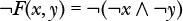

这表明，如果我们对两个输入取反，则 NAND 门在功能上等同于 NOR 门，只是输出取反。

这导致了如图 7-3 所示的电路，使用 ¬*S* 和 ¬*R* 作为输入。为了强调两种设计的逻辑对偶性（NAND 和 NOR），我绘制了电路，输出 *Q* 位于顶部，¬*Q* 位于底部。

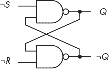

*图 7-3：SR 锁存器的 NAND 门实现*

与 NOR 门 SR 锁存器一样，NAND 门 SR 锁存器在输出为 *Q* = `1` 且 ¬*Q* = `0` 时被认为处于置位状态；在 *Q* = `0` 且 ¬*Q* = `1` 时则处于复位状态。输入组合有四种可能：

¬***S*** **=** 1**,** ¬***R*** **=** 1**：保持当前状态**

如果锁存器处于置位状态（*Q* = `1` 且 ¬*Q* = `0`），则上部 NAND 门输出为¬(`1` ∧ `0`) = `1`，下部 NAND 门输出为¬(`1` ∧ `1`) = `0`。如果 *Q* = `0` 且 ¬*Q* = `1`，则锁存器处于复位状态；上部 NAND 门输出为¬(`1` ∧ `1`) = `0`，下部 NAND 门输出为¬(`0` ∧ `1`) = `1`。两个 NAND 门之间的交叉反馈保持锁存器的状态。

¬***S*** **=** 0**,** ¬***R*** **=** 1**：置位（*****Q*** **=** 1**)**

如果锁存器处于复位状态，则上部 NAND 门的输出为¬(`0` ∧ `1`) = `1`，从而将 *Q* 更改为 `1`。该信号反馈到下部 NAND 门的输入，得到¬(`1` ∧ `1`) = `0`。从下部 NAND 门输出到上部 NAND 门输入的反馈保持上部门的输出为¬(`0` ∧ `0`) = `1`。锁存器已进入置位状态（*Q* = `1` 且 ¬*Q* = `0`）。

如果锁存器已处于置位状态，则上部 NAND 门输出为¬(`0` ∧ *mathtt*0) = `1`，下部 NAND 门的输出为¬(`1` ∧ `1`) = `0`。因此，锁存器保持在置位状态。

¬***S*** **=** 1**,** ¬***R*** **=** 0**：复位（*****Q*** **=** 0**)**

如果锁存器处于置位状态，下部 NAND 门输出为¬(`1` ∧ `0`) = `1`。该信号反馈到上部 NAND 门的输入，从而使 *Q* = ¬(`1` ∧ `1`) = `0`。从上部 NAND 门输出到下部 NAND 门输入的反馈保持下部门的输出为¬(`0` ∧ `0`) = `1`，因此锁存器进入复位状态（*Q* = `0` 且 ¬*Q* = `1`）。

如果锁存器已经处于复位状态，底部的 NAND 门输出¬(`0` ∧ `0`) = `1`，顶部 NAND 门的输出是¬(`1` ∧ `1`) = `0`。锁存器保持在复位状态。

¬***S*** **=** 0**,** ¬***R*** **=** 0**：不允许**

如果锁存器处于复位状态，顶部的 NAND 门输出¬(`0` ∧ `1`) = `1`。这个结果会反馈到底部 NAND 门的输入，导致输出¬(`1` ∧ `0`) = `1`。这也会导致*Q* = ¬*Q*，这种情况是不一致的。

如果锁存器处于设定状态，底部的 NAND 门输出¬(`1` ∧ `0`) = `1`。这个结果会反馈到顶部 NAND 门的输入，导致输出¬(`0` ∧ `1`) = `1`。这也会导致*Q* = ¬*Q*，这种情况是不一致的。电路设计必须防止这种输入组合。

图 7-4 展示了使用状态图表示的 NAND 门 SR 锁存器的行为。

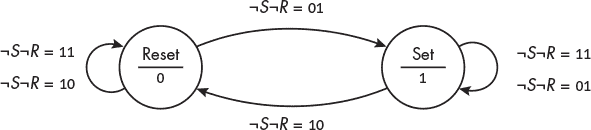

*图 7-4：NAND 门 SR 锁存器*

将此与图 7-2 中的 NOR 门 SR 锁存器进行比较，你会发现它们描述的是相同的行为。例如，向 NOR 门 SR 锁存器输入*SR* = `10`会将其置于设定状态，而输入

¬*S¬R* = `01`输入到 NAND 门 SR 锁存器会将其置于设定状态。我发现，在分析电路时，必须仔细思考这个问题。当只有两个选择时，一点点偏差就可能导致行为与预期相反。

表 7-2 是一个 NAND 门 SR 锁存器的状态转移表。

**表 7-2：** 一个 NAND 门 SR 锁存器状态转移表

| ***¬******S*** | ***¬******R*** | ***Q*** | ***Q****[next]*** |
| --- | --- | --- | --- |
| `1` | `1` | `0` | `0` |
| `1` | `1` | `1` | `1` |
| `1` | `0` | `0` | `0` |
| `1` | `0` | `1` | `0` |
| `0` | `1` | `0` | `1` |
| `0` | `1` | `1` | `1` |
| `0` | `0` | `0` | x |
| `0` | `0` | `1` | x |

同时将`0`输入到两个端口会导致问题——即两个 NAND 门的输出都会变为`1`。换句话说，*Q* = ¬*Q* = `1`，这是逻辑上不可能的。电路设计必须防止这种输入组合。底部两行中的 x 表示一个不可能的状态。

使用两个 NAND 门实现的 SR 锁存器可以被看作是 NOR 门 SR 锁存器的补集。通过将¬*S*和¬*R*保持在`1`，状态得以保持。暂时将¬*S*设为`0`会将状态设定为*Q* = `1`，而将¬*R*设为`0`会将其复位，输出*Q* = `0`。

到目前为止，我们一直在查看一个单独的锁存器。问题在于，当输入发生变化时，锁存器的状态及其输出也会发生变化。在计算机中，它将与许多其他设备互连，每个设备都随新输入变化状态。每个设备改变状态并将其输出传播到下一个设备需要时间。精确的时序取决于设备制造中的细微差异，因此结果可能不可靠。我们需要一种手段来同步活动，为操作带来一些秩序。我们将通过向 SR 锁存器添加一个*Enable*输入来开始，这将使我们能够更精确地控制何时允许输入影响状态。

#### ***带 Enable 的 SR 锁存器***

通过添加两个 NAND 门以提供*Enable*输入，我们可以更好地控制 SR 锁存器。将这两个 NAND 门的输出连接到¬*S¬R*锁存器的输入，便得到了一个*门控 SR 锁存器*，如图 7-5 所示。

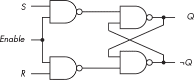

*图 7-5：带门控的 SR 锁存器*

在这个电路中，只要*Enable* = `0`，两个控制 NAND 门的输出就会保持在`1`。这将发送¬*S* = `1` 和 ¬*R* = `1` 到该电路的¬*S¬R*锁存器部分的输入，从而使状态保持不变。通过将额外的*Enable*输入与*S*和*R*输入线进行与运算，我们可以控制状态何时改变为下一个值。

表 7-3 显示了带*Enable*控制的 SR 锁存器的状态行为。

**表 7-3：** 带门控的 SR 锁存器状态转换表

| ***Enable*** | ***S*** | ***R*** | ***Q*** | ***Q****[next]*** |
| --- | --- | --- | --- | --- |
| `0` | — | — | `0` | `0` |
| `0` | — | — | `1` | `1` |
| `1` | `0` | `0` | `0` | `0` |
| `1` | `0` | `0` | `1` | `1` |
| `1` | `0` | `1` | `0` | `0` |
| `1` | `0` | `1` | `1` | `0` |
| `1` | `1` | `0` | `0` | `1` |
| `1` | `1` | `0` | `1` | `1` |
| `1` | `1` | `1` | `0` | x |
| `1` | `1` | `1` | `1` | x |

在表 7-3 中，a —表示某个输入无关紧要，x 表示禁止的结果。如前所述，设计必须防止产生禁止结果的输入组合。只有当*Enable* = `1`时，锁存器的状态才能跟随*S*和*R*输入。因此，这种设备被称为*电平触发型*。

在下一节中，我将简化门控的 SR 锁存器，并创建一个只接收单一数据输入*D*的锁存器，并控制何时这个输入会影响锁存器的状态。

#### ***D 型锁存器***

*D 型锁存器*允许我们存储 1 位的值。我们从表 7-4 的真值表开始，该表包括表 7-3 中当*Enable* = `1` 且 *R* = ¬*S*时的行。

**表 7-4：** 带*Enable*的 D 型锁存器真值表

| ***Enable*** | ***S*** | ***R*** | ***D*** | ***Q*** | ***Q****[next]*** |
| --- | --- | --- | --- | --- | --- |
| `0` | — | — | — | `0` | `0` |
| `0` | — | — | — | `1` | `1` |
| `1` | `0` | `1` | `0` | `0` | `0` |
| `1` | `0` | `1` | `0` | `1` | `0` |
| `1` | `1` | `0` | `1` | `0` | `1` |
| `1` | `1` | `0` | `1` | `1` | `1` |

我们正在寻找一种设计，具有两个输入：一个是*使能*，另一个是*D*（数据的简写）。我们希望*D* = `1`时设置状态，使得输出*Q* = `1`，而*D* = `0`时重置状态，使得输出*Q* = `0`，当*使能*线变为`1`时。*D*的值在*使能* = `0`时不应对状态产生任何影响。

我们可以通过添加一个 NOT 门，从一个带使能的 SR 锁存器构造出一个带使能的 D 锁存器，具体如图 7-6 所示。

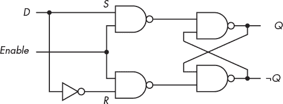

*图 7-6：由 SR 锁存器构造的带使能的 D 锁存器*

唯一的数据输入*D*被送入 SR 锁存器的*S*端；数据值的反码被送入*R*端。

现在，我们有了一个可以使用*D*输入存储 1 位数据的电路，并且可以通过*使能*输入与其他操作进行同步。然而，D 锁存器存在一些问题。D 锁存器的状态可能会在启用时受到输入的影响。因此，它的输出可能在锁存器启用时发生变化，这使得它很难与其他设备可靠地同步。

这种方案在锁存器需要长时间保持在某一状态时非常有效。一般来说，锁存器适用于那些我们希望选择一个状态并保持一段时间的操作，这段时间与计算机中的其他操作不同步。例如，I/O 端口的时序取决于连接到端口的设备的行为。例如，正在运行的程序无法知道用户何时按下键盘上的一个键。当按下键时，程序可能还没有准备好接收字符，因此该字符的二进制代码应被锁存到输入端口中。一旦字符代码存储在输入端口，锁存器将被禁用，直到程序从锁存器读取字符代码。

CPU 和主内存中的大多数计算操作必须进行时间上的协调。将多个电路连接到相同的时钟信号可以同步它们的操作。让我们考虑如何同步连接在电路中的 D 锁存器。我们可以将一个输入信号送入这个 D 锁存器，并通过时钟信号使能锁存器，但如果输入变化，它的输出也会变化，这会导致在启用时输出不可靠。如果我们的 D 锁存器的输出连接到另一个设备的输入，那么在 D 锁存器启用时，第二个设备的输入也变得不可靠。为了解决这个问题并提供可靠的输入，我们应当在 D 锁存器稳定后禁用它。

由于连接的物理原因，我们的 D 触发器的输出到达第二个设备的输入也需要一些时间，这被称为*传播延迟*。因此，第二个设备应该被禁用，直到我们 D 触发器的输入是可靠的，并且我们已经考虑了传播延迟。

当第二个设备被禁用并等待来自我们 D 触发器的可靠输入时，它的输出（来自上一个时钟周期）是可靠的。因此，如果它连接到另一个设备的输入，这第三个设备就可以被启用。这导致了一种方案，其中每隔一个设备被启用，而交替的设备被禁用。在等待的时间等于所有连接设备的最长稳定时间和传播延迟时间之和后，禁用的设备被启用，启用的设备被禁用。数字`1`和`0`通过这种交替启用/禁用周期在这些设备的电路中传播。

正如你可能想象的那样，协调启用和禁用之间的这种反复切换可能是困难的。我将在下一节中给出这个问题的解决方案。

### **翻转触发器**

虽然触发器可以通过时钟信号的电平来控制，但在时钟信号启用触发器的时间段内，输入的任何变化都会影响它的输出。*翻转触发器*在时钟周期的特定时间提供输出，例如当时钟信号从`0`转换为`1`时。由于输出在时钟信号的转换点变得可用，它被称为*边缘触发*。触发事件发生后，翻转触发器的输出会持续整个时钟周期。这提供了将多个翻转触发器连接在一起并通过一个时钟同步它们操作所需的可靠性。我将从时钟的讨论开始，然后我们将看看一些翻转触发器的例子。

**注意**

*术语有所不同。有些人也称触发器*为翻转触发器*。我将使用术语*触发器*来指代一个级别触发的设备，没有时间要求，而*翻转触发器*则指由时钟信号控制的边缘触发设备。*

#### ***时钟***

顺序逻辑电路具有时间历史，这些历史被其状态所总结。我们通过*时钟*来跟踪时间，时钟是一个提供电子*时钟信号*的设备。这通常是一个方波，在`0`和`1`电平之间交替变化，如图 7-7 所示。这个信号作为需要同步的设备的启用/禁用输入。

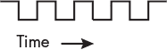

*图 7-7：用于同步顺序逻辑电路的典型时钟信号*

为了实现可靠的行为，大多数同步电路使用边缘触发的设备。每个电平上的时间通常是相同的，时钟信号的正边缘（`0`到`1`）或负边缘（`1`到`0`）都可以使用。

时钟频率必须足够慢，以便电路元件有时间在下一个时钟过渡发生之前完成它们的操作。例如，可靠操作锁存器或触发器要求输入信号在设备启用之前的某段时间内保持稳定，这段时间称为*建立时间*。输入信号在启用信号开始后必须保持稳定一段时间，这段时间称为*保持时间*。实际上，这些时间可能会随温度、制造差异等因素变化。硬件设计人员需要参考制造商的规格来确定这些时间值的极限。

让我们看几个可以由时钟控制的触发器电路的例子。

#### ***D 触发器***

我们将通过将时钟信号连接到图 7-6 中的受控 D 锁存器的*Enable*输入开始。在这里，只要*Enable* = `1`，输入就会影响输出。问题是如果在*Enable* = `1`时输入发生变化，输出也会变化，导致设计不可靠。

一种将输出与输入变化隔离的方法是将我们的 D 锁存器的输出连接到 SR 锁存器的输入，以主/从配置连接，如图 7-8 所示。

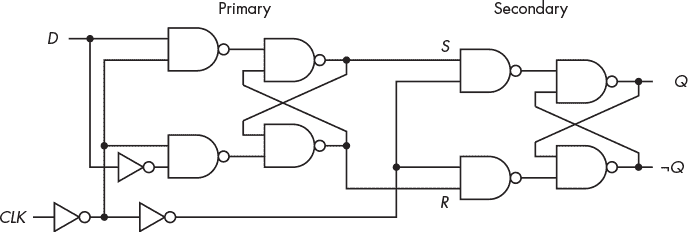

*图 7-8：一个 D 触发器，正边沿触发*

D 触发器的主部分处理输入并向副部分提供可靠的输入以获得最终输出。我们想要存储的位`0`或`1`被送入 D 锁存器的*D*输入，时钟信号则送入*CLK*输入。D 锁存器的未反转输出送入*S*输入，其反转输出送入 SR 锁存器的*R*输入。D 触发器的最终输出来自 SR 锁存器的输出。

我将向你解释这个电路是如何工作的。主部分的行为在表 7-4 中显示了 D 锁存器的真值表。副部分的行为在表 7-3 中显示了 SR 锁存器的真值表。图 7-9 展示了我们 D 触发器中关键点的时序。

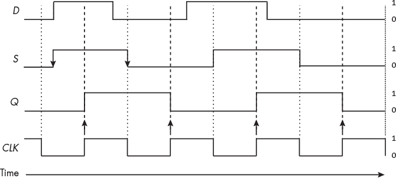

*图 7-9：D 触发器的时序*

图 7-9 中的数据输入*D*与时钟信号并不完全同步，它的时序有些不规则。这可能是由于传播延迟、其他组件的干扰、电路中的温度梯度以及其他因素引起的。

我们从 CLK 首次变为`0`的时刻开始。这个信号被反转，从而启用 D 锁存器。D 锁存器的输出*S*跟随*D*输入，从`0`变为`1`。时钟路径中的第二个反相器禁用 SR 锁存器，从而锁存触发器的输出*Q*，保持在`0`电平。

当 CLK 信号为`1`时，D 锁存器被禁用，这将其输出*S*和*R*分别锁存为`1`和`0`。在这个时钟半周期内，这为 SR 锁存器提供了稳定的输入信号。经过两次反转的 CLK 信号使 SR 锁存器被启用，从而使触发器的输出*Q*变为`1`。

然后，CLK 信号变为`0`，禁用二级部分的 SR 锁存器，这在该时钟半周期内保持在`1`电平。

因此，触发器引入了一个半个时钟周期的时间延迟，用于接受输入并提供输出，但输出在整个时钟周期内保持稳定。输出在一个精确的时间点可用，即从`0`到`1`的过渡。这就是所谓的*正边缘触发*。如果图 7-8 中连接到 CLK 信号的第一个 NOT 门被移除，我们就会得到一个具有*负边缘触发*的 D 触发器。

有时，触发器必须在时钟信号开始之前被设置为已知值——例如，在计算机启动时。这些已知值是独立于时钟过程输入的；因此，它们是*异步输入*。

图 7-10 展示了一种添加了*异步预置*（*PR*）输入的 D 触发器。

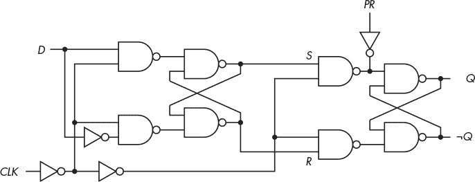

*图 7-10：带有异步预置的正边缘触发 D 触发器*

当`1`被施加到*PR*输入时，*Q*变为`1`，而¬*Q*变为`0`，无论其他输入是什么——即使是 CLK 也不例外。通常也会有一个异步清除输入（*CLR*），它将状态（和输出）设置为`0`。

虽然实现边沿触发的 D 触发器有更高效的电路，但本讨论展示了它们如何通过普通的逻辑门来构建。它们既经济又高效，因此被广泛应用于*超大规模集成（VLSI）*电路中，这些电路在单一半导体微芯片上集成了数十亿个晶体管门。

与其绘制每个 D 触发器的实现细节，电路设计师通常使用图 7-11 中显示的符号。

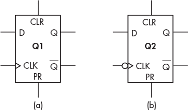

*图 7-11：用于 D 触发器的符号：（a）正边缘触发，（b）负边缘触发*

图 7-11 中标出了各种输入和输出。硬件设计师通常使用*Ǭ*代替¬*Q*。通常会将触发器标记为*Qn*，其中*n* = 1, 2, . . .，用来识别整个电路中的触发器。图 7-11(b)中时钟输入处的小圆圈表示该 D 触发器是由负脉冲时钟触发的。

现在你已经看到了保存状态的一些逻辑组件，让我们来看看使用这些组件设计顺序逻辑电路的过程。

### **设计顺序逻辑电路**

我们将考虑设计时序逻辑电路的一般步骤。设计通常是迭代的，正如你从编程经验中无疑已经学到的那样。你从一个设计开始，分析它，然后完善设计，使其更快、更便宜，等等。随着经验的积累，设计过程通常需要更少的迭代。

以下步骤是构建第一个工作设计的好方法：

1.  从问题的自然语言描述中，创建状态转换表和状态图，展示电路需要执行的操作。这些形成了你将设计的电路的基本技术规范。

1.  选择一个二进制代码来表示状态，并创建状态表和/或状态图的二进制编码版本。对于*N*个状态，代码需要 log[2] *N*位。任何代码都可以使用，但某些代码可能会导致电路中组合逻辑的简化。

1.  选择一个触发器类型。这个选择通常由你手头的组件决定。

1.  确定每个触发器所需的输入，以实现每个所需的转换。

1.  简化每个触发器的输入。卡诺图或代数方法是简化过程中的好工具。

1.  绘制电路。

步骤 5 可能会让你重新思考选择的触发器类型。选择触发器、确定输入和简化这三个步骤可能需要反复进行，直到达到一个好的设计。以下两个例子说明了这个过程。你可以把这些当作引导性的“你的回合”练习；如果你有数字电路模拟器或所需的硬件，我建议你利用这些资源跟随练习。

#### ***计数器***

我们想设计一个具有*使能*输入的计数器。当*使能* = `1`时，它会按照序列 0, 1, 2, 3, 0, 1, . . . 递增，每次时钟信号触发时递增。*使能* = `0`会使计数器保持在当前状态。输出是该序列的 2 位二进制数。以下是步骤：

**步骤 1：创建状态转换表和状态图。**

每个时钟信号触发时，如果*使能* = `1`，计数器会递增 1。如果*使能* = `0`，它会保持在当前状态。图 7-12 展示了四个状态—0, 1, 2, 3—以及每个状态对应的 2 位输出。

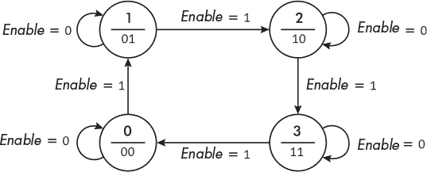

*图 7-12：计数器的状态图，循环经过 0, 1, 2, 3, 0, 1, . . .*

表 7-5 展示了这个计数器的状态转换表。

**表 7-5：计数器的状态转换表**

|  | ***使能*** = 0 | ***使能*** = 1 |
| --- | --- | --- |
| **当前***n***** | **下一个***n***** | **下一个***n***** |
| --- | --- | --- |
| 0 | 0 | 1 |
| 1 | 1 | 2 |
| 2 | 2 | 3 |
| 3 | 3 | 0 |

当*使能* = `0`时，计数器基本上是关闭的；当*使能* = `1`时，计数器会自动递增 1，达到上限 3 后回绕到 0。

**步骤 2：创建状态表/状态图的二进制编码版本。**

对于四个状态，我们需要 2 位。我们将*n*定义为状态，用 2 位二进制数*n*[1]*n*[0]表示。表 7-6 展示了其行为。

**表 7-6：** 2 位计数器的状态转换表

|  | **当前** | **下一个** |
| --- | --- | --- |
| ***使能*** | ***n***[1] | ***n***[0] | ***n***[1] | ***n***[0] |
| --- | --- | --- | --- | --- |
| `0` | `0` | `0` | `0` | `0` |
| `0` | `0` | `1` | `0` | `1` |
| `0` | `1` | `0` | `1` | `0` |
| `0` | `1` | `1` | `1` | `1` |
| `1` | `0` | `0` | `0` | `1` |
| `1` | `0` | `1` | `1` | `0` |
| `1` | `1` | `0` | `1` | `1` |
| `1` | `1` | `1` | `0` | `0` |

**步骤 3：选择触发器。**

我们将使用 D 触发器。经过设计后，我们可能会决定使用另一种触发器效果更好。然后，我们可以返回这一阶段，重新执行剩余步骤。一位经验丰富的设计师可能会对问题有一些见解，建议从另一种类型的触发器开始。通常，任何潜在的成本或功耗节省都不足以证明更换为另一种类型的触发器是值得的。

**步骤 4：确定触发器的输入。**

我们需要两个触发器，每个比特一个。D 触发器会在下一个时钟周期存储其输入的值，因此导致每个触发器变化到下一个状态的输入在表 7-6 的“Next”列下显示。

我们可以写出布尔方程，显示输入*使能*（Enable）和当前的*n*[1]和*n*[0]的逻辑组合，从而产生所需的输入。我们将使用*E*表示*使能*，用*D*[1]和*D*[0]表示各自 D 触发器的输入：

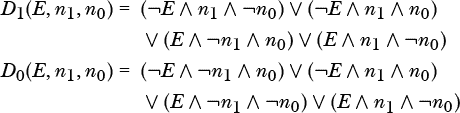

**步骤 5：简化所需的输入。**

我们可以使用卡诺图来找到更简单的解决方案，如图 7-13 所示。

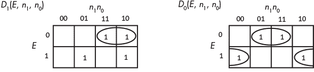

*图 7-13：使用 D 触发器实现的 2 位计数器的卡诺图*

卡诺图使我们能够简化每个触发器输入的布尔方程：

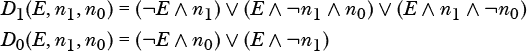

**步骤 6：绘制电路图。**

我们将使用一个 PLA（在第六章的“可编程逻辑阵列”中介绍）来生成两个 D 触发器的输入。图 7-14 展示了我们用来实现该计数器的电路。

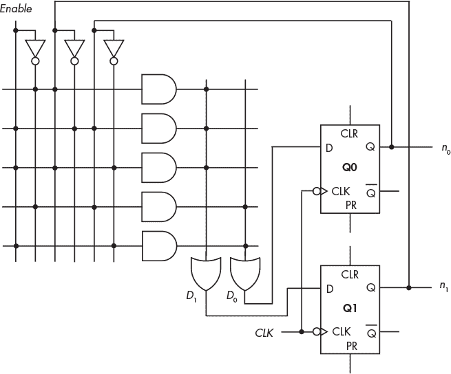

*图 7-14：用 PLA 和两个 D 触发器实现的 2 位计数器*

图 7-15 展示了二进制计数器的时序图，当其按顺序进展 3、0、1、2、3（`11, 00, 01, 10, 11`）时。

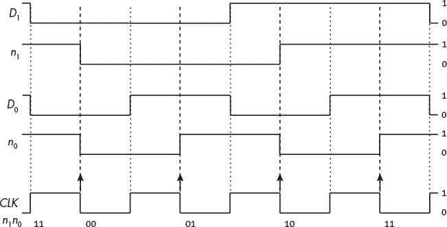

*图 7-15：用 D 触发器实现的 2 位计数器的时序图*

*D[i]* 是第 *i* 个 D 触发器的输入，*n[i]* 是其输出。请记住，当第 *i* 个输入 *D[i]* 被应用到其 D 触发器时，触发器的输出直到时钟周期的后半段才会发生变化。这可以通过比较图中相应输出 *n[i]* 的迹线来看到。

#### ***分支预测器***

在我们的第二个示例中，我们将设计一个分支预测器。这个例子比前一个要复杂一些。

除了非常便宜的微控制器，大多数现代 CPU 都分阶段执行指令。每个阶段由专门的硬件组成，用于执行该阶段的操作。指令像流水线一样通过每个阶段。例如，如果你要创建一个流水线来制造木椅，你可以分为三个阶段：锯木头制作椅子的零件，组装零件，最后涂漆椅子。每个阶段所需的硬件分别是锯子、锤子和螺丝刀、以及画笔。

CPU 中专用硬件的安排称为*流水线*。流水线的第一阶段硬件设计用于从内存中提取指令，正如你在第九章中将看到的那样。在从内存中提取指令后，指令会传递到流水线的下一个阶段，在那里进行解码。同时，流水线的第一阶段会从内存中提取下一条指令。结果是 CPU 同时处理多条指令，这提供了一些并行性，从而提高了执行速度。

几乎所有程序都包含*条件分支点*——即下一个要提取的指令可能位于两个不同内存位置的地方。不幸的是，直到决策指令经过流水线的多个阶段，才知道应该提取哪一条指令。

为了保持执行速度，一旦条件分支指令从提取阶段传递过来，如果 CPU 能够预测从哪里提取下一条指令，就会很有帮助。然后，它可以继续执行。如果预测错误，CPU 会通过清空流水线并提取其他指令来忽略在预测指令上所做的工作，新的指令进入流水线的开始阶段。

在这一节中，我们将设计一个电路，用于预测条件分支是否会被执行。预测器将持续预测相同的结果，直到连续两次预测错误，分支才会被执行或不执行。

以下是我们设计分支预测器电路时将遵循的步骤：

**步骤 1：创建状态表和状态图。**

我们将使用“Yes”表示分支被执行，使用“No”表示分支未被执行。状态图在图 7-16 中显示了四种可能的状态。

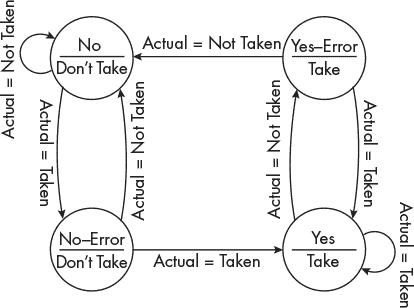

*图 7-16：我们的分支预测器的四种可能状态*

让我们从 No 状态开始。在这里，至少在最后两次执行此指令时，分支都未被执行。输出是预测这次也不会被执行。电路的输入是指令执行完毕后，分支是否实际被执行。

在图 7-16 中标记为 Actual = Not Taken 的弧线回到 No 状态，预测（输出）是下次执行指令时分支将不会被执行。如果分支被执行，Actual = Taken 的弧线表明电路进入 No–Error 状态，表示预测出现一次错误。但因为必须连续两次出错才能改变预测，所以电路仍然预测不会执行分支（Don’t Take）作为输出。

从 No–Error 状态出发，如果分支未被执行（预测正确），电路返回到 No 状态。然而，如果分支被执行，电路连续两次预测错误，因此电路进入 Yes 状态，并且输出为预测执行分支（Take）。

我将剩余部分的状态图追踪留给你作为练习。一旦你对其工作原理感到满意，请查看表 7-7，该表提供了我们电路的技术规格。

**表 7-7：** 分支预测器状态表

|  |  | **Actual = Not Taken** | **Actual = Taken** |
| --- | --- | --- | --- |
| **当前状态** | **预测** | **下一个状态** | **预测** | **下一个状态** | **预测** |
| --- | --- | --- | --- | --- | --- |
| No | 不执行 | No | 不执行 | No–Error | 不执行 |
| No–Error | 不执行 | No | 不执行 | 是 | 执行 |
| Yes–Error | 执行 | No | 不执行 | Yes | 执行 |
| Yes | 执行 | Yes–Error | 执行 | Yes | 执行 |

当条件分支的结果（是否执行分支）在流水线中被确定时，表 7-7 显示下一个状态以及相应的预测。这个预测将用于确定下次遇到此指令时，应该存储哪个地址——下一个指令的地址还是分支目标的地址。

**步骤 2：表示状态。**

对于这个问题，我们将选择一个二进制代码表示状态，*s*[1]*s*[0]，如表 7-8 所示。

**表 7-8：** 分支预测器的状态

| **状态** | ***s***[1] | ***s***[0] | **预测** |
| --- | --- | --- | --- |
| No | `0` | `0` | 不执行 |
| No–Error | `0` | `1` | 不执行 |
| Yes–Error | `1` | `0` | 执行 |
| Yes | `1` | `1` | 执行 |

预测是 1 位的，*s*[1]，如果预测为不执行分支（Don’t Take），则为 `0`，如果预测为执行分支（Take），则为 `1`。

让输入 Actual 在分支未被执行时为 `0`，在分支被执行时为 `1`，并使用表 7-8 中的状态表示法，我们得到表 7-9 所示的状态转移表。

**表 7-9：分支预测器的状态转移表**

|  | **当前** | **下一个** |
| --- | --- | --- |
| **实际** | ***s***[1] | ***s***[0] | ***s***[1] | ***s***[0] |
| --- | --- | --- | --- | --- |
| `0` | `0` | `0` | `0` | `0` |
| `0` | `0` | `1` | `0` | `0` |
| `0` | `1` | `0` | `0` | `0` |
| `0` | `1` | `1` | `1` | `0` |
| `1` | `0` | `0` | `0` | `1` |
| `1` | `0` | `1` | `1` | `1` |
| `1` | `1` | `0` | `1` | `1` |
| `1` | `1` | `1` | `1` | `1` |

当条件分支指令到达流水线中的一个点时，系统将决定是否执行该分支，这个信息作为输入 Actual 被传递到预测器电路中，该电路将状态从当前状态（Current）转换为下一个状态（Next），以便在下次遇到该指令时使用。

**步骤 3：选择一个触发器。**

我们在这里再次使用 D 触发器，并且与前一个例子一样，仍然有相同的注意事项。

**步骤 4：确定触发器的输入。**

我们需要两个触发器，每个位一个。D 触发器会在下一个时钟周期存储其输入值，因此引起每个触发器状态变化的输入显示在表 7-9 中的两个“下一个”列下。

我们可以写出布尔方程，显示三个信号的逻辑组合，Actual 和当前的 *s*[1] 与 *s*[0]，它们产生所需的输入给每个 D 触发器，使其转到下一个 *s*[1] 和 *s*[0]。我们将使用 *A* 来表示 Actual，使用 *D*[1] 和 *D*[0] 来表示分别传递给 D 触发器的输入：

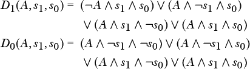 **步骤 5：简化所需的输入。**

我们将通过使用以下布尔恒等式开始：

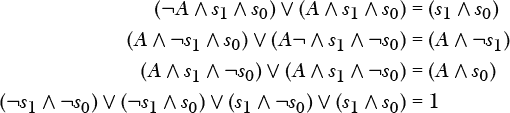

我们的方程变为：

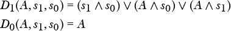

**步骤 6：绘制电路图。**

在这个电路中，输入为 Actual = `0`，如果上次分支未被执行；如果分支被执行，则输入为 Actual = `1`。与我们的计数器一样，我们将使用一个 PLA 和两个 D 触发器，正如在图 7-17 中所示。

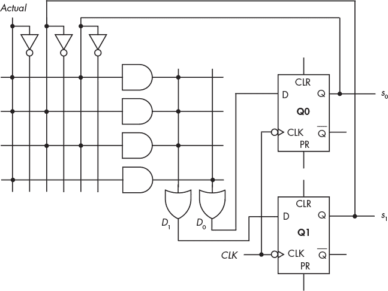

*图 7-17：使用 PLA 和两个 D 触发器的分支预测器电路*

这个例子展示了最简单的分支预测方法。虽然存在更复杂的方法，且关于分支预测效果的研究仍在进行中，尽管它可以加速某些算法，但分支预测所需的额外硬件会消耗更多电力，这在电池供电的设备中是一个值得关注的问题。

我们在这两个例子设计中都使用了 D 触发器和 PLA，但像往常一样，组件的选择取决于多个因素：成本、组件的可用性、设计工具、设计时间、电力消耗等等。

**现在轮到你了**

7.1    重新设计图 7-14 中的 2 位计数器，使用单独的门而不是 PLA。

7.2    重新设计图 7-17 中的分支预测器，使用单独的门而不是 PLA。

### **你学到了什么**

**顺序逻辑电路（Sequential logic circuits）**  这些电路的输出依赖于当前和过去的输入。它们具有时间历史，可以通过电路的当前状态进行概括。

**锁存器（Latch）**  一种存储 1 位数据的设备。改变该位值的能力由使能信号的电平控制；这种方式称为电平触发。

**触发器（Flip-flop）**  一种存储 1 位数据的设备。改变该位值的能力由时钟信号的边沿变化控制；这种方式称为边沿触发。

**SR 锁存器（SR latch）**  SR 锁存器的状态取决于其输入，可以是设置状态或复位状态。

**D 触发器（D flip-flop）**  D 触发器存储 1 位数据。通过将两个锁存器连接成主从配置，输出与输入隔离，从而使触发器能够与时钟信号同步。D 触发器的输出只能在每个时钟周期内更改一次。

在本章中，你看到的两个设计顺序逻辑电路的示例是基于 D 触发器和可编程逻辑阵列（PLAs）。在下一章中，你将学习计算机系统中使用的各种存储结构。
