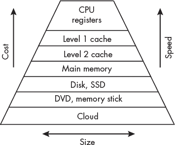
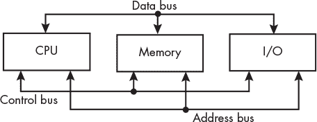
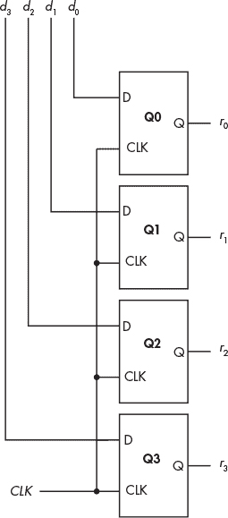
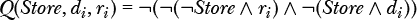
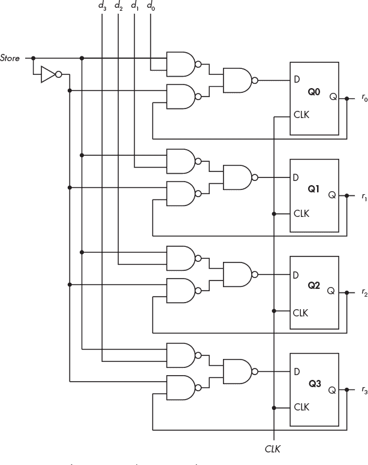
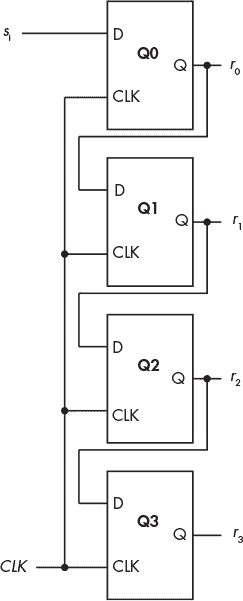
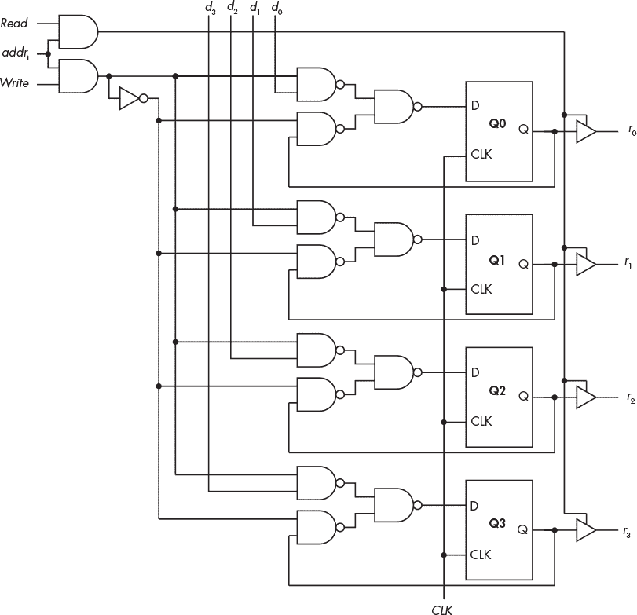
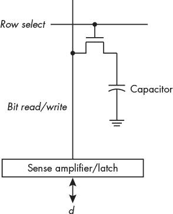
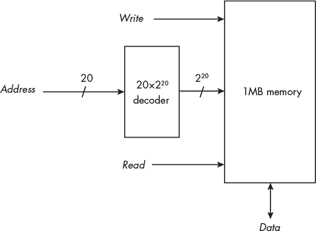
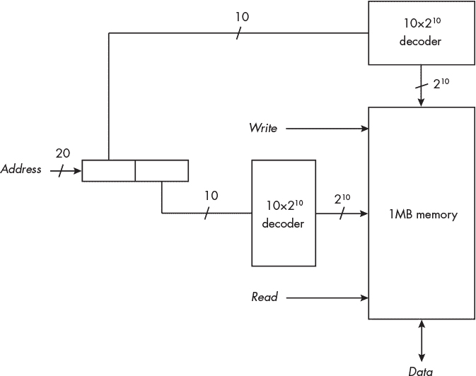

## 第八章：内存**

在前面的三章中，你已经学习了用于实现逻辑功能的一些硬件。现在，我们将探讨如何利用这些功能来实现构成计算机的子系统，从内存开始。

每个计算机用户都希望拥有大量内存和快速计算。然而，速度更快的内存价格更高，因此必须做出一定的权衡。本章将以不同类型内存如何平衡速度与成本的使用方式开始。然后，我将描述几种实现内存硬件的不同方法。

### **内存层次结构**

一般来说，内存距离 CPU 越近，它的速度就越快，成本也越高。最慢的内存是云端内存，成本也最低。我的电子邮件账户在云端提供 15GB 的存储空间，并且不收费（如果忽略看到一些广告的“成本”），但其速度受限于我的互联网连接。而在另一端，CPU 内部的内存与 CPU 运行速度相同，但相对较贵。树莓派的 CPU 中大约有 500 字节的内存可以供我们在程序中使用。

图 8-1 展示了这种内存层次结构。随着我们接近 CPU（图中的顶部），内存速度更快，成本也更高，因此内存的数量较少。

*图 8-1：计算机内存层次结构*

图 8-1 中的前三层通常包括在现代计算机的 CPU 芯片中。在到达主内存之前，可能还有一到两层缓存。主内存和磁盘或固态硬盘（SSD），或两者，通常与 CPU 在同一机箱内。

离 CPU 最远的下一层代表离线数据存储设备，其中 DVD 和 U 盘只是两个例子。你可能还有外部 USB 磁盘、磁带驱动器等。为了使这些设备对计算机可用，通常需要采取一些物理操作，例如将 DVD 插入驱动器或将 U 盘插入 USB 端口。

这一层次结构的最后一层是云端存储。虽然我们大多数人将计算机设置为自动登录云端，但它并不总是可用的。

在本章中，我将从云层之上的两层开始，分别是离线存储和磁盘/SSD，并向 CPU 寄存器推进。然后，我将描述构建寄存器所使用的硬件，并逐步讲解向主内存扩展的过程。我们将把最外层三层的实现讨论留给其他书籍。

#### ***大容量存储***

在图 8-1 中，云层之上的两层统称为*大容量存储*。大容量存储设备存储大量数据，而且当设备断电时数据仍然会保留。

让我们再看一下计算机的主要子系统，在第一章中介绍过。正如图 8-2 所示，三个子系统通过数据、控制和地址总线相互通信。此外，输入/输出（I/O）块包括与大容量存储设备接口的专用电路。

*图 8-2：计算机的子系统*

例如，树莓派有电路实现了 SD 总线协议，并使用 micro SD 卡作为其 SSD。操作系统包括软件（*设备驱动程序*），应用程序通过该软件访问 micro SD 卡上的数据和应用程序。我将在第二十章中讨论 I/O 编程，但设备驱动程序的具体内容超出了本书的范围。

在本章的其余部分，我将介绍*易失性内存*，当电源关闭时其内容会丢失。

#### ***主内存***

*主内存*是你在购买计算机时在规格中看到的随机存取内存（RAM）。主内存在硬件中通过总线接口与 CPU 同步，我将在第九章和第二十章中讨论。因此，程序员只需指定地址以及是从内存加载项还是存储新值，就可以访问内存中的项目。

你的树莓派内存大小取决于型号。树莓派 3 A+有 512MB，3 B 和 3 B+每个有 1GB。树莓派 4 B 可以有 2GB、4GB 或 8GB。树莓派 5 可以有 4GB 或 8GB。其他内存配置可能也有。

通常，整个程序和数据集不会加载到主内存中。相反，操作系统只将当前正在处理的部分从大容量存储加载到主内存中。现代计算机中的大多数大容量存储设备只能按预定大小的*块*进行访问。例如，树莓派操作系统使用 4KB 的磁盘块大小。当需要的指令或数据项被加载到主内存时，计算机会加载包含所需项目的整个指令或数据块。程序中附近的部分（指令或数据）很可能很快会被需要。由于它们已经在主内存中，操作系统无需再次访问大容量存储设备，从而加快了程序执行速度。

主内存最常见的组织方式是将程序指令和数据都存储在主内存中。这被称为*冯·诺依曼架构*，最初由约翰·冯·诺依曼描述（《EDVAC 报告初稿》，宾夕法尼亚大学摩尔电气工程学院，1945 年），尽管当时其他计算机科学先驱也在研究相同的概念。

冯·诺依曼架构的一个缺点是，如果一条指令要求从内存中读取数据（或写入数据），程序序列中的下一条指令在当前指令完成数据传输之前无法通过同一总线从内存中读取（或写入）。这被称为 *冯·诺依曼瓶颈*。这种冲突会减慢程序执行速度，并催生了另一种存储程序架构：*哈佛架构*，其中程序和数据存储在不同的内存中，每个内存都有各自的总线连接到 CPU。这使得 CPU 可以同时访问程序指令和数据。这种专业化减少了内存使用的灵活性，通常会增加所需的总内存量。它还需要额外的内存访问硬件。这些额外的内存和访问硬件增加了成本。Level 1 缓存通常采用哈佛架构，从而为指令和数据提供单独的路径连接到 CPU。

冯·诺依曼架构的另一个缺点是，程序可以被编写成将自身视为数据，从而启用自我修改，这通常是个坏主意。像大多数现代通用操作系统一样，Linux 禁止应用程序自我修改。

#### ***缓存内存***

我使用的大多数程序占用主内存的几十或几百兆字节，但大多数执行时间被循环占用，这些循环反复执行相同的几条指令，访问相同的几个变量，占用的内存只有几十或几百字节。大多数现代计算机在主内存和 CPU 之间包括非常快速的 *缓存内存*，它为当前正在处理的程序指令和变量提供了一个更快的位置。

缓存内存按层次组织，Level 1 最靠近 CPU，也是最小的。树莓派的缓存大小各不相同，如 表 8-1 所示。

**表 8-1:** 树莓派的缓存大小

|  | **Level 1** | **Level 2** | **Level 3** |
| --- | --- | --- | --- |
| **型号** | **指令** | **数据** | **统一** | **统一** |
| --- | --- | --- | --- | --- |
| 3 A+, B, B+ | 4 *×* 32KB | 4 *×* 32KB | 512KB | n/a |
| 4 B | 4 *×* 48KB | 4 *×* 32KB | 1MB | n/a |
| 5 | 4 *×* 64KB | 4 *×* 64KB | 4 *×* 512KB | 2MB |

**注意**

*我见过关于不同树莓派型号的缓存大小的不同信息，所以我不能保证 表 8-1 中的缓存大小的准确性，但它们足够接近，可以说明缓存的工作原理。*

执行计算的 CPU 部分称为 *处理器核心*，或简称 *核心*。所有树莓派型号中的 CPU，如 表 8-1 中所示，均具有四个处理器核心。表格中前缀为 4 × 的内存大小表示每个处理器核心都拥有该量的缓存内存。

Raspberry Pi 3 和 4 具有两个缓存级别，而 Raspberry Pi 5 有三个。所有型号的一级缓存都使用哈佛架构。二级和三级缓存都是统一缓存，存储指令和数据。Raspberry Pi 中的缓存内存按 64 字节块组织，称为*行*。指令和数据通过 64 字节的地址边界，一次一行地从主内存传输到缓存，反之亦然。

当程序需要访问指令或数据项时，硬件首先检查它是否位于一级缓存中。如果没有，它会检查二级缓存。如果数据在二级缓存中，硬件将包含所需指令或数据的缓存行复制到一级缓存，然后再传送到 CPU，在程序再次需要该数据或一级缓存需要为来自二级缓存的其他指令或数据重新使用该位置之前，数据将一直保留在那里。硬件继续这个过程，直到它在某个缓存中找到所需项，或者到达主内存。

当数据被写入主内存时，它首先被写入一级缓存，然后是下一级缓存。使用缓存有许多方案，它们可能变得相当复杂。我将把进一步讨论缓存的内容留给更高级的内容，例如* [`en.wikibooks.org/wiki/Microprocessor_Design/Cache`](https://en.wikibooks.org/wiki/Microprocessor_Design/Cache) *上的微处理器设计和缓存的维基书文章。

访问一级缓存的时间接近 CPU 的速度。二级缓存大约慢 10 倍，三级缓存大约慢 100 倍，主内存大约慢 1000 倍。这些值是近似的，并且在不同的实现中差异很大。现代处理器将缓存内存集成在与 CPU 相同的芯片中，有些处理器甚至具有超过三个级别的缓存。

计算机的性能通常受到 CPU 读取指令和数据到 CPU 所需时间的限制，而不是 CPU 本身的速度。将指令和数据放入一级缓存可以减少这一时间。当然，如果它们不在一级缓存中，硬件需要从二级或三级缓存中，或从主内存复制其他指令或数据到三级缓存，再到二级缓存，最终到达一级缓存，那么访问将比直接从主内存获取指令或数据花费更长的时间。缓存的有效性取决于*局部性原理*，即程序在短时间内倾向于访问附近的内存地址。这也是为什么优秀程序员将程序，特别是重复的部分，拆分成小单元的原因。一个小的程序单元更有可能完全装入缓存中的几行，从而在连续重复时能够迅速访问。

**你的回合**

8.1    确定你的 Raspberry Pi 的缓存大小。`lscpu`命令将显示你的 CPU 型号名称。

8.2 确定您的树莓派上每个缓存的行大小。您可以使用`getconf -a| grep CACHE`命令。

#### ***寄存器***

最快的内存是在 CPU 内部：*寄存器*。寄存器通常提供几百字节的存储，并以与 CPU 相同的速度访问。它们主要用于数值计算、逻辑运算、临时数据存储、保存地址以及类似的短期操作——有点像我们在手动计算时使用的草稿纸。

许多寄存器可以直接由程序员访问，而其他寄存器则是隐藏的。一些寄存器用于硬件中，起到 CPU 与 I/O 设备之间的接口作用。CPU 中的寄存器组织方式特定于特定的 CPU 架构，这是在汇编语言级别编程计算机时最重要的方面之一。

在下一章中，您将了解我们将在本书编程中使用的 ARM CPU 中的主要寄存器。但在进入这一部分之前，让我们先看看如何使用前几章讨论的逻辑设备在硬件中实现内存。

### **在硬件中实现内存**

从图 8-1 中显示的层次结构的顶部开始，我们将首先看到如何在 CPU 寄存器中实现内存。然后，我们将从 CPU 开始，逐步向下探讨，您将看到在将这些设计应用于更大内存系统时出现的一些限制，例如缓存和主内存。我们将探索这些更大系统中内存的设计，但本书中不会涉及大容量存储系统的实现。

#### ***四位寄存器***

让我们从一个简单的*4 位寄存器*设计开始，这种寄存器可能出现在用于价格敏感型消费品（如咖啡机和遥控器）的廉价 CPU 中。图 8-3 展示了一个使用 D 触发器实现 4 位寄存器的设计。每当时钟进行正向跳变时，寄存器的状态（内容）*r* = *r*[3]*r*[2]*r*[1]*r*[0]被设置为输入*d* = *d*[3]*d*[2]*d*[1]*d*[0]。

*图 8-3：每个位使用 D 触发器的 4 位寄存器*

这个电路的问题在于，任何*d[i]*的变化都会改变下一个时钟周期中相应存储位*r[i]*的状态，因此寄存器的内容实际上只有一个时钟周期内是有效的。一位模式的单周期缓冲对于某些应用是可以的，但我们还需要能够存储值，直到它被显式更改，可能是在数十亿个时钟周期后。让我们添加一个*Store*信号，并从每个位的输出*r[i]*反馈。当*Store* = `0`时，我们希望每个*r[i]*保持不变，当*Store* = `1`时，它跟随输入*d[i]*，如表 8-2 所示。

**表 8-2：** 在 D 触发器中存储一位

| ***存储*** | ***d******[i]*** | ***r****[i]*** | ***Q*** |
| --- | --- | --- | --- |
| `0` | `0` | `0` | `0` |
| `0` | `0` | `1` | `1` |
| `0` | `1` | `0` | `0` |
| `0` | `1` | `1` | `1` |
| `1` | `0` | `0` | `0` |
| `1` | `0` | `1` | `0` |
| `1` | `1` | `0` | `1` |
| `1` | `1` | `1` | `1` |

表 8-2 导出了*Q*的布尔方程，这是每个 D 触发器的新输出：

该方程可以通过在每个 D 触发器的输入端使用三个 NAND 门来实现，如图 8-4 所示。

*图 8-4：带有存储*信号*的 4 位寄存器*

这个设计还有另一个重要特性，源自 D 触发器的主从特性。从部分的状态在时钟周期的后半段才会改变。因此，连接到该寄存器输出的电路可以在时钟周期的前半段读取当前状态，而主部分则准备可能将状态更改为新内容。

现在我们有了一种方法来存储，例如，加法器电路的结果。寄存器的输出可以作为另一个电路的输入，该电路对数据执行算术或逻辑操作。

寄存器还可以被设计用来对存储在其中的数据执行简单的操作。接下来，我们将看到一个寄存器设计，它可以将串行数据转换为并行格式。

#### ***移位寄存器***

一个*移位寄存器*使用一系列 D 触发器，就像图 8-4 中的简单存储寄存器一样，但每个触发器的输出都连接到下一个触发器的输入端，如图 8-5 所示。我们可以将移位寄存器用作*串行输入并行输出（SIPO）*设备。

*图 8-5：一个 4 位串行到并行移位寄存器*

在图 8-5 中的移位寄存器中，一串串行比特流输入到*s[i]*。每当时钟跳动一次，Q0 的输出会被应用到 Q1 的输入端，从而将*r*[0]的前一个值复制到新的*r*[1]。Q0 的状态会变为新的*s[i]*的值，从而将此值复制为新的*r*[0]。串行比特流继续在移位寄存器的 4 个位中传播。在任何时刻，串行流中的最后 4 位可以并行显示在四个输出端，即*r*[3]、*r*[2]、*r*[1]、*r*[0]，其中*r*[3]是最早的。

同样的电路可以用来提供一个四个时钟周期的时间延迟，在串行比特流中；只需将*r*[3]作为串行输出。

#### ***寄存器文件***

CPU 中用于类似操作的寄存器被组合成一个 *寄存器文件*。例如，正如你将在下一章中看到的，我们要编程的 Raspberry Pi 的 CPU 包含 31 个 64 位通用寄存器，用于整数运算、地址的临时存储等。我们需要一种机制来寻址寄存器文件中的每个寄存器。

考虑一个由八个 4 位寄存器组成的寄存器文件，如图 8-4 所示。我们将八个寄存器的输出命名为 *r*0 到 *r*7。因此，来自八个寄存器的 *i* 位分别是 *r*0*[i]* 到 *r*7*[i]*。要读取其中一个寄存器的 4 位数据（例如，寄存器 *r*5 中的 *r*5[3]、*r*5[2]、*r*5[1] 和 *r*5[0]），我们需要使用 3 位来指定其中一个寄存器。你在第六章学到过， multiplexer（多路复用器）可以选择多个输入中的一个。我们可以将一个 8 × 1 的多路复用器连接到这八个寄存器的每一位，如图 8-6 所示。

*图 8-6：用于选择寄存器文件输出的八路多路复用器*

多路复用器的输入，*r*0*[i]*–*r*7*[i]*，是来自八个寄存器 *r*0–*r*7 的 *i* 位。*RegSel* 线上的斜杠和旁边的 3 是用来表示这里有三条线路的符号。

图 8-6 只显示了 *i* 位的输出；对于 *n* 位寄存器，需要 *n* 个多路复用器，因此一个 4 位寄存器需要四个这样的多路复用器输出电路。同一个 *RegSel* 会同时应用于所有四个多路复用器，以输出同一寄存器的所有 4 位。更大的寄存器则需要相应更多的多路复用器。

#### ***读/写内存***

你已经在图 8-3 中看到过如何构建一个 4 位寄存器来存储来自 D 触发器的值。现在，我们需要能够选择何时读取寄存器中存储的值，并在不读取时断开输出。一个三态缓冲器（在第六章中介绍）可以实现这一点，如图 8-7 所示。该电路仅适用于一个 4 位寄存器。我们需要为计算机中的每个寄存器配备一个这样的电路。addr *[j]* 线来自解码器，用于选择一个寄存器。

*图 8-7：一个 4 位读/写寄存器*

*Write* = `1` 会使 4 位数据 *d*[3]*d*[2]*d*[1]*d*[0] 存储到 D 触发器 Q3、Q2、Q1 和 Q0 中。当 *Read* = `0` 时，4 位输出 *r*[3]*r*[2]*r*[1]*r*[0] 将与 D 触发器断开连接。将 *Read* = `1` 设置为 `1` 时，会连接输出。

让我们继续沿着图 8-1 中的内存层级往下看，缓存内存通常由类似于寄存器文件的触发器构成。

#### ***静态随机存储器***

我们讨论的使用触发器的内存被称为*静态随机存取内存（SRAM）*。之所以叫做*静态*，是因为只要电源保持，它就会保持其值。正如你在第二章中所学的那样，它被称为*随机*，因为在此内存中访问任何（随机）字节所需的时间是相同的。

SRAM 通常用于缓存内存。如表 8-1 所示，Raspberry Pi 上的缓存大小可以从 32KB 到 2MB 不等。每个 SRAM 位大约需要六个晶体管来实现。

继续向下查看内存层次结构，我们到达了主内存，这是计算机内部最大的内存单元。Raspberry Pi 的主内存大小从 1GB 到 8GB 不等，具体取决于型号，因此将 SRAM 用作主内存会非常昂贵。接下来，我们将看看一种适用于大型主内存系统的较便宜类型的内存。

#### ***动态随机存取内存***

*动态随机存取内存（DRAM）*通常通过将电容器充电至两种电压之一来存储一个位。该电路只需要一个晶体管来给电容器充电，如图 8-8 所示。这些电路以矩形阵列的方式排列。

*图 8-8：一个 DRAM 位*

当*行选择*线设置为`1`时，该行中的所有晶体管都会被打开，从而将相应的电容器连接到感应放大器/锁存器。存储在电容器中的值——高电压或低电压——会被放大并存储在锁存器中。这样，它就可以被读取。由于这一操作会使电容器放电，因此必须从锁存器中存储的值中刷新它们。提供了单独的电路来执行刷新操作。

当要将数据存储在 DRAM 中时，新的位值`0`或`1`首先存储在锁存器中。然后，将*行选择*设置为`1`，感应放大器/锁存器电路将与逻辑`0`或`1`对应的电压应用到电容器上。电容器将适当地充电或放电。

这些操作比单纯地切换触发器需要更多时间，因此 DRAM 的速度明显比 SRAM 慢。此外，每一行电容器必须大约每 60 毫秒进行一次读取和刷新。这进一步降低了内存访问速度。

除了内存本身外，访问大型内存系统中各个字节所需的硬件量可能相当可观。让我们来看一种减少寻址内存所需门数的方法。

举个例子，在 1MB 内存中选择 1 字节需要一个 20 位的地址。这反过来需要一个 20×2²⁰ 的地址解码器，如图 8-9 所示。

*图 8-9：使用一个 20 × 2²⁰ 地址解码器访问 1MB 内存*

回想一下，*n*×2*^n*解码器需要 2*^n*个与门。因此，一个 20×2²⁰的解码器需要 1,048,576 个与门。我们可以通过将内存组织成 1,024 行和 1,024 列的网格来简化电路，如图 8-10 所示。然后，我们可以通过选择一行和一列来选择一个字节，每个解码器使用 10×2¹⁰解码器。

虽然需要两个解码器，但每个解码器只需要 2¹⁰个与门，因此每个解码器的总共需要 2×2¹⁰ = 2,048 个与门。当然，访问内存中的单个字节稍微复杂一些，且将 20 位地址拆分成两个 10 位部分会增加一些复杂性。不过，这个例子应该能让你大致了解工程师如何简化设计。

*图 8-10：使用两个 10×2¹⁰地址解码器寻址 1MB 内存*

现在你对现代计算机中内存的层级结构有了清晰的了解，它使得程序能够快速执行，同时保持硬件成本在合理范围内。尽管 DRAM 比 CPU 慢，但其每位的低成本使其成为主内存的理想选择。当我们靠近内存层次结构中的 CPU 时，更快速的 SRAM 被用于缓存。由于缓存内存远小于主内存，因此 SRAM 每位的较高成本在这里是可以接受的，且由于 CPU 执行的程序通常需要的指令和数据都在缓存中，我们可以看到 SRAM 的高速在程序执行中的好处。

**轮到你了**

8.3    从表 8-2 推导出*D(Store, d[i], r[i])*的公式。

### **你所学到的**

**内存层次结构**  计算机存储是这样组织的：更小、更快速、成本更高的内存靠近 CPU。随着程序执行，较小量的程序指令和数据会被复制到逐级更快的内存层级。这种做法之所以有效，是因为程序需要的下一个内存位置很可能与当前内存位置相邻。

**寄存器**  位于 CPU 中的几千字节的内存，以与 CPU 相同的速度访问。由触发器实现。

**缓存**  数千到数百万字节的内存，位于 CPU 外部，但通常在同一芯片上。缓存内存比 CPU 慢，但与 CPU 同步。缓存通常按层次组织，越靠近 CPU 的内存层次越小且越快。缓存通常使用 SRAM 实现。

**主内存**  数亿到数十亿字节的内存，独立于 CPU。主内存比 CPU 慢，但与 CPU 同步。通常使用 DRAM 实现。

**静态随机存取内存 (SRAM)**  使用触发器存储位。SRAM 速度快，但成本高。

**动态随机存取内存 (DRAM)**  使用电容器存储位。DRAM 速度较慢，但其成本远低于 SRAM。

在下一章，你将从程序员的角度学习树莓派中 CPU 的组织结构。
