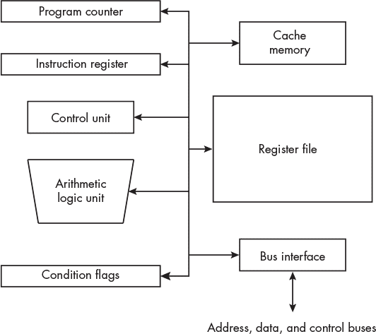
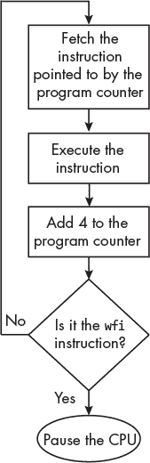
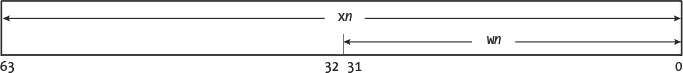

## 第九章：**中央处理单元**


现在你已经了解了构建中央处理单元（CPU）的电子组件，是时候学习一些 ARM CPU 的具体细节了。

Arm Ltd 是一家设计公司，将其设计作为*知识产权（IP）*授权给其他公司。树莓派使用由博通公司制造的*系统级芯片（SoC）*。SoC 是在单一集成电路中组合的多个 IP 模块，包含 CPU 以及计算机系统的其他许多组件。树莓派使用的 SoC 包含一个 ARM CPU IP 模块和与 CPU 协同工作的其他设备 IP 模块。

本书基于第八版 ARM CPU 架构，Armv8-A。这个版本被多个树莓派模型使用，包括树莓派 3 A+、B 和 B+，树莓派 4 B 以及树莓派 5。

一个 Armv8-A 处理器可以在 AArch64 或 AArch32 执行状态下运行。*AArch64*是一个 64 位执行状态，支持 64 位地址和*A64*指令集。A64 指令可以使用 64 位寄存器进行处理。*AArch32*是一个 32 位执行状态，支持 32 位地址和*A32*以及*T32*指令集。（在之前的 Arm 文档中，A32 被称为 ARM，T32 被称为 Thumb。）A32 和 T32 指令可以使用 32 位寄存器进行处理。

A64 和 A32 指令都是 32 位长的。T32 指令的长度为 32 位或 16 位。T32 指令集在 ARM 架构的小型设备实现中很有用，因为它可以减少程序所需的内存量。本书中，我使用的是 AArch64 执行状态下的 A64 指令集。

本章将从典型 CPU 的概述开始，接着介绍 AArch64 执行状态中的寄存器以及程序员如何访问它们。最后，我将通过一个使用`gdb`调试器查看寄存器内容的示例来结束本章。

### **CPU 概述**

正如你可能已经知道的，CPU 是计算机的核心。它按照你在程序中指定的执行路径进行操作，执行所有的算术和逻辑运算。它还从内存中获取程序所需的指令和数据。

让我们从典型 CPU 的主要子系统入手。接下来我将描述 CPU 如何从内存中获取指令，并在执行程序时使用这些指令。

#### ***CPU 子系统***

图 9-1 展示了典型 CPU 主要子系统的框图。这是一个高度简化的图示，只展示了一个处理核心；实际的 CPU 要复杂得多，但这里讨论的一般概念适用于大多数 CPU。



*图 9-1：CPU 的主要子系统*

各子系统通过内部总线连接，总线是硬件通道和控制这些通道通信的协议。我们简要看一下图 9-1 中的每个子系统。在这个概述之后，我们将重点讨论程序员最关心的子系统以及它们在 A64 架构中的使用。主要的 CPU 子系统包括：

**程序计数器** 在 A64 架构中，程序计数器寄存器包含当前正在执行的指令的内存地址。在许多其他架构中，它包含紧跟当前指令之后的指令的地址。在 ARM A32 和 T32 架构中，它包含紧跟在紧跟指令之后的指令的地址。在 x86 架构中，它通常被称为*指令指针*。

**缓存内存** 尽管可以认为这不是 CPU 的一部分，但大多数现代 CPU 都在 CPU 芯片上集成了一些缓存内存。CPU 如何使用缓存内存在第八章中已做解释。

**指令寄存器** 当指令被获取时，它会被加载到指令寄存器中进行解码和执行。指令寄存器的位模式决定了控制单元使 CPU 执行的操作。一旦该操作完成，指令寄存器中的位模式将被更改为程序中下一个指令的位模式，CPU 将执行由此新位模式指定的操作。

**寄存器文件** 正如你在第八章中看到的，寄存器文件是用于相似操作的一组寄存器。大多数 CPU 都有多个寄存器文件。例如，A64 架构包括一个用于整数运算的寄存器文件和另一个用于浮点和向量运算的寄存器文件。编译器和汇编器为每个寄存器指定了名称。所有算术和逻辑操作以及数据移动操作都至少涉及一个寄存器文件中的寄存器。

**控制单元** 指令寄存器中的位会在控制单元中解码。为了执行指令所指定的操作，控制单元会生成控制 CPU 其他子系统的信号。它通常作为有限状态机实现，包含解码器、多路复用器和其他逻辑组件。

**算术逻辑单元 (ALU)** ALU 用于执行程序中指定的算术和逻辑操作。当 CPU 需要执行自己的算术运算（例如，两个值相加以计算内存地址）时，也会使用 ALU。

**条件标志** ALU 执行的每个操作都会产生不同的条件，这些条件可以被记录下来供程序使用。例如，如第三章中讨论的，加法可能会产生进位。A64 指令集包含加法和减法指令，在 ALU 完成操作后，它们会将其中一个条件标志设置为`0`（无进位）或`1`（有进位）。

**总线接口** 这就是 CPU 与其他计算机子系统——内存和输入/输出（I/O）——通信的方式，如图 1-1 所示（参见第一章）。它包含将地址放到地址总线、通过数据总线读写数据，以及将控制信号放到控制总线的电路。许多 CPU 的总线接口与外部总线控制单元接口，外部总线控制单元再与内存以及不同类型的 I/O 总线（例如 USB、SATA 或 PCI-E）接口。

#### ***指令执行周期***

让我们更详细地了解一下 CPU 如何执行存储在主内存中的程序。CPU 通过使用你在第一章中学习到的三条总线——地址总线、数据总线和控制总线——通过总线接口从主内存中获取指令。

在 A64 架构中，*程序计数器*寄存器中的地址始终指向（具有当前执行指令的内存地址）程序中正在执行的指令。CPU 获取此地址处的指令后，会对其进行解码并执行。然后，CPU 会将 4（指令的字节数）加到程序计数器中，使其包含程序中下一个指令的地址。因此，程序计数器标记了程序中的当前位置。

有些指令会改变程序计数器中的地址，从而导致程序从一个位置跳转到另一个位置。在这种情况下，指令执行后程序计数器中的地址不会增加。

当 CPU 从内存中获取指令时，它将该指令加载到指令寄存器中。指令寄存器中的位模式使得 CPU 执行指令中指定的操作。一旦该操作完成，另一个指令会自动加载到指令寄存器中，CPU 将执行下一个位模式所指定的操作。

大多数现代 CPU 使用*指令队列*，其中多个指令等待执行。专用的电子电路在常规控制单元执行指令时，保持指令队列的满载。这是一种实现细节，允许控制单元运行得更快；控制单元如何执行程序的本质可以通过单一的指令寄存器模型来表示，接下来我会描述这一点。

从内存中获取每条指令的步骤，也就是执行程序的步骤如下：

1.  一系列指令被存储在内存中。

1.  第一条指令所在的内存地址被复制到程序计数器。

1.  CPU 将程序计数器中的地址通过地址总线发送到内存。

1.  CPU 通过控制总线发送“读取”信号。

1.  内存通过数据总线响应，发送该内存位置的位状态副本，CPU 随后将其复制到指令寄存器中。

1.  CPU 执行指令寄存器中的指令。

1.  如果指令没有更改程序计数器中的地址，CPU 会自动递增程序计数器，使其包含内存中下一条指令的地址。

1.  返回第 3 步。

第 3、4 和 5 步被称为*指令获取*。注意，第 3 步到第 8 步构成一个周期，称为*指令执行周期*。图 9-2 以图形方式展示了非分支 A64 指令的情况。



*图 9-2：非分支 A64 指令的指令执行周期*

CPU 向程序计数器添加 4，因为每条 A64 指令的长度是 32 位。一些计算机架构在执行指令之前，会将指令长度加到程序计数器中。

在 ARM A32 指令集架构中，CPU 将当前执行指令的地址加上 8（两个指令的长度）。你在第七章中学到，指令是通过管道分阶段获取并执行的。在较早的 32 位 ARM 架构中，在当前指令执行之前，已经取出了另外两条指令，并且这些指令正在通过管道。这一差异在 AArch64 架构的 A32 模式中得以保留，以实现向后兼容。

大多数时候，这些差异对你来说并不重要，但正如你在第十二章讨论指令编码时所看到的，了解这些细节可能有助于调试程序。

图 9-2 中的`wfi`指令使得 CPU 停止执行指令并等待中断。A64 架构还有一条指令`wfe`，它也会停止指令执行并等待事件。中断和事件的区别超出了本书的范围；关键点是，存在一些指令可以告诉 CPU 停止执行指令，从而暂停指令执行周期。你将在第二十一章中进一步了解中断。

程序中的大多数指令至少会使用一个寄存器文件中的一个寄存器。程序通常将数据从内存加载到寄存器中，对数据进行操作，然后将结果存储回内存。寄存器还用于保存存储在内存中的项目的地址，从而充当指向数据或其他地址的指针。

到了本书的这一部分，我将主要关注 A64 指令集架构。我建议你下载 *《了解架构—介绍 ARM 架构》*，可以通过 *[`developer.arm.com/documentation/102404/latest`](https://developer.arm.com/documentation/102404/latest)* 获取。该文档比本书所涵盖的内容更高级，但我在这里的一个目标是帮助你学会如何阅读更高级的资料。两者之间反复对照将帮助你更好地理解这些内容。

本章的其余部分主要用于描述 A64 架构中的通用寄存器。你将学习如何在 `gdb` 调试器中查看它们的内容，并将在下一章中学习如何在汇编语言中开始使用它们。

### **A64 寄存器**

CPU 内存的一部分被组织成寄存器。机器指令通过它们的地址访问 CPU 寄存器，就像它们访问主内存一样。当然，寄存器寻址空间与主内存寻址空间是分开的；寄存器地址被放置在内部 CPU 总线上，而不是总线接口的地址部分，因为寄存器就在 CPU 内部。从程序员的角度来看，区别在于汇编器为寄存器预定义了名称，而程序员为内存地址创建符号名称。

因此，在你编写的每个汇编语言程序中，以下情况会发生：

+   CPU 寄存器通过使用在汇编器中预定义的名称进行访问。

+   内存是通过程序员为内存位置提供名称，并在用户程序中使用该名称来访问的。

表 9-1 列出了 A64 架构中的基本编程寄存器。

**表 9-1：** 基本 A64 寄存器

| **编号** | **大小** | **名称** | **用途** |
| --- | --- | --- | --- |
| 31 | 64 位 | `x0`–`x30` 或 `w0`–`w30` | 通用寄存器 |
| 1 | 64 位 | `sp` | 栈指针 |
| 1 | 64 位 | `xzr` 或 `wzr` | 零寄存器 |
| 1 | 64 位 | `pc` | 程序计数器 |
| 1 | 64 位 | `nzcv` | 条件标志 |
| 32 | 128 位 | `d0`–`x31`，`s0`–`s31`，或 `h0`–`h31` | 浮点或向量 |
| 1 | 64 位 | `fpcr` | 浮点控制 |
| 1 | 64 位 | `fpsr` | 浮点状态 |

`x0`–`x30` 指的是寄存器的完整 64 位，`w0`–`w30` 指的是相同寄存器的 32 位低位。同样，`xzr` 是一个 64 位的 0 整数，`wzr` 是一个 32 位的 0 整数。对于浮点寄存器，`d0`–`d31` 指的是完整的 128 位，`s0`–`s31` 指的是低 64 位，`h0`–`h31` 指的是低 32 位的寄存器。

让我们更详细地看看这些寄存器。我将从 31 个通用寄存器开始，然后我们将查看几个具有特殊用途的寄存器。我将在第十九章中讲解浮点寄存器。

#### ***通用寄存器***

通用寄存器用于*整数数据类型*，例如 `int` 和 `char` 整数值（有符号和无符号）、字符表示、布尔值和内存地址。每个寄存器中的每一位按从右到左的顺序编号，从 0 开始。所以最右边的位是 0，紧接着左边的是 1，依此类推。由于每个通用寄存器有 64 位，最左边的位是 63。

计算机中的每条指令将一组位视为一个单独的单位。早期，这个单位被称为*字*。每个 CPU 架构都有一个*字长*。在现代 CPU 架构中，不同的指令操作在不同数量的位上，但术语从最初的 32 位 ARM 架构延续到当前的 64 位架构。因此，8 位称为*字节*，16 位称为*半字*，32 位称为*字*，64 位称为*双字*，128 位称为*四字*。

在 A64 架构中，通用寄存器 `r0`–`r30` 可以作为 32 位字或 64 位双字进行访问。我们的汇编器使用 `w0`–`w30` 表示字部分，使用 `x0`–`x30` 表示双字部分，如图 9-3 所示。



*图 9-3：A64 通用寄存器名称*

当一条指令写入寄存器的低 32 位时，高 32 位会被设置为 `0`。

#### ***专用寄存器***

如你刚刚学到的，程序计数器寄存器，命名为 `pc`，包含当前指令的地址。软件不能直接写入 `pc`；它只能通过*分支*指令间接修改。

尽管它被视为通用寄存器，*带链接分支*指令使用 `x30` 寄存器作为*链接寄存器*，命名为 `lr`，当调用函数时传递返回地址。我将在第十一章中详细解释这一点，但现在请记住，当你编写汇编语言代码时，使用 `x30` 寄存器时需要小心。

你可能习惯了计算机中的大多数事情以 2 的倍数发生，所以你可能会想为什么只有 31 个通用寄存器。没有名为 `w31` 或 `x31` 的寄存器。相反，A64 架构将第 32 个寄存器视为*堆栈指针*，命名为 `sp`，或者*零寄存器*，命名为 `wzr` 或 `xzr`。

*堆栈*是一个位于内存中的数据结构，`sp` 寄存器包含其地址。我将在第十一章中详细讲解这一部分。寄存器名称 `wsp` 指的是堆栈指针寄存器的低 32 位。这将用于使用 32 位寻址的特殊情况，在本书中我不会详细介绍这些内容。

如果您的算法需要值 0，许多指令允许您使用 `wzr` 寄存器表示 32 位 0 或使用 `xzr` 寄存器表示 64 位 0。如果使用指令将值存储到零寄存器中，该值将被简单丢弃；然而，这实际上是有用途的，正如我们在 第十三章 中看到的那样，比较值的指令会使用它。零寄存器不需要实现为物理寄存器。

状态标志，如您在 图 9-1 中看到的，位于 `nzcv` 寄存器中。多个算术和逻辑操作会影响状态标志，这些标志位于 `nzcv` 寄存器的第 31 位到第 28 位，如 图 9-4 所示。该寄存器中的其他 60 位保留供其他用途。


*图 9-4：A64* nzcv *寄存器*

标志的名称和导致它们为真（即值为 `1`）的条件，如 表 9-2 所示。

**表 9-2：** 状态标志

| **名称** | **功能** | **将标志设置为 1 的条件** |
| --- | --- | --- |
| `N` | 负数标志 | 结果的最高位为 `1` |
| `Z` | 零标志 | 结果为 `0` |
| `C` | 进位标志 | 显示进位或借位 |
| `V` | 溢出标志 | 有符号整数（补码）算术溢出 |

机器指令可以用来测试状态标志的状态。例如，有一条指令，当 `Z` 标志为 `1` 时，会跳转到程序中的另一个位置。

接下来，我们将查看一些 C/C++ 数据类型，它们与通用寄存器的大小有关。

### **C/C++ 整型数据类型和寄存器大小**

程序中的每一段数据都有一个 *数据类型*，该数据类型指定了数据的可能值、表示这些值的位模式、可以对数据执行的操作以及数据在程序中的语义使用。

一些编程语言，包括 C、C++ 和 Java，要求程序员显式声明程序中使用的值的数据类型。其他语言，如 Python、BASIC 和 JavaScript，可以根据值的使用方式来确定数据类型。

大多数编程语言会指定每种数据类型的变量所能存储的值的范围。例如，在 C 和 C++ 中，`int` 必须能够存储范围为 -32,768 到 +32,767 的值；因此，它的大小至少为 16 位。`unsigned int` 必须能够存储范围为 0 到 65,535 的值，因此它也必须至少为 16 位。编程环境可以超过语言规范中给出的最小要求。

CPU 制造商指定了与 CPU 架构特定的机器级数据类型，通常包括一些在设计中独有的专用数据类型。表 9-3 给出了你可以从我们的编译器`gcc`和`g++`中预期的 A64 寄存器大小，但你应该小心，不要指望这些大小总是相同的。`*`<数据类型>表示指向指定数据类型内存地址的指针。

**表 9-3：** A64 架构中某些 C/C++数据类型的大小

| **数据类型** | **大小（位）** | **描述** |
| --- | --- | --- |
| `char` | 8 | 字节 |
| `short` | 16 | 整数 |
| `int` | 32 | 整数 |
| `long` | 32 | 整数 |
| `long long` | 64 | 整数 |
| `float` | 32 | 单精度浮点数 |
| `double` | 64 | 双精度浮点数 |
| `*`<数据类型> | 64 | 指针 |

一个值通常可以由多种数据类型表示。例如，大多数人会认为 123 表示整数一百二十三，但这个值可以在计算机中以`int`或`char[]`（一个`char`数组，其中每个元素存储一个字符的代码点）形式存储。

如表 9-3 所示，在我们的 C/C++环境中，`int`是存储在一个字中的，因此 123 将以位模式`0x0000007b`存储。作为 C 风格的文本字符串，我们还需要 4 字节的内存，但位模式将是`0x31`，`0x32`，`0x33`，和`0x00`——也就是字符`1`，`2`，`3`和`NUL`。（回忆一下，C 风格的字符串是以`NUL`字符结束的。）

如果你对问题的解决方案依赖于数据大小，C 标准库通常定义了特定的大小。例如，GNU C 库定义`int16_t`为 16 位有符号整数，`u_int16_t`为 16 位无符号整数。在少数情况下，你可能希望使用汇编语言来确保正确性。

你可以通过查看寄存器中发生的事情来了解很多关于 CPU 如何工作的知识。在下一节中，你将学习如何使用`gdb`调试器查看寄存器。

### **使用 gdb 查看 CPU 寄存器**

我将使用清单 9-1 中的程序来向你展示如何使用`gdb`查看 CPU 寄存器的内容。

*inches_to_feet.c*

```
// Convert inches to feet and inches.

#include <stdio.h>
#define INCHES_PER_FOOT 12

int main(void)
{
 ➊ register int feet;
    register int inches;
 ➋ int total_inches;
    int *ptr; ptr = &total_inches;

    printf("Enter inches: ");
 ➌ scanf("%i", ptr);

    feet = total_inches / INCHES_PER_FOOT;
    inches = total_inches % INCHES_PER_FOOT;
    printf("%i\" = %i' %i\"\n", total_inches, feet, inches);

    return 0;
}
```

*清单 9-1：一个简单的程序，演示如何使用* gdb *查看 CPU 寄存器*

我使用了`register`存储类修饰符❶，请求编译器使用 CPU 寄存器来存储`feet`和`inches`变量，而不是将它们存储在内存中。`register`修饰符只是建议性的；C 语言标准并不要求编译器遵循这一请求。但请注意，我并没有请求编译器使用 CPU 寄存器来存储`total_inches`变量❷。这个变量必须放在内存中，因为`scanf`需要一个指向`total_inches`位置的指针❸来存储从键盘读取的值。

我在第二章中介绍了一些`gdb`命令。当你在一个已经运行的程序中触发断点时，这里有一些额外的命令，你可能会发现它们有助于在控制程序的情况下移动并查看程序的信息：

n **(next)** 执行当前源代码语句。如果它是函数调用，则执行整个函数。

s **(step)** 执行当前源代码语句。如果它是函数调用，则进入该函数，达到被调用函数的第一条指令。

si **(step instruction)** 执行当前机器指令。如果它是函数调用，则进入该函数。

sho arc **(show architecture)** 显示`gdb`当前使用的架构。你可以使用此命令确保`gdb`以 AArch64 模式运行。

这是我如何使用`gdb`控制程序执行并观察寄存器内容的示例——请注意，如果你自己复制这个例子，可能会看到不同的地址：

```
➊ $ gcc -g -Wall -o inches_to_feet inches_to_feet.c
➋ $ gdb ./inches_to_feet
   GNU gdb (Debian 10.1-1.7) 10.1.90.20210103-git
   --snip--
   Reading symbols from ./inches_to_feet...
➌ (gdb) l
   1       // Convert inches to feet and inches.
   2 3       #include <stdio.h>
   4       #define INCHES_PER_FOOT 12
   5
   6       int main(void)
   7       {
   8           register int feet;
   9           register int inches;
   10          int total_inches;
➍ (gdb)
   11          int *ptr;
   12
   13          ptr = &total_inches;
   14
   15          printf("Enter inches: ");
   16          scanf("%i", ptr);
   17
   18          feet = total_inches / INCHES_PER_FOOT;
   19          inches = total_inches % INCHES_PER_FOOT;
   20          printf("%i\" = %i' %i\"\n", total_inches, feet, inches);
   (gdb)
   21
   22          return 0;
   23      }
```

我先编译程序❶，然后将其加载到`gdb`中❷。调试器首先打印关于它自身的信息，我在这里删除了这些信息以节省空间。然后，我列出源代码❸，以便知道在哪里设置断点。使用回车键❹（某些键盘上的 RETURN 键）可以重复上一个命令（但不会显示该命令）。

我想跟踪程序处理数据的过程，方法是设置程序中一些关键点的断点：

```
(gdb) b 15
Breakpoint 1 at 0x7d8: file inches_to_feet.c, line 15.
(gdb) b 18
Breakpoint 2 at 0x7f4: file inches_to_feet.c, line 18.
```

我在程序提示用户输入数据的地方（第 15 行）设置了第一个断点，在程序开始进行计算的地方（第 18 行）设置了第二个断点。

当我运行程序时，它会在遇到第一个断点时暂停：

```
(gdb) r
Starting program: /home/progs/chapter_09/inches_to_feet/inches_to_feet

Breakpoint 1, main () at inches_to_feet.c:15
15          printf("Enter inches: ");
```

程序在源代码的第 15 行停止，控制权返回到`gdb`。`i r`命令显示寄存器的内容（确保在`i`和`r`之间输入空格）：

```
(gdb) i r
x0             0x7fffffef54        549755809620
x1             0x7ffffff0b8        549755809976
x2             0x7ffffff0c8        549755809992
x3             0x55555507c4        366503856068
x4             0x0                 0
x5             0xbc0984bf4dff9186  -4897237162606489210
x6             0x7ff7fb6c58        549621296216
x7             0x1000000040        68719476800
x8             0xffffffffffffffff  -1
x9             0xf                 15
x10            0x0                 0
x11            0x0                 0
x12            0x7ff7e48e48        549619797576
x13            0x0                 0
x14            0x0                 0
x15            0x6fffff4a          1879048010
x16            0x0                 0
x17            0x0                 0
x18            0x7fffffdb20        549755804448
x19            0x5555550880        366503856256
x20            0x0                 0
x21            0x55555506b0        366503855792
x22            0x0                 0
x23            0x0                 0
x24            0x0                 0
x25            0x0                 0
x26            0x0                 0
x27            0x0                 0
x28            0x0                 0
x29            0x7fffffef30        549755809584
x30            0x7ff7e65e18        549619916312
sp             0x7fffffef30        0x7fffffef30
pc             0x55555507d8        0x55555507d8 <main+20>
cpsr           0x60000000          [ EL=0 C Z ]
fpsr           0x0                 0
fpcr           0x0                 0
```

此显示器告诉我们用户输入数据之前寄存器的内容（你会看到不同的数字）。我们可能想知道编译器是否按照我们的要求使用了`feet`和`inches`变量的寄存器，如果是，它使用了哪些寄存器。

我们想知道这些信息，以便在程序使用寄存器之前和之后查看寄存器的内容，从而判断程序是否将正确的值存储在寄存器中。我们可以通过要求`gdb`打印这两个变量的地址来回答这个问题：

```
(gdb) print &feet
Address requested for identifier "feet" which is in register $x20
(gdb) print &inches
Address requested for identifier "inches" which is in register $x19
```

当我们询问一个变量的地址时，`gdb`会给出与程序员提供的标识符相关联的内存地址。但在这个程序中，我要求编译器使用寄存器，`gdb`会告诉我们编译器为每个变量选择了哪个寄存器。

我没有要求编译器为`total_inches`和`ptr`变量使用寄存器，因此`gdb`应该会告诉我们它们在内存中的位置：

```
(gdb) print &total_inches
$1 = (int *) 0x7fffffef54
(gdb) print &ptr
$2 = (int **) 0x7fffffef58
```

现在我们知道`x19`用于存储`inches`，`x20`用于存储`feet`，在使用它们进行计算之前，我们可以查看这两个寄存器当前存储的内容：

```
➊ (gdb) i r x19 x20
   x19            0x5555550880        366503856256
   x20            0x0                 0
```

我们可以指定只查看我们想看的两个寄存器❶，而不是显示所有寄存器。根据表 9-3，我们知道`inches`和`feet`只使用`x19`和`x20`寄存器的`w19`和`w20`部分，但`gdb`始终显示整个 64 位内容。

程序继续执行，程序要求用户输入英寸的数量。在这里，我输入了`123`。接着，程序在遇到下一个断点时返回到`gdb`：

```
(gdb) c
Continuing.
Enter inches: 123

Breakpoint 2, main () at inches_to_feet.c:18
18          feet = total_inches / INCHES_PER_FOOT;
```

程序即将计算英尺的数量，然后计算剩余的英寸。在开始计算之前，让我们确保用户的输入已存储在正确的位置：

```
(gdb) print total_inches
$3 = 123
```

现在我们让程序进行计算：

```
   (gdb) n
   19          inches = total_inches % INCHES_PER_FOOT;
➊ (gdb)
   20          printf("%i\" = %i' %i\"\n", total_inches, feet, inches);
```

按下 ENTER 键会重复执行`n`命令❶。程序现在准备好打印出计算结果。让我们检查一下，确保所有的计算都正确执行，并且结果已存储在正确的位置：

```
(gdb) i r x19 x20
x19            0x3                 3
x20            0xa                 10
```

还有其他方法可以查看`inches`和`feet`中存储的内容：

```
(gdb) print $x19
$4 = 3
(gdb) print $x20
$5 = 10
(gdb) print inches
$6 = 3
(gdb) print feet
$7 = 10
```

使用`gdb`的`print`命令时，即使一个寄存器用来存储变量，你一次只能打印一个变量。`i r`命令的寄存器名称前不需要加`$`前缀，但`print`命令则需要加上。

在完成程序执行之前，让我们最后检查一下所有的寄存器：

```
(gdb) i r
x0             0x78                120
x1             0x7b                123
x2             0xa                 10
x3             0x0                 0
x4             0x3                 3
x5             0x7fffffe9f3        549755808243
x6             0x21a               538
x7             0x7b                123
x8             0x7ff7f5a338        549620917048
x9             0x5                 5
x10            0xa                 10
x11            0xffffffffffffffff  -1
x12            0xffffffc8          4294967240
x13            0x7fffffeef0        549755809520 x14            0x2                 2
x15            0x410               1040
x16            0x0                 0
x17            0x0                 0
x18            0x0                 0
x19            0x3                 3
x20            0xa                 10
x21            0x55555506b0        366503855792
x22            0x0                 0
x23            0x0                 0
x24            0x0                 0
x25            0x0                 0
x26            0x0                 0
x27            0x0                 0
x28            0x0                 0
x29            0x7fffffef30        549755809584
x30            0x55555507f4        366503856116
sp             0x7fffffef30        0x7fffffef30
pc             0x5555550848        0x5555550848 <main+132>
cpsr           0x60200000          [ EL=0 SS C Z ]
fpsr           0x0                 0
fpcr           0x0                 0
```

在这个显示中没有什么特别之处，但当你积累一些查看此类显示的经验后，你会学会在某些时候发现问题所在。现在我已经确认程序正确执行了所有计算，我将继续执行程序的后续部分，使用`c`命令，然后退出：

```
(gdb) c
Continuing.
123" = 10' 3"
[Inferior 1 (process 2265) exited normally]
(gdb) q
$
```

程序继续执行，打印结果并返回控制权给`gdb`。当然，最后要做的就是使用`q`命令退出`gdb`。

**你的练习**

9.1 修改清单 9-1 中的程序，要求为变量`total_inches`和`ptr`使用寄存器。编译器允许你这么做吗？如果不允许，为什么？

9.2 编写一个 C 程序，允许你确定计算机的字节序（详见第 33 页的第二章）。

9.3 修改练习 9.2 中的程序，使用`gdb`演示字节序是 CPU 的一个属性。也就是说，尽管 32 位的`int`在内存中以小端方式存储，但它会以“正确”的顺序读取到寄存器中。

### **你所学到的**

**通用寄存器** A64 架构中的 31 个 64 位寄存器，它们为 CPU 中的计算提供了一小块内存。

**条件标志** 用于表示某些算术或逻辑操作是否产生了进位、溢出、负值或零值的位。

**程序计数器** 一个指针，保存当前正在执行的指令的地址。

**指令寄存器** 保存当前正在执行的指令。

**算术逻辑单元（ALU）** 执行指定的算术和逻辑操作。

**控制单元** 控制 CPU 中的活动。

**总线接口** 负责将 CPU 与主内存和 I/O 设备连接。

**缓存内存** 保存当前 CPU 正在处理的程序部分，包括指令和数据。缓存内存比主内存更快。

**指令执行周期** 详细描述 CPU 如何处理一系列指令。

**C/C++数据类型大小** 数据类型的大小与寄存器的大小密切相关。

在下一章中，你将开始用汇编语言编程你的树莓派。
