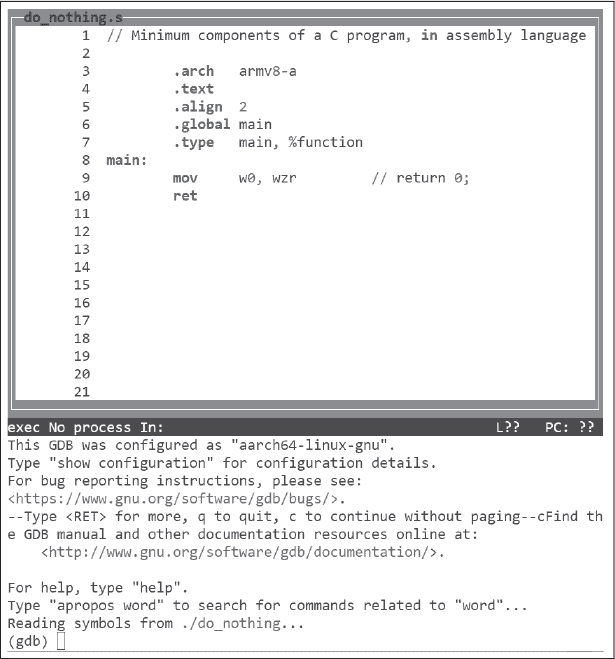
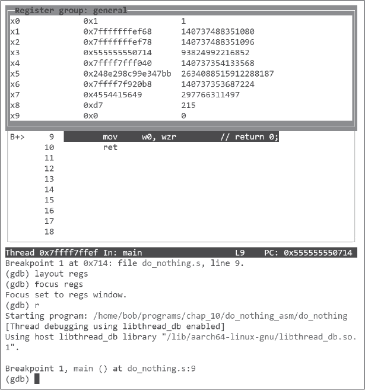
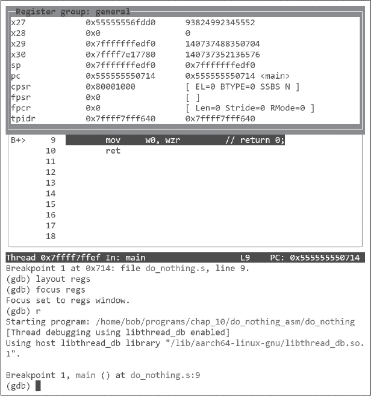
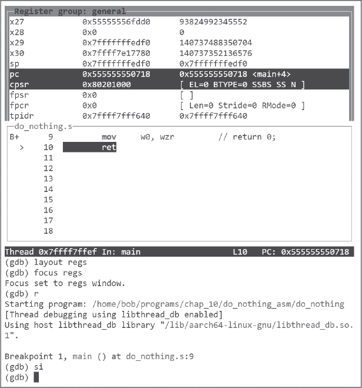
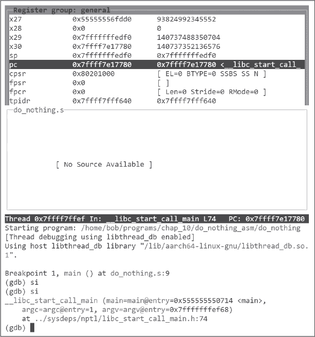
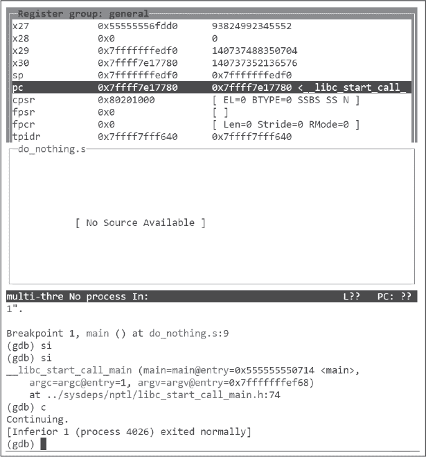

## 第十章：**汇编语言编程**


在前面的章节中，你学习了计算机如何使用`1`和`0`表示操作和数据。这些`1`和`0`就是*机器语言*。现在，我们将转向机器级编程。我们不再使用机器语言，而是使用*汇编语言*，它为每条机器语言指令提供一个简短的助记符。我们将使用*汇编器*程序将汇编语言翻译成控制计算机的机器语言指令。

创建汇编语言程序类似于在高级编译语言中创建程序，如 C、C++、Java 或 FORTRAN。我将使用 C 作为编程模型，探索所有高级编程语言中常见的主要编程构造和数据结构。我们使用的编译器`gcc`允许我们查看它生成的汇编语言。从这里开始，我将向你展示如何直接在汇编语言中实现编程构造和数据结构。

我们将首先查看编译器将 C 源代码转换为可执行程序的步骤。接下来，我将讨论这些步骤中哪些适用于汇编语言编程，并带你完成直接在汇编语言中创建一个可以在 C 托管环境中运行的程序的过程。你还将学习到一个对学习汇编语言很有用的`gdb`模式。

在阅读本章时，你还应该参考 Raspberry Pi OS 中与本文讨论的程序相关的 man 页面和`info`文档资源。你可能需要在你的 Raspberry Pi 上安装其中的一些程序，具体请参考《编程环境》中的第 4 页。

在本书的其余部分，我将经常使用 GNU 汇编程序`as`。有些人称这个汇编器为`gas`，是*GNU 汇编器*的简称。我会解释你需要了解如何使用`as`程序，但我建议你获取一份*Using as*手册，以便在我们继续时学习详细信息。它可以在*https://www.gnu.org/manual/manual.html*的 GNU Binutils 集合中的软件开发部分找到。

### **从 C 开始**

`gcc`编译器通过执行几个不同的步骤，从一个或多个源文件创建可执行程序。每个步骤生成一个中间文件，作为下一个步骤的输入。这里对每个步骤的描述假设只有一个 C 源文件，*filename.c*：

**预处理**

预处理是第一步。此步骤通过调用程序`cpp`来解析*预处理指令*，如`#include`（文件包含）、`#define`（宏定义）和`#if`（条件编译）。每个预处理指令都以`#`字符开头，可能会被发音或不发音——例如，你可能会听到`#include`指令被称为*include*、*pound-include*、*hash-include*或*hashtag-include*。

编译过程可以在预处理阶段结束时使用`-E`选项停止，该选项会将结果 C 源代码写入*标准输出*。标准输出是来自 Linux 命令行程序的纯文本输出，通常连接到终端窗口。你可以使用`>`操作符将输出重定向到文件，如下所示：

```
$ gcc -Wall -O0 -E <filename.c> > <filename.i>
```

*.i*文件扩展名表示一个不需要预处理的文件。

**编译**

接下来，编译器将预处理后得到的源代码翻译成汇编语言。编译过程可以在编译阶段结束时使用`-S`选项（大写字母 S）停止，该选项会将汇编语言源代码写入*<filename>.s*文件。

**汇编**

在编译器生成实现 C 源代码的汇编语言后，汇编程序`as`将汇编语言翻译成机器代码（指令和数据）。可以在汇编阶段结束时使用`-c`选项停止此过程，该选项会将机器代码写入名为*<filename>.o*的*目标文件*。除了机器代码外，目标文件还包括关于代码的元数据，链接器使用这些元数据来解析不同模块之间的交叉引用，确定如何定位程序的不同部分等。它还包括关于模块的元数据，供调试器使用。

**链接**

`ld`程序确定每个函数和数据项在程序执行时将位于内存中的位置。它将程序员的标签替换为该标签的内存地址。如果调用的函数在外部库中，则在调用该函数的位置会注明，并且外部库函数的地址会在程序执行时确定。

编译器指示`ld`程序将计算机代码添加到设置 C 托管环境的可执行文件中。这包括打开路径到标准输出（屏幕）和标准输入（键盘）等操作，以供程序使用。

这个链接的结果会写入一个可执行文件。可执行文件的默认名称是*a.out*，但你可以使用`-o`选项指定其他名称。

如果你没有使用任何 `gcc` 选项来在这些步骤的末尾停止进程（`-E`、`-S`、`-c`），编译器会执行所有四个步骤并自动删除中间文件，最终只留下可执行程序。如果你希望 `gcc` 保留所有中间文件，可以使用 `-save-temps` 选项。

能够在中途停止 `gcc` 的补充功能是，我们可以提供已经有效通过早期步骤的文件，`gcc` 会将这些文件融入到剩下的步骤中。例如，如果我们写了一个汇编语言文件（*.s*），`gcc` 会跳过预处理和编译步骤，只对该文件执行汇编和链接步骤。如果我们只提供目标文件（*.o*），`gcc` 会直接进入链接步骤。这的一个隐性好处是，我们可以编写调用 C 标准库函数的汇编程序（这些库函数已经是目标文件格式），并且 `gcc` 会自动将我们的汇编程序与这些库函数链接。

在命名文件时，务必使用 GNU 编程环境中指定的文件扩展名。编译器在每个步骤的默认操作取决于该步骤所适用的文件扩展名。要查看这些命名约定，请在命令行输入 `info gcc`，选择 **调用 GCC**，然后选择 **整体选项**。如果你没有使用指定的文件扩展名，编译器可能不会按你想要的方式操作，甚至可能会覆盖一个必需的文件。

#### ***从 C 到汇编语言***

用 C 语言编写的程序是按函数组织的。每个函数在程序中都有一个唯一的名称。在 C 环境设置好后，会调用 `main` 函数，因此我们的程序将从 `main` 函数开始。

让我们先看看 `gcc` 为清单 10-1 中的最小 C 程序生成的汇编语言代码，清单 10-1 中可以找到。

*do_nothing.c*

```
// Minimum components of a C program

int main(void)
{
    return 0;
}
```

*清单 10-1：最小的 C 程序*

这个程序除了向操作系统返回 0 外什么也不做。程序可以返回各种数值错误代码；0 表示程序没有检测到任何错误。

尽管这个程序几乎不做任何事，但仍需要执行一些指令才能返回 0。为了看到发生了什么，我们将首先使用以下 Linux 命令将这个程序从 C 语言翻译成汇编语言：

```
$ gcc -Wall -O0 -S do_nothing.c
```

**注意**

*如果你不熟悉 GNU* make *程序，值得学习如何使用它来构建程序。现在看起来可能有点过于复杂，但在简单的程序中学习要容易得多。手册可以在* [`www.gnu.org/software/make/manual/`](https://www.gnu.org/software/make/manual/) *获取，另外我在我的网站上也有一些使用它的评论，网址是* [`rgplantz.github.io`](https://rgplantz.github.io)。

在展示该命令的结果之前，我将解释我使用的选项。`-O0`（大写字母 O 和数字零）选项告诉编译器不要使用任何优化。这与本书的目标一致，目的是展示机器层面上发生的事情；要求编译器优化代码可能会掩盖一些重要的细节。

你已经学过，`-Wall`选项会让编译器在代码中遇到可疑的结构时发出警告。对于这个简单的程序来说，这不太可能成为问题，但养成这个好习惯是很有帮助的。

`-S`选项指示编译器在编译阶段后停止，并将编译结果写入一个文件，该文件的名称与 C 源代码文件相同，但扩展名为*.s*，而不是*.c*。之前的编译器命令生成了列表 10-2 中显示的汇编语言，并将其保存在文件*do_nothing.s*中。

*do_nothing.s*

```
        .arch armv8-a
        .file   "do_nothing.c"
        .text
        .align  2
        .global main
        .type   main, %function
main:
.LFB0:
        .cfi_startproc
        mov     w0, 0
        ret
        .cfi_endproc
.LFE0:
        .size   main, .-main
        .ident  "GCC: (Debian 10.2.1-6) 10.2.1 20210110"
        .section .note.GNU-stack,"",@progbits
```

*列表 10-2：编译器生成的最小 C 程序汇编语言*

在列表 10-2 中，首先需要注意的是汇编语言是按行组织的。每行只包含一个汇编语言语句，且没有语句跨越多行。这与许多高级语言的自由格式结构不同，后者行结构无关紧要。实际上，好的程序员会利用编写多行语句和缩进来强调代码结构。优秀的汇编语言程序员使用空行来帮助分隔算法的不同部分，并且几乎在每行代码上都加上注释。

这些行大致上被组织成列。此时它们可能对你没有多大意义，因为它们是用汇编语言编写的，但如果你仔细观察，每一行都会组织成四个可能的字段：

```
label: operation operand(s)   // comment
```

并不是所有的行都会在所有字段中都有条目。汇编程序要求至少有一个空格或制表符字符来分隔字段。当编写汇编语言时，如果你使用 TAB 键从一个字段跳到下一个字段，使列对齐，那么你的程序会更容易阅读。

让我们更详细地看一下每个字段：

标签 该字段允许我们为程序中的内存地址指定一个符号名称。程序的其他部分可以通过名称引用该内存地址。标签由一个标识符组成，后面紧跟一个`:`字符。稍后我会讲解创建标识符的规则。只有需要引用的行才会被标记。

操作 该字段包含一个*指令操作码（opcode）*或一个*汇编指令*（有时称为*伪操作*）。汇编程序将操作码及其操作数转换为机器指令，当程序执行时，这些指令会被复制到内存中。汇编指令是给汇编程序的指令，用来指导汇编过程。

操作数 该字段指定用于操作的参数。参数可以是明确的值、寄存器的名称或程序员创建的名称。根据操作的不同，操作数的数量可以是零到多个。

注释 在`//`字符后面的行内容（`//`后面的部分）会被汇编器忽略，从而为程序员提供了写可读注释的方式。由于汇编语言不像高级语言那么容易阅读，因此优秀的程序员会在几乎每一行代码上加上注释。当然，编译器没有为清单 10-2 中的代码添加注释，因为它无法知道程序员的意图。

你可能已经注意到，清单 10-2 中的大多数操作符都以`.`字符开头。这些是汇编指令。每个汇编指令都以`.`字符开头，这个字符可能会发音或不发音——例如，你可能听到`.text`被称为*text*或*dot-text*。这些是对汇编程序本身的指令，而不是计算机指令。编译器生成了一些我们在本书中编写的汇编语言中不需要的汇编指令；接下来我们将快速看一下这些指令，然后再看必需的指令。

#### ***未使用的汇编指令***

清单 10-2 中以`.cfi`开头的汇编指令告诉汇编器生成可用于调试和某些错误情况的信息。以`.LF`开头的标签标记了在代码中用于生成这些信息的位置。对此的讨论超出了本书的范围，但它们出现在清单中可能会造成混淆，因此我们将告诉编译器不要在汇编语言文件中包含它们，方法是使用`-fno-asynchronous-unwind-tables`和`-fno-unwind-tables`选项：

```
$ gcc -Wall -O0 -S -fno-asynchronous-unwind-tables -fno-unwind-tables do_nothing.c
```

这将生成文件*do_nothing.s*，如清单 10-3 所示。我用了粗体来显示我们将使用的指令，未使用的指令则未加粗。编译器没有对这个清单中的汇编语言代码添加注释，但我使用`///`添加了我自己的注释，帮助你看到与 C 源代码的关系。我将在本书中展示的许多编译器生成的汇编语言清单中加入自己的注释。

*do_nothing.s*

```
        .arch armv8-a
        .file   "do_nothing.c"
        .text
        .align  2
        .global main
        .type   main, %function
main:
        mov     w0, 0           /// return 0;
        ret
        .size   main, .-main
        .ident  "GCC: (Debian 10.2.1-6) 10.2.1 20210110"
        .section        .note.GNU-stack,"",@progbits
```

*清单 10-3：编译器生成的没有.cfi 指令的最小 C 程序汇编语言*

我们已经去除了`.cfi`指令，但在编写自己的汇编语言函数时，仍然有一些汇编指令是我们不需要的。这些包括：

.file `gcc`用它来指定这个汇编语言来自哪个 C 源文件。当直接编写汇编语言时，这个指令不会被使用。

.size 此指令计算由汇编该文件所生成的机器代码的大小（以字节为单位）。` .` 符号表示代码中的当前地址，因此算术表达式 `.-main` 从当前地址减去 `main` 的地址。`.size` 指令将此值与 `main` 标签相关联，作为目标文件中的元数据的一部分，从而给出该函数的字节数。这对于内存有限的系统可能是有用的信息，但在我们的程序中并不关心。

.ident 该指令提供有关所使用的编译器的信息，这些信息会包含在目标文件中。这在经历多年的发展过程中的大型项目中可能会有用，但我们不需要它。

.section 该指令为链接器提供关于如何处理该函数栈的信息。我们不会包含它，而是接受链接器的默认设置。

接下来，我们将查看编写汇编语言时需要的指令。

#### ***必需的汇编指令***

必需的汇编指令在 清单 10-3 中以粗体显示。

ARM 指令集架构有多个变种，并且它还在不断发展。`.arch` 汇编指令告诉汇编器我们正在使用哪种 ARM 架构。如果我们使用了在特定架构中不可用的指令，它会提醒我们。对于本书中编写的简单程序来说，`.arch` 指令可以说并非必须，但我们将使用它以确保安全。

`.text` 汇编指令告诉汇编器将后续内容放置在文本区。*文本区*是什么意思？在 Linux 中，汇编器生成的目标文件采用 *可执行与可链接格式（ELF）*。ELF 标准规定了许多类型的段，每个段指定了存储在其中的信息类型。我们使用汇编指令告诉汇编器将代码放置在哪个段中。文本段是存放程序可执行指令的地方。

Linux 操作系统在将程序从磁盘加载时，还将内存分为多个*段*以供特定用途。链接器将属于每个段的所有部分汇总在一起，输出一个按段组织的可执行 ELF 文件，这样可以更容易地让操作系统将程序加载到内存中。四种常见的段类型如下：

**文本（也叫代码）** *文本段*是存放程序指令和常量数据的地方。操作系统防止程序修改存储在文本段中的内容，使其变为只读。

**数据** 全局变量和静态局部变量存储在*数据段*中。全局变量可以被程序中的任何函数访问。静态局部变量只能被其所在的函数访问，但其值在多次调用该函数之间保持不变。程序可以同时读取和写入数据段中的变量。这些变量在程序运行期间保持不变。

**堆栈** 自动局部变量和链接函数的信息存储在*调用堆栈*中。自动局部变量在调用函数时创建，在函数返回调用函数时删除。程序可以同时读取和写入堆栈上的内存；它在程序执行过程中动态分配和释放。

**堆** *堆*是一个程序运行时可以使用的内存池。C 程序通过调用 `malloc` 函数（C++ 程序调用 `new`）从堆中获取一块内存。程序可以同时读取和写入堆内存；它用于存储数据，并通过在程序中调用 `free`（在 C++ 中是 `delete`）显式释放。

**注意**

*这是 ELF 节和段的简化概述。更多细节，请阅读 ELF 的 man 页面以及像《ELF-64 Object File Format》这样的资源，你可以在* [`uclibc.org/docs/elf-64-gen.pdf`](https://uclibc.org/docs/elf-64-gen.pdf) *下载，* 以及 John R. Levine 的《Linkers & Loaders》（Morgan Kaufmann，1999）。* readelf *程序也对于了解 ELF 文件非常有用。*

`.align` 指令用于将其后面的代码对齐到一个地址边界。在清单 10-3 中使用的参数 `2`，根据你使用的平台有不同的含义。在 ARM 平台上，它指定程序计数器中应为 `0` 的低位数。如果这些位不是 `0`，汇编器将增加地址，直到它们为 `0`。因此，跟随 `.align 2` 指令的代码将从一个完整字对齐的地址开始。

`.global` 指令有一个参数，即标识符 `main`。`.global` 指令使得该名称在全局范围内可见，这样在其他文件中定义的函数就可以引用该名称。设置 C 托管环境的代码是为了调用名为 `main` 的函数，因此该名称必须是全局作用域。在所有 C/C++ 程序中，程序都从 `main` 函数开始。在本书中，我也将从 `main` 函数开始汇编语言程序，并在 C 托管环境中执行它们。

你可以编写不依赖于 C 托管环境的独立汇编语言程序，在这种情况下，你可以为程序中的第一个函数创建自己的名称。你需要在汇编步骤结束时使用 `-c` 选项停止编译过程。然后，你可以单独使用 `ld` 命令链接目标 (*.o*) 文件，而不是作为 `gcc` 的一部分。我将在第二十一章中详细描述这一点。

`.type` 指令有两个参数：`main` 和 `@function`。这使得标识符 `main` 被记录在目标文件中，作为函数的名称。

这最后三个指令并没有被翻译成实际的机器指令。相反，它们用于描述随后的语句的特性。在下一章中，我们将开始看到汇编指令，它们将常量数据存储到内存中供程序使用。

现在你已经看到编译器是如何将 C 代码翻译成汇编语言的，接下来我们来看看如何直接用汇编语言编写程序。在导言中，我曾说过你应该避免用汇编语言编写程序。但本书的目标是帮助你了解计算机在机器级别的工作原理。直接用汇编语言编写程序比仅仅阅读编译器的工作要更好地帮助学习。

### **从汇编语言开始**

清单 10-4 是由一位程序员（我）用汇编语言编写的，而不是由编译器编写的。自然，我添加了注释来解释我的代码完成了什么。

*do_nothing.s*

```
  // Minimum components of a C program, in assembly language

          .arch   armv8-a
          .text
          .align  2
          .global main
          .type   main, %function
➊ main:
        ➋ mov     w0, wzr  // return 0;
           ret
```

*清单 10-4：用汇编语言编写的最简化 C 风格程序*

第一行以两个斜杠 `//` 开始。紧随这两个字符之后的所有内容，直到行尾，都是注释，不会引发汇编程序的任何操作。注释可以在一行的任何地方以两个斜杠开始。与高级语言一样，它们仅供人类读者参考，对程序没有任何影响。

这一行注释后面跟着一个空行，也不会引发汇编程序的任何操作，但对于人类可读性非常有帮助。

关于程序注释的一点说明。初学者常常注释编程语句做了什么，而不是它相对于解决问题的目的。你的注释应该描述你*做了什么*，而不是计算机做了什么。例如，像这样的注释

```
counter = 1;  // Let counter = 1
```

在 C 中并不是很有用。但像这样的注释

```
counter = 1;  // Need to start at 1
```

这可能非常有用。

在我们在汇编语言程序中使用的五个汇编指令（在前一节中已描述）之后，我们看到了标签 `main`，它位于此函数的第一个内存地址❶。通常将标签放在单独的一行，这样它适用于占用内存的下一个汇编语言语句❷。这种做法可以让你创建更长、更有意义的标签，同时保持代码的列组织，以提高可读性。

#### ***汇编语言中的符号名称***

由于这是程序中的顶级函数，因此需要使用标签`main`，但我们很快就会编写需要创建自己名称的程序。创建符号名称的规则与 C/C++类似。每个名称必须以字母或字符`.`或`_`开头，后面跟随字母、数字和/或`$`和`_`字符。第一个字符不能是数字，除了本地标签，稍后会描述。一个名称的长度没有限制，所有字符都具有意义。虽然关键字（操作符、寄存器名称、指令）的字母大小写不重要，但标签的大小写是有区别的。例如，`my_label`和`My_label`是不同的。编译器生成的标签以`.`字符开头，许多与系统相关的名称以`_`字符开头；最好避免以这些字符开头，以免无意中创建与系统中已有标签重复的标签。

我们的汇编器还允许我们使用无符号整数 N 来创建*本地标签*。你的汇编语言代码可以将这些标签作为 N`b`（最近使用的 N *向后*）和 N`f`（下一个使用的 N *向前*）来引用。这意味着你可以有多个本地标签使用相同的数字。虽然看起来这会简化你的代码编写，但使用本地标签通常不是一种好的编程技巧，因为标签的名称没有显示其目的。

#### ***汇编语言指令的基本格式***

ARM 指令分为三类：加载与存储、数据处理和程序流控制。我们将首先查看汇编语言指令的一般格式。我不会列出所有 A64 指令，而是一次介绍几个—那些能说明当前编程概念的指令。我还将只提供这些指令的常用变体。

要详细了解指令及其所有变体，可以从*【https://developer.arm.com/documentation/ddi0487/latest](https://developer.arm.com/documentation/ddi0487/latest)*下载*Arm 架构参考手册（A-Profile 架构）*。这本手册可能有些难读，但通过在本书中对指令的描述与手册中的描述之间来回查阅，应该能帮助你学会如何阅读这本手册。

汇编语言提供了一组助记符，这些助记符与机器语言指令直接对应。*助记符*是一个简短、类似英语的字符组合，用来表示指令的操作。即使你之前从未接触过汇编语言，清单 10-4 ❷中的`mov w0, wzr`指令可能比它代表的机器码`0x2a1f03e0`更容易理解。你大概可以推断出它是将 32 位零寄存器`wzr`的内容移动到`w0`寄存器中。接下来的几段内容将解释这是什么意思。

严格来说，助记符是完全任意的，只要你有一个汇编程序能将它们转换为期望的机器指令。然而，大多数汇编程序遵循 CPU 厂商提供的手册中使用的助记符。

ARM 使用*加载与存储架构*，这意味着数据项必须先加载到寄存器中，或者是指令的一部分，才能在算术或逻辑操作中使用。

加载或存储指令的通用格式是：

```
operation register, memory_address
```

memory_address 是内存地址的标签，或者是包含地址的寄存器的名称。加载指令将数据项从 memory_address 复制到寄存器。存储指令将数据项从寄存器复制到 memory_address。在大多数情况下，你将仅处理每个加载或存储指令的一个数据项，但 A64 架构包括允许你在一条指令中处理两个数据项的加载与存储指令，你将在第十一章中看到它是如何工作的。

数据处理指令——算术和逻辑操作——具有以下通用格式：

```
operation register(s), source(s)
```

第一个操作数是操作结果存放的地方。有些指令使用两个寄存器存放结果。源操作数可以有一个到三个，可以是寄存器或*立即数值*。立即数值是一个明确的常量。

控制程序流程的指令具有以下通用格式：

```
operation memory_address
```

或：

```
operation data, memory_address
```

memory_address 是内存地址的标签，或者是包含地址的寄存器的名称。数据必须存储在寄存器中或作为立即数值。

#### ***指令描述中使用的符号***

以下是我将在本书中描述指令时使用的符号列表，这些符号与 Arm 手册中使用的符号略有不同：

wd 用于操作结果的 32 位目标寄存器。

xd 一个 64 位目标寄存器，用于存放操作结果。

ws**,** wn 用于操作的 32 位源寄存器。如果有多个源寄存器，它们将按编号排列。

xs**,** xn 用于操作的 64 位源寄存器。如果有多个源寄存器，它们将按编号排列。

xb**,** xn 保存基地址的 64 位寄存器。

offset 加到基地址上的常量数值。

imm 一个常量数值，其大小取决于指令。

amnt 用于移位源操作数的位数。

addr 一个地址，通常是标签。

cond `nzcv`寄存器中位的逻辑组合。

xtnd 指定在操作中使用的操作数的扩展版本。

{} 表示一个或多个操作数是可选的。

| 表示可以使用左侧或右侧的操作数。

寄存器可以是第九章中描述的 31 个通用寄存器中的任何一个。大多数指令也允许我们使用`wzr`、`xzr`、`wsp`和`sp`寄存器。

#### ***第一类指令***

再次强调，我不会描述所有的指令，也不会描述所有我所描述的指令的变体。我的目的是为你提供理解本书中介绍的编程概念所需的信息，并让你能够在需要时舒适地使用其他资源。

让我们从最常用的汇编语言指令 `mov` 开始。以下是该指令的一些变体；更多内容可以在 Arm 手册中找到：

mov**—移动寄存器**

`mov w`d, `w`s `|wzr` 将 `w`s 或 `wzr` 中的 32 位值复制到 `w`d，并将 `x`d 的第 63 到 32 位置为 0。

`mov x`d, `x`s `|xzr` 将 `x`s 或 `xzr` 中的 64 位值复制到 `x`d。

mov**—移动到或从** sp

`mov x`d `|sp, x`s `|sp` 将 `x`s 或 `sp` 中的 64 位值复制到 `x`d 或 `sp`。

mov**—移动立即数**

`mov w`d, `imm` 将 16 位的值 imm 复制到 `w`d 的低位部分，并将 `x`d 的第 63 到 16 位置为 0。

`mov x`d, `imm` 将 16 位的值 imm 复制到 `x`d 的低位部分，并将 `x`d 的第 63 到 16 位置为 0。

movz**—移动立即数并清零**

`movz w`d, `imm`{, lsl` amnt`} 将 16 位的值 imm 复制到 `w`d，并可选择将该值左移 amnt 位。`x`d 的其他 48 位被设置为 `0`。amnt 可以是 `0`（默认）或 `16`。

`movz x`d, `imm`{, lsl` amnt`} 将 16 位的值 imm 复制到 `x`d，并可选择将该值左移 amnt 位。`x`d 的其他 48 位被设置为 `0`。amnt 可以是 `0`（默认）、`16`、`32` 或 `48`。

movk**—移动立即数并保留**

`movk w`d, `imm`{, lsl` amnt`} 将 16 位的值 imm 复制到 `w`d，并可选择将该值左移 amnt 位。`x`d 的其他 48 位不变。amnt 可以是 `0`（默认）或 `16`。

`movk x`d, `imm`{, lsl` amnt`} 将 16 位的值 imm 复制到 `x`d，并可选择将该值左移 amnt 位。`x`d 的其他 48 位不变。amnt 可以是 `0`（默认）、`16`、`32` 或 `48`。

movn**—移动立即数并取反**

`movn w`d, `imm`{, lsl` amnt`} 将 16 位的值 imm 取反后复制到 `w`d，并可选择将该值左移 amnt 位。`x`d 的其他 48 位被设置为 `1`。amnt 可以是 `0`（默认）或 `16`。

`movn x`d, `imm`{, lsl` amnt`} 将 16 位的值 imm 取反后复制到 `x`d，并可选择将该值左移 amnt 位。`x`d 的其他 48 位被设置为 `1`。amnt 可以是 `0`（默认）、`16`、`32` 或 `48`。

在示例 10-4 中，唯一的其他指令是 `ret`，它会导致返回到调用函数，假设返回地址在 `x30` 中：

ret**—从函数返回**

`ret` 将 `x30` 中的地址移动到程序计数器 `pc`。

现在你明白我为什么在第九章中说 `x30` 通常用作链接寄存器了：当函数被调用时，返回地址会被放入 `x30`。我们将在第十一章中看到函数调用时它是如何工作的。

`gdb`最有价值的用途之一就是作为学习工具。它有一种模式，特别有助于学习每条汇编语言指令的作用。我将在下一节中向你展示如何使用示例 10-4 中的程序来做到这一点。这也将帮助你更熟悉使用`gdb`，这是调试程序时必须掌握的一项重要技能。

### **使用 gdb 学习汇编语言**

在这里你可以运行示例 10-4 中的程序，跟随讨论的步骤进行。你可以使用以下命令来汇编、链接和执行它：

```
$ as --gstabs -o do_nothing.o do_nothing.s
$ gcc -o do_nothing do_nothing.o
$ ./do_nothing
```

`--gstabs`选项（注意这里有两个短横线）告诉汇编器在目标文件中包含调试信息。`gcc`程序识别到唯一的输入文件已经是一个目标文件，所以它直接进入链接阶段。无需告诉`gcc`包含调试信息，因为汇编器已经将其包含在目标文件中。

正如你从名字中猜到的，运行这个程序时，屏幕上不会显示任何内容。我们将使用`gdb`来逐步执行程序，这样我们就可以看到这个程序实际上是做了什么的。

`gdb`调试器有一种模式，可以在执行每条汇编语言指令时查看其效果。*文本用户界面（TUI）*模式将终端窗口分为上部的显示窗格和下部的常规命令窗格。显示窗格还可以进一步分成两个显示窗格。

每个显示窗格可以显示源代码（`src`）、寄存器（`regs`）或反汇编的机器代码（`asm`）。*反汇编*是将机器代码（`1`和`0`）转换为相应的汇编语言的过程。反汇编过程无法识别程序员定义的名称，因此你只能看到由汇编和链接过程生成的数值。我们在第十二章中查看指令细节时，`asm`显示可能更有用。

使用 TUI 模式的文档可以在`gdb`的`info`中找到。我将在这里简单介绍如何使用 TUI 模式，使用我们从示例 10-4 中的汇编语言版本的`do_nothing`。我将逐步讲解每一条指令。你将在“轮到你了”部分的练习 10.1 中有机会逐条执行这些指令，详见第 205 页。

**注意**

*我的示例展示了* gdb *从命令行运行的情况。我被告知，如果尝试在 Emacs 中运行* gdb *，可能效果不佳。*

正如我们在第二章中所做的，我们将通过`gdb`运行`do_nothing`，但这次我们将使用 TUI 模式：

```
$ gdb -tui ./do_nothing
```

这应该会显示类似于图 10-1 中的屏幕。请注意，图 10-1 到 图 10-7 已放大以便阅读；根据你的终端窗口设置，屏幕显示可能有所不同。



*图 10-1：在 TUI 模式下启动* gdb *会显示* src *视图。*

输入 c 以继续显示此截图中的初步消息。

接下来，在程序的第一条指令处设置断点，并设置显示布局。在 TUI 模式中有几种显示布局可供选择。我们将使用图 10-2 中显示的 `regs` 布局。



*图 10-2：将* regs *显示面板添加到 TUI 窗口中*

`layout regs` 命令将显示面板分为 `regs` 面板和 `src` 面板。我在告诉 `gdb` 运行程序之前，将焦点移至 `regs` 面板。程序开始时，`x0` 寄存器的值为 `0x1`（你的值可能不同）。即将执行的程序指令已被高亮显示。

显示面板的大小不足以显示所有的 A64 寄存器。聚焦在 `regs` 面板上，使用上下箭头键以及 page up 和 page down 键滚动浏览寄存器显示。我按下了三次 page down 键，以便查看图 10-3。



*图 10-3：查看其他寄存器*

`x30` 寄存器中的值显示了程序执行完毕后将返回到 C 托管环境的地址。你将在图 10-6 中看到这个过程。`pc` 中的值是我们 `main` 函数中的第一条指令的地址。

让我们告诉 `gdb` 执行一条指令，如图 10-4 所示。



*图 10-4：寄存器的变化已被高亮显示。*

在图 10-4 中，`gdb` 高亮显示了即将执行的下一条指令以及已更改的寄存器。我们知道 `pc` 会发生变化，因为我们执行了一个指令。

已执行的指令更改了 `x0`，但这在图 10-4 中的 `regs` 显示面板中没有显示。我使用了 page up 键来查看图 10-5 中的 `x0`。


*图 10-5：查看刚执行的指令更改的寄存器*

`x0` 寄存器在图 10-5 中被高亮显示，以显示它已发生变化。

接下来，我们将告诉 `gdb` 执行 `ret` 指令，这应该会把我们带回 C 托管环境，如图 10-6 所示。



*图 10-6：回到 C 托管环境*

`ret` 指令将链接寄存器 `x30` 中的地址复制到 `pc`，从而实现了从 `main` 函数的返回。

最后，我们继续执行图 10-7 中的程序。



*图 10-7：程序已完成。*

剩下的就是退出`gdb`。

**你的回合**

10.1     在清单 10-4 中输入程序，并使用`gdb`单步执行代码。

10.2     用汇编语言编写以下 C 函数：

```
int f(void) {

    return 0;
}
```

确保没有错误地汇编。使用`-S`选项编译*f.c*并将`gcc`的汇编语言与您的汇编语言进行比较。编写一个 C 语言的`main`函数来测试您的汇编语言函数`f`，并打印出该函数的返回值。

10.3     编写三个只返回整数的汇编语言函数。它们每个应该返回一个不同的非零整数。编写一个 C 语言的`main`函数来测试您的汇编语言函数，并使用`printf`打印出这些函数的返回值。

10.4     编写三个只返回字符的汇编语言函数。每个函数应返回一个不同的字符。编写一个 C 语言的`main`函数来测试您的汇编语言函数，并使用`printf`打印出这些函数的返回值。

### **你学到了什么**

**编辑器** 用于编写选定编程语言程序源代码的程序。

**预处理** 编译的第一阶段。它将其他文件引入源代码，解释指令等，为实际编译做准备。

**编译** 将选定的编程语言翻译成汇编语言。

**汇编** 将汇编语言翻译成机器语言。

**链接** 将单独的目标代码模块和库链接在一起，生成最终的可执行程序。

**汇编指令** 在汇编过程中指导汇编程序。

mov **指令** 在 CPU 内部移动值。

ret **指令** 将程序流返回到调用函数。

gdb **TUI 模式** 当你逐步执行程序时，实时显示寄存器的变化。这是一个非常好的学习工具。

你可能会想，如果我们从`main`调用另一个函数，那么`x30`中的返回地址会发生什么。为了使用`x30`作为链接寄存器调用另一个函数，我们需要在执行另一个函数时将返回地址保存到某个地方。你将在下一章学习如何做到这一点，我们将详细讨论如何向函数传递参数，如何使用调用栈，以及如何在函数中创建局部变量。
