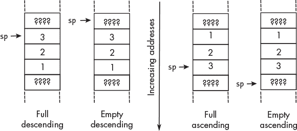
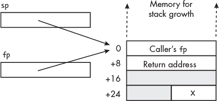

## 第十一章：**在主函数内部**


正如你在第十章中学到的，C 程序开始时会执行一个名为`main`的函数，该函数从 C 宿主环境中的启动函数调用。`main`函数将调用其他函数（*子函数*）来执行大部分处理。即使是一个简单的“Hello, World!”程序，也需要调用另一个函数来在屏幕上显示消息。

在本章中，我们将重点讲解`main`函数，但这些概念适用于我们将编写的所有函数。我们将从详细了解调用栈开始，它用于保存值和局部变量。然后，我们将探讨如何在函数中处理数据，以及如何将参数传递给其他函数。最后，我将通过向你展示如何使用这些知识来编写汇编语言中的`main`函数来结束本章。

### **使用调用栈**

*调用栈*，通常简称为*栈*，是创建局部变量和在函数中保存项目的非常有用的地方。在我们讲解如何使用栈来完成这些目的之前，你需要了解栈是什么以及它是如何工作的。

#### ***栈的一般操作***

栈是一种线性数据结构，创建于内存中用于存储数据项。数据项的插入（或删除）只能在栈的一端进行，这一端被称为*栈顶*。程序通过*栈指针*来跟踪栈顶。

非正式地，你可以把栈想象成像架子上的餐盘堆叠。你只需要能够访问栈顶的那个项目。（是的，如果你从栈的某个地方取出餐盘，可能会弄坏一些东西。）栈有两个基本操作：

push data_item 将 data_item 放置到栈顶，并将栈指针移动到指向此最新项。

pop location 将栈顶的项目移动到位置，并将栈指针移动到指向栈顶当前的项目。

栈是一种*后进先出（LIFO）*数据结构。最后被推入栈的项将是第一个被弹出的项。

为了说明栈的概念，我们继续使用餐盘的例子。假设我们有三个颜色不同的餐盘：一个红色的放在餐桌上，一个绿色的放在厨房台面上，另一个蓝色的放在床头柜上。我们将它们按照以下方式堆叠在架子上：

1.  推入红色餐盘。

1.  推入绿色餐盘。

1.  推入蓝色餐盘。

到这个时刻，我们的餐盘堆叠看起来像图 11-1。


*图 11-1：堆叠的三个餐盘*

现在我们执行下一个操作：

1.  从厨房台面弹出。

这将把蓝色餐盘移到厨房台面（回想一下，蓝色餐盘之前是放在床头柜上的），并留下如图 11-2 所示的餐盘堆叠。


*图 11-2：一个晚餐盘已从栈中弹出。*

如果你猜到栈很容易被搞砸，那么你是对的。栈必须按照严格的规则使用。在任何一个函数内：

+   在弹出任何东西之前，始终先将项推入栈中。

+   永远不要弹出比你推入的更多的东西。

+   永远弹出所有你已经推入栈中的项。

如果你对推入栈中的项没有使用需求，可以将栈指针设置回函数最初进入时的位置。这相当于丢弃已弹出的项。（我们的晚餐盘比喻在这里就不成立了。）

维持这一纪律的一个好方法是将栈的使用类比于代数表达式中的括号。推入栈就像左括号，而弹出则像右括号。括号对可以嵌套，但必须匹配。试图向栈中推入过多项的情况叫做*栈溢出*。试图弹出栈底以下的项叫做*栈下溢*。

栈是通过专门分配一块连续的主内存区域来实现的。栈可以在内存中向任何一个方向增长，向更高的地址或更低的地址。*上升栈*向更高的地址增长，*下降栈*向更低的地址增长。栈指针可以指向栈顶的项，即*满栈*，也可以指向下一个将被推入栈中的项所在的内存位置，即*空栈*。这四种可能的栈实现方式如图 11-3 所示，其中整数 1、2 和 3 按顺序推入栈中。注意，在这个图中，内存地址是*向下增加*的，这是我们通常在`gdb`调试器中查看的方式。



*图 11-3：实现栈的四种方式*

我们环境中的调用栈是一个*满的下降栈*。要理解这个选择，想想你可能如何在内存中组织事物。回想一下控制单元在程序执行时会自动递增程序计数器。程序的大小差异巨大，因此将程序指令存储在较低的内存地址处，可以在程序大小上提供最大的灵活性。

栈是一个动态结构。你无法预测任何给定程序执行时所需的栈空间，因此也不可能知道需要分配多少空间。为了分配尽可能多的空间，同时避免与程序指令发生冲突，应从最高的内存地址开始分配栈空间，并让它向较低的地址增长。

这是一个高度简化的对栈在内存中“向下”增长的实现方式的合理化解释。程序中各个元素在内存中的组织比这里所描述的要复杂得多，但这可能帮助你理解为什么这种看起来有些奇怪的实现方式实际上是有充分理由的。

A64 架构没有`push`和`pop`指令。它有允许你有效地将项目推入栈或从栈中弹出项目的指令，但栈上的大多数操作都是通过在调用栈上分配内存并直接将项目存储到该内存或从中加载项目来完成的。接下来，我们将看看函数如何使用调用栈。

#### ***栈帧***

每个调用其他函数的函数都需要在栈上为被调用函数分配内存，用于保存项目和存储局部变量。这块分配的内存叫做*栈帧*或*激活记录*。为了理解这一过程，我们将从一个包含一个局部变量并调用两个 C 标准库函数的程序开始：`printf`和`scanf`。该程序见列表 11-1。

*inc_int.c*

```
// Increment an integer.

#include <stdio.h>

int main(void)
{
    int x;

    printf("Enter an integer: ");
    scanf("%i", &x);
    x++;
    printf("Result: %i\n", x); return 0;
}
```

*列表 11-1：一个用于递增整数的程序*

你可以通过查看编译器生成的汇编语言来看到栈帧是如何创建的，见列表 11-2。在本章接下来的几个部分中，我将引用这个列表中的编号行，通过第 222 页。

*inc_int.s*

```
        .arch armv8-a
        .file   "inc_int.c"
        .text
      ➊ .section        .rodata
        .align  3
.LC0:
        .string "Enter an integer: "
        .align  3
.LC1:
      ➋ .string "%i"
        .align  3
.LC2:
        .string "Result: %i\n"
        .text
        .align  2
        .global main
        .type   main, %function
main:
     ➌ stp     x29, x30, [sp, -32]!  /// Create stack frame
        mov     x29, sp               /// Set our frame pointer
        adrp    x0, .LC0              /// Page address
        add     x0, x0, :lo12:.LC0    /// Offset in page
        bl      printf
     ➍ add     x0, sp, 28            /// Address of x
        mov     x1, x0
     ➎ adrp    x0, .LC1
        add     x0, x0, :lo12:.LC1
        bl      __isoc99_scanf
     ➏ ldr     w0, [sp, 28]          /// Load int
        add     w0, w0, 1
     ❼ str     w0, [sp, 28]          /// x++;
        ldr     w0, [sp, 28]
        mov     w1, w0
        adrp    x0, .LC2
        add     x0, x0, :lo12:.LC2 bl      printf
        mov     w0, 0
     ❽ ldp     x29, x30, [sp], 32
        ret
        .size   main, .-main
        .ident  "GCC: (Debian 10.2.1-6) 10.2.1 20210110"
        .section        .note.GNU-stack,"",@progbits
```

*列表 11-2：编译器生成的程序汇编语言，见列表 11-1*

用于创建栈帧的指令形成了*函数前言*。函数前言中的第一条指令通常是`stp`指令：

stp**—存储寄存器对**

`stp w`s1, `w`s2, [`x`b`{,` 偏移量`}]`将`w`s1 的值存储在`x`b 地址处，将`w`s2 的值存储在`x`b + 4 的位置。如果存在偏移量，它必须是 4 的倍数，并且在存储寄存器值之前添加到地址；`x`b 不会改变。

`stp x`s1, `x`s2 , [`x`b{`,` 偏移量`}]`将`x`s1 的值存储在`x`b 地址处，将`x`s2 的值存储在`x`b + 8 的位置。如果存在偏移量，它必须是 8 的倍数，并且在存储寄存器值之前添加到地址；`x`b 不会改变。

stp**—存储寄存器对，前索引**

`stp w`s1, `w`s2, [`x`b`,` 偏移量`]!`将偏移量（必须是 4 的倍数）加到`x`b。然后它将`w`s1 的值存储在`x`b 的新地址处，将`w`s2 的值存储在`x`b + 4 的位置。

`stp x`s1, `x`s2, [`x`b`,` 偏移量`]!`将偏移量（必须是 8 的倍数）加到`x`b。然后它将`x`s1 的值存储在`x`b 的新地址处，将`x`s2 的值存储在`x`b + 8 的位置。

stp**—存储寄存器对，后索引**

`stp w`s1, `w`s2, [`x`b`],` 偏移量将`w`s1 的值存储在`x`b 地址处，将`w`s2 的值存储在`x`b + 4 的位置。然后它将偏移量（必须是 4 的倍数）加到`x`b。

`stp x`s1, `x`s2, [`x`b`],` 偏移量将`x`s1 的值存储在`x`b 地址处，将`x`s2 的值存储在`x`b + 8 的位置。然后它将偏移量（必须是 8 的倍数）加到`x`b。

**注意**

*几乎所有其他 A64 指令的操作数顺序是* `destination(s), source(s)`，*但是对于存储指令，则是相反的。*

我们写的大多数函数都将以类似这样的`stp`指令开始：

```
stp    x29, x30, [sp, -32]!
```

编译器在清单 11-2 中函数的开始处做了这件事，创建了堆栈帧 ❸。

《*ARM 64 位架构过程调用标准 (AArch64)*》文档（可在* [`github.com/ARM-software/abi-aa/releases`](https://github.com/ARM-software/abi-aa/releases)*中以 PDF 和 HTML 格式获取）规定，*帧指针*（存储在寄存器`x29`中，也称为`fp`）应该指向堆栈帧的顶部，即调用函数的帧指针所在的位置。指令`mov x29, sp`将设置被调用函数的帧指针，如清单 11-2 所示。

`stp`指令在此处指定堆栈内存地址的方式，`[sp, -32]!`，可能对你来说没有太多意义。让我们来看一下在 A64 架构中，指令是如何访问内存的。

#### ***A64 内存寻址***

指令可能以两种方式引用内存地址：地址可以作为指令的一部分进行编码，通常称为*绝对地址*，或者它可以使用*相对寻址*，其中指令指定一个*偏移量*，相对于*基地址*。在后一种情况下，偏移量的大小和基地址的位置会被编码在指令中。

A64 架构中的所有指令长度为 32 位，但地址是 64 位长的。我们将在第十二章中详细介绍机器码，但显然，64 位地址无法适配 32 位指令。为了引用 64 位地址，指令使用表 11-1 中列出的相对寻址模式，在执行时计算地址。

**表 11-1：** A64 寻址模式

| **模式** | **语法** | **备注** |
| --- | --- | --- |
| 字面值 | 标签 | `pc`-相对 |
| 基寄存器 | `[`base`]` | 仅寄存器 |
| 基址加偏移 | `[`base`,` offset`]` | 寄存器相对 |
| 预索引 | `[`base`,` offset`]!` | 在寄存器前加偏移 |
| 后索引 | `[`base`],` offset | 在寄存器后加偏移 |

表 11-1 中的每种寻址方式都以*基寄存器*中的 64 位地址开始。字面模式使用 pc-*相对寻址*，其中程序计数器作为基寄存器。如果标签与引用它的指令位于同一段中，汇编器会计算从引用指令到标签指令的地址偏移量，并将该偏移量填入引用指令中。如果标签位于另一段中，链接器会计算偏移量，并在引用标签的位置填充该偏移量。指令中允许的位数限制了地址偏移量的大小。

`pc`相对寻址的一个优点是它为我们提供了*位置无关代码（PIC）*，这意味着无论函数加载到内存的哪里，它都会正确执行。我们环境中`gcc`编译器的默认设置是生成 PIC，链接阶段生成*位置无关可执行文件（PIE）*。这意味着链接器不会为程序指定加载地址，因此操作系统可以将程序加载到任何它选择的位置。这样做的好处是，不包括加载地址在可执行文件中可以提高安全性。

在另外四种模式中，基址寄存器是一个通用寄存器，`x0`–`x30`或`sp`。对于基址加偏移模式，偏移量可以是一个立即数或寄存器中的值。偏移量会被符号扩展到 64 位，并加到基址寄存器中的值上以计算地址。如果偏移量在寄存器中，它可以被缩放，以使其成为加载或存储字节数的倍数。当你学习如何处理整数数组时，你会看到这一点，在第十七章中会介绍。

在预索引模式下，计算出的地址会在加载或存储值之前存储到基址寄存器中。而在后索引模式下，计算出的地址会在加载或存储值之后存储到基址寄存器中。

对于预索引模式，偏移量只能是一个立即数。后索引模式允许偏移量是一个立即数，或者对于一些高级编程技巧，偏移量可以是寄存器中的值。

我们环境中的调用栈是全下降式的（见图 11-3），因此`stp`指令使用预索引寻址模式。在清单 11-2 中的函数中，地址指定为`[sp, -32]!` ❸。这会在将调用者的帧指针和返回地址存储到栈上之前，先将 32 从栈指针中减去。这实际上为该函数分配了 16 字节的栈空间，然后将返回地址和调用者的帧指针压入调用栈。栈帧分配的字节数必须始终是 16 的倍数，因为栈指针`sp`必须始终对齐到 16 字节的地址边界。

在函数完成其处理后，我们需要一个*函数尾部*来恢复调用者的帧指针和链接寄存器，并删除栈帧。在清单 11-2 中的函数，通过以下指令完成这一操作：

```
ldp    x29, x30, [sp], 32
```

这条指令将栈顶的两个值加载到帧指针和链接寄存器中，然后将栈指针加 32❽。这实际上将栈顶的两个值弹出到`x29`和`x30`寄存器中，然后删除该函数的栈帧。让我们来看一下`ldp`指令的一些变种，它允许我们一次从内存中加载两个值：

ldp**—加载寄存器对**

`ldp w`d1, `w`d2, `[x`b`{,` offset`}]` 会将`x`b 地址处的值加载到`w`d1 中，并将`x`b + 4 处的值加载到`w`d2 中。如果偏移量存在，它必须是 4 的倍数，并在加载值之前加到地址上；`x`b 本身不会改变。

`ldp x`d1, `x`d2, [`x`b`{,` offset`}]` 会将`x`b 地址处的值加载到`x`d1 中，并将`x`b + 8 处的值加载到`x`d2 中。如果偏移量存在，它必须是 8 的倍数，并在加载值之前加到地址上；`x`b 本身不会改变。

ldp**—加载寄存器对，预索引**

`ldp w`d1, `w`d2, `[x`b, offset`]!` 会将偏移量（必须是 4 的倍数）加到`x`b。接着，它会将新的`x`b 地址处的值加载到`w`d1 中，并将`x`b + 4 处的值加载到`w`d2 中。

`ldp x`d1, `x`d2, [`x`b`,` offset`]!` 会将偏移量（必须是 8 的倍数）加到`x`b。接着，它会将新的`x`b 地址处的值加载到`x`d1 中，并将`x`b + 8 处的值加载到`x`d2 中。

ldp**—加载寄存器对，后索引**

`ldp w`d1, `w`d2, [`x`b`],` 偏移量会将`x`b 地址处的值加载到`w`d1 中，并将`x`b + 4 处的值加载到`w`d2 中。接着，它会将偏移量（必须是 4 的倍数）加到`x`b。

`ldp x`d1, `x`d2, [`x`b`],` 偏移量会将`x`b 地址处的值加载到`x`d1 中，并将`x`b + 8 处的值加载到`x`d2 中。接着，它会将偏移量（必须是 8 的倍数）加到`x`b。

接下来，我们将看到该函数如何使用栈内存中的其他 16 字节。

#### ***调用栈中的局部变量***

C 语言中的局部变量只能在定义它们的函数中通过名称直接访问。我们可以通过将该变量的地址传递给另一个函数，来允许其他函数访问我们函数中的局部变量，包括修改其值。这就是`scanf`能够为`x`存储值的原因，你将在第 221 页看到这一点。

你在第九章中学到过 CPU 寄存器可以作为变量使用。但如果我们将所有的变量都存储在 CPU 寄存器中，即使是一个小程序，也很快就会用完寄存器。因此，我们需要在内存中为变量分配空间。

如本章后续所示，函数需要保存一些寄存器的内容，以便调用函数使用。如果我们想在自己的函数中使用这样的寄存器，将它的内容存储到一个局部变量中是一个不错的选择，这样在返回调用函数之前我们可以恢复它。

栈帧满足局部变量的要求。它在函数首次开始时创建，在函数完成时删除。栈帧中的内存可以通过基址加偏移寻址模式轻松访问（参见表 11-1），`sp`作为基址寄存器。在清单 11-2 中有一个例子，我们在其中加载整数：

```
ldr    w0, [sp, 28]
```

该指令将位于 `sp` 地址偏移 28 字节处的 32 位字加载到 `w0` ❻ 中。该函数将其堆栈帧视为记录，而非堆栈，使用此代码。你将在 第十七章 中学习关于记录的内容。

图 11-4 给出了 列表 11-1 和 11-2 中 `main` 函数完成的堆栈帧的示意图。



*图 11-4： 列表 11-1 和 11-2 中函数的堆栈帧*

堆栈上的两个地址各占 8 字节，而 `int` 变量 `x` 占 4 字节。灰色区域中的内存未使用，但对于保持堆栈指针 `sp` 在 16 字节地址边界上对齐是必要的。

现在你知道如何使用堆栈帧了，我们来看一下这个函数是如何处理数据的。

### **函数中的数据处理**

A64 是一种*加载–存储架构*，这意味着操作数据的指令不能访问内存。对于数据在内存之间的移动，有一组单独的指令。

这与*寄存器–内存架构*相对，后者包含能够操作内存中数据的指令。数据操作仍然由 CPU 的算术/逻辑单元执行（参见 图 9-1），但它们使用的寄存器对程序员是隐藏的。Intel x86 就是寄存器–内存架构的一个例子。

在 列表 11-2 中的 `main` 函数的处理非常简单：程序将 1 加到一个整数上。但在执行此操作之前，它需要通过 `ldr` 指令 ❻ 将值加载到寄存器中。由于该程序会改变变量中的值，因此新的值必须通过 `str` 指令 ❼ 存回内存。

让我们看看一些常用的指令，用于从内存加载值：

ldr**—加载寄存器，** pc**相对**

`ldr w`d, `addr` 将 `w`d 加载为位于地址 `addr` 处的 32 位值，该地址必须与此指令的地址 ±1MB 之内。`x`d 的位 63 到 32 被设置为 `0`。

`ldr x`d, `addr` 将 `x`d 加载为位于地址 `addr` 处的 64 位值，该地址必须与此指令的地址 ±1MB 之内。

ldr**—加载寄存器，基址寄存器相对**

`ldr w`d, `[x`b`{,` offset`}]` 将 `w`d 加载为通过将 `x`b 中的地址与可选偏移（该偏移量是 4 的倍数，范围为 0 到 16,380）相加得到的内存位置中的 32 位值。`x`d 的位 63 到 32 被设置为 `0`。

`ldr x`d, `[x`b`{,` offset`}]` 将 `x`d 加载为通过将 `x`b 中的地址与可选偏移（该偏移量是 8 的倍数，范围为 0 到 32,760）相加得到的内存位置中的 64 位值。

ldrsw**—加载寄存器，带符号字，基址寄存器相对**

`ldrsw w`d, `[x`b`{,` offset`}]` 将 `w`d 加载为位于内存位置的 32 位值，该位置是通过将 `x`b 中的地址与可选的偏移量相加得到的，偏移量是 4 的倍数，范围是 0 到 16,380。`x`d 的第 63 位到第 32 位被设置为加载字的第 31 位副本。

ldrb**—加载寄存器，无符号字节，基寄存器相对**

`ldrb w`d, `[x`b`{,` offset`}]` 将 `w`d 的低位字节加载为位于内存位置的 8 位值，该位置是通过将 `x`b 中的地址与可选的偏移量相加得到的，偏移量的范围是 0 到 4,095。`x`d 的第 31 位到第 8 位被设置为 `0`；第 63 位到第 32 位不变。

ldrsb**—加载寄存器，带符号字节，基寄存器相对**

`ldrsb w`d, `[x`b`{,` offset`}]` 将 `w`d 的低位字节加载为位于内存位置的 8 位值，该位置是通过将 `x`b 中的地址与可选的偏移量相加得到的，偏移量的范围是 0 到 4,095。`x`d 的第 31 位到第 8 位被设置为加载字节的第 7 位副本；第 63 位到第 32 位不变。

以下是一些用于将值存储到内存中的类似指令：

str**—存储寄存器，pc 相对**

`str w`s, addr` 将 `w`s 中的 32 位值存储到地址为 addr 的内存位置，该位置必须与此指令相差 ±1MB。

`str x`s, addr` 将 `x`s 中的 64 位值存储到内存位置 addr，该位置必须与此指令相差 ±1MB。

str**—存储寄存器，基寄存器相对**

`str w`s, `[x`b`{,` offset`}]` 将 `w`s 中的 32 位值存储到内存位置，该位置是通过将 `x`b 中的地址与可选的偏移量相加得到的，偏移量是 4 的倍数，范围是 0 到 16,380。

`str x`s, `[x`b`{,` offset`}]` 将 `x`s 中的 64 位值存储到内存位置，该位置是通过将 `x`b 中的地址与可选的偏移量相加得到的，偏移量是 8 的倍数，范围是 0 到 32,670。

strb**—存储寄存器，字节，基寄存器相对**

`strb w`s, `[x`b`{,` offset`}]` 将低位 8 位的值存储在 `w`s 中，存储位置是通过将 `x`b 中的地址与可选的偏移量相加得到的，偏移量的范围是 0 到 4,095。

程序简单地将 1 加到变量上，这可以通过 `add` 指令完成。我这里会提到 `sub` 指令，因为它与之非常相似，但只会给出一些基本语法（这两条指令有多个选项，具体内容可以在手册中找到）：

add**—扩展寄存器加法**

`add w`d, `w`s1, `w`s2`{,` xtnd amnt`}` 将 `w`s1 和 `w`s2 中的值相加，并将结果存储在 `w`d 中。从 `w`s2 加的值可以是字节、半字、字或双字。它可以进行符号扩展或零扩展，然后在加法之前左移 0 到 4 位，使用 xtnd amnt 选项。

`add x`d, `x`s1, `x`s2`{,` xtnd amnt`}` 将 `x`s1 和 `x`s2 中的值相加，并将结果存储在 `x`d 中。从 `x`s2 加的值可以是字节、半字、字或双字。它可以进行符号扩展或零扩展，然后在加法之前左移 0 到 4 位，使用 xtnd amnt 选项。

add**—加法立即数**

`add w`d, `w`s`,` imm`{,` shft`}` 将 imm 加到 `w`s 的值中，并将结果存储在 `w`d 中。imm 操作数是一个无符号整数，范围从 0 到 4,095，在加法前可以使用 shft 选项将其左移 0 或 12 位。

`add x`d, `x`s`,` imm`{,` shft`}` 将 imm 加到 `x`s 的值中，并将结果存储在 `x`d 中。imm 操作数是一个无符号整数，范围从 0 到 4,095，在加法前可以使用 shft 选项将其左移 0 或 12 位。

sub**—减法扩展寄存器**

`sub w`d, `w`s1, `w`s2`{,` xtnd amnt`}` 从 `w`s2 中减去 `w`s1 的值，并将结果存储在 `w`d 中。要从 `w`s2 中减去的值可以是字节、半字、字或双字。它可以是符号扩展或零扩展，然后在减法前使用 xtnd amnt 选项将其左移 0 到 4 位。

`sub x`d, `x`s1, `x`s2`{,` xtnd amnt`}` 从 `x`s2 中减去 `x`s1 的值，并将结果存储在 `x`d 中。要从 `x`s2 中减去的值可以是字节、半字、字或双字。它可以是符号扩展或零扩展，然后在减法前使用 xtnd amnt 选项将其左移 0 到 4 位。

sub**—减法立即数**

`sub w`d, `w`s`,` imm`{,` shft`}` 从 `w`s 中减去 imm，并将结果存储在 `w`d 中。imm 操作数是一个无符号整数，范围从 0 到 4,095，在减法前可以使用 shft 选项将其左移 0 或 12 位。

`sub x`d, `x`s`,` imm`{,` shft`}` 从 `x`s 中减去 imm，并将结果存储在 `x`d 中。imm 操作数是一个无符号整数，范围从 0 到 4,095，在减法前可以使用 shft 选项将其左移 0 或 12 位。

表 11-2 列出了 `add` 和 `sub` 指令中 xtnd 选项的允许值。

**表 11-2：** `add` 和 `sub` 指令中 xtnd 的允许值

| xtnd | **效果** |
| --- | --- |
| `uxtb` | 无符号扩展字节 |
| `uxth` | 无符号扩展半字 |
| `uxtw` | 无符号扩展字 |
| `uxtx` | 无符号扩展双字 |
| `sxtb` | 带符号扩展字节 |
| `sxth` | 带符号扩展半字 |
| `sxtw` | 带符号扩展字 |
| `sxtx` | 双字的带符号扩展 |

扩展从源寄存器的指定位开始，向左添加位以匹配指令中其他寄存器的宽度。对于无符号扩展，添加的位全是 `0`。对于符号扩展，添加的位是起始值的最高位的副本。在使用 `w` 寄存器时，`uxtw` 可以替换为 `lsl`；在使用 `x` 寄存器时，`uxtx` 可以替换为 `lsl`。

扩展一个已经是 64 位宽的双字，以匹配 `x` 寄存器的大小，可能看起来没有意义，但指令语法要求我们在希望移位时使用整个 xtnd amnt 选项。

以 `x2` 和 `x3` 中的以下值为例，演示这些大小扩展的工作原理：

```
x2: 0xaaaaaaaaaaaaaaaa
x3: 0x89abba89fedccdef
```

指令序列

```
add    w0, w3, w2, uxtb
add    w1, w3, w2, sxtb
```

给出：

```
x0: 0xfedcce99
x3: 0xfedccd99
```

随着书中的进展，我们将看到其他使用这些宽度扩展的指令。

现在你知道如何进行算术运算了，让我们看看如何调用其他函数。

### **通过寄存器传递参数**

函数传递参数给另一个函数有几种方法。我将首先介绍如何使用寄存器传递参数。在第十四章更详细讲解子函数时，我将讨论其他方法。

回想一下在第二章中提到的，当一个函数调用另一个函数时，它可以传递被调用函数作为参数使用的参数。原则上，C 编译器—或者你在编写汇编语言时—可以使用 31 个通用寄存器中的任何一个，除了链接寄存器`x30`，来在函数之间传递参数。只需将参数存储在寄存器中，然后调用所需的函数。当然，调用函数和被调用函数需要就每个参数所在的寄存器达成一致。

避免犯错的最佳方法是遵循一套标准规则。这一点尤其重要，如果有多人为同一个程序编写代码。其他人已经意识到拥有这种标准的重要性，并开发了一个*应用二进制接口（ABI）*，其中包括一套用于在 A64 架构中传递参数的标准。我们使用的编译器`gcc`遵循*Arm 64 位架构的过程调用标准*（请参见第 213 页），我们在编写汇编语言时也将遵循这些规则。

表 11-3 总结了被调用函数如何使用寄存器的标准。

**表 11-3：** 通用寄存器的使用

| **寄存器** | **用途** | **是否保存？** |
| --- | --- | --- |
| `x0`–`x7` | 参数；结果 | 否 |
| `x8` | 结果地址 | 否 |
| `x9`–`x18` | 临时寄存器 | 否 |
| `x19`–`x28` | 变量 | 是 |
| `x29` | 帧指针 | 是 |
| `x30` | 链接寄存器 | 是 |
| `sp` | 栈指针 | 是 |
| `xzr` | 零寄存器 | 不适用 |

我们将使用`w`n 代替`x`n 来表示 32 位寄存器名称。本书中使用的是 64 位寻址。由于`x29`和`x30`将始终包含地址，因此我们永远不会使用`w29`或`w30`。

“是否保存？”列显示被调用函数是否需要保留该寄存器中的值以供调用函数使用。如果我们需要使用必须保留的寄存器，我们将在栈帧中为此创建一个局部变量。

调用函数按从左到右的顺序在寄存器中传递参数，从`x0`开始（对于 32 位值为`w0`）。这允许传递最多八个参数，`x0`–`x7`。你将在第十四章中看到如何使用调用栈传递超过八个参数。

以如何传递参数为例，让我们看看在示例 11-1 中调用`scanf`的情况：

```
scanf("%i", &x);
```

让我们从第二个参数开始，`x` 的地址。在 图 11-4 中，`x` 位于栈指针 `sp` 偏移量 28 字节的位置。从编译器生成的汇编语言中可以看到，在 清单 11-2 中，计算该地址可以通过将 28 加到 `sp` ❹ 来完成。由于这是第二个参数，它需要移动到 `x1`。

第一个参数——文本字符串 `"%i"`，它是通过 `.string` 汇编指令 ❷ 创建的——比较复杂。`.string` 指令的通用格式是：

```
.string "text"
```

这会创建一个 C 风格的文本字符串，作为一个 `char` 数组，每个字符代码点占用一个字节，再加上一个字节用于终止的 `NUL` 字符。

编译器将程序中的三个文本字符串放置在目标文件的 `.rodata` 区段 ❶ 中。加载器/链接器通常将 `.rodata` 区段加载到执行代码后的 `text` 段中。注意，每个文本字符串都按 8 字节（64 位）对齐，通过 `.align 3` 指令来实现。这可能使得代码执行得稍微更快。

当你在 C 中将一个数组传递给函数时，只有数组第一个元素的地址会被传递。所以，`"%i"` 的第一个字符的地址会被传递给 `scanf`。A64 架构提供了两条指令来将地址加载到寄存器中：

adr**—地址**

`adr x`d`,` addr 将内存地址 addr 加载到 `x`d 中；addr 必须在 ±1MB 范围内。

adrp**—地址页面**

`adrp x`d`,` addr 将 addr 的页面地址加载到 `x`d 的第 63 至 12 位中，低 12 位设为 `0`。页面地址是 addr 的下一个较低的 4KB 地址边界，并且 addr 必须在 ±4GB 范围内。

两条指令都使用字面寻址模式（见 表 11-1）来引用内存地址。它们每条指令都允许一个 21 位的偏移量值，因此 `adr` 的范围为 ±1MB。由于低 12 位为 0，`adrp` 指令从 `pc` 给出了一个 33 位的偏移量，因此从 `pc` 的寻址范围为 ±4GB，但具有 4KB 的粒度。

`adrp` 指令有效地将内存视为被分成 4KB *页面*。（这些页面在概念上与操作系统用来管理主内存的内存页面是不同的。）它将 4KB 页面开始的地址，即 *页面地址*，加载到目标寄存器中。与 `adr` 指令相比，这增加了我们可以加载到寄存器中的地址范围，从 ±1MB 增加到 ±4GB，但我们仍然需要将 4KB 页面内的偏移量加到寄存器中的页面地址上。

因此，我们可以通过两条指令的序列加载位于 ±4GB 范围内的 64 位地址。编译器在 清单 11-2 中使用以下代码 ❺ 完成了这个操作：

```
adrp    x0, .LC1
add     x0, x0, :lo12:.LC1
```

由于标签`.LC1`位于`.rodata`段中，链接器计算从指令到标签的偏移量。`adrp`指令将该偏移量的页号加载到`x0`中。`:lo12:`修饰符告诉汇编器只使用偏移量的低 12 位作为`add`指令的立即数。这一过程可能对您来说有些困惑。这是因为指令中用于立即数的位数有限；当我们讲解如何将指令编码为二进制时，您将看到详细信息，参见第十二章。

在将参数加载到寄存器后，我们通过`bl`或`blr`指令将程序流转移到另一个函数：

bl**—分支并链接**

`bl` addr 将地址`pc`加上 4，并将结果加载到`x30`中。然后，它将地址`addr`的内存地址加载到`pc`中，从而跳转到`addr`，该地址必须位于此指令的±128MB 范围内。

blr**—分支并链接，寄存器**

`blr x`s 将地址`pc`加上 4，并将结果加载到`x30`中。然后，它将`x`s 中的 64 位地址移动到`pc`，从而跳转到该地址。

这些指令用于调用函数。将地址`pc`加 4 后，得到`bl`或`blr`指令后面的内存地址。我们通常希望被调用的函数返回到这个位置。`x30`寄存器被这两条分支指令用作链接寄存器。

在接下来的部分，我们将用汇编语言编写程序。它将与编译器生成的代码非常相似，但我们将使用更易读的名称。

### **用汇编语言编写 main 函数**

列表 11-3 展示了我用汇编语言编写的`inc_int`程序版本。它紧密跟随编译器从 C 版本生成的汇编代码，见列表 11-2，但我添加了注释，并为字符串常量使用了更有意义的标签。这应该能让您更容易理解程序如何使用栈并将参数传递给其他函数。

*inc_int.s*

```
// Increment an integer.
        .arch armv8-a
// Stack frame
     ➊ .equ    x, 28 ➋ .equ    FRAME, 32
// Constant data
     ➌ .section .rodata
prompt:
        .string "Enter an integer: "
input_format:
        .string "%i"
result:
        .string "Result: %i\n"
// Code
        .text
        .align  2
        .global main
        .type   main, %function
main:
     ➍ stp     fp, lr, [sp, FRAME]!  // Create stack frame
        mov     fp, sp                // Set our frame pointer

        adr     x0, prompt            // Prompt user
        bl      printf
        add     x1, sp, x             // Address for input
        adr     x0, input_format      // scanf format string
     ➎ bl      scanf

        ldr     w0, [sp, x]           // Get x
        add     w1, w0, 1             // Add 1
        str     w1, [sp, x]           // x++

        adr     x0, result            // printf format string
        bl      printf                // Result is in w1

        mov     w0, wzr
     ➏ ldp     fp, lr, [sp], FRAME   // Delete stack frame
        ret
```

*列表 11-3：用汇编语言递增一个整数的程序*

我们在列表 11-3 中看到了另一个汇编指令`.equ`。其格式为：

```
.equ symbol, expression
```

表达式必须计算为一个整数，汇编器将符号设置为该值。然后，您可以在代码中使用该符号，使代码更易读，汇编器将插入表达式的值。该表达式通常只是一个整数。例如，我将符号`FRAME`等于整数 32 ❷。这使我们能够编写自文档化的代码 ❹。我还使用了汇编器的名称`fp`和`lr`，分别表示寄存器`x29`和`x30`。

注意，我们不需要为 `.rodata` 段指定 `.text` 段 ❸。汇编器和链接器会生成 `.rodata` 段，操作系统决定它的加载位置。我也没有对 `.rodata` 段中的文本字符串进行对齐。尽管对齐可能会让代码执行得更快一点，但也可能浪费一些内存字节。（对于我们在本书中做的编程，这两个因素都无关紧要。）我还使用了 `adr` 而不是 `adrp` 来加载字符串的地址。我们在本书中编写的程序非常简单，因此我预计 `.rodata` 段中的字符串会在使用它们的指令的 ±1MB 范围内。

最后，我调用了 `scanf` 而不是 `__isoc99_scanf` ❺。`__isoc99_` 前缀禁止使用一些非标准的转换说明符；再次强调，这超出了本书的范围。

我们的变量 `x` 位于栈帧 ❶ 中。栈帧在函数前言 ❹ 中创建，并在函数尾声 ❻ 中删除，这使得 `x` 成为一个自动局部变量。

**轮到你了**

11.1     你可以告诉 `gcc` 编译器使用 `-Ofast` 选项为速度优化生成的代码，或者使用 `-Os` 选项为大小优化生成的代码。为每个选项生成 列表 11-1 中程序的汇编语言代码。有什么不同？

11.2     修改 列表 11-3 中的程序，使其输入两个整数，并显示这两个数的和与差。

11.3     在一个名为 *sum_diff.c* 的文件中输入以下 C 代码：

```
// Add and subtract two integers.

void sum_diff(int x, int y, int *sum, int *diff)
{
    *sum = x + y;
    *diff = x - y;
}
```

修改 列表 11-3 中的程序，使其输入两个整数，调用 `sum_diff` 计算这两个整数的和与差，然后显示两个结果。

### **你学到了什么**

**调用栈** 用于存储程序数据和地址的内存区域，按需增长和收缩。

**栈帧** 调用栈上的内存，用于保存返回地址和调用者的帧指针，以及用于创建局部变量。

**函数前言** 创建栈帧的指令。

**函数尾声** 恢复调用者的链接寄存器和帧指针并删除栈帧的指令。

**自动局部变量** 每次调用函数时新创建的变量。它们可以很容易地创建在调用栈上。

**向子函数传递参数** 最多可以通过 `x0`–`x7` 寄存器传递八个参数。

**调用函数** 分支和链接指令 `bl` 和 `blr` 将程序流转移到一个函数，并将返回地址存储在 `x30` 中。

**A64 寻址** 有多种模式可以使用 32 位指令生成 64 位地址。

**位置无关可执行文件** 操作系统可以将程序加载到内存中的任何位置，并且它将正确执行。

**加载-存储架构** 指令只能对寄存器中的数据进行操作。

在下一章，我们将简要了解指令是如何在机器语言中编码的。这将帮助你理解一些指令限制的原因，例如在引用内存地址时偏移量的大小。
