## 第十二章：指令详情**


在第二章和第三章中，你学习了如何使用位模式表示数据。然后，在第四章到第八章中，你学习了如何在硬件中实现位，并利用它们执行计算。在本章中，我将解释一些关于指令如何通过位模式编码的细节，这些位模式指定了操作和它们操作的数据的位置。

本章的主要目标是让你对计算机指令如何知道它们操作的数据的位置有一个整体了解。每个指令的机器码细节并不是人们会记住的内容——你需要查阅手册来获得这些细节——但能够理解这些内容帮助我在职业生涯中更好地理解和调试许多程序。

*《Arm 架构参考手册 A-Profile 架构》*，可以在*[`developer.arm.com/documentation/ddi0487/latest`](https://developer.arm.com/documentation/ddi0487/latest)*找到，详细描述了给定指令中每一位是如何影响该指令执行的，读起来可能有些吓人。为了帮助你学会如何阅读手册中的细节，我将涵盖几个指令，并在手册的描述上添加我自己的解释。

如第十章中所提到的，A64 指令分为三大类：

**加载与存储** 这些指令用于在内存和通用寄存器之间传输数据。

**数据处理** 这些指令在寄存器中的数据项和作为指令一部分编码的常量上进行操作。

**程序流程控制** 这些指令用于改变指令执行的顺序，而不是它们加载到内存中的顺序。

在本章中，我们将看几个每种类型指令的例子。

### **查看机器码**

*汇编列表*是汇编器从汇编语言源代码生成的特定类型文件，显示了每条汇编语言指令对应的机器码。我将使用清单 12-1 中的程序来展示几条指令的机器语言。

*add_consts.s*

```
// Add three constants to show some machine code.
        .arch armv8-a
// Stack frame
        .equ    z, 28
        .equ    FRAME, 32
// Constant data
        .section  .rodata
format:
        .string "%i + %i + 456 = %i\n"
// Code
        .text
        .align  2
        .global main
        .type   main, %function
main:
        stp       fp, lr, [sp, FRAME]!  // Create stack frame
        mov       fp, sp

        mov       w19, 123              // 1st constant
        mov       w20, -123             // 2nd constant
        add       w21, w19, w20         // Add them
        add       w22, w21, 456         // Another constant
        str       w22, [sp, z]          // Store sum

        ldr       w3, [sp, z]           // Get sum
     ➊ mov       w2, w20               // Get 2nd constant
     ➋ orr       w2, wzr, w20          // Alias
        mov       w1, w19               // Get 1st constant
        adr       x0, format            // Assume on same page bl        printf

        mov       w0, wzr               // Return 0
        ldp       fp, lr, [sp], FRAME   // Delete stack frame
        ret
```

*清单 12-1：一个用于加法常量的程序*

当然，这是一个傻乎乎的程序——所有的数据都是常量——但它确实让我能够说明一些要点。例如，我使用了两条不同的指令，`mov` ❶ 和 `orr` ❷，将`w20`中的值复制到`w2`中。这将使我们能够比较两种完成相同效果的机器码。

我们可以通过将`-al`选项传递给汇编器来生成汇编列表。这会将汇编列表写入标准输出，默认是屏幕。我们可以使用重定向操作符`>`捕获它。例如，我使用了命令

```
$ as --gstabs -al -o add_consts.o add_consts.s > add_consts.lst
```

生成清单 12-2 中显示的汇编列表文件。

*add_consts.lst*

```
AARCH64 GAS  add_consts.s     page 1

    1               // Add three constants to show some machine code.
    2                       .arch armv8-a
    3               // Stack frame
    4                       .equ    z, 28
    5                       .equ    FRAME, 32
    6               // Constant data
    7                       .section  .rodata
    8               format:
    9 0000 2569202B         .string "%i + %i + 456 = %i\n"
    9      20256920
    9      2B203435
    9      36203D20
    9      25690A00
   10               // Code
   11                       .text
   12                       .align 2
   13                       .global main
   14                       .type main, %function
   15               main:
➊ 16 0000 FD7B82A9           stp     fp, lr, [sp, FRAME]!  // Create stack frame
   17 0004 FD030091           mov     fp, sp
   18
   19 0008 730F8052           mov     w19, 123              // 1st constant
   20 000c 540F8012           mov     w20, -123             // 2nd constant
   21 0010 7502140B           add     w21, w19, w20         // Add them 22 0014 B6220711           add     w22, w21, 456         // Another constant
   23 0018 F61F00B9           str     w22, [sp, z]          // Store sum
   24
   25 001c E31F40B9           ldr     w3, [sp, z]           // Get sum
➋ 26 0020 E203142A           mov     w2, w20               // Get 2nd constant
➌ 27 0024 E203142A           orr     w2, wzr, w20          // Alias instruction
   28 0028 E103132A           mov     w1, w19               // Get 1st constant
   29 002c 00000010           adr     x0, format            // Assume on same page
   30 0030 00000094           bl      printf
   31
   32 0034 E0031F2A           mov     w0, wzr               // Return 0
   33 0038 FD7BC2A8           ldp     fp, lr, [sp], FRAME   // Delete stack frame
   34 003c C0035FD6           ret
```

*清单 12-2：程序的汇编清单文件，参见清单 12-1*

汇编清单文件中的第一列显示源文件中的相应行号。下一列显示从每个节的开始到该行的 16 位相对地址，采用十六进制表示。

第三列给出了指令或数据的机器码，也以十六进制表示。所有 A64 指令都是 32 位宽的。汇编清单显示了每条指令中的 4 个字节，它们将按顺序存储在内存中。由于我们处于小端环境，汇编清单中的 4 个字节会按相反顺序显示。例如，本程序中的第一条指令❶是 32 位字`0xa9827bfd`。（我们稍后将在“从寄存器到寄存器的数据移动”部分，位于第 232 页中，查看我在此清单中标出的其他指令。）

在某些情况下，我描述中的比特字段名称与手册中的不同。请注意，我使用的一些名称在手册中的其他地方可能有不同的含义。以下是我使用的名称：

sf 大小标志。当为`0`时，操作数为 32 位值；当为`1`时，操作数为 64 位值。

imm 指令使用的常数整数。

hw 在将 16 位`imm`值加载到寄存器之前，左移的半字（16 位）的数量。

b_offset 当前指令到某个地址的字节数。

b_offset:hi `b_offset`的高位部分。

b:lo `b_offset`的低位部分。

w_offset 当前指令到某个地址的 32 位字的数量。

rb 持有 64 位基地址的寄存器的编号，该地址用于此指令。

rd 目标寄存器的编号，用于存储指令操作的结果。如果有两个目标寄存器，我使用`rd1`和`rd2`。

rs 源寄存器的编号，用于存储在指令操作中使用的值。如果有两个源寄存器，我使用`rs1`和`rs2`。

pi 指示指令如何处理基寄存器：`01`表示后索引，`11`表示前索引，或`10`表示不改变。

sh 告诉指令是否在操作前对操作数进行移位：如果为`1`，则为移位；如果为`0`，则不移位。对于 2 位的`sh`字段，`00`表示`lsl`，`01`表示`lsr`，`10`表示`asr`，`11`表示`ror`。

shft_amnt 操作数要左移的位数。

位 28 到 25 显示指令所在的组：加载和存储组（`0x4, 0x6, 0xc, 0xe`）、数据处理组（`0x5, 0x7, 0x8, 0x9, 0xd, 0xf`），或者程序流控制组（`0xa, 0xb`）。许多指令有变体。汇编器将选择适合我们使用的操作数的变体。我将首先向你展示清单 12-1 中的加载和存储指令。

### **加载和存储指令的编码**

图 12-1 显示了基本的加载指令。

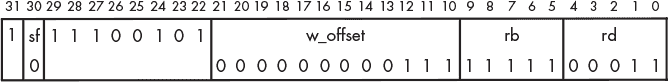

*图 12-1：基本的加载指令：`Idr w3, [sp, z]`*

图 12-2 显示了基本的存储指令。

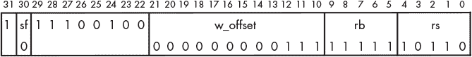

*图 12-2：基本的存储指令：* str w22, [sp, z]

在这两条指令中，第 24 位是 `1`，这表示汇编器使用了立即数、无符号偏移量变体。其他变体的第 24 位是 `0`。这两条指令都使用 `sp` 作为基地址寄存器，`rb` 字段中的值为 `11111`，而在这两条指令中，从基寄存器的偏移量是 32 位字的数量。代码清单 12-1 中的偏移量是 `z`，即 28。我们在汇编语言中使用字节数，但汇编器将这个值除以 4，以便在指令的机器码中编码字的数量，这样 `w_offset` 字段中的值就是 7。

在图 12-1 中，`sf` 字段中的 `0` 和 `rd` 字段中的 `00011` 告诉 CPU 使用 `w3` 作为目标寄存器，在图 12-2 中，`sf` 字段中的 `0` 和 `rs` 字段中的 `10110` 告诉 CPU 使用 `w22` 作为源寄存器。

堆栈框架是通过 `stp` 指令创建的，如图 12-3 所示。

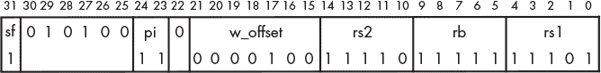

*图 12-3：将* fp *和* sp *推送到堆栈的指令：* stp fp, lr, [sp, FRAME]!

它通过 `ldp` 指令删除，如图 12-4 所示。

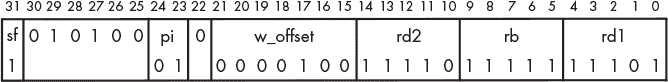

*图 12-4：从堆栈中弹出* fp *和* sp *的指令：* ldp fp, lr, [sp], FRAME

这两个指令都使用 `sp` 作为基址寄存器。在图 12-3 中，`pi` 字段中的 `11` 告诉 CPU 在存储寄存器 `x29` 和 `x30` 的内容到该地址之前（前索引）从 `sp` 中减去 `w_offset`，即 4 个字（32 字节）。因为 `sf` 为 `1`，CPU 会存储每个寄存器的整个 64 位数据。

`pi` 字段在图 12-4 中是 `01`，因此在将两个 64 位的值加载到寄存器 `x29` 和 `x30` 后，`sp` 会加上 32（后索引）。CPU 从内存加载 64 位数据到每个寄存器，因为 `sf` 为 `1`。接下来，我将解释代码清单 12-2 中的数据处理指令。

### **编码数据处理指令**

数据处理指令作用于已经在 CPU 中的值，这些值可能存储在寄存器中，也可能是指令本身的一部分。它们用于移动数据或对数据进行算术和逻辑运算。在某些情况下，这些操作会重叠。

#### ***从寄存器到寄存器的数据移动***

我们将首先查看将值从 `sp` 寄存器移动到 `fp` 寄存器的指令，如图 12-5 所示。

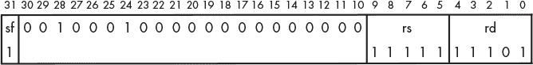

*图 12-5：基本的寄存器到寄存器的移动指令：* mov fp, sp

接下来，我们将查看一种使用逻辑运算符将值从一个寄存器有效地移动到另一个寄存器的指令，见图 12-6。


*图 12-6：通过逻辑运算移动数据的指令：* orr w2, wzr, w20

请注意，图 12-5 中的`rs`字段与图 12-6 中的`rs1`字段相同，但在第一个情况下，它是堆栈指针的代码，而在第二个情况下，它是零寄存器。这表明，寄存器 31 的处理方式，作为堆栈指针或零寄存器，取决于指令。

你可能会想知道为什么在图 12-6 中我展示的是`orr`指令，而不是`mov`指令。正如你从名称中可能猜到的那样，`orr`指令对两个源寄存器`rs1`和`rs2`中的值执行按位或（bitwise OR）操作，并将结果存储到目标寄存器`rd`中。由于我们的指令中`rs1`是零寄存器，因此这个操作实际上只是将`rs2`中的值移动到`rd`，这相当于`mov w2, w20`。当我们在第十六章讨论逻辑运算符时，我会更详细地描述`orr`指令。

在清单 12-2（见第 229 页）中的`mov w2, w20` ❷和`orr w2, wzr, w20` ❸指令使用的是完全相同的机器码。这两种指令的不同名称被称为*别名*。对于具有别名的指令，你应当使用能更好表达算法意图的名称。在我们的示例程序中，`mov w2, w20`是一个更好的选择。

#### ***将常量移入寄存器***

图 12-7 展示了将正数或无符号常量移入寄存器的指令。

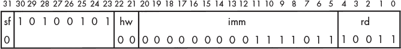

*图 12-7：将正常量移入寄存器的指令：* mov w19, 123

图 12-8 展示了将负常量移动到寄存器中的指令。


*图 12-8：将负常量移入寄存器的指令：* mov w20, -123

尽管这两条指令都使用`mov`助记符，但在图 12-7 中，位 30 为`1`，而在图 12-8 中，它为`0`。其区别在于，第一条指令是在移动一个正数，而第二条指令则是在移动一个负数。当`mov`指令中的常量为负数时，汇编器会使用第十章中的`movn`（移位并取反）指令。

在图 12-7 中，常量+123 被编码为`0x007b`，这符合我们的预期，但在图 12-8 中，我们看到–123 被编码为`0x007a`，在十进制中是+122。

你在第三章中学到，在二补码表示法中，负数可以通过取数字的补码再加 1 来计算。换句话说，-123 在二补码表示法中是+122 的补码。图 12-8 中的`mov`指令计算`imm`字段值的 NOT 值，并将其符号扩展到目标寄存器的大小后存储到该寄存器中。所以，这条指令使用`0x007a`将`0xffffff85`存储到`w20`寄存器中，如调试器所示：

```
Breakpoint 1, main () at add_consts.s:24
24              str     w22, [sp, z]          // Store sum
(gdb) i r w19 w20 w21 w22
w19            0x7b                123
w20            0xffffff85          4294967173
w21            0x0                 0
w22            0x1c8               456
```

在这两条指令中，常数必须适应 16 位立即数值。正数的范围是 0 到+65,535，负数的范围是-1 到-65,536。

#### ***执行算术运算***

我们来看一下在图 12-9 中显示的将常数加到寄存器值中的指令。

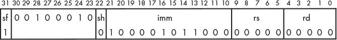

*图 12-9：将常数添加到值的指令：* add w22, w21, 456

这条指令将 12 位的`imm`值加到`rs`中的值，并将结果存储在`rd`寄存器中。当移位位`sh`为`1`时，`imm`值会先左移 12 位再进行加法。这个移位选项允许我们在两次`add`操作中添加一个 24 位的常数。第一次将添加低 12 位，第二次将添加高 12 位。

将图 12-9 与图 12-5 进行比较，你会看到另一个别名的例子。如果`imm`为 0 且`rd`或`rs`中的一个为 31，那么这条`add`指令与`mov`指令（用于`sp`寄存器）是相同的。

#### ***计算地址***

现在，让我们看一下加载`printf`格式字符串地址到`x0`寄存器中的指令，如图 12-10 所示。

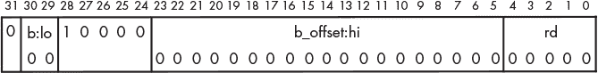

*图 12-10：加载地址的指令：* adr x0, format

你在第十一章中学到，这条指令通过将这条指令的偏移量加到`format`和`pc`中的值来计算`format`的地址，然后将结果加载到`x0`寄存器中。这条指令中的`b_offset`字段显示所有 21 位都是`0`（别忘了包括`b:lo`字段中的两个低位）。这似乎表明`format`文本字符串位于与这条指令相同的位置，显然这是不可能的。该文本字符串位于`.rodata`段中。链接器将在链接过程中决定该段的存放位置，并填充`b_offset:hi`和`b:lo`字段。

#### ***查看可执行文件的详细信息***

你可以使用一个名为`objdump`的程序查看可执行程序文件中的代码。例如，要转储*add_consts*文件的内容，可以使用以下命令：

```
   $ objdump -D add_consts
   --snip--
   0000000000000774 <main>:
   774:   a9827bfd        stp     x29, x30, [sp, #32]!
   778:   910003fd        mov     x29, sp
   77c:   52800f73        mov     w19, #0x7b                      // #123
   780:   12800f54        mov     w20, #0xffffff85                // #-123
   784:   0b140275        add     w21, w19, w20
   788:   110722b6        add     w22, w21, #0x1c8
   78c:   b9001ff6        str     w22, [sp, #28]
   790:   b9401fe3        ldr     w3, [sp, #28]
   794:   2a1403e2        mov     w2, w20
   798:   2a1403e2        mov     w2, w20
   79c:   2a1303e1        mov     w1, w19
➊ 7a0:   100005c0        adr     x0, 858 <format>
   7a4:   97ffffab        bl      650 <printf@plt>
   7a8:   2a1f03e0        mov     w0, wzr
   7ac:   a8c27bfd        ldp     x29, x30, [sp], #32
   7b0:   d65f03c0        ret
   7b4:   d503201f        nop
   7b8:   d503201f        nop
   7bc:   d503201f        nop
   --snip--
   0000000000000858 <format>:
   858:   2b206925        adds    w5, w9, w0, uxtx #2
   85c:   20692520        .inst   0x20692520 ; undefined
   860:   3534202b        cbnz    w11, 68c64 <__bss_end__+0x57c24> 864:   203d2036        .inst   0x203d2036 ; undefined
   868:   000a6925        .inst   0x000a6925 ; undefined
   --snip--
```

`-D`选项转储文件中的所有段，假设它们都包含指令，并将它们反汇编。我这里只显示了我们关心的两个段。

第一列显示每条指令加载到内存时的相对地址。操作系统将在加载程序时决定基加载地址。

第二列显示该地址处指令的机器码。请注意，`objdump`显示的机器码是 32 位指令顺序，而不是我们在汇编清单文件中看到的小端字节顺序。

链接器已填充`adr`指令中的`format`文本字符串的偏移量❶。根据图 12-10，该偏移量为`000000000000010110100`。将其加到指令的相对地址上，得到`0x7a4` + `0x0b4` = `0x858`。

相对地址`0x858`处的机器码以字节`0x25`、`0x69`、`0x20`、`0x2b`开始，这些是格式文本字符串中前四个字符的代码点：`%`、`i`、空格和`+`。汇编清单文件（见清单 12-2）按正确顺序显示这些字节。接下来，我将向你展示此程序中的两个指令，它们使程序流程转移到内存中下一个指令之外的位置。

### **编码程序流程控制指令**

我将从用于调用`printf`函数的指令开始，见图 12-11。

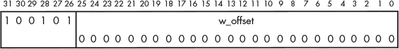

*图 12-11：函数调用指令：* bl printf

`bl`指令将`pc`中的地址加上 4 后的值复制到链接寄存器`x30`。然后，它将`w_offset`向左移 2 位，得到字节偏移量，扩展为 64 位，并将结果加到`pc`。结果是将`bl`指令后面的指令地址保存到链接寄存器中，然后将程序流程转移到距离`bl`指令地址`w_offset`字的地方。由于`w_offset`是 26 位宽，因此字节偏移量被限制为 28 位，导致在内存中最多可以转移±128MB。

我们将查看的最后一条指令是`ret`，见图 12-12。

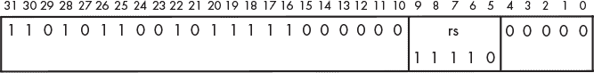

*图 12-12：函数返回指令：* ret

`ret`指令将指定寄存器中地址的值移动到`pc`。尽管在清单 12-2 中我没有指定寄存器，但汇编器默认使用`x30`。我们可以使用另一个寄存器，但这将与已发布的标准不一致，并可能导致程序出现错误。

**你来试试**

12.1 在清单 12-1 中输入程序，并使用调试器确定`adr`指令何时知道格式文本字符串的地址。

12.2 尝试修改清单 12-1 中的常量，找出常量的大小限制。

12.3 修改清单 12-1 中的程序，使用 64 位整数（C 语言中的`long int`）。这是否允许你使用更大的常量？

12.4    编写一个 C 程序，完成与我们在清单 12-1 中汇编语言程序相同的功能。你的 C 程序是否允许你使用更大的常量？如果可以，为什么？

现在你知道了机器代码是什么样子，我们来看一下汇编器程序是如何将汇编语言翻译成机器代码的。链接功能的通用算法类似；我也会讲解这一部分。

### **将汇编语言翻译成机器代码**

本节的介绍是概述性内容，因此忽略了大多数细节。我的目的是仅向你大致展示汇编器如何将源代码翻译成机器语言，以及链接器如何将构成整个程序的不同模块连接起来。

#### ***汇编器***

汇编器将汇编语言翻译成机器代码的最简单方法是逐行处理源代码，一次翻译一行。这种方法在大多数情况下是有效的，除了指令引用当前行之后的标签的位置时。

为了了解汇编器如何处理这些前向引用，我将在第十三章中的清单 13-11 中做一个前向引用，我们将在其中使用这些引用。清单 12-3 显示了该程序的汇编清单文件的一部分。

```
--snip--
33 0024 3F00006B                cmp     w1, w0                // Above or below middle?
34 0028 88000054                b.hi    tails                 // Above -> tails
35 002c 00000010                adr     x0, heads_msg         // Below -> heads message
36 0030 00000094                bl      puts                  // Print message
37 0034 03000014                b       continue              // Skip else part
38               tails: 39 0038 00000010                adr     x0, tails_msg         // Tails message page address
--snip--
```

*清单 12-3：来自第十三章的清单 13-11 程序的一部分*

我将在第十三章中详细讲解，但这一段代码比较了`w0`和`w1`寄存器中的值。如果`w1`中的值较高，`b.hi`指令会导致程序流程跳转到标记为`tails`的地址。

图 12-13 展示了汇编器为`b.hi`指令生成的机器代码。

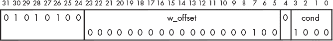

*图 12-13：条件分支：* b.hi tails

`tails`标签位于相对位置`0x38`，比`0x28`处的`b.hi`指令高`0x10`字节。在图 12-13 中，`w_offset`是`0x00004`，即`0x10`字节。问题是汇编器是如何知道`tails`标签的前向引用位置的。

处理前向引用的常用方法是使用*两遍汇编器*，它会扫描程序两遍。在第一次遍历期间，汇编器创建一个*本地符号表*，将每个符号与一个数字值关联起来。通过`.equ`指令定义的符号会直接输入到表中。

对于代码中带标签的位置，汇编器需要确定每个标签相对于正在汇编的模块起始位置的距离，并将该值和标签输入表中。每个`.text`和`.data`段在文件中都会创建一个独立的本地符号表。

这是一个两遍汇编器第一次遍历的通用算法，它生成一个本地符号表：

```
Let location_counter = 0
do
    Read a line of source code
    if (.equ directive)
        local_symbol_table.symbol = symbol
        local_symbol_table.value = expression value
    else if (line has a label)
        local_symbol_table.symbol = label
        local_symbol_table.value = location_counter
    Determine number_of_bytes required by line when assembled
    location_counter = location_counter + number_of_bytes
while (more lines of source code)
```

一旦本地符号表创建完成，汇编器会对源代码文件进行第二遍扫描。它使用内建的*操作码表*来确定机器代码，当指令中使用符号时，它会在本地符号表中查找符号的值。如果在本地符号表中没有找到该符号，它会在指令中留出空位来填入数字，并将符号及其位置记录在目标文件中。

一般算法如下：

```
Let location_counter = 0
do
    Read a line of source code
    Find machine code from opcode table
    if (symbol is used in instruction)
        if (symbol found in local_symbol_table)
            Get value of symbol
        else
            Let value = 0
            Write symbol and location_counter to object file
        Add symbol value to instruction
    Write assembled instruction to object file
    Determine number_of_bytes used by the assembled instruction
    location_counter = location_counter + number_of_bytes
while (more lines of source code)
```

作为替代方案，我们可以创建一个*单遍汇编器*。它需要维护一个前向引用位置的列表，当找到标签时，使用该表回去填写适当的值。

再次强调，这是对汇编过程的高度简化概述，旨在展示汇编器工作的大致思路。Andrew S. Tanenbaum 和 Todd Austin 的《*结构化计算机组织*》第 6 版（Pearson，2012）中的第七章提供了有关汇编过程的更多细节。Leland Beck 的《*系统软件：系统编程导论*》第 3 版（Pearson，1997）中的第二章详细讨论了汇编程序的设计。

大多数函数会有函数调用，即对其他文件中定义的`.text`段标签的引用，这些引用无法由汇编器解决。`.data`段中的任何标签也是如此，即使它们定义在同一个源代码文件中。接下来的部分将展示一个解决这些引用的程序。

#### ***链接器***

链接器的工作是确定程序中标签的相对位置，以便在引用标签的地方插入该标签的偏移量。链接器的工作方式与汇编器类似，只不过基本单元是机器代码块，而不是一行汇编语言。一个典型的程序由多个目标文件组成，每个文件通常有不止一个`.text`段，并可能有`.data`段，这些段必须被链接在一起。与汇编器一样，可以通过两遍扫描来解决前向引用问题。

汇编器生成的目标文件包含文件中每个段的大小，以及所有全局符号的列表和它们在段中的使用位置。在第一遍扫描中，链接器读取每个目标文件，并创建一个*全局符号表*，该表包含每个全局符号相对于程序起始位置的相对位置。在第二遍扫描中，链接器创建一个可执行文件，该文件包括所有来自目标文件的机器代码，并将全局符号表中的相对位置值插入到引用它们的位置。

这个过程解决了所有引用程序中各模块定义的名称的引用，但它会将所有对外部定义名称的引用（如在 C 标准库中定义的函数或变量名）保持未解决。链接器将这些未解决的引用输入到*全局偏移表（GOT）*中。

如果外部引用是函数调用，链接器还会将此信息输入到*过程链接表（PLT）*中，并记录引用所在的机器码位置。你可以通过查看我们在列表 12-1 中如何编写调用 C 标准库函数的代码，来看到链接器是如何做到这一点的：

```
bl     printf
```

使用`objdump`程序查看该程序的可执行文件内容，我们可以看到链接器所做的添加：

```
7a4:   97ffffab      bl     650 <printf@plt>
```

从图 12-11 中`bl`指令的编码中，我们看到`w_offset`是 26 位值`0x3ffffab`。一个字有 4 个字节，所以这等于 28 位字节偏移`0xffffeac`。将字节偏移加到指令的相对地址上，得到`0x00007a4` + `0xffffeac` = `0x0000650`。（别忘了这些是有符号整数，所以这个加法的进位是无关紧要的。）这就是从这个`bl`指令到 PLT 中`printf`链接位置的偏移。

当程序运行时，操作系统还会加载程序的 GOT 和 PLT。在执行过程中，如果程序访问一个外部变量，操作系统会加载包含该变量定义的库模块，并将其相对地址输入到 GOT 中。当程序调用 PLT 中的某个函数时，如果该函数尚未加载，操作系统会加载它，将其地址插入程序的 GOT，并相应地调整 PLT 中的对应条目。

我想再次强调，正如之前关于汇编程序的讨论一样，这只是链接器工作原理的粗略概述。如果你想深入了解链接器，我推荐 John R. Levine 的*Linkers & Loaders*（摩根·考夫曼出版社，1999 年）。

### **你学到了什么**

**机器码** 控制 CPU 的指令位模式。

**汇编列表** 程序中每条指令对应的机器码，可以由汇编程序生成（可选）。

**寄存器** 寄存器的编号在 5 个比特位中编码。

**寄存器大小** 一个比特编码指示使用的是完整的 64 位寄存器还是低 32 位寄存器。

**立即数** 指令中编码的常量。

**地址偏移** 从引用指令到内存地址的距离，可以在引用指令中编码。

**别名** 汇编程序可能为某些指令提供多个名称，以更好地表达使用该指令的意图。

**汇编器** 将汇编语言翻译为机器码并创建全局符号表的程序。

**链接器** 一个程序，用于解决程序中各个段落之间的交叉引用，并创建一个由操作系统使用的过程链接表。

到目前为止，我们的所有程序都使用了顺序程序流并调用了子函数。在下一章，我们将回到编程，你将学习其他两个必要的程序流程结构：重复和双向分支。
