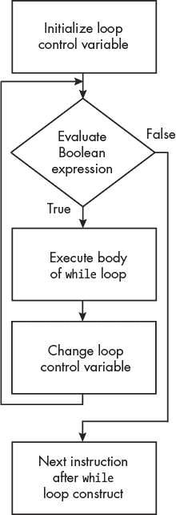
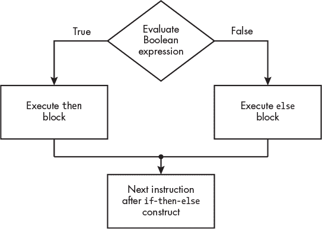

## 第十三章：控制流构造**


在编写 C 语言或汇编语言程序时，我们指定每个语句或指令执行的顺序。这个顺序称为*控制流*。通过指定控制流来编程被称为*命令式编程*。这与*声明式编程*相对，声明式编程中我们只是陈述计算的逻辑，另一个程序则会确定控制流来执行它。

如果你一直使用`make`来构建你的程序，正如在第二章中推荐的那样，你的 makefile 中的语句就是声明式编程的一个例子。你指定结果的逻辑，而`make`程序则自动确定控制流来生成结果。

有三种基本的控制流构造：顺序、迭代和选择。你已经在我们之前写的程序中看到了顺序：每条指令或子函数都是按顺序执行的。在本章中，我将向你展示如何改变控制流，跳过某些指令以迭代相同的指令块，或者在多个指令块之间进行选择。你将看到这些控制流构造如何在汇编语言级别实现。在第十四章中，我将讲解通过调用子函数来改变控制流的细节。

### **跳转**

*跳转指令*将控制流转移到指令指定的内存地址。有两种类型的跳转：无条件跳转和条件跳转。迭代和选择都使用条件跳转来根据真/假的条件改变控制流。在实现迭代和选择流构造时，你也会经常使用无条件跳转。我们先从无条件跳转讲起，然后再看条件跳转。

#### ***无条件***

如你在第九章中所学，当一条指令执行时，CPU 会自动将程序计数器`pc`加 4，以保存内存中下一条指令的地址。无条件跳转指令通过将程序计数器改为跳转目标地址，替代将程序计数器加 4，从而使 CPU 继续在目标地址执行程序。

你已经了解了一个无条件跳转指令——`ret`，它用于从函数返回——在第十章中讲过。还有两个其他的跳转指令，`b` 和 `br`：

b**—无条件跳转**

`b` label 将跳转到距离当前指令±128MB 范围内的标签地址。

br**—无条件跳转寄存器**

`br x`将跳转到`x`中的 64 位地址。

`b` 指令通常与条件分支指令一起使用，用于跳过代码块或返回代码块的开头并再次执行它。对于 `b` 指令，CPU 会将 `b` 指令与标签之间的 26 位字偏移符号扩展为 64 位，并将这个符号数加到 `pc` 上。`br` 指令只是将 `x` 寄存器中的 64 位值复制到 `pc` 上。

尽管 `br x30` 看起来与 `ret` 具有相同的效果，但 `br` 和 `ret` 指令并不是彼此的别名；它们是不同的指令。区别在于，`br` 告诉 CPU 这可能*不是*一个函数返回，而 `ret` 告诉 CPU 这可能*是*一个函数返回。具体细节超出了本书的范围，但这些提示可以帮助 CPU 优化执行指令的某些细节。

#### ***条件***

有两种类型的条件分支指令。一种是测试 `nzcv` 寄存器中的条件标志设置（见图 9-4 和第九章）。我们需要使用另一条指令在测试之前设置标志，以确定是否分支。

另一种类型的条件分支指令是测试寄存器中的值，以确定是否分支。此组指令不依赖于条件标志，也不会改变它们。

我将从根据条件标志设置进行分支的指令开始：

b.cond**—条件分支**

`b.`cond 标签测试 `nzcv` 寄存器中的设置，如果它们与条件匹配，则跳转到标签，跳转范围为从此指令起的 ±128MB。`cond` 的可能值见表 13-1。

**表 13-1：** 允许的分支条件码

| **代码** | cond | **含义** | **条件标志** |
| --- | --- | --- | --- |
| `0000` | `eq` | 相等 | *Z* |
| `0001` | `ne` | 不相等 | ¬*Z* |
| `0010` | `cs` 或 `hs` | 进位集；无符号大于或相等 | *C* |
| `0011` | `cc` 或 `lo` | 进位未设置；无符号小于 | ¬*C* |
| `0100` | `mi` | 负数；负值 | *N* |
| `0101` | `pl` | 正数；正值或零 | ¬*N* |
| `0110` | `vs` | 溢出 | *V* |
| `0111` | `vc` | 无溢出 | ¬*V* |
| `1000` | `hi` | 无符号大于 | *C* ∧ ¬*Z* |
| `1001` | `ls` | 无符号小于或相等 | ¬(*C* ∧ ¬*Z*) |
| `1010` | `ge` | 符号大于或等于 | *N* = *V* |
| `1011` | `lt` | 符号小于 | ¬(*N* = *V* ) |
| `1100` | `gt` | 符号大于 | ¬*Z* ∧ (*N* = *V* ) |
| `1101` | `le` | 符号小于或等于 | ¬(¬*Z* ∧ (*N* = *V* )) |
| `1110` | `al` | 总是执行 | 任何 |
| `1111` | `nv` | 总是执行 | 任何 |

你应该在程序中使用`b.`cond 指令，当你希望根据另一个操作的结果在两个分支之间做出选择时。重要的是，`b.`cond 指令必须紧接在其结果决定分支的指令后面。任何中间的指令或函数调用都可能更改条件标志的设置，从而给出错误的分支依据。

除此之外，还有四条指令，它们根据通用寄存器中的值进行分支：

cbz**—如果零则比较并分支**

`cbz w`s`,` 如果`w`s 中的值为`0`，则跳转到标签，跳转范围为±1MB。

`cbz x`s`,` 如果`x`s 中的值为`0`，则跳转到标签，跳转范围为±1MB。

cbnz**—如果不为零则比较并分支**

`cbnz w`s`,` 如果`w`s 中的值不为`0`，则跳转到标签，跳转范围为±1MB。

`cbnz x`s`,` 如果`x`s 中的值不为`0`，则跳转到标签，跳转范围为±1MB。

tbz**—测试位并在零时分支**

`tbz w`s`,` imm`,` 如果`w`s 中的位号 imm 为`0`，则跳转到标签，跳转范围为±1MB。

`tbz x`s`,` imm`,` 如果`x`s 中的位号 imm 为`0`，则跳转到标签，跳转范围为±1MB。

tbnz**—测试位并在非零时分支**

`tbnz w`s`,` imm`,` 如果`w`s 中的位号 imm 不为`0`，则跳转到标签，跳转范围为±1MB。

`tbnz x`s`,` imm`,` 如果`x`s 中的位号 imm 不为`0`，则跳转到标签，跳转范围为±1MB。

**注意**

*使用条件分支指令如* b.gt *或* b.le *时，*容易忘记测试的顺序：源操作数与目标操作数比较，还是目标与源比较。当调试我的程序时，我几乎总是使用* gdb *并在条件分支指令处设置断点。当程序中断时，我检查值并使用* si *命令查看分支的方向。*

现在你已经知道如何控制指令执行的流程，我将向你展示一些编程结构。我们将从重复开始。这可以通过两种方式实现：*迭代*，即程序重复执行一个代码块，直到满足某个条件；以及*递归*，即函数反复调用自身，直到满足条件为止。

我将在下一节中讲解迭代，并在讨论第十五章时说明递归的特殊用法。

### **迭代**

许多算法使用迭代，也称为*循环*。一个循环会持续执行代码块的迭代，直到*循环控制变量*的值满足*终止条件*，导致循环结束。使用循环结构时，*循环控制变量*的值必须在迭代的代码块中发生变化。

逐个字符处理文本字符串是循环的一个很好的例子。我将使用 图 2-1 中的两个系统调用函数，`write` 和 `read`，来说明这些概念。该图显示，`printf` 将数据从内存存储格式转换为字符格式，并调用 `write` 系统调用函数将字符显示在屏幕上。当从键盘读取字符时，`scanf` 调用 `read` 系统调用函数，并将字符转换为内存存储格式。

#### ***write 和 read 系统调用函数***

`write` 和 `read` 系统调用函数将屏幕和键盘视为文件。当程序首次启动时，操作系统打开三个文件——*标准输入*、*标准输出* 和 *标准错误*——并为每个文件分配一个整数，这个整数被称为 *文件描述符*。程序通过使用文件描述符与每个文件进行交互。调用 `write` 和 `read` 的 C 接口在 *可移植操作系统接口 (POSIX)* 标准中定义，你可以在 *[`pubs.opengroup.org/onlinepubs/9699919799/`](https://pubs.opengroup.org/onlinepubs/9699919799/)* 上找到该标准。

调用这两个函数的一般格式是

```
int write(int fd, char *buf, int n);
```

和

```
int read(int fd, char *buf, int n);
```

其中，fd 是文件描述符，buf 是字符存储的地址，n 是要写入或读取的字符数。你可以在 `write` 和 `read` 的手册页中阅读更多细节：

```
> man 2 write
> man 2 read
```

表 13-2 显示了我将使用的文件描述符及其通常关联的设备。

**表 13-2：** `write` 和 `read` 系统调用函数的文件描述符

| **名称** | **编号** | **用途** |
| --- | --- | --- |
| `STDIN_FILENO` | 0 | 从键盘读取字符 |
| `STDOUT_FILENO` | 1 | 将字符写入屏幕 |
| `STDERR_FILENO` | 2 | 将错误信息写入屏幕 |

这些名称在系统头文件 *unistd.h* 中定义，该文件位于我的 Raspberry Pi O 上的 */usr/include/unistd.h* （注意，你系统中的位置可能不同）。现在，让我们继续讨论循环结构。

#### ***while 循环***

`while` 循环是循环的基本形式。以下是 C 语言中的形式：

```
initialize loop control variable
while (expression) {
    body
    change loop control variable
}
next statement
```

在进入 `while` 循环之前，你需要初始化循环控制变量。在 `while` 循环的开始，表达式会作为布尔值进行求值。如果表达式求值为假（在 C 中为 `0`），控制流将继续到下一个语句。如果表达式求值为真——即 C 中的任何非零值——则执行循环体内的语句，改变循环控制变量，控制流会重新回到顶部，重新评估表达式。

图 13-1 显示了 `while` 循环的控制流。虽然循环的终止条件可以依赖于多个变量，但我这里只使用一个变量来澄清讨论。



*图 13-1：while 循环的控制流*

示例 13-1 展示了如何使用`while`循环将文本字符串一个字符一个字符地写入终端窗口。

*hello_world.c*

```
   // Write Hello, World! one character at a time.

   #include <unistd.h>
➊ #define NUL '\x00'

   int main(void)
{
  ➋ char *message_ptr = "Hello, World!\n";

  ➌ while (*message_ptr != NUL) {
      ➍ write(STDOUT_FILENO, message_ptr, 1);
      ➎ message_ptr++;
    }

    return 0;
}
```

*示例 13-1：一个将“Hello, World!”一个字符一个字符写入屏幕的程序*

我使用`#define`指令为`NUL`字符 ❶指定了一个符号名称。`message_ptr`变量被定义为指向`char`类型的指针，并作为循环控制变量。它被初始化为指向一个文本字符串 ❷。正如我们在查看这段代码的汇编语言时看到的，编译器将把文本字符串存储在内存的只读部分，并将该文本字符串中第一个字符的地址存储在`message_ptr`指针变量中。

`while`语句首先检查循环控制变量`message_ptr`是否指向`NUL`字符 ❸；如果不是，程序流程进入`while`循环体，并将`message_ptr`指向的字符写入屏幕 ❹。然后，循环控制变量递增，指向文本字符串中的下一个字符 ❺。程序流程返回到循环的顶部，检查下一个字符是否是`NUL`字符。当`message_ptr`指向`NUL`字符 ❸时，循环终止。首先测试这个条件意味着如果字符串为空，程序甚至不会进入`while`循环体，因为`message_ptr`只会指向`NUL`字符。这是一个微妙但重要的`while`循环要点：如果终止条件已经满足，循环体中的代码是永远不会被执行的。

对于示例 13-1，编译器生成了在示例 13-2 中显示的汇编语言。

*hello_world.s*

```
        .arch armv8-a
        .file   "hello_world.c"
        .text
     ➊ .section        .rodata
        .align  3
.LC0:
        .string "Hello, World!\n"
        .text
        .align  2
        .global main
        .type   main, %function
main:
        stp     x29, x30, [sp, -32]!
        mov     x29, sp
     ➋ adrp    x0, .LC0
        add     x0, x0, :lo12:.LC0 str     x0, [sp, 24]      /// message_ptr variable
     ➌ b       .L2               /// Go to check
.L3:
        mov     x2, 1             /// One character
        ldr     x1, [sp, 24]      /// Address in message_ptr
        mov     w0, 1             /// STDOUT_FILENO
        bl      write
        ldr     x0, [sp, 24]
        add     x0, x0, 1
        str     x0, [sp, 24]      /// message_ptr++;
.L2:
        ldr     x0, [sp, 24]
        ldrb    w0, [x0]          /// Current char
     ➍ cmp     w0, 0             /// NUL?
     ➎ bne     .L3               /// No, back to top
        mov     w0, 0
        ldp     x29, x30, [sp], 32
        ret
        .size   main, .-main
        .ident  "GCC: (Debian 10.2.1-6) 10.2.1 20210110"
        .section        .note.GNU-stack,"",@progbits
```

*示例 13-2：在示例 13-1 中的函数对应的编译器生成的汇编语言*

汇编语言显示，文本字符串存储在`.rodata`部分 ❶。然后，`message_ptr`被初始化为包含文本字符串起始地址的指针 ❷。

尽管这段汇编语言似乎在循环结束时检测终止条件 ❹，但它遵循了图 13-1 所示的逻辑流程。首先，它跳转到`.L2` ❸，在那里检查终止条件，然后跳转到`.L3`开始执行`while`循环体 ❺。你可能注意到，编译器使用了`bne`指令。它和`b.ne`是一样的；在编写条件分支指令时，`.`字符是可选的。

在这段代码中，有一个新的指令，`cmp` ❹：

cmp**—比较**

`cmp` reg`,` imm 从寄存器 reg 的值中减去 imm，并根据结果设置条件标志。减法的结果会被丢弃。

`cmp` reg1`,` reg2 从寄存器 reg1 的值中减去寄存器 reg2 的值，并根据结果设置条件标志。减法的结果会被丢弃。

`cmp` 指令紧接着条件分支指令常常用于程序中的决策。

为了与编译器所做的比较，我们将在我的汇编语言版本中遵循 `while` 循环的模式，如 清单 13-3 所示。

*hello_world.s*

```
// Write Hello, World! one character at a time.
        .arch armv8-a
// Useful names
        .equ    NUL, 0
        .equ    STDOUT, 1
// Stack frame
        .equ    save19, 16
        .equ    FRAME, 32
// Constant data
        .section  .rodata
message:
        .string "Hello, World!\n"
// Code
        .text
        .align  2
        .global main
        .type   main, %function
main:
        stp     fp, lr, [sp, -FRAME]! // Create stack frame
        mov     fp, sp                // Set our frame pointer
        str     x19, [sp, save19]     // Save for caller
        adr     x19, message          // Address of message
loop:
        ldrb    w0, [x19]             // Load character
     ➊ cmp     w0, NUL               // End of string?
        b.eq    done                  // Yes
        mov     w2, 1                 // No, one char
        mov     x1, x19               // Address of char
        mov     x0, STDOUT            // Write on screen
        bl      write
        add     x19, x19, 1           // Increment pointer
        b       loop                  //   and continue
done:
        mov     w0, wzr               // Return 0
        ldr     x19, [sp, save 19]    // Restore reg
        ldp     fp, lr, [sp], FRAME   // Delete stack frame
        ret
```

*清单 13-3：一个汇编语言程序，通过一次输出一个字符写出 Hello, World！*

我们本可以在条件检查中使用 `cbz` 指令，而不是 `cmp` 和 `b.eq` 序列 ❶，但我认为这里使用 `NUL` 更加清晰。这个解决方案同样适用于任何终止字符。

我的汇编语言解决方案比编译器生成的代码（清单 13-2）效率低，因为每次循环迭代都会执行 `b` 指令，此外还有条件 `b.eq` 指令。虽然执行时间稍微增加，但通常值得为了代码可读性做出这种权衡。

当使用一个 *哨兵值*（这是一个标记数据序列结束的唯一值）作为终止条件时，`while` 循环效果很好。例如，清单 13-1 和 13-3 中的 `while` 循环适用于任何长度的文本字符串，并且会继续将一个字符一个字符地写入屏幕，直到遇到哨兵值，即 `NUL` 字符。C 语言还有另一种循环结构，`for` 循环，许多程序员认为它在某些算法中更自然；我们接下来会看看它。

#### ***for 循环***

尽管它们的 C 语法有所不同，但 `while` 和 `for` 循环结构在语义上是等价的。语法上的区别是，`for` *循环*允许你将所有三个控制元素——循环控制变量初始化、检查和改变——都放在括号内。C 中 `for` 循环的一般形式如下：

```
for (initialize loop control variable; expression; change loop control variable) {
    body
}
next statement
```

将所有控制元素放在括号内并非必须。实际上，我们也可以将 `for` 循环写成如下形式：

```
initialize loop control variable
for (;expression;) {
    body
    change loop control variable
}
next statement
```

请注意，`for` 循环语法确实要求在括号中包括两个分号。

在 清单 13-4 中，我用 `for` 循环重写了 清单 13-1 中的程序。

*hello_world_for.c*

```
// Write Hello, World! one character at a time.

#include <unistd.h>
#define NUL '\x00'

int main(void)
{
    char *message_ptr;

    for (message_ptr = "Hello, World!\n"; *message_ptr != NUL; message_ptr++) {
        write(STDOUT_FILENO, message_ptr, 1);
    } return 0;
}
```

*清单 13-4：使用* for *循环编写 Hello, World！的程序*

**注意**

*由于此程序中的* for *语句只控制一个 C 语句，实际上你不需要在该语句周围加上大括号。我通常还是会加上它们，因为如果我稍后修改程序并添加另一个语句时，我经常会忘记需要加大括号。*

你可能会想知道哪种循环结构更好。这里正是你汇编语言知识派上用场的时候。当我使用`gcc`生成清单 13-4 的汇编语言时，得到的汇编语言代码与清单 13-1 中的`while`循环版本是一样的。由于`for`循环的汇编语言已在清单 13-2 中展示，所以这里不再重复。

从`for`循环与`while`循环的对比中，我们可以得出结论，你应该使用对于你解决的问题最自然的高级语言循环结构。通常这是一个主观的选择。

`for`循环通常用于*计数控制循环*，其中循环迭代次数在开始循环之前就已确定。稍后我们将看到此用法的示例，当我们讨论选择结构时。首先，让我们看看 C 语言中的第三种循环结构。它提供了不同的行为：与`while`循环和`for`循环结构在终止条件被循环控制变量的初始值满足时跳过循环体的做法不同，`do-while`循环结构将始终至少执行一次循环体。

#### ***do-while 循环***

在某些情况下，您的算法需要至少执行一次循环体。在这些情况下，do-while *循环*可能会更自然。它具有以下一般形式：

```
do {
    body
    change loop control variable
} while (expression)
next statement
```

在`do-while`循环结构中，表达式的值是在循环体结束时计算的。循环会持续执行，直到该评估结果为布尔值 false。

在清单 13-5 中，我使用`do-while`循环重写了 Hello, World! 程序。

*hello_world_do.c*

```
// Write Hello, World! one character at a time.

#include <unistd.h> #define NUL '\x00'

int main(void)
{
    char *message_ptr = "Hello, World!\n";

    do {
        write(STDOUT_FILENO, message_ptr, 1);
        message_ptr++;
    } while (*message_ptr != NUL);

    return 0;
}
```

*清单 13-5：使用* do-while *循环编写 Hello, World! 程序*

**注意**

*这个程序有潜在的 bug！* do-while *循环结构将始终至少执行一次循环体。考虑一个空的文本字符串，它是一个包含* NUL *字符的单字节。一个* do-while *循环会将* NUL *字符写到屏幕上（实际上没有做任何事情），然后检查内存中的下一个字节，这个字节可能是任何内容。如果这个字节不是* NUL *字符，* do-while *循环会继续执行，写入该字节及下一个字节所表示的字符，直到遇到* NUL *字符。程序的行为可能每次运行时都不同，因此错误可能不会在你的测试中显现出来。*

我们可以使用`gcc`生成的汇编语言（见清单 13-6），来说明`do-while`结构与`while`和`for`结构之间的差异。

*hello_world_do.s*

```
           .arch armv8-a
           .file   "hello_world_do.c"
           .text
           .section        .rodata
           .align  3
   .LC0:
           .string "Hello, World!\n"
           .text
           .align  2
           .global main
           .type   main, %function
   main:
           stp     x29, x30, [sp, -32]!
           mov     x29, sp
           adrp    x0, .LC0
           add     x0, x0, :lo12:.LC0
           str     x0, [sp, 24]      /// message_ptr variable
➊ .L2:
           mov     x2, 1             /// One character ldr     x1, [sp, 24]      /// Address in message_ptr
           mov     w0, 1             /// STDOUT_FILENO
           bl      write
           ldr     x0, [sp, 24]
           add     x0, x0, 1
           str     x0, [sp, 24]      /// message_ptr++;
           ldr     x0, [sp, 24]
           ldrb    w0, [x0]          /// Current char
        ➋ cmp     w0, 0             /// NUL?
           bne     .L2               /// No, back to top
           mov     w0, 0
           ldp     x29, x30, [sp], 32
           ret
           .size   main, .-main
           .ident  "GCC: (Debian 10.2.1-6) 10.2.1 20210110"
           .section        .note.GNU-stack,"",@progbits
```

*清单 13-6：编译器生成的清单 13-5 函数的汇编语言*

如果你将 列表 13-6 中显示的汇编语言与 列表 13-2 中显示的汇编语言进行比较，后者显示了为 `while` 和 `for` 循环生成的汇编语言，你会发现唯一的区别是 `do-while` 循环在第一次执行循环之前不会跳转到循环控制检查 ❷。`do-while` 结构看起来可能更高效，但在汇编语言中，唯一的优化是第一次执行循环时少了一个跳转。

接下来，我们将研究如何选择是否执行一段代码。

**现在轮到你了**

13.1     输入 列表 13-1、13-4 和 13-5 中的三个 C 程序，并使用编译器为每个程序生成汇编语言。比较三种循环结构的汇编语言。编译器随着版本变化而变化，因此你应该查看你所使用的编译器的输出。

13.2     编写一个汇编语言程序，要求：

(a)     提示用户输入一些文本

(b)     使用 `read` 系统调用函数读取输入的文本

(c)     在终端窗口回显用户输入的文本

你需要在栈上分配空间，用于存储用户输入的字符。

### **条件语句**

另一种常见的流程控制结构是选择结构，在这里我们决定是否执行某段代码。我将从最简单的情况开始，基于布尔条件语句判断是否执行单个代码块，然后展示如何使用布尔条件语句选择执行两个代码块中的一个。最后，我将讨论如何根据整数值选择多个代码块。

#### ***如果***

C 语言中 if *条件语句*的一般形式如下：

```
if (expression) {
    block
}
next statement
```

该表达式被计算为布尔值。如果它计算为假，或者在 C 语言中为 `0`，控制流将继续执行下一条语句。如果表达式计算为真（在 C 语言中为非零值），则执行代码块中的语句，控制流将继续到下一条语句。

列表 13-7 提供了一个 `if` 语句的示例，模拟抛硬币 10 次并显示每次正面朝上的情况。

*coin_flips1.c*

```
// Flip a coin, show heads.

#include <stdio.h>
#include <stdlib.h>
#define N_TIMES 10

int main()
{
    register int random_number;
    register int i;

 ➊ for (i = 0; i < N_TIMES; i++) {
     ➋ random_number = random();
     ➌ if (random_number < RAND_MAX/2) {
         ➍ puts("heads");
        }
    }

    return 0;
}
```

*列表 13-7：一个模拟抛硬币并显示正面朝上的程序*

该程序使用计数控制的 `for` 循环模拟抛硬币 10 次 ❶。模拟过程调用了 C 标准库中的 `random` 函数 ❷。如果随机数在 `random` 函数所有可能值的下半部分 ❸，我们称之为“正面”。为了显示这个结果，我们使用 C 标准库中的 `puts` 函数，它将一个简单的文本字符串打印到屏幕上，并附加一个换行符 ❹。对于 列表 13-7，编译器生成了 列表 13-8 中显示的汇编语言。

*coin_flips1.s*

```
           .arch armv8-a
           .file   "coin_flips1.c"
           .text
           .section        .rodata
           .align  3
   .LC0:
           .string "heads"
           .text
           .align  2
           .global main
           .type   main, %function
   main:
           stp     x29, x30, [sp, -32]!
           mov     x29, sp
           stp     x19, x20, [sp, 16]  /// Use for i and random_number
           mov     w19, 0
           b       .L2
   .L4:
           bl      random
           mov     w20, w0             /// Random number
           mov     w0, 1073741822      /// RAND_MAX/2
           cmp     w20, w0
        ➊ bgt     .L3                 /// Skip message
           adrp    x0, .LC0
           add     x0, x0, :lo12:.LC0
           bl      puts
➋ .L3:
           add     w19, w19, 1         /// i++;
   .L2:
           cmp     w19, 9
           ble     .L4                 /// Continue if <= 9
           mov     w0, 0
           ldp     x19, x20, [sp, 16]  /// Restore regs for caller
           ldp     x29, x30, [sp], 32
           ret
           .size   main, .-main
           .ident  "GCC: (Debian 10.2.1-6) 10.2.1 20210110"
           .section        .note.GNU-stack,"",@progbits
```

*清单 13-8：编译器为 清单 13-7 中的函数生成的汇编语言*

`if` 语句通过一个简单的条件分支来实现。如果条件成立—在这种情况下，`bgt`，即大于时跳转 ❶—程序流将跳过由 `if` 语句控制的代码块 ❷。接下来，我将向你展示如何在两个不同的代码块之间进行选择。

#### ***if-then-else***

C 中的 if-then-else *条件语句* 的一般形式如下（C 不使用 `then` 关键字）：

```
if (expression) {
    then block
} else {
    else block
}
next statement
```

表达式作为布尔值进行评估。如果表达式的结果为真，则执行 `then` 块中的语句，并且控制流跳转到下一个语句。如果结果为假（在 C 中为 `0`），则控制流跳转到 `else` 块，并继续执行下一个语句。

图 13-2 显示了 `if-then-else` 条件语句的控制流。



*图 13-2：一个* if-then-else *条件语句的控制流*

清单 13-7 中的抛硬币程序不够用户友好，因为用户不知道硬币被抛了多少次。我们可以通过使用 `if-then-else` 条件语句来改进程序，打印出硬币为反面时的消息，如 清单 13-9 所示。

*coin_flips2.c*

```
// Flip a coin, showing heads or tails.

#include <stdio.h>
#include <stdlib.h>
#define N_TIMES 10

int main()
{ register int random_number;
    register int i;

    for (i = 0; i < N_TIMES; i++) {
        random_number = random();
        if (random_number < RAND_MAX/2) {
            puts("heads");
        } else {
            puts("tails");
        }
    }

    return 0;
}
```

*清单 13-9：一个抛硬币并声明其为正面或反面的程序*

清单 13-10 显示了编译器为 清单 13-9 生成的汇编语言。

*coin_flips2.s*

```
           .arch armv8-a
           .file   "coin_flips2.c"
           .text
           .section        .rodata
           .align  3
   .LC0:
           .string "heads"
           .align  3
   .LC1:
           .string "tails"
           .text
           .align  2
           .global main
           .type   main, %function
   main:
           stp     x29, x30, [sp, -32]!
           mov     x29, sp
           stp     x19, x20, [sp, 16]
           mov     w19, 0
           b       .L2
   .L5:
           bl      random
           mov     w20, w0
           mov     w0, 1073741822
           cmp     w20, w0
           bgt     .L3                 /// Go to else block
           adrp    x0, .LC0            /// Then block
           add     x0, x0, :lo12:.LC0
           bl      puts ➊ b       .L4                 /// Branch over else block
   .L3:
           adrp    x0, .LC1            /// Else block
           add     x0, x0, :lo12:.LC1
           bl      puts
➋ .L4:
           add     w19, w19, 1         /// Next statement
   .L2:
           cmp     w19, 9
           ble     .L5
           mov     w0, 0
           ldp     x19, x20, [sp, 16]
           ldp     x29, x30, [sp], 32
           ret
           .size   main, .-main
           .ident  "GCC: (Debian 10.2.1-6) 10.2.1 20210110"
           .section        .note.GNU-stack,"",@progbits
```

*清单 13-10：编译器为 清单 13-9 中的函数生成的汇编语言*

汇编语言显示，我们需要在 `then` 块的末尾 ❶ 进行一次无条件跳转，以跳过 `else` 块 ❷。

我的抛硬币程序的汇编语言设计略有不同，如 清单 13-11 所示。

*coin_flips2.s*

```
// Flip a coin, showing heads or tails.
        .arch armv8-a
// Useful names
        .equ    N_TIMES, 10           // Number of flips
        .equ    RAND_MID, 1073741822  // RAND_MAX/2
// Stack frame
        .equ    save19, 28
        .equ    FRAME, 32
// Constant data
        .section  .rodata
heads_msg:
        .string "heads"
tails_msg:
        .string "tails"
// Code
        .text
        .align  2
        .global main
        .type   main, %function
main:
        stp     fp, lr, [sp, -FRAME]! // Create stack frame
        mov     fp, sp                // Set our frame pointer
        str     w19, [sp, save19]     // Save for i local var
        mov     w19, wzr              // i = 0 loop:
        mov     w0, N_TIMES           // Total number of times
        cmp     w19, w0               // Is i at end?
        b.hs    done                  // Yes
        bl      random                // No, get random number
        mov     w1, RAND_MID          // Halfway
     ➊ cmp     w1, w0                // Above or below middle?
        b.hi    tails                 // Above -> tails
        adr     x0, heads_msg         // Below -> heads message
        bl      puts                  // Print message
        b       continue              // Skip else part
tails:
        adr     x0, tails_msg         // Tails message address
        bl      puts                  // Print message
continue:
        add     w19, w19, 1           // Increment i
        b       loop                  //   and continue loop
done:
        mov     w0, wzr               // Return 0
        ldr     w19, [sp, save19]     // Restore reg
        ldp     fp, lr, [sp], FRAME   // Delete stack frame
        ret                           // Back to caller
```

*清单 13-11：抛硬币程序的汇编语言设计*

`random` 函数返回一个随机数，并存储在 `w0` 寄存器中。我将其保留在那里，与我已经加载到 `w1` 寄存器中的中间值进行比较 ❶。`w0` 和 `w1` 寄存器不需要在函数中保存。编译器使用 `w20` 作为 `random_number` 变量，它需要被保存。

在决定为函数中的变量选择哪些寄存器时，检查 第十一章 中的 表 11-3 规则非常重要。该表指出，函数必须保持 `x19` 中的值，以便调用函数使用。你可能会看到在这里遵守规则的重要性。我们的函数不仅必须在返回时保持 `x19` 的值，而且我们可以假设我们调用的函数也会保持我们在 `x19` 中的值。因此，可以放心地假设，在函数调用期间该值保持不变。

我这里不深入讲解细节，但如果你需要从多个代码块中选择一个执行，你可以在*梯形结构*中使用`else-if`语句。其一般形式如下：

```
if (expression_1) {
    block_1
} else if (expression_2)  {
    block_2
}
⋮ } else if (expression_n-1) {
    block_n-1
} else {
    block_n
}
next statement
```

`if-then-else`选择是基于控制表达式的布尔值评估，但正如你将在下一节看到的那样，有些算法中的选择是基于离散值的，这些值用于选择多个情况中的一个。

#### ***switch***

C 语言提供了一个`switch` *条件语句*，根据选择器的值，控制流会跳转到代码块列表中的某个位置。`switch`的一般形式如下：

```
switch (selector) {
    case selector_1:
        block_1
    case selector_2:
        block_2
    ⋮
    case selector_n:
        block_n
    default:
        default block
}
next statement
```

选择器可以是任何计算结果为整数的表达式。每个 selector_1、selector_2、...、selector_n 必须是整数常量。`switch`将跳转到`case`，其 selector_1、selector_2、...、selector_n 等于选择器的评估结果。如果选择器的值没有匹配任何 selector_1、selector_2、...、selector_n 整数，`switch`将跳转到`default`。在执行完对应的 block_1、block_2、...、block_n 之后，程序流会继续执行剩余的代码块。`switch`中的任何地方遇到`break`语句都会立即退出`switch`并跳转到下一个语句。

列表 13-12 展示了如何在 C 语言中使用`switch`语句。

*switch.c*

```
// Select one of three or default.

#include <stdio.h>
#define N_TIMES 10

int main(void)
{ register int selector;
    register int i;

    for (i = 1; i <= N_TIMES; i++) {
        selector = i;
        switch (selector) {
            case 1:
                puts("i = 1");
             ➊ break;
            case 2:
                puts("i = 2");
                break;
            case 3:
                puts("i = 3");
                break;
            default:
                puts("i > 3");
        }
    }

    return 0;
}
```

*列表 13-12：A* `switch` *语句*

我希望这个程序只执行与`i`值对应的情况。为了防止它执行`switch`中的后续情况，我在每个代码块的末尾加上了`break`语句，这会导致程序从`switch`中退出 ❶。

列表 13-13 展示了编译器如何实现这个`switch`。

*switch.s*

```
           .arch armv8-a
           .file   "switch.c"
           .text
           .section        .rodata
           .align  3
   .LC0:
           .string "i = 1"
           .align  3
   .LC1:
           .string "i = 2"
           .align  3
   .LC2:
           .string "i = 3"
           .align  3
   .LC3:
           .string "i > 3"
           .text
           .align  2
           .global main .type   main, %function
   main:
           stp     x29, x30, [sp, -32]!
           mov     x29, sp
           mov     w0, 1
           str     w0, [sp, 28]
           b       .L2
➊ .L8:                              /// Branch logic to decide
           ldr     w0, [sp, 28]      ///   which block to execute
           cmp     w0, 3
           beq     .L3
           ldr     w0, [sp, 28]
           cmp     w0, 3
           bgt     .L4
           ldr     w0, [sp, 28]
           cmp     w0, 1
           beq     .L5
           ldr     w0, [sp, 28]
           cmp     w0, 2
           beq     .L6
           b       .L4
➋ .L5:                              /// Blocks to select from
           adrp    x0, .LC0
           add     x0, x0, :lo12:.LC0
           bl      puts
           b       .L7
   .L6:
           adrp    x0, .LC1
           add     x0, x0, :lo12:.LC1
           bl      puts
           b       .L7
   .L3:
           adrp    x0, .LC2
           add     x0, x0, :lo12:.LC2
           bl      puts
           b       .L7
   .L4:
           adrp    x0, .LC3
           add     x0, x0, :lo12:.LC3
           bl      puts
   .L7:
           ldr     w0, [sp, 28]
           add     w0, w0, 1
           str     w0, [sp, 28]
   .L2:
           ldr     w0, [sp, 28]
           cmp     w0, 10 ble     .L8
           mov     w0, 0
           ldp     x29, x30, [sp], 32
           ret
           .size   main, .-main
           .ident  "GCC: (Debian 10.2.1-6) 10.2.1 20210110"
           .section        .note.GNU-stack,"",@progbits
```

*列表 13-13：编译器生成的汇编语言，针对列表 13-12 中的函数*

在列表 13-13 中，编译器为`switch`创建了两个部分。第一部分是决定执行哪个代码块的逻辑 ❶。根据选择器的值，这将把程序流转移到第二部分中的正确代码块 ❷。

现在，让我们看一下实现`switch`的另一种方式：*分支表*，也叫做*跳转表*。分支表是我们需要选择的代码块地址的表格。我们需要设计一个算法，根据选择器的值来选择表中的正确地址，然后跳转到该地址。

列表 13-14 展示了为当前示例实现这一点的一种方式。

*switch.s*

```
// Select one of three or default.
        .arch armv8-a
// Useful names
        .equ    N_TIMES, 10           // Number of loops
        .equ    DEFAULT, 4            // Default case
// Stack frame
        .equ    save1920, 16
        .equ    FRAME, 32
// Constant data
        .section  .rodata
one_msg:
        .string "i = 1"
two_msg:
        .string "i = 2"
three_msg:
        .string "i = 3"
over_msg:
        .string "i > 3"
// Branch table
     ➊ .align  3
br_table:
     ➋ .quad   one                   // Addresses where messages
        .quad   two                   //   are printed
        .quad   three
        .quad   default
// Program code
        .text
        .align  2 .global main
        .type   main, %function
main:
        stp     fp, lr, [sp, -FRAME]! // Create stack frame
        mov     fp, sp                // Set our frame pointer
     ➌ stp     x19, x20, [sp, save1920]  // Save for caller
        mov     x19, 1                // i = 1
        mov     x20, DEFAULT          // Default case
loop:
        cmp     x19, N_TIMES          // Is i at end?
        b.hi    done                  // Yes, leave loop
     ➍ adr     x0, br_table          // Address of branch table
        cmp     x19, x20              // Default case?
     ➎ csel    x1, x19, x20, lo      // Low, use i
     ➏ sub     x1, x1, 1             // Relative to first table entry
     ❼ add     x0, x0, x1, lsl 3     // Add address offset in table
     ❽ ldr     x0, [x0]              // Load address from table
        br      x0                    //   and branch there
one:
        adr     x0, one_msg           // = 1
        bl      puts                  // Write to screen
        b       continue
two:
        adr     x0, two_msg           // = 2
        bl      puts                  // Write to screen
        b       continue
three:
        adr     x0, three_msg         // = 3
        bl      puts                  // Write to screen
        b       continue
default:
        adr     x0, over_msg          // > 3
        bl      puts                  // Write to screen
continue:
        add     x19, x19, 1           // Increment i
        b       loop                  //   and continue loop
done:
        mov     w0, wzr               // Return 0
        ldp     x19, x20, [sp, save1920]  // Restore reg
        ldp     fp, lr, [sp], FRAME   // Delete stack frame
        ret                           // Back to caller
```

*列表 13-14：用于使用分支表的汇编语言设计*

分支表中的每一项是对应选择器变量值的代码块地址。`.quad` 汇编指令告诉汇编器分配 8 字节的内存，并将其初始化为操作数的值 ❷。我们使用它来存储算法将要选择的每个代码块的地址。由于分支表中的项是 64 位地址，我们需要将表的开始对齐到 64 位地址边界 ❶。

我们的算法使用 `x19` 和 `x20` 作为局部变量，过程调用标准规定我们需要保存它们的内容，以供调用的函数使用（请参见 表 11-3 和 第十一章） ❸。我们还可以假设我们从此函数调用的其他函数会保留它们的内容。

我们需要确定从分支表中加载哪个块的地址。我们从表开头的地址开始 ❹。然后，我们将 `x19` 中的当前 `i` 值与默认案例的编号进行比较。如果 `i` 的值小于默认案例编号，我们将使用 `csel` 指令将该值移入 `x1`。如果 `i` 的值与默认案例编号相同或更高，则 `csel` 指令将默认案例编号（存储在 `x20` 中）移入 `x1` ❹。现在我们在 `x1` 中有了案例编号，我们需要减去 1，以获得表中从第一个项开始的偏移量 ❻。

接下来，我们需要将案例偏移量转换为地址偏移量，以便将其加到分支表开头的地址上。分支表中的每个项占用 8 字节。我们使用 `add` 指令的一个选项，将偏移量的值（在 `x1` 中）向左移动 3 位 ❼。这样就能在将偏移量加到分支表的起始地址（在 `x0` 中）之前，将偏移量乘以 8。

现在，`x0` 包含我们想要的项目在分支表中的地址。我们用项目本身的地址替换该项的地址，而该地址是要执行的代码块的地址 ❽。

`csel` 指令对于在寄存器中选择两个值时实现简单的 `if-then-else` 构造非常有用。它的形式如下：

csel**—条件选择**

`csel` reg1, reg2, reg3, cond 会测试 `nzcv` 寄存器中的设置，如果 cond 为真，则将 reg2 移动到 reg1；如果 cond 为假，则将 reg3 移动到 reg1。

现在你知道了实现 `switch` 构造的两种方法。很难说分支表是否比 `if-else` 结构更高效。对于大量的案例，`if-else` 结构可能需要进行多次测试，才能选择到正确的案例。效率还取决于缓存使用、内部 CPU 设计等因素，而且不同的 CPU 实现（即使使用相同的指令集）之间也可能存在差异。两种方法之间的差异可能并不显著，因此你应该选择与所解决问题更匹配的那种方法。

**轮到你了**

13.3     修改清单 13-11 中的汇编语言程序，使其将随机数的最低四分之一和最高四分之一（`0` 到 `RAND_MAX/4` 和 `3*RAND_MAX/4` 到 `RAND_MAX`）视为正面。它将视随机数的中间一半（`RAND_MAX/4` 到 `3*RAND_MAX/4`）为反面。

13.4     移除清单 13-12 中的`break`语句。这将如何改变程序的行为？生成更改后的程序的汇编语言，并与清单 13-13 中的程序进行比较。

13.5     修改清单 13-14 中的程序，使其使用`if`条件语句，而不是`csel`指令。

13.6     重写清单 13-14 中的程序，使其使用`if-else`条件语句的梯形结构，而不是使用`switch`。

### **你学到了什么**

**无条件分支** 更改程序计数器以改变控制流。

**条件分支** 评估`nzcv`寄存器中的状态标志的布尔组合，如果组合结果为真，则改变控制流。

while **循环** 检查布尔条件，然后在条件为真时迭代执行代码块，直到条件变为假。

for **循环** 检查布尔条件，然后在条件为真时迭代执行代码块，直到条件变为假。

do-while **循环** 执行一次代码块，并在布尔条件为真时重复执行，直到条件变为假。

if **条件语句** 检查布尔条件，如果条件为真，则执行一段代码块。

if-then-else **条件语句** 检查布尔条件，然后根据条件为真或为假的情况执行两个代码块中的一个。

switch **条件语句** 评估一个表达式，然后根据表达式的整数值跳转到代码块列表中的某个位置。

现在你已经了解了控制流结构和`main`函数，接下来我们将讨论如何编写自己的子函数。在下一章中，你将学习如何传递参数以及如何在子函数中访问这些参数。
