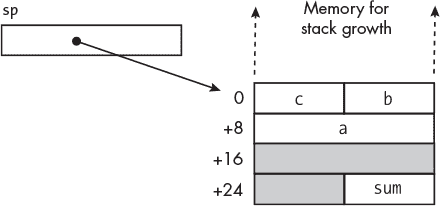
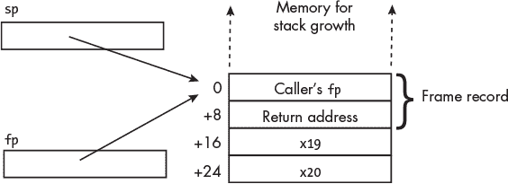
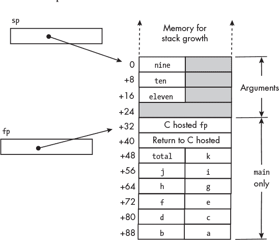
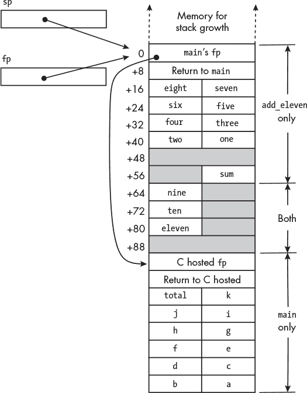
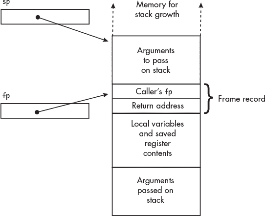

## 第十四章：**子函数内部**


良好的工程实践通常包括将问题拆分为功能上不同的子问题。在软件中，这种方法会导致程序包含多个函数，每个函数解决一个子问题。

这种*分治*方法的主要优点是，通常解决一个小的子问题比解决整个问题要容易。另一个优点是，之前对子问题的解决方案通常是可以重用的，就像我们通过使用 C 标准库中的函数所展示的那样。通过让几个人同时处理整体问题的不同部分，我们也可以节省开发时间。

当像这样拆解一个问题时，重要的是协调许多部分解决方案，使它们能够协同工作，提供正确的整体解决方案。在软件中，这意味着确保调用函数和被调用函数之间的数据接口正常工作。为了确保接口的正确操作，必须明确指定接口。在本章中，我将向你展示如何做到这一点。我将首先向你展示如何将数据项放置在全局位置，以便程序中的所有函数都可以直接访问它们。然后，我将介绍如何限制数据项作为函数参数传递，这样我们就可以更好地控制函数处理的数据。

在前几章中，你学会了如何通过寄存器将参数传递给函数。在本章中，你将学习如何将这些参数存储在内存中，以便寄存器可以在被调用函数内部重新使用。你还将学会如何传递比第十一章中表 11-3 所指定的八个寄存器更多的参数。

最后，我会更详细地讨论函数内部变量的创建。我将涵盖只在程序流程处于该函数时存在的变量，以及在整个程序运行期间保持在内存中的变量，但只能在其定义的函数内访问。

然而，在我们深入了解函数的内部工作原理之前，先来看看 C 中一些关于变量名称使用的规则。

### **C 中变量名称的作用域**

*作用域*是指我们代码中变量名称*可见*的地方，意味着我们可以使用该名称。这不是一本关于 C 的书，所以我不会涵盖变量名称在程序中可以使用的所有规则，但我会解释足够的内容，帮助你理解基本概念。

在 C 中，*声明*一个变量将其名称和数据类型引入当前作用域。*定义*一个变量是一个声明，同时也为变量分配内存。变量只能在程序中定义一次，但正如你将在第 271 页的“全局变量”部分看到的，它可以在多个作用域中声明。

在函数定义内部定义的变量称为*局部变量*，而在函数参数列表中声明的名称称为*形式参数*。局部变量和形式参数都具有*函数作用域*：它们的作用范围从声明的位置开始，直到函数的结束。

在 C 中，*块*是由一对匹配的大括号`{}`括起来的 C 语句组。块内部定义的变量的作用范围从定义的位置开始，直到该块的结束，包括任何被包含的块。这就是*块作用域*。

*函数原型*仅是函数的声明，而不是定义。它包含函数的名称、传递给函数的参数的数据类型，以及返回数据类型。在原型中，参数不需要命名，但这样做能为原型本身提供一些文档说明。原型声明中参数名称的作用范围仅限于其自身的原型。这一限制允许我们在不同的函数原型中使用相同的名称。例如，C 标准库中包含计算正弦和余弦的函数，其原型如下：

```
double sin(double x);
double cos(double x);
```

我们可以在同一个函数中使用两个函数原型，而无需为参数使用不同的名称。

在查看最终一种作用域——文件作用域之前，我将简要介绍传递参数给函数的原因。

### **传递参数概述**

输入和输出相对于我们的视角。阅读本节时，请小心区分来自调用函数的输入和输出，以及来自程序用户的输入和输出。在本章中，我们讨论的是来自其他函数的输入和输出。我们将在第二十章中探讨程序输入和输出与 I/O 设备相关的内容。

为了说明区别，请考虑以下 C 程序语句（来自清单 2-1 在第二章中），该语句用于从键盘（一个 I/O 设备）输入整数：

```
scanf("%x", &an_int);
```

`scanf`函数从`main`函数接收一个数据输入：格式化文本字符串`"%x"`的地址。`scanf`函数读取从键盘输入的用户数据，并将数据（一个无符号整数）输出到`main`函数中的`an_int`变量。

函数可以通过四种方式与程序其他部分的数据交互：

**直接** 程序中全局的数据可以从任何函数中直接访问。

**输入** 数据来自程序的其他部分，并被函数使用，但原始副本未被修改。

**输出** 函数将新数据提供给程序的其他部分。

**更新** 函数修改由程序其他部分持有的数据项。新值基于函数调用前的值。

如果被调用的函数也知道数据项的位置，那么可以执行这四种交互，但这会暴露数据的原始副本，并允许其被更改，即使它仅仅是作为输入传递给被调用函数。

我们可以通过将输出放置在全局已知位置（如寄存器或全局已知地址）来输出数据。我们还可以将存储输出的地址传递给被调用的函数。更新需要被调用的函数知道要更新的数据的地址。

为了看到它是如何工作的，我们将从查看全局变量是如何创建的，以及它们在子函数中如何被访问开始。

### **全局变量**

*全局变量* 在任何函数外部定义，并具有 *文件作用域*，这意味着它们可以从定义的地方一直访问到文件的末尾。全局变量还可以通过 `extern` 修饰符在另一个文件中访问。使用 `extern` 仅将变量的名称和数据类型引入声明的作用域，而不会为其分配内存。

清单 14-1 展示了如何定义全局变量。

*sum_ints_global.c*

```
  // Add two integers using global variables.

  #include <stdio.h>
  #include "add_two_global.h"

➊ int x = 123, y = 456, z;    // Define global variables

  int main(void)
  {
      add_two();
      printf("%i + %i = %i\n", x, y, z);

      return 0;
  }
```

*清单 14-1：一个* 使用三个全局变量的 *主函数*

将 `x`、`y` 和 `z` 的定义放在函数体外使它们成为全局变量❶。前两个变量被初始化，但第三个没有。我将向你展示编译器如何处理这些差异。

这个 `main` 函数调用了 `add_two` 函数，它将 `x` 和 `y` 相加，并将结果存储在 `z` 中。清单 14-2 显示了编译器为此 `main` 函数生成的汇编语言。

*sum_ints_global.s*

```
        .arch armv8-a
        .file   "sum_ints_global.c"
     ➊ .text
        .global x
     ➋ .data                     /// Data segment
        .align  2
        .type   x, %object
        .size   x, 4
x:
     ➌ .word   123               /// Initialize
        .global y
        .align  2
        .type   y, %object
        .size   y, 4
y:
        .word   456
        .global z
     ➍ .bss                      /// .bss section
        .align  2
        .type   z, %object
     ➎ .size   z, 4
z:
     ➏ .zero   4                 /// Could use .skip
        .section        .rodata
        .align  3
.LC0:
        .string "%i + %i = %i\n"
        .text
        .align  2
        .global main
        .type   main, %function
main:
        stp     x29, x30, [sp, -16]!
        mov     x29, sp
        bl      add_two
     ➐ adrp    x0, x             /// Address  defined
        add     x0, x0, :lo12:x   ///   in this file
        ldr     w1, [x0]
        adrp    x0, y
        add     x0, x0, :lo12:y
        ldr     w2, [x0]
        adrp    x0, z
        add     x0, x0, :lo12:z
        ldr     w0, [x0]
        mov     w3, w0
        adrp    x0, .LC0
        add     x0, x0, :lo12:.LC0
        bl      printf
        mov     w0, 0
        ldp     x29, x30, [sp], 16
        ret
        .size   main, .-main
        .ident  "GCC: (Debian 12.2.0-14) 12.2.0"
        .section        .note.GNU-stack,"",@progbits
```

*清单 14-2：在清单 14-1 中使用的函数的编译器生成的汇编语言*

我不知道为什么编译器添加了第一个 `.text` 指令❶，但它并不需要。它的效果立即被 `.data` 汇编指令覆盖，这将我们切换到数据段❷。

`.word` 指令分配一个字（4 字节）的内存，并将其初始化为参数的值，这里是整数 123 ❸。然后，`.bss` 汇编指令将我们切换到 *块开始符号* 区段，当程序加载到内存中执行时，该区段将位于数据段中❹。在 `.bss` 区段中定义的每个标签都将表示未初始化内存块的起始位置。程序的可执行文件中仅存储每个标记块的大小，从而使文件变得更小。

Linux 操作系统在加载程序时会将内存中 `.bss` 区段的所有字节初始化为 0，但除非在源代码中显式将其设置为 0，否则你的算法不应依赖于其中的变量为 0。

`.size`汇编指令将一个标签与其块中的字节数相关联❺。`z`标签表示程序中的一个 4 字节变量。虽然`z`在我们的 C 代码中没有初始化，并且`.bss`段在程序加载时会被设置为 0，编译器仍然使用了`.zero`汇编指令，指定了 4 字节内存，每个字节在此处都设置为 0❻。`.skip`指令在`.bss`段中会产生与`.zero`相同的效果。由于我们处于`.bss`段，汇编器不会在目标文件中存储这 4 个零字节。

这些变量在此文件中定义，因此编译器使用`adrp`/`add`两条指令序列来加载它们的地址❼。

接下来，我们来看`add_two`。首先，我们需要为该函数准备一个头文件。这在清单 14-3 中有所展示。

*add_two_global.h*

```
   // Add two global integers.

➊ #ifndef ADD_TWO_GLOBAL_H
➋ #define ADD_TWO_GLOBAL_H
➌ void add_two(void);
   #endif
```

*清单 14-3：使用全局变量的* add_two *函数的头文件*

头文件用于声明函数原型，这在 C 源代码文件中只能声明一次❸。一个头文件可以包含其他头文件，其中一些可能会包含原始头文件，从而导致函数原型被多次声明。为了避免这种情况，我们定义了一个标识符，它是头文件名称的风格化版本❷。

我们从`#ifndef`汇编指令开始，检查此标识符是否已经定义❶。如果没有，文件的内容会一直包括到`#endif`指令的末尾，定义文件名标识符并声明函数原型。之后在任何进一步包含该头文件时，检查文件名标识符会显示该标识符已经定义，因此预处理器会跳到`#endif`并避免再次声明函数原型。

清单 14-4 显示了使用全局变量的`add_two`函数的定义。

*add_two_global.c*

```
   // Add two global integers.

➊ #include "add_two_global.h"

➋ extern int x, y, z;

   void add_two(void)
   {
       z = x + y;
   }
```

*清单 14-4：使用全局变量的* add_two *函数*

函数的头文件应该包含在定义该函数的文件中，以确保头文件中的函数原型与定义匹配❶。全局变量仅在一个地方定义，但在使用它们的任何其他文件中都需要声明❷。

清单 14-5 显示了编译器为`add_two`函数生成的汇编语言。

*add_two_global.s*

```
        .arch armv8-a
        .file   "add_two_global.c"
        .text
        .align  2
        .global add_two
        .type   add_two, %function
add_two:
     ➊ adrp    x0, :got:x              /// Global offset table page
     ➋ ldr     x0, [x0, :got_lo12:x]   /// Address of x
        ldr     w1, [x0]
        adrp    x0, :got:y
        ldr     x0, [x0, :got_lo12:y]
        ldr     w0, [x0]
        add     w1, w1, w0
        adrp    x0, :got:z
        ldr     x0, [x0, :got_lo12:z]
        str     w1, [x0]
     ➌ nop
        ret
        .size   add_two, .-add_two
        .ident  "GCC: (Debian 12.2.0-14) 12.2.0"
        .section        .note.GNU-stack,"",@progbits
```

*清单 14-5：编译器为清单 14-4 中的函数生成的汇编语言*

`add_two`函数声明了`x`、`y`和`z`变量，并使用`extern`存储类说明符以便它可以访问这些变量，但它需要使用另一种技术来加载这些变量的地址，因为这些变量在另一个文件中定义。加载器将全局变量的地址存储在全局偏移表（GOT）中，该表在程序加载到内存中执行时被引入，参见《链接器》章节中的第 239 页。`:got:`操作数修饰符告诉加载器，在填充`adrp`指令❶中的页面偏移时，使用包含变量地址的 GOT。

这里的`ldr`指令使用了`x0`中的 GOT 页面地址作为其基址❷。`:got_lo12:`操作数修饰符告诉加载器使用偏移量的低 12 位来获取变量地址存储在 GOT 中的位置，从而用`x0`中变量的地址覆盖 GOT 的页面地址。

列表 14-5 还包含了一条新指令`nop`（读作“no-op”）❸。它对算法没有任何影响。手册中提到它用于指令对齐的目的：

##### nop**—无操作**

`nop`对程序计数器加 4，且没有其他效果。

尽管在小型程序中全局变量使用起来比较简单，但在大型程序中管理它们非常笨重。你需要精确地追踪程序中每个函数如何操作全局变量。如果在函数内定义变量，并且仅将需要的内容传递给每个子函数，那么管理变量将变得容易得多。在接下来的章节中，我将向你展示如何控制传递给和从子函数返回的内容。

### **显式传递参数**

当我们限制每个函数只使用它所需要的变量时，隔离函数的内部工作与其他函数之间的关系变得更加容易。这是一个名为*信息隐藏*的原则。它意味着你，作为程序员，只需处理子函数完成其特定任务所需要的那些变量和常量。当然，大多数子函数都需要以某种方式与其调用函数中的一些变量进行交互。在本节中，我们将讨论一个函数如何使用显式传递给它的参数来接收输入、产生输出或更新变量。

当一个值仅作为输入传递给被调用函数时，我们可以将该值的副本传递给被调用函数。这被称为*按值传递*。按值传递可以防止被调用函数改变调用函数中的值。

从被调用函数接收输出有点复杂。实现这一点的一种方法是使用*返回值*，在我们的环境中，返回值被放置在`w0`寄存器中。使用`w0`寄存器假定返回值是一个`int`。这种技术在本书的大多数示例程序中都有使用。`main`函数几乎总是返回 0 给调用它的操作系统中的函数。对于返回较大值还有其他规则，但我们在本书中不涉及。

调用函数接收被调用函数输出的其他技术要求调用函数传递给被调用函数一个用于存储输出的地址。这可以在高级语言中实现为*通过指针传递*或*通过引用传递*。它们的区别在于，使用指针传递时，程序可以改变指针指向另一个对象，而通过引用传递时，程序无法改变指针。C 语言和 C++都支持通过指针传递，但只有 C++支持通过引用传递。这些在汇编语言级别是相同的；存储输出的地址会传递给被调用函数。区别由高级语言强制执行。

接下来，您将学习 C 语言如何控制对其局部变量的访问。

#### ***在 C 语言中***

在本节中，我将编写与清单 14-1、14-3 和 14-4 中相同的程序，但这次我将把变量定义为`main`函数中的局部变量，并将它们作为参数传递给子函数。清单 14-6 展示了新的`main`函数版本。

*sum_ints.c*

```
// Add two integers using local variables.

#include <stdio.h>
#include "add_two.h"

int main(void)
{
 ➊ int x = 123, y = 456, z;

 ➋ add_two(&z, x, y);
    printf("%i + %i = %i\n", x, y, z);

    return 0;
}
```

*清单 14-6：一个* 使用三个局部变量的 *main* 函数 *

在函数体内定义变量❶使得这些变量仅对该函数可见。`add_two`函数将在我们作为第一个参数传递的地址处存储其结果。我们使用 C 语言的地址操作符`&`来获取`z`变量的地址，从而得到`&z`❷。`x`和`y`变量的值是`add_two`函数的输入，因此我们传递这些变量的副本。

清单 14-7 展示了`add_two`函数的头文件。

*add_two.h*

```
// Add two integers and output the sum.

#ifndef ADD_TWO_H
#define ADD_TWO_H
void add_two(int *a, int b, int c);
#endif
```

*清单 14-7：使用局部变量的* add_two *函数的头文件*

清单 14-8 展示了`add_two`函数的定义。

*add_two.c*

```
//Add two integers and output the sum.

#include "add_two.h"

void add_two(int *a, int b, int c)
{
    int sum;

    sum = b + c;
 ➊ *a = sum;
}
```

*清单 14-8：使用局部变量的* add_two *函数*

参数列表中的第一个参数`a`是一个指向`int`的指针。这意味着`a`保存了我们需要存储`sum`值的地址。为了解除引用`a`，我们使用 C 语言的*解引用操作符*`*`，得到`*a`❶。这将在`a`传递的地址处存储计算结果。

#### ***在汇编语言中***

清单 14-9 展示了编译器为清单 14-6 中的`main`函数生成的汇编语言。

*sum_ints.s*

```
         .arch armv8-a
         .file   "sum_ints.c"
         .text
         .section        .rodata
         .align  3
         .LC0:
         .string "%i + %i = %i\n"
         .text
         .align  2
         .global main
         .type   main, %function
 main:
      ❶ stp     x29, x30, [sp, -32]!
         mov     x29, sp
         mov     w0, 123
      ❷ str     w0, [sp, 28]        /// x = 123;
         mov     w0, 456
         str     w0, [sp, 24]        /// y = 456;
      ❸ add     x0, sp, 20          /// Address of z
      ❹ ldr     w2, [sp, 24]        /// Load y and x
         ldr     w1, [sp, 28]
         bl      add_two
         ldr     w0, [sp, 20]
         mov     w3, w0
         ldr     w2, [sp, 24]
         ldr     w1, [sp, 28]
         adrp    x0, .LC0
         add     x0, x0, :lo12:.LC0
         bl      printf
         mov     w0, 0
         ldp     x29, x30, [sp], 32
         ret
         .size   main, .-main
         .ident  "GCC: (Debian 12.2.0-14) 12.2.0"
         .section        .note.GNU-stack,"",@progbits
```

*清单 14-9：编译器生成的函数汇编语言，清单 14-6 中的函数*

所有三个变量都是自动局部变量，因此编译器会在堆栈帧中为它们分配空间 ❶。初始化的自动局部变量在每次调用函数时都会重新创建，因此需要主动进行初始化 ❷。

我们将`z`变量的地址传递给`add_two`函数，这样它可以将输出存储在该地址 ❸，同时我们将`x`和`y`变量的值传递给函数作为输入 ❹。

清单 14-10 展示了编译器生成的`add_two`函数的汇编语言。

*add_two.s*

```
         .arch armv8-a
         .file   "add_two.c"
         .text
         .align  2
         .global add_two
         .type   add_two, %function
 add_two:
      ❶ sub     sp, sp, #32
      ❷ str     x0, [sp, 8]         /// Address for output
         str     w1, [sp, 4]         /// Value of first input
         str     w2, [sp]            /// Value of second input
         ldr     w1, [sp, 4]
         ldr     w0, [sp]
         add     w0, w1, w0
         str     w0, [sp, 28]        /// Store sum locally
         ldr     x0, [sp, 8]
         ldr     w1, [sp, 28]        /// Load sum
         str     w1, [x0]            /// Store for caller
         nop
         add     sp, sp, 32
         ret
         .size   add_two, .-add_two
         .ident  "GCC: (Debian 12.2.0-14) 12.2.0"
         .section        .note.GNU-stack,"",@progbits
```

*清单 14-10：编译器生成的函数汇编语言，清单 14-8 中的函数*

你可能会注意到这个函数的第一件事是，它没有保存链接寄存器`lr`和帧指针`fp`的内容 ❶。这两个地址组成了*帧记录*。`lr`中的地址提供了回到调用此函数的地方的链接，而`fp`提供了回到调用函数的帧记录的链接。在某些错误情况下，帧记录链可能会很有用，但我在本书中不会深入讨论这个细节。

AArch64 过程调用标准规定，若一个小函数不调用其他函数，则不需要帧记录，这解释了编译器为什么省略了它。一个不调用任何函数的函数通常被称为*叶函数*。

这个函数简单地分配了一个 32 字节的堆栈帧，并在其中存储传递给它的三个项 ❷。你可能会觉得在这个非常简单的函数中并不需要这么做，但在更复杂的函数中可能是必须的。图 14-1 给出了`add_two`堆栈帧的图示。



*图 14-1：* add_two *函数的堆栈帧，见清单 14-10*

`c`和`b`的值是此函数的输入，`a`是存储函数输出的地址。

清单 14-11 展示了我可能如何在汇编语言中编写`add_two`函数。

*add_two.s*

```
// Add two integers and output the sum.
// Calling sequence:
//    x0 <- address of output
//    w1  <- integer
//    w2  <- integer
//    Returns 0
        .arch armv8-a
// Stack frame
     ❶ .equ    save1920, 16
        .equ    FRAME, 32
// Code
        .text
        .align  2
        .global add_two
        .type   add_two, %function
add_two:
        stp     fp, lr, [sp, -FRAME]!     // Create stack frame
        mov     fp, sp                    // Set our frame pointer
     ❷ stp     x19, x20, [sp, save1920]  // Save for local vars

        mov     x20, x0                   // For output
     ❸ add     w19, w2, w1               // Compute sum
        str     w19, [x20]                // Output sum

        mov     w0, wzr                   // Return 0
     ❹ ldp     x19, x20, [sp, save1920]  // Restore reg
        ldp     fp, lr, [sp], FRAME       // Delete stack frame
        ret                               // Back to caller
```

*清单 14-11：用汇编语言编写的* add_two *函数*

对于这个小的叶函数，堆栈帧并不是必须的，但我在这里创建了一个堆栈帧，以展示如何为调用函数保存寄存器，以便将它们作为局部变量使用。我们首先需要在堆栈帧中指定一个位置 ❶。这导致了图 14-2 所示的堆栈帧。



*图 14-2：* add_two *函数的堆栈帧，见清单 14-11*

尽管算法只使用`x19`寄存器的低位字，我们需要保存整个 64 位，因为我们的算法可能会改变`x19`的高位 32 位❷。事实上，这里的`add`指令将把`x19`的高位 32 位清零❸。不要忘记，在撤销栈帧之前，我们需要恢复保存的寄存器❹。

将我汇编语言版本的`add_two`函数的栈帧与编译器为 C 版本在图 14-1 中创建的栈帧进行比较，可以注意到我在栈帧的顶部创建了一个帧记录。然后我保存了`x19`和`x20`寄存器，以便在函数中进行计算。如果我后来修改我的汇编语言`add_two`函数，使其调用另一个函数，我不需要更改它的栈帧，因为它已经有了一个帧记录，而标准规定，调用的函数必须为调用函数保存`x19`和`x20`寄存器中的值。

在下一节中，你将看到当我们想传递超过八个可以通过寄存器传递的参数时，栈是如何提供帮助的。

#### ***传递超过八个参数***

大多数函数传递的参数少于我们可以通过寄存器传递的八个参数，但有时调用函数需要向另一个函数传递超过八个参数。在这种情况下，超过前八个的参数会通过调用栈传递。它们会在调用函数之前被放置到栈上。我将使用清单 14-12、14-14 和 14-15 中的程序来向你展示这一过程是如何工作的。

*sum11ints.c*

```
// Sum the integers 1 to 11.

#include <stdio.h>
#include "add_eleven.h"

int main(void)
{
    int total;
    int a = 1;
    int b = 2;
    int c = 3;
    int d = 4;
    int e = 5;
    int f = 6;
    int g = 7;
    int h = 8;
    int i = 9;
    int j = 10;
    int k = 11;

    total = add_eleven(a, b, c, d, e, f, g, h, i, j, k);
    printf("The sum is %i\n", total);

    return 0;
}
```

*清单 14-12：一个程序向子函数传递超过八个参数*

这个`main`函数创建了 11 个整数变量，并将它们初始化为 1 到 11 的值。然后它调用`add_eleven`函数来计算这 11 个数字的和，并打印结果。

清单 14-13 展示了编译器为清单 14-12 中的`main`函数生成的汇编语言。

*sum11ints.s*

```
        .arch armv8-a
        .file   "sum11ints.c"
        .text
        .section        .rodata
        .align  3
.LC0:
        .string "The sum is %i\n"
        .text
        .align  2
        .global main
        .type   main, %function
main:
     ❶ sub     sp, sp, #96         /// Local vars and args
        stp     x29, x30, [sp, 32]  /// Store caller fp and lr
        add     x29, sp, 32         /// Point fp to caller's fp
        mov     w0, 1               /// Store values in local vars
        str     w0, [sp, 92]
        mov     w0, 2
        str     w0, [sp, 88]
        mov     w0, 3
        str     w0, [sp, 84]
        mov     w0, 4
        str     w0, [sp, 80]
        mov     w0, 5
        str     w0, [sp, 76]
        mov     w0, 6
        str     w0, [sp, 72]
        mov     w0, 7
        str     w0, [sp, 68]
        mov     w0, 8
        str     w0, [sp, 64]
        mov     w0, 9
        str     w0, [sp, 60]
        mov     w0, 10
        str     w0, [sp, 56]
        mov     w0, 11
        str     w0, [sp, 52]
        ldr     w0, [sp, 52]        /// Store args on the stack
     ❷ str     w0, [sp, 16]
        ldr     w0, [sp, 56]
        str     w0, [sp, 8]
        ldr     w0, [sp, 60]
        str     w0, [sp]
     ❸ ldr     w7, [sp, 64]        /// Load args into regs
        ldr     w6, [sp, 68]
        ldr     w5, [sp, 72]
        ldr     w4, [sp, 76]
        ldr     w3, [sp, 80]
        ldr     w2, [sp, 84]
        ldr     w1, [sp, 88]
        ldr     w0, [sp, 92]
        bl      add_eleven
        str     w0, [sp, 48]
        ldr     w1, [sp, 48]
        adrp    x0, .LC0
        add     x0, x0, :lo12:.LC0
        bl      printf
        mov     w0, 0
        ldp     x29, x30, [sp, 32]
        add     sp, sp, 96
        ret
        .size   main, .-main
        .ident  "GCC: (Debian 12.2.0-14) 12.2.0"
        .section        .note.GNU-stack,"",@progbits
```

*清单 14-13：编译器为清单 14-12 中的函数生成的汇编语言*

当这个函数创建它的栈帧时，它在栈上为需要传递的额外参数分配内存❶。在调用`add_eleven`函数之前，它会从右到左处理参数列表。由于它只能通过寄存器传递八个参数，因此需要将三个多余的参数存储到栈上❷。这些参数存储在栈帧的顶部，这是 AArch64 程序调用标准所指定的，调用的函数应当预期这些参数。图 14-3 显示了此时栈的状态。



*图 14-3：在调用`add_eleven`之前，清单 14-12 中`main`函数的栈帧*

图 14-3 显示栈指针指向传递给`add_eleven`函数的参数。这张图中参数区域的名称`nine`、`ten`和`eleven`是`add_eleven`函数使用的对应参数名称。过程调用标准允许`main`和`add_eleven`都可以访问栈中参数区域的内存，但参数传递只能从调用者到被调用者——也就是在这个例子中从`main`到`add_eleven`。

虽然我们传递的是 4 字节的`int`类型，但 AArch64 过程调用标准规定，我们必须为每个栈参数使用 8 字节，与寄存器参数相同。遵循这个规则可以确保你可以将汇编语言函数与 C 语言函数一起使用。在图 14-3 中，编译器将第九、第十和第十一参数存储在栈中每个参数槽的低 4 字节中。（不要忘记我们的内存顺序是小端序。）

在为调用`add_eleven`函数设置好栈帧后，我们将剩余的八个参数存储在寄存器中❸。

让我们来看看`add_eleven`函数是如何从栈中获取参数的。我将从该函数的头文件开始，见清单 14-14。

*add_eleven.h*

```
// Add 11 integers and return the sum.

#ifndef ADD_ELEVEN_H
#define ADD_ELEVEN_H
int add_eleven(int one, int two, int three, int four, int five, int six,
               int seven, int eight, int nine, int ten, int eleven);
#endif
```

*清单 14-14：`add_eleven`函数的头文件*

`add_eleven`函数定义在清单 14-15 中。

*add_eleven.c*

```
// Add 11 integers and return the sum.

#include <stdio.h>
#include "add_eleven.h"

int add_eleven(int one, int two, int three, int four, int five, int six,
               int seven, int eight, int nine, int ten, int eleven)
{
    int sum = one + two + three + four + five + six
            + seven + eight + nine + ten + eleven;
    printf("Added them\n");

    return sum;
}
```

*清单 14-15：一个从调用函数接收超过八个参数的函数*

清单 14-16 显示了编译器为清单 14-15 中的`add_eleven`函数生成的汇编语言。

*add_eleven.s*

```
        .arch armv8-a
        .file   "add_eleven.c"
        .text
        .section        .rodata
        .align  3
.LC0:
        .string "Added them"
        .text
        .align  2
        .global add_eleven
        .type   add_eleven, %function
add_eleven:
        stp     x29, x30, [sp, -64]!
        mov     x29, sp
     ❶ str     w0, [sp, 44]          /// Save register arguments locally
        str     w1, [sp, 40]
        str     w2, [sp, 36]
        str     w3, [sp, 32]
        str     w4, [sp, 28]
        str     w5, [sp, 24]
        str     w6, [sp, 20]
        str     w7, [sp, 16]
        ldr     w1, [sp, 44]          /// Add first 8 inputs
        ldr     w0, [sp, 40]
        add     w1, w1, w0
        ldr     w0, [sp, 36]
        add     w1, w1, w0
        ldr     w0, [sp, 32]
        add     w1, w1, w0
        ldr     w0, [sp, 28]
        add     w1, w1, w0
        ldr     w0, [sp, 24]
        add     w1, w1, w0
        ldr     w0, [sp, 20]
        add     w1, w1, w0
        ldr     w0, [sp, 16]
        add     w1, w1, w0
     ❷ ldr     w0, [sp, 64]          /// Add inputs 9-11 from the stack
        add     w1, w1, w0
        ldr     w0, [sp, 72]
        add     w0, w1, w0
        ldr     w1, [sp, 80]
        add     w0, w1, w0
        str     w0, [sp, 60]
        adrp    x0, .LC0
        add     x0, x0, :lo12:.LC0
        bl      puts
        ldr     w0, [sp, 60]
        ldp     x29, x30, [sp], 64
        ret
        .size   add_eleven, .-add_eleven
        .ident  "GCC: (Debian 12.2.0-14) 12.2.0"
        .section        .note.GNU-stack,"",@progbits
```

*清单 14-16：编译器为清单 14-15 中的函数生成的汇编语言*

在创建栈帧后，编译器会保存通过寄存器传递的参数，因为调用另一个函数可能会改变它们的内容❶。它会在函数开始时进行此操作，以便在编译函数中的 C 语句时无需跟踪哪些参数已经被保存。

在从栈中加载这八个参数并对其求和后，函数将添加在调用函数的栈帧中的剩余三个参数❷。

图 14-4 显示了`main`和`add_eleven`函数的栈帧。



*图 14-4：调用`add_eleven`函数并创建其栈帧后的栈帧*

我在第 279 页中提到，帧指针指向帧记录，帧记录指向调用函数的帧记录，依此类推。图 14-4 展示了这条链条一直回溯到`main`的帧记录。

我只展示了`add_eleven`应使用的`sp`偏移量。这个函数知道在从`sp`减去 64 之前，`sp`指向三个 32 位的参数，因此栈上的第一个参数现在距离`sp`是+64。

程序调用标准允许`add_eleven`函数将项存储到并从图 14-4 中标记为“`add_eleven` only”的区域加载数据。它允许`add_eleven`函数使用标记为“Both”的栈区域中的项，但不允许被调用函数在该区域将项传递回调用函数。`add_eleven`函数不允许访问标记为“`main` only”的栈区域。

`main`函数可以将项存储到并从图 14-4 中标记为“`main` only”的区域加载数据，但它仅被允许将项存储到标记为“Both”的栈区域。

#### ***栈帧规则***

在编写汇编语言时，必须严格遵守寄存器使用和参数传递规则。任何偏离都会导致难以调试的错误。

图 14-5 展示了栈帧的整体结构。



*图 14-5：一个栈帧*

栈帧并不总是包含图 14-5 中的所有部分。如果函数从未向它调用的函数传递超过八个参数，则顶部框将不存在。在这种情况下，`sp`和`fp`都指向帧记录。

有些函数可能没有任何局部变量或保存的寄存器内容。如果它是一个叶函数，我们甚至不需要一个栈帧记录。

如果函数传递的参数不超过八个，那么图中的底部框将不存在。底部框是栈帧中唯一一个当前函数和调用函数都能访问的区域。

让我们用汇编语言编写`sum11ints`程序。除非是非常简单的函数，否则我通常从为每个函数绘制栈帧图开始，类似于图 14-3 和图 14-4。然后，我使用`.equ`指令为栈上需要访问的每个位置赋予符号名称。

列表 14-17 展示了我们如何为`sum11ints`程序中的`main`函数进行此操作。

*sum11ints.s*

```
// Sum the integers 1 to 11.
        .arch armv8-a
// Stack frame
     ❶ .equ    arg9, 0
        .equ    arg10, 8
        .equ    arg11, 16
        .equ    frame_record, 32
        .equ    total, 48
        .equ    k, 52
        .equ    j, 56
        .equ    i, 60
        .equ    h, 64
        .equ    g, 68
        .equ    f, 72
        .equ    e, 76
        .equ    d, 80
        .equ    c, 84
        .equ    b, 88
        .equ    a, 92
        .equ    FRAME, 96
// Constant data
        .section  .rodata
        .align  3
format:
        .string "The sum is %i\n"
        .text
        .align  2
        .global main
        .type   main, %function
main:
     ❷ sub     sp, sp, FRAME              // Allocate our stack frame
        stp     fp, lr, [sp, frame_record] // Create frame record
        add     fp, sp, frame_record       // Set our frame pointer
        mov     w0, 1                      // Store values in local vars
     ❸ str     w0, [sp, a]
        mov     w0, 2
        str     w0, [sp, b]
        mov     w0, 3
        str     w0, [sp, c]
        mov     w0, 4
        str     w0, [sp, d]
        mov     w0, 5
        str     w0, [sp, e]
        mov     w0, 6
        str     w0, [sp, f]
        mov     w0, 7
        str     w0, [sp, g]
        mov     w0, 8
        str     w0, [sp, h]
        mov     w0, 9
        str     w0, [sp, i]
        mov     w0, 10
        str     w0, [sp, j]
        mov     w0, 11
        str     w0, [sp, k]
        ldr     w0, [sp, k]                // Store args 9-11
        str     w0, [sp, arg11]            //   on the stack
        ldr     w0, [sp, j]
        str     w0, [sp, arg10]
        ldr     w0, [sp, i]
        str     w0, [sp, arg9]
        ldr     w7, [sp, h]                // Load args 1-8
        ldr     w6, [sp, g]                //   in regs 0-7
        ldr     w5, [sp, f]
        ldr     w4, [sp, e]
        ldr     w3, [sp, d]
        ldr     w2, [sp, c]
        ldr     w1, [sp, b]
        ldr     w0, [sp, a]
        bl      add_eleven                 // Add all
        str     w0, [sp, total]            // Store returned sum
        ldr     w1, [sp, total]            // Argument to printf
        adr     x0, format                 // Format string 
        bl      printf                     // Print result

        mov     w0, wzr                    // Return 0
        ldp     fp, lr, [sp, frame_record] // Restore fp and lr
        add     sp, sp, FRAME              // Delete stack frame
        ret                                // Back to caller
```

*列表 14-17：用汇编语言编写的* sum11ints main *函数*

`.equ`指令的列表很好地展示了我们的栈帧是什么样子❶。使用符号名称来表示我们的变量，使得汇编语言代码更加易读，因为我们不必记住栈上每个项的数值偏移❸。

函数序言的算法需要考虑到`main`将通过栈传递参数。我们首先为栈帧分配空间 ❷。然后，在传递参数的区域之后创建栈帧记录。一旦我们创建了栈帧的`.equ`视图，这个过程就变得简单了。

接下来，我们将在汇编语言中编写`add_eleven`函数，使用图 14-4 中的图示来设置`.equ`指令的值。汇编语言代码展示在清单 14-18 中。

*add_eleven.s*

```
// Add 11 integers and return the sum.
// Calling sequence:
//    w0 through w7 <- 8 integers
//    [sp] <- integer
//    [sp+8] <- integer
//    [sp+16] <- integer
//    Returns sum
        .arch armv8-a
// Stack frame
        .equ    eight, 16
        .equ    seven, 20
        .equ    six, 24
        .equ    five, 28
        .equ    four, 32
        .equ    three, 36
        .equ    two, 40
        .equ    one, 44
        .equ    sum, 60
     ❶ .equ    FRAME, 64             // End of our frame
        .equ    nine, 64              // Stack args
        .equ    ten, 72
        .equ    eleven, 80
// Constant data
        .section  .rodata
        .align  3
msg:
        .string "Added them"
        .text
        .align  2
        .global add_eleven
        .type   add_eleven, %function
add_eleven:
     ❷ stp     fp, lr, [sp, -FRAME]! // Create stack frame
        mov     fp, sp                // Set our frame pointer

        str     w0, [sp, one]         // Save register args
        str     w1, [sp, two]
        str     w2, [sp, three]
        str     w3, [sp, four]
        str     w4, [sp, five]
        str     w5, [sp, six]
        str     w6, [sp, seven]
        str     w7, [sp, eight]
        ldr     w1, [sp, one]         // Load args             
        ldr     w0, [sp, two]
        add     w1, w1, w0            //   and sum them
        ldr     w0, [sp, three]
        add     w1, w1, w0
        ldr     w0, [sp, four]
        add     w1, w1, w0
        ldr     w0, [sp, five]
        add     w1, w1, w0
        ldr     w0, [sp, six]
        add     w1, w1, w0
        ldr     w0, [sp, seven]
        add     w1, w1, w0
        ldr     w0, [sp, eight]
        add     w1, w1, w0
        ldr     w0, [sp, nine]
        add     w1, w1, w0
        ldr     w0, [sp, ten]
        add     w1, w1, w0
        ldr     w0, [sp, eleven]
        add     w1, w1, w0
        str     w1, [sp, sum]         // Store sum
        adr     x0, msg               // Tell user we're done
        bl      puts

        ldr     w0, [sp, sum]         // Return the sum
        ldp     fp, lr, [sp], FRAME   // Delete stack frame
        ret                           // Back to caller
```

*清单 14-18：用汇编语言编写的* add_eleven *函数*

我们需要小心区分栈帧中仅由当前函数使用的部分和由调用函数传入的参数。通过`.equ`指令❶命名这个边界，可以方便地创建我们的栈帧 ❷。与清单 14-17 中的`main`函数一样，`.equ`指令的命名也使得汇编语言代码更易于阅读。

自动局部变量的值在退出函数时会丢失。有时你希望局部变量提供的信息是隐藏的，但你也希望在后续调用函数时该变量的内容保持不变。接下来我们将讨论如何实现这一点。

**你的回合**

14.1     展示在清单 14-18 中的汇编语言`add_eleven`函数如何与清单 14-12 中的 C 语言`main`函数一起工作。

14.2     展示初始化清单 14-15 中的`sum`变量与单独进行加法运算（如在清单 14-8 中所示）是相同的。

14.3     用汇编语言编写一个程序，求两个由用户输入的整数之间所有整数的和。

14.4     用汇编语言编写三个函数：`write_char`、`write_str`和`read_str`。稍后在本书中的练习中你将使用这些函数。以下是每个函数的规格：

(a)     `write_char`通过`write`系统调用在终端窗口中写入一个字符。它接受一个参数并返回 0。

(b)     `write_str`通过`write`系统调用在终端窗口中写入文本。它接受一个参数，并返回写入的字符数。

(c)     `read_str`通过`read`系统调用从键盘读取字符，并将它们存储在内存中作为 C 风格的文本字符串，不包括换行符。它接受两个参数：一个指向存储文本的内存位置的指针和最大存储字符数。如果输入的字符数超过最大值，它会读取剩余的输入，但不存储它。返回值是输入的字符数，减去`NUL`终止字符。

使用以下 C 语言`main`函数测试这些函数。别忘了为你的汇编语言函数编写 C 头文件。

```
// Prompt user to enter text and echo it.

#include "write_char.h"
#include "write_str.h"
#include "read_str.h"
#define MAX 5
#define BUFF_SZ MAX+1   // Make room for NUL

int main(void)
{
    char text[BUFF_SZ];

    write_str("Enter some text: ");
    read_str(text, MAX);
    write_str("You entered: ");
    write_str(text);
    write_char('\n');

    return 0;
}
```

提示：测试`read_str`函数时使用一个较小的`MAX`值。

### **静态局部变量**

正如在第十一章中讨论的那样，自动局部变量在函数的前置代码中创建，并在函数的尾部删除。这意味着自动局部变量存储的值在后续调用函数时会丢失。但在某些情况下，我们可能希望在函数调用之间保持变量的值，同时仍然保持局部变量的信息隐藏优势。例如，我们可能有一个从多个其他函数中调用的函数，并且想要维护它被调用的次数。我们可以使用全局变量，但全局变量无法提供局部变量的信息隐藏特性。

作为替代，我们可以使用*静态局部变量*。像自动局部变量一样，静态局部变量具有局部作用域；然而，像全局变量一样，它会在整个程序的生命周期内一直保留在内存中。

#### ***在 C 中***

我将使用清单 14-19、14-20 和 14-21 中的程序，解释静态局部变量在内存中是如何创建的。这些清单展示了自动局部变量、静态局部变量和全局变量在可见性和持久性上的区别。

*var_life.c*

```
// Compare the scope and lifetime of automatic, static, and global variables.

#include <stdio.h>
#include "add_const.h"
#define INIT_X 12
#define INIT_Y 34
#define INIT_Z 56

int z = INIT_Z;

int main(void)
{
    int x = INIT_X;
    int y = INIT_Y;

    printf("           automatic   static   global\n");
    printf("                   x        y        z\n");
    printf("In main:%12i %8i %8i\n", x, y, z);
    add_const();
    add_const();
    printf("In main:%12i %8i %8i\n", x, y, z);
    return 0;
}
```

*清单 14-19：一个比较自动局部变量、静态局部变量和全局变量的程序*

这个`main`函数定义了三个`int`变量：全局变量`z`和自动局部变量`x`、`y`。

清单 14-20 展示了`add_const`函数的头文件，该函数将常量值添加到自动局部变量、静态局部变量和在`main`中定义的全局变量中。

*add_const.h*

```
// Add a constant to an automatic local variable, a static local variable, 
// and a global variable.

#ifndef ADD_CONST_H
#define ADD_CONST_H
void add_const(void);
#endif
```

*清单 14-20：`add_const`函数的头文件*

清单 14-21 是`add_const`函数的定义。

*add_const.c*

```
// Add a constant to an automatic local variable, a static local variable, 
// and a global variable.

#include <stdio.h>
#include "add_const.h"
#define INIT_X 78
#define INIT_Y 90
#define ADDITION 1000

void add_const(void)
{
    int x = INIT_X;         // Every call
  ❶ static int y = INIT_Y;  // First call only
  ❷ extern int z;           // Global

     x += ADDITION;          // Add to each
     y += ADDITION;
     z += ADDITION;

     printf("In add_const:%7i %8i %8i\n", x, y, z);
}
```

*清单 14-21：一个将常量值添加到三个变量的函数*

`add_const`函数定义了两个局部变量`x`和`y`。`y`变量被指定为`static` ❶。这意味着它只会在第一次调用`add_const`时被初始化为`INIT_Y`。（如果你没有给静态局部变量赋初值，编译器会将其初始化为 0，但如果你的意图是这样，建议明确地初始化为 0。）`add_const`对`y`所做的任何更改都会在此次调用及所有后续的调用中保持不变。`z`变量使用`extern`修饰符 ❷ 声明，表示它在程序的其他地方定义。

`add_const`函数将一个常量值加到函数中声明的三个变量上。`printf`语句显示了每次调用`add_const`时，在`add_const`中定义的局部变量`x`和`y`，以及在`main`中定义的全局变量`z`的值。

执行此程序会得到以下输出：

```
           automatic   static   global
                   x        y        z
In main:          12       34       56
In add_const:   1078     1090     1056
In add_const:❶ 1078   ❷ 2090     2056
In main:          12       34   ❸ 2056
```

如你所见，`main` 中的 `x` 与 `add_const` 中的 `x` 不同。每次 `main` 调用 `add_const` 时，`add_const` 中的 `x` 都被初始化为 78，然后函数将其加上 1,000 ❶。这表明每次调用 `add_const` 时，都会自动创建一个新的 `x`。

你还可以看到 `main` 中的 `y` 与 `add_const` 中的 `y` 不同，但 `add_const` 中的 `x` 和 `y` 变量行为并不相同。第一次调用 `add_const` 时，它将其 `y` 变量初始化为 90 并加上 1,000。然而，这次第一次调用 `add_const` 的结果会持续存在。第二次调用 `add_const` 时，不会重新初始化 `y`；该函数只是将 1,000 加到静态 `y` 的现有值上 ❷。

尽管程序中有两个 `x` 和两个 `y`，但只有一个 `z`，它是在 `main` 中定义的。程序的输出显示，`main` 给 `z` 赋予初始值 56，而每次调用 `add_const` 函数时，`add_const` 都会将 1,000 加到该值上 ❸。

#### ***汇编语言中的内容***

清单 14-22 显示了编译器为 `var_life` 程序中的 `main` 函数生成的汇编语言。

*var_life.s*

```
         .arch armv8-a
        .file   "var_life.c"
        .text
     ❶ .global z
        .data
        .align  2
        .type   z, %object
        .size   z, 4
z:
        .word   56                  /// One instance of z
        .section        .rodata
        .align  3
.LC0:
        .string "           automatic   static   global"
        .align  3
.LC1:
        .string "                   x        y        z"
        .align  3
.LC2:
        .string "In main:%12i %8i %8i\n"
        .text
        .align  2
        .global main
        .type   main, %function
main:
        stp     x29, x30, [sp, -32]!
        mov     x29, sp
        mov     w0, 12
        str     w0, [sp, 28]        /// main's x
        mov     w0, 34
     ❷ str     w0, [sp, 24]        /// main's y
        adrp    x0, .LC0
        add     x0, x0, :lo12:.LC0
        bl      puts
        adrp    x0, .LC1
        add     x0, x0, :lo12:.LC1
        bl      puts
        adrp    x0, z
        add     x0, x0, :lo12:z
        ldr     w0, [x0]
        mov     w3, w0
        ldr     w2, [sp, 24]
        ldr     w1, [sp, 28]
        adrp    x0, .LC2
        add     x0, x0, :lo12:.LC2
        bl      printf
        bl      add_const
        bl      add_const
        adrp    x0, z
        add     x0, x0, :lo12:z
        ldr     w0, [x0]
        mov     w3, w0
        ldr     w2, [sp, 24]
        ldr     w1, [sp, 28]
        adrp    x0, .LC2
        add     x0, x0, :lo12:.LC2
        bl      printf
        mov     w0, 0
        ldp     x29, x30, [sp], 32
        ret
        .size   main, .-main
        .ident  "GCC: (Debian 12.2.0-14) 12.2.0"
        .section        .note.GNU-stack,"",@progbits
```

*清单 14-22：编译器为清单 14-19 中的函数生成的汇编语言*

这段代码中的大部分内容应该对你来说是熟悉的。程序中的 `z` 实例在 `main` 中定义为全局变量，编译器使用我们的名字标记该变量 ❶。`main` 中的 `y` 被创建在栈上 ❷。

让我们看看编译器为 `add_const` 函数生成的汇编语言，如清单 14-23 所示。

*add_const.s*

```
        .arch armv8-a
        .file   "add_const.c"
        .text}
        .section        .rodata
        .align  3
.LC0:
        .string "In add_const:%7i %8i %8i\n"
        .text
        .align  2
        .global add_const
        .type   add_const, %function
add_const:
        stp     x29, x30, [sp, -32]!
        mov     x29, sp
        mov     w0, 78
     ❶ str     w0, [sp, 28]
        ldr     w0, [sp, 28]
        add     w0, w0, 1000
        str     w0, [sp, 28]            /// add_const's x
     ❷ adrp    x0, y.0
        add     x0, x0, :lo12:y.0       /// add_const's y
        ldr     w0, [x0]
        add     w1, w0, 1000
        adrp    x0, y.0
        add     x0, x0, :lo12:y.0
        str     w1, [x0]
     ❸ adrp    x0, :got:z              /// Global z
        ldr     x0, [x0, :got_lo12:z]
        ldr     w0, [x0]
        add     w1, w0, 1000
        adrp    x0, :got:z
        ldr     x0, [x0, :got_lo12:z]
        str     w1, [x0]
        adrp    x0, y.0
        add     x0, x0, :lo12:y.0
        ldr     w1, [x0]
        adrp    x0, :got:z
        ldr     x0, [x0, :got_lo12:z]
        ldr     w0, [x0]
        mov     w3, w0
        mov     w2, w1
        ldr     w1, [sp, 28]
        adrp    x0, .LC0
        add     x0, x0, :lo12:.LC0
        bl      printf
        nop
        ldp     x29, x30, [sp], 32
        ret
        .size   add_const, .-add_const
     ❹ .data
        .align  2
        .type   y.0, %object
        .size   y.0, 4
y.0:
     ❺ .word   90
        .ident  "GCC: (Debian 12.2.0-14) 12.2.0"
        .section        .note.GNU-stack,"",@progbits
```

*清单 14-23：编译器生成的汇编语言，用于清单 14-21 中的* add_const *函数*

编译器将 `x` 变量分配到栈帧中，因此它知道栈指针的偏移量 ❶。正如你在 第 271 页的“全局变量”一节中学到的那样，`add_const` 需要从 GOT 获取全局变量 `z` 的地址 ❸。

编译器处理静态局部变量 `y` 与全局变量略有不同。它将我们的名字改为 `y.0` ❷。这种对变量名字的修饰叫做 *名称修饰* 或 *名称重整*。我更喜欢称其为修饰，因为它是对我们原始名字的补充。

静态局部变量不能存在于栈帧中。像在 `main` 函数中定义的全局变量 `z`（参见 清单 14-22）一样，静态局部变量 `y` 被分配在 `.data` 段 ❹。它被标记为其修饰后的名字，并通过 `.word` 汇编指令初始化 ❺。我们通过它的修饰名来获取 `y` 变量的地址 ❷。

编译器需要装饰名称以满足 C 语言的规则，同时生成有效的汇编语言文件。正如你可能还记得从本章的第一部分（第 270 页），C 语言中变量名称的作用域仅扩展到它定义的块的结束。这意味着我们可以使用相同的名称在另一个不同的块中定义另一个静态变量，只要这个块不包含在第一个块内。但这两个变量都会在汇编语言中生成标签，且它们具有文件作用域。C 编译器需要区分这两个标签，因为汇编器要求每个标签在文件内都是唯一的。它通过装饰我们的静态局部变量名称来实现这一点。

在汇编语言中编写程序时，我们可以使用更有意义的名称来区分变量，使代码更易于阅读。清单 14-24 和 14-25 展示了我如何在汇编语言中编写这个程序。

*var_life.s*

```
// Compare the scope and lifetime of automatic, static, and global variables.
        .arch armv8-a
// Useful names
        .equ    INIT_X, 12
        .equ    INIT_Y, 34
        .equ    INIT_Z, 56
// Stack frame
        .equ    x, 24
        .equ    y, 28
        .equ    FRAME, 32
// Code
        .global z
        .data
        .align  2
        .type   z, %object
        .size   z, 4
z:
        .word   INIT_Z
        .section  .rodata
heading0:
        .string "           automatic   static   global"
heading1:
        .string "                   x        y        z"
msg:
        .string "In main:%12i %8i %8i\n"
        .text
        .align  2
        .global main
        .type   main, %function
main:
        stp     fp, lr, [sp, -FRAME]!   // Create stack frame
        mov     fp, sp                  // Set frame pointer

        mov     w0, INIT_X
        str     w0, [sp, x]             // x = INIT_X;
        mov     w0, INIT_Y
        str     w0, [sp, y]             // y = INIT_Y;
        adr     x0, heading0            // Print two-line header
        bl      puts
        adr     x0, heading1
        bl      puts

     ❶ adr     x0, z 
        ldr     w3, [x0]                // Global z
        ldr     w2, [sp, y]             // Local y
        ldr     w1, [sp, x]             // Local x
        adr     x0, msg                 // Show values
        bl      printf
        bl      add_const               // Add constants
        bl      add_const               //   twice

        adr     x0, z                   // Repeat display
        ldr     w3, [x0]
        ldr     w2, [sp, y]
        ldr     w1, [sp, x]
        adr     x0, msg
        bl      printf

        mov     w0, wzr                 // Return 0
        ldp     fp, lr, [sp], FRAME     // Delete stack frame
        ret                             // Back to caller
```

*清单 14-24：一个汇编语言程序，用于比较自动局部变量、静态局部变量和全局变量*

我的汇编语言`main`函数与编译器在清单 14-22 中所做的非常相似，但我使用了更有意义的名称。只使用终端 I/O 的程序通常非常小，因此我假设`z`会位于指令的*±*1MB 范围内，并使用`adr`指令加载它的地址❶。如果事实并非如此，链接器应该会警告我们，这时我们需要使用`adrp/add`指令序列来加载`z`的地址。

清单 14-25 展示了我如何在汇编语言中编写`add_const`。

*add_const.s*

```
   // Add a constant to an automatic local variable, a static local variable, 
   // and a global variable.
           .arch armv8-a
   // Useful names
           .equ    INIT_X, 78
           .equ    INIT_Y, 90
           .equ    ADDITION, 1000
   // Stack frame
           .equ    x, 28
           .equ    FRAME, 32
   // Code
           .data
           .align  2
           .type   y, %object
           .size   y, 4
❶ y:
           .word   INIT_Y
           .section  .rodata
   msg:
           .string "In add_const:%7i %8i %8i\n"
           .text
           .align  2
           .global add_const
           .type   add_const, %function
   add_const:
           stp     fp, lr, [sp, -FRAME]!   // Create stack frame
           mov     fp, sp                  // Set frame pointer

           mov     w0, INIT_X
           add     w0, w0, ADDITION        // Add constant
           str     w0, [sp, x]             // x += ADDITION
        ❷ adr     x0, y
           ldr     w1, [x0]                // Load our y
           add     w1, w1, ADDITION        // Add constant
           str     w1, [x0]                // y += ADDITION;    
           adrp    x0, :got:z              // z page number
           ldr     x0, [x0, :got_lo12:z]   // z address
           ldr     w1, [x0]                // Load z
           add     w1, w1, ADDITION        // Add constant
           str     w1, [x0]                // z += ADDITION

           adrp    x0, :got:z              // z page number
           ldr     x0, [x0, :got_lo12:z]   // z address
           ldr     w3, [x0]                // Load global z
           adr     x0, y
           ldr     w2, [x0]                // Load our y
           ldr     w1, [sp, x]             // Load our x
           adr     x0, msg                 // Show current values
           bl      printf

           mov     w0, wzr                 // Return 0
           ldp     fp, lr, [sp], FRAME     // Delete stack frame
           ret                             // Back to caller
```

*清单 14-25：一个汇编语言函数，用于将常量值加到三个变量上*

我没有装饰`y`变量的名称❶。正如我们之前看到的，编译器会装饰静态局部变量的名称，以防止如果我们在同一个 C 源文件的另一个函数中使用相同的静态局部名称时，编译器生成的汇编语言中出现标签重复的情况。但在汇编语言中编写代码使我们在选择标签名称时更加灵活。如果我们在同一文件中使用`y`来标记另一个内存位置，并使用`add_const`函数，汇编器会告诉我们错误。

和`main`函数中的`z`变量一样，我假设`y`静态变量会接近访问它的指令❷。

接下来，我将简要总结程序内存特性。

### **程序内存特性**

当我们在第十章开始编写汇编语言程序时，你了解了不同的内存段。表 14-1 总结了程序中一些最常见组件的内存特性，以及它们被放置的内存段。

**表 14-1：常见程序组件的内存特性**

| **组件** | **内存段** | **访问** | **生命周期** |
| --- | --- | --- | --- |
| 自动局部变量 | 栈 | 读写 | 函数 |
| 常量 | 文本 | 只读 | 程序 |
| 指令 | 文本 | 只读 | 程序 |
| 静态局部变量 | 数据 | 读写 | 程序 |
| 全局变量 | 数据 | 读写 | 程序 |

Table 14-2 总结了常用的汇编指令，用于控制程序组件在内存中的位置。

**Table 14-2:** 一些常见的汇编内存指令

| **指令** | 内存段 | 效果 |
| --- | --- | --- |
| `.text` | 文本 | 指令跟随其后 |
| `.rodata` | 文本 | 常量数据跟随其后 |
| `.string "*string*", ...` | 文本 | 字符数组，每个字符由`NUL`结束 |
| `.ascii "*string*", ...` | 文本 | 字符数组 |
| `.asciz "*string*", ...` | 文本 | 字符数组，每个字符由`NUL`结束 |
| `.bss` | 数据 | 后续数据内存初始化为零 |
| `.data` | 数据 | 变量数据跟随其后 |
| `.byte *expression*, ...` | 数据 | 初始化内存，每个*`expression`*占 1 字节 |
| `.hword *expression*, ...` | 数据 | 初始化内存，每个*`expression`*占 2 字节 |
| `.word *expression*, ...` | 数据 | 初始化内存，每个*`expression`*占 4 字节 |
| `.quad *expression*, ...` | 数据 | 初始化内存，每个*`expression`*占 8 字节 |

`.string`、`.ascii` 和 `.asciz` 指令可以分配多个文本字符串，每个字符串由逗号分隔。`.string` 和 `.asciz` 指令会在文本字符串的末尾添加`NUL`字符，而`.ascii`则不会。

`.byte`、`.hword`、`.word` 和 `.quad` 指令可以应用于零个或多个表达式，每个表达式都必须计算为整数值。多字节值以小端顺序存储。如果没有表达式，则不会分配内存。

这只是这些指令的摘要。如需更多细节，请参考`as`的`info`页面。

**你的回合**

14.5     修改 Listings 14-24 和 14-25 中的程序，使得`add_const`函数能够打印出它被调用的次数。

| 14.6 | 在 Listing 14-21 中的文件里复制`add_const`函数，命名第二个副本为`add_const2`。相应地修改 Listing 14-20 中的头文件。修改 Listing 14-19 中的`main`函数，使其调用这两个函数两次。这样会如何影响`add_const`和`add_const2`函数中的名称修饰？

### **你所学到的**

**全局变量** 在程序的整个生命周期内保持存在（全局作用域）。

**自动局部变量** 在调用函数时创建，并在退出函数时删除（函数作用域）。

**静态局部变量** 在第一次调用其函数时初始化。它们的值（包括任何更改）在随后的函数调用之间保持不变（函数作用域）。

**传递参数** 前八个参数通过寄存器传递。任何额外的参数通过栈传递。

**值传递** 传递的是值的副本。

**指针传递** 传递的是变量的地址。被调用函数中可以更改该地址。

**引用传递** 传递的是变量的地址。被调用函数中无法更改该地址。

**栈帧** 栈上的一个区域，用于存储函数的帧记录、局部变量、保存的寄存器内容以及传递给函数的参数。

**帧指针** 一个寄存器，包含栈帧中帧记录的地址。

**帧记录** 两个地址：调用函数的帧指针和返回地址。

现在你已经了解了函数的内部工作原理，接下来我会在下一章展示一些子函数的特殊用法。
