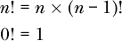
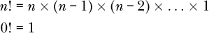
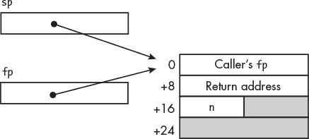

## 第十五章：**子函数的特殊用途**


正如你在 第十四章 中学到的，子函数最常见的用途是将一个问题分解成更小、更易解决的子问题。这是 *递归* 的基础，也是本章前半部分的主题。

在我讲解递归之后，我将向你展示子函数的另一个用途：直接访问汇编语言中的硬件功能，这些功能在高级语言中可能无法轻易访问。

### **递归**

许多计算机解决方案涉及重复的操作。你在 第十三章 中学会了如何使用迭代—`while`、`for` 和 `do-while` 循环—来执行重复的操作。虽然迭代可以用来解决任何重复性问题，但某些解决方案使用递归描述时会更加简洁。

*递归算法* 是一种调用自身来计算问题的简化版本，并使用该结果来计算更复杂的情况的算法。递归调用会持续进行，直到简化的情况达到 *基准情况*，即一个可以轻松计算的情况。在这一点上，递归算法会将基准情况的值返回给下一个更复杂的情况，并在该计算中使用这个值。这个返回/计算的过程会继续进行，逐步执行更复杂的计算，直到我们得出原始问题的解决方案。

让我们来看一个例子。在数学中，我们用 `!` 来表示正整数的阶乘操作，这可以递归定义：



第一个方程式展示了 *n*! 是通过计算它自身的简化版本 (*n* – 1)! 来定义的。这个计算会反复执行，直到我们达到基准情况 *n* = 0。然后我们返回并计算每一个 *n*!。

作为对比，阶乘操作的迭代定义是：



尽管两种定义阶乘操作的形式涉及相同数量的计算，但递归形式更简洁，或许对某些人来说也更直观。

清单 15-1 到 15-3 展示了一个使用函数 `factorial` 来计算 3! 的程序。当我们使用 `gdb` 来检查程序的行为时，你会明白为何使用一个小的固定值。

*three_factorial.c*

```
// Compute 3 factorial.

 #include <stdio.h>
 #include "factorial.h"

 int main(void)
 {
     unsigned int x = 3;
     unsigned int y;

     y = factorial(x);
     printf("%u! = %u\n", x, y);

     return 0;
 }
```

*清单 15-1：计算 3! 的程序*

数学中的阶乘函数是针对非负整数定义的，因此我们使用 `unsigned int` 类型。

对于 `factorial` 函数的头文件，在 清单 15-2 中并没有什么特别之处。

*factorial.h*

```
// Return n factorial.

 #ifndef FACTORIAL_H
 #define FACTORIAL_H
 unsigned int factorial(unsigned int n);
 #endif
```

*清单 15-2：计算 n! 的函数的头文件*

清单 15-3 显示了 `factorial` 函数如何通过调用自身来执行更简单的计算 (*n* – 1)!, 从而轻松地计算 *n!*。

*factorial.c*

```
// Return n factorial.

 #include "factorial.h"

 unsigned int factorial(unsigned int n)
 {
     unsigned int current = 1;   // Assume base case

  ➊ if (n != 0) {
      ➋ current = n * factorial(n - 1);
     }
     return current;
 }
```

*清单 15-3：计算 n! 的函数*

`factorial` 函数首先检查基础情况 *n* = 0 ❶。如果处于基础情况，当前结果为 1。如果不在基础情况，`factorial` 函数会调用自身计算 (*n* – 1)!，并将结果乘以 *n* 以获得 *n*!❷。

`main` 函数的汇编语言并无特别之处，但让我们看看编译器为 `factorial` 函数生成的内容，如列表 15-4 所示。

*factorial.s*

```
         .arch armv8-a
         .file   "factorial.c"
         .text
         .align  2
         .global factorial
         .type   factorial, %function
 factorial:
         stp     x29, x30, [sp, -48]!
         mov     x29, sp
      ➊ str     w0, [sp, 28]
         mov     w0, 1
         str     w0, [sp, 44]
         ldr     w0, [sp, 28]
      ➋ cmp     w0, 0             /// Check for base case
         beq     .L2
         ldr     w0, [sp, 28]
         sub     w0, w0, #1        /// n - 1
      ➌ bl      factorial         /// Recursive call
         mov     w1, w0
         ldr     w0, [sp, 28]
      ➍ mul     w0, w0, w1        /// n * (n - 1)!
         str     w0, [sp, 44]
 .L2:
         ldr     w0, [sp, 44]
         ldp     x29, x30, [sp], 48
         ret
         .size   factorial, .-factorial
         .ident  "GCC: Debian 12.2.0-14) 12.2.0"
         .section        .note.GNU-stack,"",@progbits
```

*列表 15-4：编译器生成的列表 15-3 中函数的汇编语言*

`factorial` 函数使用的算法是一个简单的 `if` 结构，你在第十三章中学过 ❷。递归函数的关键部分是，我们需要在寄存器中保存传递给它的任何参数，以便这些寄存器可以在递归调用时重新使用来传递参数。

例如，`factorial` 函数接受一个参数 `n`，它通过 `w0` 寄存器传递。从表 11-3 中第十一章我们知道，在我们的函数中不需要保存 `x0` 的内容，但我们需要使用 `x0` 的 `w0` 部分进行递归调用，并传入新的值 `(n - 1)` ❸。当递归调用返回时，我们需要 `n` 的原始值来计算 `n * (n - 1)!`。编译器在堆栈帧中为保存 `n` 分配了空间 ❶。

我们还没有讨论过 `mul` 指令。正如你可能猜到的，列表 15-4 中的 `mul` 指令会将 `w0` 中的整数与 `w1` 中的整数相乘，将乘积保留在 `w0` 中 ❹。乘法指令的细节有些复杂，我会在第十六章中讲解。

我们可以通过直接用汇编语言编写来稍微简化 `factorial` 函数。让我们从设计堆栈帧开始，如图 15-1 所示。



*图 15-1：* factorial *函数的堆栈帧设计*

列表 15-5 展示了我们的汇编语言版本。

*factorial.s*

```
// Compute n factorial.
// Calling sequence:
//    w0 <- n
//    Returns n!
        .arch armv8-a
// Stack frame
        .equ    n, 16
     ➊ .equ    FRAME, 32
// Code
        .text
        .align  2
        .global factorial
        .type   factorial, %function
factorial:
        stp     fp, lr, [sp, -FRAME]! // Create stack frame
        mov     fp, sp                // Set our frame pointer

        str     w0, [sp, n]           // Save n
        mov     w1, w0                //   and make a copy
        mov     w0, 1                 // Assume base case, 0! = 1
     ➋ cbz     w1, base_case         // Check for base case
        sub     w0, w1, 1             // No,
        bl      factorial             //   compute (n - 1)!
        ldr     w1, [sp, n]           // Get n
     ➌ mul     w0, w0, w1            // n * (n - 1)!
base_case:
        ldp     fp, lr, [sp], FRAME   // Delete stack frame
        ret                           // Back to caller
```

*列表 15-5：计算 *n*! 的函数*

这里有几个关键的差异需要注意。首先，我不知道为什么编译器为堆栈帧分配了 48 字节（见列表 15-4），但我们只需要 32 字节 ❶。其次，我们使用了一个局部变量来存储输入的 `n`。编译器使用局部变量来存储计算结果 `n * (n - 1)!`，但我们将其保留在 `w0` 寄存器中 ❸。第三，我们使用了 `cbz` 指令，而不是编译器使用的 `cmp`/`beq` 指令对 ❷。

递归算法可以简单而优雅，但它们大量使用堆栈。我使用了我们汇编语言版本的 `factorial`（以及列表 15-2 中的 C 头文件）和列表 15-1 中的 `main` 函数，并在 `gdb` 下运行了程序，这样我们就可以看看堆栈的使用情况：

```
(gdb) l factorial
   11              .text
   12              .align  2
   13              .global factorial
   14              .type   factorial, %function
   15      factorial:
   16              stp     fp, lr, [sp, -FRAME]! // Create stack frame
   17              mov     fp, sp                // Set our frame pointer
   18
   19              str     w0, [sp, n]           // Save n
   20              mov     w1, w0                //   and make a copy
   (gdb) 
   21              mov     w0, 1                 // Assume base case, 0! = 1
   22              cbz     w1, base_case         // Check for base case
   23              sub     w0, w1, 1             // No,
➊ 24              bl      factorial             //   compute (n - 1)!
   25              ldr     w1, [sp, n]           // Get n
   26              mul     w0, w0, w1            // n * (n - 1)!
➋ 27      base_case:
   28              ldp     fp, lr, [sp], FRAME   // Delete stack frame
   29              ret                           // Back to caller
   (gdb) b 24
   Breakpoint 1 at 0x7cc: file factorial.s, line 24.
   (gdb) b 27
   Breakpoint 2 at 0x7d8: file factorial.s, line 28.
```

我设置了两个断点，一个是在递归调用`factorial` ❶时，另一个是在函数算法结束的地方 ❷。每当程序回到`gdb`时，我们将查看此次调用`factorial`的输入值、传递给下一次调用`factorial`的输入值、`pc`以及每次调用`factorial`的栈帧：

```
(gdb) r
Starting program: /home/bob/chapter_15/factorial_asm/three_factorial 

Breakpoint 1, factorial () at factorial.s:24
24              bl      factorial             //    Compute (n - 1)!
(gdb) i r x0 x1 sp pc
x0             0x2                 2
x1             0x3                 3
sp             0x7fffffef40        0x7fffffef40
pc             0x55555507cc        0x55555507cc <factorial+28>
(gdb) x/4gx 0x7fffffef40
0x7fffffef40:   0x0000007fffffef60   ➊ 0x000000555555078c
0x7fffffef50:➋ 0x0000005500000003      0x0000000000000000
```

`main`函数调用`factorial`函数时传入了`3`作为输入，这个值保存在栈上 ❷。查看这个显示时，请记住输入是一个 32 位的`int`。栈上的每项数据宽度是 64 位，因此这个`int`被存储在这个栈位置的低 32 位中。通过查看 32 字节的栈帧，我们可以看到返回地址回到`main` ❶。

现在我们准备使用寄存器`w0`调用`factorial`，并传入输入`(3 - 1) = 2`。当我们继续执行程序时，它将在`factorial`中相同的位置暂停，因为该函数在返回`main`之前会调用自身：

```
(gdb) c
Continuing.

Breakpoint 1, factorial () at factorial.s:24
24              bl      factorial             //    Compute (n - 1)!
(gdb) i r x0 x1 sp pc
x0             0x1                 1
x1             0x2                 2
sp          ➊ 0x7fffffef20        0x7fffffef20
pc             0x55555507cc        0x55555507cc <factorial+28>
(gdb) x/8gx 0x7fffffef20
0x7fffffef20:   0x0000007fffffef40   ➋ 0x00000055555507d0
0x7fffffef30:➌ 0x0000007f00000002      0x000000555555081c
0x7fffffef40:   0x0000007fffffef60      0x000000555555078c
0x7fffffef50:   0x0000005500000003      0x0000000000000000
```

`factorial`函数向栈上添加了一个新的 32 字节栈帧 ❶。这次调用`factorial`的输入值`2`已经保存在这个新的栈帧中 ❸。

程序计数器`pc`显示`bl factorial`指令位于`0x55555507cc`。在 A64 架构中，所有指令宽度为 32 位，因此所有递归调用`factorial`函数都会返回到`0x55555507cc + 0x4 = 0x55555507d0`的位置。这就是存储在框架记录中的返回地址 ❷。

如果我们再输入两次 c（继续），最终我们会到达程序流离开第四次`factorial`调用的地方，并在第二个断点处暂停：

```
(gdb) c
Continuing.

Breakpoint 2, base_case () at factorial.s:28
28              ldp     fp, lr, [sp], FRAME   // Delete stack frame
(gdb) i r x0 x1 sp pc
x0             0x1                 1
x1             0x0                 0
sp             0x7fffffeee0        0x7fffffeee0
pc             0x55555507d8        0x55555507d8 <base_case>
(gdb) x/16gx 0x7fffffeee0 (@\label{pg:recurse}@)
0x7fffffeee0:   0x0000007fffffef00      0x00000055555507d0
0x7fffffeef0:➊ 0x0000000000000000      0x0000000000000000
0x7fffffef00:   0x0000007fffffef20      0x00000055555507d0
0x7fffffef10:   0x0000007f00000001      0x0000000000000000
0x7fffffef20:   0x0000007fffffef40      0x00000055555507d0
0x7fffffef30:   0x0000007f00000002      0x000000555555081c
0x7fffffef40:   0x0000007fffffef60      0x000000555555078c
0x7fffffef50:   0x0000005500000003      0x0000000000000000
```

这个视图显示了每次调用`factorial`时，都会创建一个新的栈帧。它还展示了每次调用`factorial`的输入是如何保存在栈上的，最后一个是`0` ❶。由于这是基准情况，程序流直接跳到了函数的末尾。

栈上前三个栈帧的框架记录中的返回地址是`0x00000055555507d0`。每次递归调用`factorial`返回时，都会返回到`factorial`函数中`bl factorial`指令后面的指令。当我们继续执行程序时，它再次在第二个断点处暂停：

```
(gdb) c
Continuing.

Breakpoint 2, base_case () at factorial.s:28
28              ldp     fp, lr, [sp], FRAME   // Delete stack frame
(gdb) i r x0 x1 sp pc
x0             0x1                 1
x1             0x1                 1
sp             0x7fffffef00        0x7fffffef00
pc             0x55555507d8        0x55555507d8 <base_case>
(gdb) x/12gx 0x7fffffef00
0x7fffffef00:   0x0000007fffffef20      0x00000055555507d0
0x7fffffef10:   0x0000007f00000001      0x0000000000000000
0x7fffffef20:   0x0000007fffffef40      0x00000055555507d0
0x7fffffef30:   0x0000007f00000002      0x000000555555081c
0x7fffffef40:   0x0000007fffffef60      0x000000555555078c
0x7fffffef50:   0x0000005500000003      0x0000000000000000
```

比较这个显示和之前的显示，我们可以看到顶部的框架记录——即当`factorial`函数以`0`作为输入调用时创建的框架记录——已经从栈上移除。

当我们继续执行时，程序再次在第二个断点处暂停，等待从这次`factorial`调用中返回：

```
(gdb) c
Continuing.

Breakpoint 2, base_case () at factorial.s:28
28              ldp     fp, lr, [sp], FRAME   // Delete stack frame
```

再次使用继续命令（`c`）将我们带回原始的`main`中对`factorial`的调用：

```
(gdb) c
Continuing.

Breakpoint 2, base_case () at factorial.s:28
28              ldp     fp, lr, [sp], FRAME   // Delete stack frame
(gdb) i r x0 x1 sp pc
x0             0x6                 6
x1             0x3                 3
sp             0x7fffffef40        0x7fffffef40
pc             0x55555507d8        0x55555507d8 <base_case>
(gdb) x/4gx 0x7fffffef40
0x7fffffef40:   0x0000007fffffef60   ➊ 0x000000555555078c
0x7fffffef50:   0x0000005500000003      0x0000000000000000
```

框架记录中的返回地址回到了`main` ❶。当我们继续执行时，`main`将为我们打印结果：

```
(gdb) c
Continuing.
3! = 6
[Inferior 1 (process 2310) exited normally]
(gdb)
```

调试器还为我们打印了一些进程信息。我们仍然在`gdb`中，需要退出它。

当程序处于基本情况时（参见第 311 页），回顾栈的显示，注意到每次调用递归函数时都会创建一个新的栈帧。我们在这个例子中使用了一个小数字，但计算大数字的阶乘会占用大量栈空间。而且，由于每次重复都会调用一个函数，递归算法可能会很耗时。

每个递归解决方案都有一个等效的迭代解决方案，通常在时间和栈使用上更高效。例如，计算整数阶乘的迭代算法（参见第 306 页）很简单，因此迭代解决方案可能更为优选。然而，许多问题（例如某些排序算法）更自然地适合使用递归解决方案。对于这类问题，代码的简化通常是值得付出的递归代价。

我们通常会在高级语言中编写递归函数，但我在这里使用汇编语言是为了让你理解递归是如何工作的。接下来，我将向你展示如何使用汇编语言访问可能在你使用的高级语言中无法直接访问的硬件特性。

**轮到你了**

15.1     输入 C 程序至 15-3。在`gdb`下运行你的程序，并在`if`语句的开头和`return`语句处设置断点。每次断点触发时，你应该看到输入当前调用`factorial`的`n`值。`gdb`的`bt`（回溯）和`info f`（帧信息）命令将提供更多关于栈帧的信息，这对调试递归 C 函数非常有帮助。

### **在汇编语言中访问 CPU 特性**

在第十四章中，为了`sum_ints`程序（参见列表 14-8）仅仅添加两个整数就创建一个完整的子函数，可能看起来有些傻，这本来可以通过一条指令完成。但正如你在第三章学到的，即使是简单的加法，也可能会产生进位或溢出。

你在第十一章中学到的`add`和`sub`指令不会影响条件标志，但 A64 架构包括`add`和`sub`的变体，`adds`和`subs`，它们会根据操作结果设置`nzcv`寄存器中的条件标志。

C 和 C++并没有提供检查`nzcv`寄存器中溢出或进位标志的方法。在这一部分，我将展示两种方法来在 C 程序中使用汇编语言指示加法溢出的情况：我们可以编写一个在 C 代码中可调用的单独汇编函数，或者直接在 C 代码中嵌入汇编语言。

#### ***编写一个单独的函数***

我将从 第十四章 中的 `sum_ints` 程序开始，使用 C 语言重写它，以便在加法产生溢出时提醒用户。我将在子函数 `add_two` 中检查溢出，并通过返回机制将结果传回 `main` 函数。

清单 15-6 显示了修改后的 `main` 函数，该函数检查 `add_two` 函数的返回值是否发生溢出。

*sum_ints.c*

```
// Add two integers and show if there is overflow.

#include <stdio.h>
#include "add_two.h"

int main(void)
{
    int x, y, z, overflow;

    printf("Enter an integer: ");
    scanf("%i", &x);
    printf("Enter an integer: ");
    scanf("%i", &y);
    overflow = add_two(&z, x, y);
    printf("%i + %i = %i\n", x, y, z);
    if (overflow)
        printf("** Overflow occurred **\n");

    return 0;
}
```

*清单 15-6：一个加法程序，检查两个整数相加时是否发生溢出*

接下来，我将重写 `add_two` 函数，使其在没有溢出的情况下返回 0，在发生溢出时返回 1（回忆一下，在 C 语言中，零在逻辑上为假，非零值为真）。我将在 `main` 函数中将这个结果赋值给变量 `overflow`。

清单 15-7 显示了新的 `add_two` 函数的头文件。

*add_two.h*

```
// Add two integers and return 1 for overflow, 0 for no overflow.

#ifndef ADD_TWO_H
#define ADD_TWO_H
int add_two(int *a, int b, int c);
#endif
```

*清单 15-7：add_two 函数的头文件*

函数声明中的唯一变化是返回一个 `int` 类型，而不是 `void`。我们需要在 `add_two` 函数的定义中添加溢出检查，如 清单 15-8 所示。

*add_two.c*

```
// Add two integers and return 1 for overflow, 0 for no overflow.

#include "add_two.h"

int add_two(int *a, int b, int c)
{
    int sum;
    int overflow = 0;   // Assume no overflow

    sum = b + c;
 ➊ if (((b > 0) && (c > 0) && (sum < 0)) ||
            ((b < 0) && (c < 0) && (sum > 0))) {
        overflow = 1;
    }
    *a = sum;

    return overflow;
}
```

*清单 15-8：一个加法函数，返回溢出指示*

你在 第三章 中学到，如果相加的两个整数符号相同，结果却是相反符号，那么就发生了溢出，因此我们使用这个逻辑来检查溢出 ❶。

清单 15-9 显示了编译器从这个 C 源代码生成的汇编语言。

*add_two.s*

```
        .arch armv8-a
        .file   "add_two.c"
        .text
        .align  2
        .global add_two
        .type   add_two, %function
add_two:
        sub     sp, sp, #32
        str     x0, [sp, 12]    /// a
        str     w1, [sp, 8]     /// b
        str     w2, [sp]        /// c
        str     wzr, [sp, 28]   /// overflow = 0;
        ldr     w1, [sp, 12]
        ldr     w0, [sp, 8]
        add     w0, w1, w0
        str     w0, [sp, 24]
     ➊ ldr     w0, [sp, 12]    /// Start overflow check
        cmp     w0, 0
        ble     .L2
        ldr     w0, [sp, 8]
        cmp     w0, 0
        ble     .L2
        ldr     w0, [sp, 24]
        cmp     w0, 0
        blt     .L3
.L2:
        ldr     w0, [sp, 12]
        cmp     w0, 0
        bge     .L4
        ldr     w0, [sp, 8]
        cmp     w0, 0
        bge     .L4
        ldr     w0, [sp, 24]
        cmp     w0, 0
        ble     .L4
.L3:
        mov     w0, 1
        str     w0, [sp, 28]    /// overflow = 1;
.L4:
        ldr     x0, [sp]
        ldr     w1, [sp, 24]
        str     w1, [x0]
        ldr     w0, [sp, 28]
        add     sp, sp, 32
        ret
        .size   addTwo, .-addTwo
        .ident  "GCC: Debian 12.2.0-14) 12.2.0"
        .section        .note.GNU-stack,"",@progbits
```

*清单 15-9：编译器生成的 清单 15-8 中的 add_two 函数的汇编语言*

如你所见，在 C 语言中检查溢出大约需要 20 条指令 ❶。在 清单 15-10 中，我将 `add_two` 函数重写为汇编语言，以便我可以使用 `adds` 指令进行加法运算，然后通过 `nzcv` 寄存器中的条件标志来检测溢出。

*add_two.s*

```
// Add two integers and output the sum; return overflow T or F.
// Calling sequence:
//    x0 <- address a, for output
//    w1 <- integer b
//    w2 <- integer c
//    Returns 1 for overflow, 0 for no overflow
        .arch armv8-a
// Code
        .text
        .align  2
        .global add_two
        .type   add_two, %function
add_two:
        adds    w1, w1, w2            // Add and set condition flags
        str     w1, [x0]              // Store output
     ➊ cinc    w0, wzr, vs           // Overflow flag
        ret                           // Back to caller
```

*清单 15-10：带有溢出检测的 add_two 函数（汇编语言版）*

我没有为这个非常简单的叶子函数创建栈帧，因为我们不太可能修改这个函数来调用其他函数。

我使用了 `cinc` 指令 ❶ 来读取 `nzcv` 寄存器中的溢出标志，并将 `w0` 寄存器加载为 `0` 或 `1`，具体取决于溢出标志是 `0` 还是 `1`：

##### cinc**—条件增量**

`cinc w`d `, w`s `,` cond 将 `w`s 中的值移动到 `w`d 中，如果 cond 为真，则将值加 1。

`cinc x`d `, x`s `,` cond 将 `x`s 中的值移动到 `x`d 中，如果 cond 为真，则将值加 1。

cond 的可能值可以在 第十三章 的 表 13-1 中找到。

使用示例 15-10 中的汇编语言版本的`add_two`与示例 15-6 中的`main`函数一起，展示了编写汇编语言子函数的原因之一。它使我们能够访问 CPU 的一个特性，即`nzcv`寄存器中的`V`标志，而这种特性在我们使用的高级语言 C 中是无法访问的。使用汇编语言编写代码使我们能够确保在操作（本例中的加法）和标志检查之间没有其他指令会改变标志。

这个例子还说明了返回值的常见用法。输入和输出通常通过参数列表传递，关于计算的补充信息则通过返回值携带。

话虽如此，单纯地调用一个函数来加两个数字是低效的。在下一节中，我们将看看 C 语言的一个常见扩展，它允许我们直接在 C 代码中插入汇编语言。

#### ***使用内联汇编语言***

和许多 C 编译器一样，`gcc`包含一个标准 C 语言的扩展，允许我们在 C 代码中嵌入汇编语言，通常称为*内联汇编*。这样做可能会很复杂。我们在这里看一个简单的例子。你可以在*[`gcc.gnu.org/onlinedocs/gcc/Using-Assembly-Language-with-C.html`](https://gcc.gnu.org/onlinedocs/gcc/Using-Assembly-Language-with-C.html)*中查看详细信息，或者使用`info gcc`命令并选择**C 扩展 ▶ 使用汇编语言与 C ▶ 扩展汇编**。

`gcc`编译器使用以下通用格式来在 C 中嵌入汇编语言，这从`asm`关键字开始：

```
asm asm-qualifiers (assembly language statements 
               : output operands
               : input operands
               : clobbers);
```

asm-限定符用于帮助编译器优化 C 代码，这个话题超出了本书的范围。我们并没有要求编译器优化我们的 C 代码，因此我们不会使用 asm-限定符。

输出操作数是可能会被汇编语言语句改变的 C 变量，因此充当汇编语言语句的输出。输入操作数是汇编语言语句使用的 C 变量，但不会改变，因此充当汇编语言语句的输入。破坏的寄存器是被汇编语言语句显式改变的寄存器，从而告诉编译器这些寄存器可能发生的变化。

在示例 15-11 中，我使用内联汇编语言来检查加法中的溢出。

*sum_ints.c*

```
// Add two integers and show if there is overflow.

#include <stdio.h>

int main(void)
{
    int x, y, z, overflow;

    printf("Enter an integer: ");
    scanf("%i", &x);
    printf("Enter an integer: ");
    scanf("%i", &y);

 ➊ asm ("adds %w0, %w2, %w3\n"
        "cinc %w1, wzr, vs"
     ➋ : "=r" (z), "=r" (overflow)
     ➌ : "r" (x), "r" (y));

    printf("%i + %i = %i\n", x, y, z);
    if (overflow)
        printf("** Overflow occurred **\n");

    return 0;
}
```

*示例 15-11：一个程序，用于加两个整数并显示是否溢出*

这里代码的第一点需要注意的是，在汇编语言中放置`adds`指令非常重要，这样我们可以在指令执行后立即检查溢出❶。如果我们在 C 语言中进行加法，编译器会使用`add`指令，如在示例 15-9 中所示，但该指令不会设置条件标志。

每个汇编语言指令都有一个作为文本字符串的模板，字符串被引号包围❶。每条指令的操作数根据它们在*输出:输入*操作数列表中的相对位置编号，从 0 开始。我在汇编语言模板中为变量编号加上`w`前缀，告诉编译器这些是字（32 位）值。请记住，汇编语言代码是以行作为单位的，因此在每条汇编语言语句的末尾添加换行符`\n`是很重要的。最后一条汇编语言语句后不需要换行符。

**注意**

*小心不要混淆操作数编号和寄存器编号。* `%w0` *是我们输出:输入操作数列表中第一个操作数的 32 位值，而* w0 *是* x0 *寄存器的低位 32 位。*

每个输出或输入操作数的语法是：

```
"constraint " (C variable name )
```

在我们的程序中，`z`位于位置 0，`overflow`位于位置 1❷；`x`位于位置 2，`y`位于位置 3❸。

约束告诉编译器在汇编语言模板中可以使用哪种操作数。例如，`"m"`表示编译器应该使用内存位置，而`"r"`表示应该使用寄存器。通过在类型前加上`=`，我们告诉编译器我们的汇编语言会在该位置存储一个值。因此，`"=r" (z)`约束告诉编译器，它需要为`%w0`操作数使用一个寄存器，我们的汇编语言将在该寄存器中存储一个值，并将该值存储到 C 变量`z`中❷。`"r" (x)`约束则告诉编译器使用寄存器存储 C 变量`x`中的值，但我们的汇编语言不会改变该寄存器中的值❸。

请注意，当你使用内联汇编语言时，编译器可能会为你的 C 代码生成与汇编语言不兼容的汇编代码。最好生成整个函数的汇编语言（使用`-S`编译器选项），并仔细阅读它，确保函数按照你的意图执行。我们将在 Listing 15-12 中做这个。

*sum_ints.s*

```
        .arch armv8-a
        .file   "sum_ints.c"
        .text
        .section        .rodata
        .align  3
.LC0:
        .string "Enter an integer: "
        .align  3
.LC1:
        .string "%i"
        .align  3
.LC2:
        .string "%i + %i = %i\n"
        .align  3
.LC3:
        .string "** Overflow occurred **"
        .text
        .align  2
        .global main
        .type   main, %function
main:
        stp     x29, x30, [sp, -32]!
        mov     x29, sp
        adrp    x0, .LC0
        add     x0, x0, :lo12:.LC0
        bl      printf
        add     x0, sp, 20
        mov     x1, x0
        adrp    x0, .LC1
        add     x0, x0, :lo12:.LC1
        bl      __isoc99_scanf
        adrp    x0, .LC0
        add     x0, x0, :lo12:.LC0
        bl      printf
        add     x0, sp, 16
        mov     x1, x0
        adrp    x0, .LC1
        add     x0, x0, :lo12:.LC1
        bl      __isoc99_scanf
     ➊ ldr     w0, [sp, 20]    /// w0 <- x
        ldr     w1, [sp, 16]    /// w1 <- y
#APP
// 14 "sumInts.c" 1
        adds w1, w0, w1
csinc w0, wzr, wzr, vc
// 0 "" 2
#NO_APP
     ➋ str     w1, [sp, 28]    /// z <- result of addition
        str     w0, [sp, 24]    /// overflow <- overflow flag
        ldr     w0, [sp, 20]
        ldr     w1, [sp, 16]
        ldr     w3, [sp, 28]
        mov     w2, w1
        mov     w1, w0
        adrp    x0, .LC2
        add     x0, x0, :lo12:.LC2
        bl      printf
        ldr     w0, [sp, 24]
        cmp     w0, 0
        beq     .L2
        adrp    x0, .LC3
        add     x0, x0, :lo12:.LC3
        bl      puts
.L2:
        mov     w0, 0
        ldp     x29, x30, [sp], 32
        ret
        .size   main, .-main
        .ident  "GCC: Debian 12.2.0-14) 12.2.0"
        .section        .note.GNU-stack,"",@progbits
```

*Listing 15-12：编译器生成的内联汇编代码*

我们告诉编译器，我们插入的汇编语言使用寄存器作为输入（`"r"`），因此它将 C 变量的值加载到寄存器中❶。类似地，我们指定汇编语言中的输出使用寄存器（`"=r"`），编译器将寄存器中的值存储到 C 变量中❷。

如果你觉得内联汇编看起来很复杂，你没错。C 语言标准将内联汇编列为语言的常见扩展，但也指出扩展并不是标准的一部分。这意味着，如果你使用不同的编译器，即使在同一台计算机上，使用内联汇编的 C 代码可能无法正常工作。在大多数情况下，如果我需要使用汇编语言，我会像在示例 15-10 中那样使用单独的函数，这样的代码在不同编译器之间是可移植的。

**轮到你了**

15.2 修改示例 15-6、15-7 和 15-8 中的 C 程序，使用`unsigned int`类型，并在加法产生进位时提醒用户。它将如下声明变量：

```
unsigned int x = 0, y = 0, z;
```

读取和打印`unsigned int`值的格式代码是`%u`。这里有一个例子：

```
scanf("%u", &x);
```

15.3 修改示例 15-11 中的程序，使用`unsigned int`类型，并在加法产生进位时提醒用户。

15.4 修改示例 15-11 中的程序，为`z`和`overflow`变量使用`register int`类型。这样做会如何改变编译器生成的汇编语言？

### **你学到的内容**

**递归** 提供了一些问题的简单而优雅的解决方案，但会使用大量的栈空间。

**访问硬件特性** 大多数编程语言不允许直接访问计算机的所有硬件特性。使用汇编语言子函数或内联汇编语言可能是最好的解决方案。

**内联汇编** 允许我们在 C 代码中嵌入汇编语言，传递帧指针和调用函数的返回地址。

现在你已经了解了一些在程序中使用函数的常见方法，我们将继续讨论乘法、除法和逻辑操作。在下一章中，你将学习如何将 ASCII 码表示的数字字符串转换为它们所代表的整数。
