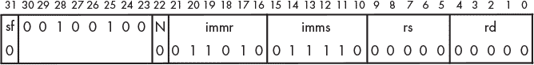
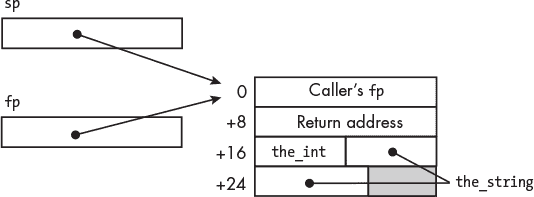
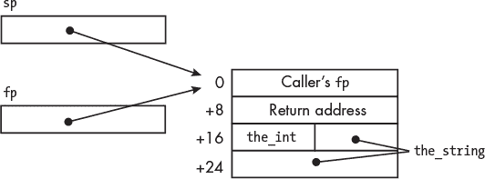
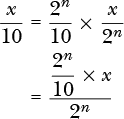

## 第十六章：位运算、乘法和除法指令**


现在你已经了解了程序的组织结构，让我们把注意力转向计算。我将从解释逻辑运算符开始，这些运算符可以通过一种叫做*掩码*的技术来改变值中的单个位。

然后，我将继续讲解移位操作，这提供了一种通过 2 的幂进行乘法或除法的方法。在本章的最后两个小节中，我将介绍整数的算术乘法和除法。

### **位掩码**

通常，将数据项看作是位模式而不是数值实体会更为合适。例如，如果你回顾一下第 2-5 表中在第二章的内容，你会看到，ASCII 中大写字母和小写字母之间的唯一区别是第 5 位比特，大写字母为`0`，小写字母为`1`。例如，字符`m`的 ASCII 码是`0x6d`，而`M`是`0x4d`。如果你想编写一个函数，将一个字母字符串从小写转为大写，你可以将其视为数值差异 32。你需要确定字符的当前大小写，并决定是否通过减去 32 来改变它。

但还有一种更快的方法。我们可以通过使用逻辑按位运算和掩码（位掩码）来改变位模式。*掩码*是一种特定的位模式，可以用来将变量中的指定位设置为`1`或`0`，或者反转它们。例如，为了确保一个字母字符是大写，我们需要确保其第 5 位为`0`，掩码为`11011111` = `0xdf`。然后，使用前面提到的`m`，`0x6d`*∧* `0xdf` = `0x4d`，即`M`。如果字符已经是大写，那么`0x4d`*∧* `0xdf` = `0x4d`，保持大写。这个解决方案避免了在转换前检查字符的大小写。

我们可以对其他操作使用类似的逻辑。为了将某一位设为`1`，需要在掩码中将适当的位位置设置为`1`，然后使用按位或操作。为了将某一位设置为`0`，则需要在该位置放置`0`，并在掩码中的其他位位置放置`1`，然后使用按位与操作。你可以通过将`1`放置在你想反转的每个位上，并在所有其他位置放置`0`，然后使用按位异或操作来反转位。

#### ***C 语言中的位掩码***

列表 16-1 到 16-3 中的程序展示了如何使用掩码将文本字符串中的所有小写字母字符转换为大写。

*uppercase.c*

```
// Make an alphabetic text string uppercase.

   #include <stdio.h>
   #include "to_upper.h"
   #include "write_str.h"
   #include "write_char.h"
   #include "read_str.h"
➊ #define MAX 50
➋ #define ARRAY_SZ MAX+1

   int main(void)
   {
       char my_string[ARRAY_SZ];

       write_str("Enter up to 50 alphabetic characters: ");
    ➌ read_str(my_string, MAX);

       to_upper(my_string, my_string);
       write_str("All upper: ");
       write_str(my_string);
       write_char('\n');

       return 0;
   }
```

*列表 16-1：将字母文本字符串转换为大写的程序*

**注意**

*本程序，以及书中随后的许多程序，使用了* read_str、write_char *和* write_str *函数，这些函数是你在“轮到你”练习 14.4 中编写的，位于第 293 页。如果你愿意，也可以改用 C 标准库中的* gets、putchar *和* puts *函数，但你需要在调用它们的书中函数中做出适当的更改，因为它们的行为略有不同。*

在清单 16-1 中，我们使用`#define`为允许的最大字符数赋予一个符号名称❶。`char`数组需要多一个元素，以便存放终止的`NUL`字符❷。这两个`#define`的实例使得我们可以在一个地方轻松修改长度，确保`char`数组的长度正确，并将正确的值传递给`read_str`函数。

你在第十四章中学到，当使用一个参数的名称来将变量传递给函数时，它是按值传递的；一个变量值的副本被传递给被调用的函数。如果我们想传递变量的地址，需要使用`&`（地址操作符）。C 语言对数组名称的处理不同。当参数的名称是数组时，C 使用指针传递；数组起始地址会被传递给函数，而不是数组中所有值的副本。因此，我们在将数组作为参数传递给函数时*不*使用`&`操作符❸。你将在第十七章中学到更多关于数组实现的知识。

这个`main`函数没有其他新内容，我们接着看`to_upper`子函数。清单 16-2 展示了这个函数的头文件。

*to_upper.h*

```
// Convert alphabetic letters in a C string to uppercase.

#ifndef TO_UPPER_H
#define TO_UPPER_H
int to_upper(char *dest_ptr, char *src_ptr);
#endif
```

*清单 16-2：to_upper 函数的头文件*

第一个参数`src_ptr`是要转换的文本字符串的地址，第二个参数`dest_ptr`是存放转换结果的地址。在清单 16-1 中，我们将相同的数组作为源数组和目标数组传递，因此`to_upper`将用新值替换数组中存储的字符。

清单 16-3 给出了`to_upper`的定义。

*to_upper.c*

```
   // Convert alphabetic letters in a C string to uppercase.

   #include "to_upper.h"
➊ #define UPMASK 0xdf
   #define NUL '\0'

   int to_upper(char *dest_ptr, char *src_ptr)
   {
       int count = 0;
       while (*src_ptr != NUL) {
        ➋ *dest_ptr = *src_ptr & UPMASK;
           src_ptr++;
           dest_ptr++;
           count++;
       }
    ➌ *dest_ptr = *src_ptr;   // Include NUL

       return count;
}
```

*清单 16-3：一个将小写字母字符转换为大写的函数*

为了确保第 5 位为`0`，我们使用一个在第 5 位为`0`，其他位为`1`的掩码❶。当当前字符不是`NUL`字符时，我们执行按位与操作，将源数组中的字符与掩码进行按位与运算，这样就会将第 5 位屏蔽，其他位在结果中保持不变❷。这个 AND 操作的结果存储在目标数组中。不要忘记包括输入文本字符串中的`NUL`字符❸！如果忘记这样做，这将是一个编程错误，并且在测试中不会显示出来，前提是输出存储位置后面的内存字节恰好是`0x00`（`NUL`字符）。如果你改变了输入文本字符串的长度，内存中的下一个字节可能就不是`0x00`了。这个错误因此可能会以一种看似随机的方式出现。

尽管这个函数返回处理的字符数，但我们的`main`函数并没有使用返回值。调用函数不需要使用返回值，但我通常会在类似的函数中包含一个计数算法，用于调试目的。

Listing 16-4 显示了编译器为`to_upper`函数生成的汇编语言代码。

*to_upper.s*

```
        .arch armv8-a
        .file   "to_upper.c"
        .text
        .align  2
        .global to_upper
        .type   to_upper, %function
to_upper:
        sub     sp, sp, #32
        str     x0, [sp, 8]       /// Save destination address
        str     x1, [sp]          /// Save source address
        str     wzr, [sp, 28]     /// count = 0;
        b       .L2
.L3:
        ldr     x0, [sp, 8]
        ldrb    w0, [x0]
     ➊ and     w0, w0, -33       /// -33 = 0xffffffdf
        and     w1, w0, 255       /// 255 = 0x000000ff
        ldr     x0, [sp]
        strb    w1, [x0]
        ldr     x0, [sp, 8]
        add     x0, x0, 1
        str     x0, [sp, 8]
        ldr     x0, [sp]
        add     x0, x0, 1
        str     x0, [sp]
        ldr     w0, [sp, 28]
        add     w0, w0, 1
        str     w0, [sp, 28]
.L2:
        ldr     x0, [sp, 8]
        ldrb    w0, [x0]
        cmp     w0, 0
        bne     .L3
     ➋ ldr     x0, [sp, 8]       /// Copy NUL char
        ldrb    w1, [x0]
        ldr     x0, [sp]
        strb    w1, [x0]
        ldr     w0, [sp, 28]
        add     sp, sp, 32
        ret
        .size   to_upper, .-to_upper
        .ident  "GCC: (Debian 12.2.0-14) 12.2.0"
        .section        .note.GNU-stack,"",@progbits
```

*Listing 16-4：编译器生成的 Listing 16-3 函数的汇编语言*

你可能会注意到，我们的编译器将`while`循环结构化，以至于在循环终止后不需要复制`NUL`字符❷。但我们仍然需要编写正确的 C 代码，因为另一个编译器可能会对`while`循环使用不同的结构。

在从源`char`数组加载当前字符后，第一个`and`指令使用`-33` = `0xffffffdf`掩码对`w0`中的字进行掩码操作，这样第 5 位就变为`0`，从而确保字符为大写❶。第二个`and`指令使用`0x000000ff`掩码，确保我们得到一个 8 位的`char`值并存储在`w0`中。

将字符视为位模式而不是数值，可以让我们在不使用`if`语句先测试字符的大小写的情况下，将小写字符转换为大写，同时不改变大写字符。

你可能会想知道为什么编译器使用了两个`and`指令，而不是仅仅使用`0xdf`作为掩码并用一个`and`指令来完成。为了回答这个问题，让我们更详细地看一下基本的逻辑指令。

#### ***基本逻辑指令***

*逻辑指令*按位操作——即它们在两个操作数的对应位位置上逐位操作。这三种基本的逻辑指令分别用于 AND、OR 或 XOR 操作。A64 指令集为每种操作提供了两种版本。移位寄存器版本允许在应用操作之前对源操作数之一进行移位。立即数版本仅允许某些特定位模式，稍后我会在描述指令后解释：

##### and**—AND 移位寄存器**

`and w`d `, w`s1 `, w`s2 `{,` shft amnt `}` 执行位与操作，将 `w`s1 和 `w`s2 中的值进行位与操作，并将结果存储在 `w`d 中。使用 shft amnt 选项，可以在 AND 操作前将 `w`s2 中的值左移 0 到 31 位。

`and x`d `, x`s1 `, x`s2 `{,` shft amnt `}` 执行位与操作，将 `x`s1 和 `x`s2 中的值进行位与操作，并将结果存储在 `x`d 中。使用 shft amnt 选项，可以在 AND 操作前将 `x`s2 中的值左移 0 到 63 位。

##### and**—与立即数**

`and w`d `, w`s `,` imm 执行位与操作，将 imm 的 32 位模式和 `w`s 中的值进行位与操作，并将结果存储在 `w`d 中。

`and x`d `, x`s `,` imm 执行位与操作，将 imm 的 64 位模式和 `x`s 中的值进行位与操作，并将结果存储在 `x`d 中。

##### orr**—包含或移位寄存器**

`orr w`d `, w`s1 `, w`s2 `{,` shft amnt `}` 执行位或操作，将 `w`s1 和 `w`s2 中的值进行位或操作，并将结果存储在 `w`d 中。使用 shft amnt 选项，可以在 OR 操作前将 `w`s2 中的值左移 0 到 31 位。

`orr x`d `, x`s1 `, x`s2 `{,` shft amnt `}` 执行位或操作，将 `x`s1 和 `x`s2 中的值进行位或操作，并将结果存储在 `x`d 中。使用 shft amnt 选项，可以在 OR 操作前将 `x`s2 中的值左移 0 到 63 位。

##### orr**—包含或立即数**

`orr w`d `, w`s `,` imm 执行位或操作，将 imm 的 32 位模式和 `w`s 中的值进行位或操作，并将结果存储在 `w`d 中。

`orr x`d `, x`s `,` imm 执行位或操作，将 imm 的 64 位模式和 `x`s 中的值进行位或操作，并将结果存储在 `x`d 中。

##### eor**—排他或移位寄存器**

`eor w`d `, w`s1 `, w`s2 `{,` shft amnt `}` 执行位异或操作，将 `w`s1 和 `w`s2 中的值进行位异或操作，并将结果存储在 `w`d 中。使用 shft amnt 选项，可以在 XOR 操作前将 `w`s2 中的值左移 0 到 31 位。

`eor x`d `, x`s1 `, x`s2 `{,` shft amnt `}` 执行位异或操作，将 `x`s1 和 `x`s2 中的值进行位异或操作，并将结果存储在 `x`d 中。使用 shft amnt 选项，可以在 XOR 操作前将 `x`s2 中的值左移 0 到 63 位。

##### eor**—排他或立即数**

`eor w`d `, w`s `,` imm 执行位异或操作，将 imm 的 32 位模式和 `w`s 中的值进行位异或操作，并将结果存储在 `w`d 中。

`eor x`d `, x`s `,` imm 执行位异或操作，将 imm 的 64 位模式和 `x`s 中的值进行位异或操作，并将结果存储在 `x`d 中。

表 16-1 列出了 shft 选项的允许值。

**表 16-1：** 移位寄存器逻辑指令中允许的 shft 值

| shft | **效果** |
| --- | --- |
| `lsl` | 逻辑左移 |
| `lsr` | 逻辑右移 |
| `asr` | 算术右移 |
| `ror` | 右旋转 |

逻辑移位将空出的位填充为 `0`。算术移位将空出的位填充为被移位值的高位副本。右旋转将所有位向右移，将低位移到高位位置。这些逻辑指令的 32 位版本不会改变目标寄存器中的 32 位高位，因此对 `w` 寄存器的移位或旋转仅应用于相应 `x` 寄存器的低 32 位。

你在第十二章中学到，这些逻辑指令中的 imm 值不能是 32 位或 64 位。为了查看这三条指令如何编码 imm 值，让我们看看第 16-4 节中第一个 `and` 指令的机器代码，如图 16-1 所示。



*图 16-1：* 和 w0, w0, -33 *指令的机器代码，在第 16-4 节中*

`N` 字段中的 `0` 表示 32 位操作。`1` 表示 64 位操作。

`imms` 字段指定两个数字：重复模式中的位数和模式中连续 `1` 的数量。我将使用表 16-2 来解释这个过程。

**表 16-2：** 立即数逻辑指令中 `imms` 值的编码

| N | imms | **模式大小（位）** | **1 的数量** |
| --- | --- | --- | --- |
| `0` | `11110x` | 2 | 1 |
| `0` | `1110xx` | 4 | 1–3 |
| `0` | `110xxx` | 8 | 1–7 |
| `0` | `10xxxx` | 16 | 1–15 |
| `0` | `0xxxxx` | 32 | 1–31 |
| `1` | `xxxxxx` | 64 | 1–63 |

对于 `N` 列中为 `0` 的行，`imms` 列中第一个 `0` 的位置（从左侧读取）指定模式中的位数。`N` 列中的 `1` 指定 64 位模式。

每一行中，`x` 位置上的二进制数字加 1 指定从右侧开始的连续 `1` 的数量。例如，如果 `N` 是 `0` 且 `imms` 是 `110010`，则指定一个具有三个连续 `1` 的 8 位模式。这将产生 32 位的掩码 `0x07070707`。

在图 16-1 中显示的 `and` 指令的 `immr` 字段中的 6 位数字指定在逻辑操作之前要应用于掩码的右移位数。

此指令中指定的掩码从一个包含 31 个连续 `1` 的 32 位模式 `0x7fffffff` 开始，该模式仅出现一次。然后，这个模式被右旋转 26 位，得到用于 AND 操作的掩码 `0xffffffdf`。

接下来，我将向你展示如何直接在汇编语言中编写这个程序。

#### ***汇编语言中的位掩码***

我们将在汇编语言版本中使用相同的掩码算法，但我们将使用更易于理解的标识符。汇编语言版本的 `main` 函数如第 16-5 节所示。

*uppercase.s*

```
// Make an alphabetic text string uppercase.
        .arch armv8-a
// Useful constant
        .equ    MAX,50                    // Character limit
// Stack frame
        .equ    the_string, 16
      ➊ .equ    FRAME, 80                 // Allows >51 bytes
// Code
        .text
        .section  .rodata
        .align  3
prompt:
        .string "Enter up to 50 alphabetic characters: "
result:
        .string "All upper: "
        .text
        .align  2
        .global main
        .type   main, %function
main:
        stp     fp, lr, [sp, -FRAME]! // Create stack frame
        mov     fp, sp                // Set our frame pointer
        adr     x0, prompt            // Prompt message
        bl      write_str             // Ask for input

        add     x0, sp, the_string    // Place to store string
        mov     w1, MAX               // Limit number of input chars
        bl      read_str              // Get from keyboard

        add     x1, sp, the_string    // Address of string
     ➋ mov     x0, x1                // Replace the string
        bl      to_upper              // Do conversion

        adr     x0, result            // Show result
        bl      write_str
        add     x0, sp, the_string    // Converted string
        bl      write_str
        mov     w0, '\n'              // Nice formatting
        bl      write_char

        mov     w0, 0                 // Return 0
        ldp     x29, x30, [sp], FRAME // Delete stack frame
        ret
```

*清单 16-5：将文本字符串转换为大写的程序*

我们在堆栈上为字符数组分配了 50 字节。再加上 16 字节用于保存`sp`和`fp`，这使得帧的大小至少为 66 字节。为了保持堆栈指针在 16 字节边界上正确对齐，我们为堆栈帧分配了 80 字节❶。

我们将`char`数组的地址传递给`to_upper`函数，作为源和目标，这样它就会用新的值替换数组中的原始值❷。

我将使用与编译器相同的掩码算法来编写`to_upper`的汇编代码，但我将以不同的方式构建该函数。清单 16-6 展示了代码。

*to_upper.s*

```
// Convert alphabetic letters in a C string to uppercase.
// Calling sequence:
//    x0 <- pointer to result
//    x1 <- pointer to string to convert
//    Return number of characters converted.
        .arch armv8-a
// Useful constant
     ➊ .equ    UPMASK, 0xdf
// Program code
        .text
        .align  2
        .global to_upper
        .type   to_upper, %function
to_upper:
        mov     w2, wzr               // counter = 0
loop:
     ➋ ldrb    w3, [x1]              // Load character
        cbz     w3, allDone           // All done if NUL char
     ➌ movz    w4, UPMASK            // If not, do masking
        and     w3, w3, w4            // Mask to upper
        strb    w3, [x0]              // Store result
        add     x0, x0, 1             // Increment destination pointer,
        add     x1, x1, 1             //   source pointer,
        add     w2, w2, 1             //   and counter,
        b       loop                  //   and continue
done:
        strb    w3, [x0]              // Terminating NUL got us here
        mov     w0, w2                // Return count
        ret                           // Back to caller
```

*清单 16-6：将文本转换为大写的程序*

我们使用寄存器`w2`、`w3`和`w4`来存储局部变量，而不是将它们放在堆栈帧中。标准规定我们不需要为调用函数保存这些寄存器的内容。

`ldrb`指令将字符加载到`w`寄存器中❷。我们需要使用 32 位的掩码，以匹配寄存器的宽度。该算法的正确掩码是`0x000000df`❶。编译器使用两个掩码来实现正确的结果：

```
and     w3, w3, -33
and     w3, w3, 255
```

`ldrb`指令将寄存器中的 24 个高位清零，因此我们只需使用第一条指令。但这可能会让维护此代码的人感到困惑，因为该算法处理的是位模式，而不是整数。将指令写成这样

```
and     w3, w3, 0xffffffdf
```

可能会更加混淆。

我们使用`movz`指令将正确的掩码加载到寄存器中，这清晰地表明了我们的意图❸。然后，我们使用`and`指令的寄存器形式来掩码出字符中的小写位。在下一节中，我将向你展示如何通过移位操作将值乘以或除以二的幂。

**你的回合**

16.1     编写一个汇编语言程序，将所有字母字符转换为小写。

16.2     编写一个汇编语言程序，将所有字母字符的大小写转换为相反的大小写。

16.3     编写一个汇编语言程序，将所有字母字符转换为大写和小写。你的程序还应该在显示了大写和小写转换后，展示用户的原始输入字符串。

### **移位操作**

有时候，能够将变量中的所有位向左或向右移位是很有用的。如果变量是整数，将所有位左移一个位置实际上是将整数乘以二，而将它们右移一个位置则实际上是将其除以二。通过使用左右移位来进行乘法/除法运算，是非常高效的，尤其是对二的幂的乘除运算。

#### ***在 C 语言中***

我将通过展示一个程序来讲解移位操作，该程序从键盘读取以十六进制输入的整数并将其存储为`long int`。该程序最多读取八个十六进制字符，`0`、`1`、...、`f`，每个字符为 8 位 ASCII 码，表示一个 4 位整数：0、1、...、15。

清单 16-7 显示了该程序的`main`函数。

*convert_hex.c*

```
// Get a hex number from the user and store it as an int.

#include <stdio.h>
#include "write_str.h"
#include "read_str.h"
#include "hex_to_int.h"

#define MAX 8
#define ARRAY_SZ MAX+1

int main()
{
    char the_string[ARRAY_SZ];
    int the_int;

    write_str("Enter up to 8 hex characters: ");
    read_str(the_string, MAX);

    hex_to_int(&the_int, the_string);
    printf("0x%x = %i\n", the_int, the_int);
    return 0;
}
```

*清单 16-7：一个将十六进制输入转换为* int *的程序*

在“轮到你了”练习 14.4 中，你设计了`read_str`函数来限制它在传递给它的`char`数组中存储的字符数。如果用户输入超过八个字符，`read_str`将用`NUL`字符终止字符串，并丢弃多余的字符。

清单 16-8 显示了`hex_to_int`函数的头文件。

*hex_to_int.h*

```
// Convert a hex character string to an int.
// Return number of characters.

#ifndef HEX_TO_INT_H
#define HEX_TO_INT_H
int hex_to_int(int *int_ptr, char *string_ptr);
#endif
```

*清单 16-8：* hex_to_int *函数的头文件*

头文件声明了`hex_to_int`函数，该函数接受两个指针。`char`指针作为输入，`long int`指针作为主输出的位置。`hex_to_int`函数还返回一个`int`值，表示它转换的字符数量。

清单 16-9 显示了`hex_to_int`函数的定义。

*hex_to_int.c*

```
// Convert a hex character string to an int.
// Return number of characters.

#include "hex_to_int.h"
#define GAP 0x07
#define INTPART 0x0f  // Also works for lowercase
#define NUL '\0'

int hex_to_int(int *int_ptr, char *string_ptr)
{
    char current;
    int result;
    int count;

    count = 0;
 ➊ result = 0;
    current = *string_ptr;
    while (current != NUL) {
     ➋ if (current > '9') {
            current -= GAP;
        }
     ➌ current = current & INTPART;
     ➍ result = result << 4;
     ➎ result |= current;
        string_ptr++;
        count++;
        current = *string_ptr;
    }

    *int_ptr = result;
    return count;
}
```

*清单 16-9：C 语言中的* hex_to_int *函数*

我们的程序首先将 32 位输出设置为`0`❶。然后，从最重要的十六进制字符（用户输入的第一个字符）开始，程序将每个 8 位的 ASCII 码转换为对应的 4 位整数。

查看表格 2-4 和 2-5 以及第二章，我们可以看到数字字符的 ASCII 码范围是`0x30`到`0x39`，小写字母字符的范围是`0x61`到`0x66`。从字母字符中减去`0x27`的差值，得到的位模式是`0x30`、`0x31`、...、`0x39`、`0x3a`、...、`0x3f`，这些是输入字符的位模式❷。当然，用户也可以输入大写字母字符，其范围是`0x41`到`0x46`。减去`0x27`后，得到的位模式是`0x30`、`0x31`、...、`0x39`、`0x1a`、...、`0x1f`。每个十六进制字符代表 4 位，如果我们观察减去`0x27`后低 4 位的值，无论用户输入小写字母还是大写字母，其值是相同的。我们可以通过使用`&`（C 语言中的按位与运算符）和`0x0f`掩码将字符码转换为 4 位整数❸。

接下来，我们将累积值中的所有位左移 4 位，为下一个由十六进制字符表示的 4 个位腾出空间❹。左移操作会在四个最低有效位位置留下`0`，因此我们可以使用`|`（按位或运算符）将`current`中的 4 个位复制到这些位置❺。

`current`变量的类型是`char`，`result`的类型是`int`。在 C 语言中，对于算术和逻辑运算，较窄值的宽度会自动扩展，以匹配较宽值的宽度❺。

让我们看看编译器为`hex_to_int`函数生成的汇编语言，见清单 16-10。

*hex_to_int.s*

```
        .arch armv8-a
        .file   "hex_to_int.c"
        .text
        .align  2
        .global hex_to_int
        .type   hex_to_int, %function
hex_to_int:
        sub     sp, sp, #32
        str     x0, [sp, 8]
        str     x1, [sp]
        str     wzr, [sp, 20]
        str     wzr, [sp, 24]
        ldr     x0, [sp]
        ldrb    w0, [x0]
        strb    w0, [sp, 31]
        b       .L2
.L4:
        ldrb    w0, [sp, 31]
        cmp     w0, 57        /// > '9'?
        bls     .L3
        ldrb    w0, [sp, 31]  /// Yes
        sub     w0, w0, #7    /// Remove gap
        strb    w0, [sp, 31]
.L3:
     ➊ ldrb    w0, [sp, 31]
     ➋ and     w0, w0, 15    /// Leave only 4 bits
        strb    w0, [sp, 31]
        ldr     w0, [sp, 24]
     ➌ lsl     w0, w0, 4     /// Room for 4 bits
        str     w0, [sp, 24]
        ldrb    w0, [sp, 31]
        ldr     w1, [sp, 24]
        orr     w0, w1, w0    /// Copy new 4 bits
        str     w0, [sp, 24]
        ldr     x0, [sp]
        add     x0, x0, 1
        str     x0, [sp]
        ldr     w0, [sp, 20]
        add     w0, w0, 1
        str     w0, [sp, 20]
        ldr     x0, [sp]
        ldrb    w0, [x0]
        strb    w0, [sp, 31]
.L2:
        ldrb    w0, [sp, 31]
        cmp     w0, 0         /// NUL
        bne     .L4
        ldr     x0, [sp, 8]
        ldr     w1, [sp, 24]
        str     w1, [x0]
        ldr     w0, [sp, 20]
        add     sp, sp, 32
        ret
        .size   hex_to_int, .-hex_to_int
        .ident  "GCC: (Debian 12.2.0-14) 12.2.0"
        .section        .note.GNU-stack,"",@progbits
```

*列表 16-10：编译器生成的汇编语言，用于 列表 16-9 中的 C 函数*

编译器使用 `ldrb` 指令将字符加载到 `w` 寄存器中 ❶。这会将第 8 位到第 31 位设置为 `0`，有效地将 8 位的 `char` 类型转换为 32 位的 `int` 类型。即使在 列表 16-9 中没有显式的类型转换，编译器也会执行这样的转换，但显式的类型转换更清晰地表达了我们的意图，而且不会影响代码的效率。

该算法中的掩码是四个连续的 `1`，因此可以使用 `and` 指令的立即数形式 ❷。

我们在这里看到了一条新指令，`lsl` ❸。正如你可能猜到的，这条指令将 `x0` 中的值左移 4 位，并将结果加载到 `x1` 中。让我们来看一些常见的移位指令：

##### lsl**—逻辑左移立即数**

`lsl w`d `, w`s `,` amnt 将 `w`s 中的值按 amnt 位左移，腾出的位用 `0` 填充，并将结果加载到 `w`d 中。

`lsl x`d `, x`s `,` amnt 将 `x`s 中的值按 amnt 位左移，腾出的位用 `0` 填充，并将结果加载到 `x`d 中。

##### lsr**—逻辑右移立即数**

`lsr w`d `, w`s `,` amnt 将 `w`s 中的值按 amnt 位右移，腾出的位用 `0` 填充，并将结果加载到 `w`d 中。

`lsr x`d `, x`s `,` amnt 将 `x`s 中的值按 amnt 位右移，腾出的位用 `0` 填充，并将结果加载到 `x`d 中。

##### asr**—算术右移立即数**

`asr w`d `, w`s `,` amnt 将 `w`s 中的值按 amnt 位右移，将最高位复制到腾出的位，并将结果加载到 `w`d 中。

`asr x`d `, x`s `,` amnt 将 `x`s 中的值按 amnt 位右移，将最高位复制到腾出的位，并将结果加载到 `x`d 中。

##### ror**—立即数右旋**

`ror w`d `, w`s `,` amnt 将 `w`s 中的值按 amnt 位右移，将低位的值复制到腾出的高位，并将结果加载到 `w`d 中。

`ror x`d `, x`s `,` amnt 将 `x`s 中的值按 amnt 位右移，将低位的值复制到腾出的高位，并将结果加载到 `x`d 中。

接下来，我将采用与之前的大小写转换 C 程序相似的方法编写十六进制到整数的汇编语言转换程序。

#### ***在汇编语言中***

我将从 `main` 函数的堆栈框架图开始设计我们的 `convert_hex` 程序，如 图 16-2 所示。



*图 16-2：* convert_hex *程序的堆栈框架*

通过这个图示，`main` 函数的汇编语言设计变得非常直观，如 列表 16-11 所示。

*convert_hex.s*

```
// Get a hex number from the user and store it as an int.
        .arch armv8-a
// Useful constant
        .equ    MAX, 8
// Stack frame
        .equ    the_int, 16
        .equ    the_string, 20
     ➊ .equ    FRAME, 32
// Code
        .text
        .section  .rodata
        .align  3
prompt:
        .string "Enter up to 8 hex characters: "
format:
        .string "0x%x = %i\n"
        .text
        .align  2
        .global main
        .type   main, %function
main:
        stp     fp, lr, [sp, -FRAME]! // Create stack frame
        mov     fp, sp                // Our frame pointer

        adr     x0, prompt            // Prompt message
        bl      write_str             // Ask for input

        add     x0, sp, the_string    // Place to store string
        mov     w1, MAX               // Limit number of input chars
        bl      read_str              // Get from keyboard

        add     x1, sp, the_string    // Address of string
        add     x0, sp, the_int       // Place to store int
        bl      hex_to_int            // Do conversion

        ldr     w2, [sp, the_int]     // Load int
        ldr     w1, [sp, the_int]     // printf shows this copy in hex
        adr     x0, format            // Format string
        bl      printf

        mov     w0, 0                 // Return 0
        ldp     x29, x30, [sp], FRAME // Delete stack frame
        ret
```

*列表 16-11：用于将十六进制值转换为* int *的* main *函数汇编语言*

`main` 函数中没有什么新内容。除了保存 `fp` 和 `lr` 寄存器的 16 字节，以及用于 `int` 的 4 字节外，我们还需要在堆栈帧中为十六进制文本字符串分配 9 字节，堆栈帧的大小至少为 29 字节。由于帧大小必须是 16 的倍数以保持栈指针正确对齐，因此我们使用 32 字节 ❶。

我们将为汇编语言版本的 `hex_to_int` 使用寄存器来存储变量。我们的堆栈帧将非常简单，因此我们不需要图表来设计它。图 16-12 显示了我们的函数。

*hex_to_int.s*

```
// Convert a hex character string to an int.
// Calling sequence:
//    x0 <- pointer to int result
//    x1 <- pointer to hex character string to convert
//    Return number of characters converted.
        .arch armv8-a
// Useful constants
        .equ    INTPART, 0x0f         // Also works for lowercase
        .equ    GAP, 0x07             // Between numerals and alpha
// Program code
        .text
        .align  2
        .global hex_to_int
        .type   hex_to_int, %function
hex_to_int:
        mov     w2, wzr               // result = 0
        mov     w3, wzr               // counter = 0
convert:
        ldrb    w4, [x1]              // Load character
        cbz     w4, done              // NUL character?
        cmp     w4, '9                // Numeral?
        b.ls    no_gap                // Yes
        sub     w4, w4, GAP           // No, remove gap
no_gap:
        and     w4, w4, INTPART       // 4-bit integer
        lsl     w2, w2, 4             // Make room for it
        orr     w2, w2, w4            // Insert new 4-bit integer
        add     x1, x1, 1             // Increment source pointer
        add     w3, w3, 1             //   and counter
        b       convert               //   and continue
done:
        str     w2, [x0]              // Output result
        mov     w0, w3                // Return count
        ret                           // Back to caller
```

*清单 16-12：* hex_to_int *函数的汇编语言版本*

移位操作适用于乘以和除以 2 的幂，但我们也需要能够乘以和除以其他数字。在接下来的两节中，我们将讨论乘以和除以任意整数，并将浮动和小数值的考虑推迟到第十九章。

**你的回合**

16.4     修改清单 16-7 中的 C `main` 函数，使其显示转换的十六进制字符的数量。使用清单 16-12 中的汇编语言 `hex_to_int` 函数进行转换。

16.5     编写一个汇编语言程序，将八进制输入转换为 `long int`。

### **乘法**

在本节中，我将讨论乘以不是 2 的幂的整数。这可以通过循环实现，但大多数通用 CPU 都包含乘法指令。

#### ***在 C 语言中***

让我们修改清单 16-7 至 16-9 中的 C 程序，将十进制数字文本字符串转换为无符号整数。当从十六进制文本字符串转换时，我们将累积值左移了 4 位，从而将其乘以 16。我们将使用相同的算法来转换十进制文本字符串，但这次我们将乘以 10 而不是 16。

清单 16-13 至 16-15 显示了 C 程序。

*convert_dec.c*

```
   // Get a decimal number from the user and store it as an int.

   #include <stdio.h>
   #include "write_str.h"
   #include "read_str.h"
   #include "dec_to_int.h"
➊ #define MAX 11
   #define ARRAY_SZ MAX+1

   int main(void)
   {
       char the_string[ARRAY_SZ];
       int the_int;

       write_str("Enter an integer: ");
       read_str(the_string, MAX);

       dec_to_int(&the_int, the_string);
       printf("\"%s\" is stored as 0x%x\n", the_string, the_int);

       return 0;
   }
```

*清单 16-13：将十进制输入转换为* int *的程序*

这个 `main` 函数与将十六进制输入转换为 `int` 的函数非常相似，但 `int` 中的最大字符数为 10。我们需要将 `MAX` 设置为 11 个字符，以便允许整数前面有可能的正负号 ❶。

清单 16-14 显示了 `dec_to_int` 函数的头文件。

*hex_to_int.h*

```
// Convert a decimal character string to an int.
// Return number of decimal characters.

#ifndef DEC_TO_INT_H
#define DEC_TO_INT_H
int dec_to_int(int *int_ptr, char *string_ptr);
#endif
```

*清单 16-14：* dec_to_int *函数的头文件*

头文件声明了 `dec_to_int` 函数，该函数接受两个指针：`char` 指针作为输入，`int` 指针作为主要输出的位置。`dec_to_int` 函数还返回一个 `int`，表示它转换的字符数。

清单 16-15 显示了 `dec_to_int` 函数的定义。

*dec_to_int.c*

```
   // Convert a decimal character string to an unsigned int.
   // Return number of characters.

   #include <stdio.h>
   #include <stdbool.h>
   #include "dec_to_int.h"
   #define INTMASK 0x0f
   #define RADIX 10
   #define NUL '\0'
➊ int dec_to_int(int *int_ptr, char *string_ptr)
   {
       bool negative = false;       // Assume positive
       int result = 0;
       int count = 0;

    ➋ if (*string_ptr == '-') {
           negative = true;
           string_ptr++;
    ➌ } else if (*string_ptr == '+') {
           string_ptr++;
       }

       while (*string_ptr != NUL) {
        ➍ result = RADIX * result;
        ➎ result += (int)(*string_ptr & INTMASK);
           string_ptr++;
           count++;
       }

       if (negative) {
           result = -result;
       }
       *int_ptr = result;
       return count;
   }
```

*清单 16-15：C 语言中的* dec_to_int *函数*

我们需要做的第一件事是检查数字前面是否有+号或–号。如果是–号，我们将`negative`标志设置为`true`❷。用户输入正数时通常不会加+号，但如果有+号，我们仍然需要将指针递增到字符串中的第一个数字字符❸。

`RADIX`常量不是 2 的幂，因此我们不能通过简单的左移来进行乘法运算❹。

`string_ptr`变量指向一个`char`❶。这个`char`被掩码并加到`result`中，`result`是一个`int`。大多数编译器会在将`char`值赋给`int`变量时提升其类型，但我更倾向于显式地将其强制转换为所需类型❺。

让我们看看编译器如何执行乘以 10 的操作。它在清单 16-16 中展示。

*dec_to_int.s*

```
        .arch armv8-a
        .file   "dec_to_int.c"
        .text
        .align  2
        .global dec_to_int
        .type   dec_to_int, %function
dec_to_int:
        sub     sp, sp, #32
        str     x0, [sp, 8]     /// Save int_ptr
        str     x1, [sp]        /// Save string_ptr
        strb    wzr, [sp, 31]   /// negative = false;
        str     wzr, [sp, 24]   /// result = 0;
        str     wzr, [sp, 20]   /// count = 0;
        ldr     x0, [sp]
        ldrb    w0, [x0]
        cmp     w0, 45
        bne     .L2
        mov     w0, 1
        strb    w0, [sp, 31]
        ldr     x0, [sp]
        add     x0, x0, 1
        str     x0, [sp]
        b       .L4
.L2:
        ldr     x0, [sp]
        ldrb    w0, [x0]
        cmp     w0, 43
        bne     .L4
        ldr     x0, [sp]
        add     x0, x0, 1
        str     x0, [sp]
        b       .L4
.L5:
        ldr     w1, [sp, 24]
        mov     w0, w1
     ➊ lsl     w0, w0, 2       /// 4 * result
        add     w0, w0, w1      /// (4 * result) + result
        lsl     w0, w0, 1       /// 2 * ((4 * result) + result)
        str     w0, [sp, 24]    /// result = 10 * result;
        ldr     x0, [sp]
        ldrb    w0, [x0]
        and     w0, w0, 15
        ldr     w1, [sp, 24]
        add     w0, w1, w0
        str     w0, [sp, 24]
        ldr     x0, [sp]
        add     x0, x0, 1
        str     x0, [sp]
        ldr     w0, [sp, 20]
        add     w0, w0, 1
        str     w0, [sp, 20]
.L4:
        ldr     x0, [sp]
        ldrb    w0, [x0]
        cmp     w0, 0
        bne     .L5
        ldrb    w0, [sp, 31]    /// Check negative flag
        cmp     w0, 0
        beq     .L6
        ldr     w0, [sp, 24]
     ➋ neg     w0, w0
        str     w0, [sp, 24]
.L6:
        ldr     x0, [sp, 8]
        ldr     w1, [sp, 24]
        str     w1, [x0]
        ldr     w0, [sp, 20]
        add     sp, sp, 32
        ret
        .size   dec_to_int, .-dec_to_int
        .ident  "GCC: (Debian 12.2.0-14) 12.2.0"
        .section        .note.GNU-stack,"",@progbits
```

*清单 16-16：由编译器生成的* dec_to_int *函数的汇编语言，在清单 16-15 中展示*

乘法指令通常需要更长时间来执行，因此编译器使用了移位和加法的组合来将`result`乘以 10❶。这一四条指令序列等同于以下的 C 语句：

```
result = 2 * ((4 * result) + result);
```

这条语句中的两次乘法是按 2 的幂进行的，因此它们通过简单的左移来完成。

注意，这个转换算法中的算术运算是无符号的。我们在数字字符串的开头检查了–号，如果有–号，在转换结果的末尾我们会对结果取反❷。

使用移位和加法进行乘法运算是有限制的。为了了解乘法指令的工作方式，我们将使用其中一种来改写我们的十进制转换程序的汇编语言版本。

#### ***在汇编语言中***

A64 架构有十多种不同的乘法指令。在本书中，我只会展示其中的一些；你可以在手册中阅读更多的指令。

图 16-3 显示了我们程序中将十进制文本字符串转换为`int`类型的`main`函数的汇编语言版本的堆栈帧设计。



*图 16-3：* convert_dec *程序的堆栈帧*

我们的`main`函数的汇编语言版本与 C 版本类似，展示在清单 16-17 中。

*convert_dec.s*

```
// Get a decimal number from the user and store it as an int.
        .arch armv8-a
// Useful constant
        .equ    MAX, 12               // Character storage limit
// Stack frame
        .equ    the_int, 16
        .equ    the_string, 20
        .equ    FRAME, 32
// Code
        .text
        .section  .rodata
        .align  3
prompt:
        .string "Enter an integer: "
        .align  3
format:
        .string "\"%s\" is stored as 0x%x\n"
        .text
        .align  2
        .global main
        .type   main, %function
main:
        stp     fp, lr, [sp, -FRAME]! // Create stack frame
        mov     fp, sp                // Our frame pointer
        adr     x0, prompt            // Prompt message
        bl      write_str             // Ask for input

        mov     w1, MAX               // Limit number of input chars
        add     x0, sp, the_string    // Place to store string
        bl      read_str              // Get from keyboard

        add     x1, sp, the_string    // Address of string
        add     x0, sp, the_int       // Place to store the int
        bl      dec_to_int            // Do conversion
        ldr     w2, [sp, the_int]     // Load the int
        add     x1, sp, the_string    // Input text string
        adr     x0, format            // Format message
        bl      printf                // Show results
        mov     w0, wzr               // Return 0
        ldp     x29, x30, [sp], FRAME // Delete stack frame
        ret
```

*清单 16-17：一个将十进制值转换为* int *类型的汇编语言程序*

清单 16-18 显示了我们`dec_to_int`的汇编语言版本。

*dec_to_int.s*

```
// Convert a decimal text string to an int.
// Calling sequence:
//    x0 <- place to store int
//    x1 <- pointer to string
//    Return number of characters.
        .arch armv8-a
// Useful constants
        .equ    RADIX,10
        .equ    INTMASK,0x0f
// Program code
        .text
        .align  2
        .global dec_to_int
        .type   dec_to_int, %function
dec_to_int:
        mov     w2, wzr               // count = 0
        mov     w3, wzr               // result = 0
        mov     w4, wzr               // negative = false
        mov     w5, RADIX             // Handy to have in reg

        ldrb    w6, [x1]              // Load first character
        cmp     w6, '-                // Minus sign?
        b.ne    check_pos             // No, check for plus sign
        mov     x4, 1                 // Yes, negative = true
        add     x1, x1, 1             // Increment string pointer
        b       convert               //   and convert numerals
check_pos:
        cmp     w6, '+                // Plus sign?
        b.ne    convert               // No, convert numerals
        add     x1, x1, 1             // Yes, skip over it

convert:
        ldrb    w6, [x1]              // Load character
        cbz     w6, check_sign        // NUL char?
        and     w6, w6, INTMASK       // No, mask to integer
     ➊ mul     w3, w3, w5            // result * RADIX
        add     w3, w3, w6            // Add new integer
        add     w2, w2, 1             // count++
        add     x1, x1, 1             // string_ptr++
        b       convert               //   and continue
check_sign:
        cbz     w4, positive          // Check negative flag
        neg     w3, w3                // Negate if flag is true
positive:
        str     w3, [x0]              // Output result
        mov     w0, w2                // Return count
        ret                           // Back to caller
```

*清单 16-18：汇编语言中的* dec_to_int *函数*

我们不再使用移位加法算法来乘以 10，而是使用`mul`指令❶。我们来看看这种指令的几种变体：

##### mul**—乘法寄存器**

`mul w`d `, w`s1 `, w`s2`将`w`s1 和`w`s2 中的值相乘，并将结果存储在`w`d 中。

`mul x`d `, x`s1 `, x`s2`将`x`s1 和`x`s2 中的值相乘，并将结果存储在`x`d 中。

当乘以两个*n*位整数时，结果的宽度可以达到 2*n*位。这里不提供正式证明，但你可能会被这样一个例子说服：考虑最大的 3 位数`111`，加上`1`得到`1000`。从`1000 * 1000 = 1000000`，我们可以得出结论`111 * 111 <= 111111`。更准确地，`111 * 111 = 110001`。

如果`mul`指令的结果超出了目标寄存器的位宽，那么高位会丢失。例如，如果`w2`包含`0xcccccccc`，而`w1`包含`0x00000002`，那么`mul w0, w1, w2`将在`x0`寄存器中得到`0x0000000099999998`。如果我们将这些值视为无符号整数，正确的结果应该是`0x0000000199999998`，如果将其视为有符号整数，则结果应该是`0xffffffff99999998`。但是当指令写入寄存器的`w`部分时，该寄存器的高 32 位会被设置为`0`。因此，当两个 32 位整数的乘积不在 0*≤乘积≤* 4,294,967,295（无符号整数）或–2,147,483,648*≤乘积≤* +2,147,483,647（有符号整数）范围内时，`mul`指令将产生错误结果。

为了处理这个尺寸问题，A64 架构包括了两条乘法指令，它们使用 64 位的目标寄存器来处理两个 32 位数相乘超过 32 位范围的情况：

##### umull**—无符号长整型乘法**

`umull x`d `, w`s1 `, w`s2`将`w`s1 和`w`s2`中的值相乘，并将结果加载到`x`d 中。如果结果的大小没有占满`x`d 的全部 64 位，那么未占满的高位将填充为`0`。

##### smull**—带符号长整型乘法**

`smull x`d `, w`s1 `, w`s2`将`w`s1 和`w`s2`中的值相乘，并将结果加载到`x`d 中。如果结果的大小没有占满`x`d 的全部 64 位，那么未占满的高位将用结果的最高位进行填充，从而实现符号扩展。

继续我们之前的例子，如果`w2`包含`0xcccccccc`，而`w1`包含`0x00000002`，那么`umull x0, w1, w2`将在`x0`中得到`0x0000000199999998`，而`smull x0, w1, w2`将在`x0`中得到`0xffffffff99999998`。

如果我们使用 64 位的`long int`类型，且无法证明乘法结果永远不会超过 64 位，那么 A64 架构包含了两条乘法指令，在乘两个 64 位数时，能够提供高 64 位的结果：

##### umulh**—无符号高位乘法**

`umulh x`d `, x`s1 `, x`s2`将`x`s1 和`x`s2`中的值相乘，并将结果的高 64 位加载到`x`d 中，且高位扩展为零。

##### smulh**—带符号高位乘法**

`smulh x`d `, x`s1 `, x`s2`将`x`s1 和`x`s2`中的值相乘，并将结果的高 64 位加载到`x`d 中，且高位扩展为符号位。

因此，乘两个 64 位整数需要两条指令。如果我们将`x0`和`x1`中的两个整数视为无符号整数，我们将使用以下两条指令：

```
mul     x3, x0, x1
umulh   x2, x0, x1
```

如果我们将`x0`和`x1`中的两个整数视为有符号数，我们将使用以下两条指令：

```
mul     x3, x0, x1
smulh   x2, x0, x1
```

在这两种情况下，结果是一个 128 位的整数，高位 64 位存储在寄存器`x2`中，低位 64 位存储在`x3`中。

乘法指令不会影响`nzcv`寄存器中的条件标志。我们需要仔细分析我们的算法，以适应所有可能的值，并使用适当的指令。

接下来，我将介绍除法，它是乘法的逆运算。

**你的回合**

16.6     编写一个`dec_to_uint`汇编语言函数，将一个无符号十进制数从文本字符串格式转换为`unsigned int`格式。

16.7     我断言 C 语句`result = 2 * ((4 * result) + result);`等价于清单 16-15 中的`result = RADIX * result;`语句。请在清单 16-15 中做出该更改，并将编译器生成的汇编语言与清单 16-16 中的进行比较。

### **除法**

在乘法中，当我们相乘两个*n*位的数字时，我们担心结果会是 2*n*位宽。而在除法中，商的宽度不会超过被除数，但除法的速度比乘法慢得多。在这一部分，你将学习一种可以加速除法的算法，特别是当除数是常量时。整数除法可能会有余数，这个余数也可能需要计算。

我将从一个 C 函数开始，该函数将一个`int`转换为它所表示的数字文本字符串，这是之前`dec_to_int`函数的逆操作。

#### ***在 C 语言中***

我们的`main`函数将从用户读取一个整数，减去 123 并显示结果。我们的子函数`int_to_dec`将使用除法算法将一个 32 位的`int`转换为表示它的文本字符串，这样`main`函数就可以显示结果。清单 16-19 至 16-21 展示了完整的程序。

*sub_123.c*

```
// Read an int from the user, subtract 123, and display the result.

#include "write_str.h"
#include "write_char.h"
#include "read_str.h"
#include "dec_to_int.h"
#include "int_to_dec.h"
#define MAX 11
#define ARRAY_SZ MAX+1

int main(void)
{
    char the_string[ARRAY_SZ];
    int the_int;

    write_str("Enter an integer: ");
    read_str(the_string, MAX);

    dec_to_int(&the_int, the_string);
    the_int -= 123;
    int_to_dec(the_string, the_int);

    write_str("The result is: ");
    write_str(the_string);
    write_char('\n');

    return 0;
}
```

*清单 16-19：一个从 int 中减去 123 的程序*

这个程序的`main`函数非常简单。我们使用清单 16-18 中的`dec_to_int`汇编语言版本将用户输入转换为`int`。然后，我们从`int`中减去 123，将结果转换为文本字符串表示，并显示结果。

清单 16-20 展示了`int_to_dec`函数的头文件。

*int_to_dec.h*

```
// Convert an int to its decimal text string representation.
// Return number of characters.

#ifndef INT_TO_DEC_H
#define INT_TO_DEC_H
int int_to_dec(char *dec_string, int the_int);
#endif
```

*清单 16-20：*int_to_dec*函数的头文件*

头文件声明了`int_to_dec`函数。`int`是输入，`char`指针是主要输出的存储位置。`int_to_dec`函数还返回一个`int`，表示输出字符串中的字符数。

清单 16-21 展示了`int_to_dec`函数的定义。

*int_to_dec.c*

```
// Convert an int to its decimal text string representation.
// Return number of characters.

#include "int_to_dec.h"
#define ARRAY_SZ 12
#define ASCII 0x30
#define RADIX 10
#define NUL '\0'

int int_to_dec(char *dec_string, int the_int)
{
    char reverse[ARRAY_SZ];
    char digit;
    char *_ptr;
    unsigned int working;
    int count = 0;

 ➊ if (the_int < 0) {
        the_int = -the_int;
        *dec_string = '-';
        count++;
        decString++;
    }
    ptr = reverse;                   // Point to local char array
 ➋ *ptr = NUL;                      // Start with termination char
 ➌ working = (unsigned int)the_int; // Use unsigned arithmetic
    do {
        ptr++;
     ➍ digit = (char)(working % RADIX);
        *ptr = ASCII | digit;
        working = working / RADIX;
    } while (working > 0);

    count = 0;
    if (negative) {
        *dec_string = '-';
        count++;
        dec_string++;
    }
 ➎ do {                            // Reverse string
        *dec_string = *ptr;
        count++;
        dec_string++;
        ptr--;
     ➏ } while (*ptr != NUL);
    *dec_string = *ptr;             // Copy termination char

    return count;
}
```

*清单 16-21：C 语言中的*int_to_dec*函数*

我们用于查找表示`int`十进制字符的算法涉及将`int`反复除以 10。`%`操作符计算除法的余数❹。对于正整数，余数将是一个 32 位的`int`，范围从 0 到 9，或者`0x00000000`到`0x00000009`，即最低位十进制数字的值。

然而，对于负整数，余数将是一个`int`，范围从 0 到-9，或者`0x00000000`到`0xfffffff7`。该范围内的负值需要使用不同的算法将它们转换为相应的 ASCII 数字字符。我们这里使用的解决方案是取负输入整数的相反数，结果文本前加上“-”符号，并转换为正结果❶。

该算法适用于所有 32 位负数，除了一个：-2,147,483,648。二进制补码格式中没有 32 位的+2,147,483,648；取-2,147,483,648 的相反数仍然是-2,147,483,648。我们的解决方案是将取负后的`int`转换为`unsigned int`❸。这不会改变值`0x80000000`的位模式，但它告诉编译器使用无符号的`%`和`/`操作。因此，对于 2,147,483,648，`working % RADIX`操作将给我们`0x00000008`。

我们将`unsigned int`从`%`操作转换为`char`，使用`(char)`，即*类型转换操作符*❹。括号是类型转换操作符的语法部分。然后，我们使用按位或操作符将`char`转换为其对应的 ASCII 码数字字符。

**注意**

*在使用类型转换操作符转换值的类型时要小心。我们正在将一个 32 位的值转换为 8 位值，这可能会导致信息丢失。在这种情况下，我们知道信息将以 4 位进行编码，因此转换是安全的。*

由于该算法是从右到左工作的，因此字符以反向顺序存储。因此，我们需要反转文本字符串的顺序，以供调用函数使用❺。首先存储`NUL`字符❷提供了一种方法，能够知道整个文本字符串是否已完全反向复制❻。

接下来，我们将查看编译器生成的汇编语言，如清单 16-22 所示。

*int_to_dec.s*

```
.arch armv8-a
        .file   "int_to_dec.c"
        .text
        .align  2
        .global int_to_dec
        .type   int_to_dec, %function
int_to_dec:
        sub     sp, sp, #48
        str     x0, [sp, 8]
        str     w1, [sp, 4]
        str     wzr, [sp, 32]
        ldr     w0, [sp, 4]
        cmp     w0, 0               /// Check for negative
        bge     .L2
        ldr     w0, [sp, 4]
        neg     w0, w0
        str     w0, [sp, 4]
        ldr     x0, [sp, 8]
        mov     w1, 45
        strb    w1, [x0]
        ldr     w0, [sp, 32]
        add     w0, w0, 1
        str     w0, [sp, 32]
        ldr     x0, [sp, 8]
        add     x0, x0, 1
        str     x0, [sp, 8]
.L2:
        add     x0, sp, 16
        str     x0, [sp, 40]        /// ptr
        ldr     x0, [sp, 40]
        strb    wzr, [x0]           /// *ptr = NUL;
        ldr     w0, [sp, 4]
        str     w0, [sp, 36]        /// working = the_int;
.L3:
        ldr     x0, [sp, 40]
        add     x0, x0, 1
        str     x0, [sp, 40]
        ldr     w2, [sp, 36]
     ➊ mov     w0, 52429           /// 0xcccd
        movk    w0, 0xcccc, lsl 16  /// 0xcccccccd
     ➋ umull   x0, w2, w0          /// Multiply by 0.1
        lsr     x0, x0, 32          /// Divide by 2³⁵
        lsr     w1, w0, 3
        mov     w0, w1
     ➌ lsl     w0, w0, 2
        add     w0, w0, w1
        lsl     w0, w0, 1
     ➍ sub     w1, w2, w0          /// working % RADIX
        mov     w0, w1
        strb    w0, [sp, 31]
        ldrb    w0, [sp, 31]
     ➎ orr     w0, w0, 48          /// Convert to ASCII
        and     w1, w0, 255
        ldr     x0, [sp, 40]
        strb    w1, [x0]            /// *ptr = ASCII | digit
        ldr     w1, [sp, 36]
     ➏ mov     w0, 52429
        movk    w0, 0xcccc, lsl 16
        umull   x0, w1, w0
        lsr     x0, x0, 32
        lsr     w0, w0, 3
        str     w0, [sp, 36]        /// working = working / RADIX;
        ldr     w0, [sp, 36]
        cmp     w0, 0
        bne     .L3
.L4:
        ldr     x0, [sp, 40]
        ldrb    w1, [x0]
        ldr     x0, [sp, 8]
        strb    w1, [x0]
        ldr     w0, [sp, 32]
        add     w0, w0, 1
        str     w0, [sp, 32]
        ldr     x0, [sp, 8]
        add     x0, x0, 1
        str     x0, [sp, 8]
        ldr     x0, [sp, 40]
        sub     x0, x0, #1
        str     x0, [sp, 40]
        ldr     x0, [sp, 40]
        ldrb    w0, [x0]
        cmp     w0, 0
        bne     .L4
        ldr     x0, [sp, 40]
        ldrb    w1, [x0]
        ldr     x0, [sp, 8]
        strb    w1, [x0]
        ldr     w0, [sp, 32]
        add     sp, sp, 48
        ret
        .size   int_to_dec, .-int_to_dec
        .ident  "GCC: (Debian 12.2.0-14) 12.2.0"
        .section        .note.GNU-stack,"",@progbits
```

*清单 16-22：编译器生成的用于* int_to_dec *函数的汇编语言，如清单 16-21 所示*

C 算法涉及除以 10，但编译器使用`umull`指令执行余数（`%`）操作❷。这是因为除法比乘法耗时要多。由于我们除的是常数，编译器使用以下算术运算：



编译器使用*n* = 35，得到常数 2³⁵/10 = 3,435,973,836.8。将其四舍五入到最接近的整数得到 3,435,973,837 = `0xcccccccd`❶。在将`working`整数乘以此常数后，算法将结果右移 35 位以除以 2³⁵。

编译器然后使用移位加法算法将这个商乘以 10 ❸。从原始被除数中减去结果后，我们得到余数❹，该余数转换为相应的 ASCII 字符❺。

编译器使用与处理`%`操作相同的乘法和移位算法来实现`/`操作❻。

使用乘法和移位进行除法是有限制的。为了查看除法指令如何工作，我们将在`int_to_dec`函数的汇编语言版本中使用除法指令。

#### ***在汇编语言中***

我们没有查看 C 版本的`sub_123`程序中`main`函数的编译器生成的汇编语言（Listing 16-19）。它与我们的汇编语言版本相似，后者显示在 Listing 16-23 中。

*sub_123.s*

```
   // Subtract 123 from an integer.
           .arch armv8-a
   // Useful constants
           .equ    CONSTANT, 123         // Number to subtract
           .equ    MAX, 11               // Maximum digits
➊ // Stack frame
           .equ    the_int, 16
           .equ    the_string, 20
           .equ    FRAME, 32
   // Code
           .text
           .section  .rodata
           .align  3
           prompt:
           .string "Enter an integer: "
   message:
           .string "The result is: "
           .text
           .align  2
           .global main
           .type   main, %function
   main:
           stp     fp, lr, [sp, -FRAME]! // Create stack frame
           mov     fp, sp                // Our frame pointer

           adr     x0, prompt            // Prompt message
           bl      write_str             // Ask for input
           add     x0, sp, the_string
           mov     w1, MAX
           bl      read_str

           add     x1, sp, the_string    // Input
           add     x0, sp, the_int       // Place for output
           bl      dec_to_int            // Convert to int

           ldr     w1, [sp, the_int]
           sub     w1, w1, CONSTANT      // Subtract our constant
           add     x0, sp, the_string    // Place for output
           bl      int_to_dec            // Convert to text string

           adr     x0, message           // Tell user that
           bl      write_str
           add     x0, sp, the_string    //   this is the result
           bl      write_str
           mov     w0, '\n'
           bl      write_char

           mov     w0, wzr               // Return 0
           ldp     fp, lr, [sp], FRAME   // Delete stack frame
           ret                           // Back to caller
```

*Listing 16-23：*sub_123*程序的* main *函数的汇编语言版本*

`main`函数中没有新的内容；我们可以使用 Figure 16-3 中的相同栈帧设计❶。

Listing 16-24 显示了我们`int_to_dec`函数的汇编语言版本。

*int_to_dec.s*

```
   // Convert an int to its decimal text string representation.
   // Calling sequence:
   //    x0 <- place to store string
   //    w1 <- the int
   //    Return number of characters in the string.
           .arch armv8-a
   // Useful constants
           .equ    RADIX, 10             // Number base
           .equ    INT2CHAR, 0x30        // ASCII zero
           .equ    MINUS, '-             // Minus sign
➊ // Stack frame
           .equ    reverse, 0
           .equ    FRAME, 16
   // Code
           .text
           .align  2
           .global int_to_dec
           .type   int_to_dec, %function
   int_to_dec:
           sub     sp, sp, FRAME         // Local string on stack

           cmp     w1, wzr               // => 0?
           tbz     w1, 31, non_negative  // Yes, go to conversion
           neg     w1, w1                // No, negate int
           mov     w2, MINUS
           strb    w2, [x0]              // Start with minus sign
           add     x0, x0, 1             // Increment pointer
   non_negative:
           add     x3, sp, reverse       // Pointer to local string storage
           strb    wzr, [x3]             // Create end with NUL
           mov     w2, RADIX             // Put in register
   do_while:
           add     x3, x3, 1             // Increment local pointer
        ➋ udiv    w4, w1, w2            // Quotient = dividend / RADIX
        ➌ msub    w5, w4, w2, w1        // Rem. = dividend - RADIX * quot.
           orr     w5, w5, INT2CHAR      // Convert to ASCII
           strb    w5, [x3]              // Store character
        ➍ mov     w1, w4                // Remove remainder
           cbnz    w1, do_while          // Continue if more left

           mov     w6, wzr               // count = 0
   copy:
           ldrb    w5, [x3]              // Load character
           strb    w5, [x0]              // Store it
           add     x0, x0, 1             // Increment to pointer
           sub     x3, x3, 1             // Decrement from pointer
           add     w6, w6, 1             // Increment counter
           cbnz    w5, copy              // Continue until NUL char
           strb    w5, [x0]              // Store NUL character

           mov     w0, w6                // Return count
           add     sp, sp, FRAME         // Delete stack frame
           ret                           // Back to caller
```

*Listing 16-24：*int_to_dec*函数的汇编语言版本*

由于这是一个叶子函数，我们不需要帧记录，但我们确实需要在栈上为存储生成的文本字符串留出空间，以便按逆序生成它❶。

我们没有像编译器那样使用乘法和移位算法，而是使用`udiv`指令将数字除以 10 ❷。这将商存储在`w4`寄存器中。然后，我们使用`msub`指令将商（`w4`寄存器）乘以基数（`w2`寄存器），并从被除数（`w1`寄存器）中减去该乘积，将余数保留在`w5`寄存器中❸。由于我们已经在`w4`寄存器中得到了商，我们可以使用它进行该循环的下一次迭代❹。

在 Listing 16-24 中，我们看到两个新的指令：`msub`和`udiv`。我还将在此描述`sdiv`：

##### msub**—乘法与减法**

`msub w`d `, w`s1 `, w`s2 `, w`s3 将`w`s1 乘以`w`s2，然后从乘积中减去`w`s3 的值，并将结果加载到`w`d 中。

`msub x`d `, x`s1 `, x`s2 `, x`s3 将`x`s1 乘以`x`s2，然后从乘积中减去`x`s3 的值，并将结果加载到`x`d 中。

##### udiv**—无符号除法**

`udiv w`d `, w`s1 `, w`s2 将`w`s1`除以`w`s2 并将结果存储在`w`d 中。它将所有值视为无符号数字。

`udiv x`d `, x`s1 `, x`s2 将`x`s1`除以`x`s2 并将结果存储在`x`d 中。它将所有值视为无符号数字。

##### sdiv**—有符号除法**

`sdiv w`d `, w`s1 `, w`s2 将`w`s1`除以`w`s2 并将结果存储在`w`d 中。如果`w`s1 和`w`s2 符号相同，则`w`d 中的值为正；如果它们符号相反，则`w`d 中的值为负。

`sdiv x`d `, x`s1 `, x`s2`将`x`s1 除以`x`s2，并将结果存储到`x`d 中。如果`x`s1 和`x`s2 符号相同，`x`d 中的值将为正；如果它们符号相反，`x`d 中的值将为负。

除法指令不会影响`nzcv`寄存器中的条件标志。如果除数为零，它们甚至不会报错；它们会将 0 加载到目标寄存器中。你需要仔细分析算法的所有可能值，以确保永远不会除以零。

**轮到你了**

16.8     编写两个汇编语言函数`put_int`和`get_int`。`put_int`函数接受一个参数，一个 32 位有符号整数，并将其显示在屏幕上。`get_int`函数返回一个 32 位有符号整数，读取自键盘输入。编写一个`main`函数进行 C 语言测试`put_int`和`get_int`。我们将在后续章节中使用`put_int`和`get_int`来显示和读取整数。

16.9     编写两个汇编语言函数`put_uint`和`get_uint`。`put_uint`函数接受一个参数，一个 32 位无符号整数，并将其显示在屏幕上。`get_uint`函数返回一个 32 位无符号整数，读取自键盘输入。使用练习 16.6 中的`dec_to_uint`函数，第 348 页，并编写`uint_to_dec`函数。编写一个`main`函数进行 C 语言测试`put_uint`和`get_uint`。我们将在后续章节中使用`put_uint`和`get_uint`来显示和读取整数。

16.10   编写一个汇编语言程序，允许用户输入两个有符号的十进制整数。程序将对这两个整数进行加、减、乘、除运算，并显示结果的和、差、积、商和余数。

### **你学到了什么**

**位掩码** 我们可以使用按位逻辑指令直接改变变量中的位模式。

**位移** 变量中的位可以向左或向右移动，实际上是通过 2 的倍数进行乘法或除法运算。

**乘法** 乘法指令允许我们执行有符号或无符号的乘法。乘以较大的 64 位值需要两条指令来处理 128 位的结果。

**更快的乘法** 当乘以常数时，使用加法和移位的组合可能比乘法指令更快。

**除法** 除法指令允许我们执行有符号或无符号的除法运算。

**更快的除法** 当除以常数时，乘法和移位的组合可能比除法指令更快。

**在二进制存储和字符显示之间转换数字** 当数字以二进制形式存储时，算术运算会更简单，但键盘输入和屏幕显示使用的是相应的字符格式。

我们现在已经介绍了如何组织程序流程以及如何对数据项执行算术或逻辑操作。在下一章中，我们将探讨两种最基本的数据组织方式：数组和记录。
