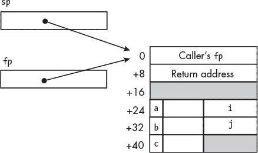
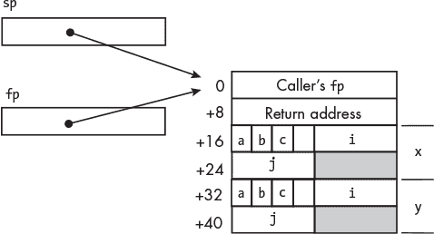
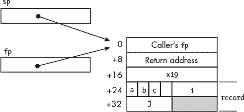

## 第十七章：数据结构**


编程的一个重要部分是确定如何最好地组织数据。在本章中，我们将介绍两种最基本的数据组织方式：数组，用于将相同数据类型的数据项分组；记录，用于将不同数据类型的数据项分组。

这些数据组织方式决定了我们如何访问单个数据项。两者都需要两个地址项来定位数据项。由于数组中的数据项都是相同类型，我们可以通过数组名和元素的索引值来访问单个数据项。访问记录中的单个数据项则需要记录名和数据项在记录中的名称。

### **数组**

*数组* 是一组相同数据类型的数据元素，按顺序排列。我们可以使用数组的名称和*索引值*来访问数组中的单个元素，索引值指定元素相对于数组开始位置的编号。我们在前几章中使用了`char`数组来存储 ASCII 字符作为文本字符串。数组中的每个元素都是相同类型的`char`，即 1 字节。在之前的应用中，我们按顺序访问每个字符，因此我们从指向第一个`char`的指针开始，并通过将其递增 1 来访问每个后续的`char`。我们不需要索引来定位文本字符串数组中的每个`char`。

在本章中，我们将讨论`int`数组，每个数组元素占用 4 字节。如果我们从指向第一个元素的指针开始，我们需要将其递增 4 以访问每个后续元素；使用数组索引来访问每个单独元素会更加简便。你将看到如何将索引值转换为地址偏移量，以便相对于数组的起始位置访问数组元素。你还将看到 C 语言传递数组给其他函数的方式与传递其他数据项的方式不同。

#### ***在 C 语言中***

在 C 语言中，我们通过指定元素数据类型、给数组命名并指定数组元素的数量来定义一个数组。让我们从清单 17-1 中的示例开始。

*fill_array.c*

```
// Allocate an int array, store (2 * element number)
// in each element, and print the array contents.

#include "twice_index.h"
#include "display_array.h"
#define N 10

int main(void)
{
    int my_array[N];

    twice_index(my_array, N);
    display_array(my_array, N);

    return 0;
}
```

*清单 17-1：一个存储* int *并显示它们的程序*

这个`main`函数调用了`twice_index`函数，该函数将数组中的每个元素设置为其索引值的两倍。例如，`twice_index`将`int`类型的 8 存储在数组元素的第 4 个位置。然后，`main`函数调用`display_array`函数，打印整个数组的内容到终端窗口。

你第一次接触数组是在第二章中，当时学习了 C 风格的字符串。那些字符串使用了一个哨兵值`NUL`来标记数组的结束。我们这里使用的数组没有哨兵值，因此我们需要将数组中的元素数量传递给每个处理它的函数。

你可能注意到，我们传递给函数的参数看起来像是按值传递了数组，因为我们仅在参数列表中给出了数组的名称。但`twice_index`将值存储到数组中，因此它需要知道数组在内存中的位置。

通常，程序员通过值传递一个输入值给函数。但如果输入包含大量数据项，将它们都复制到寄存器和栈中会非常低效；通过指针传递会更有意义。数组几乎总是包含许多数据项，因此 C 语言的设计者决定始终通过指针传递它们。当你将数组的名称作为参数传递给函数调用时，C 会传递数组第一个元素的地址；因此，`twice_index`可以输出数据到数组中。

为了更清楚地看到这一点，让我们来看一下该`main`函数的编译器生成的汇编语言，如列表 17-2 所示。

*fill_array.s*

```
        .arch armv8-a
        .file   "fill_array.c"
        .text
        .align  2
        .global main
        .type   main, %function
main:
     ➊ stp     x29, x30, [sp, -64]!
        mov     x29, sp
     ➋ add     x0, sp, 24            /// Address of array
        mov     w1, 10
        bl      twice_index
     ➌ add     x0, sp, 24
        mov     w1, 10
        bl      display_array
        mov     w0, 0
        ldp     x29, x30, [sp], 64
        ret
        .size   main, .-main
        .ident  "GCC: (Debian 12.2.0-14) 12.2.0"
        .section        .note.GNU-stack,"",@progbits
```

*列表 17-2：编译器生成的列表 17-1 中函数的汇编语言*

整个`int`数组在`main`的栈帧中分配 ❶。在汇编语言中，数组的地址同时传递给`twice_index`函数 ❷和`display_array`函数 ❸。数组的元素是`display_array`函数的输入，因此它不需要知道数组的地址，但传递整个数组的地址要比传递数组中每个元素的副本更高效。

接下来，我们将查看将`int`存储到数组中的函数`twice_index`。列表 17-3 显示了它的头文件。

*twice_index.h*

```
// Store (2 * element number) in each array element.

#ifndef TWICE_INDEX_H
#define TWICE_INDEX_H
void twice_index(int the_array[], int n_elements);
#endif
```

*列表 17-3：*twice_index*函数的头文件*

这个原型声明展示了我们如何使用`[]`语法来表示函数的参数是一个数组。如前所述，我们需要将数组的元素数量作为单独的参数提供。

`twice_index`函数的定义见列表 17-4。

*twice_index.c*

```
// Store (2 * element number) in each array element.

#include "twice_index.h"

void twice_index(int the_array[], int n_elements)
{
    int i;

    for (i = 0; i < n_elements; i++) {
        the_array[i] = 2 * i;
    }
}
```

*列表 17-4：将数组中每个元素存储为索引值两倍的函数*

当循环开始时，循环的迭代次数是已知的，因此我们使用`for`循环来处理数组。编译器为`twice_index`函数生成的汇编语言如列表 17-5 所示。

*twice_index.s*

```
        .arch armv8-a
        .file   "twice_index.c"
        .text
        .align  2
        .global twice_index
        .type   twice_index, %function
twice_index:
        sub     sp, sp, #32
        str     x0, [sp, 8]       /// Address of the_array
        str     w1, [sp, 4]       /// n_elements
        str     wzr, [sp, 28]     /// i = 0;
        b       .L2
.L3:
        ldrsw   x0, [sp, 28]
     ➊ lsl     x0, x0, 2         /// Each element is 4 bytes
        ldr     x1, [sp, 8]
     ➋ add     x0, x1, x0        /// Address of ith element
        ldr     w1, [sp, 28]
        lsl     w1, w1, 1         /// 2 * i;
        str     w1, [x0]
        ldr     w0, [sp, 28]
        add     w0, w0, 1         /// i++
        str     w0, [sp, 28]
.L2:
        ldr     w1, [sp, 28]
        ldr     w0, [sp, 4]
        cmp     w1, w0
        blt     .L3
        nop
        nop
        add     sp, sp, 32
        ret
        .size   twice_index, .-twice_index
        .ident  "GCC: (Debian 12.2.0-14) 12.2.0"
        .section        .note.GNU-stack,"",@progbits
```

*列表 17-5：编译器生成的列表 17-4 中函数的汇编语言*

要访问数组元素，编译器计算元素相对于数组起始位置的偏移量，然后将这个偏移量加到数组起始地址上。这是一个`int`类型的数组，因此每个元素占用 4 个字节。编译器将数组索引`i`左移 2 位，以将其乘以 4 ❶。将`4 * i`加到数组起始地址上，就得到了数组元素的地址 ❷。

接下来，我们将查看用于显示数组内容的 `display_array` 函数。列表 17-6 显示了此函数的头文件。

*display_array.h*

```
// Print the int array contents.

#ifndef DISPLAY_ARRAY_H
#define DISPLAY_ARRAY_H
void display_array(int the_array[], int n_elements);
#endif
```

*列表 17-6：* display_array *函数的头文件*

与 `twice_index` 函数类似，我们使用 `[]` 语法来表示传递给 `display_array` 函数的参数是一个数组。我们还需要提供数组中元素的数量作为单独的参数。函数定义见 列表 17-7。

*display_array.c*

```
// Print the int array contents.

#include "display_array.h"
#include "write_str.h"
#include "write_char.h"
#include "put_int.h"
void display_array(int the_array[], int n_elements)
{
    int i;
    for (i = 0; i < n_elements; i++) {
        write_str("my_array[");
        put_int(i);
        write_str("] = ");
        put_int(the_array[i]);
        write_char('\n');
    }
}
```

*列表 17-7：用于显示数组中* int *类型元素的函数*

为了显示整数，我们使用了你在“你的练习”16.8 练习中编写的 `put_int` 函数，位于第 358 页。列表 17-8 显示了该函数的编译器生成的汇编语言。

*display_array.s*

```
        .arch armv8-a
        .file   "display_array.c"
        .text
        .section        .rodata
        .align  3
        .LC0:
        .string "my_array["
        .align  3
.LC1:
        .string "] = "
        .text
        .align  2
        .global display_array
        .type   display_array, %function
display_array:
        stp     x29, x30, [sp, -48]!
        mov     x29, sp
     ➊ str     x0, [sp, 24]      /// Address of the_array
        str     w1, [sp, 20]      /// n_elements
        str     wzr, [sp, 44]     /// i = 0;
        b       .L2
.L3:
        adrp    x0, .LC0
        add     x0, x0, :lo12:.LC0
        bl      write_str
        ldr     w0, [sp, 44]
        bl      put_int
        adrp    x0, .LC1
        add     x0, x0, :lo12:.LC1
        bl      write_str
        ldrsw   x0, [sp, 44]
     ➋ lsl     x0, x0, 2         /// Each element is 4 bytes
     ➌ ldr     x1, [sp, 24]      /// Address of array
        add     x0, x1, x0        /// Address of ith element
        ldr     w0, [x0]
        bl      put_int
        mov     w0, 10            /// '\n' character
        bl      write_char
        ldr     w0, [sp, 44]
        add     w0, w0, 1         /// i++
        str     w0, [sp, 44]
.L2:
        ldr     w1, [sp, 44]
        ldr     w0, [sp, 20]
        cmp     w1, w0
        blt     .L3
        nop
        nop
        ldp     x29, x30, [sp], 48
        ret
        .size   display_array, .-display_array
        .ident  "GCC: (Debian 12.2.0-14) 12.2.0"
        .section        .note.GNU-stack,"",@progbits
```

*列表 17-8：为 列表 17-7 中的函数生成的汇编语言*

尽管数组是 `display_array` 函数的输入，但 C 语言将数组的地址传递给被调用的函数 ❶ ❸。和 `twice_index` 函数一样，编译器将索引乘以 4 来获取数组中每个 `int` 的偏移量 ❷。接下来，我将演示在直接用汇编语言编写此程序时如何以不同的方式对数组元素进行索引。

#### ***汇编语言中***

我们对 `fill_array` 程序的处理方法与编译器的类似，但我们将使用稍微直观的指令。列表 17-9 显示了我们的 `main` 函数。

*fill_array.s*

```
// Allocate an int array, store (2 * element number)
// in each element, and print array contents.
        .arch armv8-a
// Useful constant
        .equ    N, 10                   // Array length
// Stack frame
        .equ    my_array, 16
        .equ    FRAME, 64
// Code
        .text
        .align  2
        .global main
        .type   main, %function
main:
        stp     fp, lr, [sp, -FRAME]!   // Create stack frame
        mov     fp, sp                  // Set our frame pointer

        mov     w1, N                   // Length of array
        add     x0, sp, my_array        // Address of array
        bl      twice_index             // Fill the array

        mov     w1, N                   // Number of elements
        add     x0, sp, my_array        // Address of array
        bl      display_array           // Print array contents

        mov     w0, wzr                 // Return 0
        ldp     fp, lr, [sp], FRAME     // Delete stack frame
        ret
```

*列表 17-9：用于存储* int *类型元素并显示它们的汇编语言程序*

这与编译器在 列表 17-2 中生成的内容类似，只是我们使用了更具意义的名称。然而，我们将在 `twice_index` 函数中使用不同的方法来计算每个数组元素的地址，具体内容见 列表 17-10。

*twice_index.s*

```
// Store (2 * element number) in each array element.
// Calling sequence:
//    x0 <- address of array
//    w1 <- number of array elements
//    Return 0.
        .arch armv8-a
// Code
        .text
        .align  2
        .global twice_index
        .type   twice_index, %function
twice_index:
        mov     w2, wzr                // i = 0
loop:
        add     w3, w2, w2             // 2 * i
     ➊ str     w3, [x0, w2, uxtw 2]   // Current element address
        add     w2, w2, 1              // i++
        cmp     w2, w1                 // At end?
        b.lt    loop                   // No, continue filling

        mov     w0, wzr                // Yes, return 0
        ret
```

*列表 17-10：将每个数组元素中的索引值乘以 2 的汇编语言函数*

我们使用了一种 `str` 指令变种，使用寄存器保存基址寄存器的偏移量，而不是常量 ❶。在我们的例子中，索引存储在 32 位寄存器 `w2` 中，因此值需要在加到基址寄存器 `x0` 中的地址之前扩展到 64 位。由于数组中的每个元素为 4 字节，因此索引值需要乘以 4 以得到地址偏移量。

让我们看看使用寄存器保存基址寄存器偏移量的加载和存储指令：

##### ldr**—加载寄存器，基址寄存器相对，寄存器偏移量**

`ldr w`d `, [x`b `, w`o `,` xtnd `{` amnt `}]` 将 `w`d 加载为内存位置的 32 位值，该内存位置是通过将 `x`b 中的地址与 `w`o 中的值相加，并可选择性地左移 2 位并扩展为 64 位。

`ldr w`d `, [x`b `, x`o `{,` xtnd `{` amnt `}}]` 从内存位置加载 32 位值到 `w`d，内存位置由 `x`b 中的地址与 `x`o 中的值相加得到，值可以选择性地左移 2 位。

`ldr x`d `, [x`b `, w`o `,` xtnd `{` amnt `}]` 从内存位置加载 64 位值到 `x`d，内存位置由 `x`b 中的地址与 `w`o 中的值相加得到，值可以选择性地左移 3 位，并扩展到 64 位。

`ldr x`d `, [x`b `, x`o `{,` xtnd `{` amnt `}}]` 从内存位置加载 64 位值到 `x`d，内存位置由 `x`b 中的地址与 `x`o 中的值相加得到，值可以选择性地左移 3 位。

##### str**—存储寄存器，基址寄存器相对，寄存器偏移**

`str w`s `, [x`b `, w`o `,` xtnd `{` amnt `}]` 将 32 位值存储在 `w`s 中，存储位置由 `x`b 中的地址与 `w`o 中的值相加得到，值可以选择性地左移 2 位，并扩展到 64 位。

`str w`s `, [x`b `, x`o `{,` xtnd `{` amnt `}}]` 将 32 位值存储在 `w`s 中，存储位置由 `x`b 中的地址与 `x`o 中的值相加得到，值可以选择性地左移 2 位。

`str x`s `, [x`b `, w`o `,` xtnd `{` amnt `}]` 将 64 位值存储在 `x`s 中，存储位置由 `x`b 中的地址与 `w`o 中的值相加得到，值可以选择性地左移 3 位，并扩展到 64 位。

`str x`s `, [x`b `, x`o `{,` xtnd `{` amnt `}}]` 将 64 位值存储在 `x`s 中，存储位置由 `x`b 中的地址与 `x`o 中的值相加得到，值可以选择性地左移 3 位。

Table 17-1 列出了 `ldr` 和 `str` 指令中 `xtnd` 选项的允许值。

**Table 17-1:** `ldr` 和 `str` 指令中 `xtnd` 的允许值

| xtnd | **效果** |
| --- | --- |
| `uxtw` | 字长的无符号扩展， 可选左移 |
| `lsl` | 左移 |
| `sxtw` | 字长的有符号扩展， 可选左移 |
| `sxtx` | 左移 |

32 位偏移量 `w`o 必须扩展到 64 位，以便与基址寄存器 `x`b 中的地址相加。`sxtx` 选项用于语法对称，它的效果与 `lsl` 相同。

`amnt` 的允许值为 `0` 或 `2`，适用于 `w`d 和 `w`s 寄存器，`0` 或 `3` 适用于 `x`d 和 `x`s 寄存器。这使我们能够将偏移寄存器中的值，`w`o 或 `x`o，乘以我们正在加载或存储的数据元素的字节数。这使得将数组索引转换为数组元素地址偏移变得简单，如我们在 Listing 17-10❶ 中所见。

Listing 17-11 显示了用于显示数组内容的函数。

*display_array.s*

```
// Display ints in an array.
// Calling sequence:
//    x0 <- address of array
//    w1 <- number of array elements
        .arch armv8-a
// Stack frame
        .equ    save1920, 16
        .equ    save21, 32
        .equ    FRAME, 48
// Code
        .section  .rodata
        .align  3
msg1:
        .string "my_array["
msg2:
        .string "] = "
        .text
        .align  2
        .global display_array
        .type   display_array, %function
display_array:
     ➊ stp     fp, lr, [sp, -FRAME]!     // Create stack frame
        mov     fp, sp                    // Set our frame pointer
        stp     x19, x20,  [sp, save1920] // Save regs
        str     x21, [sp, save21]

        mov     x19, x0                   // Array address
        mov     w20, w1                   // Array size
        mov     w21, wzr                  // Array index
loop:
        adr     x0, msg1                  // Start line
        bl      write_str
        mov     w0, w21                   // Index
        bl      put_int
        adr     x0, msg2                  // More text on line
        bl      write_str
        ldr     w0, [x19, w21, uxtw 2]    // Current element
        bl      put_int
        mov     w0, '\n'                  // Finish line
        bl      write_char
        add     w21, w21, 1               // Increment index
        cmp     w21, w20                  // At end?
        b.lt    loop                      // No, continue

        mov     w0, wzr                   // Return 0
        ldp     x19, x20,  [sp, save1920] // Restore regs
        ldr     x21, [sp, save21]
        ldp     fp, lr, [sp], FRAME       // Delete stack frame
        ret
```

*Listing 17-11: 显示数组中整数的汇编语言函数*

该函数使用与 `twice_index` 函数相同的基本算法，但它调用了其他函数，因此我们需要创建一个堆栈记录 ❶。我们还需要保存调用函数的 `x19`、`x20` 和 `x21` 寄存器。

数组用于将相同类型的数据项组合在一起。在下一节中，我们将看看如何将不同数据类型的项组合在一起。

**你的回合**

17.1      将`twice_index`和`display_array`函数修改为使用指针传递（`int *the_array`），而不是数组传递（`int the_array[]`）。将编译器生成的汇编语言与 Listings 17-2、17-5 和 17-8 中的内容进行比较。

修改 Listings 17-9 中的程序，改为 17-11，使得每个数组元素存储 16 倍的索引值。

### **记录**

*记录*（或*结构*）允许程序员将几个可能具有不同数据类型的数据项组合在一起，形成一个新的程序员定义的数据类型。记录中每个数据项的位置称为*字段*或*元素*。你也可能会看到一个字段被称为*成员*，特别是在面向对象编程中。我将在下一章介绍 C++对象。

由于记录中的字段可能具有不同的大小，因此访问它们比访问数组中的数据项要复杂一些。我将首先介绍在 C 语言中如何实现，然后我们将看看如何将记录传递给其他函数。

#### ***在 C 语言中***

让我们先来看一个定义记录、将数据存储到各个字段并显示这些值的程序，如 Listing 17-12 所示。

*fill_record.c*

```
// Allocate a record and assign a value to each field.

#include <stdio.h>

int main(void)
{
    struct {
     ➊ char a;
        int i;
        char b;
        int j;
        char c;
➋ } x;

➌ x.a = 'a';
    x.i = 12;
    x.b = 'b';
    x.j = 34;
    x.c = 'c';

    printf("x: %c, %i, %c, %i, %c\n", x.a, x.i,
          x.b, x.j, x.c);
    return 0;
}
```

*Listing 17-12: 一个存储数据到记录中的程序*

我们使用`struct`关键字在 C 中声明一个记录。记录的字段使用通常的 C 语法声明：数据类型后跟字段名称 ❶。从`struct`关键字开始，到结束的`}`大括号为止，定义了一个新的数据类型 ❷。我们通过在此数据类型后面加上变量名来定义一个记录变量。记录的各个字段通过点操作符加字段名称来访问 ❸。

我们可以通过查看编译器为此函数生成的汇编语言来了解记录在内存中的存储方式，如 Listing 17-13 所示。

*fill_record.s*

```
        .arch armv8-a
        .file   "fill_record.c"
        .text
        .section        .rodata
        .align  3
.LC0:
        .string "x: %c, %i, %c, %i, %c\n"
        .text
        .align  2
        .global main
        .type   main, %function
main:
        stp     x29, x30, [sp, -48]!
        mov     x29, sp
        mov     w0, 97
     ➊ strb    w0, [sp, 24]    /// x.a = 'a';
        mov     w0, 12
     ➋ str     w0, [sp, 28]    /// x.i = 12;
        mov     w0, 98
        strb    w0, [sp, 32]    /// x.b = 'b';
        mov     w0, 34
        str     w0, [sp, 36]    /// x.j = 34;
        mov     w0, 99
        strb    w0, [sp, 40]    /// x.c = 'c';
        ldrb    w0, [sp, 24]
        mov     w6, w0
        ldr     w0, [sp, 28]
        ldrb    w1, [sp, 32]
        mov     w3, w1
        ldr     w1, [sp, 36]
        ldrb    w2, [sp, 40]
        mov     w5, w2
        mov     w4, w1
        mov     w2, w0
        mov     w1, w6
        adrp    x0, .LC0
        add     x0, x0, :lo12:.LC0
        bl      printf
        mov     w0, 0
        ldp     x29, x30, [sp], 48
        ret
        .size   main, .-main
        .ident  "GCC: (Debian 12.2.0-14) 12.2.0"
        .section        .note.GNU-stack,"",@progbits
```

*Listing 17-13: 编译器生成的 Listing 17-12 中 main 函数的汇编语言*

和其他局部变量一样，记录也分配在函数的堆栈框架中。记录中各个字段通过从堆栈指针的偏移量来访问 ❶。Figure 17-1 显示了编译器为这个 `main` 函数使用的堆栈框架。



*Figure 17-1: 记录中字段的堆栈框架*

在第十二章中你学到了，`ldr` 和 `str` 指令编码了字的偏移量（参见图 12-1 和图 12-2 后的讨论），因此 `i` 和 `j` 字段必须各自对齐到 4 字节的字边界 ❷。`a`、`b` 和 `c` 字段分别被放置在偏移量为 24、32 和 40 的字的低位字节中。

`struct` 在栈帧中占用 20 个字节。你在图 17-1 中看到的空白区域是 `struct` 中未使用的字节。灰色区域是栈帧中未使用的字节。

将记录传递给另一个函数会引发额外的问题。如你所见，我们需要指定传递的数据类型，但一个记录可以有许多字段，每个字段可以有不同的数据类型。接下来，你将看到 C 语言如何解决这个问题。

每次定义另一个记录实例时都定义字段是很繁琐的。C 语言允许我们使用 *结构标签*（或简单称为 *标签*）来定义我们自己的 `struct` 类型，它作为字段定义的同义词。这不仅对定义多个相同字段组合的记录很有用，而且对于将记录传递给其他函数也是必要的。

例如，我们在清单 17-12 中定义了 `struct` 变量 `x`，如下所示：

```
struct {
    char a;
    int i;
    char b;
    int j;
    char c;
} x;
```

相反，我们可以为 `struct` 中的字段创建一个标签，像这样：

```
struct chars_and_ints {
    char a;
    int i;
    char b;
    int j;
    char c;
};
```

现在我们已经为程序员自定义的数据类型 `struct chars_and_ints` 创建了一个名称，我们可以像通常定义变量一样定义它的变量：

```
struct chars_and_ints x;
```

我们将首先在一个单独的头文件中声明我们的新 `struct` 数据类型，如清单 17-14 所示。

*my_record.h*

```
// Declare a record.

#ifndef MY_RECORD_H
#define MY_RECORD_H
struct chars_and_ints {
    char a;
    int i;
    char b;
    int j;
    char c;
};
#endif
```

*清单 17-14：一个记录标签*

我们在任何需要定义 `struct chars_and_ints` 变量或函数参数的文件中包含这个头文件。

清单 17-15 展示了如何使用 `chars_and_ints` 在一个函数中定义两个记录。

*fill_records.c*

```
// Allocate two records, assign a value to each field
// in each record, and display the contents.

#include "my_record.h"
#include "load_record.h"
#include "display_record.h"

int main(void)
{
 ➊ struct chars_and_ints x;
    struct chars_and_ints y;

 ➋ load_record(&x, 'a', 12, 'b', 34, 'c');
    load_record(&y, 'd', 56, 'e', 78, 'f');

 ➌ display_record(x);
    display_record(y);

    return 0;
}
```

*清单 17-15：一个将数据加载到两个记录并显示其内容的程序*

`struct` C 关键字和我们的标签指定了我们正在定义的记录变量的数据类型 ❶。由于 `load_record` 函数将数据值输出到记录中，我们需要传递记录的地址 ❷。记录是 `display_record` 函数的输入，因此我们使用按值传递来传递记录的副本 ❸。

清单 17-16 中显示了 `main` 函数的编译器生成的汇编语言，展示了通过指针传递记录给 `load_record` 和通过值传递记录给 `display_record` 的区别。

*fill_records.s*

```
        .arch armv8-a
        .file   "fill_records.c"
        .text
        .align  2
        .global main
        .type   main, %function
main:
     ➊ stp     x29, x30, [sp, -96]!
        mov     x29, sp
     ➋ add     x0, sp, 72        /// Pass by pointer
        mov     w5, 99
        mov     w4, 34
        mov     w3, 98
        mov     w2, 12
        mov     w1, 97
        bl      load_record
        add     x0, sp, 48
        mov     w5, 102
        mov     w4, 78
        mov     w3, 101
        mov     w2, 56
        mov     w1, 100
        bl      load_record
     ➌ add     x2, sp, 16        /// Point to temporary place
        add     x3, sp, 72        ///   and copy record there
        ldp     x0, x1, [x3]
        stp     x0, x1, [x2]
        ldr     w0, [x3, 16]
        str     w0, [x2, 16]
     ➍ add     x0, sp, 16
        bl      display_record   /// Pass temp place by pointer
        add     x2, sp, 16
        add     x3, sp, 48
        ldp     x0, x1, [x3]
        stp     x0, x1, [x2]
        ldr     w0, [x3, 16]
        str     w0, [x2, 16]
        add     x0, sp, 16
        bl      display_record
        mov     w0, 0
        ldp     x29, x30, [sp], 96
        ret
        .size   main, .-main
        .ident  "GCC: (Debian 12.2.0-14) 12.2.0"
        .section        .note.GNU-stack,"",@progbits
```

*清单 17-16：清单 17-15 中 `main` 函数的编译器生成的汇编语言*

`load_record`函数将数据输出到`struct`中，因此它是通过指针传递的❷。正如我们在清单 17-2 中看到的，当我们将数组的名称传递给函数时，即使它是输入，C 语言也使用指针传递，因为数组通常很大。记录也可以很大，但这种情况不如数组常见，因此当我们将`struct`的名称传递给函数时，C 语言使用值传递。然而，过程调用标准规定，如果`struct`超过 16 字节，它必须复制到内存中，并通过指针传递复制。

图 17-1 显示了我们的`struct`大小为 20 字节。编译器在堆栈帧中为此副本分配了额外的内存❶。我们的`main`函数创建了`struct`的副本❸，并将指向该副本的指针作为输入传递给`load_record`函数❹。

让我们看看`load_record`函数，其头文件在清单 17-17 中显示。

*load_record.h*

```
// Load a record with data.

#ifndef LOAD_RECORD_H
#define LOAD_RECORD_H
#include "my_record.h"
int load_record(struct chars_and_ints *a_record, char x, int y, char z);
#endif
```

*清单 17-17：将数据加载到记录中的函数的头文件*

清单 17-18 显示了`load_record`函数的定义。

*load_record.c*

```
// Load a record with data.

#include "load_record.h"

void load_record(struct chars_and_ints *a_record, char v, int w,
                 char x, int y, char z)
{
 ➊ (*a_record).a = v;
 ➋ a_record->b = x;     // Equivalent syntax
    a_record->c = z;
    a_record->i = w;
    a_record->j = y;
}
```

*清单 17-18：将数据加载到记录中的函数*

在字段选择之前，必须使用圆括号来解引用`a_record`指针变量，因为在 C 语言中，字段选择操作符（`.`）的优先级高于解引用操作符（`*`）❶。没有这些圆括号，`*a_record.a`就表示`*(a_record.a)`。指向记录的指针非常常见，因此 C 语言提供了等效的`->`语法，先解引用记录指针，再选择字段❷。

清单 17-19 显示了编译器为我们的`load_record`函数生成的汇编语言。

*load_record.s*

```
        .arch armv8-a
        .file   "load_record.c"
        .text
        .align  2
        .global load_record
        .type   load_record, %function
load_record:
     ➊ sub     sp, sp, #32
        str     x0, [sp, 24]    /// a_record address
        strb    w1, [sp, 23]    /// v
        str     w2, [sp, 16]    /// w
        strb    w3, [sp, 22]    /// x
        str     w4, [sp, 12]    /// y
        strb    w5, [sp, 21]    /// z
        ldr     x0, [sp, 24]    /// Load a_record address
        ldrb    w1, [sp, 23]    /// Load v
        strb    w1, [x0]        /// Store in record field
     ➋ ldr     x0, [sp, 24]    /// Load a_record address
        ldrb    w1, [sp, 22]    /// Load X
        strb    w1, [x0, 8]     /// Store in record field
        ldr     x0, [sp, 24]
        ldrb    w1, [sp, 21]
        strb    w1, [x0, 16]
        ldr     x0, [sp, 24]    /// Load a_record address
        ldr     w1, [sp, 16]    /// Load w
        str     w1, [x0, 4]     /// Store in record field
        ldr     x0, [sp, 24]
        ldr     w1, [sp, 12]
        str     w1, [x0, 12]
        nop
        add     sp, sp, 32
        ret
        .size   load_record, .-load_record
        .ident  "GCC: (Debian 12.2.0-14) 12.2.0"
        .section        .note.GNU-stack,"",@progbits
```

*清单 17-19：编译器生成的汇编语言，针对清单 17-18 中的函数*

这是一个叶函数，因此我们不需要帧记录，但编译器为保存函数的参数创建了一个堆栈帧❶。在访问每个字段之前，先检索`struct`的地址❷。

现在，让我们看看`display_record`函数，其头文件在清单 17-20 中显示。

*display_record.h*

```
// Display the contents of a record.

#ifndef DISPLAY_RECORD_H
#define DISPLAY_RECORD_H
#include "a_record.h"
void display_record(struct chars_and_ints a_record);
#endif
```

*清单 17-20：显示记录中数据的函数的头文件*

清单 17-21 显示了`display_record`函数的定义。

*display_record.c*

```
// Display the contents of a record.

#include <stdio.h>
#include "display_record.h"

void display_record(struct chars_and_ints a_record)
{
    printf("%c, %i, %c, %i, %c\n", a_record.a, a_record.i, a_record.b,
          a_record.j, a_record.c);
}
```

*清单 17-21：显示记录中数据的函数*

清单 17-22 显示了编译器为`display_record`函数生成的汇编语言。

*display_record.s*

```
        .arch armv8-a
        .file   "display_record.c"
        .text
        .section        .rodata
        .align  3
        .LC0:
        .string "%c, %i, %c, %i, %c\n"
        .text
        .align  2
        .global display_record
        .type   display_record, %function
display_record:
        stp     x29, x30, [sp, -32]!
        mov     x29, sp
        str     x19, [sp, 16]
     ➊ mov     x19, x0         /// Pointer to caller's copy
        ldrb    w0, [x19]
        mov     w6, w0
        ldr     w0, [x19, 4]
        ldrb    w1, [x19, 8]
        mov     w3, w1
        ldr     w1, [x19, 12]
        ldrb    w2, [x19, 16]
     ➋ mov     w5, w2          /// Arguments to printf
        mov     w4, w1
        mov     w2, w0
        mov     w1, w6
        adrp    x0, .LC0
        add     x0, x0, :lo12:.LC0
        bl      printf
        nop
        ldr     x19, [sp, 16]
        ldp     x29, x30, [sp], 32
        ret
        .size   display_record, .-display_record
        .ident  "GCC: (Debian 12.2.0-14) 12.2.0"
        .section        .note.GNU-stack,"",@progbits
```

*清单 17-22：编译器生成的汇编语言，针对清单 17-21 中的函数*

编译器使用`x19`作为指向调用者复制的`struct`的指针❶。在检索记录中每个字段的值后，它将这些值加载到适当的寄存器中，以便传递给`printf`函数❷。

你已经了解了如何通过值传递大于 16 字节的 `struct`。接下来，让我们来看一下如何传递小于 16 字节的记录。我们将通过重新排列记录的字段并使用汇编语言来实现这一点。

#### ***在汇编语言中***

虽然这通常不是一个问题，但我们可以重新排列记录中的字段，使它稍微变小。图 17-2 显示了我们将如何在 `main` 函数的堆栈框架中放置两个记录及其字段的位置。



*图 17-2：堆栈框架中的两个记录*

使用此堆栈框架图，我们可以按照列表 17-23 中所示设计 `main` 函数。

*fill_records.s*

```
// Allocate two records, assign a value to each field
// in each record, and display the contents.
        .arch armv8-a
// Stack frame
        .equ    x, 16
     ➊ .equ    y, 32
        .equ    FRAME, 48
// Code
        .text
        .align  2
        .global main
        .type   main, %function
main:
        stp     fp, lr, [sp, -FRAME]!   // Create stack frame
        mov     fp, sp                  // Set our frame pointer

        mov     w5, 'c'                 // Data to load
        mov     w4, 34
        mov     w3, 'b'
        mov     w2, 12
        mov     w1, 'a'
        add     x0, sp, x               // Address of first record
        bl      load_record             // Load values

        mov     w5, 'f'                 // Data to load
        mov     w4, 78
        mov     w3, 'e'
        mov     w2, 56
        mov     w1, 'd'
        add     x0, sp, y               // Address of second record
        bl      load_record             // Load values

     ➋ ldr     x0, [sp, x]             // First 8 bytes of x
        ldr     w1, [sp, x+8]           // Last 4 bytes of x
        bl      display_record          // Display x

     ➌ ldr     x0, [sp, y]             // First 8 bytes of y
        ldr     w1, [sp, y+8]           // Last 4 bytes of y
        bl      display_record          // Display y

        mov     w0, wzr                 // Return 0
        ldp     fp, lr, [sp], FRAME     // Delete stack frame
        ret
```

*列表 17-23：加载并显示两个记录的汇编语言程序*

在图 17-2 中，记录长度为 12 个字节。过程调用标准规定，长度小于 16 字节的记录应通过寄存器传递。我们将记录的整个 12 字节，包括字段之间未使用的内存空隙，加载到寄存器 `x0` 和 `w1` 中，以传递给 `display_record` ❷。

`ldr` 指令要求偏移量是目标寄存器字节数的倍数。当我们在图 17-2 中设计堆栈框架时，我们将 `y` 记录的起始位置放在双字边界上 ❶，这样我们就可以通过 `x0` 寄存器 ❸ 传递记录的前 8 个字节。

使用我们在图 17-2 中的堆栈框架图，我们将在一个名为 *my_record.s* 的文件中放置记录字段偏移量的 `.equ` 指令，如列表 17-24 所示。

*my_record.s*

```
// Assembly language declaration of a record.
// This record takes 12 bytes.
        .equ    a, 0
        .equ    b, 1
        .equ    c, 2
        .equ    i, 4
        .equ    j, 8
```

*列表 17-24：记录的字段偏移量*

我们可以将 *my_record.s* 文件包含在任何使用字段名称的汇编语言文件中，以确保一致性。我们来看一下它是如何在 `load_record` 函数中工作的，如列表 17-25 所示。

*load_record.s*

```
// Load the fields of my_record.s.
// Calling sequence:
//    x0 <- address of record
//    w1 <- char a
//    w2 <- int x
//    w3 <- char b
//    w4 <- int y
//    w5 <- char c
//    Returns 0
        .arch armv8-a
     ➊ .include  "my_record.s"   // Field offsets
// Code
        .text
        .align  2
        .global load_record
        .type   load_record, %function
load_record:
        strb    w1, [x0, a]       // First char
        str     w2, [x0, i]       // First int
        strb    w3, [x0, b]       // Second char

        str     w4, [x0, j]       // Second int
        strb    w5, [x0, c]       // Third char

        mov     w0, wzr           // Return 0
        ret
```

*列表 17-25：将数据加载到记录中的汇编语言函数*

这个函数的算法非常简单。你可以看到这里有一个新的汇编指令，`.include` ❶。这个指令的参数是一个用引号括起来的文件名。该文件中的文本会插入到此位置。*my_record.s* 中的 `.equ` 值给出了记录中字段的偏移量。

过程调用标准规定，当记录的长度小于 16 字节并通过寄存器传递时，我们需要在被调用函数中复制该记录。这与通过值传递较大的记录不同，后者是将记录的副本在调用函数中创建，并将指向该副本的指针传递给被调用函数。我们将在被调用函数的堆栈框架中放置 `display_record` 的副本，如图 17-3 所示。



*图 17-3：保存的* x19 *寄存器和* 记录 *在堆栈框架中*

列表 17-26 展示了最终的 `display_record` 函数设计。

*display_record.s*

```
// Display the fields of my_record.s.
//    x0 <- first 8 bytes of record contents
//    w1 <- remaining 4 bytes of record contents
        .arch armv8-a
        .include  "my_record.s"      // Field offsets
// Stack frame
        .equ    save19, 16
        .equ    record, 24
        .equ    FRAME, 48
// Code
        .section  .rodata
        .align  3
separator:
        .string ", "
        .text
        .align  2
        .global display_record
        .type   display_record, %function
display_record:
        stp     fp, lr, [sp, -FRAME]! // Create stack frame
        mov     fp, sp                // Set our frame pointer
     ➊ str     x19, [sp, save19]     // Save reg

        add     x19, sp, record       // Point to our copy
     ➋ str     x0, [x19]             // Make a copy of record
        str     w1, [x19, 8]

        ldrb    w0, [x19, a]          // First char
        bl      write_char            // Display
        adr     x0, separator         // Field separation
        bl      write_str
        ldr     w0, [x19, i]          // First int
        bl      put_int               // Display
        adr     x0, separator         // Field separation
        bl      write_str
        ldrb    w0, [x19, b]          // Second char
        bl      write_char            // Display
        adr     x0, separator         // Field separation
        bl      write_str
        ldr     w0, [x19, j]          // Second int
        bl      put_int               // Display
        adr     x0, separator         // Field separation
        bl      write_str
        ldrb    w0, [x19, c]          // Third char
        bl      write_char            // Display
        mov     w0, '\n'              // Newline
        bl      write_char

        mov     w0, wzr               // Return 0
        ldr     x19, [sp, save19]     // Restore reg
        ldp     fp, lr, [sp], FRAME   // Delete stack frame
        ret
```

*清单 17-26：用于显示记录数据的汇编语言函数*

程序调用标准规定，被调用的函数需要保留`x19`中的值。我们将其内容保存在堆栈帧中，以便可以使用该寄存器指向我们本地的记录副本❶。然后，我们将记录中的 12 个字节，其中 8 个字节存储在`x0`中，4 个字节存储在`w1`中，保存在堆栈帧的内存中，以创建我们本地的记录副本❷。

**你的回合**

17.3     更改清单 17-12 中字段的顺序，将`char`字段组合在一起，然后是`int`字段。重新编译清单 17-15、17-17、17-18、17-20 和 17-21 中的程序。将编译器生成的汇编语言与清单 17-16、17-19 和 17-22 中的内容进行比较。

### **你所学到的**

**数组** 是存储在内存中连续的相同数据类型的数据项集合。

**处理数组** CPU 有一种地址模式，可以通过索引值访问数组元素。

**传递数组** 在 C 语言中，数组是通过指针传递，而不是通过值传递。

**记录** 是将不同数据类型的数据项可能会在内存中一起存储的集合，可能会有用于地址对齐目的的填充。

**访问记录字段** 可以使用带有偏移地址模式的地址来访问记录字段。

**传递记录** 即使是输入记录，通过指针传递通常更高效。

在下一章中，我将向你展示 C++如何使用记录来实现面向对象编程范式。
