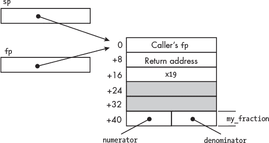

## 第十八章：面向对象编程**


到目前为止，在本书中，我一直使用过程化编程范式（在《用 C 探索数据格式》一章中描述，见第 23 页）。在这一章中，我将介绍如何在 C++ 中以汇编语言级别实现面向对象编程。

在面向对象编程中，我们可以创建*对象*，每个对象都是某个类的实例。类具有一组*属性*，即定义对象状态的数据项，以及*方法*，可以查询或改变类对象的属性。软件解决方案通常包括构造对象，然后编程向对象发送消息，对象使用方法作用于其属性。

我将使用 C++，一种 C 语言的面向对象扩展，来说明这些概念。你将学习如何使用记录来存储对象的属性，以及如何将方法实现为与记录关联的函数。

C++ 的许多其他特性对于创建良好的面向对象编程解决方案也非常重要，但我在本书中不会详细讨论。如果你是 C++ 新手，Josh Lospinoso 的《C++ 快速入门》（No Starch Press，2019）是一个不错的起点。如果你想在学习如何使用 C++ 后深入了解其设计，推荐 Bjarne Stroustrup（C++ 的创造者）所著的《C++ 之旅》第三版（Addison-Wesley Professional，2022）。另一个很好的在线资源是 C++ 核心准则，网址是*[`isocpp.github.io/CppCoreGuidelines/CppCoreGuidelines`](https://isocpp.github.io/CppCoreGuidelines/CppCoreGuidelines)*，该准则由 Bjarne Stroustrup 和 Herb Sutter 定期更新。

让我们从一个非常简单的 C++ 类开始，然后查看 C++ 编译器生成的汇编语言代码。

### **C++ 中的对象**

C++ 允许我们创建*类*，它们就像创建对象的蓝图。C++ 类非常像 C 语言中的记录，但除了定义对象属性的*数据成员*外，还可以包含作为类成员的函数。在 C++ 中，我们通过调用类的*成员函数*，向对象发送消息，指示它执行某个方法。

C++ 指定了六个特殊成员函数，用于创建和删除对象。在本书中，我将只介绍最常用的两个：构造函数和析构函数。*构造函数*用于创建对象的实例，这个过程称为*实例化*。构造函数的工作是分配必要的内存资源，并在向对象发送消息之前将其置于已知的状态。

C++ 编译器会在我们实例化对象的地方自动生成代码来调用构造函数。构造函数的名称与类相同，不能有返回值——甚至不能是 `void`。*默认构造函数* 不接受任何参数。我们也可以编写接受参数的构造函数，一个类可以有多个构造函数。

*destructor* 函数的作用是释放构造函数分配的资源，从而删除对象。例如，构造函数可能会从堆上分配内存（在 第十章 中描述），而析构函数则负责释放这块内存。每个类只能有一个析构函数，它的名字与类相同，并以 `~`（波浪号）字符开头。析构函数不能有返回值，并且不接受任何参数。当程序流离开对象的作用域时，C++ 编译器会自动生成代码来调用析构函数。

为了演示这些概念，我们将查看一个简单的 `Fraction` 类，它的属性是两个 `int`：`numerator` 和 `denominator`。我们将包括一个构造函数、一个析构函数以及一些用于处理 `Fraction` 对象的成员函数。如果我们没有提供构造函数或析构函数，C++ 编译器将自动提供适当的代码来执行对象的构造和销毁；我们将在“通过编译器编写构造函数和析构函数”一节中探讨这是什么意思，见 第 399 页。

我们从 `Fraction` 类的声明开始，将其放入头文件中，以便在任何使用该类的文件中都可以包含它，如 清单 18-1 所示。

*fraction.h*

```
   // A simple Fraction class

   #ifndef FRACTION_H
   #define FRACTION_H
   class Fraction {
❶ public:
       Fraction();               // Default constructor
       ~Fraction();              // Destructor
       void get();               // Get user's values
       void display();           // Display fraction
       void add_integer(int x);  // Add x to fraction
❷ private:
       int numerator;
       int denominator;
  };
  #endif
```

*清单 18-1：C++* 分数 *类*

`class` 声明的整体语法类似于 C 语言中的记录声明，但它增加了将类的方法作为成员函数包含进来的功能。对类成员的访问可以是*私有的*、*受保护的*或*公开的*。我们这里只讨论基本的公开和私有访问控制，复杂的访问控制概念留给 C++ 书籍去讨论。

我们将成员函数声明为 `public` ❶。这意味着它们可以从类外部使用，用来向该类的对象发送消息。它们提供了与对象的接口。

我们将数据成员放在 `class` 声明的 `private` 部分 ❷。这意味着只有成员函数可以直接访问它们，从而让成员函数控制 `numerator` 和 `denominator`，即 `Fraction` 类的属性。类外的代码只能通过公共接口访问它们。

默认情况下，`class` 的访问权限是私有的。如果我们将属性列在 `public` 区域之前，则无需使用 `private` 关键字，但我喜欢先列出 `class` 的公共接口。

也可以使用 `struct` 关键字来声明 C++ 类，如 清单 18-2 所示。

*fraction.h*

```
// A simple Fraction class

#ifndef FRACTION_H
#define FRACTION_H
struct Fraction {
public:
    Fraction();               // Default constructor
    ~Fraction();              // Destructor
    void get();               // Get user's values
    void display();           // Display fraction void add_integer(int x);  // Add x to fraction
private:
    int numerator;
    int denominator;
};
#endif
```

*清单 18-2：C++* Fraction 结构

C++ 中 `struct` 的默认访问范围是 public，但我喜欢明确声明。`private` 声明是私有作用域所必需的。

尽管 `class` 和 `struct` 除了默认的访问范围不同外是相同的，但我更喜欢使用 `class` 关键字，因为它强调了它不仅仅是一个简单的记录。然而，这只是个人的选择。接下来，我们将看看如何创建对象以及如何向对象发送消息。

#### ***创建一个对象***

我将通过一个简单的程序来说明如何创建对象并向其发送消息，该程序允许用户输入分数的分子和分母值，然后将 1 加到分数上。这个程序在清单 18-3 中展示。

*inc_fraction.cpp*

```
// Get a fraction from the user and add 1.

#include "fraction.h"

int main(void)
{
 ❶ Fraction my_fraction;

 ❷ my_fraction.display();
    my_fraction.get();
    my_fraction.add_integer(1);
    my_fraction.display();

    return 0;
}
```

*清单 18-3：一个将 1 加到分数的程序*

我们通过使用类名并为对象提供一个名称来实例化一个对象 ❶，就像定义变量一样。点操作符（`.`）用于向类中的方法发送消息 ❷，该方法调用对象所属类中的相应成员函数。该程序在获取用户输入值之前显示分数的状态，然后在将 1 加到用户的分数后再次显示。

接下来，我们将查看 C++ 编译器生成的汇编语言，用于实现清单 18-3 中的 `main` 函数。我们环境中的 C++ 编译器叫做 `g++`。

我使用了以下命令来生成清单 18-4 中的汇编语言：

```
$ g++ -S -Wall -O0 -fno-unwind-tables -fno-asynchronous-unwind-tables
      -fno-exceptions inc_fraction.cpp
```

这与我们一直用于 C 代码的命令相同，只不过我添加了 `-fno-exceptions` 选项。C++ 提供了一个*异常*机制来处理检测到的运行时错误。编译器通过汇编指令提供该功能的信息，这可能会使我们讨论对象实现的内容变得更加复杂。使用 `-fno-exceptions` 选项将关闭此功能。

*inc_fraction.s*

```
        .arch armv8-a
        .file   "inc_fraction.cpp"
        .text
        .align   2
        .global  main
        .type    main, %function
main:
     ❶ stp      x29, x30, [sp, -48]!
        mov      x29, sp
        str      x19, [sp, 16]
     ❷ add      x0, sp, 40
     ❸ bl       _ZN8FractionC1Ev          /// Construct my_fraction
        add      x0, sp, 40
     ❹ bl       _ZN8Fraction7displayEv
        add      x0, sp, 40
        bl       _ZN8Fraction3getEv
        add      x0, sp, 40
        mov      w1, 1
     ❺ bl       _ZN8Fraction11add_integerEi
        add      x0, sp, 40
        bl       _ZN8Fraction7displayEv
        mov      w19, 0
        add      x0, sp, 40
     ❻ bl       _ZN8FractionD1Ev         /// Destruct my_fraction
        mov      w0, w19
        ldr      x19, [sp, 16]
        ldp      x29, x30, [sp], 48
        ret
        .size    main, .-main
        .ident   "GCC: (Debian 10.2.1-6) 10.2.1 20210110"
        .section         .note.GNU-stack,"",@progbits
```

*清单 18-4：C++ 编译器生成的用于 main 函数的汇编语言，见清单 18-3*

首先需要注意的是，`my_fraction`（见清单 18-3 中的➊）是一个自动局部变量，因此在 `main` 函数的序言 ❶ 中为该 `Fraction` 对象分配了栈内存空间。该内存区域的地址被传递给构造函数 `_ZN8FractionC1Ev`，该函数将初始化该对象 ❷。

C++ 编译器将我们在清单 18-1 中声明的构造函数 `Fraction` 的名称修饰为`_ZN8FractionC1Ev` ❸。你在第十五章中学到了 C 编译器如何修饰静态局部变量的名称。其目的是区分同一文件中不同函数中具有相同名称的静态局部变量。

C++使用名称修饰将成员函数与其类关联起来。查看清单 18-4 中对类成员函数的调用，你会发现它们都以`_ZN8Fraction`开头。由于函数名是全局作用域的，包含类名可以让我们在程序中定义其他类，这些类的成员函数可能有相同的名称。例如，程序中可能有多个类都包含一个`display`成员函数。名称修饰通过类名来标识每个`display`成员函数所属的类❹。

C++名称修饰还允许*函数重载*，即拥有多个名称相同但参数数量和类型不同的类成员函数。在清单 18-4 中，修饰后的`_ZN8Fraction11add_integerEi`，就是我们的`add_integer`成员函数，最后有一个附加的`i`；这表示该函数接受一个`int`类型的单一参数❺。通过在名称修饰中包含参数的数量和类型，可以区分重载函数。在“你的任务”练习 18.1 中，你将有机会重载默认构造函数，页面 406 中有详细介绍。

名称修饰的标准并不统一，因此每个编译器可能会有不同的做法。这意味着程序中的所有 C++代码必须使用兼容的编译器和链接器进行编译和链接。

看一下每个成员函数调用之前的指令❷。对象的地址作为第一个参数传递给每个成员函数。这是一个*隐式参数*，在 C++代码中不会显示。在接下来的章节中，当我们查看成员函数内部时，你将看到如何访问这个地址。

尽管在我们编写的 C++代码中没有显示，但编译器会在程序流程离开对象的作用域时生成对析构函数的调用❻。在一些更高级的编程技术中，我们会显式调用析构函数，但书中不涉及这些内容。大多数时候，我们让编译器决定何时调用析构函数。

接下来，我们将看看这个`Fraction`类的构造函数、析构函数和其他成员函数。

#### ***定义类成员函数***

尽管通常将每个 C 函数定义放在自己的文件中，但 C++源文件通常会组织成将所有函数定义包含在一个类中。清单 18-5 显示了我们`Fraction`类的成员函数定义。

*fraction.cpp*

```
   // A simple Fraction class

   #include "fraction.h"
   #include <iostream>
❶ using namespace std;

❷ Fraction::Fraction()
   {
    ❸ numerator = 0;
       denominator = 1;
   }

   Fraction::~Fraction() {}
   // Nothing to do for this object

   void Fraction::get()
   {
    ❹ cout << "Enter numerator: ";
    ❺ cin >> numerator;

       cout << "Enter denominator: ";
       cin >> denominator;

       if (denominator == 0) {
           cout << "WARNING: Setting 0 denominator to 1\n";
           denominator = 1;
       }
   }

   void Fraction::display()
   {
       cout << numerator << '/' << denominator << '\n';
   }

   void Fraction::add_integer(int x)
   {
       numerator += x * denominator;
   }
```

*清单 18-5：我们`Fraction`类的成员函数定义*

C++在你在第十四章中学到的 C 语言作用域规则上添加了一些作用域规则。尽管在清单 18-1 中声明的成员函数是公有的，但它们具有*类作用域*，这意味着它们的名称需要与类相关联。编译器通过装饰名称来实现这一点，但在类作用域外定义成员函数时，我们需要使用*作用域解析运算符*（`::`）来建立这种关联❷。

构造函数的主要目的是初始化对象。我们将把`Fraction`对象设置为`0/1`❸，这是一个合理的初始值。

C++标准库提供了用于向屏幕写入和从键盘读取的对象。`ostream`类中的`cout`对象将字符流写入标准输出，通常连接到屏幕❹。它使用*插入运算符*（`<<`）并将数据转换为适当的字符字符串。`istream`类中的`cin`对象从标准输入读取字符流，通常连接到键盘❺。它使用*提取运算符*（`>>`）并将字符字符串转换为适合其读取的变量的数据类型。

除了类作用域外，C++还允许我们将事物的名称收集到*命名空间作用域*中。`iostream`头文件将`cout`和`cin`对象放置在`std`命名空间中。我们需要在使用这些对象时指定该命名空间❶。

接下来，我们将查看这些成员函数的编译器生成的汇编语言。为了简化讨论，我们将分别查看文件中的每个函数，参见清单 18-6 到清单 18-11。在查看这些内容时，请记住这是一个文件，因此标签在所有六个清单中都是可见的。

*fraction.s*文件的开始部分，展示在清单 18-6 中，是为 C++ I/O 库中的`cin`和`cout` I/O 对象分配内存的代码。我们在清单 18-5 中包含`iostream`头文件，告诉编译器插入这段代码。

*fraction.s(a)*

```
        .arch armv8-a
        .file   "fraction.cpp"
        .text
        .section        .rodata       /// For operating system
        .align   3
        .type    _ZStL19piecewise_construct, %object
        .size    _ZStL19piecewise_construct, 1
_ZStL19piecewise_construct:
        .zero    1
     ❶ .local   _ZStL8__ioinit
     ❷ .comm    _ZStL8__ioinit,1,8
```

*清单 18-6：`cin`和`cout` I/O 对象使用的字节*

`.local`汇编指令将`_ZStL8__ioinit`标签限制在此对象内❶。`.comm`指令在内存中分配 1 个字节，并将其对齐到 8 字节地址，并标记为`_ZStL8__ioinit`❷。如果程序中有其他`.comm`指令使用相同的标签，它们将共享相同的内存。这段内存供`cin`和`cout` I/O 对象使用；它的具体用法超出了本书的范围。

清单 18-7 展示了文件的第二部分，即我们`Fraction`对象的构造函数。

*fraction.s(b)*

```
        .text
        .align  2
 .global _ZN8FractionC2Ev
        .type   _ZN8FractionC2Ev, %function
_ZN8FractionC2Ev:
        sub     sp, sp, #16
     ❶ str      x0, [sp, 8]                    /// Save this pointer
        ldr     x0, [sp, 8]
     ❷ str      wzr, [x0]                      /// numerator = 0;
        ldr     x0, [sp, 8]
        mov     w1, 1
     ❸ str      w1, [x0, 4]                    /// denominator = 1;
        nop
        add     sp, sp, 16
        ret
        .size   _ZN8FractionC2Ev, .-_ZN8FractionC2Ev
        .global _ZN8FractionC1Ev
        .set    _ZN8FractionC1Ev,_ZN8FractionC2Ev
```

*清单 18-7：编译器生成的构造函数汇编语言，见清单 18-5*

我们的构造函数初始化了位于栈帧中的 `Fraction` 对象的 `numerator` ❷ 和 `denominator` ❸ 数据成员。回到列表 18-4，你会看到每个成员函数的第一个参数是正在操作的对象的地址。但是查看列表 18-1 中的类声明时，你会发现该地址没有出现在成员函数的参数列表中。它被称为 *隐藏参数*。

如果一个成员函数访问的是与调用它的对象属于同一类的另一个对象，它需要能够区分这两个对象。尽管它没有出现在参数列表中，C++ 使用 `this` 作为隐藏参数的名称，这是一个指针变量，包含了调用成员函数的对象的地址 ❶。

编译器假设我们的成员函数正在处理 `this` 指针变量中地址所指向的对象，因此我们通常不需要显式使用它。但某些情况要求我们显式地使用该指针。例如，我们可能会编写一个 `Fraction` 构造函数，允许我们像这样指定初始化值：

```
Fraction::Fraction(int numerator, int denominator) {
    this->numerator = numerator;
    this->denominator = denominator;
}
```

参数名称优先于成员名称，因此我们必须通过 `this` 指针来消除歧义。

现在你知道 `Fraction` 对象的数据成员在对象中的位置后，你可以在图 18-1 中看到该对象是如何存储在 `main` 的栈帧中的。



*图 18-1：* my_fraction *对象在* main *的栈帧中*

我不知道为什么编译器在这个栈帧中包含了 16 字节的空间，但程序中并没有使用这些空间。

构造函数后面是析构函数，如列表 18-8 所示。

*fraction.s(c)*

```
        .align  2
        .global _ZN8FractionD2Ev
        .type   _ZN8FractionD2Ev, %function
_ZN8FractionD2Ev:
        sub     sp, sp, #16
        str     x0, [sp, 8]
        nop
        add     sp, sp, 16
        ret
        .size   _ZN8FractionD2Ev, .-_ZN8FractionD2Ev
        .global _ZN8FractionD1Ev
        .set    _ZN8FractionD1Ev,_ZN8FractionD2Ev
```

*列表 18-8：在 列表 18-5 中析构函数的编译器生成的汇编语言*

在这个简单的类中，析构函数没有任何操作。之前在列表 18-4 中，你看到对象的内存是由 `main` 函数的序言分配到栈帧中的，而不是由构造函数分配的。同样，对象的内存会在 `main` 的尾声代码中，在调用析构函数后从栈中删除。一些构造函数从堆中分配内存，在这种情况下，析构函数应该释放这些内存。

析构函数的汇编语言后面是成员函数的汇编语言。列表 18-9 显示了 `get` 成员函数的汇编语言。

*fraction.s(d)*

```
        .section          .rodata
        .align   3
        .LC0:
        .string  "Enter numerator: "
        .align   3 
.LC1:
        .string  "Enter denominator: "
        .align   3
.LC2:
        .string  "WARNING: Setting 0 denominator to 1"
        .text
        .align   2
        .global  _ZN8Fraction3getEv
        .type    _ZN8Fraction3getEv, %function
_ZN8Fraction3getEv:
        stp      x29, x30, [sp, -32]!
        mov      x29, sp
        str      x0, [sp, 24]
        adrp     x0, .LC0
        add      x1, x0, :lo12:.LC0
      ❶ adrp     x0, :got:_ZSt4cout         /// From global library
        ldr      x0, [x0, #:got_lo12:_ZSt4cout]
        bl       _ZStlsISt11char_traitsIcEERSt13basic_ostreamIcT_ES5_PKc
        ldr      x0, [sp, 24]
        mov      x1, x0
      ❷ adrp     x0, :got:_ZSt3cin          /// From global library
        ldr      x0, [x0, #:got_lo12:_ZSt3cin]
        bl       _ZNSirsERi
        adrp     x0, .LC1
        add      x1, x0, :lo12:.LC1
        adrp     x0, :got:_ZSt4cout
        ldr      x0, [x0, #:got_lo12:_ZSt4cout]
        bl       _ZStlsISt11char_traitsIcEERSt13basic_ostreamIcT_ES5_PKc
        ldr      x0, [sp, 24]
        add      x0, x0, 4
        mov      x1, x0
        adrp     x0, :got:_ZSt3cin
        ldr      x0, [x0, #:got_lo12:_ZSt3cin]
        bl       _ZNSirsERi
        ldr      x0, [sp, 24]
        ldr      w0, [x0, 4]
        cmp      w0, 0                       /// Check for 0 denominator
        bne      .L5
        adrp     x0, .LC2
        add      x1, x0, :lo12:.LC2
        adrp     x0, :got:_ZSt4cout
        ldr      x0, [x0, #:got_lo12:_ZSt4cout]
        bl       _ZStlsISt11char_traitsIcEERSt13basic_ostreamIcT_ES5_PKc
        ldr      x0, [sp, 24]
        mov      w1, 1
        str      w1, [x0, 4] .L5:
        nop
        ldp      x29, x30, [sp], 32
        ret
        .size    _ZN8Fraction3getEv, .-_ZN8Fraction3getEv
```

*列表 18-9：在 列表 18-5 中的 get 函数的编译器生成的汇编语言*

当程序加载到内存中时，`cout` 对象的位置会被加载到我们的全局偏移表 (GOT) ❶ 中。`cin` 对象的位置也会被加载到我们的 GOT ❷ 中。

接下来，我们将查看 `display` 成员函数，如列表 18-10 所示。

*fraction.s(e)*

```
        .align   2
        .global _ZN8Fraction7displayEv
        .type   _ZN8Fraction7displayEv, %function
_ZN8Fraction7displayEv:
        stp     x29, x30, [sp, -32]!
        mov     x29, sp
        str     x0, [sp, 24]
        ldr     x0, [sp, 24]
        ldr     w0, [x0]
        mov     w1, w0
        adrp    x0, :got:_ZSt4cout
        ldr     x0, [x0, #:got_lo12:_ZSt4cout]
      ❶ bl      _ZNSolsEi
        mov     w1, 47          /// '/' character
      ❷ bl      _ZStlsISt11char_traitsIcEERSt13basic_ostreamIcT_ES5_c
        mov     x2, x0
        ldr     x0, [sp, 24]
        ldr     w0, [x0, 4]
        mov     w1, w0
        mov     x0, x2
        bl      _ZNSolsEi
        mov     w1, 10          /// '/ n'   character
        bl      _ZStlsISt11char_traitsIcEERSt13basic_ostreamIcT_ES5_c
        nop
        ldp     x29, x30, [sp], 32
        ret
        .size   _ZN8Fraction7displayEv, .-_ZN8Fraction7displayEv
```

*清单 18-10：在清单 18-5 中显示的编译器生成的汇编语言*

在我们的 C++代码中（见清单 18-5），我们将插入操作链式调用到`cout`对象上。编译器将数据项类型与它所调用的`ostream`类成员函数匹配。第一个值是`int` ❶，第二个是`char` ❷，依此类推。

清单 18-11 展示了编译器为`add_integer`成员函数生成的汇编语言。

*fraction.s(f)*

```
        .align  2
        .global _ZN8Fraction11add_integerEi
        .type   _ZN8Fraction11add_integerEi, %function
_ZN8Fraction11add_integerEi:
        sub     sp, sp, #16
      ❶ str     x0, [sp, 8]
        str     w1, [sp, 4]
        ldr     x0, [sp, 8]
        ldr     w1, [x0]
        ldr     x0, [sp, 8]
        ldr     w2, [x0, 4]
        ldr     w0, [sp, 4]
        mul     w0, w2, w0
        add     w1, w1, w0
        ldr     x0, [sp, 8]
        str     w1, [x0]
        nop
        add     sp, sp, 16
        ret
        .size   _ZN8Fraction11add_integerEi, .-_ZN8Fraction11add_integerEi
```

*清单 18-11：在清单 18-5 中显示的 add_integer 编译器生成的汇编语言*

`this`指针变量在该函数的栈帧中创建 ❶。这是一个叶子函数，因此编译器不会在栈帧中生成帧记录。

如果你使用`g++`编译器生成汇编语言，你将看到另外两个函数，`_Z41__static_initialization_and_destruction_0ii`和`_GLOBAL__sub_I__ZN8FractionC2Ev`。操作系统在程序加载时调用这些函数，以设置`cout`和`cin`输入输出流。具体细节超出了本书的范围，因此我不会在这里展示它们。

构造函数的目的是分配对象所需的系统资源并初始化对象。析构函数则释放构造函数分配的资源。在下一节中，你将看到编译器可以为像我们`Fraction`类这样简单的对象自动生成构造函数和析构函数。

### **通过编译器编写构造函数和析构函数**

在 C++中，对象的初始化是复杂的，因为有许多种方式可以实现。上一节介绍了最基本的方式。现在，我将向你展示一些简单的 C++语法，它告诉编译器自己处理初始化的方式。

C++核心指南中的建议 C.45（见* [`isocpp.github.io/CppCoreGuidelines/CppCoreGuidelines#Rc-default`](https://isocpp.github.io/CppCoreGuidelines/CppCoreGuidelines#Rc-default) *）指出：“不要定义仅初始化数据成员的默认构造函数；请改为使用类内成员初始化器。”

清单 18-12 展示了我们如何重写`Fraction`类，告诉编译器为我们生成构造函数和析构函数。

*fraction_dflt.h*

```
// A simple Fraction class

#ifndef FRACTION_DFLT_H
#define FRACTION_DFLT_H
class Fraction {
public:
 ❶ Fraction() = default;     // Tell compiler to generate default
    ~Fraction() = default;    //   constructor and destructor
    void get();               // Get user's values
    void display();           // Display fraction
    void add_integer(int x);  // Add x to fraction
private:
 ❷ int numerator {};
    int denominator {1};
};
#endif
```

*清单 18-12：C++* Fraction *类指定默认构造函数和析构函数*

2011 年 9 月发布的 C++11 标准新增了*显式默认函数*，这些函数通过`= default`符号来指定 ❶。标准规定，编译器必须生成函数体并尽可能将其内联。

根据 C++ 核心准则的建议，我在清单 18-12 中使用了*类内成员初始化器*来指定数据成员的初始化值❷。数据成员的初始值通过大括号 `{}` 来指定；一个空的大括号表示编译器使用 `0`。C++ 还允许以下语法，使用等号进行数据成员初始化：

```
int numerator = 0;
int numerator = {};
```

我喜欢使用简单的大括号初始化语法，因为它传达了一个信息，即变量的实际赋值直到对象实例化时才会发生，正如你将很快看到的那样。有关这些差异的讨论，请参阅本章开始时引用的 Josh Lospinoso 的书。

由于我们已经告诉编译器创建默认构造函数和析构函数，因此可以从我们的成员函数定义文件中删除这些函数，如清单 18-13 所示。

*fraction_dflt.cpp*

```
// A simple Fraction class

#include "fraction_dflt.h"
#include <iostream>
 using namespace std;

void Fraction::get()
{
    cout << "Enter numerator: ";
    cin >> numerator;

    cout << "Enter denominator: ";
    cin >> denominator;

    if (denominator == 0) {
        cout << "WARNING: Setting 0 denominator to 1\n";
        denominator = 1;
    }
}

void Fraction::display()
{
    cout << numerator << '/' << denominator << '\n';
}

void Fraction::add_integer(int x)
{
    numerator += x * denominator;
}
```

*清单 18-13：带有编译器生成构造函数和析构函数的 C++* Fraction *类*

清单 18-14 展示了此程序的 `main` 函数。

*inc_fraction_dflt.cpp*

```
   // Get a fraction from the user and add 1.

❶ #include "fraction_dflt.h"

   int main(void)
   {
       Fraction my_fraction;

       my_fraction.display();
       my_fraction.get();
       my_fraction.add_integer(1);
       my_fraction.display();

       return 0;
   }
```

*清单 18-14：一个将 1 加到分数中的程序*

这是与清单 18-3 中的 `main` 函数相同，唯一不同的是我们使用了来自清单 18-12 的*fraction_dflt.h*头文件，以匹配清单 18-13 中的成员函数定义❶。

这个头文件告诉编译器需要为我们编写构造函数和析构函数，如清单 18-15 所示。

*inc_fraction_dflt.s*

```
       .arch armv8-a
       .file   "inc_fraction_dflt.cpp"
       .text
       .align  2
       .global main
       .type   main, %function
main:
     ❶ stp     x29, x30, [sp, -32]!
       mov     x29, sp
     ❷ str     wzr, [sp, 24]                  /// int numerator {};
       mov     w0, 1
       str     w0, [sp, 28]                    /// int denominator {1};
       add     x0, sp, 24
       bl      _ZN8Fraction7displayEv
       add     x0, sp, 24
       bl      _ZN8Fraction3getEv
       add     x0, sp, 24
       mov     w1, 1
       bl      _ZN8Fraction11add_integerEi
       add     x0, sp, 24
       bl      _ZN8Fraction7displayEv
       mov     w0, 0
       ldp     x29, x30, [sp], 32
       ret
       .size   main, .-main
       .ident  "GCC: (Debian 10.2.1-6) 10.2.1 20210110"
       .section       .note.GNU-stack,"",@progbits
```

*清单 18-15：由清单 18-14 生成的编译器汇编语言，显示了在清单 18-12 中指定的默认构造函数和析构函数*

将此与清单 18-4 进行比较，你可以看到编译器为 `Fraction` 对象分配的栈帧比我们提供构造函数成员函数时少了 16 个字节❶。它随后将数据成员的初始化内联，而不是调用函数来进行初始化❷。

默认构造函数不接受任何参数，但我们可能希望在实例化对象时向构造函数传递一些参数。C++ 允许我们拥有多个构造函数，只要它们的参数列表不同。你将在下一节看到这如何运作。

### **在 C++ 中重载默认构造函数**

*函数重载*是指类中的两个或多个函数具有相同的名称，但参数列表或返回类型不同。为了演示，我们将重载我们的默认构造函数，该构造函数不接受任何参数，使用一个接受单个 `int` 参数的构造函数，这样我们就可以在实例化 `Fraction` 对象时指定分子值。清单 18-16 展示了我们的新类。

*fraction_2.h*

```
// The Fraction class with two constructors

#ifndef FRACTION_2_H
#define FRACTION_2_H
class Fraction {
public:
     Fraction() = default;    // Tell compiler to generate default
  ❶ Fraction(int n) : numerator{n} {};  // Allow setting numerator

    ~Fraction() = default;
    void get();               // Get user's values
    void display();           // Display fraction
    void add_integer(int x);  // Add x to fraction
private:
  ❷ int numerator {123};     // Weird values so we can see
     int denominator {456};   //   what the compiler is doing
};
#endif
```

*清单 18-16：向* Fraction *类添加第二个构造函数*

第二个构造函数与默认构造函数的区别仅在于其参数列表 ❶。我们使用了 C++语法来告诉编译器如何利用参数初始化`numerator`数据成员。

我使用了奇怪的类内成员初始化值，以便让你更容易看出汇编语言是如何初始化我们的对象的 ❷。

让我们修改`main`函数，添加另一个使用我们重载构造函数的`Fraction`对象，如清单 18-17 所示。

*inc_fractions.cpp*

```
// Get two fractions from the user and increment each by 1.

#include "fraction_2.h"

int main(void)
{
    Fraction x;
    x.display();
    x.get();
    x.add_integer(1);
    x.display(); 
  ❶ Fraction y(78);
    y.display();
    y.get();
    y.add_integer(1);
    y.display();

    return 0;
}
```

*清单 18-17：一个程序，向两个使用不同构造函数的分数加 1*

对于第二个`Fraction`对象，我们将 78 传递给构造函数，作为初始值`numerator` ❶。

清单 18-18 展示了编译器如何用汇编语言实现第二个构造函数。

*inc_fractions.s*

```
           .arch armv8-a
           .file   "inc_fractions.cpp"
           .text
         ❶ .section .text._ZN8FractionC2Ei,"axG",@progbits,_ZN8FractionC5Ei,comdat
           .align  2
         ❷ .weak   _ZN8FractionC2Ei    /// Define label once
           .type   _ZN8FractionC2Ei, %function
❸ _ZN8FractionC2Ei:
           sub     sp, sp, #16
           str     x0, [sp, 8]
           str     w1, [sp, 4]         /// Save n
           ldr     x0, [sp, 8]
         ❹ ldr     w1, [sp, 4]
           str     w1, [x0]            /// Initialize numerator
           ldr     x0, [sp, 8]
         ❺ mov     w1, 456             /// Initialize denominator
           str     w1, [x0, 4]
           nop
           add     sp, sp, 16
           ret
           .size   _ZN8FractionC2Ei, .-_ZN8FractionC2Ei
           .weak   _ZN8FractionC1Ei
           .set    _ZN8FractionC1Ei,_ZN8FractionC2Ei
           .text
           .align  2
           .global main
           .type   main, %function
    main:
           stp     x29, x30, [sp, -32]!
           mov     x29, sp
           mov     w0, 123
           str     w0, [sp, 24] mov     w0, 456
           str     w0, [sp, 28]
           add     x0, sp, 24
           bl      _ZN8Fraction7displayEv
           add     x0, sp, 24
           bl      _ZN8Fraction3getEv
           add     x0, sp, 24
           mov     w1, 1
           bl      _ZN8Fraction11add_integerEi
           add     x0, sp, 24
           bl      _ZN8Fraction7displayEv
           add     x0, sp, 16
         ❻ mov     w1, 78               /// Constant supplied in main
           bl     _ZN8FractionC1Ei
           add    x0, sp, 16
           bl     _ZN8Fraction7displayEv
           add    x0, sp, 16
           bl     _ZN8Fraction3getEv
           add    x0, sp, 16
           mov    w1, 1
           bl     _ZN8Fraction11add_integerEi
           add    x0, sp, 16
           bl     _ZN8Fraction7displayEv
           mov    w0, 0
           ldp    x29, x30, [sp], 32
           ret
           .size  main, .-main
           .ident "GCC: (Debian 10.2.1-6) 10.2.1 20210110"
           .section       .note.GNU-stack,"",@progbits
```

*清单 18-18：编译器生成的清单 18-17 中函数的汇编语言*

编译器为我们的构造函数生成了一个独立的函数，该函数接受一个参数 ❸。编译器将这个构造函数放置在一个特殊的部分，标记为`comdat`，在那里可以从其他文件中的函数调用它，这些函数使用相同的构造函数来实例化一个`Fraction`对象 ❶。`.weak`汇编指令告诉编译器只在这个文件中生成一次这个标签 ❷。虽然我们在`main`函数中将一个显式整数传递给构造函数 ❻，但如果我们实例化多个`Fraction`对象，并且这些对象的变量值直到程序运行时才知道，那么独立的函数会更高效。

传递给`_ZN8FractionC2Ei`构造函数的参数用于初始化我们`Fraction`对象的`numerator`属性 ❹。我们的默认类内值用于初始化`denominator`属性 ❺。

由于编译器为我们编写了这个构造函数，我们只需要将定义其他成员函数的文件中的`#include "fraction_dflt.h"`更改为`#include "fraction_2.h"`，如清单 18-13 所示。我不会在这里重复该清单。

用汇编语言编写面向对象的程序其实没有多大意义。我们可以为所有函数发明一个名称修饰方案，但我们仍然会使用过程式编程范式来调用它们，而不是面向对象范式。然而，在某些情况下，我们可能希望调用用汇编语言编写的函数。我们将在下一节中学习如何做到这一点。

**轮到你了**

18.1   在 C++ 程序中添加另一个构造函数，参考清单 18-1、18-3 和 18-5，该构造函数接受两个整数参数以初始化`Fraction`。添加一个使用第二个构造函数的对象。例如，`Fraction y(1,2);`将创建一个初始化为`1/2`的`Fraction`对象。修改`main`函数以显示这个第二个`Fraction`对象，获取其新值，为第二个对象加上一个整数，并再次显示它。

18.2   编写一个 C++ 程序，提示用户输入分子和分母，然后使用用户的值实例化一个`Fraction`对象。显示新对象，为其加上 1，并显示该对象的新状态。

### **在 C++ 中调用汇编语言函数**

为了展示如何在 C++ 中调用汇编语言函数，我将修改我们的`Fraction`成员函数，使用我们的汇编语言函数`write_str`、`write_char`、`put_int`和`get_int`来进行屏幕输出和键盘输入。清单 18-19 展示了我们需要在成员函数定义中做出的修改。

*fraction_asm.cpp*

```
   // A simple Fraction class

   #include "fraction_dflt.h"
   // Use the following C functions.
❶  extern "C" {
        #include "write_str.h"
        #include "write_char.h"
        #include "get_int.h"
        #include "put_int.h"
   }
   // Use char arrays because write_str is a C function.
   char num_msg[] = "Enter numerator: ";
   char den_msg[] = "Enter denominator: ";

   void Fraction::get()
   {
       write_str(num_msg);
       numerator = get_int();
       write_str(den_msg); 
       denominator = get_int();
   }

   void Fraction::display()
   {
       put_int(numerator);
       write_char('/');
       put_int(denominator);
       write_char('\n');
   }

   void Fraction::add_integer(int x)
   {
       numerator += x * denominator;
   }
```

*清单 18-19：在*Fraction*类中调用汇编语言函数*

`extern "C"`告诉 C++ 编译器这些头文件中的项目具有 C 链接方式，因此编译器不会修饰它们的名称❶。

清单 18-20 展示了这如何影响`get`成员函数。

*fraction_asm.s*

```
        .arch armv8-a
        .file   "fraction_asm.cpp"
        .text
        .global num_msg
        .data
        .align  3
        .type   num_msg, %object
        .size   num_msg, 18
num_msg:
        .string "Enter numerator: "
        .global den_msg
        .align  3
        .type   den_msg, %object
        .size   den_msg, 20
den_msg:
        .string "Enter denominator: "
        .text
        .align  2
        .global _ZN8Fraction3getEv
        .type   _ZN8Fraction3getEv, %function
_ZN8Fraction3getEv:
        stp     x29, x30, [sp, -32]!
        mov     x29, sp
        str     x0, [sp, 24]
        adrp    x0, num_msg
        add     x0, x0, :lo12:num_msg
      ❶ bl      write_str 
        bl      get_int
        mov     w1, w0
        ldr     x0, [sp, 24]
        str     w1, [x0]
        adrp    x0, den_msg
        add     x0, x0, :lo12:den_msg
        bl      write_str
        bl      get_int
        mov     w1, w0
        ldr     x0, [sp, 24]
        str     w1, [x0, 4]
        nop
        ldp     x29, x30, [sp], 32
        ret
        .size   _ZN8Fraction3getEv, .-_ZN8Fraction3getEv
--snip--
```

*清单 18-20：在清单 18-19 中，编译器生成的汇编语言对应的*get*函数*

汇编语言函数通过我们为它们指定的名称进行调用，没有任何修饰❶。如果你使用`g++`生成`display`成员函数的汇编语言，你会看到类似的结果，对于`put_int`和`write_char`函数的调用也是如此。

### **你学到了什么**

**类** 声明定义对象状态的数据成员，并包括用于访问这些数据成员的任何成员函数。

**C++ 中的对象** 一个命名的内存区域，包含类中声明的数据成员。

**方法或成员函数** 类中声明的成员函数可以被调用来访问同一类对象的状态。

**名称修饰** 编译器创建成员函数名称时，会包括函数名、所属类以及函数的参数数量和类型。

**构造函数** 一种成员函数，用于初始化对象。

**析构函数** 一种成员函数，用于清理不再需要的资源。

本章简要介绍了 C++ 实现基本面向对象编程特性的方法。

现在你已经学会了几种在程序中组织数据的技术，我将回到如何在二进制中存储数据的话题。到目前为止，在本书中，我只在程序中使用了整数值。在下一章，你将看到小数值是如何在内存中表示的，并了解一些用于操作它们的 CPU 指令。
