## 第十九章：**分数值**


到目前为止，我们的程序只使用了整数值——整数和字符。在本章中，我们将了解计算机如何表示分数值。你将学习两种表示分数值的方法：定点和浮点。

我将从定点数开始，向你展示分数值如何在二进制中表示。正如你将看到的那样，使用一些位来表示数字的小数部分，会减少剩余位数给整数部分，这样就减少了我们能表示的数字范围。包含小数部分只能将该范围划分为更小的部分。

这个范围限制将引导我们讨论浮点数，它们允许更大的范围，但也带来其他限制。我将向你展示浮点数表示法的格式和特性，然后讨论最常见的浮点二进制标准 IEEE 754。我将在本章末简要介绍 A64 架构中浮点数的处理方式。

### **二进制中的分数值**

让我们从分数值的数学表达开始。回顾一下第二章，我们知道十进制整数 *N* 可以用二进制表示为

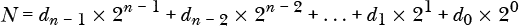

其中每个 *d[i]* = `0` 或 `1`。

我们可以扩展它以包括一个分数部分 *F*，使得

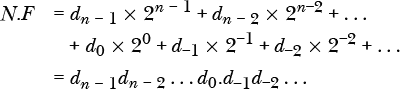

其中每个 *d[i]* = `0` 或 `1`。注意此方程右侧 *d*[0] 和 *d*[-1] 之间的 *二进制点*。所有二进制点右侧的项都是二的负次幂，因此这一部分数字的和就是分数值。就像左侧的十进制点一样，二进制点将数字的小数部分与整数部分分开。这里有一个例子：

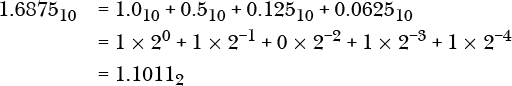

尽管任何整数都可以表示为二的幂的和，但二进制中分数值的精确表示仅限于二的*负*次幂的和。例如，考虑分数值 0.9 的 8 位表示。根据以下等式

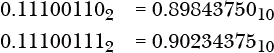

我们得到如下结果：

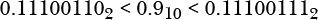

事实上，

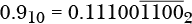

其中 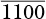 表示该位模式无限重复。

要将分数值四舍五入到最近的值，请检查四舍五入位置右侧的位。如果右侧的下一个位是 `0`，则丢弃四舍五入位置右侧的所有位。如果右侧的下一个位是 `1` 且其后跟随的任何位都是 `1`，则在四舍五入的位置加 `1`。

如果右边的下一个位是`1`，且所有后续位都是`0`，则使用*舍入到偶数*规则。如果你要舍入的位是`0`，直接丢弃舍入位右边的所有位。如果你要舍入的位是`1`，则将其加`1`，然后丢弃舍入位右边的所有位。

让我们将 0.9 四舍五入到 8 位。前面你已经看到，在二进制点右边的第九位是`0`，所以我们将丢弃第八位之后的所有位。于是我们使用


这会导致如下的舍入误差：

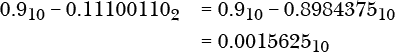

AArch64 架构支持其他浮动点舍入算法。这些内容在*《A-Profile 架构的 Arm 架构参考手册》中*有详细讨论，手册可在*[`developer.arm.com/documentation/ddi0487/latest`](https://developer.arm.com/documentation/ddi0487/latest)*找到。

我们通常以十进制表示数字，数字中有一个固定位置的小数点，用来将分数部分与整数部分分开。让我们看看这种方法在二进制中是如何工作的。

### **定点数**

*定点数*本质上是一个缩放的整数表示，其中缩放通过*基数点*的位置显示，基数点将数字的分数部分与整数部分分开。在十进制中，我们称其为*小数点*，在二进制中，我们称其为*二进制点*。讲英语的国家通常使用句点，其他地区通常使用逗号。

例如，1,234.5[10]表示 12,345[10]按 1/10 进行缩放，二进制的 10011010010.1[2]是 100110100101[2]按 1/2 的比例缩放。当使用定点数进行计算时，你需要注意小数点的位置。

在本节的第一部分，我们将研究具有分数部分是二的倒数次幂的数字缩放情况，在这种情况下分数部分可以精确表示。然后，我们将研究如何将十进制中的分数数字进行缩放，以避免之前描述的舍入误差。

#### ***当分数部分是二的倒数次幂的和时***

我将从一个程序开始，它将添加两个指定到最近十六分之一的测量值。一个例子是测量英寸的长度。英寸的分数部分通常以二的倒数次幂（1/2、1/4、1/8 等）表示，这些可以在二进制系统中精确表示。

我们的程序使用到最接近的十六分之一长度，因此我们将每个值乘以 16，以便得到一个完整的十六分之一数字。程序首先从键盘读取长度的整数部分，然后读取十六分之一的数量。列表 19-1 展示了我们如何缩放数字的整数部分，然后将分数部分按读取顺序加上。

*get_length.s*

```
// Get a length in inches and 1/16s.
// Calling sequence:
//    Return the fixed-point number.
        .arch armv8-a
// Stack frame
        .equ    save19, 16
        .equ    FRAME, 32
// Constant data
        .section  .rodata
        .align  3
prompt:
        .string "Enter length (inches and 1/16s)\n"
inches:
        .string "      Inches: "
fraction:
        .string "  Sixteenths: "
// Code
        .text
        .align  2
        .global get_length
        .type   get_length, %function
get_length:
        stp     fp, lr, [sp, -FRAME]!  // Create stack frame
        mov     fp, sp                 // Set our frame pointer
        str     x19, [sp, save19]      // For local var

        adr     x0, prompt             // Ask for length
        bl      write_str 
        adr     x0, inches             // Ask for integer
        bl      write_str
      ❶ bl      get_uint               // Integer part
      ❷ lsl     w19, w0, 4             // 4 bits for fraction

        adr      x0, fraction          // Ask for fraction
        bl       write_str
        bl       get_uint              // Fractional part
        add      w0, w0, w19           // Add integer part

        ldr      x19, [sp, save19]     // Restore for caller
        ldp      fp, lr, [sp], FRAME   // Delete stack frame
        ret                            // Back to caller
```

*列表 19-1：一个从键盘读取英寸和十六分之一英寸的数字的函数*

我们为英寸数和英寸的十六分之一数分配了 32 位，每个值都作为整数从键盘读取。请注意，我们使用了`get_uint`函数来读取每个无符号`int`❶。你在“你的挑战”练习 16.9 中被要求编写这个函数，见第 358 页。

我们将整数部分左移 4 位，以便将其乘以 16❷。在加上分数部分后，我们得到该值的总十六分之一数。例如，5 9/16 将存储为整数 5 × 16 + 9 = 89。

缩放操作为整数部分保留了 28 位。这限制了我们的数字范围为 0 到 268,435,455 15/16。这个范围是 32 位无符号整数 0 到 4,294,967,295 范围的 1/16，但分辨率为最接近的 1/16。

我们用来显示这些测量值的函数，如清单 19-2 所示，显示了整数部分和分数部分。

*display_length.s*

```
// Display a length to the nearest sixteenth.
        .arch armv8-a
// Calling sequence:
//    w0[31-4] <- integer part
//    w0[3-0]  <- fractional part
//    Return 0.
// Useful constants
     ❶ .equ     FOUR_BITS, 0xf        // For fraction
// Stack frame
        .equ     save19, 16
        .equ     FRAME, 32
// Constant data
        .section   .rodata
        .align   3
sixteenths:
        .string  "/16"
// Code
        .text
        .align   2
        .global  display_length
        .type    display_length, %function
display_length:
        stp      fp, lr, [sp, -FRAME]!  // Create stack frame
        mov      fp, sp                 // Set our frame pointer
        str      x19, [sp, save19]      // For local var

        mov      w19, w0                // Save input.
     ❷ lsr      w0, w19, 4             // Integer part
        bl       put_uint

        mov      w0, '   '              // Some formatting
        bl       write_char

     ❸ and       w0, w19, FOUR_BITS     // Mask off integer
        bl        put_uint               // Fractional part
 ❹ adr       x0, sixteenths         // More formatting
        bl        write_str

        mov       w0, wzr                // Return 0
        ldr       x19, [sp, save19]      // Restore for caller
        ldp       fp, lr, [sp], FRAME    // Delete stack frame
        ret                              // Back to caller
```

*清单 19-2：一个显示数字到最接近十六分之一的函数*

我们将数字右移 4 位，以便将整数部分显示为一个整数❷。使用一个 4 位的掩码❶，我们屏蔽掉整数部分，将分数部分显示为另一个整数❸。我们添加一些文本以显示这个第二个整数是分数部分❹。

清单 19-3 展示了一个`main`函数，它将两个数字加到最接近的十六分之一。

*add_lengths.s*

```
// Add 2 lengths, fixed-point, to nearest sixteenth.
        .arch armv8-a
// Stack frame
        .equ    save1920, 16
        .equ    FRAME, 32
// Constant data
        .section  .rodata
        .align   3
sum_msg:
        .string  "Sum = "
// Code
        .text
        .align   2
        .global  main
        .type    main, %function
main:
        stp      fp, lr, [sp, -FRAME]!        // Create stack frame
        mov      fp, sp                       // Set our frame pointer
        stp      x19, x20, [sp, save1920]     // For local vars

        bl       get_length
        mov      w19, w0                      // First number
        bl       get_length
        mov      w20, w0                      // Second number

        adr      x0, sum_msg                  // Some formatting
        bl       write_str
     ❶ add      w0, w20, w19                 // Add lengths
        bl       display_length               // Show result
 mov      w0, '\n'                     // Finish formatting
        bl       write_char

        mov      w0, wzr                      // Return 0
        ldp      x19, x20, [sp, save1920]     // Restore for caller
        ldp      fp, lr, [sp], FRAME          // Delete stack frame
        ret                                   // Back to caller
```

*清单 19-3：一个将两长度加到最接近的十六分之一的程序*

如果你查看第 410 页中表示分数值的二进制方程，你可能会说服自己，整数`add`指令将适用于整个数字，包括分数部分❶。

让我们思考一下在这里如何处理分数部分的定点格式。当我们从键盘读取整数部分时，我们将其左移了四个位位置，以便乘以 16。这为加上分数部分的十六分之一数留出了空间。我们实际上创建了一个 32 位的数字，其中二进制点位于第五和第四位之间（位 4 和位 3）。这是有效的，因为分数部分是二的负幂的和。

这个示例在二进制数字上工作得很好，但在计算中我们主要使用十进制数字。正如你在本章前面看到的，大多数分数十进制数字无法转换为有限的位数，需要四舍五入。在下一节中，我将讨论如何避免在将分数十进制数字表示为二进制时出现四舍五入错误。

#### ***当分数部分是十进制时***

我将使用一个程序，作为示例来说明如何将两个美元值加到最接近的分，这就是在十进制中使用分数值的方式。与清单 19-1 到 19-3 中的测量加法程序一样，我们将从读取货币值的函数`get_money`开始，具体见清单 19-4。

*get_money.s*

```
// Get dollars and cents from the keyboard.
// Calling sequence:
//    Return integer amount as cents.
        .arch armv8-a
// Stack frame
        .equ    save19, 16
        .equ    FRAME, 32
// Constant data
        .section  .rodata
        .align  3
prompt:
        .string "Enter amount (use same sign for dollars and cents)\n"
dollars:
        .string "   Dollars: " 
cents:
        .string "   Cents: "
// Code
        .text
        .align  2
        .global get_money
        .type   get_money, %function
get_money:
        stp     fp, lr, [sp, -FRAME]!   // Create stack frame
        mov     fp, sp                  // Set our frame pointer
        str     x19, [sp, save19]       // For local var

        adr     x0, prompt              // Ask for amount
        bl      write_str
        adr     x0, dollars             // Ask for dollars
        bl      write_str
        bl      get_int                 // Dollars
     ❶ mov      w1, 100                // 100 cents per dollar
        mul     w19, w0, w1             // Scale

        adr     x0, cents               // Ask for cents
        bl      write_str
        bl      get_int                 // Cents
     ❷ add     w0, w0, w19             // Add scaled dollars

        ldr     x19, [sp, save19]       // Restore for caller
        ldp     fp, lr, [sp], FRAME     // Delete stack frame
        ret                             // Back to caller
```

*Listing 19-4：一个从键盘读取美元和分的函数*

我们的货币值指定为最接近的分，因此我们将美元—整数部分—乘以 100❶。然后，我们将分—小数部分—加到一起，得到我们缩放后的`int`值❷。

在存储小数分数时，整数部分和小数部分不会像我们之前的例子那样分成不同的比特字段。例如，$1.10 会存储为 110 = `0x0000006e`，$2.10 会存储为 210 = `0x000000d2`。由于我们在这个程序中使用的是 32 位带符号整数，因此货币值的范围是 –$21,473,836.48 ≤ *money*_*amount* ≤ +$21,473,836.47。

显示美元和分将需要与显示长度（以分之一为单位）不同的算法，如 Listing 19-5 所示。

*display_money.s*

```
// Display dollars and cents.
        .arch armv8-a
// Calling sequence:
//    w0 <- value in cents
//    Return 0.
 // Stack frame
        .equ      save1920, 16
        .equ      FRAME, 32
// Constant data
        .section    .rodata
        .align   3
// Code
        .text
        .align   2
        .global  display_money
        .type    display_money, %function
display_money:
        stp      fp, lr, [sp, -FRAME]!     // Create stack frame
        mov      fp, sp                    // Set our frame pointer
        stp      x19, x20, [sp, save1920]  // For local vars

        mov      w1, 100                   // 100 cents per dollar
     ❶ sdiv     w20, w0, w1               // Dollars
        msub     w19, w20, w1, w0          // Leaving cents

        mov      w0, '$'                   // Some formatting
        bl       write_char
        mov      w0, w20                   // Dollars
        bl       put_int

        mov      w0, '.'s                  // Some formatting
        bl       write_char
        cmp      w19, wzr                  // Negative?
     ❷ cneg    w19, w19, mi               // Make non-negative
     ❸ cmp     w19, 10                    // Check for single digit
        b.hs     no_zero                   // Two digits
        mov      w0, '0'                   // One digit needs leading '0'  
        bl       write_char
no_zero:
        mov      w0, w19                   // Cents
        bl       put_int

        mov      w0, wzr                   // Return 0
        ldp      x19, x29, [sp, save1920]  // Restore for caller
        ldp      fp, lr, [sp], FRAME       // Delete stack frame
        ret                                // Back to caller
```

*Listing 19-5：一个显示美元和分的函数*

移位操作不能让我们除以 100，因此我们使用带符号除法指令`div`来获取美元❶。这次除法的余数就是分数。

我们对余数的计算将与整数部分具有相同的符号。负号在显示美元时会出现，但我们不希望它出现在分数部分，因此在显示分数之前，我们会取反分数的值❷。我们会检查分数是否小于 10，如果是，我们会将小数点右边的第一个数字设为 0❸。

我们在这里看到一个新指令，`cneg:` 

##### cneg**—条件取反**

`cneg w`d`, w`s`,`cond 在 cond 为真时，将`w`s`中的 32 位值取反后加载到`w`d 中。如果 cond 不为真，则将`w`s`加载到`w`d 中。

`cneg x`d`, x`s`,`cond 在 cond 为真时，将`x`s`中的 64 位值取反后加载到`x`d 中。如果 cond 不为真，则将`x`s`加载到`x`d 中。

可能的条件`cond`可以是 Table 13-1 中列出的任何条件标志，除了`al`和`nv`。

该程序的`main`函数，如 Listing 19-6 所示，将从键盘输入两个美元金额，将它们相加，并显示它们的总和。

*add_money.s*

```
// Add two dollar values.
        .arch armv8-a
// Stack frame
        .equ    save1920, 16
        .equ    FRAME, 32
// Constant data
        .section  .rodata
        .align  3
sum_msg:
        .string "Sum = "
// Code
        .text
        .align  2
        .global main
        .type   main, %function
main:
        stp     fp, lr, [sp, -FRAME]!        // Create stack frame
        mov     fp, sp                       // Set our frame pointer
        stp     x19, x20, [sp, save1920]     // For local vars

        bl      get_money
        mov     w19, w0                      // First number
        bl      get_money
        mov     w20, w0                      // Second number

        adr     x0, sum_msg                  // Some formatting
        bl      write_str
     ❶ add      w0, w19, w20                // Add values
        bl      display_money                // Show result
        mov     w0, '\n'                     // Finish formatting 
        bl      write_char

        mov     w0, wzr                      // Return 0
        ldp     x19, x20, [sp, save1920]     // Restore for caller
        ldp     fp, lr, [sp], FRAME          // Delete stack frame
        ret                                  // Back to caller
```

*Listing 19-6：一个添加两个美元值的程序*

我们对整数部分的缩放已将美元转换为分，因此一个简单的`add`指令就能为我们计算总和❶。我们的`display_money`函数将整理出该总和中的美元和分。

该方案在处理许多数字时表现良好，但我们通常使用科学记数法来表示非常大或非常小的数字。在接下来的章节中，你将看到科学记数法是如何引入另一种存储小数值的方式的。

**你的回合**

19.1 输入 Listings 19-1 至 19-3 中的程序。使用`gdb`调试器，检查`main`中的`w19`和`w20`寄存器中存储的数字。识别整数部分和小数部分。

19.2   输入清单 19-4 到 19-6 中的程序。使用`gdb`调试器检查在`main`中存储在`w19`和`w20`寄存器中的数字。识别出整数部分和小数部分。

19.3   输入清单 19-4 到 19-6 中的程序。运行程序，使用$21,474,836.47 作为一个数值，$0.01 作为另一个数值。程序给出的总数是多少？为什么？

19.4   编写一个汇编语言程序，允许用户输入开始时间和任务所需的时间，然后计算完成时间。使用 24 小时制时钟，并精确到秒。

### **浮动点数**

*浮动点数*的范围比定点数要大得多。然而，重要的是要理解浮动点数并不是*实数*。实数包括从–*∞*到+*∞*的所有数字的连续体。你已经知道计算机中的位数是有限的，因此可以表示的最大值是有限制的。但问题不仅仅是数量级的限制。

正如你在这一节中看到的，浮动点数只是实数的一个小子集。相邻的浮动点数之间存在显著的间隙。这些间隙可能会导致几种类型的错误，详细内容请见“浮动点算术错误”，在第 425 页。更糟糕的是，这些错误可能出现在中间结果中，使得它们很难调试。

#### ***浮动点表示法***

浮动点表示法基于科学记数法。在浮动点表示法中，我们有一个符号和两个数字来完全指定一个值：*有效数字*和*指数*。一个十进制浮动点数被写作有效数字乘以 10 的指数幂。例如，考虑这两个数字：

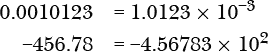

在浮动点表示法中，数字是*标准化*的，即小数点左边只有一个数字，并且 10 的指数相应调整。如果我们同意每个数字都经过标准化，并且我们在使用基数为 10 的表示法，那么每个浮动点数由三项完全指定：有效数字、指数和符号。在前两个例子中：

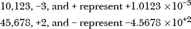

使用浮动点表示法的优点是，在给定的数字位数下，我们可以表示更大的数值范围。

让我们来看看浮动点数是如何在计算机中存储的。

#### ***IEEE 754 浮动点标准***

存储浮动点数的最常用标准是 IEEE 754（* [`standards.ieee.org/standard/754-2019.html`](https://standards.ieee.org/standard/754-2019.html) *）。图 19-1 展示了其一般模式。

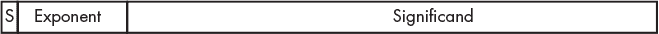

*图 19-1：存储 IEEE 754 浮动点数的一般模式*

A64 架构支持四种变体格式来存储浮动点数：两种 16 位格式，一种 32 位格式和一种 64 位格式。其中，16 位半精度、32 位单精度和 64 位双精度格式遵循 IEEE 754 标准。*BF16*格式（也称为*BFloat16*）与 IEEE 754 单精度格式相同，但具有截断的有效数字。这样可以在保持 32 位格式的动态范围的同时减少内存存储需求，但牺牲了精度。这个折衷在一些机器学习算法中很有用。A64 架构包含操作 BF16 数据的指令，但我们在本书中不会使用它们。这些格式在图 19-2 中展示。

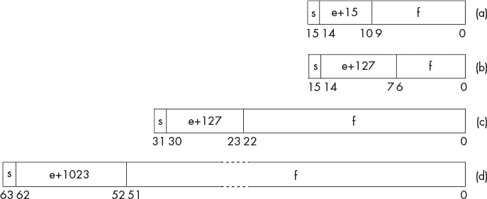

*图 19-2：存储（a）半精度，（b）BF16，（c）单精度和（d）双精度浮动点数的格式*

图 19-2 中显示的格式中的值表示以标准化形式存储的浮动点数*N*：

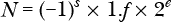

第一个位，*s*，是符号位，`0`表示正数，`1`表示负数。与十进制科学记数法类似，指数会进行调整，以便二进制点左侧只有一个非零数字。不过，在二进制中，这个数字总是 1，因此有效数字为 1.*f*。由于它总是 1，因此整数部分（1）不需要存储。这被称为*隐藏位*。只存储有效数字的小数部分*f*。

这些格式需要支持负指数。你可能首先想到使用二进制补码。然而，IEEE 标准是在 1970 年代开发的，那时浮动点计算需要大量的 CPU 时间。许多程序中的算法仅依赖于两个数字的比较，当时的计算机科学家意识到，允许整数比较指令的格式会导致更快的执行时间。因此，他们决定在存储指数之前加上一个叫做*偏置*的数值，使得最小的可允许指数存储为 0。结果是一个*带偏置的指数*，可以存储为`无符号整数`。在图 19-2 中，半精度 IEEE 格式的偏置为 15，单精度 IEEE 和 BF16 格式的偏置为 127，双精度 IEEE 格式的偏置为 1,023。

隐藏位方案存在一个问题：无法表示 0。为了解决这个问题以及其他问题，IEEE 754 标准包含了几个特殊情况：

**零值** 所有偏置指数位和分数字段都为`0`，因此可以表示–0 和+0。这样可以保留收敛到 0 的计算的符号。

**非正规化**   如果待表示的值小于所有偏置指数位均为`0`时能表示的值，这意味着*e*具有最小的负值，此时不再假定隐藏位存在。在这种情况下，偏移量减少 1。

**无穷大**   无穷大通过将所有偏置指数位设置为`1`，所有分数字段设置为`0`来表示。这样，符号位可以同时表示+*∞*和–*∞*，使我们仍然能够比较超出范围的数字。

**非数（NaN）**   如果偏置指数位全为`1`，但分数字段不全为`0`，则表示一个错误值。这可以用来表示一个浮点变量尚未赋值。NaN 应该视为程序错误。

一个导致无穷大的运算示例是将一个非零值除以 0。产生 NaN 的示例是具有未定义结果的运算，例如将 0 除以 0。

接下来，我将讨论用于处理浮点数的 A64 硬件。

### **浮点硬件**

表 9-1 在第九章中展示了 A64 架构包含一个寄存器文件，该文件有 32 个 128 位寄存器，用于浮点或向量运算，这些寄存器被称为*SIMD&FP*寄存器。

A64 架构包括向量指令，可以同时对 SIMD&FP 寄存器中的多个数据项进行操作。这是一种称为*单指令多数据（SIMD）*的计算方法。这些指令的数据项可以是 8 到 64 位，因此一个寄存器可以容纳 2 到 16 个数据项。对于整数和浮点操作都有向量指令。

向量指令对 SIMD&FP 寄存器中的每个数据项进行独立操作，不受寄存器中其他数据项的影响。这些指令对于处理数组等任务的算法非常有用。一个向量指令可以并行处理多个数组元素，从而显著提高运算速度。此类算法在多媒体和科学应用中很常见。

A64 架构还包括标量浮点指令，这些指令操作 SIMD&FP 寄存器低位部分的单个浮点数据项。

使用 SIMD 指令进行编程超出了本书的范围；我们这里只讨论标量浮点运算。图 19-3 展示了用于标量浮点指令的 SIMD&FP 寄存器部分的名称。

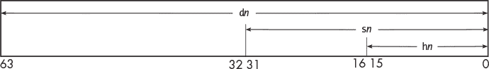

*图 19-3：A64 浮点寄存器名称*

清单 19-7 展示了我们如何使用这些寄存器进行浮点算术运算。

*add_floats.s*

```
// Add two floats.
        .arch armv8-a
// Stack frame
        .equ    x, 16
        .equ    y, 20
        .equ    FRAME, 32
// Constant data
        .section  .rodata
        .align   3
prompt_format:
        .string  "Enter number: "
get_format:
        .string  "%f"
sum_format:
        .string  "%f + %f = %f\n"
// Code
        .text
        .align   2
        .global  main
        .type    main, %function
main:
        stp      fp, lr, [sp, FRAME]!    // Create stack frame
        mov      fp, sp

        adr      x0, prompt_format       // Ask for number
        bl       printf
        add      x1, sp, x               // Place for first number
        adr      x0, get_format          // Get it
     ❶ bl       scanf
        adr      x0, prompt_format       // Ask for number
        bl       printf
        add      x1, sp, y               // Place for second number
        adr      x0, get_format          // Get it
        bl       scanf

     ❷ ldr      s0, [sp, x]              // Load x
        ldr      s1, [sp, y]              //      and y
     ❸ fadd     s2, s0, s1               // Sum
        fcvt     d0, s0                   // Doubles for printf
        fcvt     d1, s1
        fcvt     d2, s2
        adr      x0, sum_format           // Formatting for printf
        bl       printf 
        mov      w0, wzr                  // Return 0
        ldp      fp, lr, [sp], FRAME      // Delete stack frame
        ret
```

*清单 19-7：一个程序用于加法运算两个浮点数*

我们使用 C 标准库中的 `scanf` 函数从键盘读取浮点数 ❶。这会将数字以 32 位 IEEE 754 格式存储在内存中。因此，我们不需要特殊指令将数字加载到浮点寄存器中；我们可以直接使用 `ldr` 指令 ❷。

我们需要使用浮点加法指令 `fadd` 来计算数字 ❸ 的和。我不会列出所有用于执行算术运算的浮点指令，但这里列出了四个基本指令：

##### fadd—浮点加法（标量）

`fadd h`d`, h`s1`, h`s2` 将 `h`s1 和 `h`s2` 中的半精度浮点数相加，并将结果存储在 `h`d 中。

`fadd s`d`, s`s1`, s`s2` 将 `s`s1 和 `s`s2` 中的单精度浮点数相加，并将结果存储在 `s`d 中。

`fadd d`d`, d`s1`, d`s2` 将 `d`s1 和 `d`s2` 中的双精度浮点数相加，并将结果存储在 `d`d 中。

##### fsub—浮点减法（标量）

`fsub h`d`, h`s1`, h`s2` 从 `h`s2 中减去 `h`s1 中的半精度浮点数，并将结果存储在 `h`d 中。

`fsub s`d`, s`s1`, s`s2` 从 `s`s1 中减去 `s`s2 中的单精度浮点数，并将结果存储在 `s`d 中。

`fsub d`d`, d`s1`, d`s2` 从 `d`s1 中减去 `d`s2 中的双精度浮点数，并将结果存储在 `d`d 中。

##### fmul—浮点乘法（标量）

`fmul h`d`, h`s1`, h`s2` 将 `h`s1 和 `h`s2` 中的半精度浮点数相乘，并将结果存储在 `h`d 中。

`fmul s`d`, s`s1`, s`s2` 将 `s`s1 和 `s`s2` 中的单精度浮点数相乘，并将结果存储在 `s`d 中。

`fmul d`d`, d`s1`, d`s2` 将 `d`s1 和 `d`s2` 中的双精度浮点数相乘，并将结果存储在 `d`d 中。

##### fdiv—浮点除法（标量）

`fdiv h`d`, h`s1`, h`s2` 将 `h`s1 中的半精度浮点数除以 `h`s2 中的半精度浮点数，并将结果存储在 `h`d 中。

`fdiv s`d`, s`s1`, s`s2` 将 `s`s1 中的单精度浮点数除以 `s`s2 中的单精度浮点数，并将结果存储在 `s`d 中。

`fdiv d`d`, d`s1`, d`s2` 将 `d`s1 中的双精度浮点数除以 `d`s2 中的双精度浮点数，并将结果存储在 `d`d 中。

`printf` 函数要求浮点数以 `double` 类型传递，因此我们使用 `fcvt` 指令将 `float` 值转换为 `double` 类型。`fcvt` 指令将源寄存器中的浮点格式转换为目标寄存器中的浮点格式：

##### fcvt—浮点精度转换（标量）

`fcvt s`d`, h`s` 将 `h`s 中的半精度浮点数转换为 `s`d 中的单精度浮点数。

`fcvt d`d`, h`s` 将 `h`s 中的半精度浮点数转换为 `d`d 中的双精度浮点数。

`fcvt h`d`, s`s` 将 `s`s 中的单精度浮点数转换为 `h`d 中的半精度浮点数。

`fcvt d`d`, s`s` 将 `s`s 中的单精度浮点数转换为 `d`d 中的双精度浮点数。

`fcvt h`d`, d`s` 将 `d`s 中的双精度浮点数转换为 `h`d 中的半精度浮点数。

`fcvt s`d`, d`s 将`d`s 中的双精度转换为`s`d 中的单精度。

尽管在这个程序中我们没有使用比较操作，但这里有一个浮点数比较指令的例子：

##### fcmp—浮点数比较（标量）

`fcmp h`s1`, h`s2 将`h`s1 中的半精度浮点数与`h`s2 进行比较，并相应地设置`nzcv`寄存器中的条件标志。

`fcmp h`s`, 0.0`将`h`s 中的半精度浮点数与 0.0 进行比较，并相应地设置`nzcv`寄存器中的条件标志。

`fcmp s`s1`, s`s2 将`s`s1 中的单精度浮点数与`s`s2 进行比较，并相应地设置`nzcv`寄存器中的条件标志。

`fcmp s`s`, 0.0`将`s`s 中的单精度浮点数与 0.0 进行比较，并相应地设置`nzcv`寄存器中的条件标志。

`fcmp d`s1`, d`s2 将`d`s1 中的双精度浮点数与`d`s2 进行比较，并相应地设置`nzcv`寄存器中的条件标志。

`fcmp d`s`, 0.0`将`d`s 中的双精度浮点数与 0.0 进行比较，并相应地设置`nzcv`寄存器中的条件标志。

由于`fcmp`指令会设置`nzcv`寄存器中的条件标志，因此我们可以使用第十三章中描述的条件跳转指令，并根据表 13-1 中的条件来根据浮点值控制程序流。

如前所述，浮点计算可能会导致程序中的一些微妙的数值误差。我将在下一节中介绍这些问题。

### **浮点算术误差**

很容易将浮点数视为实数，但它们并非如此。大多数浮点数是它们所表示的实数的四舍五入近似值。在使用浮点算术时，您需要意识到四舍五入对计算的影响。如果不注意四舍五入的影响，您可能无法发现计算中可能出现的误差。

我将在这里讨论的大多数算术误差也可能发生在定点算术中。可能最常见的算术误差是*四舍五入误差*，这种误差可能由两个原因引起：要么存储的比特数有限，要么小数值在所有数字基中无法精确表示。

这两个限制同样适用于定点表示。正如本章前面所提到的，通常可以通过缩放定点数来消除小数值的问题——但是，存储的比特数限制了值的范围。

浮点数表示通过使用指数来指定整数部分的起始位置，减少了范围问题。然而，浮点数的有效数字是一个分数，这意味着大多数浮点数在二进制中没有精确的表示，导致四舍五入误差。

浮点数运算的一个最大问题是，CPU 指令可能会改变一个数字的有效数字，同时调整指数，从而导致位丢失和更多的舍入错误。而在整数运算中，任何位的移动在程序中都是显式的。

在进行整数计算时，你需要注意结果中最重要位上的错误：无符号整数的进位和有符号整数的溢出。而对于浮点数，基数点会被调整以保持最重要位的完整性。浮点数运算中的大多数错误是由于需要将数值适配到分配的比特数中时，低位的舍入产生的。浮点数运算中的错误更为微妙，但它们可能对程序的准确性产生重要影响。

让我们看看在浮点计算中可能出现的不同类型的错误。

#### ***舍入误差***

在本章开始时，你已经看到大多数十进制小数在二进制中没有精确的等价表示，导致存储在内存中的是一个四舍五入的近似值。运行清单 19-7 中的`add_floats`程序可以说明这个问题：

```

$ ./add_floats
Enter number: 123.4
Enter number: 567.8
123.400002 + 567.799988 = 691.199989
```

程序使用的数字并不是我输入的数字，`fadd`指令没有正确地将程序中的数字加在一起。在你返回去查找清单 19-7 中的错误之前，让我们引入调试器，看看能否弄明白发生了什么：

```
--snip--
(gdb) b 43 Breakpoint 1 at 0x7fc: file add_floats.s, line 43.
(gdb) r
Starting program: /home/bob/add_floats_asm/add_floats
Enter number: 123.4
Enter number: 567.8

Breakpoint 1, main () at add_floats.s:42
43              bl      printf
```

我在调用`printf`的地方设置了一个断点，然后运行程序，输入了和之前一样的数字。我们来看一下传递给`printf`的三个值：

```
(gdb) i r d0 d1 d2
d0             {f = 0x7b, u = 0x405ed999a0000000, s = 0x405ed999a0000000}
{f = 123.40000152587891, u = 4638383920075767808, s = 4638383920075767808}
d1             {f = 0x237, u = 0x4081be6660000000, s = 0x4081be6660000000}
{f = 567.79998779296875, u = 4648205637329616896, s = 4648205637329616896}
d2             {f = 0x2b3, u = 0x4085999994000000, s = 0x4085999994000000}
{f = 691.19998931884766, u = 4649291075221979136, s = 4649291075221979136}
(gdb)
```

这个显示可能有点让人困惑。对于每个浮点寄存器，第一个括号中的值是十六进制的。第一个值（`f =`）显示数字的整数部分，格式是十六进制。例如，`d0`中的整数部分是`0x7b` = 123[10]，即我输入的数字的整数部分。接下来的两个值（`u =`和`s =`）显示了整个数字的比特模式，它是以这种方式存储的。我们可以利用这个比特模式结合图 19-2(d)中的格式来推算出浮点数的值。

第二组括号中的值显示的是浮点数的值（`f =`），以及这些比特被解释为无符号整数（`u =`）和有符号整数（`s =`）的值。

如果你仍然对这个显示感到困惑，不要担心。我自己也觉得有点困惑。重要的部分是，显示中展示的每个寄存器中实际存储的浮点数：`d0`中的 123.40000152587891，`d1`中的 567.79998779296875，和`d2`中的 691.19998931884766。运行程序时，`printf`函数将这些数字四舍五入到了小数点后六位。这些值反映了大多数十进制小数在二进制中没有精确等价表示的事实。

#### ***吸收***

*吸收* 发生在加减两个数量级差异较大的数字时。较小的数字的值会在计算中丢失。让我们在 `gdb` 中运行我们的 `add_floats` 程序，看看这种情况是如何发生的：

```
--snip--
(gdb) b 39
Breakpoint 1 at 0x7f0: file add_floats.s, line 39\. 
(gdb) r
Starting program: /home/bob/add_floats_asm/add_floats
Enter number: 16777215.0
Enter number: 0.1

Breakpoint 1, main () at add_floats.s:39
39              fcvt    d0, s0                    // Doubles for printf
(gdb) i r s0 s1 s2
s0             {f = 0xffffff, u = 0x4b7fffff, s = 0x4b7fffff}
{f = 16777215, u = 1266679807, s = 1266679807}
s1             {f = 0x0, u = 0x3dcccccd, s = 0x3dcccccd}
{f = 0.100000001, u = 1036831949, s = 1036831949}
s2             {f = 0xffffff, u = 0x4b7fffff, s = 0x4b7fffff}
{f = 16777215, u = 1266679807, s = 1266679807}
(gdb) c
Continuing.
16777215.000000 + 0.100000 = 16777215.000000
[Inferior 1 (process 2109) exited normally]
(gdb)
```

从 `gdb` 显示中，我们看到寄存器中的值是：

```
s0: 0x4b7fffff
s1: 0x3dcccccd
s2: 0x4b7fffff
```

CPU 在执行加法之前会对数字的二进制点进行对齐。图 19-2(c) 中的模式显示，`fadd` 指令执行了以下加法：

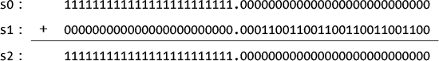

由于单精度浮点数的有效数字为 24 位（其中一个是隐藏位），`s2` 中的数字被四舍五入为 `111111111111111111111111`，因此丢失了二进制点右侧的所有位。`s1` 中的数字被 `s0` 中的更大数字吸收。

#### ***消除***

*消除* 发生在减去两个差距很小的数字时。由于浮点表示法保留了高位部分的完整性，减法将在结果的高位部分得到 0。如果任何一个数字已经被四舍五入，它的低位部分就不再精确，这意味着结果会出错。

为了演示，我们可以使用我们的 `add_floats` 程序通过输入负数来进行减法。这里有一个使用两个接近数字的示例：

```
Enter number: 1677721.5
Enter number: -1677721.4
1677721.500000 + -1677721.375000 = 0.125000
```

从 `gdb` 显示中，我们看到寄存器中的值是：

```
s0: 0x4b7fffff
s1: 0x3dcccccd
s2: 0x4b7fffff
```

这次减法中的相对误差是 (0.125 – 0.1) / 0.1 = 0.25 = 25%。第二个数字从 –1,677,721.4 四舍五入为 –1,677,721.375，这导致了算术错误。

让我们看看这些数字如何作为 `float` 类型处理：

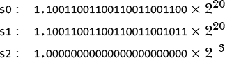

减法导致 `s0` 和 `s1` 中的高位 20 位相消，只留下 `s2` 中的三个有效位。`s1` 中的四舍五入误差传递到 `s2` 中，导致了 `s2` 的错误。

让我们使用两个不会出现四舍五入误差的值：

```
Enter number: 1677721.5
Enter number: -1677721.25
1677721.500000 + -1677721.250000 = 0.250000
```

在这种情况下，三个数字被准确地存储：

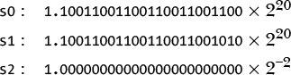

这次减法仍然导致 `s0` 和 `s1` 的高位 20 位相消，并且只留下 `s3` 的三个有效位，但 `s3` 是正确的。

*灾难性消除* 发生在至少有一个浮点数存在四舍五入误差时，这会导致差值中的错误。如果两个数字都被精确存储，则会发生 *良性消除*。这两种类型的消除都会导致结果中的有效位丧失。

#### ***结合性***

浮点错误最具隐蔽性的影响之一是那些导致中间结果出错的错误。它们可能在某些数据集上出现，但在其他数据集上没有。中间结果中的错误甚至可能导致浮点加法不满足结合律——也就是说，对于某些 `float` 类型的值 `x`、`y` 和 `z`，`(x + y) + z` 不等于 `x + (y + z)`。

让我们写一个简单的 C 程序来测试结合性，如 清单 19-8 所示。

*three_floats.c*

```
// Test the associativity of floats.

#include <stdio.h>

int main(void)
{
    float x, y, z, sum1, sum2;

    printf("Enter a number: ");
    scanf("%f", &x);
    printf("Enter a number: ");
    scanf("%f", &y);
    printf("Enter a number: ");
    scanf("%f", &z);

    sum1 = x + y;
    sum1 += z;      // sum1 = (x + y) + z
    sum2 = y + z;
    sum2 += x;      // sum2 = x + (y + z)

    if (sum1 == sum2)
       printf("%f is the same as %f\n", sum1, sum2);
    else
       printf("%f is not the same as %f\n", sum1, sum2);

    return 0;
}
```

*Listing 19-8：一个展示浮点运算不满足结合律的程序*

我们从一些简单的数字开始：

```
$ ./three_floats
Enter a number: 1.0
Enter a number: 2.0
Enter a number: 3.0
6.000000 is the same as 6.000000
$ ./three_floats
Enter a number: 1.1
Enter a number: 1.2
Enter a number: 1.3
3.600000 is not the same as 3.600000
```

看起来我们的程序有一个 bug。让我们使用 `gdb` 看看是否能找出问题所在。我在 `sum1 += z` 语句处设置了一个断点，这样我们就可以查看程序中五个变量的内容，然后我运行了程序：

```
--snip--
(gdb) b 16
Breakpoint 1 at 0x83c: file three_floats.c, line 16.
(gdb) r
Starting program: /home/bob/three_floats/three_floats
Enter a number: 1.1
Enter a number: 1.2
Enter a number: 1.3

Breakpoint 1, main () at three_floats.c:16
16          sum1 += z;      // sum1 = (x + y) + z
```

接下来，我们来确定变量的地址：

```
(gdb) p &x
$1 = (float *) 0x7fffffef94
(gdb) p &y
$2 = (float *) 0x7fffffef90
(gdb) p &z
$3 = (float *) 0x7fffffef8c
(gdb) p &sum1
$4 = (float *) 0x7fffffef9c
(gdb) p &sum2
$5 = (float *) 0x7fffffef98
```

变量存储在从 `z` 开始的五个连续 32 位字中，地址为 `0x7fffffef8c`。我们来查看这五个值，分别以浮点格式和十六进制表示：

```
(gdb) x/5fw 0x7fffffef8c
0x7fffffef8c:   1.29999995           1.20000005       1.10000002       0
0x7fffffef9c:   2.30000019
(gdb) x/5xw 0x7fffffef8c
0x7fffffef8c:   0x3fa66666           0x3f99999a       0x3f8ccccd       0x00000000
0x7fffffef9c:   0x40133334
```

我们将以十六进制的方式处理这些值，来弄清楚发生了什么。根据 图 19-2(c) 中的 IEEE 754 单精度浮点格式，我们得到以下加法：

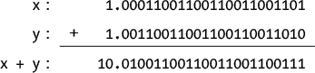

由于该格式仅允许 23 位有效数字，CPU 会对和进行四舍五入，得到以下数字（记住在 第 410 页 中讨论的偶数舍入规则）：


这是我们之前在 `gdb` 显示中看到存储在 `sum1` 地址（`0x7fffffef9c`）中的数字，格式为 IEEE 754。

现在，我们执行当前指令，它将 `z` 加到 `sum1` 上，并查看它的新值：

```
(gdb) n
17          sum2 = y + z;
(gdb) x/1fw 0x7fffffef9c
0x7fffffef9c:   3.60000014
(gdb) x/1xw 0x7fffffef9c
0x7fffffef9c:   0x40666667
```

CPU 执行了以下加法：

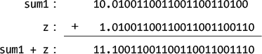

CPU 接着对 `sum1` 进行四舍五入，得到一个 23 位的有效数字：


现在，我们将按照相同的步骤计算 `sum2`：

```
(gdb) n
18          sum2 += x;       // sum2 = x + (y + z)
(gdb) x/1fw 0x7fffffef98
0x7fffffef98:   2.5
(gdb) x/1xw 0x7fffffef98
0x7fffffef98:   0x40200000
```

这里的数字是以下加法的结果：

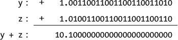

四舍五入后得到：


当前语句加上了 `x`：

```
(gdb) n
20          if (sum1 == sum2)
(gdb) x/1fw 0x7fffffef98
0x7fffffef98:   3.5999999
(gdb) x/1xw 0x7fffffef98
0x7fffffef98:   0x40666666
```

这执行了加法：

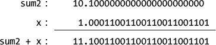

CPU 接着对 `sum2` 进行四舍五入，得到一个 23 位的有效数字（同样，记住偶数舍入规则）：


继续执行程序直到结束，得到：

```
(gdb) c
Continuing.
3.600000 is not the same as 3.600000
[Inferior 1 (process 3107) exited normally]
```

`printf` 函数已经将 `sum1` 和 `sum2` 的显示结果四舍五入，使得它们看起来相等，但通过 `gdb` 查看程序内部会发现它们并不相等。我们得出结论，程序中的 bug 不在于我们的逻辑，而是在于我们使用浮点变量的方式。

两种加法顺序的差异非常小：

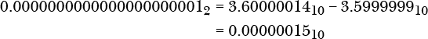

然而，如果这是一个涉及乘以大数的计算，这个小差异可能变得显著。

从这个例子中学到的主要教训是，浮点运算很少是精确的。

**轮到你了**

19.5   修改 Listing 19-8 中的 C 程序，使用 `double` 类型。这样做能使浮点加法满足结合律吗？

### **关于数值精度的评论**

初学者程序员常常将浮动点数视为实数，因此认为它们比整数更准确。确实，使用整数有其自身的问题：即便是加法运算两个大整数也可能导致溢出。乘法运算更容易产生溢出的结果。而且，整数除法会产生两个值——商和余数——而不是浮动点数除法产生的一个值。

但浮动点数并不是实数。正如你在本章中所看到的，浮动点数表示扩展了数值的范围，但也有可能产生不准确的结果。要得到算术上精确的结果，必须对你的算法进行深入分析。以下是一些值得考虑的建议：

+   尝试调整数据，使得可以使用整数运算。

+   使用`double`而不是`float`。这可以提高准确性，并且可能实际提高执行速度。大多数 C 和 C++库函数都接受`double`作为参数，因此当将`float`传递给这些函数时，编译器会将其转换为`double`，就像在 Listing 19-7 中的`printf`调用一样。

+   尝试安排计算顺序，使得相似大小的数字进行加法或减法运算。

+   避免复杂的算术表达式，这些表达式可能会掩盖不正确的中间结果。

+   选择能加剧你算法的问题的测试数据。如果你的程序处理小数值，包含一些没有精确二进制等效的数值。

好消息是，随着今天 64 位计算机的出现，整数的范围已经大大扩展。

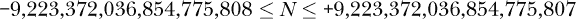

许多编程语言中都有可以使用任意精度算术的库。你可以在*[`en.wikipedia.org/wiki/List_of_arbitrary-precision_arithmetic_software`](https://en.wikipedia.org/wiki/List_of_arbitrary-precision_arithmetic_software)*找到这些库的列表。

本节提供了使用浮动点数时出现数值错误的主要原因概述。欲深入了解这一主题，David Goldberg 的论文《What Every Computer Scientist Should Know About Floating-Point Arithmetic》（《ACM Computing Surveys》，第 23 卷，第 1 期，1991 年 3 月）和*[`en.wikipedia.org/wiki/Floating-point_arithmetic`](https://en.wikipedia.org/wiki/Floating-point_arithmetic)*是不错的起点。若想了解减少舍入误差的编程技巧，你可以阅读关于 Kahan 求和算法的文章，链接是*[`en.wikipedia.org/wiki/Kahan_summation_algorithm`](https://en.wikipedia.org/wiki/Kahan_summation_algorithm)*。

### **你学到了什么**

**二进制表示的小数值** 小数值在二进制中的表示是 2 的倒数幂之和。

**二进制中的定点表示** 二进制点被假定为在数值的二进制表示中的特定位置。

**浮点数不是实数** 浮点数之间的间隔会根据指数的不同而变化。

**浮点通常不如定点精确** 舍入误差通常被浮点格式的标准化掩盖，并可能在多次计算中累积。

**IEEE 754** 计算机程序中表示浮点值的最常见标准。整数部分总是 1。指数指定包含或排除整数部分的位数。

**SIMD 和浮点硬件** 浮点指令在 CPU 中使用单独的寄存器文件。

到目前为止，在本书中，我讨论了按步骤执行指令的程序。但在某些情况下，指令不能与其操作数执行任何有意义的操作——例如，当我们除以 0 时。如本章前面所示，这可能会触发程序执行顺序的异常。我们还可能希望允许外部事件，如使用键盘，来中断正在进行的程序执行。在讨论完输入/输出后，在第二十章中，我将在第二十一章中讲解中断和异常。
