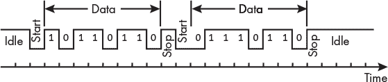

## 第二十章：输入/输出**


*I/O 子系统*是程序用来与外部世界（即 CPU 和内存之外的设备）进行通信的部分。大多数程序从一个或多个输入设备读取数据，处理数据，然后将结果写入一个或多个输出设备。

键盘和鼠标是典型的输入设备；显示屏和打印机是典型的输出设备。虽然大多数人不会这样看待它们，但像磁盘、固态硬盘（SSD）、USB 闪存等设备也是 I/O 设备。

我将从讨论 I/O 设备与内存的时序特性开始，然后介绍这如何影响 CPU 与 I/O 设备之间的接口。

### **时序考虑**

由于 CPU 通过相同的总线访问内存和 I/O 设备（见图 1-1 在第一章中），这可能会让人认为程序可以像访问内存一样访问 I/O 设备。也就是说，你可能会期望通过使用`ldr`和`str`指令在 CPU 和特定的 I/O 设备之间传输字节数据来执行 I/O 操作。这对于许多设备是可以实现的，但为了正确工作，必须考虑一些特殊情况。一个主要的问题是内存和 I/O 之间的时序差异。在处理 I/O 时序之前，让我们先考虑一下内存的时序特性。

**注意**

*正如我指出的，本书中给出的三总线描述显示了 CPU 和 I/O 设备之间的逻辑交互。大多数现代计算机使用多种总线。CPU 如何连接到各种总线由硬件处理。程序员通常只处理逻辑视图。*

#### ***内存时序***

内存的一个重要特性是它的时序相对均匀，并且不依赖于外部事件。这意味着内存时序可以由硬件处理，程序员无需担心；我们可以简单地通过 CPU 指令将数据从内存中移入或移出。

计算机中常用的两种 RAM 类型：

**SRAM**   只要电源开启，它就能保持其值。为了做到这一点，它需要更多的组件，因此成本较高且体积较大，但访问速度非常快。

**DRAM**   使用被动组件，数据值只能保持几分之一秒。DRAM 包括自动刷新数据值的电路，防止值完全丢失。它比 SRAM 便宜，但速度慢 5 到 10 倍。

树莓派的大部分内存是 DRAM，因为它比 SRAM 便宜且体积更小。由于每条指令都必须从内存中提取，慢速的内存访问限制了程序的执行速度。

通过使用由 SRAM 组成的缓存内存系统，可以提高程序执行速度。将 SRAM 缓存与 DRAM 主内存结合使用，有助于确保 CPU 访问内存时最小化时间延迟。

需要注意的是，CPU 的速度仍然比内存速度快（即使是 SRAM）。访问内存——获取指令、加载数据、存储数据——通常是减慢程序执行的最重要因素。有一些技术可以提高缓存性能，从而改善内存访问时间，但采用这些技术需要对你所使用的系统的 CPU 和内存配置有透彻的理解，这超出了本书的范围。

#### ***I/O 设备时序***

几乎所有的 I/O 设备都比内存慢得多。考虑一下常见的输入设备——键盘。以每分钟 120 个字的速度打字，相当于每秒输入大约 10 个字符，或者每个字符之间的延迟大约为∼100 毫秒。在这段时间内，一颗以 2 GHz 运行的 CPU 可以执行约 2 亿条指令。更不用说，按键之间的时间间隔非常不一致，许多按键间隔会远比这个时间长。

即使是 SSD，相对于内存来说也很慢。例如，典型的 SSD 的传输速度大约是 500MB 每秒。而 DDR4 内存（常用于主内存）的传输速度大约是 20GB 每秒，快了约 40 倍。

除了速度远低于内存外，I/O 设备在时序上还表现出更大的波动性。有些人打字很快，有些人打字很慢。磁盘上的数据可能刚好经过读写头，或者可能已经过去，在这种情况下，你将不得不等待磁盘几乎转一圈才能让数据再次出现在读写头下。

正如在第九章开头所指出的，树莓派使用的是一个系统芯片（SoC），它包括一个或多个处理器核心以及许多控制器，用于管理计算机的其他部分。大多数基于 ARM 架构的 SoC 使用的是由 Arm 在 1997 年首次推出的高级微控制器总线架构（AMBA）。该架构定义了几种协议，用于选择适当的速度，以便在 CPU 和 SoC 中其他功能部件之间进行通信。具体细节超出了本书的范围，但如果你有兴趣了解更多关于 AMBA 的内容，可以从* [`www.arm.com/architecture/system-architectures/amba`](https://www.arm.com/architecture/system-architectures/amba) *上的免费在线培训视频入手。

SoC 包含大多数外部 I/O 接口的控制器。除了树莓派 Zero 外，所有树莓派都配备了第二个芯片，提供额外的外部 I/O 接口。树莓派 1、1+、2、3 或 3+上的 I/O 芯片提供以太网和 USB 2.0 端口，并通过 USB 2.0 与 SoC 进行通信。树莓派 4 上的 I/O 芯片提供 USB 2.0 和 USB 3.0 端口，并通过 PCI Express（PCI-E）总线与 SoC 进行通信。

树莓派 5 使用了一款新的 I/O 控制器芯片，名为 *RP1*，它整合了之前 SoC 上的大多数外部 I/O 接口控制器，包括 USB、MIPI 摄像头和显示器、以太网和通用输入输出 (GPIO)。这样的设备通常被称为 *南桥*。RP1 通过 PCI-E 总线与 SoC 进行通信。将较慢的 I/O 功能移至独立的芯片有助于简化 SoC，使其能够更快速地运行，并专注于计算密集型任务。

接下来，我将向你展示如何访问 I/O 设备的寄存器。

### **访问 I/O 设备**

CPU 通过 *设备控制器* 与 I/O 设备进行工作，设备控制器是执行实际控制 I/O 设备工作的硬件。例如，键盘控制器检测按下的是哪个键，并将其转换为代表该键的位模式。它还会检测修饰键，如 SHIFT 或 CTRL 是否被按下，并相应地设置位模式。

设备控制器通过一组寄存器与 CPU 进行接口。通常，设备控制器提供以下类型的 I/O 寄存器：

**数据** 用于将数据发送到输出设备或从输入设备读取数据

**状态** 提供关于设备当前状态的信息，包括控制器本身

**控制** 允许程序向控制器发送命令以更改设备和控制器的设置

设备控制器接口通常会有多个相同类型的寄存器，特别是控制寄存器和状态寄存器。

将数据发送到输出设备很像将数据存储在内存中：你将数据存储在设备控制器的数据寄存器中。输出设备与内存的不同之处在于时机。如我之前所说，程序员在将数据存储到内存时不需要关心时机。然而，输出设备可能未准备好接收新数据——它可能正在处理先前发送的数据。这时，状态寄存器就发挥了作用。程序需要检查状态寄存器，看看设备控制器是否准备好接受新数据。

从输入设备读取数据就像将数据从内存加载到 CPU 中一样：你从设备控制器的数据寄存器中加载数据。与内存的区别在于，输入设备可能没有新数据，因此程序需要检查输入设备控制器的状态寄存器，以查看是否有新数据。

大多数 I/O 设备还需要通过控制寄存器告诉它们该做什么。例如，在等待输出设备控制器准备好接受新数据并将数据移到数据寄存器之后，一些设备控制器要求你告诉它们将数据输出到实际设备。或者，如果你想从输入设备获取数据，一些设备控制器要求你请求它们获取输入。你可以将这些命令发送到控制寄存器。

CPU 可以通过两种方式访问设备控制器上的 I/O 寄存器：通过内存映射 I/O 和端口映射 I/O。使用*内存映射 I/O*时，一段内存地址范围专用于 I/O 端口，每个 I/O 寄存器被映射到该范围内的一个内存地址。然后，使用加载和存储指令来读取或写入设备控制器上的 I/O 寄存器。

使用*端口映射 I/O*时，I/O 设备控制器的寄存器被分配到一个独立的寻址空间。CPU 通过特殊的 I/O 指令与 I/O 寄存器进行通信。

AArch64 架构仅支持内存映射 I/O。x86 架构则是支持两种 I/O 类型的示例。

如果我们首先了解 Linux 和大多数其他操作系统在执行程序时如何管理内存，理解内存映射 I/O 会更容易。程序在*虚拟内存*地址空间中运行，这是一种通过从 0 到最大值的连续寻址模拟大内存的技术。这些就是你在使用`gdb`时看到的地址——例如，`sp`和`pc`寄存器中的地址。

尽管 AArch64 架构允许 64 位寻址，但当前的 CPU 硬件实现仅使用 52 位地址。这使得可以在这个虚拟地址空间中执行程序的最大地址为 2⁵²字节（4 pebibytes）。但是，Raspberry Pi 只有 1 到 8GiB（或吉二进制字节）的*物理内存*，即计算机中安装的实际 RAM，程序需要在物理内存中才能执行。

**注意**

*我们通常使用基于 10 的幂次方的度量命名约定来指定多字节量：千字节、兆字节、千兆字节等。国际电工委员会（IEC）还定义了一种基于 2 的幂次方的命名约定：千二进制字节、兆二进制字节、吉二进制字节等。例如，千字节是 1,000 字节，而千二进制字节是 1,024 字节。你可以在* [`en.wikipedia.org/wiki/Byte`](https://en.wikipedia.org/wiki/Byte) 阅读更多关于命名约定的信息。*

操作系统通过将每个程序划分为*页面*，来管理程序在物理内存中的放置。Raspberry Pi OS 在大多数型号上使用 4KiB（或千二进制字节）页面大小，在 Model 5 上使用 16KiB 页面大小。物理内存被划分为相同大小的*页面框架*。包含当前由 CPU 执行的代码的程序页面会从存储位置（例如磁盘、DVD、USB 闪存驱动器）加载到物理内存的页面框架中。

操作系统维护一个*页表*，显示程序的页面当前在物理内存中的加载位置。图 20-1 使用页表展示了虚拟内存和物理内存之间的关系。


*图 20-1：虚拟内存和物理内存之间的关系*

Raspberry Pi 上使用的 SoC 包括一个*内存管理单元（MMU）*。当 CPU 需要访问内存中的某个项时，它使用该项的虚拟地址。MMU 将虚拟地址作为索引，查找页表中对应的页面，并从中定位到该项。如果请求的页面当前未加载到物理内存中，MMU 会生成一个*页故障异常*，触发操作系统中的一个函数，将该页面加载到物理内存中，并在页表中记录其位置。（你将在第二十一章中学习关于异常的内容。）

页表存储在主内存中，因此使用它需要两次内存访问：一次是从页表中检索框架号，另一次是访问主内存中的位置。为了加速这一过程，MMU 在硬件中包含了*转换后备缓冲区（TLB）*。TLB 是一小部分快速内存，包含了页表中最近使用的条目。就像你在第八章中学到的内存缓存一样，TLB 利用程序在短时间内访问邻近内存地址的趋势来加速内存访问。MMU 首先查看 TLB。如果页表项在其中，那么只需要一次访问主内存。

与虚拟内存映射到物理内存的方式类似，虚拟内存地址也可以映射到 I/O 设备控制器寄存器地址空间。将控制器寄存器与虚拟内存地址关联，使得我们可以使用访问内存的 CPU 指令来访问 I/O 设备控制器寄存器。内存映射 I/O 的一个优点是，通常可以在不使用内联汇编语言的情况下，用更高级的语言如 C 语言编写 I/O 函数。

### **I/O 编程**

根据它们处理的数据量以及处理数据的速度，I/O 设备使用不同的技术与 CPU 进行通信。这些差异反映在设备控制器编程的方式上，用以执行其功能。

当时序不重要时，我们可以简单地使用指令将数据项发送到输出设备，或者在程序中希望输出或输入数据的位置从输入设备读取数据项。这种方式适用于那些不需要时间来处理传输的二进制数据的 I/O 设备。稍后在本章中，你将看到一个使用这种技术的例子，我们将编程一个 I/O 设备，使其在一个输出引脚上输出两个电压水平之一。

大多数 I/O 设备控制器需要相当长的时间来处理输入和输出数据。例如，当我们按下键盘上的某个键时，键盘设备控制器需要检测按下了哪个键，然后将这一信息转换为一个 8 位模式，表示我们按下的字符。如果我们的程序需要这个字符，我们必须首先检查键盘设备控制器的状态寄存器，以确定它是否已经完成了这个过程。如果设备控制器处于就绪状态，我们就可以从设备控制器读取数据。

我们在程序中使用*轮询*算法来实现这一点。轮询通常包括一个循环，在每次循环迭代中检查设备的状态寄存器，直到设备处于就绪状态。当设备控制器准备好时，我们将数据加载到一个通用 CPU 寄存器中。当程序化 I/O 使用轮询算法时，通常称为*轮询 I/O*。

类似地，输出设备控制器可能正在忙于输出前一个数据项。我们的程序需要轮询设备控制器，直到它准备好接受新的输出数据。

轮询 I/O 的缺点是 CPU 可能需要长时间等待设备准备好。这种情况如果 CPU 专门运行一个系统中的程序（例如控制微波炉），可能是可以接受的，但在现代计算的多任务环境中则不可接受。

如果我们能告诉 I/O 设备在准备好进行数据输入或输出时通知我们，并在此期间将 CPU 用于其他任务，我们就能让 CPU 做更多的工作。许多 I/O 设备包括一个*中断控制器*，就是为了这个目的：当设备完成操作或准备好进行另一个操作时，它可以向 CPU 发送一个中断信号。

来自外部设备的中断会导致 CPU 调用*中断处理程序*，即操作系统中处理来自中断设备的输入或输出的函数。这通常被称为*中断驱动 I/O*。我将在第二十一章讨论允许 CPU 调用中断处理程序的特性。

在所有这些技术中，CPU 都是发起数据传输到 I/O 设备控制器或从 I/O 设备控制器传输数据的。我们称之为*程序化 I/O*。

进行高速大数据传输的 I/O 设备通常具备*直接内存访问（DMA）*的能力。它们有一个*DMA 控制器*，可以直接访问主内存而不需要 CPU。例如，在从磁盘读取数据时，DMA 控制器接受一个内存地址和一个读取磁盘数据的命令。当 DMA 控制器将数据从磁盘读取到其自身的缓冲区内存时，它会将数据直接写入主内存。当 DMA 数据传输完成时，控制器向 CPU 发送一个中断，从而调用磁盘中断处理程序，通知操作系统数据已经在内存中可用。

接下来，我们将看一个不需要轮询的输出：一个可以放置为两个电压之一的单个引脚。

### **编程通用 I/O 设备**

*通用输入输出（GPIO）* 是一种信号线，可以配置为输入或输出 1 位数据。它们最初是在集成电路芯片上按组实现的，每条 GPIO 电路的 I/O 线路都连接到芯片上的一个引脚。如今，GPIO 电路通常包含在 SoC 设计中，可以用于点亮 LED、读取开关等。

所有 Raspberry Pi 型号都包括以组方式排列的 GPIO，仍然称为芯片。一个芯片有 28 条线路，连接到位于 Raspberry Pi 主板顶部边缘的 40 引脚的*GPIO 排针*，我们可以使用这些引脚来控制外部 I/O 设备。（原始的 Raspberry Pi 1 配备有一个 26 引脚的 GPIO 排针，连接到 17 条 GPIO 线路。）

在本节中，我将向你展示如何编程一个 GPIO 线路，输出一个单一的比特，使其对应的 GPIO 排针引脚在 0.0 V 和 +3.3 V 之间交替。我们不需要轮询 GPIO 线路来查看它是否准备好进行这个 1 位输出，因为它总是准备好的。我们将利用这些电压交替来闪烁一个 LED。

28 条 GPIO 线路与 40 引脚排针的对应关系显示在 表 20-1 中。

**表 20-1：** GPIO 线路与 Raspberry Pi 排针引脚的对应关系

| 信号 | 排针 | 引脚 | 信号 |
| --- | --- | --- | --- |
| +3.3 V 电源 | 1 | 2 | +5 V 电源 |
| GPIO2 | 3 | 4 | +5 V 电源 |
| GPIO3 | 5 | 6 | 地线 |
| GPIO4 | 7 | 8 | GPIO14 |
| 地线 | 9 | 10 | GPIO15 |
| GPIO17 | 11 | 12 | GPIO18 |
| GPIO27 | 13 | 14 | 地线 |
| GPIO22 | 15 | 16 | GPIO23 |
| +3.3 V 电源 | 17 | 18 | GPIO24 |
| GPIO10 | 19 | 20 | 地线 |
| GPIO9 | 21 | 22 | GPIO25 |
| GPIO11 | 23 | 24 | GPIO8 |
| 地线 | 25 | 26 | GPIO7 |
| GPIO0 | 27 | 28 | GPIO1 |
| GPIO5 | 29 | 30 | 地线 |
| GPIO6 | 31 | 32 | GPIO12 |
| GPIO13 | 33 | 34 | 地线 |
| GPIO19 | 35 | 36 | GPIO16 |
| GPIO26 | 37 | 38 | GPIO20 |
| 地线 | 39 | 40 | GPIO21 |

GPIO 排针的引脚编号假设我们正在向下看 Raspberry Pi 的顶部，排针位于右侧。排针有两排，引脚编号为奇数的在左侧，偶数的在右侧。注意，GPIO 线路的编号与 GPIO 排针的引脚编号并不完全一致。

你还可以在网上查看此信息，访问 *[`www.raspberrypi.com/documentation/computers/raspberry-pi.html#gpio-and-the-40-pin-header`](https://www.raspberrypi.com/documentation/computers/raspberry-pi.html#gpio-and-the-40-pin-header)*，而在 Raspberry Pi 上使用 `pinout` 命令会显示引脚对应信息。

很多 Raspberry Pi 文档将 GPIO 设备的信号称为 GPIO 引脚。为了避免混淆，我将使用*GPIO 线路*来表示信号，使用*GPIO 头引脚*来表示 GPIO 头上的物理连接器。正如你稍后在本章中看到的，这种命名约定与我们将用于编程 GPIO 线路的 `gpiod` 库一致。我们将从连接用于闪烁 LED 的硬件电路开始。

#### ***连接闪烁 LED 电路***

为了跟随这个项目，你需要一个 LED，一个 220 Ω 的电阻，以及几根连接跳线。将电路搭建在面包板上比直接将元件放在桌面或工作台上要简单得多。

在将任何东西连接到 Raspberry Pi 的 GPIO 引脚之前，你应该先关闭设备并切断电源。这些引脚彼此靠得很近，容易不小心将两个引脚短接在一起，这可能会损坏你的 Raspberry Pi。

我们将使用图 20-2 中显示的电路。


*图 20-2：闪烁 LED 的电路*

你在第五章的图 5-3 中看到了电阻的电路符号。上面有两个箭头的三角形是 LED 的电路符号，三个水平线组成的三角形是地（0.0 V）的符号。根据表 20-1 中的信息，我们将通过 GPIO 头的引脚 11 连接到 GPIO17，并通过引脚 9 连接到地。

确保正确连接 LED。图中 LED 的左侧是*阳极*，右侧是*阴极*。LED 的制造商应该提供文档，说明每个引脚的作用。

我们将编写一个程序，使 GPIO17 引脚的电压在 +3.3 V 和 0.0 V 之间交替。在 +3.3 V 时，电流通过电阻和 LED，导致 LED 点亮。220 Ω 的电阻是必须的，它能限制流过的电流量，因为过多的电流可能会损坏 LED。当我们的程序将 GPIO17 引脚切换到 0.0 V 时，电流不再流过 LED，LED 熄灭。

我们先写一个 C 程序，确保电路连接正确。

#### ***用 C 语言让 LED 闪烁，适用于所有型号***

Raspberry Pi OS 提供了两个函数库，允许我们在高级语言中操作 GPIO。`pigpio` 库提供了 C 和 Python 函数，而 `gpiozero` 提供了一个简单的 Python 编程接口。你可以分别在*[`abyz.me.uk/rpi/pigpio/`](https://abyz.me.uk/rpi/pigpio/)*和*[`gpiozero.readthedocs.io/en/stable/`](https://gpiozero.readthedocs.io/en/stable/)*中了解它们。

截至目前，`pigpio` 库在树莓派 5 型上无法使用。我安装了 `gpiod` 包，其中包括一些用于操作 GPIO 的有用命令行工具。它还安装了 `libgpiod` 库，这是官方支持的 GPIO 接口。我已经在我的树莓派 3 型和树莓派 5 型上用 C 和 Python 程序测试了这个库。我使用以下三个命令安装了命令行和开发工具：

```
$ sudo apt install gpiod
$ sudo apt install libgpiod-dev
$ sudo apt install libgpiod-doc
```

**注意**

*在写作时，这将安装库和工具的 1.6.3 版本。开发者已经发布了 2.1.1 版本，但它还未出现在树莓派操作系统的仓库中。当仓库更新时，我预计将添加额外的实用工具，并且库中的某些函数名称可能会发生变化。所有版本的源代码可在* [`git.kernel.org/pub/scm/libs/libgpiod/libgpiod.git`](https://git.kernel.org/pub/scm/libs/libgpiod/libgpiod.git) *找到。*

`gpiod` 包安装了六个用于操作 GPIO 设备的实用程序：`gpiodetect`、`gpiofind`、`gpioget`、`gpioinfo`、`gpiomon` 和 `gpioset`。`libgpiod-doc` 包安装了这些实用工具的手册页面，而 `libgpiod-dev` 包安装了我们将在 C 程序中使用的 `libgpiod` 库的接口。

树莓派操作系统还包含了其他有用的工具，如 `pinout` 和 `pinctrl`。`pinout` 程序有一个手册页面，描述了它的使用方法。`pinctrl help` 命令展示了如何使用 `pinctrl`。我使用 `pinctrl` 来调试用于闪烁 LED 的程序，你将在这里看到它们。

我们将使用 `libgpiod` 库中的函数编写一个 C 程序，该程序展示在 Listing 20-1 中，用于测试电路 Figure 20-2 中的 LED 闪烁。我们版本的库文档可以在 *[`www.lane-fu.com/linuxmirror/libgpiod/doc/html/index.html`](https://www.lane-fu.com/linuxmirror/libgpiod/doc/html/index.html)* 找到。如果你更喜欢使用 Python，请参阅“你的回合” 练习 20.2，它位于 第 460 页。

*blink_led.c*

```
// Blink an LED.
#include <stdio.h>
#include <unistd.h>
#include <gpiod.h>

#define LINE 17                // GPIO line connected to LED
#define OFF 0                  // Pin at 0.0 V
#define ON 1                   // Pin at 3.3 V
#define BLINKS 5               // Number of blinks
#define SECONDS 3              // Time between blinks

int main(void)
{
  ❶  struct gpiod_chip *chip;
      struct gpiod_line *line;
      int i;
      int error; 
  ❷  chip = gpiod_chip_open("/dev/gpiochip0");  // On RPi 5 use /dev/gpiochip4
      if(!chip) {
           puts("Cannot open chip");
           return -1;
  }

       line = gpiod_chip_get_line(chip, LINE);
       if(line == NULL) {
            gpiod_chip_close(chip);
            puts("Cannot get GPIO line");
            return -1;
       }
       error = gpiod_line_request_output(line, "example", 0);
       if(error == -1) {
            gpiod_line_release(line);
            gpiod_chip_close(chip);
            puts("Cannot set GPIO output");
            return -1;
       }

       for (i = 0; i < BLINKS; i++) {
        ❸  gpiod_line_set_value(line, ON);
            printf("led on...\n");
            sleep(SECONDS);
            gpiod_line_set_value(line, OFF);
            printf("...led off\n");
            sleep(SECONDS);
       }
       gpiod_line_release(line);
       gpiod_chip_close(chip);

       return 0;
}
```

*Listing 20-1: 使用 GPIO 闪烁 LED 的 C 程序*

在编译这个文件时，我们需要在命令的末尾显式指定 `libgpiod` 库，如下所示：

```
$ gcc -g -Wall -o blink_led blink_led.c -lgpiod
```

`struct gpiod_chip` 和 `struct gpiod_line` 都在 *gpiod.h* 头文件 ❶ 中声明，如下所示：

```
struct gpiod_chip;
struct gpiod_line;
```

这种 C 语法是一种定义 `chip` 和 `line` 指针变量为存储地址的方式。

树莓派有多个 GPIO 芯片。GPIO 芯片 0 连接到 3 型和 4 型模型的 GPIO 头引脚；GPIO 芯片 4 连接到树莓派 5 型的 GPIO 头引脚，所以如果你使用的是该模型，需要将 `gpiochip0` 改为 `gpiochip4` ❷。

一旦 GPIO 行被配置为输出，我们就可以开关该位以闪烁 LED ❸。

接下来，让我们看看如何使用汇编语言来闪烁 LED。

**注意**

*我们将使用的汇编语言代码并不完善。它旨在提供一个关于如何编程 I/O 设备的概述。如果你想使用 GPIO 控制外部设备，我建议使用* libgpiod *库中的函数。它与操作系统集成，提供 GPIO 的稳健功能。*

#### ***用汇编语言闪烁 LED，适用于 3 型板和 4 型板***

每个 GPIO 设备线路的功能是通过六个 32 位寄存器来选择的，这些寄存器命名为 GPFSEL0 到 GPFSEL5。三个位用于选择 GPIO 设备线路的功能。寄存器 GPFSEL0 到 GPFSEL4 每个选择 10 条线路的功能，剩下 2 个未使用的位。对于 3 型板，GPFSEL5 寄存器选择 4 条线路的功能，留下 20 个未使用的位；而在 4 型板上，GPFSEL5 寄存器选择 8 条线路的功能，留下 8 个未使用的位。

我建议下载你的 Raspberry Pi 数据手册——对于 3 型板，请参考 Broadcom BCM2835 SoC 数据手册，地址为* [`datasheets.raspberrypi.com/bcm2835/bcm2835-peripherals.pdf`](https://datasheets.raspberrypi.com/bcm2835/bcm2835-peripherals.pdf) *，而对于 4 型板，请参考 Broadcom BCM-2711 SoC 数据手册，地址为* [`datasheets.raspberrypi.com/bcm2711/bcm2711-peripherals.pdf`](https://datasheets.raspberrypi.com/bcm2711/bcm2711-peripherals.pdf) *，以便在阅读本节时作为参考。阅读数据手册并不容易，但在此处的解释与适用型号的数据手册之间来回查阅，应该有助于你学会如何阅读它。

请注意，我只在我的 Raspberry Pi 3 上测试了此程序。Raspberry Pi 4 的数据手册显示 GPIO 寄存器与 3 型板相同，因此此代码也应该适用于 4 型板。

清单 20-2 显示了我们的汇编语言程序来闪烁 LED。

*blink_led.s*

```
// Blink an LED connected to GPIO line 17 every three seconds.

// Define your RPi model: 0, 1, 2, 3, 4, 5
    ❶ .equ    RPI_MODEL, 3
// Useful constants
        .equ    N_BLINKS, 5               // Number of times to blink
        .equ    DELTA_TIME, 3             // Seconds between blinks
        .equ    GPIO_LINE, 17             // Line number
// The following are defined in /usr/include/asm-generic/fcntl.h.
// Note that the values are specified in octal.
        .equ    O_RDWR, 00000002          // Open for read/write
        .equ    O_SYNC, 04010000          // Complete writes in hardware
// The following are defined in /usr/include/asm-generic/mman-common.h.
        .equ    PROT_READ, 0x1            // Page can be read
        .equ    PROT_WRITE, 0x2           // Page can be written
        .equ    MAP_SHARED, 0x01          // Share changes
// Beginning address of peripherals
 ❷ .if     (RPI_MODEL == 0) || (RPI_MODEL == 1)
        .equ    PERIPHS, 0x20000000 >> 16 // RPi 0 or 1
    .elseif (RPI_MODEL == 2) || (RPI_MODEL == 3)
        .equ    PERIPHS, 0x3f000000 >> 16 // RPi 2 or 3
    .elseif RPI_MODEL == 4
        .equ    PERIPHS, 0x7e000000 >> 16 // RPi 4
    .else
        .equ    PERIPHS, 0x1f00000000 >> 16   // RPi 5
    .endif
// Offset to GPIO registers
    .if     RPI_MODEL != 5
        .equ    GPIO_OFFSET, 0x200000     // Other RPi models
    .else
        .equ    GPIO_OFFSET, 0xd0000      // RPi 5
    .endif
// Amount of memory to map and flags
        .equ    MEM_SIZE, 0x400000        // Enough to include all GPIO regs
     ❸ .equ    OPEN_FLAGS, O_RDWR | O_SYNC   // Open file flags
        .equ    PROT_RDWR, PROT_READ | PROT_WRITE   // Allow read and write
        .equ    NO_ADDR_PREF, 0           // Let OS choose address of mapping

// Stack frame
        .equ    save1920, 16              // Save regs
        .equ    save21, 32
        .equ    FRAME, 48
// Constant data
        .section .rodata
        .align  2
dev_mem:
        .asciz  "/dev/mem"
err_msg:
        .asciz  "Cannot map I/O memory.\n"
on_msg:
        .asciz  "led on...\n"
off_msg:
        .asciz  "...led off\n"

// Code
        .text
        .align  2
        .global main
        .type   main, %function
main:
        stp     fp, lr, [sp, -FRAME]!     // Create stack frame
        mov     fp, sp                    // Set our frame pointer
        stp     x19, x20, [sp, save1920]  // Save regs
        str     x21, [sp, save21]

// Open /dev/mem for read/write and syncing.
        mov     w1, OPEN_FLAGS & 0xffff   // Move 32-bit flags
        movk    w1, OPEN_FLAGS / 0xffff, lsl 16
        adr     x0, dev_mem               // I/O device memory
     ❹ bl      open
        cmp     w0, -1                    // Check for error
        b.eq    error_return              // End if error
        mov     w19, w0                   // /dev/mem file descriptor

// Map the GPIO registers to a main memory location so we can access them.
        movz    x5, PERIPHS & 0xffff, lsl 16
        movk    x5, PERIPHS / 0xffff, lsl 32
        mov     w4, w19                   // File descriptor
        mov     w3, MAP_SHARED            // Share with other processes
        mov     w2, PROT_RDWR             // Read/write this memory
        mov     w1, MEM_SIZE              // Amount of memory needed
        mov     w0, NO_ADDR_PREF          // Let kernel pick memory
     ❺ bl      mmap
        cmp     x0, -1                    // Check for error
        b.eq    error_return              // w0 also = -1, end function
        mov     x20, x0                   // Save mapped address
        mov     w0, w19                   // /dev/mem file descriptor
        bl      close                     // Close /dev/mem file

// Make the line an output.
        mov     x0, x20                   // Get mapped memory address
        add    x0, x0, GPIO_OFFSET        // Start of GPIO registers
        mov     w1, GPIO_LINE
 ❻ .if     RPI_MODEL != 5
        bl      gpio_line_to_output
    .else
        bl      gpio_5_line_to_output
    .endif
        mov     x21, x0                   // Pointer to register base

// Turn the line on and off.
        mov     x19, N_BLINKS             // Number of times to do it
loop:
        adr     x0, on_msg                // Tell user it's on
        bl      write_str
 mov     w1, GPIO_LINE             // GPIO line number
        mov     x0, x21                   // Pointer to register base
 ❼ .if     RPI_MODEL != 5
        bl      gpio_line_set             // Turn LED on
    .else
        bl      gpio_5_line_set           // Turn LED on
    .endif
        mov     w0, DELTA_TIME            // Wait
        bl      sleep

        adr     x0, off_msg               // Tell user it's off
        bl      write_str
        mov     w1, GPIO_LINE             // GPIO line number
        mov     x0, x21                   // Pointer to register base
 ❽ .if     RPI_MODEL != 5
        bl      gpio_line_clr             // Turn LED off
    .else
        bl      gpio_5_line_clr           // Turn LED off
    .endif
        mov     w0, DELTA_TIME            // Wait
        bl      sleep

        subs    x19, x19, 1               // Decrement loop counter
        b.gt    loop                      // Loop if > 0

        mov     x0, x20                   // Our mapped memory
        mov     w1, MEM_SIZE              // Amount we mapped for GPIO
     ❾ bl      munmap                    // Unmap it
        mov     w0, wzr                   // Return 0
error_return:
        ldr     x21, [sp, save21]         // Restore regs
        ldp     x19, x20, [sp, save1920]
        ldp     fp, lr, [sp], FRAME       // Delete stack frame
        ret
```

*清单 20-2：一个使用 GPIO 闪烁 LED 的汇编语言程序*

清单 20-1 中的 C 程序使用了操作系统提供的库函数来控制 GPIO 线路。我们在 清单 20-2 中的汇编语言程序直接访问 GPIO 寄存器。操作系统仅允许拥有 root 权限的用户执行此操作，因此我们需要使用 `sudo` 来运行该程序，如下所示：

```
$ sudo ./blink_led
```

Linux 将 I/O 设备视为文件。它们按名称列出在 */dev* 目录中。*/dev/mem* 文件是主内存的映像。该文件中的地址表示物理内存地址。使用 `open` 系统调用函数打开文件将允许我们访问 I/O 设备的物理内存 ❹。它的手册页为我们提供了 `open` 函数的原型：

```
int open(const char *pathname, int flags);
```

路径名是要打开的文件或设备的完整路径和名称。手册页列出了必须传递给 `open` 函数的标志名称，以指定调用函数如何访问它。

每个标志的数值可以在头文件*/usr/include/asm-generic/fcntl.h*中找到。头文件是用 C 语言编写的，因此我们不能使用`.include`指令将其添加到我们的汇编语言源代码中。我使用了`.equ`指令来定义`open`函数中所需的标志。汇编器支持对文字值进行算术和逻辑运算。我们使用 OR 运算符（`|`）将所需的不同标志组合成一个单一的 32 位整数，作为 flags 参数❸。

操作系统阻止应用程序直接访问 I/O 内存地址空间。我们需要告诉操作系统将 GPIO 内存地址空间映射到应用程序内存地址空间，这样我们就可以在应用程序中访问 GPIO 寄存器。

I/O 外设地址空间的起始位置取决于 Raspberry Pi 型号。GNU 汇编器有一些指令，可以让我们选择要在汇编中包含哪些代码行。我们使用`.if`指令以及一系列`.elseif`指令，根据我们使用的型号选择`PERIPHS`的值❷。使用`.if`指令和`.else`指令可以选择 GPIO 寄存器相对于 I/O 外设起始地址的正确偏移量。一个单独的`.equ`指令设置`RPI_MODEL`，以控制这些*条件汇编*指令❶。不要忘记在每个`.if`构造后用`.endif`指令结束。

我们使用 POSIX 标准中指定的`mmap`系统调用函数，将 GPIO 寄存器映射到应用程序内存中❺。它的手册页为该函数提供了原型：

```
void *mmap(void addr[.length], size_t length, int prot,
          int flags int fd, off_t offset);
```

如果`addr`是`0`，操作系统将为映射选择应用程序的内存地址。长度是我们需要的字节数，用于设备上的所有寄存器。该映射将使用整页的数量。我选择了 4MB，以确保我们包含所有用于编程 GPIO 的 I/O 寄存器，适用于所有 Raspberry Pi 型号。

`mmap`的手册页列出了必须传递给函数的 prot 值，用于指定调用函数如何访问它。手册页还列出了 flags 的值，指定操作系统如何处理访问。

每个 prot 和 flag 的数值可以在头文件*/usr/include/asm-generic/mman-common.h*中找到。头文件也是用 C 语言编写的，因此我使用了`.equ`指令来定义该函数中所需的 prot 和 flags。

在调用`open`和`mmap`函数以通过应用程序内存使 GPIO 寄存器可访问之后，我们使用`close`函数释放文件描述符。GPIO 寄存器仍然对我们的应用程序可访问。

现在我们可以通过应用内存寻址访问 GPIO 上的 I/O 寄存器，我们将 GPIO 引脚配置为输出。如下一节所示，执行此操作的方法对于 Raspberry Pi 5 是不同的 ❻。设置 GPIO 为输出后，我们进入一个循环，其中交替打开和关闭 LED。对于 Raspberry Pi 5，使用的是不同的方法 ❼ ❽。我们使用 `unistd` 库中的 `sleep` 函数将 LED 保持在开或关状态几秒钟。

尽管程序在结束时会释放我们用于 GPIO 寄存器的应用内存，但在程序不再需要时调用 `munmap` 函数释放内存仍然是一个好习惯 ❾。

将 GPIO 引脚指定为输出可以使用 Listing 20-3 中显示的函数。

*gpio_line_to_output.s*

```
// Make a GPIO line an output. Assume that GPIO registers
// have been mapped to application memory.
// Calling sequence:
//      x0 <- address of GPIO in mapped memory
//      w1 <- GPIO line number
//      Return address of GPIO.

// Useful constants
        .equ    FIELD_MASK, 0b111  // 3 bits
        .equ    OUTPUT, 1          // Use line for output

// Code
        .text
        .align  2
        .global gpio_line_to_output
        .type   gpio_line_to_output, %function
gpio_line_to_output:
// Determine register and location of line function field.
        mov     w3, 10              // 10 fields per GPFSEL register
     ❶ udiv    w4, w1, w3          // GPFSEL register number
     ❷ msub    w5, w4, w3, w1      // Relative FSEL number in register
// Compute address of GPFSEL register and line field in register.
     ❸ lsl     w4, w4, 2           // Offset to GPFSEL register
        add     x7, x0, x4          // GPFSELn memory address
        ldr     w4, [x7]            // GPFSELn register contents

     ❹ add     w5, w5, w5, lsl 1   // 3 X relative FSEL number
        mov     w6, FIELD_MASK      // FSEL line field
 lsl     w6, w6, w5          // Shift to relative FSEL bit position
     ❺ bic     w4, w4, w6          // Clear current FSEL

        mov     w2, OUTPUT          // Function = output
     ❻ lsl     w2, w2, w5          // Shift function code to FSEL position
        orr     w4, w4, w2          // Insert function code
        str     w4, [x7]            // Update GPFSEL register

        ret
```

*Listing 20-3: 在大多数 Raspberry Pi 型号中将 GPIO 引脚设置为输出*

GPIO 有六个 32 位的功能选择寄存器，分别为 GPFSEL0 到 GPFSEL5。每个寄存器被划分为 10 个 3 位字段，命名为 FSEL*n*，其中 *n* = 0、1、...、57。GPFSEL0 中的第 2 到第 0 位为 FSEL0 字段，第 5 到第 3 位为 FSEL1 字段，以此类推，直到 GPFSEL5 中的第 23 到第 21 位为 FSEL57 字段。GPFSEL0 到 GPFSEL4 中的第 31 和第 30 位，以及 GPFSEL5 中的第 31 到第 24 位未使用。所有引脚都可以配置为输入 `000`，或输出 `001`。某些引脚可以配置为其他功能；FSEL*n* 指定了 GPIO 引脚 *n* 的功能。

将 GPIO 引脚编号除以 10 可以得到 GPFSEL 寄存器的编号 ❶。除法的余数给出了寄存器中 FSEL 字段的编号 ❷。例如，我们的程序使用 GPIO 引脚 17，并且其功能由 GPFSEL1 寄存器中的第七个 FSEL 字段控制。

GPFSEL 寄存器位于 GPIO 内存的开始位置，因此将 GPFSEL 寄存器编号乘以 4 可以得到该寄存器的内存地址偏移量 ❸。每个 FSEL 字段为 3 位，因此我们将 FSEL 编号乘以 3 来得到 GPFSEL 寄存器中的相对位位置 ❹。

我们需要确保不更改 GPFSEL 寄存器中的其他 FSEL 字段。在将 GPFSEL 寄存器的副本加载到 CPU 寄存器中后，我们使用一个 3 位掩码，通过 `bic` 指令清除我们的 FSEL 字段 ❺：

##### `bic` — 位清除

`bic w`d`, w`s1`, w`s2`{,`shft amnt`}` 对 `w`s1` 和 `w`s2` 进行按位与运算，操作前可以选用偏移量 amnt 位，结果存储在 `w`d 中。shft 可以是 `lsl`、`lsr`，偏移量范围是 `0` 到 `31`。默认情况下没有偏移。

`bic x`d`, x`s1`, x`s2`{,`shft amnt`}` 对 `x`s1` 和 `x`s2` 进行按位与运算，操作前可以选用偏移量 amnt 位，结果存储在 `x`d 中。shft 可以是 `lsl`、`lsr`、`asr` 或 `ror`。amnt 可以是 `0` 到 `63`。默认情况下没有偏移。

接下来，我们将功能代码移至 GPFSEL 寄存器中的 FSEL 字段位置，使用`orr`指令插入功能代码，并更新映射的 GPIO 内存❻。

**注意**

*虽然我们已将 GPIO 寄存器映射到应用程序内存地址中，但我们无法直接通过* gdb *检查这些寄存器的内容，因为它使用与*mmap*函数不同的技术来访问内存地址。在第 460 页的“Your Turn”练习 20.3 中，我会向你展示另一种在*gdb*中检查寄存器内容的方法。*

现在我们已经将 GPIO 线路设置为 1 位输出设备，可以控制它输出的电压。该线路始终准备好接受我们更改电压的操作，因此我们不需要检查其状态。我们将使用`gpio_line_set`函数在示例 20-4 中设置该线路，将其设为+3.3 V。

*gpio_line_set.s*

```
// Set a GPIO line. Assume that GPIO registers
// have been mapped to application memory.
// Calling sequence:
//       x0 <- address of GPIO in mapped memory
//       w1 <- line number

// Constants
     ❶ .equ    GPSET0, 0x1c     // GPSET register offset

// Code
        .text
        .align  2
        .global gpio_line_set
        .type   gpio_line_set, %function
gpio_line_set:
        add     x0, x0, GPSET0  // Address of GPSET0 register
        mov     w2, 1           // Need a 1
     ❷ lsl     w2, w2, w1      // Move to specified bit position
        str     w2, [x0]        // Output

        ret
```

*示例 20-4：在大多数树莓派模型中设置 GPIO 线路*

GPIO 有两个 32 位输出设置寄存器，GPSET0 和 GPSET1。GPSET0 寄存器位于 GPIO 内存开始的`0x1c`字节处❶。紧接着是 GPSET1 寄存器，位于`0x20`。GPSET0 中的 31 至 0 位控制 31 至 0 号线路，GPSET1 中的 21 至 0 位控制 53 至 32 号线路。GPIO 头针仅连接到 27 至 0 号 GPIO 线路，因此此功能仅适用于 GPSET0。

GPSET 寄存器是只写的。与 GPFSEL 寄存器不同，我们不会加载 GPSET 寄存器的内容；我们只需将`1`移至与我们用作输出的线路相对应的位位置，并通过`str`指令设置该线路，将+3.3 V 放置在线路上❷。将`0`写入位位置没有效果。

当我们想将线路的输出更改为 0.0 V 时，我们会清除该线路，如示例 20-5 所示。

*gpio_line_clr.s*

```
// Clear GPIO line. Assume that GPIO registers
// have been mapped to application memory.
// Calling sequence:
//       x0 <- address of GPIO in mapped memory
//       w1 <- line number

// Constants
     ❶ .equ    GPCLR0, 0x28    // GPCLR register offset

// Code
        .text
        .align  2
        .global gpio_line_clr
        .type   gpio_line_clr, %function
gpio_line_clr:
        add     x0, x0, GPCLR0  // Address of GPCLR0 register
        mov     w2, 1           // Need a 1
        lsl     w2, w2, w1      // Move to specified bit position
        str     w2, [x0]        // Output

        ret
```

*示例 20-5：在大多数树莓派模型中清除 GPIO 线路*

与设置寄存器类似，GPIO 还有两个 32 位输出清除寄存器，GPCLR0 和 GPCLR1。GPCLR0 位于 GPSET0 之后 12 字节❶。它们的编程方式与 GPSET 寄存器相同，不同之处在于，将`1`存储到与所选输出线路对应的位位置会清除该线路，将线路置为 0.0 V。

接下来，我们将看看如何在树莓派 5 上闪烁 LED，它使用与 GPIO 的编程接口非常不同的方式。

#### ***在汇编语言中闪烁 LED，树莓派 5 模型***

示例 20-2 中的`main`函数设计用于树莓派 5，只需将`RPI_MODEL`更改为`5`。条件汇编指令将选择适当的值和函数调用。但控制 GPIO 的方法不同。让我们看看在树莓派 5 上是如何实现的。

Raspberry Pi 5 上的 GPIO 电路位于 RP1 芯片上。截止目前文档还不完整，但可以找到初步草案《RP1 外设》（2023 年 11 月）在 *[`datasheets.raspberrypi.com/rp1/rp1-peripherals.pdf`](https://datasheets.raspberrypi.com/rp1/rp1-peripherals.pdf)*。

在 Raspberry Pi 5 上将 GPIO 引脚设置为输出与其他型号不同。 列表 20-6 显示了我们执行此操作的函数。

*gpio_5_line_to_output.s*

```
// Make a GPIO line an output. Assume that GPIO registers
// have been mapped to application memory.
// Calling sequence:
//      x0 <- address of GPIO in mapped memory
//      w1 <- GPIO line number
//      Return address of RIOBase.

// Constants
        .equ    RIOBase, 0x10000  // Offset to RIO registers
        .equ    PADBase, 0x20000  // Offset to PAD registers
        .equ    SYS_RIO, 5        // Use RIO to control GPIO
        .equ    PAD_AMPS, 0x10    // 4 mA
        .equ    RIO_SET, 0x2000   // Set reg offset
        .equ    RIO_OE, 0x04      // Output enable

// Code
        .text
        .align  2
        .global gpio_5_line_to_output
        .type   gpio_5_line_to_output, %function
gpio_5_line_to_output:
     ❶ lsl    x2, x1, 3         // 8 x line number
        add    x3, x0, x2        // GPIO_line_number_STATUS
        mov    w2, SYS_RIO       // System registered I/O
     ❷ str    w2, [x3, 4]       // GPIO_line_number_CTRL

        add    x2, x0, PADBase
        add    x2, x2, 4         // Skip over VOLTAGE_SELECT reg
        lsl    x3, x1, 2         // 4 x line number
        add    x3, x3, x2        // Pad reg address of line number
        mov    w4, PAD_AMPS      // 4 mA
     ❸ str    w4, [x3]          // Set pad amps

        add    x0, x0, RIOBase
        mov    w2, 1             // A bit
        lsl    w2, w2, w1        // Shift to line location
        add    x3, x0, RIO_SET   // Use RIO set register
     ❹ str    w2, [x3, RIO_OE]  // Make line an output

        ret
```

*列表 20-6：在 Raspberry Pi 5 上将 GPIO 引脚设置为输出的函数*

Raspberry Pi 5 GPIO 设备有 28 对寄存器，分别称为 GPIO0_STATUS、GPIO0_CTRL、GPIO1_STATUS、GPIO1_CTRL 直到 GPIO27_STATUS 和 GPIO27_CTRL。与 GPIO 引脚 *n* 对应的 GPIO*n*_CTRL 寄存器的地址偏移量为 8 × *n* ❶。位 4 到 0 设置功能。

RP1 提供了一组*注册 I/O (RIO)* 寄存器，用于控制 GPIO 引脚。要使用 RIO 接口，我们将 `SYS_RIO` 函数存储到 GPIO 控制寄存器中 ❷。

GPIO 引脚的输出电路称为*垫片*。我们可以通过几种方式设置输出垫片的特性——例如，设置为 2、4、8 或 12 毫安。我们将其设置为 4 毫安，以使 LED 闪烁 ❸。我们通过将其配置为输出设备来完成 GPIO 引脚的设置 ❹。

现在，我们已经将 GPIO 引脚设置为 1 位输出设备，可以控制它输出的电压。GPIO 的 RIO 接口有四个寄存器用于控制引脚。表 20-2 显示了每个寄存器与 RIO 基址的偏移量。

**表 20-2：** RIO 寄存器偏移量

| 偏移量 | 操作 |
| --- | --- |
| `0x0000` | 正常读/写 |
| `0x1000` | 写入时执行 XOR |
| `0x2000` | 写入时设置位掩码 |
| `0x3000` | 写入时清除位掩码 |

每个寄存器中的位 *n* 对应于 GPIO*n* 引脚。将一个字存储到这些寄存器中的一个会导致对 GPIO 引脚进行相应操作。位掩码设置或清除意味着只有位为 `1` 的部分作用于对应的 GPIO 引脚。位位置上的 `0` 对应的 GPIO 引脚没有影响。分开的设置和清除寄存器意味着我们不需要读取寄存器内容，进行更改后再写回结果。

配置为输出的 GPIO 引脚始终准备好让我们更改电压，因此我们无需检查其状态。我们将使用 列表 20-7 中的 `gpio_5_line_set` 函数来设置该引脚，从而将其设置为 +3.3 V。

*gpio_5_line_set.s*

```
// Set GPIO line. Assume that GPIO registers
// have been mapped to programming memory.
// Calling sequence:
//       x0 <- address of RIOBase in mapped memory
//       w1 <- line number

// Constants
     ❶ .equ    RIO_SET, 0x2000     // Set reg

// Code
        .text
        .align  2
 .global gpio_5_line_set
        .type   gpio_5_line_set, %function
gpio_5_line_set:
        mov     w2, 1               // A bit
     ❷ lsl     w2, w2, w1          // Shift to line location
        add     x0, x0, RIO_SET     // Address of RIO set reg
        str     w2, [x0]            // Line low
        ret
```

*列表 20-7：在 Raspberry Pi 5 上设置 GPIO 引脚的函数*

我们将`1`移到与我们的引脚号对应的位位置 ❷。然后，我们将这个字存储到 RIO 设置寄存器中，从而将 GPIO 引脚设置为高电压 ❶。

清除引脚的算法与设置引脚的算法相同，如 列表 20-8 所示。

*gpio_5_line_clr.s*

```
// Clear a GPIO line. Assume that GPIO registers
// have been mapped to programming memory.
// Calling sequence:
//       x0 <- address of RIOBase in mapped memory
//       w1 <- line number

// Constants
     ❶ .equ    RIO_CLR, 0x3000     // Clear reg

// Code
        .text
        .align  2
        .global gpio_5_line_clr
        .type   gpio_5_line_clr, %function
gpio_5_line_clr:
        mov     w2, 1               // A bit
        lsl     w2, w2, w1          // Shift to line location
        add     x0, x0, RIO_CLR     // Address of RIO clear reg
        str     w2, [x0]            // Line low
        ret
```

*列表 20-8：在 Raspberry Pi 5 上清除 GPIO 引脚的函数*

`gpio_line_clr`函数唯一的区别在于我们使用 RIO 清除寄存器将 GPIO 线路设置为低电压❶。

闪烁 LED 是一个非常简单的输出操作示例。我们不需要检查线路是否准备好让我们打开或关闭它；我们只需要发送命令给设备。大多数 I/O 操作并不像这样简单。它需要一些时间来形成要在屏幕上显示的图像，或者将键盘上的按键转换为比特模式。

在下一节中，我将为你提供一个总体概述，说明我们的程序代码如何处理这些定时问题。

**该轮到你了**

20.1   当 LED 开启时，其典型电压降为 2 到 3 伏，具体取决于 LED 的颜色。计算当 LED 开启时，图 20-2 中的电路中预计流经 LED 的电流。

20.2   编写一个 Python 程序，每三秒钟闪烁一次 LED，闪烁五次。可以参考*[`www.raspberrypi.com/documentation/computers/os.html#use-gpio-from-python`](https://www.raspberrypi.com/documentation/computers/os.html#use-gpio-from-python)*获取有关如何实现的提示。

20.3   修改清单 20-2 中的`main`函数，使其交替闪烁连接到 GPIO 线 16 和 17 的 LED。如果你使用的是除了 5 号之外的树莓派型号，请在`gdb`中运行程序，并在`gpio_line_to_output`函数中设置断点，这样你就可以看到适当的函数代码存储在 GPFSEL0 寄存器中。如果你在`gpio_line_to_output`函数的`ret`指令之前添加一条`ldr w7, [x0]`指令，你可以更清楚地看到这一点。程序员有时会添加这样的代码用于调试，通常在最终产品中会删除这些代码。

20.4   修改汇编语言的 LED 闪烁程序，使 LED 每 0.5 秒闪烁一次。你需要使用`usleep`函数。此函数的整数参数是需要睡眠的微秒数。

20.5   如果你使用的是树莓派 5，编写一个汇编语言程序，使用单个`gpio_5_line_toggle`函数开关 LED 五次，而不是使用`gpio_5_line_set`和`gpio_5_line_clr`函数。

### **轮询输入/输出编程算法**

让我们来看一些简单的轮询算法，展示如何为 I/O 编程一个*通用异步接收器/发射器（UART）*。

当 UART 作为输出设备使用时，它执行并行到串行转换，一次传输一个字节的数据位。作为输入设备时，UART 一次接收一个比特，并执行串行到并行转换，以重新组装传输给它的字节。因此，一个 8 位字节可以通过仅使用三条线路（传输、接收和公共线路）进行传输和接收。传输和接收的 UART 必须设置为相同的比特率。

在空闲状态下，发送 UART 将高电压置于传输线上。当程序输出一个字节到 UART 时，发送 UART 首先发送一个*起始位*；它通过将传输线置于低电压，持续传输一个比特的时间，这个时间对应于约定的比特率。

在起始位之后，发送器按约定的比特率发送数据位。UART 使用移位寄存器一次移位一个比特，并相应地设置输出线路上的电压。大多数 UART 从低位比特开始。当整个字节发送完成后，UART 将输出线路恢复为空闲状态，至少持续 1 个比特时间，从而发送至少一个*停止位*。

图 20-3 展示了一个典型设置的 UART 如何发送 ASCII 编码的两个字符*m*和*n*。



*图 20-3：UART 输出以发送字符* m *和* n

接收 UART 监视传输线，寻找起始位。当它检测到起始位时，它使用移位寄存器将单个比特重新组装成一个字节，并将其作为输入提供给接收程序。

我们将使用常见类型的 16550 UART 作为我们的编程示例。16550 UART 有 13 个 8 位寄存器，如表 20-3 所示。

**表 20-3：** 16550 UART 的寄存器

| 名称 | 地址 | DLAB | 目的 |
| --- | --- | --- | --- |
| `RHR` | `000` | `0` | 接收保持寄存器（输入字节） |
| `THR` | `000` | `0` | 发送保持寄存器（输出字节） |
| `IER` | `001` | `0` | 中断使能（设置中断类型） |
| `ISR` | `010` | `x` | 中断状态（显示中断类型） |
| `FCR` | `010` | `x` | FIFO 控制（设置 FIFO 参数） |
| `LCR` | `011` | `x` | 行控制（设置通信格式） |
| `MCR` | `100` | `x` | 调制解调器控制（设置与调制解调器的接口） |
| `LSR` | `101` | `x` | 行状态（显示数据传输状态） |
| `MSR` | `110` | `0` | 调制解调器状态（显示调制解调器状态） |
| `SCR` | `111` | `x` | 临时寄存器 |
| `DLL` | `000` | `1` | 除数锁存器（低位字节） |
| `DLM` | `001` | `1` | 除数锁存器（高位字节） |
| `PSD` | `101` | `1` | 预分频器分频 |

表 20-3 中的地址是 UART 基地址的偏移量。你可能已经注意到，一些寄存器具有相同的偏移量。该偏移量处寄存器的功能取决于我们的程序如何处理它。例如，如果程序从偏移量`000`加载数据，它是从接收保持寄存器（`RHR`）加载。但如果程序将数据存储到偏移量`000`，则它是存储到发送保持寄存器（`THR`）。

除数锁存器访问位（DLAB）是行控制寄存器（`LCR`）中的第 7 位。当它被设置为`1`时，偏移量`000`连接到 16 位除数锁存器值的低位字节，而偏移量`001`连接到除数锁存器值的高位字节。

16550 UART 可以被编程为中断驱动的 I/O 和直接内存访问。它在发送器和接收器寄存器上都包含了 16 字节的先进先出（FIFO）缓冲区。它还可以被编程控制串行调制解调器。

较旧的个人计算机通常将 UART 连接到 COM 端口。在过去，COM 端口通常用于将打印机和调制解调器等设备连接到计算机，但如今大多数 PC 都使用 USB 端口进行串行 I/O。

Raspberry Pi 有一个类似于 16550 的 UART，接收器和发送器寄存器连接到 GPIO 引脚。编程 UART 超出了本书的范围，但我将使用 C 语言大致展示它是如何实现的。

请注意，我们在这一节中编写的 C 函数仅用于展示概念，并不做任何实际有用的事情。事实上，运行它们将会引发操作系统的错误信息。

我假设 UART 已安装在使用内存映射 I/O 的计算机中，这样我就可以用 C 语言展示算法。为了简化起见，我这里只做轮询 I/O，这需要以下三个函数：

UART_init   初始化 UART。这包括设置硬件中的参数，如速度和通信协议。

UART_in   读取一个已经被 UART 接收的字符。

UART_out   写入一个字符，通过 UART 进行传输。

这三个函数可以让我们使用 UART 接收一个字符，然后将该字符发送出去，如 Listing 20-9 所示。

*UART_echo.c*

```
// Use a UART to echo a single character.
// WARNING: This code does not run on any known device. It is
// meant to sketch some general I/O concepts only.

#include "UART_functions.h"
#define UART0 (unsigned char *)0xfe200040   // Address of UART

int UART_echo(void)
{
    unsigned char character;

    UART_init(UART0);
    character = UART_in(UART0);
    UART_out(UART0, character);

    return 0;
}
```

*Listing 20-9：一个使用 UART 读写单个字符的函数*

我们将只探索 UART 的一些特性。让我们从一个提供寄存器符号名称和我们将在示例程序中使用的一些数字的文件开始，如 Listing 20-10 所示。

*UART_def.h*

```
   // Definitions for a 16550 UART.
   // WARNING: This code does not run on any known device. It is
   // meant to sketch some general I/O concepts only.
 #ifndef UART_DEFS_H
   #define UART_DEFS_H

   // Register offsets
   #define RHR 0x00    // Receive holding register
   #define THR 0x00    // Transmit holding register
   #define IER 0x01    // Interrupt enable register
   #define FCR 0x02    // FIFO control register
   #define LCR 0x03    // Line control register
   #define LSR 0x05    // Line status register
   #define DLL 0x00    // Divisor latch LSB
   #define DLM 0x01    // Divisor latch MSB

   // Status bits
   #define RxRDY 0x01  // Receiver ready
   #define TxRDY 0x20  // Transmitter ready

   // Commands
   #define NO_FIFO       0x00  // Don't use FIFO
   #define NO_INTERRUPT  0x00  // Polling mode
   #define MSB_38400     0x00  // 2 bytes used to
   #define LSB_38400     0x03  //   set baud 38400
   #define N_BITS        0x03  // 8 bits
   #define STOP_BIT      0x00  // 1 stop bit
   #define NO_PARITY     0x00
❶ #define SET_COM       N_BITS | STOP_BIT | NO_PARITY
❷ #define SET_BAUD      0x80 | SET_COM
   #endif
```

*Listing 20-10：16550 UART 的定义*

寄存器的偏移量相对于 UART 映射内存地址的起始位置是固定的。这些偏移量以及状态和控制位的设置取自 16550 数据手册，您可以在 *[`www.ti.com/product/TL16C550D`](https://www.ti.com/product/TL16C550D)* 下载。

让我们来看一下我是如何得出 `SETCOM` 控制值 ❶ 的。通过向线路状态寄存器写入 1 字节来设置通信参数。每个数据帧可以包含 5 到 8 位。数据手册告诉我们，将位 1 和 0 设置为 `11` 将指定 8 位。因此，我将 `NBITS` 设置为 `0x03`。将位 2 设置为 `0` 表示一个停止位，所以 `STOPBIT` = `0x00`。我不使用校验位（位 3），所以 `NOPARITY` = `0x00`。我将这些常量与 OR 运算符结合起来，生成设置通信参数的字节。当然，我们其实不需要这两个零值，但指定它们使我们的意图更加明确。

单位*波特率*是通信速度的度量，定义为每秒钟符号的数量。UART 只使用两种电压电平进行通信，即符号`0`或`1`，即 1 个比特。对于 UART，波特率等同于每秒传输或接收的比特数。我们需要将 DLAB 位设置为`1`，以将我们的 UART 设置为允许我们设置波特率的模式❷。

接下来，我们需要一个头文件来声明这些函数，如列表 20-11 所示。

*UART_functions.h*

```
// Initialize, read, and write functions for an abstract UART.
// WARNING: This code does not run on any known device. It is
// meant to sketch some general I/O concepts only.

#ifndef UART_FUNCTIONS_H
#define UART_FUNCTIONS_H
void UART_init(unsigned char* UART);                  // Initialize UART
unsigned char UART_in(unsigned char* UART);           // Input
void UART_out(unsigned char* UART, unsigned char c);  // Output
#endif
```

*列表 20-11：UART 函数声明*

头文件声明了使用我们 UART 的三个基本函数。本书不会涉及 UART 的更高级特性。

我们将这三个函数的定义放在一个文件中，如列表 20-12 所示，因为它们通常是一起使用的。

*UART_functions.c*

```
// Initialize, read, and write functions for a 16550 UART.
// WARNING: This code does not run on any known device. It is
// meant to sketch some general I/O concepts only.

#include "UART_defs.h"
#include "UART_functions.h"

// UART_init initializes the UART and enables it.
void UART_init(unsigned char* UART)
{
    unsigned char* port = UART;

    *(port+IER) = NO_INTERRUPT;   // No interrupts
    *(port+FCR) = NO_FIFO;        // No FIFO
    *(port+LCR) = SET_BAUD;       // Set frequency mode
    *(port+DLM) = MSB_38400;      // Set to 38400 baud
    *(port+DLL) = LSB_38400;      // 2 regs to set
    *(port+LCR) = SET_COM;        // Communications mode
}

// UART_in waits until the UART has a character and then reads it.
unsigned char UART_in(unsigned char* UART)
{
    unsigned char* port = UART;
    unsigned char character;
 ❶ while ((*(port+LSR) & RxRDY) != 0) {
    }
    character = *(port+RHR);
    return character;
}

// UART_out waits until the UART is ready and then writes a character.
void UART_out(unsigned char* UART, unsigned char character)
{
    unsigned char* port = UART;

 ❷ while ((*(port+LSR) & TxRDY) != 0) {
    }
    *(port+THR) = character;
}
```

*列表 20-12：C 语言中 UART 内存映射 I/O 函数的定义*

`UART_init`函数设置 UART 的各种通信参数。我在本示例中使用的值的目的将在列表 20-10 之后进行解释。

`UART_in`函数在`while`循环中等待，直到`RxRDY`位变为`1`，即当 UART 有一个字符准备从其接收保持寄存器中读取时❶。该字符通过赋值给一个局部变量从接收保持寄存器中读取。

`UART_out`函数在`while`循环中等待，直到`TxRDY`位变为`1`，即当 UART 准备好接收我们发送到传输保持寄存器的字符时❷。该字符通过赋值给传输保持寄存器发送出去。

这些函数提供了一个如何在轮询模式下使用 UART 的总体视图。这里我省略了许多确保稳健操作所需的细节。如果你想使用树莓派上的某个 UART，可以从*[`www.raspberrypi.com/documentation/computers/raspberry-pi.html#gpio-and-the-40-pin-header`](https://www.raspberrypi.com/documentation/computers/raspberry-pi.html#gpio-and-the-40-pin-header)*的文档开始。我建议通过操作系统来访问 UART，而不是像我们之前在本章中点亮 LED 时那样直接访问。我没有在树莓派上使用过 UART，因此不能为它们做担保，但网上有教程可以参考。

### **你所学到的内容**

**虚拟内存** 程序使用的内存地址空间。

**内存映射单元 (MMU)** 是一种硬件设备，使用映射表将虚拟内存地址转换为物理内存地址。

**转换后备缓冲区 (TLB)** 是 MMU 中的内存，缓存最近使用的映射表条目。

**内存时序** 内存访问与 CPU 的时序同步。

**I/O 时序** I/O 设备比 CPU 要慢得多，并且具有广泛的特性，因此我们需要编程来访问它们。

**总线时序**  总线通常以分层的方式安排，以更好地匹配不同 I/O 设备之间的时序差异。

**端口映射 I/O**  通过这种技术，I/O 设备寄存器拥有自己的地址空间。

**内存映射 I/O**  通过这种技术，I/O 寄存器被分配到主内存地址空间的一部分。

**程序化 I/O**  程序在需要时直接将数据从输入设备传输到输出设备或反向操作。

**轮询 I/O**  程序在一个循环中等待，直到 I/O 设备准备好传输数据。

**中断驱动 I/O**  当 I/O 设备准备好传输数据时，它会中断 CPU。

**直接内存访问**  I/O 设备可以在不使用 CPU 的情况下，直接将数据传输到主内存或从主内存传输数据。

**通用 I/O (GPIO)**  通用 I/O 设备可以被编程为输入或输出一个单一的位信息。

在下一章中，你将学习关于 CPU 的功能，这些功能使得它能够控制 I/O 硬件，并防止应用程序在不通过操作系统的情况下访问硬件。
