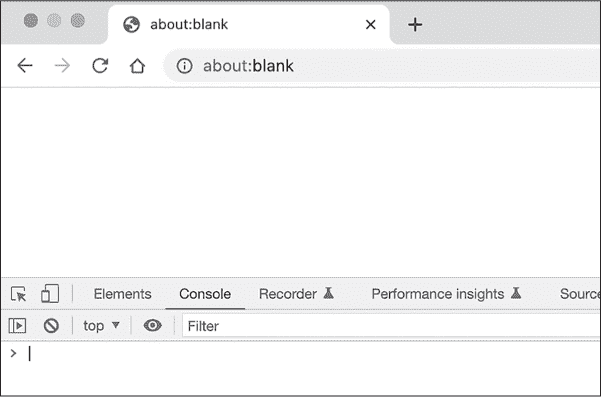
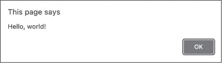
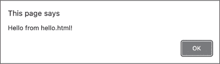

## 第一章：1 开始使用


在本章中，你将开始编写你的第一段 JavaScript 代码。首先，你将学习如何直接在网页浏览器中输入代码，而无需安装任何专业的软件。这种方法非常适合快速测试简单的代码序列。接下来，你将看到如何在一个单独的文本编辑器程序中编写 JavaScript，这在代码变得更复杂时更加合适。本书中我们将使用这两种方法来编写和执行 JavaScript 代码，因此本章将为你未来的内容做准备。

### 使用 JavaScript 控制台

运行 JavaScript 代码的最快方式是通过 *JavaScript 控制台*。这是大多数网页浏览器中的一个界面，允许你输入单独的代码行并立即查看结果。我们将使用 Google Chrome 控制台，这是最流行的浏览器。如果你还没有安装 Chrome，可以从 [*https://<wbr>www<wbr>.google<wbr>.com<wbr>/chrome*](https://www.google.com/chrome) 下载并安装它。

安装好 Chrome 后，按照以下步骤访问 JavaScript 控制台：

1.  打开 Chrome 并在地址栏中输入 **about:blank**，这会将你带到一个空白网页。

在 Windows 或 Linux 上，按 CTRL-SHIFT-J，或者在使用 macOS 时按 OPTION-COMMAND-J。

现在，你应该能看到 JavaScript 控制台，包括一个 > 提示符，你可以在其中输入代码。点击控制台内的区域，将光标放在提示符旁边。

控制台应该类似于 图 1-1，它可能会显示在空白网页旁边，而不是在下面，这取决于你的浏览器设置。



图 1-1：Google Chrome 的 JavaScript 控制台

当你学习一种新的编程语言时，通常的做法是通过编写一段代码来显示“Hello, world!”消息。让我们试试看！在控制台中输入以下内容：

```
**alert("Hello, world!");**
```

在本书中，当我要求你在 JavaScript 控制台中输入代码时，我会将代码以粗体显示。如果代码在控制台中产生任何输出，我会将其直接显示在你的输入下方，而不是以粗体显示。

当你准备好运行已输入的代码时，按 ENTER。你应该会看到一个对话框在浏览器中出现，显示消息“Hello, world!”，如 图 1-2 所示。



图 1-2：Hello, world!

你刚刚使用了 JavaScript 的 alert 函数，它会在对话框中弹出文本。*函数*是执行某项特定任务的代码——在这个例子中，任务是显示一个对话框。函数可以接受*参数*，这些参数帮助指定任务的执行方式。alert 函数接受一个参数：需要显示的文本。在这里，我们提供了“Hello, world！”作为参数。你将在第五章中了解更多关于函数的内容。

点击**确定**关闭对话框并返回控制台。然后，为运行你的第一段 JavaScript 代码而自豪。

### 使用文本编辑器

JavaScript 控制台适合测试少量的代码，但对于本书后面将要处理的较大项目，它就不太适用了。对于这些项目，使用*文本编辑器*——一个专门用于编写和编辑代码文件的程序，显得更为实用。在本节中，我们将使用文本编辑器创建一个类似的“Hello, world！”程序。

对于本书，我推荐使用微软的 Visual Studio Code 文本编辑器（简称 VS Code）。它可以免费在 Windows、macOS 和 Linux 上使用。请访问[*https://<wbr>code<wbr>.visualstudio<wbr>.com*](https://code.visualstudio.com)，并按照网站上的指示下载和安装编辑器。

安装完 VS Code 后，在你的计算机上创建一个名为*javascript_work*的目录，用于保存你在本书中编写的代码文件。然后，按照以下步骤准备好编写代码：

1.  打开 VS Code。

2.  通过选择**文件****新建文件**来创建一个新文件。

3.  系统应该会提示你命名新文件。输入***hello.html***。

4.  接下来，系统应该会提示你选择新文件的保存位置。选择你刚刚创建的*javascript_work*目录，并点击**创建文件**。

5.  现在你应该看到一个可以编辑新文件的界面。

这个.*html*扩展名表明这是一个 HTML 文件。HTML 是一种标记语言，用于描述网页的内容。运行 JavaScript 代码的一种方法是将其包含在 HTML 文件中，然后在网页浏览器中打开该 HTML 文件。这正是我们将要做的。将清单 1-1 中的内容输入到你的新文件中，确保与原文完全一致。

```
<html><body><script>
alert("Hello from hello.html!");
</script></body></html> 
```

清单 1-1：在文件中编写 JavaScript hello.html

在你输入的过程中，可能会注意到 VS Code 尝试预测你正在输入的内容。刚开始时这可能会让人困惑，但一旦习惯了，你可能会觉得它很有帮助。有时这些预测会自动插入，而对于其他情况，你则需要按 TAB 键来插入它们。

列表 1-1 的第一行和最后一行是 HTML 代码，嵌入 JavaScript 到 HTML 文件中所需的最基本内容。我们将在第七章中详细探讨 HTML。现在，你需要知道的是，它包含了*标签*，用来标识网页的不同组件。对于我们的目的来说，最重要的是第一行末尾的<script>标签和第三行开头的</script>标签。当你在浏览器中加载这个文件时，这些标签之间的内容（列表 1-1 中的第二行）将被解释为 JavaScript。

该文件的 JavaScript 部分是：

```
alert("Hello from hello.html!");
```

这里我们使用了 alert 函数，就像之前在控制台中那样。此次我们提供了不同的消息“Hello from hello.html!”，在对话框中显示出来。

当你输入完代码后，保存文件。现在你准备好在 Chrome 中打开文件，查看 JavaScript 代码的效果。请按照以下步骤操作：

在 Chrome 中打开一个新标签页。

在 Windows 或 Linux 中按 CTRL-O，或者在 macOS 中按 COMMAND-O，打开“打开文件”对话框。

找到你的*hello.html*文件，选择它，然后点击**打开**。

你现在应该能看到一个弹出对话框，显示“Hello from hello.html!”消息，如图 1-3 所示。



图 1-3：来自 hello.html!

浏览器识别了 HTML 文件中<script>和</script>标签之间的代码作为 JavaScript 并执行了该代码，导致弹出对话框的出现。如果你没有看到对话框弹出，请仔细检查你的*hello.html*文件中的代码，确保它与列表 1-1 完全一致。

### 摘要

在这一章中，你学习了两种编写和执行 JavaScript 代码的不同方法。首先，你在 Chrome 网页浏览器的 JavaScript 控制台中输入了代码。你将在接下来的章节中使用这种技巧来测试简短的代码片段，学习语言的基础知识。接着，你使用文本编辑器将 JavaScript 嵌入 HTML 文件，然后在 Chrome 中打开该文件运行代码。在后续章节中，你将使用这种方法开发更复杂的项目。
