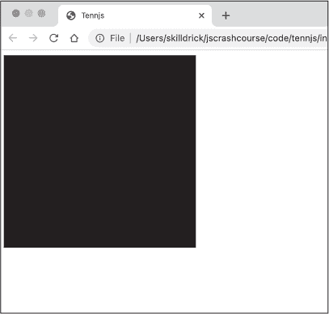
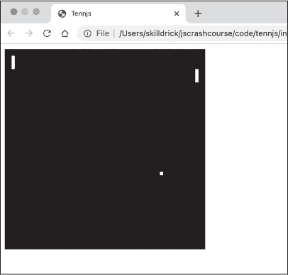
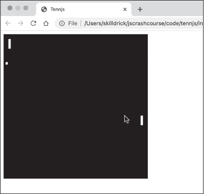
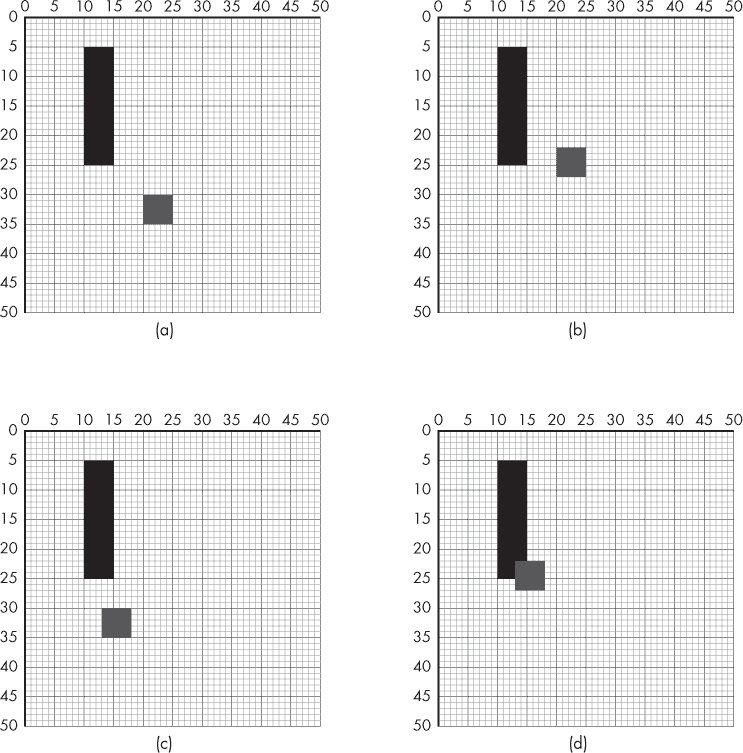
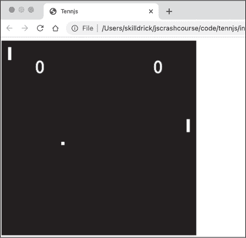
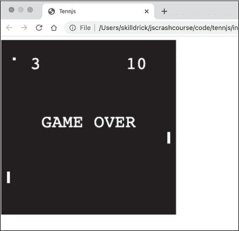

## 第二章：10 PONG


在这个第一个项目中，你将使用 JavaScript 重新创建第一个街机视频游戏之一：Atari 经典的*Pong*。*Pong*是一个简单的游戏，但它将教会你一些游戏设计的重要方面：游戏循环、玩家输入、碰撞检测和记分。我们甚至会使用一些基本的人工智能来编程计算机对手。

### 游戏

*Pong*于 1972 年开发，并在同年作为一款极为成功的街机游戏机发布。这是一个非常基础的游戏，类似乒乓球，由一个球和两个挡板组成，挡板分别位于屏幕的左右两侧，玩家可以上下移动它们。如果球碰到屏幕的顶部或底部边缘，它会反弹回来，但如果碰到左右边缘，对方玩家得分。球会正常地从挡板反弹，除非它碰到挡板的顶部或底部边缘，在这种情况下反弹的角度会发生变化。

在这一章中，我们将制作一个属于自己的*Pong*版本，我们将其称为*Tennjs*（就像*Tennis*，但加了*JS*，明白了吗？）。在我们的游戏中，左侧的挡板将由计算机控制，右侧的挡板将由人类玩家控制。在原版游戏中，挡板是通过旋转拨盘控制的，但在我们的版本中，我们将使用鼠标。计算机不会尝试预测球会在哪里反弹，而是始终尝试与球的垂直位置保持一致。为了给人类玩家提供机会，我们会对计算机移动挡板的速度设定一个上限。

### 设置

我们将通过设置项目的文件结构并创建一个用于显示游戏的画布来开始。和往常一样，项目将需要一个 HTML 文件和一个 JavaScript 文件。我们从 HTML 文件开始。创建一个名为*tennjs*的目录，并在该目录中创建一个名为*index.html*的文件。然后输入清单 10-1 所示的内容。

```
<!DOCTYPE html>
<html>
  <head>
    <title>Tennjs</title>
  </head>
  <body>
    <canvas id="canvas" width="300" height="300"></canvas>
    <script src="script.js"></script>
  </body>
</html> 
```

清单 10-1：我们的游戏的 index.html 文件

这几乎与我们在第九章中创建的 HTML 文件完全相同，因此应该不会有意外。body 元素包含一个 canvas 元素，我们将在其中绘制游戏，还有一个 script 元素，引用了*script.js*文件，我们的游戏代码将在其中编写。

接下来，我们将编写一些 JavaScript 代码来设置画布。创建*script.js*文件，并输入清单 10-2 所示的代码。

```
let canvas = document.querySelector("#canvas");
let ctx = canvas.getContext("2d");
let width = canvas.width;
let height = canvas.height;

ctx.fillStyle = "black";
ctx.fillRect(0, 0, width, height); 
```

清单 10-2：在 script.js 中设置画布

这段代码应该也很熟悉。我们首先通过 `document.querySelector` 获取对画布的引用，并获得画布的绘图上下文。然后，我们将画布的宽度和高度保存到名为 `width` 和 `height` 的变量中，以便在代码中方便访问。最后，我们将填充样式设置为黑色，并绘制一个与画布大小相同的黑色方块。这样，画布看起来就像是有一个黑色背景。

在浏览器中打开 *index.html*，你应该会看到类似于 图 10-1 的内容。



图 10-1：我们的黑色方块

现在我们有了一个空白的黑色画布，可以开始创建我们的游戏了。

### 球

接下来，我们将绘制球。将 清单 10-3 中的代码添加到 *script.js* 的末尾。

```
`--snip--`
ctx.fillStyle = "black";
ctx.fillRect(0, 0, width, height);

const BALL_SIZE = 5;
❶ let ballPosition = {x: 20, y: 30};

ctx.fillStyle = "white";
ctx.fillRect(ballPosition.x, ballPosition.y, BALL_SIZE, BALL_SIZE); 
```

清单 10-3：绘制球

这段代码使用 `fillRect` 方法将球绘制为一个位于画布左上角的小白色方块。就像原版的 *Pong* 游戏一样，球是方形的而不是圆形的。这种设计给游戏带来了复古感，同时也简化了检测球是否与墙壁或挡板碰撞的任务。球的大小保存在一个名为 BALL_SIZE 的常量中。我们使用全大写的“真常量”风格命名这个标识符，因为球的大小在程序运行过程中不会改变。如果我们仅仅在调用 `fillRect` 方法绘制球时直接使用值 5，而不是常量 BALL_SIZE，也能实现同样的效果，但随着程序的进行，我们会多次引用球的大小。给球的大小命名将使得需要了解球大小的代码更容易理解。这个方法的另一个好处是，如果我们后来改变主意，决定让球变大或变小，那么我们只需要更新代码中的一个地方：BALL_SIZE 常量的声明。

我们使用一个包含球的 x 和 y 坐标的对象来跟踪球的位置，该对象是通过对象字面量 ❶ 创建的。在 第九章中，我们为正在绘制的圆形使用了单独的 x 和 y 坐标变量，但将这两个变量作为一个对象存储在一起会更整洁，尤其是因为这个程序会变得更长且更复杂。

刷新 *index.html*，你应该能看到白色的球出现在画布的左上角，如 图 10-2 所示。


图 10-2：球

球现在是静止的，但很快我们将编写代码使其移动。

### 重构

接下来，我们将进行一个简单的重构。*重构*是软件开发中的一个术语，指的是在不改变代码行为的情况下修改代码，通常是为了使代码更易于理解或更新。随着项目代码的复杂性增加，重构有助于保持代码的组织性。

在这种情况下，我知道我们需要多次绘制到画布上，而不仅仅是一次。事实上，我们最终希望每 30 毫秒重新绘制一次画布，以使游戏呈现运动的效果。为了更容易实现这一点，我们将重构，使所有当前的绘图代码成为名为 draw 的函数的一部分。这样，我们可以在任何时候调用 draw 函数来重新绘制画布。

用清单 10-4 中的更改更新*script.js*。

```
let canvas = document.querySelector("#canvas");
let ctx = canvas.getContext("2d");
let width = canvas.width;
let height = canvas.height;

const BALL_SIZE = 5;
let ballPosition = {x: 20, y: 30};

❶ function draw() {
  ctx.fillStyle = "black";
  ctx.fillRect(0, 0, width, height);

  ctx.fillStyle = "white";
  ctx.fillRect(ballPosition.x, ballPosition.y, BALL_SIZE, BALL_SIZE);
}

❷ draw(); 
```

清单 10-4：重构绘图代码

唯一的变化是将所有绘图代码组织成一个名为 draw ❶的单一函数，然后立即调用它 ❷。由于这是重构，因此程序的行为并没有实际变化。你可以刷新*index.html*来确认一切看起来仍然如之前一样。

### 游戏循环

几乎所有的游戏都包含一个*游戏循环*，它协调每一帧游戏中必须发生的一切。游戏循环与我们在第九章中看到的动画循环类似，但有一些额外的逻辑。以下是大多数游戏中游戏循环的一般结构：

1.  清除画布

2.  绘制图像

3.  获取玩家输入

4.  更新状态

5.  检查碰撞

6.  等待短暂时间

7.  重复

获取并处理玩家（或玩家们）的输入是将游戏与动画区分开的主要特征。*碰撞检测*是大多数游戏中的另一个重要方面：检查游戏中两个物体何时相遇并作出相应反应。碰撞检测可以阻止你穿过墙壁或开车撞上另一辆车——在这个案例中，它会让小球从墙壁和挡板上弹回。除了玩家输入和碰撞检测元素外，游戏循环中的步骤与动画循环大致相同：我们清除画布，绘制图像，更新游戏状态以将物体移动到新位置，暂停，然后重复。

我们不会试图一次性写完整个游戏循环，而是逐步构建它。用清单 10-5 中的内容更新*script.js*，这将成为我们游戏中游戏循环的起始部分。此代码移动小球（即更新小球的状态），重绘画布，暂停，然后重复。

```
`--snip--`
const BALL_SIZE = 5;
let ballPosition = {x: 20, y: 30};

❶ let xSpeed = 4;
let ySpeed = 2;

function draw() {
 ctx.fillStyle = "black";
 ctx.fillRect(0, 0, width, height);

 ctx.fillStyle = "white";
 ctx.fillRect(ballPosition.x, ballPosition.y, BALL_SIZE, BALL_SIZE);
}

❷ function update() {
  ballPosition.x += xSpeed;
  ballPosition.y += ySpeed;
}

❸ function gameLoop() {
  draw();
  update();

    // Call this function again after a timeout
  setTimeout(gameLoop, 30);
}

❹ gameLoop(); 
```

清单 10-5：游戏循环

这里的第一个变化是初始化两个新变量 ❶，`xSpeed` 和 `ySpeed`。我们将使用这两个变量来控制球的水平和垂直速度。新的 `update` 函数 ❷ 使用这两个变量来更新球的位置。每帧，球将沿 x 轴移动 `xSpeed` 像素，沿 y 轴移动 `ySpeed` 像素。这两个变量的初始值分别为 4 和 2，因此每帧球会向右移动 4 像素，向下移动 2 像素。

`gameLoop` 函数 ❸ 调用 `draw` 函数，然后是 `update` 函数。接着它调用 `setTimeout(gameLoop, 30)`，这样 `gameLoop` 函数将在 30 毫秒后再次被调用。这几乎与我们在第九章中使用的 `setInterval` 技术完全相同。你可能还记得，`setTimeout` 只会在超时后调用一次函数，而 `setInterval` 会反复调用其函数。我们这里使用 `setTimeout` 是为了能更好地控制是否继续循环；稍后我们将添加一些条件逻辑，决定是否继续调用 `setTimeout` 或结束游戏。

注意上面 `setTimeout` 调用之前以两个斜杠（//）开头的那一行。这是一个*注释*，是嵌入在程序文件中的个人备注（或其他阅读代码的人备注）。当 JavaScript 程序执行时，任何在 // 后面的文本都会被忽略（// 前面的部分仍然会被作为 JavaScript 代码执行）。因此，你可以像这样使用注释来解释代码的工作原理、突出重要功能，或者记录需要完成的事项，而不会影响程序的功能。

在脚本的末尾，我们调用 `gameLoop` 函数 ❹ 来启动游戏。由于 `gameLoop` 目前以 `setTimeout` 结束，结果是 `gameLoop` 每 30 毫秒会被重复调用一次。重新加载页面后，你应该能看到球向下和向右移动，和第九章中的动画类似。

### 反弹

在上一节中，你已经让球开始移动，但它只是飞出了画布的边缘。接下来你将学习如何使它以合适的角度从画布边缘反弹——我们的第一个碰撞检测代码。用清单 10-6 中的代码更新 *script.js*，这段代码为我们的游戏添加了一个 `checkCollision` 函数。

```
`--snip--`
function update() {
 ballPosition.x += xSpeed;
 ballPosition.y += ySpeed;
}

function checkCollision() {
❶ let ball = {
    left: ballPosition.x,
    right: ballPosition.x + BALL_SIZE,
    top: ballPosition.y,
    bottom: ballPosition.y + BALL_SIZE
  }

❷ if (ball.left < 0 || ball.right > width) {
    xSpeed = -xSpeed;
  }
❸ if (ball.top < 0 || ball.bottom > height) {
    ySpeed = -ySpeed;
  }
}

function gameLoop() {
 draw();
 update();
❹ checkCollision();

 // Call this function again after a timeout
 setTimeout(gameLoop, 30);
}

gameLoop(); 
```

清单 10-6：墙面碰撞检测

新函数 checkCollision 用于检查球是否与画布的四面墙发生碰撞。如果发生碰撞，它会根据需要更新 xSpeed 或 ySpeed，使球反弹回墙壁。首先，我们需要计算球的各个边缘的位置。我们需要知道球的左边缘、右边缘、上边缘和下边缘的位置，以确定这些边缘是否超出了游戏区域的边界。我们将这些值放在一个名为 ball ❶ 的对象中，这个对象包含了 left、right、top 和 bottom 属性。确定球的左边缘和上边缘很简单：它们分别是 ballPosition.x 和 ballPosition.y。为了得到右边缘和下边缘，我们需要将 BALL_SIZE 加到 ballPosition.x 和 ballPosition.y 上。这是前面提到的那种情况，利用常量 BALL_SIZE 来获取球的尺寸会非常有用。

接下来，我们进行实际的碰撞检测。如果球的左边缘小于 0 或球的右边缘大于画布的宽度❷，我们就知道球已经撞到左墙或右墙。在这两种情况下，数学操作是一样的：xSpeed 的新值应该是当前值的相反数（也就是值被*取反*）。例如，当球第一次撞到右边缘时，xSpeed 会从 4 变为 -4。与此同时，ySpeed 保持不变。因此，球会以相同的速度继续向下移动，但现在它向左移动，而不是向右移动。

当球的顶部与上墙碰撞，或球的底部与下墙碰撞时，都会发生相同的检查❸。在这两种情况下，我们会改变 ySpeed 的符号，当球撞到顶部时，ySpeed 从 2 变为 -2，或者当球撞到底部时，ySpeed 从 -2 变为 2。

唯一的其他代码更改是将对 checkCollision 的调用添加到 gameLoop 函数 ❹ 中。现在，当你刷新 *index.html* 时，应该能看到球在游戏区域内不断反弹。

如果你一直在关注，可能已经注意到，球本不应该反弹到左右墙上。一旦我们有了可移动的挡板，我们会修改碰撞检测代码，使球只会在挡板或上下墙上反弹，同时对于左右墙的碰撞，我们会得分。

### 挡板

我们接下来的任务是绘制两个挡板。为此，我们首先引入一些新的常量，来确定挡板的尺寸及其相对于画布两侧的水平位置，以及一些定义其垂直位置的变量。（挡板只能上下移动，不能左右移动，因此只需要定义它们的垂直位置作为变量。）根据清单 10-7 中的更改，更新 *script.js* 文件。

```
`--snip--`
let xSpeed = 4;
let ySpeed = 2;

const PADDLE_WIDTH = 5;
const PADDLE_HEIGHT = 20;
const PADDLE_OFFSET = 10;

let leftPaddleTop = 10;
let rightPaddleTop = 30;

function draw() {
`--snip--` 
```

清单 10-7：定义挡板

首先，我们设置定义球拍的常量。PADDLE_WIDTH 和 PADDLE_HEIGHT 定义了两个球拍的宽度为 5 像素，高度为 20 像素。PADDLE_OFFSET 指的是球拍与游戏区域左右边缘的距离。

变量 leftPaddleTop 和 rightPaddleTop 定义了每个球拍顶部的当前垂直位置。最终，leftPaddleTop 将通过我们编写的函数由计算机控制，跟随球的位置，而 rightPaddleTop 将在玩家移动鼠标时更新。现在，我们只是将这两个值分别设置为 10 和 30。

接下来，我们更新绘制函数，使用我们刚刚定义的信息来显示球拍。我还在代码中添加了注释，明确每一步绘制函数的作用。按照清单 10-8 所示修改代码。

```
`--snip--`
function draw() {
  // Fill the canvas with black
 ctx.fillStyle = "black";
 ctx.fillRect(0, 0, width, height);

  // Everything else will be white
 ctx.fillStyle = "white";

  // Draw the ball
 ctx.fillRect(ballPosition.x, ballPosition.y, BALL_SIZE, BALL_SIZE);

  // Draw the paddles
❶ ctx.fillRect(
    PADDLE_OFFSET,
    leftPaddleTop,
    PADDLE_WIDTH,
    PADDLE_HEIGHT
  );
❷ ctx.fillRect(
    width - PADDLE_WIDTH - PADDLE_OFFSET,
    rightPaddleTop,
 PADDLE_WIDTH,
    PADDLE_HEIGHT
  );
}

function update() {
`--snip--` 
```

清单 10-8：绘制球拍

除了帮助文档化程序的额外注释外，新的代码包含了两次调用 fillRect，一个用于绘制左边的球拍❶，另一个用于右边的球拍❷。由于标识符太长，我将参数分成了多行。记住，fillRect 的参数是 x、y、宽度和高度，其中 x 和 y 是矩形左上角的坐标。左边球拍的 x 坐标是 PADDLE_OFFSET，因为我们用它表示球拍与画布左边缘的距离，而左边球拍的 y 坐标就是 leftPaddleTop。宽度和高度参数是 PADDLE_WIDTH 和 PADDLE_HEIGHT 常量。

右边的球拍绘制稍微复杂一些：为了获取球拍左上角的 x 坐标，我们需要用画布的宽度减去球拍的宽度和球拍从右边缘的偏移量。给定画布的宽度为 500，球拍宽度和偏移量都为 10，这意味着右边球拍的 x 坐标是 480。

当你刷新*index.html*时，除了弹跳的球之外，你应该能看到两个球拍，如图 10-3 所示。



图 10-3：球拍和球

请注意，球现在会直接穿过球拍，因为我们还没有为球拍设置碰撞检测。我们稍后会在本节中讲解如何设置。

#### 通过玩家输入移动球拍

球拍是在由变量 leftPaddleTop 和 rightPaddleTop 给定的垂直位置绘制的，因此为了让球拍上下移动，我们只需要更新这些变量的值。目前我们只关心右边的球拍，它将由玩家控制。

为了让玩家控制右侧挡板，我们将在 *script.js* 中添加一个事件处理程序来监听 mousemove 事件。列表 10-9 显示了如何实现。

```
`--snip--`
let leftPaddleTop = 10;
let rightPaddleTop = 30;

document.addEventListener("mousemove", e => {
  rightPaddleTop = e.y - canvas.offsetTop;
});

function draw() {
`--snip--` 
```

列表 10-9：添加事件处理程序以移动右侧挡板

这段代码遵循了你在第八章中首次看到的事件处理模式。我们使用 document.addEventListener 来检测鼠标移动。当检测到鼠标移动时，事件处理函数会根据鼠标移动事件的 y 坐标 (e.y) 更新 rightPaddleTop 的值。这个 y 坐标是相对于页面顶部的，而不是相对于画布顶部，因此我们需要从 y 坐标中减去 canvas.offsetTop（从画布顶部到页面顶部的距离）。这样，分配给 rightPaddleTop 的值将基于鼠标到画布顶部的距离，挡板将准确地跟随鼠标。

刷新 *index.html*，你应该会看到右侧挡板随着鼠标上下移动而垂直移动。图 10-4 显示了应该是什么样子。



图 10-4：右侧挡板随着鼠标移动

我们的游戏现在正式变得具有互动性！玩家可以完全控制右侧挡板的位置。

#### 检测挡板碰撞

下一步是为挡板添加碰撞检测。我们需要知道球是否击中了挡板，如果是的话，要让球适当地从挡板反弹。这需要很多代码，所以我会将其拆分成几个列表来展示。

我们需要做的第一件事是创建定义两个挡板四个边缘的对象，就像我们在列表 10-6 中为球所做的那样。这些更改在列表 10-10 中显示。

```
`--snip--`
function checkCollision() {
 let ball = {
 left: ballPosition.x,
 right: ballPosition.x + BALL_SIZE,
 top: ballPosition.y,
 bottom: ballPosition.y + BALL_SIZE
 }

  let leftPaddle = {
    left: PADDLE_OFFSET,
    right: PADDLE_OFFSET + PADDLE_WIDTH,
    top: leftPaddleTop,
    bottom: leftPaddleTop + PADDLE_HEIGHT
  };

   let rightPaddle = {
    left: width - PADDLE_WIDTH - PADDLE_OFFSET,
    right: width - PADDLE_OFFSET,
    top: rightPaddleTop,
    bottom: rightPaddleTop + PADDLE_HEIGHT
  };

 if (ball.left < 0 || ball.right > width) {
`--snip--` 
```

列表 10-10：定义挡板的边缘

leftPaddle 和 rightPaddle 对象分别包含它们各自挡板的四个边缘属性：left、right、top 和 bottom。就像在列表 10-8 中一样，确定右侧挡板的边缘位置需要一些额外的数学计算，因为我们必须考虑到画布的宽度、挡板的偏移量和挡板的宽度。

接下来，我们需要一个函数，命名为 checkPaddleCollision，该函数接受球对象和一个挡板对象，并在球与该挡板相交时返回 true。该函数的定义在列表 10-11 中显示。

```
`--snip--`
function update() {
 ballPosition.x += xSpeed;
 ballPosition.y += ySpeed;
}

function checkPaddleCollision(ball, paddle) {
  // Check if the paddle and ball overlap vertically and horizontally
  return (
    ball.left   < paddle.right &&
    ball.right  > paddle.left &&
    ball.top    < paddle.bottom &&
    ball.bottom > paddle.top
  );
}

function checkCollision() {
`--snip--` 
```

列表 10-11：checkPaddleCollision 函数

这个函数会与之前定义的球和每个球拍对象一起被调用。它使用一个较长的布尔表达式，由四个子表达式组成，这四个子表达式通过 && 运算符连接在一起，因此只有当所有四个子表达式都为真时，才会返回 true。（我为每个子表达式添加了空格，使得操作数垂直对齐；这样做只是为了让代码更易读。）用英文描述，子表达式如下：

1. 球的左边缘必须位于球拍的右边缘的左侧。

2. 球的右边缘必须位于球拍的左边缘的右侧。

3. 球的上边缘必须位于球拍的下边缘之上。

4. 球的下边缘必须位于球拍的上边缘之下。

如果前两个条件为真，表示球在水平方向上相交；如果最后两个条件为真，表示球在垂直方向上相交。只有当四个条件都为真时，球才真正与球拍相交。为了说明这一点，请参见图 10-5。

该图展示了我们可能需要检查的四种情况。在所有这些情况下，球拍的边界为：{left: 10, right: 15, top: 5, bottom: 25}。

在图 10-5(a)中，球的边界为{left: 20, right: 25, top: 30, bottom: 35}。在这种情况下，ball.left < paddle.right 为假（球的左边并没有位于球拍右边的左侧），但 ball.right > paddle.left 为真。同样，ball.top < paddle.bottom 为假，而 ball.bottom > paddle.top 为真。球既没有在垂直方向上与球拍相交，也没有在水平方向上与球拍相交。

在图 10-5(b)中，球的边界为{left: 20, right: 25, top: 22, bottom: 27}。这一次，ball.top < paddle.bottom 和 ball.bottom > paddle.top 都为真，这意味着球在垂直方向上与球拍相交，但在水平方向上没有相交。

在图 10-5(c)中，球的边界为{left: 13, right: 18, top: 30, bottom: 35}。在这种情况下，球在水平方向上与球拍相交，但在垂直方向上没有相交。

最后，在图 10-5(d)中，球的边界为{left: 13, right: 18, top: 22, bottom: 27}。现在，球在水平方向和垂直方向上都与球拍相交。四个子表达式都为真，因此检查 PaddleCollision 返回 true。



图 10-5：碰撞检测条件

现在是时候在 checkCollision 函数内部实际调用 checkPaddleCollision 函数了，每个球拍调用一次，并处理函数返回 true 的情况。你可以在代码清单 10-12 中找到这个代码。

```
`--snip--`
 let rightPaddle = {
 left: width - PADDLE_WIDTH - PADDLE_OFFSET,
 right: width - PADDLE_OFFSET,
 top: rightPaddleTop,
 bottom: rightPaddleTop + PADDLE_HEIGHT
 };

  if (checkPaddleCollision(ball, leftPaddle)) {
    // Left paddle collision happened
  ❶ xSpeed = Math.abs(xSpeed);
  }

  if (checkPaddleCollision(ball, rightPaddle)) {
    // Right paddle collision happened
  ❷ xSpeed = -Math.abs(xSpeed);
  }

 if (ball.left < 0 || ball.right > width) {
 xSpeed = -xSpeed;
 }
 if (ball.top < 0 || ball.bottom > height) {
 ySpeed = -ySpeed;
 }
}
`--snip--` 
```

代码清单 10-12：检查球拍碰撞

记住，checkPaddleCollision 接受一个表示球的对象和一个表示球拍的对象，并且如果两者相交则返回 true。如果 checkPaddleCollision(ball, leftPaddle) 返回 true，我们将 xSpeed 设置为 Math.abs(xSpeed) ❶，这样会将它设置为 4，因为在我们的游戏中 xSpeed 只有两个值：4（向右移动时）或 -4（向左移动时）。

你可能会想，为什么我们没有像之前在垂直墙壁碰撞代码中那样仅仅取反 xSpeed。使用绝对值是一个小技巧，可以避免多次碰撞，这样球就不会在球拍“内部”来回弹跳。如果球恰好在球拍的末端碰撞，它可能会被弹回，但下一帧也会与同一个球拍发生碰撞。如果我们取反 xSpeed，那么球就会一直弹跳。通过强制更新后的 xSpeed 为正数，我们可以确保与左侧球拍的碰撞总是使球向右弹跳。

接下来，我们对右侧球拍做同样的处理。在这种情况下，如果发生碰撞，我们将 xSpeed 更新为 -Math.abs(xSpeed) ❷，这实际上是 -4，意味着球将向左弹跳。

再次刷新 *index.html*，然后试着用鼠标移动右侧球拍，让球击中它。现在你应该可以看到球与球拍发生弹跳了！此时，球仍然可以安全地从侧墙反弹，但我们很快会修复这个问题。

#### 在球拍边缘附近弹跳

我在本章开头提到过，在 *Pong* 中，你可以通过在球拍的顶部或底部附近击打球来改变球的弹跳角度。现在我们将实现这个功能。首先，我们会添加一个新的函数，名为 adjustAngle，紧接在 checkCollision 之前。它检查球是否靠近球拍的顶部或底部，如果是，就更新 ySpeed。请参考 清单 10-13 查看代码。

```
`--snip--`
function adjustAngle(distanceFromTop, distanceFromBottom) {
❶ if (distanceFromTop < 0) {
    // If ball hit near top of paddle, reduce ySpeed
    ySpeed -= 0.5;
❷ } else if (distanceFromBottom < 0) {
    // If ball hit near bottom of paddle, increase ySpeed
    ySpeed += 0.5;
  }
}

function checkCollision() {
`--snip--` 
```

清单 10-13: 调整弹跳角度

`adjustAngle` 函数有两个参数，`distanceFromTop` 和 `distanceFromBottom`。这两个参数分别表示球的顶部到球拍顶部的距离，以及球拍底部到球底部的距离。该函数首先检查 `distanceFromTop` 是否小于 0 ❶。如果是，这意味着在碰撞时球的顶部边缘位于球拍的顶部边缘之上，这就是我们定义球接近球拍顶部的方式。在这种情况下，我们从 `ySpeed` 中减去 0.5。如果球在接近球拍顶部时向下移动屏幕，那么 `ySpeed` 为正数，因此减去 0.5 会减少垂直速度。例如，在游戏开始时，`ySpeed` 为 2。如果你调整球拍使得球击中顶部，弹跳后 `ySpeed` 会变为 1.5，有效地减少了弹跳的角度。然而，如果球向上移动屏幕，那么 `ySpeed` 为负数。在这种情况下，球拍顶部附近的碰撞后减去 0.5 会增加球的垂直速度。例如，`ySpeed` 为 -2 时，碰撞后会变为 -2.5。

如果球击中球拍的底部附近 ❷，情况则相反。在这种情况下，我们将 `ySpeed` 增加 0.5，如果球向下移动屏幕，则增加垂直速度；如果球向上移动屏幕，则减慢垂直速度。

接下来，我们需要更新 `checkCollision` 函数，将新的 `adjustAngle` 函数作为两个球拍碰撞检测逻辑的一部分来调用。Listing 10-14 显示了相关的修改。

```
`--snip--`
 let rightPaddle = {
 left: width - PADDLE_WIDTH - PADDLE_OFFSET,
 right: width - PADDLE_OFFSET,
 top: rightPaddleTop,
 bottom: rightPaddleTop + PADDLE_HEIGHT
  };

 if (checkPaddleCollision(ball, leftPaddle)) {
 // Left paddle collision happened
    let distanceFromTop = ball.top - leftPaddle.top;
    let distanceFromBottom = leftPaddle.bottom - ball.bottom;
    adjustAngle(distanceFromTop, distanceFromBottom);
 xSpeed = Math.abs(xSpeed);
 }

 if (checkPaddleCollision(ball, rightPaddle)) {
 // Right paddle collision happened
    let distanceFromTop = ball.top - rightPaddle.top;
    let distanceFromBottom = rightPaddle.bottom - ball.bottom;
    adjustAngle(distanceFromTop, distanceFromBottom);
 xSpeed = -Math.abs(xSpeed);
 }
`--snip--` 
```

Listing 10-14: 调用 adjustAngle

在每个球拍的 `if` 语句内，我们声明了 `distanceFromTop` 和 `distanceFromBottom`，这些是 `adjustAngle` 函数所需的参数。然后我们像以前一样，在更新 `xSpeed` 之前调用 `adjustAngle`。

现在尝试一下游戏，看看你能否将球击中球拍的边缘附近！

### 得分

游戏通常在你可以赢或输的时候更有趣。在 *Pong* 中，当你击中对方球拍后方的墙壁时，你会得分。发生这种情况时，球会重置到起始位置并恢复速度，进入下一轮游戏。我们将在本节中处理这一部分，但首先，为了跟踪得分，我们需要创建一些新的变量。使用 Listing 10-15 中的代码更新 *script.js* 文件。

```
`--snip--`
let leftPaddleTop = 10;
let rightPaddleTop = 30;

let leftScore = 0;
let rightScore = 0;

document.addEventListener("mousemove", e => {
 rightPaddleTop = e.y - canvas.offsetTop;
});
`--snip--` 
```

Listing 10-15: 用于跟踪得分的变量

这里我们声明了两个新变量，`leftScore` 和 `rightScore`，并将它们的初始值设置为 0。稍后我们会添加逻辑，当得分时递增这两个变量。

接下来，我们将在 `draw` 函数的末尾添加显示得分的代码。按照 Listing 10-16 中的方式更新该函数。

```
`--snip--`
 ctx.fillRect(
 width - PADDLE_WIDTH - PADDLE_OFFSET,
 rightPaddleTop,
 PADDLE_WIDTH,
 PADDLE_HEIGHT
 );

  // Draw scores
  ctx.font = "30px monospace";
  ctx.textAlign = "left";
  ctx.fillText(leftScore.toString(), 50, 50);
  ctx.textAlign = "right";
  ctx.fillText(rightScore.toString(), width - 50, 50);
}

function update() {
`--snip--` 
```

Listing 10-16: 绘制得分

这段代码使用了一些我们尚未见过的新 canvas 属性和方法。首先，我们使用 ctx.font 来设置即将绘制的文本的字体。这类似于 CSS 中的 font 声明。在这种情况下，我们将字体设置为 30 像素高，并使用等宽字体样式。*等宽字体*意味着每个字符占用相同的宽度，通常用于代码，如本书中的代码列表。它看起来像这样。有许多等宽字体，但由于操作系统可能安装了不同的字体，我们仅提供通用的字体样式（monospace），这意味着操作系统应使用该字体样式的默认字体。在大多数操作系统中，Courier 或 Courier New 是默认的等宽字体。

接下来，我们使用 ctx.textAlign 来设置文本的对齐方式。我们选择“左”对齐，但因为我们希望这仅应用于左侧得分，所以在绘制右侧得分之前，我们将对齐方式改为“右”。这样，如果得分变为两位数，数字将朝屏幕中间延伸，保持视觉平衡。

为了显示左侧得分，我们使用 ctx.fillText 方法。这个方法有三个参数：要绘制的文本，以及绘制文本的 x 和 y 坐标。第一个参数必须是一个字符串，因此我们调用 leftScore 的 toString 方法，将其从数字转换为字符串。我们使用 50 作为 x 和 y 坐标，将文本放置在画布的左上角附近。

> 注意

*fillText 的 x 坐标参数的含义取决于文本的对齐方式。对于左对齐文本，x 坐标指定文本的左边缘；而对于右对齐文本，x 坐标指定文本的右边缘。*

右侧得分的处理与左侧得分类似：我们设置文本对齐方式，然后调用 fillText 来显示得分。这次我们将 x 坐标设置为 width - 50，因此它会出现在距离右侧与左侧得分距离相同的位置。

刷新*index.html*时，你应该能看到初始得分渲染出来，如图 10-6 所示。



图 10-6：显示得分

现在我们需要处理球撞击侧墙的情况。球不再反弹，应该增加适当的得分，并且将球重置为原始速度和位置。首先我们进行一次重构，编写一个重置球的函数。这还需要对球的速度和位置变量的处理进行一些更改。示例 10-17 展示了这些更改。

```
`--snip--`
const BALL_SIZE = 5;
❶ let ballPosition;

let xSpeed;
let ySpeed;

function initBall() {
❷ ballPosition = {x: 20, y: 30};
  xSpeed = 4;
  ySpeed = 2;
}

const PADDLE_WIDTH = 5;
`--snip--` 
```

示例 10-17：initBall 函数

在这里，我们将球的状态变量（ball Position、xSpeed 和 ySpeed）的*声明*与这些变量的*初始化*分开。例如，ballPosition 在程序的顶层声明 ❶，但在新的 initBall 函数中初始化 ❷（即“初始化球”）。xSpeed 和 ySpeed 也如此。这样一来，我们可以通过调用 initBall，轻松地将球重置到初始位置和速度，而不必在程序中到处复制粘贴球的状态变量的值。特别地，我们现在可以在程序开始时调用 initBall 来首次设置球，并且也可以在球撞到左右墙时随时调用它，将球重置到原始状态。

请注意，我们不能在 initBall 函数内部同时声明*和*初始化球的状态变量——例如，在函数内部放置 let ballPosition = {x: 20, y: 30};——因为 let 关键字会在*当前作用域*内定义一个新变量，在这种情况下就是 initBall 的主体。因此，这些变量只能在 initBall 函数内部使用。我们希望这些变量在整个程序中都能使用，因此我们在程序的顶层声明它们，而不是在任何函数的主体内声明。然而，因为我们希望多次初始化这些变量，所以我们在 initBall 函数中为它们赋值，该函数可以被多次调用。

接下来，我们需要修改 checkCollision 函数中的碰撞检测代码，当球撞到左右墙时，增加得分并重置球。列表 10-18 展示了如何操作。

```
`--snip--`
 if (checkPaddleCollision(ball, rightPaddle)) {
 // Right paddle collision happened
 let distanceFromTop = ball.top - rightPaddle.top;
 let distanceFromBottom = rightPaddle.bottom - ball.bottom;
 adjustAngle(distanceFromTop, distanceFromBottom);
 xSpeed = -Math.abs(xSpeed);
  }

❶ if (ball.left < 0) {
    rightScore++;
    initBall();
  }
❷ if (ball.right > width) {
    leftScore++;
    initBall();
  }

 if (ball.top < 0 || ball.bottom > height) {
 ySpeed = -ySpeed;
 }
}
`--snip--` 
```

列表 10-18：墙壁碰撞得分

以前，我们在一个 if 语句中检查左右墙的碰撞，并让球反弹，但现在我们需要单独处理左右墙，因为根据撞到哪面墙，不同的玩家得分。因此，我们将 if 语句拆分成两个。如果球撞到左墙 ❶，rightScore 会增加，并通过调用新的 initBall 函数重置球。如果球撞到右墙 ❷，leftScore 会增加，并重置球。与上下墙的碰撞逻辑保持不变。

最后，由于我们已将球的状态变量初始化移动到 initBall 函数中，我们需要在游戏循环开始之前调用该函数，以便首次设置球。在*script.js*的底部向下滚动，并按列表 10-19 所示更新代码，在调用 gameLoop 之前添加对 initBall 的调用。

```
`--snip--`
function gameLoop() {
 draw();
 update();
  checkCollision();

 // Call this function again after a timeout
 setTimeout(gameLoop, 30);
}

initBall();
gameLoop(); 
```

列表 10-19：首次调用 initBall

现在，当你刷新 *index.html* 时，你应该能看到分数在球击中侧墙时递增，并且球在击中侧墙后应该恢复到其原始速度和位置。当然，现在很容易打败计算机，因为它还没有移动它的滑块！

### 计算机控制

现在让我们给这个游戏增加一些挑战吧！我们希望计算机控制的对手移动左侧的滑块并尝试击打球。实现这一点有多种方法，但在我们简单的方案中，计算机将始终尝试匹配球的当前位置。计算机的逻辑将非常简单：

+   如果球的顶部在滑块的顶部之上，向上移动滑块。

+   如果球的底部在滑块的底部之下，向下移动滑块。

+   否则，不做任何操作。

使用这种方法，如果计算机可以以任何速度移动，那么它将永远不会错过。由于这对我们人类来说没有乐趣，我们将为计算机设置一个速度限制。示例 10-20 展示了如何做。

```
let canvas = document.querySelector("#canvas");
let ctx = canvas.getContext("2d");
let width = canvas.width;
let height = canvas.height;

const MAX_COMPUTER_SPEED = 2;

const BALL_SIZE = 5;
`--snip--` 
```

示例 10-20：限制计算机的速度

我们将计算机的速度限制声明为一个常量，MAX_COMPUTER_SPEED。通过将其设置为 2，我们表示计算机在每帧游戏中不能移动比 2 像素更多的滑块。

接下来，我们将定义一个名为 followBall 的函数，它应用一些非常基础的人工智能来移动计算机的滑块。新函数在示例 10-21 中展示。将它添加到你的代码中，放在 draw 函数和 update 函数之间。

```
`--snip--`
function followBall() {
❶ let ball = {
    top: ballPosition.y,
    bottom: ballPosition.y + BALL_SIZE
  };
❷ let leftPaddle = {
    top: leftPaddleTop,
    bottom: leftPaddleTop + PADDLE_HEIGHT
  };

❸ if (ball.top < leftPaddle.top) {
    leftPaddleTop -= MAX_COMPUTER_SPEED;
❹ } else if (ball.bottom > leftPaddle.bottom) {
    leftPaddleTop += MAX_COMPUTER_SPEED;
  }
}

function update() {
 ballPosition.x += xSpeed;
 ballPosition.y += ySpeed;
❺ followBall();
}

`--snip--` 
```

示例 10-21：计算机控制的滑块

在 followBall 函数中，我们定义了表示球 ❶ 和左侧滑块 ❷ 的对象，每个对象都有表示其上下界限的 top 和 bottom 属性。然后，我们通过两个 if 语句实现滑块的移动逻辑。如果球的顶部在滑块的顶部之上 ❸，我们通过从 leftPaddleTop 中减去 MAX_COMPUTER_SPEED 来向上移动滑块。同样，如果球的底部在滑块的底部之下 ❹，我们通过向 leftPaddleTop 添加 MAX_COMPUTER_SPEED 来向下移动滑块。

我们在 update 函数中调用了新的 followBall 函数 ❺。这样，移动左侧滑块就成为了每次游戏循环迭代时更新游戏状态的过程的一部分。

重新加载页面，看看你能不能在计算机面前得分！

### 游戏结束

创建游戏的最后一步是让游戏可以获胜（或失败）。为了做到这一点，我们必须添加某种游戏结束的条件，并在此时停止游戏循环。在这种情况下，我们将在其中一个玩家达到 10 分时停止游戏循环，然后显示“游戏结束”的文字。

首先，我们需要声明一个变量来跟踪游戏是否结束。我们将使用这个变量来决定是否继续重复执行 gameLoop 函数。清单 10-22 展示了需要做出的修改。

```
`--snip--`
let leftScore = 0;
let rightScore = 0;
❶ let gameOver = false;

document.addEventListener("mousemove", e => {
--snip--

function checkCollision() {
--snip--
 if (ball.right > width) {
 leftScore++;
 initBall();
 }
❷ if (leftScore > 9 || rightScore > 9) {
    gameOver = true;
 }
 if (ball.top < 0 || ball.bottom > height) {
 ySpeed = -ySpeed;
 }
}
`--snip--` 
```

清单 10-22：添加 gameOver 变量

在*script.js*的顶部，我们声明了一个名为 gameOver 的变量，用于记录游戏是否结束 ❶。我们将其初始化为 false，这样游戏在开始之前不会结束。然后，在 checkCollision 函数中，我们检查是否有任何一个得分超过了 9 ❷。如果是这样，我们将 gameOver 设置为 true。这个检查可以在任何地方进行，但我们在 checkCollision 中进行，以将增加得分的逻辑和检查得分的逻辑放在一起。

接下来，我们将添加一个函数来写入“GAME OVER”文本，并修改游戏循环，使其在 gameOver 为 true 时结束。清单 10-23 展示了如何操作。

```
`--snip--`
 if (ball.top < 0 || ball.bottom > height) {
 ySpeed = -ySpeed;
 }
}

❶ function drawGameOver() {
  ctx.fillStyle = "white";
  ctx.font = "30px monospace";
  ctx.textAlign = "center";
  ctx.fillText("GAME OVER", width / 2, height / 2);
}

function gameLoop() {
 draw();
 update();
 checkCollision();
❷ if (gameOver) {
    draw();
    drawGameOver();
❸} else {
    // Call this function again after a timeout
    setTimeout(gameLoop, 30);
  }
} 
```

清单 10-23：结束游戏

我们在 checkCollision 函数 ❶之后定义了 drawGameOver 函数。它将“GAME OVER”文本绘制到画布中央，字体为大号白色。为了将文本居中放置，我们将文本对齐方式设置为“center”，并使用画布宽度和高度的一半作为文本的 x 和 y 坐标。（在居中对齐的情况下，x 坐标表示文本的水平中点。）

在 gameLoop 函数中，我们将 setTimeout 的调用包装在一个条件语句中，该语句检查 gameOver 变量的值。如果为 true ❷，游戏结束，因此我们调用 draw 和 drawGameOver 函数。（draw 函数是用来显示最终得分的；否则，获胜的玩家将仍然停留在九分。）如果 gameOver 为 false ❸，游戏可以继续：我们像之前一样使用 setTimeout，在 30 毫秒后再次调用 gameLoop，继续循环。

一旦 gameOver 变为 true 并且游戏循环结束，游戏实际上就停止了。在“GAME OVER”文本之后，不会再绘制其他内容——至少，直到页面刷新并且程序从头开始重新启动。现在就刷新*index.html*，看看你能否打败电脑！一旦你们中的任何一个得分超过九分，你应该会看到“GAME OVER”文本，如图 10-7 所示。



图 10-7：游戏结束

我希望你能打败电脑，但如果没有也不用担心——这个游戏确实很难。这里有一些可以让你自己轻松些的建议：

+   增加 gameLoop 中帧之间的时间。

+   增加挡板的高度。

+   降低电脑的最大速度。

+   让击中挡板的边缘变得更容易。

+   增加击中挡板边缘时 ySpeed 的效果。

现在你已经有了一个可用的游戏，你可以进行任何你想要的修改。如果你已经是一个*Pong*高手，可能想让游戏变得更难一些；下面的练习提供了一些建议。你还可以尝试自定义外观，或更改画布的大小——现在是你的游戏了。

### 完整代码

为了方便你，列表 10-24 显示了完整的*script.js*文件。

```
let canvas = document.querySelector("#canvas");
let ctx = canvas.getContext("2d");
let width = canvas.width;
let height = canvas.height;

const MAX_COMPUTER_SPEED = 2;

const BALL_SIZE = 5;
let ballPosition;

let xSpeed;
let ySpeed;

function initBall() {
  ballPosition = {x: 20, y: 30};
  xSpeed = 4;
  ySpeed = 2;
}

const PADDLE_WIDTH = 5;
const PADDLE_HEIGHT = 20;
const PADDLE_OFFSET = 10;

let leftPaddleTop = 10;
let rightPaddleTop = 30;

let leftScore = 0;
let rightScore = 0;
let gameOver = false;

document.addEventListener("mousemove", e => {
  rightPaddleTop = e.y - canvas.offsetTop;
});

function draw() {
  // Fill the canvas with black
  ctx.fillStyle = "black";
  ctx.fillRect(0, 0, width, height);

  // Everything else will be white
  ctx.fillStyle = "white";

  // Draw the ball
  ctx.fillRect(ballPosition.x, ballPosition.y, BALL_SIZE, BALL_SIZE);

  // Draw the paddles
  ctx.fillRect(
    PADDLE_OFFSET,
    leftPaddleTop,
    PADDLE_WIDTH,
    PADDLE_HEIGHT
 );
  ctx.fillRect(
    width - PADDLE_WIDTH - PADDLE_OFFSET,
    rightPaddleTop,
    PADDLE_WIDTH,
    PADDLE_HEIGHT
  );

  // Draw scores
  ctx.font = "30px monospace";
  ctx.textAlign = "left";
  ctx.fillText(leftScore.toString(), 50, 50);
  ctx.textAlign = "right";
  ctx.fillText(rightScore.toString(), width - 50, 50);
}

function followBall() {
  let ball = {
    top: ballPosition.y,
    bottom: ballPosition.y + BALL_SIZE
  };
  let leftPaddle = {
    top: leftPaddleTop,
    bottom: leftPaddleTop + PADDLE_HEIGHT
  };

  if (ball.top < leftPaddle.top) {
    leftPaddleTop -= MAX_COMPUTER_SPEED;
  } else if (ball.bottom > leftPaddle.bottom) {
    leftPaddleTop += MAX_COMPUTER_SPEED;
  }
}

function update() {
  ballPosition.x += xSpeed;
  ballPosition.y += ySpeed;
  followBall();
}

function checkPaddleCollision(ball, paddle) {
  // Check if the paddle and ball overlap vertically and horizontally
  return (
    ball.left   < paddle.right &&
    ball.right  > paddle.left &&
    ball.top    < paddle.bottom &&
    ball.bottom > paddle.top
  );
}

function adjustAngle(distanceFromTop, distanceFromBottom) {
  if (distanceFromTop < 0) {
    // If ball hit near top of paddle, reduce ySpeed
    ySpeed -= 0.5;
  } else if (distanceFromBottom < 0) {
    // If ball hit near bottom of paddle, increase ySpeed
 ySpeed += 0.5;
  }
}

function checkCollision() {
  let ball = {
    left: ballPosition.x,
    right: ballPosition.x + BALL_SIZE,
    top: ballPosition.y,
    bottom: ballPosition.y + BALL_SIZE
  }

  let leftPaddle = {
    left: PADDLE_OFFSET,
    right: PADDLE_OFFSET + PADDLE_WIDTH,
    top: leftPaddleTop,
    bottom: leftPaddleTop + PADDLE_HEIGHT
  };

  let rightPaddle = {
    left: width - PADDLE_WIDTH - PADDLE_OFFSET,
    right: width - PADDLE_OFFSET,
    top: rightPaddleTop,
    bottom: rightPaddleTop + PADDLE_HEIGHT
  };

  if (checkPaddleCollision(ball, leftPaddle)) {
    // Left paddle collision happened
    let distanceFromTop = ball.top - leftPaddle.top;
    let distanceFromBottom = leftPaddle.bottom - ball.bottom;
    adjustAngle(distanceFromTop, distanceFromBottom);
    xSpeed = Math.abs(xSpeed);
  }

  if (checkPaddleCollision(ball, rightPaddle)) {
    // Right paddle collision happened
    let distanceFromTop = ball.top - rightPaddle.top;
    let distanceFromBottom = rightPaddle.bottom - ball.bottom;
    adjustAngle(distanceFromTop, distanceFromBottom);
    xSpeed = -Math.abs(xSpeed);
  }

  if (ball.left < 0) {
    rightScore++;
    initBall();
  }
  if (ball.right > width) {
    leftScore++;
    initBall();
  }
  if (leftScore > 9 || rightScore > 9) {
    gameOver = true;
  }
 if (ball.top < 0 || ball.bottom > height) {
    ySpeed = -ySpeed;
    }
}

function drawGameOver() {
  ctx.fillStyle = "white";
  ctx.font = "30px monospace";
  ctx.textAlign = "center";
  ctx.fillText("GAME OVER", width / 2, height / 2);
}

function gameLoop() {
  draw();
  update();
  checkCollision();

  if (gameOver) {
    draw();
    drawGameOver();
  } else {
    // Call this function again after a timeout
    setTimeout(gameLoop, 30);
  }
}

initBall();
gameLoop(); 
```

列表 10-24：完整代码

### 总结

在本章中，你从零开始创建了一个完整的游戏。游戏循环、碰撞检测和渲染的基础知识是广泛适用的，因此凭借你在这里获得的知识，你可以开始创建各种 2D 游戏。例如，你可以尝试实现自己的*Breakout*或*Snake*版本。如果你在逻辑上需要一些帮助，网上有很多教程可以跟随。玩得开心！
