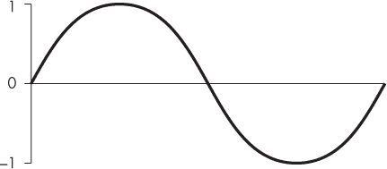
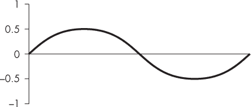
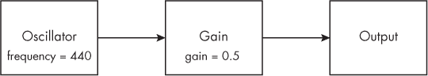
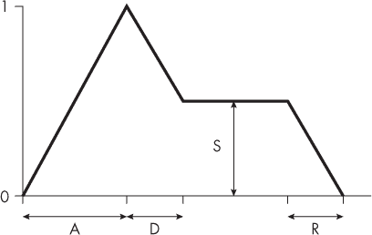
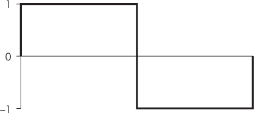
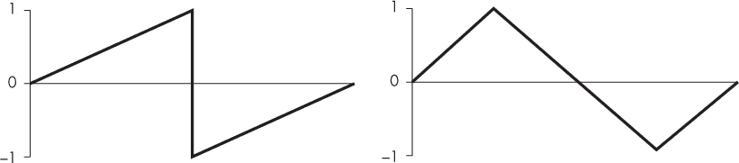
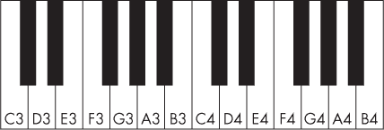

<hgroup>

## <samp class="SANS_Futura_Std_Bold_Condensed_B_11">12</samp> <samp class="SANS_Dogma_OT_Bold_B_11">生成声音</samp>

</hgroup>


现在是时候做点完全不同的事情了！在下一个项目中，你将使用 JavaScript 和 Web Audio API 创建一首歌曲。你还将学习一些关于声音合成的通用技巧，以及电子音乐是如何制作的。

本章将介绍 Web Audio API 以及基于它构建的 JavaScript 库 Tone.js。这将是你第一次接触广阔的第三方 JavaScript 库世界，它们是一些预先编写好的代码集合，可以帮助你简化复杂的任务。与 Web Audio API 相比，Tone.js 提高了抽象层次，让你能够以更自然的方式思考和实现音乐概念。掌握其工作原理后，在第十三章中，你将运用所学的知识制作一首歌曲，你可以自定义甚至重写它。

### <samp class="SANS_Futura_Std_Bold_B_11">Web Audio API</samp>

本节内容介绍 Web Audio API 的基础知识，它提供了一种使用 JavaScript 在浏览器中创建和操控声音的方法。Google Chrome 在 2011 年引入了 Web Audio API，随后它被发布为 W3C 标准（W3C，或称万维网联盟，是一个制定 Web 标准的组织）。使用 Web Audio API 时，你需要创建节点并将它们连接在一起。每个*节点*表示声音的某个方面——一个节点可能生成基本音调，第二个节点可能设置其音量，第三个节点可能为音调应用效果，例如混响或失真，依此类推。通过这种方式，你可以制作几乎任何你想要的声音。

#### <samp class="SANS_Futura_Std_Bold_Condensed_Oblique_BI_11">设置</samp>

一如既往，我们从一个简单的 HTML 文件开始。该文件将允许用户播放 Web Audio API 生成的声音。创建一个名为*music*的新目录，并将示例 12-1 中的内容放入一个名为*index.html*的新文件中。

```
<!DOCTYPE html>
<html>
  <head>
    <title>Music</title>
  </head>
  <body>
  ❶ <button id="play">Play</button>
  ❷ <p id="playing" style="display: none">Playing</p>
    <script src="script.js"></script>
  </body>
</html> 
```

<samp class="SANS_Futura_Std_Book_Oblique_I_11">示例 12-1: 用于探索 Web Audio API 的</samp> <samp class="SANS_Futura_Std_Book_11">index.html</samp> <samp class="SANS_Futura_Std_Book_Oblique_I_11">文件</samp>

这个示例创建了两个可视化元素：一个播放按钮 ❶ 和一个包含文本“正在播放” ❷ 的段落。该段落使用了内联样式属性，这使我们能够直接在 HTML 文件中向元素添加 CSS 声明。在这种情况下，我们将 display 设置为 none，从而隐藏该元素。稍后，我们将使用 JavaScript 删除该样式，并在音频播放时显示该元素。

接下来，我们将开始编写 JavaScript 代码。在许多浏览器中，包括谷歌 Chrome，Web Audio API 在用户与页面交互之前不会播放任何声音。我们使用播放按钮作为交互元素，点击该按钮将触发我们的音频代码。因为我们只需要按钮被点击一次，所以点击后我们将隐藏按钮。

在与 HTML 文件相同的目录下创建*script.js*文件，并添加 Listing 12-2 中显示的内容。该代码隐藏了播放按钮，并在用户点击按钮时显示“播放中”文本。请注意，我们现在还没有编写任何 Web Audio API 的代码——这只是设置按钮的部分。

```
❶ let play = document.querySelector("#play");
let playing = document.querySelector("#playing");
❷ play.addEventListener("click", () => {
  // Hide this button
  play.style = "display: none";
  playing.style = " ";
}); 
```

<samp class="SANS_Futura_Std_Book_Oblique_I_11">Listing 12-2：在鼠标点击时切换元素的可见性</samp>

首先，我们使用 document.querySelector 方法 ❶ 获取两个元素的引用。然后，我们为播放按钮添加点击事件监听器 ❷。当用户点击按钮时，我们的事件监听器会将 display: none 内联样式属性添加到按钮上，并将段落的内联样式设置为空字符串，从而有效地移除在 HTML 文件中设置的内联样式。此代码的最终效果是，点击播放按钮会隐藏按钮并显示段落。这样做有两个目的：一是让用户知道音乐应该开始播放了，二是移除播放按钮，防止再次点击。

#### <samp class="SANS_Futura_Std_Bold_Condensed_Oblique_BI_11">使用 Web Audio API 生成音调</samp>

在完成设置后，我们现在可以编写一些 Web Audio API 的代码。首先，我们将生成一个单一的音调，相当于“你好，世界！”的音频。生成音调的代码显示在 Listing 12-3 中。如前所述，音频不会播放，除非由用户事件触发，例如鼠标点击，因此所有音频代码都放在点击事件处理程序中。

```
`--snip--`
play.addEventListener("click", () => {
 // Hide this button
 play.style = "display: none";
 playing.style = " ";

❶ let audioCtx = new AudioContext();

❷ let oscNode = audioCtx.createOscillator();
  oscNode.frequency.value = 440;

❸ let gainNode = audioCtx.createGain();
  gainNode.gain.value = 0.5;

❹ oscNode.connect(gainNode);
  gainNode.connect(audioCtx.destination);

❺ oscNode.start(audioCtx.currentTime);
  oscNode.stop(audioCtx.currentTime + 2);
}); 
```

<samp class="SANS_Futura_Std_Book_Oblique_I_11">Listing 12-3：使用 Web Audio API 播放单一音调</samp>

我们首先做的是创建*音频上下文* ❶。这是我们与 Web Audio API 交互的对象，类似于画布元素的绘图上下文。接下来，我们创建第一个节点，一个振荡器 ❷。在电子学和信号处理术语中，*振荡器*是一个生成信号的设备，该信号会按照规律的模式反复上下波动。Web Audio API 振荡器输出的默认波形是正弦波，如图 12-1 所示。当波形振荡足够快，并且与扬声器连接时，它会产生可听的音调。在这个例子中，我们将频率设置为 440 赫兹（Hz），即每秒 440 次循环。换句话说，振荡器输出的信号在每秒内会从 0 到 1 再到 –1，然后返回 0，共经历 440 次变化。这意味着波形的一个周期持续 1/440 秒，约为 2.27 毫秒。我这里使用 440 Hz，因为它是调音时常用的标准参考音高，对应的是中央 C 上的 A 音。



<samp class="SANS_Futura_Std_Book_Oblique_I_11">图 12-1：一个正弦波的周期</samp>

接下来，我们创建一个增益节点 ❸ 并将其值设置为 0.5。在信号处理术语中，*增益*指的是信号幅度的增减，或其数值范围的变化。实际上，增益就像是音量控制。增益为 2 时，幅度加倍，声音变得更大；增益为 0.5 时，幅度减半，声音变得更小；而增益为 1（增益节点的默认值）则对幅度没有影响。对来自图 12-1 的正弦波应用 0.5 的增益，将产生一个最大值为 0.5、最小值为 –0.5 的正弦波，如图 12-2 所示。



<samp class="SANS_Futura_Std_Book_Oblique_I_11">图 12-2：图 12-1 中的正弦波，应用了 0.5 的增益</samp>

到目前为止，我们有两个节点：一个振荡器节点和一个增益节点。为了将增益应用于振荡器的信号，我们需要将这些节点连接在一起。我们使用振荡器节点的连接方法 ❹，将振荡器节点的输出连接到增益节点的输入。然后，为了能够听到结果，我们将增益节点的输出连接到主输出，这可以通过音频上下文中的 ctx.destination 获取。这些连接意味着振荡器信号经过增益节点后传递到输出，最终会传送到你的耳机或扬声器，如果声音已开启的话。图 12-3 展示了这些连接。



<samp class="SANS_Futura_Std_Book_Oblique_I_11">图 12-3：节点的图示</samp>

振荡器节点实际上在我们告诉它之前并不会创建信号。为了做到这一点，我们调用振荡器的 start 方法，并将 audioCtx.currentTime 作为参数传递 ❺。currentTime 属性对应于音频上下文已激活的秒数。通过将 audioCtx.currentTime 传递给 start 方法，我们告诉振荡器立即开始播放。然后我们调用 stop 方法，将 audioCtx.currentTime + 2 传递给它。这告诉振荡器在开始播放两秒后停止。

这段代码的效果是，当你在浏览器中加载 *index.html* 页面并点击播放按钮时，应该播放一个 440 Hz 的音调，持续两秒钟。如果没有声音，请确保你的计算机和浏览器的声音已启用——例如，通过播放 YouTube 视频。如果仍然没有声音，请检查控制台，确保没有错误。

你可能会想，为什么要为一个非常简单的示例写这么多代码，没错，你的想法是对的！Web Audio API 功能强大，但你必须在非常低的层次上使用极其基本的构建块。为了简化，接下来我们将把焦点转向一个流行的高级音频库——Tone.js。

### <samp class="SANS_Futura_Std_Bold_B_11">Tone.js 库</samp>

Tone.js 库建立在 Web Audio API 之上。它的设计目的是简化使用 API 创建音乐的过程。例如，Tone.js 让你可以使用电子乐器并控制音量，而不必手动调节振荡器和增益节点。你可以使用音符名称代替频率，也可以用小节和拍子代替使用秒来控制事件的发生时间。

Tone.js 网站 [*https://<wbr>tonejs<wbr>.github<wbr>.io*](https://tonejs.github.io) 提供了安装和使用该库的详细信息。最简单的方式是使用托管在内容分发网络（CDN）上的预构建文件，例如 [*https://<wbr>unpkg<wbr>.com*](https://unpkg.com)，这就是我们在这里所做的。通过这种方式，您只需通过 HTML 文件中的脚本元素直接引用 URL 即可访问该库。只要在工作时能连接互联网，就无需下载库的副本。

#### <samp class="SANS_Futura_Std_Bold_Condensed_Oblique_BI_11">使用 Tone.js 生成音调</samp>

让我们使用 Tone.js 库重新创建 Web Audio API “Hello, world!” 示例。除了添加一个新的脚本标签用于库之外，其他 HTML 保持不变，如 示例 12-4 所示。

```
`--snip--`
 <p id="playing" style="display: none">Playing</p>
    <script src="https://unpkg.com/tone@14.7.77/build/Tone.js"></script>
 <script src="script.js"></script>
 </body>
</html> 
```

<samp class="SANS_Futura_Std_Book_Oblique_I_11">示例 12-4：在</samp> <samp class="SANS_Futura_Std_Book_11">index.html</samp> <samp class="SANS_Futura_Std_Book_Oblique_I_11">文件中包含 Tone.js</samp>

我们将新脚本元素的 `src` 设置为包含完整 Tone.js 库的 *unpkg.com* 文件，该库作为一个单独的 JavaScript 文件。

接下来，我们将编写 JavaScript 代码。由于 Tone.js 底层使用的是 Web Audio API，我们仍然面临一个限制，即需要用户输入来开始播放音频。因此，我们仍然需要点击事件处理程序，但 *script.js* 中的其他部分将发生变化。Listing 12-5 显示了更新后的 JavaScript 文件。

```
`--snip--`
play.addEventListener("click", () => {
 // Hide this button
 play.style = "display: none";
 playing.style = " ";

  Tone.start();

  let synth = new Tone.Synth({
    oscillator: {type: "sine"},
    envelope: {attack: 0, decay: 0, sustain: 1, release: 0},
 volume: -6 
 }).toDestination();

  synth.triggerAttackRelease("A4", 2, 0);
}); 
```

<samp class="SANS_Futura_Std_Book_Oblique_I_11">Listing 12-5: 使用 Tone.js 播放单一音调</samp>

我们需要做的第一件事是调用 Tone.start。这将触发 Tone.js 库在点击事件处理程序中启动，确保浏览器允许播放音频。接下来，我们创建一个新的 Tone.Synth 对象。*Synth* 是 *synthesizer*（合成器）的缩写，是一种电子乐器，通常带有键盘，可以生成（合成）各种声音。Tone.Synth 是这种乐器的简化代码版本。

Tone.Synth 构造函数接受一个对象作为参数，允许我们配置合成器的各个方面。在这种情况下，我们告诉合成器使用一个生成正弦波的振荡器。我们还给合成器设置了一个简单的振幅包络和 -6 的音量。我将在接下来的章节中解释这些设置的含义，但现在，这些设置是我们需要的，以匹配 Listing 12-3 中的 Web Audio API 振荡器。构造函数之后，我们链式调用 toDestination 方法，将合成器的输出连接到音频上下文的输出。

最后，我们告诉合成器使用它的 triggerAttackRelease 方法播放一个音符。这个方法需要音符名称、时长和播放时间。我们传入 "A4" 作为音符名称，它等于 440 Hz，并告诉它播放两秒钟，从现在开始。重新加载浏览器并点击播放按钮后，你应该能听到和运行 Listing 12-3 时相同的声音。

如你所见，使用 Tone.js 库简化了通过 Web Audio API 制作音乐的过程。你不需要为声音的不同方面（如音高、增益等）创建单独的节点，所有内容都统一在一个 Synth 对象下。如果你有任何音乐方面的知识，你会发现该库使用的概念比 API 更接近你的理解，例如使用音符名称而不是频率。随着你对 Tone.js 的了解增加，你将看到更多类似的例子。

#### <samp class="SANS_Futura_Std_Bold_Condensed_Oblique_BI_11">理解 Tone.Synth 选项</samp>

让我们仔细看看我们在 Listing 12-5 中传递给 Tone.Synth 构造函数的对象。第一个属性，oscillator，定义了生成信号的振荡器选项。在这种情况下，我们只是设置振荡器的类型为正弦波，使用 type 属性。

下一个属性定义了*振幅包络*的选项，振幅包络决定了音符在其持续时间内音量的变化。大多数合成器，无论硬件还是软件，都允许你配置振幅包络。最常见的包络类型是*ADSR 包络*，即*攻击、衰减、保持、释放*的缩写。*攻击*是指从音符被触发（例如，当你按下合成器上的一个键）到音符达到最大音量之间的时间。*衰减*是指从攻击结束到音符进入保持阶段之间的时间。*保持*是一个增益值，定义了音符在攻击和衰减之后，在按键保持按下时音符将保持的音量。通常，这个值是包络攻击部分所达到的最大音量的某个比例。*释放*定义了当释放按键后，音符的振幅降到零所需的时间。图 12-4 以图形方式展示了这些不同的值。



<samp class="SANS_Futura_Std_Book_Oblique_I_11">图 12-4：ADSR 包络的各个部分</samp>

ADSR 包络是许多现实世界乐器工作原理的近似。例如，当你拉小提琴弓时，音符需要一些时间才能达到最大音量——也就是说，它有一个较长的攻击时间。相比之下，当你按下钢琴的一个键时，攻击时间非常短。类似地，当你停止拉小提琴弓时，弦的振动需要一点时间才能停止，而钢琴音符的释放则更为立即。合成的 ADSR 包络仍然相当简化——它们并不是现实乐器的完美模拟——但它们为原本可能只是单调音调的声音添加了很多表现力。

话虽如此，我们用于合成器的 ADSR 包络还是非常单调。我们将攻击、衰减和释放值设置为 0，保持值设置为 1，这意味着音调在整个持续时间内都保持最大音量。这与我们在清单 12-3 中使用简单的 Web 音频 API 振荡器所做的相匹配，这也是为什么生成的音调听起来如此合成的原因之一。

合成器选项对象的最后一个属性，volume，设置了合成器的总体音量，单位为分贝（dB）。分贝是一种表示增益的替代方式，在某些方面它们比其他方式更符合我们对增益的理解。0 分贝的设置相当于增益为 1（音量没有变化），–6 分贝相当于增益为 0.5，即音量减半，–12 分贝对应于增益为 0.25，即音量的四分之一，依此类推；每增加 +6 分贝，音量翻倍，每减少 –6 分贝，音量减半。我们的耳朵对声音之间的相对音量敏感，因此每次音量减半或翻倍时，我们感觉它像是以固定的量上升或下降。这“固定量”是增加或减少的固定分贝数，这也是为什么分贝在设置音量时可能更容易使用。在这种情况下，我们传递了 –6 dB，以匹配清单 12-3 中的 0.5 增益。

现在你知道了有哪些选项，让我们试着玩一玩它们！首先，我们将修改振荡器的类型。目前振荡器设置为生成正弦波，但我们将改为生成方波。图 12-5 展示了方波一个周期的波形。



<samp class="SANS_Futura_Std_Book_Oblique_I_11">图 12-5：方波</samp>

请注意，方波的幅度值之间有突变的过渡，而不像正弦波那样有平滑的曲线。切换到方波振荡器的代码更改显示在清单 12-6 中。

```
`--snip--`
 let synth = new Tone.Synth({
    oscillator: {type: "square"},
 envelope: {attack: 0, decay: 0, sustain: 1, release: 0},
 volume: -6 
 }).toDestination();
`--snip--` 
```

<samp class="SANS_Futura_Std_Book_Oblique_I_11">清单 12-6：将振荡器类型更改为方波</samp>

当你在浏览器中重新加载代码时，你应该能听到一个非常不同的音调。方波比正弦波更响亮、更明亮。你还可以尝试一些其他的振荡器类型，如“triangle”（三角波）和“sawtooth”（锯齿波）。图 12-6 展示了这两种波形。



<samp class="SANS_Futura_Std_Book_Oblique_I_11">图 12-6：锯齿波和三角波</samp>

想一想这些其他振荡器类型与“正弦波”和“方波”有什么不同。每种振荡器独特的声音被称为它的*音色*或*音质*。

接下来，让我们尝试改变包络。我们故意在清单 12-5 中使用了一个非常基础的包络，以匹配清单 12-3 中的 Web 音频 API 示例，该示例没有包络。现在我们将这些值设置为听起来更有音乐感的值，如清单 12-7 所示。

```
`--snip--`
 let synth = new Tone.Synth({
 oscillator: { type: "square" },
    envelope: {attack: 0.8, decay: 0.3, sustain: 0.8, release: 1},
 volume: -6 
 }).toDestination();
`--snip--` 
```

<samp class="SANS_Futura_Std_Book_Oblique_I_11">清单 12-7：将振荡器类型更改为方波</samp>

攻击、衰减和释放的数值都是以秒为单位，而持续时间则是一个介于 0 和 1 之间的数值，表示要持续的音量水平。这里我们将攻击设置为 0.8 秒，衰减为 0.3 秒，持续时间为 0.8，释放时间为 1 秒。当你重新加载页面并播放声音时，你应该会听到音符逐渐达到最大音量，然后稍微减小。两秒后，音符被释放并在一秒钟内逐渐消失。

最后的参数是音量。如我之前所解释的，每次减少 6 dB，音量就会减半，而增加 6 dB 时，音量会翻倍。可以尝试一些不同的数值，例如–12、–18 或–24。你也可以反向调整，直到 0 dB。

#### <samp class="SANS_Futura_Std_Bold_Condensed_Oblique_BI_11">顺序播放多个音符</samp>

我们的合成器当前只播放一个音符，但我们可以轻松播放更多音符。Tone.js 中的音符频率可以用赫兹（Hz）表示，也可以用音符名称表示，像我们在清单 12-5 中做的那样。这些音符名称对应于键盘上的键，如图 12-7 所示。



<samp class="SANS_Futura_Std_Book_Oblique_I_11">图 12-7：键盘上的音符名称</samp>

C4 被称为*中音 C*，它位于大多数钢琴键盘的中央。每个音阶的 C 到上方的 B 都有一个编号。例如，图 12-7 中最左边的键是 C3，而它上方的一个八度就是 C4。如前所述，440 Hz 对应 A4，它是 C4 上的 A。黑键被称为*变音*，它们比左侧的键高一个半音，或者比右侧的键低一个半音。例如，C4 右侧的黑键可以叫做 C♯4 或 D♭4（♯是*升音*的符号，表示比左边的音高一个半音，而♭是*降音*的符号，表示比右边的音低一个半音）。在 Tone.js 中书写音符名称时，我们使用井号（#）表示升音，字母 b 表示降音。

> <samp class="SANS_Dogma_OT_Bold_B_21">注意</samp>

*B 和 C 之间、E 和 F 之间没有黑键，因为这两个音符之间只有一个半音的距离。*

我们将从 A3 到 A4 播放一个大调音阶，包括 A3、B3、C♯4、D4、E4、F♯4、G♯4 和 A4。更新你的*script.js*，将清单 12-8 中的代码包含进去，实现这个音阶。

```
`--snip--`
 let synth = new Tone.Synth({
 oscillator: {type: "square"},
 ❶ envelope: { attack: 0.1, decay: 0.3, sustain: 0.8, release: 0.1 },
 volume: -6
 }).toDestination();

  synth.triggerAttackRelease("A3", 0.9, 0);
  synth.triggerAttackRelease("B3", 0.9, 1);
  synth.triggerAttackRelease("C#4", 0.9, 2);
  synth.triggerAttackRelease("D4", 0.9, 3);
  synth.triggerAttackRelease("E4", 0.9, 4);
  synth.triggerAttackRelease("F#4", 0.9, 5);
  synth.triggerAttackRelease("G#4", 0.9, 6);
  synth.triggerAttackRelease("A4", 0.9, 7);
}); 
```

<samp class="SANS_Futura_Std_Book_Oblique_I_11">清单 12-8：播放音阶</samp>

这与清单 12-5 非常相似，不同之处在于我们依次触发多个音符。请注意，我们已更新了包络线，使其具有较短的攻击和释放时间❶。尤其是释放时间需要更短，以免每个音符的结束与下一个音符的开始重叠。

正如我之前提到的，triggerAttackRelease 的第二个参数是音符的持续时间，单位为秒，第三个参数是播放音符的时间，也是秒。第一个音符 A3 的持续时间为 0.9 秒，从时间零开始（也就是立即播放）。0.1 秒的释放发生在 0.9 秒的持续时间之后，所以每个音符总共会播放 1 秒。下一个音符 B3 有相同的持续时间，但第三个参数 1 意味着它会比第一个音符晚 1 秒开始。第三个音符被设置为比第一个音符晚 2 秒开始，依此类推。把这个代码放到浏览器中运行，你应该会听到一个 A 大调音阶的单个八度。

#### <samp class="SANS_Futura_Std_Bold_Condensed_Oblique_BI_11">同时演奏多个音符</samp>

我们到目前为止使用的合成器是一个*单音合成器*，意味着它一次只能播放一个音符。为了同时演奏多个音符，我们需要创建一个*多音合成器*。在示例 12-9 中，我们更新了代码，创建了一个新的多音合成器，并同时播放两个或三个音符。

```
`--snip--`
 Tone.start();

  let synth = new Tone.PolySynth(
    Tone.Synth,
    {
      oscillator: { type: "square" },
      envelope: { attack: 0.1, decay: 0.3, sustain: 0.8, release: 0.1 },
      volume: -6
    }
  ).toDestination();

  synth.triggerAttackRelease(["A3", "C#4"], 0.9, 0);
  synth.triggerAttackRelease(["B3", "D4"], 0.9, 1);
 synth.triggerAttackRelease(["C#4", "E4"], 0.9, 2);
  synth.triggerAttackRelease(["D4", "F#4"], 0.9, 3);
  synth.triggerAttackRelease(["E4", "G#4"], 0.9, 4);
  synth.triggerAttackRelease(["F#4", "A4"], 0.9, 5);
  synth.triggerAttackRelease(["G#4", "B4"], 0.9, 6);
  synth.triggerAttackRelease(["E4", "A4", "C#5"], 1.9, 7);
}); 
```

<samp class="SANS_Futura_Std_Book_Oblique_I_11">示例 12-9：创建和演奏一个多音合成器</samp>

在这里，我们调用 new Tone.PolySynth 而不是 new Tone.Synth 来创建一个多音合成器对象。Tone.PolySynth 构造函数接受两个参数：一个单音合成器（在本例中是 Tone.Synth）和一个对象，其中包含通常传递给该单音合成器构造函数的选项（在本例中，是我们在示例 12-8 中传递给 Tone.Synth 构造函数的相同选项）。然后，polySynth 会创建多个具有指定设置的单音合成器，从而使它能够同时播放多个音符。

接下来，我们演奏相同的音阶，但加入了额外的同时音符。这是通过将音符名称数组传递给 triggerAttackRelease 方法实现的，而不是传递单个音符名称——例如，我们传递数组["A3", "C#4"]来同时演奏 A3 和 C♯4。默认情况下，你可以通过多音合成器播放最多 32 个音符。

当你播放这个例子时，你应该听到一个和声音阶，最后有一个漂亮的大三和弦。

### <samp class="SANS_Futura_Std_Bold_B_11">Tone.js Transport</samp>

现在你已经学会了如何演奏音符，让我们来看一下如何创作歌曲。尽管你可以像在前几个例子中演奏音阶时那样，通过指定每个音符的时间来编程一整首歌，但这种方式很快会变得枯燥乏味。幸运的是，Tone.js 有一个叫做*transport*的概念，它让编写歌曲变得更加容易。transport 会跟踪歌曲当前的位置，按小节和拍子来衡量。这使得你可以以音乐直观的方式安排音符在歌曲中的某些时刻播放。transport 还允许你拥有循环的音符序列，这些音符在 transport 上的某个点开始播放，并重复直到你告诉它们停止。

西方音乐通常围绕小节和节拍构建，最常见的是每小节有四拍。音乐的速度以*每分钟节拍数（BPM）*来表示，在我们的示例中，我们将使用 Tone.js 的默认 BPM 值 120，这意味着每个节拍持续 0.5 秒。节拍也被称为*四分音符*（因为每小节有四拍，一拍是小节的四分之一）。*八分音符*的时值是四分音符的一半，*十六分音符*的时值是八分音符的一半，因此每个四分音符包含四个十六分音符。

transport 中的位置表示为由冒号分隔的三个数字字符串，类似“0:0:0”。这三个数字分别对应当前的小节号、该小节内的当前节拍和该节拍内的当前十六分音符。所有的计数都是从零开始的。例如，“0:0:0”表示第一小节的开始，“1:1:0”表示第二小节的第二拍，而“6:3:2”表示第七小节第四拍的第三个十六分音符。我们将这些字符串称为*bars:quarters:sixteenths 表示法*。

#### <samp class="SANS_Futura_Std_Bold_Condensed_Oblique_BI_11">Tone.Loop</samp>

Tone.js 的 transport 为我们提供了一种简单的方法来定义音乐循环，包括它们的开始和结束时间。其中最简单的是 Tone.Loop，它定义了一种持续不断地产生新音符的方法。我们通过每个四分音符重复播放一个音符，持续四个小节来尝试这一点。修改*script.js*，加入 Listing 12-10 中的代码。

```
`--snip--`
 Tone.start();

❶ let synth = new Tone.Synth().toDestination();

❷ let loop = new Tone.Loop(time => {
  ❸ synth.triggerAttackRelease("C4", "16n", time);
  }, "4n");

❹ loop.start("0:0:0");
  loop.stop("4:0:0");

  Tone.Transport.start();
}); 
```

<samp class="SANS_Futura_Std_Book_Oblique_I_11">Listing 12-10: 循环</samp>

我们从创建一个简单的合成器开始❶。注意，我们并没有传递一个对象来定义振荡器、包络或音量选项，因此合成器将使用库的默认设置创建。接下来，我们创建了 Tone.Loop 的新实例❷，它的构造函数有两个参数。第一个参数是一个需要时间值的函数，第二个参数是一个表示调用第一个参数中函数的频率的持续时间。在这种情况下，我们传递了字符串“4n”作为第二个参数，这是 Tone.js 表示四分音符的符号（“4n”是“1/4 note”的简写）。这意味着循环会在每个节拍时重复。

> <samp class="SANS_Dogma_OT_Bold_B_21">注意</samp>

*在我们之前的列表中，我们传递了表示持续时间的数字，这些数字表示秒数。使用类似“4n”表示四分音符或“16n”表示十六分音符的音符时值的优势在于，如果我们改变 BPM，它们会自动缩放。例如，将 BPM 加倍会将每个四分音符的持续时间减半。*

我们传递给 Tone.Loop 的回调函数的主体调用了合成器上的 triggerAttackRelease 方法，播放 C4 音符，时值为十六分音符 ❸。triggerAttackRelease 方法的第三个参数 time 表示播放音符的时间。每次 Tone.Loop 调用回调函数时，它都会提供一个新的时间值，并根据传输位置填充它。

最后，我们对 Tone.Loop 构造函数返回的循环调用 start 和 stop 方法 ❹，并传递我们希望这个循环开始和停止的时间，随后调用 Tone.Transport.start，开始从头播放传输。我们从 "0:0:0"（第一小节的开始）开始，直到 "4:0:0"（第五小节的开始）停止，这意味着这个片段将持续四个完整的小节，每个小节四拍。我们的循环在每一拍上重复，播放一个音符，因此我们将播放 16 个音符。试着重新加载页面看看！你可以像这样使用音乐家的技巧来数小节和拍子：“*一*二三四，*二*二三四，*三*二三四，*四*二三四。”请注意，Tone.js 不会在时间位置 "4:0:0" 播放第十七个音符，因为循环的结束不包括该时刻。

示例 12-11 显示了一种替代方式，用来创建我们在 示例 12-10 中编写的相同循环。这次我们将 start 和 stop 方法直接链到 Tone.Loop 构造函数上。

```
`--snip--`
 let synth = new Tone.Synth().toDestination();

  new Tone.Loop(time => {
    synth.triggerAttackRelease("C4", "16n", time);
  }, "4n").start("0:0:0").stop("4:0:0");

 Tone.Transport.start();
}); 
```

<samp class="SANS_Futura_Std_Book_Oblique_I_11">示例 12-11: 使用更少的代码行进行循环</samp>

使用这种表示法，我们无需创建一个变量来保存 Tone.Loop 对象，并且通过链式调用 start 和 stop 方法，节省了几行代码。在本节的其余部分，我们将使用这种模式。

Tone.Loop 基本，但也非常灵活。你可以在回调中运行任何任意代码，因此你可以做的不仅仅是重复播放相同的音符。例如，你可以选择每次播放一个新的随机音符。示例 12-12 展示了如何通过随机播放五声音阶（或五个音符的音阶）中的音符来生成一段简短的音乐（我在这里选择五声音阶，因为五声音阶中的任何音符组合往往都很和谐）。

```
`--snip--`
 Tone.start();

❶ let synth = new Tone.PolySynth(
    Tone.Synth,
    {
      oscillator: { type: "triangle" },
      volume: -9
    }
  ).toDestination();

❷ let notes = ["C4", "D4", "E4", "G4", "A4", "C5"];

  new Tone.Loop(time => {
    for (let i = 0; i < 3; i++) {
    ❸ if (Math.random() < 0.5) {
      ❹ let note = notes[Math.floor(Math.random() * notes.length)];
         synth.triggerAttackRelease(note, "32n", time);
      }
    }
  }, "8n").start("0:0:0").stop("8:0:0");

 Tone.Transport.start();
}); 
```

<samp class="SANS_Futura_Std_Book_Oblique_I_11">示例 12-12: 使用 Tone.Loop 生成随机音乐</samp>

对于这个示例，我们切换到一个多音色合成器❶，这样我们就可以同时演奏多个音符。音符数组包含一个 C 大调五声音阶的一个八度，包括下一个八度的 C❷。在 Tone.Loop 的回调函数中，我们使用一个 for 循环来执行一些代码三次。每次循环时，我们调用`Math.random()`❸，它返回一个 0 到 1 之间的随机数，用来决定是否播放一个音符。如果值小于 0.5，我们播放一个音符。否则，跳过这个音符。音符的名称通过在音符数组中随机选择一个索引来确定，使用代码`Math.floor(Math.random() * notes.length)`❹。

Tone.Loop 对象每隔一个八分音符（"8n"）调用这段代码，持续八小节（从"0:0:0"到"8:0:0"）。所有这些的效果是，每个八分音符时，最多会从数组中播放三个音符（没有唯一性的保证，所以相同的音符可能会被播放两次或三次，导致这个音符更响亮）。对于每个音符，它有一半的机会被播放，所以总体上，在任何给定的八分音符上，没有音符被播放的机会是八分之一。

#### <samp class="SANS_Futura_Std_Bold_Condensed_Oblique_BI_11">Tone.Sequence</samp>

在这一节中，我们将介绍另一个 Tone.js 的辅助工具，叫做 Tone.Sequence。它允许你提供一个音符名称列表，这些音符将在固定的时间间隔内被安排播放。你可以根据需要重复整个序列。作为示例，我们将创建一个四个音符的重复模式：一个 G4，后面跟着三个 C4。使用 Listing 12-13 中的代码更新*script.js*。

```
`--snip--`
 Tone.start();

  let synth = new Tone.Synth().toDestination();

  new Tone.Sequence(❶ (time, note) => {
    synth.triggerAttackRelease(note, "16n", time);
  }, ❷ ["G4", "C4", "C4", "C4"], ❸ "4n").start("0:0:0").stop("4:0:0");

 Tone.Transport.start();
}); 
```

<samp class="SANS_Futura_Std_Book_Oblique_I_11">Listing 12-13: 使用 Tone.Sequence 创建一个重复的序列</samp>

这与我们的第一个 Tone.Loop 示例非常相似(Listing 12-10)，但有两个重要的变化。首先，回调函数接受两个参数，`time`和`note`❶，而不是一个`time`参数。其次，在回调函数之后有一个额外的参数，它包含一个音符列表❷。每次调用回调时，下一个音符会作为`note`参数传递。它将不断循环播放列表中的音符，直到停止。Tone.Sequence 的第三个参数给出了每次回调之间的持续时间❸。在这种情况下，我们使用了"4n"，意味着每次四分音符都会播放一个新的音符。

当你运行这个示例时，你应该会听到一个模式演奏 4 小节，每小节 4 拍，总共 16 个音符。如果我们手动写出所有调用`synth.triggerAttackRelease`的代码，而不是依赖 Tone.Sequence 来自动化它们，它们应该是这样的：

```
synth.triggerAttackRelease("G4", "16n", "0:0:0");
synth.triggerAttackRelease("C4", "16n", "0:1:0");
synth.triggerAttackRelease("C4", "16n", "0:2:0");
synth.triggerAttackRelease("C4", "16n", "0:3:0");
synth.triggerAttackRelease("G4", "16n", "1:0:0");
synth.triggerAttackRelease("C4", "16n", "1:1:0");
`--snip--` 
```

在这里，我只是将音符和时间参数替换为回调函数前六次调用时的实际值。注意，由于我们在回调之间使用了 "4n" 作为时值，第二个数字在小节:拍:十六分音符的表示法中是递增的。（但在实践中，Tone.Sequence 传递的时间是以秒为单位，而不是使用小节:拍:十六分音符的表示法。）

如果你希望有一个包含一些静默间隙（音乐术语中的*休止符*）的序列，你可以在音符名称数组中使用 null 代替音符名称。通过修改 *script.js*，并使用 清单 12-14 中的代码，可以看到这个效果。

```
`--snip--`
 new Tone.Sequence((time, note) => {
 synth.triggerAttackRelease(note, "16n", time);
  }, ["C4", null, "B3", "C4", "G3", "A3", null, "B3"], "8n")
    .start("0:0:0")
    .stop("4:0:0");

 Tone.Transport.start();
}); 
```

<samp class="SANS_Futura_Std_Book_Oblique_I_11">清单 12-14：使用 null 添加休止符</samp>

现在我们有了一个更长的音符序列，其中插入了一些空值来在序列中插入暂停。我们还将时值从 "4n" 改为 "8n"，这意味着音符的播放速度将是之前的两倍。当你播放这个更新后的示例时，你应该能听到一个更有趣的音符序列，包括一些休止符。

#### <samp class="SANS_Futura_Std_Bold_Condensed_Oblique_BI_11">Tone.Part</samp>

我们将要看的最后一个传输辅助工具是 Tone.Part。它是最灵活的辅助工具，因为它允许我们精确指定每个音符的播放时间。使用 Tone.Part 时，我们传递的是一个时间/音符对的数组，而不是音符名称数组。例如， [["0:0:0", "C4"], ["0:1:0", "D4"], ["0:1:2", "E4"]] 将会在指定的三个时间播放 C4、D4 和 E4 这三个音符。这样，与 Tone.Loop 和 Tone.Sequence 不同，音符不必在相等的时间间隔内播放。此外，Tone.Part 默认不会循环，因此数组中的音符序列只会播放一次。请查看 清单 12-15 中的代码示例。

```
`--snip--`
 Tone.start();
❶ let synth = new Tone.PolySynth(Tone.Synth).toDestination();

  new Tone.Part((time, note) => {
  synth.triggerAttackRelease(note, "16n", time);
  }, [
    ["0:0:0", ❷ ["C3", "E4"]],
    ["0:0:3", "D4"],
    ["0:1:0", "C4"],
    ["0:1:2", "D4"],
    ["0:2:0", ["E3", "E4"]],
    ["0:2:2", "E4"],
    ["0:3:0", "E4"],
    ["1:0:0", ["G3", "D4"]],
    ["1:0:2", "D4"],
    ["1:1:0", "D4"],
    ["1:2:0", ["E3", "E4"]],
    ["1:2:2", "G4"],
    ["1:3:0", "G4"]
❸]).start("0:0:0");

 Tone.Transport.start();
}); 
```

<samp class="SANS_Futura_Std_Book_Oblique_I_11">清单 12-15：使用 Tone.Part 播放旋律</samp>

我们在这里做的第一个改变是合成器 ❶。这次我们回到使用多音合成器，这样我们可以同时演奏多个音符。除了合成器不同外，回调函数的主体保持不变。我们仍然调用 synth.triggerAttackRelease 并传递音符和时间参数，这些参数会由 Tone.Part 自动填充。接下来是时间/音符对的数组。你可能会注意到其中一些音符本身是数组；例如，列表中的第一个“音符”是 ["C3", "E4"] ❷。这一对音符将原样传递给 triggerAttackRelease 方法，并会同时播放两个音符，就像我们其他的多音合成器示例一样。

最后，我们调用 .start("0:0:0") ❸，这会立即播放这一部分。如果我们使用 .start("1:0:0")，例如，那么旋律将在一个小节的暂停后开始。每对时间/音符的时间是相对于传递给 start 方法的时间的。

当你播放这个例子时，你应该会听到《玛丽有只小羊》的开头部分。

### <samp class="SANS_Futura_Std_Bold_B_11">制作鼓声</samp>

大多数电子音乐都有某种鼓点。用来制作鼓点的鼓声可以来自音频文件，也可以通过合成产生。我们这里将使用后者技术。鼓点的核心由三个组件组成：低音鼓（“轰”声）、军鼓（“啪”声）和踩镲（“嘀”声）。在这一部分，你将学习合成这些声音的技巧。

#### <samp class="SANS_Futura_Std_Bold_Condensed_Oblique_BI_11">踩镲合成</samp>

现实中的踩镲由两块相对的镲片组成。上面的镲片连接到一个踏板，鼓手可以通过踏板让镲片接触或分开。我们这里要模拟的是闭合（镲片接触）的声音。当你用鼓棒击打闭合的踩镲时，它们会发出一个高频噪声，迅速消失。

我们通过使用另一种合成器，NoiseSynth，来生成白噪声，而不是带有音高的音符，从而近似这个效果。在信号处理中，*白噪声*是一种所有频率上都有相等强度成分的随机信号。我们会给 NoiseSynth 一个幅度包络，模拟用棒子击打踩镲的突然起音。最后，我们将噪声通过一个*滤波器*—一个允许某些频率通过，同时降低其他频率的设备—来去除低频，使声音听起来更高、更像镲片。

首先，我们将设置 NoiseSynth 和包络，并以循环的方式播放踩镲声音。使用 Listing 12-16 中的代码更新你的*script.js*。

```
`--snip--`
 Tone.start();

❶ let hiHat = new Tone.NoiseSynth({
    envelope: {
      attack: 0.001, decay: 0.1, sustain: 0, release: 0
    },
    volume: -6
  }).toDestination();

❷ new Tone.Loop(time => {
    hiHat.triggerAttackRelease("16n", time);
  }, "8n").start("0:0:0").stop("4:0:0");

 Tone.Transport.start();
}); 
```

<samp class="SANS_Futura_Std_Book_Oblique_I_11">Listing 12-16: 踩镲声音的初步实现</samp>

我们创建一个新的 NoiseSynth ❶，传入一个幅度包络和–6 dB 的音量。这个包络有一个非常短的起音（1/1000 秒）和一个较长的衰减（1/10 秒），这模拟了打击踩镲时的幅度包络。由于延音和释放都设置为 0，声音会在初始的起音和衰减之后立即结束（0.001 + 0.1 秒）。特别地，延音为 0 意味着声音会在其最大音量的 0%时保持，因此即使音符的持续时间更长，在起音和衰减之后你也不会听到任何声音。

接下来，我们使用 Tone.Loop 播放一个连续的八分音符踩镲声，持续四小节 ❷。注意，NoiseSynth 的 triggerAttackRelease 方法不接受音符名称，因为噪声没有特定的音高。你只需要指定持续时间和音符应播放的时间。

当你播放这个例子时，你应该会听到一连串的踩镲声音。它听起来还不太好，因为我们还没有添加滤波器。我们将在 Listing 12-17 中进行这个操作。

```
`--snip--`
 Tone.start();

❶ let hiHatFilter = new Tone.Filter(15000, "bandpass").toDestination();

 let hiHat = new Tone.NoiseSynth({
 envelope: {
 attack: 0.001, decay: 0.1, sustain: 0, release: 0
 },
 volume: -6
❷}).connect(hiHatFilter);

 new Tone.Loop(time => {
`--snip--` 
```

<samp class="SANS_Futura_Std_Book_Oblique_I_11">Listing 12-17: 对踩镲声音应用滤波器</samp>

首先，我们使用 Tone.Filter 创建一个 *带通滤波器* ❶。这种滤波器只允许通过（“传递”）你选择的频率附近的频率。在本例中，我们告诉滤波器传递大约 15,000 Hz 或 15 kHz 频率范围的信号，同时消除其他频率。人耳的听觉范围大约是 20 Hz 到 20 kHz，因此我们的滤波器只让非常高频的噪声通过。

在 清单 12-16 中，我们使用了 toDestination() 将 NoiseSynth 直接连接到输出。在 清单 12-17 中，我们则将滤波器连接到输出 ❶，然后将合成器连接到滤波器 ❷。这意味着合成器的声音在输出到扬声器或耳机之前会通过滤波器处理。因此，当你播放这个示例时，你应该听到相同的 hi-hat 声音，但仅限于高频，这听起来更像真实的 hi-hat。

#### <samp class="SANS_Futura_Std_Bold_Condensed_Oblique_BI_11">军鼓合成</samp>

在本节中，我们将合成一个军鼓。军鼓有一系列的钢丝（称为 *军鼓丝*）靠在底部的鼓膜上，当鼓被击打时，这些钢丝会撞击鼓膜发出声音。这使得军鼓的声音相对复杂，由一些噪声和一些更具音调的声音组成。为了模拟这一点，我们将使用两个独立的声音源：一个噪声合成器和一个固定频率的常规合成器。两者都将有一个短暂的振幅包络，以产生打击乐的感觉，我们还将通过带通滤波器传递声音的噪声成分，以使军鼓的声音低于 hi-hat。我们将创建一个新的 Snare 类来封装这些细节，如 清单 12-18 所示。

```
`--snip--`
 new Tone.Loop(time => {
 hiHat.triggerAttackRelease("16n", time);
 }, "8n").start("0:0:0").stop("4:0:0");

  class Snare {
    constructor() {
    ❶ this.noiseFilter = new Tone.Filter(5000, "bandpass").toDestination();
    ❷ this.noiseSynth = new Tone.NoiseSynth({
        envelope: {
          attack: 0.001, decay: 0.1, sustain: 0, release: 0
        },
        volume: -12
      }).connect(this.noiseFilter);

 ❸ this.synth = new Tone.Synth({
        envelope: {
          attack: 0.0001, decay: 0.1, sustain: 0, release: 0
        },
        oscillator: {type: "sine"},
        volume: -12
      }).toDestination();
    }

  ❹ triggerAttackRelease(duration, when) {
      this.noiseSynth.triggerAttackRelease(duration, when);
      this.synth.triggerAttackRelease("G3", duration, when);
     }
    }

❺ let snare = new Snare();

❻ new Tone.Loop(time => {
    snare.triggerAttackRelease("16n", time);
  }, "2n").start("0:1:0").stop("4:0:0");

 Tone.Transport.start();
}); 
```

<samp class="SANS_Futura_Std_Book_Oblique_I_11">清单 12-18：合成军鼓</samp>

从高层次来看，Snare 类有两个方法，构造函数和触发器 AttackRelease。构造函数创建一个滤波器和两个合成器。触发器 AttackRelease 方法调用两个合成器上的 triggerAttackRelease 方法，以同时播放它们。

在构造函数中，我们首先创建滤波器 ❶ 和噪声合成器 ❷。这与我们创建 hi-hat 时非常相似，不同之处在于我们使用 5,000 Hz 的频率来进行带通滤波，以反映军鼓较低的声音。接下来，我们创建音调合成器 ❸，它使用与噪声合成器类似的振幅包络，但攻击时间更短，以模拟军鼓的声音（在真实的军鼓中，军鼓丝是通过鼓皮的振动触发的，因此它们的声音会稍微滞后于鼓声）。该合成器配置为正弦波振荡器。由于我们将同时播放这两个合成器，我们给每个合成器的音量设置为 -12，这样整体音量与 hi-hat 类似。

triggerAttackRelease 方法 ❹ 只接受持续时间和触发时间参数。这些参数会传递给底层合成器的 triggerAttackRelease 方法。当我们触发带音高的合成器时，我们给它一个 "G3" 的音符名，这个音符是我决定用来调小军鼓的音高。加入带音高的合成器非常微妙，但能让鼓声听起来更为真实。

接下来，我们实例化类 ❺，最后创建一个新的 Tone.Loop 对象 ❻。这个循环是高帽子循环的四倍长（"2n" 而不是 "8n"，即半音符而不是八分音符），并且在一个四分音符后开始。这意味着每小节的第二拍和第四拍会有小军鼓的击打。当你播放这个例子时，你应该能听到每个八分音符有高帽子，每两个四分音符有小军鼓。

#### <samp class="SANS_Futura_Std_Bold_Condensed_Oblique_BI_11">踢鼓合成</samp>

最后需要合成的鼓声是踢鼓。踢鼓比小军鼓大得多，并且没有像小军鼓那样的颤动声，使其声音更加嘈杂。踢鼓的声音相当复杂，但幸运的是，Tone.js 有一个名为 MembraneSynth 的合成器，它能够很好地模拟踢鼓的声音。这个合成器使用一个常规振荡器，并在短时间内降低其频率，设置正确时最终听起来非常像踢鼓。列表 12-19 展示了如何做到这一点。

```
`--snip--`
 new Tone.Loop(time => {
 snare.triggerAttackRelease("16n", time);
 }, "2n").start("0:1:0").stop("4:0:0");

  let kick = new Tone.MembraneSynth({
  ❶ pitchDecay: 0.02,
    octaves: 6,
    volume: -9
  }).toDestination();

❷ new Tone.Loop(time => {
    kick.triggerAttackRelease(50, "16n", time);
  }, "2n").start("0:0:0").stop("4:0:0");

 Tone.Transport.start();
}); 
```

<samp class="SANS_Futura_Std_Book_Oblique_I_11">列表 12-19：合成踢鼓</samp>

MembraneSynth 的选项包括 pitchDecay ❶，它指定频率变化的速度，以秒为单位，并且包括 octaves，它指定在这段时间内频率下降多少个八度。在我们的循环 ❷ 中，我们以 50 Hz 的频率触发合成器。这个循环与小军鼓循环有相同的 "2n" 持续时间，但从零时刻开始，这意味着踢鼓和小军鼓的声音将每四分音符交替一次，呈现经典摇滚鼓点。当你播放这个例子时，你可能会认出它是很多歌曲的基本鼓点模式。

#### <samp class="SANS_Futura_Std_Bold_Condensed_Oblique_BI_11">混响</samp>

*混响*（即 *reverberation*）是一种效果，使得音乐听起来像是在一个房间或更大的封闭空间内播放。真实世界的声音在房间的墙壁上反弹时产生的随机回声，便是这种混响效果的来源。混响使得每个声音在消失时需要一点时间，这会让我们的鼓声听起来更真实。我们可以通过 Tone.Reverb 添加混响，正如你在列表 12-20 中看到的那样。

```
`--snip--`
 Tone.start();

  let reverb = new Tone.Reverb({
    decay: 1,
 wet: 0.3
  }).toDestination();

  let hiHatFilter = new Tone.Filter(15000, "bandpass").connect(reverb);

 let hiHat = new Tone.NoiseSynth({
 envelope: {
 attack: 0.001, decay: 0.1, sustain: 0, release: 0
 },
 volume: -6
 }).connect(hiHatFilter);

 new Tone.Loop(time => {
 hiHat.triggerAttackRelease("16n", time);
 }, "8n").start("0:0:0").stop("4:0:0");

 class Snare {
 constructor() {
      this.noiseFilter = new Tone.Filter(5000, "bandpass").connect(reverb);
 this.noiseSynth = new Tone.NoiseSynth({
 envelope: {
 attack: 0.001, decay: 0.1, sustain: 0, release: 0
 },
 volume: -12
 }).connect(this.noiseFilter);

 this.synth = new Tone.Synth({
 envelope: {
 attack: 0.0001, decay: 0.1, sustain: 0, release: 0
 },
 oscillator: {type: "sine"},
 volume: -12
      }).connect(reverb);
 }

 triggerAttackRelease(duration, when) {
 this.noiseSynth.triggerAttackRelease(duration, when);
 this.synth.triggerAttackRelease("G3", duration, when);
 }
 }

 let snare = new Snare();

 new Tone.Loop(time => {
 snare.triggerAttackRelease("16n", time);
 }, "2n").start("0:1:0").stop("4:0:0");

 let kick = new Tone.MembraneSynth({
 pitchDecay: 0.02,
 octaves: 6,
 volume: -9
  }).connect(reverb);

 new Tone.Loop(time => {
 kick.triggerAttackRelease(50, "16n", time);
 }, "2n").start("0:0:0").stop("4:0:0");

 Tone.Transport.start();
}); 
```

<samp class="SANS_Futura_Std_Book_Oblique_I_11">列表 12-20：添加混响</samp>

首先，我们创建我们的混响效果。衰减设置描述了声音停止后混响将持续多久（以秒为单位）。这个数值越高，效果就越有回音。wet 设置指定了通过的混响声音与原始声音的比例。在这种情况下，0.3 表示该效果的输出将是 30% 的混响和 70% 的原始声音。wet 设置越高，混响效果就越突出。

清单 12-20 中的其他更改将所有的 toDestination() 替换为 connect(reverb)。这样，所有的鼓声都将通过混响效果，然后将混响效果发送到输出。当你播放这个示例时，鼓声应该听起来像是在一个房间里演奏的。你可以通过增加 wet 的值（例如设置为 0.6）或者增加 Tone.Reverb 设置中的衰减来使效果更加明显。

#### <samp class="SANS_Futura_Std_Bold_Condensed_Oblique_BI_11">鼓循环</samp>

现在我们已经设置了鼓声，接下来希望能有一种更简单的方式来触发它们。理想情况下，我们希望通过编写如下内容来创建一个鼓点模式：

```
kick:  x…x…
snare: ..x…x.
hiHat: xxxxxxxx 
```

然后，我们可以让 JavaScript 处理将这些符号转换成 Tone.js 能理解的代码。在这里，每个 x 代表一个音符，每个点（.）代表一个停顿，每一列代表一个八分音符。例如，在第一个八分音符中，低音鼓和高帽一起演奏，在第二个八分音符中只有高帽演奏，在第三个八分音符中军鼓和高帽一起演奏，以此类推。这里显示的模式与我们在前面章节中构建的鼓点一致。

为了实现这一点，我们将编写一个辅助函数，将一串 x 和点转换成 Tone.Sequence 传输助手可以使用的值数组。回想一下，Tone.Sequence 接受一个音符名称的数组并重复按顺序播放它们，使用 null 表示休止符。我们的函数应该将点转换为 null，同时保留 x 不变。

> <samp class="SANS_Dogma_OT_Bold_B_21">注意</samp>

*由于鼓声没有音符名称，任何字符串实际上都可以表示 Tone.Sequence 的鼓击（我们只是为了方便使用 x）。重要的是它不能为 null。*

清单 12-21 显示了此函数的定义。将其添加到你的 *script.js* 文件中，放在当前的鼓声代码之前。

```
`--snip--`
 Tone.start();

  // Converts a string to an array of notes or null.
  // Dots in the string become nulls in the array and are silent.
  function mkSequence(pattern) {
    return pattern.split(" ").map(value => {
      if (value == ".") {
        return null;
      } else {
        return value;
      }
    });
  }

 let reverb = new Tone.Reverb({
`--snip--` 
```

<samp class="SANS_Futura_Std_Book_Oblique_I_11">清单 12-21: mkSequence 辅助函数</samp>

mkSequence 函数接受一个像 "x…x…" 这样的字符串，并将其转换为一个字符串和 null 的数组，例如 ["x", null, null, null, "x", null, null, null]，这是我们为 Tone.Sequence 所需要的格式。它使用 split 方法将字符串拆分为单个字符的数组，并使用 map 方法通过为每个字符调用一个函数来创建一个新数组。如果字符是 "."，则将其替换为 null；否则，它保持字符不变。

接下来，我们将创建传递给此函数的字符串，正如 Listing 12-22 所示。在 mkSequence 函数定义后添加此代码。

```
`--snip--`
  }

  let drumPattern = {
    kick:  "x…x…",
    snare: "..x…x.",
    hiHat: "xxxxxxxx",
  };

  let reverb = new Tone.Reverb({
`--snip--` 
```

<samp class="SANS_Futura_Std_Book_Oblique_I_11">Listing 12-22: 定义 drumPattern</samp>

我们将三个字符串存储在一个名为 drumPattern 的对象中，以保持它们的组织性。我添加了空格来对齐字符串，这样更容易看到模式。

最后，我们将使用 helper 和 Tone.Sequence 来替代我们之前的三个 Tone.Loop 调用，正如 Listing 12-23 所示。

```
--`snip`--
 }).connect(hiHatFilter);

  new Tone.Sequence(time => {
    hiHat.triggerAttackRelease("16n", time);
  }, mkSequence(drumPattern.hiHat), "8n").start("0:0:0").stop("4:0:0");

  class Snare {
--snip--
 let snare = new Snare();

   new Tone.Sequence(time => {
    snare.triggerAttackRelease("16n", time);
  }, mkSequence(drumPattern.snare), "8n").start("0:0:0").stop("4:0:0");

 let kick = new Tone.MembraneSynth({
 pitchDecay: 0.02,
 octaves: 6,
 volume: -9
 }).connect(reverb);

   new Tone.Sequence(time => {
    kick.triggerAttackRelease(50, "16n", time);
  }, mkSequence(drumPattern.kick), "8n").start("0:0:0").stop("4:0:0");

 Tone.Transport.start();
}); 
```

<samp class="SANS_Futura_Std_Book_Oblique_I_11">Listing 12-23: 使用 mkSequence 与 Tone.Sequence</samp> <samp class="SANS_Futura_Std_Book_Oblique_I_11">替代 Tone.Loop</samp>

在这里，我们用新的 Tone.Sequence 调用替换了每一个 Tone.Loop 调用。在每种情况下，我们调用 mkSequence，传递我们 drumPattern 对象中的一个字符串，这将创建一个包含 x 和 null 的数组。此调用的结果被传递给 Tone.Sequence 助手，我们用它来触发相应的鼓声。同样，Tone.Sequence 会将任何字符串（如"x"）解释为适合鼓点的音符名称，而 null 则表示静音。Tone.Sequence 的最后一个参数"8n"表示鼓点模式字符串中的每个点或 x 代表一个八分音符。

如果你现在重新加载页面，你应该能听到和之前相同的鼓点。这看起来可能是为了得到相同的输出而做了很多工作，但现在我们有了更多的灵活性来编写不同的鼓点模式，并且可以根据需要轻松修改它们。试着在 drumPattern 中的字符串中加入一些额外的军鼓或低音鼓音符，看看效果如何。

### <samp class="SANS_Futura_Std_Bold_B_11">与样本合作</samp>

电子音乐的一个重要部分是*采样*：使用现有音频片段来构建一首新的音乐。一种常见的技巧是通过修改样本的播放速度来改变其音高，这样一个样本就可以用于多个音符。如果你曾经加速某人声音的录音，让他们听起来像松鼠一样高亢，或者减慢速度让他们听起来像巨人一样低沉，那就是相同的原理。

Tone.js 通过 Tone.Sampler 工具使得处理样本变得容易。这个工具的作用类似于我们之前看到的合成器，因为它也有一个 triggerAttackRelease 方法，可以让你在某个时间播放一个特定的音符。不同之处在于，它不是使用振荡器或噪音发生器作为音源，而是播放一个音频文件的片段，可能会根据需要调整音高。

为了避免版权问题，我从一个免费的在线样本数据库[*https://<wbr>freesound<wbr>.org*](https://freesound.org)获取了一些样本。我已经将它们重新上传到 Amazon S3（简单存储服务），以便你可以直接从代码中访问它们，而不需要下载（如果你想了解技术细节，这些文件位于一个公开的 S3 桶中，并且启用了 CORS 头部，允许从任何来源访问）。这些样本是三种不同的喇叭音符，分别位于以下 URL：

+   [*https://<wbr>skilldrick<wbr>-jscc<wbr>.s3<wbr>.us<wbr>-west<wbr>-2<wbr>.amazonaws<wbr>.com<wbr>/trumpet<wbr>-c5<wbr>.mp3*](https://skilldrick-jscc.s3.us-west-2.amazonaws.com/trumpet-c5.mp3)

+   [*https://<wbr>skilldrick<wbr>-jscc<wbr>.s3<wbr>.us<wbr>-west<wbr>-2<wbr>.amazonaws<wbr>.com<wbr>/trumpet<wbr>-d5<wbr>.mp3*](https://skilldrick-jscc.s3.us-west-2.amazonaws.com/trumpet-d5.mp3)

+   [*https://<wbr>skilldrick<wbr>-jscc<wbr>.s3<wbr>.us<wbr>-west<wbr>-2<wbr>.amazonaws<wbr>.com<wbr>/trumpet<wbr>-f5<wbr>.mp3*](https://skilldrick-jscc.s3.us-west-2.amazonaws.com/trumpet-f5.mp3)

如果你将这些 URL 输入到浏览器中，样本应该会自动播放。

让我们看看如何将这些样本加载到一个新的 Tone.Sampler 对象中。Tone.js 允许你从外部 URL 加载所有样本，比如我们的三个 S3 URL，我们在列表 12-24 中实现了这一点。将新的采样器代码插入到 *script.js* 的末尾。

```
`--snip--`
 new Tone.Sequence(time => {
 kick.triggerAttackRelease(50, "16n", time);
 }, mkSequence(drumPattern.kick), "8n").start("0:0:0").stop("4:0:0");

  // Samples from freesound.org:
  // https://freesound.org/people/MTG/sounds/357432/
  // https://freesound.org/people/MTG/sounds/357336/
  // https://freesound.org/people/MTG/sounds/357546/
  const sampler = new Tone.Sampler({
    urls: {
      "C5": "trumpet-c5.mp3",
      "D5": "trumpet-d5.mp3",
      "F5": "trumpet-f5.mp3"
    },
    baseUrl: "https://skilldrick-jscc.s3.us-west-2.amazonaws.com/",
    attack: 0,
    release: 1,
    volume: -24,
    onload: () => {
      sampler.triggerAttackRelease(["C5", "E5", "G5"], "1n", 0);
    }
  }).toDestination();

 Tone.Transport.start();
}); 
```

<samp class="SANS_Futura_Std_Book_Oblique_I_11">列表 12-24：创建采样器</samp>

我们通过将一个配置对象传递给 Tone.Sampler 构造函数来创建采样器。在这个例子中，配置对象包含五个属性。第一个属性 urls 包含一个对象，将音符名称映射到文件名。例如，我们说音符名称 C5 对应文件名 *trumpet-c5.mp3*。接下来，baseUrl 定义了所有 URL 的共享前缀，这样我们就不需要为每个样本编写完整的 URL。所有的 URL 都在同一个 S3 桶中，因此我们可以使用它作为基本 URL，然后在 urls 中仅提供文件名。

采样器乐器在播放样本时不会应用完整的 ADSR 包络，但它确实允许你设置攻击（渐入速度）和释放（渐出速度）。我们使用即时攻击（因为样本已经有自己的攻击），并设置长达一秒的释放。我们还将音量设置为 –24 dB，这样采样器不会太响。最后，onload 属性让我们能够指定在所有样本下载完成后发生的事情。在这个例子中，我们调用 triggerAttackRelease 来播放一个三音符和弦。请注意，Tone.Sampler 默认是多音的，所以它可以同时播放多个样本。

当你播放这个示例时，你仍然会听到鼓声。一旦样本加载完成，你还应该听到由小号采样器演奏的 C 大调和弦。有一点有趣的是，虽然我们提供了 C5 音符的样本，但我们没有提供 E5 或 G5 音符的样本，这是 C 大调和弦中的其他音符。当我们告诉采样器播放这些音符时，它会选择最接近的提供样本，并通过改变播放速度来调整音高。例如，最接近 G5 的样本是 F5，所以这个样本会稍微加速播放，听起来就像 G5 一样。只要我们要播放的音符离提供的样本不太远，它就会听起来正常。然而，如果我们推得太远，结果就不会那么真实。例如，尝试通过将音符设置为 C6、E6 和 G6 来提高一个八度，它们现在会开始听起来有些可笑。而且，因为样本播放速度是原来的两倍，所以它们的持续时间是原来的一半，因此不会持续整个小节（因为它们播放得更快，高音的音符会更早结束）。你也可以尝试将音符设置为 C4、E4 和 G4。这次持续时间就不是问题了，因为样本播放速度变慢以将音高调低，但音符仍然听起来不那么真实。

### <samp class="SANS_Futura_Std_Bold_B_11">总结</samp>

在这一章中，你学习了如何使用 Web Audio API 制作声音和音乐，并且你看到通过使用像 Tone.js 这样的库，可以通过隐藏许多底层细节来让你的工作变得更加轻松。你还学习了许多使用 Tone.js 库进行声音合成和采样的技巧。如果有些音乐细节你没有完全理解，不用担心。这里最重要的是熟悉使用一个新的 JavaScript API 和库。在下一章中，我们将把这些知识付诸实践，编写一首实际的歌曲，使用本章中创建的乐器！
