## 14 介绍 D3 库


当今世界充满了数据，但没有以某种方式将数据可视化，原始数据基本上是无法理解的。数据可视化可以非常简单，比如维基百科上的一张图表，显示某个特定城市每个月的平均温度；也可以非常复杂，比如新闻机构制作的动画信息图，展示数万美国人的收入流动性。无论复杂程度如何，数据可视化总是有潜力为我们提供更深入的洞察。

在这个项目中，你将学习使用一个强大的 JavaScript 库，叫做 D3.js（简称 D3），它将使你能够在浏览器中创建各种数据可视化。使用 JavaScript 制作数据可视化的好处在于，它们可以是动态的和交互式的。*动态*意味着可视化可以随着时间变化；例如，当新数据到来时，可以更新。*交互式*意味着用户可以操作可视化，例如，通过点击显示某个特定方面的更多细节。此外，由于你是自己编写代码来制作可视化，因此可以自由地根据需要自定义它们。

本章将向你介绍使用 D3 的基础知识，为下一章做准备，在下一章中，你将通过从外部 API 加载数据来创建一个交互式可视化。D3 主要使用一种叫做可扩展矢量图形（SVG）的网页图形技术，因此在深入 D3 之前，我们将从 SVG 的速成课程开始。

### SVG 图形格式

SVG 是一种使用点、线和曲线来定义图像的方式，而不是使用像素。这些图像被称为*矢量图形*。因为你定义的是图像的*形状*，而不是单独的像素，所以你可以自由缩放或放大 SVG 图像，而不会出现像素化现象（因此有了名称中的*可扩展*部分）。

SVG 基于可扩展标记语言（XML），这是一种用于存储数据的语言，类似于 HTML，它依赖于带有开始和结束标签的嵌套元素结构。SVG 的 XML 看起来类似于 HTML，但它有自己的一套标签，直接对应于视觉元素（而 HTML 中的标签则用于定义结构和内容）。SVG 文件可以是独立的 XML 文件，但也可以使用 HTML 的 svg 元素将 SVG 嵌入 HTML 文件中，从而便于将 SVG 图形添加到网页中。

与 Canvas API 在 Web 上渲染互动图形相比，SVG 的一个优势是，SVG 图形的每个元素都由 Web 页面上的 DOM 元素表示，这意味着你可以使用 CSS 对其进行样式设置，并使用 JavaScript 添加事件处理程序来响应鼠标事件，如点击或悬停。另一方面，基于 Canvas 的图形渲染速度更快，因此需要高帧率的应用程序，如游戏，通常会使用 Canvas API 而非 SVG。

让我们编写第一个 SVG。创建一个名为*svg*的新目录，并在该目录中创建一个包含列表 14-1 内容的*index.html*文件。我们将在这个 HTML 文件中嵌入我们的 SVG。同时，在相同目录下创建两个空文件，分别命名为*style.css*和*script.js*——我们稍后会在准备好为 SVG 添加样式并使其具互动性时填充这些文件。

```
<!DOCTYPE html>
<html>
  <head>
    <title>SVG</title>
    <link rel="stylesheet" href="style.css">
 </head>
  <body>
  ❶ <svg width="600" height="600"></svg>

    <script src="script.js"></script>
  </body>
</html> 
```

列表 14-1：用于探索 SVG 的 index.html 文件

列表 14-1 中的代码遵循我们的标准 HTML 模板，并添加了一个空的 svg 元素❶。该 svg 元素的宽度和高度被设置为 600 像素。当你在浏览器中加载该页面时，它应该是空白的，因为我们还没有在 SVG 中添加内容。

现在让我们添加一些图形。我们将在 svg 元素中添加一个矩形和一些文本，如列表 14-2 所示。

```
`--snip--`
 <body>
    <svg width="600" height="600">
    ❶ <rect width="95" height="20" x="5" y="5"
        stroke="red" fill="none"></rect>
    ❷ <text x="10" y="20" font-family="sans-serif">Hello, SVG!</text>
    </svg>

<script src="script.js"></script>
`--snip--` 
```

列表 14-2：将图形添加到 svg 元素

所有位于<svg>和</svg>标签之间的内容都是 SVG XML，它有自己的一套标签名称。在这个示例中，我们使用了 rect❶和 text❷元素。rect 元素根据通过元素属性设置的规范绘制矩形。我们将宽度和高度分别设置为 95 像素和 20 像素，并将其 x 和 y 坐标（矩形左上角的位置）设置为(5, 5)。我们使用 stroke 属性将轮廓设置为红色，并将填充颜色设置为无（默认填充颜色为黑色）。rect 元素不包含任何内容，因此起始标签后立即跟随结束标签。

类似地，我们使用文本元素将文本插入到图形中。文本元素也使用 x 和 y 属性来设置其位置，但在这种情况下，它们指的是文本的*基线*起始位置。在排版中，基线是沿大多数字母底部延伸的隐形线，排除像*p*或*g*这类有下行部分的字母。默认情况下，x 属性给出文本起始位置的水平坐标。我们使用 font-family 属性将文本的字体设置为默认的无衬线字体。文本元素的内容是实际会被绘制的文本，在此案例中为“Hello, SVG!”。

重新加载页面后，你应该看到这段文本被一个红色边框的矩形包围，如 图 14-1 所示。

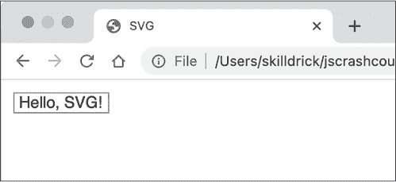

图 14-1: 我们的第一个 SVG 绘图

尝试放大页面（在 Windows 或 Linux 上使用 CTRL-+，在 macOS 上使用 COMMAND-+）。即使你缩放图像，矩形和文本应该依然清晰。

#### 分组元素

你可以通过将多个 SVG 元素嵌套在 g（代表*组*）元素内，将它们组合在一起。这很有用，因为在 g 元素本身设置的任何属性都会应用到所有子元素上。为了演示，更新你的 svg 元素内容，如 清单 14-3 所示。

```
`--snip--`
<svg width="600" height="600">
❶ <g font-family="sans-serif" fill="blue">
    <text x="0" y="20">Always</text>
    <text x="0" y="40">Be</text>
    <text x="0" y="60">Coding</text>
  </g>
</svg>
`--snip--` 
```

清单 14-3: 使用 g 元素分组元素

在这个例子中，我们创建了一个包含三个子文本元素的组，每个子元素包含一个单独的单词。文本元素的 x 坐标相同，但 y 坐标不同，因此这些单词会垂直堆叠并左对齐。父级 g 元素的属性（字体和填充 ❶）会应用于组中的所有子元素。重新加载页面，你应该看到所有三个单词都变成蓝色并且使用无衬线字体。

使用 g 元素创建分组还可以让你对组内的所有子元素应用*变换*。SVG 支持几种变换，包括平移、旋转、缩放和倾斜。我们将使用平移（translate）来将所有元素按固定的距离移动。通过以下更改更新 *index.html* 中的开头 g 元素标签：

```
`--snip--`
 <g transform="translate(100, 50)" font-family="sans-serif" fill="blue">
`--snip--` 
```

transform 属性接受一个由空格分隔的变换列表。在这里，我们传递了一个变换：translate(100, 50)。这表示将组内的所有元素沿 x 轴移动 100 像素，并沿 y 轴向下移动 50 像素。

我们还可以通过在平移变换后添加缩放变换来调整分组的大小：

```
`--snip--`
  <g transform="translate(100, 50) scale(2, 3) "font-family="sans-serif" fill="blue">
`--snip--` 
```

在平移之后，元素将水平缩放 2 倍，垂直缩放 3 倍，如 图 14-2 所示。

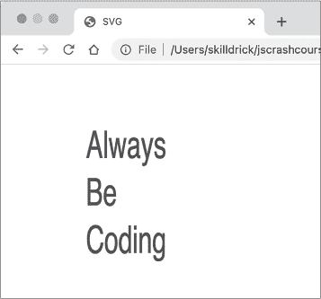

图 14-2: 变换后的分组元素

所有的变换都是相对于原点 (0, 0) 的，除非之前的平移操作已经移动了原点。这意味着缩放不仅影响元素的大小，还会影响元素的位置。例如，当你将一个左上角为 (10, 10)，右下角为 (30, 30) 的正方形缩放 2 倍时，新的角落坐标将是 (20, 20) 和 (60, 60)。相对于原点的 x 和 y 坐标都会被放大两倍。

#### 绘制圆形

你可以使用 circle 元素绘制一个 SVG 圆形。属性 cx 和 cy 设置圆形中心的坐标，r 设置半径。为了尝试，替换 svg 元素的内容为列表 14-4 中的代码。

```
`--snip--`
<svg width="600" height="600">
❶ <circle fill="#faa0a0" r="100" cx="124" cy="130"></circle>

❷ <g stroke="#944e30" stroke-width="3">
    <rect width="8" height="100" x="120" y="90" fill="#e1704d"></rect>
    <circle fill="#acd270" r="18" cx="124" cy="150"></circle>
    <circle fill="#fdfce2" r="18" cx="124" cy="120"></circle>
    <circle fill="#f8c9dc" r="18" cx="124" cy="90"></circle>
  </g>
</svg>
`--snip--` 
```

列表 14-4：绘制圆形

在这个例子中，我们使用了新的圆形元素，以及 g 和 rect 元素。第一个圆圈 ❶ 的填充颜色是 #faa0a0，即鲑鱼粉色，半径为 100 像素，中心坐标为（124，130）。请注意，我们在这里使用的是*十六进制颜色*——请查看下一页的“十六进制颜色”框以了解更多。接下来，我们使用一个组 ❷ 为矩形和三个较小的圆圈应用标准的描边颜色（栗色）和宽度（3 像素），填充颜色分别为绿色、黄色和玫瑰色。所有这些效果形成了一个可爱的插图，展示了日本的*花见团子*（在樱花季节非常流行的一种甜点），如图 14-3 所示。

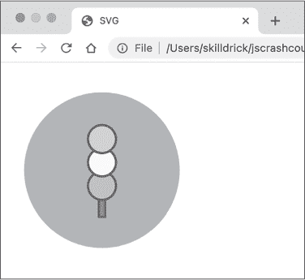

图 14-3：使用 SVG 圆形绘制花见团子的插图

请注意，元素声明的顺序决定了它们绘制的顺序。这三个小圆圈是从下到上声明的，所以在重叠的地方，上面的圆圈会覆盖在下面的圆圈上。同样，由于大圆圈首先声明，它被视为其余插图的背景。

#### 定义路径

path 元素是所有 SVG 元素中最强大的，它允许你通过在不同的点之间绘制直线或曲线（“路径”）来创建自定义形状。path 元素的 d 属性（*数据*的缩写）是一个包含路径定义的字符串，路径定义是路径命令的列表。这个字符串的语法被优化为尽可能紧凑，因此复杂的路径可以用相对较短的字符串表示。这对计算机来说很好，但对人类来说不好；不要指望这些字符串容易阅读。

在下一个例子中，我们将使用 path 元素重新创建 HTML5 标志，从外部盾牌形状开始。将 *index.html* 中 svg 元素的内容替换为列表 14-5 中的代码。

```
`--snip--`
<svg width="600" height="600">
  <path fill="#e44d26" d="M 0 0 H 182 L 165 185 L 90 206 L 17 185 Z"/>
  <path fill="#f16529" d="M 91 15 H 165 L 151 173 L 91 190 Z"/>
</svg>
`--snip--` 
```

列表 14-5：绘制 HTML5 标志盾牌

在深入研究路径定义之前，先了解一下结果应该是什么样子会有所帮助。重新加载页面，你应该能看到图 14-4 所示的盾牌设计。

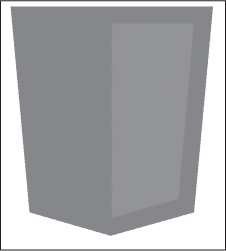

图 14-4：HTML5 标志盾牌

这个设计由两个路径组成，一个用于较深的主盾牌形状，另一个用于盾牌形状右半部分的亮部。让我们来看一下较暗部分的路径定义：

```
M 0 0 H 182 L 165 185 L 90 206 L 17 185 Z
```

这里有六个指令：

+   M 0 0

+   H 182

+   L 165 185

+   L 90 206

+   L 17 185

+   Z

可以把这些命令看作是让一个虚拟的笔在屏幕上移动以绘制线条。M 命令接受一个位置作为 (x, y) 坐标对，并将笔移动到该位置，而不绘制任何内容。H 命令接受一个 x 坐标，并从当前笔的位置绘制一条水平线到该 x 值。L 命令接受一个 (x, y) 坐标对，并从当前位置绘制一条线到那个位置。最后，Z 命令闭合路径，从当前的位置画一条线回到路径的起点。用英语来描述，路径中的命令是，“移动到 (0, 0)，绘制一条水平线到 (182, 0)，绘制一条线到 (165, 185)，绘制一条线到 (90, 206)，绘制一条线到 (17, 185)，然后绘制一条线回到 (0, 0) 来闭合路径。”第二条路径使用相同的技巧来绘制盾牌上的内侧高光，使用了不同的填充颜色。

这些命令使用 *绝对位置* 来定义要移动到的点，精确的 x 和 y 坐标。然而，每个命令都有一个替代版本，使用相对位置，这意味着下一个点是相对于当前笔的位置来定义的。绝对命令都使用大写字母，而相对命令则使用相同的字母，但小写。例如，我们刚才看到的路径定义可以用相对路径命令重写，像这样：

```
m 0 0 h 182 l -17 185 l -75 21 l -73 -21 z
```

在这种情况下，移动命令是相同的，因为没有之前的位置可以作为参考。命令 h 182 表示从当前的位置向右绘制 182 单位的水平线。命令 l -17 185 表示从当前位置向左绘制 17 单位并向下 185 单位，依此类推。Z 和 z 命令做的是同样的事情，它们仅仅为了完整性而出现在 SVG 规范中。

事实上，这个相对路径定义可以写得更紧凑：

```
m0 0h182l-17 185-75 21-73-21z
```

空格仅在避免两个数字之间的歧义时才需要，但在 SVG 路径中是可选的。由于有负数的存在，我们能够去除几乎所有的空格。此外，如果相同的命令连续多次使用，可以只写一次命令，然后继续提供数字。例如，l-17 185-75 21-73-21 是 l -17 185 l -75 21 l -73 -21 的简写版本。

> 注意

*SvgPathEditor (*[`yqnn.github.io/svg-path-editor/`](https://yqnn.github.io/svg-path-editor/)*)* *是一个非常有用的工具，用于实验和操作路径，并进行绝对和相对命令之间的转换（这也是我在这里用来转换这两种形式的工具）。SVG 有几个额外的路径命令，主要用于绘制各种类型的曲线。我们在这里不深入讨论这些内容，但你可以在 MDN 上找到完整的列表，网址是* [`developer.mozilla.org/SVG`](https://developer.mozilla.org/SVG)。

现在你已经理解了路径定义的工作原理，我们可以添加更多路径来填充完整的 HTML5 标志。按照清单 14-6 中的内容更新 svg 元素的内容（尽管如果你决定这太多打字了，我也不会因此看低你！）。

```
`--snip--`
<svg width="600" height="600">
 <path fill="#e44d26" d="M 0 0 H 182 L 165 185 L 90 206 L 17 185 Z"/>
 <path fill="#f16529" d="M 91 15 H 165 L 151 173 L 91 190 Z"/>
  <path fill="#ebebeb" d="m 34 38 h 57 v 23 h -32 l 2 24 h 30 v 23 h -51 z"/>
  <path fill="#ebebeb" d="m 41 118 h 23 l 2 18 l 25 7 v 24 l -47 -13 z"/>
  <path fill="#fff" d="m 148 38 h -57 v 23 h 55 z"/>
  <path fill="#fff" d="m 143 85 h -52 v 23 h 28 l -3 30 l -25 5 v 24 l 47 -13 z"/>
</svg>
`--snip--` 
```

清单 14-6：完成 HTML5 标志

我在这里使用了相对路径命令，部分是为了变化，部分是因为相对路径的数字更小，形成了更短的代码行。重新加载页面时，你应该能看到完整的 HTML5 标志，如图 14-5 所示。两个填充颜色为 #ebebeb（浅灰色）的路径绘制了数字 5 左侧的两部分，而两个填充颜色为 #fff（白色）的路径绘制了数字 5 右侧的两部分。


图 14-5：完整的 HTML5 标志

一般来说，当你创建数据可视化时，不需要手动输入路径定义。D3 会为你生成它们。不过，理解语法仍然有帮助，这样在调试时你能知道发生了什么。

#### 使用 CSS 样式化元素

当你将 SVG 嵌入到 HTML 文件中时，每个 SVG 元素都会成为 DOM 的一部分，因此可以使用 CSS 进行样式化。为了演示这个原理，我们将绘制一些 SVG 形状并为它们都指定类名。将 svg 元素的内容替换为清单 14-7 中的代码。

```
`--snip--`
<svg width="600" height="600">
  <circle class="boring" r="40" cx="50" cy="50"></circle>
  <rect class="boring" x="120" y="10" width="80" height="80"></rect>
  <path class="boring" d="M 230 90 l 40 -80 l 40 80 z"></path>"

  <circle class="fun" r="40" cx="50" cy="180"></circle>
  <rect class="fun" x="120" y="140" width="80" height="80"></rect>
  <path class="fun" d="M 230 220 l 40 -80 l 40 80 z"></path>"
</svg>
`--snip--` 
```

清单 14-7：带类名的一些 SVG 元素

在这里，我们绘制了一个圆形、一个方形和一个三角形，然后又绘制了一个圆形、方形和三角形。注意，三角形是通过路径绘制的——并没有像 rect 或 circle 那样专门的三角形元素。前三个形状的类名为 boring，后面三个的类名为 fun。重新加载页面时，你应该能看到两行三种形状，所有形状都有相同的默认黑色填充，如图 14-6 所示。

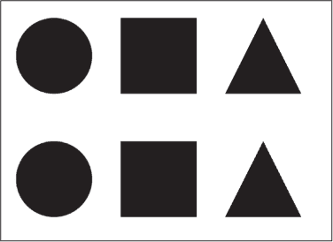

图 14-6：未样式化的 SVG 形状

现在我们将为形状添加样式。因为它们都有类名，所以我们可以像选择 HTML 元素一样在 CSS 中选择它们。将清单 14-8 中的代码添加到你的*style.css*文件中。

```
.boring {
  fill: none;
  stroke: black;
  stroke-width: 3px;
}

.fun {
  fill: hotpink;
  stroke: greenyellow;
  stroke-width: 5px;
  stroke-dasharray: 10,5;
  stroke-linejoin: round;
} 
```

清单 14-8：形状的样式

在这个清单中，我们为两个类指定了不同的样式：.boring 获得一个简单的黑色轮廓，.fun 获得粉色填充和一条粗的绿色-黄色虚线轮廓。请注意，样式化 SVG 元素的属性名称与 HTML 元素不同。例如，HTML 元素使用 background-color 和 border-color，而 SVG 元素使用 fill 和 stroke。

值得注意的是，你也可以直接将这些样式作为属性应用到 *index.html* 文件中的 SVG 元素。使用 CSS 的优势有两个：首先，它意味着所有的样式信息都集中在一个地方，便于更新；其次，要以相同的方式样式化多个元素，你只需为每个元素添加一个类名，而不必将所有属性从一个元素复制到另一个元素。

重新加载页面后，你应该注意到你的形状现在有了一些样式，如图 14-7 所示。

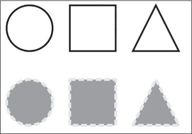

图 14-7：带样式的 SVG 形状

也可以在 SVG 元素上使用伪类，如 :hover。将清单 14-9 中的代码添加到 *style.css* 文件的末尾以尝试此功能。

```
`--snip--`
.fun:hover {
  fill: greenyellow;
  stroke: hotpink;
} 
```

清单 14-9：添加悬停效果

在这里，当鼠标悬停在 .fun 元素上时，我们交换了填充和描边的颜色。重新加载页面，亲自查看吧！

这是 SVG 相对于 Canvas API 的一个重大优势：浏览器了解 SVG 元素，知道例如鼠标何时悬停在它们上面。与此相比，Canvas 中浏览器只知道某些颜色的像素已经被绘制出来，任何鼠标悬停效果都必须在 JavaScript 中显式编码。

#### 使用 JavaScript 添加交互性

我们可以使用 JavaScript 为 SVG 元素添加交互性，就像使用 CSS 为它们设置样式一样。之所以可以实现这一点，是因为嵌入在 HTML 中的每个 SVG 元素都会成为 DOM 的一部分。首先，我们将编写一个脚本来选择这些元素，并将它们打印到控制台，以便复习 JavaScript DOM 方法。将清单 14-10 中的代码添加到当前空白的 *script.js* 文件中。

```
document.querySelectorAll(".fun").forEach(element => {
  console.log(element);
}); 
```

清单 14-10：选择 .fun 元素

在这个清单中，我们使用 querySelectorAll 方法来选择所有具有类名 fun 的元素。然后我们使用 forEach 方法遍历这些选中的元素并将它们打印到控制台。运行此代码时，你应该会看到三个元素在控制台中分别打印出来。如果你将鼠标悬停在控制台中的每个元素上，该元素也会在网页上高亮显示。

现在我们可以添加一些交互功能。清单 14-11 中的 *script.js* 代码修改后，当你点击某个元素时，该元素将向右移动；而当你按住 SHIFT 键并点击时，该元素将向左移动。

```
document.querySelectorAll(".fun").forEach(element => {
❶ element.setAttribute("data-offset", 0);

❷ element.addEventListener("click", event => {
  ❸ let offset = Number(event.target.getAttribute("data-offset"));

    if (event.shiftKey) {
      offset -=5;
    } else {
      offset +=5;
    }

  ❹ event.target.setAttribute("data-offset", offset);
  ❺ event.target.setAttribute("transform", `translate(${offset}, 0)`);
  });
}); 
```

清单 14-11：点击时移动 SVG 元素

在 forEach 方法调用内部，我们对每个元素做了两件事。首先，我们在每个元素上设置一个叫做*数据属性*的东西。数据属性是用于在 DOM 中存储数据的 HTML 或 SVG 属性，它们的名称都以"data-"字符串开头。具体来说，我们创建了 data-offset 数据属性，利用它来跟踪如何定位每个元素，并将其值设置为 0 ❶。请注意，DOM 属性始终以字符串形式存储，因此数字 0 将被转换为字符串"0"。

接下来，我们为每个元素附加一个点击事件处理器 ❷。处理器的第一件事是使用 getAttribute 提取被点击元素的 data-offset 属性，并将其值存储在变量 offset 中 ❸。被点击的元素可以通过事件对象上的 target 属性访问。请注意，我们在这里使用 Number 函数将字符串转换为数字。该处理器第一次被调用时，变量 offset 将被设置为 0，因为那是我们在 data-offset 属性中存储的初始值 ❶。

我们使用事件的 shiftKey 属性来判断鼠标点击时是否按下了 SHIFT 键。如果按下了，我们从 offset 中减去 5。否则，我们将 offset 加上 5。然后，我们使用 setAttribute 将更新后的值赋给 data-offset 属性 ❹。最后，我们再次使用 setAttribute 方法，但这一次是设置 transform SVG 属性 ❺。正如你在本章前面看到的，我们可以使用 transform 通过某个距离平移元素，使用字符串 translate(x, y)。在这里，我们将平移的 x 值设置为 offset 的值，平移的 y 值设置为 0。这意味着如果 offset 是正值，元素将向右移动，如果它是负值，元素将向左移动。

当你重新加载页面时，彩色的 SVG 元素应该会在你点击它们时移动。如果你右键点击其中一个元素并选择“检查”，你将看到该元素出现在元素面板中。随着你在浏览器视口中点击不同的元素，你应该会看到元素面板中的 data-offset 和 transform 属性更新。

### D3 库

现在你已经了解了 SVG 的基础知识，可以开始学习 D3 库，它结合了 SVG 和 JavaScript 来创建数据可视化。*D3*，即*数据驱动文档*，让你能够创建内容由数据驱动的文档。它通过一种叫做*数据绑定*的技术实现这一点，在这种技术中，想要可视化的底层数据的各个部分与页面上的各个元素进行链接。这样，如果数据发生变化，元素也会随之变化。你将在本节后面看到它是如何工作的。

#### 设置

我们将创建一组新的文件来探索 D3。创建一个名为 *data* 的新目录，包含一个空的 *script.js* 文件和一个包含 清单 14-12 内容的 *index.html* 文件。

```
<!DOCTYPE html>
<html>
  <head>
    <title>Data</title>
  </head>
  <body>
  ❶ <svg width="600" height="600">
      <circle cx="50" cy="50" r="10"></circle>
      <circle cx="100" cy="50" r="10"></circle>
      <circle cx="150" cy="50" r="10"></circle>
    </svg>

  ❷ <script src="https://unpkg.com/d3@7.4.4/dist/d3.js"></script>
    <script src="script.js"></script>
  </body>
</html> 
```

清单 14-12：一个新的 index.html 用于与 D3 一起使用

首先我们创建一个 svg 元素❶并绘制三个圆形。然后我们使用一个脚本元素链接到托管在 [*https://<wbr>unpkg<wbr>.com*](https://unpkg.com) ❷ 上的 D3 库副本，和我们在音乐项目中使用 Tone.js 的方式类似。现在你就可以在你的 *script.js* 文件中使用 D3 的代码了。当你加载页面时，应该会看到三个黑色圆形。很快我们将使用 D3 来操作这些圆形。

#### 选择

D3 的基本构建块之一是 *选择*，它是一种选择一组元素的方法，以便可以对这些元素应用某些操作。让我们使用 D3 选择三个 SVG 圆形并将它们的填充颜色更改为热粉色。将 清单 14-13 中的代码添加到 *script.js*。

```
d3.selectAll("circle").attr("fill", "hotpink");
```

清单 14-13：选择圆形

d3.selectAll 方法接受一个 CSS 选择器，这里是元素名称 circle，并返回一个 D3 选择，你可以在其上链式调用更多方法。那些链式调用将应用于所有符合选择器的元素。在这里，我们将选择中的每个元素的 "fill" 属性设置为 "hotpink"。当你重新加载页面时，你应该会看到黑色圆形现在变成了粉色。

在更新选择中的元素时，也可以使用函数而不是值。当你这样做时，函数会被调用并返回一个值，这个返回值将作为更新这些元素的值。这使你能够动态地修改元素。更新 *script.js* 中的代码，应用 清单 14-14 中的更改，以查看它是如何工作的。

```
d3
  .selectAll("circle")
  .attr("fill", "hotpink")
❶ .attr("r", (d, i) => 10 + i * 5); 
```

清单 14-14：使用函数计算值

对于像这样的长方法链，通常会将代码拆分成多行以提高可读性。如前所述，我们选择了所有圆形并将其填充颜色设置为热粉色，但这一次我们还更新了每个圆形的半径❶。这里用于生成值的函数有两个参数，d 和 i。我们将在下一节中介绍 d 参数，它是 *datum*（数据项）的缩写。i，作为 *index*（索引）的缩写，是选择中元素的索引（第一个圆形的索引为 0，第二个为 1，依此类推）。我们使用代码 10 + i * 5 来根据索引编号为每个圆形设置不同的半径。具体来说，这些圆形的半径将是 10、15 和 20。当你重新加载页面时，你应该会看到这三个圆形的大小现在都不同了。

> 注意

*像 .attr 这样的 D3 选择修改方法返回的是选择本身。这让我们可以继续链接修改方法，正如我们在 清单 14-14 中通过两个 .attr 调用所做的那样。*

如果你想选择单个元素而不是一组元素，请使用 d3.select 方法，而不是 d3.selectAll。例如，要将 h1 元素插入到 HTML 的 body 元素中，你可以将 清单 14-15 中的代码添加到 *script.js* 文件的末尾。

```
`--snip--`
d3
  .select("body")
  .insert("h1", "svg")
  .text("Hello, D3!"); 
```

清单 14-15：使用 select 选择单个元素

在这个示例中，我们首先选择 body 元素。然后我们在此选择上调用 insert，传入两个参数，"h1" 和 "svg"。第一个参数是要插入的元素类型，第二个是要插入该元素之前的元素。insert 方法返回一个新的选择，包含插入的元素，text 方法则向该选择中的元素（在这个案例中是单个 h1 元素）添加文本内容。当你重新加载页面时，你应该会看到在 SVG 元素上方有一个标题，文本为 “Hello, D3!” 这个示例还说明了 D3 选择可以同时应用于 HTML 和 SVG 元素。

#### 数据绑定

或许 D3 最重要的特性是它的数据绑定概念。在基于 D3 的应用程序中，你将有一些数据需要可视化。每个数据单元，称为 datum，将绑定到页面上的一个元素（通常是 SVG 元素）。你使用 datum 来设置绑定元素的某个属性，从而使元素在视觉上反映出该 datum。

首先，我们来看如何将数据绑定到现有的 SVG 元素。保留 *index.html* 中的圆圈，但将 *script.js* 的内容替换为 清单 14-16 中的代码。

```
let numbers = [3, 2, 1];

d3
  .selectAll("circle")
❶ .data(numbers)
  .attr("r", (d, i) => d * 5); 
```

清单 14-16：将数据绑定到我们的圆圈

我们首先创建一个数字数组用作数据。然后我们创建一个所有圆圈元素的选择。data 方法 ❶ 将数字数组一个个绑定到圆圈选择上，因此第一个圆圈元素绑定了值 3，第二个绑定了 2，第三个绑定了 1。最后，我们使用 attr 方法根据绑定的数据设置每个圆圈的半径为计算值。如你在前一节中所见，如果你使用函数而不是值来设置属性，该函数将被调用，以便为选择中的每个元素计算该值。函数的 d 参数对应于绑定到当前元素的 datum。

当你重新加载页面时，你应该看到三个从左到右逐渐变小的黑色圆圈。为了确认一切按预期工作，右键单击第一个圆圈并选择**检查**，以在元素面板中显示该元素。你应该看到它的 r 属性设置为 15，这正是我们从 d * 5 中期望的值，其中 d 为 3。

你还可以使用检查工具直接查看元素上设置的数据，这对于调试非常有帮助，尤其是在你的数据比简单的数字更复杂时。你所需要的只是对该元素的引用，这可以通过 Chrome 控制台轻松获取。再次右键点击第一个圆形并选择**Inspect**。你应该能看到类似于 Figure 14-8 的内容。

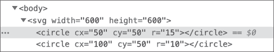

Figure 14-8: 在元素面板中选择圆形元素

在选中行的末尾，你应该看到文本== $0。这表明一个对圆形元素的引用存储在名为$0 的全局变量下。为了验证这一点，打开 JavaScript 控制台并输入$0：

```
**$0**
<circle cx="50" cy="50" r="15"></circle> 
```

控制台打印了你选中的圆形元素，表明$0 确实是该元素的引用。现在，你已经得到了这个引用，可以通过 __data__ 属性查看绑定到它的数据：

```
**$0.__data__**
3 
```

这告诉你，圆形绑定到了值 3，这是我们数组中的第一个数字，正如我们预期的那样。$0 始终引用当前选中的元素，因此如果你右键点击并检查另一个圆形，再次在控制台输入$0.__data__ 将会给出绑定到那个圆形的数据。

#### 数据连接

你并不总是能准确知道数据的长度，因此始终准备好恰当数量的 SVG 元素来绑定到你的数据上是困难的。D3 通过*join*的概念解决了这个问题。在 D3 中，你使用 join 来添加或移除必要的元素，以匹配绑定的数据。

我们可以通过在 Listing 14-16 的基础上添加一个 join 来扩展我们的示例，以便根据数字数组的长度，动态地添加或移除 SVG 圆形元素。请按照 Listing 14-17 中的示例更新*script.js*文件。

```
❶ let numbers = [3, 2, 1, 2, 3];

d3
❷ .select("svg")
 .selectAll("circle")
 .data(numbers)
❸ .join("circle")
  .attr("r", (d, i) => d * 5); 
```

Listing 14-17: 加入额外的元素

在这里，我们创建了一个更长的数字数组❶。我们还添加了一行代码来选择 svg 元素❷，然后再选择其中的圆形元素。这是必要的，因为 D3 需要添加新的圆形元素，它需要知道将它们添加到哪个包含元素中。最后，我们调用了 join 方法❸。这个方法接受从选择中添加或移除元素的名称，以匹配数据。在这种情况下，我们是在说，如果 svg 元素中没有足够的圆形元素来匹配数据中的所有项，那么 D3 应该添加更多的元素（或者如果元素太多，D3 应该移除一些）。

如果重新加载页面，你会发现结果可能没有你预期的那样。所有新生成的圆形元素都出现在绘图区的左上角。这是因为这些新圆形元素没有设置 `cx` 或 `cy` 属性，而最初在 *index.html* 中定义的三个圆形元素则有这些属性。为了解决这个问题，我们需要使用 D3 设置这两个属性，具体代码见 Listing 14-18。

```
let numbers = [3, 2, 1, 2, 3];

d3
 .select("svg")
 .selectAll("circle")
 .data(numbers)
 .join("circle")
  .attr("cx", (d, i) => (i + 1) * 50)
  .attr("cy", 50)
 .attr("r", (d, i) => d * 5); 
```

Listing 14-18: 设置 cx 和 cy 属性

`cx` 属性是基于数据的索引计算的。第一个元素应位于 50，第二个元素应位于 100，以此类推。计算公式 `(i + 1) * 50` 给出了正确的值。由于所有圆形在一条直线上，`cy` 属性只是一个常量值。现在当你重新加载页面时，你应该能看到五个圆形排成一行。

> 注意

*如前所述，当元素过多时，你可以使用相同的 `join` 技术来移除它们。如果你将数字数组更改为仅包含两个元素并重新加载页面，你会看到只有两个圆形。*

既然我们使用 D3 的 `join` 方法根据数据需要动态创建 SVG 元素，就没有必要在 HTML 文件中创建它们了。请按 Listing 14-19 所示修改 *index.html*，删除所有圆形元素，然后重新加载页面。

```
`--snip--`
 <body>
    <svg width="600" height="600"></svg>

 <script src="https://unpkg.com/d3@7.4.4/dist/d3.js"></script>
 <script src="script.js"></script>
 </body>
</html> 
```

Listing 14-19: 移除圆形元素

一切仍然应该正常工作，因为 `join` 方法会添加所需的所有圆形元素。请注意，`script.js` 中的 `.selectAll("circle")` 这一行仍然是必须的，尽管第一次调用时没有圆形元素可供选择，`join` 才能正确工作。

#### 实时更新

如果基础数据发生变化，我们需要再次执行 `join` 来更新可视化效果。为此，我们将所有的数据绑定和 `join` 代码移到一个独立的函数中，这样就可以根据需要调用。我们可以通过向页面添加一些按钮来测试这个功能，这些按钮允许我们向数字数组的开头或末尾添加随机值，或从数组中删除数字。请按 Listing 14-20 所示更新 *index.html*。

```
`--snip--`
 <body>
    <div>
      <button id="prepend">Prepend</button>
      <button id="append">Append</button>
      <button id="drop">Drop</button>
    </div>

 <svg width="600" height="600"></svg>
`--snip--` 
```

Listing 14-20: 向 index.html 添加按钮

重新加载页面后，你应该能看到页面顶部的三个新按钮。接下来，我们将把更新可视化效果的代码移到一个独立的函数中。请用 Listing 14-21 中的内容替换 *script.js* 中的代码。

```
let numbers = [3, 2, 1];

❶ function update(data) {
  d3
    .select("svg")
    .selectAll("circle")
  ❷ .data(data)
    .join("circle")
    .attr("cx", (d, i) => (i + 1) * 50)
    .attr("cy", 50)
 .attr("r", (d, i) => d * 5);
}

❸ update(numbers); 
```

Listing 14-21: 将更新代码移入独立函数

这里没有功能上的变化——我们只是创建了一个更新函数来为我们执行 SVG 更新❶，然后调用它❸。请注意，我们将数据（函数的参数）传递给了`.data`方法❷，而不是直接传递数字数组。

接下来，我们将添加处理按钮点击的代码，这些代码将会在数字数组的开头或末尾插入一个 1 到 5 之间的随机浮动数字，或者移除数组中的最后一个元素。将 Listing 14-22 中的代码添加到*script.js*的末尾。

```
`--snip--`
update(numbers);

❶ function getRandomNumber() {
  return 1 + Math.random() * 4;
}

❷ d3.select("#append").on("click", () => {
  numbers.push(getRandomNumber());
  update(numbers);
});

❸ d3.select("#prepend").on("click", () => {
  numbers.unshift(getRandomNumber());
  update(numbers);
});

❹ d3.select("#drop").on("click", () => {
  numbers.pop();
  update(numbers);
}); 
```

Listing 14-22: 按钮点击时的更新

首先，我们声明一个用于生成随机数的辅助函数❶，因为有两个地方需要这样做。然后我们声明三个按钮的事件处理器。请注意，我们没有像本书之前所做的那样使用常规的 DOM API 方法来添加点击事件处理器，而是使用`d3.select`来选择按钮，并使用`on`方法添加事件处理器。常规的 DOM API 方法也能工作，但使用 D3 方法更简洁，并且与此文件中的其他 D3 代码更加一致。

第一个事件处理器通过点击“Append”按钮触发❷：它将一个随机数推入数字数组的末尾，然后我们调用更新函数重新绘制可视化，添加一个额外的圆圈。第二个事件处理器通过点击“Prepend”按钮触发，它会将一个随机数插入到数字数组的开头❸。第三个事件处理器通过点击“Drop”按钮触发；它从数组中弹出最后一个数字❹。在每个操作之后，我们也会调用更新函数。

重新加载页面并尝试不同的按钮。你应该会看到元素根据需要被添加和移除。

#### 过渡与关键函数

不同于每次数据变化时突然更新 D3 可视化，你可以使用*过渡*来允许元素在变化时动画其属性。过渡是 D3 中的一个有用特性，因为如果做得正确，它们可以让你看到数据是如何演变的。让我们在更新函数中添加一个过渡，看看它是如何工作的。做出 Listing 14-23 所示的更改。

```
`--snip--`
function update(data) {
 d3
 .select("svg")
 .selectAll("circle")
 .data(data)
    .join("circle")
    .transition()
    .duration(500)
 .attr("cx", (d, i) => (i + 1) * 50)
 .attr("cy", 50)
 .attr("r", (d, i) => d * 5);
}
`--snip--` 
```

Listing 14-23: 添加过渡

在这样的链式调用中，`transition`方法意味着每个后续的属性变化都会从当前值动画过渡到新值。`duration`方法设置动画的时长（以毫秒为单位）。这意味着每个圆圈的位置和半径将花费半秒（500 毫秒）时间，从当前值过渡到新值。新的圆圈从每个属性的默认值 0 开始，因此它们会从 SVG 的左上角过渡进来。

不幸的是，由于我们编写的更新函数，动画的效果可能不会像你想要的那样令人满意。重新加载页面并点击**Prepend**几次。你应该会看到一些奇怪的行为。你可能期待现有的圆圈向右移动，为左侧添加的新圆圈腾出空间。但实际上，现有的圆圈似乎都在原地调整大小，而一个新的圆圈从左上角飞入，并出现在现有圆圈的右侧。通过这种动画，其实很难看出元素是被*插入到左边*的。相反，动画给人一种元素是被*附加到右边*的感觉，并且所有元素都在调整大小。而点击 Append 按钮则会做正确的事情：一个新元素会动画显示并出现在行的末尾，而现有元素没有变化。

这里的问题是，当 D3 使用新的数据数组更新现有选择时，它使用一种称为*按索引连接*的默认模式。这意味着数组中的第一个项与选择中的第一个元素连接（在本例中是最左边的圆圈），数组中的第二个项与选择中的第二个元素连接，依此类推。如果数组中的项比现有的 SVG 元素多，新的元素会被添加到末尾。因此，当你点击 Prepend 并将新数字添加到数据数组的开始时，行中的每个圆圈都会重新绑定到一个新的数据项。行中的第一个圆圈会绑定到添加到数组开头的新数字，因此它会看起来被调整大小。第二个圆圈会绑定到原来数组中的第一个数字，因此它也会看起来被调整大小，依此类推。最后，由于现在的数据项比 SVG 元素多一个，新的圆圈会在行的末尾创建并添加。

使动画更加直观的解决方案是帮助 D3 理解数据数组中每个元素的*身份*。我们不再假设数组中的每个索引总是与选择中的相同索引对应，而是提供 D3 所称的*关键函数*。关键函数使我们能够指定每个数据项的某些特征，以唯一标识它。这样，即使新数据被添加，现有数据仍然绑定到相同的 SVG 元素，而不管数据的顺序如何。

关键函数作为可选的第二个参数传递给数据方法。列表 14-24 展示了更新函数所需的更改。

```
`--snip--`
 .selectAll("circle")
  .data(data, d => d)
 .join("circle")
`--snip--` 
```

列表 14-24: 添加关键函数

这里的关键函数 d => d 表示给定一个数据项时，数据项本身就是唯一标识符。在这个例子中，我们只是使用原始数字，所以数字的值就相当于我们能得到的“唯一”标识符。通常，你会处理更复杂的数据，并且可以使用键函数来暴露一个实际上是唯一的标识符。例如，如果每个数据项都是一个表示员工的对象，并且每个员工有一个唯一的 employeeId 属性，那么你可以使用像 d => d.employeeId 这样的键函数。

重新加载页面并点击 **Prepend**。你应该会看到所有圆形元素向右滑动，以容纳新加入的元素。这是因为 D3 现在知道当数组发生变化时，新的数组项应该映射到选择中的哪个元素。

#### 高级连接

D3 的 join 方法提供了额外的选项，让你可以更好地控制可视化在数据变化时的响应。当 D3 将新数据与现有选择进行连接时，一些元素可能会被更新，一些可能会被添加（对于没有现有元素的新数据项），而一些元素可能会被删除。在我们的案例中，我们看到点击 **Prepend** 不仅会添加新元素，还会通过将其他元素向右移动来更新所有元素。与此同时，点击 Drop 会删除最后一个元素。在 D3 的术语中，添加新元素叫做 *enter*，删除现有元素叫做 *exit*，而修改现有元素叫做 *update*。

你可以通过传递三个函数来定制 join 方法，这些函数会针对这三种可能的元素变化进行调用。这样，你就能指定三种不同的行为：一种是进入元素时的行为，一种是更新元素时的行为，另一种是退出元素时的行为。要测试这个功能，请按照 清单 14-25 中所示的方式修改你的 update 函数。开始时，这些变化会产生与前一个清单中的简单 join 方法相同的行为。

```
`--snip--`
 .data(data, d => d)
  .join(
    enter => enter.append("circle"),
    update => update,
    exit => exit.remove()
  )
 .transition()
`--snip--` 
```

清单 14-25：带有 enter、update 和 exit 函数的 join 方法

这个更高级的 join 方法版本需要传入三个函数。第一个函数有一个名为 enter 的参数，这是一个临时占位符的选择集，用于表示每个进入的元素。为了获得与简单的 .join("circle") 版本相同的行为，我们只需使用 append 方法将一个圆形元素添加到每个 enter 占位符中。请注意，enter 占位符本身不是 DOM 中的元素。它们只是 D3 给你提供一个位置来附加新进入的元素，直到它们被添加到 DOM 中。例如，如果有五个新的元素需要进入，那么 enter.append("circle") 会创建五个新的圆形元素并将它们放入 svg 元素中。

第二个函数有一个名为 update 的单一参数，它是一个包含所有已绑定数据项的现有元素的选择集。为了得到与之前相同的行为，我们只需返回未更改的选择集。

第三个函数有一个名为 exit 的单一参数，它是一个包含所有应该被移除的元素的选择集，因为这些元素不再有对应的数据项。为了得到与之前相同的行为，我们在选择集上调用 remove 方法，它会将每个退出的元素从 DOM 中移除。

当你重新加载页面时，你应该看到与之前相同的行为；到目前为止，这个变化不会对功能产生任何影响。不过，既然我们已经让它正常工作了，我们可以重新设计动画，增加一些细节。目前，更新选择中的元素的右移动画是可以的，但进入的元素现在是从左上角飞入，而退出的元素只是消失了。我们不妨改成这样：让进入的元素从正确的位置增长到位，而退出的元素则从当前位置缩小至消失。实现这种行为的更改可以参见 Listing 14-26。

```
`--snip--`
function update(data) {
 d3
 .select("svg")
 .selectAll("circle")
 .data(data, d => d)
 .join(
      enter => enter
      ❶ .append("circle")
        .attr("cx", (d, i) => (i + 1) * 50)
        .attr("cy", 50)
        .transition()
        .duration(500)
      ❷ .attr("r", (d, i) => d * 5),
      update => update
        .transition()
        .duration(500)
      ❸ .attr("cx", (d, i) => (i + 1) * 50),
      exit => exit
        .transition()
        .duration(500)
      ❹ .attr("r", 0)
      ❺ .remove()
    );
}

update(numbers); 
`--snip--` 
```

Listing 14-26: 细化动画

在这段更新的代码中，我们将所有过渡都移到了各自的 enter、update 和 exit 函数中，而不是为所有元素调用一个单一的 transition 方法。enter 函数首先添加一个圆形元素❶，然后立即设置它的位置（即 cx 和 cy 属性），但不设置半径。一旦位置设置好，我们使用 transition 方法将半径从零（默认值）动画过渡到根据数据项计算的值❷。这里的顺序非常重要：任何在调用 transition 之前的操作会立即发生，而在调用 transition 之后的操作会进行动画过渡。这意味着任何新的圆形元素会立即出现在正确的位置，且大小的变化（从零到期望的半径）会进行动画过渡。这比之前的版本看起来更自然，后者是所有三个属性从零动画过渡过来，导致圆形元素从角落飞入。

update 函数只需要对圆形元素❸的 cx 属性进行动画，以将其滑动到更新后的位置。其他属性对于现有元素应该保持不变。最后，exit 函数将圆形的半径动画过渡回零❹，然后再将其移除❺。如果在调用 transition 后调用 remove 方法，如这里所示，那么实际的元素移除将在动画完成后进行。

当你重新加载页面时，你应该看到新的改进动画：新元素在合适的位置扩展，移除的元素则缩小消失。

### 创建条形图

现在你已经学习了 D3 的基础知识，让我们在一个小项目中应用它们：创建一个条形图，展示文本框中字符的频率。每当输入或粘贴新的文本时，条形图都会更新。创建这个可视化图表将帮助你练习数据连接，教你一些新技术，比如绘制坐标轴来为数据提供上下文，同时为下章的更大项目做好准备。

#### 设置

首先，创建一个名为 *frequency* 的新目录，并添加空的 *script.js* 和 *style.css* 文件。然后创建一个 *index.html* 文件，并将 清单 14-27 中的代码添加进去。

```
<!DOCTYPE html>
<html>
  <head>
    <title>Character Frequency</title>
    <link rel="stylesheet" href="style.css">
  </head>
  <body>
    <div>
    ❶ <textarea rows="5" cols="70"></textarea>
    </div>
 <script src="https://unpkg.com/d3@7.4.4/dist/d3.js"></script>
    <script src="script.js"></script>
  </body>
</html> 
```

清单 14-27：字符频率项目的 index.html 文件

这个 HTML 文档遵循了本书中一直使用的模式。唯一新增的元素是 textarea 元素 ❶，它创建了一个多行文本输入框。rows 和 cols 属性设置了文本区域的行数和宽度（以固定宽度字符为单位）。

请注意，文档中没有 svg 元素。我们将通过 JavaScript 来创建它。这是因为我们需要多次引用 svg 元素的宽度和高度来确定可视化中元素的位置，因此在 JavaScript 中定义这些参数比在 HTML 文件中定义更为合理。由于我们将定义宽度和高度在 JavaScript 中，因此也可以直接在 JavaScript 中创建 svg 元素。我们现在就来做这件事。将 清单 14-28 中的代码添加到 *script.js* 中。

```
const width = 600;
const height = 600;

// Add an svg element to the page
let svg = d3
  .select("body")
  .append("svg")
  .attr("width", width)
  .attr("height", height); 
```

清单 14-28：使用 JavaScript 创建 svg 元素

我们首先声明常量来表示 svg 元素的宽度和高度。然后，使用 D3 选择 body 元素，并将一个 svg 元素添加到其中，同时设置宽度和高度属性。我们将创建元素的结果保存到变量 svg 中，因为之后我们还会用到它。

#### 计算字符频率

接下来，我们将添加读取文本区域中内容并计算每个字符出现次数的代码。这将生成可视化所需的底层数据。每次文本更改时，我们都需要更新数据并重新绘制图表。不过现在，我们只需要读取文本，计算字符频率，并将结果输出到控制台。将 清单 14-29 中的代码添加到 *script.js* 的末尾。

```
`--snip--`
d3.select("textarea").on(❶ "input", e => {
❷ let frequencies = {};

❸ e.target.value.split(" ").forEach(char => {
    let currentCount = frequencies[char] || 0;
 frequencies[char] = currentCount + 1;
  });

  console.log(frequencies);
}); 
```

清单 14-29：计算字符频率

输入事件 ❶ 在文本区域内容发生变化时触发，无论是打字、删除、粘贴，还是其他操作。在事件处理函数的第一步，我们初始化一个新对象来跟踪字符频率 ❷。这个频率对象将字符作为键，字符出现的次数作为值。接着，我们获取事件的目标（文本区域），获取其值（文本内容），并将其拆分为单独的字符 ❸。对于每个字符，我们确定该字符的当前计数，如果该字符之前没有出现过，则默认为 0。然后我们将计数加 1，并将新的计数值存储回对象中。所有字符计数完成后，我们将频率对象记录到控制台，以便检查一切是否按预期工作。请注意，我们每次文本内容发生变化时都会重新计算频率对象，而不是仅仅尝试跟踪添加或删除的字符。这使得处理多个字符同时添加或删除的情况变得更加容易，例如当文本被粘贴到文本框中时。

加载页面后，你应该能看到文本区域（svg 元素不可见，但如果想检查它是否存在，可以在“元素”面板中查看）。当你在文本区域中输入文字时，应该能看到每次键入时都会将对象记录到控制台，每次记录的对象都包含文本区域中字符的频率。例如，如果你输入单词*hello*，在键入最后一个*o*之后，你将得到如下对象：

```
{"h": 1, "e": 1, "l": 2, "o": 1}
```

一个包含所有字符及其频率的单一对象对于控制台日志输出非常有效，但我们要在 D3 渲染时使用的是一个对象数组，每个对象描述一个字符及其相关的频率。这样，数组中的每一项就会是绑定到柱状图中一根柱子的单一数据项。为了让图表更易于阅读，数组应该按字符字母顺序排序。继续使用单词*hello*，我们需要类似下面的内容，而不是之前显示的对象：

```
[
  {"char": "e", "count": 1},
  {"char": "h", "count": 1},
  {"char": "l", "count": 2},
  {"char": "o", "count": 1}
] 
```

为了将数据转换为这种数组格式，请按照列表 14-30 中所示修改*script.js*的结尾部分。

```
`--snip--`
 frequencies[char] = currentCount + 1;
 });

❶ let data = Object.entries(frequencies).map(pair => {
    return {char: pair[0], count: pair[1]};
  });

❷ data.sort((a, b) => d3.ascending(a.char, b.char));

  console.log(data);
}); 
```

列表 14-30：将频率数据转换为数组

首先，我们使用 `Object.entries` 将频率对象转换为一个包含两个元素数组的数组 ❶，其中第一个元素是键，第二个元素是值。我们将这个数组映射为一个对象数组，其中键存储在 `char` 属性下，值存储在 `count` 属性下。接下来，我们希望按字符排序数据。`sort` 方法 ❷ 通过对每一对元素 a 和 b 应用比较函数，确定 a 是否应该排在 b 后面，反之亦然，从而对数组中的元素进行排序。在这里，我们使用 `d3.ascending` 比较函数，传入 `a.char` 和 `b.char`，意味着数组会根据每个对象的 `char` 属性按字母升序排序。

刷新页面后，您应该能看到文本区域中的文本变化时，这个新的数据数组作为日志被记录。

#### 绘制条形图

现在我们已经将数据转换为所需的格式，可以将其渲染为条形图。我们暂时从一个基本的、简单的渲染开始，即简单地创建与字符频率成比例的宽度的 SVG `rect` 元素。然后我们将逐步改进，创建一个更具信息量的可视化。请按照清单 14-31 中的更改，修改 *script.js*。

```
`--snip--`
// Add an svg element to the page
let svg = d3
 .select("body")
 .append("svg")
 .attr("width", width)
 .attr("height", height);

❶ function update(data) {
  svg
    .selectAll("rect")
    .data(data)
  ❷ .join("rect")
    .attr("width", (d, i) => d.count * 5)
    .attr("height", 10)
    .attr("x", 20)
 .attr("y", (d, i) => i * 20);
}

d3.select("textarea").on("input", e => {
--snip--

 data.sort((a, b) => d3.ascending(a.char, b.char));

❸ update(data);
}); 
```

清单 14-31：定义更新函数

在这里，我们声明了一个更新函数 ❶，每当文本发生变化 ❸ 时，该函数都会被调用。该函数根据我们之前学到的模式创建、更新或删除渲染数据所需的 SVG 元素，使用 `data` 方法将数据绑定到选择项，并使用简单版本的 `join` 方法连接必要的元素。

`join` 方法返回一个包含所有当前 `rect` 元素的选择集 ❷，包括刚刚添加的元素。现在，每个 `rect` 都与一个数据项绑定，该数据项表示单个字符及该字符的出现次数。我们设置了适当的 `width`、`height`、`x` 和 `y` 属性，以创建一个水平的条形图。`width` 属性设置为字符计数的 5 倍，因此每新增一个字符，条形图的宽度就会增加 5 像素。`height` 属性设置为常数值 10（所有条形图的高度相同），`x` 属性设置为常数值 20（所有条形图都从 SVG 元素左侧的 20 像素处开始）。`y` 属性设置为数据项索引的 20 倍，这意味着每 20 像素就会出现一根条形图，条形图之间的间隔为 10 像素。

刷新页面并在文本区域输入单词 *hello*。当您输入每个字母时，您应该看到条形出现在 SVG 元素中，或在更新后显示类似于图 14-9 的内容。

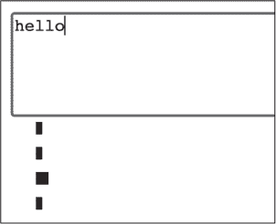

图 14-9：基本条形图

到目前为止，一切顺利，但我们仍然有一些问题要解决。这里有两个主要问题。首先，没有坐标轴或标签，我们不知道每个条形代表什么字符，也不知道条形的宽度对应什么。其次，条形的宽度和高度没有自动缩放，这意味着目前我们最多只能有 30 个不同的字符，每个字符的计数是 116，超过这个限制条形就无法在 600×600 像素的 SVG 元素中显示。幸运的是，这两个问题都可以通过使用 D3 轻松解决。

缩放条形

在 D3 中，*scale*（比例尺）是将某些数据值转换为视觉值的一种方式。例如，之前我们将字符频率图中条形的宽度设置为数据值的五倍，这是一种简单的缩放方式。在这种情况下，我们手动设置了缩放因子，但 D3 也可以根据数据值的最小值和最大值（即*domain*，区间）以及显示值的最小值和最大值（即*range*，范围）自动确定缩放。

例如，假设你在绘制一个人的年龄图表。你的数据值范围是从 0 到 105，而渲染这些值的空间范围是从 SVG 的左侧起 30 到 330 像素。因此，你的区间是[0, 105]，你的范围是[30, 330]。数据区间中的 0 值映射到视觉范围中的 30，而 105 值映射到 330。请参见图 14-10 以获取这种映射的视觉表示。

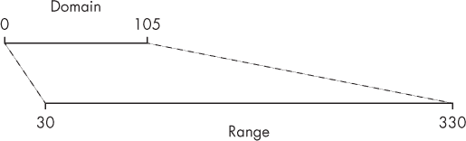

图 14-10：将[0, 105]区间的值缩放到[30, 330]的范围

D3 缩放的美妙之处在于，缩放因子可以根据区间的变化动态变化。这样，当前的最大数据值总是能够映射到完整的视觉范围，即使最大数据值发生了变化。为了实现这种动态缩放，我们需要跟踪所有数据中的最大计数值，并使用它作为区间的上限。因此，如果最大计数值增加，未达到最大计数的条形会相应地缩小，而最大计数的条形将继续占据完整的水平范围。例如，假设我们条形的视觉范围是[0, 500]，并且我们有以下数据：

```
[
  {"char": "a", "count": 1},
  {"char": "b", "count": 1},
  {"char": "c", "count": 2}
] 
```

我们数据的区间是[0, 2]。 "c"条的宽度为 500 单位，"a"和"b"条的宽度各为 250 单位。如果我们再添加两个"c"条，"c"条的宽度仍为 500 单位，但现在"a"和"b"条的宽度将各自缩小为 125 单位。

现在让我们实现动态水平缩放。修改你的脚本，参考清单 14-32 中的代码。

```
`--snip--`
// Add an svg element to the page
let svg = d3
 .select("body")
 .append("svg")
 .attr("width", width)
 .attr("height", height);

let margin = {top: 20, right: 10, bottom: 20, left: 50};

function update(data) {
❶ let xScale = d3.scaleLinear()
    .domain([0, d3.max(data, d => d.count)])
    .range([margin.left, width - margin.right]);

 svg
 .selectAll("rect")
 .data(data)
 .join("rect")
  ❷ .attr("width", (d, i) => xScale(d.count) - xScale(0))
 .attr("height", 10)
  ❸ .attr("x", xScale(0))
 .attr("y", (d, i) => i * 20);
}
`--snip--` 
```

清单 14-32：为条形宽度创建比例尺

首先，在更新函数定义之前，我们创建一个对象，描述我们的条形图图表的边距。这些值表示图表主体距离 SVG 元素边缘的距离。如图 14-11 所示，当时机到来时，我们将使用这些边距来确定绘制条形图和坐标轴的位置。

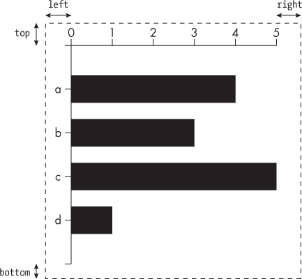

图 14-11: 边距如何用来定位 SVG 元素中的图表（虚线）

在更新函数内部，我们使用 d3.scaleLinear 方法创建一个比例尺❶。这意味着输入值线性映射到输出值（例如，不是对数映射）。我们将数据领域设置为从 0 到最大计数，使用 D3 的 max 助手。这个助手接受一个数据数组和一个返回数据项值的函数，然后返回最大值。在这里，它返回的是最大计数值。范围设置为从 margin.left 到 width - margin.right，给出最长条形图右侧的位置。

scaleLinear 助手提供了一个函数，它将数据领域映射到视觉范围，我们将其分配给变量 xScale。（如第五章所讨论，高阶函数可以返回另一个函数，scaleLinear 就是这样做的。）我们修改宽度属性设置，调用 xScale 函数，并传入每个数据项的计数值❷。在这里，xScale(0)给出条形图左侧的水平位置，对应于数据领域值 0，xScale(d.count)给出条形图右侧的水平位置。为了得到条形图的宽度，我们需要从 xScale(d.count)中减去 xScale(0)，因为宽度只是条形图左侧和右侧之间的距离。这将根据每个数据项的计数值和最大计数值，给出适当的条形图宽度。我们将条形图的 x 属性设置为 xScale(0)，以确保左边距❸。

重新加载页面并开始在文本区域输入内容。当你第一次输入字符时，单个条形图会出现，宽度最大。试着在文本区域输入*abccc*；你会看到，随着更多 c 的添加，第一个和第二个条形图（对应 a 和 b）会变小。

现在让我们为条形图的高度创建一个比例尺，以充分利用 svg 元素的垂直空间。条形图一开始会很高，但随着新字符的添加，它会变得越来越矮，以容纳更多的条形图。请根据清单 14-33 进行更改。

```
`--snip--`
function update(data) {
 let xScale = d3.scaleLinear()
 .domain([0, d3.max(data, d => d.count)])
 .range([margin.left, width - margin.right]);

❶ let yScale = d3.scaleBand()
    .domain(data.map(d => d.char))
    .range([margin.top, height - margin.bottom])
    .padding(0.5);

 svg
 .selectAll("rect")
 .data(data)
 .join("rect")
 .attr("width", (d, i) => xScale(d.count) - xScale(0))
  ❷ .attr("height", yScale.bandwidth())
 .attr("x", xScale(0))
  ❸ .attr("y", (d, i) => yScale(d.char));
}
`--snip--` 
```

清单 14-33: 缩放条形图的高度

为了创建条形的高度刻度，我们使用 d3.scaleBand 辅助函数❶。这让我们能够创建一组均匀分布的带状区域。此处的域略有不同，因为它不再是给定最小值和最大值的数组，而是包含了所有值的完整集合。例如，如果文本区域的内容是单词*hello*，那么 y 轴刻度的域将是["e", "h", "l", "o"]（记住我们按照字母顺序对数据进行排序）。这将映射到四个均匀分布的条形。

此处的范围从 margin.top 到 height - margin.bottom，这给出了条形将存在的 y 值范围（第一个条形会在顶部，最后一个条形会在底部）。padding 值定义了条形之间的间隔大小，基于可用空间：0 意味着它们尽可能高并且会接触在一起，而 0.5 意味着条形将占据一半的可用空间。

使用 scaleBand 创建的刻度还具有一个 bandwidth 方法，它返回带状区域的缩放大小，我们可以用它来设置条形的高度❷。（该方法称为 bandwidth，假设条形是垂直方向的，而我们的条形是水平方向的。）为了获取条形的 y 属性，我们将 d.char 传递给 yScale 函数❸，因为该刻度的域是数据中存在的所有字符。

重新加载页面并在文本区域中输入一些文本。你输入的第一个字符会导致一个高大的黑色条形出现，但对于每个唯一字符，你输入的新条形会被添加，现有条形的高度将减少以腾出空间。图 14-12 展示了这个可视化效果应该是什么样的。

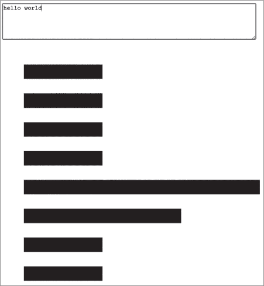

图 14-12：我们的条形图在两个维度上进行了缩放

尝试输入不同的文本，感受数据变化时条形如何更新。接下来，我们将添加带标签的坐标轴，随着缩放的变化，这些标签也会更新，以显示数据的实际范围。这样会更容易理解图表。

添加带标签的坐标轴

D3 的坐标轴辅助工具可以让你在图表的边缘绘制坐标轴。D3 中的坐标轴包括一条水平或垂直的线，并且在线的垂直方向上绘制小的刻度线和每个刻度的值，正如图 14-13 所示。坐标轴让你能够看到数据域中的值。

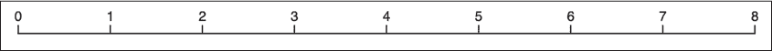

图 14-13：数字 0 到 8 的坐标轴

坐标轴与刻度紧密相关，实际上你需要一个刻度来创建一个坐标轴。例如，图 14-13 中的坐标轴宽度为 540 像素，包含从 0 到 8 的数字。这个坐标轴是通过一个范围为[0, 8]、值域为[0, 540]的刻度创建的。

要绘制坐标轴，首先需要定义一个 g 元素来容纳坐标轴元素。然后，使用 D3 的坐标轴辅助函数之一创建一个坐标轴生成器对象，最后使用生成器对象将坐标轴元素绘制到 g 元素中。

我们的图表将有两个坐标轴：顶部坐标轴用于显示计数值，左侧坐标轴用于显示字符值。首先，我们将添加 g 元素，如 Listing 14-34 所示。

```
`--snip--`
let margin = {top: 20, right: 10, bottom: 20, left: 50};

// Top axis container
❶ let topContainer = svg
  .append("g")
  .attr("id", "top")
  .attr("transform", ❷ `translate(0, ${margin.top})`);

// Left axis container
❸ let leftContainer = svg
  .append("g")
  .attr("id", "left")
  .attr("transform", ❹ `translate(${margin.left}, 0)`);

function update(data) {
`--snip--` 
```

Listing 14-34: 添加 g 元素来容纳顶部和左侧坐标轴

我们通过将 g 元素附加到 svg 元素并给它一个 id 为"top"来创建顶部坐标轴容器❶。因为我们将 xScale 的范围定义为[margin.left, width - margin.right]，这也会定义坐标轴的视觉范围。然而，xScale 并不知道垂直定位，因此我们需要将其平移到 margin.top ❷的位置。我们将元素选择存储在一个名为 topContainer 的变量中，以便在稍后绘制坐标轴时引用它。左侧坐标轴容器的创建类似❸，但这次我们需要将其平移到右边，即 margin.left ❹，因为 yScale 并不知道水平定位。

现在我们已经有了容器，可以开始绘制坐标轴。请根据 Listing 14-35 中所示的更改更新函数。

```
`--snip--`
 let yScale = d3.scaleBand()
 .domain(data.map(d => d.char))
 .range([margin.top, height - margin.bottom])
 .padding(0.5);

  let topAxis = d3.axisTop(xScale);

  let leftAxis = d3.axisLeft(yScale);

  topContainer
    .call(topAxis);

  leftContainer
    .call(leftAxis);

  svg
 .selectAll("rect")
 .data(data)
 .join("rect")
`--snip--` 
```

Listing 14-35: 绘制坐标轴

在这里，我们调用 d3.axisTop，传递 xScale，以及 d3.axisLeft，传递 yScale。这为我们提供了两个坐标轴生成器，topAxis 和 leftAxis。坐标轴生成器接受元素的选择并将坐标轴绘制到该元素中。然而，我们并没有将选择传递给坐标轴生成器，而是将生成器本身传递给一个名为 call 的 D3 方法。当此方法与选择链式调用时（如此处的 topContainer 或 leftContainer），它会在当前选择上调用提供的函数。因此，编写 topContainer .call(topAxis);等同于编写 topAxis(topContainer);，两者都绘制条形图的顶部坐标轴。使用 call 更为惯用，这使得可以更容易地将其他方法链式调用到该语句中。

重新加载页面并在文本区域输入一些文本。你将看到坐标轴，如 Figure 14-14 所示。

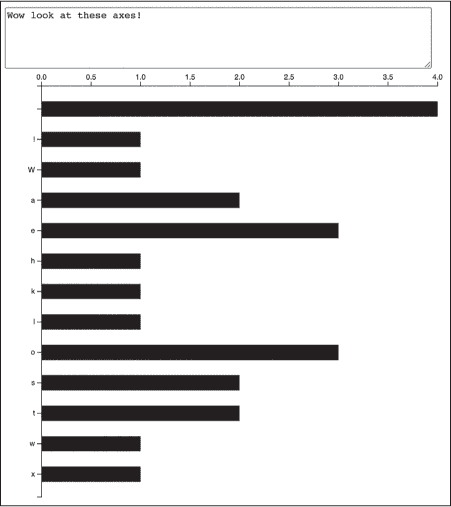

Figure 14-14: 带有坐标轴的条形图

如果你在网页检查器中检查坐标轴，你会发现它们由 g、path、text 和 line 元素组成。line 元素类似于 path 元素，但它仅定义起始和结束点，通过 x1、x2、y1 和 y2 属性。这些属性在 SVG 规范中默认为 0，这通常可以很好地满足绘制坐标轴的需求，因此你会注意到在检查器中许多 line 属性并未显式设置。

现在，顶部轴有两个地方有点问题。首先，正如你在 Figure 14-14 中看到的，标签包括带有小数点的数字，比如 2.5，但我们只关心整数（你不能有半个字符）。所以，我们需要找到一种方法，仅渲染整数，也就是整数值。第二，如果你输入 15 个相同字符的字符串（例如，*aaaaaaaaaaaaaaa*），那么标签将只显示从 0 到 14 的偶数，并且不会有 15 的标签，如 Figure 14-15 所示。随着最大计数的增加，尤其是超过 30 时，你会继续看到这个问题，因为刻度会切换到 5 的倍数。

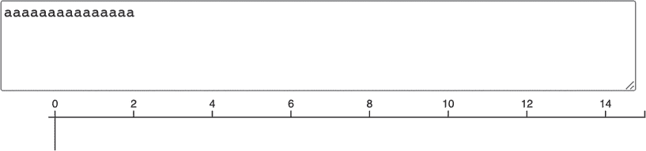

Figure 14-15: 最大计数为 15 时的顶部轴

我们在这里更希望的是，让领域扩展到 16，以便使轴看起来更美观。幸运的是，第二个问题很容易解决。D3 比例尺有一个很好的方法，可以将它们的领域扩展到下一个“圆整”数字，这在这种情况下意味着下一个会绘制刻度的数字。Listing 14-36 展示了如何实现这个方法。

```
`--snip--`
 let xScale = d3.scaleLinear()
 .domain([0, d3.max(data, d => d.count)])
    .range([margin.left, width - margin.right])
    .nice();
`--snip--` 
```

Listing 14-36: 使我们的 x 比例尺变得“美观”

当你重新加载页面并再次输入 15 个相同的字符时，你会看到轴现在扩展到了 16。仅渲染整数需要稍微多一些的努力。这里的基本方法是获取刻度值，将它们过滤为仅整数，然后将这些刻度值设置到轴上。此外，我们还希望更改数字渲染方式，排除小数点，因此我们渲染的是 1，而不是 1.0。 这些变化在 Listing 14-37 中显示。

```
`--snip--`
 let yScale = d3.scaleBand()
 .domain(data.map(d => d.char))
 .range([margin.top, height - margin.bottom])
 .padding(0.5);

❶ let topAxisTicks = xScale.ticks()
    .filter(tick => Number.isInteger(tick));

  let topAxis = d3.axisTop(xScale)
  ❷ .tickValues(topAxisTicks)
  ❸ .tickFormat(d3.format("d"));

 let leftAxis = d3.axisLeft(yScale); 
`--snip--` 
```

Listing 14-37: 渲染顶部轴上的整数刻度

首先，我们需要获取刻度值，它们可以通过 xScale 生成器上的 ticks 方法获取❶。然后，我们使用 Number.isInteger 过滤刻度，得到整数值。这样可以将类似[0, 0.5, 1, 1.5, 2, 2.5, 3, 3.5, 4]的数组转换为[0, 1, 2, 3, 4]。接下来，我们使用 tickValues 方法将过滤后的刻度值设置到顶部轴上❷。最后，我们使用 tickFormat 方法设置数字的渲染格式❸。该方法接受一个格式化函数，用来格式化每个刻度值。在这种情况下，d3.format("d")返回一个格式化函数，格式化时不会带小数点。

重新加载页面并再次输入一些文本，你应该看到渲染的整数不带小数点。

#### 使用 CSS 和正则表达式进行样式设置

接下来，我们将通过一些 CSS 样式改善图表的外观。为了更好地区分字符类型，我们将根据字符是小写字母、大写字母、数字还是其他字符来为条形图赋予不同的颜色。为此，我们需要一个能够区分这些字符类型的函数。该函数将使用*正则表达式*，它是一种在文本字符串中指定模式并判断其他字符串是否匹配这些模式的方式。

> 注意

*JavaScript 的正则表达式功能非常强大，但我们仅会考虑本项目所需的功能。想要了解更多，可以访问网站* [`www.regular-expressions.info`](https://www.regular-expressions.info)，*或在 MDN 上搜索 “regular expressions”。*

JavaScript 有一种正则表达式字面量语法，由斜杠分隔。例如，/hi/ 是一个正则表达式字面量，匹配任何包含字符序列 *hi* 的字符串。*hi* 可以出现在字符串的任何位置。例如，正则表达式 /hi/ 会匹配单词 *hither*、*Chicken* 和 *sushi*。你可以通过添加特殊字符来更精确地定义正则表达式的模式。例如，插入一个插入符号 (^) 表示字符序列应出现在字符串的开头，因此 /^hi/ 匹配任何以 *hi* 开头的字符串。类似地，插入一个美元符号 ($) 表示字符序列应出现在字符串的末尾，因此 /hi$/ 匹配任何以 *hi* 结尾的字符串。

你可以使用正则表达式的 test 方法来查看某个特定的字符串是否与其匹配。以下是一些 JavaScript 控制台中的示例：

```
**/^hi/.test("hi there");**
true
**/****^hi/.test("Chicken");**
false 
```

字符串 "hi there" 通过了测试，因为 *hi* 出现在字符串的开头，而 "Chicken" 没有通过。

你可以同时使用 ^ 和 $ 来创建一个必须完全匹配字符串的正则表达式。例如，/^hi$/ 只会匹配字符串 "hi" 而不会匹配其他任何内容，如下所示：

```
**/****^hi$/.test("hi");**
true
**/^hi$/.test("him");**
false 
```

要匹配一系列字符而不是单个字符，可以使用方括号和连字符来描述范围。例如，/[a-z]/ 匹配任何从 *a* 到 *z* 的小写字符。正则表达式/^[A-Z][a-z]$/ 匹配一个包含大写字母后跟小写字母的字符串，并且不包含其他字符。在控制台中尝试一下：

```
**/^[A-Z][a-z]$/.test("Hi");**
true
**/^[A-Z][a-z]$/.test("iH");**
false
**/^[A-Z][a-z]$/.test("Hip");**
false 
```

对于这个项目，我们需要三个正则表达式：/^[a-z]$/（匹配单个小写字母），/^[A-Z]$/（匹配单个大写字母），和/^[0-9]$/（匹配单个数字）。如果一个字符不匹配任何一个表达式，我们就知道它是其他类型的字符，比如空格或标点符号。请参见清单 14-38，它展示了新的 getClass 函数，该函数使用这些正则表达式为给定字符的条形图选择 CSS 类名。将这个函数添加到*script.js*文件中，放在更新函数之前。

```
`--snip--`
// Left axis container
let leftContainer = svg
 .append("g")
 .attr("id", "left")
 .attr("transform", `translate(${margin.left}, 0)`);

function getClass(char) {
  if (/^[a-z]$/.test(char)) {
    return "lower";
  } else if (/^[A-Z]$/.test(char)) {
    return "upper";
  } else if (/^[0-9]$/.test(char)) {
    return "number";
  } else {
    return "other";
  }
}

function update(data) {
`--snip--` 
```

清单 14-38：getClass 函数

这个函数将字符与提供的正则表达式进行匹配，并返回相应的类名："lower"（小写字母）、"upper"（大写字母）、"number"（数字）或"other"（其他）。接下来，我们将更新渲染代码，使用这个函数为每个 rect 元素设置类名，如清单 14-39 所示。

```
`--snip--`
 svg
 .selectAll("rect")
 .data(data)
 .join("rect")
 .attr("width", (d, i) => xScale(d.count) – xScale(0))
 .attr("height", yScale.bandwidth())
 .attr("x", xScale(0))
 .attr("y", (d, i) => yScale(d.char))
    .attr("class", (d, i) => getClass(d.char));
}
`--snip--` 
```

清单 14-39：根据字符应用类名

现在，每个 rect 元素都会根据该元素数据中的字符来设置类名。最后一步是编写 CSS，为每个类名分配不同的填充颜色。将清单 14-40 中的 CSS 代码添加到*style.css*文件中。

```
.lower {
  fill: purple;
}

.upper {
  fill: orangered;
}

.number {
  fill: green;
}

.other {
  fill: #555;
} 
```

清单 14-40：为不同类别定义样式

现在，当你重新加载页面并输入一些不同的字符时，你应该会看到类似于图 14-16 的效果。

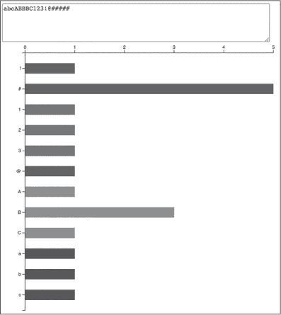

图 14-16：颜色编码条形图

条形图应根据输入的字符类型分配不同的颜色。

#### 清理数据

通常，在将数据集可视化之前，需要通过修正其中的错误或不规则性来清理数据。例如，目前条形图方法的一个问题是，不同的空白字符显示为不同的条形图，每个条形图都有一个不可见的标签（因为标签文本只是空白）。这些空白字符包括空格、换行符、制表符和其他可以通过不同键盘组合输入的空格字符（例如，在 macOS 上可以通过 OPTION+空格键输入不间断空格，Windows 上则是 CTRL-SHIFT+空格键）。为了解决这个问题，我们将在字符计数之前将所有空白字符转换为相同的"<space>"字符串，这样所有空白字符将通过一个带有可读标签的条形图进行可视化。按照清单 14-41 中所示更新你的*script.js*文件。这些更新出现在文件的末尾。

```
`--snip--`
function standardizeSpace(char) {
❶ if (char.trim() == " ") {
    return "<space>";
  } else {
    return char;
  }
}

d3.select("textarea").on("input", e => {
 let frequencies = {};

  e.target.value.split(" ").forEach(char => {
  ❷ let standardized = standardizeSpace(char);
    let currentCount = frequencies[standardized] || 0;
    frequencies[standardized] = currentCount + 1;
 });
`--snip--` 
```

清单 14-41：标准化空白字符

我们首先声明一个 standardizeSpace 函数，该函数接受一个字符并调用其 trim 方法❶。trim 方法会移除字符串开头或结尾的空白字符，因此，如果返回一个空字符串，我们知道该字符是空白字符。在这种情况下，我们返回字符串"<space>"。否则，我们返回未改变的字符。然后，我们需要修改文本处理代码，在将空白字符作为频率对象中的键使用之前调用我们的函数来标准化它们❷。

现在，当你在文本区域中输入各种类型的空白字符时，你应该会看到一个标签为<space>的单一条形图，而不是多个带有空标签的条形图。

#### 动画化变化

我们的最终任务是为坐标轴和条形图添加动画。这将使我们更容易看到何时添加新元素，以及现有元素的计数何时变化。为了动画化坐标轴，我们只需在更新函数内对 topContainer 和 leftContainer 选择添加一个过渡调用，如 Listing 14-42 所示。

```
`--snip--`
let leftAxis = d3.axisLeft(yScale);

topContainer
  .transition()
 .call(topAxis);

leftContainer
  .transition()
 .call(leftAxis);
`--snip--` 
```

Listing 14-42: 为坐标轴添加动画

现在，当坐标轴的域更新以适应新数据时，现有的刻度将动画化到其更新后的位置，新的刻度会逐渐显现。

我们有两种方法可以为条形图添加过渡效果：我们可以保留现有的连接代码，只需添加一个过渡调用，或者我们可以使用前面提到的高级连接技术，这样我们就可以根据元素是进入、更新还是退出来定制过渡效果。正如你可能猜到的，我们将选择高级版本！你可以在 Listing 14-43 中找到更新后的更新代码。

```
`--snip--`
 leftContainer
 .transition()
 .call(leftAxis);

 svg
 .selectAll("rect")
  ❶ .data(data, d => d.char)
    .join(
    ❷ enter => enter
        .append("rect")
        .attr("x", xScale(0))
        .attr("y", (d, i) => yScale(d.char))
        .attr("class", d => getClass(d.char))
        .transition()
        .attr("width", d => xScale(d.count) - xScale(0))
        .attr("height", yScale.bandwidth()),
    ❸ update => update
        .transition()
        .attr("width", d => xScale(d.count) - xScale(0))
 .attr("height", yScale.bandwidth())
        .attr("y", (d, i) => yScale(d.char)),
    ❹ exit => exit
        .transition()
        .attr("width", 0)
        .attr("height", 0)
        .remove()
    );
}
`--snip--` 
```

Listing 14-43: 动画化条形图

我们首先需要做的是设置一个关键函数❶，告诉 D3 数据项的 char 属性应该作为标识符来使用。接下来，我们切换到类似于 Listing 14-25 的高级连接技术。enter 函数❷首先添加 rect 元素，并在调用过渡之前设置其 x、y 和 class 属性，这意味着这些属性不会被动画化。宽度和高度属性是在过渡调用之后设置的，所以这些属性*会*被动画化。这样，新元素将在左侧坐标轴处从当前位置生长出来。

update 函数❸再次动画化宽度和高度，同时还会动画化 y 属性。这意味着当新元素添加时，现有元素会向上或向下滑动到它们的新位置。

最后，退出函数❹在元素被移除之前将宽度和高度动画化到 0，导致元素在原位置缩小消失。

重新加载页面，尝试在文本区域中添加和删除字符。享受观察元素是如何进入、退出或更新的动画效果。

### 总结

在本章中，你学习了 SVG 的基础知识，以及如何使用 D3 根据数据集中的实时变化来创建、更新和移除 SVG 元素。到现在为止，你应该已经对如何在 D3 中构建基于数据的应用程序有了相当清晰的了解。在下一章，我们将通过构建一个从 API 读取数据并将其渲染成交互式图表的应用程序，将这些知识付诸实践。
