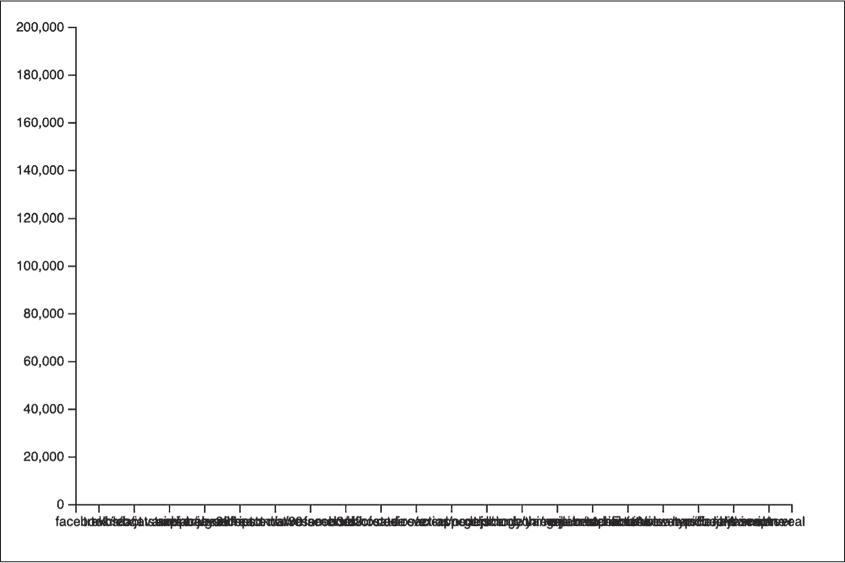
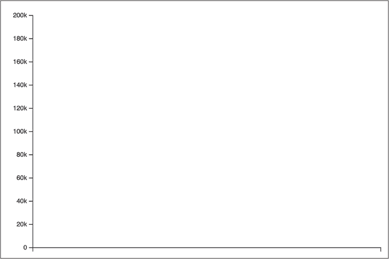
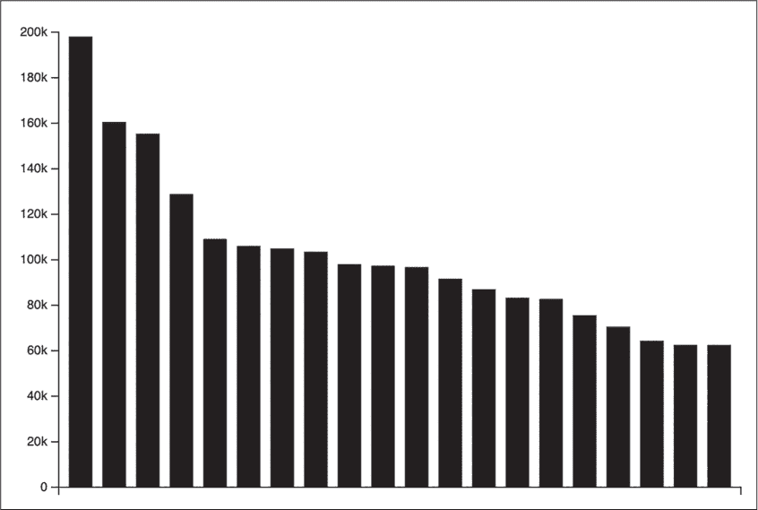
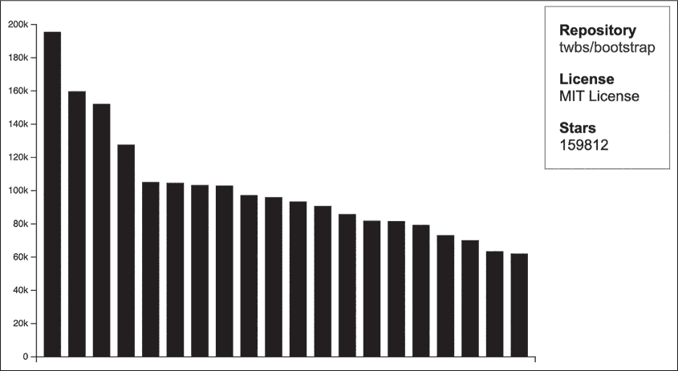
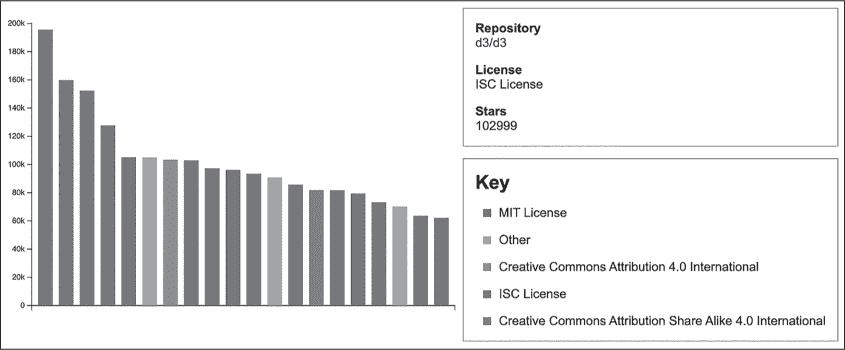
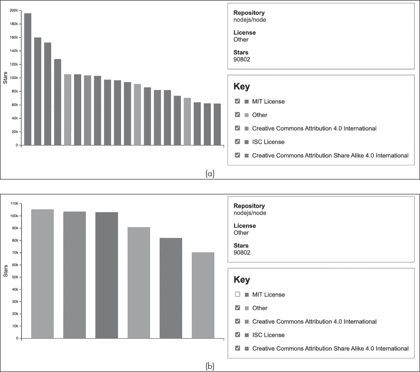

## 第七章：15 从 GitHub 搜索 API 可视化数据


在这个最终项目中，你将构建一个应用程序，从公共 API 中读取数据，并使用 D3 基于这些数据构建一个交互式条形图。我们将从 GitHub 搜索 API 中读取数据。这个 API 允许你在 GitHub 上搜索数据，GitHub 是一个托管 Git 仓库的服务（Git 是一种流行的版本控制系统，用于跟踪软件项目的源代码）。该 API 使用 HTTPS 协议，并根据你编码到 URL 中的搜索查询返回 JSON 格式的数据。

如果你以前没有使用过 GitHub，可以访问[*https://<wbr>github<wbr>.com*](https://github.com)查看它的样子。在页面的顶部，你会看到一个搜索框，你可以用它来搜索公共的，*开源*代码库（即，源代码对任何人开放阅读和使用的代码库）。GitHub 搜索 API 允许我们以编程方式进行搜索——例如，使用 JavaScript，而不是手动使用该搜索框。该 API 可以搜索 GitHub 上的各种项目，如代码库、用户和问题。我们将使用代码库搜索功能来查找流行的 JavaScript 代码库。然后，我们将绘制一个 D3 条形图，根据流行程度对这些代码库进行排名。用户可以通过悬停在条形图上，了解每个代码库的更多信息。我们还将通过允许用户根据软件许可证来隐藏或显示代码库，增加一些互动性。

这个项目将让你获得使用 JSON API 中实际数据的经验。大量的编程工作都归结为向第三方 API 发出请求，然后对返回的数据进行处理，正如你在这里所实践的那样。你还将把你在第十四章中学到的关于 D3 的所有内容付诸实践，构建一个更有趣、互动性更强的图表，并学习一些技术，用于创建更丰富的可视化效果。

### 设置

要开始，创建一个名为 *github* 的新目录，并添加空的 *style.css* 和 *script.js* 文件。然后创建一个 *index.html* 文件，并添加列表 15-1 中的代码。

```
<!DOCTYPE html>
<html>
  <head>
    <title>GitHub</title>
    <link rel="stylesheet" href="style.css">
  </head>
  <body>
    <script src="https://unpkg.com/d3@7.4.4/dist/d3.js"></script>
    <script src="script.js"></script>
  </body>
</html> 
```

列表 15-1：我们的 GitHub 搜索 API 可视化的 index.html 文件

这是我们在第十四章中使用的相同基本 HTML 文件。它通过一个脚本元素链接到 [*https://<wbr>unpkg<wbr>.com*](https://unpkg.com)，使我们能够访问 D3 库。

### 获取数据

现在让我们尝试从 GitHub 搜索 API 获取一些数据。为此，我们需要将我们的数据请求格式化为 URL 的一部分。访问该 URL 即可检索数据。整个 URL（包括我们将使用的搜索查询）如下所示（请注意，为了适应页面，它已经被分成了两行）：

```
https://api.github.com/search/repositories?q=language%3Ajavascript%20stars%3A
%3E10000&per_page=20&sort=stars 
```

然而，我们不会手动输入 URL，而是通过 JavaScript 来构建它，这样更容易理解和修改。

URL 有两个部分：一个是基础 URL，它让我们可以访问 API，另一个是查询字符串，指定我们想要的数据。这两部分由问号（?）分隔。查询字符串包含一对对的键值对，用于向 API 发送我们查询的信息。每个键和值通过等号（=）连接，每对键值对之间由和号（&）分隔。在这个 URL 中，键有 q（搜索查询）、per_page（每页的结果数量）和 sort（如何排序结果）。查询字符串中的键和值只能包含有限的字符集：a–z、A–Z、0–9、连字符（-）、句点（.）、下划线（_）、波浪号（~）和一些其他特殊字符。所有其他字符必须通过*URL 编码*系统表示，这就是 URL 中所有百分号（%）字符的来源。例如，冒号（:）编码为 %3A，空格编码为 %20。

为了简化操作，我们将编写一个函数，它接受一个包含未编码查询字符串参数的对象，并将其转换为正确格式化和编码的 URL。将 Listing 15-2 中的代码添加到 *script.js* 文件中。

```
function getUrl() {
❶ let baseUrl = "https://api.github.com/search/repositories";

❷ let params = {
    q: "language:javascript stars:>10000",
    per_page: 20,
    sort: "stars"
  };

❸ let queryString = Object.entries(params).map(pair => {
    return `${pair[0]}=${encodeURIComponent(pair[1])}`;
  }).join("&");

❹ return `${baseUrl}?${queryString}`;
}

let url = getUrl();

console.log(url); 
```

Listing 15-2: 创建 URL

创建 URL 的代码位于 getUrl 函数中。这个函数首先设置基础 URL（查询字符串之前的部分）❶。然后，为了构建查询字符串，我们通过创建一个 params 对象 ❷ 来开始，其中包含搜索查询 q，采用 GitHub 的搜索查询格式。具体来说，我们正在搜索语言为 JavaScript 的、星标数超过 10,000 的仓库（GitHub 用户可以为仓库添加“星标”，以便稍后查看，因此星标数是受欢迎程度的粗略衡量标准）。如果你想尝试这个查询，可以在 [*https://<wbr>github<wbr>.com*](https://github.com) 的搜索框中输入。

接下来，我们遍历 params 中的键值对，为每对键值对创建一个格式为 "key=value" 的字符串 ❸。键不需要进行 URL 编码——未加引号的对象键不包含特殊字符，因此它们已经是有效的 URL 组成部分——但我们使用内建函数 encodeURIComponent 来编码值，该函数将任何不允许的字符替换为其百分号编码版本。然后，我们将这些字符串连接起来，用 & 字符分隔，并通过将基础 URL、? 字符和查询字符串组合起来，构建并返回最终的 URL ❹。最后，我们通过调用 getUrl 函数并将结果输出到控制台来结束脚本。

当你加载页面并打开控制台时，你应该能看到之前显示的 URL。如果你复制那个 URL 并将其粘贴到浏览器的地址栏中，你应该能看到一堆 JSON 数据。如果没有，确保 URL 与上一页上的 URL 匹配，并检查你的代码是否有问题。如果 URL 看起来正确而你没有获取到数据，或者你收到了错误信息，可能是 GitHub 改变了其 API 的工作方式。有关此情况的处理方法，请参见下面的“认证 API 与非认证 API”部分。

要将 JSON 数据导入你的应用程序，你可以使用 D3 的 json 辅助方法，它从给定的 URL 获取 JSON。按照 Listing 15-3 中的示例更新 *script.js* 的结尾部分。

```
`--snip--`
let url = getUrl();

d3.json(url).then(data => {
  console.log(data);
}); 
```

Listing 15-3: 获取 JSON 数据

从 API 获取大量数据可能需要一点时间，因此 d3.json 方法返回一个 Promise，这是一种代表将来某个时间会得到的对象类型。then 方法接受一个函数，当数据准备好时会调用该函数。D3 将 JSON 响应字符串转换为 JavaScript 对象，因此 data 将是一个对象。在这里，我们只是将其日志记录到控制台。

当你重新加载页面后，等待几秒钟，你应该能在控制台看到数据。花点时间检查它。你应该能看到三个顶级属性：incomplete_results、items 和 total_count。如果查询耗时过长并且 API 只能返回部分结果，则 incomplete _results 属性为 true；否则，它为 false。total_count 属性提供此搜索查询的结果总数（这是搜索找到的所有结果的总数，其中只有前 20 条结果被返回）。items 数组包含当前调用的结果；它应该包含 20 条数据。每个条目是一个对象，包含关于特定仓库的一些信息，包括其名称、描述以及各种其他细节。几个字段本身就是 GitHub API URL，可以调用它们获取仓库的更多信息。例如，languages_url 是一个 API URL，它告诉你该仓库中使用了哪些编程语言，并按每种语言的代码行数进行细分。

在这个项目中，我们将使用每个条目的几个字段：full_name、stargazers_count、html_url 和 license。full_name 字段包含仓库所有者的名称和仓库名称，它们用斜杠连接：例如，“facebook/react”。stargazers_count 字段提供仓库被用户标星的次数。html_url 字段包含仓库在 GitHub 上的 URL。最后，license 字段提供有关仓库使用的哪个软件许可证的数据。

> 注意

*开源代码的所有者使用软件许可证来告诉其他用户他们可以对代码做什么和不能做什么。例如，一些许可证非常严格，规定代码不能用于非开源代码的应用程序。其他许可证则更加宽松，允许你对代码做任何你想做的事情。*

### 基本可视化

现在我们已经有了数据，我们将创建一个基本的条形图，显示数据集中每个仓库收到的星标数量。为此，我们将创建所需的 SVG 元素，绘制坐标轴，并绘制条形图本身。稍后我们将改进这个基本图表，使其更具信息性、更有风格并且更具交互性。

#### 创建元素

要创建我们的图表，我们首先必须创建一个将容纳图表的 svg 元素，以及两个用于坐标轴的 g 元素。在这种情况下，坐标轴将在底部和左侧。将清单 15-4 中的代码添加到*script.js*的开头，位于 getUrl 函数之前。

```
const width = 600;
const height = 400;

let svg = d3
  .select("body")
❶ .append("svg")
  .attr("width", width)
  .attr("height", height);

❷ let margin = {top: 20, right: 10, bottom: 20, left: 50};

// Bottom axis container
let bottomContainer = svg
❸ .append("g")
  .attr("id", "bottom")
  .attr("transform", `translate(0, ${height - margin.bottom})`);

// Left axis container
let leftContainer = svg
❹ .append("g")
  .attr("id", "left")
  .attr("transform", `translate(${margin.left}, 0)`);

function getUrl() {
`--snip--` 
```

清单 15-4：设置元素

就像我们在第十四章中为字符频率图表所做的那样，我们将一个 svg 元素添加到页面 ❶ 并设置其宽度和高度。然后我们创建一个边距对象 ❷ 并添加用于容纳底部 ❸ 和左侧 ❹ 坐标轴的 g 元素，并根据边距进行定位。

#### 绘制坐标轴

有了创建的元素，我们可以开始编写更新函数，它将绘制可视化图形。首先，我们将基于数据创建刻度并绘制坐标轴。请在*script.js*中做出清单 15-5 所示的更改。

```
`--snip--`
// Left axis container
let leftContainer = svg
 .append("g")
 .attr("id", "left")
 .attr("transform", `translate(${margin.left}, 0)`);

function update(items) {
❶ let xScale = d3.scaleBand()
    .domain(items.map(d => d.full_name))
    .range([margin.left, width - margin.right])
    .padding(0.3);

  let yScale = d3.scaleLinear()
  ❷ .domain([0, d3.max(items, d => d.stargazers_count)])
    .range([height - margin.bottom, margin.top])
    .nice();

❸ let bottomAxis = d3.axisBottom(xScale);
  let leftAxis = d3.axisLeft(yScale);

❹ bottomContainer.call(bottomAxis);
  leftContainer.call(leftAxis);
}

function getUrl() {
--snip--

d3.json(url).then(data => {
❺ update(data.items);
}); 
```

清单 15-5：绘制坐标轴

更新函数从 API 响应中获取 items 数组。我们的条形图将为每个仓库绘制一个垂直条形，因此我们使用 scaleBand 助手创建水平 xScale 来均匀地间隔这些条形 ❶。域是每个仓库的 full_name。每个仓库的全名是唯一的，因此这将导致 20 个带。垂直的 yScale 用于可视化每个仓库的星标数，因此它的域从零到最大的 stargazers_count ❷。我们在这里使用 nice 将刻度的顶部四舍五入到下一个刻度值。创建刻度之后，我们创建轴生成器 ❸，然后使用这些生成器将坐标轴绘制到容器 ❹ 中，正如我们在字符频率项目中所做的那样。

最后一步是从 d3.json 回调中调用我们的更新函数，并传递 `items` 数组❺。我们能够直接从获取数据到调用更新函数，因为 GitHub 搜索 API 方便地以我们需要的格式返回数据用于渲染。与字符频率示例中的数据处理不同，在那个示例中，源数据只是一个字符串，我们需要一个描述每个字符及其计数的排序对象数组。

当你重新加载 *index.html* 时，应该可以看到坐标轴，如 Figure 15-1 所示。我们稍后会修复底部轴标签；它们现在很乱，因为 D3 正在尝试渲染每个仓库的完整名称。此外，左轴的刻度值可能会超过图中显示的 200,000，具体取决于你运行此代码时最受欢迎的 JavaScript 项目的星标数。撰写本文时，facebook/react 是 GitHub 上最受欢迎的 JavaScript 项目，拥有大约 196,000 个星标。



Figure 15-1: 坐标轴

由于我们在这里处理的是如此大的数字（而且数字每天都在增大），我们可以通过使用 SI 前缀来提高可读性，比如 *k* 表示 1,000。这在 D3 中很容易做到，只需使用正确的数字格式。在进行此更改时，我们还将从底部轴中移除刻度。有关这些更改，请参见 Listing 15-6。

```
`--snip--`
 let yScale = d3.scaleLinear()
 .domain([0, d3.max(items, d => d.stargazers_count)])
 .range([height - margin.bottom, margin.top])
 .nice();

  let bottomAxis = d3
    .axisBottom(xScale)
  ❶ .tickValues([]);

  let leftAxis = d3
    .axisLeft(yScale)
  ❷ .tickFormat(d3.format("~s"));

 bottomContainer.call(bottomAxis);
 leftContainer.call(leftAxis);
`--snip--` 
```

Listing 15-6: 清理坐标轴刻度

对于底部轴，我们将刻度值更新为空列表❶，这样就有效地移除了刻度。对于左轴，我们添加了一个刻度格式，使用格式说明符 "~s" ❷，例如，它会将数字 200,000 渲染为 200k，1,000,000 渲染为 1M。Figure 15-2 显示了更新后的坐标轴应该是什么样子。



Figure 15-2: 清理后的坐标轴

左轴上的数字现在一目了然，底部的轴也不再是杂乱的文本。

#### 绘制条形图

现在轴已经画好，我们需要绘制条形图本身。将 Listing 15-7 中的代码添加到更新函数的末尾。

```
`--snip--`
 bottomContainer.call(bottomAxis);
 leftContainer.call(leftAxis);

  svg
    .selectAll("rect")
    .data(items, ❶ d => d.full_name)
    .join("rect")
    .attr("x", d => xScale(d.full_name))
  ❷ .attr("y", d => yScale(d.stargazers_count))
    .attr("width", xScale.bandwidth())
  ❸ .attr("height", d => yScale(0) - yScale(d.stargazers_count));
}

function getUrl() {
`--snip--` 
```

Listing 15-7: 绘制条形图

和字符频率项目一样，我们正在绘制一堆 `rect` 元素。关键函数❶提取了 `full_name` 属性，我们在这里将其用作每个仓库的唯一标识符。目前，我们使用简单的 `join` 技巧，没有对进入、更新和退出元素进行单独处理（这些将在后面处理）。

x 属性是根据在 xScale 中查找 full_name 来设置的，宽度则基于 xScale 的带宽方法。y 和高度属性这次稍微复杂一些，需要一些解释。如果您回顾一下 清单 15-5 中 yScale 的定义，您会看到域是 [0, d3.max(items, d => d.stargazers_count)]，范围是 [height - margin.bottom, margin.top]。通过我们设置的值，这个范围扩展为 [380, 20]。这个范围是从高到低的，意味着域中的高值会映射到范围中的低值，反之亦然。这是因为计算机图形中的 y 值是从屏幕顶部开始递减的，而在我们的图表中，我们希望 y 值是从图表底部开始递增的。让这变得复杂的另一件事是 SVG 矩形是从左上角开始绘制的，这对于每个条形图来说可能会有所不同，因此我们需要设置一个变量高度，使得所有的条形图都能触及到底部坐标轴。

因此，我们将条形图的 y 属性设置为 yScale(d.stargazers_count) ❷，它给出了条形图顶部的垂直位置。为了计算条形图的高度，我们使用 yScale(0) - yScale(d.stargazers_count) ❸。调用 yScale(0) 会给出条形图底部的垂直位置（所有条形图的基线应该位于 0 位置），所以从条形图底部到顶部的高度就是两个位置的差值。我们需要得到一个正的高度，因此必须将较小的数值从较大的数值中减去。尽管条形图的顶部在显示范围内是一个较小的数字，但它在数据域中是一个较大的数值。图 15-3 显示了条形图的应有样式，但请记住，根据数据的变化，您的条形图高度可能会有所不同。



图 15-3：将条形图绘制为矩形元素

在查看条形图时，请记住，每个条形图是从其左上角开始绘制的，并且高度是计算得当的，使得所有条形图的底部都对齐。

### 改进可视化效果

我们现在已经有了一个基本的可视化效果，但它并不太具有信息性。在本节中，我们将实现一些改进，使可视化效果更加有意义。我们将创建一种方法，查看每个仓库的更多信息。我们还将为条形图添加颜色编码，以显示每个仓库的许可证类型，并确保坐标轴正确标注。

#### 显示仓库信息

当前的图表没有提供任何方式来识别每个条形图所代表的仓库。我们有多种方法可以解决这个问题（例如，垂直或对角线方向的刻度标签，或者某种*提示框*，即当鼠标悬停在条形图上时弹出的文本框），但在这个项目中，我们将添加一个永久的侧边栏，当你悬停在条形图上时，它会显示更多关于该条形图的信息。首先，我们将把侧边栏的 HTML 添加到*index.html*中，如清单 15-8 所示。

```
`--snip--`
 <body>
    <div id="sidebar">
      <div id="info" class="box">
        <p class="repo">
          <span class="label">Repository</span>
        ❶ <span class="value"><a target="_blank"></a></span>
        </p>
        <p class="license">
          <span class="label">License</span>
          <span class="value"></span>
        </p>
        <p class="stars">
          <span class="label">Stars</span>
          <span class="value"></span>
        </p>
      </div>
    </div>

 <script src="https://unpkg.com/d3@7.4.4/dist/d3.js"></script>
 <script src="script.js"></script>
 </body>
`--snip--` 
```

清单 15-8：将侧边栏 HTML 添加到 index.html

在这里，我们设置了一个名为 info 的 div，其中包含我们需要显示仓库信息的元素。它被嵌套在另一个名为 sidebar 的 div 中。这个外部 div 现在看起来可能是多余的，但稍后我们将向侧边栏添加另一个 div 元素，因此我们需要父 div 元素来包含这两个侧边栏 div 元素。

info div 会显示仓库名称、许可证类型以及其星标数。我们使用 span 元素来包装文本的一部分。span 是一个容器元素，像 div 元素一样，但与 div 不同，span 是一个内联元素，因此它可以在不换行的情况下包裹一行文本的某一部分。稍后，当你悬停在条形图上时，我们会更新值的 span 内容，显示关于该条形图的相关信息。

其中一个 span 元素包含一个 a 元素 ❶，它创建一个指向另一个页面或网站的超链接。链接的 URL 是通过 href 属性指定的，我们稍后会动态设置它。target="_blank" 属性指示浏览器在新标签页或窗口中打开链接。

侧边栏在此阶段看起来有点丑，所以让我们添加一些 CSS。将清单 15-9 中的代码添加到*style.css*中。

```
body {
❶ display: flex;
  align-items: flex-start;
  font-family: Arial, Helvetica, sans-serif;
}

.box {
  padding: 0px 15px 0px 15px;
  border: 1px solid #888;
  margin-bottom: 15px;
}

#info .label {
  font-weight: bold;
  display: block;
}

#info a {
  text-decoration: none;
}

#info a:hover {
  text-decoration: underline;
} 
```

清单 15-9：为侧边栏添加样式

在这个项目中，我们使用了一种叫做*flexbox* ❶的 CSS 技术，这是 CSS 规范中较新的一个特性。Flexbox 使得定义布局变得更加容易，特别是那些能够在各种屏幕和视口尺寸上灵活工作的布局。Flexbox 布局有两个主要组成部分：*flex 容器*和*flex 项目*。flex 容器是一个父元素，它定义了其子 flex 项目（容器的直接子元素）的尺寸和排列方式。在我们的例子中，flex 容器是 body 元素，而 flex 项目是 svg 元素和 #sidebar 元素。默认情况下，项目从左到右排列（这意味着 #sidebar 元素会出现在屏幕的左侧，接着是右侧的 svg 元素）。声明 align-items: flex-start; 表示这些项目将对齐到父容器的顶部。

> 注意

*如果你想了解更多关于 flexbox 的内容，请查看* [`css-tricks.com/snippets/css/a-guide-to-flexbox/`](https://css-tricks.com/snippets/css/a-guide-to-flexbox/)。

当前，svg 元素被附加到 body 元素上，这意味着它位于侧边栏之后，但出于布局原因，我们希望它位于侧边栏之前。为此，我们需要在创建 svg 元素时，从 append 方法切换到 insert 方法，因为后者允许我们指定一个元素插入在其前面。实现这一点的 *script.js* 代码更改显示在 Listing 15-10 中。

```
`--snip--`
let svg = d3
 .select("body")
  .insert("svg", "#sidebar")
 .attr("width", width)
 .attr("height", height);
`--snip--` 
```

Listing 15-10: 在侧边栏之前插入 svg 元素

现在，侧边栏将出现在图表的右侧，因为 svg 元素现在出现在 flex 容器中的侧边栏之前。

在编写用于显示仓库详细信息的代码之前，我们需要一个用于获取仓库许可证名称的函数。访问其他信息将是直接的，但并非所有仓库都有许可证，因此我们的函数必须处理没有许可证数据的情况。新的 getLicense 函数见 Listing 15-11，你可以将其插入到 *script.js* 中，紧接在 update 函数之前。

```
`--snip--`
// Left axis container
let leftContainer = svg
 .append("g")
 .attr("id", "left")
 .attr("transform", `translate(${margin.left}, 0)`);

function getLicense(d) {
❶ let license = d.license?.name;

❷ if (!license) {
    return "No License";
  } else {
    return license;
  }
}

function update(items) {
`--snip--` 
```

Listing 15-11: getLicense 函数

如果仓库有许可证，许可证名称将作为 d.license.name 可用，但如果没有许可证，d.license 将是 undefined。我们使用 ?. 运算符来测试这种情况，称为 *可选链运算符* ❶。像常规的 . 运算符一样，?. 尝试获取运算符左边指定的对象并访问运算符右边指定的方法或属性。但与常规的 . 运算符不同，?. 如果运算符左边的对象为 null 或 undefined，则返回 undefined。因此，如果 d.license 为 undefined（意味着仓库没有许可证），我们的许可证变量将设置为 undefined，但如果 d.license 是一个对象（意味着仓库有许可证），那么 license 将设置为 d.license.name。如果 license 最终为 undefined ❷，我们的 getLicense 函数将返回字符串 "No License"。否则，将返回许可证的值。

现在我们可以添加代码，在鼠标悬停在条形图上时更新侧边栏。我们将通过向 rect 元素添加 mouseover 事件处理程序来实现。请用 Listing 15-12 中的代码更新 *script.js*，该代码放在 update 函数的末尾。

```
`--snip--`
    .attr("width", xScale.bandwidth())
    .attr("height", d => yScale(0) - yScale(d.stargazers_count))
    .on("mouseover", (e, d) => {
      let info = d3.select("#info");
      info.select(".repo .value a").text(d.full_name).attr("href", d.html_url); 1
      info.select(".license .value").text(getLicense(d));
      info.select(".stars .value").text(d.stargazers_count);
    });
}

function getUrl() {
`--snip--` 
```

Listing 15-12: 在悬停时更新侧边栏

D3 事件处理函数会接收两个参数：事件对象（e）和绑定到触发事件的元素的 datum（d）。我们在处理函数中做的第一件事是选择 #info 元素，因为我们要修改的所有元素都是该元素的子元素。然后，我们更新 .repo 元素 ❶ 中 .value 元素内的 a 元素（参考列表 15-8 或查看 *index.html* 来回顾 HTML 结构）。我们同时设置该元素的文本内容和 href 属性。这样就会生成一个指向仓库的链接，链接文本是仓库的完整名称。我们同样设置 .value .license 元素的文本为 getLicense 为此 datum 返回的内容，并将 .stars .value 元素的文本设置为星标数量。

重新加载页面并尝试悬停在一些条形图上。你应该会看到类似于图 15-4 的内容。



图 15-4：侧边栏显示一个仓库的详细信息

当你悬停在每个条形图上时，该仓库的详细信息应该会显示在新的侧边栏中。如果你点击仓库名称，浏览器应当打开一个新的标签页并跳转到该仓库的 GitHub 页面。

#### 为条形图上色

为了通过视觉方式传达一些额外信息，我们将根据许可证类型为条形图上色。D3 允许你创建输入（域）为值、输出（范围）为颜色的刻度。你将在列表 15-13 中看到如何实现这一点。

```
`--snip--`
function update(items) {
❶ let licenses = new Set(items.map(d => getLicense(d)));

❷ let colorScale = d3.scaleOrdinal()
    .domain(licenses)
 .range(d3.schemeCategory10);

 let xScale = d3.scaleBand()
`--snip--` 
```

列表 15-13：为许可证创建颜色刻度

首先，我们需要收集所有唯一的许可证名称。为此，我们对项目进行映射，对每个项目调用我们的 getLicense 函数 ❶。这会生成一个包含许可证名称的数组。在同一行中，我们将结果数组传递给 Set 构造函数。从编程角度讲，*集合* 是一组唯一的项目，因此 Set 构造函数可以接受一个包含项目的数组并过滤掉重复项。在 JavaScript 中，集合保持其顺序，像数组一样。

d3.scaleOrdinal 辅助函数 ❷ 创建一个具有离散输入和离散输出的刻度。在这里，输入是唯一的许可证名称，输出是颜色名称。对于刻度的范围，我们使用 d3.schemeCategory10，这是一个包含 10 个十六进制颜色字符串的数组。你可以在控制台中查看它：

```
**d3.schemeCategory10;**
`(10) ['#1f77b4', '#ff7f0e', '#2ca02c', '#d62728', '#9467bd', '#8c564b',` 
 `'#e377c2', '#7f7f7f', '#bcbd22', '#17becf']` 
```

集合中的每个许可证将按索引映射到这些颜色之一。如果许可证超过 10 个，颜色将会重新循环（第十一和第十二个许可证将使用与第一个和第二个相同的颜色）。

接下来，我们需要根据许可证和颜色刻度设置条形图的颜色。列表 15-14 展示了如何在更新函数的末尾进行此更改。

```
`--snip--`
 svg
 .selectAll("rect")
 .data(items, d => d.full_name)
 .join("rect")
 .attr("x", d => xScale(d.full_name))
 .attr("y", d => yScale(d.stargazers_count))
    .attr("fill", d => colorScale(getLicense(d)))
 .attr("width", xScale.bandwidth())
 .attr("height", d => yScale(0) - yScale(d.stargazers_count))
`--snip--` 
```

Listing 15-14: 设置矩形的填充颜色

我们必须在 d 上调用我们的 getLicense 函数以获取许可证名称（因为它可能是 "No License"），然后将许可证名称传递给 colorScale。这会为我们提供填充属性的颜色值，以设置矩形的填充颜色。

使用这样的颜色编码，你确实需要一个图例，让用户知道每种颜色代表什么含义。我们将把这个图例作为侧边栏中的另一个框，放在仓库信息框下方。它将包括颜色方块和相应的许可证名称。首先，我们需要更多的 HTML。使用 Listing 15-15 中的更改更新*index.html*。

```
`--snip--`
 <p class="stars">
 <span class="label">Stars</span>
 <span class="value"></span>
 </p>
 </div>

      <div id="key" class="box">
        <h1>Key</h1>
      </div>
 </div>
`--snip--` 
```

Listing 15-15: 添加许可证图例的 div 和标题

在这里，我们在侧边栏 div 内创建另一个名为 key 的 div，并给它一个标题。我们将使用 JavaScript 创建图例的其他元素。

接下来是为这些新元素和我们将通过 JavaScript 添加的子元素进行样式设计的 CSS。将 Listing 15-16 中的代码添加到*style.css*的末尾。

```
`--snip--`
#info a:hover {
 text-decoration: underline;
}

#key h1 {
  font-size: 1.5em;
}

#key .color {
  display: inline-block;
  width: 10px;
  height: 10px;
  margin: 0px 10px 0px 10px;
} 
```

Listing 15-16: 样式化图例

这里的 h1 元素的字体大小设置为 1.5em，这意味着是父元素字体大小的 1.5 倍。这确保了这个标题比其他文本大 1.5 倍。#key .color 规则集用于样式化作为图例一部分的颜色方块。这些将是 div 元素，但 display: inline-block 意味着它们将像内联元素（如 span）一样表现，既不会强制换行，又像块元素（如 div）一样，可以有固定的尺寸和边距。（内联元素无法具有宽度和高度，因为它们的大小是基于内容的，而在这个例子中，方块没有内容。）

现在我们可以添加将生成图例的 JavaScript。这将涉及在更新函数的末尾进行一次新的数据连接，以将许可证与用于渲染它们的元素关联。使用 Listing 15-17 中的更改更新*script.js*。

```
`--snip--`
 .on("mouseover", (e, d) => {
 let info = d3.select("#info");
 info.select(".repo .value a").text(d.full_name).attr("href", d.html_url);
 info.select(".license .value").text(getLicense(d));
 info.select(".stars .value").text(d.stargazers_count);
 });

  d3.select("#key")
    .selectAll("p")
    .data(licenses)
    .join(
      enter => {
      ❶ let p = enter.append("p");

❷ p.append("div")
          .attr("class", "color")
        ❸ .style("background-color", d => colorScale(d));

      ❹ p.append("span")
          .text(d => d)

        return p;
      }
    ); 
}

function getUrl() {
`--snip--` 
```

Listing 15-17: 生成图例

在这里，我们使用#key 元素作为新连接的容器，并通过连接一堆 p 元素来绑定每个许可证数据。我们使用了高级连接技术，但仅使用了 enter 函数；我们不需要自定义更新或退出项目的行为。（我们不能在这里使用常规的连接技术，因为每次调用 update 时，元素的附加操作都会发生。）首先，我们为每个新数据创建 p 元素 ❶，然后将一个 div 元素附加到 p 元素上，在其中显示颜色的方块 ❷。为 div 元素添加 color 类意味着它将具有清单 15-16 中的样式。为了给它正确的颜色，我们使用 style 方法 ❸，它在元素上设置内联 CSS 样式。我们使用 colorScale 设置颜色为数据的适当值。最后，我们为 p 元素添加一个 span 元素，用于容纳许可证的实际名称 ❹。

重新加载页面后，你应该能看到类似图 15-5 的效果。



图 15-5：带有图例的颜色编码条

我们的可视化现在有了完整的图例，显示了每种颜色对应的许可证，使颜色变得更加有意义。

#### 标注左侧坐标轴

这里隐含的是，图表的左侧坐标轴显示的是每个仓库的星标数，但图表中并未明确指出这一点。为了解决这个问题，我们将添加一个文本元素来标注左侧坐标轴。相关代码在清单 15-18 中。将这段代码添加到 getLicense 函数之前。

```
`--snip--`
// Left axis container
let leftContainer = svg
 .append("g")
 .attr("id", "left")
 .attr("transform", `translate(${margin.left}, 0)`);

let chartHeight = (height - margin.bottom) - margin.top;
let midPoint = margin.top + chartHeight / 2;

svg
  .append("text")
  .text("Stars")
  .style("font-size", "14px")
❶ .attr("text-anchor", "middle")
❷ .attr("transform", `translate(12, ${midPoint}) rotate(270)`);

function getLicense(d) {
`--snip--` 
```

清单 15-18：添加左侧坐标轴标签

首先，我们需要计算标签绘制的位置。它的垂直位置应该位于图表的中间。我们通过总高度减去上下边距来计算图表的高度，然后根据添加上边距和图表高度的一半来计算中点位置。

接下来，我们将带有*Stars*字样的文本元素添加到 svg 元素中。我们在*style.css*文件中通过为 body 元素应用 font-family 属性来设置字体。将 text-anchor 属性设置为 middle ❶使文本围绕其计算位置居中。我们还指定了两个变换 ❷：一个平移和一个旋转。平移将标签的中心移动到正确的位置，旋转则将其逆时针旋转 90 度（或顺时针旋转 270 度）。

### 添加交互性

我们的可视化已经具有一定的交互性，因为悬停在条形图上可以在侧边栏显示该仓库的详细信息。现在，加入另一个交互元素来允许用户过滤数据会很有趣。例如，现在我们有一个列出不同许可证类型的键，我们可以使用它来有选择性地显示或隐藏具有这些许可证的仓库。我们将实现这个交互功能，并同时为图表的变化添加动画效果。

#### 按许可证过滤数据

为了让用户按许可证类型过滤数据，我们将为键中的每一项添加一个复选框。然后，我们将使用这些复选框来决定哪些仓库需要（临时）从图表中排除。这将需要追踪我们想要隐藏的许可证，并在渲染之前删除使用这些许可证的任何仓库。

首先，我们将添加复选框。按清单 15-19 中的方式更改*script.js*来实现这一点。

```
`--snip--`
 d3.select("#key")
 .selectAll("p")
 .data(licenses)
 .join(
 enter => {
 let p = enter.append("p");

        p.append("input")
         .attr("type", "checkbox")
         .attr("checked", true)
         .attr("title", "Include in chart");

 p.append("div")
 .attr("class", "color")
 .style("background-color", d => colorScale(d));
`--snip--` 
```

清单 15-19：添加复选框

在 HTML 中，复选框是一个具有类型属性值为 checkbox 的输入元素。在代码中，我们在键的每个 p 元素开始处添加一个复选框。checked 属性决定复选框是否被选中；我们将它们默认设置为选中状态，因此在可视化首次加载时，所有的仓库都会显示。title 属性会在悬停元素时显示一个带有帮助文本的提示框。

接下来，我们需要创建一个机制来追踪哪些许可证应该被隐藏。相关代码在清单 15-20 中。

```
`--snip--`
function getLicense(d) {
 let license = d.license?.name;

 if (!license) {
 return "No License";
 } else {
 return license;
 }
}

❶ let hiddenLicenses = new Set();

function update(items) {
 let licenses = new Set(items.map(d => getLicense(d))); 

`--snip--`

 p.append("span")
 .text(d => d)

 return p;
 }
 );

❷ d3.selectAll("#key input").on("change", (e, d) => {
    if (e.target.checked) {
    ❸ hiddenLicenses.delete(d);
    } else {
    ❹ hiddenLicenses.add(d);
    }

    console.log(hiddenLicenses);
  ❺ update(items);
  });
}

function getUrl() {
`--snip--` 
```

清单 15-20：追踪隐藏的许可证

首先，我们在更新函数❶之前创建一个新的空 Set，名为 hiddenLicenses。我们使用 Set 是为了方便添加或删除许可证——如果使用数组，删除特定元素会更麻烦。然后，在渲染键的代码之后，我们为复选框创建一个变更事件处理器❷。每当复选框从选中变为未选中或反之时，这个处理器就会执行。在处理器中，e 是变更事件，d 是绑定的数据（尽管许可证绑定在 p 元素上，但像复选框这样的子元素也会继承数据）。我们使用 e.target.checked 来确定变更后复选框是否被选中。如果是，那么我们知道该数据应该从 hiddenLicenses 集合中移除，使用集合的 delete 方法❸。相反，如果复选框现在未选中，我们将该数据添加到 hiddenLicenses 中，使用集合的 add 方法❹。

最后，在修改了 hiddenLicenses 集合后，我们将该集合日志记录到控制台，并再次调用更新函数 ❺，使用最初调用时的相同项。当你重新加载页面时，你不会看到任何新的行为，因为我们实际上还没有更新图表，但如果你打开控制台，你会看到当你勾选和取消勾选不同的复选框时，hiddenLicenses 集合是如何变化的。hiddenLicenses 集合应始终与键中的未勾选许可证对应。

现在我们需要确定在隐藏许可证时要显示哪些仓库。为此，我们将在 update 方法的顶部创建一个名为 filtered 的新数组。它将是 items 数组的一个版本，其中移除了具有隐藏许可证的仓库。此更改的代码在清单 15-21 中。

```
`--snip--`
let hiddenLicenses = new Set();

function update(items) {
  // Items with the hidden licenses removed
  let filtered = items.filter(d => !hiddenLicenses.has(getLicense(d)));

 let licenses = new Set(items.map(d => getLicense(d)));
`--snip--` 
```

清单 15-21：确定具有隐藏许可证的仓库

为了过滤项列表，对于每一项，我们检查其许可证名称是否在 hiddenLicenses 集合中，使用集合的 has 方法。如果名称不在集合中，则它将出现在 filtered 列表中。否则，它会被过滤掉。

最后，我们需要切换到使用 filtered 数组，而不是 items 数组来进行渲染。新的图表将只渲染过滤后的数据，因此我们需要更改比例尺和条形绘制代码，以便它们与 filtered 一起工作。另一方面，我们不应该过滤 licenses 集合，因为它需要保持一致的颜色方案，并渲染键，无论某些许可证是否当前在条形图中隐藏。清单 15-22 显示了在 update 函数中需要更改为使用 filtered 而不是 items 的所有位置。

```
`--snip--`
 let xScale = d3.scaleBand()
  ❶ .domain(filtered.map(d => d.full_name))
 .range([margin.left, width - margin.right])
 .padding(0.3);

 let yScale = d3.scaleLinear()
  ❷ .domain([0, d3.max(filtered, d => d.stargazers_count)])
 .range([height - margin.bottom, margin.top])
 .nice();

`--snip--`

 svg
 .selectAll("rect")
  ❸ .data(filtered, d => d.full_name)
 .join("rect")
 .attr("x", d => xScale(d.full_name))
 .attr("y", d => yScale(d.stargazers_count))
`--snip--` 
```

清单 15-22：用 filtered 替换 items 用于渲染条形图

我们更新了创建底部 ❶ 和左侧轴 ❷ 的比例尺的代码，以及绘制条形图 ❸ 的代码，在每个情况下将项更改为 filtered。刷新页面并取消选择键中的一些许可证。此时，你应该看到相应的条形图从条形图中消失。变化得以呈现，因为正如你在清单 15-20 中看到的，我们正在从复选框的更改事件处理程序中调用 update。

#### 动画化变化

为了锦上添花，我们来添加一些动画效果。这将使得在许可证显示或隐藏时，条形图的变化更容易看到，同时也让可视化效果看起来更酷。我们将对图表的两个部分进行动画：左侧轴和条形图。为此，进行清单 15-23 中所示的更改。

```
`--snip--`
 let leftAxis = d3
 .axisLeft(yScale)
 .tickFormat(d3.format("~s"));

 bottomContainer.call(bottomAxis);

  leftContainer
  ❶ .transition()
    .call(leftAxis);

 svg
 .selectAll("rect")
 .data(filtered, d => d.full_name)
 .join(
      enter => enter
        .append("rect")
        .attr("x", d => xScale(d.full_name))
        .attr("y", d => yScale(d.stargazers_count))
        .attr("fill", d => colorScale(getLicense(d)))
        .attr("width", xScale.bandwidth())
        .attr("height", d => yScale(0) - yScale(d.stargazers_count))
      ❷ .style("opacity", 0)
        .transition()
      ❸ .style("opacity", 1),
      update => update
        .transition()
      ❹ .attr("x", d => xScale(d.full_name))
        .attr("y", d => yScale(d.stargazers_count))
        .attr("width", xScale.bandwidth())
        .attr("height", d => yScale(0) - yScale(d.stargazers_count)),
      exit => exit
        .transition()
      ❺ .style("opacity", 0)
      ❻ .remove()
    )
 .on("mouseover", (e, d) => {
 let info = d3.select("#info");
 info.select(".repo .value a").text(d.full_name).attr("href", d.html_url);
 info.select(".license .value").text(getLicense(d));
 info.select(".stars .value").text(d.stargazers_count);
 });
`--snip--` 
```

清单 15-23：添加动画效果

动画化左轴非常简单：我们只需在绘制左轴之前，对轴的容器调用过渡❶，左轴将在每次缩放变化时过渡（只有在最大条形图隐藏或显示时才会发生变化，这会改变域的上界）。

为了使条形图动画化，我们遵循标准做法，采用高级连接技术，并为元素的进入、更新和退出添加过渡效果。进入的元素初始时所有属性已设置，并且透明度为 0（意味着它们是完全透明的）❷。然后我们调用过渡动画，将透明度动画至 100%不透明❸，这会产生元素渐显的效果。更新的元素保持相同的颜色和透明度，但它们的位置和尺寸可能发生变化，因此我们对所有这些元素进行动画处理❹。这会让这些更新的元素伸展并滑动到新的大小和位置。退出的元素则与进入的元素相反，逐渐消失，我们通过将它们的透明度过渡回 0❺来实现这个效果。记住，在过渡完成后，我们还需要对任何退出的元素调用 remove❻。

重新加载页面并尝试隐藏和显示不同的许可证。关键中的第一个许可证应该始终对应于拥有最多星标的仓库（因为仓库是按这个顺序排列的，我们也按这个顺序从仓库中提取许可证名称），所以如果你想看到左轴的缩放效果，你需要关闭那个许可证。你应该能看到该许可证对应的仓库淡出，而其他仓库则会扩展以填充空间，并重新计算比例。图 15-6(a)展示了所有许可证显示时的图表，图 15-6(b)展示了 MIT 许可证（在撰写时，是数据集中最流行的许可证）被隐藏时的图表。



图 15-6: 显示所有许可证的最终图表（a），以及隐藏顶部许可证的图表（b）

尝试展示和隐藏不同的许可证，感受一下动画效果的运作方式。你会对它们做出什么修改吗？你还可以通过什么方式让可视化效果更有趣？

### 完整代码

如果你想查看完整的*script.js*文件内容，可以在清单 15-24 中找到完整的代码。

```
const width = 600;
const height = 400;

let svg = d3
  .select("body")
  .insert("svg", "#sidebar")
  .attr("width", width)
  .attr("height", height);

let margin = {top: 20, right: 10, bottom: 20, left: 50};

// Bottom axis container
let bottomContainer = svg
  .append("g")
  .attr("id", "bottom")
  .attr("transform", `translate(0, ${height - margin.bottom})`);

// Left axis container
let leftContainer = svg
  .append("g")
  .attr("id", "left")
  .attr("transform", `translate(${margin.left}, 0)`);

let chartHeight = (height - margin.bottom) - margin.top;
let midPoint = margin.top + chartHeight / 2;

svg
  .append("text")
 .text("Stars")
  .style("font-size", "14px")
  .attr("text-anchor", "middle")
  .attr("transform", `translate(12, ${midPoint}) rotate(270)`);

function getLicense(d) {
  let license = d.license?.name;

  if (!license) {
return "No License";
  } else {
return license;
  }
}

let hiddenLicenses = new Set();

function update(items) {
  // Items with the hidden licenses removed
  let filtered = items.filter(d => !hiddenLicenses.has(getLicense(d)));

  let licenses = new Set(items.map(d => getLicense(d)));
  let colorScale = d3.scaleOrdinal()
.domain(licenses)
.range(d3.schemeCategory10);

  let xScale = d3.scaleBand()
.domain(filtered.map(d => d.full_name))
.range([margin.left, width - margin.right])
.padding(0.3);

  let yScale = d3.scaleLinear()
.domain([0, d3.max(filtered, d => d.stargazers_count)])
.range([height - margin.bottom, margin.top])
.nice();

  let bottomAxis = d3
.axisBottom(xScale)
.tickValues([]);

  let leftAxis = d3
.axisLeft(yScale)
.tickFormat(d3.format("~s"));

  bottomContainer.call(bottomAxis);

  leftContainer
.transition()
.call(leftAxis);

  svg
.selectAll("rect")
.data(filtered, d => d.full_name)
.join(
enter => enter
.append("rect")
.attr("x", d => xScale(d.full_name))
.attr("y", d => yScale(d.stargazers_count))
.attr("fill", d => colorScale(getLicense(d)))
.attr("width", xScale.bandwidth())
.attr("height", d => yScale(0) - yScale(d.stargazers_count))
        .style("opacity", 0)
        .transition()
        .style("opacity", 1),
update => update
        .transition()
        .attr("x", d => xScale(d.full_name))
        .attr("y", d => yScale(d.stargazers_count))
        .attr("width", xScale.bandwidth())
        .attr("height", d => yScale(0) - yScale(d.stargazers_count)),
exit => exit
        .transition()
        .style("opacity", 0)
        .remove()
)
.on("mouseover", (e, d) => {
let info = d3.select("#info");
info.select(".repo .value a").text(d.full_name).attr("href", d.html_url);
info.select(".license .value").text(getLicense(d));
info.select(".stars .value").text(d.stargazers_count);
});

  d3.select("#key")
.selectAll("p")
.data(licenses)
.join(
enter => {
        let p = enter.append("p");

p.append("input")
.attr("type", "checkbox")
.attr("checked", true)
.attr("title", "Include in chart");

p.append("div")
.attr("class", "color")
  .style("background-color", d => colorScale(d));

p.append("span")
.text(d => d)

return p;
}
);

  d3.selectAll("#key input").on("change", (e, d) => {
if (e.target.checked) {
hiddenLicenses.delete(d);
} else {
hiddenLicenses.add(d);
}

console.log(hiddenLicenses);
update(items);
  });
}

function getUrl() {
  let baseUrl = "https://api.github.com/search/repositories";

  let params = {
q: "language:javascript stars:>10000",
per_page: 20,
sort: "stars"
  };

  let queryString = Object.entries(params).map(pair => {
return `${pair[0]}=${encodeURIComponent(pair[1])}`;
  }).join("&");

  return `${baseUrl}?${queryString}`;
}

let url = getUrl();
let backupUrl = "https://skilldrick-jscc.s3.us-west-2.amazonaws.com/gh-js-repos.json";

// Replace url with backupUrl in following line if needed
d3.json(url).then(data => {
  update(data.items);
}); 
```

清单 15-24: 本项目的完整 script.js 文件

### 总结

在这个最终项目中，你使用从 GitHub 搜索 API 获取的实时数据创建了一个相当复杂的交互式图表。你现在已经掌握了使用 D3 创建自定义图表所需的工具。我们这里只涉及了该库提供的功能的一小部分；实际上，它支持许多不同类型的可视化，比如树状图、制图地图和其他一些更为深奥的布局。每种可视化类型都以 SVG、数据绑定、连接、比例和过渡为基础，因此，如果你决定进一步探索使用 JavaScript 进行数据可视化，你在这里学到的知识将为你打下良好的基础。[*https://<wbr>d3js<wbr>.org*](https://d3js.org) 是进一步研究的一个极好的起点。
