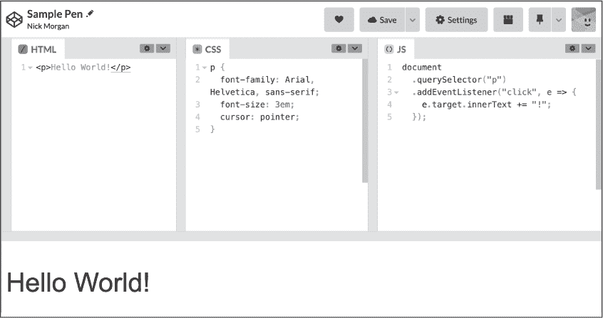

# 第八章：后记

你已经学习了 JavaScript 语言的核心内容，完成了本书的三个项目，现在你可能在想接下来该做什么。好消息（或者坏消息，这取决于你的心态）是学习永远不会停止。你可以将编程事业带向许多不同的方向。以下是一些关于可能的下一步建议，以及可以探索的工具和资源。

## 项目

到目前为止，你应该已经相当了解如何设置一个新的 JavaScript 项目了，为什么不尝试构建一些新东西呢？一个选择是利用本书中学到的技术制作你自己的游戏。一些相对简单的街机游戏，如 *Pong*，包括 *Snake*、*Space Invaders*、*Tetris* 和 *Breakout*。或者你可以尝试完全不同的东西，制作一个字谜游戏，比如 *Wordle* 或 *Hangman*。

你还可以尝试在本书其他项目的基础上进行扩展，创造属于你自己的音乐作品或数据可视化。在音乐方面，你可能想尝试制作一个鼓机，或者一个无限音乐生成器。你还可以利用你的知识为你开发的游戏加入音效。在数据可视化方面，有无数的其他 API 可以尝试，用来从其他服务获取数据。如 第十五章 中讨论的，许多 API 需要某种形式的身份验证，这对于基于浏览器的应用程序来说是不可行的；然而，使用 Node.js，你可以尝试构建自己的后端应用程序。

当然，你不必仅限于本书中所做的项目。如果有某些东西引起了你的兴趣，试着去构建它！如果你不确定从哪里开始，可以用 Google 获取一些灵感。JavaScript 是全球最受欢迎的语言之一，因此有人可能已经写好了关于如何做你想做的事的教程。

## Node.js

本书只解释了如何编写在 Web 浏览器中运行的 JavaScript，但通过 Node.js，你还可以在后端 Web 服务器上运行 JavaScript。查看 [*https://<wbr>nodejs<wbr>.dev<wbr>/en<wbr>/learn<wbr>/*](https://nodejs.dev/en/learn/) 以获得一个关于 Node.js 入门的优秀指南。一旦你为应用程序搭建了后端，就可以开始做更有趣的事情，比如代表用户存储数据、使用密钥访问第三方认证的 HTTP API 等等。

## 工具

有许多不同种类的工具可以帮助你继续编程之旅。本节介绍了一些工具，但远非全面。

### Git

Git 是一个流行的版本控制系统，允许你跟踪代码的变化并回退到早期的版本。当我刚开始编程时，我常常会修改代码并破坏某些功能，然后不知道是怎么破坏的，也无法恢复到之前的状态。为了避免这种情况，我开始备份代码，以便能回到早期版本。而 Git 是一种更好的方式来实现同样的目标。使用 Git 时，你会做出 *commit*，保存代码在某个特定时间点的状态。每个 commit 都是在之前的基础上构建的，同时记录了变化的内容。

有很多在线资源可以学习 Git。许多资源可以在 [*https://<wbr>git<wbr>-scm<wbr>.com<wbr>/doc*](https://git-scm.com/doc) 找到。

### GitHub

一旦你在电脑上安装了 Git，使用 GitHub（我们在 第十五章 中使用的数据来源）是一个很好的下一步。GitHub 提供了一种上传和共享本地 Git 仓库的方式，让它们可以在任何地方访问。

GitHub 还为你提供了访问数百万个开源仓库的权限，你可以 *fork*（创建自己的副本）并根据需要修改它们。例如，要查看我所有的公开仓库，请访问 [*https://<wbr>github<wbr>.com<wbr>/skilldrick*](https://github.com/skilldrick)。

### CodePen

要与他人分享你的项目，你需要一种通过网络使它们可访问的方式。你可以自己搭建网站托管，但一个更简单的选择是使用 CodePen（[*https://<wbr>codepen<wbr>.io*](https://codepen.io)）。这也是本书配套资源的托管工具，资源可以在 [*https://<wbr>codepen<wbr>.io<wbr>/collection<wbr>/ZMjYLO*](https://codepen.io/collection/ZMjYLO) 查看。

使用 CodePen，你可以创建并分享使用 HTML、CSS 和 JavaScript 构建的项目。页面上的代码会在不同的面板中显示。例如，图 A-1 显示了我制作的一个示例 Pen，每次点击文本时都会添加一个额外的感叹号。你可以在线查看该 Pen，链接为 [*https://<wbr>codepen<wbr>.io<wbr>/skilldrick<wbr>/pen<wbr>/abKaQpo*](https://codepen.io/skilldrick/pen/abKaQpo)。

图 A-1：CodePen 上的一个示例 Pen

在 HTML 面板中，仅需包含 body 元素的内容。CodePen 会自动提供其余的 HTML 结构。你也可以通过设置对话框轻松地引入外部 JavaScript 库。

### Glitch

像 CodePen 一样，Glitch 是一个托管代码的服务，并允许你与全世界分享代码。Glitch 与众不同之处在于它能够运行前端 *和* 后端代码。Glitch 不仅提供 HTML、CSS 和 JavaScript 的面板，还允许你定义一个完整的目录结构并存放所需的所有文件。你甚至可以添加一个 SQLite 数据库来存储数据。访问 [*https://<wbr>glitch<wbr>.com*](https://glitch.com) 了解更多信息，或查看 [*https://<wbr>glitch<wbr>.new*](https://glitch.new) 选择一个启动应用程序。

## 网页开发

尽管本书的重点是 JavaScript，但在学习过程中，你也掌握了一些通用的网页开发技能。如果这激发了你的兴趣，你可能会想花更多时间学习网页开发的其他方面。

### HTML 和 CSS

HTML 是绝大多数网页使用的语言，因此深入了解其复杂性非常有价值。欲了解更多信息，请查阅 MDN 文档：[*https://<wbr>developer<wbr>.mozilla<wbr>.org<wbr>/HTML*](https://developer.mozilla.org/HTML)。CSS 用于网页样式，因此如果你希望页面看起来漂亮，理解其工作原理至关重要。想了解更多，可以访问 MDN：[*https://<wbr>developer<wbr>.mozilla<wbr>.org<wbr>/CSS*](https://developer.mozilla.org/CSS)。

### JavaScript 框架和库

现代网页开发非常复杂，网页应用程序通常包含成千上万行的 HTML、CSS 和 JavaScript。为了大大减少编写功能齐全的现代网页应用程序所需的代码量，许多开发人员使用 JavaScript 框架和库。本文写作时，最受欢迎的两个框架是 React 和 Vue.js。虽然掌握这些工具并非必需，但它们可以显著简化构建复杂网站和前端应用程序的过程。你可以在 CodePen 上尝试 React 和 Vue.js，或者访问它们的网站：

+   React: [*https://<wbr>reactjs<wbr>.org*](https://reactjs.org)

+   Vue.js: [*https://<wbr>vuejs<wbr>.org*](https://vuejs.org)

+   React 在 CodePen 上: [*https://<wbr>codepen<wbr>.io<wbr>/topic<wbr>/react<wbr>/templates*](https://codepen.io/topic/react/templates)

+   Vue.js 在 CodePen 上: [*https://<wbr>codepen<wbr>.io<wbr>/topic<wbr>/vue<wbr>/templates*](https://codepen.io/topic/vue/templates)

## 测试

对程序员来说，一个重要的工具就是自动化测试框架。自动化测试旨在定期运行在你的代码上，以确认它是否按预期执行功能。在编写代码时，一个常见的问题是添加新功能时没有意识到这段更改会破坏程序的其他部分。通过编写好的测试并定期运行它们，你可以及时发现问题并进行修复。你也可以在进行大型代码重构时充满信心，因为只要测试通过，就不太可能破坏其他内容。

有许多用于 JavaScript 的测试库和框架。在写这篇文章时，最流行的框架之一是 Jest：可以通过 [*https://<wbr>jestjs<wbr>.io*](https://jestjs.io) 了解更多。

## 更多 JavaScript！

如果你想加深对 JavaScript 的理解，有许多资源可以供你参考。以下是一些推荐的学习起点：

+   MDN JavaScript 门户：[ *https://<wbr>developer<wbr>.mozilla<wbr>.org<wbr>/JavaScript*](https://developer.mozilla.org/JavaScript)

+   *Eloquent JavaScript*，第 3 版，作者 Marijn Haverbeke（No Starch Press，2018）

+   *JavaScript: The Definitive Guide*，第 7 版，作者 David Flanagan（O'Reilly Media，2020）

## 其他语言

在这一点上，你可能决定拓宽自己的编程知识，而不是更深入地研究 JavaScript。去做吧！每学习一门语言都会为你提供宝贵的编程见解，这实际上是提高 JavaScript 技能的好方法。

### TypeScript

人们对 JavaScript 的一个常见问题是其弱动态类型，这允许根据周围代码的不同隐式地将值强制转换为不同的数据类型。例如，如果一个操作数是字符串，那么+运算符会将数字操作数转换为字符串，而-运算符则会将字符串操作数转换为数字，如果另一个操作数是数字。

TypeScript 语言试图为 JavaScript 增加静态类型。*静态类型*意味着某一类型的变量只能包含该类型的值，并且类型之间的转换必须是显式的。TypeScript 在语法上是 JavaScript 的超集，这意味着有效的 JavaScript 程序也是有效的 TypeScript 程序。TypeScript 代码可以通过 TypeScript 编译器转换为 JavaScript。

使用静态类型使得某些错误代码无法编写。例如，在 JavaScript 中，你可能从文本框中获取一个值，假设它是一个数字，并将其加到另一个数字上。不幸的是，来自文本框的任何值都会被当作字符串处理，因此另一个数字也会隐式转换为字符串，最终你会得到两个字符串连接在一起。TypeScript 不允许这种情况发生。它知道来自文本框的值是字符串，并强制你决定是否将两个操作数转换为字符串进行连接，或者将两个操作数转换为数字进行加法运算。

TypeScript 的一个缺点是，有时编写看似应该工作的代码可能会更加困难。这有时被称为 *与编译器作斗争*。

如果你想了解更多内容，以下是一些书籍和其他资源，可以帮助你开始学习 TypeScript：

+   TypeScript 手册：[*https://<wbr>www<wbr>.typescriptlang<wbr>.org<wbr>/docs<wbr>/handbook<wbr>/intro<wbr>.html*](https://www.typescriptlang.org/docs/handbook/intro.html)

+   *有效的 TypeScript* 由 Dan Vanderkam 编写（O’Reilly Media, 2019）

+   *学习 TypeScript* 由 Josh Goldberg 编写（O’Reilly Media, 2022）

### Python

Python 是一种脚本语言，像 JavaScript 一样，但它有不同的哲学。Python 采用“电池全包”的方法，这意味着它的标准库功能非常丰富（与之相比，JavaScript 的标准库非常有限）。像 JavaScript 一样，Python 是动态类型的，因此同一个变量可以存储不同数据类型的值。但不同于 JavaScript 的弱类型，Python 是 *强类型* 的，这意味着没有隐式类型转换。从语法上看，Python 非常不同，它使用缩进（这要求严格，不是可选的）来定义嵌套代码块，而不是大括号。

Python 是一种流行的 Web 服务器编程语言，也广泛应用于科学和数值编程。如果你想拓宽技能，Python 是一个很好的选择。以下这本书（与 *JavaScript 编程快速上手* 同一系列）是学习该语言的极好入门书籍，它的项目展示了 Python 在某些领域的优势：

+   *Python 编程快速上手* 第 3 版，由 Eric Matthes 编写（No Starch Press, 2023）

### Rust

今天我最兴奋的编程语言之一是 Rust。与 TypeScript 类似，它也是一种静态类型语言，但它拥有比大多数现今使用的语言更强大的类型系统。Rust 旨在替代旧的 C 和 C++ 语言，用于开发高性能代码。

C 和 C++ 都是没有 *垃圾回收* 的语言，垃圾回收是指计算机自动识别哪些值和对象不再使用，从而释放内存的过程。相反，C/C++ 程序员必须手动释放不再使用的数据——这个过程容易出错，且常常导致 bug。这些语言通常在对性能要求高的环境中使用，之所以不使用垃圾回收，是因为垃圾回收会降低软件的性能。Rust 通过编译时的 *借用检查器* 避免了这个问题，该检查器跟踪哪些对象在任何时刻正在使用，以及程序的哪些部分正在使用它们。

Rust 也被广泛用作编译 WebAssembly 的源语言，WebAssembly 是一种令人兴奋的新技术，可在浏览器中运行高效且性能优异的代码。以下是一些学习更多内容的资源：

+   *Rust 编程语言*（第二版），由 Steve Klabnik 和 Carol Nichols 编写（No Starch Press，2023）

+   Rust 和 WebAssembly：[*https://<wbr>rustwasm<wbr>.github<wbr>.io<wbr>/docs<wbr>/book<wbr>/*](https://rustwasm.github.io/docs/book/)
