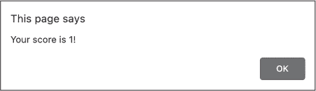

<hgroup>

## <samp class="SANS_Futura_Std_Bold_Condensed_B_11">2</samp> <samp class="SANS_Dogma_OT_Bold_B_11">基础知识</samp>

</hgroup>


在本章中，我将介绍构成任何 JavaScript 程序的一些基本元素。你将了解 JavaScript 代码的基本单元，这些单元让你能够表示值并向计算机发出指令。你还将学习如何为一个值赋予名称，以便在代码中以后引用它。

本章还展示了 JavaScript 如何根据值可以表示的信息种类将值分类为不同的数据类型。我们将重点介绍表示单一值的原始数据类型，例如一个数字或一段文本。你将练习在 JavaScript 控制台中使用不同的原始数据类型，并探索可以应用于它们的一些操作。

### <samp class="SANS_Futura_Std_Bold_B_11">表达式与语句</samp>

JavaScript 中最基本的构建块是 *表达式*，它是表示单一值的代码片段。确定表达式值的过程被称为 *求值*。例如，100 + 200 是一个表达式，它求值为数字 300。

另一个重要的 JavaScript 构建块是 *语句*，它是一个完整的思想，像英语中的句子，指示计算机做某事。每个 JavaScript 程序都由一系列语句组成。例如，在第一章中，我们使用了语句 alert("Hello, world!"); 来指示计算机显示一个包含 *Hello, world!* 文本的对话框。与句子以句号结尾不同，JavaScript 语句以分号结尾。

你可以通过简单地在表达式末尾加上分号，将表达式转化为语句。例如，100 + 200; 就是一个语句，指示计算机将两个数字相加。打开 JavaScript 控制台并输入此语句。当你这样做时，它将对语句中的表达式进行求值并打印结果：

```
**100 + 200;**
300 
```

该语句中的主要表达式 100 + 200 被称为 *复合表达式*，因为它实际上包含了两个较小的表达式，100 和 200。这些是 JavaScript 表达式最简单形式的示例，*字面量*，即在代码中直接表示一个固定值。具体来说，100 和 200 是 *数字字面量*，因为它们直接对应它们表示的数值 100 和 200。相反，复合表达式 100 + 200 不是字面量，因为它并不直接对应它的值 300。这个复合表达式中的 + 并不表示一个值。它实际上是一个 *运算符*，用于组合或操作表达式的符号。

区分值和表达式很重要，值是程序中的底层数据，而表达式是代码中的符号，告诉 JavaScript 值应该是什么。300 和 100 + 200 都有一个值 300，但它们是两种不同的表达式——一个是字面值，另一个是复合表达式——它们以不同的方式表示这个值。

JavaScript 表达式和语句相辅相成。表达式有值，但表达式本身并不会*做*任何事情。相反，语句通过告诉计算机执行任务来完成工作，但语句本身没有值；它们只是指令。编程的力量来自于编写语句，利用并操作表达式的值以达到预期的结果。

### <samp class="SANS_Futura_Std_Bold_11">数字和运算符</samp>

JavaScript 使用*数字*数据类型来存储数值。你已经在上一节中开始使用数字，并且遇到了 + 运算符，它将两个数字相加。JavaScript 也有其他常见数学运算的运算符，包括减法（-）、乘法（*）和除法（/）。在 JavaScript 控制台中试试这些运算符：

```
**100 + 200;**
300
**10000 - 999;**
9001
**999 * 111;**
110889
**997002 / 999;**
998 
```

在像这样的情况中，表达式涉及一个运算符（例如 + 或 *），我们通常说运算符*返回*一个值（而不是说表达式被*求值*）。例如，* 运算符接收数字 999 和 111，并返回它们的乘积 110889。

#### <samp class="SANS_Futura_Std_Bold_Condensed_Oblique_BI_11">运算顺序</samp>

你可以在一个表达式中组合多个数字和运算符，在这种情况下，你需要考虑操作执行的顺序。考虑这个例子：

```
**5 + 10 / 10 - 5;**
1 
```

当你有多个运算符时，JavaScript 使用标准的数学 PEMDAS（括号、指数、乘法、除法、加法、减法）规则来确定计算顺序。这个表达式中的除法操作首先执行，其次是加法和减法，最终得到的值是 1。

为了强制加法和减法先进行，可以使用括号：

```
**(5 + 10) / (10 – 5);**
3 
```

这次，表达式产生了不同的值，因为括号改变了运算顺序。

#### <samp class="SANS_Futura_Std_Bold_Condensed_Oblique_BI_11">浮点数</samp>

到目前为止，我们仅限于整数，但 JavaScript 的数字数据类型也可以容纳小数，即编程术语中的*浮点数*。这里有一个生成浮点数的表达式：

```
**10 / 4;**
2.5 
```

浮点数的精度有限，因此小数部分不能无限延续。相反，它们会被截断，如以下示例所示：

```
**10 / 3;**
3.3333333333333335 
```

你可能会注意到浮点数学的一些怪异现象，其中结果不是你预期的那样。例如，0.1 + 0.2 并不会准确等于 0.3。相反，我们得到了一些额外的小数位：

```
**0.1 + 0.2;**
0.30000000000000004 
```

这是由于计算机表示数字的基础数学原理（可以在网上搜索“浮动点运算”了解更多）。一般来说，这些问题不应该影响你，但在某些情况下可能会。举个例子，如果你正在编写一个处理货币数值的应用程序，假如$0.10 和$0.20 相加后不等于$0.30，可能就会成为问题。在这种情况下，通常的解决方案是将货币数值转换为美分（或等值的最小单位），然后再进行数学计算。例如，表示美元金额的数字 0.10 将变成表示美分金额的 10。

### <samp class="SANS_Futura_Std_Bold_B_11">绑定</samp>

在 JavaScript 中，你可以将一个名称与一个值关联，这样以后在代码中可以轻松引用该值。这个关联称为*绑定*。绑定是非常强大的工具，因为它们提供了一个存储表达式生成值的地方。没有它们，你的程序将无法记住它们已经做过的工作。

一种绑定类型是*变量*，它允许你根据需要更新与特定名称关联的值。它们之所以叫变量，是因为它们的值可以变化或改变。另一种绑定类型是*常量*，在赋值后你不能更新与名称关联的值。这个值保持不变，或者说是常量。

把变量或常量想象成一个有标签（名称）的盒子，里面放着一个单独的物品（值）。你把一个值放进盒子，然后在需要时通过名称去查找它。变量允许你把新值放进盒子，而常量将始终保持相同的值。

绑定的名称也叫做*标识符*，创建标识符的过程称为*声明*：绑定的名称正在被声明。在 JavaScript 中，声明是一种特殊类型的语句，它生成一个新的标识符。让我们来看一下如何声明并使用变量和常量。

#### <samp class="SANS_Futura_Std_Bold_Condensed_Oblique_BI_11">变量</samp>

JavaScript 有两个关键字用于声明变量：var 和 let。*关键字*是内建于 JavaScript 语言中的一个词，它被保留用于特定的目的。最初，var 关键字是唯一的选择，但后来 let 被加入以修复 var 的一些不足。如今，let 是声明变量时推荐使用的关键字，所以在本书中我们将使用 let，但在查看旧代码时，如果遇到 var 也不要惊讶。

这是一个使用 let 声明变量的例子：

```
**let age;**
undefined 
```

这个 let 声明创建了一个名为 age 的新变量。let 声明本身没有值，因此 JavaScript 控制台会打印出特殊值 undefined。

现在我们已经创建了一个变量，接下来让我们编写一个表达式来赋予它一个值：

```
**age = 35;**
35 
```

给变量赋值叫做 *赋值*，你可以使用赋值运算符（`=`）来完成。在运算符的右侧，你输入一个表达式（在这个例子中是数字字面量 35），在左侧，你输入应该被赋予该表达式值的变量名（在这个例子中是 `age`）。

使用 `=` 运算符进行赋值是一种复合表达式，就像使用 `+` 和其他数学运算符的表达式一样。赋值表达式的值是变量的新值。在这种情况下，我们将 `age` 设置为 35，所以控制台打印出 35。

第一次给变量赋值叫做 *初始化*。程序员通常将变量的声明和初始化合并成一行代码。例如，在这里我们创建了一个名为 `cats` 的新变量，并给它赋值为 2，所有操作都在同一句话中完成：

```
**let cats = 2;**
undefined 
```

虽然我们在这里给变量赋值，但主要规则是 `let` 声明本身没有值，因此 JavaScript 控制台会打印出 undefined。

为了确认赋值是否成功，只需在控制台中输入变量名，后跟分号：

```
**cats;**
2 
```

在这里，`cats` 是一个表达式，它的值是当前 `cats` 变量的值，因此控制台打印出这个值。

因为 `cats` 是一个变量，我们可以使用新的赋值表达式自由地更改它的值。例如，这里我们将它的值更新为 3：

```
**cats = 3;**
3 
```

变量的一个好处是，你可以随时更改它们的值——例如，当你得到另一只猫时。

#### <samp class="SANS_Futura_Std_Bold_Condensed_Oblique_BI_11">常量</samp>

在 JavaScript 中声明常量时，我们使用 `const` 关键字：

```
**const PI = 3.141592653589793;**
undefined 
```

这创建了一个名为 `PI` 的新常量，并赋值为 3.141592653589793，这就是数字 π 的近似值。

现在我们可以使用这个常量来根据圆的直径计算圆的周长：

```
**let diameter = 3;**
undefined
**let circumference = diameter * PI;**
undefined
**circumference;**
9.42477796076938 
```

在这里，我们创建了一个名为 `diameter` 的变量并赋值为 3。然后我们创建了另一个变量 `circumference`，并给它赋值为 `diameter * PI`。请注意，我们使用了一个复合表达式，由一个变量（`diameter`）、一个常量（`PI`）和一个数学运算符（`*`）组成，来设置变量的值。编程的核心就是创建常量和变量，然后通过操作它们来创建其他常量和变量。

> <samp class="SANS_Dogma_OT_Bold_B_21">注意</samp>

*为了避免书中的代码示例过于杂乱，从现在开始，我将不再显示变量或常量声明后控制台打印的 undefined。*

与变量不同，一旦常量被创建，你就无法更改它的值。例如，如果你尝试更新 PI 的值，JavaScript 会报错：

```
**PI = 5.378;**
Uncaught TypeError: Assignment to constant variable.
  at <anonymous>:1:4 
```

错误是 JavaScript 告诉你代码有问题的方式。这个错误信息中最重要的部分是“Assignment to constant variable”（赋值给常量变量）。这表明我们错误地试图给一个常量赋一个新值。

与变量不同，你不能将常量的声明与初始化分开，你必须在声明时就为常量赋值。因此，下面的代码是无法工作的：

```
**const TAU;**
Uncaught SyntaxError: Missing initializer in const declaration 
```

这个错误信息告诉我们，常量声明缺少初始化器，意味着常量应该在声明时赋予一个值。

#### <samp class="SANS_Futura_Std_Bold_Condensed_Oblique_BI_11">命名约定</samp>

你应该给变量和常量起有描述性的名字，这样当你或其他人阅读你的代码时，能清楚地知道这些变量和常量代表什么。例如，如果你在写控制汽车的代码，你可能需要一个变量来存储汽车的速度，单位是英里每小时。speedInMilesPerHour 这个名字有点长，但考虑到 MPH 是一个广泛理解的“英里每小时”缩写，好的变量名应该是 speedInMPH。像 speed 这样的简短名字也可以，但前提是每个阅读代码的人都能明确知道这个 speed 是以英里每小时为单位。（想象一下，如果有一个来自德国的人在阅读你的代码，认为你说的是公里每小时。）这个变量的一个糟糕名字是 s，它完全没有给读者任何提示。

JavaScript 是区分大小写的，这意味着它会区分变量 age、Age 和 AGE。此外，标识符不能包含空格。为了避免这个问题，常见的变量命名约定是使用*camelCase*，其中名称中的第一个单词以小写字母开头，后续单词以大写字母开头，例如 speedInMilesPerHour。（之所以叫 camelCase，是因为中间的大写字母看起来像骆驼的驼峰。）

另一种变量命名约定是*snake_case*，其中所有字母都是小写，每个单词之间用下划线分隔。（我猜这看起来有点像蛇，如果你眯着眼睛看。）在 snake_case 中，我们可以写作 speed_in_miles_per_hour 或 speed_in_MPH。

使用蛇形命名法（snake_case）可以让变量名比驼峰命名法（camelCase）稍微更清晰一些，但它也让变量名变得更长，而且输入时不容易快速打字。JavaScript 程序员通常偏好使用驼峰命名法，所以本书中我将使用这种命名法。

常量遵循与变量不同的命名约定。常量有两种类型：*真正的常量*，它的值在程序运行时永远不会改变（例如 pi 或一天中的小时数），以及那些你将其设为常量，因为你不希望在代码中不小心修改它们的值（例如当前用户的名字）。对于真正的常量，习惯上使用全大写的 snake_case，例如 HOURS_IN_A_DAY。对于那些为了避免意外修改值而创建的常量，使用与变量相同的命名约定。在这种情况下，唯一的区别是，绑定是使用 const 而不是 let 创建的。

### <samp class="SANS_Futura_Std_Bold_B_11">递增与递减</samp>

在编写软件时，你经常需要对变量的值进行*递增*（增加）或*递减*（减少）1 或其他数字。例如，你可能会使用一个变量来统计文档中某个单词的出现次数。每次看到该单词时，你就将变量的值加 1。同样，你也可以使用一个变量来跟踪游戏中玩家的金额，每当玩家赚取或花费一些钱时，就增加或减少这个金额。

递增变量的一种方法是初始化它，然后将它的值改为其原值加 1：

```
**let money = 100;**
**money = money +** **1;**
101 
```

在这里，我们声明一个名为 money 的新变量，并将其初始化为 100。然后，我们通过给 money 现有的值加 1 来给 money 赋新值。看到像 money = money + 1;这样的表达式可能会显得有些矛盾，但实际上这是一种很常见的编程模式。当 JavaScript 遇到像这样的赋值表达式时，它会首先计算赋值运算符右侧表达式的值，在这个例子中就是 money + 1。因为 money 当前是 100，所以 money + 1 的值是 101。然后，JavaScript 会更新赋值运算符左侧变量的值，这里是同一个变量 money。

关键在于，JavaScript 会等到计算完运算符右侧表达式的值之后，才会更改运算符左侧变量的值。这就是为什么同一个变量可以出现在运算符的两边。最终，money = money + 1 的意思是“将 1 加到 money 上”。

由于给变量加 1 是一个非常常见的任务，JavaScript 通过递增运算符（++）使这个操作变得更容易。当你将此运算符附加到变量时，它会将该变量的值增加 1，而无需你写出完整的赋值表达式。同样，JavaScript 的递减运算符（--）会将变量的值减少 1。在这里，我们使用++和--来改变一个温度变量的值：

```
**let temperature = 70;**
**++temperature;**
71
**++temperature;**
72
**--temperature;**
71 
```

在这个例子中，我们将递增和递减运算符放在我们想要更改的变量*之前*。在这种位置下，递增或递减操作的输出是变量的更新值。例如，当 temperature 的值为 70 时，++temperature 输出的值是 71。这种方式称为*前缀*递增和递减。

JavaScript 还允许进行*后缀*递增和递减，其中运算符位于变量*之后*。在这种情况下，变量仍然会增加或减少 1，但输出显示的是变量*变化之前*的值。下面是一个例子：

```
**let books = 2;**
**books****++;**
❶ 2
**books;**
❷ 3
**books--;**
3
**books;**
2 
```

我们将 books 变量初始化为 2。然后，books++会递增这个值，但它返回的是递增之前的 books 值❶。当我们随后单独请求 books 的值时，我们可以看到它的值已经变为新的值❷，这证明了递增操作已经发生。

无论你使用前缀递增还是后缀递增，递减的效果是一样的：它的值增加或减少 1。唯一的区别在于递增或递减表达式本身是如何求值的。幸运的是，大多数时候当你使用这些运算符时，实际上并不需要递增或递减表达式的值——你只需要修改保存在变量中的值。因此，你通常可以交换使用前缀和后缀版本。

#### <samp class="SANS_Futura_Std_Bold_Condensed_Oblique_BI_11">加法与减法赋值</samp>

递增运算符将变量的值增加 1，但有时你希望将其增加不同的值。为此，JavaScript 提供了加法赋值运算符（`+=`）。它将运算符左侧的变量值增加右侧所指定的值，如下所示：

```
**let price = 20;**
**price** **+= 5;**
25 
```

在这里，我们使用`+=`将价格增加 5。实际上，`price += 5`是`price = price + 5`的简写。`+=`运算符将加法和赋值合并成一个符号。

类似地，减法赋值运算符（`-=`）是一种方便的方式，可以从变量中减去任何值：

```
**let cookies = 12;**
**cookies -= 5;**
7 
```

在这种情况下，`cookies -= 5`是`cookies = cookies - 5`的简写。

#### <samp class="SANS_Futura_Std_Bold_Condensed_Oblique_BI_11">乘法与除法赋值</samp><samp class="SANS_Futura_Std_Bold_Condensed_Oblique_BI_11">运算</samp><samp class="SANS_Futura_Std_Bold_Condensed_Oblique_BI_11">符</samp>

乘法和除法赋值运算符，`*=`和`/=`，通过将变量的值乘以或除以指定的数字来更新变量的值。例如：

```
**let tribbles =** **6;**
**tribbles *= 2;**
12
**tribbles /= 3;**
4 
```

与其他简写赋值运算符类似，这些赋值运算符分别转换为`tribbles = tribbles * 2`和`tribbles = tribbles / 3`。

### <samp class="SANS_Futura_Std_Bold_B_11">字符串</samp>

JavaScript 使用*字符串*数据类型来表示文本。之所以叫字符串，是因为文本被当作一串字符来处理。例如，字符串`Hello!`由六个字符组成：H、e、l、l、o 和 !。

*字符串字面量*是字符串值的直接表示。要创建一个字符串字面量，只需将一些文本用双引号括起来。引号之间的每个字符都是字符串的一部分。例如，这里我们将字符串字面量"Hello!"赋值给变量`greeting`。然后我们检查变量的值：

```
**let greeting = "Hello!";**
**greeting;**
'Hello!' 
```

你也可以使用单引号而不是双引号来书写字符串字面量。事实上，正如这个例子所示，当 Chrome 的 JavaScript 控制台输出一个字符串时，它会将该字符串用单引号括起来（即使你是用双引号书写的）。为了保持一致性，我将在本书中书写字符串时坚持使用双引号，尽管我也会使用单引号来准确反映控制台的输出。

通常，字符串主要由字母组成，但正如我们在“Hello!”的示例中看到的，字符串也可以包含标点符号。字符串还可以包含空格以及数字，举例如下：

```
**let price = "5 dollars";**
**price;**
'5 dollars' 
```

甚至可以有一个只包含数字的字符串，如 "123"，但区分这个字符串和实际的数字是很重要的。字符串字面量 "123" 是三个字符的序列，1、2 和 3，而数字字面量 123 的数值为 123。

JavaScript 提供了很多操作字符串的方法。接下来我们将查看一些这些字符串操作。

#### <samp class="SANS_Futura_Std_Bold_Condensed_Oblique_BI_11">连接字符串</samp>

当应用于字符串而不是数字时，+ 操作符会将字符串连接在一起。这样，你可以通过组合不同的字符串来构建一个更长的消息。以下是一个示例：

```
**let first = "First string";**
**let second = "Second string";**
**let joined = first +** **second;**
**joined;**
'First stringSecond string' 
```

在这里，我们将两个字符串赋值给变量 first 和 second。然后，我们使用 + 将这些字符串连接起来，将结果存储在变量 joined 中。请注意，JavaScript 在连接字符串时不会自动添加空格——它只是直接将第二个字符串附加到第一个字符串的末尾。如果你希望它们之间有空格，必须通过将空格当作一个独立的字符串显式地添加进去：

```
**first + " " + second;**
'First string Second string' 
```

在这个示例中，我们连接了三个字符串字面量：

1.  "第一个字符串"

2.  " "（由一个空格组成的字符串）

3.  "第二个字符串"

结果是，我们在字符串和 Second 之间得到了一个空格。

#### <samp class="SANS_Futura_Std_Bold_Condensed_Oblique_BI_11">计算字符串的长度</samp>

你经常需要检查字符串的长度。例如，如果你在制作一个评论网站，你可能希望将评论的长度限制为 1,000 个字符。要查找字符串中有多少个字符，在字符串后面加上 .length 来访问其长度属性。（*属性*是关于代码中某个对象的信息；我们将在第三章中详细讨论属性。）在这里，我们使用 .length 来确认字符串 "abc" 有三个字符：

```
**"abc".length;**
3 
```

在这种情况下，我们在字符串字面量上使用了 .length， 但你也可以在包含字符串的变量或常量上使用它，如下所示：

```
**let longString = "This is my very long string";**
**longString.length;**
27 
```

这段代码统计了字符串中所有字符的数量，包括空格，字符串绑定到变量名 longString。

#### <samp class="SANS_Futura_Std_Bold_Condensed_Oblique_BI_11">从字符串中获取字符</samp>

要从字符串中获取单个字符，请使用该字符的 *索引*。这是一个表示字符在字符串中位置的数字。JavaScript 总是从零开始计数，因此索引 0 表示字符串中的第一个字符，索引 1 表示第二个字符，以此类推。这就是 *零基索引*。

将所需的索引放入方括号中以访问该索引位置的字符，如下所示：

```
**let alphabet = "ABCDEFG";**
**alphabet[0];**
'A'
**alphabet[1];**
'B' 
```

这里，alphabet[0] 获取存储在变量 alphabet 中的字符串的第一个字符，alphabet[1] 获取第二个字符。

如果你使用超出字符串长度的索引，表达式将返回 undefined：

```
**alphabet[10];**
undefined 
```

字符串 alphabet 只有七个字符，索引范围为 0 到 6，所以`alphabet[10]`超出了范围。

#### <samp class="SANS_Futura_Std_Bold_Condensed_Oblique_BI_11">从字符串中获取多个字符</samp>

要从字符串中获取多个字符（也称为*切片*），而不仅仅是单个字符，可以使用切片方法。*方法*是一种特定类型的函数，附加在特定的值或数据类型上。（正如我们在第一章中讨论的，函数是执行任务的命名代码块。）方法通常用于对其所附加的对象进行计算，或更新其某些内容。在这个例子中，slice 是与字符串数据类型相关联的多种方法之一，你可以用它来操作给定的字符串。

使用或*调用*方法的语法是，在你想应用方法的值或变量后面加一个句点，然后是方法名，再加上一对括号。在括号内，你写入方法需要的任何值，这些值用逗号分隔。和其他函数一样，这些值被称为*参数*。方法也可以返回一个值，称为方法的*返回值*。

切片方法接受两个参数，即你想提取的切片的起始索引（包含）和结束索引（不包含），并返回包含指定范围字符的子字符串。以下是一个示例：

```
**let sentence = "My name is Nick.";**
**sentence.slice(3, 7);**
'name' 
```

在这里，我们将一个字符串存储在变量 sentence 中，然后通过写`sentence.slice(3, 7)`来调用该字符串的切片方法。括号中的第一个参数意味着我们希望切片从字符串的索引 3 开始（即第四个字符，“name”中的 n）。第二个参数意味着我们希望切片到达字符串的索引 7，但不包括该位置（即“name”后的空格）。最终结果是，切片方法返回索引 3、4、5 和 6 的字符，得到字符串"name"。

> <samp class="SANS_Dogma_OT_Bold_B_21">注意</samp>

*我们将在第五章中更详细地讨论函数，一般而言，并在第六章中专门讨论方法。*

#### <samp class="SANS_Futura_Std_Bold_Condensed_Oblique_BI_11">修剪字符串中的空白字符</samp>

*空白字符*指的是打印时不需要任何墨水的字符，如空格或制表符。trim 方法删除字符串开头和结尾的所有空白字符，并返回一个去除空白的新字符串。这在某些情况下很有用，例如当你从用户那里获取输入时，他们不小心在开始或结束处加了几个空格，如下所示：

```
**let inputText = " Here is my input  ";**
**inputText.trim();**
'Here is my input'
**inputText;**
❶ ' Here is my input    ' 

```

存储在变量 inputText 中的字符串在单词 Here 之前有一个空格，在单词 input 后面有三个额外的空格。当我们通过写 inputText.trim() 来调用 trim 方法时，我们得到一个新字符串，其中这些空格被移除了。但是请注意，单词*之间*的空格没有受到影响；只有字符串开头和结尾的空格被去除。trim 方法不需要任何参数，所以我们只需在方法名后写一个空括号。

因为 trim 方法返回一个新的字符串，所以原始字符串 inputText 保持不变。我们可以通过查看代码清单末尾的 inputText 的值来看到这一点：输出结果仍然包含字符串开头和结尾的空格 ❶。

#### <samp class="SANS_Futura_Std_Bold_Condensed_Oblique_BI_11">其他有用的字符串方法</samp>

除了 slice 和 trim，JavaScript 还有更多可用的字符串方法。我不会详细讲解所有方法，但这里列出了一些有用的方法：

str.toLowerCase()    返回一个新的字符串，将 str 中的所有大写字母转换为小写字母。

str.includes(otherStr)    如果 str 包含作为 otherStr 参数传入的字符串，则返回 true。

str.padStart(num, char)    返回一个新的字符串，该字符串至少有 num 个字符，如果原字符串长度小于 num，则在字符串的开头添加必要次数的 char 字符。

str.repeat(count)    返回一个新的字符串，str 重复 count 次。

### <samp class="SANS_Futura_Std_Bold_B_11">转义序列</samp>

有时候你可能想在字符串中插入特殊字符，比如插入换行符以在字符串中间创建换行，或者插入制表符以创建更宽的水平间距。JavaScript 允许你通过*转义序列*来插入这些字符。转义序列是一串字符，始终以反斜杠（\）开头，表示将被转换为另一个字符。例如，要在字符串中插入换行符，可以使用 \n 转义序列：

```
**"Hello\nWorld";**
'Hello\nWorld' 
```

无论好坏，当 Chrome 的 JavaScript 控制台评估一个包含特殊字符的字符串并输出结果时，特殊字符会保持其转义形式。要查看该字符串如何正确解释转义序列，请将字符串作为参数传递给 console.log 方法。该方法将数据输出到控制台，包括任何必要的格式化。例如：

```
**console.log("Hello\nWorld");**
Hello
World 
```

该方法的输出显示了 \n 转义序列如何被解释为字符串中两个单词之间的换行符。

表 2-1 列出了你最常使用的一些转义序列。

| <samp class="SANS_Futura_Std_Heavy_B_11">表 2-1：</samp> <samp class="SANS_Futura_Std_Book_11">常见转义序列</samp> |
| --- |
| <samp class="SANS_Futura_Std_Heavy_B_11">转义序列</samp> | <samp class="SANS_Futura_Std_Heavy_B_11">输出</samp> |
| \' | <samp class="SANS_Futura_Std_Book_11">单引号</samp> |
| \" | <samp class="SANS_Futura_Std_Book_11">Double quote</samp> |
| \\ | <samp class="SANS_Futura_Std_Book_11">Backslash</samp> |
| \n | <samp class="SANS_Futura_Std_Book_11">Newline</samp> |
| \t | <samp class="SANS_Futura_Std_Book_11">Tab</samp> |

如表所示，如果你想在字符串中包含实际的反斜杠字符，你需要使用 \\. 同样，如果你想在双引号字符串中包含双引号字符，你需要使用 \"。例如：

```
**console.log("This string has \"double quotes\" and a \\ backslash character");**
This string has "double quotes" and a \ backslash character 
```

当你在双引号中编写字符串时，如果想使用单引号（例如，作为缩写中的撇号），就不需要使用 \' 转义序列。你可以直接写出单引号，如下所示：

```
**console.log("You don't need to escape single quotes");**
You don't need to escape single quotes 
```

同样，当你在单引号内编写字符串时，如果想使用双引号，也不需要进行转义。

### <samp class="SANS_Futura_Std_Bold_B_11">模板字面量</samp>

*模板字面量* 是一种特殊类型的字符串，可以评估其中嵌入的任何表达式。这让你可以灵活地动态填充字符串，插入变量的值、计算结果或其他代码，而不必一字一句地输入字符串中的每个字符，或者使用 + 运算符将多个变量组合成一个字符串。

模板字面量用反引号（`）包围，而不是用引号。你可以使用 *占位符语法* 来插入代码，语法如下：${}。占位符中的内容会被视为一个表达式，并在最终字符串被求值之前进行求值，如下所示：

```
**let name** **= "Nick";**
**`Hello, ${name}!`;**
'Hello, Nick!' 
```

在这里，name 变量的值会被插入到字符串中，而不是 ${name} 占位符，最终得到字符串 "Hello Nick!"。如果我们更改 name 的值，相同的模板字面量会生成不同的字符串：

```
**name = "Dolly";**
**`Hello, ${name}!`;**
'Hello, Dolly!' 
```

你可以在占位符的大括号中放置任何表达式，而不仅仅是简单的变量。表达式会被求值，结果会插入到字符串中。例如：

```
**`There are ${60 * 60 * 24} seconds in a day`;**
'There are 86400 seconds in a day' 
```

在这种情况下，JavaScript 会计算 60 * 60 * 24 的值，将其转换为字符串，并将其包含在计算后的字符串中。

模板字面量有很多应用，比如从用户那里获取文本输入并将其插入到新字符串中。当你需要基于多个变量构造字符串时，它们特别有用。例如，假设你正在构建一个类似 Mad Libs 的 Web 应用程序，用户输入不同词性的单词并将其组合成句子。用户已经输入了以下三个单词，这些单词存储在不同的变量中：

```
**let noun = "moon";**
**let adverb = "strangely";**
**let adjective = "red";** 
```

如果没有模板字面量，你就得通过反复使用 + 运算符将变量合并成一个字符串：

```
**"The " + noun** **+ " was " + adverb + " " + adjective + ".";**
'The moon was strangely red.' 
```

这段代码写起来相当繁琐，特别是当你想在每个单词之间加一个空格，并在句末加一个句号时。使用模板字面量要简单得多：

```
**`The ${noun} was ${adverb} ${adjective}.`;**
'The moon was strangely red.' 
```

除了让代码更容易编写外，模板字面量还使其更容易阅读。这样可以更清楚地看到代码是在将一个自定义名词、副词和形容词插入到句子中。

### <samp class="SANS_Futura_Std_Bold_B_11">未定义和空值</samp>

在 JavaScript 中，`undefined`和`null`有特殊的含义：它们代表*无*。当 JavaScript 无法为某个值提供数据时，默认返回`undefined`。例如，正如你在本章前面看到的，如果你声明一个变量但没有给它赋值，JavaScript 会自动将其赋值为`undefined`：

```
**let nothing;**
**nothing;**
undefined 
```

当你执行一个没有有用返回值的函数时，比如我们在第一章中使用的`alert`函数，它会在控制台中返回`undefined`，用于弹出一个对话框：

```
**alert("I have no value.");**
undefined 
```

而 JavaScript 会在某个值没有定义时自动使用`undefined`，程序员通常使用`null`来明确标记某个值为空。例如，如果你写的代码需要获取用户输入的地址，而用户没有提供地址，你可以将地址变量设置为`null`：

```
**let address = null;**
**address;**
null 
```

从功能上讲，将地址设置为`null`与将变量留空（即未定义）并没有本质区别，但它让你的意图更加明确。其他阅读你代码的人会看到你故意将地址标记为空值，而不是因为它还没有定义。

### <samp class="SANS_Futura_Std_Bold_B_11">布尔值</samp>

我们将要考虑的最后一种原始数据类型是*布尔值*类型，它表示真/假值。布尔值只有两个字面量：`true`和`false`。在这里，我们创建了一个布尔变量并通过字面量确认其值：

```
**let playing = true;**
**playing;**
true 
```

在这个例子中，我们声明了一个名为`playing`的新变量，并将其初始化为布尔字面量`true`。你可以想象这是一个游戏中的代码，`playing`变量告诉我们游戏当前是处于活动状态（true）还是暂停状态（false）。

布尔值是编程中至关重要的一部分，因为它们为我们提供了一种讨论逻辑的方式。如果你希望程序根据某个特定条件作出不同的行为，你需要能够判断这个条件是否成立——即，是否为真或假。例如，如果你在开发一个视频流网站，可能需要判断当前用户是否未满 18 岁。如果是的话，可能会隐藏某些内容。在这种情况下，你会使用布尔值来决定是否隐藏这些内容。

布尔值有多种相关运算符，它们分为两类：*逻辑运算符*，它们接受布尔值并返回布尔值；以及*比较运算符*，它们可以接受其他类型的值，如数字和字符串，并返回布尔值。

#### <samp class="SANS_Futura_Std_Bold_Condensed_Oblique_BI_11">逻辑运算符</samp>

有三个布尔逻辑运算符：*与*、*或*和*非*。与运算符 (&&) 接受两个值，称为*操作数*，只有在两个操作数都为真时才返回 true。这对于任何需要两个条件都为真才能发生某事的情况都很有用。让我们继续用游戏示例，假设我们正在为一个平台游戏编写逻辑。在这个游戏中，你可以发射火球，但只有在你有一个道具*并且*你正在跳跃时。下面是如何在代码中表达这一点：

```
**let powerup** **= true;**
**let jumping = true;**
**powerup && jumping;**
true 
```

在这种情况下，powerup 为 true，jumping 为 true，因此 powerup && jumping 也为 true。然而，如果你将这两个变量中的任何一个（或两个）设置为 false，powerup && jumping 也会变为 false：

```
**jumping = false;**
**powerup && jumping;**
false 
```

或运算符 (||) 如果*任意*一个操作数为真时会返回 true。这在只有多个条件中的一个需要为真时非常有用。例如，在我们的游戏中，假设你死了如果火球击中了你*或者*你碰到了怪物：

```
**let hitByFireball = false;**
**let touchedMonster = true;**
**hitByFireball || touchedMonster;**
true 
```

因为两个操作数中的一个为真，表达式 hitByFireball || touchedMonster 为真。如果两个操作数都为真，|| 运算符也会返回 true。

非运算符 (!) 只接受一个操作数，并返回其值的反值，所以 !true 为 false，!false 为 true。如果你希望在条件*不*为真时发生某些事情，这非常有用。例如，在我们的游戏中，我们可能有一个名为 alive 的变量，它告诉我们玩家是否还活着。游戏应在玩家死亡时结束——即当 !alive 为真时（意味着 alive 本身为假）：

```
**let alive = false;**
**!alive;**
true 
```

不同的逻辑运算符通常会组合在一起，形成更复杂的逻辑表达式。例如，假设在我们的游戏中，只有在你没有搬箱子并且没有游泳时，你才能跳跃。在这种情况下，我们将使用两个布尔变量来表示搬箱子和游泳，使用 ! 来反转这两个变量，然后使用 && 来检查这两个反转后的变量，如下所示：

```
**let carryingBox = true;**
**let swimming = false;**
**!carryingBox && !swimming;**
false 
```

你没有游泳，但你*正在*搬箱子，所以 && 运算符返回 false，意味着你不能跳跃。

有时更复杂的逻辑表达式很难阅读，所以让我们来看一下 JavaScript 在计算 !carryingBox && !swimming 表达式时的步骤。首先，为了简化，替换变量名为它们当前设置的布尔值：

```
!true && !false
```

接下来，替换表达式 !true 和 !false 为它们的等效值，移除 ! 运算符：

```
false && true
```

现在我们只需要记住 && 仅在两个操作数都为真时返回 true。在这种情况下，其中一个操作数为假，所以我们知道这个表达式的值为 false。

处理像这样的布尔表达式有一个有用的技巧。表达式 !a && !b 可以重写为 !(a || b)。可以将其理解为将原始描述“既不搬箱子*也*不游泳”重新表述为“不是（搬箱子*或*游泳）”。这个技巧被称为德摩根定律（与人名无关！）。它也可以用来将 !a || !b 转换为 !(a && b)。

#### <samp class="SANS_Futura_Std_Bold_Condensed_Oblique_BI_11">比较运算符</samp>

JavaScript 的比较运算符用于比较值，并根据比较结果返回布尔值。例如，=== 或 “三等号” 运算符用于检查两个值是否相等。如果相等，返回 true，否则返回 false。以下是一些 === 运算符的示例：

```
**5 === 5;**
true
**6 ===** **7;**
false
**2 + 2 === 4;**
true
**"hello" === "goodbye";**
false
**"hello" === "hel" + "lo";**
true
**false ===** **false;**
true
**true === false;**
false 
```

请注意，=== 不仅用于比较数字字面量；它还可以与数值表达式（如 2 + 2）、字符串字面量（"hello"）、字符串表达式（"hel" + "lo"）以及布尔值一起使用。它还可以比较存储在变量中的值：

```
**let answer = 2 + 2;**
**answer === 5;**
false 
```

这里，answer 被设置为 4，即 2 + 2 的值，因此与 5 的比较结果为 false。

=== 运算符的反义运算符是 !==（第一个 = 被 ! 替代）。该运算符检查两个值是否 *不* 相等。例如：

```
**8 !== 8;**
false
**"apples" !== "oranges";**
true 
```

使用 !== 运算符与使用 === 运算符相同，只是对结果应用了 ! 运算符：

```
**!(8 === 8);**
false
**!("apples" === "oranges");**
true 
```

JavaScript 的其他比较运算符用于检查一个值是否大于或小于另一个值。这些包括大于 (>)、小于 (<)、大于或等于 (>=) 和小于或等于 (<=) 等标准数学运算符。考虑以下示例：

```
**1 > -1;**
true
**10 > 10;**
false
**10 >= 10;**
true
**-1 < 1;**
true
**10 < 10;**
false
**10 <= 10;**
true 
```

特别注意，使用 > 或 < 比较相同的值时会返回 false，而使用 >= 或 <= 时则返回 true。

这些比较运算符也可以与字符串一起使用。如果一个字符串在字典中排列在另一个字符串之后，那么它被认为是“更大”的。举个例子：

```
**"cat" < "dog";**
true
**"abc" > "abbcdef";**
true 
```

第一个比较的结果为 true，因为 cat 的首字母在字母表中排在 dog 的首字母之前。在第二个比较中，两个字符串的前两个字符相同，但第三个字符上，c 在字母表中排在 b 后面，因此第一个字符串被认为更大。第二个字符串更长并不重要；JavaScript 会逐个字符地比较字符串，并在发现差异时立即停止比较。

### <samp class="SANS_Futura_Std_Bold_B_11">类型强制转换</samp>

*强制转换*是自动将一种数据类型的值转换为另一种数据类型值的行为。在某些情况下，JavaScript 会使用强制转换，当不同数据类型的值出现在同一个表达式中时。例如，如果你在一个表达式中使用 + 运算符，且一边是字符串，另一边是数字，JavaScript 会将数字强制转换为字符串，然后将两个字符串连接在一起：

```
**"Current score: " + 10;**
"Current score: 10" 
```

注意，输出中的 10 被放在引号内，意味着它已经变成了字符串，而不是数字。这种类型的强制转换使得在字符串中轻松地嵌入数字，以便显示给用户。

在某些情况下，布尔值会被强制转换为数字，false 变为 0，true 变为 1。例如：

```
**100 + true;**
101 
```

在这里，我们在数学表达式中使用了布尔字面量 true 与数字进行运算，因此 JavaScript 将其强制转换为 1，然后加上 100 和 1 得到 101。

#### <samp class="SANS_Futura_Std_Bold_Condensed_Oblique_BI_11">带强制转换的相等性</samp>

之前我们使用了三等号运算符(===)来检查相等性。还有另一个运算符，双等号(==)，它会在检查相等性之前对操作数进行强制类型转换。例如，如果你用==将一个数字与布尔值进行比较，布尔值会先被转换成数字：

```
**0 == false;**
true 
```

这个比较为真，因为布尔值 false 首先被强制转换为 0。然而，如果你使用三等号运算符进行相同的比较，它将为假，因为===不允许类型强制转换：

```
**0 ===** **false;**
false 
```

使用==运算符时，猜测什么会被强制转换成什么可能会很困难。以下是一些其他的例子：

```
**"1" == 1;**
true
**undefined == null;**
true
**undefined == false;**
false
**"" == 0;**
true
**"" == false;**
true 
```

当你将一个数字与一个由所有数字组成的字符串进行比较时，比如"1"，该字符串会被强制转换为等效的数字，因此"1" == 1 变为 1 == 1，这个表达式的结果是 true。==运算符在比较 undefined 和 null 时也会返回 true，但如果 undefined 或 null 与其他任何值进行比较，它则返回 false。同时，*空字符串*——即一个不包含任何字符的字符串，用一对引号表示（""）——被视为等同于数字 0 和布尔值 false。

!=运算符是==的反义运算符。它会在适当的类型强制转换后判断两个操作数是否*不相等*。一些在使用严格的!==运算符时为真的不等式，在使用强制转换的!=运算符时则变为假。例如：

```
**0 !****== false;**
true
**0 != false;**
false 
```

如果没有强制转换，0 不等于 false，因此 0 !== false 为真。然而，在强制转换的情况下，false 变为 0，因此 0 != false 为假。

了解==和!=运算符非常重要，但由于类型强制转换的规则复杂，我建议尽可能坚持使用严格的===和!==运算符。这样，你的代码更不容易出现意外行为。

#### <samp class="SANS_Futura_Std_Bold_Condensed_Oblique_BI_11">真值性</samp>

*真值性*是一种特殊的类型强制转换，定义了非布尔值如何被视为布尔值。这使得像&&和!这样的逻辑运算符可以作用于任何类型的值。运算符的工作方式取决于 JavaScript 是否将该值视为*真值*（等同于 true）或*假值*（等同于 false）。假值包括 undefined、null、数字 0 和空字符串("")。所有非零数字和非空字符串都被视为真值。

检查一个值是真值还是假值的最简单方法是使用!!对其进行两次取反操作，意味着“非非”，即双重否定。之所以有效，是因为!运算符始终返回布尔值，无论它作用于哪种数据类型。例如，假设你想验证数字 0 是否为假值。单一的!操作将数字强制转换为布尔值，然后取反该布尔值，因此!0 的结果为 true：

```
**!0;**
true 
```

添加第二个!再次反转布尔值，给出原值的布尔等效：

```
**!!0;**
false 
```

这确认了 0 等价于 false，或者说是假的。

你可以使用相同的!!技巧来检查我之前提到的其他真值规则：

```
**!!1;**
true
**!!"hi";**
true
**!!"";**
false
**!!undefined**
false
**!!null;**
false 
```

输出确认了非零数字和非空字符串为真值，而空字符串、未定义和 null 为假值。

当&&和||运算符应用于非布尔值时，它们不会返回 true 或 false 值。相反，它们返回原始操作数之一。对于&&运算符，如果第一个操作数为真值，则返回第二个操作数。如果第一个操作数为假值，则返回第一个操作数。以下是一些示例：

```
**15 && 17;**
17
**0 && 20;**
0
**undefined && null;**
undefined 
```

在第一个案例中，15 是一个真值，因此返回 17。在另外两个案例中，第一个操作数是假的，因此分别返回 0 和 undefined。

||运算符的工作方式相反。如果第一个操作数是假的，则返回第二个操作数，如果第一个操作数为真值，则返回第一个操作数，如下所示：

```
**"" || "hello";**
'hello'
**"hello" || "goodbye";**
'hello' 
```

在第一个案例中，第一个操作数是一个空字符串，这是假的，因此返回第二个操作数。在第二个案例中，第一个操作数是一个非空字符串，这是一个真值，因此返回第一个操作数。

#### <samp class="SANS_Futura_Std_Bold_Condensed_Oblique_BI_11">真值的应用</samp>

你可以利用&&和||在许多情况下与真值和假值的行为。例如，||运算符可以用于在未提供值时为变量设置默认值。这在用户在表单中忘记输入名字时很有用：

```
**let name;**
**name =** **name || "No name provided";**
**name;**
'No name provided' 
```

在这个示例的开始，name 在没有赋值的情况下被创建，因此它是未定义的。然后，我们使用布尔表达式 name || "未提供名字"为其赋值。由于第一个操作数是假的，因此返回第二个操作数。结果，name 被赋予默认值"未提供名字"。另一方面，如果提供了名字，name 将被视为真值，因此它将保留原值：

```
**let name =** **"Nick";**
**name = name || "No name provided";**
**name;**
'Nick' 
```

同样，你可以使用&&或||来*短路*，即跳过一个表达式。使用&&时，如果第一个操作数为假值，则会评估并返回该操作数，因此 JavaScript 不会再评估第二个操作数。当操作数只是简单的值时，我们不太关心它们是否被评估；我们关心的只是哪个值被返回。例如，在表达式 1 || 2 + 2 中，JavaScript 是否计算 2 + 2 的结果并不重要，因为我们知道第一个操作数 1 会被返回。然而，当一个表达式具有某种*副作用*时，它是否被评估就非常重要了，这意味着评估它除了返回一个值之外，还会做其他事情。例如，alert 函数返回 undefined 值，但更重要的是它有显示对话框的副作用。但是，如果我们只希望在某些情况下显示对话框怎么办？

举个例子，假设我们想使用 alert 显示游戏中玩家的分数，但只有当分数不为零时才显示。我们可以将 score 变量和 alert 函数作为 && 表达式的操作数：

```
**let score = 0;**
**score && alert(`Your score is ${score}!`);**
0 
```

这里 score 是 0，因此 && 表达式中的第一个操作数是假的。所以，&& 运算符返回这个值并忽略第二个操作数，意味着 alert 函数没有被调用。我们已经短路了函数调用。

现在，考虑一下如果 score 增加会发生什么：

```
**++score;**
1
**score && alert(`Your score is ${score}!`);**
undefined 
```

这里我们使用 ++ 来增加 score，将其值更改为 1。这使得 score 为真，因此 && 表达式中的第二个操作数被评估，执行了 alert 函数。该函数返回 undefined，但也具有显示玩家分数对话框的（期望的）副作用（参见图 2-1）。



<samp class="SANS_Futura_Std_Book_Oblique_I_11">图 2-1：alert 函数的副作用是在对话框中显示消息。</samp>

本质上，我们使用 && 运算符来决定是否根据条件（分数是否为 0）运行某些代码（alert 函数）。在第四章中，我们将研究控制结构，如 if 语句，这些控制结构提供了更明确的方式来控制代码是否以及如何执行。

### <samp class="SANS_Futura_Std_Bold_B_11">总结</samp>

本章介绍了 JavaScript 编程中的一些基础构建块。你了解了语句是 JavaScript 中的完整思想，通常以分号结尾，指示计算机执行某些操作，并且一个语句可以包含一个或多个表达式（代表值的代码单元）。你学习了如何使用绑定将值命名以便以后使用，可以是变量，这样值可以稍后更新，或者是常量，这样值保持不变。

你还学习了 JavaScript 中的三种基本数据类型：数字、字符串和布尔值。你对数字进行了数学运算，包括使用递增（++）和递减（--）等简写操作符对数字进行增减，并且练习了使用各种方法操作字符串，包括切片和修剪空格。在布尔值方面，你学习了如何使用逻辑运算符，如与（&&）、或（||）和非（!），还了解了如何通过比较运算符（如 === 和 !==）生成布尔值。最后，你学习了 JavaScript 如何将一种数据类型的值强制转换为另一种数据类型，包括非布尔值如何被处理为真值或假值，并探讨了在一些场景下这如何派上用场，比如短路表达式。
