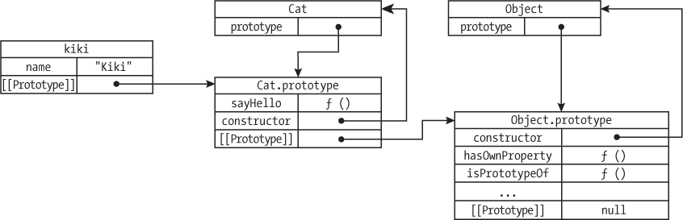

<hgroup>

## <samp class="SANS_Futura_Std_Bold_Condensed_B_11">6</samp> <samp class="SANS_Dogma_OT_Bold_B_11">类</samp>

</hgroup>


*类*是一个强大的编程工具，用于生成具有共享特征和行为的多个对象。它们是*面向对象编程*的核心部分，面向对象编程是一种围绕创建包含数据和操作这些数据的函数的对象的编码风格。例如，在一个面向对象的多人游戏中，你可以将每个玩家表示为一个 Player 类的对象，将每个敌人表示为一个 Enemy 类的对象。类将确定玩家或敌人应具备什么样的数据，并包含使玩家或敌人执行动作（如移动或攻击）的函数。

在本章中，你将学习如何创建 JavaScript 类，并如何使用这些类创建单个对象。你还将学习如何利用*继承*在不同类之间共享行为。以这种方式使用类和面向对象编程可以为你的代码提供结构，并使其更易于阅读、编写和理解，特别是当你的程序涉及大量具有共同行为的实体时。

### <samp class="SANS_Futura_Std_Bold_B_11">创建类和实例</samp>

*类*就像是一个用于创建标准化对象的模板。在第三章中，我们讨论了对象如何是由键值对组成的复合数据类型，并展示了如何通过手动编写对象字面量来创建对象。类将这个过程自动化，允许你通过类似调用函数的语法来创建对象。

一个类定义了两件主要的事情：

1.  该类的每个对象应该具有什么属性。（记住，*属性*是对象中键值对的另一种说法。）

2.  对象应该具有什么功能。（当这些功能作为类的一部分定义并调用时，这些功能被称为*方法*。）

游戏中的 Player 类可能包括玩家的名字、健康值、在环境中的位置等属性。它可能具有移动、射击、拾取物品等方法。该类可以用来创建多个不同的玩家。

从类创建的对象被称为该类的*实例*。例如，游戏中每个玩家的角色将是 Player 类的一个实例。每个实例用自己的详细信息填充类的通用模板。一个特定的 Player 实例将具有自己的名字、健康值和位置，这些与其他 Player 实例的不同。然而，所有实例都可以使用该类的方法。

为了了解这如何工作，我们将为一个假设的 2D 游戏创建一个简单的 Player 类。现在，我们只为玩家定义一个位置，通过一组 x 和 y 坐标来表示，并提供一个改变这些坐标的移动方法。输入以下内容在 JavaScript 控制台中声明该类：

```
**class Player {**
❶ **constructor(startX, startY) {**
 **this.x = startX;**
 **this.y = startY;**
 **}**

❷ **move(dx, dy) {**
 **this.x +=** **dx;**
 **this.y += dy;**
 **}**
**}** 
```

我们以 `class` 关键字开始，表示我们正在声明一个新类，接着是类的名称 `Player`。类名通常以大写字母开头。然后是类体，它被大括号包围，就像函数体一样。在类体内部，我们定义了两个方法，`constructor ❶` 和 `move ❷`。声明类方法就像声明函数一样，但我们不使用 `function` 关键字。

如果一个类有一个名为 `constructor` 的方法，就像我们的 `Player` 类那样，每当你创建该类的实例时，这个方法会被自动调用。构造方法会为正在创建的对象执行任何必要的设置工作，包括接收定义实例的任何参数，并确定对象应具备的属性。在这种情况下，我们的 `Player` 类的构造方法接收两个参数，`startX` 和 `startY`，并将它们赋值给新实例的 `x` 和 `y` 属性，这两个属性一起跟踪玩家在 2D 游戏中的位置。`this` 关键字指的是当前正在创建的实例，因此 `this.x = startX` 意味着“取 `startX` 的值并将其赋给新的 `Player` 对象的 `x` 属性。”注意，我们在这里使用的点表示法与之前访问对象属性时使用的相同；唯一的区别是，`this` 作为新对象名称的占位符。

`move` 方法通过根据提供的 `dx` 和 `dy` 参数来更新玩家的位置，从而改变 `x` 和 `y` 属性。`dx` 和 `dy` 中的 *d* 是希腊字母 *delta* 的缩写，通常用来表示某物的变化量，比如“x 值的变化”和“y 值的变化”。

现在我们已经声明了 `Player` 类，可以创建它的实例。例如：

```
**let player1 = new Player(0, 0);**
```

我们使用 `new` 关键字后跟类名来创建 `Player` 类的新实例。在类名后，我们写一对括号，就像调用函数时一样。括号中包含需要传递给类的构造方法的参数。

当你使用 `new` 创建一个类的新实例时，一些神奇的事情发生了。首先，会创建一个新的空对象。然后，这个对象与类之间会创建一个隐藏的链接，这样 JavaScript 就能够知道是哪个类创建了这个对象，以及该对象应当具有哪些方法。接下来，类的构造方法会被自动调用。在构造方法内部，通过关键字 `this` 可以访问正在创建的新对象，从而允许你为该对象设置属性。你在类名后括号中的任何参数都会被传递给构造方法的参数。构造方法调用完成后，新对象就会被返回。

在我们的示例中，当我们输入`let player1 = new Player(0, 0);`时，JavaScript 会创建一个新对象并给它一个与 Player 类的隐式链接。然后，它调用类的构造方法，将参数 0 和 0 传递给构造函数的 startX 和 startY 参数。构造函数使用这些参数并通过`this.x`和`this.y`将新对象的 x 和 y 属性设置为 0。最后，返回新对象并将其赋值给`player1`变量。

我们现在可以与新对象进行交互。例如，在这里，我们查看它的位置，告诉它移动，然后再次查看它的位置以确认 move 方法是否起作用：

```
**player1.x;**
0
**player1.y;**
0
**player1.move(3, 4);**
**player1.x;**
3
**player1.y;**
4 
```

我们通过`player1.x`和`player1.y`分别访问对象的 x 和 y 属性。它们的值都是 0，因为我们将 0 传递给了构造函数。接下来，我们调用了在 Player 类中定义的 move 方法。由于实例与创建它们的类之间有一个隐式链接，它们能够调用类中定义的方法。我们使用点符号来调用方法，就像调用与字符串或数组相关的内置方法一样。

当你在对象上调用一个方法时，方法定义中的`this`关键字会指向当前对象（接收者）。例如，当我们调用`player1.move(3, 4)`时，`this`在 move 方法的内部绑定到`player1`对象。这就是为什么一个方法可以被多个对象共享的原因：`this`会变成任何在某一时刻接收方法调用的对象。

move 方法通过将 dx 和 dy 加到当前的 x 和 y 值上来更新对象的 x 和 y 属性。例如，当我们调用`player1.move(3, 4)`时，我们将 x 设置为 0 + 3，y 设置为 0 + 4。当我们再次查看对象的 x 和 y 属性时，可以看到操作成功：`player1.x`变成了 3，`player1.y`变成了 4。如果我们再调用一次 move 方法，例如`player1.move(2, 2)`，x 将变为 5，y 将变为 6。

### <samp class="SANS_Futura_Std_Bold_B_11">继承</samp>

*继承*是面向对象编程中定义不同类之间关系的一种机制。就像孩子从父母那里继承基因一样，“子”类继承“父”类的属性和方法，获得父类的属性和方法。当你有多个类需要共享一组通用行为，并且每个类又有一些独特行为时，这非常有用。你可以将通用行为定义为父类的一部分，也叫做*超类*。然后，你可以定义子类，也叫做*子类*，来继承这些行为并使用其他专门的行为来扩展它们。这可以避免在定义每个子类时重复编写通用代码。

举个例子，在我们的 2D 游戏中，人类控制的玩家和计算机控制的敌人可能有很多相似之处。例如，它们都需要 x 和 y 属性来表示其位置，并且它们都需要一个 `move` 方法来改变自己的位置。然而，它们也有一些不同之处。也许敌人有能力攻击靠得太近的玩家，而玩家则不能攻击敌人——游戏的目标是玩家避免敌人，而不是击杀敌人。

我们可以利用继承以最小的代码量实现这个方案。我们将创建一个新的类 Actor，表示游戏中的 *任何* 参与者。它将包含玩家和敌人都应该拥有的一般代码，例如 `move` 方法。然后我们将定义 Player 和 Enemy 作为 Actor 的子类。它们将继承 Actor 超类中的一般代码，同时也会添加只针对玩家或敌人的特定代码。

首先，这是 Actor 类的定义。它基本上是我们之前的 Player 类的复制品，但名字不同。我们还添加了一个新的方法，叫做 `distanceTo`，用于计算游戏中两个参与者之间的距离：

```
**class Actor {**
 **constructor(startX, startY) {**
 **this.x = startX;**
 **this.y = startY;**
 **}**

 **move(dx, dy) {**
 **this.x += dx;**
 **this.y += dy;**
 **}**

 **distanceTo(otherActor) {**
 **let dx = otherActor.x - this.x;**
 **let dy = otherActor.y - this.y;**
 **return Math.hypot(dx, dy);**
 **}**
**}** 
```

`distanceTo` 方法接收另一个 Actor（或任何具有 x 和 y 坐标的对象）作为参数，并返回到该对象的距离。将对象传递给其他对象的方法是非常常见的做法。距离是通过计算水平距离（`otherActor.x - this.x`）和垂直距离（`otherActor.y - this.y`），然后使用内置的 `Math.hypot` 方法来找到由这两个距离形成的直角三角形的斜边长度来确定的。这是基于毕达哥拉斯定理的标准数学技巧，用来计算二维平面上两点之间的距离。

尽管从技术上讲，可以创建 Actor 类的实例，但它并不真正打算被实例化。像 Actor 这样的类，主要是供子类扩展的，有时被称为 *抽象类*，因为它们代表了一种抽象的概念，例如游戏中的通用实体。与此同时，像 Player 和 Enemy 这样的类，它们打算被实例化，通常被称为 *具体类*，因为它们代表了一些具体的事物，比如实际的玩家或敌人。

接下来，我们将重新定义 Player 类，让它继承自 Actor。我们将添加一个新属性，专门用于玩家，叫做 `hp`（即 *生命值*），表示玩家的健康水平——Enemy 类不需要这个属性，因为只有玩家可以被攻击，而敌人不能：

```
**class Player extends Actor {**
 **constructor(startX, startY) {**
 **super(startX, startY);**
  ❶ **this.hp = 100;**
 **}**
**}** 
```

这次我们使用 `extends` 关键字声明类，将 Player 作为 Actor 的子类。我们只需要编写类的构造方法，因为它继承了 Actor 的 `move` 和 `distanceTo` 方法。构造方法接收 `startX` 和 `startY` 参数，就像之前一样。

在构造函数中，我们首先调用 super(startX, startY)。在子类的构造函数中，super 关键字指代的是父类的构造函数——在这种情况下是 Actor 类的构造函数。因此，当我们创建一个新的 Player 实例时，Player 构造函数会自动调用，从而间接调用 Actor 构造函数（通过 super）。我们将 startX 和 startY 传递给 Actor 构造函数，Actor 使用这些值来设置 Player 对象的 x 和 y 属性。然后，在 Player 类的构造函数中，我们将新的 Player 实例的 hp 属性设置为 100 ❶。这样，每个新玩家的初始生命值为 100（满血）。

接下来，我们将创建我们的 Enemy 类。它同样会继承 Actor 类，并通过添加攻击方法来扩展它，用于攻击玩家（Player 类不需要这个方法，因为只有敌人可以攻击）：

```
**class Enemy extends Actor {**
 **attack(player) {**
 **if (this.distanceTo(player) < 4) {**
 **player.hp -= 10;**
 **return true;**
 **} else {**
 **return false;**
 **}**
 **}**
**}** 
```

我们声明 Enemy 类继承自 Actor，就像 Player 类一样。然而，与 Player 不同，Enemy 类没有任何需要在构造函数中设置的额外属性（如 hp）。因此，Enemy 类没有自己的构造函数方法。当子类没有定义构造函数时，父类的构造函数会在创建子类新实例时自动调用。因此，新的 Enemy 实例仍然会通过 Actor 父类的构造函数方法获得初始位置，但我们不需要在 Enemy 类声明中明确显示这一点。

没有构造函数，Enemy 类唯一独特的方法是 attack。它接收一个 Player 对象作为参数，并检查与该对象的距离，使用从 Actor 类继承的 distanceTo 方法。（注意，我们通过 this.distanceTo 调用该方法，再次使用 this 关键字来引用当前的 Enemy 实例。）如果距离小于 4，敌人就可以攻击，将玩家的 hp 值减少 10。我们返回 true 以表示这是一次成功的攻击。如果攻击失败，因为玩家太远，我们则返回 false。

现在我们已经有了 Player 和 Enemy 类，可以看看它们是如何交互的。让我们创建每个类的实例，移动它们，并让敌人攻击玩家：

```
**let player = new Player(1, 2);**
**let enemy = new Enemy(3, 4);**
**player.hp;**
100
**enemy.distanceTo(player);**
2.8284271247461903
**enemy.attack(player);**
true
**player.hp;**
90
**player.move(5, 5);**
**enemy.attack(player);**
false
**player.hp;**
90 
```

首先，我们创建每个类的实例，位置分别为(1, 2)和(3, 4)。Player 对象初始时满血，正如 player.hp 所示。这两个对象相距大约 2.8 个单位，我们通过调用 enemy.distanceTo(player)来确认这一点。此时，敌人足够接近，可以成功攻击玩家，因此我们使用 enemy.attack(player)调用敌人的攻击方法。该方法返回 true，表示命中，检查 player.hp 后发现攻击将玩家的生命值降低到 90。接下来，我们将玩家在 x 和 y 方向上各移动 5 个单位。这个移动将玩家置于敌人攻击范围之外，因此敌人的第二次攻击失败，返回 false。最后检查 player.hp，发现玩家的生命值仍然为 90。

注意，在这段代码中，我们调用了 Enemy 对象上的 distanceTo 方法，以及 Player 对象上的 move 方法。这些方法都是在 Actor 类中定义的，但它们也可以在 Enemy 和 Player 类中使用，这证明了子类成功地从超类继承了方法。我们还可以使用`instanceof`关键字来验证这一点，它用于测试一个对象是否是特定类的实例。例如，在这里我们用 player 对象进行测试：

```
**player instanceof Player;**
true
**player instanceof Actor;**
true
**player instanceof Enemy;**
false 
```

正如你可能预期的那样，player 是 Player 的一个实例。令人惊讶的是，player 也是 Actor 的一个实例。当像 Player 这样的子类继承自像 Actor 这样的超类时，子类的实例也被认为是超类的实例。另一方面，player 不是 Enemy 的实例，尽管 Player 和 Enemy 类共享一个共同的超类。

在这个例子中，我们使用了单一的继承层级：一个 Actor 超类与 Player 和 Enemy 子类。一个更复杂的游戏可能会使用多个继承层级来创建不同类型的玩家和敌人。例如，可能会有 Witch、Elf 和 Centaur 类，它们都是 Player（而 Player 又是 Actor 的子类）的子类。这些子类将共享一些在 Player 超类中定义的共同能力（以及在 Actor 中定义的任何方法），同时也会有自己在个别子类中定义的专门能力。同样，Enemy 可能会有像 Troll、Demon 和 Harpy 这样的子类。

### <samp class="SANS_Futura_Std_Bold_B_11">基于原型的继承</samp>

当 JavaScript 最初创建时，还没有类，但仍然可以使用*基于原型的继承*在对象之间共享行为。这个旧系统，今天仍然与类系统一起使用，依赖于两个机制：

1.  一个*构造函数*，用于创建并返回新对象。在这种情况下，构造函数只是一个普通的独立函数（不是定义在类中的函数），但它是通过`new`关键字调用的。

2.  一个*原型*，是构造函数用作它所创建的对象模型的示例对象。新创建的对象会从原型对象继承方法和属性。

JavaScript 是少数使用基于原型的继承而非类的主流语言之一。认识到这一点，开发该语言的委员会最终决定增加对类的支持，以使 JavaScript 对有其他现代编程语言背景的新手更具吸引力。然而，当他们添加类时，他们是在现有的基于原型的继承支持上构建这一新特性。换句话说，JavaScript 的基于类的继承本质上是基于原型继承的另一种语法。（这有时被称为*语法糖*，因为它使语法更易接受。）

如果你已经熟悉使用类，那么学习基于原型的继承并非必需。然而，由于类是 JavaScript 的相对较新特性，在旧代码中仍然常常会遇到基于原型的继承，因此了解其工作原理是值得的。探索基于原型的继承还可以帮助我们理解 JavaScript 的一些内部机制，包括你在 Chrome 控制台中看到的神秘[[Prototype]]属性的意义。即使你最终不使用基于原型的继承，了解一些这些底层的细节也能让你更轻松地使用类。

#### <samp class="SANS_Futura_Std_Bold_Condensed_Oblique_BI_11">使用构造函数和原型</samp>

正如我提到的，基于原型的继承涉及一个构造函数，它创建对象实例，以及一个原型对象，实例从中继承方法和属性。这之所以可行，是因为 JavaScript 在构造函数、原型和正在创建的新实例之间建立了链接。让我们看看这一过程是如何进行的。我们将创建一个名为 Cat 的新构造函数，并向其原型添加一个名为 sayHello 的方法。这将使我们能够创建 Cat 对象，这些对象可以访问 sayHello 方法：

```
**function Cat(name) {**
 **this.name = name;**
**}**
**Cat.prototype.sayHello = function () {**
 **console.log(`Miaow! My name is** **${this.name}.`);**
**};** 
```

我们首先创建一个名为 Cat 的构造函数，并使用 name 参数。构造函数就像类名一样，通常以大写字母开头。构造函数的主体通过 this.name = name 来将新对象的 name 属性设置为提供的 name 参数的值。与类一样，构造函数中的 this 关键字指代正在被创建的对象。

当创建 Cat 构造函数时，它会自动获得一个名为 prototype 的属性。虽然函数有属性听起来有些奇怪，但 JavaScript 函数实际上是一种对象；Cat 函数可以像 person 对象可以拥有 name 和 age 属性一样，拥有一个 prototype 属性。我们可以通过 Cat.prototype 来访问这个属性，使用与访问任何其他对象属性相同的点表示法。

Cat.prototype 的值本身是一个对象，Cat 实例应该基于这个原型进行构建。通过向这个原型对象添加方法，我们可以控制任何 Cat 实例将继承哪些方法。在这个例子中，我们使用 Cat.prototype.sayHello 将一个 sayHello 方法添加到原型中。该方法会将一个包含 this.name 值的问候语输出到控制台。当 sayHello 被作为某个实例的方法调用时，方法定义中的 this 指代该实例——就像在类中定义的方法一样——因此 this.name 指代该实例的 name 属性值。

> <samp class="SANS_Dogma_OT_Bold_B_21">注意</samp>

*注意，Cat.prototype.sayHello 将多个点符号连接在一起：Cat.prototype 指向存储在 Cat 函数的 prototype 属性中的对象，而.sayHello 指向该对象的 sayHello 属性。这个属性还不存在，所以在这里我们将它添加到对象中，并将其值设置为一个函数表达式。*

我们已经创建了一个 Cat 构造函数并将一个方法添加到它的原型中。现在让我们使用该构造函数创建一个新的实例，该实例将继承自原型：

```
**let kiki =** **new Cat("Kiki");**
**kiki.sayHello();**
Miaow! My name is Kiki.
undefined 
```

在这里，我们通过使用 new 关键字调用 Cat 构造函数来创建一个新对象，并将"Kiki"作为构造函数的 name 参数传递。我们将结果对象存储在 kiki 变量中。请注意，如果我们把 Cat 声明为一个类而不是构造函数，创建对象的语法将完全相同：new Cat("Kiki")。唯一的区别是我们是将 Cat 视为函数的名称，还是类的名称。

接下来，我们在新的实例上调用 sayHello 方法。由于 kiki 是通过 Cat 构造函数创建的，它有一个指向 Cat.prototype 的隐藏链接，JavaScript 使用这个链接来查找 sayHello 的定义。由于 sayHello 作为 kiki 对象的方法被调用，因此 sayHello 中的 this 关键字被设置为 kiki。

尽管我把实例和原型之间的链接称为“隐藏的”，但是 Chrome 控制台允许你通过特殊的[[Prototype]]属性检查它。让我们看看能从 kiki 中发现什么。在控制台中输入 kiki;，然后点击旁边的箭头查看其内容：

```
**kiki;**
Cat {name: 'Kiki'}
  name: "Kiki"
  [[Prototype]]: Object 
```

输出的第一行告诉我们 kiki 是通过 Cat 构造函数创建的。接下来，我们看到 kiki 有一个名为"name"的属性，值为"Kiki"（这是在调用构造函数时分配的）。我们还看到 kiki 有一个[[Prototype]]属性，它的值是一个对象。这就是我所说的“隐藏的”链接，指向这个实例继承的原型。它是 Cat.prototype（Cat 构造函数的原型属性）引用的相同对象。点击箭头展开[[Prototype]]，看看里面有什么：

```
`Cat {name: 'Kiki'}`
  name: "Kiki"
  [[Prototype]]: Object
sayHello: f ()
constructor: f Cat(name)
 ❶ [[Prototype]]: Object 
```

我们可以看到原型对象有三个属性。第一个 sayHello，它的值是一个函数，如 f()所示。这是我们添加到原型中的 sayHello 方法。第二个 constructor，指向 Cat 构造函数。这巩固了构造函数和它用来创建新实例的原型之间的联系。最后，原型本身有一个自己的[[Prototype]]属性❶，我们稍后会探索。

#### <samp class="SANS_Futura_Std_Bold_Condensed_Oblique_BI_11">比较构造函数和类</samp>

在原型链继承中，从实例到其原型，再从原型到其构造函数的引用链是 JavaScript 知道在哪里找到该实例的方法和属性的方式。事实证明，类也使用了这些相同的技术。为了演示，我们创建一个 Dog 类，它的功能与我们的 Cat 构造函数相似：

```
**class Dog {**
 **constructor(name) {**
 **this.name = name;**
 **}**

 **sayHello() {**
 **console.log(`Woof! My name is** **${this.name}.`);**
 **}**
**}** 
```

这里的构造函数方法相当于 Cat 构造函数函数，而 sayHello 方法相当于 Cat.prototype.sayHello。现在，让我们创建一个 Dog 实例，并通过扩展 [[Prototype]] 属性，将其与 kiki 实例进行比较：

```
**let felix = new Dog("Felix");**
**felix;**
Dog {name: 'Felix'}
  name: "Felix"
  [[Prototype]]: Object
constructor: class Dog
sayHello: f sayHello()
[[Prototype]]: Object
**kiki;**
Cat {name: 'Kiki'}
  name: "Kiki"
  [[Prototype]]: Object
sayHello: f ()
constructor: f Cat(name)
[[Prototype]]: Object 
```

如你所见，在这两种情况下，sayHello 方法都是通过 [[Prototype]] 链接找到的。只不过有一些小差异。例如，对于 kiki，构造函数指向一个函数，而对于 felix，它指向一个类。此外，felix 上的 sayHello 方法有名字，而 kiki 上的则没有（因为我们使用匿名函数定义了 sayHello）。

请注意，如果你想在代码中直接访问对象的 [[Prototype]] 属性，可以通过 __proto__ 来访问：

```
**kiki.__proto__;**
`{sayHello: f, constructor: f}` 
```

即使这个属性技术上叫做 __proto__，我们仍然称之为 [[Prototype]] 属性，因为它在 Chrome 控制台中是以这种方式显示的。

#### <samp class="SANS_Futura_Std_Bold_Condensed_Oblique_BI_11">探索 Object.prototype</samp>

任何不是通过显式构造函数创建的对象，都会隐式地使用 JavaScript 内置的 Object 构造函数创建。这个构造函数所引用的原型，通过 Object.prototype 可用，包含了所有对象应该继承的基本方法。这个原型对象标志着原型链引用的终点。所有对象最终都会追溯到 Object.prototype。

例如，尽管我们的 kiki 对象是使用 Cat 构造函数创建的，但它的原型，Cat.prototype，并没有显式地通过构造函数创建。相反，JavaScript 隐式地使用 Object 构造函数创建了这个对象，因此它的原型是 Object.prototype。这就是我们在前面的代码示例中看到的 kiki 对象内部 [[Prototype]] 属性所告诉我们的内容。我们可以扩展这个内部的 [[Prototype]] 属性来查看 Object.prototype：

```
`Cat {name: 'Kiki'}`
  name: "Kiki"
  [[Prototype]]: Object
sayHello: f ()
constructor: f Cat(name)
[[Prototype]]: Object
❶constructor: f Object()
hasOwnProperty: f hasOwnProperty()
isPrototypeOf: f isPrototypeOf()
propertyIsEnumerable: f propertyIsEnumerable()
toLocaleString: f toLocaleString()
toString: f toString()
`--snip--` 
```

值得注意的是，这个内部的原型对象有一个 constructor 属性，它的值是 Object 函数 ❶，这表明它是 JavaScript 内置 Object 构造函数的原型属性。剩下的属性对应于所有对象继承的许多默认方法。例如，hasOwnProperty 是一个检查对象是否拥有自己定义的属性的方法，而不是从其原型继承的属性；toString 是一个返回对象字符串表示的方法。

当你使用对象字面量创建一个对象时，你并没有使用显式的构造函数来创建它，因此，它也是通过 Object 构造函数隐式创建的，并且其原型是 Object.prototype。当我们在第三章的控制台中检查对象时，看到它们有一个 [[Prototype]] 属性，那就是我们所看到的内容。我们现在再来看一下：

```
**let person = {name: "Nick", age: 39};**
**person;**
{name: 'Nick', age: 39}
  age: 39
  name: "Nick"
  [[Prototype]]: Object
constructor: f Object()
hasOwnProperty: f hasOwnProperty()
isPrototypeOf: f isPrototypeOf()
propertyIsEnumerable: f propertyIsEnumerable()
toLocaleString: f toLocaleString()
toString: f toString()
`--snip--` 
```

在这里，我们使用对象字面量声明了一个基本的 person 对象，这意味着它背后通过默认的 Object 构造函数创建。通过在控制台中检查这个对象，我们可以看到它的 [[Prototype]] 属性的内容与 kiki 对象的最内层 [[Prototype]] 完全相同。两个对象都追溯到 Object.prototype，kiki 通过它自己的原型（Cat.prototype）间接追溯，而 person 直接追溯。

#### <samp class="SANS_Futura_Std_Bold_Condensed_Oblique_BI_11">原型链遍历</samp>

当你请求一个对象的属性或方法时，JavaScript 会首先在对象本身上查找。如果在对象中找不到这个属性，它会继续在对象的原型上查找。如果 JavaScript 仍然找不到该属性，它将检查原型的原型，以此类推，直到查找到 Object.prototype。这个过程被称为*原型链遍历*。让我们查找一些属性和方法，它们将遍历我们 kiki 对象的原型链：

```
**kiki.name;** 
'Kiki'
**kiki.sayHello();** 
Miaow! My name is Kiki.
undefined
**kiki.hasOwnProperty("name");** 
true
**kiki.madeUpMethodName();** 
Uncaught TypeError: kiki.madeUpMethodName is not a function
at <anonymous>:1:6 
```

首先，我们访问直接设置在 kiki 上的 name 属性。其次，我们调用 sayHello 方法，该方法位于 kiki 对象的原型上。为了调用这个方法，JavaScript 会先检查 kiki，然后在找不到后，检查它的原型。第三，我们调用 hasOwnProperty，这是来自 Object.prototype 的方法，也就是 kiki 对象的原型的原型。（该方法返回 true，因为 name 属性是直接在 kiki 上设置的。）最后，我们调用一个不存在的方法 madeUpMethodName。经过整个原型链的遍历，从 kiki 到 Cat.prototype 再到 Object.prototype，JavaScript 确定找不到该方法，并抛出一个错误。

图 6-1 展示了 kiki 对象的原型链的视觉表示，以及相关的构造函数 Cat 和 Object。



<samp class="SANS_Futura_Std_Book_Oblique_I_11">图 6-1：kiki 的原型链</samp>

图中的每个框代表一个对象，框的标题是对象的名称。每个框的左列显示对象属性的名称，右列显示这些属性的值。例如，kiki 对象的 name 属性的值是 "Kiki"，而 Cat.prototype 对象的 sayHello 属性是一个函数，用 f() 表示（记住，方法只是对象的一个属性，且这个属性是一个函数）。

一些属性值指向或引用其他对象。例如，所有构造函数都有一个指向该构造函数创建的实例所使用的原型的 prototype 字段。因此，Cat 构造函数的 prototype 字段指向 Cat.prototype。同样，对象通过它们的[[Prototype]]属性与它们的原型链接。例如，kiki 的[[Prototype]]属性链接到 Cat.prototype，因为 kiki 是通过 Cat 构造函数创建的。所有原型对象都有一个 constructor 字段，指向它们所属的构造函数。如你所见，Cat.prototype 的 constructor 字段指向 Cat，而 Object.prototype 的 constructor 字段指向 Object。像 kiki 这样的实例没有直接定义 constructor 字段。相反，构造函数会通过实例的原型链进行查找。

正如我们在 Dog 示例中看到的，类在底层使用相同的原型机制，因此这种遍历原型链的技术也是查找类实例上属性和方法的方式。

#### <samp class="SANS_Futura_Std_Bold_Condensed_Oblique_BI_11">覆盖方法</samp>

理解 JavaScript 如何遍历原型链以查找对象的方法非常重要，因为这使我们能够*覆盖*一个方法的定义，而这个方法本来会从原型继承。这个技术在我们希望一个对象大部分行为继承自原型，但又希望它具有一些独特行为时非常有用。当你调用一个方法时，JavaScript 会在遍历原型链时使用它找到的第一个定义，因此，如果我们在对象上直接定义一个方法，并且这个方法与对象原型上定义的方法同名，那么对象本身上的方法会优先。

例如，假设你想要一个新的 Cat 对象，它的问候方式与在 Cat.prototype 上定义的不同。你可以直接在这个新 cat 上设置一个单独的 sayHello 方法，像这样：

```
**let moona = new Cat("Moona");**
**moona.sayHello = function () {**
 **console.log(`HELLO!!! I'M** **${this.name.toUpperCase()}!`);**
**};**
**moona.sayHello();**
❶ HELLO!!! I'M MOONA!
**kiki.sayHello();**
❷ Miaow! My name is Kiki. 
```

在这里，我们使用 Cat 构造函数定义一个新实例，并命名为 moona。然后，我们在 moona 本身上定义一个 sayHello 方法，该方法会打印全大写的问候语。当我们调用 moona.sayHello()时，可以在输出中看到直接在 moona 上定义的 sayHello 方法优先于在 Cat.prototype 上的 sayHello 定义❶。这也被称为*遮蔽*，因为本地方法在某种程度上会“遮蔽”原型上的方法。然而，请注意，原始的 sayHello 方法仍然保持不变，正如我们在对 kiki 调用时看到的输出所示❷。

### <samp class="SANS_Futura_Std_Bold_B_11">总结</samp>

在本章中，你学习了类的概念，类帮助你通过在多个对象之间共享功能来组织代码。你学习了如何创建类，如何使用它们来创建实例，以及如何通过创建子类和父类的层次结构来扩展类。你还了解了基于原型的继承，这是 JavaScript 允许对象继承属性和方法的原始系统。你探讨了基于原型的继承与更新后的类系统之间的比较，并了解了如何通过控制台中的[[Prototype]]属性追踪对象的继承链。
