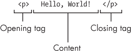
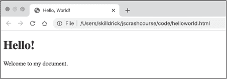
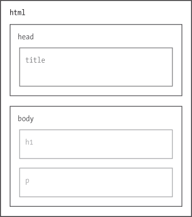
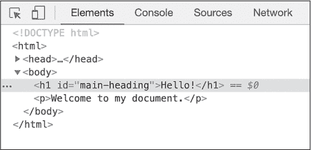
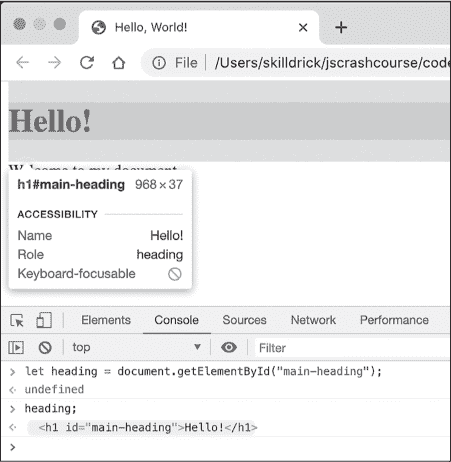
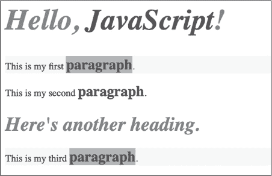

## 第十四章：7 HTML、DOM 和 CSS


要开发自己的交互式网页应用程序，你需要学习一些基础的 HTML 和 CSS，这些语言用于创建网页和更改网页的外观。对这两种语言的全面介绍超出了本书的范围，但本章将教授你足够的知识以便入门。我们还将讨论文档对象模型（DOM）及其应用程序接口（API），它们为我们提供了使用 JavaScript 修改网页的方式。

### HTML

HTML 代表*超文本标记语言*。*超文本*是指链接到其他文本或文档的文本，*标记*是用于在文档中注释文本的系统。因此，HTML 是一种用于在文档中注释文本并使文档之间相互链接的语言。在第一章中，我简要介绍了它作为描述网页的语言。从这个角度来看，网页是相互链接的文档，而注释是告诉网页浏览器如何显示页面的指令。

HTML 注释以*标签*的形式出现。最简单的 HTML 标签是一个被尖括号括起来的名称。例如，定义文档主体的标签，它标识网页上所有可见的内容，像这样：<body>。大多数标签都是成对出现的，包括一个开始标签和一个结束标签：例如，<body> 和 </body>。结束标签看起来和开始标签一样，只是在开始的尖括号后面有一个正斜杠。

每一对标签定义一个*元素*。每个 HTML 元素表示网页的某个方面，比如标题、图片或段落。一个 HTML 文档包含一组嵌套的元素来描述文档结构。在这个上下文中，*嵌套*意味着元素包含在其他元素内，这些元素可能又包含在其他元素内，像俄罗斯套娃一样。

每个元素的开始标签和结束标签之间的内容称为该元素的*内容*。例如，图 7-1 显示了一个基本的 p 元素，p 是*段落*的缩写，表示网页上的标准文本段落。



图 7-1：HTML 元素的结构

p 元素的内容位于开始标签 <p> 和结束标签 </p> 之间，是实际出现在段落中的文本——在这个例子中，是 Hello, World!

#### 创建 HTML 文档

让我们创建我们的第一个真正的 HTML 文档。它将是一个简单的网页，包含一个标题和一段简短的文本。打开你的文本编辑器并创建一个名为*helloworld.html*的新文件（如果你需要复习创建新文件的过程，请参阅第一章）。输入列表 7-1 的内容。

```
❶ <!DOCTYPE html>
❷ <html>
❸ <head>
<title>Hello, World!</title>
  </head>
❹ <body>
<h1>Hello!</h1>
<p>Welcome to my document.</p>
  </body>
</html> 
```

列表 7-1：一个基础的 HTML 文档

第一行，*doctype* ❶，指定这是一个 HTML 文档。此行对于浏览器正确显示这些文档是必需的（尽管我们在第一章中略去了它）。接下来是打开的<html>标签❷。此文件中的其他所有内容都被包含在此标签和关闭的</html>标签之间。每个 HTML 文档应具有一组单一的<html>和</html>标签来定义一个总的 html 元素。所有其他元素都嵌套在 html 元素内。

在我们的 html 元素内部有一个 head 元素❸和一个 body 元素❹。注意，我们的文档遵循常见的惯例，通过缩进来表示元素在其他元素内的嵌套。由于 head 和 body 都嵌套在 html 元素中，因此它们的标签会缩进。VS Code 和许多其他文本编辑器会自动应用这种缩进；就像在 JavaScript 中一样，它并非强制要求，但有助于提高可读性。

头部元素包含*元数据*，即关于页面的信息。在这个例子中，它包含一个元素，title。由于它嵌套在 head 元素内，按照惯例它会有更深一层的缩进。title 元素的文本内容“Hello, World!”是网页的名称。这个名称不会显示在页面上，但当你加载页面时，它会出现在浏览器顶部的标签标题中。

> 注意

*头部元素还可以包含指向将在页面上运行的脚本和用于修改页面外观的样式表的链接，后者我们将在本章稍后讨论。*

如前所述，body 元素包含页面的可见内容，例如标题、图片、文本等。我们的 body 元素包含两个元素。第一个，h1，是一个顶级标题（HTML 定义了六个标题级别，从 h1 到 h6）。网页浏览器知道以大号粗体显示 h1 元素的文本内容（在我们这个例子中是“Hello!”）。正如我们讨论的，第二个 body 元素，p，将显示为标准段落文本。我们的段落包含一句话：“Welcome to my document”。

打开你的网页浏览器并加载*helloworld.html*。你应该会看到类似图 7-2 的内容。



图 7-2：我们 helloworld.html 文档在浏览器中的显示

正如你所看到的，title 元素的文本内容显示为网页浏览器标签页的标题。h1 元素作为页面的标题显示，文本为“Hello!” p 元素则显示为标题下方的标准段落，文本为“Welcome to my document。”

#### 理解嵌套关系

直接嵌套在另一个元素内部的元素称为*子元素*，而包含子元素的元素称为*父元素*。例如，在*helloworld.html*中，title 嵌套在 head 内。因此我们说 title 是 head 的子元素，而 head 是 title 的父元素。一个元素，无论是直接还是间接地包含在另一个元素内（类比为子元素、孙元素、曾孙元素等），称为*后代元素*。例如，h1 是 html 的后代元素，尽管它并不是直接包含在 html 中；相反，它包含在 body 中，而 body 本身包含在 html 中。相对地，html 元素可以被称为 h1 元素的*祖先元素*。拥有相同父元素的元素称为*兄弟元素*。在我们的文档中，h1 和 p 是兄弟元素，因为它们都有 body 作为父元素；类似地，head 和 body 也是兄弟元素。

### 文档对象模型

当你的网页浏览器加载一个 HTML 文件时，它会创建一个元素的内部模型，称为*文档对象模型*，或简称*DOM*。（记住，*document* 只是网页的另一种说法。）不同于 HTML 文件本身，它是一个静态的文本文件，DOM 是页面的动态模型，你可以使用 JavaScript 对其进行修改。要查看*helloworld.html*文档的 DOM，打开 JavaScript 控制台并切换到**Elements**标签。你应该会看到一个非常类似于 HTML 文件的结构，但是带有可以展开和折叠某些元素的箭头。展开它们，你应该能看到整个文档，如 Listing 7-2 所示。

```
<!DOCTYPE html>
<html>
 <head>
    <title>Hello, World!</title>
  </head>
 <body>
    <h1>Hello!</h1>
    <p>Welcome to my document.</p>
  </body>
</html> 
```

Listing 7-2: helloworld.html的 DOM

为了说明 DOM 的动态特性，尝试在 Elements 标签内双击 h1 元素中的 Hello!文本。输入一些新文本并按 ENTER 键。网页的标题应该会相应地改变。但请注意，你并没有修改 HTML 文件本身，而是修改了浏览器中页面的模型。

借助 DOM，你可以直接从浏览器更新网页元素，并且结果会立即显示出来。现在我们手动更新 DOM 只是为了看看它是如何工作的，但在本章后面，你将学习如何使用 JavaScript 程序化地更新 DOM。这使得你能够编写修改网页显示内容的代码。最终，这就是创建动态网页应用程序的关键：通过 JavaScript 代码操作 DOM，改变网页的外观，使用户在浏览和互动时能够看到不同的内容。

浏览器中的元素标签提供了可视化 DOM 的一种方式。图 7-3 展示了另一种方式：我们可以将基本网页的元素视为一组嵌套的盒子。



图 7-3：作为嵌套盒子的 DOM

DOM 实际上并不关心开闭标签，它们只是 HTML 用来描述文档结构的文本格式。从浏览器的角度来看，重要的是元素及其父子和兄弟关系。图 7-3 展示了这种更抽象的文档结构视图。你可以马上看到，h1 和 p 元素被嵌套在 body 元素内，而 body 元素又被嵌套在 html 元素内。

#### DOM API

Web 浏览器允许你使用 JavaScript 通过*DOM API*来修改 DOM。正如本章开头所提到的，API 代表*应用程序编程接口*，它是一种通过代码与系统或对象进行交互的方式。正如你在更新 h1 元素时看到的那样，修改 DOM 会改变网页，所做的任何更改通常都会立即可见。这意味着 DOM API 为我们提供了一种编写代码的方式，使得对页面的任何修改都能为观看者提供即时的视觉反馈。

DOM API 提供了一组方法和属性来与 DOM 交互。许多这些方法和属性可以在 document 对象上找到，这是 DOM API 提供的一个对象，表示当前文档（即网页）。例如，document.title 允许你获取和设置当前标签页的标题。现在让我们来试一试。运行以下代码，查看*helloworld.html*：

```
**document.title;**
'Hello, World!'
**document.title = "Hello, JavaScript!";**
'Hello, JavaScript!' 
```

当你运行这个代码时，你应该能看到浏览器标签页中的标题从“Hello, World!”变为“Hello, JavaScript!”。

#### 元素标识符

我们可以使用 DOM API 修改页面上的任何元素，甚至添加新元素。要修改元素，我们需要一种方式从代码中访问它。JavaScript 提供了多种访问 HTML 元素的方式，最简单的是通过元素的 id 属性进行引用。

HTML 的*属性*，例如 id，是我们可以添加到 HTML 元素中的键值对。id 属性为元素提供唯一标识符。在 HTML 文档中，属性始终附加到元素的开放标记上；也就是说，它们出现在元素名称之后，并在闭合尖括号之前。让我们返回文本编辑器，并在我们的*helloworld.html*文档中的 h1 元素中添加一个 id 属性。这将使得可以使用 DOM API 轻松访问该元素。按照 清单 7-3 中所示更新文档。未更改的代码已变灰。

```
<!DOCTYPE html>
<html>
 <head>
 <title>Hello, World!</title>
 </head>
 <body>
 <h1 id="main-heading">Hello!</h1>
 <p>Welcome to my document.</p>
 </body>
</html> 
```

清单 7-3: 添加 id 属性

我们将属性放置在开放标记名称 h1 之后。属性名称和属性值由等号分隔，并且值应该用引号括起来。在本例中，我们将 id 属性设置为值 "main-heading"。

如果重新加载页面，您应该看不到任何差异；id 属性默认情况下不会影响元素的显示。要确认页面已更新，请右键单击“Hello!”标题，并从菜单中选择**Inspect**。这将在 Elements 选项卡中突出显示 h1 元素，包括其新的 id 属性，如 图 7-4 中所示。



图 7-4: Chrome 在 Elements 选项卡中突出显示 h1 元素

现在 h1 元素有了一个 ID，我们可以在 JavaScript 中轻松地引用它。在您的网络浏览器中，切换到*helloworld.html*的**Console**选项卡，并输入以下内容：

```
**let heading = document.getElementById("main-heading");**
```

getElementById 方法接受一个与 HTML 元素的 id 属性对应的字符串。它返回具有指定 ID 的 HTML 元素的表示。在这里，我们将该元素存储在变量 heading 中。由于标识符应该是唯一的，getElementById 只返回一个元素。如果未找到 ID，则该方法返回 null。如果违反规则，并且具有相同 ID 的元素多于一个，则浏览器通常会返回具有该 ID 的第一个元素，但这是*未定义行为*，意味着行为未指定且可能会在将来更改。

现在让我们要求控制台输出 heading 的值：

```
**heading;**
  <h1 id="main-heading">Hello!</h1> 
```

控制台显示了 h1 元素的 HTML 表示。此外，如果你将鼠标悬停在输出上，浏览器会在页面上突出显示该元素，如你在 图 7-5 中所见。

现在我们将标题元素绑定到一个变量中，我们可以对其进行操作。例如，我们可以获取和设置元素的文本如下：

```
**heading.innerText;**
'Hello!'
**heading.innerText = "Hi there…";**
'Hi there…' 
```

innerText 属性表示元素的文本。如你在这个示例中看到的，它既可以用来获取文本，也可以用来修改文本。当你更新 innerText 的值时，页面上标题元素的文本也会随之更新。然而，请记住，这只是对 DOM（浏览器的网页模型）的更改，并不是对底层 HTML 文件本身的更改。如果你刷新页面，浏览器会重新加载原始的 HTML 文件，你的更改将会消失。



图 7-5：Chrome 突出显示页面上的 h1 元素

在 JavaScript 控制台中编写代码可以让你在更新 DOM 时即时看到浏览器中的结果，但如果你希望在别人查看网页时更新 DOM 呢？你不能在其他人的计算机上直接输入代码，除非你亲自到场，但你可以将 JavaScript 代码嵌入到 HTML 文档中，这样任何查看你网页的人都能看到代码的结果。这就是我们接下来要做的事情。

### script 元素

如果你想在 HTML 文档中包含 JavaScript，你必须使用 script HTML 元素。有两种使用 script 元素的方式：一种是在 <script> 标签之间直接包含 JavaScript 代码，另一种是将代码保存在一个单独的 JavaScript 文件中，并将该文件的名称作为 script 元素的属性。直接将 JavaScript 包含在 HTML 文件中的优点是它将所有内容都放在一个地方。另一方面，将 JavaScript 放在单独的文件中意味着你可以在多个页面中使用相同的 JavaScript 文件。当你的项目有很多 HTML 和 JavaScript 时，维护分开的文件也会更加易于管理。

你已经看过包含 JavaScript 内容的 script 元素：我在第一章中介绍了它，作为在 HTML 文件中编写 JavaScript 的一种方式。现在让我们来看第二种技术。我们将创建一个包含 script 元素的 HTML 文件，并让该元素指向一个单独的 JavaScript 文件。在 JavaScript 文件中，我们将编写代码，将一条消息记录到控制台，以证明该脚本已被包含到网页中。

因为我们的 HTML 和 JavaScript 将分别保存在不同的文件中，如果我们将它们放入一个新目录（在 Windows 中是文件夹），那么跟踪这两个文件会更加方便。创建一个名为 *chapter7* 的新目录，并在该目录中创建一个名为 *index.html* 的新 HTML 文件。这是目录中主 HTML 文件的常见命名方式。

在 *index.html* 中输入清单 7-4 所示的代码。

```
<!DOCTYPE html>
<html>
  <head>
    <title>Hello, JavaScript!</title>
 ❶ <script src="script.js"></script>
  </head>
  <body>
    <h1 id="main-heading">Hello, JavaScript!</h1>
  </body>
</html> 
```

清单 7-4：一个包含指向 JavaScript 文件的 script 元素的 HTML 文件

我们将 script 元素包含在 head 元素内❶。根据惯例，我们将其放在那里，因为该脚本不会对页面的视觉内容做出贡献，尽管从技术上讲，也可以将其放在 body 中。script 元素有一个 src 属性（即 *source* 的缩写），告诉浏览器要加载的 JavaScript 文件的名称。当给出简单的文件名时，浏览器会在与 HTML 文件相同的目录中查找该文件。你也可以指定 JavaScript 文件的路径，例如 "/scripts/myscript.js"，但只要 HTML 和 JavaScript 文件在同一目录下，仅文件名就足够了。

我们的 HTML 文件还无法正常工作，因为我们还没有创建引用的脚本文件。在 *chapter7* 目录中创建一个名为 *script.js* 的新文件，并输入 清单 7-5 中显示的代码。

```
console.log("Hello, HTML!");
```

清单 7-5：一个简单的 script.js 文件

现在在 Chrome 中打开 *index.html*。当你打开 JavaScript 控制台时，你应该能看到字符串 Hello, HTML! 被打印到控制台。如果没有，仔细检查代码，确保文件名完全匹配。

### CSS

现代网页由三种语言构成：HTML、JavaScript 和 CSS。从基本层面上看，HTML 定义了页面的 *内容*，JavaScript 定义了页面的 *行为*，而 CSS（层叠样式表的简称）定义了页面的 *外观*。正如我们所看到的，网页浏览器有默认的方式来显示各种 HTML 元素，如标题和段落。CSS 使我们可以更好地控制这些元素的外观，允许我们覆盖元素的默认外观，例如它们的大小、颜色和字体。

因为这是一本 JavaScript 书籍，我们不会深入研究 CSS。然而，了解 CSS 的基础知识会在我们开始制作动态网页时非常有帮助。此外，我们将要使用的一些 DOM API 方法依赖于 CSS 选择器语法，稍后我们会讨论这部分内容。理解该语法的来源将帮助你更有效地使用这些方法。

#### link 元素

在这一节中，我们将创建一个 CSS 文件并将其包含在我们的页面中，利用该文件覆盖一些元素样式。包含 CSS 文件类似于包含 JavaScript 文件，但需要使用一个不同的 HTML 元素，称为 link。link 元素是将外部资源包含到页面中的一种通用方式。为了创建一个指向我们即将编写的 CSS 文件的链接，打开 *index.html* 文件，并在其中添加 清单 7-6 中突出显示的行。

```
<!DOCTYPE html>
<html>
 <head>
 <title>Hello, JavaScript!</title>
 <script src="script.js"></script>
    <link href="style.css" rel="stylesheet">
 </head>
 <body>
 <h1 id="main-heading">Hello, JavaScript!</h1>
 </body>
</html> 
```

清单 7-6：使用 link 元素添加 CSS 文件

我们在链接元素上设置了两个属性：href，表示*超文本引用*，以及 rel，表示*关系*。href 属性的作用与 script 元素中的 src 属性相同：你需要将链接的文件作为该属性的值。rel 属性指定你链接的文件类型以及它与文档的关系。这里我们提供了字符串 "stylesheet"，表示链接的文件应该被解释为页面的样式表，包含关于元素如何显示的信息。

请注意，与我们之前看到的 HTML 元素不同，链接元素不需要结束标签</link>。这是因为其他元素可能包含内容，而链接元素则永远不会包含内容。因此，不需要结束标签来标记内容的结束。

#### 规则集

一个 CSS 文件由一个或多个*规则集*组成，用于定义文档中的元素应该如何样式化。我们现在将编写一个基本的规则集。在*chapter7*目录中创建一个名为*style.css*的文件，并输入清单 7-7 中的内容。

```
h1 {
  color: red;
  font-style: italic;
} 
```

清单 7-7：在 style.css 文件中样式化 h1 元素

这段 CSS 表示 h1 元素应该被样式化为红色和斜体。刷新浏览器中的*index.html*文件，你应该能够看到标题样式的变化。

一个 CSS 规则集通常有两部分：一个*选择器*（在本例中为 h1）和一组包含在大括号中的*声明*。选择器告诉浏览器需要操作哪些元素，而声明则指示如何操作这些元素。选择器*匹配*元素。也就是说，选择器是一个模式，浏览器会检查页面上哪些元素匹配该模式。在这个例子中，h1 是一个选择器，它匹配所有的 h1 元素。我们的规则集为这个选择器指定了两个声明，一个是让文本变红，另一个是让文本变斜体。每个声明由一个属性名、一个冒号、一个属性值和一个分号组成。例如，color 是属性名，red 是该属性的值。

#### 选择器

我们在清单 7-7 中的选择器针对的是给定类型的所有元素，但 CSS 也允许你创建更具体的选择器。为了利用这些选择器，我们首先需要向 HTML 文件中添加一些代码。按照清单 7-8 中的示例更新*index.html*文件。

```
<!DOCTYPE html>
<html>
 <head>
 <title>Hello, JavaScript!</title>
 <script src="script.js"></script>
 <link href="style.css" rel="stylesheet">
 </head>
 <body>
 <h1 id="main-heading">Hello, <strong>JavaScript</strong>!</h1>
    <p class="highlight">This is my first <strong>paragraph</strong>.</p>
    <p>This is my second <strong>paragraph</strong>.</p>
    <h1>Here's another heading.</h1>
    <p class="highlight">This is my third <strong>paragraph</strong>.</p>
 </body>
</html> 
```

清单 7-8：让我们的 HTML 更加有趣

在这个扩展的 HTML 中，有两个新的概念。首先，我们将一些文本包裹在 strong 元素中。该元素标记其内容为某种重要内容。默认情况下，浏览器会将 strong 元素的内容设置为粗体。其次，我们为两个 p 元素添加了 class 属性。class 属性类似于 id 属性，但与 ID 必须唯一不同，你可以将相同的 class 名称应用于多个元素。当我们希望以相同的方式处理一组元素时—例如，突出显示某些段落的文本，我们会使用 class。

> 注意

*strong 元素被称为*内联*元素，因为你可以将它应用于行的一部分，而不是定义一个单独的行。*

刷新页面后，你应该能看到新的文本。标题中的*JavaScript*一词不会有所不同，因为 h1 元素默认已被样式设置为粗体，但三个*paragraph*词语都会由于 strong 元素而变为粗体。

我们添加的类属性尚未产生任何变化，但一旦我们添加一些针对 highlight 类的 CSS，它将生效。现在让我们来做这件事。将清单 7-9 中的新代码添加到*style.css*，为新的 HTML 指定一些新的 CSS 规则集，使用不同类型的选择器。

```
h1 {
 color: red;
 font-style: italic;
}

#main-heading {
  font-size: 48px;
}

strong {
  color: blue;
}

p strong {
  font-size: 24px;
}

.highlight {
  background-color: yellow;
}

.highlight strong {
  background-color: orange;
} 
```

清单 7-9：向 style.css 添加更多规则集

这段 CSS 代码使用了几种不同类型的选择器。第一个新选择器#main-heading 是一个 ID 选择器。*ID 选择器*用于选择具有特定 id 属性的 HTML 元素。它使用一个哈希符号，后跟你要匹配的 ID，因此#main-heading 会匹配 id="main-heading"的元素。在这里，我们使用该选择器将主标题的大小设置为大于默认的 h1 元素大小。请注意，CSS 中的数字大小需要一个单位；在本例中，我们使用 px，表示像素。

使用 strong 选择器的规则集匹配任何 strong 元素，并将其文本设置为蓝色。p strong 选择器更有趣。它是一个*后代选择器*，仅在指定的元素是另一个指定元素的后代时才会匹配。在我们的例子中，p strong 意味着“匹配任何作为 p 元素后代的 strong 元素”。因此，这个选择器将调整位于 p 元素内的 strong 元素的文本大小，但忽略位于 h1 元素内的 strong 文本。

如果你愿意，你可以将多个后代选择器连接在一起。例如，html body p strong 是一个有效的后代选择器（尽管有点冗余，因为所有页面内容都会是 html 和 body 的后代）。这将匹配任何 strong 元素，只要它是 p 元素的后代，而 p 元素又是 body 元素的后代，body 元素本身又是 html 元素的后代。

接下来是 `.highlight` 的规则集，它是一个 *类选择器*。这种选择器匹配所有具有给定类属性的元素。类名在一个句点后面给出，所以 `.highlight` 将匹配任何 `class="highlight"` 的元素。在这里，我们使用类选择器设置黄色的背景色，创造高亮效果。最后，`.highlight strong` 将类选择器与后代选择器结合使用。它的意思是“匹配所有是带有 highlight 类的元素后代的 strong 元素。”

每当你使用类选择器或 ID 选择器时，你可以选择性地在其前面加上元素名称，且不需要空格。例如，`p.highlight` 表示“选择所有带有 highlight 类的 p 元素”，而 `.highlight` 表示“选择所有带有 highlight 类的元素”。同样，`h1#main-heading` 匹配 ID 为 main-heading 的 h1 元素。在这种情况下，元素名称是多余的，因为 ID 是唯一的，但你可能想加上它，以提醒读者 #main-heading 是一个 h1 元素。你还可以将 CSS 文件应用于两个不同的 HTML 文件，其中一个文件有一个带有 main-heading ID 的 h2 元素，在这种情况下，`h1#main-heading` 只会在其中一个页面上匹配。

刷新你浏览器中的页面，你应该能看到一个令人不悦的样式混合，类似于 图 7-6。



图 7-6：我们 CSS 样式实验的结果

我们不会因为这个页面赢得任何设计奖项，但它帮助我们了解各种 CSS 选择器是如何工作的。例如，注意到所有 `strong` 元素（使用 `strong` 选择的）都被染成了蓝色，但只有 `p` 元素中的 `strong` 元素（使用 `p strong` 选择的）被调整为 24 像素。如果这个尺寸应用于 *所有* `strong` 元素，那么顶部标题中的 *JavaScript* 一词会更小。与此同时，第一段和第三段被分配给了 highlight 类，它们有一个黄色的背景（使用 `.highlight` 选择），除了 *paragraph* 一词，它有一个橙色的背景（使用 `.highlight strong` 选择）。第二段没有被赋予 highlight 类，因此没有添加背景颜色。

### 在 JavaScript 中使用 CSS 选择器

正如我之前提到的，一些 DOM API 方法依赖于 CSS 选择器语法来从 DOM 中选择元素进行操作。例如，`document.querySelectorAll` 方法接受一个包含 CSS 选择器的字符串，并返回一个类似数组的对象，包含所有与该选择器匹配的元素。要获取网页中所有带有 highlight 类的元素，你可以使用 `document.querySelectorAll(".highlight");`。

打开 *index.html* 文件，在浏览器中打开控制台并输入以下内容：

```
**document.querySelectorAll(".highlight");**
`NodeList(2) [p.highlight, p.highlight]` 
```

如你所见，querySelectorAll 方法返回了一个包含两个元素的 NodeList。NodeList 是一种特殊的数组。对于我们的目的，我们可以将它当作普通数组来使用。如果你点击箭头展开 NodeList，你将看到列出的两个 p.highlight 元素（带有 highlight 类的 p 元素）。依次悬停在每个元素上，你应该能看到页面上对应的元素被高亮显示。

接下来，选择主标题中的 strong 元素：

```
**let strong = document.querySelectorAll("#main-heading strong");**
**strong;**
`NodeList [strong]` 
```

只有一个元素匹配选择器#main-heading strong。它是 main-heading ID 元素的后代的 strong 元素。因此，你得到一个包含单个元素的 NodeList。同样，如果你展开列表，可以悬停在该元素上查看它在页面上被高亮显示。要获取该元素的文本内容，你必须从 NodeList 中获取第 0 个元素，使用[0]并请求其 textContent 属性，如下所示：

```
**strong[0].textContent;**
'JavaScript' 
```

在这种情况下，如果你预计选择器只匹配单个元素，你还可以使用 document.querySelector，它仅返回匹配选择器的第一个元素，如果没有元素匹配则返回 null。

### 总结

在本章中，你学习了 HTML 和 CSS 的基础知识，分别定义了网页的内容和外观。HTML 和 CSS 都是值得单独成书的主题，但我们已经涵盖了足够的内容，让你可以开始构建自己的网页。你可以将本章的基础知识作为你独立学习这两种语言的起点。

本章还向你介绍了 DOM，即网页浏览器内部的网页模型。你已经了解了如何使用 JavaScript 通过 DOM API 操作 DOM，并初步了解了如何使用 JavaScript 创建交互式网页。
