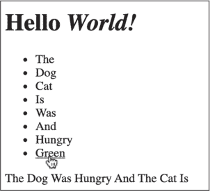

## 8 基于事件的编程


当用户点击按钮、滚动页面或只是简单地在网页内移动鼠标时，这些操作会生成一个 *事件*。事件是浏览器向 JavaScript 发出的信号，表明在 DOM 中发生了某个操作。事件使我们能够创建响应用户操作的互动网页应用程序。我们通过为特定事件编写 *处理程序* 来实现这一点：这些函数会在事件发生时被调用。通过事件处理程序，我们可以在用户点击某个元素时改变该元素的颜色，按下特定键时将元素移到屏幕上的不同位置，等等。

在本章中，你将学习如何编写事件处理程序来响应一些常见的 DOM 事件。通过这种方式，你将为网页添加交互功能。

### 事件处理程序

事件是浏览器告诉 JavaScript 在 DOM 中发生了某些事情的方式。几乎就像每次鼠标移动到窗口上，或者按下某个键时，浏览器都在大喊：“嘿，鼠标动了！按下了一个键！”这些大喊发生得非常频繁，但只有在你明确告诉 JavaScript 监听这些事件时，它的代码才会作出响应。你可以通过编写一个 JavaScript 事件处理程序，在特定类型的事件发生时执行某些操作。

*事件处理程序* 是由特定事件类型触发的函数，通常是针对特定元素。例如，你可以将一个事件处理程序附加到某个特定的 h1 元素上，以处理该元素上的点击事件。现在我们来尝试一下。我们将创建一个简单的网页，包含一个标题，并使用事件处理程序在点击标题时将一条信息记录到控制台。

首先，你需要一个 HTML 文件。创建一个名为 *chapter8* 的新目录，并在该目录下创建一个名为 *index.html* 的新文件。输入清单 8-1 中所示的内容。

```
<!DOCTYPE html>
<html>
  <head>
    <title>Event Handlers</title>
  </head>
  <body>
    <h1 id="main-heading">Hello <em>World!</em></h1>
    <script src="script.js"></script>
  </body>
</html> 
```

清单 8-1：用于探索事件处理程序的 index.html 文件

和往常一样，我们的 HTML 文件包含一个 html 元素，里面包含一个带有一些元数据的 head 部分，以及一些内容的 body 部分。具体来说，body 部分包含一个 ID 为 main-heading 的 h1 元素，部分标题文本被包裹在一个 em 元素中（*emphasis* 的缩写），默认情况下该部分文本会以斜体显示。它还包含一个 script 元素，链接到文件 *script.js*。稍后我们将在这里编写事件处理程序的代码。

总的来说，这个文件与我们在第七章中创建的*index.html*文件非常相似，唯一的重要区别是：script 元素位于 body 元素内部，而不是 head 元素中。这是为了绕过网页浏览器解析网页时遇到的问题。如前一章所述，浏览器构建了一个页面模型，称为 DOM。它通过从上到下读取 HTML 文件逐步构建 DOM。每当浏览器遇到一个 script 元素时，它会执行整个脚本后再继续。这意味着如果我们把 script 元素放在 head 中，并且在脚本中查找 h1 元素，那么 h1 元素还没有被加载到 DOM 中！通过将 script 元素放在 body 的末尾，我们可以确保在运行 JavaScript 之前，页面的所有内容都已经加载到 DOM 中。

现在，在与 HTML 代码相同的目录中创建一个名为*script.js*的文件，并输入清单 8-2 中显示的脚本。此脚本为用户点击 h1 元素时添加事件处理程序。

```
let heading = document.querySelector("#main-heading");

heading.addEventListener("click", () => {
  console.log("You clicked the heading!");
}); 
```

清单 8-2：在 script.js中创建事件处理程序

使用 DOM API 的 querySelector 方法，我们获取 ID 为 main-heading 的元素并将其保存为变量 heading。你可能还记得在第七章中，这个方法返回匹配选择器的第一个元素。在我们的例子中，只有一个 main-heading 元素，因此我们知道该方法会选择我们想要的元素。然后，我们在 heading 元素上使用 addEventListener 方法为该元素附加事件处理程序。addEventListener 告诉 JavaScript 监听元素上发生的特定事件，并在事件发生时执行某个函数。

> 注意

*虽然 DOM API 使用术语*监听器*，但术语*处理程序*更常用于描述响应事件的函数。*

addEventListener 方法有两个必需的参数。第一个是事件类型。这是一个表示响应事件类型的字符串，例如"click"（鼠标点击）、"keydown"（键盘按键按下）或"scroll"（窗口滚动）。我们指定了"click"。第二个参数是当指定的事件发生时执行的函数。这个函数就是事件处理程序。每当事件在 addEventListener 所调用的元素上发生时，它都会被调用。在这个例子中，该函数会在有人点击 heading 元素时被调用，并在控制台中记录一条消息。

> 注意

*如第五章所解释的，当一个函数作为参数传递给另一个函数时，它被称为*回调函数*，或者简单地说是*回调*。所有事件处理程序都是回调函数，因为它们作为参数传递给 addEventListener 方法。*

在浏览器中打开*index.html*并打开控制台。当你点击标题时，你应该会看到消息 "You clicked the heading!" 输出到控制台。恭喜：你已经制作了你的第一个互动网页！

#### 事件冒泡

当在某个元素上触发事件时，它也会在该元素的所有祖先元素上触发（即该元素的父元素、父元素的父元素，以此类推）。例如，当你在前面的例子中点击`h1`元素时，实际上你也在点击包含`h1`元素的`body`元素。这是符合直觉的；如果你点击一个框中的文字，你也在点击这个框。因此，如果你在`body`元素上附加了一个单独的处理程序，它也会接收到点击事件。从子元素到祖先元素的事件传播过程被称为*事件冒泡*。

让我们通过向网页中的`em`和`body`元素添加事件处理程序来利用事件冒泡。与我们之前的`h1`事件处理程序一样，这些新的处理程序将在点击其元素时向控制台日志输出一条消息。由于`em`是`h1`的子元素，而`h1`是`body`的子元素，所以单击`em`应该会触发附加到这三个元素的处理程序。

将示例 8-3 中的代码添加到*script.js*的末尾。

```
`--snip--`
document.querySelector("em").addEventListener("click", () => {
  console.log("You clicked the em element!");
});

document.querySelector("body").addEventListener("click", () => {
  console.log("You clicked the body element!");
}); 
```

示例 8-3: 向 script.js 添加更多处理程序

这个代码片段添加了两个处理程序，一个给`em`元素，另一个给`body`元素，但我们做法稍微不同于在示例 8-2 中创建主要标题处理程序的方式。我们没有将每个元素保存到变量中，而是直接在`document.querySelector`方法的结果上调用`addEventListener`。这种直接在另一个方法返回值上调用方法的技术被称为*方法链*：我们将多个方法调用串联起来，使得第一个链条的结果作为下一个方法调用的对象。我在示例 8-2 中使用了更长的方法，因为它更清楚地表示`addEventListener`是在一个元素上被调用的，但链式调用通常因为简洁而更受欢迎。

重新加载*index.html*并打开控制台。当你点击*World!*时，你应该会看到以下输出：

```
You clicked the em element!
You clicked the heading!
You clicked the body element! 
```

当你点击`em`元素时，该元素上的处理程序是第一个被调用的。接下来，会调用`h1`元素上的处理程序，然后是`body`元素上的处理程序。这是因为事件通过 DOM“冒泡”，从最内层的元素传递到最外层的元素。如果你点击的是标题中非斜体的部分，你将只看到主要标题和`body`处理程序被触发。

#### 事件委托

事件冒泡的一个常见用途是 *事件委托*，这是一种通过使用单一的事件处理函数来响应多个子元素或其他后代元素上的事件的技术。例如，假设你有一个单词列表，每个列表项是一个独立的 HTML 元素，而你希望以相同的方式处理每个项的点击事件。通过将一个事件处理函数添加到列表项的父元素，你可以用几行代码捕捉到每个项的事件。

为了说明事件委托，我们将编写一个简单的应用程序，根据你点击的列表中的单词来构建并显示一个句子。首先，我们更新 HTML 文件，包含一个单词列表和一个空的 p 元素，之后我们会动态地将你选择的单词填充到这个 p 元素中。然后，我们将编写必要的事件处理函数，使用 JavaScript 获取被点击的单词，并将它们添加到 p 元素中进行显示。最后，我们将添加一些 CSS 规则，使得这个应用程序更容易交互。

HTML 中有两种类型的列表：有序（编号）列表和无序（项目符号）列表。我们将使用无序列表，它是通过 ul（*无序列表*）元素创建的。列表中的每个项目都被包含在 li（*列表项*）元素中。因此，点击任何 li 元素所产生的事件将冒泡到父级 ul 元素。

按照 列表 8-4 所示更新 *index.html*。

```
<!DOCTYPE html>
<html>
 <head>
 <title>Event Handlers</title>
 </head>
 <body>
 <h1 id="main-heading">Hello <em>World!</em></h1>

    <ul id="word-list">
      <li>The</li>
      <li>Dog</li>
      <li>Cat</li>
      <li>Is</li>
      <li>Was</li>
      <li>And</li>
      <li>Hungry</li>
      <li>Green</li>
    </ul>

    <p id="sentence"></p>

 <script src="script.js"></script>
 </body>
</html> 
```

列表 8-4：添加列表到 index.html

这将向文档中添加一个无序单词列表，并且添加一个空的 p 元素，我们将使用 JavaScript 修改这个元素。

接下来，我们将为 ul 元素编写一个事件处理函数，处理点击任何列表项的事件。该处理函数将获取被点击的单词，并将其添加到 p 元素中，允许你逐个单词地构建一个句子。删除 *script.js* 中的所有代码，并将其替换为 列表 8-5。

```
let wordList = document.querySelector("#word-list");
let sentence = document.querySelector("#sentence");

wordList.addEventListener("click", ❶ event => {
❷ let word = event.target.textContent;
  sentence.textContent += word;
  sentence.textContent += " ";
}); 
```

列表 8-5：委托事件

首先，我们使用 document.querySelector 查找我们关心的两个元素：带有单词列表的 ul 元素和空的 p 元素。接下来，我们为 ul 元素添加一个点击事件处理函数。这个示例与我们之前的事件处理函数有些不同，因为回调函数有一个参数，我们称之为 event ❶。如果我们给事件处理函数传递一个参数（在这个例子中是 event，但参数名并不重要），该参数表示一个对象，DOM API 会通过这个对象传递有关刚刚发生的事件的信息。这些信息包括被点击的元素、元素的文本内容等，随后就可以在回调函数中使用这些信息。

在我们的示例中，我们使用事件对象来确定点击了哪个单词，并将其存储在变量 word ❷ 中。我们通过事件对象的 target 属性找出点击的是哪个具体元素。当你点击某个 li 元素时，event.target 就是你点击的 li 元素，而不是 ul（ul 元素可以通过 currentTarget 属性访问）。然后，我们使用 textContent 属性，该属性返回该元素的文本内容。把这些结合起来，如果你点击第一个 li 元素，那么 event.target.textContent 会返回字符串 "The"，这个字符串会成为变量 word 的值。

现在我们已经获得了用户点击的单词，可以将它添加到句子中。我们使用 += 运算符将单词附加到句子元素的文本内容中。你可能记得，sentence.textContent += word; 本质上等同于 sentence.textContent = sentence.textContent + word;。换句话说，我们将句子元素现有的文本内容与存储在 word 中的字符串拼接起来，并将其重新赋值给该元素的文本内容。然后，在将单词添加到句子后，我们使用相同的 += 技巧在句子末尾追加一个空格，为下一个要添加的单词做好准备。

再次在浏览器中打开 *index.html*。你应该能看到单词列表。你不会看到空的 p 元素，因为它还没有任何内容。当你点击列表中的单词时，应该会看到它们被添加到 p 元素中。

为了完成我们的应用程序，我们需要添加少量的 CSS。JavaScript 和 CSS 通常是配合使用的，因为样式可以向用户提供提示，表明某些元素是可以交互的。在这种情况下，我们通过 CSS 添加了两个提示：我们将修改列表项，以便当鼠标悬停时，光标变为手指形状，这样它们看起来更“可点击”；并且我们会为当前鼠标指针下的元素添加下划线，这样就更容易知道你即将点击哪个单词（当鼠标位于单词之间的垂直空间时，这点通常不太明显）。

创建一个名为 *style.css* 的新 CSS 文件，并添加清单 8-6 中显示的两个 CSS 声明。

```
li {
  cursor: pointer;
}

li:hover {
  text-decoration: underline;
} 
```

清单 8-6：在 style.css 中添加样式

为了更改 li 元素的光标，我们使用 cursor: pointer。这会将光标从默认的箭头更改为手指形状，就像当你将鼠标悬停在网页上的链接时那样。li:hover 选择器使用了 :hover 伪类。*伪类* 是一种只在元素处于某种状态时应用的选择器：li:hover 匹配任何当前鼠标悬停的 li 元素。当鼠标指针悬停在 li 元素上时，我们使用 text-decoration: underline 为该元素的文本添加下划线。

要在页面中包含这个 CSS，请向 *index.html* 文件的 head 部分添加一个 link 元素，如 清单 8-7 所示。

```
<!DOCTYPE html>
<html>
 <head>
 <title>Event Handlers</title>
    <link rel="stylesheet" href="style.css">
 </head>
`--snip--` 
```

清单 8-7：包含 style.css 在 index.html

现在，当你将鼠标悬停在某个列表项上时，光标会发生变化，当前悬停的单词会被下划线标记，正如 图 8-1 所示。



图 8-1：使用 CSS 给用户提示

有了这种样式，我们的句子构建应用就完成了！事件委托通过让我们只附加一个事件处理程序，而不是为每个列表项使用单独的处理程序，简化了我们写的 JavaScript 代码。

### 鼠标移动事件

当鼠标移动时，DOM 会产生名为 mousemove 的事件。这些 mousemove 事件会在鼠标移动到该元素上时触发，我们可以像处理鼠标点击事件一样，使用 addEventListener 方法来监听它们。让我们设置一个简单的 mousemove 事件处理程序来查看它是如何工作的。这个处理程序会在鼠标移动时将鼠标的位置记录到控制台。

仍然在你的 *chapter8* 项目文件夹中，将 清单 8-8 中的代码添加到 *script.js* 文件的末尾。

```
`--snip--`
document.querySelector("html").addEventListener("mousemove", e => {
  console.log(`mousemove x: ${e.clientX}, y: ${e.clientY}`);
}); 
```

清单 8-8：一个 mousemove 事件处理程序

在这个清单中，我们为 html 元素添加了一个 mousemove 事件处理程序。由于 html 元素涵盖了整个网页，因此该处理程序会响应浏览器窗口中任何地方的鼠标移动。处理程序会将一条消息记录到控制台，其中包括事件的 clientX 和 clientY 属性，告诉我们鼠标相对于浏览器窗口的 x 和 y 坐标。在这个例子中，我使用事件参数的简短名称 e，而不是像在 清单 8-5 中那样使用 event。请记住，参数的名称并不重要；如果事件处理程序的回调函数只有一个参数，那么该参数将携带关于事件的信息。

刷新浏览器中的 *index.html*，并将鼠标指针移动到页面上。你应该能在控制台中看到类似以下的消息：

```
mousemove x: 434, y: 47
mousemove x: 429, y: 47
mousemove x: 425, y: 48
mousemove x: 421, y: 51
mousemove x: 416, y: 51
mousemove x: 413, y: 54
mousemove x: 408, y: 55 
```

在观察控制台时，有两件重要的事情需要注意。首先，坐标从浏览器窗口的左上角的 0 开始，随着你向右和向下移动而增加。x 坐标随着向右移动而增加，y 坐标随着向下移动而增加。这遵循了计算机图形学的标准约定。

其次，会出现一些“间隙”或鼠标似乎跳过的位置。这是因为 mousemove 事件不是持续触发的，而是每秒触发有限的次数。确切的次数取决于鼠标、浏览器和计算机，但通常是在几百次的低频率。因此，如果你移动鼠标的速度足够快，屏幕上会有一些位置鼠标似乎跳过了，因为事件没有足够快地触发。

现在你已经看到了 mousemove 事件的实际应用，我们可以尝试用它们做一些稍微更有趣的事情。在接下来的例子中，我们将让一个盒子在页面上移动，跟随你的鼠标光标。为此，我们需要修改 HTML、CSS 和 JavaScript 文件。HTML 的修改很简单。请将新的一行添加到 Listing 8-9 中的 *index.html* 文件里。

```
`--snip--`
 <p id="sentence"></p>

    <div id="box"></div>

 <script src="script.js"></script>
 </body>
</html> 
```

Listing 8-9: 添加一个 div 到 index.html

这里我们使用了一个新的 HTML 元素叫做 div，代表 *内容分区*。它将成为我们页面上可移动的盒子。div 元素是 HTML 中的通用容器元素。这意味着它是一个可以包含其他元素的元素，但默认情况下没有外观，也没有特定的 *含义*（不像 ul 表示列表，或者 h1 表示标题）。接下来我们将使用 CSS 为 div 元素赋予样式。请将 Listing 8-10 的内容添加到 *style.css* 的末尾。

```
--`snip`--
#box {
  position: fixed;
  left: 0px;
  top: 0px;
  width: 10px;
  height: 10px;
  background-color: hotpink;
} 
```

Listing 8-10: 用 CSS 为 div 添加样式

在这里，我们使用 #box 来选择 ID 为 box 的元素。这个规则集里有几个声明。第一个，position: fixed，告诉浏览器将该元素放置在接下来的 left 和 top 声明指定的位置。我们将两者都设为 0px，这告诉浏览器将元素放置在浏览器的左上角 *视口* 里，视口指的是浏览器显示内容的区域。我们将元素的宽度和高度都设为 10 像素。最后，我们给这个 10×10 的盒子指定一个背景色，选择了非常显眼的亮粉色。

现在刷新页面，你会看到一个小的粉色方块出现在左上角。现在是时候编写一个事件处理程序，让你可以用鼠标移动这个方块了。请修改 *script.js* 文件，按照 Listing 8-11 中所示进行修改。

```
let wordList = document.querySelector("#word-list");
let sentence = document.querySelector("#sentence");

wordList.addEventListener("click", event => {
 let word = event.target.textContent;
 sentence.textContent += word;
 sentence.textContent += " ";
});

let box = document.querySelector("#box");

document.querySelector("html").addEventListener("mousemove", e => {
  box.style.left = e.clientX + "px";
  box.style.top = e.clientY + "px";
}); 
```

Listing 8-11: 用 JavaScript 移动 div

这里的第一个新增部分是使用 document.querySelector 查找 box 元素，并将该元素的引用保存到变量 box 中。接着，我们修改了之前写的 mousemove 事件处理程序。为了让盒子移动，我们需要修改它的 style 属性，style 是一个代表应用于该元素的 CSS 的对象。例如，设置 box.style.left 就和在 CSS 文件中更新 left 的值效果相同。在我们的事件处理程序中，我们使用当前鼠标的位置设置 left 和 top 的值。

如第七章所述，CSS 中的数值需要一个单位。我们不能仅仅赋值一个数字，比如 box.style.left = 10。相反，我们必须提供一个包含单位的字符串，例如 box.style.left = "10px"。这就是为什么我们在事件处理器的每个语句末尾都要加上 + "px"。如果 e.clientX 为 50，那么 e.clientX + "px" 会得到字符串 "50px"，它会被赋值给 box.style.left 属性，从而更新盒子的位置。随着鼠标的移动，这个处理器会被调用，e.clientX 和 e.clientY 将设置为当前鼠标的位置，这样粉色的盒子就会随着鼠标的移动而移动。刷新页面并试试看！

### 键盘事件

键盘事件是在键盘上按下键时触发的。我们将关注一个键盘事件，叫做 keydown，它会在按下某个键时触发。（正如你所预料的，实际上还有一个对应的事件叫做 keyup，它会在释放某个键时触发。）

我们将为网页添加一个处理器，它简单地将 keydown 事件记录到控制台。将清单 8-12 中的代码添加到 *script.js* 的末尾。

```
`--snip--`
document.querySelector("html").addEventListener("keydown", e => {
  console.log(e);
}); 
```

清单 8-12：记录 keydown 事件

如清单 8-11 所示，我们将一个事件处理器添加到 html 元素上，意味着它会应用于整个网页，但这次我们处理的是 keydown 事件。每当你按下键盘上的一个键时，这个事件就会被触发。我们的处理器会将 e 输出到控制台，这意味着每当按键时，整个事件对象都会被打印出来。

尝试重新加载页面，查看事件处理器的实际效果。你需要打开控制台，然后点击文档内部，使其获得*焦点*。这意味着按键事件将发送到你的网页，而不是控制台的文本输入框。只要一切设置正确，你应该能看到在你输入时事件会被记录到控制台，如下所示：

```
KeyboardEvent {isTrusted: true, key: "h", code: "KeyH", location: 0, ctrlKey: false, …}
KeyboardEvent {isTrusted: true, key: "e", code: "KeyE", location: 0, ctrlKey: false, …}
KeyboardEvent {isTrusted: true, key: "l", code: "KeyL", location: 0, ctrlKey: false, …}
KeyboardEvent {isTrusted: true, key: "l", code: "KeyL", location: 0, ctrlKey: false, …}
KeyboardEvent {isTrusted: true, key: "o", code: "KeyO", location: 0, ctrlKey: false, …} 
```

点击某个事件旁边的箭头，查看该事件拥有的属性。如你所见，有很多属性，但我们主要关心的是哪个键被按下，这可以通过 key 属性找到。接下来我们将使用这些信息来通过键盘移动粉色的盒子。

为了移动这个盒子，我们将创建两个新的变量来跟踪它的 x 和 y 坐标。然后，当特定的按键被按下时，我们将通过事件处理器更新这些变量。按照清单 8-13 中所示更新*script.js*。（注意，在这个清单中，mousemove 事件处理器已经被移除。）

```
let wordList = document.querySelector("#word-list");
let sentence = document.querySelector("#sentence");

wordList.addEventListener("click", event => {
 let word = event.target.textContent;
 sentence.textContent += word;
 sentence.textContent += " ";
});

let box = document.querySelector("#box");

let currentX = 0
let currentY = 0

document.querySelector("html").addEventListener("keydown", e => {
  if (e.key == "w") {
    currentY -= 5;
  } else if (e.key == "a") {
    currentX -= 5;
  } else if (e.key == "s") {
    currentY += 5;
  } else if (e.key == "d") {
    currentX += 5;
 }

  box.style.left = currentX + "px";
  box.style.top = currentY + "px";
}); 
```

清单 8-13：使用 keydown 事件移动盒子

我们创建了两个变量，分别叫做 currentX 和 currentY，用来存储方块的位置。然后我们修改了 keydown 事件处理程序，加入了一个 if…else 语句，用来检查事件的 key 属性是否匹配"w"、"a"、"s"或"d"中的任何一个。如果匹配，说明这四个按键中的一个被按下（我使用这些按键是因为它们通常用于游戏中的移动）。根据按下的是哪个按键，我们会向 currentX 或 currentY 添加或减去 5，表示方块向上、向下、向左或向右移动 5 像素。更新完相应的变量后，我们使用 box.style.left 和 box.style.top 更新方块的样式，就像我们在列表 8-11 中做的那样。不过这一次，我们使用 currentX 和 currentY 的值来改变 CSS。

当你重新加载页面时，尝试按住 S 或 D 键，让方块向下或向右移动。你应该会注意到，按住键不放时，方块会继续移动，因为键盘会发送重复的 keydown 事件。这是计算机键盘的正常行为，当你按住一个键时。重复的速度由操作系统控制。

### 总结

在本章中，你学习了 DOM 事件和事件处理的基础知识。DOM 事件是浏览器通知代码页面上发生了某些事情的方式。你可以通过事件处理器来响应这些事件，事件处理器是当特定事件发生在特定的 DOM 元素上时执行的 JavaScript 函数。事件处理器让你能够创建响应用户操作的互动网页。特别地，你看到了如何编写由点击、鼠标移动和按键触发的事件处理器。
