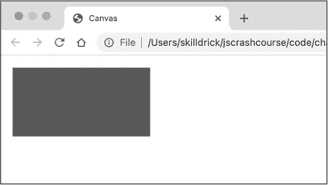
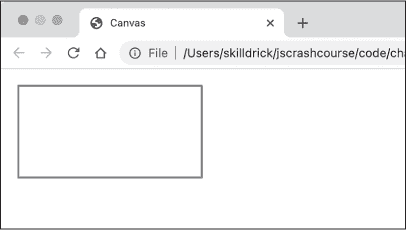
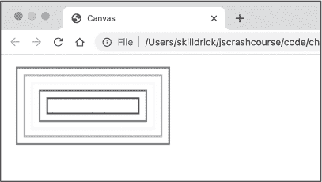
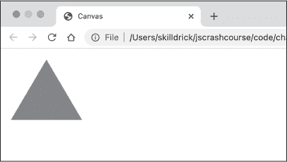
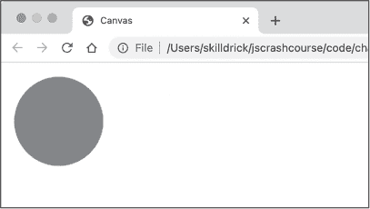
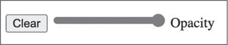
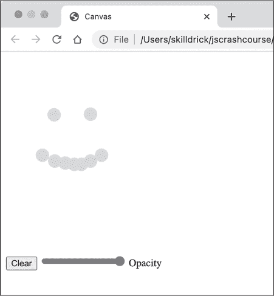

## 9 画布元素


HTML 中更具交互性的元素之一就是画布元素。这个元素像画家的画布一样：它为你提供了在浏览器窗口中使用 JavaScript 绘制图像的空间。而且，通过反复擦除旧图像并绘制新图像，你可以在画布上创建动画。从这个意义上说，画布元素更像电影院中的屏幕，图像每秒被更新多次，从而产生运动的效果。

本章你将学习如何创建画布元素以及如何使用 Canvas API，后者让你能够通过 JavaScript 操控画布。你将编写 JavaScript 代码，将静态图像绘制到画布上。接着，你将构建一个简单的互动绘图应用。最后，你将学习如何在画布上创建二维动画的基础知识。

### 创建画布

要在网页中包含画布元素，只需将其添加到页面的*index.html*文件中的 body 元素中。你只需要使用开闭的 HTML 标签<canvas></canvas>即可，因为画布元素没有必需的属性。然而，最好给画布指定一个 id，以便你可以通过 JavaScript 轻松访问它。通常也会设置元素的宽度和高度属性，以便确定画布的大小。

出现在画布中的图像是通过 JavaScript 生成的，而不是 HTML。在开闭标签之间的任何 HTML 内容只有在浏览器不支持画布元素时才会显示，因此可以作为老旧或仅支持文本的浏览器的备用方案。

让我们创建一个包含画布元素的 HTML 文件。我们还将包含一个 script 元素，链接到一个 JavaScript 文件，在其中编写代码来在画布上生成图像。在本章中，我们将使用相同的 HTML 文件绘制不同种类的图像。创建一个名为*chapter9*的新目录，并在该目录中创建一个名为*index.html*的新文件。输入示例 9-1 所示的内容。

```
<!DOCTYPE html>
<html>
  <head>
    <title>Canvas</title>
  </head>
  <body>
    <canvas id="canvas" width="300" height="300"></canvas>
    <script src="script.js"></script>
  </body>
</html> 
```

示例 9-1：带有画布元素的 index.html 文件

这是我们熟悉的 HTML 模板，类似于我们在之前章节中创建的*index.html*文件，但这里使用的是画布元素而不是 h1 元素。宽度和高度属性指定了画布的像素大小。默认情况下，画布是透明的，因此如果你加载页面时不会看到任何内容。

### 制作静态图像

现在我们有了一个 canvas 元素，可以使用 JavaScript 和 Canvas API 在其上绘制图形。我们将首先绘制一个实心矩形。接下来，我们将看看如何创建其他静态图形。创建一个名为*script.js*的新文件，放在*chapter9*目录中，并输入清单 9-2 中显示的代码。

```
let canvas = document.querySelector("#canvas");
let ctx = canvas.getContext("2d");
ctx.fillStyle = "blue";
ctx.fillRect(10, 10, 200, 100); 
```

清单 9-2：在 script.js 中绘制矩形

首先，我们使用 document.querySelector 方法获取对 canvas 元素的引用。canvas 元素有一个名为 getContext 的方法，我们用它来获取 canvas 的*绘图上下文*。绘图上下文是一个对象，它提供了整个 Canvas API，作为一组方法和属性（例如清单 9-2 中使用的 fillRect 和 fillStyle）。这些方法和属性是我们用来在 canvas 上绘制图形的工具。在这个例子中，我们将字符串"2d"传递给 getContext 方法，请求二维绘图上下文。

> 注意

*你可以通过将字符串"webgl"或"webgpu"传递给 getContext 方法来在 canvas 上绘制 3D 图形，而不是"2d"，但这两者比 2D 图形复杂得多，并且超出了本书的范围。*

接下来，我们告诉绘图上下文我们希望新元素的填充颜色为蓝色，使用 fillStyle 属性。最后，我们使用当前的填充颜色通过 fillRect 方法绘制一个填充矩形。此方法接受四个参数：矩形左上角的 x 和 y 坐标，以及矩形的宽度和高度（以像素为单位）。坐标的工作方式与整个浏览器窗口的坐标相同：x 值从左到右增加，y 值从上到下增加，其中(0, 0)表示 canvas 的左上角。

在浏览器中打开*index.html*。你应该能看到一个实心蓝色矩形，如图 9-1 所示。



图 9-1：蓝色矩形

任何后续调用 fillRect 方法都会使用相同的 fillStyle，因此它们也会生成蓝色矩形（直到你设置一个新的 fillStyle）。你可以通过绘制一些更多的矩形来确认这一点。

#### 绘制带描边的矩形

除了用于填充颜色的 fillRect 方法，Canvas API 还提供了 strokeRect 方法，用于勾画（*描边*）矩形。要尝试这个方法，请按照清单 9-3 所示修改*script.js*。

```
let canvas = document.querySelector("#canvas");
let ctx = canvas.getContext("2d");
ctx.lineWidth = 2;
ctx.strokeStyle = "red";
ctx.strokeRect(10, 10, 200, 100); 
```

清单 9-3：使用 strokeRect 勾画矩形

首先，我们使用 lineWidth 属性指定轮廓的宽度，将其设置为 2 像素宽。然后，我们使用 strokeStyle 和 strokeRect，而不是 fillStyle 和 fillRect，来创建一个没有填充色的轮廓矩形。strokeRect 方法的参数与 fillRect 相同：左上角的 x 和 y 坐标，以及矩形的宽度和高度。

当你重新加载 *index.html* 时，应该会看到矩形现在用红色轮廓描边，但没有填充，如图 9-2 所示。



图 9-2：一个红色轮廓的矩形

当你在绘图上下文中设置样式，如线条宽度或线条颜色时，这些设置只会影响后续添加到画布上的内容。也就是说，它们不会对已经绘制的内容产生回溯影响。从这个意义上讲，画布确实像一个物理画布，你当前使用的油漆颜色和画笔类型决定了样式。为了演示，我们将绘制几个不同颜色的矩形。在 *script.js* 结尾添加清单 9-4 中的代码，紧跟在绘制红色矩形的代码之后。

```
`--snip--`
ctx.strokeStyle = "orange";
ctx.strokeRect(20, 20, 180, 80);

ctx.strokeStyle = "yellow";
ctx.strokeRect(30, 30, 160, 60);

ctx.strokeStyle = "green";
ctx.strokeRect(40, 40, 140, 40);

ctx.strokeStyle = "blue";
ctx.strokeRect(50, 50, 120, 20); 
```

清单 9-4：绘制更多矩形

这段代码绘制了一系列嵌套的矩形，每个矩形都比前一个矩形偏移了 10 像素，且比前一个矩形小 20 像素。在绘制每个后续矩形之前，我们通过更新 strokeStyle 属性来改变轮廓的颜色。

刷新 *index.html*，你应该会看到类似于图 9-3 中的图像。



图 9-3：同心矩形

每个矩形的颜色都不同，表明样式的变化并没有影响到已经绘制的部分。

#### 使用路径绘制其他形状

除了矩形之外的所有其他形状都是作为 *路径* 绘制的。路径是由直线或曲线连接的一系列点，然后用轮廓描边或填充颜色。举个例子，我们将绘制一个通过三点连接的路径，并填充它，形成一个红色的三角形。将 *script.js* 的内容替换为清单 9-5 中的代码。

```
let canvas = document.querySelector("#canvas");
let ctx = canvas.getContext("2d");
ctx.fillStyle = "red";
ctx.beginPath();
ctx.moveTo(100, 100);
ctx.lineTo(150, 15);
ctx.lineTo(200, 100);
ctx.lineTo(100, 100);
ctx.fill(); 
```

清单 9-5：使用路径方法绘制三角形

绘制路径分为三个步骤。首先，使用 beginPath 声明开始绘制新路径。接下来，使用各种方法定义路径的位置。最后，使用 fill 或 stroke 填充或描边路径。

在这个例子中，我们使用了两种不同的方法来定义路径：moveTo 和 lineTo。moveTo 方法将虚拟的笔移动到画布上的某个点，这个点由 x 和 y 坐标定义，但不会画出线条。我们用这个方法定义路径的起点（100，100），它将是三角形的左下角。lineTo 方法与 moveTo 类似，但它在移动时会绘制一条线。所以，lineTo(150, 15) 会从（100，100）绘制一条线到（150，15），依此类推。最后，我们使用 fill 方法填充形状。当你刷新页面时，你应该能看到一个红色的三角形，如 Figure 9-4 所示。



Figure 9-4：绘制一个填充的三角形

绘制圆形的过程遵循类似的模式，但使用一种叫做 arc 的方法，而不是 moveTo 和 lineTo。arc 方法绘制一个 *弧形*，即圆周的一部分。你可以用 arc 方法绘制任何长度的弧形，但在这里我们用它绘制一个完整的圆形。

使用 Listing 9-6 中的代码更新 *script.js*。路径绘制代码的第一步和第三步相同，但我们将第二步的代码替换为绘制圆形的代码，而不是三角形。

```
let canvas = document.querySelector("#canvas");
let ctx = canvas.getContext("2d");
ctx.fillStyle = "red";
ctx.beginPath();
ctx.arc(150, 100, 50, 0, Math.PI * 2, false);
ctx.fill(); 
```

Listing 9-6：使用路径方法绘制圆形

arc 方法接受六个参数。前两个参数是圆心的 x 和 y 坐标。在这个例子中，我们将圆心设定在坐标（150，100）。第三个参数是圆的半径（以像素为单位），我们将其设置为 50。接下来的两个参数给出弧形的起始和结束角度（以弧度为单位）：我们为起始角度提供 0，为结束角度提供 Math.PI * 2，以画出一个完整的圆。最后一个参数指定弧形是顺时针（false）还是逆时针（true）绘制。从起始角度到结束角度。在这个例子中，我们选择顺时针方向，但由于我们画的是一个完整的圆，方向就不重要了。

> 注意

弧度 *是衡量角度的一种方式。在度数中，一个圆的完整旋转从 0 到 360°。在弧度中，完整旋转从 0 到 2π*。

现在刷新页面后，你应该能看到一个红色的圆形，如 Figure 9-5 所示。



Figure 9-5：绘制一个填充的圆形

你可以使用相同的技巧来绘制一个带有描边的圆圈，方法是使用 stroke 方法而不是 fill 方法。而且，你可以通过结合调用 lineTo 和 arc 方法来创建复合形状，如圆角矩形。Canvas API 还允许使用 quadraticCurveTo 和 bezierCurveTo 方法绘制更复杂的曲线。可以在 Mozilla 开发者网络（MDN）Web 文档中（[*https://<wbr>developer<wbr>.mozilla<wbr>.org*](https://developer.mozilla.org)）查找有关这些其他方法的更多详细信息。

### 与 Canvas 的交互

当用户能够与 canvas 进行交互时，canvas 变得更加有趣。canvas 元素本身没有内置任何交互功能。然而，我们可以通过编写事件处理程序来为其添加交互性，这些事件处理程序监听特定的用户操作，并触发 Canvas API 方法，以便根据响应更新 canvas。

在本节中，我们将使用带有点击处理程序的 canvas 元素构建一个非常基本的绘图应用。该处理程序将监听 canvas 上的点击事件，并调用一个方法，在点击发生的位置绘制一个圆圈。我们还将创建一个滑块，让用户设置圆圈的透明度，并添加一个按钮来清除 canvas。

首先，让我们添加必要的 HTML 元素来创建一个滑块和一个按钮。按照清单 9-7 中的修改对 *index.html* 进行修改。

```
<!DOCTYPE html>
<html>
 <head>
 <title>Canvas</title>
 </head>
 <body>
 <canvas id="canvas" width="300" height="300"></canvas>
    <div>
      <button id="clear">Clear</button>
      <input id="opacity" type="range" min="0" max="1" value="1" step="0.1">
      <label for="opacity">Opacity</label>
    </div>
 <script src="script.js"></script>
 </body>
</html> 
```

清单 9-7：向 index.html 添加一些额外元素

在这里，我们添加了一个新的 div 元素，其中包含另外三个 HTML 元素。div 元素用于将其内部的元素组合在一起，并将它们定位在 canvas 下面（如果没有 div，它们将出现在 canvas 右侧）。

div 内的第一个元素是一个按钮元素。它创建了一个可点击的按钮。开闭标签之间的任何内容将显示为按钮上的文本，因此我们的按钮上将显示文本 *清除*。稍后，我们将编写一个 JavaScript 函数，当用户点击按钮时，它将清除 canvas 上的所有圆圈。

接下来，在 div 内是一个 input 元素，用于获取用户的值。input 元素不允许任何子元素，因此不需要闭合标签。在本例中，input 元素的类型是 range，这意味着它将显示为一个滑块。这个滑块将用于设置在 canvas 上绘制的新圆圈的透明度。它有几个属性定义其功能：min 定义滑块将产生的最小值，max 定义最大值，value 定义滑块的初始值，step 是每次移动的大小（使你能够控制允许的值的数量）。此滑块设置为从 0 到 1，步长为 0.1，初始值为 1，表示完全不透明。

div 中的最后一个元素是 label 元素，它为另一个元素应用标签。label 的 for 属性决定了该标签应用于哪个元素；它的值必须与另一个元素的 id 匹配。在这种情况下，我们通过指定 opacity 作为目标 id，将标签应用于滑块。这将导致滑块被标记为 *Opacity*，这就是 label 元素的文本内容。由于 label 元素的 for 属性，浏览器会理解标签和输入元素是相关的，并且对标签执行的某些操作将应用于输入元素。例如，如果你将鼠标悬停在标签上，输入框会显示为悬停状态；如果你点击标签，输入框将获得键盘焦点（在这种情况下，按左箭头或右箭头键分别会减少或增加滑块的值）。

在浏览器中加载 *index.html*，你应该会看到类似于图 9-6 的内容（这些元素的具体外观可能会根据你的浏览器和操作系统有所不同）。



图 9-6：新的按钮和输入元素

现在我们有了 HTML 元素，可以编写 JavaScript 代码来使这个应用程序具备交互性。首先，我们将添加一些通用声明和在用户点击画布时绘制圆形的代码。请更新 *script.js* 文件，加入清单 9-8 中的代码。

```
let canvas = document.querySelector("#canvas");
let ctx = canvas.getContext("2d");

let width = canvas.width;
let height = canvas.height;

let opacity = 1;

function drawCircle(x, y) {
❶ ctx.fillStyle = `rgba(0, 255, 0, ${opacity})`;
  ctx.beginPath();
  ctx.arc(x, y, 10, 0, Math.PI * 2, false);
  ctx.fill();
}

canvas.addEventListener("click", e => {
  drawCircle(e.offsetX, e.offsetY);
}); 
```

清单 9-8：点击时绘制一个圆形

首先，我们将画布元素的宽度和高度存储在两个变量 width 和 height 中。稍后我们在清除画布的函数中会用到这些变量。JavaScript 画布对象的宽度和高度属性直接来自 HTML 画布元素的宽度和高度属性（在 *index.html* 中这两个属性都设置为 300）。我们还将变量 opacity 初始化为 1。

接下来，我们创建一个名为 drawCircle 的辅助函数。这个函数接受一个 x 坐标和一个 y 坐标，并在该位置绘制一个填充的圆形。我们使用与清单 9-6 中演示的相同路径绘制方法来绘制圆形。x 和 y 参数确定圆形的中心，我们将其半径设置为 10 像素。

与之前的绘图示例的一个关键区别是，我们将 fillStyle 设置为 *RGBA* 颜色，而不是像 "red" 或 "blue" 这样的命名颜色 ❶。RGBA 是一种使用四个数字定义颜色的方法，分别对应红色、绿色、蓝色和 alpha 通道。前三个数字表示每种基本光的颜色强度，数值范围从 0 到 255，可以通过组合这些值来生成任何你想要的颜色。将三个数值都设置为 0 会生成黑色，将三个数值都设置为 255 会生成白色。*Alpha* 是不透明度的另一个说法，它定义了颜色应该有多不透明或透明，范围从 0（完全透明）到 1（完全不透明）。

在 Canvas API 中，你可以使用字符串 "rgba(…)" 设置 RGBA 颜色，括号中的四个值用逗号分隔。例如，将 fillStyle 设置为字符串 "rgba(0, 255, 0, 0.9)" 将使得绘制的绿色圆圈稍微透明。在我们的例子中，我们将 RGBA 字符串放在反引号中，以便使用占位符替代 alpha 值，从而允许用户通过滑块来改变透明度。

最后，我们为画布元素添加了一个点击事件处理程序，使用 addEventListener。该处理程序调用我们刚刚创建的 drawCircle 函数，并将点击事件的 offsetX 和 offsetY 属性作为函数的参数。offsetX 和 offsetY 属性给出了点击事件距离点击元素的左上角的距离（而不是整个浏览器窗口的左上角），因此它们非常适合确定点击发生在画布上的确切位置。

在浏览器中重新加载 *index.html*，并尝试点击画布。无论点击在哪里，都应该会出现一个小的绿色圆圈，如 图 9-7 所示。



图 9-7：使用鼠标点击绘制绿色圆圈

为了完成绘图应用程序，我们需要连接“清除”按钮和“透明度”滑块。将 Listing 9-9 中的代码添加到 *script.js* 的末尾。

```
`--snip--`
document.querySelector("#clear").addEventListener("click", () => {
  ctx.clearRect(0, 0, width, height);
});

document.querySelector("#opacity").addEventListener("change", e => {
  opacity = e.target.value;
}); 
```

Listing 9-9：连接“清除”和“透明度”控制

首先，我们为“清除”按钮添加点击事件处理程序。此操作调用了一个名为 clearRect 的 Canvas API 方法，用于清除画布的矩形区域。就像绘制矩形一样，你通过指定矩形的左上角的 x 和 y 坐标，以及矩形的宽度和高度来定义要清除的区域。在这里，我们使用 (0, 0, width, height) 来指定我们要清除的矩形区域从画布的左上角开始，并且宽度和高度与画布本身一样。因此，ctx.clearRect(0, 0, width, height); 会清除整个画布。

接下来，我们为“透明度”滑块添加了一个 change 事件处理程序。当输入元素的值发生变化时，change 事件会被触发，因此当滑块设置到新位置时，该处理程序会被调用。我们通过 e.target 获取输入元素，通过 .value 获取该元素的当前值。然后，我们使用这个值更新透明度变量。因为 drawCircle 函数使用透明度作为 RGBA 颜色的 alpha 分量，所以任何新绘制的圆圈都会使用通过透明度滑块设置的最新值。

现在，当你在浏览器中重新加载 *index.html* 时，你应该有一个完全正常工作的（虽然是基础的）绘图应用程序！你可以使用透明度滑块来改变新圆圈的透明度，使用“清除”按钮来清空画布并重新开始绘图。尝试将透明度滑块设置为中间位置，绘制重叠的圆圈，看看它们如何叠加。

### 动画化画布

正如本章开头所提到的，你可以通过在画布上绘制并每秒多次更新图像来动画化画布。在本节中，我们将编写一个非常简单的动画代码，展示这一工作的基本原理。

动画画布通常遵循以下基本模式：

1.  更新状态

2.  清除画布

3.  绘制图像

4.  等待短暂时间

5.  重复

*状态* 在这里指的是存储动画当前帧信息的变量。它可以是一个运动物体的当前位置、物体的运动方向等。在我们的例子中，状态将是圆的 x 和 y 坐标。当需要更新状态时，我们将 x 和 y 坐标各自增加 1，意味着圆的位置将逐渐向右下角移动。绘制图像将包括在更新后的 x 和 y 坐标处绘制一个小圆。在绘制圆之前，我们会清除画布，以确保移除上一个循环中的图像。我们将通过使用 setInterval 函数每 100 毫秒调用一次代码，或者每秒调用 10 次，来处理最后两个步骤（等待和重复）。

我们可以继续使用相同的 HTML 和 JavaScript 文件。对 *index.html* 进行的唯一修改是移除我们在 清单 9-7 中添加的 div 及其嵌套元素，因为它们不再需要。移除这些元素后，按照 清单 9-10 中的代码更新 *script.js*。

```
let canvas = document.querySelector("#canvas");
let ctx = canvas.getContext("2d");

let width = canvas.width;
let height = canvas.height;

let x = 0;
let y = 0;

function drawCircle(x, y) {
  ctx.fillStyle = "rgb(0, 128, 255)";
 ctx.beginPath();
 ctx.arc(x, y, 10, 0, Math.PI * 2, false);
 ctx.fill();
}

function update() {
  x += 1;
  y += 1;
}

function draw() {
  ctx.clearRect(0, 0, width, height);
  drawCircle(x, y);
}

setInterval(() => {
  update();
  draw();
}, 100); 
```

清单 9-10：创建动画

我们创建了两个新的变量，x 和 y，表示我们将要动画化的圆的位置。这些变量存储动画的当前状态，并将在固定间隔内更新。drawCircle 函数本身大致不变，虽然 fillStyle 有所不同。现在我们不再设置透明度，可以使用更简单的 rgb(…)-格式字符串来设置红色、绿色和蓝色的值。使用 "rgb(…)" 时，颜色的透明度始终是 100%。

在 drawCircle 之后，我们声明了 update 函数，在该函数中我们更新了 x 和 y 变量，将它们各自增加 1。接下来，我们声明了 draw 函数，它会清除画布，然后调用 drawCircle 在当前的 x 和 y 坐标处绘制圆形。最后，我们调用 setInterval 来协调整个动画。你可能还记得 第五章 中提到，setInterval 接受一个函数和一个时间间隔（以毫秒为单位），并在每个时间间隔后重复调用该函数。这里，我们每 100 毫秒调用一次匿名函数。这个匿名函数本身会调用 update 和 draw，生成每一帧的动画。

在浏览器中重新加载 *index.html*，你应该会看到一个小圆圈逐渐从左上角移动到右下角。即使圆圈离开了 canvas，x 和 y 坐标会继续增加，但 canvas 会忽略任何超出其边界的绘制内容。

### 总结

在这一章中，你学习了在 canvas 元素上绘图的基础知识，以及使用 canvas 创建互动应用和动画的一些技巧。稍后在本书中，我们将基于这些技巧，学习如何制作一个基于 canvas 的游戏。
