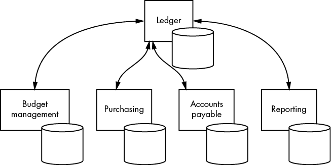
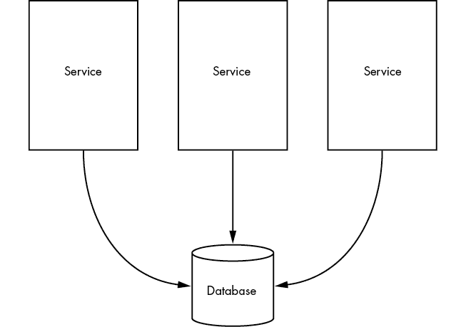
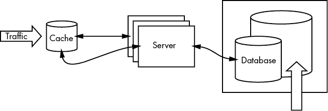

# 第三章：评估你的架构

当人们谈论他们现代化计划的各个阶段时，如果是从他们将使用哪些*技术*的角度出发，而不是从他们将带来什么*价值*的角度出发，这对我来说是一个很大的警告信号。这种区分通常是一个很明显的标志，表明他们认为任何新事物都一定比他们已经拥有的更好、更先进。

可能看起来挑剔，但专注于语言是保持现代化进程顺利进行的一个关键部分。团队往往会朝着他们所关注的方向发展。如果我们在谈论我们所做的事情时侧重于技术选择，用户的需求就会被忽视。发现价值的最佳方式是专注于他们的需求。

在围绕新的遗留系统制定战略时，我始终牢记三个原则。第一章和第二章的历史回顾详细阐述了这些原则：

+   现代化应基于增加价值，而非追逐新技术。

+   熟悉的界面有助于加速采用。

+   人们通过他们的网络获得对界面和技术的认识，而不一定是通过流行度。

但对于大多数组织而言，关于现代化的讨论从失败开始。如果系统运行良好，没人会投入时间和精力。*遗留系统现代化*这一术语本身有些误导。许多老旧系统因为运作正常，没人考虑更换。

因此，在制定攻击计划时，最后需要考虑的事情是导致最初现代化需求的故障的具体性质。很可能，你正在处理以下一个或多个问题：技术债务、性能差或不稳定性。

## 问题 1：技术债务

老旧系统不需要仅仅因为它们老旧而进行现代化。许多技术几十年来没有发生根本变化。迁移到最新最先进的技术有时会带来更多问题，而非解决问题。

以下情况可能需要进行现代化：

+   代码难以理解。它引用的决策或架构选择已经不再相关，且机构记忆已丧失。

+   合格的工程师候选人稀缺。

+   硬件替换零件难以找到。

+   该技术已经无法高效地执行其功能。

*遗留系统*和*技术债务*这两个术语常常被混淆。它们是不同的概念，尽管一个系统可能同时表现出这两种问题的迹象。

*遗留系统*是指一个旧系统。它的设计模式相对一致，但已经过时。升级底层基础设施的能力会带来性能的提升。由于新工程师与遗留系统所使用的技术之间存在技能差距，因此他们很难适应。

与此相反，*技术债务*可以（并且确实会）在任何阶段发生。它是次优权衡的产物：部分迁移、快速修补和过时或不必要的依赖项。技术债务最有可能发生在假设或需求发生变化时，组织选择快速修复而不是预算时间和资源以适应变化。与遗留系统不同，这种情况下的性能问题通常是低效代码的副产品，而非过时的基础设施。升级基础设施——增加内存和核心或添加服务器——并不总是能带来等比例的性能提升。

拥有大量技术债务的系统还会使得新工程师的加入变得困难，但在这种情况下，困难在于应用程序的内部逻辑没有意义。也许文档已经过时，或者抽象层次堆积在一起，或者函数命名不直观。

管理技术债务就是要恢复一致性。一种处理这一挑战的好方法是进行一次产品发现练习，就好像你打算构建一个全新的系统一样，但实际上并不构建一个！相反，使用这个新的愿景来挖掘并重新聚焦当前的系统。

随着时间的推移，需求自然发生变化。随着需求的变化，使用模式也会发生变化，最有效的组织和设计也会变化。使用产品发现方法重新定义你的 MVP，然后找到现有代码中 MVP 所在的位置。这些功能和特性是如何组织的？如果今天你来组织它们，会怎么做？

另一个处理技术债务时有用的练习是，将系统最初构建时可用的技术与我们今天为这些相同需求使用的技术进行比较。当处理用 COBOL 编写的系统时，我经常采用这种方法。尽管人们常说 COBOL 正在消亡，但它在某些任务上确实表现得很好。大多数老旧的 COBOL 系统的问题在于，它们是在 COBOL 是*唯一*选择的时代设计的。如果目标是摆脱 COBOL，我会首先整理出哪些部分的系统是用 COBOL 编写的，因为 COBOL 擅长执行这些任务，哪些部分是用 COBOL 编写的，因为当时没有其他工具可用。一旦我们有了这个映射，我们就可以开始将后者拆分成独立的服务，使用今天我们为这些任务选择的技术来编写和设计。

## 示例：总账

其中一个债务负担沉重的系统被设计为一个*总账*，用于一个大型医疗保健组织。它是一个复杂的系统，涉及多个主机协同工作。它处理来自其他主机的请求，这些主机支撑着需要发放付款的其他系统。总账的核心功能是授权并发放组织向第三方的付款。因此，该系统必须确保组织有足够的资金发放付款，请求是有效的，请求不是重复的，并且请求的情况符合所有相关的规定。此外，该系统还跟踪组织欠款，发送提醒债务人付款的请求，并为各方利益相关者生成报告。

当前的系统根据部门组织代码——例如，贷款和应付账款是系统内的不同应用程序，尽管它们有重叠的需求——并且是用 COBOL 或特定于主机的汇编语言编写的，通常运行其作业。总体而言，系统看起来像图 3-1。

很容易看出这个系统是如何以这种方式发展的。该组织规模庞大，资金充足，在计算机首次引入市场时，它立刻利用了计算机的优势（因此有了汇编语言）。该组织将纸质流程迁移到数字流程，几乎没有做出改变，并在技术中保持了原有的流程边界。

图 3-1：与总账交互的应用程序

当时，计算机是“附加设备”，是为了加快工作速度而设计的实验性大玩具，并非每个业务单元都认为这些新机器能够为它们的流程增值。最终的系统按业务单元划分，因为技术的采纳是逐步进行的，逐个单元地推进。

但是今天，计算机是默认选择，因此我们不会以这种方式构建系统。我们可能会保留应用程序与部门的映射关系，但我们会构建反映它们共享需求的共享服务。一些功能发挥了 COBOL 处理大量财务数据的优势，但在生成报告或发送邮件时，COBOL 并不一定能提供太多帮助。

在现代化这个系统时，我会识别出合适的共享服务，然后选择一个来构建。理想的情况是，当我能识别出一个仅需要提议的共享服务之一的应用程序时。我们构建该服务并重写该应用程序以使用它。然后我们回过头来，找一个需要该共享服务加上我们清单中的另一个共享服务的应用程序。我们构建第二个共享服务，并重写该应用程序以同时使用这两者。

然而，大型系统中的应用程序很少能够按复杂度的升序排列。更可能的是，我们需要先提取一个共享服务，并一一重写每个应用程序，然后再提取第二个共享服务，并一一重写每个应用程序。这可能令人沮丧，但重要的是，在我们对新服务的正常行为有足够经验之前，不能对其增加负载。

## 问题 2：性能问题

性能问题实际上是与遗留系统相关的较为轻松的难题之一。很少有组织在遗留系统开始影响业务运作、工作开始变慢之前，会主动采取措施。有时这是因为系统本身变慢了，但更可能的是，系统的性能保持相对稳定，而它周围的所有其他事物却变得更快了。

通常来说，关于某个任务需要多久完成以及需要多少资源的问题是高度主观的。人们倾向于认为当前的状态是可以接受的，尤其是当他们对其他系统经验有限时。如果组织认为其系统存在性能问题，那么“更好”的定义工作就已经由你完成了。除非拥有该系统的组织已明确了期望，否则一个系统不可能有性能问题。

本书将一再强调权衡取舍的信息。对现有系统所做的任何更改都是有代价的。改善系统某一特性的更改通常会使其他方面变得更加困难。擅长遗留现代化的团队知道如何识别权衡取舍并协商出最佳的解决方案。你必须选择一个目标或特性来优化，并为所有其他特性设定预算，这样你才能知道在开始失去价值之前，你愿意放弃多少。

为了提高速度，是否值得牺牲一些准确性？当迁移到托管服务使得本地测试更加困难时，是否值得迁移？当一个组织已经决定其系统存在性能问题时，回答这些问题就容易多了。组织必须对性能应该有多快或需要花费多少资金来满足要求有所预期。

一旦定义了性能要求，评估遗留系统并制定策略的任务就变成了列出一个给定任务中的所有步骤，并识别性能瓶颈。将这一点列出之后，你可以优先考虑改进，先从能够获得最大收益的领域开始。

解决每一个瓶颈并不一定要求完全消除它。如果你能做到这一点，那很好，但在大多数情况下，你会发现为了消除它所需的投入与性能提升不成正比。不要低估 5%、10%和 20%性能提升的力量。只要你采取的方法能使系统朝着更好的整体状态前进，5%的提升可以随着项目的推进产生回报。其他改动可能会让这 5%的提升在以后变成 30%甚至 50%的收益。

话虽如此，不要仅仅为了修补问题并获得性能提升而抛弃工程最佳实践和良好的架构。你可以通过以下特点识别这种解决方案：它们往往避免触及显然的根本问题。提出这些解决方案的人通常对系统的问题感到沮丧，并且被逐步改进所需投入的时间（几个月或几年）压倒。它们反对那种让系统变得更好的 5%的改动，因为他们认为 5%的改进永远不够。因此，他们提出一种能够提供更大性能提升的解决方案，但这种方案可能会加剧根本问题或使以后修复变得更加困难。举个例子，我们有一个系统，其中多个服务需要访问一个庞大的无结构数据存储。数据的规模已经增长到，删除其中一些数据所需的过程非常消耗资源，已经影响了正常的读取和写入性能。

问题在于数据的无结构性，以及同时需要访问这些数据的众多服务，但这是一个很难解决的问题。将数据拆解、适当结构化并迁移服务将需要几个月，甚至几年时间。相反，项目中的工程师们希望构建一个垃圾回收服务，在低流量期间执行删除操作，因为此时性能影响较小。

这种方法有什么问题呢？首先，创建一个新服务不是一件小事，创建之后，它还需要维护、监控、测试和扩展。更重要的是，这个新服务是一个抽象，它在正常流程之外执行一个潜在的危险操作。是什么触发了这个服务，我们怎么知道它正在执行的任务是正确的？添加一个新服务只会增加系统的整体复杂性，目的是利用暂时的情况。随着负载的增加，这些低流量窗口将变得越来越小，越来越难以找到。

如果这个系统能够正常运行，它将带来巨大的性能提升，为组织争取到时间去解决真正的问题。当然，提出这个系统的工程师们的初衷就是如此。但也有可能，一旦这样的临时修补措施到位，组织就会失去解决真正问题的兴趣，而这个团队的工作也不过是将定时炸弹的倒计时重置了而已。

更聪明的做法是寻找突破数据的“微小步骤”，这些步骤将产生 5%或 10%的提升。如果你发现足够多这样的提升，这些提升会积累起来。

大问题总是通过将其分解为小问题来解决。解决足够多的小问题，最终大问题会崩塌并得以解决。

## 示例：案件流管理

用于通过多阶段审批流程管理应用程序的软件，随着时间的推移，逐渐变成了性能战场。这里有一个例子，我们可以通过找到足够多的瓶颈并逐步消除它们来提高系统的输出。这种应用审批流程背后的技术相当不错，但其中一些部分是自动化的，另一些则是手动的。有些部分是数字化的，有些仍然是纸质的。有些部分最近才数字化，而有些则是 20 年前数字化的。大家都同意，如果剩下的可以自动化的部分能被自动化，流程中的纸质部分能被数字化，系统中较旧的组件能得到更新，整个系统会更好，但这是一长串的改进清单。

并非所有优先级最高的任务都会影响处理申请所需的时间。例如，在流程的某个阶段，申请人必须签署一份同意书，授权组织进行背景调查。虽然纸质表单可以用简单的网页表单或与第三方服务的集成来替代，但这一部分申请流程通常与其余申请的处理是并行进行的。因此，数字化这一步骤并不会实际加速单个申请的总处理时间。

其他看似无关的问题可能会带来更大的差异。案件是批量发送到背景调查服务的。如果该批次中的一个申请出现问题，所有该批次的申请都必须等问题解决后才能继续。仅仅将作业重新配置为每次一个申请处理，就能节省大量时间。

团队没有仅仅关注系统的纯技术改进，而是通过追踪申请的流程来减少处理每个申请的时间。他们已经做了艰苦的工作，确定一个更好的系统意味着更快的申请处理时间，并且他们围绕这一目标优化了他们的方法。

## 问题 3：稳定性问题

另一方面，一些遗留系统能够在组织成功所需的参数范围内执行核心功能，但它们不稳定。它们并不太慢；它们能产生正确的结果，并且在组织可用资源范围内完成任务，但经常会有“意外”发生，比如出现奇怪的黑天鹅式根本原因的停机事件，或者常规升级有时会失败得很严重。因为不可预见的技术冲突出现并需要解决，正在进行的开发工作被迫停止。

1983 年，查尔斯·佩罗（Charles Perrow）创造了*正常事故*这一术语，用来描述那些极易发生故障的系统，即使采取再多的安全措施，也无法完全消除事故。根据佩罗的说法，正常事故并非由不良技术或无能的员工所导致。经历正常事故的系统展现出两个重要特征。

**它们是紧密耦合的**。当两个独立的组件彼此依赖时，称之为耦合。在紧密耦合的情况下，一个组件的变化很可能会影响另一个组件。例如，如果一个代码库的更改需要相应地更改另一个代码库，那么这两个代码库就是紧密耦合的。而松散耦合的组件则是指一个组件的变化不一定会影响到另一个组件。

紧密耦合的系统会产生连锁反应。一处变化会在系统的另一部分引发响应，进而在系统的另一部分产生响应。就像多米诺效应一样，系统的各个部分开始执行，而无需人工操作员指示它们去做。如果系统比较简单，通常可以预测故障发生的方式并加以防范，这也是经历正常事故的系统的第二个特征。

**它们是复杂的**。大规模系统通常是复杂的，但并非所有复杂的系统都是庞大的。软件复杂性的迹象包括直接依赖的数量和依赖树的深度、集成的数量、用户的层级结构和委托的能力、系统必须控制的边缘情况数量、来自不可信来源的输入量、这些输入的法律差异等。计算机系统随着时间的推移自然变得更加复杂，因为随着年龄的增长，我们往往会不断为它们添加更多的功能，这会增加至少一些这样的特征。计算机系统也往往在开始时是紧密耦合的，如果不定期进行代码重构，它们实际上可能一直保持这种状态。

紧密耦合和复杂的系统容易发生故障，因为耦合会产生连锁反应，而复杂性使得这些连锁反应的方向和过程难以预测。

如果你的目标是减少故障或最小化安全风险，最好的方法是从这两个特征入手评估系统：哪里是紧密耦合，哪里是复杂的？你的目标不应是消除所有的复杂性和耦合；在每个具体情况下都会有权衡。

假设你有三个服务需要访问相同的数据。如果你配置它们使用同一个数据库，它们就会形成紧密耦合（图 3-2）。

图 3-2：紧密耦合的服务

这种耦合会带来一些潜在问题。首先，三个服务中的任何一个都可能更改数据，从而破坏另外两个服务的正常运行。任何数据库架构的更改都必须在所有三个服务之间协调。通过共享数据库，你失去了拥有三个独立服务的扩展优势，因为当一个服务的负载增加时，这个负载会传递到数据库，而其他服务的性能则会下降。

然而，给每个服务分配独立的数据库，会将这些问题转化为其他潜在的问题。现在你必须弄清楚如何保持这三个独立数据库之间的数据一致性。

放松两个组件之间的耦合通常会导致创建额外的抽象层，这会增加系统的复杂性。简化系统复杂性通常意味着更多的公共组件重用，这会加剧耦合。问题不在于将你的遗留系统转变为完全简单且没有耦合的系统，而在于战略性地考虑你在哪些地方耦合、在哪些地方复杂，以及这种耦合和复杂的程度。复杂性较高的地方是人类操作员容易出错和误解的地方；紧密耦合的地方则是加速的领域，好的和坏的效果都会更快传播，这意味着干预的时间会更少。

一旦你识别出系统中紧密耦合和复杂的部分，研究这些区域在过去问题中的作用。改变复杂性与耦合的比例会使这些问题得到改善，还是变得更糟？

一个有用的思考方式是将你目前遇到的故障类型进行分类。由人为原因引起的问题——如未能阅读、理解或检查某些内容——通常可以通过简化复杂性来改进。由监控或测试失败引起的问题，通常可以通过放松耦合来改善（从而为自动化测试创造空间）。还要记住，一个事故可能包含这两种因素，所以在分析时要有思考。一名操作员可能因为犯错触发了事故，但如果这个错误因为日志不够详细而无法被发现，那么简化复杂性所带来的效果，就不如改变耦合来得显著。

## 示例：自定义配置

假设有一个组织希望增强其单体应用中自定义配置的功能。它构建了一个配置服务，使得软件工程师可以通过单体应用的代码设置标志（图 3-3）。应用程序向该服务发送带有用户身份的请求，以获取相应的配置值。由于这些值很少更改，90%以上的请求通过缓存处理。如果缓存失败，请求将转发到一个简单的 Web 服务，该服务会立即重试缓存，最终返回数据库以检索配置设置。该数据库与单体应用的数据库是分开的，但它运行在相同的虚拟机（VM）上。来自应用程序的流量直接与单体应用的数据库连接。自定义配置数据库使用约 1% 的虚拟机资源。

当服务从数据库接收到配置值时，它会更新缓存并将数据返回给单体应用。数据

图 3-3：请求通过自定义配置服务流动

自定义配置以键值对的形式存储，其中键是用户的身份，值是包含所有相关配置设置的字典。由于可能的自定义选项几乎是无限的，这些字典没有标准的模式。如果用户没有为某个标志设置配置值，该标志在字典中将完全不存在。缓存保留了这种结构。

总的来说，这个服务对组织表现良好，但它有一些工程师很难重现，甚至更难诊断的怪癖。一些问题追溯到缓存雪崩。用户在设置值后很少更改它们，但在缓存确实需要更新的少数情况中，整个字典都会受到影响。

我们如何从复杂性和耦合性角度来看待系统的这一部分？单体应用的行为与配置服务耦合。如果配置服务出现故障，单体应用要么无法完成请求，要么回退到一个可能完全改变用户体验的默认值。如果配置服务发生部分故障，单体应用的行为将变得极为不可预测。

将数据库托管在同一虚拟机上会在单体应用和配置服务之间产生耦合。如果单体应用的数据库出现性能问题，配置服务的数据库也会受到影响，反之亦然。然而，在这种情况下，通过将配置服务的数据库迁移到自己的虚拟机来解决问题可能没有太大价值。如果单体应用的数据库出现问题，产品本身可能已经宕机，这使得该服务的性能几乎无关紧要。由于该服务只使用了虚拟机 1%的资源，因此不太可能在不先触发值班工程师报警的情况下影响单体应用。我们可能希望出于适当扩展的考虑将它们分开，但这会增加我们支付的虚拟机数量，并不一定带来比架构图上外观改进更多的价值。

从复杂性角度来看，数据结构可能是一个不太理想的设计选择。当单体应用发出请求时，它并不需要为用户设置所有的值，只需要当前时刻相关的值。如果在键值存储中的键是用户 ID 加上标志 ID，数据就可以是平坦的，这样可以减轻缓存雪崩的风险。另一方面，我们也可以保持数据结构不变，改变单体应用的假设，使其只请求一次用户的字典，并将返回的数据存储在内存中，直到会话结束。这种方案最小化了单体应用和服务之间的耦合，但却增加了复杂性。我们需要了解在任何时刻我们将存储多少数据在内存中，以及在什么级别上它会变得有问题。我们需要定义一个生存时间，并决定如何实现它。我们是否希望确保所有用户的请求都指向同一台服务器，还是应该假设如果会话仍然有效，应用集群中的所有服务器至少会查询一次配置服务，并将相同的数据存储在它们的内存中？

## 现代化计划的阶段

有一天，在一次一对一会议中，我团队中的一位工程师坦言，我们在处理一个遗留系统时完全走错了方向。我最近将一位新工程师加入团队，并明确指示她彻底审查系统的测试套件。尽管这些测试是全面的，覆盖面很好，但它们脆弱、不够组织，且难以理解。这反映了系统的整体设计，因此新工程师着手重构了代码的组织方式，使其更易于测试，并让测试更可靠。

看着新工程师的贡献，我的工程师知道这个配置更好。几个月来，我们一直在处理这个系统。她为自己没有像新来的人那样看待问题而懊悔。“我们太实用主义了，”她说，“我们只是顺应了系统现有的模式，而本应该重做它。”

我不同意。我的工程师忘记了，当我们接手这个系统时，它是不稳定的。很多事情经常悄无声息地出错。错误没有得到妥善处理或记录。性能也是一个问题。

学习如何拥有那种新工程师所展示的技术视野非常好。我当然不会阻止我的团队研究她的贡献，但一开始务实是正确的。当你首次接手一个遗留系统时，你根本不可能足够理解它，无法立刻进行大规模的修改。作为这些务实变动的一部分，我们还投入了大量时间来记录和研究系统。说实话，新工程师的第一个任务是一系列小的、务实的变动，旨在帮助她也能熟悉系统，但到那个时候，我的工程师们已经非常了解这个系统，他们能够更快地帮助她上手。她在几天内就完成了那些任务。

“你认为如果我们在处理常规事件的同时进行一次重大重构，会对你产生什么影响？”我问。

“那会真的很有压力。”

事实上，非常有压力，以至于可能会影响团队的判断。这些就是人们感到沮丧并开始说服自己最好的做法是把整个系统扔掉，从头开始重建的情形。

当你的遗留系统缺乏可观察性和测试时，可观察性应该放在第一位。测试只告诉你什么是*不会*失败的；监控告诉你什么是*正在*失败的。我们的新工程师能够自由地修改系统的大部分，因为团队在实施更好的监控后，意味着当她的修改被部署时，我们能迅速发现问题。

但这里真正的教训是，现代化计划会随着进展而发展。第一阶段是评估阶段。这不一定意味着你应该停下所有工作并制定复杂的大计划，但你应该专注于立刻解决的低难度问题，并进行务实的修复。利用这些小任务来聚焦于对系统本身的调查。了解它及其独特性。你的监控盲点在哪里？修改、测试并确信它们能正常工作有多容易？官方文档说某些功能是这样做的，但实际上并非如此的地方在哪里？有多少死代码？等等，等等。

当你的团队足够了解系统时，你可以扩大范围，关注系统中的整体问题。事情是否按应有的方式组织？现在是否有更好的技术可以纳入，也许是另一种编程语言或一种新工具？

对于特别大的系统，最好将此过程做成迭代式的多级过程。换句话说，选择系统中的某一部分并专注于此。先关注小的务实问题，然后关注该组件中的更全局性的问题。再进一步回顾，看看系统中的其他地方是否也存在类似的全局性问题，然后再决定如何处理它们。然后缩小视角，解决该组件的全局问题，再继续下一个组件。这样进行本地-全局-超级全局的循环，直到系统达到你需要的状态。

团队对系统及其特殊之处理解得越深入，系统的日常行为就越可预测，也越容易做出大规模的更改。

## 没有银弹

现代化遗留系统的唯一真正规则就是没有银弹。接下来的章节将概述不同的开发活动组织方式。你很可能会在一个大型项目的不同阶段使用到它们中的所有方法。

需要记住的关键点是，这是一套工具包。你将大问题拆解成小问题，并选择一个能够给你提供最高成功概率的工具来解决特定问题。当然，你可能会比其他方法更频繁地使用某些方法，但每个大规模的遗留系统都至少有一个棘手的问题需要应对。如果你只会解决圆形孔洞的问题，那么任务是无法完成的。

## 完全重写

*完全重写*就是字面意思：你从头开始，旨在构建一个全新的系统。这种方法的问题在于，在构建新系统的同时，旧系统该如何处理？一些组织选择将旧系统置于“维护模式”，只为其提供必要的资源，用于修补和修复，以保持其正常运作。如果新项目进度落后（几乎肯定会），旧系统会继续退化。如果新项目失败并被取消，那么在此期间，旧系统和运营卓越之间的差距将显著加大。

新系统投入运行的时间越长，用户和业务方就需要等待新功能的时间越长。忽视业务需求会破坏与工程部门的信任，从而使工程部门未来更难以争取到资源。

另一方面，如果在构建新系统的同时继续开发旧系统，那么保持两个团队之间的设计决策同步将是一个相当大的挑战。如果这些系统处理数据，而几乎所有计算机系统都会处理数据，那么将数据从一个系统迁移到另一个系统就成为了一个巨大的挑战。

另一个需要考虑的因素是参与的人。谁来负责新系统的开发，谁来承担旧系统的维护任务？如果旧系统是用一种过时的技术编写的，只对该系统本身相关，那么维护旧系统的团队实际上就是在等待被解雇。不要自欺欺人，他们知道这一点。因此，如果维护旧系统的人没有参与新系统的建设，你应该预期他们也在寻找新工作。如果他们在新系统投入运行之前离开，你不仅失去了他们的专业知识，还失去了他们的内部知识。

尽管如此，大型现代化项目中的许多小部分并不会通过任何形式的迭代得到显著改进。如果你有一个用 ActionScript 编写的界面，可能最好是直接重写它，并作为完全替代版本推入生产环境。

## 就地迭代

如果你有一个正常工作的系统，有时候最简单的方法就是不断迭代它，直到它看起来符合你的需求。这在管理技术债务时效果很好，但你也可以在需要重新做架构时使用这种方法。要让就地迭代生效，必须进行一定的准备工作。你需要设置监控。至少，你应该有一种方法来跟踪应用层的错误并搜索日志，但这一工具每年都在不断变得更加复杂。你越能识别出遗留系统的正常状态，就越容易安全地进行就地迭代。

另一个需要确保你有成熟方法的领域是测试。测试应该自动运行，无需人工手动跟踪测试用例。测试还应该是多层次的，既测试小的代码单元，也测试整个流程的端到端。编写好的测试需要技巧，关于这个主题的书籍已经写了整整一本，所以我不会在这里尝试用几段话来总结。对于遗留系统现代化，最相关的指南是迈克尔·费瑟斯的*《高效使用遗留代码》*。

最后，确保你的团队能够快速从失败中恢复。这通常是工程中的最佳实践，但如果你正在对生产系统进行更改时尤其重要。如果你从未从备份中恢复过，你实际上并没有备份。如果你从未切换到另一个区域，你实际上没有故障转移。如果你从未回滚过部署，你的部署流水线就不成熟。

如果你有一个好的监控策略、良好的测试策略，并且能够快速回滚变更，你就能够自信地对你的遗留系统进行几乎任何修改。

尽管这可能看起来有风险，但应该将就地迭代视为默认方法。在大多数情况下，这最有可能产生成功的结果。

## 就地拆分

*原地分拆*是原地迭代的一种变体，专门用于拆分系统。这可以意味着从单体结构过渡到面向服务的架构，也可以意味着将紧密耦合的两个组件解耦。与原地迭代的区别在于，你通过将拆分后的部分重新整合来完成分拆。换句话说，当你从单体系统中抽离一个服务时，该服务很可能仍然需要从单体系统中接收输入并向其发送输出。所以你构建这个独立的服务，并最终将其与单体系统连接，然后再继续拆分下一个服务。你不断地做这个（拆分服务并重新整合），直到把整个项目拆分成一组组小的基于服务的代码。

## 蓝绿部署

部署中的一个常见模式，*蓝绿部署技术*涉及将两个组件并行运行，并逐渐将流量从一个组件转移到另一个组件。这样做的最大好处是，如果出现问题，容易撤销。通常，在技术领域，增加负载会暴露出在测试中未发现的问题。遗留系统既有现有用户和活动的优势，也有其困扰。替代它们的系统只有在高负载下发现问题的短暂宽限期。蓝绿部署允许新系统逐步承载旧系统的全部负载，你可以在负载加重之前解决问题。

## 硬性截止

*硬性截止*是一种部署策略，其中新系统或组件一次性完全替代旧系统。这是现代化工具箱中最具风险的策略之一。

硬性截止通常分阶段进行，通常按环境或地区进行。一个组织可能首先在低流量地区进行部署，监控是否有问题，然后再部署到高流量地区。这为组织提供了蓝绿部署的一些好处，因为它可以在更新中途停止（并理想情况下回滚），但这种方法不如蓝绿部署精确。环境和地区之间的差异可能并不完全可预测，问题可能被忽视。

如果你没有多个地区，或者正在使用由用户安装的软件并且无法控制有多少用户能访问新版本，那么你可能别无选择。在后一种情况下，Alpha 和 Beta 测试组有所帮助；在前一种情况下，确保你能够撤销任何更改（无论是通过恢复备份还是通过版本控制系统中的还原/回滚命令）会有所帮助。

## 综合起来

良好的规划更多的是关于在组织内设定预期，而不是控制每个细节。你的计划将定义现代化遗留系统的含义，目标是什么，什么时候交付什么价值。具体来说，计划应重点回答以下问题：

+   我们通过现代化想要解决什么问题？

+   哪些小的务实变更将帮助我们更多地了解系统？

+   我们可以迭代哪些内容？

+   部署变更后，我们如何发现问题？

接下来，我们将看看如何从规划阶段转向面对那些将使实施变得困难的问题。
