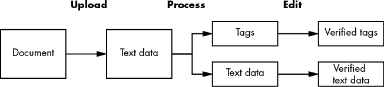
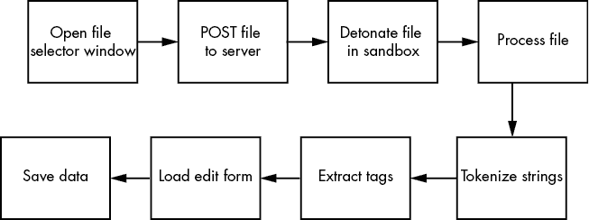
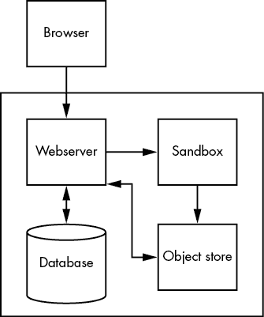

# 第八章：重大变更

在政府工作时，我们有一句话：“政府最讨厌的，不是改变，而是现状。”同样的惰性也存在于遗留系统中。没有破坏就无法改善一个庞大、复杂、负债累累的系统。如果幸运的话，导致的停机问题将很快得到解决，并且数据丢失最小，但这些问题是不可避免的。

另一种在我的政府同事中流行的表达是“空中掩护”。拥有空中掩护意味着你有信心，组织会帮助你的团队应对这种不可避免的破坏。它意味着你有一个相信并理解变革价值并能保护团队的人。作为团队领导，我的工作就是确保这种空中掩护。当我回到私营部门时，我作为经理应用了相同的原则——建立网络、建立关系、招募、做些小恩惠——以便我能给我的团队成员提供做艰难工作的安全感和保障，而这些正是我雇佣他们的原因。

在本章中，我探讨了重大变更的概念。你如何在诚实地阐述风险的同时推销危险的变更？何时应该破坏某些东西，如何快速恢复？

但是，我想从空中掩护的概念谈起。商业写作者有时会提到“心理安全”，这也是描述同一概念的一个很好的方式。为了有效地工作，人们需要感到安全和支持。领导的支持是创造空中掩护感觉的一部分，但为了使空中掩护有效，它必须改变组织对风险的感知。

风险不是表格中的一个静态数字。它是一种可以被操控的感觉，虽然我们可能会用统计数据、概率和事实来为这种感觉辩解，但我们对风险程度的感知往往与这些数据点没有关系。

## 被看见

一两年前，我受邀在哈佛大学甘尼迪政府学院给软件工程师工作讲座。当我开始给出实际建议时，我的第一张幻灯片上用大字写着：“人们怎么才能被看到？”

被看见并不单单是关于赞扬。它更多的是关于被注意或被认可，即使这种认可的情感是中立的。正如寻求地位的行为影响人们在会议中说什么，寻求被看见也会影响人们愿意容忍的风险程度。对变化的恐惧完全源自于对风险的感知。人们根据两个维度来构建风险评估：惩罚或奖励的程度以及被抓到的概率。

在这两者中，人们对被抓到的概率变化比对惩罚或奖励的程度更为敏感。^(1) 如果你想威慑犯罪，增加警察有效性的认知，并且让犯罪分子觉得自己会被抓住。如果你想激励某种行为，关注在组织中被注意到的行为。

组织可能口头上大力宣扬良好的行为，但仍然忽视它们。被看见并不是与组织的理论理想相匹配，而是关于你的同事会注意到什么。组织的言辞很容易与实际工作环境中的价值观脱节。同事们关注的是组织的真正价值观。无论组织的宣传有多么热情或一致，来自同事的关注总是比演讲更具影响力。

认同的具体形式也非常重要。以社会认可的形式进行的积极强化，往往比传统的晋升、加薪和奖金激励结构更有效。行为经济学家丹·艾瑞里将这一现象归因于社会市场和传统货币市场之间的差异。^(2) 社会市场由社会规范（即同伴压力和社会资本）所支配，它们往往能激励人们比那些更昂贵的传统工资换取工作激励更加努力和长时间地工作。换句话说，人们会为积极的强化而努力工作；但他们可能不会为多赚一千美元而更加努力。

艾瑞里的研究表明，即使是通过提供小额财务激励来促使人们更加努力工作，也会导致人们停止考虑与同事之间的联系，而转而将其视为一种货币交换^(3)——这是一种更冷漠、较少个人化的、通常也较少情感回报的空间。

认为一个人需要财务奖励才能为一个组织做好工作，这种想法是愤世嫉俗的。它假设员工有不良的动机，这会引发怨恨。因此，传统的激励措施几乎没有积极影响，因为它们破坏了原本基于信任和尊重的个人关系。行为学家阿尔菲·科恩是这样说的：

> *惩罚和奖励是同一枚硬币的两面。奖励具有惩罚效应，因为它们和直接的惩罚一样，都是操控性的。“做这个你就能得到那个”其实和“做这个，否则你会面临这样的后果”并没有太大区别。在激励的情况下，奖励本身可能非常渴望；但通过将奖金与某些行为挂钩，管理者在操控下属，而这种被控制的经历随着时间推移可能会变得具有惩罚性质。^(4)*

这是一个实际的例子。当我在 USDS 工作时，我的老板经常抱怨人们一次又一次地做出他明确告诉他们不应该做的事情。具体来说，他不断告诉团队不要把系统从那些拥有它们的组织手中夺走。USDS 的运作方式，至少理论上，是基于咨询模式的。我们应该协助并为各个机构提供建议，而不是长期接管他们的遗留系统，且没有任何退出计划。我的老板一次又一次地抱怨这种做法。他无法理解为什么人们总是倾向于选择一种更为困难、成功可能性更低且违背他意愿的策略。

每周，我们都会召开一次员工会议，大家展示自己正在做的工作并汇报进展。不可避免地，USDS 的成员们会对他们的更新内容进行审查，只有在取得成功后才愿意谈论。这意味着产品发布。我们在员工会议上讨论的全是产品发布的事情。最终，这种惯例变得自我强化。人们开始认为，在项目没有发布计划或没有达到某个里程碑之前，不应该谈论，认为那些小小的成就不值得一提。

问题是，大多数 USDS 项目涉及的是老旧的系统，解决方案可能需要几个月的时间来梳理，甚至不考虑政府官僚体制的因素。仅仅谈论产品发布意味着某些团队可能会花上一整年时间在某个项目上，直到他们的同事才听说到这个项目。

我老板关于“不把系统从拥有它的组织中拿走”的建议，对于长期的可持续性来说是很好的建议，但它意味着当同事们讨论他们的工作时，你将没有什么可贡献的，因为要等到产品发布可能需要几个月。那么，加速这一过程的最佳方式是什么？接管系统，绕过或以其他方式规避拥有该系统的政府客户，带上一支聪明的年轻 USDS 团队来完成所有工作。这虽然能让产品更快发布，但将它们交给政府利益相关者几乎变得不可能。他们对新系统一无所知。这正是我的老板试图避免的，但人们忽视了他的建议，优先考虑那些能够让自己早早被同事看到的方法。

当我们意识到这一点时，我们决定在每次员工会议的结束时安排一个 10 分钟的时间块来进行“表扬”。表扬是对整个组织中小小成就的认可和祝贺。会议进行得顺利吗？写个表扬。有人超越了职责范围去解决问题吗？写个表扬。团队在项目失败中展现出诚信和决心吗？写个表扬。我们会在一周内将所有表扬收集到一个特定的仓库里，然后在员工会议的结束时，由某人将它们全部朗读出来。

在金钱奖励和社会奖励之间做选择时，人们几乎总是选择能获得社会提升的行为。因此，当你在审视为何某些失败被视为比其他失败更具风险时，一个重要的问题是：人们在这里是如何被看到的？哪些行为和成就能让他们有机会与同事谈论他们的想法和工作，并得到认可？

如果你想提高人们对某些类型风险的容忍度，可以改变组织在奖励和认可这两个关键维度上的定位。你有四个选择：增加好行为被注意到的机会（尤其是同事之间），减少坏结果被注意到的机会，增加好行为的奖励，或者减少坏结果的惩罚。所有这些都会改变组织对风险的认知，并使得进行突破性变革变得更容易。

注意良好*行为*和坏*结果*之间的区别。当员工决定如何执行一组任务时，他们会考虑两个问题：组织希望我如何表现？如果尽管表现正确，事情仍然出了问题，我会被惩罚吗？如果你希望人们在风险面前仍然做正确的事情，就必须接受失败的存在。

其中一个最著名的例子是 Etsy 的“三臂毛衣奖”。^(5) 三臂毛衣的形象在 Etsy 中被用来象征犯错。例如，它在 Etsy 的 404 页面上非常显眼。三臂毛衣奖颁发给触发最严重故障的工程师。庆祝失败不仅仅是每年的传统；Etsy 员工还有一个邮件列表，向全公司广播失败故事。^(6) 因为 Etsy 想要建立一个*公正文化*，在这个文化中，人们是一起从错误中学习，而不是试图掩盖它们，公司找到了将这些行为的认可融入日常运营的方式。这些做法帮助 Etsy 将技术规模扩大到每月 4000 万独立访客。^(7)

如果你希望你的团队能够处理破坏性问题，就要注意组织庆祝什么。无责事后分析和公正文化是一个很好的起点，因为它们都影响人们对失败的看法，并建立良好的工程实践。

## 谁来划定界限？

但是，无责事后分析真的*完全*能没有责任吗？

2008 年，系统安全研究员 Sidney Dekker 发表了一篇名为《Just Culture: Who Gets to Draw the Line?》的文章^(8)。Dekker 的文章讨论了“无过错”事后分析是否为公正文化的理想状态，在这种分析中，任何人都不会因错误而受到惩罚。人们想要心理安全，但他们也希望有问责制。没有人愿意宽恕真正的疏忽，但如果在应该无过错的错误和应该追究责任的错误之间有一条界限，谁有权划定这条界限呢？

一项流行的计算机科学一年级学生的练习是编写一个假设程序，指令机器人穿越房间。学生很快会发现，最简单的指令在字面意思上理解时可能会导致意外的结果，练习的目的是教会他们一些关于算法的知识，以及计算机可以和不能做出什么假设。

像 Dekker 这样的安全研究人员也基本上以相同的方式看待组织程序。规定的安全、保安和可靠性过程只有在操作员能够在应用时行使自由裁量权时才有用。当组织剥夺了负责系统的软件工程师的适应能力时，任何程序所覆盖的空白就会变成致命弱点。

这就是为什么谁有权划定界限对公正文化如此重要的原因。界限划定模式离维护系统的人员越近，韧性就越强；离得越远，越容易变得官僚和功能失调。

同时，界限从来不是一次性划定的；它是主动重新谈判的。没有哪位规则制定者能预测到组织及其技术可能面临的每一种可设想的情况或环境。因此，关于无过错行为和应该追究责任的行为之间的界限会被重新划定。这些修正可能会受到文化、社会或政治力量的影响。

就像理解人们如何被看待对构建能调节人们对风险认知的激励机制很重要一样，理解谁有权划定可以接受的错误与不可接受的错误之间的界限，对于理解特权在一个组织中的分配也同样重要。成功的最高概率来自于尽可能多的人参与其中并获得执行的授权。那些无法划定界限或重新谈判界限位置的人，是组织中最缺乏特权、最需要投资以充分发挥其努力效益的成员。

## 通过失败建立信任

提议接受失败或现代化团队故意破坏某些东西会让人感到不安。假设失败是一种损失——失败总是让你变得更糟。

真的如此吗？

科学描绘了一个更复杂的图景。虽然一个经常出现故障的系统，或者一个以无法预见的方式突然故障的系统，会失去用户的信任，但反之未必成立。一个从不发生故障的系统并不一定能激发高度的信任。

意大利研究人员克里斯蒂亚诺·卡斯特尔弗朗基和里诺·法尔科内提出了一个普遍的信任模型，在该模型中，信任会随着时间的推移而降低，无论是否有任何行为违背了这种信任^(9)。人们往往对那些过于可靠的系统视而不见。在卡斯特尔弗朗基和法尔科内的模型中，保持信任并不意味着建立一个完美的记录；而是意味着不断积累韧性的观察。如果某项技术如此可靠，以至于被完全遗忘，那么它就没有创造出这些常规的观察。虽然技术本身没有错，但用户对它的信任会慢慢降低。

在我们这些从事遗留系统现代化工作的人看来，这种情况时有发生。组织变得急于去除那些已经稳定高效运作了数十年的系统，因为它们“老旧”，因此管理层坚信系统崩溃即将发生。

我们也在更现代的系统中看到了这种情况。例如，谷歌反复宣传这样的观点：当服务的性能超出其 SLO 时，团队会被鼓励制造故障，以降低性能水平^(10)。这样做的理由是，运行完美的系统会带来一种虚假的安全感，从而让其他工程团队停止建立适当的故障安全机制。这可能是真的，但换个角度来看，服务表现得越好，谷歌的 SRE 团队对整体系统稳定性的信心就越低。

认为某事更可能出错，仅仅是因为在长时间没有出错之后，发生了错误，这是一种*赌徒谬误*的表现。系统更可能失败的原因不是因为缺乏故障，而是因为在维护计划上的疏忽、未能适当测试或其他偷工减料。一个过于可靠的系统是否有危险，这个假设是否合理，取决于人们用来确定故障几率的证据。

赌徒谬误是那些普遍存在的逻辑谬误之一，它以各种奇怪的方式出现。例如，在 1796 年，一位法国哲学家记录了当地父亲们在看到其他妇女生下儿子时所感到的焦虑和绝望，因为他们坚信这样会降低他们在同一时期生下儿子的几率^(11)。

正因为如此，偶尔的系统故障和问题——特别是当问题迅速且干净利落地解决时——实际上可以增强用户的信任和信心。这个效应的技术术语是*服务恢复悖论*^(12)。

研究人员尚未能够确切确定服务恢复悖论的本质——为什么在某些情况下会发生，而在其他情况下却不会——因此，你不应该过度优化客户满意度，例如通过*触发*故障来实现。话虽如此，我们知道的是，快速恢复并且透明地说明故障的性质和解决方案通常能改善与利益相关者的关系。考虑到“公正文化”带来的心理安全和生产力提升，技术组织不应回避故意破坏系统。在合适的条件下，用户信任的成本极小，而收益可能是巨大的。

## 破坏性变更与破坏

在我深入探讨故意破坏系统的具体细节之前，我应该承认，我使用“*破坏性变更*”这个词来指代*所有*破坏系统的变更。破坏性变更通常并不是这么广泛的定义。

通常，当我们说“破坏性变更”时，是指违反数据契约并影响外部用户的情况。破坏性变更是指需要客户或用户升级或修改他们的系统以保持一切正常运行的变更。这是破坏了其他组织拥有的技术的变更。

为了方便起见，我在这里使用“*破坏性变更*”这一表达，指代任何形式的变更——无论是内部还是外部——都会对系统功能产生负面影响。本章的其余部分讨论了我们在废弃和重设计过程中所做的变更，这些变更破坏了外部 API 的联系，也讨论了我们在试图降低系统整体复杂性时所做的变更。

## 为什么要故意破坏系统？

任何重大的遗留系统现代化项目都不太可能在没有至少一次破坏系统的情况下完成。然而，作为其他变更的意外后果而破坏系统，知道存在破坏风险并且故意破坏系统是两种不同的情况。我主张，你的组织不应该仅仅选择接受弹性而避开风险，还应该偶尔故意破坏系统。

什么样的场景可以证明故意破坏系统是合理的？在处理遗留系统时，最常见的情形是失去组织记忆。在任何旧系统中，往往有一两个组件，似乎没人确切知道它们的作用。如果你想要最小化系统的复杂性并恢复上下文，这些知识缺口是不能忽视的。需要注意的是，无法通过查看日志或翻阅旧文档来理解一个组件的作用的情况虽然少见，但确实会发生。只要系统不控制核武器，关闭这个组件并观察哪些功能失效，是一种在所有其他方法无效时应当具备的工具。

系统中有一部分没人理解是一种弱点，因此出于害怕破坏系统而回避这个问题并不应被视为更安全的选择。将故障作为工具，增强系统及其运行的组织的强度，是弹性工程的基础概念之一。了解系统的每个部分如何在不同条件下运行，包括各部分之间的相互作用，非常重要。不幸的是，没有一个人能把所有这些信息都记在脑海里。有关系统的知识必须在技术组织的不同运营单位之间定期共享。一个组织需要有流程来暴露相关细节和场景，进行沟通，并判断其重要性。这就是故意破坏系统的第二个理由：验证一个组织对其系统的理解是否真实。弹性工程测试——也称为*故障演练*——旨在有策略地触发故障，以便记录和验证系统的真实行为。

最简单且威胁性最小的故障演练就是从备份恢复。记住，如果一个组织从未进行过备份恢复，那么它就没有有效的备份。在实际中断发生后再去弄清楚这一点，并不比在你选择的时间进行一次故障演练、更有经验的工程师监督下进行的策略更安全。

你可以用同样的方式为任何故障测试辩护。是等到某个东西失败，然后希望你有足够的资源和专业知识随时应对？还是在你可以提前规划资源、专业知识和影响的时机触发故障更好？你只有亲自尝试，才知道某个东西是否按你预期的方式工作。

## 影响预测

与故障测试相关的两种影响类型是：第一种是技术影响：级联故障、数据损坏或安全性或稳定性的显著变化的可能性。第二种是用户影响：有多少人受到负面影响，以及影响的程度？

技术影响是两者中更难预测的。你应该对系统的不同部分如何耦合以及系统中的复杂性在哪些地方有所了解，这些都是通过前几章的练习得出的；现在，你需要将这些信息转化为潜在故障的模型。

一个好的起点是使用 4+1 架构视图模型。由 Philippe Kruchten 开发的 4+1 架构视图模型将架构模型分解成多个反映特定视角的单独图表。

+   *逻辑视图* 描绘了最终用户如何体验一个系统。这可能采取状态图的形式，系统状态变化（例如数据库更新）与用户行为的关系被追踪。当用户点击一个特定按钮时，会发生什么？从那时起，用户可以采取哪些操作，系统状态又会如何调整？

+   *过程视图*关注系统正在做什么以及执行的顺序。过程视图类似于逻辑视图，只不过方向相反。焦点不再是用户在做什么，而是系统正在启动哪些过程以及为什么。

+   *开发视图*是软件工程师眼中的系统。架构被分解为反映应用程序代码结构的各个组件。

+   *物理视图*展示了我们的系统如何在物理硬件上表现。实际通过网络发送的是什么？还有哪些东西驻留在同一台服务器上？

4+1 架构中的+1 指的是场景。*场景*挑选一小部分功能，连接到特定的技术或功能上并集中讨论。换句话说，这些就是用例。

通过示例更容易理解这些视图。假设有一个系统，用户上传扫描的文档，这些文档被转换为文本文件。这些文本文件会根据其上下文自动添加标签，但用户可以编辑这些元数据以及转录内容。

该系统的逻辑视图可能类似于图 8-1。

图 8-1：逻辑视图，一个状态机

我们对数据的状态进行建模，追踪其从文档到处理后的验证输出的过程。每个阶段都是由用户的操作触发的，系统的功能需求也很容易看出。

另一方面，过程视图可能类似于图 8-2。

图 8-2：过程视图，执行的技术过程

处理文件的过程从触发界面开始，用户可以选择其计算机中的文件。服务器接收到文件后，将其下载到沙盒中以确保其安全。在处理过程中，文本数据会被分词，以便提取最常见的显著词汇标签。接着，我们将数据加载到编辑表单中，以便用户验证。

尽管这两种视图描述的是相同的系统，并且具有相同的功能集，但它们突出的内容不同。过程视图包含了关于确保上传文件安全以及如何识别不向用户显示的标签的需求，但如果没有逻辑视图，我们可能不会意识到系统的意图是，直到用户验证过后，数据才应被视为最终数据。

Kruchten 开发了 4+1 架构视图模型，因为他发现传统的架构图尝试将所有视角融合在一个可视化中。结果，反而造成了知识空白，因为某个视角被过度强调，忽视了其他视角。

例如，沙箱损坏的影响在过程视图中显而易见，但在逻辑视图中却完全没有反映出来。而逻辑视图将标签和文本作为可能独立损坏的不同事物加以突出，但过程视图没有揭示这一点。

开发视图和物理视图有类似的关系。图 8-3 展示了这个假设系统在开发视图下的样子。

图 8-3：开发视图，代码结构

代码被组织成两个类：文档和标签。每个类都有一组反映创建、读取、更新和删除（CRUD）结构的方法。该系统在确认文档安全后立即保存，以便在解析器失败时不会丢失数据。它在解析时进行标记化，并在解析后创建标签。

物理视图可能更像是图 8-4。

用户通过计算机上的浏览器访问系统。该 Web 应用程序运行在与单独的虚拟机（用于沙箱隔离）、预处理文档的对象存储和后处理数据的数据库交互的服务器上。

每个视图都是不同的，通过将它们结合考虑，我们能够更清晰地了解系统某个组件可能失败的不同方式，以及这种失败会影响什么。

一旦我们对系统进行了建模，并且确信自己理解了它，我们就可以通过收集来自运行中的系统的数据来进一步完善我们的故障分析，尝试确定故障发生时将影响多少利益相关者，以及故障发生的可能性。

图 8-4：物理视图，云环境中的服务器

最简单、最显而易见的起点是系统的日志。当该系统组件处于活动状态时，是否会生成日志？我们是否知道是什么触发了它，何时触发，运行了多长时间，或者其他元数据？如果没有日志，我们能否添加它们？一到两周的数据不能提供完整的图景，但它会验证停机事件会影响哪些内容，并澄清影响的规模。

估算影响的另一个技巧是考虑缓解措施是否可以自动化。我们曾经遇到过类似模板的问题。出于安全原因，我们希望标准化一个模板语言。我们需要用户将自定义模板转换过来，但不想花费几个月与客户沟通和谈判，因此我们构建了一个工具，能够为客户完成转换，并且测试新模板是否完全一致。

最后，就是我之前提到的最极端的方法：关掉组件，看看谁会抱怨。如果请求离开了你的网络，你无法知道接收方是否正在做什么，那该怎么办？在这种情况下，你需要一点一点地消除挑战，直到你定义出影响范围。微型故障类似于“关掉看看谁抱怨”，不过你只会在短时间内移除资产，并且不会等到收到抱怨才将其恢复。

## 终止开关

通过分析，你应该大致了解可能出错的地方。基于这些信息，在故意破坏系统组件之前，计划的一部分应该是制定终止标准。也就是说，如果破坏触发的影响超过了某个程度，你将何时、如何撤销破坏？拥有回滚策略对于任何操作系统的更改都至关重要，但只有每个人都理解故障容忍度时，它才会有效。

在任何损害发生之前设置撤销破坏的标准和流程，可以让人们有信心承担风险。

## 传达失败

当然，破坏可能会影响同事和用户的事物却没有提前告知他们，这并不是很有外交手腕。通常需要一定程度的沟通，但具体需要多大程度、与谁沟通，取决于破坏性更改的目标。

如果你是在破坏某些东西来测试系统的弹性，提供过多的信息可能会限制演练的有效性。故障演练的核心目的是测试恢复程序是否按预期工作。真实的故障很少会提前预告或详细描述它们是如何被触发的。

在进行故障演练之前，完全不需要通知外部用户。理论上，你的组织会成功恢复，用户不会经历任何负面影响。包括系统用户和其他工程团队在内的内部利益相关者，应该被通知系统的某个部分将进行故障演练，但他们不需要知道停机的持续时间、具体的时间点，或者将要触发的故障类型。如果演练是常规的备份和故障保护测试，通常提前一周通知就可以。如果演练将影响系统中具有不清晰或复杂恢复路径的区域，或者如果演练是在测试恢复过程中的人为因素，那么提前通知更多时间会更好。你希望给团队足够的时间来评估他们所负责的系统部分可能受到的影响，并再次确认他们的应对策略。通常，我建议最复杂的故障演练提前不超过 90 天通知。如果通知时间太长，人们会拖延到几乎没有任何预警的程度。如果通知时间太短，团队就需要停止正常的开发工作以便准时做好准备。

如果你正在破坏某个东西，目的是将其停用或以其他方式使其永久性改变，那就不同了。在这种情况下，更重要的是将变更告知外部用户。传统的做法是设定一个停用特定功能或服务的日期，宣布其弃用，并提前几个月通知用户。给用户多少时间取决于从弃用功能迁移的复杂程度。我认为，与其提前几年通知用户，不如提前几个月通知，原因和我通常不会给内部团队超过 90 天通知失败演练的理由一样：更多的时间往往导致更多的拖延。

如果你特别不幸运，你可能会发现自己处于一种无法通过电子邮件、电话甚至信件通知用户的情况。你甚至可能不知道用户到底是谁。在这种情况下，你要么需要稍微发挥一下创造力，要么只能冒险假设看似未被使用的组件实际上是未使用的。

在用户可能查找信息的地方发布弃用通知是一种解决方案。有一次，当我们找不到其他方法来弄清楚谁在使用特定的 API 时，我们就在 API 本身放了一条信息。由于我们想要去掉的属性恰好是一个字符串，我们只是把字符串的内容改成了一条信息，告知用户出于安全原因，我们将不再提供该值，并请联系客户支持获取更多信息。

但是，不管采用什么方法，你的沟通策略中最重要的一点是，在你说好的时候执行破坏性变更。如果你犹豫或延迟，用户就根本不会去迁移，而破坏的影响将更加严重。

一旦你为失败设定了日期，无论是演练还是永久性停用，你都需要履行这个承诺。

## 失败是一种最佳实践

总结来说，人们对风险的感知不是静态的，且往往与失败的概率无关，而更多的是与来自同伴的拒绝和谴责的潜在感受相关。由于社会压力和奖励比金钱和晋升更能激励人们，你可以通过学习如何操控组织对风险的感知来提高成功的几率。

第一项任务是理解什么行为能够让个人在组织中得到认可。这些是人们最终会优先考虑的活动。如果这些活动不是你认为能够推动现代化进程的活动，探索那些承认互补活动的结构、传统以及——没有比这更合适的词——仪式。

第二项任务是查看哪个部门负责决定何时操作员可以行使自由裁量权，并偏离既定流程。这些人是处理失败时设定无责与问责比例的人。正是这些人会提供支持，也必须认同任何破坏性变更战略，才能确保其成功。一旦提供了这种支持，围绕失败的焦虑往往会得到缓解。

一旦你知道如何操控组织对风险的认知，成功管理故障就全靠准备。虽然你无法预见所有可能出错的情况，但你应该能做足够的研究，确保你的团队能够有信心应对未知问题。至少，每个人都应该了解并理解回滚破坏性更改的标准。

失败并不一定会危及用户信任。如果问题迅速得到解决，并且用户能够收到清晰而诚实的沟通，偶尔的失败反而能够引发服务恢复悖论，并激发更强的用户信任。

组织不应回避失败，因为失败是无法完全避免的。它只能被推迟一段时间，或者转移到系统的其他部分。最终，每个组织都会经历失败。将失败作为学习的来源，意味着你的团队会积累更多的经验，并最终提高减少对用户产生负面影响的能力。因此，练习从失败中恢复，使团队更具价值。
