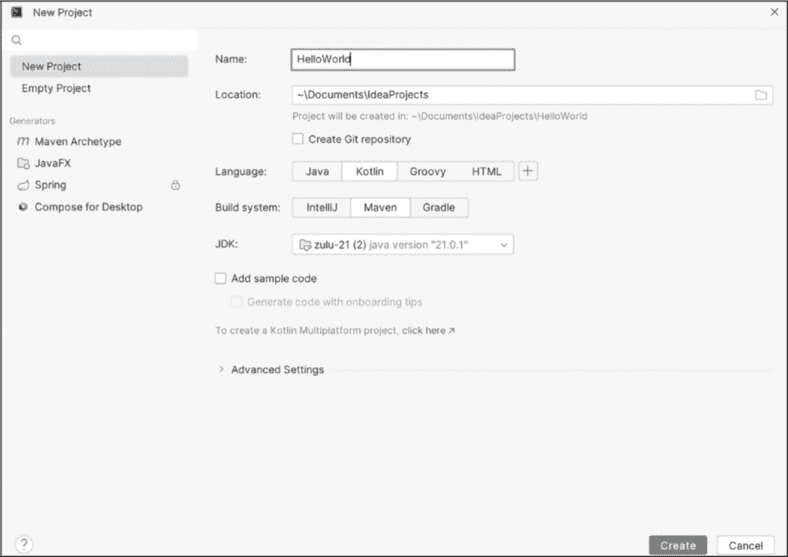
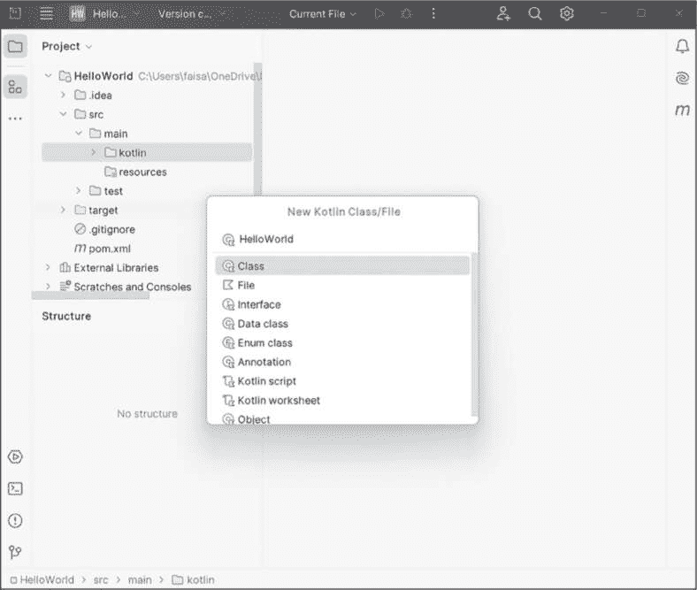
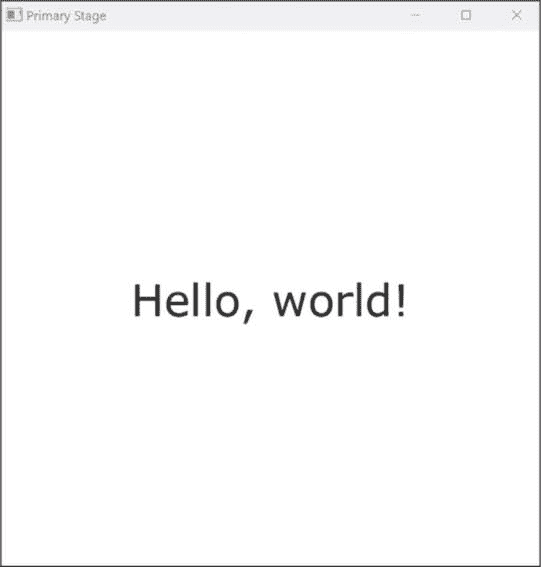
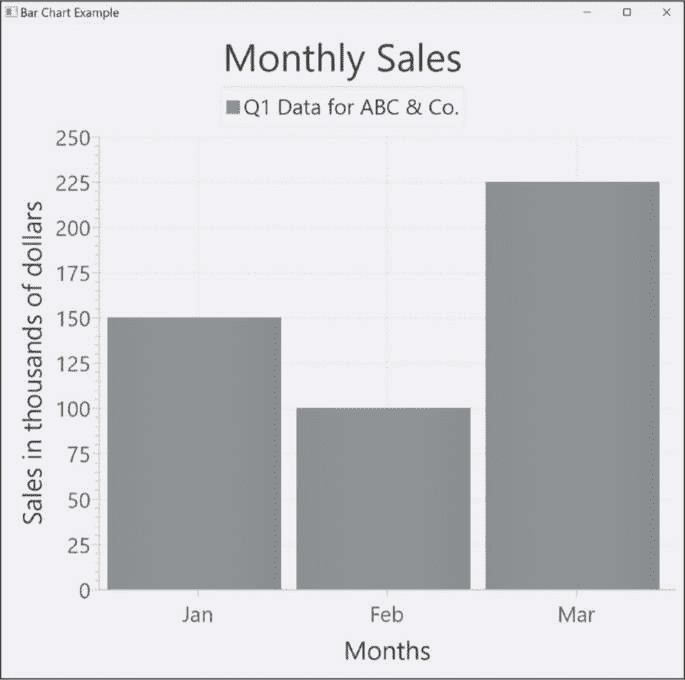
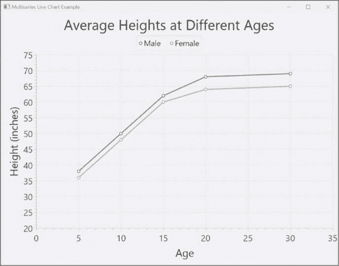
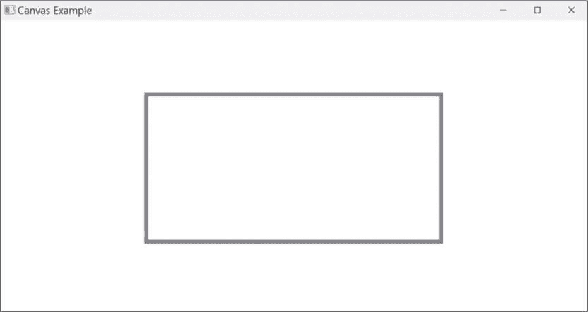
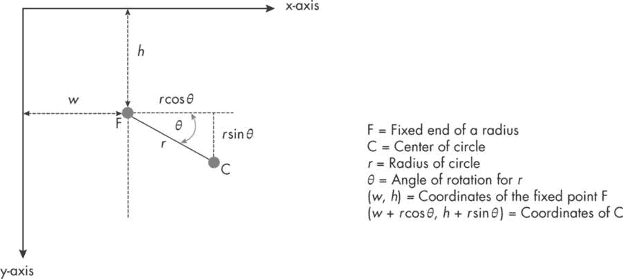
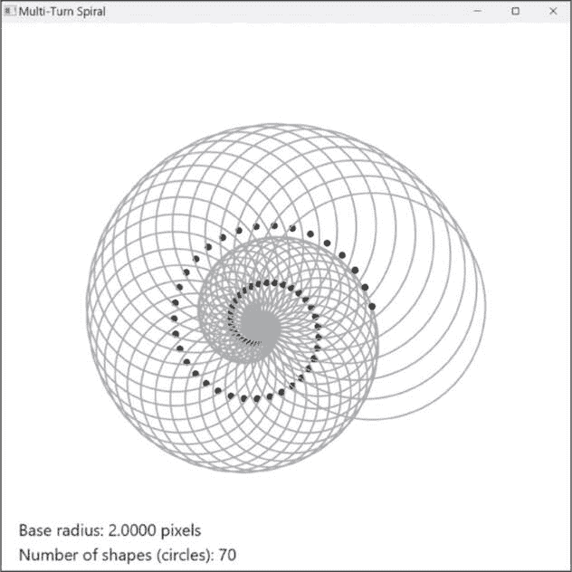
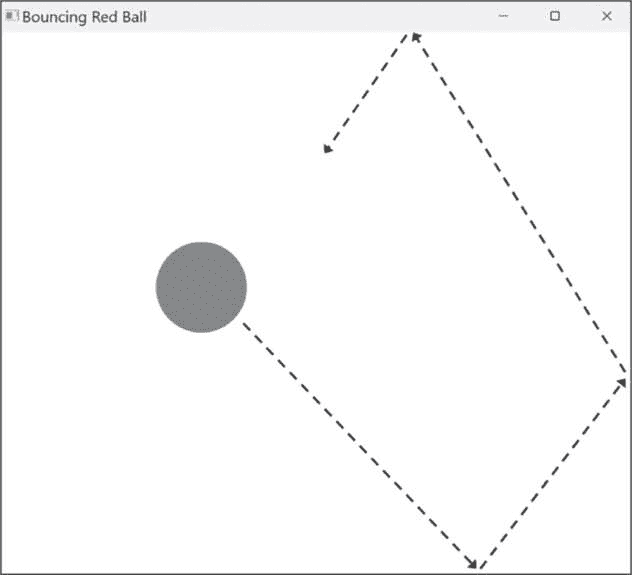

## 第三章：3 使用 JavaFX 进行可视化


数据可视化是一种将复杂数据以视觉可访问的格式呈现的艺术，使得理解更加快速和有效。通过图表、图形、地图以及其他图形化表示，数据可视化不仅简化了数据的解读，还揭示了那些可能被忽视的模式、趋势和洞察。

通过将原始数据转化为有意义和可操作的知识，可视化在各个领域的决策过程中起着至关重要的作用，例如商业分析和科学研究。数据可视化的另一个方面是创建和展示复杂的物体和图案，通常在仿真或优化过程中结合动态或移动元素。

在本章中，我们将探索使用 Kotlin 代码创建数据可视化和其他输出内容。我们将重点介绍 JavaFX 库，它使我们能够构建标准图表、自由形式的图形甚至动画。本章中涵盖的编程模式将在后续章节中起到重要作用，特别是在我们处理更复杂的可视化组件项目时。

### Kotlin 的数据可视化工具

有许多数据可视化工具（包括商业和免费的）可在 Kotlin 上的 JVM 上运行。这些工具使得创建交互式图表和图形成为可能，在某些情况下，还可以进行自由形式的绘图和创建功能齐全的用户界面（UI）。它们提供了多种功能和定制选项，以满足你的需求。以下是一些可用的可视化工具概述：

**Lets-Plot**

一个多平台的 Kotlin 绘图库，可用于创建交互式图表和图形。它主要用于在 Jupyter Notebook 中访问图形功能，这是一种支持创建和共享包含实时代码、叙述文本和可视化内容的文档的 Web 应用程序。你可以通过预定义语法的应用程序编程接口（API）调用来访问 Lets-Plot 的图形库。Lets-Plot 没有类似 Python 中 Tkinter 或 JavaFX 中 Canvas 类的自由绘图工具。

**Plotly**

另一个用于为 Kotlin 应用程序创建交互式图表和图形的工具。Plotly 可以在多种平台上运行，包括 JVM、JavaScript 和 Python。Plotly 用户友好，提供简单的 API，并且具有许多自定义选项。与 Lets-Plot 相似，它缺少自由绘图工具。

**Jetpack Compose**

一个现代的 UI 工具包，用于构建本地 Android、桌面和 Web 应用程序，使用单一代码库。尽管 Jetpack Compose 不支持内置图表功能，但可以通过第三方库来创建交互式图表和图形。Jetpack Compose 提供了一个画布 API，可用于绘制自定义图形和形状。

**JavaFX**

一个开源框架，允许你使用 Java 创建桌面、移动和嵌入式系统的应用程序。它是许多个人和公司共同努力的结果，旨在提供一个现代化、高效且功能齐全的工具包，用于开发丰富的客户端应用程序。你可以使用 JavaFX 创建用户界面和互动可视化，以及各种图表，如折线图、柱状图、饼图和散点图。由于与 Java 的兼容性，JavaFX 也能与 Kotlin 很好地配合使用。

在本书中，我们将使用 JavaFX 作为图形库。之所以选择它，是因为它是一个成熟且功能丰富的库，文档完善，并且能够与 Java 和 Kotlin 应用程序无缝集成。最重要的是，它内置了图表和自由绘图的功能，包括对显示屏的像素级操作。这些功能将在本书后面我们将要进行的一些项目中派上用场。

### JavaFX 概述

JavaFX 首次由 Sun Microsystems 于 2007 年推出，作为老旧的 Java Swing 框架的现代替代品。它标志着 Java 在创建图形用户界面和多媒体丰富应用程序方面的重要进步。最初，JavaFX 作为 Java 开发工具包（JDK）的一部分发布。然而，收购了 JavaFX 的公司 Oracle 在 2018 年宣布，JavaFX 将开源并移至 OpenFX 项目。同年，JavaFX 11 作为独立框架发布，脱离了 JDK。

JavaFX 多年来不断发展，得益于开发者的众多更新和改进。它作为一个开源项目在 OpenJFX 社区的支持下蓬勃发展，并作为标准库包含在许多 Java 发行版中。

#### 关键功能

JavaFX 是一个综合性的工具包，用于构建跨平台应用程序。虽然本章重点介绍其图表和绘图功能，JavaFX 还提供许多其他功能，你可以在项目中使用。以下是其关键功能的快速概览：

**用户界面开发**

JavaFX 使开发者能够简化并增强桌面、网页和移动应用程序中视觉丰富且互动性强的用户界面的开发。它提供了各种 UI 控件、布局和样式，使得创建视觉吸引且高度可定制的界面成为可能。

**跨平台兼容性**

JavaFX 旨在创建能够在多个平台上运行的应用程序，包括 Windows、macOS、Linux 和移动设备，而无需做重大修改。这种跨平台的兼容性减少了开发工作量，并允许更广泛的应用分发。

**图表与数据可视化**

JavaFX 内置支持创建各种图表和图形，使其成为数据可视化应用程序的首选。

**3D 图形**

JavaFX 提供了多功能的 3D 图形能力，适用于开发需要 3D 可视化的数学和科学应用程序。

**丰富的媒体支持**

JavaFX 以其强大的多媒体支持而闻名，使其适用于需要视频、音频、动画以及 2D 或 3D 图形的应用程序。

**高性能**

JavaFX 提供了硬件加速和优化，提升了渲染性能，适用于对流畅动画和响应式界面有较高需求的应用程序。

**与 Java 和 Kotlin 的集成**

JavaFX 与 Java 编程语言无缝集成，利用了 Java 的稳健性、安全性和生态系统。由于 Kotlin 与 Java 完全互操作，JavaFX 成为开发 Kotlin 桌面和基于 Web 的应用程序的自然选择。

有关 JavaFX 特性的更多信息，请参见项目网站 [`openjfx.io`](https://openjfx.io)。

#### 设置

如果你按照附录中描述的步骤安装了 IntelliJ IDEA 和 Azul Zulu JDK，那么你已经可以开始使用 JavaFX 和 Kotlin 了。你可以像在 IDE 中访问 Kotlin 特性一样访问 JavaFX 特性。尽管 Kotlin 的支持已集成在 IDE 本身中，但访问 JavaFX 是通过已安装的 JDK 实现的。

如果你没有按照附录中的说明操作，我建议使用预装 JavaFX 的 JDK，这样你就可以避免需要将库链接到代码中的额外步骤。例如，Azul JDK FX 和 Liberica Full JDK 是集成了 JavaFX 支持的知名发行版。或者，你可以从 OpenJFX 网站单独下载并安装 JavaFX。网站上提供了如何为各种操作系统（如 Windows、macOS 和 Linux）设置 JavaFX 的详细说明，包括如何在 IDE 中访问 JavaFX。

一旦 Kotlin 和 JavaFX 都可以从 IDE 访问，你就可以专注于在 Kotlin 中创建新的 JavaFX 应用程序。这个过程与创建常规 Kotlin 程序类似，不同之处在于你需要添加一些模板化的 JavaFX 代码，我将在接下来的部分详细解释。

项目 3：在 JavaFX 中构建“Hello, World！”

在本项目中，我将引导你通过使用 JavaFX 和 Kotlin 构建一个简单的“Hello, world!”应用程序的过程。这将作为构建其他利用 JavaFX 图表和可视化功能的应用程序的基础。首先，按照以下步骤从头开始创建一个启用 JavaFX 的新应用程序：

1. 打开 IntelliJ IDEA，创建一个新的 Kotlin 项目，路径为**文件****新建****项目**。你将进入项目设置窗口，如图 3-1 所示。



图 3-1：基于 JavaFX 的 Kotlin 项目的配置选项

将项目命名为 HelloWorld，并注意其存放位置。然后选择 **Kotlin** 作为语言，选择 **Maven** 作为构建系统，并选择包含 JavaFX 集成支持的 JDK。（如果您按照附录中的说明操作，那么应该选择最新的长期支持版本的 Azul Zulu JDK FX。）对于本书中所有基于 JavaFX 的项目，我们将使用这些相同的设置（除了项目名称），因为这些设置省去了额外步骤，比如手动将独立的 JavaFX 库链接到项目中。

> 注意

*您可能会注意到，IntelliJ IDEA 的左侧面板有一个选项，可以自动生成一个新的 JavaFX 项目，并带有一个默认的“Hello!”窗口。这个预配置的设置包含了一些对于每个项目可能并不必要的对象和文件，因此我建议从头创建一个项目，并仅包含所需的代码和对象，正如这里所述。*

点击 **Create** 创建具有正确配置的新项目。

在 IDE 左侧的项目面板中，通过依次展开项目树中的**HelloWorld****src****main****kotlin**来查看项目。

右键单击 kotlin 文件夹，选择 **New****Kotlin Class/File**。然后选择 **File** 并输入 **HelloWorld** 作为 Kotlin 文件的名称。（对于其他项目，您可以选择任何有意义的名称。）请注意，是否包括文件扩展名 .kt 是可选的。在这个阶段，项目屏幕应该像 图 3-2 一样。



图 3-2：为 JavaFX 应用程序创建 Kotlin 文件

一旦输入了 Kotlin 文件名，按下 ENTER 键以创建文件，同时这也会带您进入代码编辑窗口。

到这里，我们已经准备好开始编写基本的 JavaFX 应用程序了。对于更复杂的项目，您可能需要创建额外的类或文件。您可以使用这里介绍的相同方法进行操作。

#### 代码

任何 JavaFX 项目的核心是 Application 类，这是 JavaFX 内置的一个抽象类，它提供了管理图形应用程序的框架。它包含一个抽象的 start() 方法，作为应用程序的入口点，就像 console 程序的 main() 函数是入口点一样。该项目必须包含一个新的类——在本例中我们称之为 HelloWorld——它继承自 Application 类并重写 start() 方法。在重写的方法中，您将编写设置和配置图形窗口以进行数据可视化以及应用程序其他方面的代码。项目还需要一个单独的 main() 函数，但该函数的唯一目的是调用 Application 类内置的 launch() 方法，该方法启动 JavaFX 应用程序并调用 start() 方法。

记住这一点后，下面是用于创建一个简单图形应用程序的代码，该程序会向用户显示“Hello, world!”信息：

```
import javafx.application.Application
import javafx.geometry.Pos
import javafx.stage.Stage
import javafx.scene.Scene
import javafx.scene.layout.VBox
import javafx.scene.text.Font
import javafx.scene.text.Text

class HelloWorld : Application() {
  ❶ override fun start(primaryStage: Stage) {
        primaryStage.title = "Primary Stage"
        val text = Text("Hello, world!")
        text.font = Font.font("Verdana", 20.0)

        val vbx = VBox(text)
        vbx.alignment = Pos.CENTER
        val scene = Scene(vbx, 300.0, 300.0)
        primaryStage.scene = scene
        primaryStage.show()
    }
}

fun main() {
  ❷ Application.launch(HelloWorld::class.java)
}
```

我们首先导入了几个 JavaFX 类，包括 Application、Pos、Stage、Scene、VBox、Font 和 Text。这些是创建和管理“Hello, world！”应用程序的图形元素所必需的。任何 JavaFX 应用程序都会以这样的长导入块开始，尽管具体内容会根据应用程序的功能有所不同。

接下来，我们声明 HelloWorld 类继承自 Application 类，正如前面提到的，这是 JavaFX 应用程序中的标准做法。在类内部，我们重写了 start()方法 ❶，以定义程序启动时执行的应用程序入口点。start()方法接受一个名为 primaryStage 的参数，它是 JavaFX Stage 类的一个对象，代表应用程序的主要视图窗口。在该方法内，我们执行以下操作：

+   使用 primaryStage.title 将应用程序窗口的标题设置为“Primary Stage”。

+   创建一个名为 text 的 Text 对象，包含消息“Hello, world！”，并使用 Verdana 字体，大小为 20.0。

+   创建一个名为 vbx 的 VBox 对象，并将 text 对象添加到其中。在 JavaFX 中，VBox 是一个布局容器，将其内容（在此案例中为文本）垂直排列。我们将其对齐属性设置为 Pos.CENTER，以确保文本将在窗口中居中显示。

+   创建一个名为 scene 的 Scene 对象，并将 vbx 附加到其上，大小为 300.0×300.0 像素。（由于它们是 Double 类型，因此必须以浮动点格式给出尺寸。）

+   将 Scene 对象分配给 primaryStage 参数的 scene 属性，从而将场景添加到视图窗口中。

+   调用 primaryStage 对象的 show()方法来显示 JavaFX 应用程序窗口。

我们将稍后更详细地讨论这些 JavaFX 构件的重要性。

程序的最后一部分是 main()函数，它只有一行代码 ❷。如前所述，它的唯一目的是调用 Application 类的 launch()方法，该方法激活 HelloWorld 应用程序的 start()方法。launch()方法中的参数 HelloWorld::class.java 指定了对应于 HelloWorld Kotlin 类的 Java 类，作为 JavaFX 应用程序的入口点。

#### 结果

尝试在 IntelliJ IDEA 中运行该应用程序。输出窗口如图图 3-3 所示，应弹出。



图 3-3：Kotlin 和 JavaFX 中的最小“Hello, world！”应用程序

让我们来重点关注一下这个输出中的几个细节。首先，窗口有一个标题“Primary Stage”，这是 primaryStage 的标题属性所设置的内容。其次，文本“Hello, world!”整齐地居中显示在窗口内。这是通过设置 vbx 的对齐属性为 Pos.CENTER 来实现的，这样它的内容就会在其边界内居中对齐。第三，窗口的初始大小是通过指定场景的宽度和高度来设置的。然而，你可以通过拖动任何边界来改变窗口的大小。最后，只要显示窗口打开，应用程序就会在后台继续运行。一旦你关闭窗口，应用程序会正常终止。

这段代码将成为我们所有基于 JavaFX 的应用程序的基础模板，只需做少量修改。例如，你将用 LineChart 或 Canvas 对象替换 Text 对象，以分别适应创建图表或自由形式绘图的代码。JavaFX 是一个功能丰富的框架，我强烈建议你查看本章末尾列出的资源，全面了解其核心组件及其关系。目前，我将简要概述我们即将在即将到来的 JavaFX 项目中使用的关键特性。 ### JavaFX 对象层次结构

JavaFX 使用对象层次结构来表示 GUI 的结构以及构成视觉显示的元素。在这个层次结构的最上层是 Stage，它作为应用程序的主要窗口。Stage 是一个包含一个或多个 Scene 对象的容器，每个 Scene 是包含各种图形元素的容器，包括其他布局容器、控件和形状。所有这些组件都被视为 JavaFX 对象层次结构中的*节点*。

我们已经在“Hello, world!”应用程序中使用了这些对象中的几个。现在，让我们更仔细地看看它们是什么以及它们如何相互关联。理解和操作 JavaFX 的对象层次结构对于创建视觉吸引力强且互动性强的应用程序至关重要。

#### Stage

Stage 是 JavaFX 应用程序中的顶级容器。它代表应用程序窗口，包含标题栏、边框以及任何本地操作系统级别的组件。Stage 作为创建图形窗口的主要对象。你可以创建一个 Stage，并设置其属性，例如窗口标题和尺寸：

```
val myStage = Stage()
myStage.title  = "This is a secondary window"
myStage.width  = 800.0 // in pixels
myStage.height = 600.0 // in pixels
```

在 JavaFX 应用程序中，至少需要一个 Stage 对象。这个主要的 Stage 在你重写 start() 方法时创建。然而，在这个例子中，我们显式地创建了一个额外的 Stage 对象，它将在我们的应用程序中作为第二个图形窗口出现。我们通过调用 Stage() 构造函数并将其分配给一个新的类成员 myStage 来实现这一点。

#### 场景

Scene 表示 Stage 中一个单独的、独立的 GUI 组件。它充当特定部分应用程序中所有可见元素的容器，例如主菜单、设置界面或游戏关卡。通常，Scene 的根节点设置为*布局容器*，如 Group、Pane、VBox 或 HBox 对象，这些布局容器又包含其他节点，如按钮、标签或形状。下面是一个创建 Scene 并同时设置其根节点的示例：

```
val root = Group()
val scene = Scene(root, 800.0, 600.0)
```

我们将 root 作为第一个参数传递给 Scene 构造函数。这与我们在“Hello, world!”应用程序的 Scene 对象中将 VBox 作为根节点的做法相对应。

#### 布局容器

布局容器如 Group 和 VBox 通常作为 Scene 的根节点或父节点。它们用于定位和调整应用程序窗口中显示的其他*子节点*的大小。通过这种方式，布局容器对 JavaFX 用户界面的结构和布局设计至关重要。在接下来的项目中，我们将使用这些容器中的一些，因此值得仔细了解它们的属性，看看哪种最适合不同的应用程序。有时多种类型都可以同样适用。

##### Group

Group 是一种将其他节点组合在一起的容器，但不提供任何布局功能。当你希望对一组形状应用变换或效果时，这非常有用。例如，你可以将多个形状组合在一起并对整个组应用旋转或缩放效果。

##### Pane

Pane 是一种布局容器，作为组织和定位用户界面节点的构建模块。它并不专门用于某种特定布局，这使得它成为多种 UI 设计场景的通用选择。JavaFX 提供了多个 Pane 的子类，你可以根据应用程序的需求选择使用。以下是一些子类：

FlowPane 一种以流动方式排列节点的容器，当容器的边界达到时会自动换行。默认情况下，FlowPane 是水平的，这意味着它按行排列节点，从左边界开始。当右边界到达时，节点会换行（移动到）下一行。

StackPane 一种将节点堆叠在彼此之上的容器，导致一个节点覆盖另一个节点。这使得元素可以进行创造性的层叠。所有子节点会在可用空间内自动居中显示，既水平居中也垂直居中。

BorderPane 一种用于以结构化方式定位节点的容器，分为顶部、底部、左侧、右侧和中央位置。

AnchorPane 类似于 BorderPane，但它允许节点附加到面板的顶部、底部、左侧和右侧边缘。

GridPane 一种用于将节点排列成行和列网格的容器。

面板是 JavaFX 应用程序中的核心组件，因为它们为用户界面提供布局和结构。通过使用面板，你可以创建灵活且响应式的 UI，能够适应不同的屏幕尺寸和分辨率。

##### VBox 和 HBox

VBox 和 HBox 是用于整理其子节点的布局容器。VBox 将其子节点按垂直列排列，而 HBox 将其子节点水平排列成一行。

#### 子节点

子节点是 JavaFX 应用程序的基本构建块。它们代表特定的视觉元素，包括形状（例如矩形或圆形）、图像、文本以及交互控件，如按钮或文本框。我们接下来将创建的各种图表对象也被视为 JavaFX 中的节点。通过在应用程序的对象层次结构中添加、删除和修改节点，你可以设计出直观且富有吸引力的用户界面。

你可以将子节点添加到父节点，如 Group、Pane、VBox 或 HBox，以创建复杂的 UI 组件层次结构。以下是一个示例：

```
// Create a rectangle object (child node).
val rectangle = Rectangle(100.0, 100.0, Color.BLUE)

// Pass the child node to its parent node.
val root = Group(rectangle)
```

我们创建一个大小为 100×100 像素的蓝色矩形对象。然后我们将该矩形作为一个名为 root 的 Group 对象的子节点。在这种情况下，我们通过将矩形作为参数传递给父节点的构造函数来分配子节点，但子节点不一定要在父节点创建时立即分配。你也可以稍后使用 children.add()方法将子节点添加到父节点：

```
// Create a Button object with the text "Click me".
val button = Button("Click me")

// Create a Pane object.
val pane = Pane()

// Add the Button as a child node to the Pane.
pane.children.add(button)
```

在这个例子中，我们创建了一个 Button 对象（button）和一个 Pane 对象（pane）。然后我们使用 children.add()方法将按钮作为 pane 的子节点添加。这个方法接受一个单一的节点作为参数，并将其附加到 pane 的子节点列表中。我们也可以使用 children.addAll()方法将多个子节点添加或传递给 pane。

### 创建 JavaFX 图表

JavaFX 提供了一组内置功能，用于创建视觉效果吸引人的图表。你可以将数据集输入图表进行可视化，并通过更改颜色、字体和其他属性来自定义结果。以下是使用 JavaFX 和 Kotlin 创建图表的基本步骤：

1. 创建表示图表 x 轴和 y 轴的对象。这些对象可以是两种类型：NumberAxis 和 CategoryAxis。前者用于可视化数值数据，后者用于字符串类型的数据。

2. 创建一个表示你想要设计的图表类型的类的实例，例如 LineChart、BarChart、ScatterChart、PieChart 或 BubbleChart。将步骤 1 中创建的对象作为参数传递给图表的构造函数。

3. 创建一个或多个 Series 对象来表示你想在图表中显示的数据系列。

4. 使用 data.add()方法为每个数据系列添加数据点，添加单个数据点，或者使用 data.addAll()方法一次性添加多个数据点。

5. 使用 data.add()方法将每个数据系列添加到图表中。

6. 创建一个新的 Scene 对象并将图表添加到其中。虽然你可以直接将图表对象作为场景的根节点，但你可能希望先将图表作为布局容器的子元素，然后将该容器设置为场景的根节点。这样，你可以更好地控制结果。

7. 将 Scene 分配给应该显示图表的 Stage 对象。别忘了使用 show() 方法来显示 Stage！

这些步骤是通用的，可以用来创建 JavaFX 中任何类型的图表。接下来，我们将查看两个代表性的示例，展示如何使用实际数据创建不同类型的图表对象：一个柱状图和一个折线图。

项目 4：将数据可视化为柱状图

在这个项目中，我们将生成一个柱状图，以可视化一个名为 ABC & Co. 的虚构公司的第一季度每月销售数据。图表将在 x 轴上显示 1 月到 3 月的月份，y 轴上则以垂直条形图表示每个月的销售总额。代码将遵循我们为简单的“Hello, world!”应用程序所使用的相同大纲，并进行修改以实现我们讨论过的绘图步骤。

#### 代码

以下是创建柱状图的代码：

```
import javafx.application.Application
import javafx.geometry.Side
import javafx.scene.Scene
import javafx.scene.chart.CategoryAxis
import javafx.scene.chart.BarChart
import javafx.scene.chart.NumberAxis
import javafx.scene.chart.XYChart
import javafx.stage.Stage

class BarChartExample : Application() {
    override fun start(primaryStage: Stage) {
      ❶ primaryStage.title = "Bar Chart Example"

      ❷ // Create XYAxis objects and set their properties.
        val xAxis = CategoryAxis()
        val yAxis = NumberAxis()
        xAxis.label = "Months"
        yAxis.label = "Sales in thousands of dollars"

      ❸ // Create BarChart object and set its properties.
        val barChart = BarChart(xAxis, yAxis)
        barChart.title = "Monthly Sales"
        barChart.legendSide = Side.TOP

      ❹ // Create Series, populate with data, and assign to chart.
        val dataSeries = XYChart.Series<String, Number>()
        dataSeries.name = "Q1 Data for ABC & Co."
      ❺ getData(dataSeries)
        barChart.data.add(dataSeries)

        val scene = Scene(barChart, 400.0, 400.0)
        primaryStage.scene = scene
        primaryStage.show()
    }
}

fun main() {
    Application.launch(BarChartExample::class.java)
}
```

我们首先导入必要的 JavaFX 类。除了任何 JavaFX 应用程序中常见的通用 Application、Scene 和 Stage 类外，我们还导入了一些特定于图表的类，例如 Side、CategoryAxis、BarChart、NumberAxis 和 XYChart。在导入代码块后，我们声明了 BarChartExample 类，它再次继承了 JavaFX 的抽象 Application 类。与“Hello, world!”应用程序类似，我们用自定义定义重写了 start() 方法。这次我们使用该方法来创建一个柱状图。

start() 方法分为几个模块。第一模块中，我们将 primaryStage（传递给 start() 方法的 Stage 对象）的标题设置为“Bar Chart Example”❶。在第二模块❷中，我们创建了两个对象，分别表示图表的 x 轴和 y 轴。我们使用 CategoryAxis 类表示 x 轴，其中的数据点是年份的月份（字符串），而使用 NumberAxis 类表示 y 轴，其中的数据点是销售总额（数字）。我们还使用每个轴对象的 label 属性为轴添加描述标签。在第三模块❸中，我们创建了 BarChart 对象，并将 xAxis 和 yAxis 对象作为参数传递给它。我们还为图表指定了标题，并将其图例位置设置在图表的顶部。图例解释了用于可视化数据的颜色或图案的意义。

在第四个代码块 ❹ 中，我们创建了一个名为 dataSeries 的 XYChart.Series 类型的系列。该系列的每个数据点将由一对 <String, Number> 类型的元素组成，表示月份和对应的销售总额（单位为千美元）。我们为该系列设置名称；此名称将在图表的图例中显示。然后，为了使 start() 方法本身更加简洁，我们调用了一个自定义的 getData() 函数 ❺，该函数将数据点添加到系列中，之后再将系列添加到 BarChart 对象中，以便在图表上绘制数据。以下是 getData() 函数的代码：

```
fun getData(dataSeries: XYChart.Series<String, Number>) {
    dataSeries.data.addAll(
        XYChart.Data("Jan", 150),
        XYChart.Data("Feb", 100),
        XYChart.Data("Mar", 225)
    )
}
```

该函数的唯一任务是通过使用 data.addAll() 方法将数据点批量添加到 dataSeries 对象中。每个数据点都是 XYChart.Data 类的一个实例，该类将数据点的 x 轴和 y 轴值一起封装在一个容器中。特别地，每个数据点的 x 值是月份的简写，y 值是销售总额的整数。我们还可以将销售总额提供为浮动小数值；JavaFX 会将这两种形式都识别为数字。

应用程序类的其余部分是标准的 JavaFX 模板代码，几乎与我们“Hello, world!”应用程序的代码完全相同。我们构建了一个 Scene 对象，并将 barChart 作为其根节点。然后，我们将 Scene 对象分配给 primaryStage，并调用后者的 show() 方法，这样就能在屏幕上显示我们创建的条形图。

#### 结果

如果你运行这段代码，生成的条形图应该类似于图 3-4。



图 3-4：使用 JavaFX 绘制的条形图

请注意，JavaFX 如何自动为每个数据点生成具有正确高度的条形图，月份沿 x 轴均匀分布，y 轴按每 25 为单位标记刻度，直到超出图表中显示的最大值。你还可以验证图表是否正确显示了我们显式设置的属性，例如标题（“每月销售”）、x 轴和 y 轴的标签（“月份”和“销售额（千美元）”）以及图例（“ABC & Co. 的 Q1 数据”），并且图例位置正确，位于顶部。

项目 5：创建多系列折线图

在下一个项目中，我们将使用 JavaFX 创建一个折线图，显示不同年龄段男性和女性的平均身高。在折线图中，两个轴都是数值型的，并且它们的属性可以调整——例如，可以设置刻度间隔和范围。我们将在 x 轴上可视化年龄，在 y 轴上可视化身高（单位为英寸）。图表的一个关键特性是它将有两个数据集，一个用于男性，一个用于女性，每个数据集都有自己的 Series 对象。JavaFX 会自动分开绘制这两个数据集，并为每个数据集分配不同的颜色线条。 #### 代码

我们的代码将遵循与条形图相同的结构，只是修改成用两个数据系列来绘制折线图。该程序可以轻松扩展为绘制三个或更多数据系列。以下是代码：

```
import javafx.application.Application
import javafx.geometry.Side
import javafx.scene.Scene
import javafx.scene.chart.LineChart
import javafx.scene.chart.NumberAxis
import javafx.scene.chart.XYChart
import javafx.stage.Stage

class LineChartExample : Application() {
    override fun start(primaryStage: Stage) {
        primaryStage.title = "Multiseries Line Chart Example"

        // Create XYAxis objects and set their properties.
        val xAxis = NumberAxis()
        xAxis.label = "Age"
        val yAxis = NumberAxis()
        yAxis.label = "Height (inches)"

      ❶ // Adjust tick interval and lower/upper bounds.
        xAxis.isAutoRanging = false
        xAxis.tickUnit = 5.0    // custom tick interval
        xAxis.lowerBound = 0.0  // minimum value for x-axis
        xAxis.upperBound = 35.0 // maximum value for x-axis

        yAxis.isAutoRanging = false
        yAxis.lowerBound = 20.0 // minimum value for y-axis
        yAxis.upperBound = 75.0 // maximum value for y-axis

        // Create LineChart object and set its properties.
      ❷ val lineChart = LineChart(xAxis, yAxis)
        lineChart.title = "Average Heights at Different Ages"
        lineChart.legendSide = Side.TOP

        // Create Series, populate with data, and assign to chart.
        val maleData = XYChart.Series<Number, Number>()
        maleData.name = "Male"
      ❸ getMaleData(maleData)
        val femaleData = XYChart.Series<Number, Number>()
        femaleData.name = "Female"
      ❹ getFemaleData(femaleData)

      ❺ lineChart.data.addAll(maleData, femaleData)

        val scene = Scene(lineChart, 800.0, 600.0)
        primaryStage.scene = scene
        primaryStage.show()
    }
}

fun main() {
    Application.launch(LineChartExample::class.java)
}
```

我们从一个典型的 JavaFX 导入块开始，这次导入 LineChart 类而不是 BarChart。然后，我们声明一个名为 LineChartExample 的应用类，并像往常一样重写其 start() 方法。在该方法中，我们首先将 primaryStage 的标题设置为 "不同年龄段的平均身高"，创建 x 和 y 坐标轴，并设置它们的标签。我们使用 NumberAxis 类为两个坐标轴提供支持，因为年龄和身高都是数值数据。

在接下来的代码块❶中，我们进一步自定义坐标轴。对于两个坐标轴，我们通过将 isAutoRanging 属性设置为 false 来关闭自动范围功能（这对于后续更改生效是必要的）。然后，我们设置坐标轴的上下限：x 轴的年龄范围为 0.0 到 35.0，y 轴的身高范围为 20.0 到 75.0。我们还在 x 轴上设置了一个 5.0 的刻度间隔。我们让 JavaFX 自动处理所有这些设置以适应柱状图，但在这里我们进行更多的控制，以去除不必要的自动生成的空间，并更好地定位两个系列在图表窗口中的位置。特别是，JavaFX 默认对于任何数字轴（当 x 和 y 值为正数时）的下限是 0.0，这在本例中会在图表底部产生大量额外的空间，因为数据集中的最低身高是 36.0。

接下来的几个代码块与柱状图示例非常相似。我们创建一个 LineChart 对象❷，设置其标题，并设置图例的位置。然后我们创建两个 XYChart.Series 对象，maleData 和 femaleData，并调用两个辅助函数，getMaleData()❸ 和 getFemaleData()❹，以便将数据填充到系列中。以下是这些函数的定义：

```
fun getMaleData(maleData: XYChart.Series<Number, Number>) {
    maleData.data.addAll(
        XYChart.Data(5, 38.0),
        XYChart.Data(10, 50.0),
        XYChart.Data(15, 62.0),
        XYChart.Data(20, 68.0),
        XYChart.Data(30, 69.0)
    )
}

fun getFemaleData(femaleData: XYChart.Series<Number, Number>) {
    femaleData.data.addAll(
        XYChart.Data(5, 36.0),
        XYChart.Data(10, 48.0),
        XYChart.Data(15, 60.0),
        XYChart.Data(20, 64.0),
        XYChart.Data(30, 65.0)
    )
}
```

和柱状图项目类似，我们使用 data.addAll() 方法一次性将所有数据点添加到每个系列中。像之前一样，每个数据点的 x 和 y 值被打包成一个 XYChart.Data 对象。

返回主代码部分，一旦两个系列（maleData 和 femaleData）都填充完毕，我们通过使用 data.addAll() 方法❺将它们添加到 lineChart 对象中。最后，我们将 lineChart 分配给场景，并将场景分配给 primaryStage，调用 primaryStage 对象的 show() 方法来显示折线图，按照我们常规的 JavaFX 可视化显示模式。

#### 结果

图 3-5 显示了运行代码后生成的折线图。



图 3-5：使用 JavaFX 绘制的多系列折线图

折线图展示了不同年龄组男性和女性的平均身高，作为在相同的 x 和 y 轴上绘制的两个系列。JavaFX 使用图表的图例来区分两条曲线。您可以验证图表已根据我们手动设置的属性进行配置；例如，y 轴的下限为 20，x 轴的刻度标签按 5 的增量标注。

除了我们在本项目中调整的基本设置外，你还可以进行更多自定义。我将把探索其他选项的任务留给你，基于你额外的阅读和对 JavaFX 的实验。

### 使用 Canvas 绘图

在 JavaFX 中，*canvas*是一个区域，提供一个绘图表面，用于渲染自定义的 2D 图形。虽然 JavaFX 的图表功能自动处理了大部分绘图工作，但 canvas 允许你编写低级代码来绘制单独的线条、形状、文本框等。你通过实例化 Canvas 类来创建一个 canvas。然后，通过访问其*图形上下文*，将内容绘制到 canvas 上。

在本节中，我们将看一个简单的第一个 JavaFX canvas 使用示例，并探索一些常用的绘图方法。然后，我们将通过一个更复杂的绘图项目，更好地了解 canvas。

#### 一个简单的形状

让我们从使用 JavaFX Canvas 类绘制一个简单的形状开始。以下是一个绘制矩形到 canvas 的应用程序代码：

```
import javafx.application.Application
import javafx.scene.Scene
import javafx.scene.canvas.Canvas
import javafx.scene.canvas.GraphicsContext
import javafx.scene.layout.Pane
import javafx.scene.paint.Color
import javafx.stage.Stage

class CanvasExample_1 : Application() {
    override fun start(primaryStage: Stage) {
        primaryStage.title = "Canvas Example"

      ❶ val canvas = Canvas(400.0, 200.0)
      ❷ val gc = canvas.getGraphicsContext2D()
        val pane = Pane(canvas)
        val scene = Scene(pane)
        primaryStage.setScene(scene)
        primaryStage.show()

      ❸ drawRectangle(gc)
    }
    fun drawRectangle(gc: GraphicsContext) {
      ❹ with(gc) {
            stroke = Color.RED
            strokeRect(100.0, 50.0, 200.0, 100.0)
        }
    }
}

fun main() {
    Application.launch(CanvasExample_1::class.java)
}
```

在应用程序类的 start()方法中，我们创建了一个 Canvas 类的实例，大小为 400×200 像素，并命名为 canvas ❶。接着，我们调用 canvas 对象的 getGraphicsContext2D()方法，它返回一个指向 canvas 的 GraphicsContext 对象的引用，我们将其存储在 gc 变量中 ❷。这个对象提供了在 canvas 上绘图的接口。然后，我们按照常规步骤，将 canvas 分配给布局容器（一个 Pane 对象），再将容器分配给场景，最后将场景分配给主舞台，并通过 show()方法显示它。我们需要 Pane，因为 Canvas 不是父类型节点，因此不能直接传递给场景。另外，通过将 Canvas 对象作为 Pane 或 VBox 等容器的子节点，我们可以在需要时进一步自定义其位置和大小。

为了绘制矩形，我们调用一个自定义的 drawRectangle()方法 ❸，该方法接受一个参数，即图形上下文。在方法的定义中，我们使用 Kotlin 的 with 作用域函数来组合需要访问图形内容的操作，gc ❹。这避免了在每行代码前加上 gc.，在较长的绘图方法中，这非常有帮助。我们将图形上下文的描边颜色设置为红色（在计算机图形学中，*描边*是几何形状的轮廓），然后调用 JavaFX 的 strokeRect()方法绘制一个矩形。前两个参数（100.0 和 50.0）设置矩形左上角的 x 和 y 坐标，剩余的参数（200.0 和 100.0）定义其宽度和高度（单位为像素）。默认情况下，坐标系统的原点（0.0，0.0）位于 canvas 的左上角。

图 3-6 展示了运行此简单 canvas 应用程序的结果。



图 3-6：canvas 上的红色轮廓矩形（此处显示为灰色）

在这个例子中，我们在 CanvasExample_1 类中定义了 drawRectangle() 方法。或者，我们也可以将它作为独立的函数创建，类似于条形图和折线图示例中的 getData() 函数。两种方法都是有效的。当一个函数是通用的，并且可以被其他类或模块复用时，考虑将其作为独立函数。否则，将其作为类的内部方法有助于数据封装。

#### 常用图形上下文方法

图形上下文是与任何画布相关联的一个重要工具，它使你能够在 JavaFX 中设计 2D 图形。在开始更高级的涉及画布的项目之前，让我们先考虑一下 GraphicsContext 类的一些关键功能和能力，以及如何在 Kotlin 中应用它们。为了方便参考，最常用的功能列在 表 3-1 中。

表 3-1：常用图形上下文方法

| 特性 | 描述 | Kotlin 中的用法 |
| --- | --- | --- |
| 绘制图形 | 绘制各种 2D 图形，如线条、矩形、圆形和多边形。 | gc.strokeRect(x, y, width, height) gc.fillOval(x, y, radiusX, radiusY) gc.fillPolygon(x-array, y-array, n) |
| 设置颜色 | 设置形状的描边（轮廓）和填充颜色。 | gc.stroke = Color.RED gc.fill = Color.BLUE |
| 线条宽度 | 设置线条宽度和线条样式。 | gc.lineWidth = 2.0 gc.setLineDashes(dash, gap) |
| 文本渲染 | 用指定的字体和大小在画布上绘制文本。 | gc.font = Font("Arial", 14.0) gc.fillText("Hello, world!", x, y) |
| 图像渲染 | 在画布上绘制图像。 | val image = Image("image.png") gc.drawImage(image, x, y) |
| 变换 | 平移（通过指定的 x 和 y 值移动坐标系统的原点）和旋转（通过指定角度旋转后续的绘图）。 | gc.translate(x, y) gc.rotate(angle) |
| 清空画布 | 清空整个画布或特定区域。 | gc.clearRect(0.0, 0.0, canvas.width, canvas.height) gc.clearRect(x, y, width, height) |

表 3-1 显示了图形上下文提供的丰富功能。例如，我们可以用不同的颜色绘制和填充几何图形，如矩形和椭圆。我们还可以调整线条的宽度和样式。对于文本的渲染，我们也有许多选择。除了图形，我们还可以使用各种格式的图像（例如 JPG、PNG 或 GIF），并将它们创意性地放置在画布上。此外，我们可以移动坐标系统的原点，并旋转画布上的对象，改变它们相对于当前坐标系统的方向。最后，我们可以清空整个画布，为动态仿真提供一个全新的起点。

在本章接下来的项目以及本书的其他地方，我们将使用这些功能，并更详细地了解它们是如何工作的。

项目 6：绘制螺旋贝壳

在这个项目中，我们将深入探讨 JavaFX 画布的绘图功能及其 2D 图形上下文。我们将创建一个复杂的图形，包含多个逐渐增大的圆圈，围绕画布中心按螺旋形排列。通过改变关键参数，我们可以产生不同的视觉效果。在这里，我们将利用这些参数绘制一个类似海螺的图形，其具有螺旋生长的模式。

#### 策略

在深入了解代码之前，我们先来规划生成螺旋图案的策略。螺旋看起来像一个圆，但有一个重要区别：它的前端永远不会返回到原点。相反，它会不断远离中心，同时围绕初始起点旋转。为了在数学上实现这一点，我们将采用一个由一系列直线构成的方法，如图 3-7 所示。



图 3-7：制作螺旋图案的策略

每条线的一端固定在一个特定点 F，我们将其设置为画布的中心。另一端的位置 C 由两个关键因素决定：线段的长度 *r* 和相对于正 x 轴的旋转角度 *θ*（或其他固定参考）。给定 *r* 和 *θ* 的值后，我们可以利用基础的三角学来计算点 C 的坐标。通过逐渐增加旋转角度和线段长度，C 的连续值将形成一个螺旋图案，同时这些点既围绕着固定点 F 转动，又越来越远离它。我们将重复这一过程，直到螺旋完成所需的圈数（一圈等于 360 度）。

为了创建螺旋图案，我们将每个点 C 视为一个半径为 *r* 的圆的圆心。这些圆会逐渐变大，并随着我们不断重复过程，离起始点越来越远。

#### 代码

下面是用于绘制海螺螺旋的代码的一般结构：

```
import javafx.application.Application
import javafx.scene.Scene
import javafx.scene.canvas.Canvas
import javafx.scene.canvas.GraphicsContext
import javafx.scene.layout.Pane
import javafx.scene.paint.Color
import javafx.stage.Stage

import kotlin.math.cos
import kotlin.math.sin

class MultiTurnSpiral : Application() {
    override fun start(primaryStage: Stage) {
        primaryStage.title = "Multi-Turn Spiral"

        // Create a canvas and set its graphics context.
        val canvas = Canvas(600.0, 600.0)
        val gc = canvas.graphicsContext2D

      ❶ primaryStage.scene = Scene(Pane(canvas))
        primaryStage.show()

        // Call helper function to draw the spiral.
        drawMultiTurnSpiral(gc, canvas.width, canvas.height)
    }

    fun drawMultiTurnSpiral(
        gc: GraphicsContext,
        width: Double, height: Double) {
        `--snip--`
    }

    fun printParams(
        gc: GraphicsContext,
 radiusStep: Double, numCircles: Int) {
        `--snip--`
    }

    fun drawCircle(
        gc: GraphicsContext,
        x: Double, y: Double, radius: Double) {
        `--snip--`
    }
}

fun main() {
    Application.launch(MultiTurnSpiral::class.java)
}
```

我们首先导入所需的图形相关类，以及 Kotlin 数学库中的 cos() 和 sin() 三角函数。然后，我们声明 MultiTurnSpiral 应用类。与矩形示例类似，我们首先创建并设置图形元素，然后调用一个自定义方法——在这里是 drawMultiTurnSpiral()——来协调实际的绘制过程。这种方式使得重写的 start() 方法更加简洁。注意，我们通过将 primaryStage 对象的 scene 属性设置为 Scene(Pane(canvas)) ❶ 来简化 JavaFX 节点的创建。像这样的嵌套赋值可以帮助我们减少几行代码，特别是在中间对象不需要用于其他目的时。

除了 start()方法，应用程序类还包含三个方法，这些方法共同定义并渲染螺旋图案。它们中，drawMultiTurnSpiral()是主要方法，而其他两个方法 printParams()和 drawCircle()是辅助方法。我们将详细查看这些方法，首先从 drawMultiTurnSpiral()开始。

```
fun drawMultiTurnSpiral(
          gc: GraphicsContext,
          width: Double, height: Double) {

  ❶ // Set key parameters for the spiral.
    val numCircles = 70  // number of circles
    val turns = 2.0      // 360 degrees per turn
    val maxAngle = 360.0 * turns
    // rotation in degrees per step
    val rotationStep = (maxAngle / numCircles)

    // Ensure the circles stay inside the canvas boundaries.
    val maxRadius = minOf(width, height) / 10.0
    // Set the amplification factor.
    val spacingFactor = 2.0
    val radiusStep = (maxRadius / numCircles) * spacingFactor

  ❷ printParams(gc, radiusStep, numCircles)

  ❸ for (i in 0..< numCircles) {
        val angle = i * rotationStep
        val radius = i * radiusStep

 val x = (width / 2.0) + radius * cos(Math.toRadians(angle))
        val y = (height / 2.0) + radius * sin(Math.toRadians(angle))

        // Draw circles with increasing radii.
      ❹ drawCircle(gc, x, y, radius)
    }
}
```

drawMultiTurnSpiral()方法接受三个参数：gc、width 和 height，分别表示图形上下文以及画布的宽度和高度。我们首先设置一些螺旋的关键参数❶。numCircles 变量设置了我们将绘制的圆圈数，而 turns 决定了我们围绕螺旋中心旋转的圈数。将 turns 乘以 360 得出我们将达到的最大旋转角度，再将该值除以 numCircles 得出 rotationStep，即每绘制一个圆圈时的旋转量。类似地，我们将 maxRadius（最大圆圈的半径）设置为画布宽度或高度的十分之一（取较小者），然后将其除以 numCircles，再将结果乘以 spacingFactor 得到 radiusStep，即每个圆圈半径之间的增长量。将宽度和高度的较小值除以 10 可以为我们提供一些空间，调整 spacingFactor 可以通过调整圆圈之间的距离来更好地利用这些空间。我使用了 spacingFactor 为 2 来创建一个视觉上令人愉悦的图案，但你可以自由尝试不同的值，了解它们如何影响最终的图形。

设置好这些参数后，我们调用 printParams()方法❷，它将一些关键的参数值打印到画布上。（稍后我们将详细介绍这个方法。）接着，我们使用 for 循环❸遍历所需的圆圈数量，并将它们绘制到画布上。对于每个圆圈，我们将循环变量 i 乘以 rotationStep 来计算相对于正 x 轴的当前旋转角度，再将 i 乘以 radiusStep 来获取圆圈的半径。然后，我们使用三角函数计算圆心的坐标（x，y），将画布中心作为螺旋中心的固定点。（有关这些计算的推导，请参见图 3-7。）注意，cos()和 sin()函数期望的是弧度而非角度，因此我们在角度上调用 toRadians()。最后，我们将圆圈的参数传递给自定义的 drawCircle()方法以实际绘制圆圈，包括其圆心❹。

现在让我们看一下两个辅助方法的定义，printParams()和 drawCircle()：

```
fun printParams(gc: GraphicsContext, radiusStep: Double, numCircles: Int) {

    val msg1 = "Base radius: " + "%.4f".format(radiusStep) + " pixels"
    val msg2 = "Number of shapes (circles): $numCircles"
    gc.fillText(msg1, 25.0, 555.0)
    gc.fillText(msg2, 25.0, 575.0)
}

fun drawCircle(
        gc: GraphicsContext,
        x: Double, y: Double, radius: Double) {

 ❶ // Set draw parameters.
    val topLeftX = x - radius
    val topLeftY = y - radius
    val pointSize = 8.0

    with (gc) {
        lineWidth = 2.0
        stroke = Color.LIGHTBLUE
        fill = Color.RED
      ❷ fillOval(x – pointSize / 2, y - pointSize / 2,
                 pointSize, pointSize)
      ❸ strokeOval(topLeftX, topLeftY, radius * 2, radius * 2)
    }
}
```

printParams()方法接受图形上下文和螺旋的两个关键参数：半径步长和圆圈的数量。我们使用这些参数在 msg1 和 msg2 变量中创建两个字符串模板。在 msg1 中，我们将半径步长 radiusStep（一个浮动的小数）格式化为四位小数。在 msg2 中，圆圈的数量 numCircles 是整数，因此不需要格式化。然后，我们将消息传递给 gc.fillText()方法，该方法会在画布的指定位置显示文本（我们使用的是接近左下角的坐标）。这个方法为 println()函数提供了一个有价值的替代方案，因为 println()只能在控制台显示文本。通过 fillText()，我们可以直接在画布上打印文本，增强程序输出的视觉表现。

drawCircle()方法以两种方式绘制螺旋中的单个圆：作为一个浅蓝色的圆轮廓和作为一个较小的红点来标记圆心。该方法接受图形上下文、圆心的 x 和 y 坐标以及圆的半径。然而，有一个问题：画布的圆形绘制方法 fillOval()和 strokeOval()并不是从圆心开始定位圆，而是从包围圆的矩形的左上角开始。因此，我们从 x 和 y 中减去半径来得到左上角的坐标 ❶。我们还设置了 pointSize，它定义了标记圆心的小填充圆的直径。

在方法的其余部分，我们使用作用域函数以更方便地访问图形上下文的属性和方法。我们为轮廓圆设置线条宽度和描边颜色，并为中央圆设置填充颜色。然后，我们使用 fillOval() ❷绘制小的中央圆，使用 strokeOval() ❸绘制较大的轮廓圆。前两个参数是包围矩形左上角的坐标，后两个参数是期望的宽度和高度（对于圆形来说，宽度和高度都是半径的两倍）。

#### 结果

我们现在可以运行代码了。它应该会生成如图 3-8 所示的输出。



图 3-8：通过不断增大的圆半径绘制的两圈螺旋

花点时间欣赏螺旋的视觉复杂性。通过用对比色绘制圆心，我们可以清楚地看到后续的圆圈是如何变大并远离画布中心的（回想一下，半径是半径步长的线性函数）。暂时忽略中央点的轨迹，圆圈形成了一个螺旋海贝的视觉错觉。这并非巧合：一些现实中的海贝也会根据精确的数学规则以螺旋形生长。

### JavaFX 中的动画

动画是创建引人入胜和互动应用程序的强大工具。JavaFX 提供了多种动画选项，从简单的过渡到复杂的序列。在 JavaFX 中，您可以通过两种主要方式对屏幕上的物体进行动画处理：使用 TranslateTransition 类或使用 Timeline 和 KeyFrame 类。在接下来的项目中，我们将通过实际示例探索这两种方法。

项目 7：动画化正方形

基于过渡的动画将动画视为从一个状态到另一个状态的渐变。您定义一个视觉对象的起始状态和结束状态，然后 JavaFX 会计算出平滑过渡的方式。通过过渡，您可以让物体移动、旋转、缩放、淡入淡出等，创建简单的效果，如滑动、弹跳、翻转和淡入或淡出。过渡效果易于使用且需要的代码量较少，但它们比我们将在下一个项目中考虑的时间轴和关键帧方法更有限。

要使用过渡效果，您需要创建一个过渡类的实例，例如 TranslateTransition（移动物体）或 RotateTransition（让物体旋转）。您将要动画化的节点作为参数传递给过渡的构造函数。然后，您设置过渡的属性，如持续时间、循环次数和自动反转。最后，您调用过渡对象的 play()方法来启动动画。

#### 代码

这是一个简单的示例，使用过渡效果将正方形从屏幕的一侧移动到另一侧：

```
// graphics-related imports
import javafx.application.Application
import javafx.scene.Scene
import javafx.scene.layout.Pane
import javafx.scene.paint.Color
import javafx.scene.shape.Rectangle
import javafx.stage.Stage

// animation-related imports
import javafx.animation.Transition
import javafx.animation.TranslateTransition
import javafx.util.Duration

class TransitionExample : Application() {
    override fun start(primaryStage: Stage) {
        primaryStage.title = "Transition Example"

        // Create a square.
      ❶ val square = Rectangle(50.0, 50.0, Color.RED)
        square.y = 100.0
        // Create a pane to hold the square.
        val pane = Pane(square)

        // Create a scene and show the stage.
      ❷ val scene = Scene(pane, 300.0, 300.0)
        primaryStage.scene = scene
        primaryStage.show()

        // Create a TranslateTransition class instance
        // and set its properties.
 ❸ val transition =
            TranslateTransition(Duration.seconds(2.0), square)

        with (transition) {
            fromX = 0.0
            toX = pane.width - square.width
            cycleCount = Transition.INDEFINITE
            isAutoReverse = true
          ❹ play()
        }
    }
}

fun main() {
    Application.launch(TransitionExample::class.java)
}
```

我们从导入块开始，现在它已经按与图形相关的导入和与动画相关的导入进行组织。应用程序类 TransitionExample 具有我们在本章中看到的相同结构。我只会强调与问题相关的部分。

为了动画化一个正方形，我们首先通过使用 Rectangle 类创建一个正方形❶。我们将正方形的边长设置为 50 像素，并将颜色设置为红色。默认情况下，正方形会位于窗口的左上角，但我们更新正方形的 y 属性，将其向下移动 100 像素。我们创建一个 Pane 布局，将正方形放置其中，并将其设置为一个 300×300 像素场景的根节点❷。

为了设置过渡，我们创建了一个名为 transition ❸ 的 TranslateTransition 类的实例。在构造函数中，我们将动画的持续时间设置为两秒，并将方块对象指定为要动画化的节点。然后我们使用 with (transition) 来设置控制方块移动的属性。通过使用 fromX 属性来指定动画的起始 x 位置（我们只会让方块在水平方向上移动），并通过使用 toX 属性来指定结束位置。对于后者，我们使用 pane.width - square.width 来确保方块不会移出场景的边界。该过渡将在动画的持续时间内将方块的 x 位置从 fromX 值插值到 toX 值。由于我们将 cycleCount 设置为 Transition.INDEFINITE，并将 isAutoReverse 设置为 true，过渡将在结束时反转方向，并开始插值回 fromX 值—只要窗口保持打开，动画就会继续重复。最后，我们通过使用它的 play() 方法 ❹ 启动过渡动画。

#### 结果

当你运行这段代码时，你应该会看到一个红色的方块，最初位置在场景的左边界旁边。它应该开始向右边界移动，然后在撞到右边界后反转方向。这个来回运动会一直持续，直到你关闭窗口终止程序。

项目 8：动画弹跳球

时间线和关键帧的动画方法提供了极高的灵活性，特别适合创建复杂且精确控制的动画。每个 KeyFrame 对象定义了一个特定的时间点，在该时间点你设置某些属性的值，而 Timeline 类则管理关键帧之间的进展。在 JavaFX 中，你可以使用两种方法来实现此动画。其一是明确地定义每个 KeyFrame 对象的属性，另一种是通过使用 *事件处理器* 编程地设置每个 KeyFrame 的属性，事件处理器类似于 lambda 表达式的代码块。这个代码块会周期性地调用，并包含更新场景的规则。在本项目中，我们将查看这两种方法的示例。

#### 显式设置关键帧

在第一个示例中，我们将创建一个动画圆圈，它会持续不断地增长和缩小。我们将明确地定义起始和结束的 KeyFrame 对象，表示圆圈在最小和最大尺寸时的状态。然后，我们将使用 Timeline 类在关键帧之间来回插值。以下是代码：

```
// graphics-related imports
import javafx.application.Application
import javafx.scene.Scene
import javafx.scene.layout.StackPane
import javafx.scene.paint.Color
import javafx.scene.shape.Circle
import javafx.stage.Stage

// animation-related imports
import javafx.animation.KeyFrame
import javafx.animation.KeyValue
import javafx.animation.Timeline
import javafx.util.Duration

class KeyframeAnimationExample : Application() {
    override fun start(primaryStage: Stage) {
        primaryStage.title =
            "Animation Example: A Growing and Shrinking Circle"
        // Create a circle.
      ❶ val circle = Circle(50.0, Color.BLUE)

      ❷ val root = StackPane(circle) // autocenters child node
        val scene = Scene(root, 600.0, 600.0)
        primaryStage.scene = scene
        primaryStage.show()

        // Create a Timeline for the animation.
        val timeline = Timeline()
        // Define keyframes.
 val startFrame = KeyFrame(
                         Duration.ZERO,
                         KeyValue(circle.radiusProperty(), 50.0))

        val endFrame = KeyFrame(
                       Duration.seconds(5.0),
                       KeyValue(circle.radiusProperty(), 250.0))

        // Add keyframes to the timeline.
      ❸ timeline.keyFrames.addAll(startFrame, endFrame)

        // Set and play the timeline.
        with (timeline) {
            cycleCount = Timeline.INDEFINITE
            isAutoReverse = true
          ❹ play()
        }
    }
}

fun main() {
    Application.launch(KeyframeAnimationExample::class.java)
}
```

我们创建一个初始半径为 50.0 像素的蓝色 Circle 对象❶，并将其附加到一个 StackPane❷上，StackPane 会自动将其中包含的节点居中。我们通过一个 Timeline 和两个 KeyFrame 对象来管理动画：startFrame 和 endFrame。在 startFrame 中，我们将圆形的半径属性的初始状态设置为 50.0 像素，动画的开始时间为 0 秒。注意我们如何通过 KeyValue 类的实例来设置半径，并将其传递给 KeyFrame 构造函数。任何需要在关键帧之间进行动画的对象属性必须通过单独的 KeyValue 对象定义。第二个关键帧 endFrame 将在动画结束时间（5 秒）时将圆形的半径属性设置为 250.0 像素。我们通过 keyFrames.addAll()方法将这两个关键帧附加到 Timeline 对象❸。

在最后的代码块中，在 with 作用域函数内，我们通过将 Timeline 对象的 cycleCount 属性设置为 Timeline.INDEFINITE，配置动画保持重复播放，并开启自动反向功能，使得圆形在达到最大尺寸后会开始缩小。然后，我们通过调用 play()方法❹来启动动画。

如果你运行这段代码，应该会弹出一个应用窗口，在那里你会看到一个蓝色圆形反复地变大和变小，每个循环持续五秒钟。动画将继续无限循环，直到你关闭应用窗口。

#### 使用动作事件监听器

现在我们将探索第二个使用时间线和关键帧创建动画的示例。与之前的例子不同，在那个例子中我们为每个动画周期指定了不同的起始和结束关键帧，而在这个示例中，我们将依靠一个动作事件监听器块来执行动画代码。具体来说，我们将创建一个红色的小球，它不断地穿越场景并碰撞到窗口的边界。我们将使用动作事件监听器来设置球的移动规则以及何时反弹。我们还会将所有与动画相关的代码封装在一个专用方法中，而不是将它们全部放在 start()方法中。这是一种更加结构化和高效的编码方式，尤其当我们希望使用相同的方法为多个小球制作动画时，这种方式特别有用。

下面是用于动画跳动红球的代码：

```
// graphics-related imports
import javafx.application.Application
import javafx.scene.layout.Pane
import javafx.scene.Scene
import javafx.scene.paint.Color
import javafx.scene.shape.Circle
import javafx.stage.Stage

// animation-related imports
import javafx.animation.Animation
import javafx.animation.KeyFrame
import javafx.animation.Timeline
import javafx.util.Duration

class BouncingBall : Application() {
    override fun start(primaryStage: Stage) {
        primaryStage.title = "Bouncing Red Ball"
      ❶ val redBall = Circle(250.0, 200.0,
            30.0, Color.RED)
 val root = Pane(redBall)
        val scene = Scene(root, 500.0, 400.0)
        primaryStage.scene = scene
        primaryStage.show()

        // Call the bouncyBall method.
      ❷ bouncyBall(redBall, scene)
    }

    fun bouncyBall(redBall: Circle, scene: Scene) {
        // displacement parameters
        var dx = 2
        var dy = 2

        // Timeline-KeyFrame with ActionEvent
      ❸ val tl = Timeline()
      ❹ val moveBall = KeyFrame(
            Duration.seconds(0.015),
            {
                // Get min/max boundary coordinates.
                val xMin = redBall.boundsInParent.minX
                val xMax = redBall.boundsInParent.maxX
                val yMin = redBall.boundsInParent.minY
                val yMax = redBall.boundsInParent.maxY

                // Change direction if boundary is hit/crossed.
                if (xMin < 0 || xMax > scene.width) {
                    dx = - dx
                }
                if (yMin < 0 || yMax > scene.height) {
                    dy = - dy
                }
                // Continue to move.
                redBall.translateX += dx
                redBall.translateY += dy
            })

        with (tl) {
          ❺ keyFrames.add(moveBall)
            cycleCount = Animation.INDEFINITE
          ❻ play()
        }
    }
}

fun main() {
    Application.launch(BouncingBall::class.java)
}
```

在 BouncingBall 应用类的 start()方法中，我们首先实例化一个半径为 30 像素的红色小球（redBall），并将其定位在相对于场景左上角(0, 0)的坐标(250, 200)处❶。为了防止小球一直占据场景的中心，我们将它分配给一个 Pane，而不是 StackPane。接下来，直到调用 primaryStage 的 show()方法，代码几乎与前面的示例相同。

一旦我们完成了应用程序图形部分的设置，我们调用自定义的 bouncyBall()方法，将 redBall 和 scene 作为参数传递❷。这个方法封装了设置 Timeline 和 KeyFrame 对象并在场景中操控球的过程。在方法内部，我们首先定义了两个位移参数 dx 和 dy，它们设置了红色球在每一帧动画中应该移动的水平和垂直距离（以像素为单位）。我们将这些值初始化为 2，但如果你修改它们，球的速度会发生变化。例如，使用 4 会使球的速度加倍，但这种调整可能会导致球的运动出现明显的抖动。

接下来，我们创建 tl，一个 Timeline 类的实例❸，并定义一个名为 moveBall 的 KeyFrame 对象❹。我们将 KeyFrame 的持续时间设置为 0.015 秒（你可以调整这个值，看看当持续时间增大或减小时会发生什么）。代码块的其余部分被大括号包围，是动作事件处理块。我们将这个块作为第二个参数传递给 KeyFrame 构造函数，每次 KeyFrame 沿时间线被访问时，这个块都会被执行。

动作事件处理块中的前几行根据球的当前位置，获取球在 x 轴和 y 轴方向上的最小和最大坐标。通过检查父容器（在本例中是一个正方形）的相应坐标（该容器包含子对象——圆形的球）来实现这一点。然后，我们使用这些值来检查球在上次位置更新时是否越过了场景的边界。例如，如果 xMin < 0 为真，球的最左边将超出场景的左边界。类似地，如果 xMax > scene.width 为真，球的最右边将超出场景的右边界。对于任何这种情况，我们通过取反相应的位移参数（dx 或 dy）来反转球沿适当轴的运动方向，从而创建一个反弹效果。动作事件块中的最后一步是通过将位移参数添加到球的坐标来更新球的位置，这些坐标可以通过使用 redBall 对象的 translateX 和 translateY 属性来访问。

我们通过使用 with 作用域函数来结束 bouncyBall()方法，给时间线分配 moveBall 关键帧❺，将时间线设置为无限循环，并调用 play()方法❻，开始让球沿着它的反弹路径移动。尽管我们无法在静态的书页上展示球的动态运动，图 3-9 能让你对运行这段代码时的效果有所预期。



图 3-9：动画效果——一个反弹的红色球（此处显示为灰色）

如果你多次运行此代码并仔细观察球的运动，你会注意到它每次实际上都遵循完全相同的路径。换句话说，它的路径是预定的。你能解释为什么会这样吗？我们能做些什么使其路径更难预测呢？ ### 总结

在本章中，我们探讨了如何将 JavaFX 与 Kotlin 集成以创建数据可视化。我们介绍了基本的 JavaFX 组件，如 Stage、Scene 以及各种布局容器和节点。我们还讨论了如何使用 Canvas 类及其图形上下文来创建自由形式的图形，并介绍了如何通过使用过渡或 Timeline 和 KeyFrame 类来实现动画。我们通过绘制各种图表、生成海螺状的螺旋图案，甚至为弹跳球制作动画来实践这些概念。在本书的后续内容中，我们将继续利用这里介绍的基本 JavaFX 工具，向我们的各种项目中添加视觉组件。

### 资源

Balasubramanian, Anirudh. “JavaFX 快速入门：制作 GUI 应用的最佳方式。”（免费教程。）访问日期：2024 年 6 月 15 日。* [`<wbr>www<wbr>.udemy<wbr>.com`](https://www.udemy.com) *。

Dea, Carl, Gerrit Grunwald, José Pereda, Sean Phillips, 和 Mark Heckler. *JavaFX 9 示例指南*. 第 3 版. 纽约: Apress, 2017.

JavaFX. Open JavaFX 项目的官方网站。访问日期：2024 年 6 月 15 日。* [`openjfx.io`](https://openjfx.io) *。

Lowe, Doug. *JavaFX 傻瓜书*. 霍博肯，新泽西州：John Wiley & Sons, 2015.
