## 第四章：4 用代码解决数学问题


在我们全面了解了 Kotlin 编程语言的基础知识以及为 Kotlin 适配的 JavaFX 图形工具后，我们现在准备好解决一系列数学问题，以迷你项目的形式展开。这些项目将在本章中逐渐增加复杂性，但只需要高中数学知识。我们的旅程将带我们穿越巴比伦、希腊和埃及的古代文明，直至现代的密码学世界。

这些项目的主要目标是提升你的 Kotlin 编程技能。我们将详细讨论每个问题的背景和数学原理，但每个项目的核心将是开发合适的算法或问题解决策略，并将其实现为结构清晰的代码。通过这样做，你将对编程和数学有更深的理解，为后面更复杂的问题解决打下基础。

项目 9：使用巴比伦算法求平方根

我们有几种方法可以求一个数的平方根。在这个项目中，我将专注于巴比伦平方根算法，它是今天最广泛使用的方法之一。

巴比伦平方根算法可以追溯到公元前 1800 年左右。据信，巴比伦人出于实际目的，如土地测量，使用了该算法。这个算法后来被希腊人改进，希腊人使用它来精确地计算平方根。公元一世纪，希腊数学家亚历山大赫伦在他的著作《度量法》中描述了这个算法。

尽管源自古代，巴比伦的平方根算法仍然是理解数学历史和数值方法发展的宝贵工具。该算法持久的实用性证明了古代数学家的聪明才智以及数学技术的强大力量。

我们可以使用巴比伦算法通过几个简单且迭代的步骤来逼近正数的平方根。该算法从初始猜测开始，然后不断精化猜测，直到它足够接近实际的平方根。以下是该算法的工作原理：

1.  从一个初步估算值 guess 开始，作为正数 N 的平方根。通常情况下，guess 设为 N / 2。

2.  检查(guess * guess - N)的绝对值是否小于容差值。如果是，则终止循环并返回估算的平方根。

3.  否则，使用公式 guess = (guess + N / guess) / 2.0 更新猜测值。

4.  重复步骤 2 和 3，直到满足停止条件。

### 代码

巴比伦算法足够简单，我们可以编写一个简洁的代码段来求平方根。然而，将这样的过程封装成一个单独的函数，并在`main()`中调用它是一个很好的实践。这使得代码更加可重用，且更易于阅读。

这里有一个示例 Kotlin 函数，用于使用巴比伦算法计算正数的平方根：

```
fun babylonianSquareRoot(num: Double): Double {
    val TOL = 0.000001
    var iter = 1
    var guess = num / 2.0

    while(Math.abs(guess * guess - num) > TOL) {
        println("iter: $iter  guess=$guess")
        guess = (guess + num / guess) / 2.0
        iter ++
    }
    return guess
}
```

这个 babylonianSquareRoot()函数接受一个正的双精度浮点数 num 作为唯一参数。它将容差值 TOL 设置为 0.000001，初始化变量 iter 为 1，以跟踪迭代次数，并设定初始猜测为 num / 2.0。接着，函数按照我描述的巴比伦算法，通过 while 循环来优化猜测值，直到结果在容差范围内。为了帮助可视化收敛过程，每次迭代时都会打印出 iter 和 guess 的中间值。

要使用这个函数，从 main()函数中调用它，并提供你想要计算平方根的数字值，如下所示：

```
fun main() {
    println("\n*** Finding Square Root Using Babylonian Algorithm ***\n")
    println("Enter a number (>=1) to find its square root:")
    val num = readln().toDouble()
    println("You have entered: $num\n")
    val squareRoot = babylonianSquareRoot(num)
    println("\nThe estimated square root of $num is: $squareRoot\n")
}
```

在这种情况下，用户被要求输入一个正数的值，输入的值会作为字符串读取，并转换成 Double 类型的数字，然后进行平方根的估算。我们假设用户会输入一个有效数字，且大于或等于 1。如果用户输入不能转换成 Double 类型的字符，程序将终止并显示错误信息。另外，如果用户输入一个有效的负数，算法将无法收敛到一个实数解。

在第一章中，你学习了如何处理此类错误或异常。可以随意尝试此代码，并通过使用 try...catch 块使其更加健壮。#### 结果

话不多说，让我们试试运行这个算法！如果 N 设置为 25，代码应该输出以下内容：

```
*** Finding Square Root Using Babylonian Algorithm ***

Enter a number (>=1) to find its square root:
**25**
You have entered: 25.0

iter: 1  guess=12.5
iter: 2  guess=7.25
iter: 3  guess=5.349137931034482
iter: 4  guess=5.011394106532552
iter: 5  guess=5.000012953048684

The estimated square root of 25.0 is: 5.000000000016778
```

当然，25 的平方根的确切值是 5。像其他任何数值算法一样，巴比伦算法仅提供一个近似值。这个近似值的准确性由容差值（TOL）决定，可以调整容差值使近似值更加精确或不那么精确。

请记住，更精确的平方根近似值将需要更长的计算时间，因为算法需要更多的迭代。这种准确性与计算时间之间的权衡是常见的。

项目 10：使用欧几里得公式创建毕达哥拉斯三元组

毕达哥拉斯是公元前六世纪的希腊哲学家和数学家。他相信宇宙和谐的理念，并认为数字、数学和几何学是揭示宇宙奥秘的关键元素。他最为人知的是毕达哥拉斯定理，该定理指出，在直角三角形中，斜边的平方等于另外两边平方的和（见图 4-1）。或许你曾见过将这个定理总结为 *a*² + *b*² = *c*²。

*毕达哥拉斯三元组*是满足毕达哥拉斯定理的三组正整数（*a*，*b*，*c*）。一个常见的例子是（3，4，5）：3² + 4² 等于 9 + 16，结果为 25，或 5²。毕达哥拉斯三元组广泛应用于数学、科学和工程的多个领域，包括几何学、数论、密码学、物理学和计算机图形学。在历史上，数学家们提出了不同的生成毕达哥拉斯三元组的方法。在这个项目中，我们将探讨最早的生成方法之一——欧几里得公式，并使用它来创建毕达哥拉斯三元组。以下是相关步骤：

1.  选择一个任意的正整数 k。

2.  选择一对正整数 m 和 n，满足 m > n > 0。

3.  计算 a = k(m² – n²)，b = 2kmn，和 c = k(m² + n²)。

4.  值 a、b 和 c 构成一个毕达哥拉斯三元组(a, b, c)。

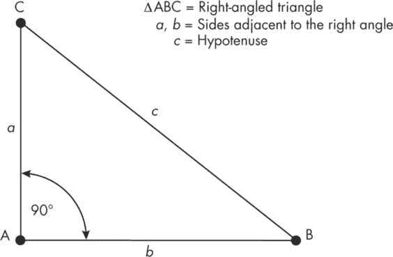

图 4-1：毕达哥拉斯定理

如果一个毕达哥拉斯三元组的成员彼此互质，即除了 1 之外没有共同的因子，则认为它是*原始的*。例如，（3，4，5）和（6，8，10）都是毕达哥拉斯三元组，但只有（3，4，5）是原始的，因为 6、8 和 10 有一个公共因子 2。欧几里得公式将生成一个原始的毕达哥拉斯三元组，只有当*m*和*n*是互质且其中一个是偶数时。如果*m*和*n*都是奇数，则*a*、*b*和*c*的值都会是偶数，三元组就不是原始的。然而，只要*m*和*n*互质，除以 2 后的*a*、*b*和*c*仍然会形成一个原始的毕达哥拉斯三元组。

#### 代码

下面是一个使用欧几里得公式生成毕达哥拉斯三元组的 Kotlin 函数：

```
fun generatePythagoreanTriple(m: Int, n: Int):
    Triple<Int, Int, Int> {
    val a = m * m - n * n
    val b = 2 * m * n
    val c = m * m + n * n
    return Triple(a, b, c)
}
```

该函数接收两个整数*m*和*n*，然后使用它们计算并返回*a*、*b*和*c*。由于这里没有明确给出*k*的值，我们隐式假设*k* = 1。

我们可以从 main()函数中反复调用此函数，通过 for 循环为任意数量的连续整数对生成毕达哥拉斯三元组，如下所示：

```
fun main() {
    var m = 2               // value of m
    var n = 1               // value of n
    val numTriples = 10     // number of triples

 println("\n*** Pythagorean Triples Using Euclid's Formula ***\n")
    println("Number of Pythagorean triples: $numTriples\n")

    // Generate the first "numTriples" triples.
    for (i in 1..numTriples) {
        val pythagoreanTriple =
            generatePythagoreanTriple(m, n)
        print("i=${"%2d".format(i)}    " +
              "m=${"%2d".format(m)}    n=${"%2d".format(n)}  ")
        println("Pythagorean triple: $pythagoreanTriple")
        n++
        m++
    }
}
```

请注意，第一个三元组是使用 m 为 2 和 n 为 1 生成的。这是 m 和 n 的最小可能值。（回想欧几里得公式中的要求，*m*和*n*必须是正整数且满足*m* > *n* > 0。）这些值作为参数传递给 generatePythagoreanTriple()函数，该函数返回一个包含毕达哥拉斯三元组元素的 Triple 对象（Kotlin 语言）。接下来的输入是通过在 for 循环内同时递增 m 和 n 生成的，该循环重复 numTriples 次。由于 m 和 n 是连续的，其中一个值总是偶数，而且它们不可能有任何公共因子，因此每个三元组都是原始的。

#### 结果

如果你不改变任何程序参数，程序将输出显示前 10 个毕达哥拉斯三元组的结果：

```
*** Pythagorean Triples Using Euclid's Formula ***

Number of Pythagorean triples: 10

i= 1    m= 2    n= 1  Pythagorean triple: (3, 4, 5)
i= 2    m= 3    n= 2  Pythagorean triple: (5, 12, 13)
i= 3    m= 4    n= 3  Pythagorean triple: (7, 24, 25)
i= 4    m= 5    n= 4  Pythagorean triple: (9, 40, 41)
i= 5    m= 6    n= 5  Pythagorean triple: (11, 60, 61)
i= 6    m= 7    n= 6  Pythagorean triple: (13, 84, 85)
i= 7    m= 8    n= 7  Pythagorean triple: (15, 112, 113)
i= 8    m= 9    n= 8  Pythagorean triple: (17, 144, 145)
i= 9    m=10    n= 9  Pythagorean triple: (19, 180, 181)
i=10    m=11    n=10  Pythagorean triple: (21, 220, 221)
```

在这个示例中，m 和 n 的初始值在 main() 函数中是硬编码的。你可以修改代码，让用户输入 m 和 n 的值（确保 *m* > *n* > 0）。这样用户就可以根据需求生成更广泛的毕达哥拉斯三元组。

项目 11：使用埃拉托斯特尼筛法识别质数

埃拉托斯特尼是公元前 3 世纪的古希腊学者。他是一位杰出的数学家、天文学家、地理学家和诗人。在这个项目中，我们将探讨埃拉托斯特尼的众多数学发现之一：*埃拉托斯特尼筛法*，一种识别所有质数的直观算法，直到给定的限制。（在下一个项目中，我们将探讨他其他的巧妙发现。）值得一提的是，埃拉托斯特尼在两千多年前就构思了这个策略，那时几乎没有人能够阅读或书写，更别提思考算法和解决抽象的数学问题了。

#### 策略

要像埃拉托斯特尼一样筛选质数，首先创建一个从 2 到某个限制的所有整数的列表。然后，从 2 开始，迭代地标记每个质数的倍数为合数。过程结束时，未被标记的数字都是质数。以下是实现这个算法的步骤：

1.  创建一个从 2 到给定限制的连续整数列表。

2.  从 2（第一个质数）开始，将它的所有倍数标记为合数。

3.  在列表中找到下一个未被标记为合数的数字。这将是下一个质数。

4.  将步骤 3 中找到的质数的所有倍数标记为合数。

5.  重复步骤 3 和 4，直到下一个质数的平方超过给定限制。

6.  列表中未标记的数字都是质数。

我们可以通过标记每个质数的倍数来优化筛法算法，从它的平方开始。例如，在标记 3 的倍数时，我们可以从 3² = 9 开始，因为所有小于 9 的 3 的倍数已经会被标记为合数。在这种情况下，6 在标记 2 的倍数时就已经被标记了。同样，当我们标记 5 的倍数时，可以跳过 10、15 和 20，因为它们是 2 或 3 的倍数，而从 25 开始标记合数。

#### 代码

和之前一样，我们将首先编写一个函数来实现算法，然后使用 main() 函数调用这个函数并列出质数。以下是 sieveOfEratosthenes() 函数的 Kotlin 代码：

```
fun sieveOfEratosthenes(n: Int): List<Int> {
    // Create a Boolean array with all values set to true.
    val primes = BooleanArray(n + 1) {true}
    // Create a mutable list of integers to save prime numbers.
    val primeNumbers = mutableListOf<Int>()

    // Set 0 and 1 to not be prime.
    primes[0] = false
    primes[1] = false

    // Iterate over all numbers until i² > N.
    var i = 2
  ❶ while (i*i <= n) {
        // If i is prime, mark all multiples of i as not prime.
      ❷ if (primes[i]) {
          ❸ for (j in i * i..n step i) {
                primes[j] = false
            }
        }
        i++
    }

    // Collect all prime numbers into a list and return it.
  ❹ for ((index, value) in primes.withIndex())
        if (value) primeNumbers.add(index)

  ❺ return primeNumbers
}
```

sieveOfEratosthenes() 函数接受一个整数 n 作为输入，并返回一个质数列表，直到 n。为此，函数创建一个长度为 n + 1 的布尔数组 primes，并将每个元素的值初始化为 true。在函数执行过程中，如果某个元素的索引不是质数，则将其值更改为 false。该函数还创建了一个可变列表 primeNumbers，类型为 Int，用于保存质数。

首先，我们将 primes 数组的前两个值设置为 false，因为 0 和 1 不是素数。然后，我们遍历从 2 到 n 的平方根的数字（我们通过确保 i*i <= n 来实现这一点）❶。对于这个范围内的每个数字 i，如果 i 在 primes 数组中被标记为素数（即 true）❷，该函数将 primes 数组中所有 i 的倍数标记为合数（false）。为了遍历所有 i 的倍数，我们使用一个步长为 i 的 for 循环 ❸。

为了收集素数，我们使用一个 for 循环 ❹ 遍历所有 primes 元素，当元素的值为 true 时，将相应的索引添加到 primeNumbers 列表中。最后，我们将素数作为整数列表返回给 main() 进行后处理 ❺。

现在我们的筛选函数已经准备好，我们可以使用 main() 函数来获取一个直到 n 的素数列表并将其打印出来。我们还将创建一个 printPrimes() 辅助函数来管理打印工作。

```
fun main() {
    println("\n*** Find All Prime Numbers Up to 'n' ***\n")
    println("Enter a number > 2 to generate the list of primes:")
    val num = readln().toInt()
    println("You have entered: $num")

    val primeNumbers = sieveOfEratosthenes(num)
    println("\nThe prime numbers <= $num are:")
    printPrimes(primeNumbers)
}

fun printPrimes(primeNumbers: List<Int>) {
    for (i in primeNumbers.indices) {
        if (i != 0 && i % 6 == 0) println()
        print("${"%8d".format(primeNumbers[i])} ")
    }
}
```

main() 函数类似于我们在项目 9 中使用的巴比伦平方根算法。它接受用户输入的限制 num，利用这个限制通过 sieveOfEratosthenes()函数生成素数列表，然后调用 printPrimes()函数打印该列表。为了让输出看起来更加整齐，printPrimes()将数字组织成每行六个，并使用字符串格式化来创建整齐对齐的列。

#### 结果

这里是程序输出的一个示例，限制 num 为 251 时的结果：

```
*** Find All Prime Numbers Up to 'n' ***

Enter a number > 2 to generate the list of primes:
**251**
You have entered: 251

The prime numbers <= 251 are:
       2        3        5        7       11       13
      17       19       23       29       31       37
      41       43       47       53       59       61
      67       71       73       79       83       89
      97      101      103      107      109      113
     127      131      137      139      149      151
     157      163      167      173      179      181
     191      193      197      199      211      223
     227      229      233      239      241      251
```

生成素数的其他方法包括 Sundaram 筛法、Atkin 筛法和试除法。我鼓励你进行一些在线研究，并尝试这些方法，提升你的 Kotlin 编程技能，并深入了解素数的生成。

项目 12：用古老的方式计算地球的周长

埃拉托斯特尼的最著名成就之一是计算地球的周长。他通过在夏至当天正午，在两个已知位于同一经线（或经度）上的地点——亚历山大和赛内（现代的阿斯旺）测量太阳光线的角度来完成这一任务。图 4-2 展示了这一精彩实验中涉及的一些几何抽象。

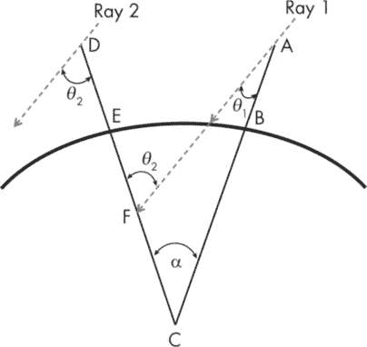

图 4-2：测量地球的周长

在这个图示中，我们可以将点 E 和 B 看作是地球表面的两个位置（例如，亚历山大和赛涅）。为了简化起见，我们假设地球是一个完美的球体，且这两个位置位于同一经线上。我们还假设*AB*和*DE*是两根高塔或塔柱，它们的距离足够远，以至于当它们延伸到地球的中心（C）时，形成一个小而可测量的角度*α*。从太阳射来的两条平行光线恰好未触及塔顶，它们会以略微不同的角度打到地面。由于地球表面是弯曲的，光线 2 与*DE*之间的角度*θ*[2]将略大于光线 1 与*AB*之间的角度*θ*[1]。因此，*DE*在地面上的阴影将比*AB*的阴影长，即使这些塔柱的高度相同。

我们还假设在两个位置，竿子相对于地面是垂直的，而地面在竿子附近可以看作是平坦的。这个假设使我们能够测量光线相对于竿子的角度。假设阴影的长度为*s*，竿子的高度为*h*，那么光线与竿子之间的角度*θ*可以表示为：

$方程式$ (4.1) 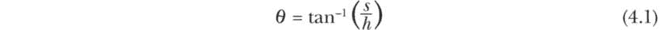

最后，考虑图 4-2 中的三角形*ACF*。根据*外角定理*，该三角形的外角*AFE*必须等于两内对角*ACF*和*CAF*之和。与此同时，*AFE*和*θ*[2]相等，因为它们是交叉两条平行太阳光线的直线*DF*的*交替内角*。因此，以下等式必须成立：

∠*AFE* = ∠*ACF* + ∠*CAF*

*  θ*[2] = *θ*[1] + *α*

重新排列后，我们得到：

$方程式$ (4.2) 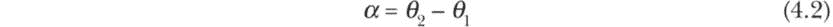

这个最终方程式就是我们用来估算地球周长的公式。我们将通过使用另一个几何关系来实现这一目标，该关系将圆弧的长度*d*与该圆弧在圆心处所形成的角度*α*（以弧度表示）联系起来：

$方程式$ 

解出周长得到以下方程式：

$方程式$ (4.3) 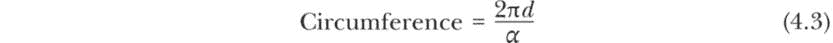

埃拉托斯特尼的做法非常巧妙。他知道，在夏至的中午，太阳会正好位于赛涅的正上方（即图 4-2 中的点 B），所以在那里竖立的竿子不会投下阴影，这意味着*θ*[1] = 0，因此根据方程式 4.2，*α* = *θ*[2]。然而，在亚历山大（点 E），太阳的位置会呈一定角度，所以竿子会在地面上投下阴影。通过测量这个阴影的长度，埃拉托斯特尼能够利用方程式 4.1 计算太阳光线（光线 2）与竿子（*DE*）之间的角度。他发现这个角度大约是 7.2 度，或者 0.12566370614 弧度。

厄拉托斯特尼知道亚历山大和赛内之间的距离——他估算为 5,000 斯塔迪（约 800 公里）。通过这些信息和阴影角度，他计算了地球的周长（使用方程 4.3），得到了大约 40,000 公里的值。确定周长后，他也可以计算地球的半径。对于任何圆形，半径*r*可以通过周长计算得出：

$方程$ 

将方程 4.3 中的周长公式代入，地球的半径*R*为：

$方程$ (4.4) 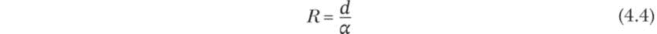

这个计算给厄拉托斯特尼提供了 6,370 公里的值，与实际值大约 6,371 公里非常接近。

#### 代码

让我们编写一些代码来模拟厄拉托斯特尼计算地球周长和半径的方法。我们将通过允许太阳在第一个地点不直接位于头顶来使程序更加灵活。为此，我们将使用方程 4.1 来计算阴影角度，方程 4.2 来获取弧度角，方程 4.3 来计算周长，最后使用方程 4.4 来计算半径。

```
import kotlin.math.atan

data class Earth(
    val alpha: Double,
    val circumference: Int,
    val radius: Int
)

fun calculateEarthMetrics(s1: Double, h1: Double,
                          s2: Double, h2: Double, d: Double): Earth {
    // Calculate the angles of the shadows.
    val theta1 = atan(s1 / h1)
    val theta2 = atan(s2 / h2)

    // Calculate the angle at the center of Earth.
    val alpha = theta2 - theta1

    // Calculate the circumference and radius.
    val circumference = (2 * Math.PI * d / alpha).toInt()
    val radius = (d / alpha).toInt()

    return Earth(alpha, circumference, radius)
}

fun main() {
    // known values
    val shadow1 = 0.0    // m
    val height1 = 7.0    // m
    val shadow2 = 0.884  // m
    val height2 = 7.0    // m
    val distanceBetweenCities = 800.0 // in km
    val (alpha, circumference, radius) =
 calculateEarthMetrics(s1=shadow1, h1=height1,
            s2=shadow2, h2=height2,
            d=distanceBetweenCities)

    // Output the estimated circumference and radius.
    println("\n*** Measuring Earth's Circumference and Radius ***\n")
    println("Angle (alpha): ${"%7.5f".format(alpha)} radian")
    println("Circumference: $circumference kilometers")
    println("Radius: $radius kilometers")
}
```

代码段首先导入所需的数学函数，并定义了一个数据类 Earth，具有三个属性：alpha、周长和半径。这个数据类让我们能够方便地将 calculateEarthMetrics()函数中估算的值打包，并通过一个 Earth 对象返回它们。

calculateEarthMetrics()函数有五个命名参数，分别代表两个地点的阴影长度（s1 和 s2）、高度（h1 和 h2）以及这两个地点之间的距离（d）。然后，函数按照第 137 页中描述的步骤进行：计算 theta1 和 theta2，使用它们计算 alpha，再利用 alpha 估算周长和半径。由于这些是大数字（以公里为单位表示时），我们将周长和半径都转换为整数（这就是它们在 Earth 类中定义的方式）。

main()函数的任务很简单：调用 calculateEarthMetrics()函数；通过解构返回的对象获取 alpha、周长和半径的值；并以适当的注释和格式打印它们。

#### 结果

对于本例中给定的参数值——与厄拉托斯特尼使用的相同——我们程序的输出如下：

```
*** Measuring Earth's Circumference and Radius ***

Angle (alpha): 0.12562 radian
Circumference: 40013 kilometers
Radius: 6368 kilometers
```

欢迎使用此工具来尝试不同的参数值。例如，你可以尝试使用在系外行星上测量的阴影长度和角度，看看该行星的大小！

项目 13：编写斐波那契数列的代码

比萨的莱昂纳多，通常被称为斐波那契，是一位大约在 1170 年出生的意大利数学家。从小，他便对数学表现出浓厚的兴趣，他前往北非和中东的旅行让他接触到了欧洲尚未掌握的先进数学概念。斐波那契对数学最重要的贡献是将印度-阿拉伯数字系统引入西方世界，这一系统包括了“零”的使用。这个系统取代了之前使用的罗马数字，并彻底改变了算术计算，使其变得更加高效。

斐波那契因引入斐波那契数列而广为人知，这是一系列数字，其中每个数字是前两个数字的和。为了在他的书《算盘之书》（*Liber Abaci*）中解释这一概念，斐波那契使用了一个生动的类比，涉及一对兔子。假设将一对兔子放入一个封闭区域。这些兔子在一月龄时可以交配，并且在二月龄时可以繁殖一对新兔。因此，每对兔子需要一个月时间成熟，并且需要额外一个月才能生育一对新兔。如果兔子永不死亡并且交配持续进行，那么每个月将有多少对兔子呢？

这个问题的解答形成了斐波那契数列。如果我们从（1, 1）开始，表示前两个月的起始兔对数，数列将呈现如下：1, 1, 2, 3, 5, 8, 13, 21, 34, 55，依此类推。这些数字可以通过表 4-1 中所解释的斐波那契兔子例子来理解。

表 4-1：斐波那契的兔子

| 月份 | 幼兔对数 | 成熟兔对数 | 总兔对数 | 说明 |
| --- | --- | --- | --- | --- |
| 0 | 1 | 0 | 1 | 从一对新生兔子开始，没有成熟兔对，也没有幼兔。 |
| 1 | 0 | 1 | 1 | 第一对兔子变成熟，并将在这个周期结束时繁殖。 |
| 2 | 1 | 1 | 2 | 第一对幼兔出生。此时，一对成熟的兔子将在这个周期结束时再次繁殖。 |
| 3 | 1 | 2 | 3 | 第二对幼兔出生。两对成熟的兔子将在这个周期结束时繁殖。 |
| 4 | 2 | 3 | 5 | 两对新兔出生。三对成熟的兔子将在这个周期结束时繁殖。 |
| 5 | 3 | 5 | 8 | 三对新兔出生。五对成熟的兔子将在这个周期结束时繁殖。 |

假设我们想要确定在一定代数后会有多少对兔子。我们可以按照以下步骤，使用斐波那契数列来计算：

1. 设置数列的前两个数字。按照惯例，这两个数字通常是 0 和 1，而不是 1 和 1。

2. 将前两个数字相加得到数列中的第三个数字。

3. 通过将前两个数字相加来生成下一个数字。这个步骤可以用数学公式表示为 Fn = Fn[– 1] + Fn[– 2]，其中 n ≥ 2。

4. 重复步骤 3，直到满足停止条件。

斐波那契数列已经成为递归数列的经典例子，并被用来说明各个领域中的许多数学概念。在介绍如何编写这个数列的代码之前，我将向您介绍另外两个相关的概念：黄金比例和斐波那契螺旋。这些概念将在我们的斐波那契代码中得到体现。

#### 黄金比例

*黄金比例*，也称为黄金分割，是一种在自然界、艺术和建筑中常见的数学比例。这个比例大约是 1.61803398875，表示为希腊字母*φ*。

黄金比例与斐波那契数列有关：随着数列的延续，每对连续数字之间的比例逐渐接近黄金比例。从 1 开始（我们不能从 0 开始，因为 1 除以 0 是无穷大），如果我们计算并绘制每对连续数字的比例，它将迅速收敛到*φ*，如图 4-3 所示。

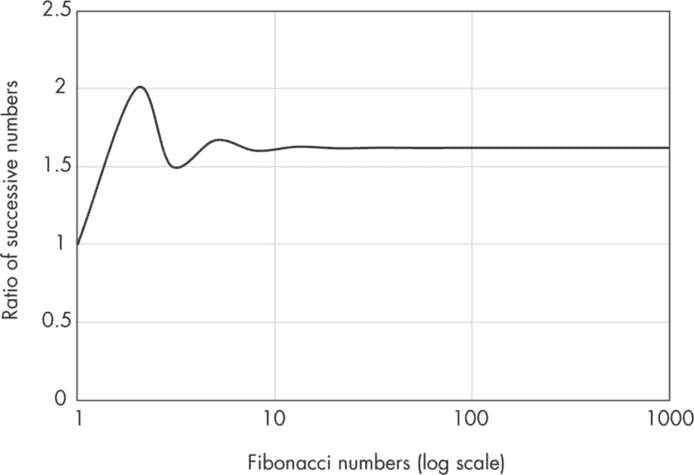

图 4-3：趋近黄金比例

黄金比例在自然界中的著名体现包括鹦鹉螺壳、向日葵种子的排列、松果上的鳞片，以及人体的比例（例如，前臂和手的长度比，以及整体身高和肚脐高度的比值）。这一比例还被艺术家、音乐家、摄影师、产品设计师和建筑师广泛运用在他们的作品中。例如，在建筑学中，它可能决定建筑物立面宽高比。

#### 斐波那契螺旋

斐波那契螺旋是一个源自斐波那契数列的几何图案。它是通过在基于斐波那契数列中的数字的正方形内绘制一系列四分之一圆来创建的。绘制斐波那契螺旋的步骤如下：

1.  绘制一个边长为 1 的小正方形。

2.  绘制另一个边长为 1 的正方形，紧邻第一个正方形，共享一条边。

3.  绘制一个边长为 2 的第三个正方形，紧邻第二个正方形，共享一条边。

4.  绘制一个边长为 3 的第四个正方形，紧邻第三个正方形，共享一条边。

5.  继续这个过程，绘制边长等于前两个正方形之和的正方形，紧邻最后绘制的正方形，共享一条边。

6.  在每个正方形内绘制一个四分之一圆，连接每个正方形的对角线。四分之一圆将形成一个平滑的曲线：斐波那契螺旋。

如果按照这些步骤操作，并绘制前八个数字的螺旋（从 1 开始），结果将如下图所示图 4-4。

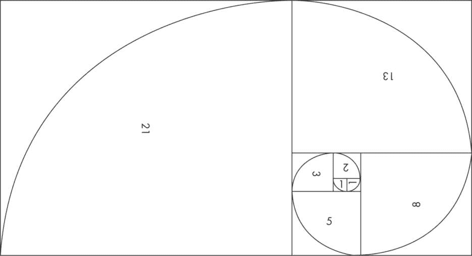

图 4-4：前八个数字的斐波那契螺旋

斐波那契螺旋，通常与黄金比例相关，是自然界中一个常见的模式，出现在各种形式中，比如海贝、叶子排列，甚至遥远星系的螺旋！虽然黄金比例并不是设计中美学或效率的绝对前提，但它无疑作为一个数学概念，因其持久的魅力而持续吸引着我们的想象力。

#### 代码

生成并打印出直到某个限制的斐波那契数列，可以通过几行代码轻松实现。让我们将这个项目更进一步：除了生成数列本身，我们还将绘制斐波那契螺旋。这样，我们就能够练习上一章中介绍的一些数据可视化技巧，并预见到未来的项目，在这些项目中我们将通过可视化程序输出，更深入地理解问题。

##### 设置

首先，我们将编写代码的全局组件，包括用于可视化的导入模块、FibonacciSpiral 应用程序类，以及 main() 函数。

```
import javafx.application.Application
import javafx.scene.Scene
import javafx.scene.canvas.Canvas
import javafx.scene.canvas.GraphicsContext
import javafx.scene.layout.Pane
import javafx.scene.paint.Color
import javafx.scene.shape.ArcType
import javafx.scene.text.Font
import javafx.stage.Stage

// number of Fibonacci numbers in the list
val N = 9
val fibs = mutableListOf<Int>()

// canvas-related parameters
val canvasW = 1000.0
val canvasH = 750.0

// Scaling parameters: adjust as needed.
val xOffset = 150
val yOffset = 50
val amplify = 25.0

class FibonacciSpiral : Application() {
    override fun start(stage: Stage) {
        val root = Pane()
        val canvas = Canvas(canvasW, canvasH)
        val gc = canvas.graphicsContext2D
        gc.translate(canvas.width / 2 + xOffset,
            canvas.height / 2 + yOffset)
        root.children.add(canvas)

        val scene1 = Scene(root, canvasW, canvasH)
        scene1.fill = Color.WHITE
        with(stage) {
            title = "Fibonacci Spiral"
 scene = scene1
            show()
        }

        // code for Fibonacci sequence and spiral
        generateFibonacciNumbers()
        drawFibonacciSpiral(gc)
        printFibonacciSequenceAndRatios()
    }
}

fun main() {
    Application.launch(FibonacciSpiral::class.java)
}
```

代码段从一个导入模块开始，提供了对多个 JavaFX 图形特性的访问，这些特性将帮助我们在画布对象上绘制斐波那契螺旋。有关这些特性的复习，请参考第三章。在 IntelliJ IDEA 中编写代码意味着你不需要记住需要导入哪些库特性；当你使用默认模板并添加可能需要额外图形元素的代码时，IDE 会自动导入这些特性。

在导入模块之后，我们设置了一些全局参数。首先，我们创建了一个名为 N 的变量，用来设置斐波那契数列的计算范围（从 0 开始）。接着，我们创建了一个名为 fibs 的可变列表，它的类型是 Int，用来存储我们计算出的斐波那契数列。我们还设置了多个参数来创建一个画布，在上面绘制斐波那契螺旋。为了定义画布的大小，我们使用 canvasW 和 canvasH 这两个值，而为了设置坐标系原点的位置，我们使用 xOffset 和 yOffset。对于这个特定的项目，我将画布的大小设置为 1000 像素宽，750 像素高，这对于大多数屏幕尺寸和分辨率来说应该是合适的。

需要注意的是，画布上直线或矩形边长的单位是像素。为了绘制斐波那契螺旋，我们将从一个边长为 1 的正方形开始。然而，绘制一个 1 像素的正方形会导致屏幕上出现一个非常小的点，这显然不是我们想要的。为了避免这种情况，我们将使用一个叫做放大系数（amplify）的因子，并将其设置为 25。因此，第一个正方形的大小将是 25 像素，之后的所有正方形都会按同样的放大系数进行放大。这样可以确保最终结果是一个填充整个画布的斐波那契螺旋。

在 FibonacciSpiral 应用程序类中，我们首先创建一个名为 root 的布局容器，其类型为 Pane()，它是 JavaFX 中最基础的布局容器，用于在场景中承载和定位节点（用户界面组件）。我们使用 root 来承载将在其上绘制螺旋的画布。请注意，我们如何使用图形上下文 gc 的 translate 属性将原点的初始位置从左上角（默认位置）移动到画布中稍偏离中心的位置，在那里我们将绘制第一个 Fibonacci 方块（请参见 图 4-4 以了解位置）。类的其余部分是常规的 JavaFX 操作：我们将画布赋给 root，root 被赋给 scene1，scene1 连接到 stage，这是此应用程序的主要显示窗口。

接下来，我们进入应用程序类的特定问题部分，该部分包括对三个独立函数的调用：generateFibonacciNumbers()、drawFibonacciSpiral() 和 printFibonacciSequenceAndRatios()。这些函数的功能正如其名称所示，我们将在稍后详细讨论它们。

最后，main() 函数包含一行代码，通过调用 Application 类的 launch() 方法并将 FibonacciSpiral 类作为参数传入，启动 JavaFX 应用程序。

##### 生成 Fibonacci 数列

generateFibonacciNumbers() 函数生成之前讨论过的 Fibonacci 数列。

```
fun generateFibonacciNumbers() {
    // Add the starting pair.
    fibs.add(0)
    fibs.add(1)

    // Generate the sequence.
    for (i in 2 until N) {
        fibs.add(fibs[i-1] + fibs[i-2])
    }
}
```

首先，*F*(0) 和 *F*(1) 分别设置为 0 和 1，然后使用 *F*n = *F*n [– 1] + *F*n [– 2] 的公式生成其余的数列，其中 *n* ≥ 2。我们将所有生成的数字添加到可变列表 fibs 中，使用其 fibs.add() 方法。

##### 绘制 Fibonacci 螺旋

drawFibonacciSpiral() 函数通过使用生成的 Fibonacci 数列，结合两个辅助函数，驱动绘制 Fibonacci 螺旋的过程，这两个函数分别标注每个方块的 Fibonacci 数字并绘制四分之一圆。

```
fun drawFibonacciSpiral(gc: GraphicsContext) {
    for (i in 1 until N) {
      ❶ val side = fibs[i] * amplify
      ❷ with(gc) {
            strokeRect(0.0, 0.0, side, side)
            drawText(i, gc, side)
            drawArc(gc, side)
            // Move to the opposite corner by adding
            // side to both x- and y-coordinates.
            translate(side, side)
            // Rotate the axes counterclockwise.
            rotate(-90.0)
        }
    }
}

fun drawText(i: Int, gc: GraphicsContext, side: Double) {
    gc.fill = Color.BLACK
    with(gc) {
      ❸ font = when {
            i <= 2 -> Font.font(12.0)
            else -> Font.font(24.0)
        }
        fillText(fibs[i].toString(), side/2, side/2)
    }
}

fun drawArc(gc: GraphicsContext, side: Double) {
    val x = 0.0
    val y = -side
    with(gc) {
        lineWidth = 3.0
        strokeArc(x, y, 2*side, 2*side,
            -90.0, -90.0, ArcType.OPEN)
    }
}
```

drawFibonacciSpiral() 函数使用一个从 1 开始的 for 循环（因为我们不能绘制大小为 0 的方块），遍历数字序列。在循环中，我们获取当前数字并将其乘以放大系数 amplify，以正确地在屏幕上缩放方块❶。然后，我们在 with(gc) 块 ❷ 内实现其余过程，其中我们绘制一个方块、标注它并绘制一个弧形。在每次循环结束时，我们将画布的原点移动到下一个位置，并将坐标系逆时针旋转 90 度。这样，方块就会向外螺旋展开，如 图 4-4 所示，但我们仍然可以通过相同的 strokeRect(0.0, 0.0, side, side) 调用绘制每个方块。

在 drawText()函数中，我们使用参数 i，它表示当前斐波那契数的索引，来设置注释文本的字体大小❸。这确保了前两个数字能适应 25 像素的正方形。然后，我们使用图形上下文 gc 的 fillText()方法将数字绘制在其对应正方形的中央。

drawArc()函数设置了图形上下文中 strokeArc()方法所需的参数值。这些参数包括矩形的左上角坐标、矩形的宽度和高度、相对于 x 轴的起始角度（单位为度），以及弧长（单位为度）。我们还指定弧的类型为 OPEN，这意味着两个端点之间不会用线连接。

对于绘制弧线，可以将弧线将要绘制的虚拟框视为一个独立的对象，它有自己的坐标系，原点位于框的中心。在这个框内，正 x 轴指向东，正 y 轴指向北。（请注意，这与 JavaFX 画布使用的默认约定不同。）考虑到这一点，逆时针绘制弧线被视为正方向，这也是指定起始角度和弧长的方式。例如，我们已将起始角度指定为–90 度，弧长指定为–90 度（相对于正 x 轴的顺时针方向）。或者，我们也可以将起始角度指定为+180 度，弧长指定为+90 度（逆时针方向），以产生相同的结果。

##### 打印数列

我们还有一个函数，它打印斐波那契数列以及数列中相邻项之间的比值，以展示这些值如何收敛到黄金比例。

```
private fun printFibonacciSequenceAndRatios() {
    println("\n*** Fibonacci sequence and ratios ***\n")
    println("Length of Fibonacci sequence=${fibs.size}")
    println("Generated sequence:")
  ❶ println(fibs)
    println("\nRatio F(n+1)/F(n) [starting from (1,1) pair]:")
    for (i in 2 until fibs.size) {
        println("%5d".format(fibs[i-1]) +
                "%5d".format(fibs[i]) +
                "%12.6f".format(fibs[i].toDouble()/fibs[i-1])
        )
    }
}
```

该函数首先打印一个头部消息以及生成的斐波那契数列的长度。接下来，它使用 println()打印生成的数列❶。最后，一个 for 循环计算并打印相邻数字之间的比值，使用 format()函数以适当的间距和精度显示这些值。

#### 结果

当你运行代码时，输出的文本部分应如下所示：

```
*** Fibonacci sequence and ratios ***

Length of Fibonacci sequence=9
Generated sequence:
[0, 1, 1, 2, 3, 5, 8, 13, 21]

Ratio F(n+1)/F(n) [starting from (1,1) pair]:
    1    1    1.000000
    1    2    2.000000
    2    3    1.500000
    3    5    1.666667
    5    8    1.600000
    8   13    1.625000
   13   21    1.615385
```

请注意，比率最初在 1.61803398875 值附近呈锯齿形波动，但一旦我们到达数列中的第 10 对数，它们便迅速接近黄金比例。

当然，应用程序还会显示一个使用 JavaFX 绘制的美丽斐波那契螺旋图案。它应与图 4-4 完全相同——该图是用这段代码生成的！

项目 14：计算地球上两地点之间的最短距离

我们使用毕达哥拉斯定理来计算同一平面上点与点之间的距离。然而，对于地球表面的点，这种方法在长距离上不够准确，因为它没有考虑地球的曲面形状。这就是*哈弗森公式*的作用所在。它利用点的纬度和经度坐标计算球面上两点之间的最短距离。就地球而言，公式并不是完全准确的，因为地球并非完美的球形，但它仍为许多实际应用提供了合理的距离近似，包括导航、天文学和地理学。

哈弗森公式围绕着*大圆*的概念展开，大圆是可以在球面上绘制的最大圆。它是球面与通过球心的平面相交所形成的。大圆将球面分成两半，其周长与球体的周长相同。

图 4-5 展示了两个显著的大圆：赤道和本初子午线。赤道作为南北半球的分界线，而本初子午线（经过英国格林威治）将地球表面分为东西半球。这两个大圆作为纬度和经度的参考，它们共同定义了地球表面点的位置。

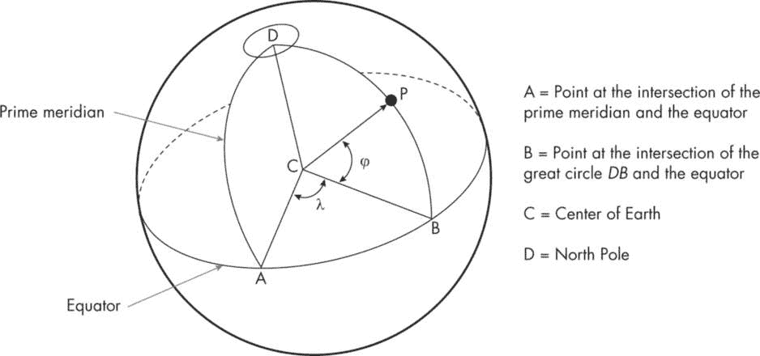

图 4-5：点 P 的纬度和经度

*纬度*衡量的是距离赤道的南北位置。它以度数表示，赤道的纬度为 0 度，北极为 90 度北（90°N），南极为 90 度南（90°S）。在图 4-5 中，点 P 的纬度表示为*φ*°N，因为它位于赤道以北*φ*度，沿着与 P 和北极相交的最大圆圈。*经度*衡量的是距离本初子午线的东西位置。本初子午线本身的经度为 0 度，经度值的范围从本初子午线以西 180 度到本初子午线以东 180 度。对于点 P，其经度表示为*λ*°E，表示其最大圆圈位于本初子午线以东*λ*度。

> 注意

*你可能习惯于看到所有的纬度和经度值都表示为正数，但为了使哈弗森公式有效，南纬和西经必须为负值。我们的程序会自动转换不符合此惯例的坐标。*

给定球面上任意两点，你可以绘制一条大圆，这条大圆与两点相交，并且这条大圆会定义两点之间的最短路径。如果你知道两点之间的角度 *θ*（单位为弧度），即连接两点的弧线所形成的角度，并且知道球面的半径 *r*，那么你就可以按照以下公式计算球面上两点之间的距离：

$方程式$ (4.5) 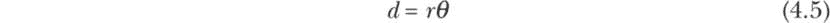

在地球的情况下，我们知道半径 * R * 大约为 6,371.009 公里，但我们如何知道地球表面两点之间的角度呢？这就是哈弗斯公式的作用。它使用两点的纬度和经度坐标，并通过一些三角学原理来确定这个角度，从而帮助我们计算两点之间的距离。该公式涉及一个鲜为人知的三角函数，叫做哈弗正弦函数。一个角度 *θ* 的哈弗正弦定义如下：

$方程式$ (4.6) 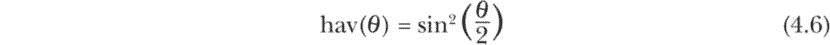

**哈弗斯公式**计算了* a *，即地球表面两点之间角度的哈弗正弦，公式如下：

*  a* = hav(*φ*[2] – *φ*[1]) + cos(*φ*[1]) cos(*φ*[2]) hav(*λ*[2] – *λ*[1])

这里 (*φ*[1], *λ*[1]) 和 (*φ*[2], *λ*[2]) 是两点的纬度和经度坐标，单位是弧度。要将角度转换为弧度，只需将角度乘以π，再除以 180。

我们现在得到了两点之间角度的哈弗正弦，但还没有得到实际的角度。为此，我们可以使用刚刚计算出的 *a* 和哈弗正弦的定义（方程式 4.6）来求解弧度角度 *c*：

$方程式$ 

现在我们得到了角度 *c*，我们拥有了使用方程式 4.5 计算两点之间距离所需的所有信息：

*  d* = *Rc*

然而，有一个问题：* d * 只有在 0 ≤ * a * ≤ 1 时才会是一个实数，但有时由于浮点错误，* a * 可能会超出这个范围。为避免这种情况，我们应该将 * c * 表达为：

$方程式$ 

这将把 *a* 的值限制在 0 到 1 的范围内，从而避免不现实的结果。

#### 代码

我们现在拥有了编写 Kotlin 程序的所有信息，以计算地球上两地之间的最短距离。为了举例，我硬编码了伦敦的“大本钟”和纽约的“自由女神像”的位置，但你可以使用任何你想要的位置。代码由四个主要部分组成：导入块和全局声明、main() 函数、printLatLong() 函数和 haversineDistance() 函数。我会按这个顺序讨论它们。

```
// Import math functions.
import kotlin.math.sin
import kotlin.math.asin
import kotlin.math.cos
import kotlin.math.PI
import kotlin.math.max
import kotlin.math.min
import kotlin.math.pow
import kotlin.math.sqrt

// Define a Location data class.
data class Location(
    val name: String = "",
    var lat: Double,
    val latDir: String,
    var lon: Double,
    val lonDir: String
)

//  global variables and parameters
//  N = north, S = south, E = east, W = west
val L1 = Location(name = "Big Ben", lat=51.5004,
    latDir = "N", lon=0.12143, lonDir = "W")
val L2 = Location(name="Statue of Liberty", lat = 40.689978,
    latDir = "N", lon = 74.045448, lonDir = "W")
val locations = listOf(L1, L2)

val R = 6371.009  // radius of Earth in km

fun main() {
    println("\n*** Measuring Distance Between Two Locations on Earth ***\n")
    printLatLong(category = "input", locations)
    val d = haversineDistance()
    printLatLong(category = "adjusted", locations)
    println("\nThe distance between the two given locations:")
    println("d = ${"%10.2f".format(d)} km")
}

fun printLatLong(category: String, locationsToPrint: List<Location>) {
    when(category) {
        "input" ->
            println("...inputted coordinates...\n")
        "adjusted" ->
            println("\n...adjusted coordinates...\n")
    }
    locationsToPrint.forEach {location -> println(location)}
}

fun haversineDistance(): Double {
    // Adjust signs based on N-S and E-W directions.
  ❶ for (location in locations) {
        with(location) {
            if(latDir == "S" && lat > 0.0) lat = - lat
            if(lonDir == "W" && lon > 0.0) lon = - lon
        }
    }
    // Calculate the angles in radians.
    val phi1 = L1.lat * PI/180
    val phi2 = L2.lat * PI/180
    val delPhi = phi2 - phi1
    val delLambda = (L2.lon - L1.lon) * PI/180

    // Calculate the distance using haversine formula.
  ❷ val a = sin(delPhi/2).pow(2) +
            cos(phi1) * cos(phi2) *
            sin(delLambda/2).pow(2)
    // Ensure that 0 <= a <= 1 before calculating c.
  ❸ val c = 2 * asin(sqrt(max(0.0, min(1.0, a))))
  ❹ val d = R * c
    return d
}
```

由于 haversine 公式需要使用许多数学函数，我们首先从 kotlin.math 包导入这些函数。接着，我们声明一个数据类 Location，包含五个属性：name（位置名称）、lat（纬度）、latDir（纬度方向）、lon（经度）和 lonDir（经度方向）。然后，我们创建了两个 Location 对象，L1 和 L2，分别代表大本钟和自由女神像。我们将它们存储在一个名为 locations 的列表中，以便可以高效地遍历这些位置。

请注意，我提供的纬度和经度值是正数，不管它们所在的方向。我依赖 latDir 和 lonDir 属性来传达这些额外信息。约定是，N 代表北，S 代表南，E 代表东，W 代表西。对于纬度或经度值为 0 的情况，相应的方向可以设置为 EQ（赤道）或 PM（本初子午线），虽然这不会影响最终结果。在后面的 haversineDistance() 函数中，我们确保当纬度或经度的方向分别为 S 或 W 时，对应的值始终为负 ❶。

main() 函数在调用 printLatLong() 函数后，打印出调整前后的纬度和经度值（如果有调整），然后调用一次 haversineDistance() 函数，并打印结果。

printLatLong() 函数接受一个参数，category，它是 String 类型。category 参数传递给一个 when 语句块，用于确定打印哪条消息，表示坐标是否已根据其方向属性进行了调整。然后，使用 locationsToPrint 列表的 forEach() 方法逐一打印位置。我们本可以在这里使用常规的 for 循环，但一些 Kotlin 爱好者认为 forEach() 更符合惯用法。

最后，haversineDistance() 函数计算了两点在球面上的最短距离。它首先遍历位置，如果需要的话，将纬度和经度取反 ❶，然后将所有的纬度和经度值从度数转换为弧度。接下来，它按照我们在第 150 页讨论的公式，使用坐标计算 *a* ❷，用 *a*（限制在 0 到 1 之间）计算角度 *c* ❸，最后使用 *c* 计算并返回两点之间的 haversine 距离 *d* ❹。

#### 结果

当你运行程序，使用设定的地点和参数值时，输出应如下所示：

```
*** Measuring Distance Between Two Locations on Earth ***

...inputted coordinates...

Location(name=Big Ben, lat=51.5004, latDir=N, lon=0.12143, lonDir=W)
Location(name=Statue of Liberty, lat=40.689978, latDir=N, lon=74.045448,
lonDir=W)

...adjusted coordinates...

Location(name=Big Ben, lat=51.5004, latDir=N, lon=-0.12143, lonDir=W)
Location(name=Statue of Liberty, lat=40.689978, latDir=N, lon=-74.045448,
lonDir=W)

The distance between the two given locations:
d =   5575.08 km
```

如在第 148 页中提到的，哈弗辛计算假设地球是一个完美的球体，但事实并非如此。实际上，地球是一个扁球体，极地稍微扁平，赤道稍微膨胀。为了绕过这个问题，你可以使用文森提公式，它通过考虑地球的赤道和极地直径来考虑地球的扁球形状。使用哪个公式实际上取决于问题的性质，因为这两种方法各有优缺点。

项目 15：使用 Hill 密码进行加密

在今天这个互联互通的世界中，我们不断地分享敏感数据，如个人信息、财务细节和机密消息。有什么能阻止未经授权的人员访问这些信息呢？答案是*加密*，一套将我们的数据混淆成乱码的技术，只有使用正确的密钥才能解密。加密保护我们的隐私，防止黑客和网络犯罪分子，保障我们的在线交易安全。

目前有各种各样的加密算法在使用中。在本项目中，我们将重点关注一种名为 Hill 密码的算法，该算法由美国数学家 Lester S. Hill 于 1929 年开发。根据这种方法，*明文*（英文或任何其他语言的文本）被分割成固定大小的块，并表示为向量。然后，这些向量与一个称为*加密密钥*的方阵相乘，并模以指定的数字，从而获得*密文*（加密后的文本）。对于解密，密文向量与加密密钥矩阵的逆矩阵相乘，并模以相同的指定数字。

如果我们没有小心选择加密密钥矩阵，Hill 加密方法可能会受到攻击。虽然它不再作为唯一的加密机制使用，但仍然可以被融入到更复杂的方法中，并且仍然是一个值得掌握的有价值的概念。而且，探索 Hill 方法为我们提供了一个应用和提高加密领域编程技能的绝佳机会。

#### 工作原理

Hill 密码围绕线性代数和模运算的概念展开。我不指望你对这些数学领域有深入的了解，但你可能希望复习这些主题，以更好地理解 Hill 密码的实际工作原理，以及它的优缺点。以下是我们将在本项目中使用的关键术语的简要定义：

**向量**

一维的数值序列。例如，[1, 3, 5]是一个具有三个元素的行向量。

**矩阵**

一个二维的数值集合，按行和列排列。例如，一个 3×3 的矩阵有三行三列，总共有九个元素（数字），这些元素可以是实数或复数。

**行列式**

使用矩阵元素计算的单一值。矩阵必须是方阵，即行数和列数相同。假设我们有以下方阵 A：

$Equation$ 

它的行列式，表示为 det(A)、det A 或|A|，可以按以下方式计算：

det(*A*) = *aei* + *bfg* + *cdh* – *ceg* – *bdi* – *afh*

**单位矩阵**

一个方阵，通常表示为 I，所有从左上到右下的对角线元素值为 1，其他所有元素值为 0。一个 3×3 的单位矩阵看起来像这样：

$Equation$ 

**逆矩阵**

对于给定的矩阵 A，它的逆矩阵 A^(–1)是另一个矩阵，满足将这两个矩阵相乘的结果是单位矩阵（即，AA^(–1) = I）。矩阵必须是方阵才能有逆矩阵，尽管并不是所有方阵都有逆矩阵。

**模**

一个由符号%表示的运算，表示在一个数字被另一个数字除时所得到的余数。例如，5 % 2 是 1。模（简称 mod）是一个多用途的运算符，用于各种应用，如确定可除性、循环通过一系列值以及处理周期性模式。Hill 算法依赖于模运算来保持加密和解密文本与明文处于相同的字母表中。因此，字母表的大小作为这些操作的基数或模数（%运算符后的数字），保证了有效的密文和明文表示。

**模逆（MMI）**

对于给定的整数 a 和模数 m，MMI 是正整数 x，使得 ax % m = 1。x 的值必须小于模数。例如，5 模 11 的 MMI 是 9，因为(5 * 9) % 11 = 1，并且 9 小于 11。

凭借这些定义，让我们现在深入探讨 Hill 密码所采用的核心加密和解密步骤，并突出我们 Kotlin 实现中的一些内容。

##### 用于加密

1.  定义字母表。选择用于书写明文和加密消息的字母。对于用英语写的消息，字母表大小应该至少为 26，以包括所有小写字母。我们还将包括句号、空格和问号，得到一个包含 29 个字符的字母表。字母表的大小作为模数。

2.  选择一个块大小。在加密和解密过程中，消息被分割成小块，每块字符长度相同。在本练习中，我们每块有三个字符。

3.  生成加密密钥矩阵。对于本项目，我已经为你生成了加密密钥矩阵，但如果你有兴趣，它必须遵循以下规则：

a.  矩阵必须是方阵，并且具有与第 2 步中选择的块大小相同的维度。在本例中，块大小为 3，因此我们需要一个 3×3 的矩阵。

b.  矩阵的行列式不能为 0。

c.  行列式必须与步骤 1 中的模数没有其他公因子，除了 1 以外。

4.  准备明文。根据所选的块大小将明文消息划分为块。如果最后一个块小于固定大小，则用填充字符填充它。我们将使用空格进行填充，以确保解密后消息保持不变，不会有额外的可见字符。

5.  从明文创建向量。每个明文块必须转换为一个与块大小相同长度的数值向量。为了给字符分配数值，我们将字母表保存在一个单一的字符串对象中。然后，我们可以将明文中的每个字符映射到该字符在字符串中的对应索引。例如，a 将映射到 0，b 映射到 1，依此类推。这样，块 cab 将变成（2, 0, 1），一个大小为 3 的向量。

6.  加密消息。对于每个块，执行以下步骤：

a.  将块的明文向量与密钥矩阵相乘，模 29，生成一个密文向量。

b.  使用反向映射方案将密文向量中的数值转换回文本字符。

c.  将加密后的字符添加到可变字符列表中，一旦所有块处理完毕，这些字符将成为加密消息（密文）。

##### 对于解密

1.  生成解密密钥矩阵。为了解密加密文本，我们必须首先创建加密密钥矩阵的逆矩阵，模指定的数值。此过程涉及多个线性代数步骤和模运算；为了简化，我提供了逆矩阵。如果你想使用不同的密钥和逆矩阵，可以查找在线工具来为你生成。

2.  准备密文。将密文划分为加密时使用的指定大小的块（此项目为 3）。这次不需要填充，因为填充已在加密时完成。

3.  从密文创建向量。使用相同的字符编号方案将密文块转换为大小为 3 的密文向量。

4.  解密消息。对于每个块，执行以下步骤：

a.  将密文向量与解密密钥矩阵相乘，模 29，生成一个解密向量。

b.  使用反向映射方案将解密向量中的数值转换回文本字符。

c.  将解密后的字符添加到可变字符列表中，一旦所有块处理完毕，这些字符将成为解密消息（明文）。

最后，请记住，通常会选择仅由整数构成的加密密钥矩阵，最好是在 0 和模数之间。

#### 代码

我们准备实现 Hill 加密和解密方法的 Kotlin 代码。代码按照自上而下的顺序组织，从全局声明开始，接着是 main() 函数，最后是一些简短的辅助函数。我们将按顺序回顾一切。

##### 变量和数据结构

我们首先声明实现 Hill 方法所需的变量和数据结构。

```
/*  --- Hill's method for encrypting and decrypting texts --- */

// Declare the key matrix and its inverse.
// keyInv is based on mod 29.
val key = arrayOf(
 intArrayOf(13, 11, 6),
    intArrayOf(15, 21, 8),
    intArrayOf(5, 7, 9)
)

val keyInv = arrayOf(
    intArrayOf(1, 12, 8),
    intArrayOf(20, 0, 6),
    intArrayOf(0, 3, 20)
)

val dim = key.size
const val alphabet = "abcdefghijklmnopqrstuvwxyz .?"

data class Block(
    val t1: Char,
    val t2: Char,
    val t3: Char,
)

val indexVector = IntArray(dim)
val processedVector = IntArray(dim)
val blocks = mutableListOf<Block>()
val processedText = mutableListOf<Char>()
```

首先，我们创建加密和解密的矩阵（key 和 keyInv）。对于这个项目，我们将这些矩阵视为给定的，但你可以使用在线工具创建一个符合要求条件的加密密钥矩阵，并计算出相应的逆矩阵。这些方阵的大小由参数 dim 表示，后续会作为处理消息的块大小。我们还定义了一个字符串 alphabet，用来存储所有可以在明文和密文中使用的有效字母。

接下来，我们引入一个名为 Block 的数据类，用于存储在处理消息时生成的文本块。这些块将作为一个可变列表 blocks 存储。我们还创建了一些其他集合，用于暂时保存和操作加密和解密过程中创建的向量，同时创建了一个名为 processedText 的可变列表，用于存储最终的字符列表。由于加密和解密过程非常相似，我们可以在这两个过程中使用这些变量和集合来存储中间值和最终值。

##### main() 函数

main() 函数调用一系列辅助函数来协调整体的加密或解密过程。

```
fun main() {
    println("\n*** Cryptography with Hill's Method ***\n")
    runValidation()
    println("\nEnter 1 for encryption or 2 for decryption:")

  ❶ when(val choice = readln().toInt()) {
        1 -> {
 println("You have chosen encryption\n")
            getText()
            encrypt()
            printProcessedText(choice)
        }
        2 -> {
            println("You have chosen decryption\n")
            getText()
            decrypt()
            printProcessedText(choice)
        }
        else -> println("\nInvalid choice...exiting program\n")
    }
}
```

在 main() 中，我们首先调用 runValidation() 函数，它通过矩阵乘法（模 29）确保加密和解密矩阵是有效的。然后，我们提示用户选择要执行的操作：加密（输入 1）或解密（输入 2）。根据选择，我们使用 when 块 ❶ 实现加密或解密消息的步骤。

对于两种选择，我们从 getText() 函数开始，该函数接收用户输入的要加密或解密的消息字符串，并将其分成块。然后，根据之前的选择，我们调用 encrypt() 或 decrypt() 函数。最后，我们借助 printProcessedText() 函数显示结果。

##### 辅助函数

在 main() 函数中有几个辅助函数被调用。我们接下来会介绍这些函数，从帮助验证矩阵的函数开始。

```
fun runValidation() {
    println("key matrix dimension:")
    println("${key.size}  x  ${key[0].size}\n")

    // validation of key and keyInv
    val productMatrix = multiplyMatricesMod29(key, keyInv,
        r1=dim, c1=dim, c2=dim)
    displayProduct(productMatrix)
}

fun multiplyMatricesMod29(firstMatrix: Array <IntArray>,
                          secondMatrix: Array <IntArray>,
                          r1: Int,
                          c1: Int,
                          c2: Int): Array <IntArray> {
    val product = Array(r1) {IntArray(c2)}
    for (i in 0 until r1) {
        for (j in 0 until c2) {
 for (k in 0 until c1) {
                product[i][j] += (firstMatrix[i][k] *
                                  secondMatrix[k][j])
            }
          ❶ product[i][j] = product[i][j] % 29
        }
    }
    return product
}

fun displayProduct(product: Array <IntArray>) {
    println("[key * keyInv] mod 29 =")
    for (row in product) {
        for (column in row) {
            print("$column    ")
        }
        println()
    }
}
```

runValidation()函数显示密钥矩阵的大小。然后，它调用 multiplyMatricesMod29()进行验证检查，并使用 displayProduct()显示结果。如果两个矩阵是互为逆矩阵（模 29），则它们的乘积模 29 应为单位矩阵，除了从左上到右下对角线上的 1，其余元素应为 0。

在 multiplyMatricesMod29()中，我们使用三层嵌套的 for 循环测试这一点，分别对加密和解密密钥矩阵进行乘法操作，并在将结果放入产品矩阵之前，对每个计算结果取模 29❶。有关该过程背后数学原理的详细信息，请参见“矩阵乘法”框。

displayProduct()函数整齐地格式化并打印产品矩阵的内容。正如你稍后在示例输出中看到的，结果确实应该是一个单位矩阵。

这是 getText()函数，我们在加密或解密过程开始时从 main()中调用：

```
fun getText() {
    println("Enter text for processing:")
    var text = readln().lowercase()
    val tmp = " " // Use a space for padding.

  ❶ when(text.length % 3) {
        1 -> text = text + tmp + tmp
        2 -> text += tmp
    }
    for (i in text.indices step 3)
        blocks.add(Block(text[i], text[i+1], text[i+2]))
}
```

该函数使用 readln()从用户那里获取明文或密文。我们将所有字符转换为小写，因为我们的字母表中只有小写字母。然后，我们检查输入字符串是否可以被 3 整除❶，如果不能，则用空格填充它。最后，我们使用步长为 3 的 for 循环将文本拆分成三个字符的块。每个块存储在一个 Block 对象中，并添加到 blocks 可变列表中。

其余的助手函数实际执行加密和解密文本的工作。

```
fun encrypt() {
    for (block in blocks) {
        getIndexBlock(block)
        encryptIndexBlock()
        addToProcessedText()
    }
}

fun decrypt() {
    for (block in blocks) {
        getIndexBlock(block)
        decryptIndexBlock()
        addToProcessedText()
    }
}

fun getIndexBlock(block: Block) {
    val (x,y,z) = block
    indexVector[0] = alphabet.indexOf(x)
    indexVector[1] = alphabet.indexOf(y)
    indexVector[2] = alphabet.indexOf(z)
}

fun encryptIndexBlock() {
    for (j in 0 until  3) {
        var sum = 0
        for (i in 0 until  3) {
            sum += indexVector[i] * key[i][j]
        }
        processedVector[j] = sum % 29
    }
}

fun decryptIndexBlock() {
    for (j in 0 until  3) {
        var sum = 0
        for (i in 0 until  3) {
            sum += indexVector[i] * keyInv[i][j]
        }
        processedVector[j] = sum % 29
    }
}

fun addToProcessedText() {
    processedVector.forEach {i ->
        processedText += alphabet[i]
    }
}

fun printProcessedText(choice: Int) {
    when(choice) {
        1 -> println("\nHere is the encrypted text:")
        2 -> println("\nHere is the decrypted text:")
    }
    print(processedText.joinToString(""))
}
```

encrypt()和 decrypt()函数都会遍历 blocks 列表中的 Block 对象，并调用一系列助手函数对它们进行处理。第一个调用的助手是 getIndexBlock()函数，它查找每个字符在字母表字符串中的索引，从而将每个字符转换为整数。该值存储在 indexVector 数组中。

接下来，我们调用 encryptIndexBlock()或 decryptIndexBlock()，通过将向量乘以相应的矩阵（key 或 keyInv），对明文向量进行加密，或将密文向量解密，结果取模 29。将向量乘以矩阵就像是矩阵乘法，但在这种情况下，我们只需要两层 for 循环。结果存储在 processedVector 数组中。

我们最后的加密和解密助手是 addToProcessedText()函数，它从 processedVector 数组中取出每个数字，查找字母表字符串中对应的字符，并将该字符添加到 processedText 可变列表中。最后，当所有向量都处理完毕时，该列表包含最终的加密或解密文本。在 main()中，我们调用 printProcessedText()函数，将存储在 processedText 列表中的所有字符连接成一个字符串，方便打印。

#### 结果

这是程序在加密模式下的一个示例运行：

```
*** Cryptography with Hill's Method ***

key matrix dimension:
3  x  3

[key * keyInv] mod 29 =
1    0    0
0    1    0
0    0    1

Enter 1 for encryption or 2 for decryption:
**1**
You have chosen encryption

Enter text for processing:
**Code is like humor. It is bad code when you have to explain it.**

Here is the encrypted text:
tsgsiomjjnhtvwpqxs.ahk?ru gbn tsgbtynurosksdoqfb a?ujsmtexvjcji
```

首先，注意验证检查：两个矩阵的乘积确实是一个单位矩阵，主对角线上的元素为 1，其他地方全是 0。接着注意最终输出，程序已将可读的明文转换成不可读的乱码。这个过程也可以反向操作：如果选择解密选项（输入 2）并输入加密文本，程序会立即将密文转换回原始明文。

当前，最终结果以全小写字母显示。我邀请你改进 printProcessedText() 函数，以便在打印之前根据需要将最终结果大写。如果你细心的话，很快就会意识到实现一套完整的大写规则并不像听起来那么简单。

项目 16：模拟一维随机漫步

到目前为止，本章中的所有项目都是*确定性的*，意味着对于一组给定的输入参数，有唯一的解决方案。如果我们多次使用相同的输入运行代码，输出将保持不变。在这个项目中，我们将探索另一种类型的问题，即*随机*性质的问题。在随机问题中，给定一组输入的输出是无法预先确定的。我们可能知道各种可能的结果，或者输出将落在某个范围内，但由实验实例生成的具体值完全由随机因素决定。为了说明这个概念，我们将探讨随机漫步的思想。

*随机漫步*是一种由一系列*随机步伐*组成的过程，步骤有多种可能的结果。我们知道每个潜在结果的概率，但实际结果是随机决定的。例如，掷骰子就是一种随机步伐。假设骰子是公平的，那么它的六个面有相同的概率朝上（每面为六分之一，即约 16.67%）。因此，当我们实际掷骰子时，我们不能确定会得到什么数字。我们的猜测只有 16.67% 的机会是正确的。

随机漫步可以使用一个*数学空间*来描述，空间的维度数取决于随机步伐的性质。假设我们在考虑一个刚刚从酒吧出来的醉酒者的运动。酒吧前的街道是东西走向的。这个人完全迷失方向，沿着街道朝两个方向随机走动。我们可以用数学方式描述这个人随时间走过的距离，即沿着 x 方向的各个步伐之和（x 轴是东西走向的线）。我们可以记录每一个朝东的步伐为 +1，朝相反方向的步伐为 −1（假设每步的距离相同）。这是一个一维随机漫步的例子——我们只需要 x 轴就可以在数学上描述它。

现在假设一个人正在一片开阔地中央喝酒，并开始随机地朝不同方向游走。这个人的步伐现在可以同时具有 x 分量（东或西）和 y 分量（南或北）。在这种情况下，为了测量从开阔地中心开始的移动距离，我们需要在二维空间中跟踪这个人的运动，这将使这个问题成为一个二维随机游走问题。

随机游走的一个著名例子是*布朗运动*，以 19 世纪苏格兰植物学家罗伯特·布朗命名。布朗通过显微镜观察浸入水中的花粉颗粒时，发现这些颗粒不断地朝随机方向移动。事实上，每当极小的粒子被注入流体介质中时，我们都能观察到类似的运动，例如空气中的灰尘或烟雾粒子，或乳液或涂料等胶体悬浮液中的粒子运动。布朗的观察是一次重要的科学发现，直到 1905 年，爱因斯坦才解释了布朗运动是由于水分子不断撞击花粉颗粒所导致的。

在这个练习中，我们将使用 Kotlin 构建并模拟一个一维随机游走模型。这将帮助我们更深入地理解粒子或物体如何通过随机步伐在一维空间中移动。特别地，通过多次重复模拟并绘制结果，我们能够识别出模式，并探索支撑这种动态行为的统计性质。

#### 一维模型

想象一个粒子在一条线上随机移动，步伐较小。为了简化问题，我们假设粒子的步长保持恒定，且步伐是在稳定的时间间隔内进行的（在我们的模型中不需要明确使用时间作为变量）。物理学家通常将这种情况称为*自由扩散*问题，在一维空间中。该过程的示意图见图 4-6。

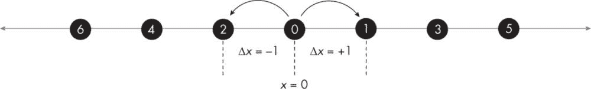

图 4-6：从 x = 0 开始的一维随机游走

粒子从位置*x* = 0 开始，以离散的步长Δ*x* = ±1 进行移动。粒子移动的方向是随机的，因此它在位置 0 后的下一位置可能是 1（位移为+1）或 2（位移为−1）。选择任一方向的概率*p*是相等的，因此*p* = 0.5。注意，在任何给定的位置，粒子都可以改变其方向，因此粒子可能会走几步随机的步伐，并最终回到起点。

我们感兴趣的问题是：在进行任意步数*n*后，粒子从起始位置平均移动了多远？为了回答这个问题，我们需要模拟许多随机行走——例如，500 次每次 1000 步的行走——并分析结果。然而，我们不能仅仅取不同模拟中累积行走距离的平均值；因为粒子可以在正负 x 方向上漂移，所以净正距离和净负距离很可能会相互抵消，导致我们得到一个大约为 0 的平均距离。相反，我们将使用*均方根（RMS）距离*，它通过以下三个步骤来计算：

1.  将所有模拟中在给定步数*n*后的距离平方。这将把任何负数转换为正数。

2.  将第一步的所有结果相加，然后除以模拟次数，求得平方距离的均值（平均值）。

3.  对第 2 步的结果取平方根，得到 RMS 距离。

根据过去在一维随机行走中的研究，我们知道 RMS 距离与步数之间存在非线性关系；理论上，第*n*步后的 RMS 距离应该等于*n*的平方根。为了验证这一观点，我们将计算 RMS 距离（*模拟* RMS）和*n*的平方根（*理论* RMS），并将它们与步数*n*绘制在同一图表上。希望这两条曲线能非常相似。我们还将绘制每个时间步的平均距离，这应该保持接近 0。

在一个单独的图表中，我们将可视化 500 个随机行走的轨迹。这将有助于说明结果的随机性，并进一步支持我们关于累积和 RMS 行走距离的理论。

#### 代码

我将按照自上而下的顺序呈现该项目的代码段，从一些常规的设置代码开始。由于我们希望可视化不同模拟的随机行走，并且研究累积、均值和 RMS 距离与步数之间的关系，我们将使用在第三章中开发并使用的 JavaFX 模板。

```
// import block
import javafx.application.Application
import javafx.scene.Node
import javafx.scene.Scene
import javafx.scene.chart.LineChart
import javafx.scene.chart.NumberAxis
import javafx.scene.chart.XYChart
import javafx.scene.control.ScrollPane
import javafx.scene.layout.Background
import javafx.scene.layout.BackgroundFill
import javafx.scene.layout.CornerRadii
import javafx.geometry.Insets
import javafx.scene.layout.VBox
import javafx.scene.paint.Color
import javafx.stage.Stage
import kotlin.math.sqrt

// data class
❶ data class State(
    var step: Double,
    var dist: Double
)

// global parameters
val numStep = 1000
val numSim = 500

❷ // Create lists needed for plotting line charts.
val xList  : List<State> = List(numStep) {State(0.0, 0.0)}
val avgList: List<State> = List(numStep) {State(0.0, 0.0)}
val rmsList: List<State> = List(numStep) {State(0.0, 0.0)}
val expList: List<State> = List(numStep) {State(0.0, 0.0)}

val states1 = mutableListOf<List<State>>()
val states2 = mutableListOf<List<State>>()

class RandomWalk1D : Application() {
    override fun start(primaryStage: Stage) {
      ❸ val root = VBox()
        /*------------------------------------------*/
      ❹ root.styleClass.add("color-palette")
        root.background = Background(BackgroundFill(Color.WHITE,
             CornerRadii.EMPTY, Insets.EMPTY))
        /*------------------------------------------*/
      ❺ val scroll = ScrollPane()
        scroll.setContent = root
        val scene = Scene(scroll, 550.0, 850.0, Color.WHITE)
        primaryStage.title = "1D random Walk Simulation"
        primaryStage.scene = scene
        primaryStage.show()

        // ----- Random walk simulation starts here. -----
        // Call random walk function.
        randomWalk1d()
        // Get the theoretical RMS values.
        calcRMS1d()
        // Create line charts.
        createRWChart1(root)
        createRWChart2(root)
    }
}

fun main() {
    Application.launch(RandomWalk1D::class.java)
}
```

代码段从导入块开始。由于这个项目将使用 JavaFX 的 XY 图表功能，而不是画布功能，因此导入块与第十三章所需的有所不同，并且它包含了一些额外的代码行来导入 Background、BackgroundFill、CornerRadii 和 Insets 功能，这些将用于将图表背景设置为白色。

接下来，我们声明了一个简单的数据类 State ❶，用于在模拟过程中保存单个数据点。它的 step 属性表示从随机行走开始以来所经过的步数，而 dist 则是经过这么多步之后的累计行驶距离。然后，我们声明了两个全局参数：numStep，用于指定每个模拟的最大步数，和 numSim，用于设置模拟的最大数量。

我们将把数据累积到多个列表 ❷ 中，每个列表的大小为 numStep，类型为 State，具体如下：

xList 存储特定模拟中每一步的累计行进距离

avgList 存储所有模拟中每一步的累计距离的算术平均值（均值）

rmsList 存储所有模拟中每一步的 RMS 距离

expList 存储每一步之后的理论（指数）RMS 距离

所有这些列表都初始化为 (0.0, 0.0)，这意味着所有模拟从步骤 0 和位置 0 开始。除了这些列表之外，我们还创建了两个可变列表 states1 和 states2，供绘图使用。

在 RandomWalk1D 应用类内部，我们使用一个 VBox 容器 ❸ 来保存图表对象，因为我们将生成两组图表，它们将垂直放置在 VBox 中。注意额外的代码行，用于编程设置容器的背景为白色 ❹，而不是使用需要更复杂自定义样式的层叠样式表（CSS）。我们还引入了 ScrollPane 功能 ❺，它允许我们滚动图表窗口，以查看顶部或底部的图表，按需查看。我们还可以放大窗口，以便同时查看两个图表。

在设置好图形窗口后，我们调用三个自定义函数来运行模拟并帮助可视化结果。第一次调用是 randomWalk1d() 函数，它模拟了 numSim 次一维随机行走，共进行 numStep 步。它的工作方式如下：

```
fun randomWalk1d() {
    // Create local arrays.
  ❶ val s = Array (numSim) {DoubleArray(numStep)}
    val sumX = DoubleArray(numStep)
    val sumX2 = DoubleArray(numStep)

    // Walk numStep steps numSim times.
    for (i in 0 until numSim) {
        var draw: Int
        var step: Int
 for (j in 1 until numStep) {
          ❷ draw = (0..1).random()
            step = if (draw == 0) -1 else 1
          ❸ s[i][j] = s[i][j-1] + step
            sumX[j] += s[i][j]
            sumX2[j] += (s[i][j] * s[i][j])
            xList[j].step = j.toDouble()
            xList[j].dist = s[i][j]
        }
      ❹ states1.add(xList.map {it.copy()})
    }

    // Create average (mean) and RMS for distances traveled.
    for (j in 0 until numStep) {
        avgList[j].step = j.toDouble()
        avgList[j].dist = sumX[j] / numSim
        rmsList[j].step = j.toDouble()
        rmsList[j].dist = sqrt(sumX2[j] / numSim)
    }
  ❺ states2.addAll(listOf(avgList, rmsList))
}
```

函数体首先创建了三个类型为 DoubleArray 的局部数组。第一个，s，是一个二维数组，用于存储每个模拟中每一步的累计距离 ❶。其他两个是单维数组，sumX 和 sumX2，分别用于保存每一步的累计距离的运行总和和每一步的平方距离的总和。我们将使用这些值来计算均值和 RMS 距离。

随机游走是通过嵌套的 for 循环实现的。外部循环控制模拟的次数，内部循环让粒子连续执行 numStep 步。在每一步中，一个局部变量 draw 被随机设置为 0 或 1，且两者的概率相等 ❷。根据结果，步长（在图 4-6 中称为 Δ*x*）被设置为 -1 或 1，然后加到之前步骤的累计距离上 ❸。这些累计距离用于创建 xList 的元素，然后在每次模拟时将其复制并传递给 states1 ❹。注意，我们在每次模拟中通过覆盖 xList 元素的值来重用为 xList 分配的内存。最终，states1 包含了我们可视化随机游走所需的所有数据。

完成随机游走后，我们使用结果列表 sumX 和 sumX2，在另一个 for 循环中通过将 sumX 和 sumX2 的元素除以 numSim 来创建 avgList 和 rmsList。这里 sumX[j] 是 s[i][j] 矩阵中第 j 列所有元素的和，其中 i 表示模拟的编号，j 表示到目前为止所走的步数。（同样，sumX2[j] 是相同的平方和。）最后，avgList 和 rmsList 作为 states2 ❺ 的元素传递，我们之前定义了 states2 作为一个包含列表的列表。

应用类中的第二个函数调用是 calcRMS1d()。它在每一步生成理论的 RMS 距离：

```
fun calcRMS1d() {
    // Create the theoretical (exponential) rms/list.
 for (j in 0 until numStep) {
        expList[j].step = j.toDouble()
      ❶ expList[j].dist = sqrt(j.toDouble())
    }
    states2.add(expList)
}
```

根据对一维随机游走问题的理论分析，我们知道 RMS 距离是步数 *n* 的非线性函数，表达式为 *x*n = √*n*，其中 *x*n 是第 *n* 步的 RMS 距离（*n* 相当于代码中的循环变量 j）。我们在 calcRMS1d() 函数中使用这个关系来计算理论的 RMS 距离，并更新 expList ❶。我们将使用这个列表来创建理论与模拟 RMS 距离的并排图，以查看它们之间的拟合程度。

在应用类的最后两行，我们连续调用了 createRWChart1() 和 createRWChart2() 函数，如下所示：

```
fun createRWChart1(root: VBox) {
    val xyChart1 =
        singleXYChart(states1,
            title = "Random Walk 1D Experiment",
            xLabel = "Steps",
            yLabel = "Cumulative distance traveled")
    root.children.add(xyChart1)
}

fun createRWChart2(root: VBox) {
    val xyChart2 =
        singleXYChart(states2,
            title = "Random Walk 1D Experiment",
            xLabel = "Steps",
            yLabel = "Mean and RMS distance traveled")
    root.children.add(xyChart2)
}
```

除了图表标签外，这两个函数的唯一区别是，第一个使用 states1，第二个使用 states2 来生成相应的图表。这两个函数都调用了 singleXYChart() 函数（我们在第三章中讨论并使用过），用于绘制折线图并将其堆叠在滚动窗格中。

#### 结果

当你在设备上运行完整代码时，你应该会看到一个可滚动的窗口弹出，窗口中有两个独立的图表。我们首先来考虑随机游走本身的可视化，见图 4-7。

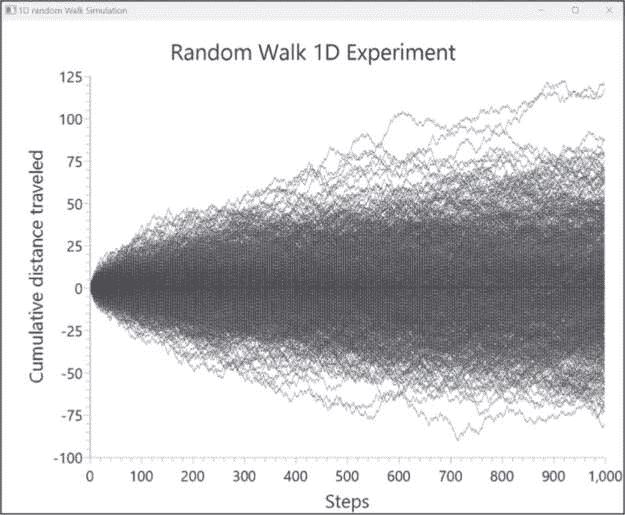

图 4-7：来自 500 次模拟的 1,000 步随机游走路径

该图表展示了由 randomWalk1d()函数生成的 500 条随机路径（每次模拟一条，基于我们的全局 numSim 参数）。这些路径显示了一维随机游走的一些关键特征：

+   每条随机路径都是独特的，这一点从图表中穿越的交织线条中可以看出。

+   大多数随机游走即使走了很多步，也倾向于保持在其起始位置附近。我们可以在沿 x 轴的较暗带中看到这一点。

+   这些路径在 x = 0 的两侧均匀分布，这也是预期的结果。你可以通过创建不同步数下的累计距离直方图来确认这一点。（我将把这个作为练习留给你去尝试。）

+   对于任何给定的步数，如果我们将所有模拟的累计距离相加，结果将接近零，因为正负距离会相互抵消。出于同样的原因，算术平均值也将接近零。

+   均方根距离随着步数的增加而增加，这一点通过包围所有随机路径的带状区域逐渐变宽得到了确认。因此，均方根距离比算术平均值更能准确衡量平均行进距离，因为我们不关心运动的方向。

所有这些要点共同提供了我们在项目开始时所寻找的答案。一个在一维空间中随机移动的粒子，最初可能会沿着一条路径移动，该路径会保持接近其起始位置。然而，如果我们跟踪粒子很长时间，它可能会逐渐远离原点。同样，我们无法准确预测某个特定粒子会移动多远，但如果我们测量许多不同粒子的均方根（RMS）距离，我们会发现均方根距离随着步数的增加而增加。我们的另一张图表，展示在图 4-8 中，帮助我们进一步探讨这一点。

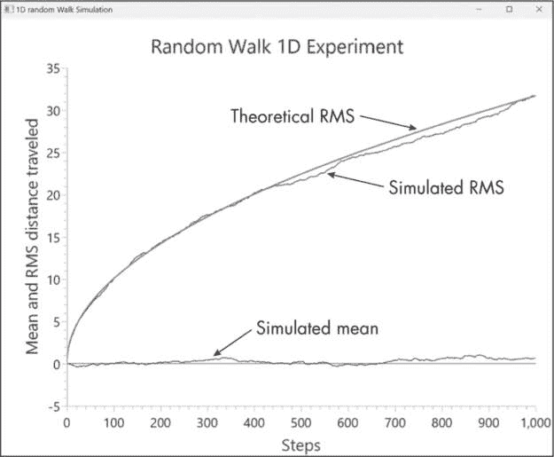

图 4-8：给定步数下的均值和均方根距离

图 4-8 绘制了三条线。首先，我们有标记为“模拟均值”的线，这是从 avgList 中的数据生成的。该线始终接近零，确认了基于图 4-7 的一个关键点：对于任何步数，如果我们有足够多的观察数据，那么算术平均值或均值将为零。其次，我们有“模拟 RMS”线，这条线是从 rmsList 中的数据生成的，清晰地显示了均方根距离随着步数的增加而增加（尽管增加的速率逐渐减缓）。第三条是平滑的“理论 RMS”线，它代表了通过对 expList 中的步数数据取平方根计算得出的理论均方根距离。同样，我们可以直观地确认，模拟的 RMS 值非常接近理论上预期的 RMS 值。

我们看到的模拟和理论 RMS 值之间的细微差异是可以预期的。当模拟次数接近无穷大时，模拟的 RMS 值将接近理论值。我邀请你重新运行代码，这次将 numSim 设置为 5000。在此之前，请确保注释掉对 createRWChart1() 函数的调用。JavaFX 的默认实现占用大量内存和计算资源，尝试绘制 5000 条线，每条线有 1000 个数据点，可能会根据你的处理器和内存配置需要一些时间。然而，如果你按照建议进行此实验，你会看到，随着增加的随机游走，模拟和理论 RMS 曲线几乎完全相同。如果你进一步将 numSim 设置为 50000，你将看到只有一条线。

### 摘要

在本章中，我们使用了 Kotlin 代码和自定义算法来解决与数学相关的问题。这些问题不仅是理论性的；它们在数学、测量学、导航和密码学等领域也有实际应用。在整个过程中，我们运用了多种数学概念、运算和工具，包括基本的算术运算、数学和三角函数、毕达哥拉斯定理、斐波那契数列、哈弗辛公式、模运算和线性代数。我们还探讨了随机过程的领域，研究了如何生成和利用随机数来模拟随机现象。

在此过程中，我们使用了 Kotlin 的许多核心特性，如变量和集合、数据类，以及条件和迭代结构，如 if、when、for 和 while。我们还发现了函数和 Lambda 的便利性，并充分利用了我们手头的丰富数学和图形库函数。

### 资源

Ayars, Eric. “Stochastic Methods.” In *Computational Physics with Python*, 131–139\. August 18, 2013\. Accessed June 15, 2024\. *[`belglas.files.wordpress.com/2018/03/cpwp.pdf`](https://belglas.files.wordpress.com/2018/03/cpwp.pdf)*.

Dutka, Jacques. “Eratosthenes’ Measurement of the Earth Reconsidered.” *Archive for History of Exact Sciences* 46, no. 1 (1993): 55–66\. Accessed June 15, 2024\. *[`<wbr>www<wbr>.jstor<wbr>.org<wbr>/stable<wbr>/41134135`](http://www.jstor.org/stable/41134135)*.

Eisenberg, Murray. “Hill Ciphers and Modular Linear Algebra.” November 3, 1999\. Accessed June 15, 2024\. *[`apprendre-en-ligne.net/crypto/hill/Hillciph.pdf`](https://apprendre-en-ligne.net/crypto/hill/Hillciph.pdf)*.

Harder, Douglas. “Project H.1: Sieve of Eratosthenes.” University of Waterloo. Accessed June 15, 2024\. *[`ece.uwaterloo.ca/~ece150/Programming_challenges/H/1/`](https://ece.uwaterloo.ca/~ece150/Programming_challenges/H/1/).*

Kereki, Federico. “从巴比伦方式看平方根的现代视角。” *Cantor 的乐园*。2020 年 12 月 7 日。访问日期：2024 年 6 月 15 日。 *[`medium.com/cantors-paradise/a-modern-look-at-square-roots-in-the-babylonian-way-ccd48a5e8716`](https://medium.com/cantors-paradise/a-modern-look-at-square-roots-in-the-babylonian-way-ccd48a5e8716)*。

“毕达哥拉斯三元组。” Prime 词汇表。访问日期：2024 年 6 月 15 日。 *[`t5k.org/glossary/page.php?sort=PrmPythagTriples`](https://t5k.org/glossary/page.php?sort=PrmPythagTriples)*。

Reich, Dan. “斐波那契数列、螺旋和黄金比例。” 数学系，天普大学。访问日期：2024 年 6 月 15 日。 *[`math.temple.edu/~reich/Fib/fibo.xhtml`](https://math.temple.edu/~reich/Fib/fibo.xhtml)*。

Van Brummelen, Glen. *天文数学：被遗忘的球面三角学艺术*。普林斯顿，新泽西州：普林斯顿大学出版社，2013 年。
