## 第五章：5 模型与仿真


在本章中，我们将进行几个小型科学项目，这些项目将进一步增强你在 Kotlin 中的编码能力。此外，本章的小项目将通过展示如何应用自然法则和数学原理来解决一些没有计算机帮助就很难解答的问题，从而提高你的问题解决能力。

由于可视化是科学研究的关键部分，我们还将使用我们在第三章中开发的图形模板来可视化我们的程序输出。

项目 17：预测炮弹的飞行轨迹

想象一个古老的城堡，周围被厚重的防御墙包围。墙上有凹口，警觉的士兵们站在那里，随时准备向任何侵犯的敌人开火。通常，城堡建在较高的地方，以便更好地观察周围的情况，而大炮本身也被放置在较高的地方，相对于城堡的基础，以最大化它们的射程。在这个射程内，士兵们可以通过调整大炮的参数来击中不同距离的目标。我们的问题是，士兵们如何瞄准大炮以击中地面上*距离 x*的目标？

假设此时没有空气阻力，并且忽略风的影响，炮弹的飞行距离受到三个因素的影响：大炮的高度、发射角度和炮弹的出口速度。士兵们不能轻易改变大炮的高度或炮弹的出口速度，但他们可以调整发射角度，因此我们将把注意力集中在这里。图 5-1 展示了问题的本质。

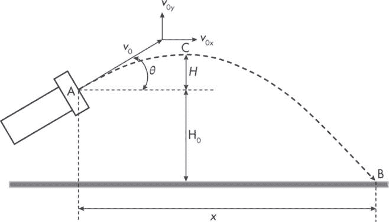

图 5-1：炮弹的飞行路径

炮弹从点 A 发射，点 A 相对于地面的高度为 H[0]，目标是击中点 B。炮弹的发射速度为*v*[0]，发射角度为*θ*。

一旦炮弹被发射，它就变成了一个*抛射体*，即一个只受一种力作用的运动物体：重力。为了得出*θ*的正确值，我们需要了解一些关于抛射物的科学知识。首先，假设炮弹只在两个维度内运动：水平和垂直。我们将这个二维坐标系的原点设在点 A。给定初始速度*v*[0]，它以角度*θ*发射，我们可以将初始速度的 x 分量和 y 分量写为：

*v*[0]x = *v*[0] cos*θ*

*  v*[0]y = *v*[0] sin*θ*

这些速度分量告诉我们炮弹在水平和垂直方向上的运动速度，完全由其初速度决定。同样，忽略空气或风的影响，水平方向上没有其他力作用于炮弹。因此，我们可以说水平方向上的速度*v*x 保持不变：

*  v*x = *v*[0]x = *v*[0] cos*θ*

然而，在垂直方向上，重力加速度会减缓球的上升，最终使其落到地面。因此，我们可以表示垂直方向的合成速度 *v*y，如下所示：

*  v*y = *v*[0]y − *g t* = *v*[0] sin*θ* − *g t*

这里 *g* 是重力加速度，*t* 是时间。

使用这些 *v*x 和 *v*y 的表达式，我们可以写出投射物的 *位移方程*，它们表达了投射物在某一时刻 *t* 的 x 和 y 坐标，或者说球在水平方向和垂直方向上已行进的距离：

$Equation$ (5.1)$Equation$ (5.2) 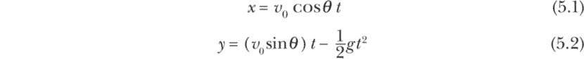

如果我们现在假设到达目标点 B 所需的时间为 *t*[B]，那么到目标的水平距离为：

$Equation$ (5.3) 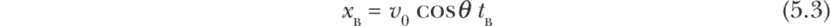

在相同的时间 *t*[B] 内，投射物还会在垂直方向上运动。它将经过点 C（如图 5-1 所示），球的最高点，位于 *H* + H[0]，然后自由下落至地面，同时继续以速度 *v*x 水平运动。当投射物到达目标点 B 时（意味着击中目标），其净垂直位移 *y*[B] 将为 −H[0]，可以通过方程 5.2 表示为：

$Equation$ (5.4) 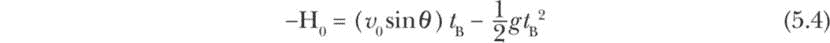

然而，我们实际上并不知道大炮球到达目标所需的时间，因此需要找到一种方式，将 *t*[B] 以其他变量表示。方程 5.4 是一个 *二次方程*，其中变量的最高次方是 2。可以通过求解 *t*[B] 的正值得到：

$Equation$ (5.5) 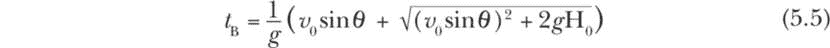

我们现在可以用方程 5.5 来替代方程 5.3 中的 *t*[B]，得到以下关于 *θ* 的 *x*[B] 函数方程：

$Equation$ (5.6) 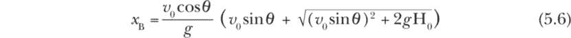

这个方程建立了目标距离 *x*[B] 和发射角度 *θ* 之间的关系，但它仍然无法让我们根据给定的 *x*[B] 计算 *θ*。我们需要的是一个表达 *θ* 关于 *x*[B] 的方程，而不是反过来。

我们有两种方法来解决这个问题。一种是解析方法，通过重排方程 5.6，推导出 *θ* 关于 *x*[B] 的表达式。虽然可以做，但需要大量的数学运算。另一种方法是使用 *数值方法*，通过一个迭代过程，根据某个算法来解决问题。数值方法也是一种近似方法，这意味着它不会给出与理论解完全相同的结果。然而，我们可以选择所需的精度，通常这种精度足够高。事实上，对于许多这种类型的实际问题，我们可能根本没有已知的理论解，在这种情况下，数值方法是解决问题的唯一可行选项。这就是为什么我们将使用数值方法来回答我们的大炮问题。

### 策略

我们需要执行一个额外的步骤，使问题适合数值方法：将*x*[B]移到方程 5.6 的右边，并将其转化为*θ*的函数。换句话说，我们将定义函数*f*(*θ*)如下：

$方程$ (5.7) 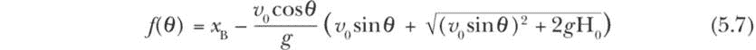

为了解决我们的炮弹问题，我们现在需要找到一个自变量*θ*的值，对于给定的*x*[B]，它将使方程 5.7 的右边等于零。用数学术语来说，这个值被称为该函数的*根*。我们已将抛物线问题转化为求根问题。

我们可以使用多种方法来求解方程 5.7 的根。在本例中，我们将使用一种简单的方法，称为*二分法*，如图 5-2 所示。

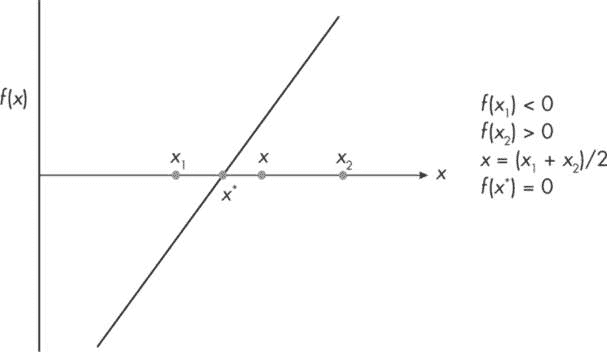

图 5-2：二分法求根的元素

假设我们正在尝试找到一个简单线性函数*f*(*x*)的根，它是自变量*x*的连续函数，如图 5-2 所示。根是使函数等于零的*x*值。以下是找到根*x*使得*f*(*x*) = 0 的简单二分法步骤：

1.  找到两个值 x[1] 和 x[2]，使它们在根的两侧，即 f(x[1]) < 0 且 f(x[2]) > 0。

2.  找到 x[1] 和 x[2] 之间的中点 x，使得 x = (x[1] + x[2])/2。

3.  如果 f(x) 的绝对值小于某个容差因子（例如，0.0000001），则 x 就是根，我们完成了。

4.  否则，如果 f(x) * f(x[2]) > 0，则设置 x[2] = x，否则设置 x[1] = x。

5.  重复步骤 2 到步骤 4，直到满足步骤 3 中的条件。

如果*f*(*x*)在初始区间[*x*[1], *x*[2]]内连续且包含根或多个根，则该方法保证会收敛到根。废话不多说，我们开始编码吧！

#### 代码

二分法只涉及几行代码，如下所示：

```
❶ // Import Kotlin math functions.
import kotlin.math.sin
import kotlin.math.cos
import kotlin.math.PI
import kotlin.math.sqrt
import kotlin.math.pow
import kotlin.math.abs

❷ // Set global parameters.
val v0 = 70             // m/s
val g = 9.8             // m/s2
val h0 = 25             // m
val target = 400        // m
val TOL = 1.0e-7

private val f = :: projectile

❸ // The interval [x1, x2] needs to enclose the root.
val x1 = 10.0    // in degrees
val x2 = 30.0    // in degrees

fun main() {
    println("\n*** Firing angle for hitting a target ***\n")

  ❹ if (f(x1) * f(x2) < 0) {
        println("...Initial guesses are valid...")
        val root = bisection(x1, x2)
        val rootFormatted = String.format("%.2f", root)
        println("The firing angle to hit the target is:" +
                "\n$rootFormatted degrees")
    } else {
        println("\n...Initial guesses are not valid...\n")
    }
}

fun projectile(angle: Double): Double {
  ❺ val x = angle * PI / 180.0
    return target - (v0 * cos(x) / g) *
            (v0 * sin(x) + sqrt((v0 * sin(x)).pow(2) + 2 * g * h0))
}

fun bisection(_x1: Double, _x2: Double): Double {
    var x1 = _x1
    var x2 = _x2
  ❻ var x = (x1 + x2) / 2.0

  ❼ while (abs(f(x)) >= TOL) {
        if (f(x) * f(x2) > 0) {
            x2 = x
        } else x1 = x
        x = (x1 + x2) / 2.0
    }
    return x
}
```

我们首先导入数学库函数 ❶，并提供全局参数值 ❷。请注意，我们只导入了需要的数学函数，而不是使用 import kotlin.math.* 来导入所有数学函数。好的编码习惯是只使用所需的功能，因为这有助于保持命名空间的清洁，减少引入 bug 的机会，尤其是在代码被重复使用时。

在这个例子中，我们将目标距离设置为 400 米，火炮高度为 25 米，炮弹的初速度为 70 米/秒。接下来，我们为二分法设置初始值 x1 和 x2 ❸，并将函数参数 f 设置为 projectile。将 projectile 作为参数可以让我们重用代码来找到其他函数的根。

main() 函数使用 if...else 语句块来确认初始的 x1 和 x2 猜测位于根的两侧 ❹。如果条件成立，它调用 bisection() 函数来找到根。如果测试失败，程序会打印一条消息，表示初始猜测无效。

下一个代码块定义了 projectile() 函数，该函数计算给定角度下方程 5.7 的右侧内容，首先将角度转换为弧度 ❺，以便 sin() 和 cos() 函数使用。

最后的代码块是 bisection() 函数，执行之前概述的步骤。该函数将两个初始猜测作为参数，找到它们之间的中点 ❻，然后使用 while 循环 ❼ 进行越来越小的二分，直到中点位于指定的容差范围内。该函数返回根值作为 x（类型为 Double）。

#### 结果

如果你运行程序，输出应该如下所示：

```
*** Firing angle for hitting a target ***

...Initial guesses are valid...
The firing angle to hit the target is:
21.91 degrees
```

最后，我们得出了炮弹问题的答案！在给定的初始速度和大炮离地面高度的情况下，士兵们需要以 21.91 度的角度发射大炮，才能击中 400 米远的目标。

让我们再深入思考一下这个解决方案。这是唯一能达到目标的方式吗？图 5-3 显示了 *f*(*θ*) 随 *θ* 的变化（在给定的参数值下）。

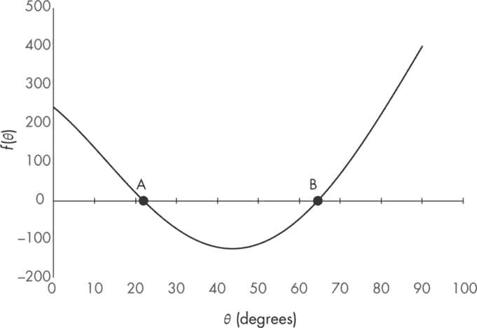

图 5-3：f(θ) 和 θ 之间的关系

该函数呈抛物线形曲线，穿过 x 轴两次，因此它对 *θ* ≥ 0 有两个不同的根。从给定的初始猜测中，我们已找到第一个根在 A 点，但另一个根在 B 点，那里 *θ* = 64.51 度。这是一个比第一个解更陡峭的角度，*θ* = 21.91 度。图 5-4 显示了在这两个发射角度下，炮弹的路径或 *轨迹*。

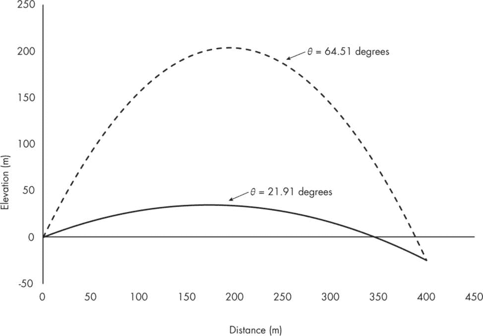

图 5-4：两个炮弹解的轨迹

虽然在任何一个角度发射的炮弹都会击中目标，但当 *θ* = 64.51 度时，炮弹将达到更高的高度，且击中目标所需的时间更长。你认为士兵们会更倾向于哪种选择，为什么？

项目 18：设计一个水流喷泉

在这个项目中，我们将继续探索抛射物的轨迹，但我们不会追逐炮弹，而是追踪水流。水流喷射有许多常见的应用，例如洗车、浇灌草坪和灭火。我们将探索一个更具艺术感的例子：通过喷嘴组件运行水流，创造一个装饰性喷泉。

*喷嘴* 是一个狭窄的开口，液体或气体以高速从其中喷出。在给定压力下，喷嘴开口越狭窄，喷流的速度越快。在喷泉使用的喷嘴装置中，多个不同大小或可调开口的喷嘴可以以不同角度布置。设计师通过调整这些参数，创造出美丽的水流图案。在这种情况下，我们将尝试调整喷嘴，将喷流射向多层喷泉的不同高度。图 5-5 说明了这个问题。

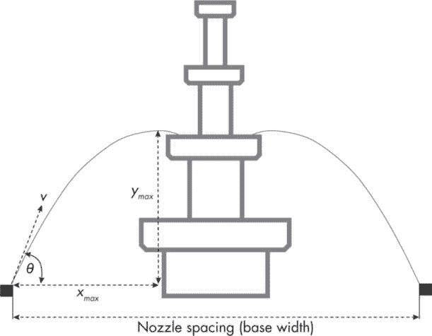

图 5-5：将喷嘴指向多层水喷泉

本次练习的目标是根据喷流轨迹的最高点 (*x*max, *y*max) 来估算喷流的速度 *v* 和喷射角度 *θ*。这个高点设置为喷流恰好从某一特定水平的水池边缘飞过，如图 5-5 所示。喷泉有四个层级，因此我们有四组 (*x*max, *y*max)，如表 5-1 所示。

表 5-1：喷泉参数

| 层级 | xmax（米） | ymax（米） |
| --- | --- | --- |
| 1 | 2.25 | 1.5 |
| 2 | 2.55 | 3.0 |
| 3 | 2.85 | 4.25 |
| 4 | 3.0 | 5.5 |

本表中的数值相对于喷嘴位于点 (0, 0) 定义。我们将利用这些数值来计算对应的 *v* 和 *θ* 值。此外，我们还将通过使用 JavaFX 的画布功能绘制喷流的轨迹，以便我们可以将解与水喷泉进行可视化。

请注意，图 5-5 仅显示了喷泉系统的一个截面，该系统在三维空间中呈圆形。喷嘴被布置在喷泉系统底部的对角线位置，该底部由地面水池（未显示）、喷嘴和四层中层结构组成。我们将使用喷嘴之间的间距作为喷泉系统的基础宽度。

#### 策略

我们需要使用三个特定的方程来解决这个问题，这些方程都可以从项目 17 中讨论的抛射方程推导出来（在线搜索“抛射运动”或“运动方程”以了解推导过程，或参见本章末尾列出的资源）。

$Equation$ (5.8)$Equation$ (5.9)$Equation$ (5.10) 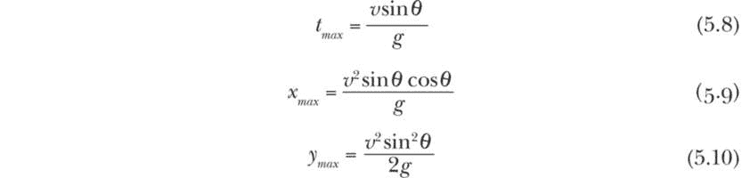

我们已经定义了这些方程中的变量，除了 *t*max，这个值表示水滴从喷嘴离开并达到最高点 (*x*max, *y*max) 所需的时间。我们可以使用方程 5.9 和 5.10 来求解 *θ* 和 *v* 的表达式，如下所示：

$Equation$ (5.11)$Equation$ (5.12) 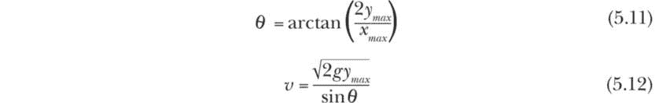

我们将使用这些方程来计算四个喷泉级别的喷射角度和速度，基于表 5-1 中提供的数据。我们还将使用方程 5.8 来计算轨迹，并利用 JavaFX 库将其绘制出来。

#### 代码

我们的项目使用了与第三章中详细讨论的相同基本 JavaFX 模板。我们从一些整体设置开始。

```
// Import JavaFX features.
import javafx.application.Application
import javafx.scene.Scene
import javafx.scene.canvas.Canvas
import javafx.scene.canvas.GraphicsContext
import javafx.scene.layout.Pane
import javafx.scene.paint.Color
import javafx.stage.Stage

// Import required math functions.
import kotlin.math.sin
import kotlin.math.cos
import kotlin.math.tan
import kotlin.math.atan
import kotlin.math.pow
import kotlin.math.PI
import kotlin.math.sqrt

// Set global parameters and variables.
val baseWidth = 6.5  // m
val xMaxJet = doubleArrayOf(2.25, 2.55, 2.85, 3.0)
val yMaxJet = doubleArrayOf(1.5, 3.0, 4.25, 5.5)
val angle = DoubleArray(4)
val vel = DoubleArray(4)
val g = 9.8  // m/s2

// Set canvas properties.
val xMin = -0.5
val xMax = baseWidth + 0.5
val yMin = -0.5
val yMax = 6.0
val xRange = xMax - xMin
val yRange = yMax - yMin
val canvasW = 700.0
val canvasH = (canvasW/ xRange) * yRange
```

导入块的前半部分从 JavaFX 库中导入了必要的图形功能，后半部分从 kotlin.math 库中导入了所需的数学函数。

接下来，我们定义全局参数和变量。喷泉系统的基础宽度已设为 6.5 米。抛物线水流的最高点坐标（xMaxJet 和 yMaxJet）通过 DoubleArray 类型进行设置。我们还创建了数组来存储我们将要计算的角度和速度。由于我们设想这个喷泉位于地球上，重力加速度 g 被设定为 9.8 m/s²。最后，根据喷泉的宽度和高度，我们设置了画布所需的尺寸，并在两侧留出了一些边距。

剩余的项目代码包含三个核心部分：ShapeOfWater 应用程序类和两个辅助函数，getAngleAndVel() 和 getTrajectories()。我们将依次查看这些部分。

##### ShapeOfWater 应用程序类

ShapeOfWater 应用程序类管理画布并调用辅助函数。

```
// the primary application class
class ShapeOfWater : Application() {
    override fun start(stage: Stage) {
        val root = Pane()
        val canvas = Canvas(canvasW, canvasH)
        val gc = canvas.graphicsContext2D
        gc.translate(0.0, canvas.height)
        gc.scale(1.0, -1.0)
        root.children.add(canvas)
        val scene = Scene(root, canvasW, canvasH)
        scene.fill = Color.WHITE
        stage.title = "Shape of Water"
        stage.scene = scene
        stage.show()

        // problem-specific section
getAngleAndVel()
        getTrajectories(gc)
        println("\nNozzle velocities:")
        for (v in vel) print(String.format("%.2f  ", v))
        println("\nNozzle angles:")
        for (theta in angle)
             print(String.format("%.2f  ", theta))
    }
}

fun main() {
    Application.launch(ShapeOfWater::class.java)
}
```

该类遵循我们在第三章中开发的标准 JavaFX 模板，我们将在本书中始终使用此模板。请注意这两个函数调用。第一次调用 getAngleAndVel() 函数，计算四组坐标点的 *θ* 和 *v*，这些坐标对应于喷泉的四个水流级别。调用 getTrajectories() 函数计算对应的水流轨迹，并将其绘制在画布上。

类声明的末尾有几行打印语句，用于显示计算出的 *θ* 和 *v*（作为角度和速度）对于提供的四对 (*x*max, *y*max) 值的结果。为了方便阅读，这些值被四舍五入到小数点后两位。

##### getAngleAndVel() 函数

getAngleAndVel() 函数使用方程 5.11 和 5.12 来计算四个水流的 *θ* 和 *v*。

```
fun getAngleAndVel() {
    var index = 0

  ❶ xMaxJet.zip(yMaxJet) {x, y ->
        val theta = atan(2 * y / x)
      ❷ angle[index] = theta * 180/ PI
        vel[index] = sqrt(2 * g * y) / sin(theta)
 index += 1
    }
}
```

我们使用 zip() 和一个 lambda 表达式 ❶ 来处理 (*x*max, *y*max) 值的对，计算每一对的 theta 和 vel，并将这些值存储在相应的数组中。我们也可以使用 for 循环来遍历这些坐标，你可以尝试这作为一个练习。atan() 函数给出的是弧度的角度，但我们在将其存储到角度数组中之前，将其转换为度数，以使输出更加直观 ❷。

##### getTrajectories() 函数

getTrajectories() 函数根据 getAngleAndVel() 函数得到的数据计算水流的轨迹，并可视化结果。

```
fun getTrajectories(gc: GraphicsContext) {
    // Generate trajectories by iterating over time.
    vel.zip(angle) {v, _theta ->
        val theta = _theta * PI / 180
      ❶ val tmax = 1.1 * v * sin(theta)/g
        val delt = tmax/50

        // Calculate trajectory coordinates.
        var t = 0.0
      ❷ while (t <= tmax) {
            val x = v * cos(theta) * t
            val y = x * tan(theta) -
                (g / (2 * (v * cos(theta)).pow(2))) * x.pow(2)

            // Draw points on canvas.
          ❸ gc.fillOval(canvasW * (x - xMin)/ xRange,
                        canvasH * (y - yMin)/ yRange, 3.0, 3.0)
          ❹ gc.fillOval(
               canvasW * ((baseWidth - x) - xMin)/ xRange,
               canvasH * (y - yMin)/ yRange, 3.0, 3.0)
            t += delt
        }
    }
}
```

首先，我们通过使用方程 5.8 计算每个（*x*max, *y*max）对的*t*max。我们故意将*t*max 延长 10％，这样当轨迹绘制到那个时刻时，我们就能看到喷射开始向下弯曲，朝着水池方向 ❶。接下来，我们使用一个 while 循环 ❷，在 0 到*t*max 之间迭代 50 个均匀的时间步长。使用 while 循环可以让我们在每个时间步长上使用实数（非整数）增量，而使用 for 循环则不行，因为它的迭代器只能是整数。

在 while 循环内，我们使用在项目 17 中引入的原始位移方程 5.1 和 5.2 来计算水粒子在每个时间步长的连续位置，从而得到从喷嘴到水池的整个水流轨迹。我们没有将这些值保存在数组中以供未来使用，而是立即用它们在画布上绘制小圆圈 ❸。通过对所有（*θ*，*v*）对和所有时间步长重复这一过程，我们创建了水流喷射的二维轮廓。注意，我们利用问题的对称性，在水池对面另一侧的喷嘴上绘制第二组喷射 ❹。对于这一额外的喷射组，我们只需要通过从 baseWidth 中减去 x 坐标来调整 x 坐标。

#### 结果

如果你运行可下载版本的代码，完整的二维解应该类似于图 5-6。该版本的代码包括两个额外的函数：drawFountain()和 drawNozzles()。前者用于根据给定的水流喷射的*x*max 和*y*max 数组绘制四级喷泉，而后者用于显示喷嘴的位置，如图 5-5 所示。我鼓励你研究这两个函数并理解用于计算喷泉尺寸和喷嘴位置的逻辑。

要改变轨迹的形状，可以调整水流喷射的*x*max 和*y*max 值。喷泉的形状会自动调整。然而，重要的是要确保*x*max 和*y*max 的值一致且合理。例如，第二级的*x*max 和*y*max 应该大于第一级的值，三级和四级也应遵循类似的条件。此外，所有值必须是非负的。

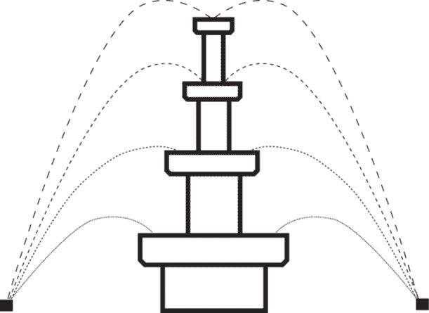

图 5-6：多级喷泉周围的水流喷射轮廓

喷嘴的速度（以米每秒为单位）和角度（以度为单位）的值会在运行代码时直接作为文本输出显示在屏幕上。输出应该如下所示：

```
Nozzle velocities:
6.78  8.33  9.63  10.76
Nozzle angles:
53.13  66.97  71.46  74.74
```

使用这个二维解来构建现实世界中的三维喷泉并不困难。由于我们之前设想喷泉系统是圆形的，所以我们需要做的就是在通过喷嘴组件的圆周上按一定间隔重复这个解。你还可以修改代码，生成自己独特的喷泉设计。

项目 19：追踪摆锤的运动与相位

*摆锤*是通过一根绳子、链条或杆子从固定点悬挂的物体或重物。当摆锤从其垂直位置的稳定平衡状态被移动时，它会在重力的作用下自由摆动。在理想条件下，当没有摩擦或空气阻力干扰时，摆锤一旦被启动，就会无限期地继续摆动。钟表制造商长期以来使用摆锤来稳定驱动机械钟表——比如，想象一下古老的落地钟摆动的摆锤。现实生活中的摆锤还包括秋千、拆除球和教堂钟铃等。

摆锤表现出*简谐运动（SHM）*，定义为物体的运动是*周期性的*，即重复的，并且受到两种相反的力驱动：*惯性力*使物体远离其平衡位置，*恢复力*则试图将物体拉回到平衡位置。物体相对于平均或平衡位置的最大位移称为*振幅*，物体在单位时间内经过的周期数称为*频率*。频率的倒数，即完成一个周期或振荡所需的时间，称为*周期*。

摆锤的简谐运动为理解自然界中更复杂的周期性运动提供了一个起点，从电子的振动到行星围绕恒星的轨道运动。本项目介绍了简单摆的运动方程。它展示了如何使用数值方法来解这个方程，并计算摆锤在任意给定时间的状态——即它的速度和位移角度——一旦摆锤开始摆动。为了增加真实感，我们将考虑空气阻力的影响，展示它如何逐渐减弱摆锤的运动。当然，我们会将我们的模型摆锤编码为 Kotlin，并通过我们在第三章中学到的 JavaFX 工具可视化结果。我们的可视化将包括三张图表：一张展示摆锤速度随时间变化的图表，一张展示位移角度随时间变化的图表，以及一张展示两者之间关系的图表。

#### 简单摆的运动

一个简单摆有一个单独的重物，或称为*摆球*，其质量为*m*，它悬挂在固定在 A 点的细绳上，绳长为*l*。假设与摆球的质量相比，绳子的质量可以忽略不计。还假设绳子不会因摆球的重量而拉伸，并且摆球可以无限期地前后摆动，而没有任何摩擦或能量损失（意味着系统的总能量在开始运动后是守恒的）。随着摆动，摆球的角位移（*θ*）会变化，相对于摆的稳定平衡位置（通过 A 点的垂直线）来测量。图 5-7 展示了简单摆的这些组成部分。

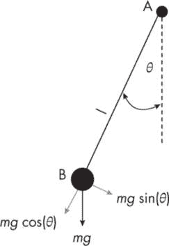

图 5-7：简单摆的组成部分

在任何时刻，重力*mg*作用于摆球，使其运动。重力有两个分量。第一个是*mg* cos(*θ*)，沿着绳子的方向作用，并被绳子的张力抵消。第二个是*mg* sin(*θ*)，垂直于绳子作用。这个分量没有被其他任何力平衡（假设没有空气阻力），并负责摆的谐波运动。

设*ω*表示角位移的变化率，也叫做*角速度*：

$方程$ (5.13) 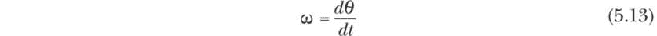

方程 5.13 的右侧称为*θ*对时间*t*的导数。从数学上讲，变量的时间导数给出了该变量相对于时间的瞬时变化率。

现在我们可以用角加速度来表示这个简单摆的运动方程，如下所示：

$方程$ (5.14) 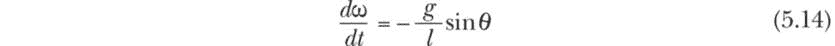

方程 5.14 的解析解将给出角位移*θ*相对于时间*t*和其他参数的表达式。然而，解析解不容易推导，除非我们做出一个额外的假设，即最大位移*θ*max 相对较小——比如小于 15 度。这将允许我们用*θ*替代 sin(*θ*)，因为对于小角度，二者是等价的。

然而，我们并不想仅限于这种特殊情况。相反，我们将使用欧拉-克罗梅数值方法，通过一个小的时间步长逐步求解方程 5.14。该方法保持简单谐振动中固有的能量守恒，并且能得到*稳定*的解（当数值近似解不会随着时间的推移恶化并偏离理论解时，解就是*稳定*的）。

#### 策略

为了应用欧拉-克罗梅方法，我们需要将方程 5.14 从连续时间形式转化为离散时间形式：

$方程$ (5.15) 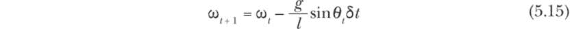

这里，*δt*是一个小的离散时间步长。接下来，我们将考虑空气阻力对摆的影响。空气阻力作为一个减速力会减缓角速度，可以假设它与角速度成正比。假设*γ*是比例常数，我们可以将公式 5.15 修改为：

$Equation$ (5.16) 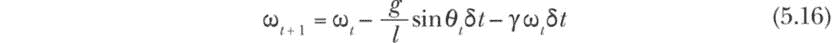

最后，我们将写出另一个用于更新角位移*θ*的表达式，它直接来自公式 5.13 中角速度*ω*的定义，如下所示：

$Equation$ (5.17) 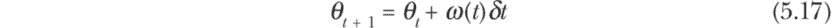

在这里，我们假设在一个小的时间间隔*δt*内，*θ*从*θ*t 变化到*θ*t [+ 1]。实际上，*ω*在这个小时间段内也会继续变化。我们通过在公式 5.17 中将*ω*表示为时间的函数——即*ω*(*t*)——来认识到这一点。然而，在离散时间表示中，我们只能使用*ω*的一个离散值，欧拉-克罗默方法要求它为*ω*t [+ 1]，以确保数值稳定性。因此，简单摆的运动方程的最终数值形式是：

$Equation$ (5.18) 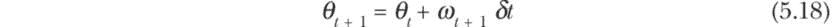

通过从*θ*和*ω*的初始值开始，并反复使用公式 5.16 和 5.18，我们可以计算一个简单摆的状态，并绘制其角位移和速度随时间的变化。

#### 代码

用于建模我们简单摆的程序有三个主要代码段：协调模型的主应用程序段，执行我们讨论的方程的 simplePendulumWithDrag()函数，以及绘制每个图表的 singleXYChart()函数。我们将按顺序详细回顾这些段落，从主应用程序段开始。

```
// import block
import javafx.application.Application
import javafx.scene.Scene
import javafx.scene.control.ScrollPane
import javafx.scene.layout.VBox
import javafx.scene.paint.Color
import javafx.scene.chart.*
import javafx.stage.Stage
import java.text.DecimalFormat
import kotlin.math.PI
import kotlin.math.sin
import kotlin.math.sqrt

// data classes
data class XYChartData(val x: Double, val y: Double)
data class PendulumData(val theta: Double, val omega: Double,
                         val t: Double)

// problem definition and global parameters
val theta0 = -PI/6  // angular displacement at t = 0, rad
val omega0 = 0.0    // angular velocity at t = 0, rad/s
val l = 0.4         // length, m
val g = 9.81        // acceleration due to gravity, m/s2
val n = 100         // intervals
val gamma = 0.6     // drag coefficient

class SimplePendulum : Application() {
    override fun start(primaryStage: Stage) {
        val root = VBox()
        val scroll = ScrollPane()
 scroll.content = root
        val scene = Scene(scroll, 550.0, 600.0, Color.WHITE)
        primaryStage.title = "Simple Pendulum"
        primaryStage.scene = scene
        primaryStage.show()

        // Generate pendulum state data.
      ❶ val state: List<PendulumData> =
            simplePendulumWithDrag(theta0, omega0,
                  l, g, n, gamma)
        // Create (x, y) series for plotting.
        val list1 = mutableListOf<XYChartData>()
        val list2 = mutableListOf<XYChartData>()
        val list3 = mutableListOf<XYChartData>()

      ❷ for (item in state) {
            val (theta, omega, t) = item
            list1 += XYChartData(t, theta)  // t along x-axis
            list2 += XYChartData(t, omega)  // t along x-axis
            list3 += XYChartData(theta, omega)
        }

        // Call singleXYChart() to generate plots.
        val xyChart1 =
            singleXYChart(list1,
                title = "Angular Displacement over Time",
                xLabel = "Time (sec)",
                yLabel = "Angular displacement (rad)")
        val xyChart2 =
            singleXYChart(list2,
                title = "Angular Velocity over Time",
                xLabel = "Time (sec)",
                yLabel = "Angular velocity (rad/sec)")
        val xyChart3 =
            singleXYChart(list3,
                title = "Phase-Space Plot (omega vs. theta)",
                xLabel = "Angular displacement (rad)",
                yLabel = "Angular velocity (rad/sec)",
                sort = "NONE")

        // Add the charts to the root (VBox) object.
      ❸ root.children.addAll(xyChart1, xyChart2, xyChart3)
    }
}

fun main() {
    Application.launch(SimplePendulum::class.java)
}
```

和往常一样，主要的应用代码段以一个 JavaFX 应用程序所需的标准导入块开始。这次，我们还将使用一个名为 ScrollPane 的类，它可以容纳一个图形元素，并提供可滚动的视图。这将帮助我们在同一个窗口中查看所有三个图表。导入块还包括我们为这个项目所需的数学函数。

第二个代码块声明了两个数据类。我们将使用 XYChartData 类来存储用于创建折线图的(*x*, *y*)数据点，使用 PendulumData 类来存储特定时间*t*下摆的状态（角位移*θ*和角速度*ω*）。每个 XYChartData 数据点将从特定 PendulumData 实例中的值中提取。

接下来，我们提供问题特定和全局的参数值。例如，我们设置初始位移为-PI/6（-30 度），初始速度为 0。摆长（以米为单位）为 0.4，n = 100 表示我们将通过将振荡周期分成 100 个间隔来确定时间步长(*δt*)的值。我们还将空气阻力的系数设置为 0.6（0 的值表示没有空气阻力）。

在 SimplePendulum 应用程序类中，特定问题的代码部分从调用 simplePendulumWithDrag()❶开始，该函数接受以下参数：初始位移*θ*[0]、初始速度*ω*[0]、摆钟的长度*l*、重力加速度*g*、每个周期的时间间隔数*n*，以及空气阻力系数*γ*。如你所见，稍后我们会详细了解该函数的内部工作原理，它返回一个 PendulumData 实例的列表，每个时间步对应一个实例，我们将其存储为状态。

接下来，我们创建三个可变列表来保存我们需要绘制的表示摆钟状态变量的折线图的 XYChartData 实例。通过从每个 PendulumData 实例中提取需要的元素来构建这些列表，以便为三个图表提供数据❷。图表 1 和图表 2 都将时间显示在 x 轴上，位移和速度分别显示在 y 轴上；图表 3 则将位移显示在 x 轴上，速度显示在 y 轴上。

我们通过连续调用 singleXYChart()函数来生成三个图表。该函数接受五个参数，其中四个参数在函数定义中已分配了默认值。因此，我们只需要提供一个类型为 XYChartData 的列表（例如，list1），并可以选择提供其他命名参数的值。请注意，对于 xyChart3，我们指定 sort = "NONE"，以便正确绘制（速度，位移）对，而不改变它们的顺序。这是考虑到空气阻力时的要求，因为空气阻力会改变这两个状态变量之间的周期性关系。

我们通过将图表附加到先前分配给 ScrollPane 的 root❸来绘制图表。这种方案允许我们通过上下或左右滚动在同一个窗口中查看所有三个图表。最后，main()函数在 JavaFX 应用程序中的唯一任务是启动主应用程序类——在本例中是 SimplePendulum。

##### simplePendulumWithDrag()函数

在 simplePendulumWithDrag()函数中，我们使用欧拉-克罗梅方法来计算给定初始条件和全局参数值的指定时间步数的摆钟状态变量的值。

```
fun simplePendulumWithDrag(
        theta0 : Double,
        omega0 : Double,
 l: Double, g: Double, n: Int,
        gamma: Double = 0.0): List<PendulumData> {

    // Set local variables, parameters, and list.
    val alpha = g / l
    // Calculate period for small displacement.
  ❶ val T = 2 * PI * sqrt(l/g)
  ❷ val dt = T / n
    val Nmax = 4 * n
    val df = DecimalFormat("##.####")

    var omegaOld: Double; var omegaNew: Double
    var thetaOld: Double; var thetaNew: Double
    var timeOld: Double;  var timeNew: Double
    val pList = mutableListOf<PendulumData>()

    // Initialize for t = 0.
    thetaOld = theta0
    omegaOld = omega0
    timeOld = 0.0
    pList += PendulumData(theta0, omega0, 0.0)

    // Calculate and save state variables.
  ❸ for (k in 1..Nmax) {
        omegaNew = omegaOld –
            (alpha * sin(thetaOld) + gamma * omegaOld) * dt
        thetaNew = thetaOld + omegaNew * dt // Euler-Cromer
        timeNew = timeOld + dt
      ❹ pList += PendulumData(thetaNew, omegaNew, timeNew)

      ❺ omegaOld = omegaNew
        thetaOld = thetaNew
        timeOld = timeNew
    }

    println("\n*** Simple Pendulum Simulation ***\n")
    println("length l: $l m")
    println("theta0: ${df.format(theta0*180/PI)} degrees")
    println("omega0: ${df.format(omega0*180/PI)} rad/sec")
    println("gamma: ${df.format(gamma)}")
    println("dt: ${df.format(dt)} sec")
    println("Nmax: $Nmax intervals")
    println("Simulation length: ${df.format(Nmax*dt)} sec")

    return pList
}
```

我们的首要任务是确定时间步长 dt（*δt*）的值。为此，我们需要估算摆钟的振荡周期*T*❶，使用以下公式：

$Equation$ 

从技术上讲，这个公式仅适用于初始位移角度小于 15 度的情况，但它提供了一个良好的起始近似值。将*T*除以每个周期内的时间间隔数 n，可以得到每个时间间隔的长度❷。

注意，我们还任意设置了最大时间步数 Nmax 为 4 * n 个间隔，以确保仿真周期至少包括摆动的三个完整周期（摆的周期随着初始位移或振幅的增大而变长）。你可以尝试这些参数的其他值，但请记住，较大的 n（因此较小的 dt）或较长的仿真周期，会增加计算量并需要更多内存来存储所有状态变量的中间值。

在初始化了局部变量、参数以及保存状态变量（包括时间）的可变列表 pList 后，我们通过使用 for 循环 ❸ 实现了欧拉-克罗梅方法。在这个循环内部，我们使用公式 5.16 和 5.18 来计算 omegaNew 和 thetaNew，以及更新后的时间 timeNew。我们将这些存储在 PendulumData 的实例中，并将其添加到 pList ❹。然后，我们将这些“新”的状态变量赋值回“旧”的状态变量（例如，将 omegaOld = omegaNew ❺）以备下一次循环使用。总的来说，这些步骤会为每个时间间隔重复 Nmax 次。

代码段包含了几个打印语句，汇总了解决问题时使用的全局值和参数。然后，这个代码段通过将 pList 返回给调用函数来结束。

##### singleXYChart() 函数

singleXYChart() 函数使用 JavaFX 创建一个折线图。在这种情况下，使用 JavaFX 的图表工具比我们在 第 18 项目 中使用画布功能更自然，因为我们希望能够直接从图表中读取状态变量的值，而这从零开始使用画布实现并不容易（我们基本上得自己编写图表库）。

该代码段的大部分内容是创建折线图时使用的标准 JavaFX 代码。由于这个过程在 第三章 中已经详细讨论过，因此我们只关注这段代码中的特定问题元素。

```
fun singleXYChart(data: List<XYChartData>,
          title: String  = "",
          xLabel: String = "x-axis",
          yLabel: String = "y-axis",
          sort: String = "default"): LineChart<Number, Number> {

    // Define axes.
    val xAxis = NumberAxis()
    val yAxis = NumberAxis()
    xAxis.label = xLabel
    yAxis.label = yLabel

 // Create LineChart.
    val lineChart = LineChart(xAxis, yAxis)
    lineChart.title = title
  ❶ lineChart.createSymbols = false
  ❷ lineChart.isLegendVisible = false
  ❸ if (sort == "NONE")
    lineChart.axisSortingPolicy = LineChart.SortingPolicy.NONE

    // Define series.
    val series = XYChart.Series<Number, Number>()

    // Populate series with data.
  ❹ for (item in data) {
        val (x, y) = item
        series.data.add(XYChart.Data(x, y))
    }

    // Assign series with data to LineChart.
    lineChart.data.add(series)

    // Return LineChart object.
    return lineChart
}
```

首先要注意的是，这个函数有五个参数，其中四个是命名参数。我们在函数定义中为命名参数提供了默认值，除非在调用函数时提供特定于问题的值，否则这些默认值将被使用。

为了保持图表的简洁性，我们关闭了标记 ❶ 和图例 ❷。当排序参数设置为“NONE” ❸ 时，我们还关闭了 x 值的默认排序。正如你在主应用程序代码中看到的那样，在创建位移与角速度的图表时，我们使用了这个选项，因为我们需要保持（*ω*，*θ*）对的顺序，以正确捕捉这种关系的周期性特征。最后，我们通过解构数据中的每一项，将数据点提取到折线图中，这些数据点来自数据（它是一个 XYChartData 实例的列表） ❹。

#### 结果

程序会生成几行文本输出以及一个包含折线图的可滚动窗口。文本输出应该是这样的：

```
*** Simple Pendulum Simulation ***

length l: 0.4 m
theta0: -30 degrees
omega0: 0 rad/sec
gamma: 0.6
dt: 0.0127 sec
Nmax: 400 intervals
Simulation length: 5.075 sec
```

该输出提供了所用参数值的提示，特别是展示了我们根据摆的估计周期内部计算得到的时间间隔*δt*。如果精度是一个问题，你需要监控这个值。

关于图表窗口的内容，第一张折线图展示了角位移随时间变化的情况，第二张图则展示了角速度的变化（见图 5-8）。

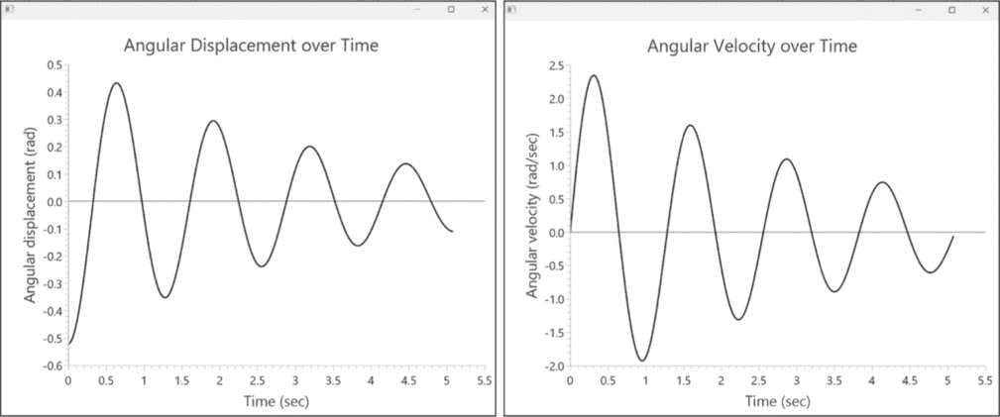

图 5-8：面临空气阻力的摆的角位移（左）和角速度（右）

图表显示了摆的周期性模式因空气阻力而衰减或减振；否则，最大位移和最大速度将保持不变。注意*θ*（位移）和*ω*（速度）之间的相位差：*ω*滞后*θ*一定距离沿时间轴。具体而言，每当*θ*达到最大值时，*ω*为 0，反之亦然。例如，在*t* = 0 时，*θ*达到最大位移，–π/6（位于平衡位置的左侧），但*ω* = 0；然后，大约在*t* = 0.32 时，摆经过平衡位置（*θ* = 0），并且*ω*达到了最大值。这是因为在此位置，摆的所有势能都转化为动能。此后，*ω*开始下降，随着动能转回势能，直到*ω*在对侧最大位移点再次变为 0。

这种关系可以通过将*ω*与*θ*直接绘制出来显示，这正是我们在第三张图中所做的。这种可视化方式被称为*相空间图*；对于二维动态系统，它绘制了速度*v*（*t*）与位移*x*（*t*）的关系，时间*t*是它们的共同分母。相空间图也叫做*相位图*，它有助于研究复杂系统的行为，并揭示状态变量之间的关系，这些关系可能会被忽视。图 5-9 展示了我们为摆绘制的相空间图，*θ*在 x 轴，*ω*在 y 轴。

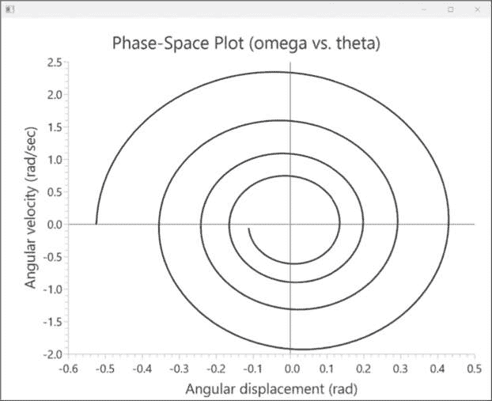

图 5-9：一个简单摆的相空间图，包含阻尼运动

在图表中需要注意的主要点是，虽然*ω*和*θ*仍然通过参数*t*相关联，但由于空气阻力，它们都在减小。每一个时间步长，摆的运动变得更慢，摆幅也变得更窄——这就是图形呈现独特螺旋形状的原因。如果你想知道没有空气阻力的无阻尼摆的模式是什么样的，可以将阻力系数*γ*设置为 0，然后重新运行程序进行探究。

项目 20：咖啡降温的物理学

现在我们将把注意力从运动物理学转向热传导物理学。想象一下，你早上在去上班的路上，从你最喜欢的咖啡店买了一杯咖啡。从咖啡店到办公室的路程是 25 分钟，在这段时间内，咖啡会因热量损失而变冷。你喜欢在咖啡中加牛奶，但牛奶是冷藏的，所以加入牛奶会进一步降低咖啡的温度。你可以在咖啡店就加牛奶，或者等到在办公室的冰箱里加。为了让咖啡保持尽可能温暖，应该选择哪个选项呢？

我们将编写一个 Kotlin 应用程序来绘制两种情况下咖啡温度随时间变化的图表。为此，我们首先需要回顾牛顿的冷却定律，它定义了物体由于向周围环境散失热能而冷却的方式。我们还需要考虑混合两种不同液体的科学原理，以便计算将冷牛奶加入热咖啡时温度变化的情况。

#### 牛顿冷却定律

牛顿冷却定律指出，物体温度的变化率与物体温度与周围环境温度的差值成正比。其数学表达式如下：

$方程$ (5.19) 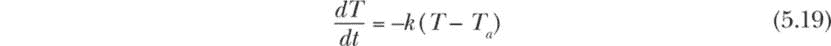

*T* 是物体在时间 *t* 时的温度，*T*a 是环境温度，假设它保持恒定，*k* 是热传导系数。对于 *T* 大于 *T*a 的情况，*k* 值越大，物体降温的速度越快。

系数 *k* 的值取决于物体的材质和表面特性，以及物体本身的温度。当热量主要通过传导方式损失，且对流和辐射损失可以忽略时，*k* 可以假定在小范围的温度变化下保持恒定。我们的咖啡降温问题非常符合这些要求：大部分的热量损失通过杯壁的传导发生，盖上杯盖可以最小化对流，而在这个温度范围内，电磁辐射与另外两个因素相比可以忽略不计。

现在我们来看一下方程 5.19 的解，它是一个一阶常微分方程。对于初始温度 *T*[0]（当 *t* = 0 时）> *T*a，解可以表示为：

$方程$ (5.20) 

方程 5.20 允许我们计算咖啡的温度（无论是否加奶），给定初始咖啡温度 *T*[0]、环境温度 *T*a、经过的时间 *t* 和热传导系数 *k*。

#### 混合液体的影响

当两种不同温度的液体混合时，较热的液体通过释放热能变冷，而较冷的液体通过吸收释放的热量变热。这种热量交换将持续，直到两种液体达到相同的温度。

数学上，液体吸收或释放的热量 *Q* 与其相应的温度变化 *ΔT* 之间的关系如下：

$方程式$ (5.21) 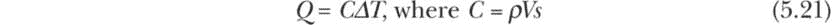

公式 5.21 中的 *C* 被称为物体的 *热容量*，它是物体的密度 *ρ*、体积 *V* 和比热容 *s* 的乘积。在国际单位制中，*Q* 的单位是焦耳（J），温度 *T* 的单位是摄氏度（°C），*ρ* 的单位是千克每立方米（kg/m³），*V* 的单位是立方米（m³），*s* 的单位是焦耳每千克摄氏度（J/(kg °C)）。因此，*C* 的单位将是 J/°C。对于咖啡冷却问题，由于我们处理的是小量液体，我们将使用克每毫升（g/mL）作为密度单位，毫升（mL）作为体积单位，比热容单位则为 J/(g °C)。

假设我们混合两种液体，使得 *C*[1]、*T*[1] 和 *T*f 分别是液体 1 的热容量、初始温度和最终温度，*C*[2]、*T*[2] 和 *T*f 对应的是液体 2 的相同参数（注意两种液体的最终温度是相同的）。如果混合过程很快，并且没有与周围环境交换热量，同时液体之间没有发生化学反应生成或吸收热量，能量守恒原理表明系统中的净能量变化为零——即 *Q*[1] + *Q*[2] = 0。通过使用公式 5.21 代入 *Q*[1] 和 *Q*[2] 并简化结果，我们得到以下关于最终温度的表达式：

$方程式$ (5.22) 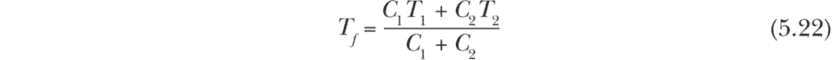

你可以使用公式 5.22 来计算添加牛奶后咖啡的温度，无论是在咖啡店还是到达办公室时。最终，我们已经把所有科学原理搞清楚，解决了问题，享受一杯完美的咖啡。

#### 策略

为了确定添加牛奶的最佳时机，我们需要一些关于咖啡和牛奶的属性数据，以及环境的周围温度。相关数据总结在表 5-2 中。

表 5-2：咖啡冷却问题数据

| 项目 | 数值和单位 |
| --- | --- |
| 黑咖啡的初始温度 | 92°C |
| 黑咖啡体积 | 250 毫升 |
| 黑咖啡的密度 | 1 g/mL |
| 咖啡的比热容 | 4.19 J/(g °C) |
| 冷藏牛奶的初始温度 | 4°C |
| 添加到咖啡中的牛奶体积 | 25 毫升 |
| 牛奶的密度 | 1.035 g/mL |
| 牛奶的比热容 | 3.89 J/(g °C) |
| 从咖啡店到办公室的行驶时间 | 25 分钟 |
| 咖啡的热传导系数（假设加不加牛奶是相同的） | 0.0116/分钟 |
| 周围环境温度 | 20°C |

凭借咖啡冷却的科学原理和表 5-2 中呈现的数据，我们现在可以通过以下步骤来解决这个问题：

**选项 1：稍后加奶**

1.  计算黑咖啡在 25 分钟后的温度，假设初始温度为 92°C。

2.  计算咖啡在加入 25 毫升牛奶后的最终温度（假设混合和热交换瞬间发生）。

**选项 2：在咖啡店加奶**

1.  计算咖啡在咖啡店立即加奶时的初始温度（假设混合和热交换瞬间发生）。

2.  计算咖啡在 25 分钟后的最终温度。

通过比较选项 1 和选项 2 的最终温度，我们可以知道哪种选项能使咖啡保持更温暖。

#### 代码

我们将把这个程序开发为一个 JavaFX 应用程序，以便能够绘制两种选项下咖啡温度随时间变化的曲线。为此，我们将使用与项目 19 相同的模板，并对特定问题部分进行一些修改。

让我们从问题定义和全局参数开始，同时在主应用程序类 MixCoffeeAndMilk 中添加问题特定的组件。

```
// import block
import javafx.application.Application
import javafx.scene.Scene
import javafx.scene.control.ScrollPane
import javafx.scene.layout.VBox
import javafx.scene.paint.Color
import javafx.scene.chart.*
import javafx.stage.Stage
import java.text.DecimalFormat
import kotlin.math.exp
import kotlin.math.ln
import java.text.DecimalFormat

// data classes
❶ data class State(
    val time: Double,
    val Temp: Double
)

// problem definition and global parameters
val coffeeT0 = 92.0      // degrees Celsius
val coffeeV = 250.0      // mL
val coffeeS = 4.190      // J/(gm C) - assumed same as water
val coffeeD = 1.0        // gm/mL - assumed same as water
val coffeeK = 0.0116     // 1/min

val milkT0 = 4.0         // degrees Celsius
val milkV = 25.0         // mL
val milkS = 3.890        // J/(gm C)
val milkD = 1.035        // gm/mL

val T_ambient = 20.0     // degrees Celsius
val timeMax = 25.0       // min (length of drive)
❷ val timeStep = 0.25      // min
val df = DecimalFormat("#.##")

// application class
class MixCoffeeAndMilk : Application() {
    override fun start(primaryStage: Stage) {
        val root = VBox()
        val scroll = ScrollPane()
        scroll.content = root
        val scene = Scene(scroll, 550.0, 600.0, Color.WHITE)
        primaryStage.title = "Coffee Cooling Profile"
        primaryStage.scene = scene
        primaryStage.show()

        // Execute steps for coffee cooling process.
        println("\n  *** Coffee Cooling Problem ***  \n")

        // step 1:
      ❸ val state1 =
            newtonCooling(T0 = coffeeT0, Ta = T_ambient,
                          k = coffeeK,tMax = timeMax, dt = timeStep)
        printTimeAndTemp(state1.last(), 1)

 // step 2:
      ❹ val finalT1 =
            tempAfterMixing(d1 = coffeeD, v1 = coffeeV, s1 = coffeeS,
                            T1 = state1.last().Temp,
                            d2 = milkD, v2 = milkV,
                            s2 = milkS, T2 = milkT0)
        println("step 2: final temp with milk: " +
                "${df.format(finalT1)} degrees Celsius\n")

        // step 3:
      ❺ val initT2 =
            tempAfterMixing(d1 = coffeeD, v1 = coffeeV, s1 = coffeeS,
                            T1 = coffeeT0, d2 = milkD, v2 = milkV,
                            s2 = milkS, T2 = milkT0)
        println("step 3: initial temp with milk: " +
                "${df.format(initT2)} degrees Celsius")

        // step 4:
      ❻ val state2 =
            newtonCooling(T0 = initT2, Ta = T_ambient, k = coffeeK,
                          tMax = timeMax, dt = timeStep)
        printTimeAndTemp(state2.last(), 4)

        // step 5:
      ❼ val state3 =
            newtonCooling(T0 = finalT1, Ta = T_ambient,
                          k = coffeeK,tMax = timeMax, dt = timeStep,
                          start = timeMax)

      ❽ val state4 =
            newtonCooling(T0 = state2.last().Temp,
                          Ta = T_ambient, k = coffeeK,
                          tMax = timeMax, dt = timeStep, start = timeMax)

        val states =
            listOf(state1, state2, state3, state4)

        createCoolingChart(root, states = states)
    }
}

fun main() {
    Application.launch(MixCoffeeAndMilk::class.java)
}
```

这个代码段的导入块与项目 19 的导入块类似，不同之处在于我们需要的数学函数较少。除了初始化表 5-2 中的值外，我们还声明了一个名为 State ❶的数据类，用于保存给定时间的温度。这将帮助我们组织需要绘制的数据。在参数中，需要注意的是我们将 timeStep 设置为 0.25 分钟 ❷。这样，我们将以 15 秒的间隔跟踪并绘制咖啡的降温过程。与项目 19 中非常短的时间间隔相比，这个时间步长似乎意外地长，但对于这个问题来说足够了，因为温度下降是平滑且缓慢的。此外，我们使用的是解析解，而非数值近似，因此这个选择不会影响计算的准确性。

主应用程序类中代码的特定部分遵循与“策略”中所列的步骤相同的顺序，见第 211 页，不过我们添加了一个额外的步骤（步骤 5），用于进一步追踪咖啡在办公室继续冷却的情况（稍后会详细说明）。这里的代码依赖于两个主要的辅助函数：newtonCooling() 函数，它计算咖啡随时间的降温过程；以及 tempAfterMixing() 函数，它计算加入牛奶后的即时温度。我们按以下方式部署这些函数：

+   对于第 1 步，我们调用 newtonCooling() 并将结果保存为 state1 ❸。这将生成一个 State 类型的列表，包含需要的数据点，用于展示黑咖啡在咖啡店和办公室之间随时间变冷的过程。

+   在第 2 步，我们调用 tempAfterMixing()来获得在办公室加牛奶后咖啡的最终温度 ❹。这是你选择了选项 1（稍后加牛奶）后，喝第一口之前咖啡的温度。

+   在第 3 步，我们调用 tempAfterMixing()来计算在前往工作地点之前，在咖啡店加入牛奶后的咖啡温度 ❺。

+   在第 4 步，我们调用 newtonCooling()并将结果列表中的 State 数据点保存为 state2 ❻。该列表最后一个元素的温度属性将告诉我们，当你选择了选项 2（先加牛奶）后，到达办公室时咖啡的温度。

在每一步中，我们都会通过调用 println()函数或自定义的 printTimeAndTemp()函数来显示一些模拟输出，这个函数在此定义：

```
fun printTimeAndTemp(datapoint: State, step: Int) {
    val (endTime, endTemp) = datapoint

    println("step $step: end time: ${df.format(endTime)} minutes")
    println("step $step: end temp: ${df.format(endTemp)} " +
            "degrees Celsius")
}
```

在第 4 步后，我们已经具备了解决问题所需的一切，结果将会打印在控制台上。让我们先看看结果，然后再回到第 5 步和可视化冷却过程的代码。

```
 *** Coffee Cooling Problem ***

step 1: end time: 25 minutes
step 1: end temp: 73.87 degrees Celsius
step 2: final temp with milk: 67.75 degrees Celsius
step 3: initial temp with milk: 84.29 degrees Celsius
step 4: end time: 25 minutes
step 4: end temp: 68.1 degrees Celsius
```

当你在办公室加牛奶时，咖啡的最终温度为 67.75°C，而在咖啡店加牛奶时，温度为 68.1°C。尽管两者的差异并不显著（只有 0.35°C），但你最好还是在咖啡店加牛奶。

当然，你也可以不借助任何数学或代码，自己通过投资一个高质量的温度计，并泡两杯咖啡来得出结论。然而，建立一个过程的数学模型的好处在于，它不仅能告诉我们 25 分钟后的温度，还能告诉我们从初始状态开始，经过添加牛奶等干预措施后，系统是如何到达这个状态的。一旦我们有了模型，我们可以调整参数值，生成许多其他问题的答案，而无需再泡更多咖啡、加更多牛奶或进行多次温度测量。

举个例子，假设你到达工作地点后马上被拉进一个会议。你只有足够的时间给咖啡加牛奶（如果你还没加的话），但你没有时间享用这杯咖啡，直到会议结束——大约 25 分钟后。那么，咖啡在那个时候的温度是多少呢？也就是说，从你买咖啡起的完整 50 分钟后，咖啡的温度会是多少？由于我们已经有了一个关于咖啡如何随着时间降温的数学模型，这个问题其实很容易回答。

这就引出了第 5 步，我们使用前 25 分钟后的最终温度作为运行模拟的初始温度，进行后续 25 分钟的计算。为此，我们在 newtonCooling()函数中使用了一个额外的命名参数 start。这个参数允许我们将时间值偏移 25，而不是从 0 开始重新计时。我们调用该函数两次，生成列表 state3 ❼（选项 1——在办公室加牛奶）和 state4 ❽（选项 2——在咖啡店加牛奶）。

一旦计算出所有四个状态，我们通过使用 listOf()方法创建一个 State 类型的列表，并将该列表传递给 createCoolingChart()函数，以便绘制整个 50 分钟期间的温度变化曲线。

##### 计算温度变化

现在，让我们回顾一下用于计算咖啡温度变化的两个辅助函数。newtonCooling()函数跟踪咖啡在一段时间内的温度变化。tempAfterMixing()函数计算牛奶混合时的瞬时温度变化。

```
fun newtonCooling(T0: Double, Ta: Double, k:Double,
                  tMax: Double, dt: Double,
                  start: Double = 0.0): List<State> {
    val state = mutableListOf<State>()
    var t = 0.0

    while (t <= tMax) {
      ❶ val temp = Ta + (T0 - Ta)*exp(-k * t)
      ❷ state += State(t+start, temp)
 t += dt
    }
    return state
}

fun tempAfterMixing(
    d1: Double, v1: Double, s1: Double, T1: Double,
    d2: Double, v2: Double, s2: Double, T2: Double
    ): Double {

    return (d1 * v1 * s1 * T1 + d2 * v2 * s2 * T2) /
           (d1 * v1 * s1 + d2 * v2 * s2)
}
```

在 newtonCooling()函数中，我们使用方程式 5.20 计算咖啡在时间点 t 时的温度❶。我们通过 while 循环实现这一点，在每次迭代中将 t 增加 dt（设为 timeStep），直到达到 tMax，获得每隔 15 秒的时间和温度数据点，直到 25 分钟，并将其存储在一个名为 state 的列表中❷。

注意，在将每个 t 存储到列表之前，我们都加上了 start。当在函数调用时没有设置 start 时，它默认值为 0，不会产生任何影响。然而，当我们调用该函数以创建 state3 和 state4（如前面第 5 步所讨论）时，我们将 start 设置为 timeMax，因此时间戳将从 25 到 50。这使得我们可以在同一个图表中绘制所有的数据。

tempAfterMixing()函数接受牛奶和咖啡的分离密度、体积、比热容和预混合温度，并使用方程式 5.22 返回最终的平衡温度。

##### 绘制温度变化曲线

我们现在准备绘制两条冷却咖啡的温度曲线。为此，我们将定义 createCoolingChart()函数。

```
fun createCoolingChart(root: VBox, states: List<List<State>>) {

    val xyChart =
        singleXYChart(states,
            title = "Temperature of Coffee over Time",
            xLabel = "Time",
            yLabel = "Temperature (degrees Celsius)")

   root.children.add(xyChart)
}
```

我们使用这个简短的函数主要是为了预处理 singleXYChart()函数所需的信息，这个函数也在项目 19 中使用。这样可以保持主应用类的主体部分更加简洁。由于我们之前已经讨论过如何使用 singleXYChart()，所以这里就跳过这一部分，唯一需要提到的是，现在我们传递的是一个包含多个列表的列表，而不是单一的列表作为数据点的集合。在 singleXYChart()函数内部，我们因此创建了四个不同的系列（来自列表的列表，states），并将它们绘制在同一个图表上，而不是创建四个单独的图表。请参见第三章回顾如何在同一个图表中绘制单一系列与多个系列。

该函数的最后一行将由 singleXYChart()函数返回的图表对象 xyChart 添加到根节点中以进行显示。图 5-10 展示了结果。

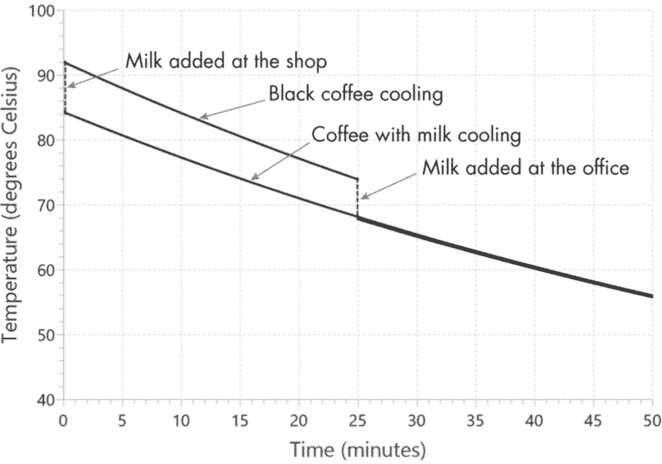

图 5-10：黑咖啡和加奶咖啡的温度随时间变化

该图展示了整个 50 分钟模拟过程。我们可以看到，当牛奶加入到咖啡店（时间为 0）或办公室（时间为 25）时，温度急剧下降。在后者之后，温度曲线几乎完全相同。然而，当我们放大查看时，如同在图 5-11 中所示，我们发现有轻微的差异（不到 1°C）。

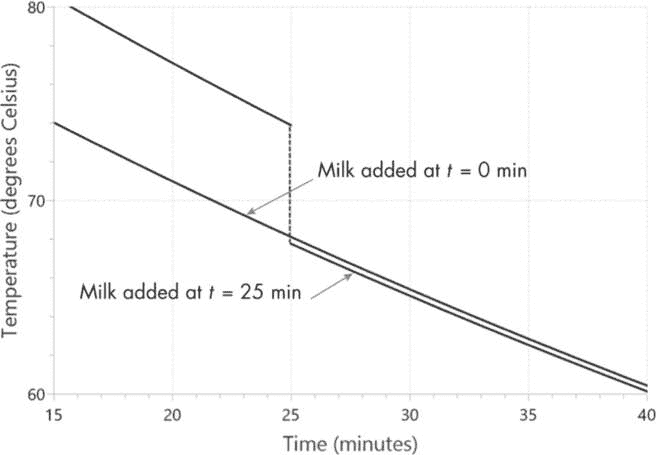

图 5-11：对 25 分钟后咖啡降温问题的更详细观察

两条线之间的间隙表示在咖啡店加入牛奶的咖啡会始终稍微温暖一点。如果我们继续进行这个实验很长时间，这些温度曲线是否还会保持分开？为什么或为什么不？

项目 21：模拟双星系统

在这个项目中，我们将探索“星座情侣”的运动——这些并不是最新的明星八卦对象，而是我们抬头仰望夜空时能看到的恒星。许多宇宙中看起来像单颗星星的明亮物体，实际上是两颗距离很近的恒星，它们围绕一个共同的旋转中心“舞蹈”或运行。根据恒星的质量、轨道速度以及它们之间的距离，这些*双星系统*可以形成有趣且独特的轨道模式。我们将通过创建一个双星系统的 Kotlin 应用程序来可视化这些轨道模式。

#### 双星系统的科学

双星系统受牛顿引力定律和运动定律的支配。让我们来看一下图 5-12 中展示的二维模型双星系统。

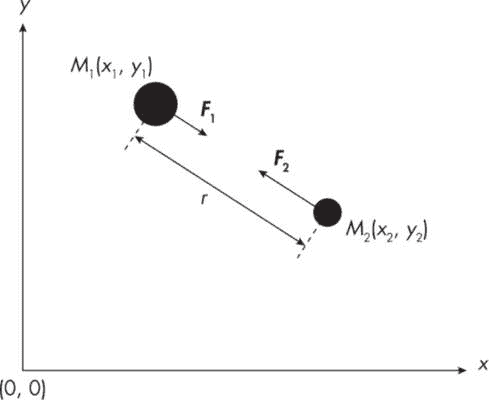

图 5-12：受引力作用的双体系统

我们的双星系统由两个天体组成，如图中所示为黑色圆圈。第一个天体位于(*x*[1], *y*[1])，质量为*M*[1]，第二个天体位于(*x*[2], *y*[2])，质量为*M*[2]。从*M*[1]的中心到*M*[2]的中心的距离为*r*，我们可以通过勾股定理计算出这个距离：

$Equation$ (5.23) 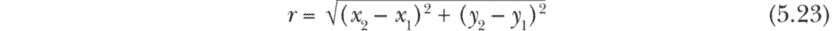

引力定律表明，这两个天体会互相吸引。在这个例子中，***F***1 和***F***2 分别是作用在天体 1 和天体 2 上的引力。请注意，这些力是*向量*，即它们既有大小也有方向。（我们用**粗体**表示向量。）根据引力定律，作用在天体 1 上的力（***F***1）可以表示为：

$Equation$ (5.24) 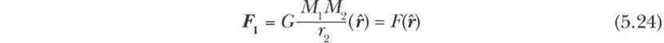

在方程 5.24 中，*G*是引力常数，*F*是力向量的大小，***ȓ***是指向天体 2 的单位向量。此外，牛顿的第二定律告诉我们，作用在质量为*M*[1]的天体 1 上的力***F***1 将沿着力的方向产生加速度***a***1，使得：

$Equation$ (5.25) 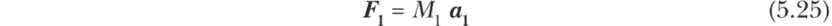

我们可以结合方程式 5.24 和 5.25，写出加速度***a***1 的 x 和 y 分量的表达式，如下所示：

$Equation$ (5.26)$Equation$ (5.27) 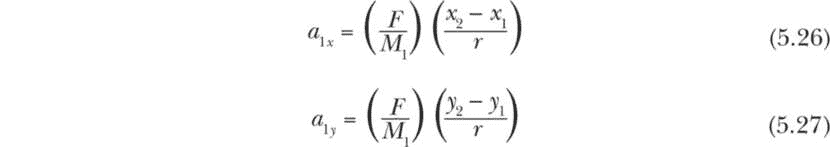

最后，牛顿的第三定律要求***F***1 = −***F***2。因此，我们可以在方程式 5.26 和 5.27 的右侧添加负号，并将*M*[1]替换为*M*[2]，以计算由于***F***2 作用于物体 2 的加速度分量，如下所示：

$Equation$ (5.28)$Equation$ (5.29) 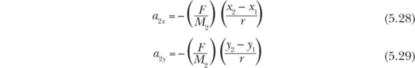

为了模拟双星系统的轨道，我们将首先使用这些加速度的 x 和 y 分量的方程，计算恒星的相应速度分量，然后使用这些速度来更新双星系统中恒星的位置。

#### 策略

在本节中，我们将开发一个简单的算法来跟踪双星系统中恒星的运动。首先，我们需要考虑适合我们天文计算的宇宙尺度的度量单位。我们将使用以下单位：

+   对于质量，我们将使用 M[ʘ]，它是我们太阳的质量。一个太阳质量大约为 2 × 10³⁰千克，约为地球质量的 33.3 万倍。

+   对于距离，我们将使用天文单位（AU），它是太阳与地球之间的平均距离。1 AU 等于 149,597,870.7 公里。

+   时间单位我们将使用太阳年（yr），它等于 365 天 5 小时 48 分钟 46 秒。

给定这些基本单位，速度的单位将是 AU/yr，加速度的单位将是 AU/yr²。这样，得出的引力常数*G*为 4π² AU³ yr^(–2) M[ʘ]^(–1)。

现在我们准备进入算法部分，该算法与项目 19 中使用的算法相似。以下是我们将用来计算双星位置的步骤：

1.  获取双星的初始位置和速度向量（按 x 和 y 分量表示），包括它们的质量和引力常数 G。使用我们刚刚讨论的单位系统。

2.  计算在给定时间 t 下，恒星之间的距离 r，使用方程式 5.23。

3.  计算加速度的 x 和 y 分量，使用方程式 5.26 到 5.29。

4.  选择一个足够小的时间步长*dt*并使用欧拉-克罗梅尔法则更新速度和位置向量。沿着 x 轴的速度和位置向量分量可以计算如下：

$Equation$ (5.30)$Equation$ (5.31) 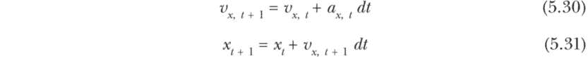

对于两个恒星的每个分量，重复步骤 4，沿着 y 轴进行计算。

6.  重复步骤 2 到 5，直到满足停止条件。我们将最大迭代次数作为停止条件。

当然，进行这些计算的全部目的是能够坐下来，享受观看星体舞步的过程。在算法的每个周期后，我们将通过使用 JavaFX 的画布功能来绘制星体的新位置，从而实现星体的运动动画。我们还将给每个星体添加一条轨迹，以更好地展示其轨道路径。本应用程序的大部分代码都用于在画布上显示和管理这些移动物体。

#### 代码

我们将按照应用程序中出现的顺序回顾本项目的代码段。让我们从导入和声明开始，接着是 SimulateBinarySystem 应用程序类之前的部分。

```
// animation-related tools
import javafx.animation.KeyFrame
import javafx.animation.Timeline
import javafx.util.Duration

// graphics-related tools
import javafx.application.Application
import javafx.scene.Scene
import javafx.scene.canvas.Canvas
import javafx.scene.canvas.GraphicsContext
import javafx.scene.layout.Pane
import javafx.scene.paint.Color
import javafx.stage.Stage

// math functions
import kotlin.math.*

// data class
data class Star(
    val mass: Double,
    val size: Double,
    var x: Double,
    var y: Double,
    var vx: Double,
    var vy: Double,
    var xOld: Double = 0.0,
    var yOld: Double = 0.0,
 var trailCount: Int = 0,
    val color: Color = Color.GOLD
)

// problem definition and global declarations
// initial state of the binary system
val stars = listOf(
    Star(mass = 0.73606507, size = 40.0, x = -35.0, y = 0.0,
         vx = 0.0, vy = 0.3045865, color = Color.BLACK),
    Star(mass = 0.50121162, size = 25.0, x = 51.4, y = 0.0,
         vx = 0.0, vy = -0.447307098, color = Color.BLACK)
)
val G = 4 * PI * PI

// Set canvas/animation parameters.
val canvasW = 800.0
val canvasH = 800.0
val durationMillis = 4.0
val frameCountMax = 50_000

// parameters related to star trails
val TRAIL_CODE = "YES"
val trails = Array(2) {ArrayList<Pair<Double,Double>>()}
val trailMAX = 6500
val trailSize = 2.0
val scaleFactor = 4
```

导入块的前三行加载了用于创建逐帧动画的 JavaFX 重要工具（KeyFrame、Timeline 和 Duration）。剩下的导入与本章之前使用的类似。

在导入之后，我们声明了一个 Star 数据类，用于存储表示星体所需的属性，包括质量、x 和 y 坐标、以及速度分量。size 属性（以像素为单位）是表示某个星体的圆的直径；xOld 和 yOld 会保存星体当前位置的副本，以便在更新之前使用（用于生成轨迹）；trailCount 设置将跟随星体的小点数量，以标记其轨迹；color 定义了绘制星体及其轨迹时使用的颜色。由于本书是黑白印刷的，所有图形都使用默认颜色（黑色）生成，但在你的设备上运行代码时，随意尝试任何颜色都可以。

问题定义和全局声明部分开始时，创建了一个包含两个星体对象的星体列表。我们为每个星体初始化了质量、大小、当前的 x 和 y 坐标（x, y）、沿着正 x 轴和 y 轴的速度向量分量（vx, vy），以及用于在画布上绘制星体的颜色。由于我们不打算按正确的比例绘制星体，因此这里只使用了两个任意大小，这在画布的大小下看起来可能合理。如果你有理由相信这些星体的密度相似，也可以将它们的大小与质量成比例地调整。同时，注意我们将引力常数 G 设置为 4π²，因为我们使用的是之前提到的天文单位。

在代码的下一部分，我们首先将画布的宽度 (canvasW) 和高度 (canvasH) 设置为 800 像素（如果不进行缩放，这相当于在两个方向上各为 800 AU）。durationMillis 参数将每帧动画的持续时间设置为 4.0 毫秒。frameCountMax = 50_000 表示在 50,000 帧后，应用程序将停止模拟双星系统。如果 dt = 1 年，那就相当于观察该系统 50,000 年！你可能不需要这么长时间来模拟系统（你可以随时通过关闭动画窗口来终止应用程序）。然而，运行几个完整轨道的仿真是个好主意（当预期轨道为圆形或椭圆形时），以确认模拟的轨道是稳定的。一旦确认，你就可以随意调整参数，看看星星的运动会变得多么疯狂！

这一代码块中的最后一段代码为轨迹设置参数，使我们能够在实时仿真中可视化星星所描绘的轨迹。默认情况下，TRAIL_CODE 被设置为 YES，这意味着两个星星的轨迹都会在画布上与它们的父星一起绘制。每条轨迹由跟随父星的小点或轨迹线组成。小点的坐标保存在一个名为 trails 的二维数组中，每个元素代表一个存储为 <Double, Double> 类型的 x 和 y 坐标。为了确保当轨道稳定时，轨迹能够完整地描绘出整个轨道路径，我们将轨迹元素的数量设置为 6500。然而，尽量将这个数字保持在最小，否则，轨迹中的点太多会减慢动画的速度，迫使你调整帧的持续时间。

##### SimulateBinarySystem 应用类

这个应用程序的核心部分是 SimulateBinarySystem 应用类，我们将 Kotlin 与 JavaFX 相结合，驱动应用的关键部分并运行动画。

```
class SimulateBinarySystem : Application() {
    override fun start(stage: Stage) {
        val root = Pane()
        val canvas = Canvas(canvasW, canvasH)
        val gc = canvas.graphicsContext2D
      ❶ gc.translate((canvas.width)/2.0, (canvas.height)/2.0)
      ❷ gc.scale(1.0, -1.0)
        root.children.add(canvas)

        val scene = Scene(root, canvasW, canvasH)
        //scene.fill = Color.WHITE
        stage.title = "Binary System Simulation"
        stage.scene = scene
        stage.show()

        // -----------simulation block-----------
        // Set the background and initial positions.
      ❸ initialPositions(gc)

        // Start animation.
      ❹ val t = Timeline()
        var frameCount = 0
 val dt = 1.0
        val iterMax = 1

      ❺ val k = KeyFrame(Duration.millis(durationMillis), {
            for (i in 1..iterMax)
                updateStarPositions(stars, dt)
            drawStars(gc)
            if (TRAIL_CODE == "YES")
                updateAndDrawTrails(gc)
            frameCount += 1
            // Check the stopping condition.
          ❻ if (frameCount >= frameCountMax) {
                println("maximum limit for frameCount reached")
                t.stop()
            }
        })
      ❼ t.keyFrames.add(k)
        t.cycleCount = Timeline.INDEFINITE
        t.play()
    }
}

fun main() {
    Application.launch(SimulateBinarySystem::class.java)
}
```

这段代码的第一部分是我们之前使用过的 JavaFX 样板代码。请注意，这次我们将坐标系的原点设置在画布的中心 ❶。此外，正 y 轴的方向被设置为向上 ❷。

在仿真块中，我们首先调用 initialPositions() 函数 ❸，它在画布上绘制 x 轴和 y 轴，根据位置向量将星星放置在画布上，并在 TRAIL_CODE 设置为 YES 时初始化一个名为 trails 的 Pair 类型数组。由于这个函数非常简短，我将在这里展示它以及从 initialPositions() 函数中调用的 drawAxes() 函数：

```
fun initialPositions(gc: GraphicsContext) {
    drawAxes(gc)
    stars.forEachIndexed {index, star ->
        gc.fill = star.color
        gc.fillOval(
            scaleFactor * star.x - star.size/2,
            scaleFactor * star.y - star.size/2,
            star.size, star.size)

        // Place the tracers to initial star position.
        if (TRAIL_CODE == "YES") {
            for (i in 1..trailMAX) {
                trails[index].add(Pair(star.x, star.y))
            }
        }
    }
}

fun drawAxes(gc: GraphicsContext) {
    // Draw the x- and y-axes.
    with(gc) {
        setLineDashes()
        lineWidth = 0.25
        stroke = Color.BLACK
        strokeLine(-canvasW/2,0.0, canvasW/2,0.0)
        strokeLine(0.0,-canvasH/2, 0.0,canvasH/2)
    }
}
```

注意，在`initialPositions()`函数中，我们使用了`forEachIndexed`结构进行迭代，而不是标准的`for`循环。这是因为我们需要星星的索引属性来在函数的第二部分创建相应的轨迹。每颗星星的轨迹由`trailMAX`个点或跟踪器组成，目前我们将其初始化为与星星本身相同的起始位置。

关于`drawAxes()`函数，注意所有涉及图形上下文`gc`的图形命令是如何通过使用作用域函数`with()`组合在一起的。这可以避免我们多次输入`gc`。

回到应用类，二元星系统的动画通过使用`Timeline`和`KeyFrame`的组合以及{lambda}表达式来实现。我们首先创建一个`Timeline`变量`t`❹并设置其他一些局部参数。参数`frameCount`初始值为 0，之后每帧递增 1。参数`dt`是用于更新速度和位置向量的时间步长。我们将其设置为 1，这意味着每个动画帧表示 1 年（这看起来可能太大，但这都是相对的；这个星系统的周期是 722 个地球年）。注意，`iterMax`参数设置为 1，这意味着每帧只更新一次位置和速度向量。如果需要，我们可以使用不同的`dt`和`iterMax`组合，在切换帧之前对位置和速度向量进行`iterMax`次更新。

在`KeyFrame`类实例❺内部，{lambda}表达式指定了在由`Duration.millis()`函数指定的频率下，帧更新之间发生的事情。首先，我们调用`updateStarPositions()`来计算每颗星星的加速度、速度和位置。然后，我们调用`drawStars()`来更新画布上星星的位置，最后，我们调用`updateAndDrawTrails()`来绘制两颗星星的轨迹。（我们将分别回顾这些函数。）在退出`KeyFrame`块之前，我们检查停止条件：如果`frameCount`（显示的帧数）达到`frameCountMax`，则时间线结束，动画终止❻。

最后三行完成了`Timeline`的实现。首先，我们将`KeyFrame`实例（k）提供给时间线❼。接着，我们将`cycleCount`设置为`INDEFINITE`，这意味着继续执行时间线，直到在`KeyFrame`或程序的其他部分满足停止条件。最后，`t.play()`开始动画并使星星开始运动。

##### `updateStarPositions()`函数

`updateStarPositions()`函数通过使用我们讨论过的公式和算法实现了运动中的二元星的物理学。该函数接受两个参数——一个名为`stars`的`Star`类型的列表和时间步长`dt`——并不返回任何值，因为该函数直接更新星星的全局可访问属性。

```
fun updateStarPositions(stars: List<Star>, dt: Double) {
    val rx = stars[1].x - stars[0].x
    val ry = stars[1].y - stars[0].y
    val r = sqrt(rx * rx + ry * ry)

  ❶ val force =
        G * stars[0].mass * stars[1].mass / (r * r)

    var sign = 1
    for (star in stars) {
      ❷ // Update the acceleration, velocity, and position of stars.
        val acceleration = force / star.mass
        val ax = acceleration * rx / r
        val ay = acceleration * ry / r
        star.vx += sign * ax * dt
        star.vy += sign * ay * dt

      ❸ // These will be needed for updating trails.
        star.xOld = star.x
        star.yOld = star.y

        star.x += star.vx * dt
        star.y += star.vy * dt
      ❹ sign = -1
    }
}
```

该函数首先通过使用公式 5.23 计算两颗星星之间的距离。然后我们使用公式 5.24 的标量部分计算两颗星星所经历的引力大小 ❶。接下来，我们遍历星星列表，根据公式 5.26 到 5.31 更新两颗星星的加速度、速度和位置 ❷。注意，在更新 x 和 y 之前，我们将当前的位置向量保存到星星的 xOld 和 yOld 属性中 ❸。我们需要这些信息，这样星星的轨迹就会滞后于星星本身一个时间步长。还要注意，在第一次迭代结束时，变量 sign 会从 1 切换到 -1 ❹。这会反转作用在第二颗星星上的力的方向，以确保 ***F***1 = −***F***2。

##### drawStars() 函数

drawStars() 函数简单地更新画布上星星的位置，使它们发生移动。它接受一个参数，即图形上下文，并且不返回任何内容。

```
fun drawStars(gc: GraphicsContext) {
  ❶ gc.clearRect(-canvasW/2, -canvasH/2, canvasW, canvasH)
  ❷ drawAxes(gc)

    // Connect the centers of the stars.
  ❸ with (gc) {
        lineWidth = 0.5
        stroke = Color.BLACK
        setLineDashes(2.0,4.0,4.0,2.0)
        strokeLine(
            scaleFactor*stars[0].x,
            scaleFactor*stars[0].y,
            scaleFactor*stars[1].x,
            scaleFactor*stars[1].y)
    }

    // Draw the stars using updated positions.
  ❹ for (star in stars) {
        gc.fill = star.color
        gc.fillOval(
            scaleFactor * star.x - star.size/2,
            scaleFactor * star.y - star.size/2,
            star.size, star.size)
    }
}
```

该函数首先通过清除画布 ❶ 开始。然后我们分三阶段重新绘制物体。首先，我们调用已经复习过的 drawAxes() 函数来绘制坐标轴 ❷。由于这是首先执行的操作，其他物体（例如，星星和轨迹）将被绘制在坐标轴之上。

接下来，我们通过使用虚线连接两颗星星的中心 ❸。参数序列 (2.0, 4.0, 4.0, 2.0) 表示虚线的长度会按 2、4、4、2 像素的循环进行设置。这条线有助于确定旋转中心（与 x 轴相交的点），并会随着星星的运动像弹簧一样拉伸和收缩，使得模拟更有趣。对于圆形同心轨道，这条线也有助于直观地确认在任何时刻，双星系统的位置总是围绕旋转中心呈对角线相对。

最后，我们使用一个 for 循环遍历星星，并在它们的新位置绘制它们 ❹。注意在绘制星星时使用了 scaleFactor。这个全局变量让我们可以在不需要使用书中其他地方更复杂的重新缩放方案的情况下，动态地调整模拟的缩放比例。对于这个问题，由于轨道的形状和大小在模拟过程中可能会显著变化，我建议根据你自己的设置调整这个缩放因子。我在第一次模拟中使用了 scaleFactor = 4（用于稳定的圆形轨道），在第二次模拟中使用了 scaleFactor = 1（用于稳定的椭圆轨道）。在后者的情况下，星星之间的距离 *r* 在模拟过程中会显著变化，因此我们需要为画布分配更多空间，以完全描绘轨道。

##### updateAndDrawTrails() 函数

一体化的 updateAndDrawTrails() 函数同时更新和绘制轨迹。它接受一个参数 gc，像 drawStars() 函数一样不返回任何内容。

```
fun updateAndDrawTrails(gc: GraphicsContext) {
    // Update the trails.
    stars.forEachIndexed {index, star ->
      ❶ if (star.trailCount >= trailMAX) star.trailCount = 0
      ❷ trails[index][star.trailCount] =
                      Pair(star.xOld, star.yOld)
        star.trailCount += 1
    }

    // Draw the trails.
    trails.forEachIndexed {index, trail ->
      ❸ gc.fill = stars[index].color
      ❹ for (point in trail) {
            gc.fillOval(
                scaleFactor * point.first - trailSize / 2,
                scaleFactor * point.second - trailSize / 2,
                trailSize, trailSize
            )
        }
    }
}
```

这个函数的第一个代码块遍历星体列表，并更新轨迹元素的位置。回想一下，initialPositions()函数将所有的追踪器放在与星体本身相同的位置，但我们还没有绘制任何一个追踪器。现在，我们一次移动一个追踪器（对于每颗星体）。首先，我们检查未分配的追踪器是否准备好移动到新的位置，方法是确保 star.trailCount < trailMAX。否则，我们将 trailCount 重置为 0 ❶。每次星体移动到新位置时，我们会将星体的旧位置分配给下一个可用的追踪器——即在轨迹数组中的位置[index][star.trailCount] ❷。这就是为什么我们总是在更新它们之前保存星体旧位置的原因，在 updateStarPositions()函数中。

只要追踪器仍然需要从初始位置移动，这个过程就会继续。一旦所有的追踪器都被分配到画布上的新位置（同时星体继续移动），通过重置 trailCount，我们可以通过将最后一个追踪器移到第一个位置（紧挨着星体）来回收它们。

现在追踪器的位置已经更新，函数中的第二个代码块开始为两个星体绘制轨迹。对于每条轨迹，我们使用与它所跟随的星体相同的颜色 ❸ 来绘制追踪器。最后，所有的轨迹都根据它们最新的坐标 ❹ 绘制到画布上。一旦所有的追踪器都被放置在画布上，每条轨迹将跟随其父星体。#### 结果

当你运行应用程序时，你应该会看到一个动态的双星系统运动模拟，而不是一张静态图片。你会看到星体在屏幕上不断地相互围绕跳动，直到你关闭窗口或等待 frameCount 达到其上限。图 5-13 展示了应用程序两次运行的截图。

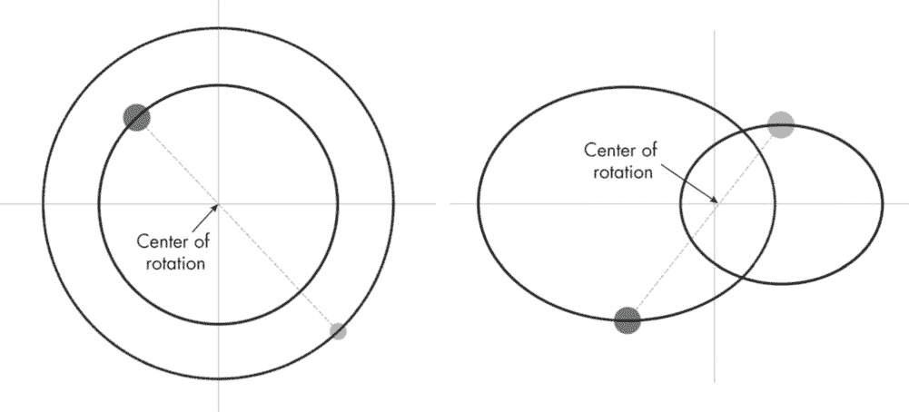

图 5-13：具有同心圆轨道的双星系统（左）和具有椭圆轨道的双星系统（右）

左侧的示例展示了一个具有同心圆轨道的双星系统，这意味着一个星体的轨道完全包含在另一个星体的轨道内。为此，我们使用了代码清单中显示的初始条件。右侧的示例则通过使用相同的初始条件（除了星体 1 的 x = -50.0，星体 2 的 x = 90.0，和 scaleFactor = 1）来模拟一个具有椭圆轨道的系统。

我鼓励你通过调整初始条件来尝试模拟。根据不同的参数，你可能会得到一个不稳定的系统，在这种情况下，星体要么会飞出屏幕，要么会相互碰撞。事实上，像图中所示的那样创建一个稳定的系统要难得多。这种不稳定性也会出现在真实的双星系统中，因为它们会受到各种外部力量的扰动，导致维持稳定轨道所需的精细平衡被破坏。

### 总结

在本章中，我们使用 Kotlin 和物理定律解决了各种科学问题——从炮弹和水流的抛物线运动，到摆动的钟摆和降温的咖啡杯，再到双星系统的宇宙舞蹈。过程中，我们逐步开发了越来越复杂的物理系统数学模型，来研究它们的行为。为了做到这一点，我们不仅掌握了 Kotlin 的基础，还利用了 JavaFX 的可视化和动画工具，来有效展示我们的代码结果。

### 资源

Bate, Roger R., Donald D. Mueller, Jerry E. White, 和 William W. Saylor. *天体动力学基础*（第 2 版）。纽约：Dover，2020 年。

Bennett, Andrew G. “龙格-库塔方法。”访问日期：2024 年 6 月 15 日。*[`onlinehw.math.ksu.edu/math340book/chap1/xc1.php`](https://onlinehw.math.ksu.edu/math340book/chap1/xc1.php)*。

Cromer, Alan. “使用欧拉近似法的稳定解。” *美国物理学杂志* 49, 第 5 期（1981 年 5 月）：455–459。*[`doi.org/10.1119/1.12478`](https://doi.org/10.1119/1.12478)*。

Demanet, Laurent. “数值分析导论。”MIT 开放课程，2012 年。访问日期：2024 年 6 月 15 日。*[`ocw.mit.edu/courses/18-330-introduction-to-numerical-analysis-spring-2012/`](https://ocw.mit.edu/courses/18-330-introduction-to-numerical-analysis-spring-2012/)*。

Halliday, David, Robert Resnick, 和 Jearl Walker. *物理学基础*（第 12 版）。纽约：Wiley & Sons，2021 年。

Seyr, Alexander Josef. “使用龙格-库塔方法对太阳系行星运动进行数值模拟。”2020 年 11 月 6 日。*[`static.uni-graz.at/fileadmin/_Persoenliche_Webseite/puschnig_peter/unigrazform/Theses/BachelorThesis_Seyr_2020.pdf`](https://static.uni-graz.at/fileadmin/_Persoenliche_Webseite/puschnig_peter/unigrazform/Theses/BachelorThesis_Seyr_2020.pdf)*。

Young, Hugh, 和 Roger Freedman. *大学物理学*（第 15 版）。纽约：Pearson，2020 年。
