## 第六章：6 递归函数与分形


分形是迷人的几何图形，现实与虚幻（即虚数）相交汇。当我们不断放大时，重复的模式永远不断地出现。数学家们仍在尝试精确定义分形，但他们一致同意以下几个关键特征：自相似性（分形的较小部分与整体相似）和能够无限放大。

在本章中，我们将使用 Kotlin 绘制各种分形，并探索它们神秘的美。我们的主要目标是将每个分形设计中蕴含的数学逻辑编码出来，重新创建这些分形，并通过调整设计参数可能发现新的分形。

### 分形的概念

分形的概念充满了二元对立和矛盾。被认为是分形几何学之父的本诺特·曼德尔布罗特，将*分形*一词从拉丁语*fractus*中创造而来，意为破裂或碎裂，但分形的细节图像几乎没有破裂，反而展示了连续流动的复杂模式。著名的分形，如朱利亚集和曼德尔布罗特集，展示了极其复杂的图案，但生成这些图案的方程式却非常简单。分形图包含了无限的信息量，而这些信息可以浓缩成一个方程式，这一发现是 20 世纪的重大成果，揭示了数学隐藏的美丽。

然而，分形不仅仅是奇异的数学对象。它们帮助我们看到了“自然的几何”，这是曼德尔布罗特所推广的术语。实际上，分形模式在大自然中无处不在，雪花、树木的分枝、人类的神经系统和循环系统、海岸线、云彩、飓风以及星系的螺旋形状中都可以看到分形的身影。分形理论也已在物理学、生物学、工程学和信息技术等领域得到了应用，并催生了诸如混沌理论及其在研究复杂动态系统中的应用等新的研究领域。

在我们开始编程之前，先回顾一个简单的分形，以探索它的一些关键特性。图 6-1 展示了谢尔宾斯基三角形，这是一种几何分形，得名于著名的波兰数学家瓦茨瓦夫·谢尔宾斯基，他在 1915 年创造了这一分形。这个分形是通过不断连接等边三角形三个边的中点以及所有生成的子三角形构造而成的。


图 6-1：谢尔宾斯基三角形

这个分形的内在美来自于它的自相似性：观察外部三角形内的任何一个较小的三角形，你会看到它是原始图形的迷你版。此外，如果我们放大或缩放其中一个较小的三角形，我们会发现里面还包含许多相同的小三角形。例如，图 6-2 展示了只包含 A、D 和 E 三个点的三角形的放大视图，来自于图 6-1。结果与原始三角形完全相同。

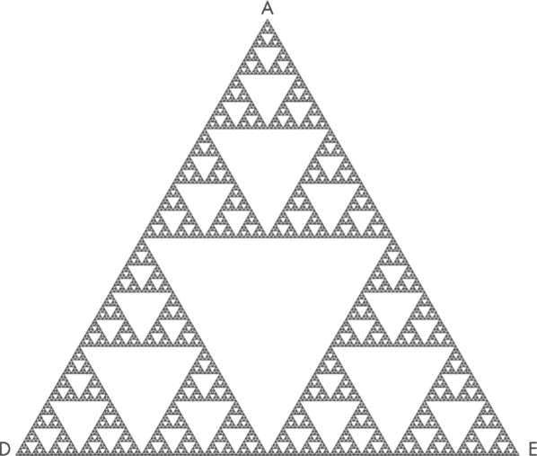

图 6-2：谢尔宾斯基三角形的放大部分，展示了分形的缩放能力

对于我们可以达到的深度，并没有理论上的限制——即使是原始图形中最小的三角形，当放大时，也会得到相同的结果。分形可以永远放大。

分形还有一个有趣的属性，叫做*分形维度*。不同于我们熟知的几何物体，如线、面积和体积，分别具有一维、二维和三维，分形可以具有分数维度。例如，谢尔宾斯基三角形的维度是 1.585：它比一维线更复杂，但又小于二维面积。这是因为它可以适应二维平面，但并没有完全填充定义分形边界的区域。你可以在本章末尾列出的一些优秀资源中找到关于这一话题的更正式和深入的讨论。

### 递归函数

绘制一个理论上可以永远重复下去的自相似模式的最有效方式是使用*递归函数*。这是一种函数，它会在自身的函数体内不断调用自己，直到满足停止条件。一旦我们确定了分形的基本构建块，我们就可以编写一个函数来绘制这个构建块，然后让该函数不断调用自己，直到分形模式足够完善。在接下来的部分中，我们将使用这种方法生成几种著名的几何分形，包括谢尔宾斯基三角形、谢尔宾斯基地毯和分形树。但首先，让我们通过编写一个函数来计算任意正整数 *n* 的阶乘，来感受一下递归是如何工作的。

一个数字 *n* 的阶乘定义为：

*  n*! = *n* × (*n* – 1) × (*n* – 2) × ... × 3 × 2 × 1

换句话说，*n*! 等于从 1 到 *n* 的所有整数的乘积。例如，3! = 3 × 2 × 1 = 6，4! = 4 × 3 × 2 × 1 = 24，以此类推（根据惯例，1! = 1）。从递归的角度思考，我们也可以将 *n* 的阶乘定义为 *n* 和下一个较小整数 (*n* – 1) 的阶乘的乘积：

*  n*! = *n* × (*n* – 1)!

使用这种修改后的方程形式，我们可以写一个递归函数来计算 *n* 的阶乘。

```
fun main() {
    // Find the factorial of a positive integer.
    val n = 5
    val factorial = getFactorial(n)
    println("The factorial of $n is: $factorial")
}

fun getFactorial(n: Int) : Int {
    if (n <= 1) return 1
      ❶ else return n * getFactorial(n - 1)
}
```

这里发生了一些有趣的事情。函数 getFactorial(n)在函数体内调用自身❶，从而启动了一个循环，直到 n 的最新值等于 1。此时，最后一次调用函数返回 1，循环终止，并返回阶乘的值。

表 6-1 展示了关键函数参数在每次迭代中的变化，最终得出阶乘值。

表 6-1：递归函数 getFactorial(n)的结构，n = 5

| 迭代 | 参数（n） | 测试（n == 1） | 返回值 |
| --- | --- | --- | --- |
| 1 | 5 | 假 | 5 × getFactorial(4) |
| 2 | 4 | 假 | 5 × 4 × getFactorial(3) |
| 3 | 3 | 假 | 5 × 4 × 3 × getFactorial(2) |
| 4 | 2 | 假 | 5 × 4 × 3 × 2 × getFactorial(1) |
| 5 | 1 | 真 | 5 × 4 × 3 × 2 × 1 = 120 |

请注意，递归函数本质上是一个不断自我调用的循环。因此，我们必须提供一个停止条件（在这种情况下是 n <= 1）。没有停止条件，函数将陷入无限循环。

现在可能还不明显，但递归函数可以显著简化编码（另一种选择是使用复杂的嵌套循环）。当递归函数需要多次调用自身，并使用不同的状态变量时，这种情况尤为明显。我们将在接下来的项目中看到这个想法。

*尾递归*是一种技术，在这种技术中，递归函数实现了尾调用优化（TCO）。这允许编译器避免为每次递归调用消耗额外的*栈空间*（内存中按后进先出顺序存储信息的区域）。相反，编译器为每次调用重复使用相同的栈空间，这有助于防止栈溢出错误。

要在 Kotlin 中使用尾递归，递归调用必须是方法的最后一个调用。这意味着函数必须直接返回递归调用的结果，而不对其执行任何额外的操作。

这是一个使用尾递归计算数字阶乘的代码的替代版本示例：

```
fun main() {
    val n = 5
    val factorial = getFactorial(n)
    println("The factorial of $n is: $factorial")
}

❶ tailrec fun getFactorial(n: Int, result: Int = 1): Int {
    return if (n <= 1) {
        result
    } else {
        getFactorial(n - 1, n * result)
    }
}
```

在这种实现中，main()函数保持不变，但 getFactorial()函数已经被修改。

注意，getFactorial()函数是使用 tailrec 关键字定义的❶，这表示它应该为尾调用递归进行优化。该函数接受两个参数：n，表示将计算阶乘的数字；result，表示当前的计算结果。如果 n 为 0 或 1，函数返回 result。否则，它会递归调用自身，使用 n - 1 作为 n 的新值，并使用 n * result 作为 result 的新值。这一过程将持续直到 n 为 0 或 1，此时返回最终结果。

对于大数（n），这种实现不仅节省了内存，而且可能需要更少的时间来完成计算。

项目 22：分形的“你好，世界！”

我们进入分形世界的第一次尝试将是一个简单的示例：我们将编写一个递归函数来绘制一系列同心正方形，每个正方形都比前一个正方形小，并且对称地位于前一个正方形内部。我们将通过使用 JavaFX 的画布功能来可视化这个分形。

#### 策略

JavaFX 画布允许我们根据多边形顶点的坐标来绘制多边形。我们需要一种方法来计算正方形的四个顶点，给定其中一个顶点的 x 和 y 坐标以及任意一条边的长度（对于正方形，四条边的长度相等）。我们将使用在图 6-3 中概述的方案。请记住，画布的默认原点（0, 0）位于左上角。

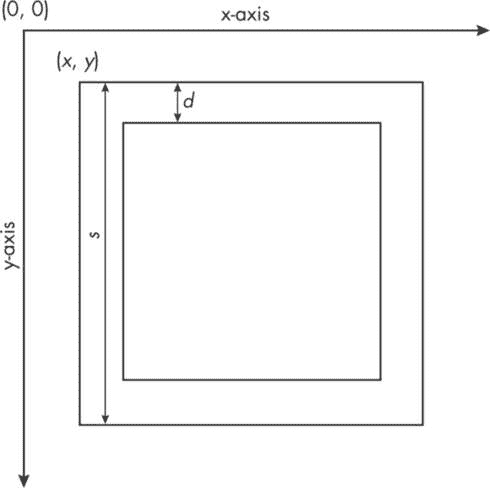

图 6-3：绘制同心正方形的策略

我们将从选择外部正方形的左上角顶点坐标 *x* 和 *y* 开始。给定这些坐标，计算正方形的其他坐标只需按需添加边长 *s*。这就为我们绘制外部正方形提供了所需的所有信息。

接下来，我们将调用递归函数，通过以下参数绘制内部正方形或多个正方形：最近绘制的正方形的左上角顶点的 x 和 y 坐标；该正方形的边长 *s*；以及一个缩小因子 *k*（一个百分比，表示下一个正方形边长应缩小多少）。我们将使用这些信息计算图 6-3 中的 *d*，即从一个正方形的顶部到下一个正方形顶部的距离，计算公式为：

*  d* = *ks/*2

这将使我们能够更新下一个正方形的左上角坐标和边长，如下所示：

*  x* = *x* + *d*

*  y* = *y* + *d*

*  s* = *s* – 2*d*

为了防止我们的递归函数变成无限循环，我们将在递归函数中提供一个停止条件，即通过全局常量限制迭代次数。

#### 代码

按照我们刚才讨论的步骤，首先创建所需的变量并绘制外部正方形。

```
val x = 50.0
val y = 50.0
val s = 400.0
❶ val k = 0.15   // Reduce the side by 15%.
gc.fill = Color.BLACK
❷ gc.strokePolygon(doubleArrayOf(x, x, x + s, x + s),
    doubleArrayOf(y, y + s, y + s, y), 4)

// Call the resursive function.
drawSquares(x, y, s, k, gc)
```

这段代码将外部正方形的左上角放置在相对于原点的 (50, 50) 位置，并将正方形的大小设置为 400×400。画布本身的尺寸是 500×500，稍后我们将看到。在每次迭代中，内部正方形的边长将缩小 15% ❶；可以根据需要调整这个值。正方形将以黑色绘制，如 Color.BLACK 所指定，背景为白色（默认值）。调用 gc.strokePolygon() 方法绘制正方形 ❷（gc 是用于在画布上绘图的 GraphicsContext 对象）。此方法要求传入两个单独的 DoubleArray 数组，分别用于 x 和 y 坐标；最后一个参数表示顶点的数量——在这种情况下，对于正方形，顶点数为四。

现在让我们实现递归的 drawSquares() 函数。

```
fun drawSquares(_x: Double, _y: Double, _s: Double,
                k: Double, gc: GraphicsContext) {

    if (iter <= ITER_MAX) {
        val d = 0.5 * k * _s
        val x = _x + d
        val y = _y + d
        val s = _s – 2 * d

        gc.strokePolygon(doubleArrayOf(x, x, x + s, x + s),
            doubleArrayOf(y, y + s, y + s, y), 4)

        iter += 1
      ❶ drawSquares(x, y, s, k, gc)
    }
}
```

算法首先检查停止条件：如果 iter（其初始值为 1，并且每次递归递增 1）超过了由 ITER_MAX 设置的最大迭代次数，那么循环将停止在画布上绘制正方形，程序将正常终止。否则，我们计算一组新的参数，继续绘制另一个正方形。请注意，我们在接收参数值时，使用下划线作为左上角顶点的 x 和 y 坐标的前缀，以及边长的前缀。这种命名约定使得我们在函数内部使用的变量名与应用程序类外部使用的变量名保持一致。

然后，我们递归地调用 drawSquares()函数，使用更新后的参数值绘制下一个内侧的正方形❶。图 6-4 显示了程序的输出，ITER_MAX 值为 22，意味着最外面的正方形内有 22 个正方形。

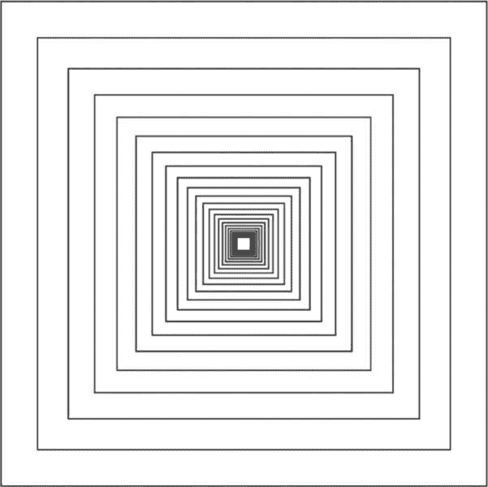

图 6-4：由同心的、非旋转的正方形组成的简单分形

我们的同心正方形是一个简单的几何分形例子。它表现出自相似性，即如果我们去除一些外层正方形，得到的图像在放大后看起来会和原图相同，即使我们迭代更多次。

下面是应用程序的完整代码，包括为 Kotlin 适配的 JavaFX 组件模板。

```
import javafx.application.Application
import javafx.geometry.Pos
import javafx.scene.Scene
import javafx.scene.canvas.Canvas
import javafx.scene.canvas.GraphicsContext
import javafx.scene.layout.FlowPane
import javafx.scene.paint.Color
import javafx.stage.Stage

// global variables
val ITER_MAX = 22
var iter = 1

// beginning of the Application class
class GeometricFractal : Application() {
    override fun start(stage: Stage) {

        val canvas = Canvas(600.0, 600.0)
        val gc = canvas.graphicsContext2D

        val rootNode = FlowPane()
        rootNode.alignment = Pos.CENTER
        rootNode.children.add(canvas)

        val scene = Scene(rootNode, 600.0, 600.0)
        stage.title = "Geometric Fractal"
        stage.scene = scene
        stage.show()

        // problem-specific code segment
        val x = 50.0
        val y = 50.0
        val s = 400.0
        val k = 0.15
        gc.fill = Color.BLACK

        gc.strokePolygon(doubleArrayOf(x, x, x + s, x + s),
            doubleArrayOf(y, y + s, y + s, y), 4)

        drawSquares(x, y, s, k, gc)
    }
}

fun main() {
    Application.launch(GeometricFractal::class.java)
}

fun drawSquares(_x: Double, _y: Double, _s: Double,
                k: Double, gc: GraphicsContext) {

    if (iter <= ITER_MAX) {
        val d = 0.5 * _s * k
        val s = _s - 2 * d
        val x = _x + d
        val y = _y + d
        gc.strokePolygon(
            doubleArrayOf(x, x, x + s, x + s),
            doubleArrayOf(y, y + s, y + s, y), 4)

 // Update counter.
        iter += 1
        // recursive call
        drawSquares(x, y, s, k, gc)
    }
}
```

通过对这段代码进行一些微小的变化，你可以创建其他类似的几何分形，比如同心矩形或圆形。在你尝试实践练习之前，我建议你先尝试这些变化。

项目 23：绘制谢尔宾斯基三角形

对于这个项目，我们将使用类似于项目 22 的方法绘制谢尔宾斯基三角形（见图 6-1）。首先，我们将识别分形的定义特征，包括其几何性质，然后编写一个递归函数来完成大部分的复杂工作。我们将使用与项目 22 相同的 JavaFX 模板来创建图形输出。

回想一下，谢尔宾斯基三角形是通过取一个三角形并连接其三边的中点，产生三个子三角形，然后继续连接这些子三角形边的中点，如此递归下去，直到无限。通常，这些三角形是等边三角形，意味着它们有三条相等的边和 60 度的内角。我们将利用这些基本特性来制定一种有效的策略，生成分形。然而，处理等边三角形并不是严格要求的；你可以按照本节中概述的步骤，通过对代码做一些小调整，创建一个等腰谢尔宾斯基三角形。

#### 策略

绘制谢尔宾斯基三角形时，我们需要一些关键参数：父（三角形外部）三角形的顶点坐标（x，y），即两条倾斜边相交的地方，以及父三角形的底边（*b*）和高度（*h*）。图 6-5 展示了这些参数，包括一些用于子三角形的附加参数，这些将在我们的代码中使用。

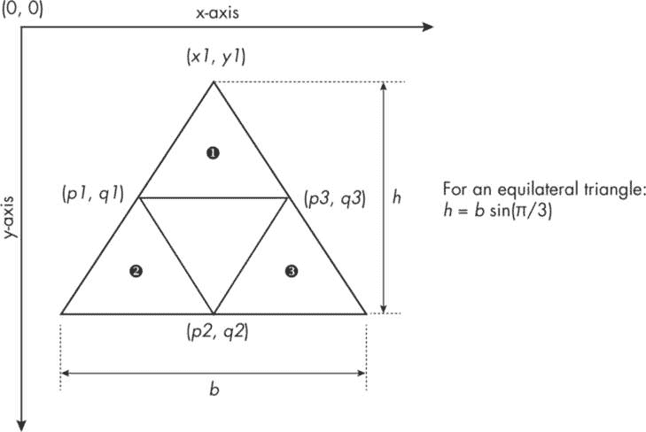

图 6-5：绘制谢尔宾斯基三角形的策略

我们将首先绘制父三角形，就像我们在同心正方形示例中所做的那样。接着，我们会调用一个递归函数来连接三角形三条边的中点，这些中点的坐标是根据父三角形的底边、高度和顶点计算的。由于这将创建三个更小的子三角形（而不是一个更小的正方形），递归函数需要多次调用自身，每次针对一个子三角形 ❶ ❷ ❸。我们将继续使用递归，直到满足停止条件为止。

#### 代码

我们将分三部分讨论代码。首先，我们将导入所需的数学函数并声明一些全局参数和数据类（其余与 JavaFX 相关的代码将从项目 22 中复用）。

```
import kotlin.math.sin
import kotlin.math.PI
import kotlin.math.pow

// global parameters
val BASE = 500.0
val DEPTH = 7
val baseMin = BASE * ((0.5).pow(DEPTH))

data class Vertices(var p1: Double, var q1: Double,
                    var p2: Double, var q2: Double,
                    var p3: Double, var q3: Double)
```

第一个全局参数 BASE 表示父（三角形外部）三角形的底边，设定为 500\。第二个参数 DEPTH 是迭代次数（即内嵌三角形绘制的次数），但我们仅用它来计算真正的停止条件 baseMin。这是内嵌三角形的最小底边长度，当我们停止递归时，它就达到了最小值。考虑到我们能绘制的物体大小受到屏幕像素尺寸和我们视力的限制，实际上考虑最小边长更为实际。因此，让递归执行任意次（比如 50 或 100 次）以生成静态图像是没有意义的。

baseMin 参数与迭代次数 DEPTH 的关系如下：

$方程$ 

这意味着随着 DEPTH 的增加，baseMin 呈指数下降，因此仅 5 到 10 次迭代就足以展现简单几何分形的关键特征。在此案例中，由于我们使用了 DEPTH 值为 7 和 BASE 为 500，baseMin 将为 3.906。

我们将使用数据类 Vertices 来存储并返回内部三角形的顶点，借助 getVertices()函数（我们稍后会详细讨论）。

接下来，让我们看一下定义并绘制父三角形的特定代码段。顶点设定为(300.0, 50.0)，底边*b*和高度*h*分别设定为 500.0 和 500 sin(*θ*)，其中*θ*为π/3 弧度（或 60 度）。

```
// problem-specific component inside the application class
val b = BASE
val h = b * sin(PI / 3.0)
val x1 = 300.0
val y1 = 50.0

val x = doubleArrayOf(x1, x1 - b/2, x1 + b/2)
val y = doubleArrayOf(y1, y1 + h, y1 + h)
// Draw the outermost triangle.
gc.strokePolygon(x, y, 3)
// Call the recursive function.
drawTriangle(x1, y1, b, h, gc)
```

我们通过调用 `gc.strokePolygon()` 函数来绘制父三角形，传递三个顶点的 x 和 y 坐标以及顶点数量（在这种情况下是三个）。然后，我们进行一次对递归函数 `drawTriangle()` 的调用，以生成子三角形。注意，我们遵循了与项目 22 中绘制同心正方形时相同的基本步骤。

最后，我们将定义我们的递归函数来绘制内三角形。我们还将定义一个辅助函数，用于计算三角形的中点。

```
fun drawTriangle(x1: Double, y1: Double, base: Double,
                 height: Double, gc: GraphicsContext) {

  ❶ if (base > baseMin) {
        val (p1, q1, p2, q2, p3, q3) =
            getVertices(x1, y1, base, height)

        val p = doubleArrayOf(p1, p2, p3)
        val q = doubleArrayOf(q1, q2, q3)
        gc.strokePolygon(p, q, 3)

        // recurse for nonempty child triangles
      ❷ drawTriangle(x1, y1, base/2, height/2, gc)
      ❸ drawTriangle(p1, q1, base/2, height/2, gc)
      ❹ drawTriangle(p3, q3, base/2, height/2, gc)
    }
}

fun getVertices(x1: Double, y1: Double, base: Double, height: Double) =
                Vertices(x1 - base/4, y1 + height/2, x1, y1 + height,
                         x1 + base/4, y1 + height/2)
```

我们的 `drawTriangle()` 函数与我们在项目 22 中的 `drawSquares()` 函数遵循了类似的模式，但存在几个重要的区别。首先，停止条件现在是基于 `baseMin` ❶ 而不是最大迭代次数（我们已经讨论过为什么这样做）。其次，我们在 `drawTriangle()` 函数内部进行了三次独立的递归调用（而不是像之前的项目那样进行一次递归调用），以确保在每个步骤中生成的三个子三角形都有助于创建最终的分形图像。要查看其工作原理，可以参见图 6-6。

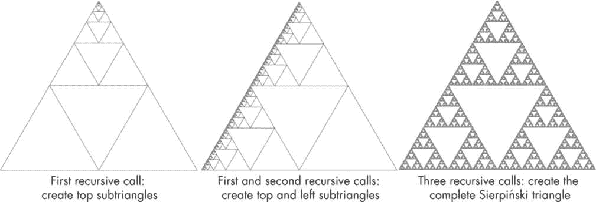

图 6-6：通过递归调用演化的谢尔宾斯基三角形（n = 7）

如果我们仅在 `drawTriangle()` 函数内部进行了第一次递归调用 ❷，最终的图形将只会对子三角形的顶部进行细分，如图 6-6 左侧所示。中间的图像展示了如果我们进行了两次递归调用 ❷ ❸，会发生什么情况；此时，顶部和左侧的子三角形都被细分。最后，右侧的图像是我们想要的——完整的谢尔宾斯基三角形，它是通过对 `drawTriangle()` 函数进行三次连续递归调用 ❷ ❸ ❹ 来创建的，子三角形的参数值也得到了更新。

项目 24：创建一棵分形树

作为简单几何分形的最终项目，我们将绘制一棵美丽的分形树。树木将从一条直线（树干）开始，树干分成两条分支。然后，每个分支将自己分成两条分支，依此类推。

#### 策略

该项目的核心策略很简单：绘制一条线，然后从这条线的端点递归绘制两条线，每条线相对于父线都有一个角度。图 6-7 概述了该策略以及我们需要在代码中整合的特性。

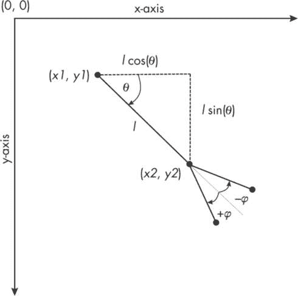

图 6-7：绘制分形树的策略

首先，我们将为父线选择一个起点（*x1*，*y1*），一个长度*l*，以及父线相对于 x 轴的角度*θ*。使用三角学，我们计算父线终点的坐标（也就是两个子线的起点）为*x1* + *l* cos(*θ*)和*y1* + *l* sin(*θ*)。子线比父线短（我们会选择一个缩小因子），并且从父线分支出来的角度为任意角度*φ*，使得新线分别以角度（*θ* + *φ*）和（*θ* – *φ*）相对于 x 轴绘制。不断计算终点，绘制新线并进行分支，直到满足停止条件（例如，当新分支变得太小）。

#### 代码

在这个例子中，我们没有使用任何全局变量或参数，数学函数的导入块如下所示：

```
import kotlin.math.PI
import kotlin.math.sin
import kotlin.math.cos
```

因此，我们将讨论的第一个代码片段涉及到应用类中的问题特定参数值以及递归函数`drawTree()`的调用。

```
val x = canvas.width / 2.0
val y = canvas.height - 100
val len = 55.0
val angle = -PI / 2
val phi = PI / 10

gc.stroke = Color.GRAY
drawTree(x, y, angle, len, phi, gc)
```

我们将父线的起点水平居中放置在画布上，并将其位置设为距离底部 100 像素（假设画布大小为 600×600）。起始角度（angle）为–π/2，使得树木以直立的姿势绘制。我们将子线相对于父线的分支角度*φ*（phi）设置为π/10，这样可以在给定参数下产生最佳的分支效果。与之前的分形项目不同，这次我们还没有绘制任何内容。此时，父线在递归函数内部绘制，因为它使用了与绘制子线相同的代码。接下来，我们将定义这个函数。

```
private fun drawTree(x1: Double, y1: Double, theta: Double,
                     len: Double, phi: Double,
                     gc: GraphicsContext) {

  ❶ if (len > 10) {
        val x2 = x1 + len * cos(theta)
        val y2 = y1 + len * sin(theta)
        gc.strokeLine(x1, y1, x2, y2)

      ❷ drawTree(x2, y2, theta + phi, len - 4, phi, gc)
      ❸ drawTree(x2, y2, theta - phi, len - 4, phi, gc)

 } else {
        gc.fill = Color.BLACK
        gc.fillOval(x1 - 2, y1 - 2, 4.0, 4.0)
    }
}
```

终止条件是在传入函数的 len 参数小于或等于 10 时停止递归❶。在每次迭代中，我们计算当前线段的终点，并使用 gc.strokeLine()函数绘制它。然后，我们进行两次递归调用❷❸，将子线的长度减少四像素（大约是原父线长度的 7%）。当停止条件满足时，应用程序不会立即终止`drawTree()`函数，而是会在所有最终子线的末端绘制小圆圈。通过合理选择颜色，结果可以像一棵盛开的樱花树。此树的灰度版本显示在图 6-8 中。

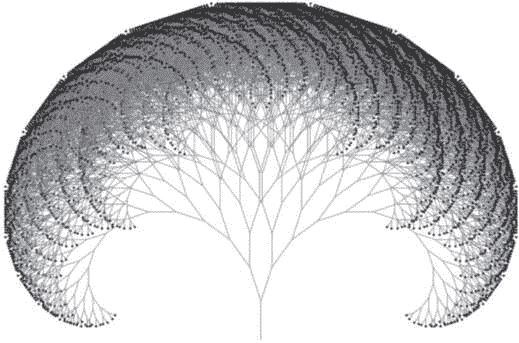

图 6-8：盛开的分形树

对于我们到目前为止做的所有分形项目，尤其是这个项目，您选择的参数值将对图像的最终外观产生重大影响。如果您从书中的代码片段中逐字复制参数值，您将能够重现本章中呈现的完全相同的图形。但是，您可以使用许多可能的参数值组合。我鼓励您玩弄这些参数；谁知道呢，也许您会发现一个全新的分形家族，没人见过！

### L 系统与海龟图形

与分形密切相关的是*L 系统*，这是一种通过一系列迭代步骤生成复杂字符序列的技术。然后，这些字符被解释为不同的几何操作，例如绘制线条或向左或向右转弯。L 系统由匈牙利生物学家阿里斯蒂德·林登梅耶（Aristid Lindenmayer）于 1968 年提出，用于研究简单生物体的发展，并模拟植物形态和生长。林登梅耶提出，植物随时间的发展可以通过“自然”算法来描述，这些算法负责描述在枝条、叶子、花瓣和花朵排列中看到的几何特征。（我们将在第八章和第九章讨论几个其他受自然启发的算法。）植物生长的另一个特征（也被 L 系统所包含）是自相似性的普遍存在——同样的模式在不同的尺度上被复制。难怪 L 系统很快被数学家和计算机科学家采用，用来研究和可视化曼德尔布罗特简洁地称之为分形的大自然美丽几何。

在本节中，我们将研究 L 系统的组成部分，并在 Kotlin 中开发我们自己的 L 系统模拟器。我们还将学习海龟图形（Turtle Graphics），这是一种常用的计算机编程模型，用于可视化 L 系统所创建的形状和模式。由于 Kotlin 的标准库不包含海龟图形包，我们将结合 JavaFX 画布和 Kotlin 来创建我们自己的海龟类。

#### 形式化 L 系统

L 系统需要一些基本元素来生成可以解释为绘制分形物体的几何指令的字符串：字母表、公理、一组规则和深度。*字母表*是字符串中可用的字符集，每个字符都有一个相关的含义。例如，F 可能表示绘制一条线，+ 可能表示向右转，等等（我们稍后会定义完整的字母表）。*公理*是 L 系统起始时的初始字符序列，*规则*则定义了在一系列迭代中转换公理（或后续字符串）的方法。当有多个规则时，它们按顺序应用，每个规则生成的子字符串按相同的顺序连接在一起，形成新的字符串。深度设定了应用规则的迭代次数，直到得到最终的字符串。表 6-2 总结了 L 系统的组件。

表 6-2：L 系统组件

| 特性 | 功能 | 示例 | 解释 |
| --- | --- | --- | --- |
| 字母表 | 允许使用的字符集 | F, G, J, +, -, [,], X | 参见表 6-3。 |
| 公理 | 用于开始生成的初始字符集（以递归方式应用规则） | F++F | 从当前位置前进，右转指定角度两次，然后再次前进。 |
| 规则 | 如何根据给定公理或字符串创建新字符串的说明 | F -> F-F++F-F | 将字符串中的每个 F 替换为箭头（->）后面的一组字符；对于规则未指定的其他字符，原样保留。 |
| 深度 | 规则应用的次数（假设公理的深度为零） | 5 | 在创建相应图形之前应用规则五次。 |

除了表 6-2 中提到的组件外，我们还需要设置另外两个参数：要绘制的线段长度（或跳过不绘制线段的距离）和旋转角度。通常，随着每次迭代，线段长度会减少，因为分形的较大（外部）元素通常先被绘制，然后是较小（内部）元素。减少线段长度也可能是为了限制最终图形的大小。特定分形的旋转角度*θ*在整个过程中保持不变。

让我们通过一个简单的例子来说明如何使用 L 系统符号和过程：绘制一个三角形。对于这个练习，图 6-9 中概述了 L 系统的参数和相关步骤。


图 6-9：用于绘制等边三角形的 L 系统

我们从画布上的 (*x1*, *y1*) 开始，面朝正 x 轴方向，相对于 x 轴的角度为 0。我们的公理是一个字符，F，而我们的规则 F -> F++F++F 告诉我们，每次迭代时，应将字符 F 替换为字符串 F++F++F。应用规则一次（即仅对公理应用一次规则，然后停止）后，我们得到最终的字符串：F++F++F。

接下来，我们按照这个指令字符串进行操作：从初始位置出发，向前移动（F）指定的长度 *l*，到达 (*x2*, *y2*)，然后进行两次右转（++），每次按指定角度 *θ* 旋转，再次向前移动（F），到达 (*x3*, *y3*)。最后，再进行两次右转（++），向前移动（F），这将我们带回起点，完成三角形。每次从一个点移动到另一个点时，我们通过画线连接这两个点，跟踪路径。

#### 使用海龟图形绘制 L-系统图案

海龟图形是一种绘图系统，它将海龟想象成在图形窗口中移动。海龟至少有两个属性：其在 x 和 y 坐标系中的位置，以及通过相对于正 x 轴方向的角度来衡量的朝向。海龟拖着一支笔。当笔放下时，海龟移动时会在窗口上画出线条；当笔抬起时，海龟移动但不会留下轨迹。

海龟图形最初是一个名为 Logo 的教育编程语言的一部分，但这一概念也被实现到了其他编程语言中，包括 Python。它用于教授与编程相关的概念，以及在图形窗口中简单对象的移动和动画。它还可以创意性地用于教授欧几里得几何，并通过递归生成有趣的图案。或许海龟图形在研究中的最著名应用是可视化由几何分形的 L-系统生成的指令字符串。

当一种语言内置对海龟图形的支持时，我们只需导入相关的包或类，利用其方法或函数来控制海龟的移动，绘制线条、形状和图案。由于 Kotlin 标准库不包含海龟包，我们将开发一个简单的海龟类，它能与 JavaFX 的 Canvas 对象无缝配合，提供相同的功能。本练习的更大目标是构建一个简约的 L-系统模拟器，能够生成任意深度的 L-系统字符串，并借助海龟类将其实现，生成著名的几何分形。表 6-3 展示了我们将使用的 L-系统符号（字符）和相应的海龟类方法，我们需要实现这些方法。

表 6-3：L-系统字符和海龟图形方法

| 字符 | 期望的动作 | 海龟命令 |
| --- | --- | --- |
| F, G | 将海龟向前移动，并绘制一条连接旧位置和新位置的线。尽管 F 和 G 执行相同的动作，规则可能不会以相同的方式应用于 F 和 G。 | turtle.lineTo() |
| J | 跳跃到一个新位置而不绘制线条。 | turtle.moveTo() |
| + | 将海龟向右旋转指定角度。 | turtle.turnRight() |
| - | 将海龟向左旋转指定角度。 | turtle.turnLeft() |
| [ | 将海龟的当前状态（位置、角度）推送（保存）到栈中。 | turtle.push() |
| ] | 从栈中弹出最后一个保存的状态（同时将其从栈中移除）并将其设置为海龟的当前状态。 | turtle.pop() |
| X | 什么也不做。跳到下一条指令。 | 无海龟调用 |

在绘制复杂形状时，L-System 字符串可能会要求海龟从一个基准位置向不同方向分支。为此，海龟需要保存其当前状态，以便稍后返回基准位置并选择另一个方向。`push()` 方法有助于保存当前状态，而 `pull()` 方法则检索已保存的状态，以便海龟从那里开始新的分支。这些方法将依赖于一个*栈*，一种数据结构，其中最近添加的项是第一个被取出的，通常称为后进先出（LIFO）。这样，海龟将首先返回到较新的状态，以完成子分支，然后再返回到较早保存的状态，开始绘制新的主分支。

项目 25：设计一个 L-System 模拟器

一个 L-System 模拟器由几个函数或类组成，这些函数或类帮助解释 L-System 规则、生成最终的指令字符串，并在图形窗口中绘制生成的图像。理想情况下，这些组件应该以与问题无关的方式编写，并且提供某种机制让用户输入 L-System 的初始参数，可能是通过文件或命令行。为了简化起见，我们将这些参数直接嵌入代码中，使用生成雪花图案的值，但其他代码将保持通用。你只需更新这些特定问题的参数，即可模拟不同的 L-System 对象。

#### 代码

我们将从一些全局声明开始编写我们的 L-System 模拟器代码，以保持数据的组织性，然后定义生成特定 L-System 对象的特定问题参数。接下来，我们将声明一些辅助函数，用于基于规则生成 L-System 字符串并在画布上绘制最终的 L-System 字符串。我们还将声明我们的 Turtle 类，并为其添加渲染图像的方法，然后通过一个 LSystemApp 类将所有内容整合在一起。

##### 全局声明

我们将通过声明两个数据类来组织 L-System 数据，以及一个特殊的数组类型来创建 `push()` 和 `pull()` 方法所需的栈功能。

```
// global declarations
data class Rule(val key: String, val apply: String)
data class State(val x: Double, val y: Double, val angle: Double)
val stack = ArrayDeque<State>()
```

`Rule` 数据类将通过使用 `key` 和 `apply` 成员来定义每个 L 系统规则，二者都是 `String` 类型。`key` 属性将保存如果存在时在应用规则时需要替换的字符，而 `apply` 属性将保存替换 `key` 的字符串。例如，对于规则 F -> F++F++F，`key` 和 `apply` 的值分别是 F 和 F++F++F。

第二个数据类，State，保存海龟的状态——具体来说，它的 x 和 y 坐标以及它相对于 x 轴的朝向。最后，栈是通过使用 Kotlin 的`ArrayDeque`类声明的，该类实现了一个可调整大小的（可变的）双端队列（*double-ended queue*）数据结构的数组。这个类有方法来方便栈的后进先出（LIFO）特性。数组的成员将是我们自定义的 State 数据类型。

##### 问题定义

接下来，我们将声明 L 系统的特定问题参数，包括它的公理和规则。我们在这里使用的参数将生成一个看起来像雪花的简单分形图案。可以随意将它们替换为其他著名 L 系统的参数，或者尝试你自己的参数。

```
// problem definition
❶ val axiom = "F++F++F"
❷ val rules: List<Rule> = listOf(
    Rule("F", "F-F++F-F"),
    // Rule(),
    // Rule()
    )

var line = 100.0     // in pixels
val scaling = .33    // shrinkage factor per iteration
val ANGLE = 60.0     // turning angle in degrees (fixed)
val depth = 5        // number of iterations

❸ val turtle = Turtle(150.0, 200.0, 0.0)

var finalString = ""
```

首先，我们为雪花分形❶定义了公理或起始字符串。之前，我们使用相同的字符串 F++F++F 来绘制等边三角形。然后，我们创建一个名为 rules 的 `Rule` 类型列表，在其中保存与 L 系统相关的所有规则❷。雪花只需要一个规则，但 `listOf()` 内的注释展示了如果需要的话如何添加更多规则。我们将线条的初始值设为 100 像素，基于 600×600 的画布大小，但线条长度将在每次迭代时缩短三分之一。我们还将转角角度 `ANGLE` 设置为 60 度，迭代次数 `depth` 设置为 5。

我们只需要创建一个 `Turtle` 类的实例❸。我们将它的初始位置设置为 (150.0, 200.0)，初始角度为 0.0（面朝正 x 方向）。注意，随着海龟的移动，它的位置和朝向（角度）可能会发生变化。最后，我们将 `finalString` 设置为空字符串；它的内容将在每次迭代后改变，只有最终的值会用来绘制分形图案。

##### `generate()` 函数

`generate()` 函数是模拟器的核心组件。它根据给定的公理和深度执行 L 系统规则。

```
// function to generate final L-system string
fun generate() {
    var nextString = ""
  ❶ for (letter in finalString) {
        var match = false
      ❷ for (rule in rules) {
          ❸ if (letter.toString() == rule.key) {
                match = true
 nextString += rule.apply
                break
            }
        }
      ❹ if (!match) nextString += letter
    }
  ❺ finalString = nextString
}
```

我们首先声明一个空字符串 nextString，在其中保存最终字符串的中间值。然后我们使用两个 for 循环，通过 finalString 的最新版本逐个字符进行迭代，并对该字符应用任何相关的规则 ❷。布尔变量 match 用于跟踪是否应该应用特定的规则。当选择的字符与当前规则的关键字匹配时 ❸，我们将 match 设置为 true，并将规则的 apply 元素指定的替换字符串添加到 nextString 中。接下来是 break 语句，用于跳出内部 for 循环（每次外部 for 循环迭代时，只会有一个规则适用于某个字符）。如果没有任何规则适用，我们将当前字符不加改变地添加到 nextString 中 ❹。一旦我们迭代完 finalString 中的所有字符，我们将其值重置为 nextString ❺。

##### draw()函数

draw()函数通过读取 finalString 中的字符，并调用 Turtle 类的方法来绘制最终图像。

```
// function to draw per finalString instructions
fun draw(gc: GraphicsContext) {
  ❶ for (letter in finalString) {
      ❷ when (letter.toString()) {
            "F", "G" -> turtle.lineTo(line, gc)
            "J" ->      turtle.moveTo(line)
            "+" ->      turtle.turnRight(ANGLE)
            "-" ->      turtle.turnLeft(ANGLE)
            "[" ->      turtle.push()
            "]" ->      turtle.pop()
            "X" ->      {/* do nothing */}
        }
    }
}
```

我们在一个优雅的 for 循环 ❶和一个简洁的 when 块 ❷中实现绘图过程，这比传统的多层 if...else 块要简洁得多。for 循环逐个扫描变量 finalString 中的字符，并将它们作为字母传递给 when 块。接下来，我们进行一系列测试，直到找到与某个 L 系统代码匹配的字符。根据匹配结果，我们调用相关的 Turtle 方法来绘制或在画布上移动。例如，我们将字符 F 和 G 匹配到 lineTo()方法，将 J 匹配到 moveTo()方法。请注意，不同的函数调用需要不同的参数，when 块中的最后三个调用不需要任何参数！接下来我们将看到当这些方法被调用时会发生什么。

##### Turtle 类及其方法

现在我们将实现我们的 Turtle 类，其中包含了执行最终绘图的所有方法。为了保持我们的 L 系统应用的主体部分简洁明了，我们将在一个名为*Turtle.kt*的单独文件中声明这个类。我们从这里开始编写文件：

```
import javafx.scene.canvas.GraphicsContext
import kotlin.math.*

❶ class Turtle (var x: Double, var y: Double, angle: Double) {
    var angleRad = angle * PI /180
    `--snip--`
}
```

导入块让我们能够访问所需的 JavaFX 和 Kotlin 库组件。主类构造函数是类头部的一部分 ❶，它使用三个值创建一个 Turtle 类的实例：海龟的起始 x 和 y 坐标以及其初始方向（海龟的角度）。我们将前两个参数设置为 var，因为每次海龟移动或改变方向时，这些值都会更新。我们将第三个参数 angle 设置为 val（没有显式声明，但已暗示），它用于定义一个可变的属性 angleRad。

类的其余部分定义了七个不同的方法，可以调用它们来执行不同的 Turtle 对象任务。请参见表 6-3 以了解这些方法及其对应的 L 系统字符的概述。

```
fun lineTo(line: Double, gc: GraphicsContext) {
    val xBegin = x
    val yBegin = y
    x += line * cos(angleRad)
    y += line * sin(angleRad)
    gc.strokeLine(xBegin, yBegin, x, y)
}

fun moveTo(line: Double) {
    x += line * cos(angleRad)
    y += line * sin(angleRad)
}

fun turnRight(delta: Double) {
    // origin @ bottom left
    angleRad += delta * PI /180
}

fun turnLeft(delta: Double) {
    // origin @ bottom left
    angleRad -= delta * PI /180
}

fun push() {
    stack.addLast(State(x, y, angleRad))
}

fun pop() {
    val (xPop, yPop, anglePop) = stack.removeLast()
    x = xPop
    y = yPop
    angleRad = anglePop
}

fun printTurtle() {
    print("x: ${round(x * 100) / 100.0}  y: ${round(y * 100) / 100.0}  ")
    println("angle: ${round((angleRad * 180 / PI) * 100) / 100.0} degrees")
}
```

`lineTo()`方法是唯一一个真正在画布上绘制内容的方法。它基于我们在项目 24 中绘制分形树段时使用的相同正弦和余弦计算，绘制一个长度为`line`的直线。所有其他方法要么是在不绘制线条的情况下移动海龟，要么改变海龟的方向，或保存或恢复海龟的状态。最终的方法只是打印海龟的当前状态，这对于调试非常有用。

`push()`和`pop()`方法依赖于`ArrayDeque`类的方法，我们使用它来实现栈。`push()`方法调用`addLast()`函数，而`pop()`调用`removeLast()`函数，将项添加或移除栈数组的末尾，从而遵循 LIFO 规则。在这两种情况下，我们通过使用自定义的`State`数据类来封装状态信息。

##### LSystemApp 类

最后，我们将 L 系统模拟器的不同组件整合在一起，形成一个完整的应用程序，该程序围绕一个 LSystemApp 类组织。下面的代码展示了这个类的完整代码以及`main()`函数。代码还显示了我们之前讨论的所有其他组件如何融入其中（Turtle 类除外，它在一个单独的文件中）。

```
// import statements
`--snip--`

// global declarations
`--snip--`

// problem definition
`--snip--`

// function to generate final L-system string
fun generate() {
`--snip--`
}

// function to draw per finalString instructions
fun draw(gc: GraphicsContext) {
`--snip--`
}

// JavaFX-Kotlin Application class
class LSystemApp : Application() {
    override fun start(stage: Stage) {
        val canvas = Canvas(600.0, 600.0)

        val gc = canvas.graphicsContext2D
        // Move the origin to bottom left.
      ❶ gc.translate(0.0, canvas.height)
        // Let positive y-axis point up.
      ❷ gc.scale(1.0, -1.0)

        val pane = Pane()
        pane.children.add(canvas)
        val scene = Scene(pane, 600.0, 600.0)
        stage.title = "L-system Simulator"
        stage.scene = scene
        stage.show()

        // ---L-system-related code---
        finalString = axiom

      ❸ if (depth > 0) {
            for (i in 1..depth) {
                generate()
            }
          ❹ line *= (scaling).pow(depth - 1.0)
        }
        draw(gc)
    }
}

fun main() {
    Application.launch(LSystemApp::class.java)
}
```

除了`generate()`和`draw()`函数，LSystemApp 的大部分代码都包含了常规的 JavaFX 代码。与以往不同的是，这次添加了几行额外的代码，将画布的原点移到左下角 ❶，并让 y 轴的正方向指向上方 ❷。这些简单的修改使得测试之前发布的 L 系统变得非常方便，这些 L 系统提供了许多著名分形的公理、规则和初始条件。已发布的 L 系统参数几乎总是基于我们在坐标系的第一象限绘制分形的假设。

管理 L 系统的代码围绕着一个 if 块展开，检查深度是否大于 0 ❸。如果不是，我们只需绘制公理本身，而不应用任何规则。否则，我们调用`generate()`函数深度次，进行适当次数的迭代应用规则。然后，我们使用`finalString`的最终内容来绘制分形。请注意，我们根据深度 ❹ 设置了绘制线条的长度。这种动态调整使得我们能够将分形的大小限制在画布的大小范围内。如果你希望使用更大或更小的画布大小（我们使用的是 600×600），你可能需要调整初始线条长度以及海龟的初始位置。

#### 结果

我们现在准备好测试我们全新的 L 系统模拟器了。由于我们已经为雪花分形包含了特定问题的参数，我们可以使用不同的深度运行模拟器，看看随着深度增加，图像如何变得更加复杂，并呈现自相似的图案。图 6-10 展示了深度为 1、3 和 5 时雪花的演变过程。

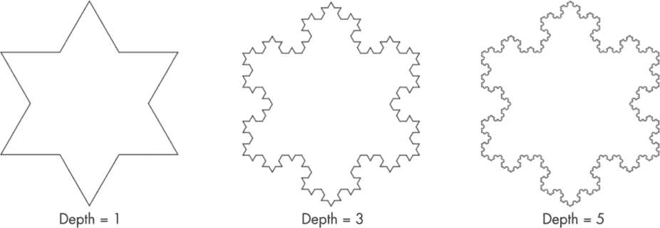

图 6-10：使用 L 系统模拟器生成的雪花演化过程

多年来，研究人员已经开发出许多有趣的 L 系统，你可以花上好几天的时间在模拟器中玩这些系统，并观察它们生成的迷人图案。例如，表 6-4 列出了创建三种具有不同特征的分形所需的 L 系统参数。这些系统有些包含了更广泛的符号范围，而且它们都涉及多个规则。

表 6-4：其他 L 系统示例

| 属性 | 分形名称 |
| --- | --- |
| 锡尔皮ński 三角形 | 带矩形的图案 | 分形植物 |
| --- | --- | --- |
| 公理 | F+G+G | F-F-F-F | X |
| 规则 | F -> F+G-F-G+F G -> GG | F -> F-J+FF-F-FF-FJ-FF+J-FF+F+FF+FJ+FFF J -> JJJJJJ | X -> F+[[X]-X]-F[-FX]+X F -> FF |
| 线段 | +150.0 | +15.0 | +20.0 |
| 缩放 | 0.5 | 0.5 | 0.7 |
| 角度 | 120 | 90 | 25 |
| 深度 | 6 | 2 | 6 |
| 海龟 | 150.0, 200.0, 0.0 | 150.0, 450.0, 0.0 | 100.0, 50.0, 65.0 |
| 画布 | 600.0×600.0 | 600.0×600.0 | 600.0×600.0 |

表 6-4 中的第一组参数将创建熟悉的锡尔皮ński 三角形。第二组参数，深度仅为二，用于绘制涉及多个不相连矩形的几何图案（见图 6-11，左）。第三组参数用于创建分形植物，这是分形爱好者中很受欢迎的一种对象（见图 6-11，右）。它涉及多个推拉操作（[和]），以跟踪植物的不同分支。

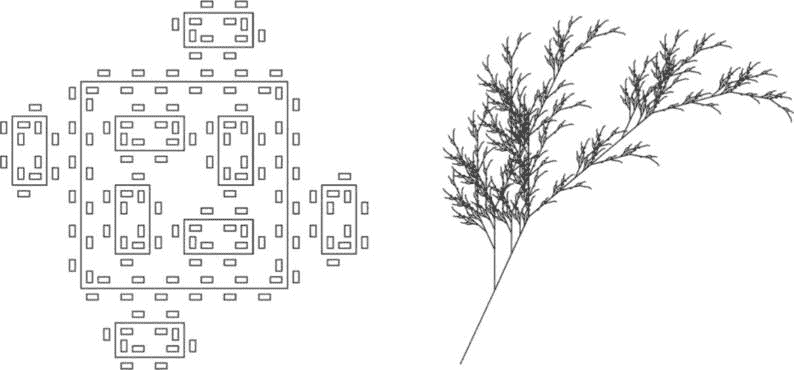

图 6-11：由 L 系统模拟器生成的矩形图案（左）和分形植物（右）

你可以扩展我们在本节中开发的基本 L 系统模拟器，以生成 3D 分形，例如空间填充的希尔伯特曲线。请查看本章末尾列出的资源，了解更多关于这些高级实现的内容。然而，L 系统模拟器的主要好处在于，它允许你自己尝试不同的公理和规则。也许你会创造出一个前所未见的全新分形，并以自己的名字命名！

### 强大的曼德尔布罗特集

讨论分形时，若不研究曼德尔布罗特集（M 集），并欣赏其复杂性与美丽，将是不完整的。M 集与我们迄今为止讨论的其他分形有两个重要区别。首先，它是一个非线性分形，意味着它的构建块由像素组成，呈现复杂的图案，而不仅仅是直线。其次，它映射在复平面上，因此我们需要使用复数。

M 集依赖于表面看似简单的二次函数的迭代特性，如方程 6.1 所示。

$方程$ (6.1) 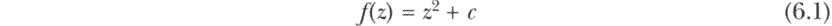

这里 *c* 是常数。所谓“迭代性质”，是指如果我们从某个初始种子值 *z* 开始，并递归地将方程的值反馈到自己作为新的 *z* 值，*f*(*z*) 的值将如何变化。方程式 6.2 显示了该函数的递归形式。

$方程式$ (6.2) 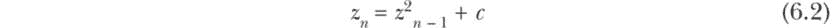

由方程 6.2 通过重复迭代生成的数字列表，给定特定的初始种子值 *z*[0] 和常数 *c*，称为该函数的 *轨迹*。 表 6-5 展示了不同 (*z*[0], *c*) 组合的轨迹。

表 6-5: 二次函数 f(z) = z² + c 的选定轨迹

| n (迭代次数) | 情况 1: z0 = 0, c = 1 | 情况 2: z0 = 0, c = –1 | 情况 3: z0 = 0, c = –0.65 |
| --- | --- | --- | --- |
| 1 | 1 | –1 | –0.65 |
| 2 | 2 | 0 | –0.22749999 |
| 3 | 5 | –1 | –0.59824375 |
| 4 | 26 | 0 | –0.29210441 |
| 5 | 677 | –1 | –0.56467501 |
| 6 | 458,330 | 0 | –0.33114213 |
| 7 | 非常大的数字！ | –1 | –0.54034488 |

表 6-5 中的每个情况都使用了初始值 0，但常数不同。请注意，常数值的微小变化可能会使轨迹进入完全不同的路径。一般来说，轨迹要么会发散，这意味着由于指数增长，函数值会变得越来越大（如情况 1 中所示），要么保持有界，使轨迹值保持在一定范围内。如果是后者，则可能会有几种变化：

+   轨迹会循环经过一组固定的值（如情况 2，其中周期为 2）。

+   轨迹会收敛到一个固定值；在情况 3 中，函数值经过大约 100 次迭代后收敛到 –0.4486。

+   轨迹会保持在一个固定值上（例如，当 z[0] = 0 且 c = 0 时）。

+   轨迹值保持有界，但表现出混沌行为，没有明显的模式。

所有这些隐藏的复杂性都由常数 *c* 控制，因为它取不同的值。然而，到目前为止，我们仅使用了实数作为 *c* 的值。现在是时候引入复数——满足以下方程式的 *c* 值：

$方程式$ (6.3) 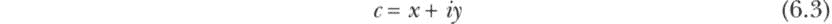

这里 *x* 和 *y* 是实数，*i* 是 √–1。 表 6-6 展示了使用复数 *c* 值的二次函数的一些例子。

表 6-6: 二次函数 f(z) = z² + c 的选定轨迹，其中 c = x + iy

| n (迭代次数) | 情况 1: z0 = 0, c = 0 + i | 情况 2: z0 = 0, c = 0 + 2i |
| --- | --- | --- |
| 1 | i | 2i |
| 2 | –1 + i | –4 + 2i |
| 3 | –i | 12 – 14i |
| 4 | –1 + i | –52 – 334i |
| 5 | –i | –108,852 + 34,738i |
| 6 | –1 + i | 离 (0, 0) 很远 |
| 7 | –i | 离 (0, 0) 非常远 |
| M 集合成员 | 成员 | 非成员 |

与实数*c*的情况类似，复数值也会产生两种类型的轨道：有界（如情况 1）或无界（如情况 2）。因此，我们现在可以定义曼德尔布罗集：对于所有复数*c*，如果由递归函数*f*（*z*）= *z*² + *c*生成的相应轨道在给定种子*z*[0] = 0 的情况下保持有界，则该复数*c*属于曼德尔布罗集。因此，查看表 6-6，*c* = 0 + *i* 是曼德尔布罗集的成员，而*c* = 0 + 2*i* 不是。

我们通过在*复平面*上绘制曼德尔布罗集的成员来可视化这个集合，复平面是一个坐标系，其中 x 轴表示复数的实部（方程 6.3 中的*x*），y 轴表示复数的虚部（方程 6.3 中的*y*）。根据这些 x 和 y 值，可以计算复数轨道的大小，如下所示：

$方程$ (6.4) 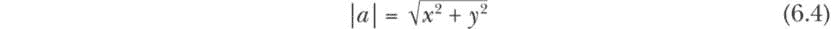

当复数作为点绘制在复平面上时，轨道的大小就是该点与原点之间的距离。

项目 26：编写代码并可视化曼德尔布罗集

让我们将注意力转向创建一个应用程序，帮助我们可视化曼德尔布罗集。我们对曼德尔布罗集的定义提供了关于所需内容的一些线索：我们需要找到并绘制使得二次函数（方程 6.1）在迭代过程中保持有界的复数*c*值。然而，我们仍然需要一些澄清。首先，我们应该调查复平面的哪个区域？了解曼德尔布罗集的成员是否集中在某个特定区域，还是分布在一个较大的区域会有所帮助。另外，由于二次函数可以无限迭代，因此并不清楚我们应该何时得出轨道是有界的或无界的结论。我们可以限制迭代次数，或者根据方程 6.4 定义的轨道大小来判断，或者两者兼顾。

幸运的是，研究人员已经揭示了一些关于曼德尔布罗集的有用事实，我们可以利用这些信息使我们的搜索更加高效和实用。首先，从已经创建的多个曼德尔布罗集图形中，我们知道搜索空间可以限制在一个由实轴（x 轴）上的[–2.0, 1.0]和虚轴（y 轴）上的[–1.5, 1.5]界定的区域内。其次，曼德尔布罗集也是一个封闭集合，完全包含在以原点为圆心、半径为 2 的圆内。这意味着，如果对于任何*n* > 0，|*z*n| > 2，那么复数*c*不能是该集合的成员。我们将把这个条件作为判断有界/无界的终止条件。否则，如果我们在迭代达到某个阈值（iterMax）之前没有发现|*z*n|超过 2，我们将认为*c*是曼德尔布罗集的成员。

我们将 iterMax 设置为 400，以便获得相对干净的 M 集图像，但我鼓励你通过将 iterMax 设置得更低或更高来进行实验。通常，较低的 iterMax 值可能会显示更多的噪声以及各种收敛区域。随着迭代次数的增加（测试条件变得更严格），分形边界趋向于变得更加清晰。

#### 代码

尽管这个概念相当复杂，但生成 M 集的代码相对简洁。我们将创建的应用程序将具备以下功能和特性：

+   问题定义（通过少量的全局变量完成）

+   能够逐点遍历搜索空间

+   能够检查每个点是否满足 M 集成员条件

+   能够使用选择的颜色方案在画布上绘制点

此外，我们需要调整图像的缩放比例，以确保搜索空间正确映射到给定大小的画布上。

##### 声明全局变量

首先，我们将声明一些全局变量。这段代码定义了实数轴和虚数轴的范围，设置了画布的大小，确定了 x 轴和 y 轴上的搜索增量，并限制了二次函数的迭代次数。

```
// problem definition and global parameters
val xMin = -2.0
val xMax = 1.0
val yMin = -1.5
val yMax = 1.5
val xRange = xMax - xMin
val yRange = yMax - yMin

val canvasW = 600.0
val canvasH = (canvasW / xRange) * yRange
val increment = 0.003
val iterMax = 400
```

我们将 xMin 和 xMax 设置为*c*的实部的下限和上限；同样，yMin 和 yMax 是*c*虚部的下限和上限。相应的范围（xRange 和 yRange）定义了一个矩形搜索空间，我们将探索这个空间以寻找潜在的 M 集成员。

接下来，我们将画布的宽度 canvasW 设置为 600 像素，画布的高度 canvasH 设置为一个值，以保持图像的比例（这意味着绘制出的 M 集不会失真）。这种方法的好处是，如果你想创建一个更大或更小的图像，只需调整 canvasW 即可。

我们将最后两个参数，增量和迭代最大值，分别设置为 0.003 和 400。这些值将决定图像的整体质量。可以将增量参数与 canvasW 关联，并让它自动计算——欢迎作为一个简单的实验尝试一下。

##### 寻找并绘制 M 集成员

我们现在将声明一个函数，遍历搜索空间，检查某个特定的复数*c*是否属于 M 集，并使用颜色方案标记画布上的相应点。

```
// function to iterate over the search space and draw
// nonmembers using a grayscale and members as black points

private fun drawMSet(gc: GraphicsContext) {
    var y = yMin
  ❶ while (y <= yMax) {
        var x = xMin
      ❷ while (x <= xMax) {
          ❸ val cval = getConvergence(x, y)
          ❹ val speed = cval.toDouble() / iterMax
            val factor = 1.0 - speed
            gc.fill = Color.color(factor, factor, factor)
          ❺ gc.fillRect(canvasW * (x - xMin)/ xRange,
                canvasH * (y - yMin)/ yRange, 1.0, 1.0)
            x += increment
        }
        y += increment
    }
}
```

drawMSet()函数使用一对嵌套的 while 循环来遍历搜索空间。外层循环❶沿 y 轴迭代，从最小 y 值 yMin 开始，当 y 达到上限 yMax 时结束，每次增量 y（我们设置为 0.003）。内层 while 循环❷沿 x 轴进行相同的操作。每次迭代，我们得到一个(*x, y*)对，表示一个复数（如公式 6.3 所定义），我们将其传递给 getConvergence()函数❸，以检查该复数是否属于 M 集（我们接下来会查看该函数）。

调用 getConvergence() 返回它执行的二次函数的迭代次数。我们将此次数除以 iterMax 来衡量收敛决策的速度 ❹。如果该结果值（速度）为 1，则迭代次数必定为 iterMax，表示 *c* 的轨道保持有界。因此，我们将此复数视为 M 集的成员。然而，如果速度小于 1，则表示轨道在达到最大迭代次数之前就跳出了半径为 2 的圆，所以我们不会将该数字视为 M 集的成员。

我们从 1 中减去速度，并使用结果（因子）根据灰度方案设置画布上相应点的颜色，其中 (1, 1, 1) 代表白色，(0, 0, 0) 代表黑色。如果轨道非常快地发散，因子将接近 1，因此表示该数字的画布上的点将标记为白色或接近白色的像素。相反，如果轨道只有在多次迭代后才发散（但在达到最大允许值之前），因子将更接近 0，因此对应的点将被标记为较暗的像素。当然，如果轨道保持有界，因子将恰好为 0，且对应的点将被标记为纯黑色像素，表示该点属于 M 集。

最后，我们通过将数字的 (*x*, *y*) 坐标对映射到画布上的像素位置 ❺，使用在图 6-12 中说明的缩放因子进行绘制。

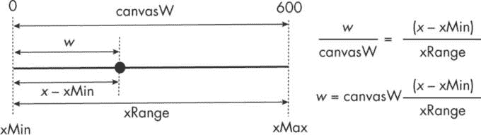

图 6-12：将 c 的 x 坐标映射到画布上像素的 x 值

我们使用比例规则将 x 坐标映射到画布上指定为 *w* 的点。我们也对 y 坐标应用相同的原理。

##### 检查收敛性

getConvergence() 函数接受一个 (*x*, *y*) 坐标对作为参数，并检查对应的复数是否属于 M 集。

```
// function to check for membership in the M-set
private fun getConvergence(x: Double, y: Double): Int {
    var zx = 0.0
    var zy = 0.0
  ❶ for (i in 1..iterMax) {
        val X = zx * zx – zy * zy + x
        val Y = 2 * zx * zy + y
      ❷ if (X * X + Y * Y > 4.0) return i
        zx = X
 zy = Y
    }
    return iterMax
}
```

为了遵循代码的逻辑，我们需要进行一些代数运算。回想方程 6.2，我们的二次函数的递归形式是 *z*n = *z*²n [– 1] + *c*。对于任何 n > 1 的值，*z*n [– 1] 都是一个复数，可以表示为：

$Equation$ (6.5) 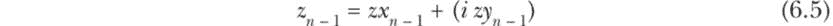

在方程 6.5 中，*zx*n [– 1] 是 *z*n [– 1] 的实部，*zy*n [– 1] 是虚部。现在我们可以使用方程 6.3 和 6.5 重写方程 6.2。经过简化后，我们得到：

$Equation$ (6.6) 

方程 6.6 可以进一步简化为：

$Equation$ (6.7) 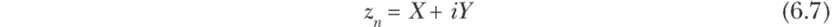

其中 *X* = (*zx*²n [– 1] – *zy*²n [– 1] + *x*) 和 *Y* = (2*zx*n [– 1] *zy*n [– 1] + *y*)。

回想方程 6.4，我们通过确认 *z*n 的模是否超出了半径为 2 的圆来检查：

$Equation$ (6.8) 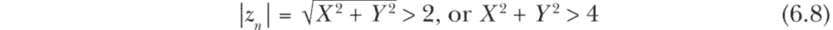

回到我们的代码，我们首先将实部和虚部 zx 和 zy 设为 0，相当于将种子值*z*[0]设为 0。接下来，for 循环❶遍历方程 6.7，计算 X 和 Y 的值。每次迭代时，我们检查*z*n 的模是否超过 2❷，按照方程 6.8。如果超过了，那么表示由(*x*, *y*)组成的复数*c*不是 M 集的成员，我们返回达到该结论所需的迭代次数。否则，迭代继续，直到达到 iterMax。如果*z*n 始终保持有界，我们返回 iterMax，表示该数是 M 集的成员。

##### 整合一切

让我们来看一下这些代码段如何结合在一起。

```
// import statements
`--snip--`

// problem definition and global declarations
`--snip--`

// function to iterate over the search space and draw
// nonmembers using a grayscale and members as black points
fun drawMSet(gc: GraphicsContext) {
`--snip--`
}

// function to check for membership in the M-set
fun getConvergence(x: Double, y: Double): Int {
`--snip--`
}

// Application class for drawing the M-set
class Mandelbrot : Application() {
    override fun start(stage: Stage) {
        val root = Pane()
        val canvas = Canvas(canvasW, canvasH)
        val gc = canvas.graphicsContext2D
        root.children.add(canvas)

        val scene = Scene(root, canvasW, canvasH)
        scene.fill = Color.WHITE
        stage.title = "Mandelbrot Set"
        stage.scene = scene
        stage.show()

        // Search for M-set members and draw them on the canvas.
drawMSet(gc)
    }
}

// the main function to launch the application
fun main() {
    Application.launch(Mandelbrot::class.java)
}
```

除了我们的全局声明和两个函数定义外，唯一与问题相关的代码就是调用一次 drawMSet()来创建和绘制分形。令人惊讶的是，尽管 M 集的复杂性，生成分形所需的代码行数却很少。

#### 结果

让我们使用我们的应用程序来探索曼德博集合，这仍然是有史以来最神秘的数学对象之一。根据我们在“声明全局变量”一节中使用的参数值，参见第 255 页，图 6-13 显示了 M 集的核心部分（黑色区域）及其一些特征。

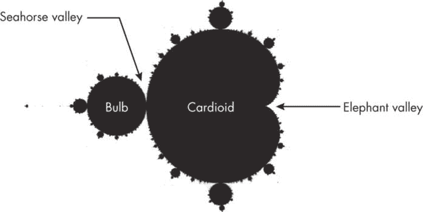

图 6-13：曼德博集合

M 集的中心部分是心形的，称为*心脏形*。心脏形左侧的圆形部分称为主*球体*。它是一个圆，中心位于（–1.0, 0.0），半径为 0.25。许多其他小球连接在主球体和心脏形的边界周围，这些小球看起来像是有天线或触手。当我们放大它们时，我们会看到复杂的图案，甚至更小的心脏形特征，带有自己的小球和触手。换句话说，M 集的一些特征会不断重复，无论尺度多小（尽管复制并不完全精确）——这是所有分形的标志性特征。

放大后可见的细致图案并非简单的几何形状；相反，它们在自然界中是精美而复杂的。图 6-14 显示了两个特定兴趣区域的放大图，分别是*海马谷*和*大象谷*，如图 6-13 中所标出。

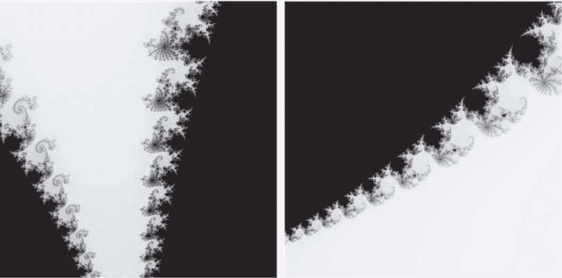

图 6-14：海马谷（左）和大象谷（右）

你可以通过改变搜索区域并在应用程序中使用适当的参数值来生成这两种图形，具体见表 6-7。

表 6-7：M 集某些区域的搜索区域和参数值

| 参数 | 海马谷 | 大象谷 |
| --- | --- | --- |
| xMin | -0.8 | 0.275 |
| xMax | -0.7 | 0.325 |
| yMin | -0.2 | -0.05 |
| yMax | -0.1 | 0.0 |
| canvasW | 600 | 600 |
| increment | 0.0001 | 0.00005 |
| iterMax | 200 | 200 |

通过使用这些参数，享受探索 M 集，或者自己设定参数值，看看还能发现什么其他特性。

### 摘要

在本章中，你使用 Kotlin 探索了分形的神秘之美。你学习了如何设计递归函数来帮助绘制简单的几何分形，并开发了一个 L 系统模拟器，通过一串指令和几个变换规则生成复杂的自相似模式。最后，你创建了一个用于可视化著名的曼德尔布罗特集的应用程序。

无论分形的数学性质如何，你现在已经掌握了在 Kotlin 和 JavaFX 中编写几行代码来渲染它的工具。不过，我们仅仅触及了分形几何的皮毛。尤其是，你还有很多关于 M 集的知识需要学习，这超出了本书的范围。如果本章激发了你对分形的兴趣，我鼓励你查看列出的资源进行进一步阅读。

### 资源

Devaney, Robert L. *混沌动力系统导论*。第三版。佛罗里达州博卡拉顿：CRC 出版社，2022 年。

Feldman, David P. *混沌与分形：基础入门*. 英国牛津：牛津大学出版社，2012 年。

Flake, Gary William. *自然的计算美学：计算机对分形、混沌、复杂系统与适应的探索*. 美国剑桥：MIT 出版社，2000 年。

Mandelbrot, Benoit B. *自然的分形几何学*。旧金山：W. H. Freeman & Co.，1982 年。

Ponce Campuzano, Juan Carlos. “曼德尔布罗特集。” *复变函数分析*。2019 年。访问日期：2024 年 6 月 15 日。*[`complex-analysis.com/content/mandelbrot_set.xhtml`](https://complex-analysis.com/content/mandelbrot_set.xhtml)*。

Prusinkiewicz, Przemyslaw 和 Aristid Lindenmayer. *植物的算法之美*. 电子版，2004 年。访问日期：2024 年 6 月 15 日。*[`algorithmicbotany.org/papers/abop/abop.pdf`](http://algorithmicbotany.org/papers/abop/abop.pdf)*。

Prusinkiewicz, Przemyslaw、Aristid Lindenmayer 和 F. David Fracchia. “在方格网格上合成空间填充曲线。” 收录于 *分形在基础与应用科学中的应用*，由 Heinz-Otto Peitgen, José Marques Henriques 和 Luís Filipe Penedo 主编，334–366 页。北荷兰：Elsevier，1991 年。

Weisstein, Eric W. “曼德尔布罗特集。” Wolfram MathWorld。访问日期：2024 年 6 月 15 日。*[`mathworld.wolfram.com/MandelbrotSet.xhtml`](https://mathworld.wolfram.com/MandelbrotSet.xhtml)*。
