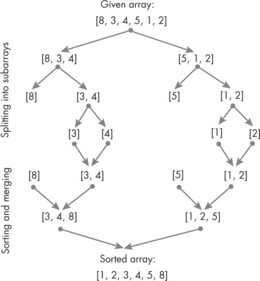
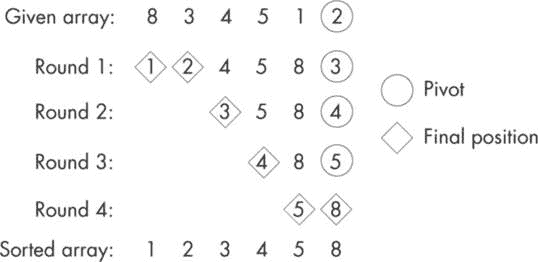
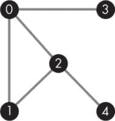
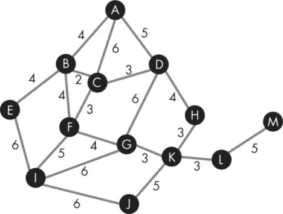

## 第七章：7 排序与搜索


每个严肃的开发者都需要掌握的基本技能之一就是如何高效地对给定的数据集进行排序和搜索。这项技能对于将原始数据转化为可操作的洞察非常宝贵，无论你是在处理简单的数组，还是在处理跨越数 TB、多字段信息的复杂数据结构，这些数据可能来自互联网的广阔天地。

排序和搜索是相辅相成的强大组合。*排序*将数据按特定顺序组织，从而使整个数据集能够进行有意义的分析。一旦数据被排序，就更容易识别模式、趋势和异常值。排序还提高了在数据集中*搜索*所需项的速度和便利性，尤其是在处理大量数据时。实际上，许多搜索算法，如二分搜索、插值搜索和基于树的搜索，都依赖于排序所实现的组织结构。搜索进一步补充了排序，通过启用有针对性的分析，使得快速定位数据集中的特定数据点或子集成为可能。排序和搜索共同简化了数据探索，优化了检索效率，并增强了决策过程的能力。

有多种排序和搜索算法可供选择。在本章的项目中，我们将专注于一组具有广泛应用的算法，特别是在需要处理大规模数据集的领域。通过掌握这些算法，你将更好地应对复杂的数据挑战，充分发挥排序和搜索的能力。

### 排序算法

排序算法允许我们将一组数据元素重新排列成特定的顺序，例如按数字、字母顺序或任何其他所需的标准进行排序。我们可以排序各种类型的数据，包括数字、字符串、记录（数据库中的数据行）以及复杂对象。排序是多种操作的基本构建块，如合并、连接和聚合数据集。它为高效的数据操作铺平道路，这在数据库管理、算法和编程等领域至关重要。通过组织数据结构，排序提供了一个有条理的框架，促进了清晰性、一致性和易用性。这种精简的方法提升了数据管理和维护，特别是在数据需要频繁更新或修改的场景中。

每种排序算法在时间复杂度、空间复杂度和稳定性方面都有各自的优缺点。在我们深入讨论具体算法之前，了解这些概念非常重要，因为它们将帮助我们为特定问题选择合适的算法。

*时间复杂度*是指根据输入大小*n*来估计算法的运行时间。它提供了算法性能如何随数据集增大而变化的洞察。常见的表示法如 *O*(1)、*O*(log *n*)、*O*(*n*)、*O*(*n* log *n*)、*O*(*n*²) 和 *O*(2*^n*) 表示时间复杂度不同的增长速度，按递增顺序排列。增长率越小，算法在排序数据集合时的速度越快。

*空间复杂度*则描述了算法在执行排序操作时所需的额外内存量，除了存储待排序数据的内存之外。有些算法可能只需最少的额外空间，数据元素的交换发生在*原地*。而另一些算法可能需要大量的辅助内存来有效地执行排序操作，这种方式也称为*非原地排序*，需要对原始数据集进行完整或部分复制来执行排序操作。空间复杂度越小，算法在内存需求方面就越高效（且更具可扩展性）。

*稳定性*是另一个重要的考虑因素。一个排序算法是稳定的，如果它能保持具有相同值的元素的相对顺序。在某些情况下，保持相同元素的初始顺序是必要的，这时稳定的算法就变得至关重要。

表 7-1 展示了我们将在本章讨论的选定排序算法的这些特性。

表 7-1：选定排序算法的主要特性

| 算法 | 时间复杂度 |  | 空间复杂度 | 稳定性 |
| --- | --- | --- | --- | --- |
| 最佳 | 平均 | 最坏 |  |
| --- | --- | --- | --- |
| 插入排序 | O(n) | O(n²) | O(n²) |  | O(1) | 稳定 |
| 归并排序 | O(n log n) | O(n log n) | O(n log n) |  | O(n) | 稳定 |
| 快速排序 | O(n log n) | O(n log n) | O(n²) |  | O(log n)* | 不稳定 |
| 堆排序 | O(n log n) | O(n log n) | O(n log n) |  | O(1) | 不稳定 |
| *最坏情况可以是 O(n)。 |

在表 7-1 列出的排序算法中，插入排序是最简单且最直观的，但在平均时间复杂度方面并不是最有效的。对于较大的数据集，它通常比其他算法慢。由于这一限制，插入排序通常不是作为独立的算法使用，而是作为混合排序方案的一部分，根据数据的特征结合多种方法。

合并排序和堆排序具有相似的时间复杂度，通常为*O*(*n* log *n*)。然而，堆排序在空间复杂度方面具有优势，因为它是一种就地排序算法，这意味着它除了输入数组外几乎不需要额外的内存。另一方面，合并排序需要与输入大小成比例的额外空间。如果稳定性是一个期望的属性，那么合并排序就比堆排序更受欢迎。它是一种稳定的排序算法，确保具有相同值的元素保持其原始顺序。

实际上，快速排序通常比其他排序算法表现更好，除非数据已经排序或接近排序。快速排序具有较低的空间复杂度，并且它的开销较小，或者说没有依赖于输入数据大小的隐藏操作。许多编程语言的库都提供了内置的快速排序函数，使其易于访问和广泛使用。

项目 27：使用插入排序实现空间高效排序

插入排序是一种简单直观的排序算法，它通过一次插入一个元素来构建一个已排序的数组。该算法在给定数组中保持一个已排序的子数组，并通过将未排序部分的元素插入已排序部分的正确位置来扩展它。开始时，数组的第一个元素被视为大小为 1 的已排序子数组。然后，算法逐个遍历剩余的元素，并将每个元素插入到已排序子数组中的适当位置。

要插入一个元素，算法将其与已排序子数组中的元素从右到左进行比较。它将任何较大的元素右移一个位置，直到找到当前元素的正确位置。一旦找到正确位置，元素就被插入到该位置。这个过程持续进行，直到数组中的所有元素都被处理，从而得到一个完全排序的数组。

假设我们有一个未排序的数组[8, 3, 4, 5, 1, 2]。下面是插入排序算法如何处理它的步骤：

1.  假设给定的数组由两个子数组组成——一个已排序的数组，最初只包含第一个元素（8），另一个未排序的数组由剩余元素构成。

2.  将数组的第二个元素（索引 1）与其前一个元素（索引 0）进行比较，如下所示：

a.  将 3 与 8 进行比较。由于 3 较小，交换元素。

b.  第一次遍历后的数组是[3, 8, 4, 5, 1, 2]。

3.  移动到下一个元素（索引 2），并将其与前一个元素进行比较。

a.  将 4 与 8 进行比较。由于 4 较小，交换元素。

b.  将 4 与 3 进行比较。由于 4 较大，停止比较。

c.  第二次遍历后的数组是[3, 4, 8, 5, 1, 2]。

4.  对数组中的剩余元素重复此过程。最后，数组将按升序排序：[1, 2, 3, 4, 5, 8]。

如表 7-1 所示，插入排序的平均和最坏情况时间复杂度为 *O*(*n*²)，其中 *n* 是数组中元素的个数。然而，它在处理小型列表或几乎已排序的列表时表现良好。它是一种就地排序算法，对于所有情况，空间复杂度为 *O*(1)，这意味着它在执行排序时不需要额外的内存。

#### 代码

在 Kotlin 中实现插入排序算法只需要几行代码。我们将创建一个名为 `insertionSort()` 的专用函数来处理排序数组所需的所有步骤，并从 `main()` 函数中调用此函数来完成任务。

```
fun main() {
    // Define an array to be sorted.
    val arr = intArrayOf(8, 3, 4, 5, 1, 2)

    println("\n*** Sorting an Array Using Insertion Sort ***\n")
    println("original array:\n${arr.contentToString()}")
    // Call the insertion sort function.
    insertionSort(arr)
    println("sorted array:\n${arr.contentToString()}")
}

fun insertionSort(A: IntArray) {
    // Sorting happens in place.
  ❶ for (i in 1 until A.size) {
        val key = A[i]
        var j = i
      ❷ while(j > 0 && A[j-1] > key) {
            A[j] = A[j-1]
            j -= 1
        }
      ❸ A[j] = key
    }
}
```

这段代码实现了插入排序算法，用于按升序对一个数字数组（在此例中为整数）进行排序。我们创建了一个名为 `arr` 的数组，存储初始的未排序数组元素。该数组的内容将打印到控制台，使我们可以看到数字的原始顺序。然后，我们调用 `insertionSort()` 函数来执行排序操作。它接受数组作为输入并就地修改它，因此您无需将排序后的数组返回给调用函数。

在 `insertionSort()` 函数中，我们通过使用 `for` 循环 ❶ 遍历数组的未排序部分，从第二个元素（索引为 1）开始，一直到最后一个元素。对于每个元素，我们将其值临时存储在一个名为 `key` 的变量中。接下来，我们使用 `while` 循环 ❷ 从右到左遍历数组的已排序部分，将 `key` 与每个元素进行比较。只要满足两个条件，`while` 循环将继续：左边还有更多元素（使用 `j > 0` 检查），并且当前元素大于 `key`（使用 `A[j-1] > key` 检查）。在 `while` 循环内，如果某个元素大于 `key`，它将向右移动一个位置。这样就为 `key` 的插入腾出了空间，使其能够插入到正确的排序位置。

当 `while` 循环结束时，我们将 `key` 的值赋给数组中的当前位置 ❸，有效地将元素插入到数组已排序部分的正确位置。然后 `for` 循环移到下一个元素，并且这个过程会对数组中的所有元素重复进行。一旦排序完成，代码将排序后的数组打印到控制台，按升序显示数字。

#### 结果

如果在不更改给定的未排序数组的情况下运行代码，输出应如下所示：

```
*** Sorting an Array Using Insertion Sort ***

original array:
[8, 3, 4, 5, 1, 2]
sorted array:
[1, 2, 3, 4, 5, 8]
```

这段代码可以很容易地调整以对浮点数进行排序，只需将数组改为 `Float` 或 `Double` 数据类型。我鼓励你修改代码以接受用户输入，选择首选的排序顺序——升序或降序。之后，您可以根据用户的选择实现适当的函数。或者，您可以使用相同的函数，并结合两个子函数来实现，通过 `when(choice)` 来判断一个用于升序排序数组，另一个用于降序排序。

项目 28：使用归并排序提高排序速度

*归并排序*是一种流行的排序算法，它采用分治法。它通过递归地将一个数组划分为更小的子数组，直到每个子数组只包含一个元素。然后，这些子数组会被合并成更长的数组，在合并过程中将元素按正确的顺序放置，最终生成一个完全排序的数组。图 7-1 展示了我们在项目 27 中使用的同一个[8, 3, 4, 5, 1, 2]数组的过程。



图 7-1：可视化归并排序算法

请注意，给定的数组最初被划分为两个子数组，然后每个子数组会进一步被划分成两个子数组，以此类推。接着，子数组会被排序并合并。当我们通过递归函数实现该算法时，我们会首先完全处理第一对子数组中的左子数组——例如[8, 3, 4]——然后再处理右子数组[5, 1, 2]。在每个分支内，我们会将子数组划分成单个元素，然后重新组合排序后的子数组。最终，最后一对已排序的左、右子数组将被合并，生成最终的排序数组。

归并排序在所有情况下都能保证一致的时间复杂度 *O*(*n* log *n*)，使其在处理大数据集时非常高效。它还是一个稳定的排序算法，能够保持相等元素的相对顺序。然而，它在合并步骤中需要额外的空间，因此其空间复杂度为 *O*(*n*)。尽管如此，归并排序的高效性和稳定性使它在各种应用中成为排序的热门选择。

#### 代码

我们将采用类似于插入排序代码结构的方式来编写归并排序代码：通过传递一个数组到 mergeSort()函数来启动排序过程的 main()函数。然而，这一次，mergeSort()将递归调用自身，直到达到停止条件（每个子数组只包含一个元素）。为了将所有内容重新组合起来，我们将使用一个名为 merge()的辅助函数，该函数负责排序和合并子数组。

```
fun main() {
    val arr = intArrayOf(8, 3, 4, 5, 1, 2)

    println("\n*** Sorting an Array Using Merge Sort ***\n")
    println("original array:\n${arr.contentToString()}")
    // Call the recursive function.
  ❶ mergeSort(arr)
    println("\nsorted array:\n${arr.contentToString()}")
}

fun mergeSort(arr: IntArray) {
    val length = arr.size
    if (length < 2) return // done splitting subarrays

  ❷ val middle = length / 2
    val leftArray = arr.copyOfRange(0, middle)
    val rightArray = arr.copyOfRange(middle, length)

  ❸ mergeSort(leftArray)
    mergeSort(rightArray)
    merge(leftArray, rightArray, arr)
}

fun merge(leftArray: IntArray, rightArray: IntArray,
          arr: IntArray) {

    val leftSize = leftArray.size
    val rightSize = rightArray.size
    var i = 0   // for original array
    var l = 0   // for left array
    var r = 0   // for right array

    // Compare, sort, and merge.
  ❹ while(l < leftSize && r < rightSize) {
        if (leftArray[l] < rightArray[r]) {
            arr[i] = leftArray[l]
            l++
        } else {
            arr[i] = rightArray[r]
            r++
        }
      ❺ i++
    }

    // If all elements of a subarray are assigned, assign the
    // remaining elements of the nonempty array to "arr".
    while (l < leftSize) {
        arr[i] = leftArray[l]
        l++
        i++
    }

    while (r < rightSize) {
        arr[i] = rightArray[r]
        r++
 i++
    }
}
```

在 main()函数中，我们首先初始化一个名为 arr 的数组，包含一组整数值。在继续操作之前，我们还会打印出给定的数组，这样在生成排序后的数组时，便于我们进行对比。然后，我们调用 mergeSort()函数 ❶，该函数负责执行排序过程。这个函数将数组 arr 作为参数。

在 mergeSort() 中，我们首先检查传入数组的长度。如果长度小于 2，则子数组的长度为 1，函数直接返回，分割过程停止。这是任何递归函数所需的至关重要的停止条件。接下来，我们计算数组的中间索引 ❷，并创建两个子数组：leftArray 和 rightArray。前者包含从索引 0 到但不包括中间的元素，后者包含从中间到数组末尾的元素。为了继续这个过程，mergeSort() 函数会递归地调用自身处理 leftArray 和 rightArray ❸。如前所述，这个递归步骤会继续进行，直到达到基本情况——即子数组的长度变为 1。最后，我们调用 merge() 将 leftArray 和 rightArray 重新组合成一个排序后的数组。

merge() 函数接受三个参数：leftArray、rightArray 和 arr，分别表示要合并的两个子数组和在合并过程中会被修改的原始数组。我们通过初始化变量来跟踪数组中的索引；i 用于遍历原始 arr，l 用于 leftArray，r 用于 rightArray。实际的合并和排序发生在一个 while 循环 ❹ 中，只要 leftArray 和 rightArray 中仍然有元素可以比较，循环就会继续。在每次迭代中，函数会比较 leftArray 和 rightArray 中索引 l 和 r 处的值。如果 leftArray 中的值更小，则将其赋值给 arr 中的索引 i，并且 l 索引递增。相反，如果 rightArray 中的值更小，则将其赋值给 arr 中的索引 i，并且 r 索引递增。每次赋值后，i 索引也会递增 ❺。

当左数组（leftArray）或右数组（rightArray）被完全处理时，while 循环结束。然后，将非空数组中的剩余元素分配到 arr 中，完成合并过程。我们为此任务使用了两个独立的 while 循环——一个用于 leftArray，另一个用于 rightArray。只有其中一个循环会真正执行。

#### 结果

当你运行给定输入数组的归并排序代码时，它应该输出以下结果：

```
*** Sorting an Array Using Merge Sort ***

original array:
[8, 3, 4, 5, 1, 2]

sorted array:
[1, 2, 3, 4, 5, 8]
```

我鼓励你重复你在插入排序时做的练习，让用户选择排序的顺序（升序或降序），然后修改代码以相应地排序。我还建议你考虑包含正数和负数的数组。你可能很快会意识到，通过在排序前后有选择性地将整个数组乘以 -1，你可以使用相同的代码对数组进行升序或降序排序，而无需编写两个独立的函数！

项目 29：使用快速排序进行高效排序

*快速排序*是一种著名且高效的原地排序算法，广泛应用于各种现实世界的应用中。它涉及从数组中选择一个基准元素，并将剩余的元素划分为两个子数组，一个包含小于基准元素的值，另一个包含大于基准元素的值。这个机制将基准元素本身放置在最终排序数组的正确位置，而剩余的元素则落在基准元素的相应一侧。该过程会递归地应用于子数组，选择新的基准元素并进一步划分数组，直到所有元素排序完毕。

这里是快速排序如何工作的逐步示例，使用数组[8, 3, 4, 5, 1, 2]：

1.  选择一个基准元素，可以是数组中的任何元素。在这个例子中，我们选择最后一个元素，2。

2.  将数组划分为两个子数组，左子数组包含小于基准元素的元素，右子数组包含大于基准元素的元素。在这个例子中，左子数组变为[1]，右子数组变为[4, 5, 8, 3]。我将在项目后续部分解释这个顺序的来源。

3.  递归地对子数组应用快速排序。对于左子数组，不需要进一步操作：它只有一个元素，因此已经处于最终位置。对于右子数组，我们现在选择 3 作为基准元素。这将产生一个空的左子数组，因为 3 是最小的数字。右子数组现在为[5, 8, 4]。

4.  重复第 3 步，直到所有子数组都已排序，即每个子数组只有一个元素或为空。

5.  将已排序的子数组合并，得到最终的排序数组：[1, 2, 3, 4, 5, 8]。

在这个例子中，我们总是选择数组或子数组的最后一个元素作为基准元素。另一种选择是选择第一个元素作为基准元素。对于广泛的输入，选择第一个或最后一个元素作为基准通常表现良好，尤其是在输入数据是随机分布或均匀分布的情况下。然而，如果数组已经排序好或几乎排序好，基于第一个或最后一个元素的选择将导致最坏情况的时间复杂度为*O*(*n*²)。为了避免这种情况，你可以使用以下替代技术来选择基准元素：

**选择一个随机元素**

随机选择基准元素有助于减少选择第一个或最后一个元素时的低效，尤其是当数组已经大部分排序时。这种方法可以提供良好的平均情况性能，因为基准元素的位置较难预测。它减少了遇到最坏情况的可能性，从而提高了整体效率。

**选择三数中的中值**

该策略通过使用数组中第一个、中央和最后一个元素的中位数作为枢轴。这种方法通过选择一个更接近数据集真正中位数的值来平衡枢轴选择。它有助于提高算法在各种输入上的性能，减少最坏情况的发生概率。

与其他排序算法相比，快速排序对于大数据集具有很高的效率，其平均时间复杂度和最坏情况下的时间复杂度分别为 *O*(*n* log *n*) 和 *O*(*n*²)。快速排序的平均空间复杂度为 *O*(log *n*)，但当输入数组已经排序或接近排序，并且选择第一个或最后一个元素作为枢轴时（最坏情况），空间复杂度可能退化为 *O*(*n*)。

#### 代码

快速排序的代码在结构上与归并排序非常相似，因为这两种算法都依赖于分治法。在代码中，main() 函数接受一个输入数组，并将其传递给 quickSort() 函数。在 quickSort() 中，我们调用 partition() 辅助函数来确定枢轴元素的正确位置。这使我们能够将原始数组分成一个包含小于枢轴的元素的左数组和一个包含大于或等于枢轴的元素的右数组。最后，只要 start 小于 end，即子数组中至少还有两个元素，quickSort() 就会递归调用这些子数组。

```
fun main() {
    val arr = intArrayOf(8, 3, 4, 5, 1, 2)

    println("\n*** Sorting an Array Using Quick Sort ***\n")
    println("original array:\n${arr.contentToString()}")
    // Call the recursive function.
  ❶ quickSort(arr, start = 0, end = arr.size -1)
    println("\nsorted array:\n${arr.contentToString()}")
}

fun quickSort(arr: IntArray, start: Int, end: Int) {
    // Check that the termination condition for recursion
    // base case is when start = end.
  ❷ if (start < end) {
 val pivotIndex = partition(arr, start, end)
        quickSort(arr = arr, start = start, end = pivotIndex - 1)
        quickSort(arr = arr, start = pivotIndex + 1, end = end)
    }
}

fun partition(arr: IntArray, start: Int, end: Int): Int {
    val pivot = arr[end]
    var i = start

    for (j in start until end) {
      ❸ if (arr[j] < pivot) {
            swap(arr, i, j)
            i++
        }
    }
  ❹ swap(arr, i, end)
    return i
}

fun swap(arr: IntArray, i: Int, j: Int) {
    val temp = arr[i]
    arr[i] = arr[j]
    arr[j] = temp
}
```

在 main() 函数中，我们通过传递三个参数值调用 quickSort() 函数：要排序的数组 (arr) 以及其第一个和最后一个元素的索引 (start 和 end) ❶。如前所述，我们在排序前后打印数组。

在 quickSort() 函数中，我们首先检查传入子数组的起始索引是否小于结束索引 ❷。当这不再成立时，子数组将只包含一个元素，因此该分支的递归将停止。否则，我们调用 partition() 辅助函数，它返回枢轴元素的最终（已排序）位置。我们将这个位置存储为 pivotIndex，并利用它将原始数组分成左子数组和右子数组。然后，我们递归地调用 quicksort() 对左子数组和右子数组进行排序，直到满足停止条件。

实际的排序工作发生在`partition()`函数内部。在将枢轴设置为子数组中最后一个元素的值后，我们使用两个索引变量 i 和 j，在 for 循环内交换元素的位置。i 和 j 都从子数组的开头开始，然后 j 遍历子数组，寻找小于枢轴值的元素❸。每次找到一个这样的元素，就交换 i 和 j 的位置，然后 i 自增。这样，所有小于枢轴的元素都会移动到数组的前面，而大于枢轴的元素则移到数组的后面。一旦 for 循环完成，枢轴本身与位置为 i 的元素交换❹，将枢轴元素放到最终的排序位置。然后返回 i 的最终值，以便在最后一个枢轴元素的位置两侧形成两个新的子数组。交换操作本身被交给一个`swap()`辅助函数，该函数使用 temp 变量避免覆盖 i 位置的值。除了这个额外的变量，排序是在原地进行的。

#### 结果

如果你运行代码并使用示例数组，输出应该如下所示：

```
*** Sorting an Array Using Quick Sort ***

original array:
[8, 3, 4, 5, 1, 2]

sorted array:
[1, 2, 3, 4, 5, 8]
```

我之前提到过，我会解释子数组元素顺序是如何确定的。这与`partition()`函数中的交换算法有关。以处理[8, 3, 4, 5, 1, 2]数组的第一次为例，2 是枢轴元素，而数组中小于枢轴的第一个元素是 1。这个元素与数组开头的 8 交换（使用索引变量 i 访问），得到数组[1, 3, 4, 5, 8, 2]。然后，枢轴元素本身（2）与数组中的下一个元素（3——同样通过 i 访问）交换，得到[1, 2, 4, 5, 8, 3]。

我鼓励你手动执行整个快速排序的过程。你可以参考图 7-2，其中展示了原始输入数组、每一轮处理后的中间子数组和最终排序后的数组。通过亲自进行比较和交换，你可以以更直观的方式可视化分区和排序过程。



图 7-2：快速排序步骤，针对[8, 3, 4, 5, 1, 2]

你还可以通过在 quicksort()函数内部打印左右数组，在确定枢轴位置之后，自动生成每个阶段的子数组。

### 搜索算法

在计算机科学中，搜索数据结构是一项基本操作。它帮助我们追踪特定元素或从数据集合中检索信息。虽然对于少量数据来说这项任务看似微不足道，但随着数据量的增加——直到庞大的数据库、文件系统，甚至整个互联网——知道如何选择合适的搜索算法变得至关重要，这样才能保持我们的数字生活顺畅运行。

搜索算法与它们所设计的搜索数据结构密切相关，因为数据的组织方式会影响找到并访问特定项的效率。为了即将开展的项目，我们将重点讨论几种用于搜索图的算法，图是一种数据结构。然而，在讨论这些算法之前，了解图的结构是非常重要的。

#### 什么是图？

在图论领域，图是一种数学结构，由一组顶点（也称为*节点*）和一组连接顶点对的边（也称为*弧*或*链接*）组成。顶点可以代表任何类型的对象，例如城市、人物，甚至更抽象的概念。边表示顶点之间的关系或连接。从数学角度看，图用*G*表示，定义为*G* = (***V***, ***E***)，其中***V***是顶点或节点的集合，***E***是边或链接的集合。

图 7-3 展示了一个由五个节点和五条边组成的简单图。图中的每个圆圈代表一个顶点，每条线代表一条边。为了方便起见，节点用顺序编号命名。然而，在实际应用中，大多数节点会用字符串命名。当节点名称由整数表示时，我们可以在代码中将它们视为 Int 类型或 String 类型。



图 7-3：一个包含五个节点和五条边的简单图

图可以分为两大类：无向图和有向图。在*无向图*中，边允许在顶点之间双向移动。这种类型的图常用于表示像道路网络这样的场景，在这种网络中，交通可以双向流动。相反，*有向图*中的每条边都有一个特定的方向，限制了在顶点之间移动的方式。例如，有向图可以表示水力或电力分配网络，其中流动总是从高压区流向低压区，或从高电压流向低电压。

当图的边带有权重时，这种图被称为*加权图*。在这种情况下，权重可以作为成本、距离或其他与边相关的属性的代理。加权图可以是有向的，也可以是无向的。

#### 如何搜索图

在接下来的项目中，我们将考虑三种不同的图搜索算法。首先是 *深度优先搜索（DFS）*，这是一种从特定节点开始，在一条分支上尽可能深入探索（或“深度”）后，再回溯并探索下一条分支的技术。这样，它在探索数据结构的广度之前，先遍历数据结构的深度。DFS 通常通过使用 *栈* 数据结构来实现（在我们开发 L-system 模拟器时，我们在第六章中探索了栈）。通过这种方式，DFS 可以使用栈中最新的节点来延伸分支，并在回溯并转向下一个分支之前，探索分支末端的每个相邻节点。DFS 在许多应用中都很有用，包括调度问题、图中检测循环，以及解决只有一个解的谜题，如迷宫或数独。

下一个算法是 *广度优先搜索（BFS）*，它采取与 DFS 相反的方法，逐层探索数据结构。它从给定的节点开始，访问所有直接邻居。然后，它继续到下一级，访问所有邻居的邻居，依此类推。通过这种方式，BFS 优先探索整个数据结构的广度，而非任何单一分支的深度。正如我们在第 31 项目中将讨论的那样，BFS 通常使用队列数据结构，使其能够按顺序访问每一层。它对于寻找最短路径、网页爬取、分析社交网络以及在图中以最少的迭代次数探索所有可达节点非常有用。

DFS 和 BFS 的选择取决于特定问题和正在搜索的数据结构的特点。DFS 通常在我们希望进行深入探索并可能更快地找到目标项时使用，而 BFS 则适用于我们希望访问距离起始点一定范围内的所有节点或寻找节点之间的最短路径的情况。

我们将探索的最后一个算法是 *A* 搜索*（发音为“A-star search”）。它通过将启发式决策与实时探索相结合，擅长在图或迷宫中找到最短路径。*启发式* 一词指的是依赖于直觉、教育性猜测或常识来得出合理解答或探索方向的一般决策策略。虽然启发式方法无法保证最优或完美的结果，但它们通常能在信息、时间或资源受限的情况下提供优势。

A* 算法的启发式是考虑到到达特定节点的成本以及估算到达目标所需的剩余努力。通过这种方式，A* 能够智能地优先考虑最有前景的路径。这种策略性方法，类似于在迷宫中使用 GPS，能够帮助节省搜索过程中的时间和精力。由于其多功能性，A* 被广泛应用于视频游戏、机器人学、导航系统和各种优化问题等领域。

项目 30：基于栈的深度优先搜索

在本项目中，我们将探索深度优先搜索的核心步骤并在 Kotlin 中实现它们。我们将在代码中使用栈数据结构，尽管值得注意的是，存在其他可行的方法来实现核心的 DFS 算法。稍后，我会分享一些关于替代方法的提示。

对于给定的图（一个由节点和边组成的网络），以下是通过栈执行深度优先搜索（DFS）的步骤：

1.  首先选择一个节点作为起始节点（它可以是任何节点）。

2.  将起始节点压入栈中。

3.  当栈不为空时，从栈中弹出一个节点。

4.  如果弹出的节点尚未访问，标记为已访问并将其邻居节点压入栈中；否则，从栈中弹出下一个节点。

5.  重复执行步骤 3 和步骤 4，直到栈为空。

回想一下在第六章中提到的，栈遵循后进先出（LIFO）原则，即按照元素被加入栈的相反顺序将其移除。LIFO 原则使得 DFS 算法能够在开始新的未访问的分支之前，从一条分支的末端回溯。这确保了对整个图的穷举搜索，尽管加入停止条件也会有所帮助。当访问到每个节点时，该条件会检查搜索是否已经达到了预期目标，比如找到特定对象或完成特定任务。一旦达成目标，搜索可以提前终止。对于这个项目，我们将使用图 7-3 中展示的图。

深度优先搜索（DFS）算法的时间复杂度是 *O*(*V* + *E*)，其中 *V* 是图中顶点的数量，*E* 是图中边的数量。DFS 的空间复杂度取决于实现方式（使用栈与递归函数的区别）；最坏情况下的空间复杂度是 *O*(*V*)。

#### 代码

现在让我们来查看实现 DFS 核心步骤的代码。我们将使用该代码来遍历之前在图 7-3 中展示的整个示例图。

```
import java.util.ArrayDeque

fun main() {
  ❶ val graph = mapOf(
        "0" to setOf("1", "2", "3"),
        "1" to setOf("0", "2"),
        "2" to setOf("0", "1", "4"),
        "3" to setOf("0"),
        "4" to setOf("2")
    )
    println("\n*** Depth-First Search of a Graph ***\n")
    println("Graph to search:")
    for ((key,value) in graph)
        println("Node: $key,  Neighbors: $value")

  ❷ val visited = dfsStack(graph, "0")
    println("\nVisited nodes:\n$visited")
}

fun dfsStack(graph: Map<String, Set<String>>, start: String):
             Set<String> {

    val visited = mutableSetOf<String>()
    val stack = ArrayDeque<String>()
    stack.push(start)

  ❸ while (stack.isNotEmpty()) {
        val node = stack.pop()
 if (node !in visited) {
            // Do something as needed.
            visited.add(node)
          ❹ for (next in graph[node]!!) {
                 stack.push(next)
            }
        }
    }
    return visited
}
```

首先，我们从`java.util`导入`ArrayDeque`类，我们将用它来实现栈。接下来，我们声明`main()`函数，它作为程序的入口点。它将图定义为一个映射，将每个节点（从"0"到"4"）与它的所有邻居节点的集合配对❶。例如，节点"2"与集合["0", "1", "4"]配对，因为它与这些节点相连。我们将图打印到控制台，然后调用`dfsStack()`函数执行搜索，传递图和起始节点作为参数❷。搜索完成后，返回访问过的节点列表，并将其打印为程序的最终输出。

在`dfsStack()`函数内部，我们创建一个可变集合`visited`来跟踪访问过的节点，并创建一个名为`stack`的`ArrayDeque`来存储遍历过程中的节点。我们将起始节点推入栈中，然后进入一个`while`循环，只要栈不为空，就会一直执行❸。在每次迭代中，我们通过使用`pop()`方法从栈中移除最后一个节点，并将其赋值给变量`node`。如果该节点之前未被访问过，我们可以在此时执行额外的操作或特定的处理——例如，检查节点是否符合我们的搜索标准，如果符合则跳出循环。然后，通过`add()`方法将该节点添加到`visited`集合中。

接下来，我们通过使用节点作为键从图中检索所有邻居节点，并通过`push()`方法将它们添加到栈中❹。在将`graph[node]`添加到栈时，我们使用非空断言操作符`!!`，以避免对无向图不必要的空安全检查（每个节点至少会有一个链接或边）。当栈为空时，`while`循环终止，此时访问过的节点集合会返回到`main()`函数。

请注意，我们本可以使用`kotlin.collections`中的`ArrayDeque`类（如我们在第六章中所做的）来实现栈。在这种情况下，我们会将`push()`替换为`addLast()`，将`pop()`替换为`removeLast()`方法。我选择使用 Java 版本，部分是为了展示另一种栈实现方法，部分是因为`ArrayDeque`中的方法名（如`push()`和`pop()`）更自然地契合栈结构。两种方法都遵循 LIFO 原则，即最后添加到栈中的元素是第一个被移除的。

#### 结果

如果你运行给定图的代码，你应该会得到以下输出：

```
*** Depth-First Search of a Graph ***

Graph to search:
Node: 0,  Neighbors: [1, 2, 3]
Node: 1,  Neighbors: [0, 2]
Node: 2,  Neighbors: [0, 1, 4]
Node: 3,  Neighbors: [0]
Node: 4,  Neighbors: [2]

Visited nodes:
[0, 3, 2, 4, 1]
```

访问过的节点列表[0, 3, 2, 4, 1]表示算法已经遍历了整个图。为了理解这个顺序的来源，并更好地理解栈如何促进 DFS 过程，参考表 7-2，它展示了算法每一步的中间值。

表 7-2：使用栈的深度优先搜索解析

| 阶段 | 节点 | 节点未访问？ | 已访问节点 | 邻居节点 | 栈中的节点 |
| --- | --- | --- | --- | --- | --- |
| 初始化，起始为 0 | N/A | N/A | []（空） | N/A | [0]（起始节点已压入栈） |
| 在 while 循环内部 | 03024212001 | truetruefalsetruetruefalsetruefalsefalsefalsefalse | [0][0, 3]无变化[0, 3, 2][0, 3, 2, 4]无变化[0, 3, 2, 4, 1]无变化无变化无变化无变化 | [1, 2, 3][0]无[N/A][0, 1, 4][2]无[0, 2]无无无无 | [1, 2, 3][1, 2, 0][1, 2][1, 0, 1, 4][1, 0, 1, 2][1, 0, 1][1, 0, 0, 2][1, 0, 0][1, 0][1][]（空；while 循环终止） |

让我们看一下表格 7-2 中的几行，以了解深度优先搜索（DFS）是如何工作的。在第一行，我们看到初始化阶段发生了什么，在进入 while 循环之前。我们将起始节点设置为"0"，并将其压入栈中。在此阶段，节点"0"还没有被标记为已访问。接下来，我们进入 while 循环，剩余的处理就在这里进行。首先，我们从栈中弹出最后一个节点，即"0"（这使得栈暂时为空）。由于此节点尚未标记为已访问，我们将其添加到已访问节点列表中，从[]变为[0]。然后，我们将该节点的所有邻居（通过 graph["0"]访问）添加到栈中，栈从[]变为[1, 2, 3]。

下一次循环时，"3"从栈中弹出，因为它是最后一个元素。它还没有被访问，所以它被添加到 visited 中，并且它唯一的邻居"0"被推入栈中。这个过程会持续，直到栈在 while 循环迭代开始时为空。我强烈建议你查看表格中的其余行，亲自体验 DFS 算法在实践中的运作。

项目 31：基于队列的广度优先搜索

在这个项目中，我们将继续探索搜索算法，通过实现广度优先搜索（BFS）。BFS 确保所有处于同一层次的节点在进入下一层之前都被访问。这个过程会持续，直到图中的所有节点都被访问过。与项目 30 一样，我们将使用 java.util 中的 ArrayDeque 类来实现 BFS 算法。然而，这次我们将使用该类作为*队列*，一种遵循*先进先出（FIFO）*原则的数据结构。与始终从栈的末端添加（“推入”）或移除（“弹出”）项不同，项被添加（“入队”）到队列的末端，并从队列的开始处移除（“出队”）。这确保了项按照其添加到队列中的顺序进行处理。

执行广度优先搜索（BFS），我们将遵循以下步骤：

1.  选择一个节点作为起始节点（可以是任何节点）。

2.  创建一个可变列表，名为 visited，并将起始节点添加到其中。

3.  创建一个空队列并将起始节点入队（添加）。

4.  当队列不为空时，执行以下步骤：

a.  从队列中出队最前面的节点。

b.  根据需要处理出队的节点（可能打印其值或执行某些操作）。

c.  将所有未访问的邻接节点加入队列，并将其标记为已访问。

我们将使用 图 7-3 中显示的图形作为本项目的图。

BFS 算法的时间复杂度是 *O*(*V* + *E*)，其中 *V* 是图中顶点的数量，*E* 是边的数量。BFS 算法的空间复杂度通常是 *O*(*V*)。因此，DFS 和 BFS 的时间复杂度相同，但它们的空间复杂度可能因实现方式和图的结构而有所不同。

#### 代码

BFS 的代码与 DFS 的代码非常相似，但在讨论程序时，我会突出几个重要的区别。

```
import java.util.ArrayDeque

fun main() {
    // Define the graph to be searched.
    val graph = mapOf(
        "0" to setOf("1", "2", "3"),
        "1" to setOf("0", "2"),
        "2" to setOf("0", "1", "4"),
        "3" to setOf("0"),
        "4" to setOf("2")
    )
    println("\n*** Breadth-First Search of a Graph ***\n")
    println("Graph to search:")
    for ((key,value) in graph)
        println("Node: $key,  Neighbors: $value")

  ❶ val visited = bfsQueue(graph, "0")
    println("\nVisited nodes:\n$visited")
}

fun bfsQueue(graph: Map<String, Set<String>>, start: String): Set<String> {
    val visited = mutableSetOf<String>()
 visited.add(start)
    val queue = ArrayDeque<String>()
    queue.offer(start)

  ❷ while (queue.isNotEmpty()) {
        val node = queue.poll()
        for (next in graph[node]!!) {
          ❸ if (next !in visited) {
                queue.offer(next)
                visited.add(next)
            }
        }
    }
    return visited
}
```

main() 函数与之前项目中的基本相同。我们使用映射数据结构定义输入图，并打印图，显示每个节点及其邻接节点。然后，我们调用 bfsQueue() 搜索函数，传递图和起始节点作为参数 ❶。该函数返回已访问的节点，并将其打印为程序的最终输出。

在 bfsQueue() 函数内部，我们初始化了一个可变列表，称为 visited，用来跟踪已访问的节点，和一个叫做 queue 的 ArrayDeque 来存储待访问的节点。然后，我们将起始节点同时添加到 visited 集合和队列中，后者使用 offer() 方法。接下来，我们启动一个 while 循环，直到队列为空为止 ❷。在循环内，我们通过 poll() 方法从队列的前端出队一个节点，并将其存放在 node 变量中。然后，我们遍历当前节点的每个邻接节点，这些邻接节点是从图中获得的。如果一个邻接节点未被访问（意味着它不在 visited 集合中），则使用 offer() 方法将其入队并添加到 visited 集合中 ❸。处理完所有邻接节点后，循环继续，直到队列为空。然后返回 visited 集合，包含了搜索过程中访问的所有节点。

#### 结果

对于给定的图，如果你运行没有任何更改的代码，代码将产生以下输出：

```
*** Breadth-First Search of a Graph ***

Graph to search:
Node: 0,  Neighbors: [1, 2, 3]
Node: 1,  Neighbors: [0, 2]
Node: 2,  Neighbors: [0, 1, 4]
Node: 3,  Neighbors: [0]
Node: 4,  Neighbors: [2]

Visited nodes:
[0, 1, 2, 3, 4]
```

再次，访问过的节点列表 [0, 1, 2, 3, 4] 表明算法已成功遍历整个图。这次，节点按数字顺序标记为已访问，这是队列的 FIFO 原则的体现。表 7-3 显示了关键变量的中间值，展示了过程的展开以及 BFS 算法的工作原理。

表 7-3：使用队列的广度优先搜索解剖

| 阶段 | 节点 | 邻接节点 | 下一个节点 | 节点未访问? | 队列中的节点 | 已访问节点 |
| --- | --- | --- | --- | --- | --- | --- |
| 初始化，起始为 0 | 不适用 | 不适用 | 不适用 | 不适用 | [0] | [0] |
| 在 while 循环中 | 0 | [1, 2, 3] | 123 | truetruetrue | [1][1, 2][1, 2, 3] | [0, 1][0, 1, 2][0, 1, 2, 3] |
| 1 | [0, 2] | 02 | falsefalse | [2, 3][2, 3] | 无变化无变化 |
| 2 | [0, 1, 4] | 014 | falsefalsetrue | [3][3][3, 4] | no changeno change[0, 1, 2, 3, 4] |
| 3 | [0] | 0 | false | [4] | no change |
| 4 | [2] | 2 | false | []（空；while 循环终止） | no change |

让我们查看一下表 7-3 中的几行，以便更好地理解 BFS 算法的实现。在初始化阶段，我们将节点"0"标识为起始节点，并将其添加到访问列表和队列中。此时，这两个列表中都包含"0"（请参见第一行）。

接下来，我们进入 while 循环，只要队列不为空，循环就会继续进行。我们从前端节点"0"开始，并获取其邻居节点"1"、"2"和"3"。对于每个节点，我们检查它是否以前未被访问过；当这个条件成立时，我们将该节点添加到队列和访问列表中。由于这些节点都未被访问过，它们在完成节点"0"的处理后都会被添加到队列和访问列表中。

该过程继续，通过提取下一个前端节点"1"来进行。这一次，它的两个邻居"0"和"2"出现在访问列表中，因此队列和访问列表都没有添加任何内容。每次从队列中移除一个节点时，队列的大小都会减少。在最后一步，节点"4"被提取出来，使队列为空，这打破了 while 循环。代码返回访问列表作为最终输出。

比较表 7-2 和 7-3 将帮助你更深入地理解 DFS 和 BFS 算法的独特特点。

项目 32：使用 A*的启发式搜索

在这个项目中，我们将探索 A*搜索算法，这是一种使用启发式函数来引导搜索的有信息搜索算法。它的主要目标是通过考虑每条路径的代价，找到图中两个节点之间的最优路径。为了实现这一目标，它最适合用于加权图，其中每条边都有一个关联的得分。图 7-4 展示了我们将用于本项目的图。



图 7-4：用于项目 32 的示例图（起始节点 = A，目标节点 = J）

图中的图形有 13 个节点（从 A 到 M）和 20 条边，使得它比我们在前几个项目中使用的示例图要大得多。沿着边的值表示在连接这两个节点的边上旅行的代价。我们假设图是无向图，因此沿着边的旅行可以朝任何一个方向进行，而且每条边的代价是*symmetric*（对称的），意味着无论旅行的方向如何，代价都是相同的。在这个项目中，我们的目标是确定从节点 A（起点）到节点 J（目标）的最低代价路径。

当 A* 算法遍历图时，它使用两个不同的函数来帮助做决策。一个计算*g-score*，即从起始节点到当前节点的实际成本。另一个计算*h-score*，即从当前节点到目标节点的估算或启发式成本。将这两个分数相加，得到*f-score*，即路径的估计总成本：

*  f-score* = *g-score* + *h-score*

A* 算法的一个关键优势是基于这种信息化方法在寻找最短路径时的效率。但要实现这一点，我们需要一个好的启发式函数。

#### 启发式函数

在 A* 搜索算法的背景下，启发式函数，用 *h*(*n*) 表示，是一个估算图中当前节点到目标节点的成本的函数。启发式函数的目的是通过提供关于节点距离目标的有根据的估算，来引导搜索算法，从而帮助 A* 做出更高效的决策，决定接下来探索哪些节点。

一个*A*算法的*可接受*启发式函数是一个从任何节点到达目标的成本永远不会被高估的函数。通过一个可接受的 h-score 集合，A* 可以保证找到最短或最不昂贵的路径。然而，并非所有的可接受 h-score 集合都同样优秀。算法的性能取决于 h-score 与真实成本的接近程度。h-score 越准确，算法找到最优路径的速度就越快。

启发式函数的另一个理想特性是一致性。一个*一致的*函数满足以下条件：从某个节点到达目标的成本总是小于或等于从该节点的任何邻居到达目标的成本，再加上到该邻居的移动成本。一致性意味着可接受性，但反之则不然。一致的 h-score 集合可以使 A* 算法更加高效，因为它将扩展更少的节点，并能非常迅速地收敛到最优解。

对于大型和复杂的现实问题，一致的 h-score 可能很难或不可能获得。然而，我们仍然可以通过使用各种技术来估算高质量的可接受 h-score，具体取决于问题类型。以下是一些常见的启发式函数生成方法：

**临时选择 h-score**

当图较小并且可以根据节点的深度对 h-score 进行保守猜测时，这种方法会有效。例如，可以将所有 h-score 设置为一些任意的小值，这些值既可接受又一致。

**领域知识**

在某些情况下，可以使用特定领域的知识来制定启发式函数。这需要对问题及其背后的知识有一定的理解，并根据专家见解判断什么样的启发式是好的。例如，在解决一个 3×3 格的八块滑动拼图问题时，一种实用的启发式是曼哈顿距离，通过将每个瓷砖当前位置和目标位置之间的水平和垂直距离相加来确定。

**松弛启发式**

该方法通过暂时忽略某些约束来简化问题。松弛通常会导致可接受的启发式，因为它往往低估了实际代价。以路径查找问题为例，可以使用两点之间的欧几里得距离作为启发式，忽略可能延长路径的障碍物。

**抽象化**

该方法通过将问题中的特定元素进行分组或抽象化，简化问题表示。抽象化可以得到可接受且一致的启发式。以导航问题为例，你可以选择通过将城市表示为节点，主要高速公路表示为边，而忽略较小的街道来抽象化地图。

**模式数据库**

在具有大状态空间的问题中，当图形包含大量节点和连接（例如谜题游戏）时，可以使用模式数据库来预计算状态空间子集的启发式值。这些数据库存储问题的小子集的目标代价，并且给定状态的启发式值是相关子集的代价之和。

在图 7-4 所示的图形上下文中，我们将采用抽象化和特定启发式方法的结合来估算一组既可接受又一致的 h 分数。由于我们缺乏关于节点的额外信息，例如它们的坐标，我们将从一个简化假设（抽象化）开始：图中的所有边或链接具有相同的权重或代价。此外，我们将假设这个权重等于图中找到的最小权重（特定）。我们的方法可以总结为一个三步过程：

1.  边权假设：假设图中的所有边具有相同的权重，并将该值设置为图中找到的最小权重。

2.  最小链接数：对于每个节点，确定从该节点到目标节点所需的最小边数或链接数。

3.  H 分数估算：每个节点的 h 分数通过将步骤 1 中确定的最小权重与步骤 2 中找到的到达目标节点所需的最小链接数相乘来估算。

鉴于图的相对较小的规模，使用此过程计算 h 分数既直接又快速。简要检查权重后发现，图中最小的权重是 2（连接节点 B 和 C 的链路）。现在让我们考虑目标节点 J 的直接邻居节点 I 和 K。它们的 h 分数为 2 × 1 = 2，因为 I 和 K 距离目标节点仅一个链路。同样，离目标节点有两个链路的节点 E、F、G、H 和 L 的 h 分数可以估算为 2 × 2 = 4。按照这个逻辑推理，起始节点 A 的 h 分数估算为 2 × 4 = 8，因为至少需要穿越四个链路才能到达目标。一旦这些启发式值计算出来，您可以轻松将它们纳入应用程序的 getHScore() 函数，这是一个用于获取给定节点 h 分数的查找函数。（我们将在后面讨论这个函数，以及其余的代码。）

鉴于我们采用的最小链接数方法来从给定节点遍历到目标节点，并且我们使用图中最小的权重来计算 h 分数，最终得到的 h 分数符合可接受性标准。它们从不高估到达目标的成本。我邀请您验证这些 h 分数是否也符合本节前面定义的一致性标准。您可以手动验证，也可以写几行代码进行验证。

#### 算法

给定我们的启发式函数，以下是使用 A* 算法找到两个节点之间的最佳路径的步骤。此方法假设从起始节点到目标节点之间至少存在一条有效路径：

1.  初始化两个可变的地图，分别用于跟踪已访问节点和未访问节点。已访问地图开始为空；未访问地图开始时包含图中的所有节点。

2.  将每个未访问节点的 g 分数和 f 分数初始化为无穷大（或对应类型的最大可能值），并将其前驱节点属性设置为“无”。

3.  将起始节点的 g 分数设置为 0（因为旅程从这里开始，之前没有节点可以来），计算或查找其 h 分数，并将其 f 分数设置为与其 h 分数相等（因为 g 分数 = 0）。将其前驱节点属性设置为“无”。

4.  当未访问地图不为空时：

a.  从未访问节点中选择 f 分数最低的节点，将其指定为当前节点。（起始节点将是第一个当前节点。）

b.  如果当前节点是目标节点，将当前节点添加到已访问地图并终止循环（目标已达到）。

c.  否则（当当前节点不是目标节点时），从图中获取当前节点的邻居节点。

d.  对于每个尚未访问的邻居，通过将当前节点与邻居之间边的权重加到当前节点的 g-score 上，计算新的 g-score。如果这个新的 g-score 小于邻居的现有 g-score，则更新邻居的属性（g-score、f-score、前一个节点）。

e.  将当前节点添加到已访问地图，并将其从未访问地图中移除。

5.  一旦循环结束，返回已访问地图，其中包含搜索过程中探索的节点信息、它们的方向关系（如“前一个节点”属性所示）以及相关的成本（g-score 和 f-score）。

6.  使用已访问地图中的信息重建整个最优路径。

这些步骤概述了 A* 算法的本质。它们涉及保持一个待探索的开放节点集合和一个已访问的封闭节点集合，并根据从起始节点到当前节点的实际成本（g-score）和到目标节点的估算成本（h-score）计算每个节点的成本。通过反复选择具有最低总成本（f-score）的节点，算法高效地找到从起始节点到目标节点的最短路径。

A* 搜索算法的时间复杂度取决于问题的性质和所使用启发式函数的质量。在最坏情况下，A* 的时间复杂度是 *O*(*b**^d*)，其中 *b* 是分支因子（每个节点的平均边数），*d* 是最浅目标节点的深度（从起始节点到目标节点所需的最少边数或步骤数）。标准 A* 算法的空间复杂度取决于用于开放列表和封闭列表的数据结构（例如，可以使用优先队列来实现）。在最坏情况下，空间复杂度可能非常高，最多达到 *O*(*b**^d*)，因为需要存储开放列表和封闭列表中的节点。

精心选择的（可接受的且一致的）启发式函数可以显著提高 A* 的性能，因为它能有效地引导算法向目标节点逼近，减少搜索空间，并可能在实际应用中大大降低时间和空间复杂度。在最好的情况下，当启发式函数完美且算法高效地优先探索最有前景的路径时，例如，A* 的时间复杂度可以是 *O*(*d*)。

#### 代码

A* 搜索的代码比深度优先搜索（DFS）和广度优先搜索（BFS）的代码更复杂。因此，我会将其分解为多个部分，首先从全局声明和 main() 函数开始。

```
// no import block

data class Node(
    var gScore: Int,
    var fScore: Int,
    var previousNode: String
)

fun main() {
    // Define the graph to be searched.
  ❶ val graph = mapOf(
 "A" to mapOf("B" to 4, "C" to 6, "D" to 5),
        "B" to mapOf("A" to 4, "C" to 2, "E" to 4, "F" to 4),
        "C" to mapOf("A" to 6, "B" to 2, "D" to 3, "F" to 3),
        "D" to mapOf("A" to 5, "C" to 3, "G" to 6, "H" to 4),
        "E" to mapOf("B" to 4, "I" to 6),
        "F" to mapOf("B" to 4, "C" to 3, "G" to 4, "I" to 5),
        "G" to mapOf("D" to 6, "F" to 4, "I" to 6, "K" to 3),
        "H" to mapOf("D" to 4, "K" to 3),
        "I" to mapOf("E" to 6, "F" to 5, "G" to 6, "J" to 6),
        "J" to mapOf("I" to 6, "K" to 5),
        "K" to mapOf("G" to 3, "H" to 3, "J" to 5, "L" to 3),
        "L" to mapOf("K" to 3, "M" to 5),
        "M" to mapOf("L" to 5)
    )

    println("### A* algorithm ###")
    println("\nDisplay graph:")
    displayGraph(graph)

    val startNode  = "A"
    val targetNode = "J"    // Also, ensure its h-score is 0.
  ❷ val visitedList = aStar(graph, startNode, targetNode)

    println("\n--- Final Visited List ---")
    displayList(visitedList)
    displayShortestPath(visitedList, startNode, targetNode)
}
```

这个应用程序不需要导入块，因为搜索算法可以在不依赖任何专用库函数的情况下实现。唯一的全局组件是一个数据类，它包含节点的三个关键属性：g-score、f-score 和沿着最优路径的前一个节点。

在 main()函数中，我们首先将图 7-4 中显示的图定义为一个 Map❶。每个节点都通过其名称（“A”、“B”、“C”等）以及一个内部 Map 将每个节点的邻居与通向该邻居的边的权重进行配对来指定。你可以将图看作是一个包含所有节点及其相互连接的映射的映射（类似于列表的列表）。一旦图被定义，它将通过调用 displayGraph()函数打印出来。

接下来，我们定义起始节点和目标节点（在此示例中为“A”和“J”），并通过传递起始节点、目标节点和要搜索的图作为参数调用 aStar()函数❷。对该函数的调用返回一个已访问节点的列表（visitedList），它是一个类型为<String, List<Any>>的 Map。该列表表示算法在尝试寻找最优路径时探索的节点子集。至关重要的是，A*搜索不需要访问图中的所有节点，因为它依赖启发式信息来聚焦于包含最优解的区域。我们使用 displayList()函数打印该已访问列表，然后调用 displayShortestPath()函数，重建并显示最优路径。

##### 显示函数

让我们仔细看一下从 main()函数调用的各种显示辅助函数，首先是 displayGraph()函数，它打印整个图。

```
fun displayGraph(graph: Map<String, Map<String, Int>>) {
    for ((node, neighbors) in graph) {
        println("Node: $node")
        print("Neighbors: ")

        for ((nNode, cost) in neighbors) {
            print("$nNode:$cost ")
        }
        println()
    }
    println()
}
```

该函数将图作为唯一参数传入，正如我们所见，它是一个类型为<String, Map<String, Int>>的 Map。它使用两个 for 循环打印图的元素。外循环逐个节点遍历，每次打印一个节点。内循环提取并打印当前节点的每个邻居，并附上相关的边的权重（在输出中标记为 Cost）。稍后我们会查看结果时，你将看到输出的样子。

现在我们来看 displayList()函数，它在 A*搜索完成后打印每个已访问节点的特征。

```
fun displayList(mapList: Map<String, Node>) {
    println("   (g-score, f-score, previous)")

    for ((node, attributes) in mapList) {
        println("$node: $attributes")
    }
    println()
}
```

这个简单的函数使用 for 循环提取并打印已访问节点及其属性的集合。该列表中的每个元素，呈现为一个 Map 对象，都有两个组成部分：已访问节点的名称和一个 Node 对象，后者包含与节点相关的三个数据点——其 g-score（Int）、f-score（Int）以及前一个节点（String）。后者是我们为了到达当前节点而从中出发的节点，确保当前节点的最小 f-score。

最后，这是 displayShortestPath()函数，它接受已访问节点的列表、起始节点和目标节点，并确定最优路径：

```
fun displayShortestPath(visited: Map<String, Node>,
                        startNode: String, targetNode: String) {

 var currentNode = targetNode
    var path = targetNode
    println("path initialized from target: $path")

    while (currentNode != startNode) {
      ❶ val previousNode = visited[currentNode]!!.previousNode
        // previousNode is placed before "path" so no need to reorder.
      ❷ path = previousNode + path
        println("previousNode: $previousNode")
        println("path updated: $path")
        currentNode = previousNode
    }

    val cost = visited[targetNode]!!.gScore
    println("\nThe shortest path from $startNode to $targetNode is:")
    println("Path: $path")
    println("Cost: $cost")
}
```

该函数通过逆向重建路径，从目标节点回溯到起始节点。我们首先初始化两个变量为 targetNode：currentNode，表示路径中的当前节点，以及 path，表示通过节点逐步构建的完整路径。然后，我们进入一个 while 循环，直到 currentNode 变为 startNode。在循环中，我们从已访问节点的列表（以 <String, Node> 类型的 Map 提供）中访问 currentNode，并使用它的 previousNode 属性查找其前一个节点 ❶。接下来，我们将 previousNode 与当前的 path 值连接起来 ❷，并更新 currentNode 为 previousNode，以便进入下一次迭代。

循环结束后，我们从已访问的节点列表中获取目标节点的 g-score（即成本），使用 targetNode 作为键。然后，我们打印重建的最优路径及其成本。

##### aStar() 函数及其辅助函数

现在让我们深入了解 A* 算法的核心实现，位于 aStar() 函数及其辅助函数中。这段代码紧密遵循了前面解释的实现 A* 算法的步骤。

```
fun aStar(graph: Map<String, Map<String, Int>>,
          startNode: String, targetNode: String):
          Map<String, Node> {

    // Define two mutable maps.
    val visited = mutableMapOf<String, Node>()
    val unvisited = mutableMapOf<String, Node>()

    // Initialize all unvisited nodes.
    for (node in graph.keys) {
        // The list is made of g-score, f-score, and previous node.
      ❶ unvisited[node] = Node(Int.MAX_VALUE, Int.MAX_VALUE, "none")
    }

 // Update the start node attributes in the unvisited list.
    val hScore = getHScore(startNode)

    // for startNode: g-score = 0, f-score = 10, previous node = none
  ❷ unvisited[startNode] = Node(0, hScore, "none")

    println("--- Initialized state of unvisited list ---")
    displayList(unvisited)

  ❸ while (unvisited.isNotEmpty()) {
        // Set the node with minimum f-score to current node.
      ❹ val currentNode = getCurrentNode(unvisited)

      ❺ if (currentNode == targetNode) {
            // Add the targetNode to visited.
            visited[currentNode] = unvisited[currentNode]!!
            println("--- Target node:$currentNode reached ---")
            break
        }

        val neighbors = graph[currentNode]!!

        for (node in neighbors.keys) {
          ❻ if (node !in visited) {
                val newGScore =
                    unvisited[currentNode]!!.gScore + neighbors[node]!!

              ❼ if (newGScore < unvisited[node]!!.gScore) {
                    unvisited[node] = Node(
                        newGScore,
                        newGScore + getHScore(node),
                        currentNode)
                }
            }
        }

        // Add currentNode to visited.
        visited[currentNode] = unvisited[currentNode]!!

        // Remove currentNode from unvisited.
        unvisited.remove(currentNode)
    }
    return visited
}
```

算法开始时创建两个可变映射：visited 和 unvisited。一开始，unvisited 包含图中的所有节点，每个节点的 g-score 和 f-score 初始化为最大值，且前一个节点为 "none" ❶。visited 映射初始为空，用来跟踪已访问的节点。接下来，将 unvisited 中的 startNode 更新为 g-score 为 0，f-score 等于其 h-score ❷，该值通过 getHScore() 辅助函数获取。如下面所示，这个辅助函数实现为一个简单的查找函数：

```
fun getHScore(node: String) = when (node) {
    "A" -> 8   // start node
    "B" -> 6
    "C" -> 6
    "D" -> 6
    "E" -> 4
    "F" -> 4
    "G" -> 4
    "H" -> 4
    "I" -> 2
    "J" -> 0   // target node
    "K" -> 2
    "L" -> 4
    "M" -> 6
    else -> 0
}
```

这些分数是通过前面解释的混合三步法估算得出的。请注意，目标节点 "J" 的 h-score 为 0。

返回到 aStar() 函数后，我们接下来展示未访问节点的列表，并进入一个 while 循环，直到未访问映射为空或目标节点被找到 ❸。在循环中，currentNode 通过使用 getCurrentNode() 辅助函数设置为具有最小 f-score 的未访问节点 ❹。下面是该辅助函数的实现，它使用 Kotlin 内建的 .minByOrNull 方法：

```
fun getCurrentNode(unvisited: Map<String, Node>) =
    unvisited.minByOrNull {it.value.fScore}!!.key
```

在 aStar() 函数中，我们检查当前节点（currentNode）是否与目标节点（targetNode）相同 ❺。如果相同，我们将当前节点添加到已访问的映射中，并跳出循环。否则，对于当前节点的每个相邻节点（该节点尚未在已访问映射中）❻，我们通过将边的权重加到当前节点的 g-score 来计算一个新的 g-score。如果新的 g-score 小于相邻节点当前的 g-score ❼，则更新该相邻节点在未访问映射中的属性：将它的 g-score 设置为 newGScore，将它的 f-score 设置为新的 g-score 加上它的 h-score（再次通过 getHScore() 函数获取），并将它的前一个节点设置为 currentNode。

处理完所有邻居后，currentNode 被添加到已访问映射中，并从未访问映射中移除。当 while 循环终止时，返回已访问映射，并包含重建最优路径所需的所有信息。

#### 结果

我们现在准备运行代码并查看其控制台输出。

```
*** A-star algorithm ***

Display graph:
Node: A
Neighbors: B:4 C:6 D:5
Node: B
Neighbors: A:4 C:2 E:4 F:4
Node: C
`--snip--`
Node: L
Neighbors: K:3 M:5
Node: M
Neighbors: L:5

--- Initialized state of unvisited list ---
   (g-score, f-score, previous)
A: Node(gScore=0, fScore=8, previousNode=none)
B: Node(gScore=2147483647, fScore=2147483647, previousNode=none)
C: Node(gScore=2147483647, fScore=2147483647, previousNode=none)
`--snip--`
L: Node(gScore=2147483647, fScore=2147483647, previousNode=none)
M: Node(gScore=2147483647, fScore=2147483647, previousNode=none)

--- Target node:J reached ---

--- Final Visited List ---
   (g-score, f-score, previous)
A: Node(gScore=0, fScore=8, previousNode=none)
B: Node(gScore=4, fScore=10, previousNode=A)
D: Node(gScore=5, fScore=11, previousNode=A)
C: Node(gScore=6, fScore=12, previousNode=A)
E: Node(gScore=8, fScore=12, previousNode=B)
F: Node(gScore=8, fScore=12, previousNode=B)
H: Node(gScore=9, fScore=13, previousNode=D)
K: Node(gScore=12, fScore=14, previousNode=H)
G: Node(gScore=11, fScore=15, previousNode=D)
I: Node(gScore=13, fScore=15, previousNode=F)
J: Node(gScore=17, fScore=17, previousNode=K)

path initialized from target: J
previousNode: K
path updated: KJ
previousNode: H
path updated: HKJ
previousNode: D
path updated: DHKJ
previousNode: A
path updated: ADHKJ

The shortest path from A to J is:
Path: ADHKJ
Cost: 17
```

输出首先打印整个图，逐个节点，以及每个节点的邻居和边的权重。接下来，更新起始节点属性后的未访问映射的初始状态被显示出来。除了节点 "A" 外，每个节点应该具有最大的 g 分数和 f 分数（2147483647），并且前一个节点是"none"。一旦目标节点被到达，程序会打印一条消息，然后退出 while 循环。接着，打印出所有已访问节点的最终列表。查看列表时，我们可以看到并非每个节点都被访问——节点"L"和"M"代表死胡同，被跳过了。还要注意，目标节点的 g 分数与其 f 分数相同，因为它的 h 分数为 0。并且，正如预期的那样，所有 g 分数都小于或等于相应的 f 分数。这是因为 f 分数是 g 分数和 h 分数之和，而后者假定大于或等于 0。

最后，终端输出展示了重建最优路径的逐步过程，接着是完整路径及其相关的总成本。

### 总结

在本章中，我们探讨了来自排序和搜索两个相关领域的一些代表性概念和算法。这些基本概念和工具在计算机和数据科学领域有广泛的应用，特别是在从数据库中检索信息、搜索引擎性能优化、数据可视化、数据挖掘、机器学习和网络路由的背景下。

在排序领域，我们实现了插入排序、归并排序和快速排序算法，并深入了解了它们各自的优缺点、时间和空间复杂度以及稳定性特征。在搜索领域，我们的项目围绕图数据结构展开。我们实现了深度优先搜索（DFS）、广度优先搜索（BFS）和 A*算法。

在这些项目中，我们利用了各种 Kotlin 特性的强大功能，包括堆栈和队列数据结构，以及列表、映射和更复杂的构造，如映射的映射。最重要的是，通过完成这些练习，你不仅能巩固对这些核心概念的理解，还能将你的排序和搜索技能提升到专业水平。

### 资源

Bhargava, Aditya Y. *算法启蒙*. 第 2 版. Shelter Island, NY: Manning, 2024 年。

Cormen, Thomas H., Charles E. Leiserson, Ronald L. Rivest, 和 Clifford Stein. *算法导论*. 第 4 版. 剑桥，MA: MIT 出版社，2022 年。

Even, Shimon. *图算法*. 第 2 版，编辑：Guy Even. 纽约: 剑桥大学出版社，2012 年。

Heineman, George, Gary Pollice, 和 Stanley Selkow. *算法概览*. 第二版. 美国加利福尼亚州塞巴斯托波尔市: O'Reilly 出版社, 2016 年。

Kopec, David. *Python 中的经典计算机科学问题*. 美国纽约州 Shelter Island 市: Manning 出版社, 2019 年。

Skiena, Steven. *算法设计手册*. 第三版. 瑞士 Cham: Springer Nature 出版社, 2020 年。

Wengrow, Jay. *数据结构与算法的常识指南*. 第二版. 美国北卡罗来纳州罗利市: Pragmatic Bookshelf 出版社, 2020 年。
