## 第八章：8 遗传算法


现代科学的许多奇迹都受到大自然的启发。飞机和滑翔机的设计灵感来自鸟类的飞行。伪装——一种生存战术——源自拟态，这是一种抗捕食者适应形式。蓟的钩状刺使得魔术贴的发明成为可能。即使是看似普通的白蚁巢也教会了我们自然通风和降温的概念，这一理念被应用于现代建筑中。

计算机科学的世界也不例外。机器学习，特别是深度学习，的激动人心领域，灵感来源于人脑如何处理信息。通过模仿自然界数百万年来进化出的策略，我们已经发展出了能够解决以前认为传统数学工具无法解决的问题的算法。

在本章和下章中，你将了解这些自然启发式算法是如何工作的，它们的优势和局限性，以及如何在 Kotlin 中实现它们。本章重点介绍遗传算法，这是一种基于进化过程的方法。下章将介绍粒子群优化和蚁群系统，这两种方法模仿了生物体或物种的行为。对于每种方法，我将从关键概念开始，然后向你展示如何编写代码并将其应用于现实问题。

### 自然启发式算法

自然启发式计算指的是观察大自然如何解决复杂的生物学或物理问题，然后将类似的策略应用于当代的科学、工程或管理问题。自然启发式计算的核心是*自然启发式算法（NIAs）*，这些算法依赖于从自然界中学到的策略。

基于生物学的 NIAs 可以在自然过程中观察到，例如物种的进化或人脑中神经元的运作。这些过程促使了遗传算法和深度神经网络的发展。个体和群体成员（或*代理人*）的行为也可以为新的 NIAs 提供基础。例如，蚂蚁在巢穴周围觅食的行为启发了蚁群优化算法。而蚂蚁通常独立工作，不与其他巢穴成员明确协作，然而大群鱼群或鸟群的行为则显示出群体智能，这促使了粒子群优化算法的发展。

即使是无生命的自然过程也涉及为实现特定目标而优化的嵌入式策略。这类算法的例子包括引力搜索（基于牛顿引力定律）和模拟退火（基于热力学）。通常，这些算法作为优化各种过程或系统的强大工具，能够显著提高效率并节省成本。

在深入讲解遗传算法之前，我将介绍优化和全局解的概念。此外，我还将重点强调 NIAs 在解决现实问题时，相较于传统数学工具的优势。

#### 优化问题

NIAs 非常适合解决优化问题，在这些问题中，我们希望找到所有可能解中的最佳解。为了解决这类问题，我们通过最小化或最大化一个*目标函数*来实现，目标函数是一个数学表达式，代表了我们通过优化所要达成的目标。它是通过一个或多个*决策变量*来表示的，这些是我们可以调整的量，以优化目标函数。

对于现实世界中的问题，决策变量通常是有界的。额外的约束条件可能会限制并定义决策空间，在这个空间内必须找到最优解。

让我们考虑一个只有一个有界决策变量的简单例子：

$方程$ (8.1)$方程$ 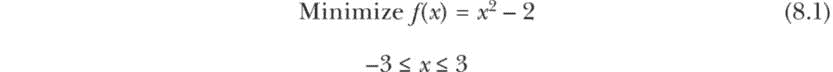

在方程 8.1 中，*f*(*x*) 是一个单变量 *x* 的目标函数。我们的目标是找到一个 *x* 的值，使得 *f*(*x*) 达到最小值，前提是 *x* 保持在 ±3 的范围内。

由于在这种情况下 *x* 的指数是 2，*x*² 总是为正数（无论 *x* 是正数还是负数），并且随着 *x* 的绝对值增大，它的值也会持续增加。因此，方程 8.1 右侧的值将在 *x* = 0 时最小。换句话说，这个问题的最优解（由星号标记）是 *x* = 0，且对应的最优函数值是 *f*(*x*) = –2。

图 8-1 显示了该函数的可视化表示，函数呈抛物线形状，其顶点位于 (0, –2)。我们还可以直观地确认 *f*(*x*) 在点 C（抛物线的顶点）处达到最小值。

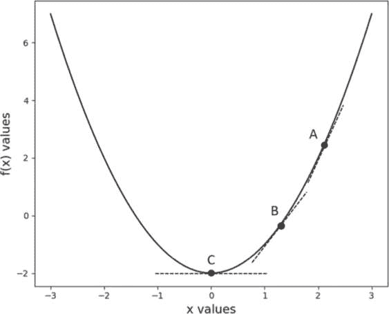

图 8-1：抛物线函数的最优值

这个函数的一个特性使我们可以在不需要知道确切位置的情况下识别最优解。图 8-1 中接触函数的虚线显示了在 A、B 和 C 点处的*斜率*，也称为*梯度*。函数的斜率衡量的是当决策变量发生微小变化时，函数值的变化量。请注意，在函数值最小的点 C，梯度为 0（虚线是水平的）。因此，如果我们随机从点 A 开始寻找最优解，我们可以沿着梯度减小的方向（例如，从 A 到 B 或从 B 到 C）移动，直到梯度变为 0。如果我们继续超越顶点，进入对侧，斜率将改变方向并开始增大。这将导致函数值增大，并使我们远离最优解。

对于一个光滑（无拐点）且连续（无跳跃）并且在决策空间内仅有一个最大值或最小值的函数，基于梯度的搜索策略总是能找到*全局最优解*——给定问题的最佳解决方案。事实上，对于这种表现良好的函数，我们可以通过将函数关于决策变量的导数（在微积分中称为导数）设为 0 并求解得到最优解来找到最优解。只要函数*表现良好*，即光滑且连续，这种方法也适用于具有两个或更多决策变量的函数。

当我们处理一个具有多个梯度为 0 的位置的多模态函数时，事情变得更加复杂，如图 8-2 所示。

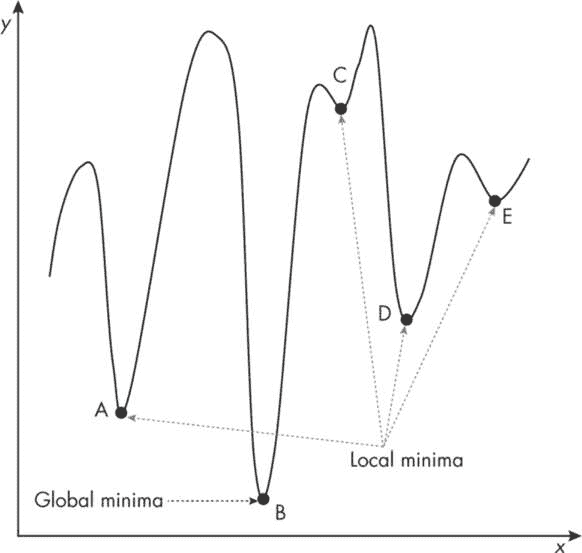

图 8-2：单变量函数的局部和全局极小值

图 8-2 展示了决策空间内 A、C、D、E 点的四个局部极小值，以及 B 点的一个全局极小值。在这种情况下，基于梯度下降的算法是否能收敛到全局极小值，取决于我们从哪个点开始搜索。除非从不同的起始点（初始条件）进行多次尝试，否则无法保证找到全局极小值。

为了更好地理解在寻找多变量函数的全局最优解时所面临的挑战，请参考图 8-3 中的图形。该图展示了两个变量 Eggholder 函数的结果，后续章节的最终项目将进一步讨论此函数。对于这样的一个问题，一个简单的基于梯度的算法很容易陷入多个局部极小值中的一个。更糟糕的是，定义这些函数的方程通常是不可微分的，因此我们不能使用基于微积分的工具来估算全局极小值。

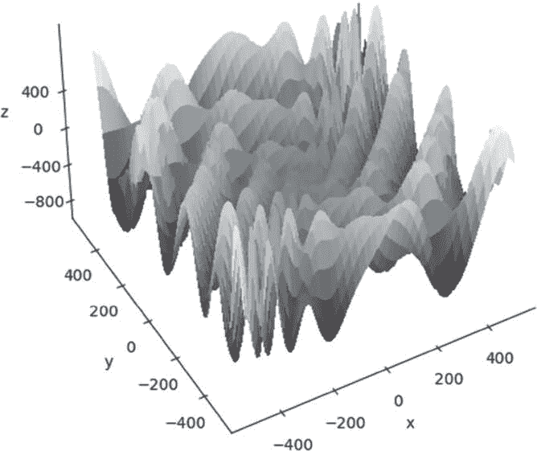

图 8-3：具有多个局部极小值的 Eggholder 函数

然而，具有两个决策变量的函数有一个银 lining：我们可以为有限决策空间中的这些函数绘制三维图。通过对表面图或等高线图的视觉检查，可能可以将搜索空间缩小到一些较小的子区域，在这些区域进行广泛的局部搜索，以发现全局极小值（可能存在多个全局极小值）。

那么高维函数呢？实际上，复杂的现实世界优化问题可能涉及数百个决策变量。人类不可能想象出一个由数百个变量组成的函数在*超空间*（超出人类理解的高维空间）中的样子。我们在超空间中识别最优或近似最优解的最佳方法是进行广泛的搜索，结合*启发式*（关于问题性质的特殊知识）和*随机化*（随机选择初始条件或中间值）。这一策略很可能使算法逃脱局部最优，找到比纯随机搜索更优秀的解。我们通常会多次重复这一过程，并将目前最好的解作为未知全局最优解的代理。

即使在寻找只有离散值（整数）的决策变量的最优组合时，暴力破解所有可能的组合通常也无法在更高维度中奏效。这是因为组合的数量可能大到几乎不可能在合理的时间内完成搜索。在这种情况下，自然启发算法能够救我们于水深火热之中。

#### 何时使用自然启发算法（NIA）

与传统数学工具相比，自然启发算法（NIA）对优化问题的性质或复杂度不那么敏感。一个目标函数可能是非线性、不光滑、多维的或多模态的，但这些特性对自然启发算法来说并不是什么大问题（尽管我们仍然需要从众多选项中选择合适的工具）。自然启发算法尤其适用于解决非常大的优化问题，并能在不消耗过多资源（如计算时间或能源）情况下找到近似最优解。

传统优化方法，无论是否使用梯度下降算法，都是确定性的：如果我们从一个给定的点开始搜索，经过一定步数后，我们总是会到达相同的解或近似解。这个特性使得确定性算法更容易陷入局部最优，因为除非改变初始条件，否则没有内建的自由度去探索不同的路径。

另一方面，自然启发算法是*随机的*，这意味着它们的结果无法提前预测。这是因为自然启发算法通常包含多个依赖于随机选择的内置步骤。对于相同的初始条件，随机算法可能会产生非常不同的结果。这种内在的随机选择不同路径的能力使得自然启发算法能够避免陷入局部最优，并最终找到全局最优或近似全局最优解。

此外，一些自然启发算法基于独立操作的代理（例如，蚁群优化算法中的蚂蚁）。这使我们能够实现算法，从而利用并行处理提高计算效率。

总之，我们可以使用自然启发算法来解决一些大型、复杂的多维优化问题，这些问题没有已知的解析解，或者由于问题的性质，无法找到这样的解。然而，NIA 并非解决许多可以通过确定性方法高效解决的优化问题的理想选择（例如，使用线性或整数规划或各种图搜索算法）。

### 遗传算法概述

遗传算法是最著名的自然启发算法（NIA）之一。它的模型灵感来源于物种的生物进化过程，受父母的性繁殖（父母提供遗传物质）和自然选择（适者生存）驱动。除了继承父母的基因外，后代的*染色体*（基因集合）会经历随机变异，称为*突变*，这为基因库引入新的特征。随后，后代将通过基于*适应度*（衡量个体如何为实现某个目标做出贡献的标准）的选择过程，决定是否可以繁殖。最终，这一过程会导致一代具有显著增强基因库的个体的出现。

图 8-4 展示了遗传算法的主要组成部分。

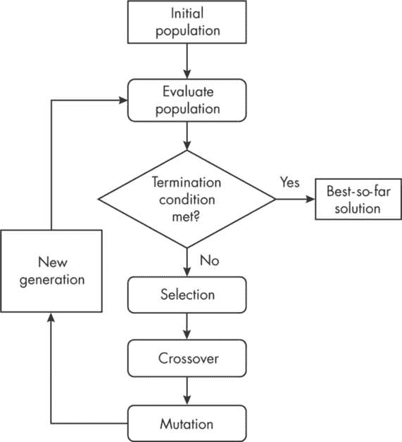

图 8-4：遗传算法的关键组成部分

所有遗传算法都从一群随机创建的个体开始。每个个体本质上是一个潜在的解决方案，通过其基因库来表示。这些个体会根据其适应度进行评估和筛选，我们会尽力最大化或最小化适应度，直到满足终止条件。否则，我们会选择一批具有更好适应度值的个体，它们将进行交配、产生后代，并取代父母成为下一代。我将在接下来的章节中进一步解释这些步骤。

### 遗传算子

遗传算子的核心组件包括遗传算法的三大要素——选择、交叉和变异，它们协同工作，使算法能够收敛到一个解。*选择*是指根据个体的适应度（其对找到最优解的潜在贡献）从种群中选择个体的过程。选择可以涉及整个种群，也可以是种群的一个子集，因为个体是根据特定策略随机抽取的。*交叉*是指结合父母的遗传材料来创造后代。在遗传算法中，它总是涉及两个父母，因此是一个二元操作。*变异*是对个体遗传信息的随机改变。它是一个单一操作，因为它一次只应用于一个个体。

#### 选择

选择操作确保更好的基因从一代传到下一代。这个过程的实现可能会根据问题的不同而有所变化，但最终目标是选择两个父母（染色体），通过交叉参与繁殖。常用的选择策略包括锦标赛、轮盘赌和基于排名的选择。

##### 锦标赛

锦标赛选择过程基于在随机选择的个体之间进行适应度竞赛，如图 8-5 所示。

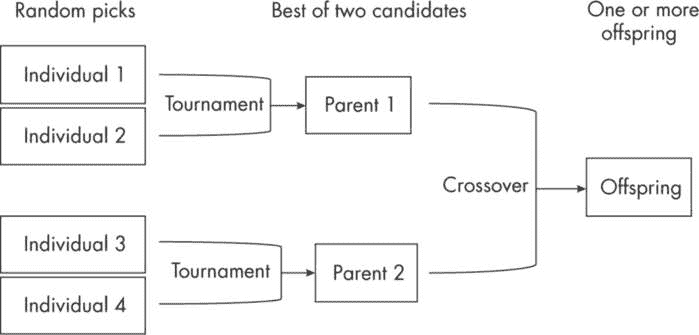

图 8-5：使用锦标赛选择父母

为了创建一个新的后代，过程开始时会随机选择四个个体并将其分为两对。从每一对中，选择适应度较好的个体作为父母。这个过程每轮选择两个父母，它们将通过交叉（稍后会解释）进行繁殖，产生一个后代。

##### 轮盘赌

如其名所示，轮盘赌选择类似于旋转一个分成若干部分的圆盘。这些部分的面积与从中选择父母的种群成员的相对适应度成正比。让我通过一个数字例子来解释这个过程，如表 8-1 所示。

表 8-1：轮盘赌数据

| 个体 | 适应度 | 相对适应度 (RF) | 累积 RF |
| --- | --- | --- | --- |
| P1 | 12 | 0.286 | 0.286 |
| P2 | 5 | 0.119 | 0.405 |
| P3 | 8 | 0.190 | 0.595 |
| P4 | 10 | 0.238 | 0.833 |
| P5 | 4 | 0.095 | 0.929 |
| P6 | 3 | 0.071 | 1.000 |
| 总和 = | 42 | 1.000 |  |

图 8-6 展示了表 8-1 中的示例图示。

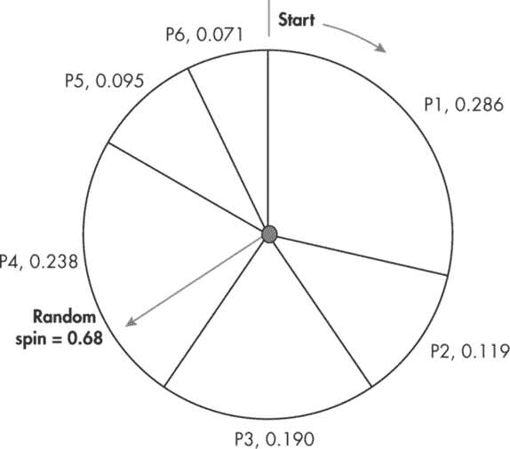

图 8-6：使用轮盘赌方法选择父母

在这个例子中，我们考虑了一个由六个个体（P1 到 P6）组成的群体。它们的适应度值在表 8-1 的第二列中给出。相对适应度（RF）值是通过将个体的适应度值除以所有个体适应度值之和计算得出的（例如，P1 的 RF = 12/42）。最后一列表示累积 RF（CRF），它是通过将所有 RF 值累加到某一行得到的。例如，P2 对应的 CRF = 0.286 + 0.119 = 0.405。最后的 CRF，即所有个体 RF 值的总和，将为 1.0。在轮盘赌方案中，RF 值作为个体随机选择的代理概率，当一个没有偏见的虚拟拨盘旋转时，它将决定被选择的个体。

在图 8-6 中，这六个个体被表示为六个不同的区域，其面积与它们的 RF 值相同（在个体名称旁边显示）。为了实现轮盘赌方法，我们从 0 到 1 的均匀分布中随机抽取一个数字，这与旋转拨盘的效果相同。（通过使用 Kotlin 标准数学库中的 random() 方法可以编程实现此操作。）假设该随机数的值为 0.68，相当于拨盘停在第四个区域内（介于 0.595 和 0.833 的 CRF 之间）。根据这个抽取结果，我们会选择 P4 作为父母 1，并再次重复这一过程选择父母 2。##### 基于排名的选择

第三种选择方法，基于排名的选择，非常类似于轮盘赌方法。在这种方法中，我们根据问题的不同，将个体按升序或降序排序，并根据它们的适应度分配一个排名。如果两个或更多个体的适应度相同，它们将根据在有序列表中的位置被分配一个平均排名。最后，利用这些排名计算 RF 值，并像使用轮盘赌方法一样选择配对父母。

#### 交叉

交叉操作旨在将两个父母的基因混合，生成一个或两个后代，后代将成为下一代的成员。与选择操作符一样，分裂染色体和重组基因的方法有很多种。图 8-7 展示了一种简单但有效的交叉操作方法，称为单点交叉。

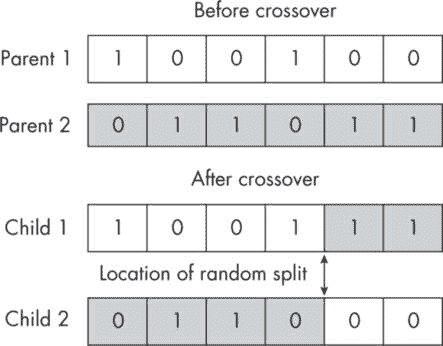

图 8-7：单点交叉操作

我们通过选择操作识别两个父母来开始这一过程。这些父母通常会有由不同基因组成的染色体。在图 8-7 中的例子里，两个父母都有由二进制基因（以 0 或 1 表示）组成的染色体。父母 1 的基因以白色单元格表示，而父母 2 的基因以灰色单元格表示。

交叉操作的第一步是从 1 到基因数量减 1 之间的均匀分布中抽取一个随机整数，在我们的示例中，该值将位于 1 到 5 之间（包括 1 和 5）。假设抽到的整数是 4。然后，我们将在此位置（图 8-7 中的第四和第五个基因之间）分割两个父代的染色体。最后，我们将交换分割部分：将父代 2 的最后两个基因添加到父代 1 中（子代 1 的两个灰色单元格），并将父代 1 的最后两个基因添加到父代 2 中（子代 2 的两个白色单元格）。

在这个示例中，我们使用了两个父代来创造两个子代。然而，我们也可以决定每次迭代只产生一个子代，以保持算法简单并便于编码。对于*实数编码基因*（由实数表示的基因），由于方法的实现方式，交叉操作将只产生一个子代。我们将在本章的最终项目中进一步讨论实数编码基因。

还有许多其他类型的交叉操作，例如多点交叉和有序交叉。对于用于数学函数优化的实数编码基因，交叉操作可以基于适应度值的算术、几何或加权均值。

#### 突变

突变涉及随机改变基因的值，或者对于实数编码的基因，在将后代添加到下一代之前，向这些值添加一些小的噪声。突变应用于染色体中的每个基因，一次一个。首先，我们从 0 到 1 之间随机抽取一个实数，并将其与突变阈值（概率）进行比较，通常该值设置为非常小的值。如果抽取的随机值小于或等于突变阈值，我们将改变该基因的遗传内容。对于一个二进制染色体，其中的基因值为 1 或 0（表示某个实体在解中是否包含），这种改变是通过将基因值从 0 翻转为 1 或反之进行的。

图 8-8 以图形方式解释了这一过程。

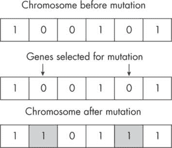

图 8-8：二进制染色体中的突变

在图 8-8 中，第二个和第五个基因被随机选择进行突变。鉴于这些是二进制基因，它们的基因值已经从 0 翻转为 1。

#### 精英主义

在我们开始解决第一个遗传算法项目之前，我还会介绍一个重要的概念——*精英主义*。这种技术涉及根据适应度对当前种群进行排序，然后将排序后的一部分个体添加到下一代，再进行交叉和突变操作。这个操作被称为精英主义，因为它偏向于保留最适应的个体。精英主义通常有助于减少寻找最优解所需的计算量，因为它保护了一些最优秀的染色体，避免它们在交叉和突变操作中被改变或稀释。

项目 33：将胡言乱语演变为莎士比亚语言

在我们的第一个编码项目中，我们将创建一个包含随机基因集合作为染色体的种群。接着，我们将使用遗传算法来优化这些染色体，直到其中一个个体变得像莎士比亚一样口才出众，并重复《哈姆雷特》中那句著名的台词：“生存还是毁灭，这是个问题”，并将其表达在基因序列中！

#### 策略

为了解决这个问题，我们将创建一个大小为 100 的种群。对此没有严格的规定，需要通过一些实验来估计给定问题的合理种群规模。影响算法收敛速度的因素有很多，包括种群规模、遗传操作的实现方式以及停止条件。一种可能的策略是从较小的种群规模开始，然后逐步增加，直到进一步改进解决方案变得微不足道。

接下来，我们需要确定染色体的大小。对于这个特定的问题，每个个体的染色体将包含 42 个基因——这是我们希望通过算法再现的文本的长度。这些基因将从 87 个基因的池中随机选择，这些基因池包含字母数字字符（包括标点符号和括号）。由于我们的目标是精确匹配目标文本，因此这个基因池包含了大写字母和小写字母。

在我们的遗传算法实现中，我们将使用精英策略和基于竞赛的选择作为操作符。此外，我们将采用单点交叉方案。对于突变，我们将使用 1/42 的阈值，以确保每次交叉创建新个体时，平均每个基因会发生一次突变。

#### 代码

代码的整体结构与图 8-4 中描述的遗传算法的一般结构非常相似。我们将在接下来的章节中讨论它的每个组成部分。

##### 全局声明

在这个代码段中，我们创建了一个数据类，并声明和/或设置了所需的全局参数和集合。我们还创建了两个可变的数据对象列表，用来存储当前代和下一代的种群状态。

```
data class Solution(
    val chromosome: String,
    val fitness: Int
)

❶ val TARGET = "To be, or not to be: that is the question."
❷ val VALID_GENES: String =
 "abcdefghijklmnopqrstuvwxyzABCDEFGHIJKLMNOPQRSTUVWXYZ" + // letters
            "1234567890" +                                   // numbers
            ", .-;:_!/?#%&()={[]}$*@\"\'"                    // symbols
val chromosomeLength = TARGET.length
val POP_SIZE = 100
val MAX_GEN = 1000
val ELITISM = 0.15
val eliteSize = (POP_SIZE * ELITISM).toInt()
❸ val MUTATION_THRESHOLD = 1.0/chromosomeLength

val population: MutableList<Solution> = mutableListOf()
val nextgen: MutableList<Solution> = mutableListOf()
```

让我们一步步地讲解这个代码段。在代码块的顶部，我们创建了一个 Solution 对象（数据类），它将用于创建构成种群的个体，并进行基因变化。

接下来，我们定义目标字符串或种群中最适应个体的期望最终状态❶。目标字符串包含 42 个字符（包括空格），并存储在名为 TARGET 的字符串中。该目标字符串是从一个基因池构建的——这些字符是我们在英语中常用来构建短语的字符。这个基因池保存为 VALID_GENES❷。

我们将种群大小（POP_SIZE）设置为 100，将代数（MAX_GEN）设置为 1,000。我们还使用了精英主义。种群中 15%（即最适应的前 15 个个体）将自动进入下一代。下一代的其余成员将通过选择、交叉和变异生成。变异阈值已设置为 1.0/chromosomeLength ❸，因此每个后代中平均会有 42 个基因中有 1 个基因发生变异。（对于其他优化问题，可能需要调整这个经验规则。例如，当染色体中基因较少时，可能需要将变异阈值从 1%设置为 3%。）

最后的两行代码创建了两个可变类型为 Solution 的列表，这些列表分别存储当前代（种群）和下一代（nextgen）个体。

##### 初始化种群和适应度评估

初始种群通过调用 initPopulation()函数创建，该函数依赖于 getFitness()辅助函数。

```
fun initPopulation() {
    // Initialize a population of POP_SIZE individuals.
    for (i in 0 until POP_SIZE) {
        var chromosome = ""
        for (j in 0 until chromosomeLength) {
           ❶ chromosome += VALID_GENES.random()
        }
        // Calculate fitness of the new chromosome.
        val fitness = getFitness(chromosome)
        // Add the new individual to the population.
      ❷ population += Solution(chromosome, fitness)
    }
 // Sort population (in place) in descending order.
    population.sortByDescending {it.fitness}
    println("\nBest solution from initial population:")
    println(population[0].toString())
    println("\n... initPopulation done ...\n")
}

fun getFitness(chromosome: String): Int {
    var fitness = 0
    val pairs = TARGET.zip(chromosome)
    for (pair in pairs) {
      ❸ if (pair.first == pair.second)
                 fitness += 1
    }
    return fitness
}
```

initPopulation()函数创建了 POP_SIZE 指定数量的个体（在本例中为 100 个），这些个体的染色体是通过随机从提供的基因池 VALID_GENES ❶中选取个体基因（共 42 个）来生成的。染色体完成后，通过调用 getFitness()函数来评估其适应度。然后，使用染色体和适应度值创建一个新的 Solution 并将其添加到种群中 ❷。

在退出该函数之前，我们按降序对种群进行排序，并打印出初始种群中的最佳解。此排序是为了检查终止条件并在 runGA()函数内实现精英主义，以处理第一代。对于后续代，排序将在每次迭代结束时进行。

在 getFitness()函数内，我们创建了一个名为 pairs 的列表，类型为 Pair<Char, Char>，并根据基因对的比较来计算给定染色体的适应度值。对于每个匹配的基因，适应度加 1 ❸。如果一个染色体完全匹配目标字符串，它将拥有最大适应度值 42。

##### 驱动函数

在 runGA()函数的代码块中，我们实现了遗传算法的核心组件。这包括遍历多个代，检查终止条件，并通过精英主义、选择、交叉和变异——即一整套遗传操作符——来创建下一代。

```
fun runGA() {

    // Iterate for a specified number of generations.
  ❶ for (generation in 1 .. MAX_GEN) {

        // Step 1: Check for termination condition.
      ❷ if (population[0].fitness >= chromosomeLength) {
            println("\n*** Target reached at generation = " +
                    "${generation - 1} ***\n")
 break
        }

        // Step 2: Implement elitism.
      ❸ selectElites()

        // Step 3: Implement crossover and mutation.
      ❹ for (i in eliteSize until POP_SIZE) {
            // Select parents for crossover.
            val parent1 = tournament()
            val parent2 = tournament()

            // Produce a child by using crossover and mutation.
            val child = crossover(parent1, parent2)

            // Add the child to nextgen.
            nextgen += child
        }

        // Step 4: Transfer nextgen to the current population.
      ❺ for (i in nextgen.indices)
            population[i] = nextgen[i].copy()

        // Step 5: Clear nextgen for the next iteration.
        nextgen.clear()

        // Step 6: Sort population in descending order (in place).
       ❻ population.sortByDescending {it.fitness}

        // Step 7 (optional): Print the best solution per generation.
        val formatString = "%5d %44s %4d"
      ❼ println(formatString.format(generation,
            population[0].chromosome, population[0].fitness))
    }
}
```

最外层的 for 循环❶执行指定代数的遗传过程。在这个循环内，我们首先通过将当前人口的最佳适应度值与最大可能适应度值❷进行比较来检查终止条件。如果满足条件，程序会在打印达到目标的消息后终止。如果条件不满足，我们通过调用 selectElites()函数❸来实现精英策略，下一节将详细讨论该函数。

然后我们进入第一个内部 for 循环❹，该循环通过竞赛选择新父代、调用 crossover()函数创建子代（该函数还会对新创建的染色体应用变异，具体内容将在下一节讨论），然后将子代添加到可变的 nextgen 列表中，创建下一代的其余成员。

我们使用第二个内部 for 循环❺将下一代的解决方案（nextgen）逐一复制到 population 中，然后清空 nextgen 以便进行下一次迭代。需要注意的是，由于 Solution 数据类结构简单，应用 copy()方法复制 nextgen 中的元素时，会创建深拷贝，防止 population 和 nextgen 之间发生交叉引用。此外，将 nextgen 的值转移到 population 中后，无需存储多个代的解决方案，从而节省了大量内存。

在最外层的 for 循环的最后一部分，我们将新更新的人口按降序排序❻，并打印每一代的三个关键值：迭代次数、适应度最佳的染色体以及对应的适应度❼。

##### 操作函数

runGA()函数依赖于几个操作函数来执行关键的遗传操作。

```
fun selectElites() {
    // Assign top eliteSize individuals to nextgen.
  ❶ for (i in 0 until eliteSize)
         nextgen += population[i].copy()
}

fun tournament(): Solution {
    // random sampling with replacement
    // Use the entire population, including elites.
    val candidate1 = population.random().copy()
    val candidate2 = population.random().copy()
    // Return the winner of the tournament.
  ❷ return if (candidate1.fitness >= candidate2.fitness) candidate1
               else candidate2
}

fun crossover(parent1: Solution, parent2: Solution): Solution {
    // random single-point split crossover
    val split = (1 until chromosomeLength).random()

    // Use slice to extract segments from a string.
  ❸ val crossChromosome =
        parent1.chromosome.slice(0 until split) +
                parent2.chromosome.slice(split until chromosomeLength)

    // Apply mutation to crossChromosome.
  ❹ val newChromosome = mutation(crossChromosome)

  ❺ return Solution(newChromosome, getFitness(newChromosome))
}

fun mutation(crossChromosome: String): String {
    // A String object is immutable in Kotlin.
    // Create a char array whose elements can be modified.
    val chars = crossChromosome.toCharArray()
    for (i in 0 until chromosomeLength) {
      ❻ if ((0..1000).random()/1000.0 <= MUTATION_THRESHOLD)
            chars[i] = VALID_GENES.random()
    }
  ❼ return String(chars)
}
```

selectElites()函数是一行代码。它将当前代中最优秀的 15 个个体（eliteSize = 15）直接提升到下一代，而不再进行遗传过程❶。

tournament()函数从当前人口中随机选出两个个体，并根据它们的适应度值返回竞争的胜者❷。

crossover()函数接受两个父代作为参数，在随机位置切割它们的染色体，并将两个父代的切割部分组合起来，为后代创建一个新的染色体❸。接下来，将这个新创建的染色体（crossChromosome）传递给 mutation()函数❹，该函数返回最终的染色体，并将其保存为 newChromosome。然后，计算新创建的染色体的适应度值，调用 getFitness()❺后返回一个后代。

最后，mutation() 函数对随机选择的基因进行突变。它首先将染色体从字符串对象转换为字符数组，因为在 Kotlin 中，字符串是不可变的。突变操作由 MUTATION_THRESHOLD 参数 ❻ 触发，应用于染色体中的每个基因。突变操作完成后，字符数组会被转换回字符串，并作为新的（突变后的）染色体 ❼ 返回。

##### main() 函数

main() 函数仅仅打印了一些与问题相关的关键参数，并进行两次函数调用来完成任务。

```
fun main() {
    println("\n*** Text-matching using the genetic algorithm ***\n")
    println("Target string: $TARGET")
    println("Population size: $POP_SIZE, Generations: $MAX_GEN, " +
            "Chromosome length: $chromosomeLength")
    println("Mutation threshold: $MUTATION_THRESHOLD")

    // Initialize the population.
    initPopulation()
    // Run the genetic algorithm.
    runGA()
}
```

第一次调用 initPopulation() 会用随机的染色体初始化当前种群。第二次调用 runGA() 执行必要的遗传操作。

#### 结果

每次运行这个程序时，需要的迭代次数会不同，以精确匹配目标字符串。这是因为我们使用的是一种随机方法，依赖于多个内部的随机选择层次。这是解决大型现实世界问题的一个非常有用的特性，因为这些问题可能没有确定的或已知的解决方案。

以下是程序的一些示例输出：

```
*** Text-matching using the genetic algorithm ***

Target string: To be, or not to be: that is the question.
Population size: 100, Generations: 1000, Chromosome length: 42
Mutation threshold: 0.023809523809523808

Best solution from initial population:
Solution(chromosome=u[n_ebJvtj=J[h5j{bNx:BhPch'qyM/)3RVz"K_]P:, fitness=3)

... initPopulation done ...

    1   u[n_ebJvtj=J[h5j{bNx:BhPch'qyM/)3RVz"K_]P:   3
    2   c_g-i1KpZQn[[qXq%hwp:,shb]7k?PEL_ol @izl.    4
    3   C@eSnKo7T_b6o@thqvgL Kh=FU[(&bCF{veDP"4/d    5
    4   C@eSnKo7T_b6o@thqvgL Kh=FU[(&bCF{veDP"4/d    5
    5   rnkFi6Z8U /NP An%d]m&vSZSS{&6F/e=qJ9*iio#k   6
    6   yT;_e}Jvtj=J[h5j{bNx:BhPch[(&bF qJS @iz/d    7
    7   yT;_e}Jvtj=J[h5j{bNx:BhPch[(&bF qJS @iz/d    7
    8   342y"BZo@_b6o@thqvgL Kh=FD[(&bCFqJSq@izl.    8
    9   342y"BZo@_b6o@thqvgL Kh=FD[(&bCFqJSq@izl.    8
   10   p42y"BZo;bTcXxD?{bNL BhPcU[(&bCF{veDPiol.    9
   11   342y"aZo@_b6o@thqvgL Kh=FD[(?/e qJ9*iio#k   10
   12   =[eSnKo8U XNP thqvgL Kh=FD[(?/e qJ9*iio#k   11

`--snip--`

  370   To be, or not to be: that i(the question.   41
  371   To be, or not to be: that i(the question.   41
  372   To be, or not to be: that i(the question.   41
  373   To be, or not to be: that i(the question.   41
  374   To be, or not to be: that i(the question.   41
  375   To be, or not to be: that i(the question.   41
  376   To be, or not to be: that i(the question.   41
  377   To be, or not to be: that i(the question.   41
  378   To be, or not to be: that i(the question.   41
  379   To be, or not to be: that is the question.  42

*** Target reached at generation = 379 ***
```

在这个实例中，起初染色体与目标字符串没有任何相似之处，算法用了 379 代才精确地重建出目标字符串。我们还没有对全局参数值进行任何调整来加速收敛过程，但代码几乎即时就收敛到最优解（处理时间将取决于你设备的配置）。相当令人印象深刻！

项目 34：解决背包问题

你可能熟悉诺亚方舟，诺亚和他的追随者为了躲避大洪水而建造的船只。诺亚所面临的挑战是巨大的：他必须建造一艘前所未有的庞大船只，并选择谁或什么可以上船。对数学家来说，后者的决定是一个经典的优化问题，试图最大化可以容纳在有限空间内的物品的价值。

让我们构建这个挑战的一个简化版本，并使用遗传算法来解决它。我们将这个项目命名为乔纳的方舟。乔纳住在一个易受洪水侵袭的平原上，面临着山洪爆发的风险。乔纳知道，他必须时刻准备好在短时间内离开这个地方。他最快的逃生路线是通过小型引擎船沿着一条支流逃离上涨的河水，驶往洪水无法触及的地方。当然，这艘船很小，只能载有限的物品，否则就会沉没。乔纳必须决定将哪些珍贵物品带走，而不超过船的承载能力。

约拿能够列出对他最有价值的 12 个物品——但这仍然太多，无法全部带上船。现在，他需要弄清楚应该选择哪些物品的组合，以便这些物品对他来说的总价值（分配的价值总和）最大化，同时不超过船的承载能力。

#### 策略

约拿方舟问题是数学中*背包问题*的一个变种：

> 设 n 为可供选择的物品数量。设***V*** = [v[1], v[2], . . . , vn]为这些物品的价值列表，***W*** = [w[1], w[2], . . . , wn]为这些物品的重量列表。同时，设***W***max 为背包的最大承载重量。目标是找到一个包含 m 个物品的子集，使得该子集的总价值最大化，同时确保相应的物品总重量不超过***W***max。

我们将利用遗传算法来解决这个问题。显然，我们需要对代码中的问题定义部分做出调整。首先，由于约拿现在有 12 个不同的物品可以选择，我们将设置染色体的数量为 12。染色体中的每个基因将具有二进制值，其中 1 表示将该物品包含在解决方案中，0 表示排除它。我们还将根据选择的物品及其各自的价值和重量，以不同的方式计算解决方案的适应度。关于这一点，我将在讨论相关代码段时进一步解释。

一个重要的考虑因素是初始种群的组成。我们需要确保初始种群具有一定的多样性。如果所有基因都是随机分配的，可能会得到一个适应度为零的种群。这将使交叉操作变得无效，我们将仅依赖突变，这个过程非常缓慢。因此，在初始化种群时，我们将强制每个成员具有非零适应度。

在开始编写代码之前，我们需要解决一些技术上的问题。首先，我们将采用 0-1 方法来解决这个问题，意味着我们要么选择一个物品，要么完全排除它。我们不允许选择物品的部分（以及部分的价值）。其次，我们假设每个物品只有一份，因此我们不能在解决方案中重复任何物品。第三，我们假设只有一个背包可供填充。

#### 代码

我们在第三十三章开发了一个完整功能的遗传算法程序。大部分代码我们将重用，并进行一些必要的调整以描述和解决背包问题（或约拿方舟问题）。

##### 问题定义和全局参数

这段代码由导入语句、数据类声明、创建可供选择的项目列表、全局参数以及创建可变列表以跟踪当前和下一代的种群状态、每代的最佳解决方案等组成。

```
import kotlin.math.roundToInt

// Define required data classes.
data class Solution(val chromosome: IntArray, val fitness: Int)
data class Item(val value: Int, val weight: Int)

// Define the basket of items.
❶ private val items: List<Item> = listOf(
    Item(75, 15),
    Item(55, 32),
    Item(50, 30),
    Item(68, 43),
    Item(62, 54),
 Item(45, 38),
    Item(68, 62),
    Item(84, 85),
    Item(87, 87),
    Item(95, 83),
    Item(35, 21),
    Item(63, 53)
)
val chromosomeLength = items.size
❷ val maxWeight = 175

// global parameters and declarations
val POP_SIZE = 25
val MAX_GEN = 30
val ELITISM = 0.1
val eliteSize = (POP_SIZE * ELITISM).toInt()

// Limit the mutation threshold value to three decimal places.
❸ val MUTATION_THRESHOLD =
       ((1.0/chromosomeLength)*1000.0).roundToInt() / 1000.0

val population: MutableList<Solution> = mutableListOf()
val nextgen: MutableList<Solution> = mutableListOf()
val bestSolutions: MutableList<Solution> = mutableListOf()
```

代码片段以单个导入语句开始，导入了我们将稍后使用的 roundToInt()方法。接着，我们定义了两个简单的数据类，Solution 和 Item，用于创建种群中的个体成员以及带有其关键属性（值和重量）的对象。请注意，我们创建的是整数数组类型的染色体，而不是像项目 33 中那样创建字符串类型的染色体。

> 注意

*根据你的 IDE，你可能会在声明本项目的第一个数据类（*Solution*）时遇到“弱警告”。这是因为我们在数据类（*Solution*）中使用了一个属性，其类型为*Array*（*chromosome*）。虽然该警告表明某些用例可能存在潜在问题，但对于本章和下一章讨论的问题并不适用。如果你觉得这个警告烦人，可以尝试用常规类代替数据类。在这种情况下，你可以手动添加数据类自动生成的必要自定义方法，例如*copy()*和*toString()*。我鼓励你尝试这种方法，作为进一步学习的机会。*

接下来，我们创建了一个包含 12 个对象❶的 Item 类型的 List。船的容量限制（maxWeight）设置为 175 单位❷（我们假设这是除了约拿自身重量之外的限制）。

鉴于可选择的对象相对较少，我们将种群大小（POP_SIZE）设置为 25，代数（MAX_GEN）设置为适中的 30。精英选择比例设置为 0.1，即 10%。变异阈值（MUTATION_THRESHOLD）的值设置得稍有不同（其值保留三位有效数字），❸，但它仍然遵循经验法则。

请注意，变异阈值可以四舍五入到几个小数位，而不会影响结果。这可以加速更复杂问题的计算，这些问题需要更大的种群和更长的运行时间才能收敛。

代码的最后三行创建了三个可变列表，用于存储当前和下一代成员，以及从连续代中挑选出的最佳解集合。

##### 初始化种群和适应度评估

本节与我们为项目 33 开发的内容只有少数几个不同之处。

```
fun initPopulation() {
    // Initialize a population of valid solutions (of nonzero fitness).
    // Each solution is represented by a chromosome.

    for (person in 0 until POP_SIZE) {
      ❶ val chromosome = IntArray(chromosomeLength)

        var not_done = true
      ❷ while (not_done) {
            for (gene in 0 until chromosomeLength) {
                chromosome[gene] = (0..1).random()
            }
            val fitness = getFitness(chromosome)
          ❸ if (fitness > 0) {
                population += Solution(chromosome, fitness)
                not_done = false
            }
        }
    }
    // Sort population (in place) in descending order.
    population.sortByDescending {it.fitness}

    println("\nBest solution from initial population:")
    print(population[0].chromosome.contentToString())
    println(" " + (-population[0].fitness).toString())
    println("\n... initPopulation done ...\n")
}

fun getFitness(chromosome: IntArray): Int {
    // Get sum of values and weights.
  ❹ val sumValue  = (chromosome.zip(items) {c, item -> c * item.value}).sum()
  ❺ val sumWeight = (chromosome.zip(items) {c, item -> c * item.weight}).sum()

    return if (sumWeight <= maxWeight) sumValue else 0
}
```

在 initPopulation()函数中，我们首先将每个染色体创建为一个整数数组❶。这是因为我们仅允许在染色体中使用二进制基因值（0 或 1）。最初，所有基因都将设置为 0，当染色体初始化时。然后，我们在一个 while 循环❷中随机改变这些值为 1 或 0。此外，我们只将具有非零或正适应度值的解添加到初始种群中❸。这样有助于我们从更好的染色体集合开始，避免所有初始解的适应度值都为零的情况，因为这种情况是很难改进的！

函数的其余部分与之前相同——我们在对初始种群进行排序，以为 runGA()函数中的精英选择做好准备，并打印出初始种群中的当前最佳解。

辅助函数 getFitness()接受一个染色体作为参数，并评估其适应度。它将适应度计算为值的加权和（sumValue），其中权重为染色体中的基因❹。它还计算了加权和的重量作为 sumWeight❺。如果重量的总和≤ Wmax，函数返回染色体的适应度值；否则，返回 0。

如前所述，我们必须确保 sumWeight ≤ Wmax 且 sumValue > 0。我们在此函数中强制执行前一个条件。后一个条件则是在 initPopulation()函数的 while 循环内强制执行的。只有当染色体的适应度值（由 getFitness()函数返回）大于零时，染色体才会被使用❸。

##### 驱动函数

我们同样需要对这部分代码做一些小的修改，代码最初是为项目 33 开发的。首先，我们将在开头删除终止条件。对于背包问题，最佳解通常事先未知。我们需要运行代码几次，以了解可能的最佳解。其次，我们现在会将所有代的最佳解保存在一个列表中，并从该列表中挑选出整体最优的解作为潜在的最佳解。

这是修订后的 runGA()函数的代码：

```
fun runGA() {
    // Run the algorithm for a specified number of generations.
    for (generation in 1 .. MAX_GEN) {

        // Step 1: Implement elitism.
        selectElites()

        // Step 2: Implement crossover and mutation.
        for (i in eliteSize until POP_SIZE) {
            // Select parents for crossover.
            val parent1 = tournament()
            val parent2 = tournament()

            // Produce a child by using crossover and mutation.
            val child = crossover(parent1, parent2)
            // Add child to nextgen.
            nextgen += child
        }
 // Step 3: Transfer nextgen to the current population.
        for (i in nextgen.indices)
            population[i] = nextgen[i].copy()

        // Step 4: Clear nextgen for the next iteration.
        nextgen.clear()

        // Step 5: Sort the population in descending order (in place).
        population.sortByDescending {it.fitness}

        // Step 6: Add the fittest solution to bestSolutions.
      ❶ bestSolutions += population[0]

        // Step 7 (optional): Print the fittest solution.
      ❷ printSolution(generation, population[0])
    }
}
```

除了删除基于适应度值的终止条件外，代码的两个修改都位于代码段的末尾。首先，每代中最优的解现在被添加到可变的 bestSolutions 列表中❶。其次，我们添加了一个新的打印函数，名为 printSolution()❷，以整理打印输出而不增加 runGA()的混乱。该函数简单地格式化并打印出每代的代数、染色体和最优解的适应度值。

```
fun printSolution(generation: Int, solution: Solution) {
    val str1 = "%04d".format(generation).padEnd(10, ' ')
    val (c, f) = solution
    val str2 = c.contentToString()
    val str3 = f.toString().padStart(6, ' ')
    println(str1 + str2 + str3)
}
```

该函数打印一行由三个子字符串组成的内容。第一个子字符串表示代数或迭代次数。我们为此分配了 10 个字符空格，其中 4 个用于显示数字，其余的空格将在数字后作为填充（空白字符）。第二个子字符串简单地包含了 12 个基因的序列，转换成字符串。第三个子字符串包含适应度值。我们为数字分配了六个空格，其中最多三个将用于显示适应度值，其余空格将作为填充，位于显示适应度值的字符前面。

##### 操作符函数

我们将跳过讨论 selectElites()和 tournament()函数，因为在此示例中使用它们不需要做任何更改（你可以从项目 33 中复制它们）。然而，我们有一个不同的染色体结构来解决背包问题，并且需要满足额外的约束条件。这意味着我们需要对 crossover()和 mutation()函数进行修改。

```
fun crossover(parent1: Solution, parent2: Solution): Solution {
    // random single-point split and crossover
  ❶ val split = (1 until chromosomeLength).random()

    // Use copyOfRange() to extract elements from an array.
    // .copyOfRange(a,b): a = start index, b = not inclusive
    val arr1 = parent1.chromosome.copyOfRange(0, split)
    val arr2 = parent2.chromosome.copyOfRange(split, chromosomeLength)

  ❷ val newChromosome = arr1 + arr2

    // Apply in-place mutation to the new chromosome.
  ❸ mutation(newChromosome)

  ❹ return Solution(newChromosome, getFitness(newChromosome))
}

fun mutation(newChromosome: IntArray) {
    // Carry out in-place mutation.
    for (i in 0 until chromosomeLength) {
        if ((0..1000).random()/1000.0 <= MUTATION_THRESHOLD) {
            // Simplest way to flip values between 0 and 1 is i = 1 - i.
          ❺ newChromosome[i] = (1 - newChromosome[i])
        }
    }
    // nothing to return
}
```

如同之前，crossover()函数首先随机定位一个点来分割染色体❶。我们使用 copyRangeOf()方法从父代 1 和父代 2 复制不同范围的基因，因为染色体的类型是 IntArray 而不是 String。新染色体是通过将父代 1 的前半部分与父代 2 的后半部分组合而成的（每次交叉生成一个子代）❷。

接下来，我们调用 mutation()函数对新创建的染色体进行变异❸。由于数组是按引用（内存位置）而非按值传递的，因此所有遗传变异将直接应用到 newChromosome 的选定元素上，我们无需将变异后的染色体返回给调用函数。

一旦此步骤完成，使用新创建的染色体和其适应度❹，将创建并返回一个新的子代（Solution）。

最后，mutation()函数扫描染色体中的每个基因，并通过将一个介于 0 和 1 之间的随机数与 MUTATION_THRESHOLD 进行比较来对基因进行变异。当条件满足时，它会将基因的值从 0 翻转为 1，或反之❺。

##### main()函数

本项目的 main()函数与项目 33 中的 main()函数相似，只是多了一次调用 printBestSolution()来打印最佳总体解。以下是包含打印功能的代码片段：

```
fun main() {
    println("\n*** Solving the 0-1 knapsack problem " +
            "using the genetic algorithm ***\n")
    println("Population size: $POP_SIZE, Generations: $MAX_GEN")
    println("Number of items to pick from: $chromosomeLength")
    println("Mutation threshold: $MUTATION_THRESHOLD")

    // Initialize the population.
    initPopulation()
    // Run the genetic algorithm.
    runGA()
    // Print the best overall solution.
    printBestSolution()
}

fun printBestSolution() {
  ❶ bestSolutions.sortByDescending {it.fitness}
    println("\nBest solution found after $MAX_GEN generations:")

  ❷ val (chromosome, fitness) = bestSolutions[0]
  ❸ val sumWeight = (chromosome.zip(items)
                       {c, item -> c * item.weight}).sum()
    println(bestSolutions[0].toString())
    println("Sum of weights: $sumWeight   Sum of values: $fitness")
}
```

main()函数非常简短。它首先打印关键的全局参数，然后调用 initPopulation()创建初始解集，并调用驱动函数 runGA()来运行我们为背包问题定制的遗传算法。最后，调用 printBestSolution()函数打印最佳总体解。

接下来，bestSolutions 列表按降序排序，使得第一个项目代表最优解❶。然后，解构该项目的属性为染色体和适应度❷。最后，计算此最优（或近似最优）解中物品的总重量作为加权总和，权重为各个基因值（0，1）❸。最后一行打印最佳总体解的重量和适应度总和。

#### 结果

以下是运行代码时的示例输出，提供了运行代码时可以期待的结果：

```
*** Solving the 0-1 knapsack problem using the genetic algorithm ***

Population size: 25, Generations: 30
Number of items to pick from: 12
Mutation threshold: 0.083

Best solution from initial population:
Solution(chromosome=[1, 0, 1, 0, 1, 0, 0, 0, 0, 0, 1, 1], fitness=285)

... initPopulation done

0001      [1, 0, 1, 0, 1, 0, 0, 0, 0, 0, 1, 1]   285
0002      [1, 0, 1, 0, 1, 0, 0, 0, 0, 0, 1, 1]   285
0003      [1, 0, 1, 1, 0, 0, 1, 0, 0, 0, 1, 0]   296
0004      [1, 0, 1, 1, 0, 0, 1, 0, 0, 0, 1, 0]   296
0005      [1, 0, 1, 1, 0, 0, 1, 0, 0, 0, 1, 0]   296
0006      [1, 0, 1, 1, 0, 0, 1, 0, 0, 0, 1, 0]   296
0007      [1, 0, 1, 1, 0, 0, 1, 0, 0, 0, 1, 0]   296
0008      [1, 0, 1, 1, 0, 0, 1, 0, 0, 0, 1, 0]   296
0009      [1, 0, 1, 1, 0, 0, 1, 0, 0, 0, 1, 0]   296
0010      [1, 0, 1, 1, 0, 0, 1, 0, 0, 0, 1, 0]   296
0011      [1, 0, 1, 1, 0, 0, 1, 0, 0, 0, 1, 0]   296
0012      [1, 0, 1, 1, 0, 0, 1, 0, 0, 0, 1, 0]   296
0013      [1, 0, 1, 1, 0, 0, 1, 0, 0, 0, 1, 0]   296
0014      [1, 0, 1, 1, 0, 0, 1, 0, 0, 0, 1, 0]   296
0015      [1, 0, 1, 1, 0, 0, 1, 0, 0, 0, 1, 0]   296
0016      [1, 0, 1, 1, 0, 0, 1, 0, 0, 0, 1, 0]   296
0017      [1, 1, 1, 1, 0, 0, 0, 0, 0, 0, 0, 1]   311
0018      [1, 1, 1, 1, 0, 0, 0, 0, 0, 0, 0, 1]   311
0019      [1, 1, 1, 1, 0, 0, 0, 0, 0, 0, 0, 1]   311
0020      [1, 1, 1, 1, 0, 0, 0, 0, 0, 0, 0, 1]   311
0021      [1, 1, 1, 1, 0, 0, 0, 0, 0, 0, 0, 1]   311
0022      [1, 1, 1, 1, 0, 0, 0, 0, 0, 0, 0, 1]   311
0023      [1, 1, 1, 1, 0, 0, 0, 0, 0, 0, 0, 1]   311
0024      [1, 1, 1, 1, 0, 0, 0, 0, 0, 0, 0, 1]   311
0025      [1, 1, 1, 1, 0, 0, 0, 0, 0, 0, 0, 1]   311
0026      [1, 1, 1, 1, 0, 0, 0, 0, 0, 0, 0, 1]   311
0027      [1, 1, 1, 1, 0, 0, 0, 0, 0, 0, 0, 1]   311
0028      [1, 1, 1, 1, 0, 0, 0, 0, 0, 0, 0, 1]   311
0029      [1, 1, 1, 1, 0, 0, 0, 0, 0, 0, 0, 1]   311
0030      [1, 1, 1, 1, 0, 0, 0, 0, 0, 0, 0, 1]   311

Best solution found after 30 generations:
Solution(chromosome=[1, 1, 1, 1, 0, 0, 0, 0, 0, 0, 0, 1], fitness=311)
Sum of weights: 173   Sum of values: 311
```

Jonah 的最优解是选择物品 1、2、3、4 和 12，这将使 Jonah 的总价值为 311 个单位。最优选择的总重量为 173 个单位，接近最大允许重量 175 个单位。

我们如何知道没有更好的解存在？在这种情况下，你可以通过使用暴力方法来验证解——生成所有可能的组合并检查相应的值和权重之和。我鼓励你在线搜索相关工具或代码示例，以确认 311 确实是 Jonah 在这种情况下能获得的最佳值。

再次提醒，遗传算法是一种随机算法，这意味着不同的运行不会产生相同的结果。此外，没有任何保障可以确保对于一组给定的参数值，算法每次运行时都会一致地收敛到最优解。你可能需要多次运行程序或调整程序参数，才能最终找到最优解。

另一方面，遗传算法可以帮助解决现实世界中的组合问题，这些问题涉及数百个决策变量，在这种情况下，检查所有可能的组合以找到全局最优解既不实际也不可能。它们所需的时间远少于传统方法，并且生成近似最优解所需的计算努力显著较少。

项目 35：使用遗传算法优化多元函数

在这个最终项目中，我们将学习如何将遗传算法应用于多元函数优化。对于函数的唯一要求是，它必须在决策空间内以独立变量的形式定义。与基于梯度的算法不同，这个函数不需要是平滑的或可微的。

我们将使用一个足够具有挑战性的二维函数，即 Eggholder 函数，它由两个独立变量定义：*x*[1] 和 *x*[2]。

$方程式$ (8.2) 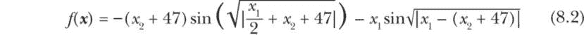

我们将在如下定义的决策空间中找到该函数的最小值：

$方程式$ 

如前所示，在图 8-3 中，Eggholder 函数具有非常复杂的形状，拥有众多的峰值和谷值。正因为如此，基于梯度的确定性算法很难找到全局最小值。确定性搜索方法通常会陷入局部最优解，除非我们采用一种结合随机搜索特征的混合方法。相比之下，给定足够的多样性（种群大小）和时间（代数），遗传算法能够相对快速地为该问题找到全局最小值。

#### 策略

为了在遗传算法中实现函数优化，决策变量被视为个体基因，这意味着二维 Eggholder 函数将有两个基因。然而，这些基因将作为实数表示，包括分数，而不是字符（如在项目 33 中）或二进制值（如在项目 34 中）。

我们还需要解决一个问题：这次是最小化问题，而不是像之前两个项目中的最大化问题。在那些情况下，目标是找到一个具有最大适应度的解决方案，而现在我们要找到一个具有最小适应度的解决方案。幸运的是，我们可以通过将目标函数乘以–1 来轻松处理这个问题。这个调整使我们可以继续使用为最大化问题开发的现有代码。值得注意的是，如果我们要切换回最大化问题，我们可以使用相同的代码，而不需要再次将目标函数乘以–1。

最后，我们需要一种新的方式来实现函数优化的变异。在之前的项目中，我们通过随机替换字符或二进制值引入变异，但这种方法对于实数来说没有意义。实数的数字不能随意替换，因为它们在数字中的相对位置具有额外的意义。因此，对于实值基因，变异是通过向基因中随机添加或减去一个小的噪声来实现的（我们仍然使用概率阈值）。噪声的大小被计算为特定基因（决策变量）范围的一小部分。通过这种方式，我们可以适当地调整噪声或变异的大小，而无需担心函数中相应决策变量所使用的底层单位。

#### 代码

函数优化的代码与项目 33 和 34 具有相同的一般结构。值得再次强调的是，若要最小化目标函数，我们需要将其乘以–1，而对于最大化目标函数，则无需对其进行任何修改。

##### 问题定义与全局参数

这段代码包括导入块、数据类、全局参数以及几个可变列表的集合：

```
// import block
import kotlin.math.sin
import kotlin.math.sqrt
import kotlin.math.abs
import kotlin.math.pow
import kotlin.math.min
import kotlin.math.max
import kotlin.random.Random

// Define required data classes.
data class Solution(
  ❶ val chromosome: DoubleArray,
    val fitness: Double)

// global parameters and declarations
❷ val getFitness = :: eggHolder

❸ val chromosomeLength = 2    // number of independent variables
val bounds = arrayOf(doubleArrayOf(-512.0, 512.0),
                     doubleArrayOf(-512.0, 512.0))
val varRange = doubleArrayOf(bounds[0][1] - bounds[0][0],
                             bounds[1][1] - bounds[1][0])
val POP_SIZE = 100
val MAX_GEN = 200
❹ val MUTATION_THRESHOLD = 0.5    // On average, 1 of 2 genes will mutate.
val MUTATION_FACTOR = 0.02
val ELITISM = 0.1
val eliteSize = (POP_SIZE * ELITISM).toInt()

val population: MutableList<Solution> = mutableListOf()
val nextgen: MutableList<Solution> = mutableListOf()
val bestSolutions: MutableList<Solution> = mutableListOf()
```

这段代码首先导入必要的数学函数，以计算函数值或适应度。记得只导入你需要的方法，而不是使用`import kotlin.math.*`语句导入所有方法。然后，我们声明染色体为 DoubleArray 类型❶，以处理实数编码的基因。

我们还将 getFitness 定义为一个变量，并将其引用赋值给 Eggholder 函数❷。这种方法使得我们以后可以定义其他函数。要使用这些函数，我们只需将 getFitness 重新赋值为所需的函数。

由于 Eggholder 函数是一个由两个独立变量（*x*[1] 和 *x*[2]）决定的函数，我们每个染色体需要两个实数编码的基因❸。

接下来的两行设置决策变量的边界，并计算每个变量的范围。对于实数编码的基因，变异的大小通常设置为相对于决策变量范围的一个小值。这种方法的优点是与尺度无关。

代码段的其余部分与之前的项目相似。这次，种群由 100 个个体（POP_SIZE）组成，并将进化 200 代（MAX_GEN）。MUTATION_THRESHOLD 现在设为 0.5❹，符合将突变概率设置为基因数的倒数的惯例。

当然，我们也可以尝试许多其他参数值的组合。此代码段中使用的值是通过多次试验选择的，以确保可以快速找到 Eggholder 函数的全局最小值。

##### 初始化种群和适应度评估

这段代码的总体结构与前两个项目非常相似，只是做了一些与问题相关的调整：

```
fun initPopulation() {
    // Initialize a population of valid solutions (genes within bounds).
    // Each solution is represented by a chromosome.

    for (person in 0 until POP_SIZE) {
      ❶ val x = DoubleArray(chromosomeLength)
        for (i in 0 until chromosomeLength) {
            // The first argument is inclusive, but the second one is not.
            // It's possible to add a small bias term to the upper bounds.
          ❷ x[i] = Random.nextDouble(bounds[i][0], bounds[i][1])
        }
        population += Solution(x, getFitness(x))
    }

    // Sort the population (in place) in descending order.
    population.sortByDescending {it.fitness}

    println("\nBest solution from initial population:")
  ❸ println(population[0].toString())
    println("\n... initPopulation done ...\n")
}
fun eggHolder(x: DoubleArray): Double {
    val c1 = (x[1] + 47)
    val c2 = sin(sqrt(abs(0.5 * x[0] + c1)))
    val c3 = x[0] * sin(sqrt(abs(x[0] - c1)))

    // Multiply by -1 ONLY for minimization problems.
  ❹ return -1.0 * (-c1 * c2 - c3)
}
```

我们将染色体生成一个 DoubleArray，包含两个元素（*x*[0]为基因 1，*x*[1]为基因 2）❶。然后，我们随机初始化这些基因，确保它们保持在各自的边界内（由决策空间定义）❷。其余的代码段将解分配给可变列表 population，按降序对 population 进行排序，并打印初始种群中的最佳解❸。

如前所述，这段代码没有包括 getFitness 函数；相反，我们将 getFitness 指向了 eggHolder()函数，它返回目标函数（适应度）的值。为了方便，我们将方程 8.2 给出的目标函数分解为三部分，稍后将这些部分合并计算适应度值❹。请注意，我们在返回值给 getFitness 之前，将适应度乘以-1。这样做可以使我们使用为最大化问题开发的代码来解决最小化问题。

我们将跳过 runGA()函数的审查，因为它与项目 34 中使用的相同。selectElites()和 tournament()函数也是如此。因此，我们将直接进入 crossover()和 mutation()函数。

##### Crossover 和 Mutation 的操作函数

接下来，我们将讨论执行交叉和突变的两个关键操作函数，看看针对实值基因引入的差异。

```
fun crossover(parent1: Solution, parent2: Solution): Solution {
    // Select a random weight within (0-1).
    // This could be generated separately for x- and y-components.
  ❶ val s = (0..1000).random()/1000.0

    // Generate randomly weighted genes.
    var x1 = parent1.chromosome[0]*s + parent2.chromosome[0]*(1-s)
    var x2 = parent1.chromosome[1]*s + parent2.chromosome[1]*(1-s)

    // Check that new genes stay within bounds (decision space).
    x1 = min(max(x1, bounds[0][0]), bounds[0][1])
    x2 = min(max(x2, bounds[1][0]), bounds[1][1])

    // Compose the new chromosome.
  ❷ val xNew = doubleArrayOf(x1, x2)
    // Mutate the new chromosome.
  ❸ mutation(xNew)

  ❹ return Solution(xNew, getFitness(xNew))
}

fun mutation(xNew: DoubleArray) {
    for (i in 0 until chromosomeLength) {
        if (((0..1000).random() / 1000.0) <= MUTATION_THRESHOLD) {
            // Get the random sign factor.
          ❺ val sign = if ((0..100).random()/100.0 <= 0.5) -1 else 1
          ❻ xNew[i] += sign * varRange[i] * MUTATION_FACTOR
            xNew[i] =  min(max(xNew[i], bounds[i][0]), bounds[i][1])
        }
    }
    // nothing to return
}
```

实数基因的交叉函数目的仍然相同：通过使用父代的遗传物质为子代生成新的染色体。可以使用几种方法来创建新的染色体或基因。在这个示例中，我们使用基于随机选择的值*s*（范围在 0 和 1 之间）❶的随机加权方案。 （如果使用固定的权重，s=0.5，那就相当于用两个父代基因值的算术平均值来创建一个新的基因。）

我们使用加权平均方案来生成两个新基因（x1 和 x2），并确保这些值在决策变量的范围内。然后，我们将新的染色体 xNew 组合为一个 DoubleArray，包含两个基因作为其元素❷。

接下来，我们调用 mutation() 函数对在位置 ❸ 创建的染色体进行变异。由于数组是通过引用传递的（内存地址），因此变异可以直接作用于数组的元素（基因），我们不需要返回任何内容给调用函数。变异应用后，使用新创建的染色体及其适应度 ❹ 创建并返回一个新子代（解）。

mutation() 函数，类似于 项目 34，扫描每个基因，如果 0 到 1 之间的随机数小于 MUTATION_THRESHOLD，则对其进行变异。它随机选择变异的符号（正或负） ❺ 并计算该值，公式为符号乘以决策变量的范围再乘以 MUTATION_FACTOR ❻。它还确保变异后的基因值在相应决策变量的边界内。

在我们继续 main() 函数之前，我们需要调整来自 项目 34 的 printSolution() 函数。现在它接受一个类型为 DoubleArray 的染色体解，而非 IntArray。请在代码中使用以下更新后的函数：

```
fun printSolution(generation: Int, solution: Solution) {
    val str1 = "%04d".format(generation).padEnd(10, ' ')
    val (c, f) = solution
    val str2 = "%5.7f".format(c[0]).padEnd(14, ' ')
    val str3 = "%5.7f".format(c[1]).padEnd(14, ' ')

    // Multiply f (fitness) by -1 for minimization (for display only).
    val str4 = "%5.4f".format(-f)

    println(str1 + str2 + str3 + str4)
}
```

你可以回顾这段代码，并将其与程序输出进行比较作为练习，因为你已经熟悉这些辅助函数。

##### main() 函数

main() 函数的代码片段，包括 printBestSolution() 函数，与之前项目中的 main() 函数类似。

```
fun main() {
    println("\n*** Real-valued function optimization using " +
            "the genetic algorithm ***\n")
    println("Number of dimensions: $chromosomeLength")
    println("Population size: $POP_SIZE, Generations: $MAX_GEN")
    println("Elitism: $ELITISM")
    println("Mutation threshold: $MUTATION_THRESHOLD")
    println("Mutation factor: $MUTATION_FACTOR")

    // Initialize the population.
    initPopulation()
    // Run the genetic algorithm.
    runGA()
    // Print the best overall solution.
    printBestSolution()
}

fun printBestSolution() {
    // Sort the bestSolutions to get the best-so-far solution.
    bestSolutions.sortByDescending {it.fitness}
    println("\nBest solution found after $MAX_GEN generations:")

    // Deconstruct for printing with formatting.
    val (chromosome, fitness) = bestSolutions[0]

    // Format and print the best-so-far properties.
    for (i in chromosome.indices) {
        print("chromosome[$i]: ")
        println("%5.8f".format(chromosome[i]))
    }
    println("Fitness: " + "%5.5f".format(-fitness))
}
```

main() 函数首先打印关键的全局参数。然后它调用 initPopulation() 来初始化种群，并启动驱动函数 runGA()，通过遗传算法执行函数最小化。

在 printBestSolution() 函数中，我们使用 for 循环将两个实数基因格式化并打印在同一行。最后，我们打印负适应度值，以获取正确的最小适应度符号。

#### 结果

现在我们可以运行代码并查看结果。如果你使用与我为此项目所使用的相同全局参数值，你很可能在五到七次尝试内获得全局最优解。让我们来看一个示例输出：

```
*** Real-valued function optimization using a genetic algorithm ***

Number of dimensions: 2
Population size: 100, Generations: 200
Elitism: 0.1
Mutation threshold: 0.5
Mutation factor: 0.02

Best solution from initial population:
[439.9192360610284, 466.3475628354653] -809.6304961876202

... initPopulation done ...

0001      439.91923606   466.34756284   -809.63050
0002      439.91923606   466.34756284   -809.63050
0003      439.91923606   466.34756284   -809.63050
0004      421.26042117   431.81770471   -838.23597
0005      421.26042117   431.81770471   -838.23597

`--snip--`

0190      512.00000000   404.23184036   -959.64066
0191      512.00000000   404.23184036   -959.64066
0192      512.00000000   404.23184036   -959.64066
0193      512.00000000   404.23184036   -959.64066
0194      512.00000000   404.23184036   -959.64066
0195      512.00000000   404.23184036   -959.64066
0196      512.00000000   404.23184036   -959.64066
0197      512.00000000   404.23184036   -959.64066
0198      512.00000000   404.23184036   -959.64066
0199      512.00000000   404.23184036   -959.64066
0200      512.00000000   404.23184036   -959.64066

Best solution found after 200 generations:
chromosome[0]: 512.00000000
chromosome[1]: 404.23184036
Fitness: -959.64066
```

结果的第一部分展示了用于解决该问题的全局参数——种群大小（100）和代数（200）。精英策略设置为 0.1，即 10%。我们使用了 0.5 的变异阈值，因为我们有两个基因，但如果该阈值导致最佳解发生波动而非收敛，我们本可以使用更低的阈值。由于该问题的决策空间内存在许多接近最优的解，较高的变异阈值可能有助于算法跳出局部最小值并探索其他区域。

初始的最佳适应度值为 -809.63，这与全局最小值 -959.64 的差距不大，全局最小值出现在 117 次迭代后（在上面的部分输出中没有显示）。一旦达到了这个值，最佳解保持不变，直到程序在完成最大迭代次数后结束。

从结果的最后部分可以看出，最优解位于 *x*[1] = 512.0 和 *x*[2] = 404.23。图 8-9 显示了这个点，作为在 Eggholder 函数等高线图的右上角附近的白色半圆。

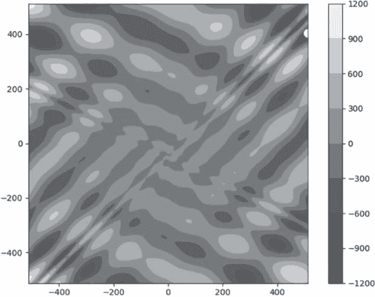

图 8-9：Eggholder 函数的等高线图

在这种情况下，全局解实际上位于图 8-10 中决策空间的右侧边界。灰度条显示，较暗的区域为谷底，较亮的区域为山峰。显然，在许多情况下，适应度值接近全局最小值（根据阴影的深浅）。这就是为什么在 Eggholder 函数中如此难以找到全局最小值的原因。

图 8-10 展示了这个问题的收敛模式。适应度值随着代数（迭代次数）的增加而逐步改善，直到达到全局最小值。

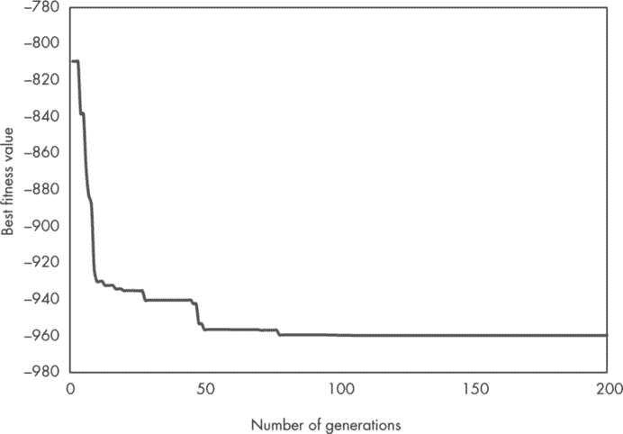

图 8-10：使用遗传算法求解 Eggholder 函数的收敛模式

我们将在下一章使用粒子群优化（另一种 NIA）重新解决这个问题，并绘制相应的收敛模式。你将看到，虽然两种方法都能找到全局最优解，但粒子群优化会更快完成这一过程！

### 遗传算法的停止条件

在解决现实世界的优化问题时，我们通常无法获得全局最优解。因此，我们不能直接使用它作为停止条件。为了解决这个挑战，我们可以采用几种策略。在本节中，我将讨论在遗传算法中常用的停止条件定义方法。

首先，停止条件可以设置为最大代数，就像我们在所有三个遗传算法项目中所做的那样。通常情况下，你无法知道解决一个之前未解决的问题可能需要多少次迭代。这将取决于问题的性质、全局参数值以及各种操作符函数所使用的特定方案。你需要逐步调整迭代次数（以及其他参数），以找到适合当前问题的参数组合。有趣的是，我们可以使用遗传算法来找到全局参数的最佳组合。在深度学习领域，遗传算法已经被用来优化全局参数，并快速训练出能够产生高质量结果的神经网络。

第二，如果最佳解的适应度在几代内没有显著改善（例如，在过去的 30 或 50 代中几乎没有改善），你可以停止算法的迭代。这将需要额外的编码来动态跟踪改进，但这可以成为一种让算法自动停止的策略，即使最大迭代次数未达到。

第三，对于某些类型的问题，你可以为适应度设置一个目标，当达到该目标时程序终止（回想一下我们在第一个项目中有一个文本匹配目标）。当目标难以达成时，你还可以在达到该目标的预定百分比时终止程序（而不是精确匹配目标）。

关于遗传算法还有很多可以讨论的内容，研究人员经常开发新的自适应或混合策略，并发现新的应用。如果你对前沿技术感兴趣，我建议你查阅近期的期刊文章，了解遗传算法在你感兴趣领域的应用。

在项目 35 中，我们修改了用于函数最大化的代码，以处理一个最小化问题。然而，代码的来回修改容易导致错误。因此，在下一个练习中，你将开发新的代码，直接处理函数最小化问题。 ### 总结

在本章中，你探讨了自然启发式算法的迷人世界，这些计算方法模仿自然现象来解决复杂问题。此类算法的一个关键特点是它们具有随机性：它们利用内建的随机性来处理那些常规方法难以解决或过于复杂的问题。你了解了使用自然启发式算法的优势和挑战，并重点讨论了最受欢迎且最强大的例子之一：遗传算法。

遗传算法受到自然进化过程的启发，使用一组候选解，通过选择、交叉和变异来找到给定问题的最佳解。你学习了几种实现这些操作的方法，并调整算法的参数以获得最佳性能。你还将遗传算法应用于三个不同的项目，以：

+   从一个随机字符种群中生成目标字符串

+   在有限容量的背包中最大化物品的价值

+   为一个实值且高度复杂的多变量目标函数找到全局最优解

此外，你完成了一组涵盖交叉操作的附加技术和解决最小化问题的专门方法的练习。到本章结束时，你对遗传算法的理论和实践有了坚实的理解，并掌握了如何使用它们来解决各种类型的优化问题。

### 资源

Brownlee, Jason. *《聪明的算法：自然启发的编程技巧》*. 电子版, 2012 年 6 月 16 日. *[`github.com/clever-algorithms/CleverAlgorithms`](https://github.com/clever-algorithms/CleverAlgorithms)*.

Buontempo, Frances. *《遗传算法与程序员的机器学习》*. Raleigh, NC: The Pragmatic Bookshelf, 2019.

Gen, Mitsuo, 和 Runwei Cheng. *《遗传算法与工程优化》*. New York: John Wiley & Sons, 2000.

Goldberg, David. *《搜索、优化与机器学习中的遗传算法》*. Reading, MA: Addison-Wesley Professional, 1989.

Haupt, Randy L., 和 Sue Ellen Haupt. *《实用遗传算法》*. 第二版. Hoboken, NJ: John Wiley & Sons, 2004.

Yang, Xin-She. *《自然启发的优化算法》*. 第二版. London: Academic Press, 2021.
