## 第九章：9 基于智能体的算法


在本章中，我们将继续探讨 NIAs，重点介绍两种基于社会动物集体行为的算法：粒子群优化算法和蚁群系统。这些算法设计用于基于智能体的模型，其中一群简单的智能体协作并与周围环境互动，从而创造出对整个群体有益的结果。

我们将解释这些算法背后的关键概念和原理，并通过伪代码实现它们。我们还将通过开发两个 Kotlin 应用来测试这些算法，以解决现实世界的问题。第一个是函数最小化问题，它使用粒子群优化算法找到给定函数的全局最小值。第二个是旅行商问题，它使用蚁群系统寻找连接多个城市的最短路径。

### 粒子群优化概述

粒子群优化（PSO）算法已被广泛用于解决各种优化问题。PSO 与遗传算法有一些相似之处。两者都涉及到一个种群（染色体或粒子），其成员共同寻找最佳解，直到满足停止条件。两者也都是随机算法，并依赖于具有内在随机性的过程。

相似之处到此为止。与遗传算法不同，PSO 算法不依赖于遗传算子，如选择、交叉和变异。相反，它是由自主智能体驱动的，智能体根据当前位置、历史位置以及群体识别出的最佳位置更新它们在决策空间中的位置。PSO 算法通过不断朝更好的解推进，进行有意识的努力，这与遗传算法中被动选择驱动的染色体升级截然不同。个体染色体没有感知其周围环境或做出决策来更新其组成的能力，而 PSO 中的粒子却具备这种能力。此外，PSO 在概念上更简单，更容易实现，涉及的参数较少，并且相比遗传算法，通常能更快地收敛到全局最优解。

PSO 算法的核心包含三个关键步骤：

1.  初始化粒子的位置信息和速度。

2.  按照时间步长推进，并根据当前速度、最优个体位置和当前时刻由群体识别出的全局最优位置更新粒子的速度。

3.  通过移动到更好的位置来更新当前位置。

这些步骤会重复执行若干次，或者直到满足停止条件。

设***x***i⁰和***v***i⁰分别为在时间*t* = 0 时的位置和速度向量，其中*i* ∈ **I**表示群体中第*i*个粒子，群体的大小为 N（**I** = [1, 2, . . . , N]）。另外，设***x***max 和***x***min 分别为位置向量的上界和下界，*r*为从均匀分布中选择的介于 0 和 1 之间的随机值。

PSO 的第一步是初始化位置和速度向量，如方程式 9.1 和 9.2 所示。

$Equation$ (9.1)$Equation$ (9.2) 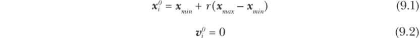

在方程 9.2 中，出于本章的目的，我们将初始速度设置为零。另一种选择是将其设置为小的随机值。在大多数情况下，群体会迅速摆脱随机分配的初始位置，且只要速度的大小保持在决策空间内，初始速度的选择对收敛速率不会产生显著影响。

PSO 的第二步是通过使用以下方程来更新粒子的速度向量$Equation$ 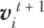：

$Equation$ (9.3) 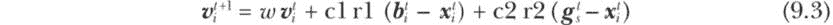

方程 9.3 中的变量和参数代表以下含义：

*w*            惯性因子

c1            粒子记忆/认知因子

c2            群体记忆/社会因子

r1, r2       从均匀分布中选择的介于 0 和 1 之间的随机值

$Equation$ 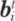            粒子*i*在时间*t*之前找到的最佳位置向量

$Equation$ 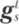            群体在时间*t*之前找到的最佳位置向量

$Equation$ 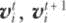 粒子*i*在时间*t*和*t* + 1 时的速度向量

$Equation$ 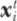            粒子*i*在时间*t*的当前位置向量

图 9-1 提供了方程 9.3 的视觉和更直观的解释。

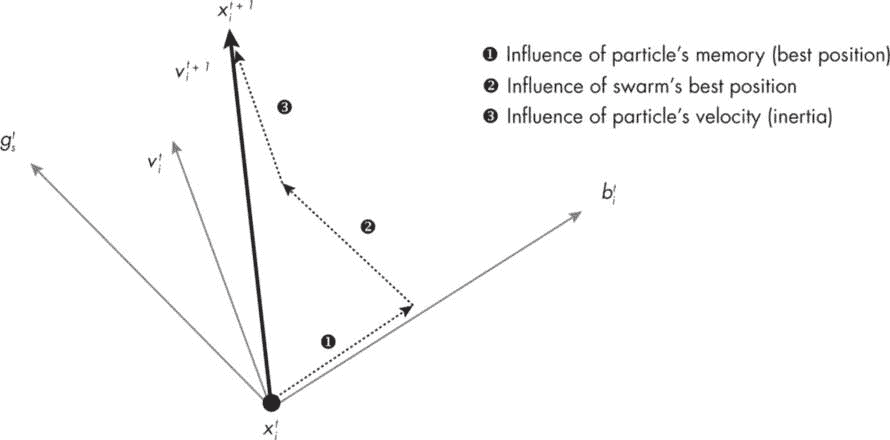

图 9-1：更新速度策略在 PSO 中的图示表示

让我们考虑一个任意粒子 *i*，其当前的位置为 $方程$ 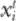（为了简化，我们考虑一个一维问题）。由于惯性，粒子会倾向于朝着当前速度的方向运动，$方程$ 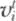。然而，PSO 依赖于从粒子级别和群体级别的最佳解中学习—$方程$ 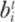 和 $方程$ 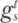。因此，粒子通过稍微朝着 $方程$ 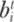 ❶ 移动，然后朝着 $方程$ 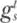 ❷ 移动，同时朝着它自己的速度 $方程$  ❸ 移动。图 9-1 显示了这些所有运动的结果，如 $方程$ 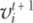 所示。方程 9.3 用符号表示了这些在多个维度上的运动，并结合了分配给这些组件的相对权重。

惯性因子 *w* 通常赋值在 0 到 1 之间，其中 0 表示 $方程$ 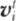 对 $方程$ 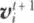 没有影响，而 1 表示完全影响。也可以随着时间的推移调整 *w* 的值，这可能会导致更好的收敛性能。此方案通过将 *w* 初始设置为 ≥ 1，并按方程 9.4 逐渐减小来实现。

$方程$ (9.4) 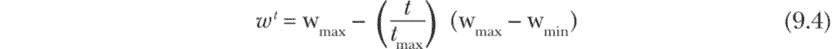

方程 9.3 中的 c1 和 c2 系数也被称为*加速度系数*。与随机变量 r1 和 r2 一起，这些系数决定了粒子最佳位置和群体最佳位置对粒子更新速度的影响程度。

从方程 9.3 可以看出，当 c1 和 c2 都为 0 时，粒子将保持恒定速度运动，直到撞击决策空间的边界。如果 c1 > 0 且 c2 = 0，粒子将表现得像是独立的（没有从群体中获取信息）。当 c1 = 0 且 c2 > 0 时，整个群体将朝着迄今为止共同找到的最佳位置移动。

虽然这些参数的最优值可能与具体问题相关，但文献中常用的 c1 和 c2 的值通常在 0.5 到 2.5 之间。通常做法是将 c1 设置为等于 c2，并确保这两个值相对较小，以便能够充分探索决策空间，而不至于造成*速度爆炸*，即速度过大，导致在决策空间中大幅跳跃。为了避免这种情况，粒子 *i* 在第 *j* 维度上的速度上限设置如下（适用于所有时间步）：

$方程$ (9.5) 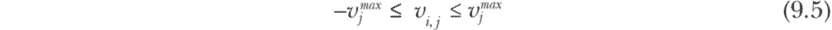

其中

$方程$ (9.6) 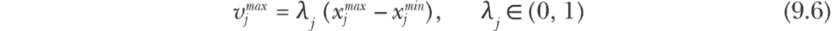

PSO 的最后一步是更新粒子 *i* 在下一个时间步 *t* + 1 的位置向量，如下所示：

$方程$ (9.7) 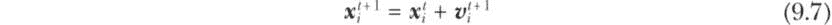

与速度一样，更新后的位移向量也必须与决策变量的指定边界进行比较。

### 实现 PSO 进行函数最小化

我们可以使用 PSO 算法来最大化或最小化一个函数。在本章中，我们将应用 PSO 进行函数最小化。因此，当我们使用此实现来最小化一个多变量函数时，我们无需像在第八章中进行函数最小化时那样将目标函数值乘以-1。

与本书中介绍的其他算法不同，PSO 算法涉及更多互相关联的步骤，这使得在没有对整个过程的透彻了解的情况下理解和编码算法变得困难。为了解决这个问题，我将提供一个概述整个过程的伪代码，以指导我们进行实际代码开发。*伪代码*是算法或计算机程序的高级描述。它采用接近编程语言结构的自然语言编写，但并不是为了在计算机上执行。它允许程序员在不被特定编程语言细节困扰的情况下规划和沟通程序的逻辑。

下面是 PSO 算法的伪代码。请注意，我们使用粗体标记了循环和条件块的开始和结束，并强调了代码段执行的特定任务。

```
Initialize swarm:
**for i** = 0 .. < swarm size
        **for j** = 0 .. < number of dimensions
                **initialize** position to random values per Equation 9.1
                **initialize** velocity to 0 per Equation 9.2
        **end for**
        **create** pBest[i] (with same position and fitness)
        **create** swarm[i]
        **if** fitness(swarm[i]) < fitness(gBest)
                update gBest
        **end if**
**end for**

Iterate over a preset number of time steps:
**for time step** = 0 .. < tmax
        **update** w per Equation 9.4
        **for i** = 0 .. < swarm size
                **for j** = 0 .. < number of dimensions
                        **update** velocity per Equation 9.3
                        **check** velocity within bounds per Equation 9.5
                        **update** position per Equation 9.7
                        **check** position within bounds
                **end for**
                **update** fitness of swarm[i]
                **if** fitness(swarm[i]) < fitness(pBest[i])
                        **update** pBest[i]
                **end if**
                **if** fitness(swarm[i]) < fitness(gBest)
                        **update** gBest
                **end if**
        **end for**
**end for**
```

在下一项目中，我们将在开发实现 PSO 算法的代码时严格按照这个伪代码进行。

项目 36：使用粒子群优化多变量函数

对于本项目，我们将重新审视在第八章中定义的 Eggholder 函数优化问题，这次我们将使用 PSO 算法来解决它，而不是使用遗传算法。

#### 代码

我们将按照先前提供的伪代码开发 PSO 算法的代码，并在四个部分中讨论其实现：问题定义与全局参数、初始化粒子群、runPSO()驱动函数和 main()函数。

##### 问题定义与全局参数

这一部分由一个导入块、一个类集合、全局变量和参数、以及用于保存粒子状态和最佳解的列表组成。

```
import kotlin.math.sin
import kotlin.math.pow
import kotlin.math.abs
import kotlin.math.sqrt
import kotlin.math.min
import kotlin.math.max

❶ data class Solution(
    var pos: DoubleArray,
    var fitness: Double
)

❷ data class Particle(
    val id: Int,
    val pos: DoubleArray,
    val vel: DoubleArray,
    var fitness: Double,
    val pBest: Solution
)

// problem definition
❸ val getFitness = ::eggHolder
val nDim = 2    // number of variables in the cost function
val xBbounds = arrayOf(doubleArrayOf(-512.0, 512.0),
                       doubleArrayOf(-512.0, 512.0))
val xRange = doubleArrayOf(xBbounds[0][1] - xBbounds[0][0],
                           xBbounds[1][1] - xBbounds[1][0])
val lambda = 0.5
val vMax = doubleArrayOf(lambda*xRange[0], lambda*xRange[1])

// global parameters
val TMAX = 50
val SWARMSIZE = 30
val wmax = 1.2
val wmin = 0.5
val wt = (wmax - wmin)/TMAX
var w = wmax
val c1 = 2.0       // cognitive coefficient
val c2 = 2.0       // social coefficient

// global objects and collections
val swarm = mutableListOf<Particle>()
val BestSolution = Solution(doubleArrayOf(0.0, 0.0), Double.MAX_VALUE)
```

代码片段中的第一块导入了多个来自标准 Kotlin 库的数学函数。接下来的两块定义了用于本项目的数据类。Solution()类用于存储粒子最优解和粒子群最优解 ❶。Particle()类是用于创建粒子群的主要类 ❷。每个粒子都有一个标识符（id），位置和速度向量（pos 和 vel），一个适应度属性，以及一个 Solution 属性。后者用于存储粒子在某一时刻识别出的最佳解的信息。

下一个代码块定义了 eggHolder 函数❸及其在 nDim 中的维度（对于 EggHolder 函数，nDim 等于 2）。它还定义了 pos 和 vel 的边界和范围，然后根据公式 9.5 定义了 vMax，以确保更新后的速度保持在设定的边界内。

最后的代码块定义了 PSO 特定的全局参数。目前，最大时间步数（迭代次数）设置为 50，群体大小设置为 30。我们还将根据公式 9.4 动态调整惯性因子*w*，其中 wmax 和 wmin 分别设置为 1.2 和 0.5。认知因子和社会因子 c1 和 c2 已设置为 2.0。这些参数值是根据相关文献中的推荐值选择的。

代码块的结尾创建了一个可变列表（swarm）并初始化了 BestSolution，我们将用它来存储群体最佳解。由于我们将问题框定为一个最小化问题，因此 BestSolution 的适应度值已被设置为 Double.MAX_VALUE，这是 Double 类型的最大可能值。

##### 初始化群体

initSwarm()函数负责通过创建和初始化个体粒子并将其添加到粒子集合（群体）中，从而初始化 PSO 算法。

```
fun initSwarm() {
    println("\nStarting initialization...")

  ❶ for (i in 0 until SWARMSIZE) {
        // Define local objects.
        val pos = DoubleArray(nDim)
        val vel = DoubleArray(nDim)
        val fitness: Double
        val pBest: Solution

 // Set initial positions (random, within bounds).
      ❷ for (j in 0 until nDim) {
            pos[j] = xBbounds[j][0] + (xBbounds[j][1] - xBbounds[j][0]) *
                         (0..1000).random() / 1000.0
            vel[j] = 0.0
        }

       // Add new particles to the swarm.
      ❸ fitness = getFitness(pos)
        pBest = Solution(pos.copyOf(), fitness)
      ❹ swarm += Particle(i, pos, vel, fitness, pBest)

        // Update BestSolution.
      ❺ if (fitness < BestSolution.fitness) {
            BestSolution.pos = pos.copyOf()
            BestSolution.fitness = fitness
        }
    }
    println("\nBest solution after initialization:")
    println(BestSolution.toString())
}
```

函数开始时打印一条消息，表示初始化过程的开始。然后，它使用 for 循环迭代指定的群体大小（SWARMSIZE）❶，为每个粒子创建具有预定义维度边界的随机初始位置❷。每个粒子的初始速度根据公式 9.2 设置为零。

getFitness 函数使我们能够计算每个粒子的适应度值❸。注意，在初始化过程中，个人最佳适应度与当前适应度相同，这意味着 pBest 最初与粒子的当前位置和适应度相同。这些粒子由标识号（id）、位置（pos）和速度（vel）向量、适应度值（fitness）以及个人最佳解（pBest）来表征。我们使用这些属性来创建粒子并将它们添加到群体中❹。

如果某个粒子的适应度比当前最佳适应度更好，则整个群体中的最佳解会被更新❺。初始化后，函数会打印出最佳解。

##### 驱动函数

runPSO()驱动函数的代码块执行 PSO 的所有核心任务，包括更新速度和位置向量，并跟踪个人和群体的最佳解。

```
fun runPSO() {
  ❶ for (timeStep in 0 until TMAX) {
        // Update inertia factor as a function of time.
        val w = wmax - timeStep * wt

        // random coefficients for cognitive and social components
        val r1 = (0..100).random()/100.0
        val r2 = (0..100).random()/100.0

 // Iterate over each particle of the swarm.
      ❷ for (i in swarm.indices) {
            // Update velocity and position vectors.
            for (j in 0 until nDim) {
                // Update velocity vector, and implement bounds.
                val C1 = w * swarm[i].vel[j]
                val C2 = c1 * r1 * (swarm[i].pBest.pos[j]-swarm[i].pos[j])
                val C3 = c2 * r2 * (BestSolution.pos[j] - swarm[i].pos[j])
                val vel = C1 + C2 + C3

                // Implement velocity bounds.
                swarm[i].vel[j] = min(max(vel, -vMax[j]), vMax[j])

                // Update position vector, and implement bounds.
                swarm[i].pos[j] += swarm[i].vel[j]
                swarm[i].pos[j] =
                     min(max(swarm[i].pos[j], xBbounds[j][0]), xBbounds[j][1])
            }

            // Evaluate particle fitness.
          ❸ swarm[i].fitness = getFitness(swarm[i].pos)

            // Update the particle's best solution (pBest).
          ❹ if (swarm[i].fitness < swarm[i].pBest.fitness) {
                swarm[i].pBest.pos = swarm[i].pos.copyOf()
                swarm[i].pBest.fitness = swarm[i].fitness
            }

            // Update the global best solution.
          ❺ if (swarm[i].fitness < BestSolution.fitness) {
                BestSolution.pos = swarm[i].pos.copyOf()
                BestSolution.fitness = swarm[i].fitness
            }
        }
    }
}
```

与实现遗传算法的 runGA()函数不同，runPSO()函数是自给自足的，除了 getFitness()函数外，不依赖任何其他辅助函数，getFitness()仅用于计算被最小化的函数值。它会迭代固定的时间步数（TMAX）❶，每次迭代开始时，初始化惯性因子（w）以及随机因子 r1 和 r2。

对于每个时间步，代码遍历群体中的每个粒子❷，并根据 PSO 公式更新其速度和位置向量。代码还实现了速度和位置值的边界，使用数组 vMax 和 xBbounds 中定义的最小值和最大值。

代码通过使用 getFitness()函数❸来评估每个粒子的适应度，该函数以位置向量作为输入，并返回相应的适应度标量值。

然后，代码将每个粒子的当前适应度与其个人最佳适应度（pBest）进行比较，如果当前适应度较低，则更新后者❹。它还将当前适应度与全局最佳适应度（BestSolution）进行比较，如果当前适应度较低，则更新后者❺。个人和全局最佳解都存储位置和适应度值。

该函数在完成 TMAX 次迭代后终止。它不返回任何值，因为最佳整体解作为全局对象 BestSolution 保存。

##### main()函数

这个函数是一个简短的代码块，打印关键全局参数的值，调用其他函数初始化群体并运行 PSO 驱动函数，并打印找到的最佳解。

```
fun main() {
    println("\n*** Real-valued function optimization using PSO ***\n")
    println("Function dimensions: $nDim")
    println("Swarm size: $SWARMSIZE, Max time steps: $TMAX")
    println("w_max: $wmax  w_min: $wmin")
    println("Cognitive factor (c1): $c1")
    println("Social factor (c2): $c2")

    // Initialize the swarm.
    initSwarm()
    // Run PSO algorithm.
    runPSO()

    // Print final results.
    println("\nBest solution after $TMAX iterations:")
    println(BestSolution.toString())
}
```

main()函数是程序的入口点，使用 PSO 执行实值函数优化。它会打印一些关于问题参数的信息，如函数维度、群体大小、最大时间步数和 PSO 系数。

该函数随后调用两个其他函数，initSwarm()和 runPSO()。第一个函数初始化粒子群，赋予随机的位置和速度，并评估它们的初始适应度值。第二个函数在固定的迭代次数内运行 PSO 算法，更新粒子的速度、位置和适应度值，以及个人和全局最佳解。

main()函数最终打印出 PSO 算法在指定迭代次数后找到的最佳解，显示全局最佳解的位置向量和适应度值。

#### 结果

我故意保持 PSO 程序的输出简洁明了。现在，你应该已经能够编写自己的额外代码行，用于打印或保存其他中间结果，以便进一步分析或可视化。如果你使用与本示例中相同的参数运行代码，输出可能如下所示：

```
*** Real-valued function optimization using PSO ***

Function dimensions: 2
Swarm size: 30, Max time steps: 50
w_max: 1.2  w_min: 0.5
Cognitive factor (c1): 2.0
Social factor (c2): 2.0

Starting initialization...

BestSolution after initialization:
Solution(pos=[-429.056, 374.784], fitness=-742.3993203916232)

BestSolution after 50 iterations:
Solution(pos=[512.0, 404.2263191597745], fitness=-959.640628508424)
```

输出的第一部分显示了关键全局参数的值。接下来，显示了迭代开始和结束时的最佳解。PSO 算法在给定的决策空间内为 Eggholder 函数实现了近似最优解，这一结果与在第八章中通过遗传算法获得的结果相匹配。

图 9-2 显示了 PSO 算法在应用于 Eggholder 函数时随时间变化的收敛行为。与第八章中讨论的遗传算法不同，PSO 能够更快速地达到最优解，所需的迭代次数更少。

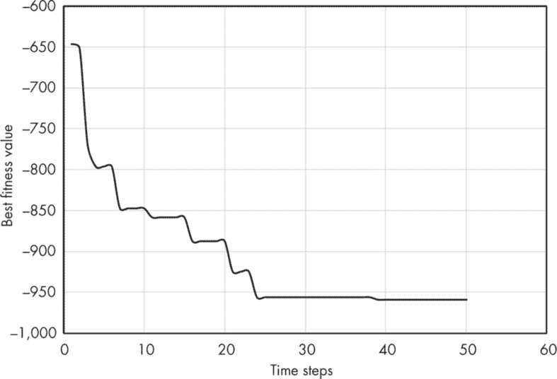

图 9-2：使用粒子群算法对 Eggholder 函数的收敛模式

PSO 在这个问题上似乎比遗传算法更具优势。尽管 PSO 算法的初始全局最佳适应度值约为-742，相比之下，遗传算法为-810，但它在大约 40 次迭代后达到了全局最优解，而遗传算法则需要 117 次迭代。这表明，PSO 算法能够比遗传算法更高效地探索和利用搜索空间，特别是在求解 Eggholder 函数时。这种高效性可能源自 PSO 通过粒子间的协作交互来探索解空间的独特方法。

我鼓励你使用这段代码来解决其他已知的测试问题，并进一步研究 PSO 算法与遗传算法的表现对比。

### 蚁群优化

蚁群优化（ACO）指的是一类基于真实蚂蚁行为，尤其是觅食行为的启发式算法。最初的算法，称为蚁群系统（AS），由 Marco Dorigo 于 1992 年提出。从那时起，该算法经过多次修改，以帮助其更有效地解决需要在加权图的所有节点之间寻找最小成本路径的问题。在离散数学中，图是由一组相关节点或顶点组成的，而连接一对节点的虚拟或实际线条称为*边*。（你可以回顾第七章，了解图和传统的图搜索算法。）

为了演示 ACO 的基本概念，让我们回顾一下图 9-3 中蚂蚁探索最佳食物路径的简单示意图。

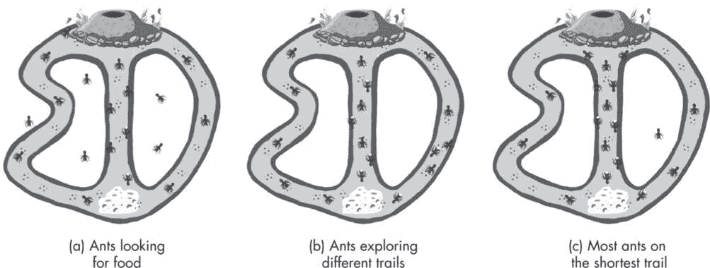

图 9-3：蚂蚁探索通向食物源的不同路径

当蚂蚁开始寻找食物源时，它们最初会随机分散向各个方向，如图 9-3(a)所示。它们在移动时会留下气味（信息素）来标记它们的路径。一旦蚂蚁找到食物源，它会捡起一块食物并沿着气味标记带回巢穴。在返回巢穴的过程中，它还会留下更多的信息素。

与此同时，其他蚂蚁注意到这条轨迹。给定多个源，每条轨迹将发展出不同强度的气味标记，这取决于有多少蚂蚁在这条轨迹上来回穿梭，以及源与巢穴的距离有多远。通常情况下，轨迹的气味标记越强，跟随该轨迹的蚂蚁数量就越多。一旦找到食物源，蚂蚁便会沿着最明确的轨迹前进，如图 9-3(b)所示。

关键在于，信息素不是永久的——它们会随着时间的推移而衰减或蒸发。如果一条轨迹不经常被访问，它会逐渐变得不那么显眼，最终被遗忘。此外，离得最近的食物源所需的访问时间最少，这意味着相应的轨迹将被更频繁地走过，从而导致信息素浓度更强——这将创造出一个正反馈循环，吸引更多的蚂蚁选择最短的路径。随着时间的推移，大多数蚂蚁将开始使用这条最短的路径（最优路径），如图 9-3(c)所示。蚁群通过一个非常简单的规则解决了一个非常复杂的组合优化问题！

在这个巧妙的自然方案中，个体代理（蚂蚁）并不了解它们的行动对整个蚁群的影响。然而，通过不断重复它们的简单日常行为，它们使蚁群能够以一种类似于中央协调的方式高效地寻找食物源。

#### ACS 算法

基于前一节中提出的概念模型，我们可以设想 ACO 的关键组成部分是：创建一个人工蚂蚁群体，根据信息素浓度和节点之间的距离，将蚂蚁从一个节点移动到另一个节点，并不断更新信息素轨迹，直到找到最短路径。

在本章中，我们将探讨一种增强版的蚁群优化算法，称为蚁群系统（ACS）。ACS 算法通过三个关键步骤实现：构建路径、更新局部信息素轨迹和更新全局信息素轨迹。我们将很快详细讨论这每一个步骤。

我们将使用 ACS 算法来解决一个特定的旅行商问题（TSP），它属于一类难以解决的问题，称为 NP 难问题。从数学角度讲，一个问题是*NP 难*的，如果它至少和 NP 中最难的问题一样难，NP 类问题的解决方案可以在多项式时间内验证。讨论 NP 难问题超出了本书的范围；我们将专注于如何使用 ACS 来解决 TSP。

解决 TSP 问题意味着要回答以下问题：

> 给定一组节点和每一对节点之间的距离，旅行者经过每个节点一次且仅一次，最终返回起始节点，最短的可能路径是什么？

换句话说，我们在寻找一个封闭路径解，它经过每个节点，并且具有最短的可能长度。请注意，从理论上讲，多个路径可能具有相同的最短旅行长度。

我们将对我们尝试解决的 TSP 问题做出两个额外的假设：

+   网络节点（图）是完全连接的，这意味着旅行者可以从任意特定节点访问所有其他剩余节点（在实现过程中，我们将排除已经访问过的节点）。

+   任意一对节点之间的距离是对称的，这意味着距离与旅行方向无关（一对节点通过一条唯一的路径—即一条边—连接）。

#### 符号及其含义

ACS 是一个相当复杂的算法，具有许多参数和变量，列在表 9-1 中，并附有用于表示它们的符号。

表 9-1：ACS 算法中使用的符号

| 符号 | 解释 |
| --- | --- |
| 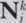 | 蚂蚁 k 在节点 i 时的邻域；它是一组蚂蚁在当前位置允许访问的节点。 |
| τij | 连接节点 i 和节点 j 的边[i, j]的信息素强度。 |
| τ0 | 所有边的初始信息素水平，设置为 1/(nCnn)；n 是最近邻路径中的节点总数，Cnn 是路径长度。 |
| dij | 从节点 i 到节点 j 的边的长度（这两个节点之间的距离）。同时，dij = dji。 |
| ηij | 启发式信息，定义为 1/dij。 |
| α | 参数，ACS 中设置为 1。 |
| ß | 参数[2.0–5.0]，用于η的指数。 |
| q | 在[0, 1]区间内均匀分布的随机变量。 |
| q0 | 范围在(0, 1)之间的参数；当 q ≤ q0 时，蚂蚁基于信息素轨迹的强度和启发式进行知识探索。 |
| pij | 在轮盘选择中，若 q > q0 时，选择边[i, j]的标准化概率。 |
| ζ | 参数，设置为如 0.005 这样的小值；用于更新局部信息素轨迹的加权因子。 |
| ρ | 参数，ACS 中设置为推荐值 0.1；用于更新最优全局信息素轨迹的加权因子。 |
| Cnn | 用于估算初始信息素浓度的最近邻路径的路径长度。 |
| Cbs | 目前为止最优解或路径的路径长度。 |
| T bs | 目前为止最优的路径（构成路径的边集合）。 |

除了列出参数和变量，表 9-1 还提供了这些元素的简短描述。（在阅读本节其余部分时，您可能需要回过头来查看这些描述。）

#### ACS 的步骤

在本节中，我们将探索 ACS 算法的关键步骤，以数学形式表达。这将包括三个步骤：路径构建、更新局部信息素轨迹，以及更新全局信息素轨迹。

##### 步骤 1：路径构建

ACS 的第一步是应用一个伪随机比例规则，蚂蚁根据当前的位置 *i* 来选择它的下一个位置 *j*，该规则在公式 9.8 中定义。

$公式$ (9.8) 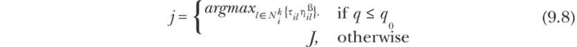

公式 9.8 中的 *argmax* 函数从可以从节点 *i* 访问的可行节点集合中选择一个参数 *l*，使得大括号内的表达式最大化。当 *q* ≤ *q*[0] 时，这个 *l* 的值被设置为 *j*，作为蚂蚁的下一个目标。参数 *q*[0] 允许我们控制已学习的知识（信息素轨迹和启发式）与对新路径的随机探索之间的优先级。

当 *q* > *q*[0] 时，下一个节点 *j* 将设置为 *J*，它是通过轮盘赌选择法随机选择的变量。公式 9.9 估计了蚂蚁 *k* 从节点 *i* 到节点 *j* 的可行路径的标准化概率：

$公式$ (9.9) 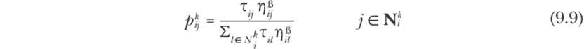

如需回顾轮盘赌选择法，请查阅 第 312 页中的“选择”部分，在第八章中。此次，我们将在最终的编码项目中实现该方案。

##### 步骤 2：更新局部信息素轨迹

一旦蚂蚁从节点 *i* 移动到节点 *j*，公式 9.10 中的加权平均方案将被应用于更新局部信息素轨迹。

$公式$ (9.10) 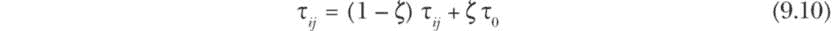

在原始的 ACO 中，不进行局部更新，这使得可以按顺序或并行地构建路径。当路径并行构建时（即并行处理），可以为大规模的实际问题带来显著的计算时间节省。由于 ACS 的局部更新规则，意味着该过程将按顺序执行。这是因为特定蚂蚁所创建的路径会受到前面蚂蚁对信息素轨迹的局部更新的影响。

##### 步骤 3：更新全局信息素轨迹

一旦所有蚂蚁完成了它们的路径构建，全球信息素更新规则将在每次迭代时应用，并且仅沿着当前最佳路径*T*^(bs)的边缘进行，如公式 9.11 所示。

$公式$ (9.11) 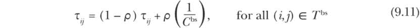

公式 9.11 表示，在每次迭代结束时，*T*^(bs) 需要与蚁群识别的最佳解进行比较，并根据需要进行更新。

##### 伪代码

以下伪代码展示了 ACS 算法的各个组件如何结合在一起，形成一个复杂的启发式算法：

```
// preprocessing - read and initialize
**read** nodes from file (name, number, coordinates)
**calculate** edge lengths (Euclidian distance)
**calculate** nearest-neighbor tour length (Cnn)
**initialize** pheromone levels to τ0 = 1/(nCnn)

// Iteratively apply ACS steps.
**while** stopping condition not met:
        **initialize** ants (assign id numbers and initial positions)
        **for ant** = 0 .. < number of ants
                **set** cities to visit for each ant
                **while number** of cities to visit > 0:
                        **construct tour** per Equation 9.8 & Equation 9.9
                        **perform** local pheromone update per Equation 9.10
                **end while**
                // Complete the loop.
                **return** to the start node
                **update** ant properties
                **perform** local pheromone update per Equation 9.10
        **end for**
        **update** best-so-far solution
        **perform** global pheromone update per Equation 9.11
**end while**

// postprocessing
**print** results
```

我们将在下一个项目中按照此伪代码使用 Kotlin 开发一个完整的 ACS 应用程序。

项目 37：使用蚁群系统解决旅行商问题

在本项目中，我们将解决著名的测试问题 Berlin52。这个问题是一个组合优化问题，旨在找到穿越德国柏林 52 个目的地的最短路径。此问题的数据集来自 TSPLIB，它是一个包含已知全局最优解的旅行商问题集合。有关这些问题的下载链接，请参见 第 377 页 的“资源”部分，你可以尝试使用 ACS 算法和本书中讨论的其他 NIA 来解决它们。

#### 代码

Berlin52 TSP 需要 52 个不同位置的数据集。为了方便起见，可以为本项目创建一个单独的数据文件（例如，CSV 格式的文件），并在运行时从文件中读取位置数据。因此，我们将在本项目中采用这种方法。

我们将讨论代码段的四个主要模块：问题定义和全局参数，main() 模块，runACS() 驱动函数及其辅助函数，以及额外的中间处理和结果后处理。

##### 问题定义和全局声明

这一部分指定了导入模块，并定义了输入文件的位置、全局变量和参数，以及实现 ASC 算法所需的类、列表和数组集合。

```
// import block
import java.io.File
import kotlin.math.pow
import kotlin.math.sqrt

// Input file location: change the datafile location as needed.
❶ const val datafile = "`berlin52.csv`"

❷ // global parameters

val numCities = 52     // Set the number of cities.
val numAnts = 30       // Typically set to 10-30.
val rho = 0.1          // rho = 0.1 is recommended for ACS.
var pheromone0 = 0.0   // 1/(n*Cnn) for ACS
val q0 = 0.8           // argmax parameter (0.5-0.9)
val zeta = 0.005       // Set to a small value.
val alpha = 1.0        // alpha = 1 for ACS.
val beta = 2.0         // Set to 2-5.
val iterMax = 300      // maximum number of iterations
val maxRounds = 50     // number of times the entire process is repeated

❸ // classes and collections

data class City(
    val name: String,
    val node: Int,
    val x: Double,
    val y:Double
)

class Ant(val id: Int, val start: Int) {

    var currentNode = start

    val citiesToVisit = mutableListOf<Int>()
    val pathNodes = ArrayList<Pair<Int, Int>>()
    val pathSegments = mutableListOf<Double>()

    // Set fitness to a very high value for function minimization.
    var fitness = Double.POSITIVE_INFINITY

    fun setCitiesToVisit() {
        for (i in 0 until numCities) {
            if (i != this.start)
                this.citiesToVisit += i
        }
    }
}

data class ArgMax(
    val index: Int,
    val value: Double
)

data class Solution(
    val iteration: Int,
    val antID: Int,
    val pathNodes: ArrayList<Pair<Int, Int>>,
    val segments: List<Double>,
    val fitness: Double
)

val cities = mutableListOf<City>()
val ants = mutableListOf<Ant>()
val antSolutions  = mutableListOf<Solution>()
val bestSolutions = mutableListOf<Solution>()

val edges = Array(numCities) {DoubleArray(numCities)}
val pheromone = Array(numCities) {DoubleArray(numCities)}
val prob = Array(numCities) {DoubleArray(numCities)}
var bestOverallTour = ArrayList<Pair<Int, Int>>()

var bestOverallFitness = Double.POSITIVE_INFINITY
var optimaCount = 0
```

代码段首先从标准 Kotlin 和 Java 库中导入所需的方法。我们将使用 java.io.File 从指定位置读取输入文件中的数据（在这种情况下，从 *berlin52.csv* 读取）❶。（你使用的输入文件可能位于不同位置，因此你需要根据需要更改输入文件的位置。）

Berlin52 TSP 的输入文件遵循一套固定格式。初始行中的第一个值包含一个简短的标题，用于描述问题，而后续的值则作为数据点的列标题。从第二行到最后一行，每行包含四个逗号分隔的值（因此文件扩展名为 *.csv*）：城市名称、城市编号、x 坐标和 y 坐标。每行包含一个特定城市或位置的数据。

在这种情况下，数据文件包含 53 行，其中包括提供描述信息的引导行。表 9-2 显示了当你使用 Microsoft Excel 或其他电子表格程序打开该文件时的样子。

表 9-2：Berlin52 TSP 输入文件格式

| Berlin52 | ID | X | Y |
| --- | --- | --- | --- |
| C1 | 0 | 565 | 575 |
| C2 | 1 | 25 | 185 |
| C3 | 2 | 345 | 750 |
| C4 | 3 | 945 | 685 |
| C5 | 4 | 845 | 655 |
| C6 | 5 | 880 | 660 |
| ... | ... | ... | ... |
| C50 | 49 | 595 | 360 |
| C51 | 50 | 1340 | 725 |
| C52 | 51 | 1740 | 245 |

下一个代码块声明了所有的全局参数 ❷。例如，城市数（numCities）设置为 52，蚂蚁数（numAnts）设置为 30，每轮最大迭代次数（iterMax）设置为 300，整个过程重复次数（maxRounds）设置为 50。参数旁边的注释指出了这些参数的建议范围或值。

接下来，我们定义了在此项目中使用的类和集合 ❸。City 数据类存储了要访问的地点信息，包括它们的名称、ID 编号和坐标。

Ant 类用于创建蚂蚁群体，这是 ACS 的核心。Ant 类具有若干属性，用于管理和监控蚂蚁的移动。特别地，citiesToVisit 动态跟踪剩余的要访问的城市，pathNodes 存储每条已遍历路径（边）的起始节点和结束节点，pathSegments 存储相应的边长。该类还有一个名为 setCitiesToVisit() 的方法，定义了每只蚂蚁可以访问的初始城市列表。

ArgMax 类在旅行构建阶段使用。Solution 类存储已完成的旅行信息，包括组成旅行的节点和边以及其适应度值（旅行长度）。

这些类后面跟着一个初始化多个集合、数组和参数的代码块。例如，cities 用于构建一个访问地点的列表，ants 用于创建蚂蚁群体。其他变量用于存储蚂蚁的解（antSolutions）、最佳解（bestSolutions）和最佳总体旅行（bestOverallTour）。

我们使用二维数组来存储边的信息（edges）、相应的费洛蒙水平（pheromone）和边的概率（prob）。最后两行设置了最佳整体适应度（bestOverallFitness）和计数变量 optimaCount 的默认值。

##### main() 块

main() 块是一个最小的代码块，包含少量的函数调用和打印功能。

```
fun main() {
    println("\n*** Solving Berlin52 TSP Using the Ant Colony System ***\n")
    // Conduct preprocessing.
 readCities()
    calculateEdges()
    calculatePheromone0()

    // Repeat the process maxRounds number of times.

  ❶ for (round in 1..maxRounds) {
      ❷ initializePheromone()
            runACS()
        processInterimResults(round)
        // Prepare for next iteration.
      ❸ bestSolutions.clear()
    }

    // Print the best overall solution.
    printBestOverallFitnessAndTour()
    println("\noptimaCount: $optimaCount")
}
```

该函数首先在控制台打印出一个特定问题的消息，然后进入预处理块。它调用 readCities() 函数从输入文件中读取地点数据。calculateEdges() 函数使用地点坐标估算节点对之间的距离。calculatePheromone0() 函数找到最近邻旅行长度 *C*^(nn)，并利用该长度估算所有边的初始费洛蒙水平 *τ*[0]。

接下来，我们引入了一个 for 循环 ❶ 来执行整个 ACS 过程若干次（maxRounds）。Berlin52 TSP 是一个具有挑战性的问题，ACS 算法在每轮 ACS 过程中可能无法找到全局最优解，这个过程涉及 iterMax 次尝试。

在 for 循环内部，initializePheromone() 函数❷为图的所有边设置初始的信息素水平。接下来，驱动函数 runACS() 执行最优路径的搜索。processInterimResults() 函数更新最佳整体适应度和最佳整体路线值，然后打印每轮搜索的最佳解。最后，在开始下一轮搜索前清空最佳解列表❸。

ACS 算法的成功率取决于全局参数值的组合、蚂蚁及其起始节点的随机初始化（除了在算法实现过程中发生的随机边选择）。一般来说，当启发式算法即使在尝试了合理次数的全局最优解搜索后仍卡在局部最优解时，重启整个过程可能是有益的，方法是重置初始条件并根据需要调整全局参数，而不是增加迭代次数。main() 块中的 for 循环帮助我们自动重置并重新启动 ACS 过程，并执行 maxRounds 次。

请注意，我们只需要读取输入数据、计算边长并计算初始信息素水平一次。因此，这些任务在启动 main() 块中的 for 循环之前已经完成。然而，每次调用 runACS() 函数时，我们需要重置信息素水平为 *τ*[0]。

main() 块以打印最佳整体适应度和路线（来自所有轮次和迭代）结束。它还会打印算法成功找到全局最优解的次数。

##### readCities() 函数

该函数的唯一目的是从输入文件中读取位置信息。

```
fun readCities() {
    // Open input file and read location data.
  ❶ val file = File(datafile)
  ❷ val lines = file.readLines().filterNot{it.isEmpty()}

    for (i in lines.indices) {
      ❸ val items = lines[i].split(",")
        if (i == 0) {
            println("Reading data for " + items[0] + "-TSP")
        } else {
            // Read Name, ID, x, y.
          ❹ cities += City(
                items[0],
                items[1].trim().toInt(),
                items[2].trim().toDouble(),
                items[3].trim().toDouble()
            )
        }
    }
}
```

Java 的 File 类❶从 datafile 字符串指定的位置打开输入文件。数据文件的全部内容作为字符串数组（每行）❷被读取到内存中。我们应用 .filterNot{it.isEmpty()} 来确保文件读取过程不会因为空行而出现问题。

然后，每一行通过使用逗号（,）作为分隔符进行拆分❸（回想一下，输入文件是以逗号分隔值（CSV）文件格式创建的）。最后，使用 City 类❹将拆分后的不同部分创建为节点（城市）列表。

##### calculateEdges() 函数

该函数的目的是计算并保存一个旅行路径的边长（路径段）。

```
fun calculateEdges() {
    // Assume symmetry: edges[i][j] = edges[j][i].
    for (i in 0 until cities.size) {
        for (j in i until cities.size) {
            if (i == j) {
              ❶ edges[i][j] = 0.0
            } else {
 ❷ edges[i][j] = sqrt((cities[i].x - cities[j].x).pow(2) +
                      (cities[i].y - cities[j].y).pow(2))
              ❸ edges[j][i] = edges[i][j]
            }
        }
    }
}
```

边的长度保存在一个二维数组中，其中对角线元素（i = j）设置为 0.0❶（一个节点到自身的距离为零），而非对角线元素设置为节点对之间的欧几里得距离❷。我们假设一对节点通过一条单一的边或路径连接。这使我们可以仅计算矩阵的上三角，并通过利用对称性❸来设置下三角的值。

##### calculatePheromone0() 函数

该函数计算最近邻旅行的长度*C*^(nn)，并用该值估算初始信息素水平 pheromone0。

```
fun calculatePheromone0() {
    // Start at node 0 (first city in the dataset).
  ❶ var i = 0 // Start node for the nearest-neighbor tour.
    val citiesToVisitList = (1 until numCities).toMutableList()
    var nearestNeighborTourLength = 0.0

    // Build the nearest-neighbor tour.
  ❷ while (citiesToVisitList.size > 0) {
        // Set initial search parameters.
        var nearestNode = -9999 // Use an unlikely value.
        var nearestNodeDistance = Double.MAX_VALUE

        for (j in citiesToVisitList) {
            if (edges[i][j] < nearestNodeDistance) {
                nearestNodeDistance = edges[i][j]
                nearestNode = j
            }
        }

      ❸ nearestNeighborTourLength += nearestNodeDistance
      ❹ citiesToVisitList.remove(nearestNode)
        i = nearestNode
    }
    // Add the edge connecting the last city visited and the starting city.
  ❺ nearestNeighborTourLength += edges[i][0]

    // Calculate initial pheromone value per ACS.
  ❻ pheromone0 = 1.0/(numCities * nearestNeighborTourLength)
}
```

该函数通过从节点 0 ❶开始并通过 while 循环 ❷移动到最近的节点，直到访问完所有节点或城市，来找到最近邻旅行。在每一步，识别出最短的边并将其加入到最近邻旅行的总长度中❸。一旦节点被加入到旅行中，它将从待访问城市列表中移除❹。通过将最后访问的节点与起始节点连接并将相应的边长度加入到总旅行长度中来闭合旅行❺。最后，初始信息素水平 pheromone0 被计算为 1/(*nC*^(nn)) ❻。

##### initializePheromone()函数

该函数将图中所有边的初始信息素水平设置为 pheromone0。

```
fun initializePheromone() {
    // All edges have the same initial pheromone level.
    for (i in 0 until numCities) {
        for (j in i until numCities)
            if (i != j) {
                pheromone[i][j] = pheromone0
                pheromone[j][i] = pheromone0
            } else pheromone[i][j] = 0.0
    }
}
```

信息素水平存储在一个二维数组（矩阵）中，利用对称性属性通过设置*τ*ji = *τ*ij 来计算矩阵的下三角元素。注意，当*i* = *j*时，节点只是指向自身，相应的对角元素设置为 0.0。这些值在 ACS 算法中不需要也不会使用。

##### runACS()函数

runACS()函数创建蚁群，协调各个蚂蚁的旅行构建，保存中间结果，并实现全局信息素更新规则。我们将首先提供该函数关键元素的概述，随后讨论各个辅助函数。

```
fun runACS() {
    var iter = 1
    while(iter <= iterMax) {
        // Create a new ant colony.
      ❶ initializeAnts()

        // Generate tours for all ants.
        for (ant in ants) {
          ❷ ant.setCitiesToVisit()
          ❸ buildAntTour(ant)
          ❹ antSolutions += Solution(
                                iter,
                                ant.id,
                                ant.pathNodes,
                                ant.pathSegments,
 ant.fitness)
        }

        // Get the solution with minimum fitness.
      ❺ val bestAntSolution =
            antSolutions.minWith(compareBy {it.fitness})
      ❻ bestSolutions += bestAntSolution
      ❼ globalPheromoneUpdate()

        // Clear previously saved states of ants and solutions.
        ants.clear()
        antSolutions.clear()

        // Advance the counter.
      ❽ iter += 1
    }
}
```

代码段开始时将迭代计数器 iter 设置为 1。使用 while 循环重复搜索 iterMax 次。在循环内部，initializeAnts()为特定的迭代创建蚁群❶。

一旦蚁群被初始化，就会在 for 循环中为每只蚂蚁构建旅行。这个过程从为每只蚂蚁设置待访问城市列表开始❷，通过调用 Ant 类的 setCitiesToVisit()方法。实际的旅行是通过 buildAntTour()函数构建的❸。

一旦某只蚂蚁完成了最优旅行，相关信息就会保存在 antSolutions 中❹。通过使用 Kotlin 的 minWith()函数找到所有蚂蚁解（当前迭代）的最佳解❺，然后将其添加到 bestSolutions 列表中❻。此时，调用 globalPheromoneUpdate()函数应用全局信息素更新规则❼。接下来，清空蚂蚁和 antSolutions，为下一次迭代做准备。最后，iter 加 1❽；当 iter > iterMax 时，过程将退出 while 循环。

##### initializeAnts()函数

initializeAnts()函数的代码片段非常简短。

```
fun initializeAnts() {
    // Create a list of nodes (cities) to set start nodes for ants.
    val cityList = (0 until numCities).toList()
    // While creating a new Ant, set its start node randomly.
    for (i in 0 until numAnts) ants += Ant(i, cityList.random())
}
```

该代码首先创建一个索引列表，每个索引代表一个城市或节点。接下来，依次创建蚂蚁，并为每只蚂蚁随机从待访问城市列表中选择一个起始节点。

这种方案允许多只蚂蚁拥有相同的起始节点，而有些节点可能没有任何蚂蚁分配给它们。这种灵活性在蚂蚁数量与节点数量不一致时非常有用。

##### `buildAntTour()` 函数

这个函数确定下一步访问的节点，更新相关的蚂蚁属性以反映这个选择，并递归地构建整个旅行。当旅行完成时，它还会计算蚂蚁的适应度，并对每一段经过的边应用局部信息素更新。

```
fun buildAntTour(ant: Ant) {

  ❶ var i = ant.currentNode

    while (ant.citiesToVisit.size > 0) {
        // Find the next node to visit per ACS.
      ❷ val nextNode = selectNodeToVisit(i, ant)

        // edge-specific local pheromone update per ACS
      ❸ pheromone[i][nextNode] =
                 (1- zeta) * pheromone[i][nextNode] +
                 (zeta * pheromone0)
        ant.currentNode = nextNode
        ant.pathNodes += Pair(i, nextNode)
        ant.pathSegments += edges[i][nextNode]
        i = ant.currentNode
      ❹ ant.citiesToVisit.remove(nextNode)
    }
    // Close the loop by adding the last Pair() of nodes to the path
    // and adding the last path segment to the tour.
    ant.pathNodes += Pair(ant.currentNode, ant.start)
    ant.pathSegments += edges[ant.currentNode][ant.start]

    // Calculate the fitness of the entire loop (closed path).
  ❺ ant.fitness = ant.pathSegments.sum()

    // edge-specific local pheromone update for the last path segment
  ❻ pheromone[ant.currentNode][ant.start] =
        (1- zeta) * pheromone[ant.currentNode][ant.start] +
        (zeta * pheromone0)
}
```

该函数首先将当前地点索引 i 设置为蚂蚁的`currentNode`属性（最初与`startNode`相同）❶。随后的待访问节点通过使用 while 循环找到，直到待访问城市列表用尽。选择下一个节点的过程非常复杂，并由`selectNodeToVisit()`实现❷，这个函数我们稍后将详细讨论。

在确定`nextNode`之后，会应用局部信息素更新规则❸，并将蚂蚁的`currentNode`属性设置为`nextNode`。此时，基于从节点 i 到`nextNode`的移动，相关的蚂蚁属性会被更新。在为下一个节点或城市执行迭代之前，当前节点索引 i 会更新为`currentNode`（即最新的`nextNode`），然后`nextNode`会从待访问城市列表中移除❹。

一旦蚂蚁完成了所有允许访问的城市，旅行就通过将最后访问的城市与蚂蚁开始旅行的城市连接起来结束。这是通过更新蚂蚁的`pathNodes`和`pathSegments`属性来实现的。当旅行完成时，会计算其适应度（长度）❺，并对旅行的最后一段应用局部信息素更新规则❻。

##### `selectNodeToVisit()` 函数

这个函数实现了 ACS 算法中最复杂的数学部分，它同时使用了 argmax 类型的函数和轮盘赌方案来决定下一步访问的节点。

```
fun selectNodeToVisit(i: Int, ant: Ant): Int {

    var chosenNode = -9999 // Use an unlikely value.
    val argmaxList = mutableListOf<ArgMax>()

    // Calculate edge probabilities and argMaxList elements.
    var sum = 0.0
  ❶ for (j in ant.citiesToVisit) {
        prob[i][j] = (pheromone[i][j]).pow(alpha) /
                     (edges[i][j]).pow(beta)
        sum += prob[i][j]
        argmaxList += ArgMax(j, prob[i][j])
    }

    // Calculate normalized values of the edge probabilities.
  ❷ for (j in ant.citiesToVisit) {
        prob[i][j] = prob[i][j] / sum
    }

    // Use argmax or roulette wheel scheme to select j.
  ❸ val q = (0 until 1000).random()/1000.0

    if (q <= q0) {
        // Use accumulated experience more greedily per ACS.
        val maxArgMax = argmaxList.maxWith(compareBy {it.value})
      ❹ chosenNode = maxArgMax.index
    } else {
      ❺ // Use roulette wheel scheme.
        val spin = (0 until 1000).random()/1000.0
        var sumProb = 0.0
        for (j in ant.citiesToVisit) {
            sumProb += prob[i][j]
          ❻ if (spin <= sumProb) {
                chosenNode = j
                break
           }
        }
    }
  ❼ return chosenNode
}
```

该函数首先创建局部变量来保存选择的节点（`chosenNode`，初始设置为一个不太可能的值）和一个可变列表，该列表将对每个根据公式 9.8 进行 argmax 操作。接下来，在第一个 for 循环❶内计算边的原始概率。这个循环还填充了`argmaxList`，该列表将可能的目标节点索引*j*作为其索引属性，并将对应的`prob[i][j]`（在归一化之前）作为其值。第二个 for 循环❷将原始概率转换为归一化概率。

初步处理之后，从均匀分布中抽取一个随机数*q*❸。如果*q* <= *q*[0]，则使用 argmax 规则选择下一个节点索引❹。否则，使用方程 9.9 通过轮盘赌方案来寻找下一个节点索引❺。具体来说，当旋转值小于或等于索引*j*的归一化概率总和时，我们将 chosenNode 设置为*j*❻并跳出循环。最后，返回 chosenNode 的值❼。

##### globalPheromoneUpdate()函数

这个函数在所有蚂蚁完成某一特定迭代的旅行构建后，应用全局信息素更新规则。

```
fun globalPheromoneUpdate() {
    val bestSoFar =
        bestSolutions.minWith(compareBy {it.fitness})
    for (pair in bestSoFar.pathNodes) {
        val (i,j) = pair
        pheromone[i][j] = (1 - rho) * pheromone[i][j] + rho/bestSoFar.fitness
    }
}
```

这个函数有两个关键步骤。首先，它识别自 runACS()中的 while 循环开始以来的最佳解决方案❶。接着，只更新属于最佳解决方案的边（路径段）的信息素水平❷。

##### main()块中的其他函数

main()块中的其他函数不是 ACS 算法的一部分。相反，我们使用这些函数来监控算法的收敛性，并在最后打印出最佳整体适应度和对应的解决方案。

processInterimResults()函数帮助在 main()函数的 for 循环中每轮计算完成后保存和打印中间结果。

```
fun processInterimResults(round: Int) {
  ❶ val bestSoFar =
        bestSolutions.minWith(compareBy {it.fitness})
  ❷ if (bestSoFar.fitness < bestOverallFitness) {
        bestOverallFitness = bestSoFar.fitness
 bestOverallTour = bestSoFar.pathNodes
    }

  ❸ // Print interim results.
    println("round: $round iter: ${bestSoFar.iteration}" +
            "ant: ${bestSoFar.antID}")
    println("bestSoFar.fitness: ${bestSoFar.fitness}")

    // Count the number of times global optima are found.
  ❹ if (bestSoFar.fitness - 7544.3659 < 0.0001)
        optimaCount += 1
    }
```

这个函数首先对 bestSolutions 进行排序，以根据解决方案的适应度值找到当前最佳解决方案❶。接下来，它更新 bestOverallFitness 的值，这是到目前为止在所有轮次中找到的最佳适应度❷。然后，当前的轮次数、迭代次数和 antID 会与当前最佳适应度一起打印出来❸。这有助于我们在算法进行时监控其进展（如前所述，最大轮次数由 maxRounds 设置）。

最后，我们检查 bestSoFar 的适应度是否与已知的 Berlin52 问题的全局最优适应度（7544.3659）匹配，并计算这种匹配的次数❹（稍后将在 main()函数中打印）。

main()中调用的最后一个函数是 printBestOverallFitnessAndTour()，它打印出 ACS 算法找到的最优函数值和解决方案。

```
fun printBestOverallFitnessAndTour() {
    println("\nbestOverallFitness:  $bestOverallFitness")
    println("\nbestOverallTour: ")

    for (i in bestOverallTour.indices) {
        print("${bestOverallTour[i]}".padEnd(10))
        if ((i+1) % 5 == 0) println()
    }
    println()
}
```

函数中的第一行打印出最佳整体适应度的值。此时的最优解决方案是一个包含对的列表，每个对由属于最佳整体旅行的边的起始节点和结束节点组成。我们使用 for 循环和 if 语句每行打印五对节点，以便在控制台中轻松检查整个解决方案。

#### 结果

以下是 ACS 应用程序测试运行的示例输出。我鼓励你将这个输出与整个 ACS 代码中使用的各种打印语句和函数进行对比。

```
*** Solving Berlin52 TSP Using the Ant Colony System ***

Reading data for Berlin52 TSP

round: 1 iter: 245 ant: 11
bestSoFar.fitness: 7994.43559098265
round: 2 iter: 105 ant: 0
bestSoFar.fitness: 7544.365901904086
round: 3 iter: 270 ant: 2
bestSoFar.fitness: 7842.717484844844

`--snip--`

round: 49 iter: 186 ant: 14
bestSoFar.fitness: 7544.365901904086
round: 50 iter: 226 ant: 9
bestSoFar.fitness: 7721.297918696817

bestOverallFitness:  7544.365901904086

bestOverallTour:
(14, 5)   (5, 3)    (3, 24)   (24, 11)  (11, 27)
(27, 26)  (26, 25)  (25, 46)  (46, 12)  (12, 13)
(13, 51)  (51, 10)  (10, 50)  (50, 32)  (32, 42)
(42, 9)   (9, 8)    (8, 7)    (7, 40)   (40, 18)
(18, 44)  (44, 31)  (31, 48)  (48, 0)   (0, 21)
(21, 30)  (30, 17)  (17, 2)   (2, 16)   (16, 20)
(20, 41)  (41, 6)   (6, 1)    (1, 29)   (29, 22)
(22, 19)  (19, 49)  (49, 28)  (28, 15)  (15, 45)
(45, 43)  (43, 33)  (33, 34)  (34, 35)  (35, 38)
(38, 39)  (39, 36)  (36, 37)  (37, 47)  (47, 23)
(23, 4)   (4, 14)

optimaCount: 5
```

我们可以看到，这次全球最优解第一次出现在第二轮（在 iter = 105 时，由蚂蚁编号 0 找到）。一个接近最优的解，适应度为 7548.99，找到了多次（未显示）。最佳的整体解适应度为 7544.3659，这是已知的 Berlin52 问题的最短路径长度。

输出中还展示了所有属于最优（总体最佳）旅行路径的节点。请注意，最优旅行路径是一个闭环，并且它会返回到起始节点。最优解中节点的顺序可能会有所不同，每次运行代码时都会有变化。这不会影响旅行路径的长度（因此其适应度保持不变）。

输出中的最后一项，optimaCount，表示在整个过程中，全球最优解在 50 轮中被找到 5 次（尽管每一轮可能都找到过全球最优解不止一次）。如果你使用节点的 x 和 y 坐标绘制出属于最佳整体旅行路径的节点，最优旅行路径将呈现出图 9-4 中所示的路径。

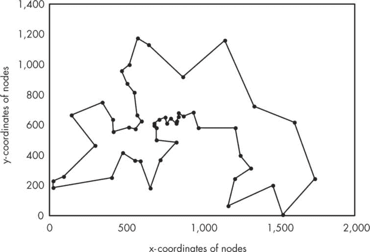

图 9-4：Berlin52 旅行商问题的最优路径

为了可视化找到全局最优解的轮次的收敛模式，你可以添加几行额外的代码，保存中间步骤的相关数据并绘制该数据。典型的收敛图将呈现出像图 9-5 所示的模式。

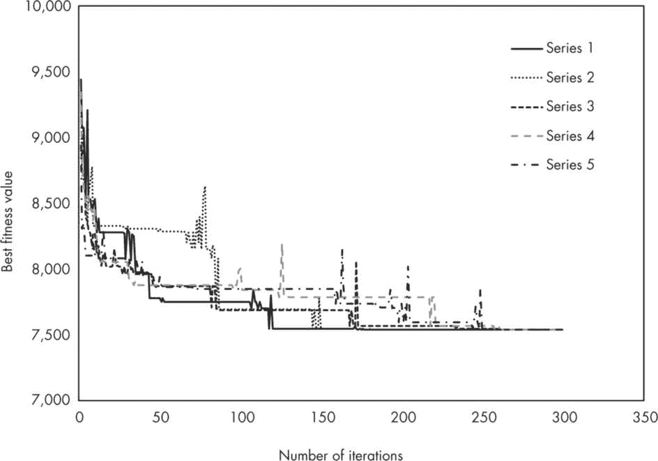

图 9-5：Berlin52 问题的收敛模式

在结束本项目之前，我想提出几个关于 ACS 算法成功率以及我们开发的代码生成的解的准确性的观点。这些评论将澄清你在运行代码时可能遇到的一些问题，或者在将结果与其他地方发布的结果进行比较时可能产生的疑问。

首先，回顾一下本书中使用的 NIA（自然启发算法）是随机的，optimaCount 每次运行程序时会有所不同。在给定全局参数值的情况下，我发现平均的 optimaCount 大约为 5（基于 10 次运行）。但是，如果你改变全局参数的值，这一平均成功率会发生变化。我鼓励你尝试调整这些参数，以帮助理解它们在寻找全局最优解时的相对影响。

第二，你可能会在文献中发现，柏林 52 问题的最优（最短）路径长度是 7542，稍微不同于我们所找到的最优值 7544.3659。这个差异并不表明 ACS 算法或本项目开发的代码存在问题；这是因为一些算法在解决问题之前会将节点（城市间）距离转换为最接近的整数值，以提高数学效率。因此，这些方法实际上解决的是一个略有不同的问题。然而，我们的 ACS 应用程序已经找出了与文献中报告的完全相同的最优路线。

蚁群优化是一个活跃的研究领域，和其他自然启发算法（NIA）一样，不断有新的修改方案被提出并测试，以提高该算法的收敛性和精度。如果你有兴趣使用蚁群算法（ACS）或类似算法解决大型实际路线规划问题，我强烈建议你查阅最近发布的文献。

### 摘要

本章完成了你对自然启发算法（NIA）及其应用的介绍。你了解了两个更强大的工具——粒子群优化和蚁群系统——并且学会了如何在 Kotlin 中利用这些算法的强大功能。你通过解决两个实际的优化问题来测试你的技能：为柏林 52 个地点的旅行商问题找到全局最小值，并解决一个复杂数学函数的全局最小值问题。你探索了算法如何随着时间推移收敛到最优解，并学习了如何衡量它们的性能。当然，你也通过练习挑战了自己，加深了学习效果。

### 资源

Brownlee, Jason. *巧妙算法：自然启发的编程秘诀*。电子版，2012 年 6 月 16 日。*[`github.com/clever-algorithms/CleverAlgorithms`](https://github.com/clever-algorithms/CleverAlgorithms)*。

Clerc, Maurice. *粒子群优化*。伦敦：ISTE 出版社，2006 年。

Dorigo, Marco 和 Thomas Stützle. *蚁群优化*。美国马萨诸塞州剑桥市：麻省理工学院出版社，2004 年。

Olsson, Andrea E., 主编. *粒子群优化：理论、技术与应用*。纽约：Nova Science 出版社，2011 年。

Parsopoulos, Konstantinos E. “粒子群方法。” 见 *启发式手册*，由 Rafael Martí、Panos M. Pardalos 和 Mauricio G. C. Resende 编辑，第 639-685 页。瑞士琅勃拉邦：施普林格出版社，2018 年。

Solnon, Christine. *蚁群优化与约束编程*。伦敦：ISTE 出版社，2013 年。

TSPLIB. 对称旅行商问题（TSP）。访问日期：2024 年 6 月 15 日。*[`comopt.ifi.uni-heidelberg.de/software/TSPLIB95/`](http://comopt.ifi.uni-heidelberg.de/software/TSPLIB95/)*。

Yang, Xin-She. *自然启发优化算法*。第二版。伦敦：学术出版社，2021 年。
