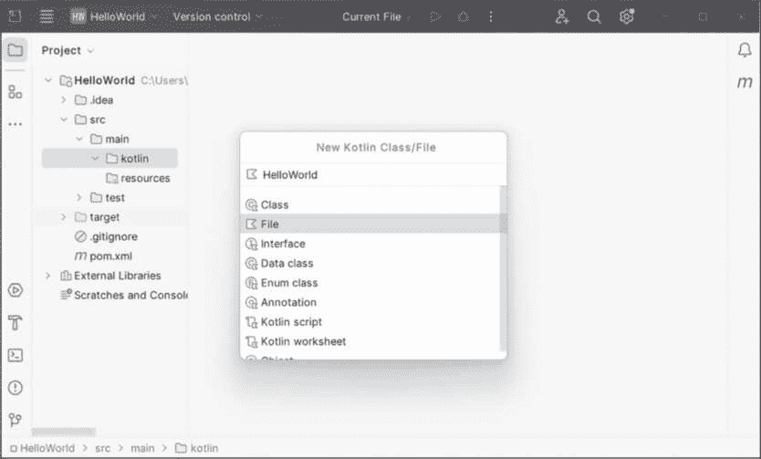
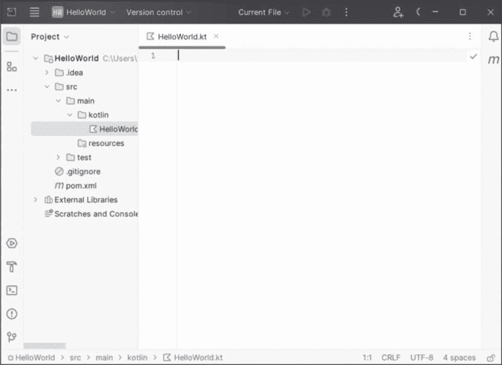
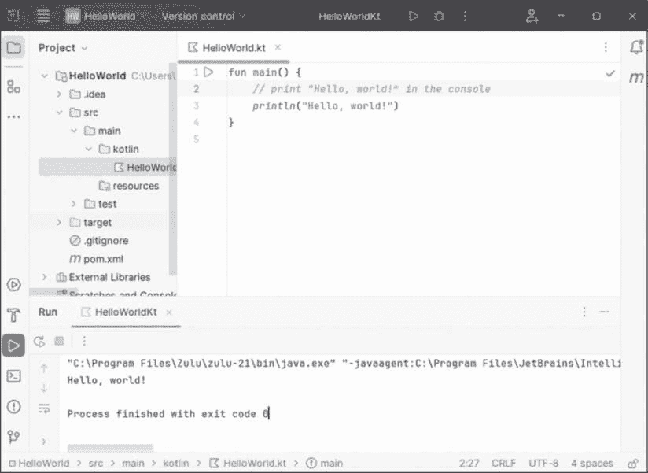

# 附录


本附录提供了在创建程序和应用之前你需要了解的基本计算机术语和概念概览。它还将指导你如何设置计算机，以便你可以在本书中的项目中运行 Kotlin 代码。

如果你是编程新手，建议你先浏览本附录，确保你拥有必要的背景知识和工作环境设置。

## 关键定义

在这一部分，我将介绍一些基本术语，这些术语对于理解计算机程序是什么以及它是如何工作的至关重要。我们编写的代码依赖于一个更大的软件（操作系统和编译器等其他程序）和硬件（计算机）生态系统，才能运行并生成所需的输出。

*操作系统（OS）*是一个软件程序，充当计算机硬件与用户应用程序之间的中介。常见的操作系统包括 Microsoft Windows、macOS、Linux 和 Android，每个操作系统都针对特定的设备和计算环境进行定制。操作系统管理和控制各种硬件资源——如内存、处理器、输入/输出设备和存储——为软件程序提供与底层硬件交互的标准化接口。它使多个应用程序能够并行运行，确保系统资源的高效和安全使用。

*计算机程序*，通常称为*软件*或*应用程序*，是一组指令，指示计算机执行特定任务。程序员编写这些指令来解决问题、自动化流程或执行所需的计算。一旦编写完成，程序通常会通过编译器或解释器被翻译成*机器码*或*中间代码*，以便在计算机上执行。计算机程序的示例包括文字处理软件、网页浏览器、游戏和操作系统。

要编写计算机程序，我们使用*编程语言*，这是一组计算机系统能够理解和执行的规则与符号。示例包括 Kotlin、Python、Java、C/C++、JavaScript、Rust 和 Go。编程语言在语法（编写程序的规则）、语义（程序的含义和行为）和抽象层次（语言与硬件可以遵循的格式之间的距离）上有所不同。每种语言都有其优缺点，使其在不同任务中（如网页开发、系统编程、数据分析或人工智能）更适合或不适合。

*库* 是一组预先编写的代码模块或函数，程序员可以用它们来执行常见的任务。*标准库* 是编程语言的一个核心组成部分，通常与语言的核心分发包一起提供，以提供在任何系统上都能使用的标准化功能。它包括用于输入/输出、数据处理、打印和网络等任务的基本模块。库可以促进代码的重用，节省时间，并允许开发人员基于现有的解决方案进行构建。

*文本编辑器* 是一种用于创建、修改和格式化纯文本文件的软件应用程序。与通常包含高级格式化和布局功能的文字处理器不同，文本编辑器专注于处理未格式化文本的基本任务。文本编辑器通常被软件开发人员用于编写代码，因为它们提供了一个轻量且无干扰的环境。流行的文本编辑器包括 Windows 上的 Notepad、macOS 上的 TextEdit 和 Linux 上的 Vim。还有一些为多平台定制的编辑器，如 Notepad++ 和 Sublime Text。

*集成开发环境（IDE）* 是一种全面的软件工具，旨在简化和增强软件开发过程。它通常提供一个统一的环境，集成了多个必要的工具和功能，包括文本编辑器、调试器、编译器和构建自动化工具。现代 IDE 还包括语法高亮、代码补全和项目管理等功能。流行的 IDE 包括 Visual Studio Code、Eclipse 和 IntelliJ IDEA，每种都针对特定的编程语言和开发环境。我们将在本书中完成所有编码任务时使用 IntelliJ IDEA，因为它提供对 Kotlin 的内建支持。

*编译器* 是一种将用高级编程语言编写的源代码转换为机器代码或中间代码的软件工具，这些代码可以直接由计算机执行，或者在不同的环境中执行，如 Java 虚拟机（我们稍后将讨论）。编译过程包括多个阶段，包括词法分析、语法分析、语义分析、优化和代码生成。

*调试* 是查找并修复计算机程序中的错误（bug）过程。它涉及分析代码，并使用调试工具和技术找到意外或错误结果的原因。调试是一个系统的、迭代的任务，需要技术技能、解决问题的能力以及对软件逻辑的良好理解。

*Java 开发工具包（JDK）* 是 Java 和 Kotlin 开发人员用来构建、测试和部署应用程序的软件开发工具包。JDK 包含一组有助于编程的工具和实用程序，包括编译器、调试器以及其他开发工具。它还包括 *Java 运行时环境（JRE）*，这是运行 Java/Kotlin 应用程序所必需的。JRE 没有编译器，因此只能用来运行预编译的 Java 或 Kotlin 程序。要创建新的程序，你需要 JDK。

*Java 虚拟机（JVM）* 是 JRE 和 JDK 的关键组成部分，它充当 Java/Kotlin 应用程序与底层硬件和操作系统之间的抽象层。它使得 Java *字节码*（Java 或 Kotlin 源代码的编译形式）的执行成为可能。JVM 提供平台独立性，使 Java/Kotlin 程序能够在任何支持 JVM 的设备上运行。它管理内存和安全功能，并通过解释字节码或使用即时编译来优化性能，为兼容的应用程序提供执行环境。

*可执行文件* 是一个独立的文件，可以在计算机上运行并执行特定任务。可执行文件包含计算机硬件可以理解和执行的机器代码，以及有关如何在内存中组织代码和数据的信息。与文本文件不同，可执行文件不可供人类阅读，因为它是从其他文件（如用 Fortran、C 或 C++ 编写的源代码文件）编译而来的。可执行文件的例子有 Windows 系统上的 EXE 文件和 macOS 系统上的 APP 文件。

## 创建应用程序的工作流程

创建一个 Kotlin 应用程序通常包括以下步骤：

1.  **设置项目。** 使用像 IntelliJ IDEA 这样的 IDE 创建一个新的 Kotlin 项目。选择目标平台（例如 JVM）和构建系统（例如 Maven 或 Gradle）。构建系统自动化了代码的编译、测试和打包为可执行形式。大多数时候，IDE 的默认选择已经足够。

2.  **用 Kotlin 编写代码。** 使用 Kotlin 编写应用程序逻辑。在运行代码或退出之前，IDE 通常会将代码文件自动保存到指定的文件夹中。

3.  **构建和编译。** 将 Kotlin 代码编译成字节码。你可以选择同时构建和运行，或者仅构建项目以检查任何构建时错误。

4.  **测试。** 通过单元测试和集成测试检查应用程序的质量和可靠性。单元测试确保每个单元（例如，函数、方法或类）按预期工作，并促进模块化和清晰的代码。集成测试验证组件或系统在更大应用中的交互和接口。

5. **调试。** 使用 IDE 的调试工具识别并修复代码中的问题。设置断点，检查变量，逐步执行代码以理解其工作原理。您可以在不同的代码段中插入打印语句，以确保程序逻辑按预期工作。

6. **部署。** 将编译后的代码和所有资源打包成可部署格式。为此，您可以从应用程序及其依赖项创建一个 Java 存档文件。Java 存档（JAR）文件是可以在 JVM 上作为 Java 应用程序运行的文件集合。

## 设置商店

在开始本书的章节并构建自己的 Kotlin 应用程序之前，您需要完成这三步。

### 步骤 1：下载并安装 IntelliJ IDEA

转到 IntelliJ IDEA 下载页面（由于此页面链接可能会更改，请通过快速的互联网搜索找到当前的网址）。选择 **Community Edition**，这是免费供非商业用途使用的版本。

下载 Windows 的 *.exe* 文件、macOS 的 *.dmg* 文件，或 Linux 的 *.tar.gz* 文件。文件将下载到您的默认下载文件夹。Windows 和 Mac 用户可以双击下载的文件以开始安装；安装向导将引导您完成过程。安装 IntelliJ IDEA 到 Linux 设备需要额外的步骤，具体取决于设备所使用的 Linux 类型。您可以在线查找有关您特定系统的安装说明。

### 步骤 2：下载并设置 JDK

接下来，您需要安装一个 JDK。我建议使用一个与 JavaFX 图形库捆绑在一起的 Azul Zulu JDK 版本，这将让您在本书的可视化项目中工作，而无需进行额外的安装步骤。我将引导您完成这一过程，并向您展示如何在 Windows 设备上执行此操作的示例。对于 Mac 设备，步骤应该非常相似，但如果您需要，可以随时在线查找更详细的说明。

通过快速的互联网搜索找到下载 Azul JDK 页面。选择最新的长期支持（LTS）版本以适应 Windows。选择设备类型（CPU）——在写作时最常见的类型是 x86-64 位——并选择 **JDK FX** 作为 Java 包类型。

警告

*确保选择 JDK FX，而不是仅选择 JDK 作为包类型，否则安装中将不包括 JavaFX。*

选择 **.*****msi*** 作为下载的文件类型。一旦选择了文件类型，下载过程应自动开始，文件将保存在您的默认下载文件夹中。

最后，双击下载的文件以开始安装。安装向导将引导您完成整个过程。您无需更改默认设置。

另一个与 JavaFX 一起捆绑的 JDK 包是 BellSoft Liberica Full JDK。你可以通过相同的方式进行安装。或者，你也可以单独安装核心的 Java SDK 和 OpenFX，这是 JavaFX 的开源版本。有关安装过程的详细说明，以及如何配置你的 IDE 以使用这些安装，请参考相应的网站。

### 步骤 3：创建新项目

现在，你已准备好在 Kotlin 中创建你的第一个“Hello, world!”应用程序。为此，你需要设置一个新项目。本节将向你展示如何在 Windows 设备上进行操作。其他系统的步骤非常相似。

通过点击桌面图标或从开始菜单启动 IntelliJ IDEA（你可以使用搜索框定位该程序）。在左侧面板中，默认应选择“项目”（如果没有，选择它）。接下来，点击窗口右上角的**新建项目**按钮。你的屏幕现在应该类似于图 A-1。


图 A-1：设置一个新的 Kotlin 项目

输入**HelloWorld**作为项目名称（不包含空格），然后选择**Kotlin**作为语言，**Maven**或**Gradle**作为构建系统。

你还必须选择编译和运行代码所需的 JDK。如果安装的 Azul Zulu JDK 没有被预选中，点击下拉菜单旁的向下三角形，导航到 JDK 安装的文件夹，并选择该文件夹。JDK 的位置可能类似于：*C:\Program Files\Zulu\zulu-xx*（最后两位数字表示版本号）。

点击**创建**，让 IDE 为你配置一个新的 Kotlin 项目。这将带你进入下一个屏幕，在左侧面板中显示新创建的项目“HelloWorld”。

通过反复点击项目及其分支名称旁边的**>**，展开项目树，直到看到一个名为 *kotlin* 的空文件夹。右键点击 ***kotlin***，然后选择**新建****Kotlin 类/文件****文件**。你的屏幕应该类似于图 A-2。



图 A-2：创建一个 Kotlin 文件

在文件名框中输入**HelloWorld**并按下回车键（IDE 应该会为文件名添加 *.kt* 作为扩展名）。你应该被带到 IDE 的代码编辑器窗口，如图 A-3 所示。



图 A-3：在代码编辑器窗口中开始编写代码

你只需几个步骤就能编写并运行你的第一个 Kotlin 代码。在代码编辑器中输入以下几行代码：

```
fun main() {
    // Print "Hello, world!" in the console.
    println("Hello, world!")
}
```

这段代码创建了 main() 函数，它是任何 Kotlin 程序的入口点。我们使用关键字 fun 来声明一个函数，并在一对大括号内定义函数体。

在函数内部，我们使用 // 来编写*注释*，这是一个被编译器忽略的文本块，但它告诉人类用户某一行或代码块的作用。最后，我们使用 println()方法，这是 Kotlin 标准库的一部分，用于在*控制台*（基于文本的输出窗口）中打印信息。

你可以通过按 SHIFT-F10 或点击顶部面板中“当前文件”旁边的绿色右箭头来运行这段代码。你也可以使用运行菜单来运行这个程序。为什么不试试所有这些选项呢？运行程序后，屏幕应该会显示类似图 A-4 所示的内容。



图 A-4：在 Kotlin 中打印“Hello, world！”

注意窗口底部的控制台。它显示了这个程序产生的单行输出：Hello, world!

恭喜你成功编写并运行了你的第一个 Kotlin 应用程序！现在你已经准备好开始探索 Kotlin 的世界了。
