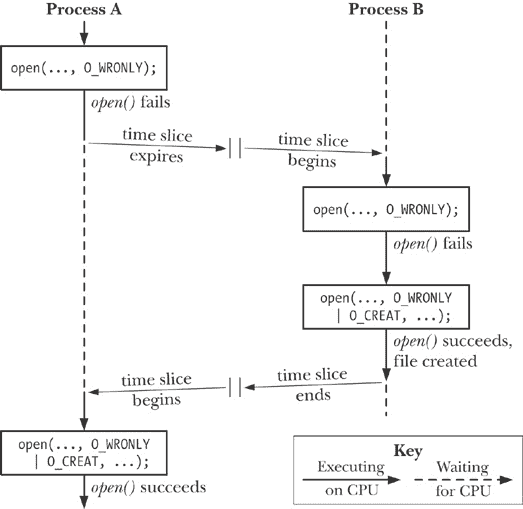
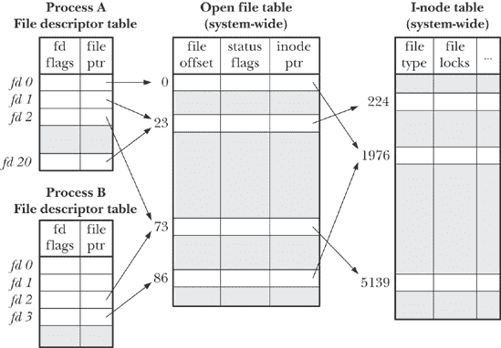
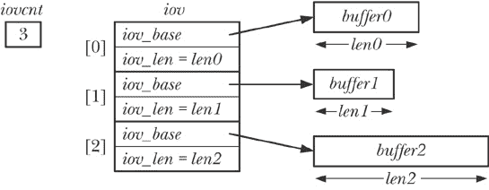

## 第五章 文件 I/O：进一步细节

在本章中，我们将继续讨论在上一章中开始的文件 I/O。

在继续讨论 *open()* 系统调用时，我们解释了 *原子性* 的概念——即系统调用执行的动作作为一个单一的不可中断的步骤完成。这是许多系统调用正确操作的必要要求。

我们介绍了另一个与文件相关的系统调用——多用途的 *fcntl()*，并展示了它的一个用法：获取和设置打开文件的状态标志。

接下来，我们将探讨用于表示文件描述符和打开文件的内核数据结构。理解这些结构之间的关系，有助于我们理清后续章节中讨论的文件 I/O 的一些细微之处。在此基础上，我们将进一步解释如何复制文件描述符。

接下来，我们考虑一些提供扩展读写功能的系统调用。这些系统调用允许我们在文件的特定位置进行 I/O，而不改变文件偏移量，并能够在程序中的多个缓冲区之间传输数据。

我们简要介绍了非阻塞 I/O 的概念，并描述了一些扩展功能，以支持非常大的文件的 I/O 操作。

由于许多系统程序使用临时文件，我们还将介绍一些库函数，它们允许我们创建并使用具有随机生成唯一名称的临时文件。

## 原子性与竞争条件

原子性是我们在讨论系统调用操作时会反复遇到的一个概念。所有的系统调用都是原子性执行的。我们所说的原子性执行，意味着内核保证系统调用中的所有步骤作为一个单独的操作完成，不会被其他进程或线程中断。

原子性对于某些操作的成功完成至关重要。特别是，它使我们能够避免 *竞争条件*（有时也称为 *竞争危害*）。竞争条件是指两个进程（或线程）在操作共享资源时，产生的结果以一种意外的方式依赖于进程获得 CPU 访问权限的相对顺序。

在接下来的几页中，我们将讨论两种涉及文件 I/O 的情况，在这些情况下会发生竞争条件，并展示如何通过使用保证相关文件操作原子性的 *open()* 标志来消除这些条件。

在描述 *sigsuspend()*（参见使用掩码等待信号：*sigsuspend()*")）和 *fork()*（参见第 24.4 节）时，我们会重新讨论竞争条件的问题。

#### 创建一个独占文件

在由*open()*返回的文件描述符号 返回的文件描述符号")中，我们提到将`O_EXCL`与`O_CREAT`一起使用，会导致如果文件已经存在，*open()*返回错误。这为进程确保它是文件的创建者提供了一种方法。文件是否存在的检查与文件的创建是原子性执行的。为了理解这一点，请考虑示例 5-1 中的代码，这是在没有`O_EXCL`标志的情况下我们可能会采用的代码。（在这段代码中，我们显示了*getpid()*系统调用返回的进程 ID，这使我们能够区分两次运行该程序的输出。）

示例 5-1. 错误的独占打开文件代码

```
*from* `fileio/bad_exclusive_open.c`
fd = open(argv[1], O_WRONLY);       /* Open 1: check if file exists */
    if (fd != -1) {                     /* Open succeeded */
        printf("[PID %ld] File \"%s\" already exists\n",
                (long) getpid(), argv[1]);
        close(fd);
    } else {
        if (errno != ENOENT) {          /* Failed for unexpected reason */
            errExit("open");
        } else {
            /* WINDOW FOR FAILURE */
            fd = open(argv[1], O_WRONLY | O_CREAT, S_IRUSR | S_IWUSR);
            if (fd == -1)
                errExit("open");

            printf("[PID %ld] Created file \"%s\" exclusively\n",
                    (long) getpid(), argv[1]);          /* MAY NOT BE TRUE! */
        }
    }
      *from* `fileio/bad_exclusive_open.c`
```

除了冗长地使用两次*open()*调用外，示例 5-1 中的代码还包含了一个 bug。假设在我们的进程第一次调用*open()*时，文件并不存在，但到第二次*open()*时，另一个进程已经创建了该文件。如果内核调度程序决定进程的时间片已经耗尽，并将控制权交给了另一个进程（如图 5-1 所示），或者两个进程在多处理器系统上同时运行，则可能会发生这种情况。图 5-1 展示了两个进程都在执行示例 5-1 中所示代码的情况。在这种情况下，进程 A 会错误地得出结论，认为它已经创建了文件，因为第二次*open()*无论文件是否存在都会成功。

虽然进程错误地认为它是文件创建者的概率相对较小，但这种可能性仍然使得该代码不可靠。这些操作的结果依赖于两个进程调度的顺序，意味着这是一个竞态条件。

图 5-1. 未能独占创建文件

为了证明这段代码确实存在问题，我们可以将示例 5-1 中的注释行`WINDOW FOR FAILURE`替换为一段代码，在检查文件是否存在和文件创建之间制造一个人工的长延迟：

```
printf("[PID %ld] File \"%s\" doesn't exist yet\n", (long) getpid(), argv[1]);
if (argc > 2) {                 /* Delay between check and create */
    sleep(5);                   /* Suspend execution for 5 seconds */
    printf("[PID %ld] Done sleeping\n", (long) getpid());
}
```

### 注意

*sleep()* 库函数将暂停进程的执行，直到指定的秒数过去。我们将在第 23.4 节讨论这个函数。

如果我们同时运行两个程序实例，在示例 5-1 中，我们会看到它们都声称已经独占创建了文件：

```
$ `./bad_exclusive_open tfile sleep &`
[PID 3317] File "tfile" doesn't exist yet
[1] 3317
$ `./bad_exclusive_open tfile`
[PID 3318] File "tfile" doesn't exist yet
[PID 3318] Created file "tfile" exclusively
$ [PID 3317] Done sleeping
[PID 3317] Created file "tfile" exclusively                 *Not true*
```

### 注意

在上述输出的倒数第二行中，我们看到 Shell 提示符与第一个测试程序实例的输出混合在一起。

两个进程声称已创建文件，因为第一个进程的代码在检查文件是否存在和创建文件之间被中断。使用一个同时指定 `O_CREAT` 和 `O_EXCL` 标志的 *open()* 调用可以防止这种情况发生，它通过保证检查和创建操作作为一个单一的原子（即不可中断）操作来实现。

#### 向文件追加数据

原子性需求的第二个示例是当我们有多个进程向同一文件追加数据时（例如，向全局日志文件写入）。为此，我们可能会考虑在每个写入者中使用如下代码：

```
if (lseek(fd, 0, SEEK_END) == -1)
    errExit("lseek");
if (write(fd, buf, len) != len)
    fatal("Partial/failed write");
```

然而，这段代码与前一个示例存在相同的缺陷。如果第一个执行代码的进程在 *lseek()* 和 *write()* 调用之间被第二个进程中断，且第二个进程正在执行相同操作，那么两个进程会在写入之前将文件偏移量设置为相同的位置，当第一个进程被重新调度时，它将覆盖第二个进程已经写入的数据。这仍然是一个竞争条件，因为结果取决于两个进程的调度顺序。

避免这个问题需要保证文件的下一个字节的寻址和写操作是原子性的。这正是使用 `O_APPEND` 标志打开文件所保证的。

### 注意

一些文件系统（例如 NFS）不支持 `O_APPEND`。在这种情况下，内核会回退到上面显示的非原子调用序列，因此可能会导致文件损坏，如前所述。

## 文件控制操作：*fcntl()*

*fcntl()* 系统调用对打开的文件描述符执行一系列控制操作。

```
#include <fcntl.h>

int `fcntl`(int *fd*, int *cmd*, ...);
```

### 注意

成功时返回取决于 *cmd*，出错时返回 -1

*cmd* 参数可以指定多种操作。我们将在接下来的章节中讨论其中的一些，并将其他操作的讨论推迟到后面的章节。

如省略号所示，*fcntl()* 的第三个参数可以是不同类型的，或者可以省略。内核使用 *cmd* 参数的值来确定此参数应期望的数据类型（如果有的话）。

## 打开文件状态标志

*fcntl()* 的一个用途是检索或修改已打开文件的访问模式和文件状态标志。（这些是由调用 *open()* 时指定的 *flags* 参数设置的值。）要检索这些设置，我们指定 *cmd* 为 `F_GETFL`：

```
int flags, accessMode;

flags = fcntl(fd, F_GETFL);         /* Third argument is not required */
if (flags == -1)
    errExit("fcntl");
```

在上述代码片段之后，我们可以像下面这样测试文件是否以同步写入模式打开：

```
if (flags & O_SYNC)
    printf("writes are synchronized\n");
```

### 注意

SUSv3 要求只有在*open()*或后续的*fcntl()* `F_SETFL`中指定的状态标志才能在打开的文件上设置。然而，Linux 在这一点上有所不同：如果应用程序是使用 I/O on Large Files 中描述的某种技术编译的来打开大文件，那么在通过`F_GETFL`获取的标志中，`O_LARGEFILE`将始终被设置。

检查文件的访问模式稍微复杂一些，因为`O_RDONLY`（0）、`O_WRONLY`（1）和`O_RDWR`（2）常量并不对应打开文件状态标志中的单个比特。因此，为了进行此检查，我们将*flags*值与常量`O_ACCMODE`进行掩码操作，然后测试是否与某个常量相等：

```
accessMode = flags & O_ACCMODE;
if (accessMode == O_WRONLY || accessMode == O_RDWR)
    printf("file is writable\n");
```

我们可以使用*fcntl()*的`F_SETFL`命令来修改一些打开文件的状态标志。可以修改的标志有`O_APPEND`、`O_NONBLOCK`、`O_NOATIME`、`O_ASYNC`和`O_DIRECT`。修改其他标志的尝试会被忽略。（一些其他 UNIX 实现允许*fcntl()*修改其他标志，例如`O_SYNC`。）

使用*fcntl()*修改打开文件状态标志在以下情况下特别有用：

+   文件并不是由调用程序打开的，因此它无法控制在*open()*调用中使用的标志（例如，该文件可能是程序启动前已经打开的三个标准描述符之一）。

+   文件描述符是通过除*open()*以外的系统调用获得的。此类系统调用的例子有*pipe()*，它创建一个管道并返回两个文件描述符，分别指向管道的两端；还有*socket()*，它创建一个套接字并返回一个指向该套接字的文件描述符。

为了修改打开文件的状态标志，我们使用*fcntl()*来获取现有标志的副本，然后修改我们希望更改的位，最后再次调用*fcntl()*来更新标志。因此，要启用`O_APPEND`标志，我们可以这样写：

```
int flags;

flags = fcntl(fd, F_GETFL);
if (flags == -1)
    errExit("fcntl");
flags |= O_APPEND;
if (fcntl(fd, F_SETFL, flags) == -1)
    errExit("fcntl");
```

## 文件描述符与打开文件之间的关系

到目前为止，可能看起来文件描述符和打开文件之间存在一一对应关系。然而，事实并非如此。实际上，可以有多个描述符指向同一个打开文件，这样做是可能的也是有用的。这些文件描述符可以在同一进程中打开，也可以在不同进程中打开。

要理解发生了什么，我们需要检查内核维护的三个数据结构：

+   每个进程的文件描述符表；

+   系统范围的打开文件描述符表；以及

+   文件系统的 i 节点表。

对于每个进程，内核维护一个*打开文件描述符*表。该表中的每一项记录一个单独文件描述符的信息，包括：

+   一组控制文件描述符操作的标志（这里只有一个这样的标志，即关闭执行标志，我们在文件描述符和 *exec()*")中描述了它）；以及

+   引用该打开文件描述符。

内核维护一个系统范围内的所有 *打开文件描述符* 的表。（这个表有时被称为 *打开文件表*，其条目有时被称为 *打开文件句柄*。）一个打开文件描述符存储与打开文件相关的所有信息，包括：

+   当前文件偏移量（由 *read()* 和 *write()* 更新，或通过 *lseek()* 显式修改）；

+   打开文件时指定的状态标志（即传递给 *open()* 的 *flags* 参数）；

+   文件访问模式（只读、只写或读写，具体由 *open()* 指定）；

+   与信号驱动 I/O 相关的设置（信号驱动 I/O）；以及

+   指向该文件的 *i-node* 对象的引用。

每个文件系统都有一个包含文件系统中所有文件的 *i-node* 的表。i-node 结构以及文件系统的一般概念将在第十四章中详细讨论。现在，我们需要注意的是，每个文件的 i-node 包括以下信息：

+   文件类型（例如，常规文件、套接字或 FIFO）和权限；

+   指向此文件上持有的锁列表的指针；以及

+   文件的各种属性，包括文件大小和与不同类型文件操作相关的时间戳。

### 注意

在这里，我们忽略了磁盘上和内存中 i-node 表示之间的区别。磁盘上的 i-node 记录文件的持久性属性，如文件类型、权限和时间戳。当文件被访问时，会创建该 i-node 的内存副本，这个版本的 i-node 记录了引用该 i-node 的打开文件描述符的数量，以及从中复制该 i-node 的设备的主次 ID。内存中的 i-node 还记录了与文件在打开时相关的各种临时属性，如文件锁。

图 5-2 说明了文件描述符、打开文件描述符与 i-node 之间的关系。在此图中，两个进程都有多个打开的文件描述符。

图 5-2. 文件描述符、打开文件描述符与 i-node 之间的关系

在进程 A 中，描述符 1 和 20 都引用相同的打开文件描述（标记为 23）。这种情况可能是由对 *dup()*、*dup2()* 或 *fcntl()* 的调用引起的（见复制文件描述符）。

进程 A 的描述符 2 和进程 B 的描述符 2 引用同一个打开的文件描述符 (73)。这种情况可能发生在调用 *fork()* 后（即，进程 A 是进程 B 的父进程，反之亦然），或者如果一个进程通过 UNIX 域套接字将一个打开的描述符传递给另一个进程 (传递文件描述符)。

最后，我们看到进程 A 的描述符 0 和进程 B 的描述符 3 引用不同的打开文件描述符，但这些描述符引用的是同一个 i-node 表条目 (1976)——换句话说，指向同一个文件。这是因为每个进程独立地调用 *open()* 打开了同一个文件。如果是一个进程两次打开同一个文件，也会发生类似的情况。

我们可以从前述讨论中得出若干结论：

+   两个指向相同打开文件描述符的不同文件描述符共享一个文件偏移值。因此，如果通过一个文件描述符更改了文件偏移（作为调用 *read()*，*write()* 或 *lseek()* 的结果），该更改在另一个文件描述符中是可见的。这适用于文件描述符属于同一进程或不同进程的情况。

+   在使用 *fcntl()* 的 `F_GETFL` 和 `F_SETFL` 操作来检索和更改打开文件状态标志（例如，`O_APPEND`，`O_NONBLOCK` 和 `O_ASYNC`）时，也适用类似的作用域规则。

+   相比之下，文件描述符标志（即 close-on-exec 标志）是进程和文件描述符的私有的。修改这些标志不会影响同一进程中其他的文件描述符，也不会影响不同进程中的文件描述符。

## 复制文件描述符

使用 (Bourne shell) 的 I/O 重定向语法 `2>&1` 告诉 shell 我们希望将标准错误（文件描述符 2）重定向到与标准输出（文件描述符 1）相同的位置。因此，以下命令会（由于 shell 是从左到右评估 I/O 定向）将标准输出和标准错误都发送到文件 `results.log`：

```
$ `./myscript > results.log 2>&1`
```

Shell 通过复制文件描述符 2 来实现标准错误的重定向，使其指向与文件描述符 1 相同的打开文件描述符（就像进程 A 的描述符 1 和描述符 20 在 图 5-2 中指向同一个打开的文件描述符一样）。这种效果可以通过 *dup()* 和 *dup2()* 系统调用来实现。

注意，仅仅让 shell 打开 `results.log` 文件两次是不够的：一次在描述符 1 上，另一次在描述符 2 上。原因之一是这两个文件描述符不会共享文件偏移指针，因此可能会互相覆盖对方的输出。另一个原因是该文件可能不是磁盘文件。考虑以下命令，它将标准错误输出发送到与标准输出相同的管道中：

```
$ `./myscript 2>&1 | less`
```

*dup()* 调用接受 *oldfd*（一个已打开的文件描述符），并返回一个新的描述符，该描述符指向相同的已打开文件描述符。新描述符保证是最小的未使用文件描述符。

```
#include <unistd.h>

int `dup`(int *oldfd*);
```

### 注意

成功时返回（新）文件描述符，出错时返回 -1。

假设我们进行如下调用：

```
newfd = dup(1);
```

假设在正常情况下，shell 已经为程序打开了文件描述符 0、1 和 2，并且没有其他描述符在使用中，*dup()* 将使用文件 3 创建描述符 1 的副本。

如果我们希望副本是描述符 2，可以使用以下技巧：

```
close(2);               /* Frees file descriptor 2 */
newfd = dup(1);         /* Should reuse file descriptor 2 */
```

这段代码只有在描述符 0 已经打开时才有效。为了简化上述代码，并确保我们总是获得我们想要的文件描述符，我们可以使用 *dup2()*。

```
#include <unistd.h>

int `dup2`(int *oldfd*, int *newfd*);
```

### 注意

成功时返回（新）文件描述符，出错时返回 -1。

*dup2()* 系统调用通过使用 *newfd* 中提供的描述符号来复制 *oldfd* 给定的文件描述符。如果 *newfd* 指定的文件描述符已经打开，*dup2()* 会先关闭它。（在关闭过程中发生的任何错误都会被静默忽略；为了更安全的编程实践，建议在调用 *dup2()* 之前显式地 *close()* *newfd*，如果它已经打开。）

我们可以将之前的 *close()* 和 *dup()* 调用简化为如下：

```
dup2(1, 2);
```

成功的 *dup2()* 调用会返回副本描述符的编号（即传入 *newfd* 的值）。

如果 *oldfd* 不是有效的文件描述符，则 *dup2()* 会因错误 `EBADF` 而失败，并且 *newfd* 不会被关闭。如果 *oldfd* 是有效的文件描述符，并且 *oldfd* 和 *newfd* 的值相同，则 *dup2()* 不做任何操作——*newfd* 不会被关闭，*dup2()* 会返回 *newfd* 作为它的函数结果。

提供更多灵活性以便复制文件描述符的另一个接口是 *fcntl()* 的 `F_DUPFD` 操作：

```
newfd = fcntl(oldfd, F_DUPFD, startfd);
```

该调用通过使用大于或等于 *startfd* 的最小未使用文件描述符来复制 *oldfd*。如果我们希望确保新描述符（*newfd*）落在某个特定的值范围内，这非常有用。对 *dup()* 和 *dup2()* 的调用总是可以重新编写为对 *close()* 和 *fcntl()* 的调用，尽管前者的调用更简洁。（还要注意，*dup2()* 和 *fcntl()* 返回的一些 *errno* 错误代码不同，具体描述见手册页面。）

从图 5-2 中，我们可以看到，复制的文件描述符共享同一文件偏移量值和状态标志，在它们共享的打开文件描述中。但是，新文件描述符有自己的文件描述符标志，并且其关闭时执行标志（`FD_CLOEXEC`）始终关闭。我们接下来描述的接口允许显式控制新文件描述符的关闭时执行标志。

*dup3()* 系统调用执行的任务与 *dup2()* 相同，但添加了一个额外的参数 *flags*，它是一个位掩码，用于修改系统调用的行为。

```
#define _GNU_SOURCE
#include <unistd.h>

int `dup3`(int *oldfd*, int *newfd*, int *flags*);
```

### 注意

成功时返回（新）文件描述符，出错时返回 -1

目前，*dup3()* 支持一个标志，`O_CLOEXEC`，该标志使内核为新文件描述符启用关闭时执行标志（`FD_CLOEXEC`）。这个标志与在文件描述符号由 *open()* 返回 返回")中描述的 *open()* `O_CLOEXEC` 标志具有相同的用途。

*dup3()* 系统调用是 Linux 2.6.27 中新增的，并且是 Linux 特有的。

从 Linux 2.6.24 起，Linux 还支持一个额外的 *fcntl()* 操作，用于复制文件描述符：`F_DUPFD_CLOEXEC`。该标志与 `F_DUPFD` 执行相同的操作，但额外为新文件描述符设置了关闭时执行标志（`FD_CLOEXEC`）。同样，这个操作对于与 *open()* 中的 `O_CLOEXEC` 标志相同的原因是有用的。`F_DUPFD_CLOEXEC` 在 SUSv3 中没有指定，但在 SUSv4 中有指定。

## 在指定偏移量处进行文件 I/O：*pread()* 和 *pwrite()*

*pread()* 和 *pwrite()* 系统调用的操作方式与 *read()* 和 *write()* 相似，唯一不同的是文件 I/O 是在由 *offset* 指定的位置执行，而不是在当前文件偏移量处执行。这些调用不会改变文件偏移量。

```
#include <unistd.h>

ssize_t `pread`(int *fd*, void **buf*, size_t *count*, off_t *offset*);
```

### 注意

返回读取的字节数，遇到 EOF 时返回 0，出错时返回 -1

```
ssize_t `pwrite`(int *fd*, const void **buf*, size_t *count*, off_t *offset*);
```

### 注意

返回写入的字节数，或者在出错时返回 -1

调用 *pread()* 相当于 *原子地* 执行以下调用：

```
off_t orig;

orig = lseek(fd, 0, SEEK_CUR);    /* Save current offset */
lseek(fd, offset, SEEK_SET);
s = read(fd, buf, len);
lseek(fd, orig, SEEK_SET);        /* Restore original file offset */
```

对于 *pread()* 和 *pwrite()*，*fd* 所指代的文件必须是可寻址的（即，文件描述符必须允许调用 *lseek()*）。

这些系统调用在多线程应用中尤为有用。正如我们在第二十九章中看到的，进程中的所有线程共享相同的文件描述符表。这意味着每个打开文件的文件偏移对于所有线程来说是全局的。通过使用*pread()*或*pwrite()*，多个线程可以同时对相同的文件描述符执行 I/O，而不会受到其他线程修改文件偏移的影响。如果我们尝试使用*lseek*()加*read*()（或*write*()）来代替，那么我们会创建一个竞争条件，类似于我们在讨论第 5.1 节中的`O_APPEND`标志时描述的情况。（*pread()*和*pwrite()*系统调用同样可以用于避免多个进程对同一文件描述符进行 I/O 时出现的竞争条件。）

### 注意

如果我们反复执行*lseek()*调用并随后进行文件 I/O，那么在某些情况下，*pread()*和*pwrite()*系统调用也能提供性能优势。这是因为单个*pread*（或*pwrite*）系统调用的成本低于两个系统调用的成本：*lseek*()和*read*()（或*write*()）。然而，系统调用的成本通常相较于实际执行 I/O 所需的时间来说微不足道。

## 分散-聚集 I/O：*readv()* 和 *writev()*

*readv()*和*writev()*系统调用执行分散-聚集 I/O。

```
#include <sys/uio.h>

ssize_t `readv`(int *fd*, const struct iovec **iov*, int *iovcnt*);
```

### 注意

返回读取的字节数，EOF 时返回 0，出错时返回-1

```
ssize_t `writev`(int *fd*, const struct iovec **iov*, int *iovcnt*);
```

### 注意

返回写入的字节数，出错时返回-1

这些函数不是接受单个数据缓冲区进行读取或写入，而是在一次系统调用中传输多个数据缓冲区。要传输的缓冲区集合由数组*iov*定义。整数*iovcnt*指定*iov*中元素的数量。*iov*的每个元素都是如下结构：

```
struct iovec {
    void  *iov_base;        /* Start address of buffer */
    size_t iov_len;         /* Number of bytes to transfer to/from buffer */
};
```

### 注意

SUSv3 允许实现对*iov*中的元素数量设置限制。实现可以通过在`<limits.h>`中定义`IOV_MAX`或通过运行时调用*sysconf(_SC_IOV_MAX)*的返回值来宣传其限制。（我们在第 11.2 节中描述了*sysconf*()）。SUSv3 要求此限制至少为 16。在 Linux 中，`IOV_MAX`被定义为 1024，这对应于内核对该向量大小的限制（由内核常量`UIO_MAXIOV`定义）。

然而，*glibc*对*readv()*和*writev()*的封装函数会悄悄地做一些额外的工作。如果系统调用因*iovcnt*过大而失败，那么封装函数会临时分配一个足够大的单个缓冲区来容纳所有由*iov*描述的项，并执行*read*()或*write*()调用（见下文关于如何通过*write*()实现*writev*()的讨论）。

图 5-3 显示了 *iov* 和 *iovcnt* 参数与它们所指缓冲区之间的关系示例。

图 5-3. *iovec* 数组及其相关缓冲区示例

#### 分散输入

*readv()* 系统调用执行 *分散输入*：它从 *fd* 所引用的文件中读取一系列连续的字节，并将这些字节（“分散”）放入由 *iov* 指定的缓冲区中。每个缓冲区，从 *iov[0]* 定义的缓冲区开始，在 *readv()* 继续到下一个缓冲区之前都必须完全填满。

*readv()* 的一个重要特性是它以原子操作完成；也就是说，从调用进程的角度来看，内核在 *fd* 所引用的文件和用户内存之间执行单次数据传输。这意味着，例如，当从文件中读取时，即使另一个进程（或线程）正在共享相同的文件偏移并尝试同时操作偏移，仍然可以确保读取的字节范围是连续的。

在成功完成后，*readv()* 返回读取的字节数，如果遇到文件结束符则返回 0。调用者必须检查此计数，以验证是否读取了所有请求的字节。如果数据不足，则可能只有部分缓冲区被填充，且最后一个缓冲区可能只部分填充。

示例 5-2 执行分散输入") 演示了 *readv()* 的使用。

### 注意

使用前缀 `t_` 后跟函数名作为示例程序的名称（例如，示例 5-2 执行分散输入") 中的 `t_readv.c`）是我们表示该程序主要演示单一系统调用或库函数使用的一种方式。

示例 5-2. 使用 *readv()* 执行分散输入

```
`fileio/t_readv.c`
#include <sys/stat.h>
#include <sys/uio.h>
#include <fcntl.h>
#include "tlpi_hdr.h"

int
main(int argc, char *argv[])
{
    int fd;
    struct iovec iov[3];
    struct stat myStruct;       /* First buffer */
    int x;                      /* Second buffer */
#define STR_SIZE 100
    char str[STR_SIZE];         /* Third buffer */
    ssize_t numRead, totRequired;

    if (argc != 2 || strcmp(argv[1], "--help") == 0)
        usageErr("%s file\n", argv[0]);

    fd = open(argv[1], O_RDONLY);
    if (fd == -1)
        errExit("open");

    totRequired = 0;

    iov[0].iov_base = &myStruct;
    iov[0].iov_len = sizeof(struct stat);
    totRequired += iov[0].iov_len;

    iov[1].iov_base = &x;
    iov[1].iov_len = sizeof(x);
    totRequired += iov[1].iov_len;

    iov[2].iov_base = str;
    iov[2].iov_len = STR_SIZE;
    totRequired += iov[2].iov_len;

    numRead = readv(fd, iov, 3);
    if (numRead == -1)
        errExit("readv");

    if (numRead < totRequired)
        printf("Read fewer bytes than requested\n");

    printf("total bytes requested: %ld; bytes read: %ld\n",
            (long) totRequired, (long) numRead);
    exit(EXIT_SUCCESS);
}
     `fileio/t_readv.c`
```

#### 聚集输出

*writev()* 系统调用执行 *聚集输出*。它将所有由 *iov* 指定的缓冲区中的数据连接（“聚集”）起来，并作为一系列连续的字节写入到 *fd* 所引用的文件中。这些缓冲区按照数组顺序收集，从 *iov[0]* 定义的缓冲区开始。

与 *readv()* 类似，*writev()* 完成原子操作，所有数据都以单次操作从用户内存传输到 *fd* 所引用的文件中。因此，当写入常规文件时，我们可以确保所有请求的数据都连续地写入文件，而不是与其他进程（或线程）的写入交织在一起。

与 *write()* 一样，部分写入是可能的。因此，我们必须检查 *writev()* 的返回值，以查看是否写入了所有请求的字节。

*readv()* 和 *writev()* 的主要优点是便利性和速度。例如，我们可以通过以下方式替换对 *writev()* 的调用：

+   分配一个大的单一缓冲区，将要写入的数据从进程地址空间中的其他位置复制到该缓冲区，然后调用 *write()* 输出缓冲区；或者

+   一系列单独输出缓冲区的 *write()* 调用。

这些选项中的第一个，在语义上等同于使用 *writev()*，但我们面临着在用户空间分配缓冲区和复制数据的不便（以及低效）。

第二个选项在语义上不等同于对 *writev()* 的单次调用，因为 *write()* 调用不是原子操作。此外，执行一次 *writev()* 系统调用比执行多个 *write()* 调用更便宜（参见 系统调用 中的系统调用讨论）。

#### 在指定偏移量执行散列聚集 I/O

Linux 2.6.30 添加了两个新系统调用，将散列聚集 I/O 功能与在指定偏移量执行 I/O 的能力结合起来：*preadv()* 和 *pwritev()*。这些系统调用是非标准的，但在现代 BSD 系统中也可用。

```
#define _BSD_SOURCE
#include <sys/uio.h>

ssize_t `preadv`(int *fd*, const struct iovec **iov*, int *iovcnt*, off_t *offset*);
```

### 注意

返回读取的字节数，EOF 时返回 0，出错时返回 -1

```
ssize_t `pwritev`(int *fd*, const struct iovec **iov*, int *iovcnt*, off_t *offset*);
```

### 注意

返回写入的字节数，出错时返回-1

*preadv()* 和 *pwritev()* 系统调用执行与 *readv()* 和 *writev()* 相同的任务，但在由 *offset* 指定的文件位置执行 I/O（类似于 *pread()* 和 *pwrite()*）。

这些系统调用对希望结合散列聚集 I/O 优势，并能够在与当前文件偏移量无关的位置执行 I/O 的应用程序（例如，多线程应用程序）非常有用。

## 截断文件：*truncate()* 和 *ftruncate()*

*truncate()* 和 *ftruncate()* 系统调用将文件的大小设置为由 *length* 指定的值。

```
#include <unistd.h>

int `truncate`(const char **pathname*, off_t *length*);
int `ftruncate`(int *fd*, off_t *length*);
```

### 注意

成功时两者均返回 0，出错时返回 -1

如果文件长度大于 *length*，多余的数据将丢失。如果文件当前长度小于 *length*，它将通过填充一系列空字节或孔来扩展。

这两个系统调用的区别在于文件的指定方式。使用 *truncate()* 时，文件必须是可访问且可写的，并通过路径名字符串指定。如果 *pathname* 是符号链接，它将被解引用。*ftruncate()* 系统调用需要一个已打开且可写的文件描述符。它不会改变文件的偏移量。

如果 *ftruncate()* 的 *length* 参数大于当前文件大小，SUSv3 允许两种可能的行为：文件被扩展（如同 Linux）或系统调用返回错误。符合 XSI 标准的系统必须采用前者行为。SUSv3 要求如果 *length* 大于当前文件大小，*truncate()* 必须始终扩展文件。

### 注意

*truncate()*系统调用的独特之处在于它是唯一可以在不通过*open()*（或其他方式）先获取文件描述符的情况下改变文件内容的系统调用。

## 非阻塞 I/O

在打开文件时指定`O_NONBLOCK`标志有两个目的：

+   如果文件不能立即打开，则*open()*返回一个错误，而不是阻塞。*open()*可能会阻塞的一种情况是使用 FIFO（FIFO）。

+   在成功调用*open()*之后，随后的 I/O 操作也是非阻塞的。如果一个 I/O 系统调用不能立即完成，则会执行部分数据传输，或者系统调用会以`EAGAIN`或`EWOULDBLOCK`错误之一失败。返回哪个错误取决于系统调用。在 Linux 上，与许多 UNIX 实现一样，这两个错误常量是同义的。

非阻塞模式可以用于设备（例如终端和伪终端）、管道、FIFO 和套接字。（由于管道和套接字的文件描述符不是通过*open()*获取的，我们必须使用*fcntl()*中的`F_SETFL`操作来启用此标志，如第 5.3 节所述。）

对于常规文件，`O_NONBLOCK`通常会被忽略，因为内核缓冲区缓存确保常规文件的 I/O 不会阻塞，如第 13.1 节所述。然而，当使用强制文件锁定时，`O_NONBLOCK`对常规文件是有效的（强制锁定）。

我们在非阻塞 I/O 和第六十三章中进一步讨论非阻塞 I/O。

### 注意

从历史上看，源自 System V 的实现提供了`O_NDELAY`标志，其语义类似于`O_NONBLOCK`。主要的区别是，System V 上的非阻塞*write()*在*write()*无法完成或没有输入可以满足*read()*时返回 0。这种行为对于*read()*来说是有问题的，因为它与文件结束条件无法区分，因此第一个 POSIX.1 标准引入了`O_NONBLOCK`。一些 UNIX 实现继续提供`O_NDELAY`标志及其旧语义。在 Linux 上，`O_NDELAY`常量已定义，但它与`O_NONBLOCK`同义。

## 大文件的 I/O

用于存储文件偏移量的*off_t*数据类型通常实现为有符号长整型。（需要有符号数据类型，因为-1 的值用于表示错误条件。）在 32 位架构（例如 x86-32）上，这将限制文件大小为 2³¹-1 字节（即 2GB）。

然而，磁盘驱动器的容量早已超过了这一限制，因此需要 32 位 UNIX 实现来处理比这个大小更大的文件。由于这是许多实现中普遍存在的问题，UNIX 厂商的联盟在 *Large File Summit*（LFS）上进行了合作，增强了 SUSv2 规范，加入了访问大文件所需的额外功能。我们在本节中概述了 LFS 的增强功能。（完整的 LFS 规范已于 1996 年定稿，可以在 [`opengroup.org/platform/lfs.html`](http://opengroup.org/platform/lfs.html) 找到。）

Linux 从 2.4 版本的内核开始就为 32 位系统提供了 LFS 支持（同时需要 *glibc* 2.2 或更高版本）。此外，相应的文件系统必须也支持大文件。大多数原生的 Linux 文件系统提供了这一支持，但一些非原生文件系统并不支持（显著的例子包括微软的 VFAT 和 NFSv2，它们都强加了 2 GB 的硬性限制，无论是否使用了 LFS 扩展）。

### 注意

由于在 64 位架构上长整型使用 64 位（例如，Alpha、IA-64），这些架构通常不会遇到 LFS 增强功能所针对的限制。然而，一些原生 Linux 文件系统的实现细节意味着，即使在 64 位系统上，文件的理论最大大小也可能小于 2⁶³–1。在大多数情况下，这些限制远高于当前磁盘的大小，因此它们对文件大小并不构成实际限制。

我们可以通过两种方式编写需要 LFS 功能的应用程序：

+   使用支持大文件的替代 API。这个 API 是 LFS 作为“过渡扩展”设计的，用于单一 UNIX 规范。因此，这个 API 并不要求在符合 SUSv2 或 SUSv3 的系统上必须存在，但许多符合规范的系统确实提供了它。这个方法现在已经过时。

+   在编译我们的程序时，将`_FILE_OFFSET_BITS`宏定义为 64。这是推荐的做法，因为它允许符合规范的应用程序在不修改任何源代码的情况下获得 LFS 功能。

#### 过渡性的 LFS API

要使用过渡性的 LFS API，我们必须在编译程序时定义`_LARGEFILE64_SOURCE`功能测试宏，可以在命令行中定义，或者在源文件中包含任何头文件之前定义。这个 API 提供了能够处理 64 位文件大小和偏移量的函数。这些函数与其 32 位版本同名，但在函数名后加上了后缀 *64*。这些函数包括 *fopen64()*、*open64()*、*lseek64()*、*truncate64()*、*stat64()*、*mmap64()* 和 *setrlimit64()*。（我们已经描述了其中一些 32 位函数的对应版本；其他版本将在后续章节中描述。）

为了访问大文件，我们只需使用 64 位版本的函数。例如，要打开一个大文件，我们可以写如下代码：

```
fd = open64(name, O_CREAT | O_RDWR, mode);
if (fd == -1)
    errExit("open");
```

### 注意

调用 *open64()* 相当于在调用 *open()* 时指定 `O_LARGEFILE` 标志。如果在没有该标志的情况下调用 *open()* 来打开一个大于 2 GB 的文件，则会返回错误。

除了前述函数外，过渡性的 LFS API 还增加了一些新的数据类型，包括：

+   *struct stat64*：*stat* 结构的类似物（检索文件信息：*stat()*")），允许处理大文件大小。

+   *off64_t*：一种用于表示文件偏移量的 64 位类型。

*off64_t* 数据类型与 (*lseek64()*) 函数等一起使用，如 示例 5-3 中所示。此程序接受两个命令行参数：要打开的文件名和一个整数值，用于指定文件偏移量。程序打开指定的文件，跳转到给定的文件偏移量，然后写入一个字符串。以下的 shell 会话演示了如何使用该程序跳转到文件中的一个非常大的偏移量（超过 10 GB），然后写入一些字节：

```
$ `./large_file x 10111222333`
$ `ls -l x`                                   *Check size of resulting file*
-rw-------    1 mtk      users    10111222337 Mar  4 13:34 x
```

示例 5-3. 访问大文件

```
`fileio/large_file.c`
#define _LARGEFILE64_SOURCE
#include <sys/stat.h>
#include <fcntl.h>
#include "tlpi_hdr.h"

int
main(int argc, char *argv[])
{
    int fd;
    off64_t off;

    if (argc != 3 || strcmp(argv[1], "--help") == 0)
        usageErr("%s pathname offset\n", argv[0]);

    fd = open64(argv[1], O_RDWR | O_CREAT, S_IRUSR | S_IWUSR);
    if (fd == -1)
        errExit("open64");

    off = atoll(argv[2]);
    if (lseek64(fd, off, SEEK_SET) == -1)
        errExit("lseek64");

    if (write(fd, "test", 4) == -1)
        errExit("write");
    exit(EXIT_SUCCESS);
}
      `fileio/large_file.c`
```

#### `_FILE_OFFSET_BITS` 宏

获取 LFS 功能的推荐方法是，在编译程序时定义宏 `_FILE_OFFSET_BITS` 并将其值设置为 64。实现此目的的一种方式是通过 C 编译器的命令行选项：

```
$ `cc -D_FILE_OFFSET_BITS=64 prog.c`
```

或者，我们可以在包含任何头文件之前，在 C 源代码中定义此宏：

```
#define _FILE_OFFSET_BITS 64
```

这会自动将所有相关的 32 位函数和数据类型转换为其 64 位对应物。例如，*open()* 的调用实际上会转换为对 *open64()* 的调用，而 *off_t* 数据类型被定义为 64 位长。换句话说，我们可以重新编译现有程序来处理大文件，而无需更改源代码。

使用 `_FILE_OFFSET_BITS` 显然比使用过渡性的 LFS API 更简便，但这种方法依赖于应用程序的清晰编写（例如，正确使用 *off_t* 来声明保存文件偏移量的变量，而不是使用本地 C 整数类型）。

`_FILE_OFFSET_BITS` 宏不是 LFS 规范所要求的，LFS 规范仅提到此宏作为指定 *off_t* 数据类型大小的可选方法。一些 UNIX 实现使用不同的功能测试宏来获得此功能。

### 注意

如果我们尝试使用 32 位函数访问大文件（即，从未设置 `_FILE_OFFSET_BITS` 为 64 的程序编译），则可能会遇到错误 `EOVERFLOW`。例如，如果我们尝试使用 32 位版本的 *stat()* （检索文件信息：*stat()*")）来检索一个大小超过 2 GB 的文件信息时，就可能发生此错误。

#### 将 *off_t* 值传递给 *printf()*

LFS 扩展没有为我们解决的一个问题是如何将*off_t*值传递给*printf()*调用。在系统数据类型中，我们提到，显示预定义系统数据类型之一（例如*pid_t*或*uid_t*）的值的便携式方法是将该值转换为*long*类型，并使用`%ld` *printf()* 格式说明符。然而，如果我们使用了 LFS 扩展，这通常不足以处理*off_t*数据类型，因为它可能被定义为比*long*更大的类型，通常是*long long*。因此，为了显示*off_t*类型的值，我们将其转换为*long long*类型，并使用`%lld` *printf()* 格式说明符，如下所示：

```
#define _FILE_OFFSET_BITS 64

off_t offset;           /* Will be 64 bits, the size of 'long long' */

/* Other code assigning a value to 'offset' */

printf("offset=%lld\n", (long long) offset);
```

类似的评论也适用于相关的*blkcnt_t*数据类型，它在*stat*结构中使用（详见检索文件信息：*stat()*")）。

### 注意

如果我们在不同编译的模块之间传递*off_t*或*stat*类型的函数参数，那么我们需要确保两个模块使用相同大小的这些类型（即，要么都使用`_FILE_OFFSET_BITS`设置为 64 编译，要么都没有这个设置）。

## `/dev/fd`目录

对于每个进程，内核提供了特殊的虚拟目录`/dev/fd`。该目录包含形式为`/dev/fd/`*n*的文件名，其中*n*是对应进程的一个打开文件描述符的数字。因此，例如，`/dev/fd/0`是进程的标准输入。（`/dev/fd`功能没有在 SUSv3 中指定，但其他一些 UNIX 实现提供了此功能。）

打开`/dev/fd`目录中的一个文件相当于复制相应的文件描述符。因此，以下语句是等效的：

```
fd = open("/dev/fd/1", O_WRONLY);
fd = dup(1);                        /* Duplicate standard output */
```

*open()*调用的*flags*参数是被解释的，因此我们应当小心地指定与原始描述符使用的相同访问模式。在此上下文中，指定其他标志，例如`O_CREAT`，是没有意义的（且会被忽略）。

### 注意

`/dev/fd`实际上是指向 Linux 特有的`/proc/self/fd`目录的符号链接。后者目录是 Linux 特有的`/proc/`*PID*`/fd`目录的特例，每个这样的目录包含与进程打开的所有文件相对应的符号链接。

`/dev/fd`目录中的文件在程序中很少使用。它们最常见的用途是在 shell 中。许多用户级命令接受文件名作为参数，有时我们希望将它们放入管道中，并将其中一个参数作为标准输入或输出。因此，一些程序（例如*diff*、*ed*、*tar*和*comm*）已经发展出一个技巧，使用一个由单个连字符（`-`）组成的参数来表示“为此文件名参数使用标准输入或输出（根据情况）。”因此，为了将*ls*列出的文件列表与先前构建的文件列表进行比较，我们可能会写如下命令：

```
$ `ls | diff - oldfilelist`
```

这种方法存在各种问题。首先，它要求每个程序对连字符字符进行特定的解释，然而许多程序并没有执行这种解释；它们是为仅处理文件名参数编写的，并且没有指定标准输入或输出作为要操作的文件的方式。其次，一些程序则将单个连字符解释为一个分隔符，标志着命令行选项的结束。

使用 `/dev/fd` 消除了这些问题，允许将标准输入、输出和错误作为文件名参数传递给任何需要它们的程序。因此，我们可以将之前的 shell 命令写成如下形式：

```
$ `ls | diff /dev/fd/0 oldfilelist`
```

为了方便，提供了符号链接 `/dev/stdin`、`/dev/stdout` 和 `/dev/stderr`，分别指向 `/dev/fd/0`、`/dev/fd/1` 和 `/dev/fd/2`。

## 创建临时文件

一些程序需要创建只在程序运行期间使用的临时文件，这些文件应在程序终止时被删除。例如，许多编译器在编译过程中会创建临时文件。GNU C 库为此提供了一系列库函数。（这些函数的多样性，部分是因为继承自其他 UNIX 实现。）在这里，我们描述了其中的两个函数：*mkstemp()* 和 *tmpfile()*。

*mkstemp()* 函数根据调用者提供的模板生成一个唯一的文件名，并打开该文件，返回一个文件描述符，可以与 I/O 系统调用一起使用。

```
#include <stdlib.h>

int `mkstemp`(char **template*);
```

### 注

成功时返回文件描述符，出错时返回 -1。

*template* 参数的形式为一个路径名，其中最后 6 个字符必须是 `XXXXXX`。这 6 个字符将被一个字符串替换，从而使文件名唯一，修改后的字符串通过 *template* 参数返回。由于 *template* 会被修改，因此它必须指定为字符数组，而不是字符串常量。

*mkstemp()* 函数使用读写权限为文件所有者（并且不给其他用户任何权限）创建文件，并以 `O_EXCL` 标志打开该文件，确保调用者对文件具有独占访问权限。

通常，在打开临时文件后不久，使用 *unlink()* 系统调用将其取消链接（删除） (创建和移除（硬）链接：*link*() 和 *unlink*() 和 unlink()"))。因此，我们可以像这样使用 *mkstemp()*：

```
int fd;
char template[] = "/tmp/somestringXXXXXX";

fd = mkstemp(template);
if (fd == -1)
    errExit("mkstemp");
printf("Generated filename was: %s\n", template);
unlink(template);     /* Name disappears immediately, but the file
                         is removed only after close() */

/* Use file I/O system calls - read(), write(), and so on */

if (close(fd) == -1)
    errExit("close");
```

### 注

*tmpnam()*、*tempnam()* 和 *mktemp()* 函数也可以用来生成唯一的文件名。然而，应避免使用这些函数，因为它们可能在应用程序中创建安全漏洞。有关这些函数的更多细节，请参阅手册页面。

*tmpfile()* 函数创建一个唯一命名的临时文件，并打开该文件进行读写。（该文件以 `O_EXCL` 标志打开，以防止另一个进程已经创建了具有相同名称的文件。）

```
#include <stdio.h>

FILE *`tmpfile`(void);
```

### 注意

成功时返回文件指针，出错时返回 `NULL`

成功时，*tmpfile()* 返回一个文件流，可与 *stdio* 库函数一起使用。临时文件在关闭时会自动删除。为此，*tmpfile()* 会在打开文件后立即调用 *unlink()* 来删除文件名。

## 总结

在本章中，我们介绍了原子性这一概念，它对于某些系统调用的正确操作至关重要。特别是，*open()* 的 `O_EXCL` 标志允许调用者确保它是文件的创建者，*open()* 的 `O_APPEND` 标志确保多个进程向同一文件追加数据时不会互相覆盖输出。

*fcntl()* 系统调用执行各种文件控制操作，包括更改打开文件的状态标志和复制文件描述符。也可以使用 *dup()* 和 *dup2()* 来复制文件描述符。

我们看了文件描述符、打开文件描述和文件 i-node 之间的关系，并指出这三个对象各自关联不同的信息。重复的文件描述符引用相同的打开文件描述，因此共享打开文件的状态标志和文件偏移量。

我们描述了若干扩展传统 *read()* 和 *write()* 系统调用功能的系统调用。*pread()* 和 *pwrite()* 系统调用在指定的文件位置进行 I/O，而不改变文件偏移量。*readv()* 和 *writev()* 调用执行分散-聚集 I/O。*preadv()* 和 *pwritev()* 调用结合了分散-聚集 I/O 功能，并能够在指定的文件位置进行 I/O。

*truncate()* 和 *ftruncate()* 系统调用可用于减小文件大小，丢弃多余的字节，或增加文件大小，用零填充文件洞。

我们简要介绍了非阻塞 I/O 的概念，稍后将在后续章节中回到这一主题。

LFS 规范定义了一组扩展，允许在 32 位系统上运行的进程对文件进行操作，这些文件的大小过大，无法在 32 位中表示。

`/dev/fd` 虚拟目录中的编号文件允许进程通过文件描述符号访问其自己的打开文件，这在 Shell 命令中特别有用。

*mkstemp()* 和 *tmpfile()* 函数允许应用程序创建临时文件。

## 练习

1.  修改示例 5-3 中的程序，使用标准文件 I/O 系统调用（*open()*和*lseek()*）以及*off_t*数据类型。使用`_FILE_OFFSET_BITS`宏将程序编译为 64 位，并测试它以证明可以成功创建大文件。

1.  编写一个程序，使用`O_APPEND`标志打开现有文件进行写入，然后在写入一些数据之前将文件指针定位到文件的开头。数据会出现在文件的什么位置？为什么？

1.  这个练习旨在演示通过使用`O_APPEND`标志打开文件所保证的原子性是如何必要的。编写一个程序，接受最多三个命令行参数：

    ```
    $ `atomic_append` *`filename num-bytes`* [*`x`*]
    ```

    该程序应打开指定的文件名（如有必要，创建该文件），并通过使用*write()*一次写入一个字节的方式，将*num-bytes*字节附加到文件中。默认情况下，程序应使用`O_APPEND`标志打开文件，但如果提供了第三个命令行参数（*x*），则应省略`O_APPEND`标志，而是程序应该在每次*write()*之前执行*lseek(fd, 0, SEEK_END)*调用。运行两个实例的程序，同时没有*x*参数，以将 100 万字节写入同一文件：

    ```
    $ `atomic_append f1 1000000 & atomic_append f1 1000000`
    ```

    重复相同的步骤，写入到另一个文件，但这次指定*x*参数：

    ```
    $ `atomic_append f2 1000000 x & atomic_append f2 1000000 x`
    ```

    使用*ls -l*列出文件`f1`和`f2`的大小，并解释差异。

1.  使用*fcntl()*实现*dup()*和*dup2()*，并在必要时使用*close()*。（你可以忽略*dup2()*和*fcntl()*在某些错误情况下返回不同*errno*值的事实。）对于*dup2()*，记得处理*oldfd*等于*newfd*的特殊情况。在这种情况下，你应该检查*oldfd*是否有效，可以通过例如检查*fcntl(oldfd, F_GETFL)*是否成功来实现。如果*oldfd*无效，则该函数应返回-1，并将*errno*设置为`EBADF`。

1.  编写一个程序，验证复制的文件描述符共享相同的文件偏移量值和打开的文件状态标志。

1.  在以下代码的每次*write()*调用后，解释输出文件的内容是什么，并说明原因：

    ```
    fd1 = open(file, O_RDWR | O_CREAT | O_TRUNC, S_IRUSR | S_IWUSR);
    fd2 = dup(fd1);
    fd3 = open(file, O_RDWR);
    write(fd1, "Hello,", 6);
    write(fd2, " world", 6);
    lseek(fd2, 0, SEEK_SET);
    write(fd1, "HELLO,", 6);
    write(fd3, "Gidday", 6);
    ```

1.  使用*read()*、*write()*和*malloc*包中的适当函数（在堆上分配内存：*malloc()*和*free()*和 free()")）实现*readv()*和*writev()*。
