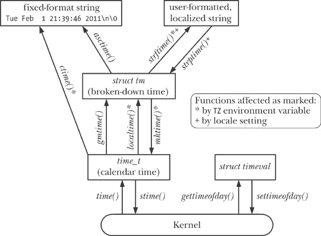

## 第十章 时间

在一个程序中，我们可能对两种类型的时间感兴趣：

+   *实时时间*：这是从某个标准时间点（*日历*时间）或某个固定时间点（通常是进程开始时刻）测量的时间（通常是*经过的*或*墙钟*时间）。获取日历时间对于需要例如给数据库记录或文件加上时间戳的程序非常有用。测量经过的时间对于那些定期执行操作或从外部输入设备获取定期数据的程序也非常有用。

+   *进程时间*：这是一个进程使用的 CPU 时间量。测量进程时间对于检查或优化程序或算法的性能非常有用。

大多数计算机架构都有一个内建的硬件时钟，使得内核能够测量实时时间和进程时间。在本章中，我们将研究处理这两种时间的系统调用，以及在可读时间和内部时间表示之间进行转换的库函数。由于人类可读的时间表示依赖于地理位置以及语言和文化习惯，因此讨论这些表示方式会引导我们进一步探讨时区和区域设置。

## 日历时间

不论地理位置如何，UNIX 系统都将时间内部表示为自纪元以来的秒数；也就是说，从 1970 年 1 月 1 日午夜起的协调世界时（UTC，之前称为格林威治标准时间，或 GMT）。这大约是 UNIX 系统诞生的日期。日历时间存储在类型为*time_t*的变量中，这是 SUSv3 定义的一个整数类型。

### 注意

在 32 位 Linux 系统上，*time_t*（一个有符号整数）可以表示从 1901 年 12 月 13 日 20:45:52 到 2038 年 1 月 19 日 03:14:07 的日期范围。（SUSv3 没有指定负*time_t*值的含义。）因此，许多当前的 32 位 UNIX 系统面临着理论上的*2038 年问题*，如果它们基于未来的日期进行计算，可能会在 2038 年之前就遇到此问题。这个问题到 2038 年可能会得到显著缓解，因为到那时，几乎所有 UNIX 系统都会转为 64 位及更高位。然而，32 位嵌入式系统通常比桌面硬件有更长的生命周期，因此仍可能遭遇这个问题。此外，任何以 32 位*time_t*格式保存时间的旧数据和应用程序，也将持续受到此问题的影响。

*gettimeofday()* 系统调用将日历时间返回到由*tv*指针指向的缓冲区。

```
#include <sys/time.h>
int `gettimeofday`(struct timeval **tv*, struct timezone **tz*);
```

### 注意

成功时返回 0，出错时返回-1

*tv* 参数是指向以下结构的指针：

```
struct timeval {
    time_t      tv_sec;     /* Seconds since 00:00:00, 1 Jan 1970 UTC */
    suseconds_t tv_usec;    /* Additional microseconds (long int) */
};
```

尽管*tv_usec*字段提供微秒级精度，但它返回的值的准确性由依赖于架构的实现决定。(*tv_usec*中的*u*源自希腊字母µ（“mu”），该字母在公制系统中表示百万分之一。) 在现代 x86-32 系统（即带有时间戳计数器寄存器的 Pentium 系统，该寄存器在每个 CPU 时钟周期时递增一次）上，*gettimeofday()*确实提供微秒级精度。

*gettimeofday()*的*tz*参数是一个历史遗留问题。在早期的 UNIX 实现中，使用它来检索系统的时区信息。现在该参数已废弃，应始终指定为`NULL`。

### 注意

如果提供了*tz*参数，则返回一个*timezone*结构，其字段包含在之前调用*settimeofday()*时指定的（已废弃）*tz*参数的值。该结构包含两个字段：*tz_minuteswest*和*tz_dsttime*。*tz_minuteswest*字段表示必须加到此时区的时间中的分钟数，以匹配 UTC，负值表示需要调整为 UTC 东部的分钟数（例如，对于中欧时间，比 UTC 快一个小时，该字段的值为-60）。*tz_dsttime*字段包含一个常量，用于表示此时区内施行的夏令时（DST）制度。由于夏令时制度无法通过简单的算法表示，因此*tz*参数已经废弃。（该字段在 Linux 上从未被支持。）有关更多详情，请参见*gettimeofday(2)*手册页。

*time()*系统调用返回自 Epoch 以来的秒数（即与*gettimeofday()*在其*tv*参数的*tv_sec*字段中返回的值相同）。

```
#include <time.h>

time_t `time`(time_t **timep*);
```

### 注意

返回自 Epoch 以来的秒数，或在出错时返回*(time_t)* -1。

如果*timep*参数不为`NULL`，则自 Epoch 以来的秒数也将被存储在*timep*指向的位置。

由于*time()*以两种方式返回相同的值，并且使用*time()*时唯一可能发生的错误是给出无效的地址作为*timep*参数（`EFAULT`），我们通常仅使用以下调用（不进行错误检查）：

```
t = time(NULL);
```

### 注意

存在两个系统调用（*time()*和*gettimeofday()*），它们本质上具有相同的目的，这一事实源于历史。早期的 UNIX 实现提供了*time()*。4.2BSD 增加了更精确的*gettimeofday()*系统调用。*time()*作为系统调用的存在现在是多余的；它可以作为一个库函数来实现，该函数调用*gettimeofday()*。

## 时间转换函数

图 10-1 显示了用于在 *time_t* 值和其他时间格式（包括可打印表示）之间转换的函数。这些函数将我们从时区、夏令时（DST）制度和本地化问题带来的复杂性中解救出来。（我们在 时区 和本地化设置在第 10.4 节中描述了时区。）

图 10-1. 用于获取和处理日历时间的函数

### 将 *time_t* 转换为可打印格式

*ctime()* 函数提供了一种将 *time_t* 值转换为可打印格式的简单方法。

```
#include <time.h>

char *`ctime`(const time_t **timep*);
```

### 注意

成功时返回指向静态分配字符串的指针，该字符串以换行符和 `\0` 结束，出错时返回 `NULL`

给定一个指向 *time_t* 值的指针 *timep*，*ctime()* 返回一个 26 字节的字符串，包含日期和时间，格式为标准格式，如以下示例所示：

```
Wed Jun  8 14:22:34 2011
```

字符串包括一个终止的换行符和一个终止的空字节。*ctime()* 函数在执行转换时会自动考虑本地时区和夏令时设置。（我们将在第 10.3 节解释这些设置是如何确定的。）返回的字符串是静态分配的；将来的 *ctime()* 调用会覆盖它。

SUSv3 规定，调用任何 *ctime()*、*gmtime()*、*localtime()* 或 *asctime()* 函数时，可能会覆盖由其他函数返回的静态分配结构。换句话说，这些函数可能共享返回的字符数组和 *tm* 结构的单一副本，而在某些版本的 *glibc* 中正是这样实现的。如果我们需要在多次调用这些函数时保持返回的信息，必须保存本地副本。

### 注意

*ctime()* 的重入版本以 *ctime_r()* 形式提供。（我们在 重入函数和异步信号安全函数 中解释了重入性。）此函数允许调用者指定一个额外的参数，它是一个指向（调用者提供的）缓冲区的指针，用于返回时间字符串。本章中提到的其他重入版本的函数也有类似的操作。

### 在 *time_t* 和分解时间之间转换

*gmtime()* 和 *localtime()* 函数将 *time_t* 值转换为所谓的 *分解时间*。分解时间被存放在一个静态分配的结构中，该结构的地址作为函数的返回值。

```
#include <time.h>

struct tm *`gmtime`(const time_t **timep*);
struct tm *`localtime`(const time_t **timep*);
```

### 注意

两者成功时返回指向静态分配的分解时间结构的指针，出错时返回 `NULL`

*gmtime()*函数将日历时间转换为与 UTC 对应的拆分时间。（*gm*字母源自格林威治标准时间。）相比之下，*localtime()*考虑了时区和夏令时设置，返回与系统本地时间对应的拆分时间。

### 注意

这些函数的可重入版本分别为*gmtime_r()*和*localtime_r()*。

这些函数返回的*tm*结构包含将日期和时间字段拆分为单独部分的内容。该结构具有以下形式：

```
struct tm {
    int tm_sec;        /* Seconds (0-60) */
    int tm_min;        /* Minutes (0-59) */
    int tm_hour;       /* Hours (0-23) */
    int tm_mday;       /* Day of the month (1-31) */
    int tm_mon;        /* Month (0-11) */
    int tm_year;       /* Year since 1900 */
    int tm_wday;       /* Day of the week (Sunday = 0)*/
    int tm_yday;       /* Day in the year (0-365; 1 Jan = 0)*/
    int tm_isdst;      /* Daylight saving time flag
                            > 0: DST is in effect;
                            = 0: DST is not effect;
                            < 0: DST information not available */
};
```

*tm_sec*字段可以最大为 60（而不是 59），以考虑偶尔对人类日历进行调整的闰秒，使其与天文学上精确的（即所谓的*热带*）年保持一致。

如果定义了`_BSD_SOURCE`特性测试宏，则*glibc*对*tm*结构的定义还包括两个额外的字段，包含有关表示时间的进一步信息。第一个字段，*long int tm_gmtoff*，包含表示时间距离 UTC 的秒数。第二个字段，*const char *tm_zone*，是时区的缩写名称（例如，*CEST*表示中欧夏令时）。SUSv3 没有指定这两个字段，它们只出现在一些其他 UNIX 实现中（主要是 BSD 衍生版本）。

*mktime()*函数将一个拆分的时间（表示为本地时间）转换为一个*time_t*值，该值作为函数的返回结果。调用者提供指向拆分时间的*tm*结构，该结构由*timeptr*指向。在此转换过程中，输入的*tm*结构的*tm_wday*和*tm_yday*字段会被忽略。

```
#include <time.h>

time_t `mktime`(struct tm **timeptr*);
```

### 注意

成功时返回自 Epoch 以来的秒数，失败时返回*(time_t)* -1

*mktime()*函数可能会修改由*timeptr*指向的结构。至少，它会确保*tm_wday*和*tm_yday*字段被设置为与其他输入字段的值相对应的合适值。

此外，*mktime()*不要求其他字段的*tm*结构限制在先前描述的范围内。对于任何超出范围的字段，*mktime()*会调整该字段的值，使其落入有效范围，并对其他字段进行适当的调整。这些调整会在*mktime()*更新*tm_wday*和*tm_yday*字段并计算返回的*time_t*值之前进行。

例如，如果输入的*tm_sec*字段为 123，则返回时，该字段的值将为 3，*tm_min*字段的值将在原有基础上加 2。（如果这个加法导致*tm_min*溢出，则*tm_min*值会被调整，*tm_hour*字段会递增，以此类推。）这些调整甚至适用于负值字段。例如，指定*tm_sec*为-1 意味着前一分钟的第 59 秒。这个功能非常有用，因为它允许我们对拆分的时间值进行日期和时间运算。

时区设置由 *mktime()* 在进行转换时使用。此外，夏令时设置可能会被使用，也可能不会，取决于输入的 *tm_isdst* 字段的值：

+   如果 *tm_isdst* 为 0，则将此时间视为标准时间（即忽略夏令时，即使在此时段夏令时本应生效）。

+   如果 *tm_isdst* 大于 0，则将此时间视为夏令时（即使在此时段夏令时本应不生效，也要按夏令时处理）。

+   如果 *tm_isdst* 小于 0，则尝试确定此时段是否会生效夏令时。这通常是我们希望的设置。

完成后（无论 *tm_isdst* 的初始设置如何），*mktime()* 会将 *tm_isdst* 字段设置为正值，表示在给定日期生效了夏令时；如果没有生效，则设置为 0。

### 从分解时间到可打印形式的转换

本节描述了将分解时间转换为可打印形式的函数，以及反向转换的函数。

#### 从分解时间到可打印形式的转换

给定一个指向分解时间结构的指针 *tm*，*asctime()* 返回一个指向静态分配的字符串的指针，该字符串包含与 *ctime()* 相同格式的时间。

```
#include <time.h>

char *`asctime`(const struct tm **timeptr*);
```

### 注意

成功时返回指向以换行符和 `\0` 终止的静态分配字符串的指针，出错时返回 `NULL`。

与 *ctime()* 相比，*asctime()* 不受本地时区设置的影响，因为它转换的是一个通常已通过 *localtime()* 本地化，或者是 *gmtime()* 返回的 UTC 时间的分解时间。

与 *ctime()* 类似，我们无法控制 *asctime()* 输出字符串的格式。

### 注意

提供了 *asctime()* 的可重入版本 *asctime_r()*。

示例 10-1 演示了 *asctime()* 的使用，以及本章迄今为止描述的所有时间转换函数。该程序检索当前的日历时间，然后使用各种时间转换函数并显示其结果。以下是我们在德国慕尼黑运行该程序时看到的示例（冬季时，慕尼黑处于中欧时间，比 UTC 快一小时）：

```
$ `date`
Tue Dec 28 16:01:51 CET 2010
$ `./calendar_time`
Seconds since the Epoch (1 Jan 1970): 1293548517 (about 40.991 years)
  gettimeofday() returned 1293548517 secs, 715616 microsecs
Broken down by gmtime():
  year=110 mon=11 mday=28 hour=15 min=1 sec=57 wday=2 yday=361 isdst=0
Broken down by localtime():
  year=110 mon=11 mday=28 hour=16 min=1 sec=57 wday=2 yday=361 isdst=0

asctime() formats the gmtime() value as: Tue Dec 28 15:01:57 2010
ctime() formats the time() value as:     Tue Dec 28 16:01:57 2010
mktime() of gmtime() value:    1293544917 secs
mktime() of localtime() value: 1293548517 secs      *3600 secs ahead of UTC*
```

示例 10-1. 获取和转换日历时间

```
`time/calendar_time.c`
#include <locale.h>
#include <time.h>
#include <sys/time.h>
#include "tlpi_hdr.h"
#define SECONDS_IN_TROPICAL_YEAR (365.24219 * 24 * 60 * 60)

int
main(int argc, char *argv[])
{
    time_t t;
    struct tm *gmp, *locp;
    struct tm gm, loc;
    struct timeval tv;

    t = time(NULL);
    printf("Seconds since the Epoch (1 Jan 1970): %ld", (long) t);
    printf(" (about %6.3f years)\n", t / SECONDS_IN_TROPICAL_YEAR);

    if (gettimeofday(&tv, NULL) == -1)
        errExit("gettimeofday");
    printf("  gettimeofday() returned %ld secs, %ld microsecs\n",
            (long) tv.tv_sec, (long) tv.tv_usec);

    gmp = gmtime(&t);
    if (gmp == NULL)
        errExit("gmtime");

    gm = *gmp;          /* Save local copy, since *gmp may be modified
                           by asctime() or gmtime() */
    printf("Broken down by gmtime():\n");
    printf("  year=%d mon=%d mday=%d hour=%d min=%d sec=%d ", gm.tm_year,
            gm.tm_mon, gm.tm_mday, gm.tm_hour, gm.tm_min, gm.tm_sec);
    printf("wday=%d yday=%d isdst=%d\n", gm.tm_wday, gm.tm_yday, gm.tm_isdst);

    locp = localtime(&t);
    if (locp == NULL)
        errExit("localtime");

    loc = *locp;        /* Save local copy */

    printf("Broken down by localtime():\n");
    printf("  year=%d mon=%d mday=%d hour=%d min=%d sec=%d ",
            loc.tm_year, loc.tm_mon, loc.tm_mday,
            loc.tm_hour, loc.tm_min, loc.tm_sec);
    printf("wday=%d yday=%d isdst=%d\n\n",
            loc.tm_wday, loc.tm_yday, loc.tm_isdst);

    printf("asctime() formats the gmtime() value as: %s", asctime(&gm));
    printf("ctime() formats the time() value as:     %s", ctime(&t));

    printf("mktime() of gmtime() value:    %ld secs\n", (long) mktime(&gm));
    printf("mktime() of localtime() value: %ld secs\n", (long) mktime(&loc));

    exit(EXIT_SUCCESS);
}
     `time/calendar_time.c`
```

*strftime()* 函数在将分解时间转换为可打印形式时，提供了更精确的控制。给定一个指向分解时间的指针 *timeptr*，*strftime()* 会将相应的以空字符终止的日期加时间字符串放入 *outstr* 指向的缓冲区中。

```
#include <time.h>

size_t `strftime`(char **outstr*, size_t *maxsize*, const char **format*,
                const struct tm **timeptr*);
```

### 注意

成功时返回放入 *outstr* 中的字节数（不包括终止的空字节），出错时返回 0。

返回的字符串 *outstr* 会根据 *format* 中的规范进行格式化。*maxsize* 参数指定 *outstr* 中可用的最大空间。与 *ctime()* 和 *asctime()* 不同，*strftime()* 不会在字符串末尾添加换行符（除非 *format* 中包含换行符）。

成功时，*strftime()* 返回存入 *outstr* 中的字节数，不包括终止的空字节。如果结果字符串的总长度（包括终止的空字节）超过了 *maxsize* 字节，则 *strftime()* 返回 0 表示出错，并且 *outstr* 的内容是不确定的。

*strftime()* 的 *format* 参数是一个类似于给 *printf()* 的字符串。以百分号（`%`）开头的序列是转换说明符，会根据其后的说明符字符替换为日期和时间的各个组成部分。提供了丰富的转换说明符，其中的一部分列在 表 10-1* 的选择性转换说明符") 中。（完整列表请参见 *strftime(3)* 手册页。）除非另有说明，所有这些转换说明符都是在 SUSv3 中标准化的。

`%U` 和 `%W` 说明符都表示年份中的周数。`%U` 的周数是这样计算的：包含一个星期天的第一周被编号为 1，之前的部分周被编号为 0。如果星期天恰好是年份的第一天，那么就没有第 0 周，且年份的最后一天会落在第 53 周。

通常，我们希望在本书的各种示范程序中显示当前时间。为此，我们提供了函数 *currTime()*，当传入 *format* 参数时，它返回一个包含当前时间的字符串，该字符串格式化方式由 *strftime()* 确定。

```
#include "curr_time.h"

char *`currTime`(const char **format*);
```

### 注意

返回指向静态分配字符串的指针，出错时返回`NULL`

*currTime()* 函数的实现见 示例 10-2。

表 10-1. *strftime()* 的选择性转换说明符

| 说明符 | 描述 | 示例 |
| --- | --- | --- |
| `%%` | 百分号字符 | `%` |
| `%a` | 缩写的星期几名称 | `Tue` |
| `%A` | 完整的星期几名称 | `Tuesday` |
| `%b`, `%h` | 缩写的月份名称 | `Feb` |
| `%B` | 完整的月份名称 | `February` |
| `%c` | 日期和时间 | `Tue Feb 1 21:39:46 2011` |
| `%d` | 月中的哪一天（2 位数字，01 到 31） | `01` |
| `%D` | 美国日期（与 `%m/%d/%y` 相同） | `02/01/11` |
| `%e` | 月中的哪一天（2 个字符） | `1` |
| `%F` | ISO 日期（与 `%Y-%m-%d` 相同） | `2011-02-01` |
| `%H` | 小时（24 小时制，2 位数字） | `21` |
| `%I` | 小时（12 小时制，2 位数字） | `09` |
| `%j` | 年中的第几天（3 位数字，001 到 366） | `032` |
| `%m` | 十进制月份（2 位数字，01 到 12） | `02` |
| `%M` | 分钟（2 位数字） | `39` |
| `%p` | AM/PM | `PM` |
| `%P` | am/pm（GNU 扩展） | `pm` |
| `%R` | 24 小时制时间（与 `%H:%M` 相同） | `21:39` |
| `%S` | 秒（00 到 60） | `46` |
| `%T` | 时间（与 `%H:%M:%S` 相同） | `21:39:46` |
| `%u` | 星期几编号（1 到 7，星期一 = 1） | `2` |
| `%U` | 星期天所在周数（00 到 53） | `05` |
| `%w` | 星期几编号（0 到 6，星期日 = 0） | `2` |
| `%W` | 星期一所在周数（00 到 53） | `05` |
| `%x` | 日期（本地化） | `02/01/11` |
| `%X` | 时间（本地化） | `21:39:46` |
| `%y` | 2 位数年份 | `11` |
| `%Y` | 4 位数年份 | `2011` |
| `%Z` | 时区名称 | `CET` |

示例 10-2。返回当前时间的字符串的函数

```
`time/curr_time.c`
#include <time.h>
#include "curr_time.h"          /* Declares function defined here */

#define BUF_SIZE 1000

/* Return a string containing the current time formatted according to
   the specification in 'format' (see strftime(3) for specifiers).
   If 'format' is NULL, we use "%c" as a specifier (which gives the
   date and time as for ctime(3), but without the trailing newline).
   Returns NULL on error. */

char *
currTime(const char *format)
{
    static char buf[BUF_SIZE];  /* Nonreentrant */
    time_t t;
    size_t s;
    struct tm *tm;

    t = time(NULL);
    tm = localtime(&t);
    if (tm == NULL)
        return NULL;

    s = strftime(buf, BUF_SIZE, (format != NULL) ? format : "%c", tm);

    return (s == 0) ? NULL : buf;
}
     `time/curr_time.c`
```

#### 从可打印形式转换为分解后的时间

*strptime()* 函数是 *strftime()* 的逆操作。它将一个日期和时间字符串转换为分解后的时间。

```
#define _XOPEN_SOURCE

#include <time.h>

char *`strptime`(const char **str*, const char **format*, struct tm **timeptr*);
```

### 注意

成功时，返回指向 *str* 中下一个未处理字符的指针，出错时返回`NULL`

*strptime()* 函数使用 *format* 中给定的规格来解析 *str* 中的日期和时间字符串，并将转换后的分解时间放入 *timeptr* 指向的结构中。

成功时，*strptime()* 返回指向 *str* 中下一个未处理字符的指针。（如果字符串包含进一步需要处理的信息供调用程序使用，这一点很有用。）如果无法匹配完整的格式字符串，*strptime()* 返回 `NULL` 以表示错误。

给 *strptime()* 的格式说明符类似于给 *scanf(3)* 的说明符。它包含以下几种类型的字符：

+   以百分号字符（`%`）开头的转换说明符；

+   空格字符，匹配输入字符串中的零个或多个空格；

+   非空格字符（除了 `%` 之外），这些字符必须与输入字符串中的相应字符完全匹配。

转换说明符类似于给 *strftime()* 的说明符（表 10-1 的选定转换说明符")）。主要区别在于这些说明符更为通用。例如，`%a` 和 `%A` 都可以接受全称或简写形式的星期几名称，而 `%d` 或 `%e` 可以用于读取带有或不带有前导零的单数字日期。此外，大小写被忽略；例如，*May* 和 *MAY* 都是等效的月份名称。字符串 `%%` 用于匹配输入字符串中的百分号字符。*strptime(3)* 手册页提供了更多细节。

*glibc*实现的*strptime()*不会修改*tm*结构中那些未被*format*中的说明符初始化的字段。这意味着我们可以通过一系列*strptime()*调用，将多个字符串中的信息（如日期字符串和时间字符串）构建成一个单一的*tm*结构。虽然 SUSv3 允许这种行为，但并不要求它，因此我们不能在其他 UNIX 实现中依赖这种行为。在可移植应用程序中，我们必须确保*str*和*format*包含能设置所有*tm*结构字段的输入，或者在调用*strptime()*之前确保*tm*结构已适当初始化。在大多数情况下，使用*memset()*将整个结构归零就足够了，但要注意，在*glibc*和许多其他时间转换函数的实现中，*tm_mday*字段的值为 0 表示上个月的最后一天。最后，注意*strptime()*从不设置*tm*结构中*tm_isdst*字段的值。

### 注意

GNU C 库还提供了两个与*strptime()*类似的函数：*getdate()*（在 SUSv3 中指定并广泛可用）及其可重入版本*getdate_r()*（在 SUSv3 中未指定，仅在少数其他 UNIX 实现中可用）。我们在此不描述这些函数，因为它们使用外部文件（由环境变量`DATEMSK`指定）来确定扫描日期时使用的格式，这使得它们使用起来有些笨拙，并且在设置用户 ID 程序时会带来安全漏洞。

示例 10-3 演示了*strptime()*和*strftime()*的使用。该程序接受一个包含日期和时间的命令行参数，使用*strptime()*将其转换为拆分后的时间，然后显示使用*strftime()*进行反向转换的结果。该程序最多接受三个参数，其中前两个是必需的。第一个参数是包含日期和时间的字符串。第二个参数是*strptime()*用于解析第一个参数的格式规范。可选的第三个参数是*strftime()*用于反向转换的格式字符串。如果省略此参数，则使用默认格式字符串。（我们在第 10.4 节中描述了该程序中使用的*setlocale()*函数。）以下是该程序的一些使用示例：

```
$ `./strtime "9:39:46pm 1 Feb 2011" "%I:%M:%S%p %d %b %Y"`

calendar time (seconds since Epoch): 1296592786
strftime() yields: 21:39:46 Tuesday, 01 February 2011 CET
```

以下用法相似，但这次我们显式指定了*strftime()*的格式：

```
$ `./strtime "9:39:46pm 1 Feb 2011" "%I:%M:%S%p %d %b %Y" "%F %T"`
calendar time (seconds since Epoch): 1296592786
strftime() yields: 2011-02-01 21:39:46
```

示例 10-3. 获取并转换日历时间

```
`time/strtime.c`
#define _XOPEN_SOURCE
#include <time.h>
#include <locale.h>
#include "tlpi_hdr.h"

#define SBUF_SIZE 1000

int
main(int argc, char *argv[])
{
    struct tm tm;
    char sbuf[SBUF_SIZE];
    char *ofmt;

    if (argc < 3 || strcmp(argv[1], "--help") == 0)
        usageErr("%s input-date-time in-format [out-format]\n", argv[0]);

    if (setlocale(LC_ALL, "") == NULL)
        errExit("setlocale");   /* Use locale settings in conversions */

    memset(&tm, 0, sizeof(struct tm));          /* Initialize 'tm' */
    if (strptime(argv[1], argv[2], &tm) == NULL)
        fatal("strptime");

    tm.tm_isdst = -1;           /* Not set by strptime(); tells mktime()
                                   to determine if DST is in effect */
    printf("calendar time (seconds since Epoch): %ld\n", (long) mktime(&tm));

    ofmt = (argc > 3) ? argv[3] : "%H:%M:%S %A, %d %B %Y %Z";
    if (strftime(sbuf, SBUF_SIZE, ofmt, &tm) == 0)
        fatal("strftime returned 0");
    printf("strftime() yields: %s\n", sbuf);

    exit(EXIT_SUCCESS);
}
     `time/strtime.c`
```

## 时区

不同的国家（有时即使是同一国家的不同地区）使用不同的时区和夏令时制度。输入和输出时间的程序必须考虑它们运行的系统的时区和夏令时制度。幸运的是，所有这些细节都由 C 库处理。

#### 时区定义

时区信息通常是庞大且易变的。因此，系统将此信息保存在标准格式的文件中，而不是直接编码到程序或库中。

这些文件存放在`/usr/share/zoneinfo`目录下。该目录中的每个文件包含一个特定国家或地区的时区信息。这些文件的命名根据所描述的时区，因此我们可能会找到如`EST`（美国东部标准时间）、`CET`（中欧时间）、`UTC`、`Turkey`和`Iran`等文件。此外，子目录可用于按层次结构组织相关的时区。在如`Pacific`的目录下，我们可能会找到`Auckland`、`Port_Moresby`和`Galapagos`等文件。当我们为程序指定时区时，实际上是为该目录中的某个时区文件指定了一个相对路径名。

系统的本地时间由时区文件`/etc/localtime`定义，该文件通常链接到`/usr/share/zoneinfo`目录中的某个文件。

### 注意

时区文件的格式在*tzfile(5)*手册页中有说明。时区文件是使用*zic(8)*，即*时区信息编译器*构建的。*zdump(8)*命令可用于显示根据指定时区文件中的时区当前的时间。

#### 为程序指定时区

在运行程序时指定时区，我们将`TZ`环境变量设置为一个字符串，格式为一个冒号（`:`）后跟`/usr/share/zoneinfo`中定义的某个时区名称。设置时区会自动影响函数*ctime()*、*localtime()*、*mktime()*和*strftime()*。

要获取当前的时区设置，每个这些函数都使用*tzset(3)*，它初始化了三个全局变量：

```
char *tzname[2];    /* Name of timezone and alternate (DST) timezone */
int daylight;       /* Nonzero if there is an alternate (DST) timezone */
long timezone;      /* Seconds difference between UTC and local
                       standard time */
```

*tzset()* 函数首先检查`TZ`环境变量。如果该变量没有设置，则时区会初始化为在时区文件`/etc/localtime`中定义的默认时区。如果`TZ`环境变量被定义为无法匹配到时区文件的值，或者为空字符串，则使用 UTC。`TZDIR`环境变量（一个非标准的 GNU 扩展）可以设置为指定的目录名称，在该目录中查找时区信息，而不是默认的`/usr/share/zoneinfo`。

我们可以通过运行示例 10-4 程序来查看`TZ`变量的效果。在第一次运行中，我们看到与系统默认时区（中欧时间，CET）对应的输出。在第二次运行中，我们指定了新西兰的时区，此时新西兰正处于夏令时，比中欧时间早 12 小时。

```
$ `./show_time`
ctime() of time() value is:  Tue Feb  1 10:25:56 2011
asctime() of local time is:  Tue Feb  1 10:25:56 2011
strftime() of local time is: Tuesday, 01 Feb 2011, 10:25:56 CET
$ `TZ=":Pacific/Auckland" ./show_time`
ctime() of time() value is:  Tue Feb  1 22:26:19 2011
asctime() of local time is:  Tue Feb  1 22:26:19 2011
strftime() of local time is: Tuesday, 01 February 2011, 22:26:19 NZDT
```

示例 10-4. 展示时区和区域设置的影响

```
`time/show_time.c`
#include <time.h>
#include <locale.h>
#include "tlpi_hdr.h"

#define BUF_SIZE 200

int
main(int argc, char *argv[])
{
    time_t t;
    struct tm *loc;
    char buf[BUF_SIZE];

    if (setlocale(LC_ALL, "") == NULL)
        errExit("setlocale");   /* Use locale settings in conversions */

    t = time(NULL);

    printf("ctime() of time() value is:  %s", ctime(&t));

    loc = localtime(&t);
    if (loc == NULL)
        errExit("localtime");

    printf("asctime() of local time is:  %s", asctime(loc));

    if (strftime(buf, BUF_SIZE, "%A, %d %B %Y, %H:%M:%S %Z", loc) == 0)
        fatal("strftime returned 0");
    printf("strftime() of local time is: %s\n", buf);

    exit(EXIT_SUCCESS);
}
      `time/show_time.c`
```

SUSv3 定义了设置`TZ`环境变量的两种通用方式。如前所述，`TZ`可以设置为一个字符序列，包括一个冒号和一个以实现特定方式标识时区的字符串，通常作为时区描述文件的路径名。（Linux 和其他一些 UNIX 实现允许在使用这种形式时省略冒号，但 SUSv3 并没有规定这一点；为了便于移植性，我们应始终包含冒号。）

设置`TZ`的另一种方法在 SUSv3 中有详细说明。在这种方法中，我们将以下格式的字符串分配给`TZ`：

```
*std offset* [ *dst* [ *offset* ][ , *start-date* [
 /*time* ] , *end-date* [ /*time* ]]]
```

上面的行中包括空格是为了清晰，但`TZ`值中不应包含空格。括号（`[]`）用于表示可选组件。

*std*和*dst*组件是定义标准时区和夏令时时区名称的字符串；例如，中欧时间（CET）和中欧夏令时（CEST）。每个组件中的*offset*指定要添加到本地时间的正或负调整，以将其转换为 UTC。最后四个组件提供一个规则，描述从标准时间到夏令时的切换时间。

日期可以以多种形式指定，其中一种是`M`*`m`*`.`*`n`*`.`d。这种表示法意味着星期*n*（1 到 5，其中 5 总是指最后一个*d*日）的第*d*天（0=星期天，6=星期六）的月份*m*（1 到 12）。如果省略了*时间*，它默认为每次 02:00:00（凌晨 2 点）。

以下是我们如何为中欧定义`TZ`，其中标准时间比 UTC 快一小时，夏令时（从三月的最后一个星期天到十月的最后一个星期天）比 UTC 快两小时：

```
TZ="CET-1:00:00CEST-2:00:00,M3.5.0,M10.5.0"
```

我们省略了夏令时切换的时间规格，因为它发生在默认的 02:00:00。当然，前述格式的可读性不如 Linux 特定的近似形式：

```
TZ=":Europe/Berlin"
```

## 区域设置

世界上有几千种语言，其中相当大一部分在计算机系统中被定期使用。此外，不同国家使用不同的惯例来显示信息，如数字、货币金额、日期和时间。例如，在大多数欧洲国家，使用逗号而非小数点来分隔（实数）数字的整数部分和小数部分，大多数国家使用的日期书写格式不同于美国使用的*MM/DD/YY*格式。SUSv3 将*区域*定义为“依赖于语言和文化惯例的用户环境子集。”

理想情况下，所有设计用于在多个位置运行的程序都应处理区域设置，以便以用户首选的语言和格式显示和输入信息。这构成了复杂的*国际化*主题。在理想情况下，我们只需编写一次程序，然后无论它运行在哪里，它都会在执行输入输出操作时自动做出正确的处理；也就是说，它会执行*本地化*的任务。使程序国际化是一项相当耗时的工作，尽管有各种工具可以简化这个过程。像*glibc*这样的程序库也提供了帮助国际化的功能。

### 注意

*国际化*这个术语常被写作*I18N*，即*I*加 18 个字母加*N*。这个术语不仅写起来更快，还有一个优点，即避免了英国英语和美式英语中拼写差异的问题。

#### 区域定义

与时区信息类似，区域信息通常既庞大又不断变化。因此，系统通过标准格式的文件来存储这些信息，而不是要求每个程序和库都存储区域信息。

区域信息在`/usr/share/locale`（或某些发行版中的`/usr/lib/locale`）的目录层次结构中维护。该目录下的每个子目录包含有关特定区域的信息。这些目录使用以下约定命名：

```
*language*[_*territory*[.*codeset*]][@*modifier*]
```

*语言*是一个两字母的 ISO 语言代码，*地区*是一个两字母的 ISO 国家代码。*字符集*指定一个字符编码集。*修饰符*提供了一种区分具有相同语言、地区和字符集的多个区域目录的方法。一个完整的区域目录名称的示例是`de_DE.utf-8@euro`，表示：德语语言，德国，UTF-8 字符编码，使用欧元作为货币单位。

如目录命名格式中所示的括号所示，区域目录名称的各个部分可以省略。通常，名称仅包含语言和地区。因此，目录`en_US`是针对（讲英语的）美国的区域目录，而`fr_CH`是针对瑞士法语区的区域目录。

### 注意

*CH*代表*Confoederatio Helvetica*，这是瑞士的拉丁文名称（因此是本地语言中立的）。瑞士有四种官方语言，是一个具有多个时区的国家类比的语言环境示例。

当我们为程序指定要使用的语言环境时，实际上是指定了`/usr/share/locale`下某个子目录的名称。如果程序指定的语言环境名称与某个语言环境目录名称完全不匹配，则 C 库会按以下顺序通过去除组件来查找匹配项：

1.  codeset

1.  规范化代码集

1.  territory

1.  modifier

规范化的代码集是代码集名称的一种版本，其中所有非字母数字字符被移除，所有字母都转换为小写，并且结果字符串前加上字符`iso`。规范化的目的是处理代码集名称中大写字母和标点符号（例如，额外的连字符）的变化。

作为此剥离过程的示例，如果程序的语言环境指定为`fr_CH.utf-8`，但没有该名称的语言环境目录，则如果`fr_CH`语言环境目录存在，将匹配该目录。如果`fr_CH`目录不存在，则将使用`fr`语言环境目录。如果`fr`目录也不存在，则即将介绍的*setlocale()*函数将报告错误。

### 注意

文件`/usr/share/locale/locale.alias`定义了为程序指定语言环境的替代方式。有关详细信息，请参见*locale.aliases(5)*手册页面。

每个语言环境子目录下都有一组标准文件，指定该语言环境的约定，如表 10-2 所示。请注意以下关于此表中信息的进一步说明：

+   `LC_COLLATE`文件定义了一组规则，描述字符集中的字符如何排序（即字符集的“字母顺序”）。这些规则决定了*strcoll(3)*和*strxfrm(3)*函数的操作。即使是使用拉丁字母的语言也不遵循相同的排序规则。例如，一些欧洲语言有额外的字母，在某些情况下，这些字母排序在字母*Z*之后。其他特殊情况包括西班牙语的双字母序列*ll*，它作为一个单独的字母排序在*l*之后，以及德语的变音字符，如*ä*，它对应于*ae*并按这两个字母排序。

+   `LC_MESSAGES`目录是朝着国际化程序显示消息迈出的第一步。通过使用消息目录（参见*catopen(3)*和*catgets(3)*手册页面）或 GNU *gettext* API（可在[`www.gnu.org/`](http://www.gnu.org/)找到），可以实现程序消息的更广泛国际化。

### 注意

*glibc* 版本 2.2.2 引入了多个新的非标准区域设置类别。`LC_ADDRESS`定义了区域特定的邮政地址表示规则。`LC_IDENTIFICATION`指定了标识区域设置的信息。`LC_MEASUREMENT`定义了该区域的测量系统（例如，公制与英制）。`LC_NAME`定义了表示个人姓名和头衔的区域特定规则。`LC_PAPER`定义了该区域的标准纸张大小（例如，美国信纸与大多数其他国家使用的 A4 格式）。`LC_TELEPHONE`定义了区域特定的国内和国际电话号码表示规则，以及国际国家前缀和国际拨出前缀。

表 10-2. 区域设置特定子目录的内容

| 文件名 | 作用 |
| --- | --- |
| `LC_CTYPE` | 一个包含字符分类（参见 *isalpha(3)*) 和大小写转换规则的文件 |
| `LC_COLLATE` | 包含字符集排序规则的文件 |
| `LC_MONETARY` | 包含货币值格式化规则的文件（参见 *localeconv(3)* 和 `<locale.h>`） |
| `LC_NUMERIC` | 包含除货币值以外的数字格式化规则的文件（参见 *localeconv(3)* 和 `<locale.h>`） |
| `LC_TIME` | 一个包含日期和时间格式化规则的文件 |
| `LC_MESSAGES` | 一个包含用于肯定和否定（是/否）响应格式和数值的文件夹 |

系统上定义的实际区域设置可能会有所不同。SUSv3 并未对此做出任何要求，除了必须定义一个名为*POSIX*的标准区域设置（同义词为*C*，这是一个历史原因存在的名称）。该区域设置反映了 UNIX 系统的历史行为。因此，它基于 ASCII 字符集，并使用英语表示星期几和月份的名称，以及“是/否”的回应。该区域设置的货币和数字组件未定义。

### 注释

*locale* 命令显示关于当前区域设置环境的信息（在 Shell 中）。命令 *locale -a* 列出系统上定义的所有区域设置。

#### 为程序指定区域设置

*setlocale()* 函数用于设置和查询程序的当前区域设置。

```
#include <locale.h>

char *`setlocale`(int *category*, const char **locale*);
```

### 注释

成功时返回指向（通常是静态分配的）字符串的指针，标识新的或当前的区域设置，出错时返回`NULL`

*category* 参数用于选择要设置或查询的区域设置部分，并作为一组常量之一指定，这些常量的名称与表 10-2 中列出的区域类别相同。因此，例如，可以将时间显示的区域设置为德国，同时将货币显示的区域设置为美元。或者，更常见的做法是使用值`LC_ALL`来指定希望设置区域设置的所有方面。

设置区域的方法有两种，使用*setlocale()*。*locale*参数可以是一个字符串，指定系统上定义的某个区域（即`/usr/lib/locale`下的子目录名称），如`de_DE`或`en_US`。另外，*locale*也可以指定为空字符串，表示区域设置应从环境变量中获取：

```
setlocale(LC_ALL, "");
```

我们必须进行此调用，才能使程序意识到区域环境变量。如果遗漏此调用，这些环境变量将不会对程序产生任何影响。

当运行一个调用了*setlocale(LC_ALL, “”)*的程序时，我们可以使用一组环境变量来控制区域的各个方面，这些环境变量的名称与表 10-2 中列出的类别对应：`LC_CTYPE`、`LC_COLLATE`、`LC_MONETARY`、`LC_NUMERIC`、`LC_TIME`和`LC_MESSAGES`。另外，我们也可以使用`LC_ALL`或`LANG`环境变量来指定整个区域的设置。如果设置了多个上述变量，则`LC_ALL`优先于所有其他`LC_*`环境变量，而`LANG`的优先级最低。因此，可以使用`LANG`为所有类别设置默认区域，然后使用单独的`LC_*`变量将区域的某些方面设置为与此默认值不同。

其结果是，*setlocale()*返回一个指向（通常是静态分配的）字符串的指针，该字符串标识此类别的区域设置。如果我们仅仅是想查看当前的区域设置，而不进行更改，那么可以将*locale*参数指定为`NULL`。

区域设置控制着广泛的 GNU/Linux 工具的操作，以及*glibc*中的许多函数。包括*strftime()*和*strptime()*（在已解析的时间与可打印格式之间转换），如我们在示例 10-4 中运行程序时，`strftime()`的结果在不同区域下的表现所示：

```
$ `LANG=de_DE ./show_time`                        *German locale*
ctime() of time() value is:  Tue Feb  1 12:23:39 2011
asctime() of local time is:  Tue Feb  1 12:23:39 2011
strftime() of local time is: Dienstag, 01 Februar 2011, 12:23:39 CET
```

下一次运行演示了`LC_TIME`优先于`LANG`：

```
$ `LANG=de_DE LC_TIME=it_IT ./show_time`          *German and Italian locales*
ctime() of time() value is:  Tue Feb  1 12:24:03 2011
asctime() of local time is:  Tue Feb  1 12:24:03 2011
strftime() of local time is: martedì, 01 febbraio 2011, 12:24:03 CET
```

这次运行演示了`LC_ALL`优先于`LC_TIME`：

```
$ `LC_ALL=fr_FR LC_TIME=en_US ./show_time`        *French and US locales*
ctime() of time() value is:  Tue Feb  1 12:25:38 2011
asctime() of local time is:  Tue Feb  1 12:25:38 2011
strftime() of local time is: mardi, 01 février 2011, 12:25:38 CET
```

## 更新系统时钟

现在我们来看两种更新系统时钟的接口：*settimeofday()*和*adjtime()*。这些接口很少被应用程序使用（因为系统时间通常由像*网络时间协议*守护进程这样的工具维护），并且要求调用者具有特权（`CAP_SYS_TIME`）。

*settimeofday()* 系统调用执行的是 *gettimeofday()* 的相反操作（我们在 日历时间 中描述了它）：它将系统的日历时间设置为 *timeval* 结构中由 *tv* 指定的秒数和微秒数。

```
#define _BSD_SOURCE

#include <sys/time.h>

int `settimeofday`(const struct timeval **tv*, const struct timezone **tz*);
```

### 注意

成功时返回 0，出错时返回 -1

与 *gettimeofday()* 一样，*tz* 参数的使用已过时，应始终将该参数指定为 `NULL`。

*tv.tv_usec* 字段的微秒精度并不意味着我们在控制系统时钟时具有微秒级的精度，因为时钟的粒度可能大于一微秒。

尽管 *settimeofday()* 在 SUSv3 中没有被指定，但在其他 UNIX 实现中广泛可用。

### 注意

Linux 还提供了 *stime()* 系统调用来设置系统时钟。*settimeofday()* 和 *stime()* 的区别在于后者的调用允许以 1 秒的精度来表示新的日历时间。与 *time()* 和 *gettimeofday()* 一样，*stime()* 和 *settimeofday()* 都是历史遗留问题：后者更精确的调用是由 4.2BSD 添加的。

由 *settimeofday()* 引起的系统时间的突然变化可能会对依赖单调递增系统时钟的应用程序（例如 *make(1)*、使用时间戳的数据库系统或带时间戳的日志文件）产生不良影响。因此，在进行小范围的时间调整（几秒钟）时，通常建议使用 *adjtime()* 库函数，它会使系统时钟逐渐调整到所需的值。

```
#define _BSD_SOURCE

#include <sys/time.h>

int `adjtime`(struct timeval **delta*, struct timeval **olddelta*);
```

### 注意

成功时返回 0，出错时返回 -1

*delta* 参数指向一个 *timeval* 结构，该结构指定了要改变时间的秒数和微秒数。如果该值为正，则每秒钟向系统时钟添加少量的额外时间，直到添加完所需的时间。如果 *delta* 值为负，则时钟以类似的方式被减速。

### 注意

在 Linux/x86-32 上，时钟调整速率为每 2000 秒 1 秒（即每天 43.2 秒）。

在调用 *adjtime()* 时，可能正在进行不完整的时钟调整。在这种情况下，剩余的未调整时间会以 *timeval* 结构的形式返回，该结构由 *olddelta* 指向。如果我们不关心这个值，可以将 *olddelta* 指定为 `NULL`。相反，如果我们只关心当前未完成的时间修正，并且不想改变值，我们可以将 *delta* 参数指定为 `NULL`。

尽管在 SUSv3 中没有指定，*adjtime()* 在大多数 UNIX 实现中都可用。

### 注意

在 Linux 中，*adjtime()*是建立在更一般（且复杂）的 Linux 特定系统调用*adjtimex()*之上的。该系统调用由*网络时间协议*（NTP）守护进程使用。有关详细信息，请参阅 Linux 源代码、Linux 的*adjtimex(2)*手册页以及 NTP 规范（[Mills，1992]）。

## 软件时钟（Jiffies）

本书中描述的各种与时间相关的系统调用的精度受到系统*软件时钟*的限制，软件时钟以称为*jiffies*的单位来度量时间。一个 jiffy 的大小由内核源代码中的常量`HZ`定义。内核在使用轮询时间共享调度算法分配 CPU 给进程时，单位就是这个（进程优先级（Nice 值））。

在 Linux/x86-32 内核版本 2.4 及之前，软件时钟的频率为 100 赫兹；也就是说，一个 jiffy 等于 10 毫秒。

由于自 Linux 首次实现以来，CPU 速度大幅提高，因此在内核 2.6.0 版本中，Linux/x86-32 上的软件时钟频率提高到了 1000 赫兹。软件时钟频率更高的优点在于定时器可以更精确地运行，时间测量也可以更精确。然而，不建议将时钟频率设置为任意高的值，因为每个时钟中断都会消耗少量的 CPU 时间，而这些时间本应被 CPU 用于执行进程。

内核开发人员的辩论最终导致软件时钟频率成为一个可配置的内核选项（在*处理器类型和功能，定时器频率*下）。自内核 2.6.13 以来，时钟频率可以设置为 100、250（默认值）或 1000 赫兹，分别对应 10、4 和 1 毫秒的 jiffy 值。从内核 2.6.20 开始，还提供了 300 赫兹的频率，这个频率能均匀地适用于两种常见的视频帧率：25 帧每秒（PAL）和 30 帧每秒（NTSC）。

## 进程时间

进程时间是自进程创建以来所使用的 CPU 时间。为了记录目的，内核将 CPU 时间分为以下两个组成部分：

+   *用户 CPU 时间*是指在用户模式下执行的时间。 有时也称为*虚拟时间*，这是程序看起来它可以访问 CPU 的时间。

+   *系统 CPU 时间*是指在内核模式下执行的时间。 这是内核花费时间执行系统调用或为程序执行其他任务（例如处理页面错误）。

有时，我们将进程时间称为进程消耗的*总 CPU 时间*。

当我们从 Shell 中运行程序时，可以使用*time(1)*命令获取进程时间值以及运行程序所需的实际时间：

```
$ `time ./myprog`
real    0m4.84s
user    0m1.030s
sys     0m3.43s
```

*times()*系统调用检索进程时间信息，并将其返回到由*buf*指针指向的结构中。

```
#include <sys/times.h>

clock_t `times`(struct tms **buf*);
```

### 注意

返回自“任意”过去时间点以来的时钟滴答数 (*sysconf(_SC_CLK_TCK)*)，成功时返回，出错时返回 *(clock_t)* -1

由 *buf* 指向的 *tms* 结构体具有以下形式：

```
struct tms {
    clock_t tms_utime;   /* User CPU time used by caller */
    clock_t tms_stime;   /* System CPU time used by caller */
    clock_t tms_cutime;  /* User CPU time of all (waited for) children */
    clock_t tms_cstime;  /* System CPU time of all (waited for) children */
};
```

*tms* 结构体的前两个字段返回调用进程到目前为止使用的用户和系统部分的 CPU 时间。最后两个字段返回所有已终止的子进程所使用的 CPU 时间的信息，这些子进程的父进程（即 *times()* 的调用者）已执行了 *wait()* 系统调用。

用于类型化 *tms* 结构体四个字段的 *clock_t* 数据类型是一种整数类型，衡量的是以 *clock ticks* 为单位的时间。我们可以调用 *sysconf(_SC_CLK_TCK)* 来获取每秒的时钟滴答数，然后将 *clock_t* 值除以这个数字，转换为秒。（我们将在第 11.2 节中描述 *sysconf()*。）

### 注意

在大多数 Linux 硬件架构上，*sysconf(_SC_CLK_TCK)* 返回数字 100。这对应于内核常量 `USER_HZ`。然而，在某些架构上（如 Alpha 和 IA-64），`USER_HZ` 可以定义为除 100 以外的其他值。

成功时，*times()* 返回自某个任意时刻以来经过的（实际）时间，单位为时钟滴答。SUSv3 刻意没有指定这个时刻是什么，仅声明它在调用进程的生命周期内是常量。因此，这个返回值唯一的可移植用途是通过计算多次 *times()* 调用返回值之间的差异来衡量进程执行期间经过的时间。然而，即便是这个用途，*times()* 的返回值也不可靠，因为它可能会超出 *clock_t* 的范围，届时该值会循环重新从 0 开始（即后续的 *times()* 调用返回的值可能低于先前的 *times()* 调用返回的值）。可靠的测量经过时间的方法是使用 *gettimeofday()*（在 日历时间 中描述）。

在 Linux 中，我们可以将 *buf* 设置为 `NULL`；在这种情况下，*times()* 只是简单地返回一个函数结果。然而，这样做并不具备可移植性。SUSv3 中没有指定将 *buf* 设置为 `NULL`，并且许多其他 UNIX 实现要求此参数必须是非 `NULL` 值。

*clock()* 函数提供了一个更简洁的接口来获取进程时间。它返回一个单一的值，表示调用进程使用的总（即用户加系统）CPU 时间。

```
#include <time.h>

clock_t `clock`(void);
```

### 注意

返回调用进程所使用的总 CPU 时间，单位为 `CLOCKS_PER_SEC`，或者在出错时返回 *(clock_t)* -1

*clock()*返回的值是以`CLOCKS_PER_SEC`为单位测量的，因此我们必须除以该值，才能得出进程使用的 CPU 时间的秒数。`CLOCKS_PER_SEC`由 POSIX.1 固定为 100 万，无论底层软件时钟的分辨率如何（参见软件时钟（Jiffies））。尽管如此，*clock()*的精度仍然受限于软件时钟的分辨率。

### 注意

尽管*clock()*的*clock_t*返回类型与*times()*调用中使用的数据类型相同，但这两个接口采用的测量单位是不同的。这是因为 POSIX.1 和 C 语言标准中对*clock_t*的定义历史上存在冲突。

即使`CLOCKS_PER_SEC`固定为 100 万，SUSv3 指出该常量在非 XSI 兼容的系统上可能是一个整数变量，因此我们不能便捷地将其视为编译时常量（即，不能在`#ifdef`预处理器表达式中使用它）。因为它可能被定义为长整数（即`1000000L`），我们总是将此常量转换为*long*类型，以便能在*printf()*中便捷地打印它（参见系统数据类型）。

SUSv3 指出，*clock()*应该返回“进程使用的处理器时间”。这可以有不同的解释。在某些 UNIX 实现中，*clock()*返回的时间包括所有等待的子进程使用的 CPU 时间。在 Linux 中则不包括。

#### 示例程序

示例 10-5 中的程序演示了本节中描述的函数的使用。*displayProcessTimes()*函数打印调用者提供的消息，然后使用*clock()*和*times()*来检索并显示进程时间。主程序首先调用*displayProcessTimes()*，然后执行一个循环，通过重复调用*getppid()*来消耗一些 CPU 时间，接着再次调用*displayProcessTimes()*来查看循环中消耗了多少 CPU 时间。当我们使用这个程序调用*getppid()* 1000 万次时，结果如下所示：

```
$ `./process_time 10000000`
CLOCKS_PER_SEC=1000000  sysconf(_SC_CLK_TCK)=100

At program start:
        clock() returns: 0 clocks-per-sec (0.00 secs)
        times() yields: user CPU=0.00; system CPU: 0.00
After getppid() loop:
        clock() returns: 2960000 clocks-per-sec (2.96 secs)
        times() yields: user CPU=1.09; system CPU: 1.87
```

示例 10-5. 检索进程 CPU 时间

```
`time/process_time.c`
#include <sys/times.h>
#include <time.h>
#include "tlpi_hdr.h"

static void             /* Display 'msg' and process times */
displayProcessTimes(const char *msg)
{
    struct tms t;
    clock_t clockTime;
    static long clockTicks = 0;

    if (msg != NULL)
        printf("%s", msg);
    if (clockTicks == 0) {      /* Fetch clock ticks on first call */
        clockTicks = sysconf(_SC_CLK_TCK);
        if (clockTicks == -1)
            errExit("sysconf");
    }

    clockTime = clock();
    if (clockTime == -1)
        errExit("clock");

    printf("        clock() returns: %ld clocks-per-sec (%.2f secs)\n",
            (long) clockTime, (double) clockTime / CLOCKS_PER_SEC);

    if (times(&t) == -1)
        errExit("times");
    printf("        times() yields: user CPU=%.2f; system CPU: %.2f\n",
            (double) t.tms_utime / clockTicks,
            (double) t.tms_stime / clockTicks);
}

int
main(int argc, char *argv[])
{
    int numCalls, j;

    printf("CLOCKS_PER_SEC=%ld  sysconf(_SC_CLK_TCK)=%ld\n\n",
            (long) CLOCKS_PER_SEC, sysconf(_SC_CLK_TCK));

    displayProcessTimes("At program start:\n");

    numCalls = (argc > 1) ? getInt(argv[1], GN_GT_0, "num-calls") : 100000000;
    for (j = 0; j < numCalls; j++)
        (void) getppid();

    displayProcessTimes("After getppid() loop:\n");

    exit(EXIT_SUCCESS);
}
      `time/process_time.c`
```

## 概要

实时时间对应于日常定义的时间。当实时时间从某个标准时间点开始计算时，我们称之为日历时间，与从进程生命周期中的某一点（通常是开始点）测量的经过时间相对。

进程时间是进程使用的 CPU 时间量，分为用户和系统组件。

各种系统调用使我们能够获取和设置系统时钟值（即从纪元开始计算的日历时间，以秒为单位），而一系列库函数允许在日历时间和其他时间格式之间进行转换，包括分解时间和人类可读的字符字符串。描述这些转换将我们引入了关于区域设置和国际化的讨论。

使用和显示时间与日期是许多应用程序中重要的一部分，我们将在本书后续部分频繁使用本章中描述的函数。我们还会在第二十三章中进一步介绍时间测量的内容。

#### 更多信息

关于 Linux 内核如何测量时间的详细信息可以参考[Love, 2010]。

关于时区和国际化的详细讨论可以在 GNU C 库手册中找到（在线地址：[`www.gnu.org/`](http://www.gnu.org/)）。SUSv3 文档也详细介绍了区域设置。

## 练习

1.  假设一个系统，其中调用*sysconf(_SC_CLK_TCK)*返回的值为 100。假设*times()*返回的*clock_t*值是一个无符号 32 位整数，多久之后这个值会循环并重新从 0 开始？对*clock()*返回的`CLOCKS_PER_SEC`值进行相同的计算。
