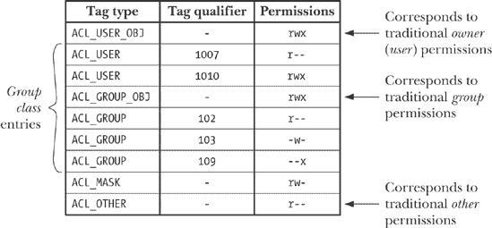
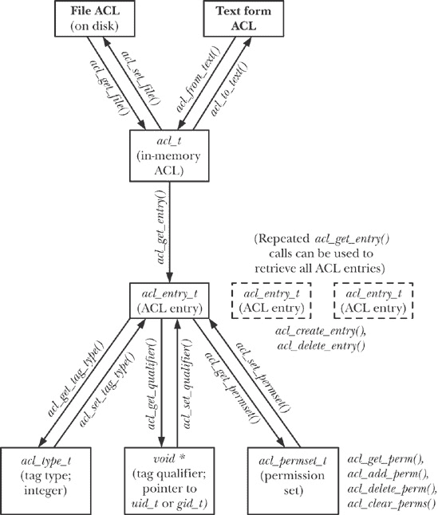

## 第十七章。访问控制列表

文件权限描述了传统的 UNIX（和 Linux）文件权限方案。对于许多应用程序来说，这个方案已足够。然而，一些应用程序需要对授予特定用户和组的权限进行更精细的控制。为满足这一需求，许多 UNIX 系统在传统 UNIX 文件权限模型的基础上实现了一种扩展，称为*访问控制列表*（ACL）。ACL 允许按用户或组指定文件权限，支持任意数量的用户和组。Linux 从内核 2.6 开始提供对 ACL 的支持。

### 注意

对 ACL 的支持对于每个文件系统来说是可选的，且由内核配置选项控制，位于*文件系统*菜单下。*Reiserfs* 对 ACL 的支持自内核 2.6.7 起可用。

为了能够在*ext2*、*ext3*、*ext4* 或 *Reiserfs* 文件系统上创建 ACL，必须使用 *mount -o acl* 选项挂载该文件系统。

ACL 在 UNIX 系统中从未正式标准化。曾尝试通过 POSIX.1e 和 POSIX.2c 草案标准来实现这一点，分别旨在规范 ACL 的应用程序接口（API）和 Shell 命令（以及其他功能，如能力）。最终，这一标准化尝试失败了，这些草案标准被撤回。然而，许多 UNIX 实现（包括 Linux）将它们的 ACL 实现基于这些草案标准（通常是最终版本，*草案 17*）。然而，由于各 ACL 实现之间存在许多差异（部分源于草案标准的不完整性），编写使用 ACL 的可移植程序会遇到一些困难。

本章提供了 ACL 的描述，并简要介绍了其使用教程。它还描述了用于操作和检索 ACL 的一些库函数。由于函数众多，我们不会对所有函数进行详细讨论。（详细信息，请参见手册页。）

## 概述

一个 ACL 是一系列 ACL 条目，每个条目定义了单个用户或用户组的文件权限（见 图 17-1）。

图 17-1. 访问控制列表

#### ACL 条目

每个 ACL 条目由以下部分组成：

+   一个*标签类型*，指示该条目适用于用户、组或其他某类用户；

+   一个可选的*标签限定符*，它标识特定的用户或组（即用户 ID 或组 ID）；以及

+   一个*权限集*，指定了条目授予的权限（读取、写入和执行）。

标签类型有以下几种值：

`ACL_USER_OBJ`

本条目指定授予文件所有者的权限。每个 ACL 包含一个`ACL_USER_OBJ`条目。此条目对应传统文件*所有者*（*用户*）权限。

`ACL_USER`

本条目指定授予由标签限定符标识的用户的权限。一个 ACL 可以包含零个或多个`ACL_USER`条目，但每个特定用户最多只能定义一个`ACL_USER`条目。

`ACL_GROUP_OBJ`

本条目指定授予文件组的权限。每个 ACL 必须包含一个`ACL_GROUP_OBJ`条目。除非 ACL 还包含`ACL_MASK`条目，否则此条目对应传统的文件*组*权限。

`ACL_GROUP`

本条目指定了授予由标签限定符标识的组的权限。一个 ACL 可以包含零个或多个`ACL_GROUP`条目，但每个组最多只能定义一个`ACL_GROUP`条目。

`ACL_MASK`

本条目指定了`ACL_USER`、`ACL_GROUP_OBJ`和`ACL_GROUP`条目可以授予的最大权限。一个 ACL 最多只能包含一个`ACL_MASK`条目。如果 ACL 中包含`ACL_USER`或`ACL_GROUP`条目，则`ACL_MASK`条目是必须的。我们稍后会详细介绍这种标签类型。

`ACL_OTHER`

本条目指定授予未与其他 ACL 条目匹配的用户的权限。每个 ACL 包含一个`ACL_OTHER`条目。此条目对应传统文件*其他*权限。

标签限定符仅用于`ACL_USER`和`ACL_GROUP`条目。它指定一个用户 ID 或组 ID。

#### 最小 ACL 和扩展 ACL

*最小*ACL 是与传统文件权限集语义等价的 ACL。它包含恰好三个条目：`ACL_USER_OBJ`、`ACL_GROUP_OBJ`和`ACL_OTHER`各一个。*扩展*ACL 是除了包含这些条目外，还包含`ACL_USER`、`ACL_GROUP`和`ACL_MASK`条目的 ACL。

区分最小 ACL 和扩展 ACL 的一个原因是，扩展 ACL 为传统权限模型提供了语义上的扩展。另一个原因涉及 Linux 中 ACL 的实现。ACL 作为*系统*扩展属性实现（参见第十六章）。用于维护文件访问 ACL 的扩展属性名为*system.posix_acl_access*。只有当文件具有扩展 ACL 时，才需要此扩展属性。最小 ACL 的权限信息可以（且通常会）存储在传统的文件权限位中。

## ACL 权限检查算法

对具有 ACL 的文件进行权限检查的方式与传统文件权限模型中的检查方式相同（参见权限检查算法）。检查按以下顺序执行，直到匹配其中一个标准：

1.  如果进程具有特权，则授予所有访问权限。对此声明有一个例外，类似于 权限检查算法 中描述的传统权限模型。当执行文件时，特权进程只有在通过文件上的至少一个 ACL 条目授予执行权限时，才会获得执行权限。

1.  如果进程的有效用户 ID 与文件的所有者（用户 ID）匹配，则进程会被授予 `ACL_USER_OBJ` 条目中指定的权限。（严格来说，在 Linux 上，进行此处描述的检查时，使用的是进程的文件系统 ID，而不是有效 ID，正如第 9.5 节中所述。）

1.  如果进程的有效用户 ID 与某个 `ACL_USER` 条目的标签限定符匹配，则进程会被授予该条目中指定的权限，并与 `ACL_MASK` 条目中的值进行掩码（与运算）。

1.  如果进程的某个组 ID（即有效组 ID 或任何附加组 ID）与文件的组匹配（这对应于 `ACL_GROUP_OBJ` 条目），或者与任何 `ACL_GROUP` 条目的标签限定符匹配，则通过检查以下每项内容来确定访问权限，直到找到匹配项为止：

    1.  如果进程的某个组 ID 与文件的组匹配，并且 `ACL_GROUP_OBJ` 条目授予请求的权限，则该条目决定授予文件的访问权限。授予的访问权限会受到 `ACL_MASK` 条目中值的掩码（与运算）的限制（如果存在的话）。

    1.  如果进程的某个组 ID 与文件的某个 `ACL_GROUP` 条目的标签限定符匹配，并且该条目授予请求的权限，则该条目决定授予的权限。授予的访问权限会受到 `ACL_MASK` 条目中值的掩码（与运算）的限制。

    1.  否则，访问被拒绝。

1.  否则，进程将被授予 `ACL_OTHER` 条目中指定的权限。

我们可以通过一些例子来澄清与组 ID 相关的规则。假设我们有一个组 ID 为 100 的文件，并且该文件由图 17-1 中所示的 ACL 保护。如果一个组 ID 为 100 的进程调用 *access(file, R_OK)*，则该调用会成功（即返回 0）。（我们在 检查文件可访问性：*access()*") 中描述了 *access()。）另一方面，即使 `ACL_GROUP_OBJ` 条目授予所有权限，调用 *access(file, R_OK | W_OK | X_OK)* 也会失败（即返回 -1，*errno* 设置为 `EACCES`），因为 `ACL_GROUP_OBJ` 权限与 `ACL_MASK` 条目进行掩码（与运算），而该条目拒绝了执行权限。

作为使用图 17-1 的另一个例子，假设我们有一个进程，它的组 ID 为 102，并且在其附加组 ID 中还包含组 ID 103。对于该进程，*access*(*file*, *R*_*OK*) 和 *access*(*file*, *W*_*OK*) 都会成功，因为它们分别与组 ID 102 和 103 的 `ACL_GROUP` 条目匹配。另一方面，*access*(*file*, *R*_*OK* | *W*_*OK*) 会失败，因为没有匹配的 `ACL_GROUP` 条目同时授予读取和写入权限。

## ACL 的长文本形式和短文本形式

在使用 *setfacl* 和 *getfacl* 命令（稍后会介绍）或某些 ACL 库函数时，我们指定 ACL 条目的文本表示形式。这些文本表示形式允许两种格式：

+   *长文本形式* 的 ACL 每行包含一个 ACL 条目，并且可以包含注释，注释以 `#` 字符开头并持续到行尾。*getfacl* 命令以长文本形式显示 ACL。*setfacl -M acl-file* 选项，接受来自文件的 ACL 规范，要求该规范为长文本形式。

+   *简短文本形式* 的 ACL 由一系列 ACL 条目组成，各条目之间用逗号分隔。

在这两种形式中，每个 ACL 条目由三个部分组成，部分之间用冒号分隔：

```
*tag-type*:[*tag-qualifier*]: *permissions*
```

*标签类型* 是 表 17-1 中第一列所示的值之一。*标签类型* 后面可以选择跟一个 *标签限定符*，用于标识一个用户或组，可以是名称或数字标识符。*标签限定符* 仅在 `ACL_USER` 和 `ACL_GROUP` 条目中存在。

以下是与传统权限掩码 0650 对应的所有简短文本形式的 ACL：

```
u::rw-,g::r-x,o::---
u::rw,g::rx,o::-
user::rw,group::rx,other::-
```

以下是一个简短的文本形式的 ACL，包括两个命名用户、一个命名组和一个掩码条目：

```
u::rw,u:paulh:rw,u:annabel:rw,g::r,g:teach:rw,m::rwx,o::-
```

表 17-1. ACL 条目文本形式的解释

| 标签文本形式 | 是否存在标签限定符？ | 对应标签类型 | 条目对应 |
| --- | --- | --- | --- |
| `u, user` | N | `ACL_USER_OBJ` | 文件所有者（用户） |
| `u, user` | Y | `ACL_USER` | 指定的用户 |
| `g, group` | N | `ACL_GROUP_OBJ` | 文件组 |
| `g, group` | Y | `ACL_GROUP` | 指定的组 |
| `m, mask` | N | `ACL_MASK` | 组类的掩码 |
| `o, other` | N | `ACL_OTHER` | 其他用户 |

## `ACL_MASK` 条目与 ACL 组类

如果 ACL 包含 `ACL_USER` 或 `ACL_GROUP` 条目，则必须包含一个 `ACL_MASK` 条目。如果 ACL 不包含任何 `ACL_USER` 或 `ACL_GROUP` 条目，则 `ACL_MASK` 条目是可选的。

`ACL_MASK` 条目作为 ACL 条目中授予的权限的上限，适用于所谓的 *组类*。组类是 ACL 中所有 `ACL_USER`、`ACL_GROUP` 和 `ACL_GROUP_OBJ` 条目的集合。

`ACL_MASK`条目的目的是在运行不支持 ACL 的应用程序时提供一致的行为。为了说明为何需要掩码条目，假设文件上的 ACL 包含以下条目：

```
user::rwx                       # ACL_USER_OBJ
user:paulh:r-x                  # ACL_USER
group::r-x                      # ACL_GROUP_OBJ
group:teach:--x                 # ACL_GROUP
other::--x                      # ACL_OTHER
```

现在假设一个程序对这个文件执行以下的*chmod()*调用：

```
chmod(pathname, 0700);      /* Set permissions to rwx------ */
```

在一个不支持 ACL 的应用程序中，这意味着“拒绝除了文件所有者之外的所有人访问”。即使在存在 ACL 的情况下，这些语义也应当成立。在没有`ACL_MASK`条目的情况下，这种行为可以通过多种方式实现，但每种方法都有问题：

+   仅仅修改`ACL_GROUP_OBJ`和`ACL_USER_OBJ`条目为掩码`---`是不够的，因为用户*paulh*和组*teach*仍然会对文件有某些权限。

+   另一种可能性是将新的组和其他权限设置（即所有权限禁用）应用到 ACL 中的所有`ACL_USER`、`ACL_GROUP`、`ACL_GROUP_OBJ`和`ACL_OTHER`条目：

    ```
    user::rwx                       # ACL_USER_OBJ
    user:paulh:---                  # ACL_USER
    group::---                      # ACL_GROUP_OBJ
    group:teach:---                 # ACL_GROUP
    other::---                      # ACL_OTHER
    ```

    这种方法的问题在于，不支持 ACL 的应用程序因此会不小心破坏由支持 ACL 的应用程序建立的文件权限语义，因为以下的调用（例如）不会恢复`ACL_USER`和`ACL_GROUP`条目的 ACL 至它们原来的状态：

    ```
    chmod(pathname, 751);
    ```

+   为了避免这些问题，我们可以考虑将`ACL_GROUP_OBJ`条目作为所有`ACL_USER`和`ACL_GROUP`条目的限制集。然而，这意味着`ACL_GROUP_OBJ`权限总是需要设置为所有`ACL_USER`和`ACL_GROUP`条目中允许的所有权限的并集。这会与使用`ACL_GROUP_OBJ`条目来确定文件组所赋予的权限发生冲突。

`ACL_MASK`条目被设计用来解决这些问题。它提供了一种机制，允许在不破坏由支持 ACL 的应用程序建立的文件权限语义的前提下，实现传统的*chmod()*操作的含义。当一个 ACL 有`ACL_MASK`条目时：

+   所有通过*chmod()*对传统组权限的修改都会改变`ACL_MASK`条目的设置（而不是`ACL_GROUP_OBJ`条目）；并且

+   对*stat()*的调用会返回`ACL_MASK`权限（而不是`ACL_GROUP_OBJ`权限），并在*st_mode*字段的组权限位中显示（图 15-1，在设备 ID 和 i 节点号中）。

虽然`ACL_MASK`条目提供了一种在面对不支持 ACL 的应用程序时保存 ACL 信息的方式，但反过来则无法保证。ACL 的存在会覆盖传统操作对文件组权限的影响。例如，假设我们在文件上放置了以下 ACL：

```
user::rw-,group::---,mask::---,other::r--
```

如果我们随后对这个文件执行命令*chmod g+rw*，ACL 会变成：

```
user::rw-,group::---,mask::rw-,other::r--
```

在这种情况下，组仍然没有访问文件的权限。解决此问题的一种方法是修改组的 ACL 条目，授予所有权限。结果，组将始终获得与`ACL_MASK`条目授予的权限相同的权限。

## *getfacl*和*setfacl*命令

从 shell 中，我们可以使用*getfacl*命令查看文件的 ACL。

```
`$ umask 022`                         *Set shell umask to known state*
$ `touch tfile`                       *Create a new file*
$ `getfacl tfile`
# file: tfile
# owner: mtk
# group: users
user::rw-
group::r--
other::r--
```

从*getfacl*命令的输出中，我们可以看到新创建的文件具有最小的 ACL。当显示该 ACL 的文本形式时，*getfacl*会在 ACL 条目前显示三行，内容为文件的名称和所有权。我们可以通过指定*--omit-header*选项来防止这些行被显示。

接下来，我们演示使用传统的*chmod*命令修改文件权限时，这些更改会反映到 ACL 中。

```
`$ chmod u=rwx,g=rx,o=x tfile`
$ `getfacl --omit-header tfile`
user::rwx
group::r-x
other::--x
```

*setfacl*命令修改文件 ACL。这里，我们使用*setfacl -m*命令将`ACL_USER`和`ACL_GROUP`条目添加到 ACL 中：

```
`$ setfacl -m u:paulh:rx,g:teach:x tfile`
$ `getfacl --omit-header tfile`
user::rwx
user:paulh:r-x                      ACL_USER entry
group::r-x
group:teach:--x                     ACL_GROUP entry
mask::r-x                           ACL_MASK entry
other::--x
```

*setfacl -m*选项用于修改现有的 ACL 条目，或者在没有对应标签类型和限定符的条目时添加新的条目。我们还可以使用*-R*选项递归地将指定的 ACL 应用到目录树中的所有文件。

从*getfacl*命令的输出中，我们可以看到*setfacl*为此 ACL 自动创建了一个`ACL_MASK`条目。

`ACL_USER`和`ACL_GROUP`条目的添加将此 ACL 转换为扩展 ACL，*ls* - *l*通过在传统文件权限掩码后附加一个加号（+）来指示这一事实：

```
$ `ls -l tfile`
-rwxr-x--x+   1 mtk      users           0 Dec 3 15:42 tfile
```

我们继续使用*setfacl*来禁用除了执行权限以外的所有权限，针对`ACL_MASK`条目，然后使用*getfacl*再次查看 ACL：

```
`$ setfacl -m m::x tfile`
$ `getfacl --omit-header tfile`
user::rwx
user:paulh:r-x                  #effective:--x
group::r-x                      #effective:--x
group:teach:--x
mask::--x
other::--x
```

*getfacl*在用户*paulh*和文件组（`group::`）的条目后打印的`#effective:`注释告诉我们，在对`ACL_MASK`条目进行掩码（与运算）后，这些条目授予的权限实际上会低于条目中指定的权限。

然后，我们使用*ls -l*再次查看文件的传统权限位。我们看到，显示的组类权限位反映了`ACL_MASK`条目中的权限（`--x`），而不是`ACL_GROUP`条目中的权限（`r-x`）：

```
$ ls -l tfile
-rwx--x--x+   1 mtk      users           0 Dec 3 15:42 tfile
```

*setfacl -x*命令可用于从 ACL 中删除条目。在这里，我们删除了用户*paulh*和组*teach*的条目（删除条目时不指定权限）：

```
`$ setfacl -x u:paulh,g:teach tfile`
`$ getfacl --omit-header tfile`
user::rwx
group::r-x
mask::r-x
other::--x
```

请注意，在上述操作中，*setfacl*会自动调整掩码条目，使其成为所有组类条目的并集。（这里只有一个这样的条目：`ACL_GROUP_OBJ`。）如果我们希望防止这种调整，则必须为*setfacl*指定*-n*选项。

最后，我们注意到可以使用*setfacl -b*选项来删除 ACL 中的所有扩展条目，仅保留最小的条目（即用户、组和其他）。

## 默认 ACL 和文件创建

在目前对 ACL 的讨论中，我们描述的是*访问*ACL。顾名思义，访问 ACL 用于确定进程在访问与该 ACL 关联的文件时所具有的权限。我们还可以在目录上创建第二种类型的 ACL：*默认*ACL。

默认 ACL 在确定访问目录时所授予的权限中不起作用。相反，默认 ACL 的存在或缺失决定了在该目录中创建的文件和子目录所设置的 ACL 和权限。（默认 ACL 作为名为*system.posix_acl_default*的扩展属性存储。）

要查看和设置目录的默认 ACL，我们使用*getfacl*和*setfacl*命令的*-d*选项。

```
`$ mkdir sub`
`$ setfacl -d -m u::rwx,u:paulh:rx,g::rx,g:teach:rwx,o::- sub`
`$ getfacl -d --omit-header sub`
user::rwx
user:paulh:r-x
group::r-x
group:teach:rwx
mask::rwx                       *setfacl generated ACL_MASK entry automatically*
other::---
```

我们可以使用*setfacl -k*选项从目录中移除默认 ACL。

如果一个目录有默认 ACL，则：

+   在此目录中创建的新子目录会继承该目录的默认 ACL 作为其默认 ACL。换句话说，默认 ACL 会在通过创建新的子目录时沿着目录树传播。

+   在该目录中创建的新文件或子目录会继承该目录的默认 ACL 作为其访问 ACL。与传统文件权限位相对应的 ACL 条目将与用于创建文件或子目录的系统调用（*open(), mkdir()*等）中的*mode*参数相对应的位进行掩码（按位与）。所谓的“对应 ACL 条目”是指：

    +   `ACL_USER_OBJ`；

    +   `ACL_MASK` 或如果`ACL_MASK`缺失，则为`ACL_GROUP_OBJ`；并且

    +   `ACL_OTHER`。

当一个目录有默认 ACL 时，进程 umask（进程文件模式创建掩码：*umask()*")）在确定新创建文件的访问 ACL 条目的权限时不发挥作用。

作为新文件如何从父目录的默认 ACL 继承其访问 ACL 的示例，假设我们使用以下*open()*调用在上面创建的目录中创建了一个新文件：

```
open("sub/tfile", O_RDWR | O_CREAT,
        S_IRWXU | S_IXGRP | S_IXOTH);   /* rwx--x--x */
```

新文件将具有以下访问 ACL：

```
$ `getfacl --omit-header sub/tfile`
user::rwx
user:paulh:r-x                  #effective:--x
group::r-x                      #effective:--x
group:teach:rwx                 #effective:--x
mask::--x
other::---
```

如果一个目录没有默认 ACL，则：

+   在此目录中创建的新子目录同样没有默认 ACL。

+   新文件或目录的权限是根据传统规则设置的（进程文件模式创建掩码：*umask()*")）：文件权限设置为*mode*参数中的值（传递给*open()*, *mkdir()*等），减去进程 umask 关闭的位。这将导致新文件具有最小的 ACL 权限。

## ACL 实现限制

各种文件系统实现对 ACL 中的条目数量施加了限制：

+   在 *ext2*、*ext3* 和 *ext4* 上，文件的 ACL 总数由以下要求决定：文件的所有扩展属性名称和值的字节必须包含在一个逻辑磁盘块中（扩展属性实现细节）。每个 ACL 条目需要 8 字节，因此文件的最大 ACL 条目数稍微少于（由于 ACL 的扩展属性名称的额外开销）块大小的八分之一。因此，4096 字节的块大小允许最大约 500 个 ACL 条目。（2.6.11 版本之前的内核对 *ext2* 和 *ext3* 上的 ACL 强制限制为 32 条目。）

+   在 *XFS* 上，ACL 被限制为 25 条目。

+   在 *Reiserfs* 和 *JFS* 上，ACL 最多可以包含 8191 条目。这个限制是由于 VFS 对扩展属性值的大小限制（64 kB）所导致的（扩展属性实现细节）。

### 注意

在撰写本文时，*Btrfs* 将 ACL 限制为大约 500 条目。然而，由于 *Btrfs* 仍在积极开发中，这一限制可能会发生变化。

尽管上述大多数文件系统允许在 ACL 中创建大量条目，但应避免这样做，原因如下：

+   长时间维护 ACL 会成为一个复杂且可能容易出错的系统管理任务。

+   扫描 ACL 以查找匹配项（或在进行组 ID 检查时匹配项）所需的时间，随着 ACL 条目的数量增加而线性增长。

通常，我们可以通过在系统组文件中定义合适的组（组文件：`/etc/group`）并在 ACL 中使用这些组，来将文件中的 ACL 条目数量保持在合理范围内。

## ACL API

POSIX.1e 草案标准定义了一套庞大的函数和数据结构，用于操作 ACL。由于它们数量众多，我们不会尝试描述所有这些函数的细节。相反，我们提供其使用概述，并以一个示例程序作为结尾。

使用 ACL API 的程序应包括 `<sys/acl.h>`。如果程序使用了 POSIX.1e 草案标准的各种 Linux 扩展，可能还需要包含 `<acl/libacl.h>`。（有关 Linux 扩展的列表，请参见 *acl(5)* 手册页。）使用该 API 的程序必须使用 *-lacl* 选项进行编译，以便与 *libacl* 库进行链接。

### 注意

如前所述，在 Linux 上，ACL 是通过扩展属性实现的，ACL API 作为一组库函数实现，操作用户空间数据结构，并在必要时调用 *getxattr()* 和 *setxattr()* 来检索和修改存储 ACL 表示的磁盘上的 *system* 扩展属性。应用程序也可以（尽管不推荐）直接使用 *getxattr()* 和 *setxattr()* 来操作 ACL。

#### 概述

组成 ACL API 的函数列在 *acl(5)* 手册页中。乍一看，这些众多的函数和数据结构可能会让人感到困惑。图 17-2 提供了各个数据结构之间关系的概览，并指出了许多 ACL 函数的使用。

图 17-2. ACL 库函数与数据结构之间的关系

从 图 17-2 中，我们可以看到 ACL API 将 ACL 视为一个层次化对象：

+   一个 ACL 由一个或多个 ACL 条目组成。

+   每个 ACL 条目由一个标签类型、一个可选的标签限定符和一个权限集组成。

现在我们简要地介绍一下各种 ACL 函数。在大多数情况下，我们不描述每个函数的错误返回值。返回整数（*status*）的函数通常在成功时返回 0，出错时返回 -1。返回句柄（指针）的函数在出错时返回 `NULL`。可以通过常规方式使用 *errno* 来诊断错误。

### 注意

*handle* 是指用于引用对象或数据结构的某种技术的抽象术语。句柄的表示方式对 API 实现是私有的。例如，它可以是指针、数组索引或哈希键。

#### 将文件的 ACL 获取到内存中

*acl_get_file()* 函数用于检索由 *pathname* 标识的文件的 ACL 副本。

```
acl_t acl;

acl = acl_get_file(pathname, type);
```

该函数根据 *type* 是否指定为 `ACL_TYPE_ACCESS` 或 `ACL_TYPE_DEFAULT`，检索访问 ACL 或默认 ACL。作为其函数结果，*acl_get_file()* 返回一个句柄（类型为 *acl_t*），供其他 ACL 函数使用。

#### 从内存中的 ACL 中检索条目

*acl_get_entry()* 函数返回一个句柄（类型为 *acl_entry_t*），该句柄指向由 *acl* 参数引用的内存中 ACL 中的一个条目。此句柄返回到最后一个函数参数指向的位置。

```
acl_entry_t entry;

status = acl_get_entry(acl, entry_id, &entry);
```

*entry_id* 参数决定返回哪个条目的句柄。如果 *entry_id* 被指定为 `ACL_FIRST_ENTRY`，则返回 ACL 中第一个条目的句柄。如果 *entry_id* 被指定为 `ACL_NEXT_ENTRY`，则返回在上一个获取的 ACL 条目之后的条目的句柄。因此，我们可以通过在第一次调用 *acl_get_entry()* 时指定 *type* 为 `ACL_FIRST_ENTRY`，并在随后的调用中将 *type* 指定为 `ACL_NEXT_ENTRY`，来遍历 ACL 中的所有条目。

*acl_get_entry()* 函数返回 1 如果成功获取了一个 ACL 条目，返回 0 如果没有更多条目，或者返回 -1 如果发生错误。

#### 获取和修改 ACL 条目中的属性

*acl_get_tag_type()* 和 *acl_set_tag_type()* 函数用于获取和修改其 *entry* 参数所引用的 ACL 条目中的标签类型。

```
acl_tag_t tag_type;

status = acl_get_tag_type(entry, &tag_type);
status = acl_set_tag_type(entry, tag_type);
```

*tag_type* 参数的类型是 *acl_type_t*（整数类型），并且它的值之一为 `ACL_USER_OBJ`、`ACL_USER`、`ACL_GROUP_OBJ`、`ACL_GROUP`、`ACL_OTHER` 或 `ACL_MASK`。

*acl_get_qualifier()* 和 *acl_set_qualifier()* 函数用于获取和修改其 *entry* 参数所引用的 ACL 条目中的标签限定符。以下是一个示例，我们假设通过检查标签类型已经确定这是一个 `ACL_USER` 条目：

```
uid_t *qualp;               /* Pointer to UID */

qualp = acl_get_qualifier(entry);
status = acl_set_qualifier(entry, qualp);
```

标签限定符仅在该条目的标签类型为 `ACL_USER` 或 `ACL_GROUP` 时有效。在前者情况下，*qualp* 是指向用户 ID (*uid_t*) 的指针；在后者情况下，*qualp* 是指向组 ID (*gid_t*) 的指针。

*acl_get_permset()* 和 *acl_set_permset()* 函数用于获取和修改其 *entry* 参数所引用的 ACL 条目中的权限集。

```
acl_permset_t permset;

status = acl_get_permset(entry, &permset);
status = acl_set_permset(entry, permset);
```

*acl_permset_t* 数据类型是一个指向权限集的句柄。

以下函数用于操作权限集的内容：

```
int is_set;

is_set = acl_get_perm(permset, perm);

status = acl_add_perm(permset, perm);
status = acl_delete_perm(permset, perm);
status = acl_clear_perms(permset);
```

在这些调用中，*perm* 被指定为 `ACL_READ`、`ACL_WRITE` 或 `ACL_EXECUTE`，其含义显而易见。这些函数的使用方式如下：

+   *acl_get_perm()* 函数返回 1（true）如果 *perm* 中指定的权限在 *permset* 所引用的权限集中被启用，返回 0 如果未启用。此函数是对 POSIX.1e 草案标准的 Linux 扩展。

+   *acl_add_perm()* 函数将 *perm* 中指定的权限添加到 *permset* 所引用的权限集。

+   *acl_delete_perm()* 函数从 *permset* 所引用的权限集中删除 *perm* 中指定的权限。（如果权限集没有该权限，删除该权限并不算错误。）

+   *acl_clear_perms()* 函数移除 *permset* 所引用的权限集中的所有权限。

#### 创建和删除 ACL 条目

*acl_create_entry()* 函数在现有 ACL 中创建一个新条目。一个指向新条目的句柄会通过第二个函数参数返回。

```
acl_entry_t entry;

status = acl_create_entry(&acl, &entry);
```

新条目可以通过之前描述的函数进行填充。

*acl_delete_entry()* 函数从 ACL 中移除一个条目。

```
status = acl_delete_entry(acl, entry);
```

#### 更新文件的 ACL

*acl_set_file()* 函数是 *acl_get_file()* 的反向操作。它使用内存中由 *acl* 参数所指的 ACL 内容更新磁盘上的 ACL。

```
int status;

status = acl_set_file(pathname, type, acl);
```

*type* 参数可以是 `ACL_TYPE_ACCESS`，用于更新访问 ACL，或 `ACL_TYPE_DEFAULT`，用于更新目录的默认 ACL。

#### 在内存和文本形式之间转换 ACL

*acl_from_text()* 函数将包含长文本形式或短文本形式的 ACL 字符串转换为内存中的 ACL，并返回一个可以在后续函数调用中引用的句柄。

```
acl = acl_from_text(acl_string);
```

*acl_to_text()* 函数执行反向转换，返回一个长文本字符串，对应其 *acl* 参数所指代的 ACL。

```
char *str;
ssize_t len;

str = acl_to_text(acl, &len);
```

如果 *len* 参数未指定为 `NULL`，则它指向的缓冲区用于返回作为函数结果返回的字符串的长度。

#### ACL API 中的其他函数

以下段落描述了几个常用的 ACL 函数，这些函数未在 图 17-2 中显示。

*acl_calc_mask(&acl)* 函数计算并设置内存中由其参数指向的 ACL 的 `ACL_MASK` 条目的权限。通常，每当我们创建或修改 ACL 时都会使用此函数。`ACL_MASK` 的权限是所有 `ACL_USER`、`ACL_GROUP` 和 `ACL_GROUP_OBJ` 条目权限的并集。此函数的一个有用特性是，如果 `ACL_MASK` 条目不存在，它会创建该条目。这意味着如果我们向一个先前最小的 ACL 中添加了 `ACL_USER` 和 `ACL_GROUP` 条目，我们可以使用此函数确保创建 `ACL_MASK` 条目。

*acl_valid(acl)* 函数如果其参数所指的 ACL 有效，则返回 0；否则返回 -1。ACL 是有效的，当且仅当以下所有条件成立：

+   `ACL_USER_OBJ`、`ACL_GROUP_OBJ` 和 `ACL_OTHER` 条目只出现一次；

+   如果存在任何 `ACL_USER` 或 `ACL_GROUP` 条目，则会有一个 `ACL_MASK` 条目；

+   至多只有一个 `ACL_MASK` 条目；

+   每个 `ACL_USER` 条目都有一个唯一的用户 ID；

+   每个`ACL_GROUP`条目都有一个唯一的组 ID。

### 注意

*acl_check()* 和 *acl_error()* 函数（后者是 Linux 扩展）是 *acl_valid()* 的替代方案，尽管它们的可移植性较差，但提供了对格式错误的 ACL 更精确的错误描述。详见手册页面。

*acl_delete_def_file(pathname)* 函数移除由 *pathname* 指定的目录的默认 ACL。

*acl_init(count)* 函数创建一个新的空的 ACL 结构，最初包含足够空间以容纳至少 *count* 个 ACL 条目。（*count* 参数是对系统的使用提示，而不是硬性限制。）该函数返回新 ACL 的句柄。

*acl_dup(acl)* 函数创建一个与 *acl* 所引用的 ACL 相同的副本，并返回该副本的句柄作为其函数结果。

*acl_free(handle)* 函数释放由其他 ACL 函数分配的内存。例如，我们必须使用 *acl_free()* 来释放由调用 *acl_from_text()*、*acl_to_text()*、*acl_get_file()*、*acl_init()* 和 *acl_dup()* 分配的内存。

#### 示例程序

示例 17-1 演示了某些 ACL 库函数的使用。此程序检索并显示文件上的 ACL（即，它提供了 *getfacl* 命令的子集功能）。如果指定了 *-d* 命令行选项，则程序显示的是默认 ACL（目录的 ACL），而不是访问 ACL。

以下是使用此程序的示例：

```
`$ touch tfile`
`$ setfacl -m 'u:annie:r,u:paulh:rw,g:teach:r' tfile`
`$ ./acl_view tfile`
user_obj             rw-
user        annie    r--
user        paulh    rw-
group_obj            r--
group       teach    r--
mask                 rw-
other                r--
```

### 注意

本书的源代码分发版还包括一个程序 `acl/acl_update.c`，用于更新 ACL（即它提供了 *setfacl* 命令的子集功能）。

示例 17-1. 显示文件的访问或默认 ACL

```
`acl/acl_view.c`
#include <acl/libacl.h>
#include <sys/acl.h>
#include "ugid_functions.h"
#include "tlpi_hdr.h"

static void
usageError(char *progName)
{
    fprintf(stderr, "Usage: %s [-d] filename\n", progName);
    exit(EXIT_FAILURE);
}

int
main(int argc, char *argv[])
{
    acl_t acl;
    acl_type_t type;
    acl_entry_t entry;
    acl_tag_t tag;
    uid_t *uidp;
    gid_t *gidp;
    acl_permset_t permset;
    char *name;
    int entryId, permVal, opt;

    type = ACL_TYPE_ACCESS;
    while ((opt = getopt(argc, argv, "d")) != -1) {
        switch (opt) {
        case 'd': type = ACL_TYPE_DEFAULT;      break;
        case '?': usageError(argv[0]);
        }
    }

    if (optind + 1 != argc)
        usageError(argv[0]);

    acl = acl_get_file(argv[optind], type);
    if (acl == NULL)
        errExit("acl_get_file");

    /* Walk through each entry in this ACL */

    for (entryId = ACL_FIRST_ENTRY; ; entryId = ACL_NEXT_ENTRY) {

        if (acl_get_entry(acl, entryId, &entry) != 1)
            break;                      /* Exit on error or no more entries */
        /* Retrieve and display tag type */

        if (acl_get_tag_type(entry, &tag) == -1)
            errExit("acl_get_tag_type");

        printf("%-12s", (tag == ACL_USER_OBJ) ?  "user_obj" :
                        (tag == ACL_USER) ?      "user" :
                        (tag == ACL_GROUP_OBJ) ? "group_obj" :
                        (tag == ACL_GROUP) ?     "group" :
                        (tag == ACL_MASK) ?      "mask" :
                        (tag == ACL_OTHER) ?     "other" : "???");

        /* Retrieve and display optional tag qualifier */

        if (tag == ACL_USER) {
            uidp = acl_get_qualifier(entry);
            if (uidp == NULL)
                errExit("acl_get_qualifier");

            name = groupNameFromId(*uidp);
            if (name == NULL)
                printf("%-8d ", *uidp);
            else
                printf("%-8s ", name);

            if (acl_free(uidp) == -1)
                errExit("acl_free");

        } else if (tag == ACL_GROUP) {
            gidp = acl_get_qualifier(entry);
            if (gidp == NULL)
                errExit("acl_get_qualifier");

            name = groupNameFromId(*gidp);
            if (name == NULL)
                printf("%-8d ", *gidp);
            else
                printf("%-8s ", name);
            if (acl_free(gidp) == -1)
                errExit("acl_free");

        } else {
            printf("         ");
        }

        /* Retrieve and display permissions */

        if (acl_get_permset(entry, &permset) == -1)
            errExit("acl_get_permset");

        permVal = acl_get_perm(permset, ACL_READ);
        if (permVal == -1)
            errExit("acl_get_perm - ACL_READ");
        printf("%c", (permVal == 1) ? 'r' : '-');
        permVal = acl_get_perm(permset, ACL_WRITE);
        if (permVal == -1)
            errExit("acl_get_perm - ACL_WRITE");
        printf("%c", (permVal == 1) ? 'w' : '-');
        permVal = acl_get_perm(permset, ACL_EXECUTE);
        if (permVal == -1)
            errExit("acl_get_perm - ACL_EXECUTE");
        printf("%c", (permVal == 1) ? 'x' : '-');

        printf("\n");
    }

    if (acl_free(acl) == -1)
        errExit("acl_free");

    exit(EXIT_SUCCESS);
}
     `acl/acl_view.c`
```

## 总结

从 2.6 版本开始，Linux 支持 ACL。ACL 扩展了传统的 UNIX 文件权限模型，允许在用户和组级别上控制文件权限。

#### 更多信息

草案 POSIX.1e 和 POSIX.2c 标准的最终版本（*草案 17*）可以在线获取，网址为 [`wt.tuxomania.net/publications/posix.1e/`](http://wt.tuxomania.net/publications/posix.1e/)。

*acl(5)* 手册页概述了 ACL 及其在 Linux 上实现的各种 ACL 库函数的可移植性指南。

关于 Linux 中 ACL 和扩展属性的实现细节可以参见 [Grünbacher, 2003]。Andreas Grünbacher 维护了一个包含有关 ACL 信息的网站：[`acl.bestbits.at/`](http://acl.bestbits.at/)。

## 练习

1.  编写一个程序，显示与特定用户或组对应的 ACL 条目的权限。该程序应接受两个命令行参数。第一个参数是 *u* 或 *g* 中的一个字母，表示第二个参数是用户还是组。（示例 8-1 中定义的函数可以用来允许第二个命令行参数以数字或名称形式指定。）如果与给定用户或组对应的 ACL 条目属于组类，则程序应额外显示 ACL 条目被 ACL 掩码条目修改后的适用权限。
