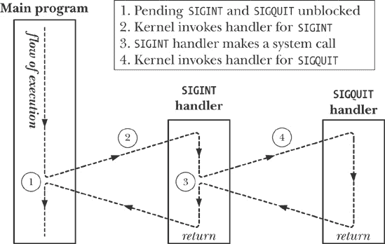

## 第二十二章 信号：高级特性

本章完成了我们在第二十章中开始讨论的信号部分，涵盖了一些更高级的主题，包括以下内容：

+   核心转储文件；

+   关于信号传递、处理和处置的特殊情况；

+   信号的同步和异步生成；

+   信号何时以及按什么顺序传递；

+   信号处理程序中断系统调用，以及如何自动重新启动被中断的系统调用；

+   实时信号；

+   使用*sigsuspend()*设置进程的信号屏蔽并等待信号到达；

+   使用*sigwaitinfo()*（和*sigtimedwait()*）同步等待信号到达；

+   使用*signalfd()*通过文件描述符接收信号；

+   较旧的 BSD 和 System V 信号 API。

## 核心转储文件

某些信号会导致进程生成核心转储并终止（表 20-1, 第 396 页）。核心转储是一个包含进程在终止时内存映像的文件。（*core*一词源自一种旧的内存技术。）这个内存映像可以加载到调试器中，以检查程序代码和数据在信号到达时的状态。

使程序生成核心转储的一种方法是输入*quit*字符（通常是*Control-\*），这会生成`SIGQUIT`信号：

```
$ `ulimit -c unlimited`                       *Explained in main text*
$ `sleep 30`
*Type Control-\*
Quit (core dumped)
$ `ls -l core`                                *Shows core dump file for* *sleep(1)*
-rw-------   1 mtk    users     57344 Nov 30 13:39 core
```

在这个例子中，消息*Quit (core dumped)*由 shell 打印，shell 检测到它的子进程（运行*sleep*的进程）被`SIGQUIT`信号终止并生成了核心转储。

核心转储文件在进程的工作目录中创建，文件名为`core`。这是核心转储文件的默认位置和名称；接下来，我们将解释如何更改这些默认设置。

### 注释

许多实现提供了一个工具（例如，在 FreeBSD 和 Solaris 上是*gcore*）来获取正在运行的进程的核心转储。在 Linux 上，通过使用*gdb*附加到正在运行的进程，并使用*gcore*命令来实现类似的功能。

#### 不生成核心转储文件的情况

在以下情况下不会生成核心转储：

+   进程没有权限写入核心转储文件。这可能是因为进程没有对要创建核心转储文件的目录的写权限，或者因为同名的文件已经存在，并且该文件要么不可写，要么不是常规文件（例如，它是一个目录或符号链接）。

+   已经存在同名的常规文件，并且该文件可写，但该文件有多个（硬）链接。

+   创建核心转储文件的目录不存在。

+   进程资源限制中的核心转储文件大小被设置为 0。此限制 `RLIMIT_CORE` 在第 36.3 节中进行了详细讨论。在上述示例中，我们使用 *ulimit* 命令（在 C shell 中为 *limit*）来确保没有核心文件大小的限制。

+   进程资源限制中，进程可能生成的文件大小被设置为 0。我们在第 36.3 节中描述了此限制 `RLIMIT_FSIZE`。

+   进程正在执行的二进制可执行文件没有启用读取权限。这防止了用户通过核心转储获取程序代码的副本，而该代码原本是无法读取的。

+   当前工作目录所在的文件系统被挂载为只读、已满或已耗尽 i-node。或者，用户已达到文件系统上的配额限制。

+   由非文件拥有者（非组拥有者）用户执行的设置用户 ID（设置组 ID）程序不会生成核心转储。这防止恶意用户转储安全程序的内存并检查其中的敏感信息，如密码。

### 注意

使用 Linux 特有的`PR_SET_DUMPABLE`操作，可以通过 *prctl()* 系统调用为进程设置 *dumpable* 标志，从而在非拥有者（非组拥有者）用户运行设置用户 ID（设置组 ID）程序时生成核心转储。`PR_SET_DUMPABLE` 操作从 Linux 2.4 版本起可用。详情请参阅 *prctl(2)* 手册页。此外，从内核 2.6.13 起，`/proc/sys/fs/suid_dumpable` 文件提供了对是否允许设置用户 ID 和设置组 ID 进程生成核心转储的全局控制。有关详情，请参阅 *proc(5)* 手册页。

从内核 2.6.23 起，Linux 特有的 `/proc/`*PID*`/coredump_filter` 可用于按进程级别确定哪些类型的内存映射被写入核心转储文件。（我们在 第四十九章 中解释了内存映射。）该文件中的值是四位掩码，对应于四种类型的内存映射：私有匿名映射、私有文件映射、共享匿名映射和共享文件映射。文件的默认值提供了传统的 Linux 行为：仅转储私有匿名映射和共享匿名映射。有关详情，请参阅 *core(5)* 手册页。

#### 核心转储文件命名：`/proc/sys/kernel/core_pattern`

从 Linux 2.6 开始，Linux 特定的`/proc/sys/kernel/core_pattern`文件中包含的格式字符串控制着系统上生成的所有核心转储文件的命名。默认情况下，该文件包含字符串*core*。具有特权的用户可以定义该文件，以包含表 22-1 中显示的任何格式说明符。这些格式说明符将被替换为表格右列中指示的值。此外，该字符串可以包含斜杠（`/`）。换句话说，我们不仅可以控制核心文件的名称，还可以控制它被创建的（绝对或相对）目录。在所有格式说明符都被替换后，结果路径名字符串将被截断为最多 128 个字符（在 Linux 2.6.19 之前为 64 个字符）。

从内核版本 2.6.19 开始，Linux 支持在`core_pattern`文件中使用额外的语法。如果该文件包含以管道符号（`|`）开头的字符串，那么文件中的其余字符将被解释为一个程序——可以包含可选参数，参数中可能包括表 22-1 中显示的`%`格式说明符——该程序将在进程转储核心时执行。核心转储将写入该程序的标准输入，而不是写入文件。有关更多详细信息，请参阅*core(5)*手册页。

### 注意

一些其他 UNIX 实现提供类似于`core_pattern`的功能。例如，在 BSD 衍生系统中，程序名称会附加到文件名，因此为`core.`*progname*。Solaris 提供了一个工具（*coreadm*），允许用户选择核心转储文件存放的文件名和目录。

表 22-1. `/proc/sys/kernel/core_pattern`格式说明符

| 说明符 | 被替换为 |
| --- | --- |
| `%c` | 核心文件大小软资源限制（字节；自 Linux 2.6.24 以来） |
| `%e` | 可执行文件名（无路径前缀） |
| `%g` | 转储进程的真实组 ID |
| `%h` | 主机系统名称 |
| `%p` | 转储进程的进程 ID |
| `%s` | 终止进程的信号数量 |
| `%t` | 转储时间，单位为自纪元以来的秒数 |
| `%u` | 转储进程的真实用户 ID |
| `%%` | 单个`%`字符 |

## 传递、处理和处理的特殊情况

对于某些信号，适用有关传递、处理和处理方式的特殊规则，如本节所述。

#### `SIGKILL`和`SIGSTOP`

不能更改`SIGKILL`的默认操作，`SIGKILL`始终终止进程，`SIGSTOP`始终停止进程。在尝试更改这些信号的处理方式时，*signal()*和*sigaction()*都会返回错误。这两个信号也无法被阻塞。这是一个故意的设计决策。不允许更改这些信号的默认操作意味着它们始终可以用于杀死或停止失控的进程。

#### `SIGCONT`和停止信号

如前所述，`SIGCONT`信号用于继续一个之前被停止信号（`SIGSTOP`、`SIGTSTP`、`SIGTTIN`和`SIGTTOU`）停止的进程。由于它们的独特目的，在某些情况下，内核会以不同于其他信号的方式处理这些信号。

如果一个进程当前已停止，`SIGCONT`信号的到来总是会导致该进程恢复，即使该进程当前阻塞或忽略`SIGCONT`信号。此功能是必要的，因为否则无法恢复这些已停止的进程。（如果停止的进程正在阻塞`SIGCONT`，并且已为`SIGCONT`设立了处理程序，那么在进程恢复后，只有当`SIGCONT`信号稍后解除阻塞时，处理程序才会被调用。）

### 注

如果向一个已停止的进程发送任何其他信号，信号不会实际传递到该进程，直到进程通过接收到`SIGCONT`信号恢复。唯一的例外是`SIGKILL`，它始终会终止进程——即使该进程当前已停止。

每当`SIGCONT`信号发送到进程时，任何待处理的停止信号都会被丢弃（即，进程永远不会看到它们）。相反，如果任何停止信号发送到进程，则任何待处理的`SIGCONT`信号会被自动丢弃。采取这些步骤是为了防止`SIGCONT`信号的作用被之前发送的停止信号撤销，反之亦然。

#### 不要更改被忽略的终端生成信号的处理方式

如果在程序执行时发现终端生成的信号的处理方式被设置为`SIG_IGN`（忽略），则通常程序不应尝试更改信号的处理方式。这不是系统强制执行的规则，而是在编写应用程序时应遵循的一种约定。我们在处理作业控制信号中解释了这样做的原因。与此约定相关的信号包括`SIGHUP`、`SIGINT`、`SIGQUIT`、`SIGTTIN`、`SIGTTOU`和`SIGTSTP`。

## 可中断和不可中断的进程休眠状态

我们需要对之前的声明添加一个附加说明，即`SIGKILL`和`SIGSTOP`总是立即作用于进程。在不同的时间，内核可能会让进程进入休眠状态，并且区分两种休眠状态：

+   `TASK_INTERRUPTIBLE`：进程正在等待某个事件。例如，它正在等待终端输入、等待数据写入当前空的管道，或等待一个 System V 信号量的值被增加。进程可以在此状态下停留任意长度的时间。如果在此状态下为进程生成了信号，则该操作会被中断，并通过发送信号唤醒进程。在*ps(1)*中列出时，处于`TASK_INTERRUPTIBLE`状态的进程在 STAT（进程状态）字段中标记为*S*。

+   `TASK_UNINTERRUPTIBLE`：进程在等待某些特殊事件的完成，如磁盘 I/O 的完成。如果在此状态下生成信号，则该信号不会被传递，直到进程退出此状态。处于`TASK_UNINTERRUPTIBLE`状态的进程会在*ps(1)*命令的 STAT 字段中显示为*D*。

由于进程通常只在`TASK_UNINTERRUPTIBLE`状态下停留很短时间，因此信号只有在进程离开该状态时才会传递，这通常是不可见的。然而，在少数情况下，进程可能会在该状态下长时间挂起，可能是由于硬件故障、NFS 问题或内核错误等原因。在这种情况下，`SIGKILL`无法终止挂起的进程。如果无法通过其他方式解决底层问题，那么我们必须重启系统以消除该进程。

`TASK_INTERRUPTIBLE`和`TASK_UNINTERRUPTIBLE`状态存在于大多数 UNIX 实现中。从内核 2.6.25 开始，Linux 增加了第三种状态，以解决上述挂起进程的问题：

+   `TASK_KILLABLE`：此状态类似于`TASK_UNINTERRUPTIBLE`，但当接收到致命信号（即会终止进程的信号）时，会唤醒该进程。通过将内核代码的相关部分改为使用此状态，可以避免需要重启系统的挂起进程的多种情况。相反，可以通过发送致命信号来终止进程。第一个改为使用`TASK_KILLABLE`的内核代码是 NFS。

## 硬件生成的信号

`SIGBUS`、`SIGFPE`、`SIGILL`和`SIGSEGV`可以作为硬件异常的结果生成，或者（较少）由*kill()*发送。在硬件异常的情况下，SUSv3 规定，如果进程从信号处理程序返回，或者忽略或阻塞该信号，则该进程的行为是未定义的。原因如下：

+   *从信号处理程序返回*：假设机器语言指令生成了其中一个信号，并因此调用了信号处理程序。在正常返回处理程序时，程序尝试从中断的地方继续执行。但这正是最初生成信号的那条指令，因此信号会再次生成。结果通常是程序进入无限循环，反复调用信号处理程序。

+   *忽略信号*：忽略硬件生成的信号没有太大意义，因为在发生算术异常等情况下，程序如何继续执行并不明确。当这些信号作为硬件异常的结果生成时，Linux 会强制传递该信号，即使程序已请求忽略该信号。

+   *阻塞信号*：与之前的情况一样，阻塞硬件生成的信号没有太大意义，因为不清楚程序在阻塞信号后应如何继续执行。在 Linux 2.4 及更早版本中，内核会简单地忽略对硬件生成信号的阻塞尝试；信号无论如何都会被传递给进程，然后要么终止进程，要么如果已安装信号处理程序，则会被该处理程序捕获。从 Linux 2.6 开始，如果信号被阻塞，则进程会立即被该信号终止，即使该进程已经为该信号安装了处理程序。（Linux 2.6 对阻塞硬件生成信号处理的变化原因是，Linux 2.4 的行为隐藏了 BUG，并可能导致多线程程序中的死锁。）

### 注意

本书的源代码分发中的`signals/demo_SIGFPE.c`程序可以用来演示忽略或阻塞`SIGFPE`信号，或使用处理程序捕获信号并执行正常返回的结果。

正确处理硬件生成的信号的方法是接受其默认操作（进程终止），或编写不会执行正常返回的处理程序。除了正常返回，处理程序还可以通过调用*_exit()*来终止进程，或者通过调用*siglongjmp()*（从信号处理程序执行非局部跳转）来确保控制权转移到程序中生成信号的指令之外的某个位置。

## 同步和异步信号生成

我们已经看到，进程通常无法预测何时会收到信号。现在，我们需要通过区分*synchronous*（同步）和*asynchronous*（异步）信号生成来进一步说明这一观察。

到目前为止，我们隐式考虑的模型是*asynchronous*（异步）信号生成，其中信号是由另一个进程发送，或由内核为一个与进程执行无关的事件生成（例如，用户输入*中断*字符，或该进程的子进程终止）。对于异步生成的信号，前述进程无法预测何时接收信号的说法依然成立。

然而，在某些情况下，信号是在进程执行时生成的。我们已经看到过两个这样的例子：

+   硬件生成的信号（`SIGBUS`、`SIGFPE`、`SIGILL`、`SIGSEGV`和`SIGEMT`）是执行特定机器语言指令时由于硬件异常而生成的信号。

+   进程可以使用*raise()*、*kill()*或*killpg()*向自身发送信号。

在这些情况下，信号的生成是*同步的*——信号会立即传递（除非信号被阻塞，但请参见硬件生成信号，讨论当阻塞硬件生成信号时会发生什么）。换句话说，之前关于信号传递不可预测性的说法并不适用。对于同步生成的信号，传递是可预测且可重现的。

请注意，同步性是信号生成的属性，而不是信号本身的属性。所有信号都可以同步生成（例如，当一个进程使用*kill()*向自己发送信号时）或异步生成（例如，当信号由另一个进程使用*kill()*发送时）。

## 信号传递的时机和顺序

作为本节的第一个话题，我们将讨论待处理信号究竟何时被传递。然后我们将探讨如果多个待处理阻塞信号同时解封会发生什么。

#### 信号何时被传递？

正如在同步与异步信号生成中提到的，同步生成的信号会立即传递。例如，硬件异常触发一个立即信号，当进程使用*raise()*向自己发送信号时，信号会在*raise()*调用返回之前传递。

当信号异步生成时，即使信号没有被阻塞，信号在生成与实际传递之间可能会有一个（小的）延迟。造成这种情况的原因是内核仅在进程从内核模式切换到用户模式时传递待处理信号。实际上，这意味着信号会在以下某个时刻传递：

+   当进程在先前超时后重新调度时（即在时间片开始时）；或者

+   在系统调用完成时（信号的传递可能导致阻塞系统调用提前完成）。

#### 多个解封信号的传递顺序

如果一个进程有多个待处理信号通过*sigprocmask()*解封，那么所有这些信号会立即传递给该进程。

根据当前的实现，Linux 内核按升序传递信号。例如，如果待处理的`SIGINT`（信号 2）和`SIGQUIT`（信号 3）信号同时解封，那么`SIGINT`信号会在`SIGQUIT`之前传递，而不管这两个信号是以什么顺序生成的。

然而，我们不能依赖于（标准）信号按特定顺序传递，因为 SUSv3 规定，多个信号的传递顺序是由实现决定的。（此声明仅适用于标准信号。如我们将在实时信号中看到的，实时信号的标准确实提供了关于多个未阻塞的实时信号传递顺序的保证。）

当多个未阻塞的信号等待传递时，如果在执行信号处理程序期间发生从内核模式到用户模式的切换，那么该处理程序的执行将被第二个信号处理程序的调用中断（以此类推），如图 22-1 所示。

图 22-1. 传递多个未阻塞的信号

## *signal()*的实现和可移植性

在这一节中，我们展示如何使用*sigaction()*实现*signal()*。实现过程非常简单，但需要考虑到历史上和不同的 UNIX 实现中，*signal()*具有不同的语义。特别是，早期的信号实现是不可靠的，这意味着：

+   进入信号处理程序时，信号的处置被重置为默认值。（这对应于改变信号处理：*sigaction()*")中描述的`SA_RESETHAND`标志。）为了在同一信号再次传递时重新调用信号处理程序，程序员需要在处理程序内部调用*signal()*，显式地重新建立处理程序。在这种情况下的问题是，在进入信号处理程序和重新建立处理程序之间有一个小的时间窗口，在此期间，如果信号再次到达，它将按默认处置处理。

+   在执行信号处理程序期间，进一步的信号发生不会被阻塞。（这对应于改变信号处理：*sigaction()*")中描述的`SA_NODEFER`标志。）这意味着，如果信号在处理程序仍在执行时再次到达，那么处理程序将被递归调用。若信号流足够快速，信号处理程序的递归调用可能导致栈溢出。

除了不可靠之外，早期的 UNIX 实现还没有提供系统调用的自动重启（即中断与系统调用重启中描述的`SA_RESTART`标志的行为）。

4.2BSD 可靠信号实现纠正了这些限制，其他几个 UNIX 实现也跟随其后。然而，较旧的语义仍然存在于 System V 实现的*signal()*中，即使是现代标准，如 SUSv3 和 C99，仍然故意未指定*signal()*的这些方面。

将上述信息结合起来，我们实现了*signal()*，如示例 22-1")所示。默认情况下，这个实现提供现代的信号语义。如果使用*-DOLD_SIGNAL*编译，则会提供较早的不可靠信号语义，并且不会启用系统调用的自动重启。

示例 22-1. 实现*signal()*

```
`signals/signal.c`
#include <signal.h>

typedef void (*sighandler_t)(int);

sighandler_t
signal(int sig, sighandler_t handler)
{
    struct sigaction newDisp, prevDisp;

    newDisp.sa_handler = handler;
    sigemptyset(&newDisp.sa_mask);
#ifdef OLD_SIGNAL
    newDisp.sa_flags = SA_RESETHAND | SA_NODEFER;
#else
    newDisp.sa_flags = SA_RESTART;
#endif

    if (sigaction(sig, &newDisp, &prevDisp) == -1)
        return SIG_ERR;
    else
        return prevDisp.sa_handler;
}
      `signals/signal.c`
```

#### 一些*glibc*细节

*glibc*对*signal()*库函数的实现随着时间的推移发生了变化。在库的较新版本（*glibc 2*及以后的版本）中，默认提供现代的语义。在库的较旧版本中，提供较早的不可靠（兼容 System V）的语义。

### 注意

Linux 内核包含一个作为系统调用实现的*signal()*。这个实现提供了较老、不可靠的语义。然而，*glibc*通过提供一个调用*sigaction()*的*signal()*库函数，绕过了这个系统调用。

如果我们希望在*glibc*的现代版本中获得不可靠的信号语义，我们可以显式地将对*signal()*的调用替换为对（非标准的）*sysv_signal()*函数的调用。

```
#define _GNU_SOURCE
#include <signal.h>

void ( *`sysv_signal`(int *sig*, void (**handler*)(int)) ) (int);
```

### 注意

成功时返回先前的信号处置，出错时返回`SIG_ERR`

*sysv_signal()*函数接受与*signal()*相同的参数。

如果在编译程序时未定义`_BSD_SOURCE`功能测试宏，*glibc*会隐式地将所有对*signal()*的调用重定义为对*sysv_signal()*的调用，这意味着*signal()*具有不可靠的语义。默认情况下，`_BSD_SOURCE` *是* 已定义的，但如果在编译程序时定义了其他功能测试宏，如`_SVID_SOURCE`或`_XOPEN_SOURCE`，则会禁用它（除非也显式定义）。

#### *sigaction()*是建立信号处理程序的首选 API

由于上述的 System V 与 BSD（以及旧版与新版*glibc*）的移植性问题，良好的实践是始终使用*sigaction()*而不是*signal()*来建立信号处理程序。我们在本书的其余部分都遵循这一做法。（一种替代方法是编写我们自己的*signal()*版本，可能类似于示例 22-1")，精确指定我们需要的标志，并在我们的应用程序中使用该版本。）然而，请注意，使用*signal()*将信号的处置设置为`SIG_IGN`或`SIG_DFL`是可移植的（并且更简短），我们通常会为了这个目的使用*signal()*。

## 实时信号

实时信号在 POSIX.1b 中定义，旨在解决标准信号的一些局限性。与标准信号相比，它们具有以下优点：

+   实时信号提供了一个更广泛的信号范围，可以用于应用程序自定义目的。只有两个标准信号可以自由地用于应用程序自定义目的：`SIGUSR1`和`SIGUSR2`。

+   实时信号是排队的。如果多个实时信号实例发送到一个进程，则该信号会被多次传递。相比之下，如果我们向一个进程发送已经待处理的标准信号的其他实例，该信号仅会传递一次。

+   发送实时信号时，可以指定与信号一起发送的数据（一个整数或指针值）。接收进程中的信号处理程序可以检索这些数据。

+   不同实时信号的传递顺序是有保障的。如果多个不同的实时信号在等待处理，则最小编号的信号会首先传递。换句话说，信号是有优先级的，编号较小的信号具有更高的优先级。当多个相同类型的信号排队时，它们会按照发送的顺序传递——连同它们的附带数据。

SUSv3 要求实现提供至少`_POSIX_RTSIG_MAX`（定义为 8）种不同的实时信号。Linux 内核定义了 32 种不同的实时信号，编号从 32 到 63。`<signal.h>`头文件定义了常量`RTSIG_MAX`来表示可用的实时信号数量，并且定义了常量`SIGRTMIN`和`SIGRTMAX`，分别表示可用的最小和最大实时信号编号。

### 注意

在使用 LinuxThreads 线程实现的系统上，`SIGRTMIN`被定义为 35（而不是 32），以考虑到 LinuxThreads 内部使用前三个实时信号的事实。在使用 NPTL 线程实现的系统上，`SIGRTMIN`被定义为 34，以考虑到 NPTL 内部使用前两个实时信号的事实。

实时信号不像标准信号那样通过不同的常量单独标识。然而，应用程序不应为其硬编码整数值，因为实时信号使用的范围在不同的 UNIX 实现中有所不同。相反，可以通过将一个值添加到`SIGRTMIN`来引用实时信号的编号；例如，表达式（`SIGRTMIN + 1`）表示第二个实时信号。

请注意，SUSv3 并不要求`SIGRTMAX`和`SIGRTMIN`是简单的整数值。它们可以被定义为函数（就像在 Linux 中一样）。这意味着我们不能为预处理器编写如下代码：

```
#if SIGRTMIN+100 > SIGRTMAX             /* WRONG! */
#error "Not enough realtime signals"
#endif
```

相反，我们必须在运行时执行等效的检查。

#### 排队的实时信号数量限制

排队实时信号（及其相关数据）要求内核维护列出排队到每个进程的信号的数据结构。由于这些数据结构消耗内核内存，内核对可以排队的实时信号数量设置了限制。

SUSv3 允许实现对可以排队到进程的实时信号（所有类型）数量设置上限，并要求该上限至少为`_POSIX_SIGQUEUE_MAX`（定义为 32）。实现可以定义常量`SIGQUEUE_MAX`来指示允许排队的实时信号数量。它还可以通过以下调用提供此信息：

```
lim = sysconf(_SC_SIGQUEUE_MAX);
```

在 Linux 上，这个调用返回-1。原因在于 Linux 采用了不同的模型来限制可以排队到进程的实时信号数量。在 Linux 2.6.7 及之前的版本中，内核强制对可以排队到所有进程的实时信号总数实施系统范围的限制。这个限制可以通过 Linux 特有的`/proc/sys/kernel/rtsig-max`文件查看和（具有权限时）更改。此文件中的默认值是 1024。目前排队的实时信号数量可以在 Linux 特有的`/proc/sys/kernel/rtsig-nr`文件中找到。

从 Linux 2.6.8 开始，这个模型发生了变化，之前的`/proc`接口被移除。在新模型下，`RLIMIT_SIGPENDING`软资源限制定义了一个限制，表示可以排队到所有由特定真实用户 ID 拥有的进程的信号数量。我们将在第 36.3 节进一步描述此限制。

#### 使用实时信号

为了使一对进程能够发送和接收实时信号，SUSv3 要求满足以下条件：

+   发送进程通过使用*sigqueue()*系统调用发送信号及其附带数据。

    ### 注意

    实时信号也可以使用*kill()*, *killpg()*和*raise()*发送。然而，SUSv3 没有规定使用这些接口发送的实时信号是否会排队。在 Linux 中，这些接口会排队实时信号，但在许多其他 UNIX 实现中，它们不会。

+   接收进程通过调用*sigaction()*并指定`SA_SIGINFO`标志来建立信号处理程序。这会导致信号处理程序在调用时附带额外的参数，其中包括随实时信号一起传递的数据。

    ### 注意

    在 Linux 上，即使接收进程在建立信号处理程序时没有指定`SA_SIGINFO`标志，也可以排队实时信号（尽管在这种情况下无法获得与信号相关的数据）。然而，SUSv3 并不要求实现保证这种行为，因此我们不能依赖它进行移植。

### 发送实时信号

*sigqueue()*系统调用将由*sig*指定的实时信号发送到由*pid*指定的进程。

```
#define _POSIX_C_SOURCE 199309
#include <signal.h>

int `sigqueue`(pid_t *pid*, int *sig*, const union sigval *value*);
```

### 注意

成功时返回 0，出错时返回-1

使用*sigqueue()*发送信号所需的权限与使用*kill()*时所需的权限相同（参见发送信号：*kill()*")）。可以发送一个空信号（即信号 0），其含义与*kill()*中的相同。（与*kill()*不同，我们不能通过在*pid*中指定负值，使用*sigqueue()*向整个进程组发送信号。）

示例 22-2. 使用*sigqueue()*发送实时信号

```
`signals/t_sigqueue.c`
#define _POSIX_C_SOURCE 199309
#include <signal.h>
#include "tlpi_hdr.h"

int
main(int argc, char *argv[])
{
    int sig, numSigs, j, sigData;
    union sigval sv;

    if (argc < 4 || strcmp(argv[1], "--help") == 0)
        usageErr("%s pid sig-num data [num-sigs]\n", argv[0]);

    /* Display our PID and UID, so that they can be compared with the
       corresponding fields of the siginfo_t argument supplied to the
       handler in the receiving process */

    printf("%s: PID is %ld, UID is %ld\n", argv[0],
            (long) getpid(), (long) getuid());

    sig = getInt(argv[2], 0, "sig-num");
    sigData = getInt(argv[3], GN_ANY_BASE, "data");
    numSigs = (argc > 4) ? getInt(argv[4], GN_GT_0, "num-sigs") : 1;

    for (j = 0; j < numSigs; j++) {
        sv.sival_int = sigData + j;
        if (sigqueue(getLong(argv[1], 0, "pid"), sig, sv) == -1)
            errExit("sigqueue %d", j);
    }

    exit(EXIT_SUCCESS);
}
     `signals/t_sigqueue.c`
```

*value*参数指定与信号一起发送的数据。该参数具有以下形式：

```
union sigval {
    int   sival_int;      /* Integer value for accompanying data */
    void *sival_ptr;      /* Pointer value for accompanying data */
};
```

该参数的解释依赖于应用程序，选择设置*union*中的*sival_int*还是*sival_ptr*字段也是如此。由于在一个进程中有用的指针值在另一个进程中很少有意义，因此*sival_ptr*字段在*sigqueue()*中很少使用。然而，在其他使用*sigval*联合的函数中，这个字段是有用的，正如我们在 POSIX 定时器和第 52.6 节中的 POSIX 消息队列通知中将看到的那样。

### 注意

一些 UNIX 实现，包括 Linux，将*sigval_t*数据类型定义为*union sigval*的同义词。然而，这种类型在 SUSv3 中并未指定，并且在一些实现中不可用。可移植的应用程序应避免使用它。

如果达到队列信号的数量限制，调用*sigqueue()*可能会失败。在这种情况下，*errno*将被设置为`EAGAIN`，表示我们需要稍后重新发送信号（当一些当前排队的信号被传递之后）。

*sigqueue()*的使用示例可以在示例 22-2 发送实时信号")（第 459 页）中找到。该程序最多接受四个参数，其中前三个是必需的：信号号、目标进程 ID 和附带实时信号的整数值。如果要发送多个实例的指定信号，第四个可选参数指定实例的数量；在这种情况下，附带的整数数据值会随着每个连续信号递增。我们在发送实时信号中演示了该程序的使用。

### 处理实时信号

我们可以像处理标准信号一样处理实时信号，使用普通的（单参数）信号处理程序。或者，我们可以使用`SA_SIGINFO`标志建立一个三参数信号处理程序来处理实时信号（参见 SA_SIGINFO 标志）。下面是一个使用`SA_SIGINFO`为第六个实时信号建立处理程序的示例：

```
struct sigaction act;

sigemptyset(&act.sa_mask);
act.sa_sigaction = handler;
act.sa_flags = SA_RESTART | SA_SIGINFO;

if (sigaction(SIGRTMIN + 5, &act, NULL) == -1)
    errExit("sigaction");
```

当我们使用 `SA_SIGINFO` 标志时，传递给信号处理程序的第二个参数是一个 *siginfo_t* 结构，其中包含有关实时信号的附加信息。我们在第 21.4 节中详细描述了该结构。对于实时信号，以下字段在 *siginfo_t* 结构中设置：

+   *si_signo* 字段与传递给信号处理程序的第一个参数中的值相同。

+   *si_code* 字段指示信号的来源，并包含 表 21-2（第 441 页）中显示的一个值。对于通过 *sigqueue()* 发送的实时信号，该字段始终具有值 `SI_QUEUE`。

+   *si_value* 字段包含由使用 *sigqueue()* 发送信号的进程在 *value* 参数（*sigval* 联合体）中指定的数据。如前所述，数据的解释由应用程序定义。 （如果信号是通过 *kill()* 发送的，*si_value* 字段不包含有效信息。）

+   *si_pid* 和 *si_uid* 字段分别包含发送信号的进程的进程 ID 和真实用户 ID。

示例 22-3 提供了处理实时信号的示例。此程序捕获信号并显示传递给信号处理程序的 *siginfo_t* 结构中的各个字段。该程序接受两个可选的整数命令行参数。如果提供了第一个参数，主程序将屏蔽所有信号，然后按该参数指定的秒数休眠。在此期间，我们可以将多个实时信号排队到进程，并观察在解除屏蔽信号时发生了什么。第二个参数指定信号处理程序在返回之前应休眠的秒数。指定一个非零值（默认值为 1 秒）对于减缓程序的速度非常有用，这样我们可以更容易地看到处理多个信号时发生的情况。

我们可以使用 示例 22-3 中的程序，以及 示例 22-2 发送实时信号") (`t_sigqueue.c`) 中的程序来探索实时信号的行为，如以下 shell 会话日志所示：

```
$ `./catch_rtsigs 60 &`
[1] 12842
$ ./catch_rtsigs: PID is 12842        *Shell prompt mixed with program output*
./catch_rtsigs: signals blocked - sleeping 60 seconds
*Press Enter to see next shell prompt*
$ `./t_sigqueue 12842 54 100 3`         *Send signal three times*
./t_sigqueue: PID is 12843, UID is 1000
$ `./t_sigqueue 12842 43 200`
./t_sigqueue: PID is 12844, UID is 1000
$ `./t_sigqueue 12842 40 300`
./t_sigqueue: PID is 12845, UID is 1000
```

最终，*catch_rtsigs* 程序完成休眠，并显示消息，表示信号处理程序捕获了各种信号。（我们看到 shell 提示符与程序输出的下一行混合在一起，因为 *catch_rtsigs* 程序正在从后台写输出。）我们首先观察到实时信号是按最小编号信号首先传递的，并且传递给处理程序的 *siginfo_t* 结构包括发送信号的进程的进程 ID 和用户 ID：

```
$ ./catch_rtsigs: sleep complete
caught signal 40
    si_signo=40, si_code=-1 (SI_QUEUE), si_value=300
    si_pid=12845, si_uid=1000
caught signal 43
    si_signo=43, si_code=-1 (SI_QUEUE), si_value=200
    si_pid=12844, si_uid=1000
```

剩余的输出是由三个相同实时信号的实例产生的。通过查看 *si_value* 值，我们可以看到这些信号是按照它们发送的顺序被传递的：

```
caught signal 54
    si_signo=54, si_code=-1 (SI_QUEUE), si_value=100
    si_pid=12843, si_uid=1000
caught signal 54
    si_signo=54, si_code=-1 (SI_QUEUE), si_value=101
    si_pid=12843, si_uid=1000
caught signal 54
    si_signo=54, si_code=-1 (SI_QUEUE), si_value=102
    si_pid=12843, si_uid=1000
```

我们继续使用 shell *kill* 命令向 *catch_rtsigs* 程序发送信号。如前所述，我们可以看到处理程序接收到的 *siginfo_t* 结构包含发送进程的进程 ID 和用户 ID，但在这种情况下，*si_code* 值为 `SI_USER`：

```
*Press Enter to see next shell prompt*
$ `echo $$`                             *Display PID of shell*
12780
$ `kill -40 12842`                      *Uses* kill(2) *to send a signal*
$ caught signal 40
    si_signo=40, si_code=0 (SI_USER), si_value=0
    si_pid=12780, si_uid=1000         *PID is that of the shell*
*Press Enter to see next shell prompt*
$ `kill 12842`                          *Kill* catch_rtsigs *by sending* SIGTERM
Caught 6 signals
*Press Enter to see notification from shell about terminated background job*
[1]+  Done                    ./catch_rtsigs 60
```

示例 22-3. 处理实时信号

```
`signals/catch_rtsigs.c`
#define _GNU_SOURCE
#include <string.h>
#include <signal.h>
#include "tlpi_hdr.h"

static volatile int handlerSleepTime;
static volatile int sigCnt = 0;         /* Number of signals received */
static volatile int allDone = 0;

static void             /* Handler for signals established using SA_SIGINFO */
siginfoHandler(int sig, siginfo_t *si, void *ucontext)
{
    /* UNSAFE: This handler uses non-async-signal-safe functions
       (printf()); see Section 21.1.2) */

    /* SIGINT or SIGTERM can be used to terminate program */

    if (sig == SIGINT || sig == SIGTERM) {
        allDone = 1;
        return;
    }

    sigCnt++;
    printf("caught signal %d\n", sig);

    printf("    si_signo=%d, si_code=%d (%s), ", si->si_signo, si->si_code,
            (si->si_code == SI_USER) ? "SI_USER" :
            (si->si_code == SI_QUEUE) ? "SI_QUEUE" : "other");
    printf("si_value=%d\n", si->si_value.sival_int);
    printf("    si_pid=%ld, si_uid=%ld\n", (long) si->si_pid, (long) si->si_uid);

    sleep(handlerSleepTime);
}

int
main(int argc, char *argv[])
{
    struct sigaction sa;
    int sig;
    sigset_t prevMask, blockMask;

    if (argc > 1 && strcmp(argv[1], "--help") == 0)
        usageErr("%s [block-time [handler-sleep-time]]\n", argv[0]);

    printf("%s: PID is %ld\n", argv[0], (long) getpid());

    handlerSleepTime = (argc > 2) ?
                getInt(argv[2], GN_NONNEG, "handler-sleep-time") : 1;

    /* Establish handler for most signals. During execution of the handler,
       mask all other signals to prevent handlers recursively interrupting
       each other (which would make the output hard to read). */

    sa.sa_sigaction = siginfoHandler;
    sa.sa_flags = SA_SIGINFO;
    sigfillset(&sa.sa_mask);

    for (sig = 1; sig < NSIG; sig++)
        if (sig != SIGTSTP && sig != SIGQUIT)
            sigaction(sig, &sa, NULL);

    /* Optionally block signals and sleep, allowing signals to be
       sent to us before they are unblocked and handled */

    if (argc > 1) {
        sigfillset(&blockMask);
        sigdelset(&blockMask, SIGINT);
        sigdelset(&blockMask, SIGTERM);

        if (sigprocmask(SIG_SETMASK, &blockMask, &prevMask) == -1)
            errExit("sigprocmask");

        printf("%s: signals blocked - sleeping %s seconds\n", argv[0], argv[1]);
        sleep(getInt(argv[1], GN_GT_0, "block-time"));
        printf("%s: sleep complete\n", argv[0]);

        if (sigprocmask(SIG_SETMASK, &prevMask, NULL) == -1)
            errExit("sigprocmask");
    }

    while (!allDone)                    /* Wait for incoming signals */
        pause();
}
     `signals/catch_rtsigs.c`
```

## 使用掩码等待信号：*sigsuspend()*

在我们解释 *sigsuspend()* 的作用之前，首先描述一个需要使用它的情况。考虑以下在使用信号编程时有时会遇到的场景：

1.  我们暂时阻塞一个信号，以便信号的处理程序不会中断某些关键代码段的执行。

1.  我们解锁信号，然后暂停执行，直到信号被传递。

为了实现这个目标，我们可能会尝试使用像 示例 22-4 中展示的代码。

示例 22-4. 错误解锁并等待信号

```
sigset_t prevMask, intMask;
    struct sigaction sa;

    sigemptyset(&intMask);
    sigaddset(&intMask, SIGINT);

    sigemptyset(&sa.sa_mask);
    sa.sa_flags = 0;
    sa.sa_handler = handler;

    if (sigaction(SIGINT, &sa, NULL) == -1)
        errExit("sigaction");

    /* Block SIGINT prior to executing critical section. (At this
       point we assume that SIGINT is not already blocked.) */

    if (sigprocmask(SIG_BLOCK, &intMask, &prevMask) == -1)
        errExit("sigprocmask - SIG_BLOCK");

    /* Critical section: do some work here that must not be
       interrupted by the SIGINT handler */

    /* End of critical section - restore old mask to unblock SIGINT */

    if (sigprocmask(SIG_SETMASK, &prevMask, NULL) == -1)
        errExit("sigprocmask - SIG_SETMASK");

    /* BUG: what if SIGINT arrives now... */

    pause();                            /* Wait for SIGINT */
```

示例 22-4 中的代码存在问题。假设 `SIGINT` 信号在执行第二次 *sigprocmask()* 后传递，但在 *pause()* 调用之前传递。（信号实际上可能在执行关键代码段期间的任何时候生成，只有在解锁时才会被传递。）`SIGINT` 信号的传递将导致处理程序被调用，并且在处理程序返回后，主程序恢复执行，*pause()* 调用将阻塞，直到传递一个 *第二次* 的 `SIGINT` 信号。这违背了代码的初衷，即解锁 `SIGINT` 并等待它的 *第一次* 发生。

即使在关键代码段开始（即第一次 *sigprocmask()* 调用）和 *pause()* 调用之间生成 `SIGINT` 信号的可能性较小，但这仍然构成了上述代码中的一个 bug。这种时间相关的 bug 是竞争条件（原子性和竞争条件* 系统调用的目的。

```
#include <signal.h>

int `sigsuspend`(const sigset_t **mask*);
```

### 注意

（通常）返回 -1，并将 *errno* 设置为 `EINTR`。

*sigsuspend()*系统调用用*mask*指向的信号集替换进程的信号屏蔽字，然后挂起进程的执行，直到捕获到信号并返回其处理程序。一旦处理程序返回，*sigsuspend()*会将进程的信号屏蔽字恢复到调用之前的状态。

调用*sigsuspend()*相当于原子性地执行以下操作：

```
sigprocmask(SIG_SETMASK, &mask, &prevMask);     /* Assign new mask */
pause();
sigprocmask(SIG_SETMASK, &prevMask, NULL);      /* Restore old mask */
```

尽管恢复旧的信号屏蔽字（即上面序列中的最后一步）起初看起来可能不方便，但它对于避免竞态条件是必不可少的，特别是在我们需要反复等待信号的情况下。在这种情况下，信号必须保持阻塞，除了在*sigsuspend()*调用期间。如果我们后来需要解锁在*sigsuspend()*调用之前被阻塞的信号，我们可以进一步调用*sigprocmask()*。

当*sigsuspend()*被信号中断时，它返回-1，且将*errno*设置为`EINTR`。如果*mask*指向的地址无效，*sigsuspend()*会失败，并返回错误`EFAULT`。

#### 示例程序

示例 22-5")演示了如何使用*sigsuspend()*。此程序执行以下步骤：

+   使用*printSigMask()*函数显示进程信号屏蔽字的初始值（示例 20-4，在示例程序中） 。

+   阻塞`SIGINT`和`SIGQUIT`，并保存原始的进程信号屏蔽字！[](figs/web/U002.png)。

+   为`SIGINT`和`SIGQUIT`建立相同的处理程序！[](figs/web/U003.png)。此处理程序会显示一条消息，并且如果它是通过发送`SIGQUIT`信号调用的，它会设置全局变量*gotSigquit*。

+   循环直到设置了*gotSigquit*！[](figs/web/U004.png)。每次循环执行以下步骤：

    +   使用我们的*printSigMask()*函数显示当前的信号屏蔽字值。

    +   通过执行 CPU 忙循环几秒钟来模拟临界区。

    +   使用我们的*printPendingSigs()*函数显示挂起信号的屏蔽字（示例 20-4）。

    +   使用*sigsuspend()*解锁`SIGINT`和`SIGQUIT`，并等待信号（如果尚未有信号挂起）。

+   使用*sigprocmask()*恢复进程信号屏蔽字到其原始状态！[](figs/web/U005.png)，然后使用*printSigMask()*显示信号屏蔽字！[](figs/web/U006.png)。

示例 22-5。使用*sigsuspend()*

```
`signals/t_sigsuspend.c`
    #define _GNU_SOURCE     /* Get strsignal() declaration from <string.h> */
    #include <string.h>
    #include <signal.h>
    #include <time.h>
    #include "signal_functions.h"           /* Declarations of printSigMask()
                                               and printPendingSigs() */
    #include "tlpi_hdr.h"

    static volatile sig_atomic_t gotSigquit = 0;

    static void
    handler(int sig)
    {
        printf("Caught signal %d (%s)\n", sig, strsignal(sig));
                                            /* UNSAFE (see Section 21.1.2) */
        if (sig == SIGQUIT)
            gotSigquit = 1;
    }

    int
    main(int argc, char *argv[])
    {
        int loopNum;
        time_t startTime;
        sigset_t origMask, blockMask;
        struct sigaction sa;

    printSigMask(stdout, "Initial signal mask is:\n");

        sigemptyset(&blockMask);
        sigaddset(&blockMask, SIGINT);
        sigaddset(&blockMask, SIGQUIT);
    if (sigprocmask(SIG_BLOCK, &blockMask, &origMask) == -1)
            errExit("sigprocmask - SIG_BLOCK");

        sigemptyset(&sa.sa_mask);
        sa.sa_flags = 0;
        sa.sa_handler = handler;
         if (sigaction(SIGINT, &sa, NULL) == -1)
            errExit("sigaction");
        if (sigaction(SIGQUIT, &sa, NULL) == -1)
            errExit("sigaction");

     for (loopNum = 1; !gotSigquit; loopNum++) {
            printf("=== LOOP %d\n", loopNum);

            /* Simulate a critical section by delaying a few seconds */

            printSigMask(stdout, "Starting critical section, signal mask is:\n");
            for (startTime = time(NULL); time(NULL) < startTime + 4; )
                continue;                   /* Run for a few seconds elapsed time */

            printPendingSigs(stdout,
                    "Before sigsuspend() - pending signals:\n");
            if (sigsuspend(&origMask) == -1 && errno != EINTR)
                errExit("sigsuspend");
        }

     if (sigprocmask(SIG_SETMASK, &origMask, NULL) == -1)
            errExit("sigprocmask - SIG_SETMASK");

     printSigMask(stdout, "=== Exited loop\nRestored signal mask to:\n");

        /* Do other processing... */

        exit(EXIT_SUCCESS);
    }
         `signals/t_sigsuspend.c`
```

以下的 Shell 会话日志展示了运行示例 22-5")程序时的一个示例输出：

```
$ `./t_sigsuspend`
Initial signal mask is:
                <empty signal set>
=== LOOP 1
Starting critical section, signal mask is:
                2 (Interrupt)
                3 (Quit)
*Type Control-C;* SIGINT *is generated, but remains pending because it is blocked*
Before sigsuspend() - pending signals:
                2 (Interrupt)
Caught signal 2 (Interrupt)         *sigsuspend() is called, signals are unblocked*
```

输出的最后一行出现在程序调用 *sigsuspend()* 时，这导致 `SIGINT` 被解除阻塞。此时，信号处理程序被调用并显示了该行输出。

主程序继续其循环：

```
=== LOOP 2
Starting critical section, signal mask is:
                2 (Interrupt)
                3 (Quit)
*Type Control-\ to generate* SIGQUIT
Before sigsuspend() - pending signals:
                3 (Quit)
Caught signal 3 (Quit)              *sigsuspend() is called, signals are unblocked*
=== Exited loop                     *Signal handler set gotSigquit*
Restored signal mask to:
                <empty signal set>
```

这次，我们输入了 *Control-\*，这导致信号处理程序设置了 *gotSigquit* 标志，从而导致主程序终止其循环。

## 同步等待信号

在 使用掩码等待信号：*sigsuspend()*") 中，我们看到如何使用信号处理程序加上 *sigsuspend()* 来挂起进程的执行，直到信号被送达。然而，编写信号处理程序并处理异步送达的复杂性使得这种方法对于某些应用来说显得笨重。相反，我们可以使用 *sigwaitinfo()* 系统调用来同步地 *接受* 信号。

```
#define _POSIX_C_SOURCE 199309
#include <signal.h>

int `sigwaitinfo`(const sigset_t **set*, siginfo_t **info*);
```

### 注意

成功时返回信号号，出错时返回 -1

*sigwaitinfo()* 系统调用会挂起进程的执行，直到由 *set* 指向的信号集中的一个信号被送达。如果在调用时 *set* 中的某个信号已经处于待处理状态，*sigwaitinfo()* 会立即返回。已送达的信号会从进程的待处理信号列表中移除，并将信号号作为函数结果返回。如果 *info* 参数不是 `NULL`，则它指向一个 *siginfo_t* 结构，该结构被初始化为包含传递给使用 *siginfo_t* 参数的信号处理程序的信息（`SA_SIGINFO` 标志）。

*sigwaitinfo()* 接受的信号的送达顺序和排队特性与信号处理程序捕获的信号相同；即，标准信号不排队，实时信号排队并按最低信号号优先送达。

除了为我们节省了编写信号处理程序的额外工作外，使用 *sigwaitinfo()* 等待信号的速度也比信号处理程序加 *sigsuspend()* 的组合要快一些（见练习 22-3）。

通常，只有在阻塞我们感兴趣的信号集并等待信号时，使用 *sigwaitinfo()* 才有意义。（即使该信号被阻塞，我们也可以通过 *sigwaitinfo()* 获取待处理信号。）如果我们未能执行此操作，并且在第一次调用或连续调用 *sigwaitinfo()* 之间信号已经到达，则该信号会根据其当前的处理方式进行处理。

使用 *sigwaitinfo()* 的一个示例在 示例 22-6 同步等待信号") 中展示。该程序首先阻塞所有信号，然后根据其可选命令行参数延迟指定的秒数。这允许在调用 *sigwaitinfo()* 之前向程序发送信号。然后，程序使用 *sigwaitinfo()* 持续循环，以接受传入的信号，直到接收到 `SIGINT` 或 `SIGTERM` 信号。

以下的 shell 会话日志展示了 示例 22-6 同步等待信号") 中程序的使用。我们在后台运行该程序，指定它在调用 *sigwaitinfo()* 之前延迟 60 秒，然后发送两个信号给它：

```
$ `./t_sigwaitinfo 60 &`
./t_sigwaitinfo: PID is 3837
./t_sigwaitinfo: signals blocked
./t_sigwaitinfo: about to delay 60 seconds
[1] 3837
$ `./t_sigqueue 3837 43 100`                  *Send signal 43*
./t_sigqueue: PID is 3839, UID is 1000
$ `./t_sigqueue 3837 42 200`                  *Send signal 42*
./t_sigqueue: PID is 3840, UID is 1000
```

最终，程序完成了它的睡眠间隔，*sigwaitinfo()* 循环接受了排队的信号。（我们看到 shell 提示符和程序输出的下一行混合在一起，因为 *t_sigwaitinfo* 程序正在从后台写入输出。）与使用处理程序捕获的实时信号一样，我们看到信号是按最小编号优先送达的，并且传递给信号处理程序的 *siginfo_t* 结构允许我们获取发送进程的进程 ID 和用户 ID：

```
$ ./t_sigwaitinfo: finished delay
got signal: 42
    si_signo=42, si_code=-1 (SI_QUEUE), si_value=200
    si_pid=3840, si_uid=1000
got signal: 43
    si_signo=43, si_code=-1 (SI_QUEUE), si_value=100
    si_pid=3839, si_uid=1000
```

我们继续使用 shell *kill* 命令向进程发送信号。这次，我们看到 *si_code* 字段被设置为 `SI_USER`（而不是 `SI_QUEUE`）：

```
*Press Enter to see next shell prompt*
$ `echo $$`                                   *Display PID of shell*
3744
$ `kill -USR1 3837`                           *Shell sends* SIGUSR1 *using* kill()
$ got signal: 10                            *Delivery of SIGUSR1*
    si_signo=10, si_code=0 (SI_USER), si_value=100
    si_pid=3744, si_uid=1000                *3744 is PID of shell*
*Press Enter to see next shell prompt*
$ `kill %1`                                   *Terminate program with* SIGTERM
$
*Press Enter to see notification of background job termination*
[1]+  Done                    ./t_sigwaitinfo 60
```

在已接受的 `SIGUSR1` 信号的输出中，我们看到 *si_value* 字段的值为 100。这是通过前一个使用 *sigqueue()* 发送的信号初始化该字段的值。我们之前提到过，*si_value* 字段仅对于使用 *sigqueue()* 发送的信号包含有效信息。

示例 22-6. 使用 *sigwaitinfo()* 同步等待信号

```
`signals/t_sigwaitinfo.c`
#define _GNU_SOURCE
#include <string.h>
#include <signal.h>
#include <time.h>
#include "tlpi_hdr.h"

int
main(int argc, char *argv[])
{
    int sig;
    siginfo_t si;
    sigset_t allSigs;

    if (argc > 1 && strcmp(argv[1], "--help") == 0)
        usageErr("%s [delay-secs]\n", argv[0]);

    printf("%s: PID is %ld\n", argv[0], (long) getpid());

    /* Block all signals (except SIGKILL and SIGSTOP) */

    sigfillset(&allSigs);
    if (sigprocmask(SIG_SETMASK, &allSigs, NULL) == -1)
        errExit("sigprocmask");
    printf("%s: signals blocked\n", argv[0]);

    if (argc > 1) {             /* Delay so that signals can be sent to us */
        printf("%s: about to delay %s seconds\n", argv[0], argv[1]);
        sleep(getInt(argv[1], GN_GT_0, "delay-secs"));
        printf("%s: finished delay\n", argv[0]);
    }

    for (;;) {                  /* Fetch signals until SIGINT (^C) or SIGTERM */
        sig = sigwaitinfo(&allSigs, &si);
        if (sig == -1)
            errExit("sigwaitinfo");

        if (sig == SIGINT || sig == SIGTERM)
            exit(EXIT_SUCCESS);

        printf("got signal: %d (%s)\n", sig, strsignal(sig));
        printf("    si_signo=%d, si_code=%d (%s), si_value=%d\n",
                si.si_signo, si.si_code,
                (si.si_code == SI_USER) ? "SI_USER" :
                    (si.si_code == SI_QUEUE) ? "SI_QUEUE" : "other",
                si.si_value.sival_int);
        printf("    si_pid=%ld, si_uid=%ld\n",
                (long) si.si_pid, (long) si.si_uid);
    }
}
      `signals/t_sigwaitinfo.c`
```

*sigtimedwait()* 系统调用是 *sigwaitinfo()* 的一种变体。唯一的区别是 *sigtimedwait()* 允许我们为等待指定时间限制。

```
#define _POSIX_C_SOURCE 199309
#include <signal.h>

int `sigtimedwait`(const sigset_t **set*, siginfo_t **info*,
                 const struct timespec **timeout*);
```

### 注意

成功时返回信号编号，出错或超时时返回 -1（`EAGAIN`）。

*timeout* 参数指定了 *sigtimedwait()* 等待信号的最大时间。它是指向以下类型结构的指针：

```
struct timespec {
    time_t tv_sec;      /* Seconds ('time_t' is an integer type) */
    long   tv_nsec;     /* Nanoseconds */
};
```

*timespec* 结构的字段被填充，用于指定 *sigtimedwait()* 应等待的最大秒数和纳秒数。如果将结构的两个字段都指定为 0，将会立即超时——即进行一次轮询以检查是否有指定信号集中的信号待处理。如果调用在没有信号被送达的情况下超时，则 *sigtimedwait()* 会因错误 `EAGAIN` 而失败。

如果 *timeout* 参数被指定为 `NULL`，那么 *sigtimedwait()* 与 *sigwaitinfo()* 完全等价。SUSv3 并没有明确指定 `NULL` *timeout* 的含义，而一些 UNIX 实现则将其解释为一个立即返回的轮询请求。

## 通过文件描述符获取信号

从 Linux 内核 2.6.22 开始，Linux 提供了（非标准的）*signalfd()*系统调用，它创建了一个特殊的文件描述符，可以从中读取指向调用者的信号。*signalfd*机制为同步接收信号提供了一种替代*sigwaitinfo()*的方式。

```
#include <sys/signalfd.h>

int `signalfd`(int *fd*, const sigset_t **maskl*, int *flags*);
```

### 注意

成功时返回文件描述符，出错时返回-1

*mask*参数是一个信号集，指定了我们希望通过*signalfd*文件描述符读取的信号。与*sigwaitinfo()*一样，通常我们还应该使用*sigprocmask()*来阻塞*mask*中的所有信号，以避免这些信号在我们有机会读取之前按照默认处理方式被处理。

如果*fd*指定为-1，则*signalfd()*创建一个新的文件描述符，该描述符可用于读取*mask*中的信号；否则，它会修改与*fd*关联的掩码，*fd*必须是之前通过*signalfd()*创建的文件描述符。

在初始实现中，*flags*参数被保留供将来使用，并且必须指定为 0。然而，自 Linux 2.6.27 起，支持两个标志：

`SFD_CLOEXEC`

为新文件描述符设置关闭执行标志(`FD_CLOEXEC`)。这个标志与*open()*中的`O_CLOEXEC`标志类似，具有相同的用途，详见由*open()*返回的文件描述符号返回的文件描述符号")。

`SFD_NONBLOCK`

设置底层打开文件描述符的`O_NONBLOCK`标志，以便未来的读取操作为非阻塞模式。这样就不需要额外调用*fcntl()*来达到相同的效果。

创建文件描述符后，我们可以使用*read()*从中读取信号。传给*read()*的缓冲区必须足够大，至少能容纳一个*signalfd_siginfo*结构，定义见`<sys/signalfd.h>`：

```
struct signalfd_siginfo {
    uint32_t  ssi_signo;    /* Signal number */
    int32_t   ssi_errno;    /* Error number (generally unused) */
    int32_t   ssi_code;     /* Signal code */
    uint32_t  ssi_pid;      /* Process ID of sending process */
    uint32_t  ssi_uid;      /* Real user ID of sender */
    int32_t   ssi_fd;       /* File descriptor (SIGPOLL/SIGIO) */
    uint32_t  ssi_tid;      /* Kernel timer ID (POSIX timers) */
    uint32_t  ssi_band;     /* Band event (SIGPOLL/SIGIO) */
    uint32_t  ssi_tid;      /* (Kernel-internal) timer ID (POSIX timers) */
    uint32_t  ssi_overrun;  /* Overrun count (POSIX timers) */
    uint32_t  ssi_trapno;   /* Trap number */
    int32_t   ssi_status;   /* Exit status or signal (SIGCHLD) */
    int32_t   ssi_int;      /* Integer sent by sigqueue() */
    uint64_t  ssi_ptr;      /* Pointer sent by sigqueue() */
    uint64_t  ssi_utime;    /* User CPU time (SIGCHLD) */
    uint64_t  ssi_stime;    /* System CPU time (SIGCHLD) */
    uint64_t  ssi_addr;     /* Address that generated signal
                               (hardware-generated signals only) */
};
```

该结构中的字段返回与传统的*siginfo_t*结构中同名字段相同的信息（`SA_SIGINFO`标志）。

每次调用*read()*时，都会返回尽可能多的*signalfd_siginfo*结构，数量由挂起的信号数量和缓冲区大小决定。如果调用时没有挂起的信号，则*read()*会阻塞直到有信号到达。我们还可以使用*fcntl()*中的`F_SETFL`操作（打开文件状态标志）为文件描述符设置`O_NONBLOCK`标志，这样读取操作为非阻塞模式，并且如果没有挂起的信号，将以错误`EAGAIN`失败。

当从*signalfd*文件描述符中读取信号时，该信号将被消耗并不再是该进程的挂起信号。

示例 22-7. 使用*signalfd()*读取信号

```
`signals/signalfd_sigval.c`
#include <sys/signalfd.h>
#include <signal.h>
#include "tlpi_hdr.h"

int
main(int argc, char *argv[])
{
    sigset_t mask;
    int sfd, j;
    struct signalfd_siginfo fdsi;
    ssize_t s;

    if (argc < 2 || strcmp(argv[1], "--help") == 0)
        usageErr("%s sig-num...\n", argv[0]);

    printf("%s: PID = %ld\n", argv[0], (long) getpid());

    sigemptyset(&mask);
    for (j = 1; j < argc; j++)
        sigaddset(&mask, atoi(argv[j]));

    if (sigprocmask(SIG_BLOCK, &mask, NULL) == -1)
        errExit("sigprocmask");

    sfd = signalfd(-1, &mask, 0);
    if (sfd == -1)
        errExit("signalfd");

    for (;;) {
        s = read(sfd, &fdsi, sizeof(struct signalfd_siginfo));
        if (s != sizeof(struct signalfd_siginfo))
            errExit("read");

        printf("%s: got signal %d", argv[0], fdsi.ssi_signo);
        if (fdsi.ssi_code == SI_QUEUE) {
            printf("; ssi_pid = %d; ", fdsi.ssi_pid);
            printf("ssi_int = %d", fdsi.ssi_int);
        }
        printf("\n");
    }
}
      `signals/signalfd_sigval.c`
```

*signalfd*文件描述符可以与其他描述符一起使用*select()*、*poll()*和*epoll*（在第六十三章中描述）。该特性提供了替代自管道技巧的一种方法。如果有待处理的信号，这些技术会将文件描述符标记为可读。

当我们不再需要*signalfd*文件描述符时，我们应当关闭它，以释放相关的内核资源。

示例 22-7 读取信号")（在信号的进程间通信中）演示了如何使用*signalfd()*。该程序根据命令行参数中指定的信号编号创建一个信号屏蔽，阻塞这些信号，然后创建一个*signalfd*文件描述符来读取这些信号。接着它进入一个循环，从文件描述符读取信号，并显示返回的*signalfd_siginfo*结构中的部分信息。在以下的 shell 会话中，我们在后台运行示例 22-7 读取信号")中的程序，并使用示例 22-2 发送实时信号")程序（`t_sigqueue.c`）发送一个带有数据的实时信号给它：

```
$ `./signalfd_sigval 44 &`
./signalfd_sigval: PID = 6267
[1] 6267
$ `./t_sigqueue 6267 44 123`          *Send signal 44 with data 123 to PID 6267*
./t_sigqueue: PID is 6269, UID is 1000
./signalfd_sigval: got signal 44; ssi_pid=6269; ssi_int=123
$ `kill %1`                           *Kill program running in background*
```

## 信号的进程间通信

从某种角度看，我们可以将信号视为一种进程间通信（IPC）形式。然而，信号作为 IPC 机制存在许多限制。首先，与我们在后续章节中研究的其他 IPC 方法相比，使用信号编程显得笨拙且困难。原因如下：

+   信号的异步特性意味着我们面临各种问题，包括重入要求、竞争条件以及正确处理来自信号处理程序的全局变量。（如果我们使用*sigwaitinfo()*或*signalfd()*同步获取信号，这些问题通常不会发生。）

+   标准信号不会排队。即使是实时信号，也有排队信号数量的上限。这意味着，为了避免信息丢失，接收信号的进程必须有一种方法来通知发送方它准备好接收另一个信号。最明显的方法是接收方向发送方发送一个信号。

另一个问题是，信号仅携带有限的信息：信号编号，以及在实时信号的情况下，附加数据的一字（一个整数或指针）。与管道等其他进程间通信方法相比，这种低带宽使得信号的速度较慢。

由于上述限制，信号很少用于进程间通信（IPC）。

## 早期的信号 API（System V 和 BSD）

我们对信号的讨论集中在 POSIX 信号 API 上。现在我们简要看一下 System V 和 BSD 提供的历史 API。尽管所有新的应用程序应使用 POSIX API，但在将（通常是旧版）应用程序从其他 UNIX 实现移植时，可能会遇到这些过时的 API。由于 Linux（像许多其他 UNIX 实现一样）提供了 System V 和 BSD 兼容的 API，因此通常只需要在 Linux 上重新编译使用这些旧版 API 的程序即可进行移植。

#### System V 信号 API

如前所述，System V 信号 API 中一个重要的区别是，当通过 *signal()* 设置一个信号处理程序时，我们得到的是旧的、不可靠的信号语义。这意味着信号不会被添加到进程信号屏蔽中，当处理程序被调用时，信号的处理方式会重置为默认值，并且系统调用不会自动重新启动。

以下，我们简要描述 System V 信号 API 中的函数。手册页面提供了详细信息。SUSv3 规范了所有这些函数，但指出更现代的 POSIX 等效函数更为推荐。SUSv4 将这些函数标记为过时。

```
#define _XOPEN_SOURCE 500
#include <signal.h>

void (*`sigset`(int *sig*, void (**handler*)(int)))(int);
```

### 注意

成功时：返回 *sig* 的之前处理方式，如果 *sig* 之前被阻塞，返回 `SIG_HOLD`；出错时返回 -1

为了建立一个具有可靠语义的信号处理程序，System V 提供了 *sigset()* 调用（其原型类似于 *signal()*）。与 *signal()* 一样，*sigset()* 的 *handler* 参数可以指定为 `SIG_IGN`、`SIG_DFL`，或者是一个信号处理程序的地址。或者，它也可以指定为 `SIG_HOLD`，这样信号就会被添加到进程信号屏蔽中，而信号的处理方式保持不变。

如果 *handler* 被指定为除 `SIG_HOLD` 之外的其他值，*sig* 会从进程信号屏蔽中移除（即，如果 *sig* 被阻塞，它会被解除阻塞）。

```
#define _XOPEN_SOURCE 500
#include <signal.h>

int `sighold`(int *sig*);
int `sigrelse`(int *sig*);
int `sigignore`(int *sig*);
```

### 注意

所有的返回 0 表示成功，返回 -1 表示出错

```
int `sigpause`(int *sig*);
```

### 注意

成功时返回 0，出错时返回 -1

*sighold()* 函数将一个信号添加到进程信号屏蔽中。*sigrelse()* 函数将一个信号从信号屏蔽中移除。*sigignore()* 函数将一个信号的处理方式设置为 *ignore*。*sigpause()* 函数类似于 *sigsuspend()*，但它在暂停进程之前，仅移除一个信号从进程信号屏蔽中，直到信号到达时才恢复进程。

#### BSD 信号 API

POSIX 信号 API 深受 4.2BSD API 的影响，因此 BSD 函数主要是 POSIX 函数的直接对应物。

如上所述的 System V 信号 API 函数，我们在此展示 BSD 信号 API 函数的原型，并简要说明每个函数的操作。再一次，手册页面提供了详细信息。

```
#define _BSD_SOURCE
#include <signal.h>

int `sigvec`(int *sig*, struct sigvec **vec*, struct sigvec **ovec*);
```

### 注意

成功时返回 0，出错时返回 -1

*sigvec()* 函数类似于 *sigaction()*。*vec* 和 *ovec* 参数是指向以下类型结构的指针：

```
struct sigvec {
    void (*sv_handler)();
    int  sv_mask;
    int  sv_flags;
};
```

*sigvec* 结构体的字段与 *sigaction* 结构体的字段非常相似。第一个显著的区别是 *sv_mask* 字段（相当于 *sa_mask*）是一个整数，而不是 *sigset_t*，这意味着在 32 位架构上，最多支持 31 个不同的信号。另一个区别是 *sv_flags* 字段中使用了 `SV_INTERRUPT` 标志（相当于 *sa_flags*）。由于在 4.2BSD 中，系统调用重启是默认设置，因此该标志用于指定慢速系统调用应该由信号处理程序中断。（这与 POSIX API 相反，在 POSIX API 中，我们必须显式地指定 `SA_RESTART`，才能在使用 *sigaction()* 设置信号处理程序时启用系统调用重启。）  

```
#define _BSD_SOURCE
#include <signal.h>

int `sigblock`(int *mask*);
int `sigsetmask`(int *mask*);
```

### 注意  

都返回先前的信号屏蔽字  

```
int `sigpause`(int *sigmask*);
```

### 注意  

总是返回 -1，并将 *errno* 设置为 `EINTR`  

```
int `sigmask`(*sig*);
```

### 注意  

返回信号屏蔽字值，且位 *sig* 被设置  

*sigblock()* 函数将一组信号添加到进程的信号屏蔽字中。它类似于 *sigprocmask()* 的 `SIG_BLOCK` 操作。*sigsetmask()* 调用为信号屏蔽字指定一个绝对值。它类似于 *sigprocmask()* 的 `SIG_SETMASK` 操作。  

*sigpause()* 函数类似于 *sigsuspend()*。请注意，在 System V 和 BSD API 中，这个函数定义了不同的调用签名。GNU C 库默认提供 System V 版本，除非在编译程序时指定 `_BSD_SOURCE` 功能测试宏。  

*sigmask()* 宏将信号编号转换为对应的 32 位屏蔽字值。然后，这些位掩码可以使用 OR 操作组合在一起，形成一组信号，例如：  

```
sigblock(sigmask(SIGINT) | sigmask(SIGQUIT));
```

## 总结

某些信号会导致进程创建核心转储并终止。核心转储包含可供调试器使用的信息，用来检查进程终止时的状态。默认情况下，核心转储文件被命名为 `core`，但 Linux 提供了 `/proc/sys/kernel/core_pattern` 文件来控制核心转储文件的命名。  

信号可以异步或同步地生成。异步生成发生在信号由内核或其他进程发送给一个进程时。进程无法精确预测异步生成的信号何时会被送达。（我们注意到，异步信号通常会在接收进程从内核模式切换到用户模式时被送达。）同步生成发生在进程本身执行直接生成信号的代码时——例如，通过执行一个导致硬件异常的指令，或者调用 *raise()*。同步生成的信号的送达是可以精确预测的（它会立即发生）。  

实时信号是 POSIX 对原始信号模型的扩展，与标准信号的不同之处在于它们是排队的，具有指定的传递顺序，并且可以随附数据一起发送。实时信号的设计目的是用于应用程序定义的目的。通过 *sigqueue()* 系统调用发送实时信号，并向信号处理程序提供一个附加参数（*siginfo_t* 结构），以便它可以获取随信号附带的数据，以及发送进程的进程 ID 和实际用户 ID。

*sigsuspend()* 系统调用允许程序原子性地修改进程信号屏蔽并暂停执行，直到信号到达。*sigsuspend()* 的原子性对于避免解除屏蔽信号后再暂停执行直到信号到达时的竞态条件至关重要。

我们可以使用 *sigwaitinfo()* 和 *sigtimedwait()* 来同步等待信号。如果我们的唯一目的是等待信号的到达，这样就省去了设计和编写信号处理程序的工作。

像 *sigwaitinfo()* 和 *sigtimedwait()* 一样，Linux 特有的 *signalfd()* 系统调用也可以用于同步等待信号。这个接口的独特之处在于信号可以通过文件描述符读取。这个文件描述符还可以使用 *select()*、*poll()* 和 *epoll* 进行监控。

尽管信号可以视为一种进程间通信（IPC）的方法，但许多因素使其通常不适合这一用途，包括其异步特性、无法排队的事实以及其低带宽。信号更常用作进程同步的方法，以及其他多种用途（例如，事件通知、作业控制和定时器过期）。

尽管信号的基本概念是直接明了的，我们的讨论已经持续了三章，因为有许多细节需要覆盖。信号在系统调用 API 的各个部分中扮演着重要角色，我们将在后续章节中再次探讨它们的使用。此外，许多与信号相关的函数是针对线程的（例如，*pthread_kill()* 和 *pthread_sigmask()*），我们将推迟讨论这些函数，直到第 33.2 节。

#### 进一步信息

请参见 总结 中列出的来源。

## 练习

1.  交付、处理和处理的特殊情况中提到，如果一个已经为并屏蔽了 `SIGCONT` 信号建立了处理程序的停止进程，后来因接收到 `SIGCONT` 信号而恢复运行，则该处理程序仅在 `SIGCONT` 信号解除屏蔽后才会被调用。编写一个程序来验证这一点。回忆一下，进程可以通过在终端输入 *suspend* 字符（通常是 *Control-Z*）停止，也可以使用命令 *kill -CONT* 发送 `SIGCONT` 信号（或者通过 shell 的 *fg* 命令隐式地发送）。

1.  如果一个进程同时有实时信号和标准信号待处理，SUSv3 并未指定哪一个会先被传递。编写一个程序，展示 Linux 在这种情况下的行为。（让程序为所有信号设置处理程序，屏蔽一段时间的信号，以便你可以向其发送各种信号，然后解锁所有信号。）

1.  同步等待信号中指出，使用*sigwaitinfo()*接收信号比使用信号处理程序加*sigsuspend()*要快。书中源代码分发包中的程序`signals/sig_speed_sigsuspend.c`使用*sigsuspend()*在父进程和子进程之间交替发送信号。对该程序执行计时操作，以便在两个进程之间交换一百万个信号。（交换信号的数量作为命令行参数提供给程序。）创建一个修改版本的程序，改为使用*sigwaitinfo()*，并对该版本进行计时。两个程序之间的速度差异是多少？

1.  使用 POSIX 信号 API 实现 System V 函数*sigset()*、*sighold()*、*sigrelse()*、*sigignore()*和*sigpause()*。
