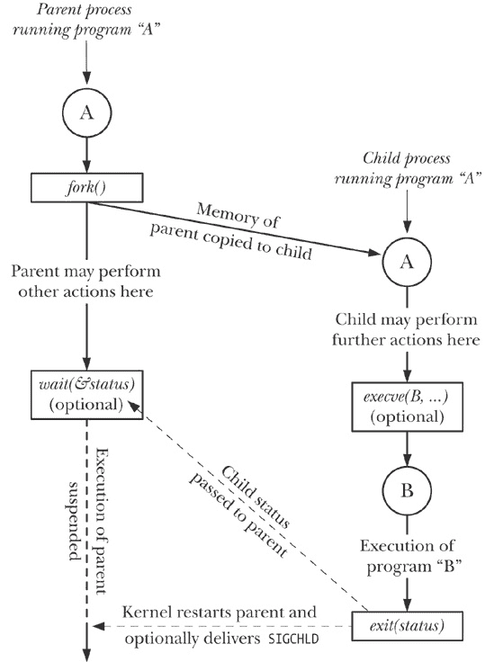
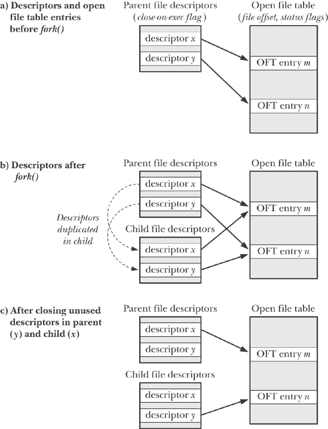
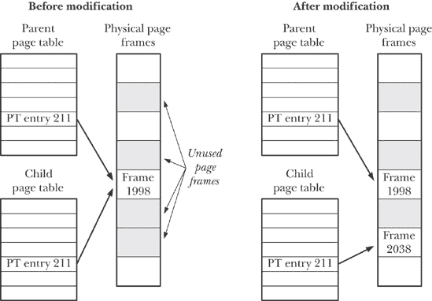

## 第二十四章：进程创建

在本章及接下来的三章中，我们将探讨一个进程是如何创建和终止的，以及进程如何执行一个新程序。本章将讨论进程的创建。然而，在深入讨论之前，我们将简要概述这四章中涉及的主要系统调用。

## *fork()*、*exit()*、*wait()* 和 *execve()* 概述

本章及接下来的几章的主要话题是系统调用 *fork()*、*exit()*、*wait()* 和 *execve()*。这些系统调用各自有不同的变体，我们也会进行讨论。现在，我们先对这四个系统调用及其常见的联合使用方式进行概述。

+   *fork()* 系统调用允许一个进程（父进程）创建一个新的进程（子进程）。这通过将新的子进程几乎完全复制父进程来实现：子进程获得父进程的堆栈、数据、堆和文本段的副本（进程的内存布局）。*fork* 这个术语源于我们可以想象父进程分裂成两个相同的副本。

+   *exit(status)* 库函数用于终止进程，使该进程使用的所有资源（内存、打开的文件描述符等）可供内核后续重新分配。*status* 参数是一个整数，确定进程的终止状态。父进程可以使用 *wait()* 系统调用获取此状态。

### 注意

*exit()* 库函数是建立在 *_exit()* 系统调用之上的。在 第二十五章中，我们将解释这两者接口的区别。与此同时，我们仅需注意，在 *fork()* 后，通常只有父进程或子进程之一会通过调用 *exit()* 终止；另一个进程应通过调用 *_exit()* 终止。

+   *wait(&status)* 系统调用有两个用途。首先，如果该进程的子进程尚未通过调用 *exit()* 终止，则 *wait()* 会挂起该进程的执行，直到其子进程之一终止。其次，子进程的终止状态会通过 *wait()* 的状态参数返回。

+   *execve(pathname, argv, envp)* 系统调用将一个新程序（*pathname*，包含参数列表 *argv* 和环境列表 *envp*）加载到进程的内存中。现有的程序文本会被丢弃，新的堆栈、数据和堆段会为新程序重新创建。这个操作通常被称为 *execing* 一个新程序。稍后我们会看到，多个库函数层叠在 *execve()* 之上，每个库函数都提供了编程接口的有用变化。当我们不关心这些接口变化时，通常按照惯例将这些调用统称为 *exec()*，但需要注意的是，实际上并没有名为 *exec()* 的系统调用或库函数。

一些其他操作系统将*fork()*和*exec()*的功能合并为一个单独的操作——所谓的*spawn*——该操作创建一个新的进程，然后执行指定的程序。相比之下，UNIX 方法通常更简单、更优雅。将这两个步骤分开使得 API 更简洁（*fork()*系统调用不需要任何参数），并且在这两个步骤之间的操作更加灵活。此外，执行*fork()*而不跟随*exec()*通常是很有用的。

### 注意

SUSv3 规范了可选的*posix_spawn()*函数，它结合了*fork()*和*exec()*的效果。这个函数和 SUSv3 规范的几个相关 API 在 Linux 的*glibc*中得到了实现。SUSv3 定义*posix_spawn()*是为了允许开发便于在没有交换设施或内存管理单元的硬件架构上运行的可移植应用程序（这在许多嵌入式系统中是典型的）。在这种架构下，传统的*fork()*实现起来困难或不可能。

图 24-1*, *exit()*, *wait()*, 和 *execve()* 的使用概览")提供了*fork()*, *exit()*, *wait()* 和 *execve()* 常见的共同使用概览。（该图概述了 Shell 执行命令的步骤：Shell 持续执行一个循环，读取命令，进行各种处理，然后 fork 一个子进程来执行命令。）

此图中展示的*execve()*的使用是可选的。有时，子进程继续执行与父进程相同的程序更为有用。无论哪种情况，子进程的执行最终会通过调用*exit()*（或发送信号）终止，父进程可以通过*wait()*获得终止状态。

调用*wait()*同样是可选的。父进程可以简单地忽略其子进程并继续执行。然而，稍后我们将看到，通常需要使用*wait()*，并且它通常被用于处理`SIGCHLD`信号，该信号由内核生成，当父进程的某个子进程终止时会发送此信号。（默认情况下，`SIGCHLD`信号会被忽略，这也是我们在图中标注为“可选交付”的原因。）

图 24-1. *fork()*, *exit()*, *wait()*, 和 *execve()* 的使用概览

## 创建新进程：*fork()*

在许多应用中，创建多个进程是一种有效的任务划分方式。例如，一个网络服务器进程可能会监听来自客户端的请求，并为每个请求创建一个新的子进程来处理；与此同时，服务器进程继续监听其他客户端连接。以这种方式划分任务通常会使应用程序设计更简洁。它还允许更高的并发性（即，可以同时处理更多的任务或请求）。

*fork()* 系统调用创建一个新的进程，即 *子进程*，它几乎是调用进程（即 *父进程*）的一个精确副本。

```
#include <unistd.h>

pid_t `fork`(void);
```

### 注意

在父进程中：成功时返回子进程的进程 ID，出错时返回 -1；在成功创建的子进程中：总是返回 0

理解 *fork()* 的关键点在于认识到，在 *fork()* 完成工作后，存在两个进程，并且在每个进程中，执行会从 *fork()* 返回的地方继续。

这两个进程执行相同的程序代码，但它们有各自独立的栈、数据和堆段。子进程的栈、数据和堆段最初是父进程内存中相应部分的精确副本。在 *fork()* 之后，每个进程可以修改自己栈、数据和堆段中的变量，而不会影响另一个进程。

在程序的代码中，我们可以通过 *fork()* 返回的值来区分这两个进程。对于父进程，*fork()* 返回新创建子进程的进程 ID。这非常有用，因为父进程可能需要创建并跟踪多个子进程（通过 *wait()* 或其相关函数）。对于子进程，*fork()* 返回 0。如果需要，子进程可以使用 *getpid()* 获取自己的进程 ID，并使用 *getppid()* 获取父进程的进程 ID。

如果无法创建新进程，*fork()* 会返回 -1。失败的可能原因包括该（真实）用户 ID 允许的进程数资源限制（`RLIMIT_NPROC`，详见 特定资源限制详情）已被超出，或者系统范围内允许创建的最大进程数已达到上限。

调用 *fork()* 时，有时会使用以下习惯用法：

```
pid_t childPid;             /* Used in parent after successful fork()
                               to record PID of child */
switch (childPid = fork()) {
case -1:                    /* fork() failed */
    /* Handle error */

case 0:                     /* Child of successful fork() comes here */
    /* Perform actions specific to child */

default:                    /* Parent comes here after successful fork() */
    /* Perform actions specific to parent */
}
```

需要意识到的是，*fork()* 之后，无法确定哪一个进程将被调度使用 CPU。在写得不好的程序中，这种不确定性可能会导致称为竞争条件的错误，我们将在第 24.4 节进一步讨论这一问题。

示例 24-1") 展示了 *fork()* 的使用。这个程序创建了一个子进程，修改了它在 *fork()* 过程中继承的全局变量和自动变量的副本。

本程序中父进程执行的 *sleep()* 函数允许子进程在父进程之前获得 CPU 时间片，从而使得子进程可以先完成任务并终止，然后父进程再继续执行。以这种方式使用 *sleep()* 并不是保证结果的万无一失的方法；我们将在第 24.5 节讨论更好的方法。

当我们运行 示例 24-1") 程序时，看到以下输出：

```
`./t_fork`
PID=28557 (child)  idata=333 istack=666
PID=28556 (parent) idata=111 istack=222
```

上述输出演示了在执行*fork()*时，子进程获得了栈和数据段的独立副本，并且可以修改这些段中的变量，而不会影响父进程。

示例 24-1. 使用*fork()*

```
`procexec/t_fork.c`
#include "tlpi_hdr.h"

static int idata = 111;             /* Allocated in data segment */

int
main(int argc, char *argv[])
{
    int istack = 222;               /* Allocated in stack segment */
    pid_t childPid;

    switch (childPid = fork()) {
    case -1:
        errExit("fork");

    case 0:
        idata *= 3;
        istack *= 3;
        break;

    default:
        sleep(3);                   /* Give child a chance to execute */
        break;
    }

    /* Both parent and child come here */

    printf("PID=%ld %s idata=%d istack=%d\n", (long) getpid(),
            (childPid == 0) ? "(child) " : "(parent)", idata, istack);

    exit(EXIT_SUCCESS);
}
      `procexec/t_fork.c`
```

### 父子进程之间的文件共享

执行*fork()*时，子进程会接收到父进程所有文件描述符的副本。这些副本是通过*dup()*方式创建的，这意味着父子进程中对应的描述符指向相同的打开文件描述符。正如我们在文件描述符与打开文件之间的关系中看到的，打开文件描述符包含当前的文件偏移量（由*read()*、*write()*和*lseek()*修改）以及打开文件的状态标志（由*open()*设置，并通过*fcntl()*的`F_SETFL`操作更改）。因此，打开文件的这些属性在父子进程之间是共享的。例如，如果子进程更新了文件偏移量，这一更改将通过父进程中的对应描述符可见。

父子进程在执行*fork()*后共享这些属性的事实，通过示例 24-2 中的程序得到了证明。该程序使用*mkstemp()*打开一个临时文件，然后调用*fork()*创建一个子进程。子进程更改了临时文件的文件偏移量和打开文件状态标志，并退出。父进程随后检索文件偏移量和标志，以验证它可以看到子进程所做的更改。当我们运行该程序时，看到如下输出：

```
$ `./fork_file_sharing`
File offset before fork(): 0
O_APPEND flag before fork() is: off
Child has exited
File offset in parent: 1000
O_APPEND flag in parent is: on
```

### 注意

有关为什么我们在示例 24-2 中将*lseek()*的返回值强制转换为*long long*的解释，请参见大文件的 I/O 操作。

示例 24-2. 父子进程之间共享文件偏移量和打开文件状态标志

```
`procexec/fork_file_sharing.c`
#include <sys/stat.h>
#include <fcntl.h>
#include <sys/wait.h>
#include "tlpi_hdr.h"

int
main(int argc, char *argv[])
{
    int fd, flags;
    char template[] = "/tmp/testXXXXXX";

    setbuf(stdout, NULL);                   /* Disable buffering of stdout */

    fd = mkstemp(template);
    if (fd == -1)
        errExit("mkstemp");

    printf("File offset before fork(): %lld\n",
            (long long) lseek(fd, 0, SEEK_CUR));

    flags = fcntl(fd, F_GETFL);
    if (flags == -1)
        errExit("fcntl - F_GETFL");
    printf("O_APPEND flag before fork() is: %s\n",
            (flags & O_APPEND) ? "on" : "off");

    switch (fork()) {
    case -1:
        errExit("fork");

    case 0:     /* Child: change file offset and status flags */
        if (lseek(fd, 1000, SEEK_SET) == -1)
            errExit("lseek");

        flags = fcntl(fd, F_GETFL);         /* Fetch current flags */
        if (flags == -1)
            errExit("fcntl - F_GETFL");
        flags |= O_APPEND;                  /* Turn O_APPEND on */
        if (fcntl(fd, F_SETFL, flags) == -1)
            errExit("fcntl - F_SETFL");
        _exit(EXIT_SUCCESS);

    default:    /* Parent: can see file changes made by child */
        if (wait(NULL) == -1)
            errExit("wait");                /* Wait for child exit */
        printf("Child has exited\n");

        printf("File offset in parent: %lld\n",
                (long long) lseek(fd, 0, SEEK_CUR));

        flags = fcntl(fd, F_GETFL);
        if (flags == -1)
            errExit("fcntl - F_GETFL");
        printf("O_APPEND flag in parent is: %s\n",
                (flags & O_APPEND) ? "on" : "off");
        exit(EXIT_SUCCESS);
    }
}
     `procexec/fork_file_sharing.c`
```

父子进程共享打开的文件属性通常是非常有用的。例如，如果父进程和子进程都在向同一个文件写入，文件偏移量的共享可以确保两个进程不会覆盖对方的输出。然而，这并不能防止两个进程的输出被随机交织在一起。如果不希望这种情况发生，则需要某种形式的进程同步。例如，父进程可以使用*wait()*系统调用暂停，直到子进程退出。这正是 shell 所做的，它仅在执行命令的子进程终止后才打印提示符（除非用户通过在命令末尾添加“&”符号显式地让命令在后台运行）。

如果不需要以这种方式共享文件描述符，则应用程序应该设计成，在*fork()*之后，父进程和子进程使用不同的文件描述符，并且每个进程在 fork 后立即关闭未使用的描述符（即由另一个进程使用的描述符）。（如果其中一个进程执行*exec()*，在文件描述符和*exec()*")中描述的 close-on-exec 标志也可能会有所帮助。）这些步骤在图 24-2 期间文件描述符的复制，以及关闭未使用的描述符")中展示。

图 24-2. *fork()*期间文件描述符的复制，以及关闭未使用的描述符

### *fork()*的内存语义

从概念上讲，我们可以将*fork()*看作是创建父进程的文本、数据、堆和栈段的副本。（实际上，在一些早期的 UNIX 实现中，这种复制操作是字面上执行的：通过将父进程的内存复制到交换空间，创建一个新的进程映像，并将该交换出的映像作为子进程，而父进程保持自己的内存。）然而，实际上简单地将父进程的虚拟内存页复制到新的子进程中是低效的，原因有很多——其中一个原因是*fork()*通常会紧接着一个*exec()*，后者会用一个新程序替换进程的文本，并重新初始化进程的数据显示、堆和栈段。大多数现代 UNIX 实现，包括 Linux，使用两种技术来避免这种浪费性的复制：

+   内核将每个进程的文本段标记为只读，这样进程就无法修改自己的代码。这意味着父进程和子进程可以共享相同的文本段。*fork()*系统调用通过构建一组每个进程的页表项来为子进程创建一个文本段，这些页表项指向已经被父进程使用的相同虚拟内存页面框架。

+   对于父进程中数据段、堆段和栈段的页面，内核使用一种叫做*写时复制*（copy-on-write）的技术。（写时复制的实现可以参考[Bach, 1986]和[Bovet & Cesati, 2005]。）最初，内核会设置这些段的页表项，使其指向与父进程中相应页表项相同的物理内存页面，并且这些页面本身被标记为只读。在*fork()*之后，内核会拦截父进程或子进程任何修改这些页面的尝试，并为即将被修改的页面创建一个副本。这个新的页面副本会分配给故障进程，并适当调整子进程的相应页表项。从此之后，父进程和子进程可以各自修改它们的私有页面副本，而修改不会对另一个进程可见。图 24-3 展示了写时复制技术。

图 24-3. 共享写时复制页面修改前后的页表

#### 控制进程的内存占用

我们可以结合使用*fork()*和*wait()*来控制进程的内存占用。进程的内存占用是指进程使用的虚拟内存页面范围，受诸如函数调用和返回时栈调整、调用*exec()*、以及特别需要关注的因调用*malloc()*和*free()*导致堆内存修改等因素的影响。

假设我们在示例 24-3 中展示的方式下，使用*fork()*和*wait()*来包围对某个函数*func()*的调用。在执行完这些代码后，我们知道父进程的内存占用没有改变，因为所有可能的修改都发生在子进程中。这对于以下原因非常有用：

+   如果我们知道*func()*会导致内存泄漏或堆内存的过度碎片化，那么这种技术可以消除这个问题。（如果我们无法访问*func()*的源代码，可能无法解决这些问题。）

+   假设我们有一个算法，在进行树形分析时会执行内存分配（例如，一个分析可能移动及其响应的游戏程序）。我们可以编写这样的程序，通过调用*free()*来释放所有分配的内存。然而，在某些情况下，使用我们在此描述的技术会更简单，这使得我们可以回溯，并让调用者（父进程）保持原始内存占用不变。

在示例 24-3 中的实现中，*func()*的结果必须以*exit()*从终止的子进程传递给调用*wait()*的父进程的 8 位数据形式表达。然而，我们可以使用文件、管道或其他进程间通信技术来允许*func()*返回更大的结果。

示例 24-3. 不改变进程内存占用的情况下调用函数

```
*from* `procexec/footprint.c`
    pid_t childPid;
    int status;

    childPid = fork();
    if (childPid == -1)
        errExit("fork");

    if (childPid == 0)              /* Child calls func() and */
        exit(func(arg));            /* uses return value as exit status */

    /* Parent waits for child to terminate. It can determine the
       result of func() by inspecting 'status'. */

    if (wait(&status) == -1)
        errExit("wait");

     *from* `procexec/footprint.c`
```

## *vfork()*系统调用

早期的 BSD 实现中，*fork()*会执行父进程数据、堆和栈的字面复制。如前所述，这种方式是浪费的，尤其是在*fork()*后立即跟着*exec()*调用的情况下。因此，后来的 BSD 版本引入了*vfork()*系统调用，它比 BSD 的*fork()*更高效，尽管其操作语义稍微不同（实际上，有些奇怪）。现代 UNIX 实现通过复制写入（copy-on-write）方式来实现*fork()*，比旧版*fork()*实现更高效，从而基本消除了对*vfork()*的需求。然而，Linux（与许多其他 UNIX 实现一样）为需要最快可能的 fork 的程序提供了具有 BSD 语义的*vfork()*系统调用。然而，由于*vfork()*的非传统语义可能导致一些微妙的程序错误，因此通常应避免使用它，除非在少数情况下它提供了值得的性能提升。

和*fork()*一样，*vfork()*也用于调用进程创建一个新的子进程。然而，*vfork()*专门设计用于子进程立即执行*exec()*调用的程序中。

```
#include <unistd.h>
pid_t `vfork`(void);
```

### 注意

在父进程中：成功时返回子进程的进程 ID，出错时返回-1；在成功创建的子进程中：始终返回 0

有两个特点使得*vfork()*系统调用与*fork()*不同，并且使得它更高效：

+   对于子进程，不会进行虚拟内存页面或页面表的复制。相反，子进程共享父进程的内存，直到它执行成功的*exec()*或调用*_exit()*来终止。

+   父进程的执行将被挂起，直到子进程执行*exec()*或*_exit()*。

这些要点有一些重要的含义。由于子进程使用的是父进程的内存，任何子进程对数据、堆或栈段的修改在子进程恢复执行时都能被父进程看到。此外，如果子进程在*vfork()*与后续的*exec()*或*_exit()*之间执行函数返回，这也会影响父进程。这类似于在执行非局部跳转：*setjmp()*与*longjmp()*与 longjmp()")中描述的示例，尝试从一个已经执行过返回的函数中进行*longjmp()*。类似的混乱——通常是段错误（`SIGSEGV`）——很可能会发生。

子进程可以在*vfork()*与*exec()*之间执行一些操作，而不会影响父进程。这些操作包括对打开文件描述符的操作（但不包括*stdio*文件流）。由于每个进程的文件描述符表保存在内核空间中（文件描述符与打开文件之间的关系），并且在*vfork()*时会被复制，子进程可以执行文件描述符操作而不影响父进程。

### 注意

SUSv3 规定，如果程序：a) 修改除存储*vfork()*返回值的*pid_t*类型变量以外的任何数据；b) 从调用*vfork()*的函数中返回；或 c) 在成功调用*_exit()*或执行*exec()*之前调用任何其他函数，程序的行为是未定义的。

当我们查看 clone()系统调用系统调用")时，我们会发现使用*fork()*或*vfork()*创建的子进程也会获得自己的一些其他进程属性的副本。

*vfork()*的语义意味着，在调用之后，子进程会在父进程之前被调度到 CPU 上。在创建新进程：*fork()*")中，我们注意到这是*fork()*所不保证的，调用后父进程或子进程都可能先被调度。

示例 24-4")展示了*vfork()*的使用，展示了它与*fork()*的两个语义特征：子进程共享父进程的内存，且父进程在子进程终止或调用*exec()*之前会被挂起。当我们运行此程序时，看到以下输出：

```
$ `./t_vfork`
Child executing           *Even though child slept, parent was not scheduled*
Parent executing
istack=666
```

从最后一行输出中，我们可以看到子进程对变量*istack*所做的修改实际上是作用于父进程的变量。

示例 24-4. 使用*vfork()*

```
`procexec/t_vfork.c`
#include "tlpi_hdr.h"

int
main(int argc, char *argv[])
{
    int istack = 222;

    switch (vfork()) {
    case -1:
        errExit("vfork");

    case 0:             /* Child executes first, in parent's memory space */
        sleep(3);                   /* Even if we sleep for a while,
                                       parent still is not scheduled */
        write(STDOUT_FILENO, "Child executing\n", 16);
        istack *= 3;                /* This change will be seen by parent */
        _exit(EXIT_SUCCESS);

    default:            /* Parent is blocked until child exits */
        write(STDOUT_FILENO, "Parent executing\n", 17);
        printf("istack=%d\n", istack);
        exit(EXIT_SUCCESS);
    }
}
      `procexec/t_vfork.c`
```

除非速度至关重要，否则新程序应避免使用*vfork()*，而应使用*fork()*。这是因为，当*fork()*使用写时复制语义（大多数现代 UNIX 实现中采用的方式）时，它的速度接近于*vfork()*，同时避免了上述与*vfork()*相关的怪异行为。（我们在第 28.3 节中展示了*fork()*和*vfork()*之间的一些速度对比。）

SUSv3 将*vfork()*标记为废弃，SUSv4 进一步删除了*vfork()*的规范。SUSv3 没有明确规定*vfork()*的许多操作细节，允许其作为对*fork()*的调用来实现。当以这种方式实现时，*vfork()*的 BSD 语义不再保留。一些 UNIX 系统确实将*vfork()*实现为对*fork()*的调用，Linux 在 2.0 及之前的内核版本中也这样做过。

在使用*vfork()*的地方，通常应紧接着调用*exec()*。如果*exec()*调用失败，子进程应通过调用*_exit()*来终止。（*vfork()*的子进程不应通过调用*exit()*来终止，因为这会导致父进程的*stdio*缓冲区被刷新并关闭。我们将在第 25.4 节对此问题进行详细讨论。）

其他使用*vfork()*的情况——尤其是那些依赖于其独特语义来共享内存和调度进程的情况——可能会使程序变得不可移植，特别是在那些将*vfork()*仅仅作为对*fork()*的调用来实现的系统上。

## *fork()*之后的竞争条件

在一次*fork()*之后，不确定是父进程还是子进程首先访问 CPU。（在多处理器系统中，它们可能会同时获得 CPU 的访问权。）依赖于特定执行顺序以确保正确结果的应用程序，可能会因为*竞争条件*而失败，我们在第 5.1 节中描述了这一点。这类 bug 可能难以发现，因为它们的发生取决于内核根据系统负载做出的调度决策。

我们可以使用示例 24-5 之后争夺写消息的机会")中的程序来演示这种不确定性。该程序通过循环，使用*fork()*来创建多个子进程。每次调用*fork()*后，父进程和子进程都会打印一条消息，消息中包含循环计数器的值，并且会标明该进程是父进程还是子进程。例如，如果我们要求程序只创建一个子进程，我们可能会看到如下结果：

```
$ `./fork_whos_on_first 1`
0 parent
0 child
```

我们可以使用该程序创建大量子进程，然后分析输出，看看每次哪个进程首先打印其消息。在使用该程序在 Linux/x86-32 2.2.19 系统上创建 100 万个子进程时的分析结果显示，父进程在除 332 个案例之外的所有情况中首先打印消息（即在 99.97%的情况下）。

### 注意

在 示例 24-5 后竞争写入消息") 中运行该程序的结果，使用了脚本 `procexec/fork_whos_on_first.count.awk` 进行分析，该脚本包含在本书的源代码分发中。

从这些结果来看，我们可以推测，在 Linux 2.2.19 上，执行在调用 *fork()* 后总是继续由父进程进行。子进程偶尔先打印消息的原因是，在 0.03% 的情况下，父进程的 CPU 时间片耗尽，来不及打印它的消息。换句话说，如果这个例子假设我们依赖父进程总是在 *fork()* 后首先被调度，那么大多数情况下会按预期运行，但每 3000 次中，可能会有一次出现问题。当然，如果应用程序期望父进程在子进程被调度之前能够完成更多的工作，那么出现问题的可能性会更大。调试这种复杂程序中的错误可能非常困难。

示例 24-5. 父子进程在 *fork()* 后竞争写入消息

```
`procexec/fork_whos_on_first.c`
#include <sys/wait.h>
#include "tlpi_hdr.h"

int
main(int argc, char *argv[])
{
    int numChildren, j;
    pid_t childPid;

    if (argc > 1 && strcmp(argv[1], "--help") == 0)
        usageErr("%s [num-children]\n", argv[0]);

    numChildren = (argc > 1) ? getInt(argv[1], GN_GT_0, "num-children") : 1;

    setbuf(stdout, NULL);                /* Make stdout unbuffered */

    for (j = 0; j < numChildren; j++) {
        switch (childPid = fork()) {
        case -1:
            errExit("fork");

        case 0:
            printf("%d child\n", j);
            _exit(EXIT_SUCCESS);

        default:
            printf("%d parent\n", j);
            wait(NULL);                   /* Wait for child to terminate */
            break;
        }
    }

    exit(EXIT_SUCCESS);
}
     `procexec/fork_whos_on_first.c`
```

虽然在 Linux 2.2.19 中总是由父进程继续执行 *fork()* 后的操作，但我们不能依赖其他 UNIX 实现，甚至是不同版本的 Linux 内核也会是这种情况。在 2.4 稳定内核系列期间，曾对“子进程先于 *fork()* 后执行”的补丁做过短暂的实验，这完全颠覆了 2.2.19 所得到的结果。虽然这个变化后来被从 2.4 内核系列中删除，但随后在 Linux 2.6 中得到了采纳。因此，假设 2.2.19 行为的程序会在 2.6 内核中无法运行。

一些较新的实验推翻了内核开发者对于 *fork()* 后该先运行子进程还是父进程的评估，从 Linux 2.6.32 开始，默认情况下，父进程会在 *fork()* 后首先运行。这个默认设置可以通过为 Linux 特定的 `/`proc/sys/kernel/sched_child_runs_first` 文件分配一个非零值来进行更改。

### 注意

为了看清“子进程先于*fork()*后执行”的理由，考虑当*fork()*的子进程立即执行*exec()*时，复制写语义会发生什么情况。在这种情况下，由于父进程在*fork()*之后继续修改数据和栈页面，内核会为子进程复制将要修改的页面。由于子进程一旦被调度就执行*exec()*，这种复制是浪费的。根据这个论点，最好先调度子进程，这样等父进程下次调度时，就不需要进行页面复制了。在示例 24-5*后争先写消息")中，使用该程序在一个运行着 2.6.30 版本内核的忙碌 Linux/x86-32 系统上创建了 100 万个子进程，结果显示在 99.98%的情况下，子进程首先显示了消息。（具体百分比依赖于如系统负载等因素。）在其他 UNIX 实现上测试此程序时，显示出父进程和子进程在*fork()*后哪个先运行的规则差异较大。

在 Linux 2.6.32 中，回到“父进程先于*fork()*后执行”的论点是基于以下观察：在*fork()*之后，父进程的状态已经在 CPU 中处于活动状态，其内存管理信息已经被缓存到硬件内存管理单元的翻译旁路缓冲区（TLB）中。因此，先调度父进程应该能带来更好的性能。通过测量在两种行为下构建内核所需的时间，这一观点得到了非正式的验证。

总之，值得注意的是，两种行为之间的性能差异非常小，并不会影响大多数应用程序。

从前面的讨论中可以看出，我们不能假设父进程和子进程在*fork()*之后有特定的执行顺序。如果我们需要保证特定的顺序，就必须使用某种同步技术。我们将在后续章节中描述几种同步技术，包括信号量、文件锁和使用管道在进程之间发送消息。还有一种方法，我们接下来会描述，就是使用信号。

## 通过信号同步避免竞态条件

在*fork()*之后，如果任一进程需要等待另一个进程完成某个操作，则活动进程可以在完成操作后发送信号；另一个进程则等待该信号。

示例 24-6 演示了这种技术。在此程序中，我们假设父进程必须等待子进程执行某些操作。如果子进程必须等待父进程，则父进程和子进程中的信号相关调用可以互换。实际上，父子进程之间可能会多次相互发送信号，以协调它们的操作，尽管通常这种协调更多是通过信号量、文件锁或消息传递来实现。

### 注意

[Stevens & Rago, 2005] 建议将此类同步步骤（屏蔽信号、发送信号、接收信号）封装为一套标准的进程同步函数。封装的好处是，如果需要，我们以后可以将信号的使用替换为其他 IPC 机制。

请注意，在 示例 24-6 中，我们在 *fork()* 调用之前屏蔽了同步信号 `(SIGUSR1)`。如果父进程在 *fork()* 之后尝试屏蔽信号，那么它将仍然容易受到我们试图避免的竞态条件的影响。（在此程序中，我们假设子进程中的信号屏蔽状态无关紧要；如有必要，我们可以在 *fork()* 后在子进程中解除屏蔽 `SIGUSR1`。）

以下 shell 会话日志显示了当我们运行 示例 24-6 中的程序时发生了什么：

```
$ `./fork_sig_sync`
[17:59:02 5173] Child started - doing some work
[17:59:02 5172] Parent about to wait for signal
[17:59:04 5173] Child about to signal parent
[17:59:04 5172] Parent got signal
```

示例 24-6. 使用信号同步进程操作

```
`procexec/fork_sig_sync.c`
#include <signal.h>
#include "curr_time.h"                  /* Declaration of currTime() */
#include "tlpi_hdr.h"

#define SYNC_SIG SIGUSR1                /* Synchronization signal */

static void             /* Signal handler - does nothing but return */
handler(int sig)
{
}

int
main(int argc, char *argv[])
{
    pid_t childPid;
    sigset_t blockMask, origMask, emptyMask;
    struct sigaction sa;

    setbuf(stdout, NULL);               /* Disable buffering of stdout */

    sigemptyset(&blockMask);
    sigaddset(&blockMask, SYNC_SIG);    /* Block signal */
    if (sigprocmask(SIG_BLOCK, &blockMask, &origMask) == -1)
        errExit("sigprocmask");

    sigemptyset(&sa.sa_mask);
    sa.sa_flags = SA_RESTART;
    sa.sa_handler = handler;
    if (sigaction(SYNC_SIG, &sa, NULL) == -1)
        errExit("sigaction");

    switch (childPid = fork()) {
    case -1:
        errExit("fork");

    case 0: /* Child */

        /* Child does some required action here... */

        printf("[%s %ld] Child started - doing some work\n",
                currTime("%T"), (long) getpid());
        sleep(2);               /* Simulate time spent doing some work */

        /* And then signals parent that it's done */

        printf("[%s %ld] Child about to signal parent\n",
                currTime("%T"), (long) getpid());
        if (kill(getppid(), SYNC_SIG) == -1)
            errExit("kill");

        /* Now child can do other things... */

        _exit(EXIT_SUCCESS);

    default: /* Parent */

        /* Parent may do some work here, and then waits for child to
           complete the required action */

        printf("[%s %ld] Parent about to wait for signal\n",
                currTime("%T"), (long) getpid());
        sigemptyset(&emptyMask);
        if (sigsuspend(&emptyMask) == -1 && errno != EINTR)
            errExit("sigsuspend");
        printf("[%s %ld] Parent got signal\n", currTime("%T"), (long) getpid());

        /* If required, return signal mask to its original state */

        if (sigprocmask(SIG_SETMASK, &origMask, NULL) == -1)
            errExit("sigprocmask");

        /* Parent carries on to do other things... */

        exit(EXIT_SUCCESS);
    }
}
      `procexec/fork_sig_sync.c`
```

## 摘要

*fork()* 系统调用通过几乎完全复制调用进程（父进程）来创建一个新进程（子进程）。*vfork()* 系统调用是 *fork()* 的一种更高效的版本，但通常最好避免使用，因为它具有不寻常的语义，其中子进程在执行 *exec()* 或终止之前，会使用父进程的内存；在此期间，父进程的执行会被挂起。

在 *fork()* 调用之后，我们无法依赖父进程和子进程被调度到 CPU 的顺序。假设执行顺序的程序容易出现所谓的竞态条件错误。由于这些错误的发生依赖于诸如系统负载等外部因素，因此它们通常难以发现和调试。

#### 进一步信息

[Bach, 1986] 和 [Goodheart & Cox, 1994] 提供了 *fork()*、*execve()*、*wait()* 和 *exit()* 在 UNIX 系统中的实现细节。[Bovet & Cesati, 2005] 和 [Love, 2010] 提供了 Linux 特定的进程创建和终止实现细节。

## 练习

1.  在程序执行以下一系列 *fork()* 调用后，将会产生多少个新进程（假设这些调用没有失败）？

    ```
    fork();
    fork();
    fork();
    ```

1.  编写一个程序演示在执行*vfork()*后，子进程可以关闭一个文件描述符（例如描述符 0），而不影响父进程中的相应文件描述符。

1.  假设我们可以修改程序源代码，我们如何在给定的时刻获取一个进程的核心转储，同时让进程继续执行？

1.  在其他 UNIX 实现上实验示例 24-5 后竞争写入消息")（`fork_whos_on_first.c`）程序，确定这些实现如何调度父进程和子进程的执行。

1.  假设在示例 24-6 中的程序里，子进程也需要等待父进程完成一些操作。为了强制执行这一点，程序需要做哪些修改？
