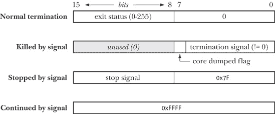

## 第二十六章. 监控子进程

在许多应用设计中，父进程需要知道其某个子进程的状态何时发生变化——当子进程终止或被信号停止时。本章描述了监控子进程的两种技术：*wait()* 系统调用（及其变体）和使用 `SIGCHLD` 信号。

## 等待子进程

在许多父进程创建子进程的应用程序中，父进程能够监控子进程，了解子进程何时以及如何终止是非常有用的。这个功能由 *wait()* 及一些相关系统调用提供。

### *wait()* 系统调用

*wait()* 系统调用会等待调用进程的一个子进程终止，并将该子进程的终止状态返回到 *status* 指向的缓冲区中。

```
#include <sys/wait.h>

pid_t `wait`(int **status*);
```

### 注意

返回已终止子进程的进程 ID，或在出错时返回 -1

*wait()* 系统调用执行以下操作：

1.  如果调用进程的任何（先前未等待过的）子进程尚未终止，则该调用会阻塞，直到一个子进程终止。如果在调用时某个子进程已经终止，*wait()* 会立即返回。

1.  如果 *status* 不是 `NULL`，关于子进程如何终止的信息将返回到 *status* 指向的整数中。我们在等待状态值中描述 *status* 返回的信息。

1.  内核将进程的 CPU 时间（进程时间）和资源使用统计信息（进程资源使用情况）添加到该父进程所有子进程的总数中。

1.  作为其功能结果，*wait()* 返回已终止子进程的进程 ID。

当出错时，*wait()* 返回 -1。一个可能的错误是调用进程没有（先前未等待过的）子进程，这通过 *errno* 值 `ECHILD` 来指示。这意味着我们可以使用以下循环来等待调用进程的所有子进程终止：

```
while ((childPid = wait(NULL)) != -1)
    continue;
if (errno != ECHILD)                /* An unexpected error... */
    errExit("wait");
```

示例 26-1 演示了 *wait()* 的使用。该程序创建多个子进程，每个子进程对应一个（整数）命令行参数。每个子进程会根据相应命令行参数中指定的秒数休眠，然后退出。同时，在所有子进程创建后，父进程会反复调用 *wait()* 来监控子进程的终止。该循环会持续到 *wait()* 返回 -1。（这并不是唯一的方法：我们也可以选择在已终止的子进程数量 *numDead* 与创建的子进程数量相等时退出循环。）以下 shell 会话日志显示了当我们使用该程序创建三个子进程时发生的情况：

```
$ `./multi_wait 7 1 4`
[13:41:00] child 1 started with PID 21835, sleeping 7 seconds
[13:41:00] child 2 started with PID 21836, sleeping 1 seconds
[13:41:00] child 3 started with PID 21837, sleeping 4 seconds
[13:41:01] wait() returned child PID 21836 (numDead=1)
[13:41:04] wait() returned child PID 21837 (numDead=2)
[13:41:07] wait() returned child PID 21835 (numDead=3)
No more children - bye!
```

### 注意

如果某个时刻有多个已终止的子进程，SUSv3 没有指定这些子进程将由一系列*wait()*调用按什么顺序回收；也就是说，顺序取决于实现。即使在不同版本的 Linux 内核中，行为也有所不同。

示例 26-1. 创建并等待多个子进程

```
`procexec/multi_wait.c`
#include <sys/wait.h>
#include <time.h>
#include "curr_time.h"              /* Declaration of currTime() */
#include "tlpi_hdr.h"

int
main(int argc, char *argv[])
{
    int numDead;       /* Number of children so far waited for */
    pid_t childPid;    /* PID of waited for child */
    int j;

    if (argc < 2 || strcmp(argv[1], "--help") == 0)
        usageErr("%s sleep-time...\n", argv[0]);

    setbuf(stdout, NULL);           /* Disable buffering of stdout */

    for (j = 1; j < argc; j++) {    /* Create one child for each argument */
        switch (fork()) {
        case -1:
            errExit("fork");

        case 0:                     /* Child sleeps for a while then exits */
            printf("[%s] child %d started with PID %ld, sleeping %s "
                    "seconds\n", currTime("%T"), j, (long) getpid(), argv[j]);
            sleep(getInt(argv[j], GN_NONNEG, "sleep-time"));
            _exit(EXIT_SUCCESS);

        default:                    /* Parent just continues around loop */
            break;
        }
    }

    numDead = 0;
    for (;;) {                      /* Parent waits for each child to exit */
        childPid = wait(NULL);
        if (childPid == -1) {
            if (errno == ECHILD) {
                printf("No more children - bye!\n");
                exit(EXIT_SUCCESS);
            } else {                /* Some other (unexpected) error */
                errExit("wait");
            }
        }

        numDead++;
        printf("[%s] wait() returned child PID %ld (numDead=%d)\n",
                currTime("%T"), (long) childPid, numDead);
    }
}
     `procexec/multi_wait.c`
```

### *waitpid()* 系统调用

*wait()*系统调用有许多限制，*waitpid()*旨在解决这些问题：

+   如果父进程创建了多个子进程，则无法*wait()*指定某个特定子进程的完成；我们只能等待下一个终止的子进程。

+   如果没有子进程终止，*wait()*将始终阻塞。有时，执行非阻塞等待会更为合适，这样如果没有子进程终止，我们可以立即获得这一事实的反馈。

+   使用*wait()*，我们只能获知已终止的子进程。无法在子进程因信号（如`SIGSTOP`或`SIGTTIN`）被停止，或被`SIGCONT`信号恢复时收到通知。

```
#include <sys/wait.h>

pid_t `waitpid`(pid_t *pid*, int **status*, int *options*);
```

### 注意

返回子进程的进程 ID、0（见文中说明）或出错时返回-1

*waitpid()*的返回值和*status*参数与*wait()*相同。（请参阅等待状态值，了解*status*中返回值的解释。）*pid*参数使我们能够选择要等待的子进程，具体如下：

+   如果*pid*大于 0，等待进程 ID 等于*pid*的子进程。

+   如果*pid*等于 0，等待与调用者（父进程）在*同一进程组*中的任何子进程。我们在第 34.2 节描述了进程组。

+   如果*pid*小于-1，等待任何*进程组*标识符等于*pid*绝对值的子进程。

+   如果*pid*等于-1，等待*任何*子进程。调用*wait(&status)*等价于调用*waitpid(-1, &status, 0)*。

*options*参数是一个位掩码，可以包含（或）零个或多个以下标志（所有这些标志在 SUSv3 中有说明）：

`WUNTRACED`

除了返回有关已终止子进程的信息外，还会在子进程被信号*停止*时返回信息。

`WCONTINUED`（自 Linux 2.6.10 起）

还会返回关于已被`SIGCONT`信号恢复的停止子进程的状态信息。

`WNOHANG`

如果由*pid*指定的子进程尚未改变状态，则立即返回，而不是阻塞（即执行“轮询”）。在这种情况下，*waitpid()*的返回值为 0。如果调用进程没有与*pid*规格匹配的子进程，*waitpid()*会因错误`ECHILD`而失败。

我们在示例 26-3 获取子进程状态")中演示了*waitpid()*的使用。

### 注意

在*SUSv3*对*waitpid()*的说明中指出，`WUNTRACED`这个名称是这个标志在 BSD 中起源的历史遗留物，在 BSD 中，一个进程可以通过两种方式停止：作为被*ptrace()*系统调用跟踪的结果，或者通过信号停止（即未被跟踪）。当一个子进程被*ptrace()*跟踪时，*任何*信号（除了`SIGKILL`）的传递都会导致子进程停止，并因此向父进程发送`SIGCHLD`信号。即使子进程正在忽略信号，这种行为仍然会发生。然而，如果子进程正在屏蔽该信号，则不会停止（除非信号是`SIGSTOP`，该信号无法被屏蔽）。

### 等待状态值

*wait()*和*waitpid()*返回的*status*值可以帮助我们区分子进程的以下事件：

+   子进程通过调用 _*exit()*（或*exit()*）终止，并指定一个整数*exit status*（退出状态）。

+   子进程通过未处理的信号终止。

+   子进程由于信号被停止，并且*waitpid()*使用了`WUNTRACED`标志。

+   子进程通过`SIGCONT`信号恢复，且*waitpid()*使用了`WCONTINUED`标志。

我们使用*wait status*一词来涵盖上述所有情况。*termination status*（终止状态）用于指代前两种情况。（在 shell 中，我们可以通过检查变量*$?*的内容来获取最后执行的命令的终止状态。）

尽管被定义为一个*int*类型，但只有*status*指向值的底部两个字节实际被使用。这两个字节的填充方式取决于子进程发生的上述事件，如图 26-1 和 waitpid()中*status*参数返回的值")所示。

### 注意

图 26-1 和 waitpid()中*status*参数返回的值")展示了 Linux/x86-32 平台上等待状态值的布局。具体细节会根据实现有所不同。*SUSv3*并没有指定这种信息的特定布局，甚至没有要求它包含在*status*指向的值的底部两个字节中。可移植的应用程序应始终使用本节中描述的宏来检查此值，而不是直接检查其位掩码组件。

图 26-1. *wait()*和*waitpid()*中*status*参数返回的值

`<sys/wait.h>`头文件定义了一组标准宏，可以用来解构等待状态值。当应用于*wait()*或*waitpid()*返回的*status*值时，下面列表中的宏只有一个会返回`true`。还提供了额外的宏来进一步解构*status*值，如列表中所述。

`WIFEXITED(status)`

如果子进程正常退出，则该宏返回 true。在这种情况下，宏`WEXITSTATUS(status)`返回子进程的退出状态。（如终止进程：*_exit()* 和 *exit()* 和 exit()")中所述，父进程只能访问子进程退出状态的最低有效字节。）

`WIFSIGNALED(status)`

如果子进程是被信号杀死的，则该宏返回 true。在这种情况下，宏`WTERMSIG(status)`返回导致进程终止的信号号，宏`WCOREDUMP(status)`返回 true，如果子进程生成了核心转储文件。`WCOREDUMP()`宏并未在 SUSv3 中指定，但在大多数 UNIX 实现中可用。

`WIFSTOPPED(status)`

如果子进程被信号停止，则该宏返回 true。在这种情况下，宏`WSTOPSIG(status)`返回停止进程的信号号。

`WIFCONTINUED(status)`

如果子进程是通过发送`SIGCONT`信号恢复的，则该宏返回 true。此宏自 Linux 2.6.10 起可用。

请注意，尽管*status*这个名称也用于上述宏的参数，但它们期望的是一个普通的整数，而不是像*wait()*和*waitpid()*所要求的整数指针。

#### 示例程序

示例 26-2 和相关调用返回的状态值")中的*printWaitStatus()*函数使用了上述所有宏。该函数解析并打印等待状态值的内容。

示例 26-2. 显示由*wait()*和相关调用返回的状态值

```
`procexec/print_wait_status.c`
#define _GNU_SOURCE     /* Get strsignal() declaration from <string.h> */
#include <string.h>
#include <sys/wait.h>
#include "print_wait_status.h"  /* Declaration of printWaitStatus() */
#include "tlpi_hdr.h"

/* NOTE: The following function employs printf(), which is not
   async-signal-safe (see Section 21.1.2). As such, this function is
   also not async-signal-safe (i.e., beware of calling it from a
   SIGCHLD handler). */

void                    /* Examine a wait() status using the W* macros */
printWaitStatus(const char *msg, int status)
{
if (msg != NULL)
        printf("%s", msg);

    if (WIFEXITED(status)) {
        printf("child exited, status=%d\n", WEXITSTATUS(status));

    } else if (WIFSIGNALED(status)) {
        printf("child killed by signal %d (%s)",
                WTERMSIG(status), strsignal(WTERMSIG(status)));
#ifdef WCOREDUMP        /* Not in SUSv3, may be absent on some systems */
        if (WCOREDUMP(status))
            printf(" (core dumped)");
#endif
        printf("\n");

    } else if (WIFSTOPPED(status)) {
        printf("child stopped by signal %d (%s)\n",
                WSTOPSIG(status), strsignal(WSTOPSIG(status)));

#ifdef WIFCONTINUED     /* SUSv3 has this, but older Linux versions and
                           some other UNIX implementations don't */
    } else if (WIFCONTINUED(status)) {
        printf("child continued\n");
#endif

    } else {            /* Should never happen */
        printf("what happened to this child? (status=%x)\n",
                (unsigned int) status);
    }
}

     `procexec/print_wait_status.c`
```

*printWaitStatus()*函数在示例 26-3 获取子进程的状态")中使用。该程序创建一个子进程，该子进程要么持续循环调用*pause()*（此期间可以向子进程发送信号），要么如果提供了整数命令行参数，则立即使用该整数作为退出状态退出。与此同时，父进程通过*waitpid()*监控子进程，打印返回的状态值，并将该值传递给*printWaitStatus()*。当父进程检测到子进程正常退出或被信号终止时，父进程退出。

以下 shell 会话展示了示例 26-3 获取子进程的状态")中程序的一些示例运行。我们首先创建一个立即以状态 23 退出的子进程：

```
$ `./child_status 23`
Child started with PID = 15807
waitpid() returned: PID=15807; status=0x1700 (23,0)
child exited, status=23
```

在接下来的运行中，我们将程序放在后台运行，然后向子进程发送`SIGSTOP`和`SIGCONT`信号：

```
$ `./child_status &`
[1] 15870
$ Child started with PID = 15871
`kill -STOP 15871`
$ waitpid() returned: PID=15871; status=0x137f (19,127)
child stopped by signal 19 (Stopped (signal))
`kill -CONT 15871`
$ waitpid() returned: PID=15871; status=0xffff (255,255)
child continued
```

输出的最后两行只会在 Linux 2.6.10 及更高版本中出现，因为早期内核不支持*waitpid()*的`WCONTINUED`选项。（由于后台执行的程序输出有时与 Shell 提示符混合，因此这个 Shell 会话稍显难以阅读。）

我们通过向子进程发送`SIGABRT`信号来终止它，继续 Shell 会话：

```
`kill -ABRT 15871`
$ waitpid() returned: PID=15871; status=0x0006 (0,6)
child killed by signal 6 (Aborted)
*Press Enter, in order to see shell notification that background job has terminated*
[1]+  Done              ./child_status
$ `ls -l core`
ls: core: No such file or directory
$ `ulimit -c`                                    *Display* RLIMIT_CORE *limit*
0
```

尽管`SIGABRT`的默认行为是产生核心转储文件并终止进程，但并未生成核心文件。这是因为核心转储被禁用了——`RLIMIT_CORE`软资源限制（具体资源限制详情），它指定了核心文件的最大大小，已被设置为 0，如上所示的*ulimit*命令所示。

我们重复相同的实验，但这次在发送`SIGABRT`信号给子进程之前启用了核心转储：

```
$ `ulimit -c unlimited`                           *Allow core dumps*
$ `./child_status &`
[1] 15902
$ Child started with PID = 15903
`kill -ABRT 15903`                                *Send* SIGABRT *to child*
$ waitpid() returned: PID=15903; status=0x0086 (0,134)
child killed by signal 6 (Aborted) (core dumped)
*Press Enter, in order to see shell notification that background job has terminated*
[1]+  Done              ./child_status
$ `ls -l core`                                   *This time we get a core dump*
-rw-------   1 mtk      users       65536 May  6 21:01 core
```

示例 26-3. 使用*waitpid()*获取子进程的状态

```
`procexec/child_status.c`
#include <sys/wait.h>
#include "print_wait_status.h"          /* Declares printWaitStatus() */
#include "tlpi_hdr.h"

int
main(int argc, char *argv[])
{
    int status;
    pid_t childPid;
if (argc > 1 && strcmp(argv[1], "—help") == 0)
        usageErr("%s [exit-status]\n", argv[0]);

    switch (fork()) {
    case -1: errExit("fork");

    case 0:             /* Child: either exits immediately with given
                           status or loops waiting for signals */
        printf("Child started with PID = %ld\n", (long) getpid());
        if (argc > 1)                   /* Status supplied on command line? */
            exit(getInt(argv[1], 0, "exit-status"));
        else                            /* Otherwise, wait for signals */
            for (;;)
                pause();
        exit(EXIT_FAILURE);             /* Not reached, but good practice */

    default:            /* Parent: repeatedly wait on child until it
                           either exits or is terminated by a signal */
        for (;;) {
            childPid = waitpid(-1, &status, WUNTRACED
#ifdef WCONTINUED       /* Not present on older versions of Linux */
                                                | WCONTINUED
#endif
                    );
            if (childPid == -1)
                errExit("waitpid");

            /* Print status in hex, and as separate decimal bytes */

            printf("waitpid() returned: PID=%ld; status=0x%04x (%d,%d)\n",
                    (long) childPid,
                    (unsigned int) status, status >> 8, status & 0xff);
            printWaitStatus(NULL, status);

            if (WIFEXITED(status) || WIFSIGNALED(status))
                exit(EXIT_SUCCESS);
        }
    }
}
      `procexec/child_status.c`
```

### 从信号处理程序终止进程

如表 20-1 所示（在更改信号处置：*signal()*")中），某些信号默认会终止进程。在某些情况下，我们可能希望在进程终止之前执行某些清理步骤。为此，我们可以安排处理程序捕获这些信号，执行清理步骤，然后终止进程。如果我们这样做，我们应当记住，进程的终止状态可以通过*wait()*或*waitpid()*传递给其父进程。例如，从信号处理程序调用*_exit(EXIT_SUCCESS)*将使父进程看到子进程成功终止。

如果子进程需要通知父进程它是因为信号而终止的，那么子进程的信号处理程序应该首先取消自身的注册，然后再次发送相同的信号，这次会终止进程。信号处理程序将包含如下代码：

```
void
handler(int sig)
{
    /* Perform cleanup steps */

    signal(sig, SIG_DFL);            /* Disestablish handler */
    raise(sig);                      /* Raise signal again */
}
```

### *waitid()*系统调用

类似于*waitpid()*，*waitid()*返回子进程的状态。然而，*waitid()*提供了*waitpid()*所没有的额外功能。这个系统调用源自 System V，但现在在 SUSv3 中被指定。它在 Linux 内核 2.6.9 中被加入。

### 注意

在 Linux 2.6.9 之前，*waitid()*的一个版本通过*glibc*中的实现提供。然而，由于该接口的完整实现需要内核支持，*glibc*实现提供的功能与使用*waitpid()*时的功能相同。

```
#include <sys/wait.h>

int `waitid`(idtype_t *idtype*, id_t *id*, siginfo_t **infop*, int *options*);
```

### 注意

成功时返回 0，或者如果指定了`WNOHANG`且没有子进程需要等待，则返回 0；如果出错，则返回-1。

*idtype*和*id*参数指定要等待的子进程，如下所示：

+   如果*idtype*是`P_ALL`，则等待任何子进程；*id*被忽略。

+   如果 *idtype* 为 `P_PID`，则等待进程 ID 等于 *id* 的子进程。

+   如果 *idtype* 为 `P_PGID`，则等待任何进程组 ID 等于 *id* 的子进程。

### 注

请注意，与 *waitpid()* 不同，不能在 *id* 中指定 0 来表示与调用者处于同一进程组的任何进程。相反，我们必须明确指定调用者的进程组 ID，使用 *getpgrp()* 返回的值。

*waitpid()* 和 *waitid()* 之间最显著的区别是，*waitid()* 提供了更精确的控制，可以指定应该等待的子进程事件。我们可以通过将以下一个或多个标志与 *options* 进行 OR 运算来控制这一点：

`WEXITED`

等待已经终止的子进程，无论是正常终止还是异常终止。

`WSTOPPED`

等待被信号停止的子进程。

`WCONTINUED`

等待那些已通过 `SIGCONT` 信号恢复的子进程。

以下附加标志可以与 *options* 进行 OR 运算：

`WNOHANG`

这个标志的含义与 *waitpid()* 中的相同。如果没有任何符合 *id* 中规格的子进程状态信息可以返回，则立即返回（轮询）。在这种情况下，*waitid()* 的返回值为 0。如果调用进程没有符合 *id* 规格的子进程，*waitid()* 会返回错误 `ECHILD`。

`WNOWAIT`

通常，一旦子进程被 *waitid()* 等待，那么该“状态事件”会被消耗。然而，如果指定了 `WNOWAIT`，则子进程的状态将被返回，但子进程将保持在可等待状态，之后我们可以再次等待它以获取相同的信息。

如果成功，*waitid()* 返回 0，并且由 *infop* 指向的 *siginfo_t* 结构（`SA_SIGINFO` 标志）将被更新，以包含有关子进程的信息。以下字段将在 *siginfo_t* 结构中填充：

*si_code*

该字段包含以下值之一：`CLD_EXITED`，表示子进程通过调用 *_exit()* 终止；`CLD_KILLED`，表示子进程被信号杀死；`CLD_STOPPED`，表示子进程被信号停止；或 `CLD_CONTINUED`，表示子进程（之前被停止）因接收到 (`SIGCONT`) 信号而恢复执行。

*si_pid*

该字段包含子进程的进程 ID，表示其状态已发生变化。

*si_signo*

该字段始终设置为 `SIGCHLD`。

*si_status*

该字段包含子进程的退出状态，作为传递给 *_exit()* 的参数，或者导致子进程停止、继续或终止的信号。我们可以通过检查 *si_code* 字段来确定该字段中的信息类型。

*si_uid*

该字段包含子进程的真实用户 ID。大多数其他 UNIX 实现不会设置这个字段。

### 注

在 Solaris 上，另外两个字段会被填充：*si_stime* 和 *si_utime*。这两个字段分别包含子进程使用的系统 CPU 时间和用户 CPU 时间。SUSv3 并不要求 *waitid()* 设置这些字段。

*waitid()* 的一个操作细节需要进一步澄清。如果在 *options* 中指定了 `WNOHANG`，那么 *waitid()* 返回的 0 值可能有两种含义：一个是子进程在调用时已经更改了状态（关于子进程的信息会返回在 *siginfo_t* 结构体中，*infop* 指向该结构体），另一个是没有子进程的状态发生变化。在没有子进程状态发生变化的情况下，一些 UNIX 实现（包括 Linux）会将返回的 *siginfo_t* 结构体清零。这提供了一种区分这两种情况的方法：我们可以检查 *si_pid* 的值是否为 0 或非零。不幸的是，这种行为并不是 SUSv3 所要求的，某些 UNIX 实现会在这种情况下保持 *siginfo_t* 结构体不变。（未来 SUSv4 的修正可能会要求在这种情况下将 *si_pid* 和 *si_signo* 清零。）区分这两种情况的唯一可移植方法是在调用 *waitid()* 前清零 *siginfo_t* 结构体，示例如下：

```
siginfo_t info;
...
memset(&info, 0, sizeof(siginfo_t));
if (waitid(idtype, id, &info, options | WNOHANG) == -1)
    errExit("waitid");
if (info.si_pid == 0) {
    /* No children changed state */
} else {
    /* A child changed state; details are provided in 'info' */
}
```

### *wait3()* 和 *wait4()* 系统调用

*wait3()* 和 *wait4()* 系统调用执行的任务与 *waitpid()* 类似。主要的语义差异在于，*wait3()* 和 *wait4()* 会在 *rusage* 参数指向的结构中返回已终止子进程的 *资源使用* 信息。该信息包括进程使用的 CPU 时间和内存管理统计数据。我们将在 进程资源使用 中详细讨论 *rusage* 结构，并描述 *getrusage()* 系统调用。

```
#define _BSD_SOURCE       /* Or #define _XOPEN_SOURCE 500 for wait3() */
#include <sys/resource.h>
#include <sys/wait.h>

pid_t `wait3`(int **status*, int *options*, struct rusage **rusage*);
pid_t `wait4`(pid_t *pid*, int **status*, int *options*, struct rusage **rusage*);
```

### 注意

两者都返回子进程的进程 ID，或者在出错时返回 -1

除去使用 *rusage* 参数的情况，调用 *wait3()* 相当于以下的 *waitpid()* 调用：

```
waitpid(-1, &status, options);
```

同样，*wait4()* 相当于以下调用：

```
waitpid(pid, &status, options);
```

换句话说，*wait3()* 会等待任何子进程，而 *wait4()* 可以用来选择等待特定的子进程或子进程组。

在某些 UNIX 实现中，*wait3()* 和 *wait4()* 仅在子进程已终止时返回资源使用信息。在 Linux 中，如果在 *options* 中指定了 `WUNTRACED` 标志，则也可以获取已停止子进程的资源使用信息。

这两个系统调用的名称指的是它们各自接受的参数数量。两个系统调用都起源于 BSD，但现在大多数 UNIX 实现中都有提供。它们都没有在 SUSv3 中标准化。（SUSv2 确实指定了 *wait3()*，但将其标记为遗留功能。）

本书中我们通常避免使用 *wait3()* 和 *wait4()*。通常，我们不需要这些调用返回的额外信息。此外，缺乏标准化限制了它们的可移植性。

## 孤儿进程和僵尸进程

父进程和子进程的生命周期通常不相同——父进程比子进程更长寿，或者反之。由此产生了两个问题：

+   谁成为*孤儿*子进程的父进程？孤儿子进程会被*init*进程收养，*init*是所有进程的祖先，其进程 ID 为 1。换句话说，当一个子进程的父进程终止后，调用*getppid()*将返回值 1。这可以作为判断子进程的真实父进程是否仍然存活的一种方法（假设该子进程是由一个非*init*进程创建的）。

### 注：

使用 Linux 特有的*prctl()* 系统调用的 `PR_SET_PDEATHSIG` 操作，可以安排在进程成为孤儿时接收到指定的信号。

+   如果一个子进程在父进程还没有机会执行*wait()*时就终止了，会发生什么情况？关键在于，虽然子进程已经完成了工作，但父进程仍然应该被允许在稍后的某个时间执行*wait()*，以便确定子进程是如何终止的。内核通过将子进程转变为*zombie*来处理这种情况。这意味着子进程占用的大部分资源将被释放回系统，供其他进程重用。唯一保留下来的部分是内核进程表中的一项记录，记录了（除了其他信息外）子进程的进程 ID、终止状态以及资源使用统计信息（进程资源使用）。

关于僵尸进程，UNIX 系统模仿了电影中的情节——一个僵尸进程无法通过信号被杀死，甚至连（银弹）`SIGKILL`也不行。这确保了父进程最终总是能够执行*wait()*。

当父进程执行*wait()*时，内核会移除僵尸进程，因为关于子进程的最后一条信息不再需要。另一方面，如果父进程在没有执行*wait()*的情况下终止，则*init*进程会收养该子进程并自动执行*wait()*，从而将僵尸进程从系统中移除。

如果父进程创建了一个子进程，但没有执行*wait()*，那么该僵尸子进程的条目将会在内核进程表中被永久保留。如果创建了大量这样的僵尸子进程，它们最终会填满内核进程表，阻止新的进程创建。由于僵尸进程无法通过信号被杀死，唯一的方式是杀死它们的父进程（或等待它退出），到那时，僵尸进程将会被*init*进程收养并等待，从而被从系统中移除。

这些语义对于设计长时间运行的父进程（如网络服务器和 shell）具有重要意义，这些父进程会创建大量的子进程。换句话说，在这类应用程序中，父进程应该执行*wait()*调用，以确保死掉的子进程总是从系统中被移除，而不是成为长期存在的僵尸进程。父进程可以在接收到`SIGCHLD`信号后同步或异步地执行这样的*wait()*调用，如为`SIGCHLD`信号建立处理程序中所述。

示例 26-4 演示了僵尸进程的创建，并且显示僵尸进程不能被`SIGKILL`信号终止。当我们运行该程序时，会看到以下输出：

```
$ `./make_zombie`
Parent PID=1013
Child (PID=1014) exiting
 1013 pts/4    00:00:00 make_zombie                       *Output from* `ps(1)`
 1014 pts/4    00:00:00 make_zombie <defunct>
After sending SIGKILL to make_zombie (PID=1014):
 1013 pts/4    00:00:00 make_zombie                       *Output from* `ps(1)`
 1014 pts/4    00:00:00 make_zombie <defunct>
```

在上述输出中，我们看到*ps(1)*显示字符串`<defunct>`来表示处于僵尸状态的进程。

### 注意

示例 26-4 中的程序使用*system()*函数来执行其字符串参数中给出的 shell 命令。我们在第 27.6 节详细描述了*system()*函数。

示例 26-4. 创建僵尸子进程

```
`procexec/make_zombie.c`
#include <signal.h>
#include <libgen.h>             /* For basename() declaration */
#include "tlpi_hdr.h"

#define CMD_SIZE 200

int
main(int argc, char *argv[])
{
    char cmd[CMD_SIZE];
    pid_t childPid;

    setbuf(stdout, NULL);       /* Disable buffering of stdout */

    printf("Parent PID=%ld\n", (long) getpid());

    switch (childPid = fork()) {
    case -1:
        errExit("fork");

    case 0:     /* Child: immediately exits to become zombie */
        printf("Child (PID=%ld) exiting\n", (long) getpid());
        _exit(EXIT_SUCCESS);

        default:    /* Parent */
        sleep(3);               /* Give child a chance to start and exit */
        snprintf(cmd, CMD_SIZE, "ps | grep %s", basename(argv[0]));
        cmd[CMD_SIZE - 1] = '\0';       /* Ensure string is null-terminated */
        system(cmd);            /* View zombie child */

        /* Now send the "sure kill" signal to the zombie */

        if (kill(childPid, SIGKILL) == -1)
            errMsg("kill");
        sleep(3);               /* Give child a chance to react to signal */
        printf("After sending SIGKILL to zombie (PID=%ld):\n", (long) childPid);
        system(cmd);            /* View zombie child again */

        exit(EXIT_SUCCESS);
    }
}
      `procexec/make_zombie.c`
```

## `SIGCHLD` 信号

子进程的终止是一个异步事件。父进程无法预测它的子进程何时终止。（即使父进程向子进程发送`SIGKILL`信号，终止的确切时间仍然取决于子进程何时被调度使用 CPU。）我们已经看到，父进程应该使用*wait()*（或类似方法）来防止僵尸子进程的积累，并且我们已经看过两种可以实现这一点的方法：

+   父进程可以调用*wait()*或*waitpid()*，而不指定`WNOHANG`标志，在这种情况下，如果子进程还没有终止，调用将会被阻塞。

+   父进程可以定期通过调用*waitpid()*并指定`WNOHANG`标志，执行非阻塞的死子进程检查（轮询）。

这两种方法都有不便之处。一方面，我们可能不希望父进程被阻塞，等待子进程终止。另一方面，重复进行非阻塞的*waitpid()*调用会浪费 CPU 时间，并增加应用程序设计的复杂性。为了避免这些问题，我们可以使用`SIGCHLD`信号的处理程序。

### 为`SIGCHLD`信号建立处理程序

每当子进程终止时，`SIGCHLD`信号会发送给父进程。默认情况下，这个信号会被忽略，但我们可以通过安装信号处理程序来捕获它。在信号处理程序内，我们可以使用*wait()*（或类似方法）来回收僵尸子进程。然而，这种方法有一个微妙的地方需要考虑。

在信号屏蔽（阻塞信号传递）和信号不会排队中，我们观察到，当信号处理程序被调用时，导致其调用的信号会被暂时阻塞（除非指定了*sigaction()*的`SA_NODEFER`标志），而且标准信号（如`SIGCHLD`）不会被排队。因此，如果在`SIGCHLD`处理程序执行期间，第二个和第三个子进程快速终止，尽管`SIGCHLD`信号生成了两次，但它只会排队一次到父进程。结果，如果父进程的`SIGCHLD`处理程序每次只调用*wait()*一次，那么处理程序可能无法回收一些僵尸子进程。

解决方案是在`SIGCHLD`处理程序内部循环，反复调用*waitpid()*并使用`WNOHANG`标志，直到没有更多的僵尸子进程需要回收。通常，`SIGCHLD`处理程序的主体仅包含以下代码，它会回收所有已终止的子进程，而不检查它们的状态：

```
while (waitpid(-1, NULL, WNOHANG) > 0)
    continue;
```

上述循环会持续进行，直到*waitpid()*返回 0，表示没有更多的僵尸子进程，或者返回-1，表示发生错误（通常是`ECHILD`，意味着没有更多的子进程）。

#### `SIGCHLD`处理程序的设计问题

假设在我们为`SIGCHLD`建立处理程序时，这个进程已经有一个终止的子进程。内核会立即为父进程生成一个`SIGCHLD`信号吗？SUSv3 对此未作规定。有些基于 System V 的实现会在这种情况下生成`SIGCHLD`信号；其他实现，包括 Linux，则不会。为了使这种差异对可移植应用程序不可见，可以在创建任何子进程之前先建立`SIGCHLD`处理程序。（当然，这通常是做事的自然方式。）

需要进一步考虑的一个问题是可重入性。在可重入和异步信号安全函数中，我们提到，从信号处理程序中使用系统调用（例如*waitpid()*）可能会改变全局变量*errno*的值。这种变化可能会干扰主程序显式设置*errno*（例如，在进程优先级（Nice 值）中讨论的*getpriority()*）或在系统调用失败后检查其值。因此，有时需要编写`SIGCHLD`处理程序，在进入处理程序时将*errno*保存在局部变量中，然后在返回之前恢复*errno*的值。示例 26-5 展示了这一做法的例子。

#### 示例程序

示例 26-5 提供了一个更复杂的 `SIGCHLD` 处理程序示例。该处理程序显示每个被回收子进程的进程 ID 和等待状态 。为了展示在处理程序已被调用时多个 `SIGCHLD` 信号不会排队，处理程序的执行通过调用 *sleep()* 被人为延长 。主程序为每个（整数）命令行参数创建一个子进程 。每个子进程根据相应命令行参数指定的秒数进行睡眠后退出 。在以下程序执行示例中，我们看到尽管三个子进程已终止，`SIGCHLD` 仅排队两次给父进程：

```
$ `./multi_SIGCHLD 1 2 4`
16:45:18 Child 1 (PID=17767) exiting
16:45:18 handler: Caught SIGCHLD            *First invocation of handler*
16:45:18 handler: Reaped child 17767 - child exited, status=0
16:45:19 Child 2 (PID=17768) exiting        *These children terminate during...*
16:45:21 Child 3 (PID=17769) exiting        *first invocation of handler*
16:45:23 handler: returning                 *End of first invocation of handler*
16:45:23 handler: Caught SIGCHLD            *Second invocation of handler*
16:45:23 handler: Reaped child 17768 - child exited, status=0
16:45:23 handler: Reaped child 17769 - child exited, status=0
16:45:28 handler: returning
16:45:28 All 3 children have terminated; SIGCHLD was caught 2 times
```

注意在 示例 26-5 中使用 *sigprocmask()* 阻止 `SIGCHLD` 信号，在创建任何子进程之前进行阻塞！[](figs/web/U003.png)。这样做是为了确保父进程中 *sigsuspend()* 循环的正确运行。如果我们没有以这种方式阻止 `SIGCHLD`，且一个子进程在 *numLiveChildren* 的值检查与 *sigsuspend()* 调用执行之间终止（或者另一个 *pause()* 调用），那么 *sigsuspend()* 调用将永远阻塞，等待一个已经被捕获的信号！[](figs/web/U006.png)。处理这种竞争条件的要求在第 22.9 节中有详细描述。

示例 26-5. 通过 `SIGCHLD` 处理程序回收死去的子进程

```
`procexec/multi_SIGCHLD.c`
    #include <signal.h>
    #include <sys/wait.h>
    #include "print_wait_status.h"
    #include "curr_time.h"
    #include "tlpi_hdr.h"

    static volatile int numLiveChildren = 0;
                    /* Number of children started but not yet waited on */

    static void
    sigchldHandler(int sig)
    {

        int status, savedErrno;
        pid_t childPid;

        /* UNSAFE: This handler uses non-async-signal-safe functions
           (printf(), printWaitStatus(), currTime(); see Section 21.1.2) */

        savedErrno = errno;     /* In case we modify 'errno' */

        printf("%s handler: Caught SIGCHLD\n", currTime("%T"));

        while ((childPid = waitpid(-1, &status, WNOHANG)) > 0) {

            printf("%s handler: Reaped child %ld - ", currTime("%T"),
                    (long) childPid);
            printWaitStatus(NULL, status);
            numLiveChildren—;
        }

        if (childPid == -1 && errno != ECHILD)
            errMsg("waitpid");
        sleep(5);               /* Artificially lengthen execution of handler */
        printf("%s handler: returning\n", currTime("%T"));

        errno = savedErrno;
    }

    int
    main(int argc, char *argv[])
    {
        int j, sigCnt;
        sigset_t blockMask, emptyMask;
        struct sigaction sa;

        if (argc < 2 || strcmp(argv[1], "—help") == 0)
            usageErr("%s child-sleep-time...\n", argv[0]);

        setbuf(stdout, NULL);       /* Disable buffering of stdout */

        sigCnt = 0;
        numLiveChildren = argc - 1;

        sigemptyset(&sa.sa_mask);
        sa.sa_flags = 0;
        sa.sa_handler = sigchldHandler;
        if (sigaction(SIGCHLD, &sa, NULL) == -1)
            errExit("sigaction");

        /* Block SIGCHLD to prevent its delivery if a child terminates
           before the parent commences the sigsuspend() loop below */

        sigemptyset(&blockMask);
        sigaddset(&blockMask, SIGCHLD);
    if (sigprocmask(SIG_SETMASK, &blockMask, NULL) == -1)
            errExit("sigprocmask");

    for (j = 1; j < argc; j++) {
            switch (fork()) {
            case -1:
                errExit("fork");

            case 0:         /* Child - sleeps and then exits */
            sleep(getInt(argv[j], GN_NONNEG, "child-sleep-time"));
                printf("%s Child %d (PID=%ld) exiting\n", currTime("%T"),
                        j, (long) getpid());
                _exit(EXIT_SUCCESS);

            default:        /* Parent - loops to create next child */
                break;
            }
        }

            /* Parent comes here: wait for SIGCHLD until all children are dead */

        sigemptyset(&emptyMask);
        while (numLiveChildren > 0) {
        if (sigsuspend(&emptyMask) == -1 && errno != EINTR)
                errExit("sigsuspend");
            sigCnt++;
        }

        printf("%s All %d children have terminated; SIGCHLD was caught "
                "%d times\n", currTime("%T"), argc - 1, sigCnt);

        exit(EXIT_SUCCESS);
    }
          `procexec/multi_SIGCHLD.c`
```

### 停止子进程时的 `SIGCHLD` 信号传递

正如 *waitpid()* 可以用来监控停止的子进程一样，父进程也可以在其某个子进程通过信号停止时接收到 `SIGCHLD` 信号。使用 *sigaction()* 设置 `SIGCHLD` 信号处理程序时，`SA_NOCLDSTOP` 标志控制这一行为。如果省略该标志，当子进程停止时，`SIGCHLD` 信号将发送给父进程；如果该标志存在，则停止的子进程不会发送 `SIGCHLD` 信号。（signal() 的实现与可移植性 的实现与可移植性") 中给出的 *signal()* 实现并未指定 `SA_NOCLDSTOP`。）

### 注意

由于 `SIGCHLD` 默认被忽略，`SA_NOCLDSTOP` 标志只有在我们为 `SIGCHLD` 设置处理程序时才具有意义。此外，`SIGCHLD` 是唯一一个 `SA_NOCLDSTOP` 标志有影响的信号。

SUSv3 还允许在一个停止的子进程通过发送 `SIGCONT` 信号被恢复时，父进程收到 `SIGCHLD` 信号。（这对应于 *waitpid()* 的 `WCONTINUED` 标志。）自 Linux 内核 2.6.9 以来，这一特性已在 Linux 中实现。

### 忽略死去的子进程

还有一种处理死掉子进程的可能性。显式将`SIGCHLD`的处理方式设置为`SIG_IGN`会导致任何随后终止的子进程立即从系统中移除，而不是转变为僵尸进程。在这种情况下，由于子进程的状态会被丢弃，随后对*wait()*（或类似函数）的调用将无法返回任何已终止子进程的信息。

### 注意

请注意，尽管`SIGCHLD`的默认处理方式是被忽略，但显式将其设置为`SIG_IGN`会导致此处描述的不同行为。在这方面，`SIGCHLD`在信号中具有独特的处理方式。

在 Linux 中，和许多 UNIX 实现一样，将`SIGCHLD`的处理方式设置为`SIG_IGN`不会影响任何现有僵尸子进程的状态，这些僵尸进程仍然需要按照常规方式进行等待。在其他一些 UNIX 实现（例如 Solaris 8）中，将`SIGCHLD`的处理方式设置为`SIG_IGN`*确实*会移除现有的僵尸子进程。

`SIG_IGN`对`SIGCHLD`的语义有着悠久的历史，源自 System V。SUSv3 规定了此处描述的行为，但这些语义在最初的 POSIX.1 标准中并未明确规定。因此，在一些较旧的 UNIX 实现中，忽略`SIGCHLD`对僵尸进程的创建没有任何影响。防止僵尸进程创建的唯一完全可移植的方法是调用*wait()*或*waitpid()*，可能是在为`SIGCHLD`设置的处理程序内进行调用。

#### 旧版 Linux 内核与 SUSv3 的偏差

SUSv3 规定，如果`SIGCHLD`的处理方式设置为`SIG_IGN`，则应丢弃子进程的资源使用信息，并且在父进程调用*getrusage()*并指定`RUSAGE_CHILDREN`标志时，这些信息不应包含在返回的总计中（进程资源使用）。然而，在 Linux 内核版本低于 2.6.9 时，子进程使用的 CPU 时间和资源*会*被记录，并且在调用*getrusage()*时可见。这种不符合规定的行为在 Linux 2.6.9 及之后的版本中已被修正。

### 注意

将`SIGCHLD`的处理方式设置为`SIG_IGN`还应防止子进程的 CPU 时间被包含在*times()*返回的结构中（进程时间）。然而，在 Linux 内核版本低于 2.6.9 时，*times()*返回的信息也存在类似的不符合规定的行为。

SUSv3 规定，如果`SIGCHLD`的处理方式被设置为`SIG_IGN`，且父进程没有已经终止并转化为僵尸的子进程且这些子进程尚未被等待，则调用*wait()*（或*waitpid()*）应阻塞，直到*所有*父进程的子进程终止，此时调用应以`ECHILD`错误终止。Linux 2.6 符合此要求。然而，在 Linux 2.4 及更早版本中，*wait()*仅会阻塞直到*下一个*子进程终止，然后返回该子进程的进程 ID 和状态（即，行为与未将`SIGCHLD`处理方式设置为`SIG_IGN`时相同）。

#### *sigaction()*`SA_NOCLDWAIT`标志

SUSv3 指定了`SA_NOCLDWAIT`标志，该标志可以在使用*sigaction()*设置`SIGCHLD`信号的处理方式时使用。这个标志的行为类似于将`SIGCHLD`的处理方式设置为`SIG_IGN`。该标志在 Linux 2.4 及更早版本中未实现，但在 Linux 2.6 中已实现。

将`SIGCHLD`的处理方式设置为`SIG_IGN`与使用`SA_NOCLDWAIT`的主要区别在于，当使用`SA_NOCLDWAIT`建立处理程序时，SUSv3 没有明确说明当子进程终止时，是否会向父进程发送`SIGCHLD`信号。换句话说，实施可以在指定`SA_NOCLDWAIT`时传送`SIGCHLD`信号给父进程，应用程序也可以捕获这个信号（尽管`SIGCHLD`处理程序无法通过*wait()*回收子进程状态，因为内核已经丢弃了僵尸进程）。在一些 UNIX 实现中，包括 Linux，内核会为父进程生成`SIGCHLD`信号。在其他 UNIX 实现中，则不会生成`SIGCHLD`。

### 注意

在为`SIGCHLD`信号设置`SA_NOCLDWAIT`标志时，较旧版本的 Linux 内核显示出与上述将`SIGCHLD`的处理方式设置为`SIG_IGN`时相同的不符合 SUSv3 的行为。

#### System V 的`SIGCLD`信号

在 Linux 系统中，`SIGCLD`信号的名称是`SIGCHLD`信号的同义词。这两个名称的存在是历史原因造成的。`SIGCHLD`信号起源于 BSD，并被 POSIX 采用，POSIX 大部分基于 BSD 信号模型进行标准化。System V 提供了相应的`SIGCLD`信号，语义稍有不同。

BSD 的`SIGCHLD`和 System V 的`SIGCLD`之间的主要区别在于，当信号的处理方式被设置为`SIG_IGN`时，会发生什么情况：

+   在历史上的（以及一些现代的）BSD 实现中，即使`SIGCHLD`被忽略，系统仍然会为未等待的子进程生成僵尸进程。

+   在 System V 中，使用*signal()*（但不是*sigaction()*)来忽略`SIGCLD`时，结果是当子进程终止时不会生成僵尸进程。

如前所述，原始的 POSIX.1 标准没有明确规定忽略`SIGCHLD`信号的结果，从而允许了 System V 的行为。如今，这种 System V 行为已被作为 SUSv3 的一部分进行规定（尽管仍然使用`SIGCHLD`这一名称）。现代 System V 衍生系统使用标准名称`SIGCHLD`表示此信号，但继续提供同义词`SIGCLD`。关于`SIGCLD`的更多详细信息可以参考[Stevens & Rago, 2005]。

## 小结

使用*wait()*和*waitpid()*（以及其他相关函数），父进程可以获取已终止和已停止子进程的状态。这个状态指示子进程是否正常终止（退出状态指示成功或失败），是否异常终止，是否被信号停止，或者是否由`SIGCONT`信号恢复。

如果一个子进程的父进程终止了，该子进程就会变成孤儿进程，并被*init*进程收养，其进程 ID 为 1。

当一个子进程终止时，它会变成僵尸进程，只有当其父进程调用*wait()*（或类似的函数）来获取子进程的状态时，它才会从系统中移除。像 Shell 和守护进程这样的长时间运行的程序应该设计为始终回收它们创建的子进程的状态，因为僵尸进程无法被终止，且未回收的僵尸进程最终会堵塞内核进程表。

回收死去的子进程的常见方法是为`SIGCHLD`信号建立一个处理程序。当一个子进程终止时，该信号会发送到父进程，且在某些情况下，子进程被信号停止时也会发送此信号。或者，虽然不太具有可移植性，进程可以选择将`SIGCHLD`的处理方式设置为`SIG_IGN`，此时，终止的子进程状态将立即被丢弃（因此父进程无法后来再获取），子进程也不会变成僵尸进程。

#### 更多信息

请参阅第 24.6 节中列出的进一步信息来源。

## 练习

1.  写一个程序来验证当子进程的父进程终止时，调用*getppid()*是否返回 1（即*init*的进程 ID）。

1.  假设我们有三个进程，分别是祖父进程、父进程和子进程，并且祖父进程在父进程退出后没有立即执行*wait()*，导致父进程变成了僵尸进程。那么你预计孙子进程什么时候会被*init*收养（以便孙子进程中的*getppid()*返回 1）？是在父进程终止后，还是在祖父进程执行*wait()*后？写一个程序来验证你的答案。

1.  在示例 26-3 获取子进程状态")（`child_status.c`）中，用*waitid()*替换*waitpid()*的使用。调用*printWaitStatus()*的代码需要被替换成打印由*waitid()*返回的*siginfo_t*结构中相关字段的代码。

1.  示例 26-4 (`make_zombie.c`) 使用了调用 *sleep()* 来让子进程有机会执行并终止，然后父进程再执行 *system()*。这种方法会产生一个理论上的竞态条件。修改程序，使用信号来同步父进程和子进程，从而消除竞态条件。
