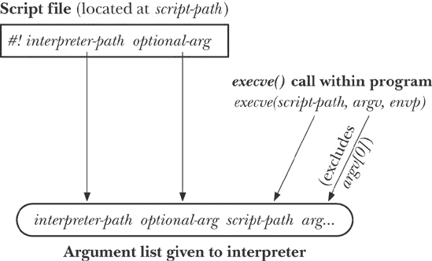
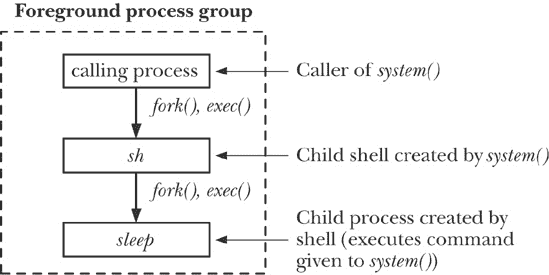

## 第二十七章 程序执行

本章继承了前几章关于进程创建与终止的讨论。我们现在来看看进程如何使用*execve()*系统调用，通过一个全新的程序替换当前运行的程序。接着，我们将展示如何实现*system()*函数，使其调用者能够执行任意的 shell 命令。

## 执行新程序：*execve()*

*execve()*系统调用将一个新程序加载到进程的内存中。在这个过程中，旧程序被丢弃，进程的栈、数据和堆被新程序的栈、数据和堆所替代。执行各种 C 库运行时启动代码和程序初始化代码（例如，C++的静态构造函数或使用*gcc* `constructor`属性声明的 C 函数，详见初始化与终结函数）后，新程序从其*main()*函数开始执行。

*execve()*最常见的使用场景是在由*fork()*产生的子进程中，尽管它也偶尔在没有前置*fork()*的应用程序中使用。

各种库函数，名称均以*exec*开头，都是建立在*execve()*系统调用之上的。这些函数中的每一个都提供了一个不同的接口来实现相同的功能。通过这些调用加载新程序通常称为*exec*操作，或者简而言之，称为*exec()*。我们首先介绍*execve()*，然后描述库函数。

```
#include <unistd.h>

int `execve`(const char **pathname*, char *const *argv*[], char *const *envp*[]);
```

### 注意

成功时永不返回；出错时返回-1。

*pathname*参数包含了要加载到进程内存中的新程序的路径名。这个路径名可以是绝对路径（以/开头），也可以是相对于调用进程当前工作目录的相对路径。

*argv*参数指定了要传递给新程序的命令行参数。这个数组对应并且与 C 语言*main()*函数的第二个参数（*argv*）的形式相同；它是一个以`NULL`结尾的字符串指针列表。为*argv[0]*提供的值对应于命令名称。通常，这个值与*pathname*的基本名称（即最终部分）相同。

最后的参数*envp*指定了新程序的环境列表。*envp*参数对应新程序的*environ*数组；它是一个以`NULL`结尾的字符串指针列表，格式为*name=value*（环境列表）。

### 注意

Linux 特有的`/proc/`*PID*`/exe`文件是一个符号链接，包含了正在被相应进程运行的可执行文件的绝对路径名。

在*execve()*之后，进程 ID 保持不变，因为同一个进程继续存在。其他一些进程属性也保持不变，如第 28.4 节所述。

如果所指定的程序文件 *pathname* 设置了设置用户 ID（设置组 ID）权限位，则当该文件被执行时，进程的有效用户（组）ID 将被更改为与程序文件的所有者（组）相同。这是一个在运行特定程序时临时授予用户权限的机制（参见 Set-User-ID 和 Set-Group-ID 程序）。

在可选更改有效 ID 后，无论是否更改，*execve()* 会将进程的有效用户 ID 复制到其保存的设置用户 ID 中，并将进程的有效组 ID 复制到其保存的设置组 ID 中。

由于 *execve()* 会替换调用它的程序，因此一个成功的 *execve()* 从不返回。我们无需检查 *execve()* 的返回值；它将始终是 -1。它返回的事实本身告诉我们发生了错误，通常，我们可以使用 *errno* 来确定错误原因。在 *errno* 中可能返回的错误包括以下几种：

`EACCES`

*pathname* 参数引用的不是常规文件，文件没有启用执行权限，或 *pathname* 的某个目录组件不可搜索（即该目录没有执行权限）。另外，文件可能位于一个挂载时启用了 `MS_NOEXEC` 标志的文件系统上（Mounting a File System: *mount()*"))。

`ENOENT`

所引用的文件 *pathname* 不存在。

`ENOEXEC`

所引用的文件 *pathname* 被标记为可执行，但它并不是一个可识别的可执行格式。可能它是一个脚本，且没有以一行（以字符`#!`开头）指定脚本解释器。

`ETXTBSY`

所引用的文件 *pathname* 正在被另一个进程写入中（The *open() flags* Argument flags Argument")）。

`E2BIG`

参数列表和环境列表所需的总空间超过了允许的最大值。

如果执行脚本的解释器文件（参见 Interpreter Scripts）或用于执行程序的 ELF 解释器满足上述条件，也可能会发生这些错误。

### 注意

可执行与链接格式（ELF）是一种广泛实现的规范，用于描述可执行文件的布局。通常，在执行时，会使用可执行文件的各个段（进程的内存布局）来构建进程镜像。然而，ELF 规范也允许可执行文件定义一个解释器（`PT_INTERP` ELF 程序头元素），用于执行程序。如果定义了一个解释器，内核将从指定的解释器可执行文件的段中构建进程镜像。之后，由解释器负责加载并执行程序。我们在第四十一章中稍微提及 ELF 解释器，并在该章提供了进一步信息的指引。

#### 示例程序

示例 27-1 to execute a new program") 演示了 *execve()* 的使用。该程序创建了一个新程序的参数列表和环境，然后调用 *execve()*，使用其命令行参数（*argv[1]*）作为要执行的路径名。

示例 27-2 展示了一个由示例 27-1 to execute a new program")中的程序执行的程序。该程序仅显示其命令行参数和环境列表（后者通过全局的 *environ* 变量访问，如环境列表中所述）。

以下 shell 会话演示了在示例 27-1 to execute a new program")和示例 27-2 中使用的程序（在此示例中，使用相对路径名指定要执行的程序）：

```
$ `./t_execve ./envargs`
argv[0] = envargs                   *All of the output is printed by* `envargs`
argv[1] = hello world
argv[2] = goodbye
environ: GREET=salut
environ: BYE=adieu
```

示例 27-1. 使用 *execve()* 执行新程序

```
`procexec/t_execve.c`
#include "tlpi_hdr.h"

int
main(int argc, char *argv[])
{
    char *argVec[10];           /* Larger than required */
    char *envVec[] = { "GREET=salut", "BYE=adieu", NULL };

    if (argc != 2 || strcmp(argv[1], "--help") == 0)
        usageErr("%s pathname\n", argv[0]);

    argVec[0] = strrchr(argv[1], '/');      /* Get basename from argv[1] */
    if (argVec[0] != NULL)
        argVec[0]++;
    else
        argVec[0] = argv[1];
    argVec[1] = "hello world";
    argVec[2] = "goodbye";
    argVec[3] = NULL;           /* List must be NULL-terminated */

    execve(argv[1], argVec, envVec);
    errExit("execve");          /* If we get here, something went wrong */
}

      `procexec/t_execve.c`
```

示例 27-2. 显示参数列表和环境

```
`procexec/envargs.c`
#include "tlpi_hdr.h"

extern char **environ;

int
main(int argc, char *argv[])
{
    int j;
    char **ep;

    for (j = 0; j < argc; j++)
        printf("argv[%d] = %s\n", j, argv[j]);

    for (ep = environ; *ep != NULL; ep++)
        printf("environ: %s\n", *ep);

    exit(EXIT_SUCCESS);
}
     `procexec/envargs.c`
```

## *exec()* 库函数

本节中描述的库函数提供了执行 *exec()* 的替代 API。这些函数都建立在 *execve()* 之上，它们之间以及与 *execve()* 的区别仅在于新程序的程序名、参数列表和环境的指定方式。

```
#include <unistd.h>

int `execle`(const char **pathname*, const char **arg*, ...
                /* , (char *) NULL, char *const *envp*[] */ );
int `execlp`(const char **filename*, const char **arg*, ...
                /* , (char *) NULL */);
int `execvp`(const char **filename*, char *const *argv*[]);
int `execv`(const char **pathname*, char *const *argv*[]);
int `execl`(const char **pathname*, const char **arg*, ...
                /* , (char *) NULL */);
```

### 注意

上述所有函数在成功时不返回任何值；在出错时，均返回 -1。

这些函数名称中的最后几个字母提示了它们之间的差异。这些差异总结在表 27-1 functions")中，并在以下列表中详细列出：

+   大多数*exec()*函数期望一个 pathname 作为要加载的新程序的规范。然而，*execlp()*和*execvp()*允许仅通过文件名来指定程序。文件名在`PATH`环境变量中指定的目录列表中进行查找（下面将详细解释）。这正是 shell 在接收到命令名称时执行的搜索操作。为了表明这一操作的不同，这些函数的名称中包含字母*p*（表示`PATH`）。如果文件名中包含斜杠（`/`），则不使用`PATH`变量，在这种情况下，它将被视为相对或绝对的 pathname。

+   与使用数组来指定新程序的*argv*列表不同，*execle()*、*execlp()*和*execl()*要求程序员在调用中将参数作为字符串列表指定。这些参数中的第一个对应于新程序的*main*函数中的*argv[0]*，通常与*filename*参数或*pathname*参数的基本文件名部分相同。必须以`NULL`指针结束参数列表，以便这些调用能够找到列表的末尾。（这一要求在上述原型中由注释*(char *) NULL*标示；有关为什么需要在`NULL`之前进行类型转换的讨论，请参见附录 C。）这些函数的名称中包含字母 l（表示*list*），以区别于那些需要将参数列表作为`NULL`终止数组的函数。那些需要将参数列表作为数组的函数（*execve()*、*execvp()*和*execv()*）的名称中包含字母*v*（表示*vector*）。

+   *execve()*和*execle()*函数允许程序员使用*envp*显式地指定新程序的环境，*envp*是一个以`NULL`结尾的字符指针数组。这些函数的名称以字母*e*（表示*environment*）结尾，以表明这一事实。所有其他的*exec()*函数使用调用者的现有环境（即*environ*的内容）作为新程序的环境。

### 注意

*glibc*的版本 2.11 新增了一个非标准函数，*execvpe(file, argv, envp)*。这个函数类似于*execvp()*，但它不是从*environ*获取新程序的环境，而是由调用者通过*envp*参数指定新的环境（类似于*execve()*和*execle()*）。

在接下来的几页中，我们将演示一些*exec()*变体的使用。

表 27-1. *exec()*函数之间差异的总结

| 函数 | 程序文件的规范*(-, p)* | 参数的规范*(v, l)* | 环境的来源*(e, -)* |
| --- | --- | --- | --- |
| *execve()* | pathname | array | *envp*参数 |
| *execle()* | pathname | list | *envp*参数 |
| *execlp()* | filename + `PATH` | list | 调用者的*environ* |
| *execvp()* | filename + `PATH` | array | 调用者的*environ* |
| *execv()* | pathname | array | caller’s *environ* |
| *execl()* | pathname | list | caller’s *environ* |

### `PATH` 环境变量

*execvp()* 和 *execlp()* 函数允许我们仅指定要执行的文件的名称。这些函数利用 `PATH` 环境变量来搜索文件。`PATH` 的值是由冒号分隔的目录名称字符串，称为 *路径前缀*。例如，以下 `PATH` 值指定了五个目录：

```
$ `echo $PATH`
/home/mtk/bin:/usr/local/bin:/usr/bin:/bin:.
```

登录 Shell 的 `PATH` 值由系统范围和用户特定的 Shell 启动脚本设置。由于子进程会继承父进程的环境变量，因此 Shell 创建的每个进程都会继承 Shell 的 `PATH` 变量的副本。

在 `PATH` 中指定的目录路径名可以是绝对路径（以初始 `/` 开头）或相对路径。相对路径会相对于调用进程的当前工作目录进行解释。可以使用 `.`（点）来指定当前工作目录，如上例所示。

### 注意

还可以通过在 `PATH` 中包含零长度前缀、使用连续的冒号、初始冒号或尾随冒号（例如 `/usr/bin:/bin:`）来指定当前工作目录。SUSv3 宣布这种技术已过时；当前工作目录应使用 `.`（点）明确指定。

如果未定义 `PATH` 变量，则*execvp()* 和 *execlp()* 默认使用 `.:/usr/bin:/bin` 路径列表。

作为一种安全措施，超级用户账户（*root*）通常会设置排除当前工作目录在 `PATH` 中。这可以防止 *root* 不小心执行当前工作目录中的文件（该文件可能被恶意用户故意放置在此处），文件的名称可能与标准命令相同，或者是常见命令的拼写错误（例如，*sl* 而不是 *ls*）。在某些 Linux 发行版中，`PATH` 的默认值也会排除当前工作目录，尤其对于非特权用户。我们在本书中的所有 Shell 会话日志中假设使用这种 `PATH` 定义，这就是为什么我们始终在当前工作目录中执行的程序名前加上 `./` 的原因。（这也有一个有用的副作用，可以在本书的 Shell 会话日志中直观区分我们的程序和标准命令。）

*execvp()* 和 *execlp()* 函数会在 `PATH` 中指定的每个目录中搜索文件名，从列表的开头开始，直到成功执行具有给定名称的文件。以这种方式使用 `PATH` 环境变量非常有用，尤其是当我们不知道可执行文件的运行时位置，或者不想在该位置上创建硬编码的依赖关系时。

在设置用户 ID 或设置组 ID 的程序中应避免使用*execvp()*和*execlp()*，或者至少应非常小心。特别是，`PATH`环境变量应小心控制，以防止执行恶意程序。实际上，这意味着应用程序应覆盖任何先前定义的`PATH`值，使用已知安全的目录列表。

示例 27-3 在 PATH 中搜索文件名")提供了使用*execlp()*的示例。以下的 shell 会话日志演示了如何使用此程序调用*echo*命令（`/bin/echo`）：

```
$ `which echo`
/bin/echo
$ `ls -l /bin/echo`
-rwxr-xr-x    1 root      15428 Mar 19 21:28 /bin/echo
$ `echo $PATH`                      *Show contents of* `PATH`
*environment variable*
/home/mtk/bin:/usr/local/bin:/usr/bin:/bin/      bin *is in* PATH
$ `./t_execlp echo`                 execlp() *uses* PATH *to successfully find* echo
hello world
```

上面出现的字符串*hello world*是作为对*execlp()*调用的第三个参数传递的，该调用位于示例 27-3 在 PATH 中搜索文件名")的程序中。

我们继续通过重新定义`PATH`来省略`/bin`，该目录包含*echo*程序：

```
$ `PATH=/home/mtk/bin:/usr/local/bin:/usr/bin`
$ `./t_execlp echo`
ERROR [ENOENT No such file or directory] execlp
$ `./t_execlp /bin/echo`
hello world
```

如所见，当我们将文件名（即包含不带斜杠的字符串）传递给*execlp()*时，调用失败，因为在`PATH`中列出的任何目录中都未找到名为`echo`的文件。另一方面，当我们提供包含一个或多个斜杠的路径名时，*execlp()*会忽略`PATH`的内容。

示例 27-3. 使用*execlp()*在`PATH`中搜索文件名

```
`procexec/t_execlp.c`
#include "tlpi_hdr.h"

int
main(int argc, char *argv[])
{
    if (argc != 2 || strcmp(argv[1], "--help") == 0)
        usageErr("%s pathname\n", argv[0]);

    execlp(argv[1], argv[1], "hello world", (char *) NULL);
    errExit("execlp");          /* If we get here, something went wrong */
}
     `procexec/t_execlp.c`
```

### 将程序参数指定为列表

当我们在编写程序时就知道*exec()*的参数数量时，可以使用*execle()*、*execlp()*或*execl()*在函数调用中将参数作为列表指定。这很方便，因为它比在*argv*向量中组装参数需要更少的代码。示例 27-4 将程序参数指定为列表")中的程序与示例 27-1 执行新程序")中的程序实现相同的结果，但使用*execle()*代替*execve()*。

示例 27-4. 使用*execle()*将程序参数指定为列表

```
`procexec/t_execle.c`
#include "tlpi_hdr.h"

int
main(int argc, char *argv[])
{
    char *envVec[] = { "GREET=salut", "BYE=adieu", NULL };
    char *filename;

    if (argc != 2 || strcmp(argv[1], "--help") == 0)
        usageErr("%s pathname\n", argv[0]);

    filename = strrchr(argv[1], '/');       /* Get basename from argv[1] */
    if (filename != NULL)
        filename++;
    else
        filename = argv[1];

    execle(argv[1], filename, "hello world", (char *) NULL, envVec);
    errExit("execle");          /* If we get here, something went wrong */
}
      `procexec/t_execle.c`
```

### 将调用者的环境传递给新程序

*execlp()*、*execvp()*、*execl()*和*execv()*函数不允许程序员显式指定环境列表；相反，新的程序从调用进程继承其环境（环境列表）。这可能是，也可能不是，所期望的。出于安全原因，有时最好确保程序在已知环境列表下执行。我们将在第 38.8 节进一步讨论这一点。

示例 27-5 将调用者的环境传递给新程序") 演示了新程序在 *execl()* 调用期间从调用者继承其环境。该程序首先使用 *putenv()* 对从 shell 通过 *fork()* 继承的环境进行更改。然后，执行 *printenv* 程序以显示 `USER` 和 `SHELL` 环境变量的值。当我们运行此程序时，我们看到如下输出：

```
$ `echo $USER $SHELL`           *Display some of the shell’s environment variables*
blv /bin/bash
$ `./t_execl`
Initial value of USER: blv    *Copy of environment was inherited from the shell*
britta                        *These two lines are displayed by execed* printenv
/bin/bash
```

示例 27-5. 使用 *execl()* 将调用者的环境传递给新程序

```
`procexec/t_execl.c`
#include <stdlib.h>
#include "tlpi_hdr.h"

int
main(int argc, char *argv[])
{
    printf("Initial value of USER: %s\n", getenv("USER"));
    if (putenv("USER=britta") != 0)
        errExit("putenv");

    execl("/usr/bin/printenv", "printenv", "USER", "SHELL", (char *) NULL);
    errExit("execl");           /* If we get here, something went wrong */
}
     `procexec/t_execl.c`
```

### 通过描述符引用文件执行：*fexecve()*

从版本 2.3.2 起，*glibc* 提供了 *fexecve()*，它的行为与 *execve()* 一样，但通过打开的文件描述符 *fd* 来指定要执行的文件，而不是通过路径名。使用 *fexecve()* 对于那些想要打开文件、通过执行校验和验证其内容，然后执行该文件的应用程序非常有用。

```
#define _GNU_SOURCE
#include <unistd.h>

int `fexecve`(int *fd*, char *const *argv*[], char *const *envp*[]);
```

### 注

成功时不返回；出错时返回 -1

如果没有 *fexecve()*，我们可以先 *open()* 并读取文件来验证其内容，然后再执行它。然而，这会允许在打开文件和执行它之间，文件被替换（保持打开的文件描述符并不妨碍创建一个具有相同名称的新文件），因此执行的内容可能与检查时的内容不同。

## 解释器脚本

*解释器* 是一种读取文本形式命令并执行它们的程序。（这与 *编译器* 不同，后者将输入的源代码转换为机器语言，然后可以在实际或虚拟机器上执行。）解释器的示例包括各种 UNIX shell 和 *awk*、*sed*、*perl*、*python*、*ruby* 等程序。除了能够交互式地读取和执行命令外，解释器通常还提供一种功能，可以从文本文件读取和执行命令，这种文件称为 *脚本*。

UNIX 内核允许以与二进制程序文件相同的方式运行解释器脚本，只要满足两个要求。首先，必须为脚本文件启用执行权限。其次，文件必须包含指定用于运行脚本的解释器路径名的初始行。该行具有以下形式：

```
#! *interpreter-path* [*optional-arg*]
```

`#!` 字符必须放在行的开头；可选择性地，这些字符和解释器路径名之间可以有空格。`PATH` 环境变量在解释此路径名时 *不* 被使用，因此通常应指定绝对路径名。相对路径名也是可能的，尽管不常见；它相对于启动解释器的进程的当前工作目录进行解释。空格将解释器路径名与可选参数分开，稍后我们会解释该参数的作用。可选参数不应包含空格字符。

例如，UNIX shell 脚本通常以以下行开始，这行指定了脚本应使用 shell 来执行：

```
#!/bin/sh
```

### 注意

解释器脚本文件的第一行中的可选参数不应包含空格，因为这种情况的行为高度依赖于实现。在 Linux 上，*optional-arg* 中的空格不会被特别解释——从参数开始到行末的所有文本都会被解释为一个单一的词（该词作为参数传递给脚本，具体如下所述）。需要注意的是，这种对空格的处理与 shell 中的处理不同，在 shell 中空格用于分隔命令行中的单词。

尽管某些 UNIX 实现与 Linux 处理 *optional-arg* 中的空格的方式相同，但其他实现则不然。在 FreeBSD 6.0 之前的版本中，多个由空格分隔的可选参数可以跟随 *interpreter-path*（这些会作为单独的词传递给脚本）；从 6.0 版本开始，FreeBSD 的行为与 Linux 相同。在 Solaris 8 中，空格字符终止 *optional-arg*，并且 `#!` 行中剩余的文本会被忽略。

Linux 内核对脚本的 `#!` 行长度有限制，最大为 127 个字符（不包括行尾的换行符）。额外的字符会被默默忽略。

`#!` 技术用于解释器脚本在 SUSv3 中并没有明确规定，但在大多数 UNIX 实现中都可用。

### 注意

`#!` 行的长度限制在不同的 UNIX 实现中有所不同。例如，在 OpenBSD 3.1 中限制为 64 个字符，而在 Tru64 5.1 中限制为 1024 个字符。在一些历史性的实现中（例如 SunOS 4），这一限制甚至低至 32 个字符。

#### 解释器脚本的执行

由于脚本不包含二进制机器代码，当使用 *execve()* 执行脚本时，显然执行脚本时发生了与通常不同的事情。如果 *execve()* 检测到给定的文件以 2 字节的序列 `#!` 开头，它会提取该行的其余部分（即路径名和参数），然后使用以下参数列表执行解释器文件：

```
*`interpreter-path`* [*`optional-arg`* ] *`script-path arg`*...
```

在这里，*interpreter-path* 和 *optional-arg* 来自脚本的 `#!` 行，*script-path* 是传递给 *execve()* 的路径名，*arg..* 是通过 *execve()* 的 *argv* 参数指定的任何进一步的参数列表（但不包括 *argv[0]*）。每个脚本参数的来源在 图 27-1 中总结。

图 27-1. 传递给执行脚本的参数列表

我们可以通过编写一个脚本来演示解释器参数的来源，该脚本使用示例 6-2 中的程序(`necho.c`，在环境列表中)作为解释器。该程序仅回显所有的命令行参数。然后我们使用示例 27-1 执行新程序")中的程序来执行该脚本：

```
$ `cat > necho.script`                *Create script*
#!/home/mtk/bin/necho some argument
Some junk
*Type Control-D*
$ `chmod +x necho.script`             *Make script executable*
$ `./t_execve necho.script`           *And exec the script*
argv[0] = /home/mtk/bin/necho       *First 3 arguments are generated by kernel*
argv[1] = some argument             *Script argument is treated as a single word*
argv[2] = necho.script              *This is the script path*
argv[3] = hello world               *This was argVec[1] given to execve()*
argv[4] = goodbye                   *And this was argVec[2]*
```

在这个示例中，我们的“解释器”(`necho`)忽略了其脚本文件(`necho.script`)的内容，而脚本的第二行(*Some junk*)对其执行没有影响。

### 注意

Linux 2.2 内核在调用脚本时仅传递*interpreter-path*的基础名称部分作为第一个参数。因此，在 Linux 2.2 上，显示*argv[0]*的行只会显示*echo*的值。

大多数 UNIX shell 和解释器将#字符视为注释的开始。因此，这些解释器在解释脚本时会忽略初始的`#!`行。

#### 使用脚本*optional-arg*

在脚本的初始`#!`行中，*optional-arg*的一种用法是指定解释器的命令行选项。这个功能在某些解释器中非常有用，比如*awk*。

### 注意

*awk*解释器自 1970 年代末以来就是 UNIX 系统的一部分。*awk*语言在许多书籍中有所描述，包括其创造者之一的[Aho 等人，1988]所著的书籍，其首字母命名了该语言。它的强项是快速原型开发文本处理应用程序。在设计上——它是一个弱类型语言，具有丰富的文本处理原语，语法基于 C——*awk*是许多现代脚本语言的先祖，如 JavaScript 和 PHP。

脚本可以通过两种不同的方式提供给*awk*。默认方式是将脚本作为第一个命令行参数提供给*awk*：

```
$ `awk` `'```*`script`*```'` ``*`input-file`*``...
```

或者，一个*awk*脚本可以保存在文件中，如下面的*awk*脚本，它会打印出输入中最长行的长度：

```
$ `cat longest_line.awk`
#!/usr/bin/awk
length > max { max = length; }
END          { print max; }
```

假设我们尝试使用以下 C 代码来执行这个脚本：

```
execl("longest_line.awk", "longest_line.awk", "input.txt", (char *) NULL);
```

这个*execl()*调用依次使用*execve()*并带有以下参数列表来调用*awk*：

```
/usr/bin/awk longest_line.awk input.txt
```

这个*execve()*调用失败了，因为*awk*将字符串*longest_line.awk*解释为一个包含无效*awk*命令的脚本。我们需要一种方法来告知*awk*这个参数实际上是包含脚本的文件名。我们可以通过在脚本的`#!`行中添加*-f*选项作为可选参数来做到这一点。这样可以告诉*awk*，后续的参数是一个脚本文件：

```
#!/usr/bin/awk -f
length > max { max = length; }
END          { print max; }
```

现在，我们的*execl()*调用结果使用了以下参数列表：

```
/usr/bin/awk -f longest_line.awk input.txt
```

这成功地使用脚本`longest_line.awk`调用了*awk*来处理文件`input.txt`。

#### 使用*execlp()*和*execvp()*执行脚本

通常，脚本开头没有 `#!` 行会导致 *exec()* 函数失败。然而，*execlp()* 和 *execvp()* 的工作方式略有不同。请记住，这些是使用 `PATH` 环境变量获取目录列表并在其中搜索要执行的文件的函数。如果这两个函数中的任何一个找到一个具有执行权限的文件，但该文件不是二进制可执行文件且没有以 `#!` 行开头，那么它们会执行 Shell 来解释该文件。在 Linux 上，这意味着这些文件会被当作从包含字符串 `#!/bin/sh` 的行开始的文件来处理。

## 文件描述符和 *exec()*

默认情况下，所有由调用 *exec()* 的程序打开的文件描述符在 *exec()* 之后仍然保持打开，并可供新程序使用。这通常非常有用，因为调用程序可能会在特定的描述符上打开文件，而这些文件会自动对新程序可用，无需新程序知道文件的名称或打开这些文件。

Shell 利用这一特性来处理它执行的程序的 I/O 重定向。例如，假设我们输入以下 Shell 命令：

```
$ `ls /tmp > dir.txt`
```

Shell 执行该命令时会执行以下步骤：

1.  执行 *fork()* 来创建一个子进程，该进程也在运行一个 Shell 的副本（因此也有该命令的副本）。

1.  子 Shell 使用文件描述符 1（标准输出）打开 `dir.txt` 以进行输出。这可以通过以下两种方式之一实现：

    1.  子 Shell 关闭描述符 1（`STDOUT_FILENO`），然后打开文件 `dir.txt`。由于 *open()* 总是使用最低的可用文件描述符，并且标准输入（描述符 0）仍然保持打开，因此文件会在描述符 1 上打开。

    1.  Shell 打开 `dir.txt`，并获得一个新的文件描述符。然后，如果该文件描述符不是标准输出，Shell 使用 *dup2()* 强制标准输出成为新描述符的副本，并关闭新描述符，因为它不再需要。（这种方法比前一种方法更安全，因为它不依赖于低编号的描述符保持打开。）代码序列大致如下：

        ```
        fd = open("dir.txt", O_WRONLY | O_CREAT,
                    S_IRUSR | S_IWUSR | S_IRGRP | S_IWGRP |
         S_IROTH | S_IWOTH);                     /* rw-rw-rw- */
        if (fd != STDOUT_FILENO) {
            dup2(fd, STDOUT_FILENO);
            close(fd);
        }
        ```

1.  子 Shell 执行 *ls* 程序。*ls* 程序将其输出写入标准输出，即文件 `dir.txt`。

### 注意

这里对 Shell 如何执行 I/O 重定向的解释简化了一些要点。特别是，某些命令——所谓的 Shell *内建* 命令——是由 Shell 直接执行的，而不需要执行 *fork()* 或 *exec()*。对于 I/O 重定向的目的，这些命令必须以不同的方式处理。

一个 shell 命令作为内建命令实现，有两个原因：效率和在 shell 内部获取副作用。一些常用命令——如 *pwd*、*echo* 和 *test*——足够简单，在 shell 内实现它们是值得的效率提升。其他命令则在 shell 内部实现，以便对 shell 本身产生副作用——即，它们改变了 shell 存储的信息，或修改了 shell 进程的属性或影响了执行。例如，*cd* 命令必须改变 shell 本身的工作目录，因此不能在单独的进程中执行。其他为了副作用而作为内建命令实现的命令包括 *exec*、*exit*、*read*、*set*、*source*、*ulimit*、*umask*、*wait*，以及 shell 作业控制命令（*jobs*、*fg* 和 *bg*）。shell 支持的所有内建命令可在 shell 的手册页中找到。

#### close-on-exec 标志（`FD_CLOEXEC`）

有时，可能希望确保在 *exec()* 之前关闭某些文件描述符。特别是，如果我们从一个特权进程 *exec()* 一个未知程序（即，我们没有编写的程序），或者一个不需要我们已打开文件的描述符的程序，那么确保在加载新程序之前关闭所有不必要的文件描述符是安全的编程实践。我们可以通过对所有这些描述符调用 *close()* 来实现，但这样做有以下限制：

+   文件描述符可能是通过库函数打开的。此函数没有机制强制主程序在执行 *exec()* 之前关闭文件描述符。（一般原则是，库函数应始终为它们打开的任何文件设置 close-on-exec 标志，使用下面描述的技术。）

+   如果 *exec()* 调用由于某种原因失败，我们可能希望保持文件描述符打开。如果它们已经关闭，重新打开它们可能会很困难，甚至不可能，以便它们指向相同的文件。

基于这些原因，内核为每个文件描述符提供了一个 close-on-exec 标志。如果该标志被设置，那么文件描述符将在成功的 *exec()* 中自动关闭，但如果 *exec()* 失败，则保持打开。文件描述符的 close-on-exec 标志可以通过 *fcntl()* 系统调用访问（文件控制操作：*fcntl()*")）。*fcntl()* 的 `F_GETFD` 操作用于检索文件描述符标志的副本：

```
int flags;

flags = fcntl(fd, F_GETFD);
if (flags == -1)
    errExit("fcntl");
```

在获取这些标志后，我们可以修改 `FD_CLOEXEC` 位，并使用第二次 *fcntl()* 调用，指定 `F_SETFD` 来更新标志：

```
flags |= FD_CLOEXEC;
if (fcntl(fd, F_SETFD, flags) == -1)
    errExit("fcntl");
```

### 注意

`FD_CLOEXEC` 实际上是文件描述符标志中唯一使用的位。这个位对应的值为 1。在较旧的程序中，我们有时会看到使用 *fcntl(fd, F_SETFD, 1)* 来设置 close-on-exec 标志，依赖于没有其他位会被此操作影响。理论上，这种情况并不总是如此（将来某些 UNIX 系统可能会实现额外的标志位），因此我们应该使用本文中展示的技术。

许多 UNIX 实现，包括 Linux，也允许通过两个非标准化的 *ioctl()* 调用来修改 close-on-exec 标志：*ioctl(fd, FIOCLEX)* 用于为 *fd* 设置 close-on-exec 标志，*ioctl(fd, FIONCLEX)* 用于清除该标志。

当使用 *dup()*、*dup2()* 或 *fcntl()* 创建文件描述符的副本时，副本的 close-on-exec 标志总是会被清除。（这种行为是历史遗留的，并且是 SUSv3 的要求。）

示例 27-6 演示了如何操作 close-on-exec 标志。根据是否提供命令行参数（任何字符串），该程序首先为标准输出设置 close-on-exec 标志，然后执行 *ls* 程序。下面是我们运行程序时看到的输出：

```
$ `./closeonexec`                     *Exec ls without closing standard output*
-rwxr-xr-x   1 mtk    users    28098 Jun 15 13:59 closeonexec
$ `./closeonexec n`                   *Sets close-on-exec flag for standard output*
ls: write error: Bad file descriptor
```

在上述的第二次运行中，*ls* 检测到其标准输出已关闭，并在标准错误中打印出错误信息。

示例 27-6. 设置文件描述符的 close-on-exec 标志

```
`procexec/closeonexec.c`
#include <fcntl.h>
#include "tlpi_hdr.h"

int
main(int argc, char *argv[])
{
    int flags;

    if (argc > 1) {
        flags = fcntl(STDOUT_FILENO, F_GETFD);              /* Fetch flags */
        if (flags == -1)
            errExit("fcntl - F_GETFD");

        flags |= FD_CLOEXEC;                    /* Turn on FD_CLOEXEC */

        if (fcntl(STDOUT_FILENO, F_SETFD, flags) == -1)     /* Update flags */
            errExit("fcntl - F_SETFD");
    }

    execlp("ls", "ls", "-l", argv[0], (char *) NULL);
    errExit("execlp");
}
     `procexec/closeonexec.c`
```

## 信号与 *exec()*

在 *exec()* 调用中，现有进程的文本会被丢弃。这些文本可能包括调用程序所建立的信号处理程序。由于信号处理程序会消失，内核会将所有已处理信号的处置状态重置为 `SIG_DFL`。所有其他信号的处置状态（即那些处置状态为 `SIG_IGN` 或 `SIG_DFL` 的信号）在 *exec()* 调用中不会发生变化。这种行为是 SUSv3 所要求的。

SUSv3 对被忽略的 `SIGCHLD` 信号做了特别规定。（我们在忽略死去的子进程中提到，忽略 `SIGCHLD` 可以防止僵尸进程的产生。）SUSv3 没有规定一个被忽略的 `SIGCHLD` 信号是否会在 *exec()* 过程中保持被忽略的状态，或者其处置状态是否会重置为 `SIG_DFL`。Linux 执行的是前者，但一些其他 UNIX 实现（如 Solaris）则执行后者。这意味着，在忽略 `SIGCHLD` 的程序中，为了最大限度地提高可移植性，我们应该在 *exec()* 调用之前执行 *signal(SIGCHLD, SIG_DFL)*，并确保我们的程序不会依赖于 `SIGCHLD` 的初始处置状态是除了 `SIG_DFL` 之外的其他值。

旧程序的数据、堆和栈的销毁也意味着任何通过调用 *sigaltstack()* 创建的备用信号栈将会丢失。由于备用信号栈不会在 *exec()* 过程中保留，因此 `SA_ONSTACK` 位也会被清除，适用于所有信号。

在 *exec()* 过程中，进程的信号屏蔽和待处理信号集都会被保留。这个特性允许我们阻塞并排队信号，以便传递给新执行的程序。然而，SUSv3 指出，许多现有应用程序错误地假设它们是以某些信号的处理方式设置为 `SIG_DFL` 或者这些信号被解除屏蔽的方式启动的。（特别是，C 标准提供了一个更为宽松的信号规范，并没有明确要求信号阻塞；因此，在非 UNIX 系统上编写的 C 程序不会知道需要解除信号的阻塞。）因此，SUSv3 推荐在 *exec()* 执行任意程序时，不应阻塞或忽略信号。这里，“任意程序”指的是我们没有编写的程序。对于我们编写的程序或者已知信号行为的程序，可以接受阻塞或忽略信号。

## 执行 Shell 命令：*system()*

*system()* 函数允许调用程序执行任意的 shell 命令。在本节中，我们描述了 *system()* 的操作，下一节我们将展示如何使用 *fork()*、*exec()*、*wait()* 和 *exit()* 来实现 *system()*。

### 注意

在 通过管道与 shell 命令交互: *popen()*") 中，我们将探讨 *popen()* 和 *pclose()* 函数，这些函数也可以用来执行 shell 命令，但它们允许调用程序读取命令的输出或向命令发送输入。

```
#include <stdlib.h>

int `system`(const char **command*);
```

### 注意

参见正文部分，了解返回值的描述。

*system()* 函数创建一个子进程，通过调用 shell 来执行 *command*。以下是一个调用 *system()* 的示例：

```
system("ls | wc");
```

*system()* 的主要优点是简单性和便利性：

+   我们不需要处理调用 *fork()*、*exec()*、*wait()* 和 *exit()* 的细节。

+   错误和信号处理由 *system()* 代为执行。

+   因为 *system()* 使用 shell 来执行 *command*，在执行前会对 *command* 进行所有常见的 shell 处理、替换和重定向操作。这使得向应用程序添加“执行 shell 命令”功能变得非常容易。（许多交互式应用程序提供了类似功能，通常通过 `!` 命令实现。）

*system()* 的主要开销是低效。使用 *system()* 执行命令需要至少创建两个进程——一个用于 shell，另一个或多个用于它执行的命令——每个进程都执行一个 *exec()*。如果效率或速度是一个要求，最好使用显式的 *fork()* 和 *exec()* 调用来执行所需的程序。

*system()* 的返回值如下：

+   如果 *command* 是 `NULL` 指针，则如果有 shell 可用，*system()* 返回非零值，如果没有 shell 可用，则返回 0。此情况源自 C 编程语言标准，它们与任何操作系统无关，因此如果 *system()* 在非 UNIX 系统上运行，则可能没有 shell 可用。此外，尽管所有 UNIX 实现都有一个 shell，但如果程序在调用 *system()* 之前调用了 *chroot()*，则该 shell 可能不可用。如果 *command* 不是 `NULL`，则 *system()* 的返回值根据本列表中的其他规则确定。

+   如果无法创建子进程或无法检索其终止状态，则 *system()* 返回 -1。

+   如果子进程中的 shell 无法执行，则 *system()* 返回一个值，表示子 shell 已终止并调用了 *_exit(127)*。

+   如果所有系统调用都成功，则 *system()* 返回用于执行 *command* 的子 shell 的终止状态。（shell 的终止状态是它执行的最后一个命令的终止状态。）

### 注意

无法（使用 *system()* 返回的值）区分 *system()* 未能执行 shell 的情况和 shell 以状态 127 退出的情况（后一种可能发生在 shell 无法找到具有给定名称的程序来执行时）。

在最后两种情况下，*system()* 返回的值是与 *waitpid()* 返回的相同形式的 *等待状态*。这意味着我们应该使用 等待状态值 中描述的函数来解析此值，并且我们可以使用我们的 *printWaitStatus()* 函数来显示该值（示例 26-2 和相关调用返回的状态值")，在 示例程序 中）。

#### 示例程序

示例 27-7 执行 shell 命令") 演示了 *system()* 的使用。该程序执行一个循环，读取一个命令字符串，使用 *system()* 执行该命令，然后分析并显示 *system()* 返回的值。以下是一个示例运行：

```
$ `./t_system`
Command: `whoami`
mtk
system() returned: status=0x0000 (0,0)
child exited, status=0
Command: `ls | grep XYZ`                   *Shell terminates with the status of...*
system() returned: status=0x0100 (1,0)   *its last command (grep), which...*
child exited, status=1                   *found no match, and so did an exit(1)*
Command: `exit 127`
system() returned: status=0x7f00 (127,0)
(Probably) could not invoke shell        *Actually, not true in this case*
Command: `sleep 100`
*Type Control-Z to suspend foreground process group*
[1]+  Stopped           ./t_system
$ `ps | grep sleep`                        *Find PID of sleep*
29361 pts/6    00:00:00 sleep
$ `kill 29361`                             *And send a signal to terminate it*
$ `fg`                                     *Bring t_system back into foreground*
./t_system
system() returned: status=0x000f (0,15)
child killed by signal 15 (Terminated)
Command: `^D`$                             *Type Control-D to terminate program*
```

示例 27-7. 使用 *system()* 执行 shell 命令

```
`procexec/t_system.c`
#include <sys/wait.h>
#include "print_wait_status.h"
#include "tlpi_hdr.h"

#define MAX_CMD_LEN 200

int
main(int argc, char *argv[])
{
    char str[MAX_CMD_LEN];      /* Command to be executed by system() */
    int status;                 /* Status return from system() */

    for (;;) {                  /* Read and execute a shell command */
        printf("Command: ");
        fflush(stdout);
        if (fgets(str, MAX_CMD_LEN, stdin) == NULL)
            break;              /* end-of-file */

        status = system(str);
        printf("system() returned: status=0x%04x (%d,%d)\n",
                (unsigned int) status, status >> 8, status & 0xff);

        if (status == -1) {
            errExit("system");
        } else {
            if (WIFEXITED(status) && WEXITSTATUS(status) == 127)
                printf("(Probably) could not invoke shell\n");
            else                /* Shell successfully executed command */
                printWaitStatus(NULL, status);
        }
    }

    exit(EXIT_SUCCESS);
}
     `procexec/t_system.c`
```

#### 避免在设置用户 ID 和设置组 ID 的程序中使用 *system()*

Set-user-ID 和 set-group-ID 程序在以程序的特权标识符运行时，绝不应使用 *system()*。即使这些程序不允许用户指定要执行的命令文本，shell 对各种环境变量的依赖也意味着使用 *system()* 不可避免地为系统安全漏洞敞开了大门。

例如，在较旧的 Bourne shell 中，`IFS` 环境变量定义了内部字段分隔符，用于将命令行拆分为单独的单词，它是许多系统突破的源头。如果我们将 `IFS` 设置为 *a*，那么 shell 会将命令字符串 *shar* 视为 *sh* 这个单词后跟参数 *r*，并调用另一个 shell 执行当前工作目录下名为 `r` 的脚本文件，而不是预期的目的（执行名为 *shar* 的命令）。这个特定的安全漏洞已经通过只将 `IFS` 应用到 shell 扩展生成的单词来修复。此外，现代 shell 在启动时会重置 `IFS`（为由空格、制表符和换行符组成的字符串），以确保脚本在继承奇怪的 `IFS` 值时行为一致。作为进一步的安全措施，*bash* 在从 set-user-ID（set-group-ID）程序调用时会恢复为真实的用户（组）ID。

需要创建另一个程序的安全程序应该直接使用 *fork()* 和 *exec()* 函数之一——除了 *execlp()* 或 *execvp()* 以外。

## 实现 *system()*

在本节中，我们将解释如何实现 *system()*。我们从一个简单的实现开始，解释该实现中缺少的部分，然后展示一个完整的实现。

#### *system()* 的一个简单实现

*sh* 命令的 *-c* 选项提供了一种便捷的方式来执行包含任意 shell 命令的字符串：

```
$ `sh -c "ls | wc"`
     38      38     444
```

因此，为了实现 *system()*，我们需要使用 *fork()* 创建一个子进程，然后执行带有相应 *sh* 命令参数的 *execl()*：

```
execl("/bin/sh", "sh", "-c", command, (char *) NULL);
```

为了收集由 *system()* 创建的子进程的状态，我们使用一个指定子进程 ID 的 *waitpid()* 调用。（使用 *wait()* 不足以满足要求，因为 *wait()* 会等待任何子进程，这可能会错误地收集调用进程创建的其他子进程的状态。）一个简单且不完整的 *system()* 实现见于 示例 27-8 实现")。

示例 27-8. 一个排除了信号处理的 *system()* 实现

```
`procexec/simple_system.c`
#include <unistd.h>
#include <sys/wait.h>
#include <sys/types.h>

int
system(char *command)
{
    int status;
    pid_t childPid;

    switch (childPid = fork()) {
    case -1: /* Error */
        return -1;

    case 0: /* Child */
        execl("/bin/sh", "sh", "-c", command, (char *) NULL);
        _exit(127);                     /* Failed exec */

    default: /* Parent */
        if (waitpid(childPid, &status, 0) == -1)
            return -1;
        else
            return status;
    }
}
      `procexec/simple_system.c`
```

#### 正确处理 *system()* 中的信号

实现 *system()* 的复杂性在于正确处理信号。

首先需要考虑的信号是`SIGCHLD`。假设调用*system()*的程序也直接创建了子进程，并为`SIGCHLD`信号建立了一个处理程序，该处理程序会执行自己的*wait()*。在这种情况下，当由*system()*创建的子进程终止时生成`SIGCHLD`信号，可能会在*system()*有机会调用*waitpid()*之前，主程序的信号处理程序就会被调用，并收集子进程的状态。（这是一个竞争条件的例子。）这会带来两个不良后果：

+   调用程序会被误导，以为它创建的某个子进程已经终止。

+   *system()*函数将无法获取它创建的子进程的终止状态。

因此，*system()*在执行过程中必须阻止`SIGCHLD`信号的传递。

需要考虑的其他信号是由终端*中断*（通常是*Control-C*）和*退出*（通常是*Control-\*）字符生成的信号，分别为`SIGINT`和`SIGQUIT`。考虑我们执行以下调用时发生的情况：

```
system("sleep 20");
```

此时，正在运行三个进程：执行调用程序的进程、一个外壳程序和*sleep*，如图 27-2 过程中的进程安排")所示。

### 注意

作为一种效率措施，当传递给*-c*选项的字符串是一个简单命令（而不是管道或序列）时，一些外壳程序（包括*bash*）会直接执行该命令，而不是创建一个子外壳进程。对于执行此优化的外壳程序，图 27-2 过程中的进程安排")并不完全准确，因为那时将只有两个进程（调用进程和*sleep*）。然而，本节中关于*system()*如何处理信号的论述仍然适用。

图 27-2 过程中的进程安排")中显示的所有进程都属于终端的前台进程组。（我们在第 34.2 节详细讨论了进程组。）因此，当我们输入*中断*或*退出*字符时，所有三个进程都会收到相应的信号。外壳程序在等待其子进程时会忽略`SIGINT`和`SIGQUIT`。然而，调用程序和*sleep*进程默认情况下都会被这些信号终止。

调用进程和被执行命令应如何响应这些信号？SUSv3 指定了以下内容：

+   在命令执行期间，`SIGINT`和`SIGQUIT`应该在调用进程中被忽略。

+   在子进程中，`SIGINT`和`SIGQUIT`应按调用进程执行*fork()*和*exec()*时的方式处理；也就是说，已处理信号的处理方式会重置为默认值，而其他信号的处理方式保持不变。

图 27-2. 系统执行过程中进程的排列（*system(“sleep 20”)*）

按照 SUSv3 指定的方式处理信号是最合理的做法，原因如下：

+   让两个进程都响应这些信号是没有意义的，因为这可能导致用户在使用应用程序时出现混乱的行为。

+   同样，在执行命令的进程中忽略这些信号，同时在调用进程中按照默认的信号处理方式处理它们也没有意义。这将允许用户执行类似于杀死调用进程而让已执行的命令继续运行的操作。这也与调用进程实际上已经放弃了控制（即被阻塞在*waitpid()*调用中），而传递给*system()*的命令正在执行的事实不一致。

+   由*system()*执行的命令可能是一个交互式应用程序，此时让该应用程序响应终端生成的信号是有意义的。

SUSv3 要求处理`SIGINT`和`SIGQUIT`如上所述，但指出这在一个隐式使用*system()*执行某些任务的程序中可能产生不良效果。在命令执行期间，按下*Control-C*或*Control-\*只会终止*system()*的子进程，而应用程序（出乎用户意料）会继续运行。以这种方式使用*system()*的程序应该检查*system()*返回的终止状态，并在检测到命令被信号杀死时采取适当的措施。

#### 改进版的*system()*实现

示例 27-9)实现")展示了一个符合上述规则的*system()*实现。关于这个实现，注意以下几点：

+   如前所述，如果*command*是一个`NULL`指针，则*system()*应该在有 shell 可用时返回非零值，在没有 shell 可用时返回 0。可靠地确定这一信息的唯一方法是尝试执行 shell。我们通过递归调用*system()*来执行`:` shell 命令，并检查递归调用是否返回 0 来确认！[](figs/web/U001.png)。`:`命令是一个 shell 内建命令，它什么也不做，但总是返回成功状态。我们也可以执行*exit 0*命令来达到相同的效果。（注意，使用*access()*来检查文件`/bin/sh`是否存在并且是否具有执行权限并不充分。在*chroot()*环境中，即使 shell 可执行文件存在，如果它是动态链接的，且所需的共享库不可用，它也可能无法执行。）

+   只有在父进程（*system()*的调用者）中需要阻塞`SIGCHLD`！[](figs/web/U002.png)，并忽略`SIGINT`和`SIGQUIT`！[](figs/web/U003.png)。然而，我们必须在*fork()*调用之前进行这些操作，因为如果它们在*fork()*之后的父进程中进行，就会产生竞态条件。（例如，假设子进程在父进程有机会阻塞`SIGCHLD`之前就退出了。）因此，子进程必须撤销对信号属性的这些修改，稍后会描述这一点。

+   在父进程中，我们忽略了用于操控信号处理方式和信号掩码的*sigaction()*和*sigprocmask()*调用的错误！[](figs/web/U002.png)  。我们这样做有两个原因。首先，这些调用很不容易失败。实际上，唯一可能出错的情况就是指定参数时出错，而这种错误应该在初始调试阶段就能被排除。其次，我们假设调用者更关心*fork()*或*waitpid()*是否失败，而不是这些信号处理调用是否失败。出于类似的原因，我们在*system()*结束时使用的信号处理调用前后加上了保存！[](figs/web/U008.png)和恢复*errno* 的代码，这样，如果*fork()*或*waitpid()*失败，调用者就能知道失败的原因。如果我们因为这些信号处理调用失败而返回-1，那么调用者可能会错误地认为*system()*没有成功执行*command*。

### 注意

SUSv3 仅仅说明，如果无法创建子进程或无法获取其状态，*system()*应该返回-1。并没有提到因为*system()*中的信号处理操作失败而返回-1 的情况。

+   子进程中的信号相关系统调用不会进行错误检查！[](figs/web/U004.png)。一方面，没有办法报告这种错误（*exit(127)*用于报告执行 shell 时的错误）；另一方面，这种失败不会影响*system()*的调用者，因为它是一个独立的进程。

+   在子进程从*fork()*返回时，`SIGINT`和`SIGQUIT`的信号处理状态是`SIG_IGN`（即继承自父进程的处理方式）。然而，如前所述，在子进程中，这些信号应当像调用*system()*的程序执行了*fork()*和*exec()*一样处理。*fork()*不会改变子进程中信号的处理方式。*exec()*会将已处理信号的处理方式重置为默认值，并且不改变其他信号的处理方式（信号与*exec()*")）。因此，如果调用者中`SIGINT`和`SIGQUIT`的处理方式不是`SIG_IGN`，那么子进程会将它们的处理方式重置为`SIG_DFL`！[](figs/web/U004.png)。

### 注意

一些*system()*的实现会重置`SIGINT`和`SIGQUIT`的信号处理状态，使其恢复为调用程序中生效时的状态，依赖于之后的*execl()*会自动将已处理信号的处理方式重置为默认值。然而，如果调用程序正在处理这些信号，这可能会导致潜在的不可取的行为。在这种情况下，如果在调用*execl()*之前的短时间内有信号传递给了子进程，那么信号处理程序会在子进程中被调用，前提是信号已经通过*sigprocmask()*解除阻塞。

+   如果子进程中的*execl()*调用失败，那么我们使用*_exit()*来终止进程！[](figs/web/U006.png)，而不是*exit()*，以防止子进程中的*stdio*缓冲区中未写入的数据被刷新。

+   在父进程中，我们必须使用*waitpid()*来专门等待我们创建的子进程！[](figs/web/U007.png)。如果使用*wait()*，我们可能会不小心获取到调用程序创建的其他子进程的状态。

+   尽管*system()*的实现不需要使用信号处理程序，但调用程序可能已经设置了信号处理程序，其中之一可能会中断对*waitpid()*的阻塞调用。SUSv3 明确要求在这种情况下重新启动等待。因此，如果*waitpid()*因错误`EINTR`失败，我们使用一个循环来重新启动*waitpid()*！[](figs/web/U007.png)；来自*waitpid()*的任何其他错误都会导致这个循环终止。

示例 27-9. *system()*的实现

```
`procexec/system.c`
    #include <unistd.h>
    #include <signal.h>
    #include <sys/wait.h>
    #include <sys/types.h>
    #include <errno.h>

    int
    system(const char *command)
    {
        sigset_t blockMask, origMask;
        struct sigaction saIgnore, saOrigQuit, saOrigInt, saDefault;
        pid_t childPid;
        int status, savedErrno;

    if (command == NULL)                /* Is a shell available? */
            return system(":") == 0;

            sigemptyset(&blockMask);            /* Block SIGCHLD */
        sigaddset(&blockMask, SIGCHLD);
  sigprocmask(SIG_BLOCK, &blockMask, &origMask);

        saIgnore.sa_handler = SIG_IGN;      /* Ignore SIGINT and SIGQUIT */
        saIgnore.sa_flags = 0;
        sigemptyset(&saIgnore.sa_mask);
  sigaction(SIGINT, &saIgnore, &saOrigInt);
        sigaction(SIGQUIT, &saIgnore, &saOrigQuit);

        switch (childPid = fork()) {
        case -1: /* fork() failed */
            status = -1;
            break;                  /* Carry on to reset signal attributes */

        case 0: /* Child: exec command */
            saDefault.sa_handler = SIG_DFL;
            saDefault.sa_flags = 0;
            sigemptyset(&saDefault.sa_mask);
      if (saOrigInt.sa_handler != SIG_IGN)
                sigaction(SIGINT, &saDefault, NULL);
            if (saOrigQuit.sa_handler != SIG_IGN)
                sigaction(SIGQUIT, &saDefault, NULL);

      sigprocmask(SIG_SETMASK, &origMask, NULL);

            execl("/bin/sh", "sh", "-c", command, (char *) NULL);
      _exit(127);                     /* We could not exec the shell */

        default: /* Parent: wait for our child to terminate */
        while (waitpid(childPid, &status, 0) == -1) {
                if (errno != EINTR) {       /* Error other than EINTR */
                    status = -1;

                    break;                  /* So exit loop */
                }
            }
            break;
        }

        /* Unblock SIGCHLD, restore dispositions of SIGINT and SIGQUIT */

    savedErrno = errno;                 /* The following may change 'errno' */

    sigprocmask(SIG_SETMASK, &origMask, NULL);
        sigaction(SIGINT, &saOrigInt, NULL);
        sigaction(SIGQUIT, &saOrigQuit, NULL);

    errno = savedErrno;

        return status;
    }

          `procexec/system.c`
```

#### *system()*的更多细节

可移植的应用程序应确保在调用`system()`时，`SIGCHLD`的处理方式不是设置为`SIG_IGN`，因为在这种情况下，*waitpid()* 调用无法获得子进程的状态。（忽略`SIGCHLD`会导致子进程的状态立即被丢弃，详细信息请参见忽略死去的子进程。）

在某些 UNIX 实现中，`system()`会通过临时将`SIGCHLD`的处理方式设置为`SIG_DFL`来处理在`SIGCHLD`设置为`SIG_IGN`时被调用的情况。这是可行的，只要该 UNIX 实现是其中之一（不像 Linux）会在`SIGCHLD`的处理方式被重置为`SIG_IGN`时回收已经存在的僵尸进程。（如果该实现不这么做，那么以这种方式实现*system()*会产生负面后果，即如果在执行*system()*期间另一个由调用者创建的子进程终止，它会变成一个僵尸进程，可能永远无法被回收。）

在某些 UNIX 实现中（特别是 Solaris），`/bin/sh` 不是标准的 POSIX shell。如果我们希望确保执行标准的 shell，则必须使用*confstr()*库函数获取`CS_PATH`配置变量的值。该值是一个 `PATH` 样式的目录列表，包含标准系统实用程序。我们可以将此列表赋值给 `PATH`，然后使用*execlp()*来执行标准的 shell，如下所示：

```
char path[PATH_MAX];

if (confstr(_CS_PATH, path, PATH_MAX) == 0)
    _exit(127);
if (setenv("PATH", path, 1) == -1)
    _exit(127);
execlp("sh", "sh", "-c", command, (char *) NULL);
_exit(127);
```

## 总结

使用*execve()*，进程可以用一个新程序替换当前正在运行的程序。*execve()*调用的参数允许指定新程序的参数列表（*argv*）和环境变量列表。各种类似命名的库函数基于*execve()*，提供了不同的接口来实现相同的功能。

所有的*exec()*函数都可以用来加载二进制可执行文件或执行解释器脚本。当进程执行一个脚本时，脚本的解释器程序会替换当前由进程执行的程序。脚本的解释器通常由脚本中的第一行（以`#!`字符开始）来标识，该行指定了解释器的路径。如果没有这样的行，那么脚本只能通过*execlp()*或*execvp()*执行，这些函数会将 shell 作为脚本解释器来执行。

我们展示了如何将*fork()*、*exec()*、*exit()*和*wait()*结合使用，以实现*system()*函数，该函数可以用来执行任意的 shell 命令。

#### 进一步的信息

请参阅第 24.6 节中列出的进一步信息来源。

## 练习

1.  以下 shell 会话中的最后一个命令使用示例 27-3 在 PATH 中查找文件名")中的程序来执行程序*xyz*。会发生什么情况？

    ```
    $ `echo $PATH`
    /usr/local/bin:/usr/bin:/bin:./dir1:./dir2
    $ `ls -l dir1`
    total 8
    -rw-r—r—   1 mtk      users        7860 Jun 13 11:55 xyz
    $ `ls -l dir2`
    total 28
    -rwxr-xr-x   1 mtk      users       27452 Jun 13 11:55 xyz
    $ `./t_execlp xyz`
    ```

1.  使用*execve()*来实现*execlp()*。你需要使用*stdarg(3)* API 来处理传递给*execlp()*的可变长度参数列表。你还需要使用*malloc*库中的函数来为参数和环境向量分配空间。最后，请注意，检查某个文件是否存在于特定目录中并且可执行的一种简单方法是直接尝试执行该文件。

1.  如果我们使以下脚本可执行并调用*exec()*，我们会看到什么输出？

    ```
    #!/bin/cat -n
    Hello world
    ```

1.  以下代码的效果是什么？在什么情况下它可能有用？

    ```
    childPid = fork();
    if (childPid == -1)
        errExit("fork1");
    if (childPid == 0) {    /* Child */
        switch (fork()) {
        case -1: errExit("fork2");

        case 0:             /* Grandchild */
            /* ——- Do real work here ——- */
            exit(EXIT_SUCCESS);             /* After doing real work */

        default:
            exit(EXIT_SUCCESS);             /* Make grandchild an orphan */
        }
    }

    /* Parent falls through to here */

    if (waitpid(childPid, &status, 0) == -1)
        errExit("waitpid");

    /* Parent carries on to do other things */
    ```

1.  当我们运行以下程序时，发现它没有输出。为什么会这样？

    ```
    #include "tlpi_hdr.h"

    int
    main(int argc, char *argv[])
    {
        printf("Hello world");
        execlp("sleep", "sleep", "0", (char *) NULL);
    }
    ```

1.  假设一个父进程已经为`SIGCHLD`信号建立了处理程序，并且阻塞了该信号。随后，其中一个子进程退出，父进程执行*wait()*以收集子进程的状态。当父进程解除阻塞`SIGCHLD`时会发生什么？编写一个程序验证你的答案。对于调用*system()*函数的程序，这个结果有什么意义？
