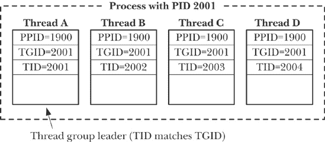

## 第二十八章. 更详细的进程创建与程序执行

本章扩展了第二十四章至第二十七章中的内容，涵盖了与进程创建和程序执行相关的各种主题。我们描述了进程会计，这是一个内核功能，在每个进程终止时为系统上的每个进程写入一条会计记录。接着，我们介绍了 Linux 特有的*clone()* 系统调用，这是用于在 Linux 上创建线程的低级 API。之后，我们对 *fork()*、*vfork()* 和 *clone()* 的性能进行了比较。最后，我们总结了 *fork()* 和 *exec()* 对进程属性的影响。

## 进程会计

当启用进程会计时，每当进程终止时，内核会将一条会计记录写入系统范围的进程会计文件。这条会计记录包含内核维护的有关进程的各种信息，包括其终止状态和消耗的 CPU 时间。可以通过标准工具（*sa(8)* 总结来自会计文件的信息，*lastcomm(1)* 列出先前执行的命令的信息）或定制的应用程序分析会计文件。

### 注意

在 2.6.10 版本之前的内核中，为每个使用 NPTL 线程实现创建的线程写入一个独立的进程会计记录。自内核 2.6.10 起，当最后一个线程终止时，会为整个进程写入一条会计记录。在较旧的 LinuxThreads 线程实现中，总是为每个线程写入一条进程会计记录。

历史上，进程会计的主要用途是对多用户 UNIX 系统上用户使用系统资源的情况进行收费。然而，进程会计也可以用于获取有关进程的信息，这些信息通常未被其父进程监控和报告。

尽管在大多数 UNIX 实现中都可用，进程会计并未在 SUSv3 中指定。会计记录的格式以及会计文件的位置在不同实现之间有所不同。本节中我们描述了 Linux 的细节，并注意到与其他 UNIX 实现之间的一些差异。

### 注意

在 Linux 上，进程会计是一个可选的内核组件，通过选项 `CONFIG_BSD_PROCESS_ACCT` 配置。

#### 启用和禁用进程会计

*acct()* 系统调用由具有特权的（`CAP_SYS_PACCT`）进程用于启用和禁用进程会计。这个系统调用在应用程序中很少使用。通常，进程会计在每次系统重启时通过将适当的命令放入系统启动脚本来启用。

```
#define _BSD_SOURCE
#include <unistd.h>

int `acct`(const char **acctfile*);
```

### 注意

成功时返回 0，出错时返回 -1

要启用进程会计，我们需要在*acctfile*中提供一个*现有*的常规文件路径名。会计文件的典型路径名是`/var/log/pacct`或`/usr/account/pacct`。要禁用进程会计，我们将*acctfile*指定为`NULL`。

示例 28-1 中的程序使用*acct()*来切换进程会计的开启和关闭。该程序的功能类似于 shell 中的*accton(8)*命令。

示例 28-1. 开启和关闭进程会计

```
`procexec/acct_on.c`
#define _BSD_SOURCE
#include <unistd.h>
#include "tlpi_hdr.h"

int
main(int argc, char *argv[])
{
    if (argc > 2 || (argc > 1 && strcmp(argv[1], "--help") == 0))
        usageErr("%s [file]\n");

    if (acct(argv[1]) == -1)
        errExit("acct");

    printf("Process accounting %s\n",
            (argv[1] == NULL) ? "disabled" : "enabled");
    exit(EXIT_SUCCESS);
}
     `procexec/acct_on.c`
```

#### 进程会计记录

一旦启用进程会计，每当一个进程终止时，*acct*记录就会被写入到会计文件中。*acct*结构在`<sys/acct.h>`中定义如下：

```
typedef u_int16_t comp_t;  /* See text */

struct acct {
    char      ac_flag;     /* Accounting flags (see text) */
    u_int16_t ac_uid;      /* User ID of process */
    u_int16_t ac_gid;      /* Group ID of process */
    u_int16_t ac_tty;      /* Controlling terminal for process (may be
                              0 if none, e.g., for a daemon) */
    u_int32_t ac_btime;    /* Start time (time_t; seconds since the Epoch) */
    comp_t    ac_utime;    /* User CPU time (clock ticks) */
    comp_t    ac_stime;    /* System CPU time (clock ticks) */
    comp_t    ac_etime;    /* Elapsed (real) time (clock ticks) */
    comp_t    ac_mem;      /* Average memory usage (kilobytes) */
    comp_t    ac_io;       /* Bytes transferred by read(2) and write(2)
                              (unused) */
    comp_t    ac_rw;       /* Blocks read/written (unused) */
    comp_t    ac_minflt;   /* Minor page faults (Linux-specific) */
    comp_t    ac_majflt;   /* Major page faults (Linux-specific) */
    comp_t    ac_swaps;    /* Number of swaps (unused; Linux-specific) */
    u_int32_t ac_exitcode; /* Process termination status */
#define ACCT_COMM 16
    char      ac_comm[ACCT_COMM+1];
                           /* (Null-terminated) command name
                              (basename of last execed file) */
    char      ac_pad[10];  /* Padding (reserved for future use) */
};
```

注意以下关于*acct*结构的几点：

+   *u_int16_t*和*u_int32_t*数据类型分别是 16 位和 32 位无符号整数。

+   *ac_flag*字段是一个位掩码，记录进程的各种事件。此字段中可能出现的位在表 28-1 中展示。如表所示，并非所有 UNIX 实现都支持这些位。某些其他实现会在此字段中提供额外的位。

+   *ac_comm*字段记录了该进程执行的最后一个命令（程序文件）的名称。内核在每次执行*execve()*时记录此值。在一些其他 UNIX 实现中，该字段限制为 8 个字符。

+   *comp_t*类型是一种浮动点数。此类型的值有时被称为*压缩时钟滴答*。浮动点数由一个 3 位的基 8 指数和一个 13 位的尾数组成；指数可以表示一个范围从 8⁰=1 到 8⁷（2,097,152）的因子。例如，125 的尾数和 1 的指数表示值 1000。示例 28-2 定义了一个函数（*comptToLL()*）来将此类型转换为*long long*。我们需要使用*long long*类型，因为在 x86-32 上，表示*unsigned long*的 32 位不足以容纳在*comp_t*中表示的最大值，即(2¹³ - 1) * 87。

+   使用*comp_t*类型定义的三个时间字段表示系统时钟滴答时间。因此，我们必须通过*sysconf(_SC_CLK_TCK)*返回的值将这些时间转换为秒。

+   *ac_exitcode* 字段保存进程的终止状态（详见 等待状态值）。大多数其他 UNIX 实现则提供一个单字节字段 *ac_stat*，该字段仅记录终止进程的信号（如果进程是由信号终止的），以及一个位标志，指示该信号是否导致进程生成核心转储。基于 BSD 的实现则不提供这两个字段。

表 28-1. 进程会计记录的 *ac_flag* 字段的位值

| 位 | 描述 |
| --- | --- |
| `AFORK` | 进程通过 *fork()* 创建，但在终止之前未执行 *exec()* |
| `ASU` | 进程使用了超级用户权限 |
| `AXSIG` | 进程被信号终止（某些实现中不存在） |
| `ACORE` | 进程生成了核心转储（某些实现中不存在） |

由于会计记录仅在进程终止时写入，因此它们按终止时间排序（记录中未记录此值），而不是按进程启动时间（*ac_btime*）排序。

### 注意

如果系统崩溃，对于仍在执行的任何进程，都不会写入会计记录。

由于写入记录到会计文件可能迅速消耗磁盘空间，Linux 提供了 `/proc/sys/kernel/acct` 虚拟文件来控制进程会计操作。该文件包含三个数字，依次定义 *高水位*、*低水位* 和 *频率* 参数。这三个参数的典型默认值为 4、2 和 30。如果启用了进程会计，并且空闲磁盘空间低于 *低水位* 百分比，则会暂停会计操作。如果空闲磁盘空间后来上升至 *高水位* 百分比以上，则会恢复会计操作。*频率* 值指定检查空闲磁盘空间百分比的频率（单位：秒）。

#### 示例程序

示例 28-2 中的程序显示了进程会计文件中记录的选定字段。以下 shell 会话演示了这个程序的使用。我们首先创建一个新的空的进程会计文件，并启用进程会计：

```
$ `su`                            *Need privilege to enable process accounting*
Password:
# `touch pacct`
# `./acct_on pacct`
               *This process will be first entry in accounting file*
Process accounting enabled
# `exit`                          *Cease being superuser*
```

在此时，已有三个进程在启用进程会计后终止。这些进程执行了 *acct_on*、*su* 和 *bash* 程序。*bash* 进程是由 *su* 启动的，用来运行特权 shell 会话。

现在我们运行一系列命令，向会计文件中添加更多记录：

```
$ `sleep 15 &`
[1] 18063
$ `ulimit -c unlimited`           *Allow core dumps (shell built-in)*
$ `cat`                           *Create a process*
*Type Control-\ (generates* SIGQUIT *, signal 3) to kill cat process*
Quit (core dumped)
$
*Press Enter to see shell notification*
 *of completion of sleep before next shell prompt*
[1]+  Done          sleep 15
$ `grep xxx badfile`              *grep fails with status of 2*
grep: badfile: No such file or directory
$ `echo $?`                       *The shell obtained status of grep (shell built-in)*
2
```

接下来的两个命令运行了我们在前面章节中介绍的程序（示例 27-1 执行新程序")，在 exec()库函数 库函数")中，以及示例 24-1")，在父子进程间的文件共享中）。第一个命令运行一个执行`/bin/echo`文件的程序；这将生成一个命令名为*echo*的会计记录。第二个命令创建一个没有执行*exec()*的子进程。

```
$ `./t_execve /bin/echo`
hello world goodbye
$ `./t_fork`
PID=18350 (child) idata=333 istack=666
PID=18349 (parent) idata=111 istack=222
```

最后，我们使用示例 28-2 中的程序查看会计文件的内容：

```
$ `./acct_view pacct`
command  flags   term.  user     start time            CPU   elapsed
                status                                 time    time
acct_on   -S--      0   root     2010-07-23 17:19:05   0.00    0.00
bash      ----      0   root     2010-07-23 17:18:55   0.02   21.10
su        -S--      0   root     2010-07-23 17:18:51   0.01   24.94
cat       --XC   0x83   mtk      2010-07-23 17:19:55   0.00    1.72
sleep     ----      0   mtk      2010-07-23 17:19:42   0.00   15.01
grep      ----  0x200   mtk      2010-07-23 17:20:12   0.00    0.00
echo      ----      0   mtk      2010-07-23 17:21:15   0.01    0.01
t_fork    F---      0   mtk      2010-07-23 17:21:36   0.00    0.00
t_fork    ----      0   mtk      2010-07-23 17:21:36   0.00    3.01
```

在输出中，我们可以看到每个在 shell 会话中创建的进程的每一行。*ulimit*和*echo*命令是 shell 内建命令，因此不会创建新进程。请注意，*sleep*的条目出现在*cat*条目之后，因为*sleep*命令在*cat*命令之后终止。

大多数输出内容是不言自明的。*flags*列显示单个字母，表示每条记录中哪个*ac_flag*位被设置（见表 28-1）。等待状态值描述了如何解释*term. status*列中显示的终止状态值。

示例 28-2. 显示来自进程会计文件的数据

```
`procexec/acct_view.c`
#include <fcntl.h>
#include <time.h>
#include <sys/stat.h>
#include <sys/acct.h>
#include <limits.h>
#include "ugid_functions.h"             /* Declaration of userNameFromId() */
#include "tlpi_hdr.h"

#define TIME_BUF_SIZE 100

static long long                /* Convert comp_t value into long long */
comptToLL(comp_t ct)
{
    const int EXP_SIZE = 3;             /* 3-bit, base-8 exponent */
    const int MANTISSA_SIZE = 13;       /* Followed by 13-bit mantissa */
    const int MANTISSA_MASK = (1 << MANTISSA_SIZE) - 1;
    long long mantissa, exp;

    mantissa = ct & MANTISSA_MASK;
    exp = (ct >> MANTISSA_SIZE) & ((1 << EXP_SIZE) - 1);
    return mantissa << (exp * 3);       /* Power of 8 = left shift 3 bits */
}

int
main(int argc, char *argv[])
{
    int acctFile;
    struct acct ac;
    ssize_t numRead;
    char *s;
    char timeBuf[TIME_BUF_SIZE];
    struct tm *loc;
    time_t t;

    if (argc != 2 || strcmp(argv[1], "--help") == 0)
        usageErr("%s file\n", argv[0]);

    acctFile = open(argv[1], O_RDONLY);
    if (acctFile == -1)
        errExit("open");

    printf("command  flags   term.  user     "
            "start time            CPU   elapsed\n");
    printf("                status           "
            "                      time    time\n");

    while ((numRead = read(acctFile, &ac, sizeof(struct acct))) > 0) {
        if (numRead != sizeof(struct acct))
            fatal("partial read");

        printf("%-8.8s  ", ac.ac_comm);

        printf("%c", (ac.ac_flag & AFORK) ? 'F' : '-') ;
        printf("%c", (ac.ac_flag & ASU)   ? 'S' : '-') ;
        printf("%c", (ac.ac_flag & AXSIG) ? 'X' : '-') ;
        printf("%c", (ac.ac_flag & ACORE) ? 'C' : '-') ;

#ifdef __linux__
        printf(" %#6lx   ", (unsigned long) ac.ac_exitcode);
#else   /* Many other implementations provide ac_stat instead */
        printf(" %#6lx   ", (unsigned long) ac.ac_stat);
#endif

        s = userNameFromId(ac.ac_uid);
        printf("%-8.8s ", (s == NULL) ? "???" : s);

        t = ac.ac_btime;
        loc = localtime(&t);
        if (loc == NULL) {
            printf("???Unknown time???  ");
        } else {
            strftime(timeBuf, TIME_BUF_SIZE, "%Y-%m-%d %T ", loc);
            printf("%s ", timeBuf);
        }

        printf("%5.2f %7.2f ", (double) (comptToLL(ac.ac_utime) +
                    comptToLL(ac.ac_stime)) / sysconf(_SC_CLK_TCK),
                (double) comptToLL(ac.ac_etime) / sysconf(_SC_CLK_TCK));
        printf("\n");
    }

    if (numRead == -1)
        errExit("read");

    exit(EXIT_SUCCESS);
}
     `procexec/acct_view.c`
```

#### 进程会计版本 3 文件格式

从内核 2.6.8 开始，Linux 引入了一种可选的替代版本进程会计文件，解决了传统会计文件的一些限制。要使用这种替代版本，称为*版本 3*，必须在构建内核之前启用`CONFIG_BSD_PROCESS_ACCT_V3`内核配置选项。

当使用版本 3 选项时，进程会计操作的唯一区别在于写入会计文件的记录格式。新格式定义如下：

```
struct acct_v3 {
    char      ac_flag;        /* Accounting flags */
    char      ac_version;     /* Accounting version (3) */
    u_int16_t ac_tty;         /* Controlling terminal for process */
    u_int32_t ac_exitcode;    /* Process termination status */
    u_int32_t ac_uid;         /* 32-bit user ID of process */
    u_int32_t ac_gid;         /* 32-bit group ID of process */
    u_int32_t ac_pid;         /* Process ID */
    u_int32_t ac_ppid;        /* Parent process ID */
    u_int32_t ac_btime;       /* Start time (time_t) */
    float     ac_etime;       /* Elapsed (real) time (clock ticks) */
    comp_t    ac_utime;       /* User CPU time (clock ticks) */
    comp_t    ac_stime;       /* System CPU time (clock ticks) */
    comp_t    ac_mem;         /* Average memory usage (kilobytes) */
    comp_t    ac_io;          /* Bytes read/written (unused) */
    comp_t    ac_rw;          /* Blocks read/written (unused) */
    comp_t    ac_minflt;      /* Minor page faults */
    comp_t    ac_majflt;      /* Major page faults */
    comp_t    ac_swaps;       /* Number of swaps (unused; Linux-specific) */
#define ACCT_COMM 16
    char      ac_comm[ACCT_COMM];   /* Command name */
};
```

以下是*acct_v3*结构和传统 Linux*acct*结构之间的主要区别：

+   添加了*ac_version*字段。该字段包含此类型会计记录的版本号。对于*acct_v3*记录，此字段始终为 3。

+   添加了*ac_pid*和*ac_ppid*字段，分别包含已终止进程的进程 ID 和父进程 ID。

+   *ac_uid* 和 *ac_gid* 字段的宽度从 16 位扩展到 32 位，以适应 Linux 2.4 引入的 32 位用户和组 ID。（传统的 *acct* 文件无法正确表示较大的用户和组 ID。）

+   *ac_etime* 字段的类型从 *comp_t* 改为 *float*，以便记录更长的经过时间。

### 注

我们在本书的源代码分发中提供了一个 Version 3 类似程序，位于文件 `procexec/acct_v3_view.c` 中，参见 示例 28-2。

## *clone()* 系统调用

像 *fork()* 和 *vfork()* 一样，Linux 特有的 *clone()* 系统调用创建一个新进程。它与另外两个调用的不同之处在于，它允许更精细地控制进程创建过程中发生的各个步骤。*clone()* 的主要用途是在线程库的实现中。由于 *clone()* 并不具有可移植性，因此通常应避免在应用程序中直接使用它。我们在这里讨论它，是因为它为第二十九章 到第三十三章 关于 POSIX 线程的讨论提供了有用的背景，也因为它有助于进一步理解 *fork()* 和 *vfork()* 的操作。

```
#define _GNU_SOURCE
#include <sched.h>

int `clone`(int (**func*) (void *), void **child_stack*, int
 *flags*, void **func_arg*, ...
          /* pid_t **ptid*, struct user_desc **tls*, pid_t **ctid* */ );
```

### 注

成功时返回子进程的进程 ID，出错时返回 -1。

像 *fork()* 一样，使用 *clone()* 创建的新进程几乎是父进程的精确副本。

与 *fork()* 不同，克隆的子进程不会从调用点继续执行，而是通过调用 *func* 参数中指定的函数开始执行；我们将其称为 *子进程函数*。在调用时，子进程函数会传入 *func_arg* 中指定的值。通过适当的类型转换，子进程函数可以自由解释这个参数；例如，可以将其解释为 int 类型或结构体的指针。（将其解释为指针是可能的，因为克隆的子进程要么获取调用进程的内存副本，要么与之共享内存。）

### 注

在内核中，*fork()*, *vfork()* 和 *clone()* 最终都由同一个函数实现（`kernel/fork.c` 中的 *do_fork()*）。在这个层面上，克隆更接近于分叉：*sys_clone()* 没有 *func* 和 *func_arg* 参数，且在调用后，*sys_clone()* 会像 *fork()* 一样在子进程中返回。正文描述了 *glibc* 为 *sys_clone()* 提供的 *clone()* 包装函数。（该函数在架构特定的 *glibc* 汇编源代码中定义，例如在 `sysdeps/unix/sysv/linux/i386/clone.S` 中。）该包装函数在 *sys_clone()* 在子进程中返回后调用 *func*。

克隆的子进程终止的时机要么是 *func* 返回（此时其返回值为进程的退出状态），要么是进程调用 *exit()*（或 _*exit()*）时。父进程可以像往常一样使用 *wait()* 或类似函数等待克隆的子进程。

由于克隆的子进程可能（像 *vfork()* 一样）共享父进程的内存，因此不能使用父进程的堆栈。相反，调用者必须为子进程分配一个适当大小的内存块作为堆栈，并将该内存块的指针传递给 *child_stack* 参数。在大多数硬件架构上，堆栈是向下增长的，因此 *child_stack* 参数应该指向分配内存块的高端。

### 注释

堆栈增长方向的架构依赖性是 *clone()* 设计中的一个缺陷。在 Intel IA-64 架构上，提供了改进的 *clone()* API，形式为 *clone2()*。这个系统调用通过提供堆栈的起始地址和大小，定义了子进程堆栈的范围，避免依赖堆栈增长的方向。详情请参见手册页。

*clone()* 标志位参数有两个用途。首先，其低字节指定子进程的 *终止信号*，即当子进程终止时发送给父进程的信号。（如果克隆的子进程被信号 *停止*，父进程仍会接收到 `SIGCHLD`。）这个字节可以为 0，表示不生成信号。（通过使用 Linux 特有的 /`proc/`*PID*`/stat` 文件，我们可以确定任何进程的终止信号；详情请参见 *proc(5)* 手册页。）

### 注释

对于 *fork()* 和 *vfork()*，我们无法选择终止信号；它总是 `SIGCHLD`。

*flags* 参数的剩余字节包含一个位掩码，控制 *clone()* 的操作。我们在表 28-2* 标志位掩码值")中总结了这些位掩码值，并在示例程序中进行了更详细的描述。

表 28-2. *clone()* 标志位掩码值

| 标志 | 如果存在，效果 |
| --- | --- |
| `CLONE_CHILD_CLEARTID` | 当子进程调用 *exec()* 或 *_exit()* 时清除 *ctid*（2.6 及以后版本） |
| `CLONE_CHILD_SETTID` | 将子进程的线程 ID 写入 *ctid*（2.6 及以后版本） |
| `CLONE_FILES` | 父进程和子进程共享打开文件描述符表 |
| `CLONE_FS` | 父进程和子进程共享与文件系统相关的属性 |
| `CLONE_IO` | 子进程共享父进程的 I/O 上下文（2.6.25 及以后版本） |
| `CLONE_NEWIPC` | 子进程获得新的 System V IPC 命名空间（2.6.19 及以后版本） |
| `CLONE_NEWNET` | 子进程获得新的网络命名空间（2.4.24 及以后版本） |
| `CLONE_NEWNS` | 子进程获得父进程的挂载命名空间副本（2.4.19 及以后版本） |
| `CLONE_NEWPID` | 子进程获得新的进程 ID 命名空间（2.6.19 及以后版本） |
| `CLONE_NEWUSER` | 子进程获得新的用户 ID 命名空间（2.6.23 及以后版本） |
| `CLONE_NEWUTS` | 子进程获得新的 UTS（*utsname()*）命名空间（2.6.19 及以后版本） |
| `CLONE_PARENT` | 将子进程的父进程设置为与调用者的父进程相同（2.4 及以后版本） |
| `CLONE_PARENT_SETTID` | 将子进程的线程 ID 写入 *ptid*（2.6 及以后版本） |
| `CLONE_PID` | 仅由系统启动过程使用的过时标志（最多到 2.4 版本） |
| `CLONE_PTRACE` | 如果父进程正在被跟踪，则子进程也被跟踪 |
| `CLONE_SETTLS` | *tls*描述子进程的线程局部存储（从 2.6 版本起） |
| `CLONE_SIGHAND` | 父进程和子进程共享信号处理方式 |
| `CLONE_SYSVSEM` | 父进程和子进程共享信号量撤销值（从 2.6 版本起） |
| `CLONE_THREAD` | 将子进程放入与父进程相同的线程组（从 2.4 版本起） |
| `CLONE_UNTRACED` | 无法强制对子进程执行`CLONE_PTRACE`（从 2.6 版本起） |
| `CLONE_VFORK` | 父进程被挂起，直到子进程调用*exec()*或*_exit()* |
| `CLONE_VM` | 父进程和子进程共享虚拟内存 |

*clone()*的其余参数是*ptid*、*tls*和*ctid*。这些参数与线程的实现有关，特别是与线程 ID 和线程局部存储的使用有关。我们将在示例程序中描述这些参数和*flags*位掩码值时，详细介绍它们的使用。（在 Linux 2.4 及更早版本中，*clone()*没有提供这三个参数。它们是在 Linux 2.6 中专门添加的，用以支持 NPTL POSIX 线程实现。）

#### 示例程序

示例 28-3 创建子进程")展示了如何使用*clone()*创建子进程的简单示例。主程序执行以下操作：

+   打开一个文件描述符（针对`/dev/null`），该文件描述符将由子进程关闭！[](figs/web/U002.png)。

+   如果提供了命令行参数，则将*clone()*标志参数的值设置为`CLONE_FILES`！[](figs/web/U003.png)，使得父进程和子进程共享同一个文件描述符表。如果没有提供命令行参数，则将*flags*设置为 0。

+   为子进程分配一个栈空间！[](figs/web/U004.png)。

+   如果`CHILD_SIG`非零且不等于`SIGCHLD`，则忽略它，以防它是一个会终止进程的信号。我们不忽略`SIGCHLD`，因为忽略它会阻止父进程等待子进程收集其状态。

+   调用*clone()*来创建子进程！[](figs/web/U006.png)。第三个（位掩码）参数包括终止信号。第四个参数（*func_arg*）指定先前打开的文件描述符（在处）。

+   等待子进程终止！[](figs/web/U007.png)。

+   通过尝试对文件描述符（在处打开）执行*write()*操作，检查文件描述符是否仍然打开！[](figs/web/U008.png)。程序报告*write()*操作是成功还是失败。

克隆的子进程执行从*childFunc()*开始，该函数接收（在参数*arg*中）由主程序打开的文件描述符（在处）。子进程关闭此文件描述符后，通过执行`return`！[](figs/web/U001.png)来终止。

示例 28-3. 使用*clone()*创建子进程

```
`procexec/t_clone.c`
    #define _GNU_SOURCE
    #include <signal.h>
    #include <sys/wait.h>
    #include <fcntl.h>
    #include <sched.h>
    #include "tlpi_hdr.h"

    #ifndef CHILD_SIG
    #define CHILD_SIG SIGUSR1       /* Signal to be generated on termination
                                       of cloned child */
    #endif

    static int                      /* Startup function for cloned child */
    childFunc(void *arg)
    {
   if (close(*((int *) arg)) == -1)
            errExit("close");

        return 0;                           /* Child terminates now */
    }

    int
    main(int argc, char *argv[])
    {
        const int STACK_SIZE = 65536;       /* Stack size for cloned child */
        char *stack;                        /* Start of stack buffer */
        char *stackTop;                     /* End of stack buffer */
        int s, fd, flags;

   fd = open("/dev/null", O_RDWR);     /* Child will close this fd */
        if (fd == -1)
            errExit("open");

          /* If argc > 1, child shares file descriptor table with parent */

    flags = (argc > 1) ? CLONE_FILES : 0;

        /* Allocate stack for child */

    stack = malloc(STACK_SIZE);
        if (stack == NULL)
            errExit("malloc");
        stackTop = stack + STACK_SIZE;      /* Assume stack grows downward */

        /* Ignore CHILD_SIG, in case it is a signal whose default is to
           terminate the process; but don't ignore SIGCHLD (which is ignored
           by default), since that would prevent the creation of a zombie. */

    if (CHILD_SIG != 0 && CHILD_SIG != SIGCHLD)
            if (signal(CHILD_SIG, SIG_IGN) == SIG_ERR)
                errExit("signal");

        /* Create child; child commences execution in childFunc() */

    if (clone(childFunc, stackTop, flags | CHILD_SIG, (void *) &fd) == -1)
            errExit("clone");

        /* Parent falls through to here. Wait for child; __WCLONE is
           needed for child notifying with signal other than SIGCHLD. */

    if (waitpid(-1, NULL, (CHILD_SIG != SIGCHLD) ? __WCLONE : 0) == -1)
            errExit("waitpid");
        printf("child has terminated\n");

        /* Did close() of file descriptor in child affect parent? */

    s = write(fd, "x", 1);
        if (s == -1 && errno == EBADF)
            printf("file descriptor %d has been closed\n", fd);
        else if (s == -1)
            printf("write() on file descriptor %d failed "
                    "unexpectedly (%s)\n", fd, strerror(errno));
        else
            printf("write() on file descriptor %d succeeded\n", fd);

        exit(EXIT_SUCCESS);
    }
         `procexec/t_clone.c`
```

当我们在示例 28-3 创建子进程")中运行程序且没有命令行参数时，我们看到以下内容：

```
$ `./t_clone`                               *Doesn’t use* CLONE_FILES
child has terminated
write() on file descriptor 3 succeeded    *Child’s close() did not affect parent*
```

当我们使用命令行参数运行程序时，我们可以看到两个进程共享文件描述符表：

```
$ `./t_clone x`                             *Uses* CLONE_FILES
child has terminated
file descriptor 3 has been closed         *Child’s close() affected parent*
```

### 注意

我们在本书的源代码分发版中的文件`procexec/demo_clone.c`中展示了一个更复杂的使用*clone()*的例子。

### *clone() 标志* 参数

*clone() 标志*参数是以下页面中描述的位掩码值的组合（按位“或”运算）。我们没有按字母顺序呈现这些标志，而是按照便于解释的顺序呈现，并从实现 POSIX 线程中使用的标志开始。从实现线程的角度来看，下面许多提到的“进程”一词可以替换为“线程”。

此时值得指出的是，在某种程度上，我们在试图区分*线程*和*进程*这两个术语时，实际上是在玩文字游戏。引入术语*内核调度实体*（KSE）有助于一些理解，它在某些文献中用于指代内核调度器处理的对象。实际上，线程和进程只是 KSE，它们在与其他 KSE 共享属性（虚拟内存、打开的文件描述符、信号处置、进程 ID 等）的程度上有所不同。POSIX 线程规范提供了一个定义，规定了线程之间应该共享哪些属性。

在接下来的描述过程中，我们有时会提到 Linux 上两种主要的 POSIX 线程实现：较旧的 LinuxThreads 实现和较新的 NPTL 实现。有关这两种实现的更多信息，请参阅第 33.5 节。

### 注意

从内核 2.6.16 开始，Linux 提供了一种新的系统调用*unshare()*，允许使用*clone()*（或*fork()*或*vfork()*)创建的子进程撤销一些属性共享（即撤销一些*clone() 标志*位的效果），该属性共享在子进程创建时被建立。有关详细信息，请参阅*unshare(2)*手册页。

#### 共享文件描述符表：`CLONE_FILES`

如果指定了`CLONE_FILES`标志，则父进程和子进程共享相同的打开文件描述符表。这意味着在任一进程中的文件描述符分配或释放（*open()*, *close()*, *dup()*, *pipe()*, *socket()*等）将在另一个进程中可见。如果没有设置`CLONE_FILES`标志，则文件描述符表不共享，子进程在调用*clone()*时将获得父进程表的副本。这些复制的描述符引用与父进程中相应描述符相同的打开文件描述符（就像*fork()*和*vfork()*一样）。

POSIX 线程的规范要求一个进程中的所有线程共享相同的打开文件描述符。

#### 共享与文件系统相关的信息：`CLONE_FS`

如果设置了 `CLONE_FS` 标志，则父进程和子进程共享与文件系统相关的信息——umask、根目录和当前工作目录。这意味着，在任一进程中调用 *umask()*、*chdir()* 或 *chroot()* 都会影响另一个进程。如果未设置 `CLONE_FS` 标志，则父进程和子进程拥有该信息的独立副本（就像 *fork()* 和 *vfork()*）。

`CLONE_FS` 提供的属性共享是 POSIX 线程的要求。

#### 共享信号处置表：`CLONE_SIGHAND`

如果设置了 `CLONE_SIGHAND` 标志，则父进程和子进程共享相同的信号处置表。在任一进程中使用 *sigaction()* 或 *signal()* 更改信号的处置方式，将会影响另一个进程中的信号处置方式。如果未设置 `CLONE_SIGHAND` 标志，则信号处置表不会共享；相反，子进程将获得父进程的信号处置表副本（就像 *fork()* 和 *vfork()*）。`CLONE_SIGHAND` 标志不会影响进程的信号屏蔽字和待处理信号集，这些始终是两个进程独立的。从 Linux 2.6 开始，如果指定了 `CLONE_SIGHAND`，则必须在 *flags* 中包含 `CLONE_VM`。

POSIX 线程要求共享信号处置表。

#### 共享父进程的虚拟内存：`CLONE_VM`

如果设置了 `CLONE_VM` 标志，则父进程和子进程共享相同的虚拟内存页面（就像 *vfork()*）。任一进程对内存的更新或对 *mmap()* 或 *munmap()* 的调用都会影响另一个进程。如果未设置 `CLONE_VM` 标志，则子进程会接收父进程的虚拟内存副本（就像 *fork()*）。

共享相同的虚拟内存是线程的一个定义特性，也是 POSIX 线程的要求。

#### 线程组：`CLONE_THREAD`

如果设置了 `CLONE_THREAD` 标志，则子进程会被放入与父进程相同的线程组。如果未设置此标志，则子进程会被放入一个新的线程组。

*线程组*是在 Linux 2.4 中引入的，目的是让线程库支持 POSIX 线程要求，使得进程中的所有线程共享一个进程 ID（即，*getpid()* 在每个线程中返回相同的值）。线程组是共享相同 *线程组标识符*（TGID）的 KSE（Kernel Scheduling Entity）组，如 图 28-1 所示。在接下来的 `CLONE_THREAD` 讨论中，我们将这些 KSE 称为 *线程*。

自 Linux 2.4 起，*getpid()* 返回调用线程的 TGID。换句话说，TGID 就是进程 ID。

### 注意

在 Linux 2.2 及更早版本中，*clone()* 实现并没有提供 `CLONE_THREAD`。相反，LinuxThreads 将 POSIX 线程实现为共享各种属性（例如虚拟内存）的进程，但具有独立的进程 ID。出于兼容性考虑，即使在现代 Linux 内核中，LinuxThreads 实现也不使用 `CLONE_THREAD` 标志，因此该实现中的线程依然具有独立的进程 ID。

图 28-1. 一个包含四个线程的线程组

线程组中的每个线程都有一个独特的*线程标识符*（TID）。Linux 2.4 引入了一个新的系统调用，*gettid()*，允许线程获取其自己的线程 ID（这是返回给调用 *clone()* 的线程的相同值）。线程 ID 使用与进程 ID 相同的数据类型 *pid_t* 来表示。线程 ID 在系统范围内是唯一的，内核保证没有任何线程 ID 会与系统上的进程 ID 相同，除非该线程是某个进程的线程组领导者。

新线程组中的第一个线程具有与其线程组 ID 相同的线程 ID。这个线程被称为*线程组领导者*。

### 注意

这里讨论的线程 ID 与 POSIX 线程使用的线程 ID（*pthread_t* 数据类型）不同。后者的标识符是在用户空间内部生成并维护的（由 POSIX 线程实现）。

一个线程组中的所有线程都具有相同的父进程 ID——即线程组领导者的进程 ID。只有当线程组中的所有线程都终止后，`SIGCHLD` 信号（或其他终止信号）才会发送到该父进程。这些语义符合 POSIX 线程的要求。

当一个 `CLONE_THREAD` 线程终止时，不会向创建它的线程发送信号（该线程使用 *clone()* 创建）。因此，无法使用 *wait()*（或类似的）来等待通过 `CLONE_THREAD` 创建的线程。这符合 POSIX 的要求。POSIX 线程与进程不同，不能通过 *wait()* 来等待；相反，必须使用 *pthread_join()* 来连接该线程。为了检测通过 `CLONE_THREAD` 创建的线程的终止，使用一种特殊的同步原语，叫做 *futex*（请参见下文关于 `CLONE_PARENT_SETTID` 标志的讨论）。

如果线程组中的任何线程执行了 *exec()*，则除了线程组领导者外，所有线程都会被终止（这一行为符合 POSIX 线程所需的语义），新程序将在线程组领导者中执行。换句话说，在新程序中，*gettid()* 将返回线程组领导者的线程 ID。在 *exec()* 过程中，应该发送到父进程的终止信号将重置为 `SIGCHLD`。

如果线程组中的某个线程通过 *fork()* 或 *vfork()* 创建了一个子线程，那么该组中的任何线程都可以使用 *wait()* 或类似方法来监控该子线程。

从 Linux 2.6 开始，如果指定了 `CLONE_THREAD`，则必须在 *flags* 中包含 `CLONE_SIGHAND`。这对应于进一步的 POSIX 线程要求；详细信息请参阅第 33.2 节中描述的 POSIX 线程与信号的交互。（`CLONE_THREAD` 线程组的内核信号处理符合 POSIX 对进程中线程如何响应信号的要求。）

#### 线程库支持：`CLONE_PARENT_SETTID`、`CLONE_CHILD_SETTID` 和 `CLONE_CHILD_CLEARTID`

`CLONE_PARENT_SETTID`、`CLONE_CHILD_SETTID` 和 `CLONE_CHILD_CLEARTID` 标志是在 Linux 2.6 中添加的，以支持 POSIX 线程的实现。这些标志影响 *clone()* 如何处理其 *ptid* 和 *ctid* 参数。`CLONE_PARENT_SETTID` 和 `CLONE_CHILD_CLEARTID` 在 NPTL 线程实现中被使用。

如果设置了 `CLONE_PARENT_SETTID` 标志，则内核会将子线程的线程 ID 写入 *ptid* 所指向的位置。在父线程的内存被复制之前，线程 ID 会被复制到 *ptid* 中。这意味着，即使没有指定 `CLONE_VM` 标志，父线程和子线程都可以在该位置看到子线程的线程 ID。（如上所述，`CLONE_VM` 标志是在创建 POSIX 线程时指定的。）

`CLONE_PARENT_SETTID` 标志的存在是为了提供一个可靠的方式，使线程实现能够获得新线程的 ID。请注意，仅通过 *clone()* 的返回值获取新线程的线程 ID 是不够的，如下所示：

```
tid = clone(...);
```

问题在于，这段代码可能导致各种竞态条件，因为赋值操作只发生在 *clone()* 返回之后。例如，假设新线程终止，并且其终止信号的处理程序在对 *tid* 进行赋值之前被调用。在这种情况下，处理程序无法有意义地访问 *tid*。（在一个线程库中，*tid* 可能是一个全局书籍结构中的条目，用于跟踪所有线程的状态。）直接调用 *clone()* 的程序通常可以设计成规避这种竞态条件。然而，线程库无法控制调用它的程序的行为。使用 `CLONE_PARENT_SETTID` 来确保在 *clone()* 返回之前将新线程 ID 放入 *ptid* 所指向的位置，允许线程库避免这种竞态条件。

如果设置了 `CLONE_CHILD_SETTID` 标志，则 *clone()* 会将子线程的线程 ID 写入 *ctid* 所指向的位置。*ctid* 的设置仅在子线程的内存中进行，但如果同时指定了 `CLONE_VM`，这将影响父线程。尽管 NPTL 不需要 `CLONE_CHILD_SETTID`，但提供此标志是为了给其他可能的线程库实现提供灵活性。

如果设置了`CLONE_CHILD_CLEARTID`标志，则*clone()*在子进程终止时会将*ctid*指向的内存位置清零。

*ctid*参数是 NPTL 线程实现获取线程终止通知的机制（稍后描述）。这种通知是*pthread_join()*函数所必需的，*pthread_join()*是 POSIX 线程机制，允许一个线程等待另一个线程的终止。

当使用*pthread_create()*创建线程时，NPTL 会调用*clone()*，其中*ptid*和*ctid*指向相同的位置。（这就是为什么 NPTL 不需要`CLONE_CHILD_SETTID`的原因。）`CLONE_PARENT_SETTID`标志会使该位置初始化为新线程的 ID。当子线程终止并且*ctid*被清除时，该变化对进程中的所有线程可见（因为同时指定了`CLONE_VM`标志）。

内核将*ctid*指向的位置视为*futex*，一种高效的同步机制。（有关 futex 的更多详细信息，请参阅*futex(2)*手册页面。）线程终止的通知可以通过执行一个*futex()*系统调用来获得，该调用会阻塞等待*ctid*指向的位置值发生变化。（在背后，这正是*pthread_join()*所做的。）当内核清除*ctid*时，它还会唤醒任何在该地址上执行 futex 等待的被阻塞内核调度实体（即线程）。（在 POSIX 线程级别，这会导致*pthread_join()*调用解除阻塞。）

#### 线程局部存储：`CLONE_SETTLS`

如果设置了`CLONE_SETTLS`标志，则*tls*参数指向一个*user_desc*结构，描述该线程将使用的线程局部存储缓冲区。这个标志在 Linux 2.6 中加入，以支持 NPTL 实现的线程局部存储（线程局部存储）。有关*user_desc*结构的详细信息，请参阅 2.6 内核源代码中该结构的定义和使用，以及*set_thread_area(2)*手册页面。

#### 共享 System V 信号量撤销值：`CLONE_SYSVSEM`

如果设置了`CLONE_SYSVSEM`标志，则父进程和子进程共享同一列表的 System V 信号量撤销值（信号量撤销值）。如果未设置此标志，则父进程和子进程拥有各自独立的撤销列表，子进程的撤销列表最初为空。

`CLONE_SYSVSEM`标志从内核 2.6 开始提供，并提供了 POSIX 线程所需的共享语义。

#### 每个进程的挂载命名空间：`CLONE_NEWNS`

从内核 2.4.19 开始，Linux 支持每个进程的*挂载命名空间*。挂载命名空间是通过*mount()*和*umount()*调用维护的挂载点集合。挂载命名空间影响路径名如何解析为实际文件，并且会影响诸如*chdir()*和*chroot()*等系统调用的操作。

默认情况下，父进程和子进程共享一个挂载命名空间，这意味着一个进程通过*mount()*和*umount()*修改命名空间的更改对另一个进程可见（与*fork()*和*vfork()*类似）。具有特权的（`CAP_SYS_ADMIN`）进程可以指定`CLONE_NEWNS`标志，使得子进程获得父进程挂载命名空间的副本。此后，一个进程对命名空间的更改在另一个进程中不可见。（在早期的 2.4.*x*内核以及更旧的内核中，我们可以认为系统上的所有进程共享一个全局的挂载命名空间。）

每个进程的挂载命名空间可用于创建类似于*chroot()*监狱的环境，但更加安全和灵活；例如，可以为被监禁的进程提供一个在系统上其他进程不可见的挂载点。挂载命名空间在设置虚拟服务器环境时也非常有用。

在同一次*clone()*调用中同时指定`CLONE_NEWNS`和`CLONE_FS`是没有意义的，且不被允许。

#### 将子进程的父进程设置为与调用者相同：`CLONE_PARENT`

默认情况下，当我们使用*clone()*创建一个新进程时，该进程的父进程（通过*getppid()*返回的父进程）是调用*clone()*的进程（与*fork()*和*vfork()*类似）。如果设置了`CLONE_PARENT`标志，则子进程的父进程将是调用者的父进程。换句话说，`CLONE_PARENT`相当于设置*child.PPID = caller.PPID*。（在默认情况下，如果没有`CLONE_PARENT`，则会是*child.PPID = caller.PID*。）父进程（*child.PPID*）是子进程终止时收到信号的进程。

`CLONE_PARENT`标志在 Linux 2.4 及更高版本中可用。最初，它旨在用于 POSIX 线程实现，但 2.6 内核采用了支持线程的方式（使用`CLONE_THREAD`，如上所述），因此不再需要此标志。

#### 将子进程的 PID 设置为与父进程相同：`CLONE_PID`（已废弃）

如果设置了`CLONE_PID`标志，则子进程与父进程具有相同的进程 ID。如果没有设置该标志，则父进程和子进程拥有不同的进程 ID（与*fork()*和*vfork()*类似）。只有系统启动进程（进程 ID 为 0）可以指定此标志；它用于初始化多处理器系统时。

`CLONE_PID`标志不应在用户应用程序中使用。在 Linux 2.6 中，它已被移除，并由`CLONE_IDLETASK`取代，后者会将新进程的进程 ID 设置为 0。`CLONE_IDLETASK`仅供内核内部使用（如果在*clone()*的*flags*参数中指定，它会被忽略）。它用于创建不可见的每 CPU*空闲进程*，在多处理器系统上可能会存在多个实例。

#### 进程跟踪：`CLONE_PTRACE`和`CLONE_UNTRACED`

如果设置了 `CLONE_PTRACE` 标志并且调用进程正在被追踪，则子进程也会被追踪。有关进程追踪的详细信息（调试器和 *strace* 命令使用的功能），请参阅 *ptrace(2)* 手册页。

从内核 2.6 开始，可以设置 `CLONE_UNTRACED` 标志，这意味着追踪进程无法强制对子进程使用 `CLONE_PTRACE`。`CLONE_UNTRACED` 标志由内核在创建内核线程时内部使用。

#### 在子进程退出或执行时挂起父进程：`CLONE_VFORK`

如果设置了 `CLONE_VFORK` 标志，则父进程的执行会被挂起，直到子进程通过调用 *exec()* 或 _*exit()*（如同 *vfork()* 的行为）释放其虚拟内存资源。

#### 新的 *clone()* 标志以支持容器

在 Linux 2.6.19 及更高版本中，添加了多个新的 *clone() flags* 值：`CLONE_IO`，`CLONE_NEWIPC`，`CLONE_NEWNET`，`CLONE_NEWPID`，`CLONE_NEWUSER` 和 `CLONE_NEWUTS`。（有关这些标志的详细信息，请参阅 *clone(2)* 手册页。）

这些标志大多是为了支持 *容器* 的实现（[Bhattiprolu 等，2008]）。容器是一种轻量级虚拟化形式，通过该形式在同一内核上运行的进程组可以在看似独立的环境中彼此隔离。容器也可以是嵌套的，一个容器可以包含另一个容器。这种容器方法与完全虚拟化形成对比，后者是每个虚拟化环境都在运行一个独立的内核。

为了实现容器，内核开发者必须在内核中提供一层间接机制，围绕每个全局系统资源——例如进程 ID、网络栈、*uname()* 返回的标识符、System V IPC 对象，以及用户和组 ID 命名空间——以便每个容器能够提供这些资源的独立实例。

容器有多种可能的用途，包括以下内容：

+   控制系统资源的分配，例如网络带宽或 CPU 时间（例如，一个容器可能被分配 75% 的 CPU 时间，而另一个容器分配 25%）；

+   在单台主机上提供多个轻量级虚拟服务器；

+   冻结一个容器，使容器中所有进程的执行暂停，稍后再重启，可能是在迁移到另一台机器后；

+   允许将应用程序的状态转储（检查点）并随后恢复（可能是在应用程序崩溃后，或系统计划或非计划关闭后），以便从检查点的时间继续计算。

#### 使用 *clone() flags*

大致上，我们可以说，*fork()* 相当于指定 `SIGCHLD` 标志的 *clone()* 调用，而 *vfork()* 相当于指定以下标志的 *clone()* 调用：

```
CLONE_VM | CLONE_VFORK | SIGCHLD
```

### 注意

从版本 2.3.3 开始，NPTL 线程实现提供的 *glibc* 包装器 *fork()* 会绕过内核的 *fork()* 系统调用并调用 *clone()*。该包装器函数会调用任何通过 *pthread_atfork()* 设置的 fork 处理程序（请参见 线程与进程控制）。

LinuxThreads 线程实现通过指定以下 *flags* 来使用 *clone()*（仅使用前四个参数）创建线程：

```
CLONE_VM | CLONE_FILES | CLONE_FS | CLONE_SIGHAND
```

NPTL 线程实现通过指定以下 *flags* 来使用 *clone()*（包括所有七个参数）创建线程：

```
CLONE_VM | CLONE_FILES | CLONE_FS | CLONE_SIGHAND | CLONE_THREAD |
CLONE_SETTLS | CLONE_PARENT_SETTID | CLONE_CHILD_CLEARTID | CLONE_SYSVSEM
```

### *waitpid()* 对克隆子进程的扩展

要等待由 *clone()* 产生的子进程，可以在 *waitpid()*、*wait3()* 和 *wait4()* 的 *options* 位掩码参数中包含以下额外的（特定于 Linux 的）值：

`__WCLONE`

如果设置，则仅等待 *clone* 子进程。如果未设置，则仅等待 *nonclone* 子进程。在这种情况下，*clone* 子进程是在终止时向其父进程发送除 `SIGCHLD` 之外的信号。如果同时指定了 `__WALL`，则忽略此位。

`__WALL`（自 Linux 2.4 起）

等待所有子进程，无论类型是（*clone* 还是 *nonclone*）。

`__WNOTHREAD`（自 Linux 2.4 起）

默认情况下，wait 调用不仅会等待调用进程的子进程，还会等待与调用者位于同一线程组中的任何其他进程的子进程。指定 `__WNOTHREAD` 标志会限制等待仅限于调用进程的子进程。

这些标志不能与 *waitid()* 一起使用。

## 进程创建速度

表 28-3、vfork() 和 clone() 创建 100,000 个进程所需的时间") 显示了不同进程创建方法的速度比较。结果是通过测试程序获得的，该程序执行一个循环，循环中不断创建子进程并等待其终止。该表比较了使用三种不同进程内存大小的方法，如 *总虚拟内存* 值所示。内存大小的差异通过在执行计时之前让程序通过 *malloc()* 在堆上分配额外内存来模拟。

### 注意

表 28-3 中的进程大小（*总虚拟内存*）值来自命令 *ps -o “pid vsz cmd”* 显示的 *VSZ* 值。

表 28-3。使用 *fork()*、*vfork()* 和 *clone()* 创建 100,000 个进程所需的时间

| 进程创建方法 | 总虚拟内存 |
| --- | --- |
| 1.70 MB | 2.70 MB | 11.70 MB |
| --- | --- | --- |
| 时间（秒） | 速率 | 时间（秒） | 速率 | 时间（秒） | 速率 |
| --- | --- | --- | --- | --- | --- |
| *fork()* | `22.27 (7.99)` | `4544` | `26.38 (8.98)` | `4135` | `126.93(52.55)` | `1276` |
| *vfork()* | `3.52 (2.49)` | `28955` | `3.55 (2.50)` | `28621` | `3.53 (2.51)` | `28810` |
| *clone()* | `2.97 (2.14)` | `34333` | `2.98 (2.13)` | `34217` | `2.93 (2.10)` | `34688` |
| *fork() + exec()* | `135.72(12.39)` | `764` | `146.15(16.69)` | `719` | `260.34(61.86)` | `435` |
| *vfork() + exec()* | `107.36 (6.27)` | `969` | `107.81 (6.35)` | `964` | `107.97 (6.38)` | `960` |

对于每种进程大小，表 28-3、vfork()和 clone()创建 100,000 个进程所需的时间")提供了两种类型的统计数据：

+   第一个统计数据由两个时间度量组成。主要（较大）的度量是执行 100,000 个进程创建操作所消耗的总（实际）时间。第二个时间，显示在括号中，是父进程所消耗的 CPU 时间。由于这些测试是在未负载的机器上运行的，因此这两个时间值之间的差异表示测试过程中由子进程创建所消耗的总时间。

+   每个测试的第二个统计数据表示每（实际）秒钟创建进程的速率。

显示的统计数据是每种情况 20 次运行的平均值，并使用运行在 x86-32 系统上的内核 2.6.27 获得。

前三行数据显示了简单进程创建的时间（不在子进程中执行新程序）。在每种情况下，子进程在创建后立即退出，父进程在创建下一个进程之前等待每个子进程终止。

第一行包含*fork()*系统调用的值。从数据中可以看出，随着进程变大，*fork()*的时间变长。这些时间差异表明，为子进程复制日益庞大的页表并将所有数据、堆和栈段的页面条目标记为只读所需要的额外时间。（没有复制*页*，因为子进程不会修改其数据或栈段。）

第二行提供了*vfork()*的相同统计数据。我们看到，随着进程大小的增加，时间保持不变——因为在*vfork()*中没有复制页表或页面，调用进程的虚拟内存大小没有影响。*fork()*和*vfork()*统计数据之间的差异表示复制进程页表所需的总时间。

### 注意

在表 28-3、vfork()和 clone()创建 100,000 个进程所需的时间")中，*vfork()*和*clone()*值的微小变化是由于采样误差和调度变化引起的。即使在创建最大达 300 MB 的进程时，这两个系统调用的时间仍然保持不变。

第三行数据显示了使用*clone()*系统调用并带有以下标志的进程创建统计数据：

```
CLONE_VM | CLONE_VFORK | CLONE_FS | CLONE_SIGHAND | CLONE_FILES
```

这两个标志模拟了*vfork()*的行为。其余的标志指定父进程和子进程应该共享文件系统属性（umask、根目录和当前工作目录）、信号处理表以及打开文件描述符表。*clone()*和*vfork()*数据之间的差异代表了在*vfork()*中为将这些信息复制到子进程所做的额外工作。复制文件系统属性和信号处理表的成本是恒定的。然而，复制打开文件描述符表的成本会根据描述符的数量而变化。例如，在父进程中打开 100 个文件描述符，使得*vfork()*的实际时间（表格中的第一列）从 3.52 秒增加到 5.04 秒，但对*clone()*的时间没有影响。

### 注意

*clone()*的时间是针对*glibc clone()*包装函数，而不是直接调用*sys_clone()*的时间。其他测试（这里未总结）揭示了使用*sys_clone()*和调用*clone()*与立即退出的子函数之间的时间差异几乎可以忽略不计。

*fork()*和*vfork()*之间的差异相当明显。然而，应该记住以下几点：

+   最后一列数据，其中*vfork()*比*fork()*快 30 倍以上，代表了一个大型进程。典型的进程通常会接近表格前两列的情况。

+   因为进程创建所需的时间通常远小于*exec()*所需的时间，所以如果*fork()*或*vfork()*之后跟着*exec()*，它们之间的差异就不那么明显了。这在表 28-3、vfork()和 clone()创建 100,000 个进程所需的时间")的最后一组数据行中有所说明，其中每个子进程都会执行*exec()*，而不是立即退出。执行的程序是*true*命令（`/bin/true`，选择它是因为它不会产生任何输出）。在这种情况下，我们可以看到*fork()*和*vfork()*之间的相对差异要低得多。

### 注意

实际上，表 28-3、vfork()和 clone()创建 100,000 个进程所需的时间")中显示的数据并没有揭示出*exec()*的全部成本，因为在每次测试循环中，子进程都会执行相同的程序。因此，读取程序到内存的磁盘 I/O 成本实际上被消除了，因为程序在第一次*exec()*时会被读入内核缓冲区缓存，并保持在那里。如果每次测试循环执行不同的程序（例如，同一程序的不同命名副本），我们将会观察到*exec()*的成本会更高。

## *exec()*和*fork()*对进程属性的影响

一个进程有许多属性，其中一些我们已经在前面的章节中描述，其他则在后续章节中讨论。关于这些属性，有两个问题：

+   执行 *exec()* 时这些属性会发生什么变化？

+   哪些属性在执行 *fork()* 时会被子进程继承？

表 28-4 和 fork() 对进程属性的影响") 总结了这些问题的答案。*exec()* 列表示在 *exec()* 中哪些属性被保留。*fork()* 列表示子进程在 *fork()* 后继承（或在某些情况下共享）哪些属性。除非标记为 Linux 特有的属性，否则所有列出的属性都出现在标准 UNIX 实现中，它们在 *exec()* 和 *fork()* 中的处理符合 SUSv3 的要求。 |

表 28-4. *exec()* 和 *fork()* 对进程属性的影响

| 进程属性 | *exec()* | *fork()* | 影响属性的接口；附加注释 |
| --- | --- | --- | --- |
| 进程地址空间 |
| --- |
| 文本段 | 否 | 共享 | 子进程与父进程共享文本段。 |
| 栈段 | 否 | 是 | 函数进入/退出；*alloca()*, *longjmp()*, *siglongjmp()*。 |
| 数据和堆段 | 否 | 是 | *brk()*, *sbrk()*。 |
| 环境变量 | 见注释 | 是 | *putenv()*, *setenv()*; 直接修改 *environ*。被 *execle()* 和 *execve()* 覆盖，其他 *exec()* 调用保留。 |
| 内存映射 | 否 | 是；见注释 | *mmap()*, *munmap()*。一个映射的 `MAP_NORESERVE` 标志会在 *fork()* 时被继承。已标记为 madvise(*MADV_DONTFORK*) 的映射不会在 *fork()* 时继承。 |
| 内存锁定 | 否 | 否 | *mlock()*, *munlock()*。 |
| 进程标识符和凭证 |
| --- |
| 进程 ID | 是 | 否 |   |
| 父进程 ID | 是 | 否 |   |
| 进程组 ID | 是 | 是 | *setpgid()*。 |
| 会话 ID | 是 | 是 | *setsid()*。 |
| 实际 ID | 是 | 是 | *setuid()*, *setgid()*, 和相关调用。 |
| 有效和保存的设置 ID | 见注释 | 是 | *setuid()*, *setgid()*, 和相关调用。第九章 解释了 *exec()* 如何影响这些 ID。 |
| 补充组 ID | 是 | 是 | *setgroups()*, *initgroups()*。 |
| 文件、文件 I/O 和目录 |
| --- |
| 打开文件描述符 | 见注释 | 是 | *open()*, *close()*, *dup()*, *pipe()*, *socket()* 等。文件描述符在 *exec()* 过程中会被保留，除非被标记为关闭执行时关闭。子进程和父进程的描述符指向相同的打开文件描述；详见第 5.4 节。 |
| 执行时关闭标志 | 是（如果关闭） | 是 | *fcntl(F_SETFD)*。 |
| 文件偏移量 | 是 | 共享 | *lseek()*, *read()*, *write()*, *readv()*, *writev()*。子进程与父进程共享文件偏移量。 |
| 打开文件状态标志 | 是 | 共享 | *open(), fcntl(F_SETFL)*。子进程与父进程共享打开文件状态标志。 |
| 异步 I/O 操作 | 见注释 | 否 | *aio_read()*，*aio_write()* 及相关调用。未完成的操作在 *exec()* 时会被取消。 |
| 目录流 | 否 | 是；见注释 | *opendir()*，*readdir()*。SUSv3 表示子进程获得父进程的目录流副本，但这些副本可能共享或不共享目录流位置。在 Linux 中，目录流位置不会共享。 |
| 文件系统 |
| --- |
| 当前工作目录 | 是 | 是 | *chdir()*。 |
| 根目录 | 是 | 是 | *chroot()*。 |
| 文件模式创建掩码 | 是 | 是 | *umask()*。 |
| 信号 |
| --- |
| 信号处理 | 见注释 | 是 | *signal()*，*sigaction()*。在 *exec()* 时，信号的默认处理或忽略处理不会改变；捕获的信号会恢复为其默认处理。见第 27.5 节。 |
| 信号屏蔽 | 是 | 是 | 信号传递，*sigprocmask()*，*sigaction()*。 |
| 待处理信号集 | 是 | 否 | 信号传递；*raise()*，*kill()*，*sigqueue()*。 |
| 替代信号栈 | 否 | 是 | *sigaltstack()*。 |
| 定时器 |
| --- |
| 间隔定时器 | 是 | 否 | *setitimer()*。 |
| 由 *alarm()* 设置的定时器 | 是 | 否 | *alarm()*。 |
| POSIX 定时器 | 否 | 否 | *timer_create()* 及相关调用。 |
| POSIX 线程 |
| --- |
| 线程 | 否 | 见注释 | 在 *fork()* 时，只有调用线程会在子进程中复制。 |
| 线程可取消状态和类型 | 否 | 是 | 在 *exec()* 后，取消类型和状态被重置为 `PTHREAD_CANCEL_ENABLE` 和 `PTHREAD_CANCEL_DEFERRED`，分别。 |
| 互斥锁和条件变量 | 否 | 是 | 详见 线程与进程控制，了解在 *fork()* 时互斥锁和其他线程资源的处理。 |
| 优先级和调度 |
| --- |
| 优先级值 | 是 | 是 | *nice()*，*setpriority()*。 |
| 调度策略和优先级 | 是 | 是 | *sched_setscheduler()*，*sched_setparam()*。 |
| 资源与 CPU 时间 |
| --- |
| 资源限制 | 是 | 是 | *setrlimit()*。 |
| 进程和子进程 CPU 时间 | 是 | 否 | 如 *times()* 所返回的。 |
| 资源使用情况 | 是 | 否 | 如 *getrusage()* 所返回的。 |
| 进程间通信 |
| --- |
| System V 共享内存段 | 否 | 是 | *shmat()*，*shmdt()*。 |
| POSIX 共享内存 | 否 | 是 | *shm_open()* 及相关调用。 |
| POSIX 消息队列 | 否 | 是 | *mq_open()* 及相关调用。子进程和父进程中的描述符引用相同的已打开消息队列描述符。子进程不会继承父进程的消息通知注册。 |
| POSIX 命名信号量 | 否 | 共享 | *sem_open()* 及相关调用。子进程共享与父进程相同的信号量引用。 |
| POSIX 无名信号量 | 否 | 见注释 | *sem_init()* 及相关调用。如果信号量位于共享内存区域，则子进程与父进程共享信号量；否则，子进程有自己的一份信号量副本。 |
| System V 信号量调整 | 是 | 否 | *semop()*。参见第 47.8 节。 |
| 文件锁 | 是 | 参见备注 | *flock()*。子进程继承与父进程相同锁的引用。 |
| 记录锁 | 参见备注 | 否 | *fcntl(F_SETLK)*。锁会在 *exec()* 之间保留，除非指向该文件的文件描述符被标记为执行时关闭；参见 锁限制与性能。 |
| 杂项 |
| --- |
| 区域设置 | 否 | 是 | *setlocale()*。作为 C 运行时初始化的一部分，在执行新程序时，等同于 *setlocale(LC_ALL, “C”)* 的操作会被执行。 |
| 浮点环境 | 否 | 是 | 当一个新程序被执行时，浮点环境的状态会重置为默认值；参见 *fenv(3)*。 |
| 控制终端 | 是 | 是 |   |
| 退出处理程序 | 否 | 是 | *atexit()*，*on_exit()*。 |
| Linux 特有 |
| --- |
| 文件系统 ID | 参见备注 | 是 | *setfsuid()*，*setfsgid()*。当相应的有效 ID 发生变化时，这些 ID 也会改变。 |
| *timerfd* 定时器 | 是 | 参见备注 | *timerfd_create()*；子进程继承与父进程相同定时器的文件描述符。 |
| 能力 | 参见备注 | 是 | *capset()*。在 *exec()* 期间如何处理能力在第 39.5 节中有描述。 |
| 能力边界集 | 是 | 是 |   |
| 能力 *securebits* 标志 | 参见备注 | 是 | 在 *exec()* 期间，所有 *securebits* 标志都会被保留，除非 `SECBIT_KEEP_CAPS`，该标志总是会被清除。 |
| CPU 亲和性 | 是 | 是 | *sched_setaffinity()*。 |
| `SCHED_RESET_ON_FORK` | 是 | 否 | 参见 修改和获取策略与优先级。 |
| 允许的 CPU | 是 | 是 | 参见 *cpuset(7)*。 |
| 允许的内存节点 | 是 | 是 | 参见 *cpuset(7)*。 |
| 内存策略 | 是 | 是 | 参见 *set_mempolicy(2)*。 |
| 文件租约 | 是 | 参见备注 | *fcntl(F_SETLEASE)*。子进程继承与父进程相同租约的引用。 |
| 目录更改通知 | 是 | 否 | *dnotify* API，通过 *fcntl(F_NOTIFY)* 提供。 |
| *prctl(PR_SET_DUMPABLE)* | 参见备注 | 是 | 在 *exec()* 期间，`PR_SET_DUMPABLE` 标志会被设置，除非执行的是一个设置了用户 ID 或组 ID 的程序，此时该标志会被清除。 |
| *prctl(PR_SET_PDEATHSIG)* | 是 | 否 |   |
| *prctl(PR_SET_NAME)* | 否 | 是 |   |
| `oom_adj` | 是 | 是 | 参见第 49.9 节。 |
| `coredump_filter` | 是 | 是 | 参见第 22.1 节。 |

## 总结

当进程会计功能启用时，内核会为系统上每个终止的进程写入一个会计记录到文件中。该记录包含有关进程使用的资源的统计信息。

像 *fork()* 一样，Linux 特有的 *clone()* 系统调用创建一个新进程，但允许更精细地控制父子进程之间共享的属性。该系统调用主要用于实现线程库。

我们比较了使用*fork()*、*vfork()*和*clone()*创建进程的速度。尽管*vfork()*比*fork()*更快，但这些系统调用之间的时间差距与子进程执行后续*exec()*所需的时间相比是微乎其微的。

当通过*fork()*创建子进程时，它会继承（或者在某些情况下共享）某些进程属性来自父进程，而其他进程属性则不被继承。例如，子进程继承父进程的文件描述符表和信号处理状态，但不继承父进程的时间间隔定时器、记录锁或待处理信号集。相应地，当进程执行*exec()*时，某些进程属性保持不变，而其他属性则会重置为默认值。例如，进程 ID 保持不变，文件描述符保持打开状态（除非标记为关闭执行时关闭），时间间隔定时器被保留，待处理的信号保持待处理状态，但已处理的信号会重置为默认的处理方式，且共享内存段会被分离。

#### 更多信息

请参考第 24.6 节中列出的进一步信息来源。[Frisch, 2002]的第十七章描述了进程记账的管理，以及不同 UNIX 实现中的一些变种。[Bovet & Cesati, 2005]描述了*clone()*系统调用的实现。

## 练习

1.  编写一个程序，查看在您的系统上*fork()*和*vfork()*系统调用的速度。每个子进程应该立即退出，父进程在创建下一个子进程之前应*wait()*每个子进程。将这两个系统调用的相对差异与表 28-3、vfork()和 clone()创建 100,000 个进程所需的时间")中的差异进行比较。可以使用 shell 内建命令*time*来测量程序的执行时间。
