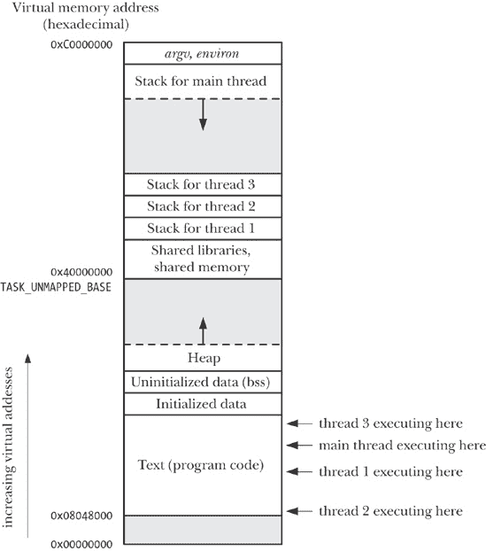

## 第二十九章。线程：介绍

在本章以及接下来的几章中，我们将介绍 POSIX 线程，通常称为*Pthreads*。我们不会尝试覆盖整个 Pthreads API，因为它相当庞大。关于线程的进一步信息来源将在本章末尾列出。

这些章节主要描述了为 Pthreads API 所规定的标准行为。在 Linux 中的 POSIX 线程实现中，我们将讨论两个主要的 Linux 线程实现——LinuxThreads 和本地 POSIX 线程库（NPTL）——在某些方面如何偏离标准。

在本章中，我们将概述线程的操作，然后介绍线程是如何创建的以及如何终止的。最后，我们将讨论在设计应用程序时，选择多线程方法与多进程方法的一些影响因素。

## 概述

与进程一样，线程是一种机制，允许应用程序同时执行多个任务。一个进程可以包含多个线程，如图 29-1 所示。所有这些线程独立地执行相同的程序，并且它们共享相同的全局内存，包括已初始化的数据、未初始化的数据和堆区。（传统的 UNIX 进程仅仅是多线程进程的一种特殊情况；它是一个仅包含一个线程的进程。）

### 注意

我们在图 29-1 中对情况做了一定的简化。特别是，线程的每个堆栈的位置可能与共享库和共享内存区域交织在一起，具体取决于线程创建的顺序、共享库的加载顺序以及共享内存区域的附加顺序。此外，线程堆栈的位置还可能会根据 Linux 发行版的不同而有所变化。

一个进程中的线程可以并发执行。在多处理器系统上，多个线程可以并行执行。如果一个线程在 I/O 操作上被阻塞，其他线程仍然可以执行。（虽然有时创建一个独立的线程专门执行 I/O 操作是有用的，但通常更倾向于使用我们在第六十三章中描述的替代 I/O 模型。）

图 29-1. 四个线程在进程中执行（Linux/x86-32）

在某些应用中，线程相较于进程提供了优势。考虑传统 UNIX 方法通过创建多个进程来实现并发的方式。一个例子是网络服务器设计，其中父进程接受来自客户端的连接，然后使用*fork()*创建一个单独的子进程来处理与每个客户端的通信（参考并发 TCP *回显*服务器）。这样的设计使得能够同时为多个客户端提供服务。虽然这种方法在许多场景中表现良好，但在某些应用中，它也存在以下局限：

+   在进程之间共享信息是困难的。由于父进程和子进程不共享内存（只共享只读文本段），我们必须使用某种形式的进程间通信来交换进程间的信息。

+   使用*fork()*创建进程的开销相对较大。即使采用了*fork()*的内存语义的内存语义")中描述的写时复制技术，仍然需要复制进程的各种属性，如页表和文件描述符表，因此*fork()*调用仍然是耗时的。

线程解决了这两个问题：

+   线程之间的信息共享既简单又快速。只需将数据复制到共享的（全局或堆）变量中即可。然而，为了避免多个线程试图更新相同信息时出现的问题，我们必须使用第三十章中描述的同步技术。

+   线程创建比进程创建要快——通常快十倍或更快。（在 Linux 上，线程是通过*clone()*系统调用实现的，且表 28-3、vfork()和 clone()创建 100,000 个进程所需的时间")，在进程创建速度一节中，展示了*fork()*和*clone()*之间的速度差异。）线程创建更快，因为许多必须在通过*fork()*创建的子进程中复制的属性，在线程之间是共享的。特别是，内存页的写时复制（copy-on-write）不再需要，也不需要复制页表。

除了全局内存外，线程还共享其他一些属性（即这些属性是进程级别的，而不是线程特定的）。这些属性包括：

+   进程 ID 和父进程 ID；

+   进程组 ID 和会话 ID；

+   控制终端；

+   进程凭证（用户和组 ID）；

+   打开的文件描述符；

+   使用*fcntl()*创建的记录锁；

+   信号处理方式；

+   与文件系统相关的信息：umask，当前工作目录和根目录；

+   间隔定时器 (*setitimer()*) 和 POSIX 定时器 (*timer_create()*)；

+   System V 信号量撤销 (*semadj*) 值 (信号量撤销值);

+   资源限制；

+   CPU 时间消耗（由 *times()* 返回）；

+   资源消耗（由 *getrusage()* 返回）；以及

+   nice 值（由 *setpriority()* 和 *nice()* 设置）。

每个线程特有的属性包括以下内容：

+   线程 ID (线程 ID);

+   信号屏蔽；

+   线程特定数据 (线程特定数据);

+   替代信号栈 (*sigaltstack()*);

+   *errno* 变量；

+   浮动点环境（参见 *fenv(3)*）；

+   实时调度策略和优先级 (实时进程调度概述 和 实时进程调度 API）；

+   CPU 亲和性（Linux 特有，详见 CPU 亲和性）；

+   能力（Linux 特有，详见 第三十九章）；

+   栈（局部变量和函数调用链接信息）。

### 注意

从图 29-1")中可以看出，所有每个线程的栈都位于相同的虚拟地址空间中。这意味着，给定合适的指针，线程可以在彼此的栈上共享数据。这在某些情况下很有用，但需要小心编程来处理由于局部变量仅在其所在的栈帧生命周期内有效所带来的依赖关系。（如果一个函数返回，则其栈帧使用的内存区域可能会被后续的函数调用重用。如果线程终止，则新线程可能会重用已终止线程的栈使用的内存区域。）未能正确处理此依赖关系可能会导致难以追踪的错误。

## Pthreads API 背景详细信息

在 1980 年代末和 1990 年代初，存在多种不同的线程 API。1995 年，POSIX.1c 标准化了 POSIX 线程 API，该标准后来被纳入了 SUSv3。

有几个概念适用于 Pthreads API，我们在详细查看 API 之前简要介绍这些概念。

#### Pthreads 数据类型

Pthreads API 定义了多种数据类型，其中一些在表 29-1 中列出。我们将在接下来的页面中描述这些数据类型中的大多数。

表 29-1. Pthreads 数据类型

| 数据类型 | 描述 |
| --- | --- |
| *pthread_t* | 线程标识符 |
| *pthread_mutex_t* | 互斥量 |
| *pthread_mutexattr_t* | 互斥量属性对象 |
| *pthread_cond_t* | 条件变量 |
| *pthread_condattr_t* | 条件变量属性对象 |
| *pthread_key_t* | 线程特定数据的键 |
| *pthread_once_t* | 一次性初始化控制上下文 |
| *pthread_attr_t* | 线程属性对象 |

SUSv3 没有指定这些数据类型应该如何表示，便携式程序应将其视为不透明数据。我们所说的意思是，程序应避免依赖于这些类型变量的结构或内容的知识。特别地，我们不能使用 C 语言的 *==* 操作符来比较这些类型的变量。

#### 线程和 *errno*

在传统的 UNIX API 中，*errno* 是一个全局整型变量。然而，这对于多线程程序来说是不够的。如果一个线程调用了返回错误的函数并将错误值存储在全局 *errno* 变量中，那么其他线程在调用函数并检查 *errno* 时会产生混淆。换句话说，竞态条件会发生。因此，在多线程程序中，每个线程都有自己的 *errno* 值。在 Linux 上，线程特定的 *errno* 通过类似于大多数其他 UNIX 实现的方式实现：*errno* 被定义为一个宏，展开成一个函数调用，返回一个可修改的左值，这个左值对于每个线程都是不同的。（由于左值是可修改的，因此在多线程程序中，仍然可以写出像 *errno = value* 这样的赋值语句。）

总结一下，*errno* 机制已经被适配到线程中，且错误报告方式与传统的 UNIX API 没有变化。

### 注意

原始的 POSIX.1 标准沿用了 K&R C 的用法，允许程序声明 *errno* 为 *extern int errno*。SUSv3 不允许这种用法（这一变化实际上发生在 1995 年，出现在 POSIX.1c 中）。如今，程序必须通过包含 `<errno.h>` 来声明 *errno*，这使得每个线程拥有自己的 *errno*。

#### 来自 Pthreads 函数的返回值

传统的系统调用和一些库函数返回状态的方法是：成功时返回 0，错误时返回-1，并将 *errno* 设置为指示错误的值。而 Pthreads API 中的函数则有所不同。所有 Pthreads 函数成功时返回 0，失败时返回一个正值。这个失败值是传统 UNIX 系统调用可以将其放入 *errno* 中的相同值之一。

因为线程程序中每次引用 *errno* 都会带来函数调用的开销，我们的示例程序不会直接将 Pthreads 函数的返回值赋给 *errno*。相反，我们使用一个中间变量并调用我们的 *errExitEN()* 诊断函数（常用函数和头文件），如下所示：

```
pthread_t *thread;
int s;

s = pthread_create(&thread, NULL, func, &arg);
if (s != 0)
    errExitEN(s, "pthread_create");
```

#### 编译 Pthreads 程序

在 Linux 上，使用 Pthreads API 的程序必须使用 *cc -pthread* 选项进行编译。此选项的效果包括以下几点：

+   定义了`_REENTRANT`预处理宏。这导致一些可重入函数的声明被暴露出来。

+   程序链接了*libpthread*库（相当于*-lpthread*）。

### 注意

编译多线程程序的精确选项在不同的实现（和编译器）之间有所不同。其他一些实现（例如，Tru64）也使用*cc -pthread*；Solaris 和 HP-UX 使用*cc -mt*。

## 线程创建

当程序启动时，结果进程由一个单独的线程组成，称为*初始*或*主*线程。在本节中，我们将讨论如何创建额外的线程。

*pthread_create()*函数用于创建一个新线程。

```
#include <pthread.h>

int `pthread_create`(pthread_t **thread*, const pthread_attr_t **attr*,
                   void *(**start*)(void *), void **arg*);
```

### 注意

成功时返回 0，出错时返回正的错误编号。

新线程通过调用由*start*标识的函数并传递参数*arg*（即，*start(arg)*）开始执行。调用*pthread_create()*的线程继续执行调用后的下一个语句。（这种行为与第 28.2 节中描述的*glibc*封装函数对*clone()*系统调用的行为相同。）

*arg*参数声明为*void **，这意味着我们可以将指向任何类型对象的指针传递给*start*函数。通常，*arg*指向全局或堆变量，但也可以指定为`NULL`。如果我们需要将多个参数传递给*start*，那么*arg*可以指定为指向包含参数的结构体的指针，每个参数作为独立的字段。通过适当的类型转换，我们甚至可以将*arg*指定为一个*int*。

### 注意

严格来说，C 标准并未定义将*int*转换为*void **或反之的结果。然而，大多数 C 编译器允许这些操作，并且它们会产生预期的结果；也就是说，*int j == (int) ((void *) j)*。

*start*的返回值同样是*void **类型，并且可以像*arg*参数一样使用。当我们描述*pthread_join()*函数时，将看到这个值的用法。

### 注意

使用类型转换后的整数作为线程启动函数的返回值时需要小心。原因是，`PTHREAD_CANCELED`是线程被取消时返回的值（参见第三十二章），通常是一些实现定义的整数值，转换为*void **。如果线程的启动函数返回相同的整数值，则在另一个执行*pthread_join()*的线程中，它会错误地显示该线程已被取消。在一个使用线程取消并选择从线程启动函数返回转换整数值的应用程序中，我们必须确保正常终止的线程不会返回一个与该 Pthreads 实现中的`PTHREAD_CANCELED`相匹配的整数值。一个便携的应用程序需要确保正常终止的线程不会返回与任何实现中的`PTHREAD_CANCELED`相匹配的整数值。

*thread*参数指向一个类型为*pthread_t*的缓冲区，在*pthread_create()*返回之前，将该线程的唯一标识符复制到该缓冲区中。该标识符可以在后续的 Pthreads 调用中用来引用该线程。

### 注意

SUSv3 明确指出，在新线程开始执行之前，实现不需要初始化*thread*指向的缓冲区；也就是说，新线程可以在*pthread_create()*返回给调用者之前就开始运行。如果新线程需要获取自己的 ID，则必须使用*pthread_self()*来获取（详见线程 ID）。

*attr*参数是一个指向*pthread_attr_t*对象的指针，指定新线程的各种属性。我们将在 29.8 节中进一步讨论这些属性。如果*attr*指定为`NULL`，则线程将使用各种默认属性创建，这也是本书大多数示例程序的做法。

在调用*pthread_create()*之后，程序无法保证哪个线程会接下来被调度使用 CPU（在多处理器系统上，两个线程可能同时在不同的 CPU 上执行）。依赖于特定调度顺序的程序可能会遇到我们在 24.4 节中描述的竞态条件。如果我们需要强制执行特定的执行顺序，必须使用第三十章中描述的某种同步技术。

## 线程终止

线程的执行终止有以下几种方式：

+   线程的启动函数执行一个`return`，为线程指定一个返回值。

+   线程调用*pthread_exit()*（如下所述）。

+   线程通过*pthread_cancel()*被取消（详见取消线程）。

+   如果任何线程调用了*exit()*，或者主线程执行`return`（在*main()*函数中），则导致进程中的所有线程立即终止。

*pthread_exit()*函数终止调用线程，并指定一个返回值，其他线程可以通过调用*pthread_join()*获取该返回值。

```
include <pthread.h>

void `pthread_exit`(void **retval*);
```

调用*pthread_exit()*相当于在线程的启动函数中执行`return`，不同之处在于*pthread_exit()*可以从线程启动函数调用的任何函数中调用。

*retval*参数指定线程的返回值。*retval*指向的值不应位于线程的栈上，因为线程终止时该栈的内容变为未定义（例如，该进程虚拟内存的那部分可能会立即被新线程的栈重新使用）。同样的声明也适用于线程启动函数中的`return`语句返回的值。

如果主线程调用*pthread_exit()*，而不是调用*exit()*或执行`return`，则其他线程将继续执行。

## 线程 ID

每个进程中的线程都有唯一的线程 ID。此 ID 会返回给 *pthread_create()* 的调用者，线程可以使用 *pthread_self()* 获取其自身的 ID。

```
include <pthread.h>

pthread_t `pthread_self`(void);
```

### 注意

返回调用线程的线程 ID

线程 ID 在应用程序中有以下几个用途：

+   各种 Pthreads 函数使用线程 ID 来标识它们要操作的线程。此类函数的示例包括 *pthread_join()*、*pthread_detach()*、*pthread_cancel()* 和 *pthread_kill()*，我们将在本章和随后的章节中描述这些函数。

+   在某些应用程序中，将动态数据结构标记为特定线程的 ID 可能是有用的。这可以用来标识创建或“拥有”该数据结构的线程，或者可以被一个线程用来标识一个特定的线程，随后让该线程对该数据结构执行某些操作。

*pthread_equal()* 函数允许我们检查两个线程 ID 是否相同。

```
include <pthread.h>

int `pthread_equal`(pthread_t *t1*, pthread_t *t2*);
```

### 注意

如果 *t1* 和 *t2* 相同，则返回非零值，否则返回 0

例如，为了检查调用线程的 ID 是否与保存在变量 *tid* 中的线程 ID 匹配，我们可以编写如下代码：

```
if (pthread_equal(tid, pthread_self())
    printf("tid matches self\n");
```

需要使用 *pthread_equal()* 函数，因为 *pthread_t* 数据类型必须作为不透明数据处理。在 Linux 中，*pthread_t* 恰好被定义为 *unsigned long*，但在其他实现中，它可能是一个指针或结构体。

### 注意

在 NPTL 中，*pthread_t* 实际上是一个已被强制转换为 *unsigned long* 的指针。

SUSv3 并不要求将 *pthread_t* 实现为标量类型；它可以是一个结构体。因此，我们不能移植性地使用如下代码来显示线程 ID（尽管它在许多实现中有效，包括 Linux，并且有时对调试有用）：

```
pthread_t thr;

printf("Thread ID = %ld\n", (long) thr);        /* WRONG! */
```

在 Linux 线程实现中，线程 ID 在进程间是唯一的。然而，在其他实现中情况未必如此，SUSv3 明确指出，应用程序不能便捷地使用线程 ID 来标识另一个进程中的线程。SUSv3 还指出，实现可以在终止的线程与 *pthread_join()* 连接后或一个分离的线程终止后，重新使用该线程的 ID。（我们将在下一节解释 *pthread_join()*，并在 29.7 节解释分离线程。）

### 注意

POSIX 线程 ID 与由 Linux 特定的 *gettid()* 系统调用返回的线程 ID 不相同。POSIX 线程 ID 是由线程实现分配和维护的。而 *gettid()* 返回的线程 ID 是由内核分配的一个数字（类似于进程 ID）。尽管在 Linux 的 NPTL 线程实现中，每个 POSIX 线程都有一个唯一的内核线程 ID，但应用程序通常不需要知道内核 ID（如果依赖于知道这些 ID，将无法移植）。

## 与终止线程连接

*pthread_join()* 函数等待由 *thread* 标识的线程终止。（如果该线程已经终止，*pthread_join()* 会立即返回。）此操作称为 *连接*。

```
include <pthread.h>

int `pthread_join`(pthread_t *thread*, void ***retval*);
```

### 注意

成功时返回 0，错误时返回正的错误号。

如果 *retval* 是一个非 `NULL` 指针，则它将接收已终止线程的返回值副本——即线程在执行 `return` 或调用 *pthread_exit()* 时指定的值。

调用 *pthread_join()* 来等待一个已经被等待过的线程 ID 可能会导致不可预测的行为；例如，它可能会连接到一个后来创建的线程，该线程恰好重新使用了相同的线程 ID。

如果线程没有被分离（参见 分离线程），则我们必须通过 *pthread_join()* 来连接该线程。如果未能这样做，则当线程终止时，它将产生与僵尸进程等效的线程（参见 孤儿和僵尸）。除了浪费系统资源外，如果积累了足够多的线程僵尸，我们将无法创建更多的线程。

*pthread_join()* 对线程执行的任务类似于 *waitpid()* 对进程执行的任务。然而，也有一些显著的不同之处：

+   线程是平等的。进程中的任何线程都可以使用 *pthread_join()* 来连接进程中的任何其他线程。例如，如果线程 A 创建了线程 B，线程 B 又创建了线程 C，那么线程 A 可以连接到线程 C，反之亦然。这与进程之间的层级关系不同。当父进程通过 *fork()* 创建子进程时，只有父进程可以对该子进程调用 *wait()*。调用 *pthread_create()* 的线程与新创建的线程之间没有这样的关系。

+   没有办法说“连接到任何线程”（对于进程，我们可以通过调用 *waitpid(-1, &status, options)* 来实现）；也没有办法执行非阻塞的连接（类似于 *waitpid()* 的 `WNOHANG` 标志）。可以通过条件变量实现类似的功能；我们在示例程序：连接任何已终止的线程中展示了一个例子。

### 注意

*pthread_join()* 只能与特定线程 ID 连接的限制是故意设计的。其思想是，程序应该只与它“知道”的线程进行连接。所谓“与任何线程连接”的操作存在问题，因为线程没有层次结构，所以这样的操作可能会连接到 *任何* 线程，包括由库函数私下创建的线程。（我们在 示例程序：连接任何已终止的线程 中展示的条件变量技术，允许线程只与它已知的其他线程连接。）因此，库将无法再与该线程连接以获取其状态，并且会错误地尝试连接一个已经连接的线程 ID。换句话说，“与任何线程连接”操作与模块化程序设计不兼容。

#### 示例程序

示例 29-1 中的程序创建了一个新线程，并与之连接。

示例 29-1. 一个使用 Pthreads 的简单程序

```
`threads/simple_thread.c`
#include <pthread.h>
#include "tlpi_hdr.h"

static void *
threadFunc(void *arg)
{
    char *s = (char *) arg;

    printf("%s", s);

    return (void *) strlen(s);
}

int
main(int argc, char *argv[])
{
    pthread_t t1;
    void *res;
    int s;

    s = pthread_create(&t1, NULL, threadFunc, "Hello world\n");
    if (s != 0)
        errExitEN(s, "pthread_create");

    printf("Message from main()\n");
    s = pthread_join(t1, &res);
    if (s != 0)
        errExitEN(s, "pthread_join");

    printf("Thread returned %ld\n", (long) res);

    exit(EXIT_SUCCESS);
}
      `threads/simple_thread.c`
```

当我们运行 示例 29-1 时，我们看到如下输出：

```
$ `./simple_thread`
Message from main()
Hello world
Thread returned 12
```

根据这两个线程的调度方式，前两行输出的顺序可能会被颠倒。

## 分离线程

默认情况下，线程是 *可连接的*，意味着当它终止时，其他线程可以通过 *pthread_join()* 获取其返回状态。有时，我们并不关心线程的返回状态；我们只是希望系统在线程终止时自动清理并移除该线程。在这种情况下，我们可以通过调用 *pthread_detach()* 并指定线程的标识符 *thread* 来将线程标记为 *已分离*。

```
#include <pthread.h>

int `pthread_detach`(pthread_t *thread*);
```

### 注意

成功时返回 0，出错时返回一个正的错误号码。

作为使用 *pthread_detach()* 的示例，线程可以通过以下调用将自己分离：

```
pthread_detach(pthread_self());
```

一旦线程被分离，就无法再使用 *pthread_join()* 获取其返回状态，并且该线程无法再次变为可连接状态。

分离线程并不会使其免疫于另一个线程调用 *exit()* 或主线程中的 `return`。在这种情况下，进程中的所有线程会立即终止，无论它们是可连接的还是已分离的。换句话说，*pthread_detach()* 只是控制线程终止后的行为，而不是控制线程如何或何时终止。

## 线程属性

我们之前提到过，*pthread_create() attr* 参数，其类型为 *pthread_attr_t*，可以用来指定创建新线程时使用的属性。我们不会深入讨论这些属性的细节（关于这些细节，请参见本章末尾列出的参考资料），也不会展示各种 Pthreads 函数的原型，这些函数可用于操作 *pthread_attr_t* 对象。我们只想提到，这些属性包括信息，例如线程堆栈的位置和大小、线程的调度策略和优先级（类似于实时进程调度概述和实时进程调度 API 中描述的进程实时调度策略和优先级），以及线程是否是可连接的或是分离的。

作为线程属性使用的示例，示例 29-2 中的代码创建了一个新的线程，并在创建时将其设置为分离状态（而不是随后通过 *pthread_detach()* 设置）。这段代码首先使用默认值初始化一个线程属性结构，设置创建分离线程所需的属性，然后使用该线程属性结构创建一个新线程。线程创建完成后，属性对象不再需要，因此被销毁。

示例 29-2. 创建具有分离属性的线程

```
*from* `threads/detached_attrib.c`
    pthread_t thr;
    pthread_attr_t attr;
    int s;

    s = pthread_attr_init(&attr);               /* Assigns default values */
    if (s != 0)
        errExitEN(s, "pthread_attr_init");

    s = pthread_attr_setdetachstate(&attr, PTHREAD_CREATE_DETACHED);
    if (s != 0)
        errExitEN(s, "pthread_attr_setdetachstate");

    s = pthread_create(&thr, &attr, threadFunc, (void *) 1);
    if (s != 0)
        errExitEN(s, "pthread_create");

    s = pthread_attr_destroy(&attr);            /* No longer needed */
    if (s != 0)
        errExitEN(s, "pthread_attr_destroy");
     *from* `threads/detached_attrib.c`
```

## 线程与进程

在本节中，我们简要考虑了一些可能影响我们选择将应用程序实现为一组线程还是一组进程的因素。我们首先考虑多线程方法的优点：

+   线程之间共享数据非常容易。相比之下，进程之间共享数据需要更多的工作（例如，创建共享内存段或使用管道）。

+   线程创建比进程创建更快；线程的上下文切换时间可能低于进程的上下文切换时间。

使用线程相较于使用进程可能存在一些缺点：

+   在使用线程进行编程时，我们需要确保调用的函数是线程安全的，或者以线程安全的方式调用。（我们在第 31.1 节中描述了线程安全的概念。）多进程应用程序则不需要考虑这一点。

+   一个线程中的 bug（例如，通过错误的指针修改内存）可能会损害进程中所有线程的正常运行，因为它们共享相同的地址空间和其他属性。相比之下，进程之间相对更为隔离。

+   每个线程都在争夺宿主进程有限的虚拟地址空间。特别是，每个线程的栈和线程特定数据（或线程局部存储）占用了进程虚拟地址空间的一部分，因此这些空间对其他线程不可用。虽然可用的虚拟地址空间很大（例如，在 x86-32 架构上通常为 3GB），但对于使用大量线程或需要大量内存的线程的进程来说，这个因素可能是一个显著的限制。相比之下，独立的进程可以各自使用整个可用的虚拟内存范围（受 RAM 和交换空间限制）。

以下是一些可能影响我们选择线程与进程的其他因素：

+   在多线程应用程序中处理信号需要小心设计。（作为一般原则，通常应该避免在多线程程序中使用信号。）我们将在第 33.2 节中详细讨论线程和信号。

+   在多线程应用程序中，所有线程必须运行相同的程序（尽管可能是不同的函数）。而在多进程应用程序中，不同的进程可以运行不同的程序。

+   除了数据之外，线程还共享某些其他信息（例如，文件描述符、信号处理方式、当前工作目录以及用户和组 ID）。这可能是一个优点，也可能是一个缺点，具体取决于应用程序。

## 总结

在一个多线程的进程中，多个线程并发地执行相同的程序。所有线程共享相同的全局变量和堆变量，但每个线程有一个私有栈用于局部变量。进程中的线程还共享其他一些属性，包括进程 ID、打开的文件描述符、信号处理方式、当前工作目录和资源限制。

线程和进程之间的主要区别在于线程提供的信息共享更为便捷，这也是一些应用设计更适合多线程设计而不是多进程设计的主要原因。线程还可以为某些操作提供更好的性能（例如，线程创建比进程创建更快），但这个因素通常在选择线程与进程时并不是最重要的。

线程是通过*pthread_create()*创建的。然后每个线程可以独立地通过*pthread_exit()*终止。（如果任何线程调用*exit()*，则所有线程都会立即终止。）除非线程被标记为分离状态（例如，通过调用*pthread_detach()*），否则必须由另一个线程使用*pthread_join()*进行连接，该函数返回连接线程的终止状态。

#### 进一步的信息

[Butenhof, 1996] 提供了易读且全面的 Pthreads 讲解。[Robbins & Robbins, 2003] 也对 Pthreads 进行了很好的覆盖。[Tanenbaum, 2007] 提供了一个更为理论性的线程概念介绍，涵盖了诸如互斥锁、临界区、条件变量、死锁检测与避免等主题。[Vahalia, 1996] 提供了线程实现的背景知识。

## 练习

1.  如果一个线程执行以下代码，可能会出现哪些结果：

    ```
    pthread_join(pthread_self(), NULL);
    ```

    编写一个程序，看看在 Linux 上实际发生了什么。如果我们有一个包含线程 ID 的变量 *tid*，线程如何防止自己调用 *pthread_join(tid, NULL)*，这个调用与上面的语句等价？

1.  除了缺少错误检查以及各种变量和结构声明外，下面这个程序存在哪些问题？

    ```
    static void *
    threadFunc(void *arg)
    {
        struct someStruct *pbuf = (struct someStruct *) arg;

        /* Do some work with structure pointed to by 'pbuf' */
    }

    int
    main(int argc, char *argv[])
    {
        struct someStruct buf;

        pthread_create(&thr, NULL, threadFunc, (void *) &buf);
        pthread_exit(NULL);
    }
    ```
