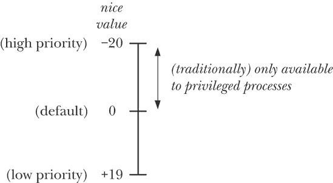

## 第三十五章 进程优先级与调度

本章讨论了各种系统调用和进程属性，这些属性决定了何时以及哪些进程可以访问 CPU。我们首先描述了*nice*值，它是一个进程特性，影响内核调度器为进程分配的 CPU 时间量。接着，我们介绍了 POSIX 实时调度 API。该 API 允许我们定义调度进程时使用的策略和优先级，从而对进程如何分配到 CPU 上提供更紧密的控制。最后，我们讨论了设置进程 CPU 亲和性掩码的系统调用，CPU 亲和性掩码决定了在多处理器系统上运行的进程将在哪些 CPU 上运行。

## 进程优先级（Nice 值）

在 Linux 中，和大多数其他 UNIX 实现一样，调度进程使用 CPU 的默认模型是 *轮转时间共享*。在这个模型下，每个进程依次被允许使用 CPU 一段简短的时间，这段时间被称为 *时间片* 或 *量子*。轮转时间共享满足了交互式多任务系统的两个重要要求：

+   *公平性*：每个进程都能获得 CPU 的一部分。

+   *响应性*：进程不需要长时间等待才能使用 CPU。

在轮转时间共享算法下，进程无法直接控制自己何时以及能使用 CPU 多长时间。默认情况下，每个进程依次获得 CPU 使用权，直到其时间片耗尽或自愿放弃 CPU（例如，通过使自己休眠或执行磁盘读取）。如果所有进程都尽可能多地使用 CPU（即，没有进程会休眠或阻塞 I/O 操作），那么它们将大致平等地分配到 CPU。

然而，有一个进程属性——*nice 值*，允许进程间接影响内核的调度算法。每个进程都有一个 nice 值，范围从 -20（高优先级）到 +19（低优先级）；默认值为 0（参见 图 35-1）。在传统的 UNIX 实现中，只有具有特权的进程才能为自己（或其他进程）分配一个负数（高）优先级。（我们将在 修改和检索策略与优先级 中解释一些 Linux 的差异。）无特权的进程只能通过设置比默认值 0 更大的 nice 值来降低其优先级。通过这样做，它们“对其他进程友好”，这一事实也给该属性起了这个名字。

nice 值通过 *fork()* 创建的子进程继承，并在 *exec()* 调用时保持不变。

### 注意

*getpriority()* 系统调用服务例程并不返回实际的 nice 值，而是返回一个介于 1（低优先级）和 40（高优先级）之间的数字，计算公式为 *unice = 20 - knice*。这样做是为了避免系统调用服务例程返回负值，负值用于表示错误。（参见 3.1 节中对系统调用服务例程的描述。）应用程序不会意识到系统调用服务例程返回的值已经被操控，因为 C 库中的 *getpriority()* 包装函数会将计算反转，返回 *20 - unice* 的值给调用程序。

图 35-1. 进程 nice 值的范围和解释

#### nice 值的影响

进程的调度不是严格按照 nice 值的层级顺序进行的；相反，nice 值作为一个加权因子，使内核调度器倾向于优先调度优先级较高的进程。将进程设置为低优先级（即，高 nice 值）不会导致其完全无法获得 CPU，但会使其相对获得较少的 CPU 时间。nice 值对进程调度的影响在不同版本的 Linux 内核以及不同的 UNIX 系统之间有所不同。

### 注意

从内核 2.6.23 开始，一种新的内核调度算法意味着，相较于以前的内核，nice 值之间的相对差异对调度的影响要强得多。因此，具有较低 nice 值的进程比以前获得的 CPU 时间要少，而具有较高 nice 值的进程则获得更多的 CPU 时间。

#### 检索和修改优先级

*getpriority()* 和 *setpriority()* 系统调用允许进程检索和更改自身或其他进程的 nice 值。

```
#include <sys/resource.h>

int `getpriority`(int *which*, id_t *who*);
```

### 注意

成功时返回指定进程的（可能为负的）nice 值，出错时返回 -1

```
int `setpriority`(int *which*, id_t *who*, int *prio*);
```

### 注意

成功时返回 0，出错时返回 -1

这两个系统调用都接受 *which* 和 *who* 作为参数，用于标识需要获取或修改优先级的进程。*which* 参数决定了如何解释 *who*。该参数的值可以是以下之一：

`PRIO_PROCESS`

对进程进行操作，该进程的进程 ID 等于 *who*。如果 *who* 为 0，则使用调用者的进程 ID。

`PRIO_PGRP`

对进程组中所有进程进行操作，该进程组的进程组 ID 等于 *who*。如果 *who* 为 0，则使用调用者的进程组。

`PRIO_USER`

对所有真实用户 ID 等于 *who* 的进程进行操作。如果 *who* 为 0，则使用调用者的真实用户 ID。

*id_t* 数据类型用于 *who* 参数，是一种足够大的整数类型，可以容纳进程 ID 或用户 ID。

*getpriority()* 系统调用返回由 *which* 和 *who* 指定的进程的 nice 值。如果有多个进程匹配指定的标准（例如 *which* 为 `PRIO_PGRP` 或 `PRIO_USER`），则返回优先级最高（即数值最小）的进程的 nice 值。由于 *getpriority()* 在成功调用时可能合法地返回 -1，我们必须通过在调用前将 *errno* 设置为 0，然后在调用后检查 -1 的返回状态和非零的 *errno* 值来检测错误。

*setpriority()* 系统调用将由 *which* 和 *who* 指定的进程的 nice 值设置为 *prio* 中指定的值。尝试将 nice 值设置为超出允许范围的数字（-20 到 +19）将被默默地限制在这个范围内。

### 注意

历史上，nice 值是通过调用 *nice(incr)* 来更改的，该调用将 *incr* 添加到调用进程的 nice 值。这个函数仍然可用，但已经被更通用的 *setpriority()* 系统调用所取代。

*setpriority()* 的命令行类似命令是 *nice(1)*，普通用户可以使用它来以较低的优先级运行命令，而特权用户可以用它来以提高的优先级运行命令；*renice(8)* 可以由超级用户用来更改现有进程的 nice 值。

一个具有特权的（`CAP_SYS_NICE`）进程可以更改任何进程的优先级。一个没有特权的进程可以更改其自身的优先级（通过将 *which* 设置为 `PRIO_PROCESS`，*who* 设置为 0），或者如果其有效用户 ID 与目标进程的实际用户 ID 或有效用户 ID 匹配，则可以更改另一个（目标）进程的优先级。Linux 中的 *setpriority()* 权限规则与 SUSv3 不同，SUSv3 规定没有特权的进程可以更改另一个进程的优先级，只要其实际用户 ID 或有效用户 ID 与目标进程的有效用户 ID 匹配。UNIX 的实现对此点有所不同。一些遵循 SUSv3 规则，而另一些，尤其是 BSD 系统，行为与 Linux 相同。

### 注意

在 Linux 2.6.12 之前的内核中，无特权进程对 *setpriority()* 的调用权限规则与后来的内核不同（并且也与 SUSv3 偏离）。一个没有特权的进程可以更改另一个进程的优先级，只要其实际用户 ID 与目标进程的实际用户 ID 匹配。从 Linux 2.6.12 开始，权限检查被修改为与 Linux 上其他类似的 API（如 *sched_setscheduler()* 和 *sched_setaffinity()*）一致。

在 Linux 2.6.12 之前的内核中，一个没有特权的进程只能使用 *setpriority()* 来（不可逆地）降低其自身或其他进程的 nice 值。一个具有特权的（`CAP_SYS_NICE`）进程可以使用 *setpriority()* 来提高 nice 值。

从内核版本 2.6.12 开始，Linux 提供了`RLIMIT_NICE`资源限制，允许无特权进程提高 nice 值。无特权进程可以将自己的 nice 值提高到由公式*20 - rlim_cur*指定的最大值，其中*rlim_cur*是当前的`RLIMIT_NICE`软资源限制。例如，如果进程的`RLIMIT_NICE`软限制为 25，则其 nice 值可以提高到 -5。从这个公式以及 nice 值的范围是+19（低）到-20（高）这一已知信息中，我们可以推断出`RLIMIT_NICE`限制的有效可用范围是 1（低）到 40（高）。（`RLIMIT_NICE`不使用+19 到-20 的数字范围，因为一些负值资源限制有特殊含义——例如，`RLIM_INFINITY`与-1 有相同的表示。）

一个无特权进程可以调用*setpriority()*来改变另一个（目标）进程的 nice 值，前提是调用*setpriority()*的进程的有效用户 ID 与目标进程的实际或有效用户 ID 匹配，并且对 nice 值的更改符合目标进程的`RLIMIT_NICE`限制。

示例 35-1 中的程序使用*setpriority()*来改变通过命令行参数指定的进程的 nice 值（这些参数对应于*setpriority()*的参数），然后调用*getpriority()*来验证更改。

示例 35-1. 修改和检索进程的 nice 值

```
`procpri/t_setpriority.c`
#include <sys/time.h>
#include <sys/resource.h>
#include "tlpi_hdr.h"

int
main(int argc, char *argv[])
{
    int which, prio;
    id_t who;
    if (argc != 4 || strchr("pgu", argv[1][0]) == NULL)
        usageErr("%s {p|g|u} who priority\n"
                "    set priority of: p=process; g=process group; "
                "u=processes for user\n", argv[0]);

    /* Set nice value according to command-line arguments */

    which = (argv[1][0] == 'p') ? PRIO_PROCESS :
                (argv[1][0] == 'g') ? PRIO_PGRP : PRIO_USER;
    who = getLong(argv[2], 0, "who");
    prio = getInt(argv[3], 0, "prio");

    if (setpriority(which, who, prio) == -1)
        errExit("getpriority");

    /* Retrieve nice value to check the change */

    errno = 0;                  /* Because successful call may return -1 */
    prio = getpriority(which, who);
    if (prio == -1 && errno != 0)
        errExit("getpriority");

    printf("Nice value = %d\n", prio);

    exit(EXIT_SUCCESS);
}
      `procpri/t_setpriority.c`
```

## 实时进程调度概述

标准的内核调度算法通常能为系统中运行的交互式和后台进程的混合提供足够的性能和响应能力。然而，实时应用程序对调度器有更严格的要求，主要包括以下几点：

+   实时应用程序必须为外部输入提供一个保证的最大响应时间。在许多情况下，这些保证的最大响应时间必须非常短（例如，达到几分之一秒的数量级）。例如，车辆导航系统的响应迟缓可能会导致灾难性后果。为了满足这一要求，内核必须提供一个机制，使高优先级进程能够及时获取 CPU 控制权，抢占任何当前可能正在运行的进程。

    ### 注意

    一个时间敏感的应用程序可能需要采取其他措施，以避免不可接受的延迟。例如，为了避免因页面错误导致的延迟，应用程序可以使用*mlock()*或*mlockall()*（在内存锁定：*mlock()*和*mlockall()*和 mlockall()")中描述）将其所有虚拟内存锁定到 RAM 中。

+   高优先级进程应能够保持对 CPU 的独占访问，直到它完成任务或自愿放弃 CPU。

+   实时应用程序应该能够控制其各个组件进程的精确调度顺序。

SUSv3 指定了一个实时进程调度 API（最初定义于 POSIX.1b），该 API 部分地解决了这些需求。该 API 提供了两种实时调度策略：`SCHED_RR` 和 `SCHED_FIFO`。运行在这两种策略下的进程总是优先于使用标准轮转时间共享策略（在进程优先级（Nice 值）")中描述的）调度的进程，这些进程的调度策略被实时调度 API 识别为常量 `SCHED_OTHER`。

每种实时策略都允许一系列的优先级级别。SUSv3 要求实现至少提供 32 个离散的实时优先级。在每个调度策略中，具有更高优先级的可运行进程总是优先于较低优先级的进程获取 CPU 访问权限。

### 注意

需要对“具有更高优先级的可运行进程总是优先于较低优先级进程”这一说法进行修正，特别是对于多处理器 Linux 系统（包括超线程系统）。在多处理器系统中，每个 CPU 都有一个独立的运行队列（这比单一的系统级全局队列能提供更好的性能），进程的优先级仅在每个 CPU 的运行队列内起作用。例如，在一个双处理器系统上，有三个进程，进程 A（实时优先级 20）可能会在 CPU 0 上排队，等待执行，尽管此时 CPU 0 正在运行优先级为 30 的进程 B，而 CPU 1 正在运行优先级为 10 的进程 C。

使用多个进程（或线程）的实时应用程序可以使用在 CPU 亲和性中描述的 CPU 亲和性 API，以避免因调度行为可能导致的问题。例如，在一个四处理器系统中，所有非关键进程可以被隔离到单个 CPU 上，剩余的三个 CPU 可供应用程序使用。

Linux 提供了 99 个实时优先级，从 1（最低）到 99（最高），这一范围适用于两种实时调度策略。在每种策略中的优先级是等价的。这意味着，假设有两个优先级相同的进程，一个运行在 `SCHED_RR` 策略下，另一个运行在 `SCHED_FIFO` 策略下，哪个进程将成为下一个可执行进程，取决于它们的调度顺序。实际上，每个优先级级别都维护着一个可运行进程的队列，下一步执行的进程从最高优先级且非空队列的前端选出。

#### POSIX 实时与硬实时

开头列出的所有要求都符合的应用程序有时被称为*硬*实时应用程序。然而，POSIX 实时进程调度 API 并不能满足所有这些要求。特别是，它没有为应用程序提供保证输入处理响应时间的方法。要实现这样的保证，需要操作系统具备一些并非 Linux 主线内核（或大多数其他标准操作系统）的一部分的特性。POSIX API 仅提供了所谓的*软*实时功能，使我们能够控制哪些进程被调度使用 CPU。

为硬实时应用程序提供支持是困难的，因为这会在不影响典型桌面和服务器系统上大多数应用程序的时间共享性能要求的情况下，给系统带来额外的开销。这也是为什么大多数 UNIX 内核——包括历史上的 Linux——并没有原生支持实时应用程序。然而，从大约 2.6.18 版本开始，Linux 内核加入了多项特性，最终目标是使 Linux 原生支持硬实时应用程序，而不会给时间共享操作带来上述开销。

### `SCHED_RR`策略

在`SCHED_RR`（轮转调度）策略下，具有相同优先级的进程按照轮转时间共享的方式执行。每次进程使用 CPU 时，都会获得一个固定长度的时间片。一旦被调度，采用`SCHED_RR`策略的进程将保持对 CPU 的控制，直到以下情况之一发生：

+   它达到了时间片的末尾；

+   它主动放弃 CPU，可能是通过执行一个阻塞系统调用或调用*sched_yield()*系统调用（详见放弃 CPU）；

+   它终止；或者

+   它被一个更高优先级的进程抢占。

对于上述前两个事件，当在`SCHED_RR`策略下运行的进程失去对 CPU 的访问时，它将被放置在其优先级级别的队列末尾。在最后一种情况下，当更高优先级的进程停止执行时，被抢占的进程将继续执行，消耗其剩余的时间片（即，被抢占的进程仍然位于其优先级级别队列的前端）。

在`SCHED_RR`和`SCHED_FIFO`策略中，当前运行的进程可能会因以下原因之一被抢占：

+   一个被阻塞的高优先级进程变得不再阻塞（例如，等待的 I/O 操作完成）；

+   另一个进程的优先级被提升到比当前运行进程更高的水平；或者

+   当前运行进程的优先级被降低到比其他可运行进程更低的值。

`SCHED_RR` 策略类似于标准的轮询时间分片调度算法（`SCHED_OTHER`），允许一组具有相同优先级的进程共享 CPU 访问权限。最显著的区别是存在严格区分的优先级级别，高优先级的进程总是优先于低优先级的进程。相比之下，较低的 nice 值（即高优先级）并不会赋予进程独占 CPU 的权限；它仅仅是在调度决策中赋予进程一个有利的权重。如在进程优先级（Nice 值）中所述，低优先级的进程（即高 nice 值）始终会获得至少一些 CPU 时间。另一个重要的区别是，`SCHED_RR` 策略允许我们精确控制进程调度的顺序。

### `SCHED_FIFO` 策略

`SCHED_FIFO`（先进先出）策略类似于 `SCHED_RR` 策略。主要区别在于没有时间片。一旦 `SCHED_FIFO` 进程获得 CPU 访问权限，它会一直执行，直到以下任一情况发生：

+   它会自愿释放 CPU（与上述 `SCHED_FIFO` 策略中的描述相同）；

+   它终止；或者

+   它被一个更高优先级的进程抢占（与上述 `SCHED_FIFO` 策略描述的情况相同）。

在第一种情况下，进程会被放置在其优先级级别队列的末尾。在最后一种情况下，当高优先级进程停止执行（通过阻塞或终止）时，抢占的进程继续执行（即抢占的进程仍然保持在其优先级级别队列的头部）。

### `SCHED_BATCH` 和 `SCHED_IDLE` 策略

Linux 2.6 内核系列新增了两种非标准的调度策略：`SCHED_BATCH` 和 `SCHED_IDLE`。尽管这些策略是通过 POSIX 实时调度 API 设置的，但它们实际上并不是实时策略。

`SCHED_BATCH` 策略是在内核 2.6.16 中新增的，它与默认的 `SCHED_OTHER` 策略类似。区别在于，`SCHED_BATCH` 策略会使那些频繁唤醒的任务被调度得更少。这种策略适用于批处理风格的进程执行。

`SCHED_IDLE` 策略是在内核 2.6.23 中新增的，它也类似于 `SCHED_OTHER`，但提供了相当于非常低 nice 值（即低于 +19）的功能。此策略下，进程的 nice 值没有意义。它用于运行低优先级任务，这些任务只有在系统中没有其他任务需要 CPU 时，才会获得 CPU 的大部分时间。

## 实时进程调度 API

我们现在来看看构成实时进程调度 API 的各种系统调用。这些系统调用允许我们控制进程的调度策略和优先级。

### 注意

尽管实时调度自 Linux 内核 2.0 版本起就已成为其一部分，但该实现中存在的多个问题在很长一段时间内未能解决。许多实现中的特性在 2.2 内核中存在缺陷，甚至在早期的 2.4 内核中也未得到修复。大多数问题在大约内核 2.4.20 版本时得到纠正。

### 实时优先级范围

*sched_get_priority_min()* 和 *sched_get_priority_max()* 系统调用返回可用的调度策略优先级范围。

```
#include <sched.h>

int `sched_get_priority_min`(int *policy*);
int `sched_get_priority_max`(int *policy*);
```

### 注意

成功时返回非负整数优先级，错误时返回 -1

对于这两个系统调用，*policy* 指定我们希望获取信息的调度策略。对于此参数，我们指定 `SCHED_RR` 或 `SCHED_FIFO`。*sched_get_priority_min()* 系统调用返回指定策略的最小优先级，而 *sched_get_priority_max()* 返回最大优先级。在 Linux 中，这些系统调用分别为 `SCHED_RR` 和 `SCHED_FIFO` 策略返回 1 和 99。换句话说，这两种实时策略的优先级范围完全重合，具有相同优先级的 `SCHED_RR` 和 `SCHED_FIFO` 进程在调度时的资格相同。（首先被调度的进程取决于它们在该优先级级别队列中的顺序。）

实时优先级的范围在不同的 UNIX 实现之间有所不同。因此，我们不应将优先级值硬编码到应用程序中，而应根据这些函数的返回值来指定优先级。比如，最低的 `SCHED_RR` 优先级应指定为 *sched_get_priority_min(SCHED_FIFO)*，下一个更高的优先级指定为 *sched_get_priority_min(SCHED_FIFO) + 1*，依此类推。

### 注意

SUSv3 并未要求 `SCHED_RR` 和 `SCHED_FIFO` 策略使用相同的优先级范围，但大多数 UNIX 实现采用相同的范围。例如，在 Solaris 8 中，两个策略的优先级范围是 0 到 59，而在 FreeBSD 6.1 中则是 0 到 31。

### 修改和检索策略与优先级

本节我们将讨论修改和检索调度策略与优先级的系统调用。

#### 修改调度策略和优先级

*sched_setscheduler()* 系统调用更改指定进程 ID 为 *pid* 的进程的调度策略和优先级。如果 *pid* 被指定为 0，则更改调用进程的属性。

```
#include <sched.h>

int `sched_setscheduler`(pid_t *pid*, int *policy*,
 const struct sched_param **param*);
```

### 注意

成功时返回 0，错误时返回 -1

*param* 参数是指向以下形式结构体的指针：

```
struct sched_param {
     int sched_priority;        /* Scheduling priority */
};
```

SUSv3 定义了 *param* 参数为一个结构，允许实现包含额外的特定实现字段，这在实现提供额外调度策略时可能很有用。然而，像大多数 UNIX 实现一样，Linux 仅提供 *sched_priority* 字段，用于指定调度优先级。对于 `SCHED_RR` 和 `SCHED_FIFO` 策略，该值必须在 *sched_get_priority_min()* 和 *sched_get_priority_max()* 指定的范围内；对于其他策略，优先级必须为 0。

*policy* 参数决定了进程的调度策略。它作为 表 35-1 中显示的策略之一来指定。

表 35-1. Linux 实时和非实时调度策略

| 策略 | 描述 | SUSv3 |
| --- | --- | --- |
| `SCHED_FIFO` | 实时先到先服务 | • |
| `SCHED_RR` | 实时轮转调度 | • |
| `SCHED_OTHER` | 标准轮转时间共享 | • |
| `SCHED_BATCH` | 类似于 `SCHED_OTHER`，但用于批处理执行（自 Linux 2.6.16 起） |   |
| `SCHED_IDLE` | 类似于 `SCHED_OTHER`，但优先级比 nice 值 +19 还低（自 Linux 2.6.23 起） |   |

成功的 *sched_setscheduler()* 调用会将由 *pid* 指定的进程移至其优先级级别队列的末尾。

SUSv3 指定成功的 *sched_setscheduler()* 调用的返回值应为之前的调度策略。然而，Linux 偏离了标准，成功的调用返回 0。便携式应用程序应该通过检查返回状态不是 -1 来测试成功。

调度策略和优先级会被通过 *fork()* 创建的子进程继承，并且会在 *exec()* 调用中保持不变。

*sched_setparam()* 系统调用提供了 *sched_setscheduler()* 功能的一个子集。它修改进程的调度优先级，而不改变调度策略。

```
#include <sched.h>

int `sched_setparam`(pid_t *pid*, const struct sched_param **param*);
```

### 注意

成功时返回 0，出错时返回 -1

*pid* 和 *param* 参数与 *sched_setscheduler()* 中相同。

成功的 *sched_setparam()* 调用会将由 *pid* 指定的进程移至其优先级级别队列的末尾。

示例 35-2 中的程序使用 *sched_setscheduler()* 来设置通过命令行参数指定的进程的策略和优先级。第一个参数是一个字母，指定调度策略，第二个参数是整数优先级，剩余的参数是要更改调度属性的进程 ID。

示例 35-2. 修改进程调度策略和优先级

```
`procpri/sched_set.c`
#include <sched.h>
#include "tlpi_hdr.h"

int
main(int argc, char *argv[])
{
    int j, pol;
    struct sched_param sp;

    if (argc < 3 || strchr("rfo", argv[1][0]) == NULL)
        usageErr("%s policy priority [pid...]\n"
                "    policy is 'r' (RR), 'f' (FIFO), "
#ifdef SCHED_BATCH              /* Linux-specific */
                "'b' (BATCH), "
#endif
#ifdef SCHED_IDLE               /* Linux-specific */
                "'i' (IDLE), "
#endif
                "or 'o' (OTHER)\n",
                argv[0]);

    pol = (argv[1][0] == 'r') ? SCHED_RR :
                (argv[1][0] == 'f') ? SCHED_FIFO :
#ifdef SCHED_BATCH
                (argv[1][0] == 'b') ? SCHED_BATCH :
#endif
#ifdef SCHED_IDLE
                (argv[1][0] == 'i') ? SCHED_IDLE :
#endif
                SCHED_OTHER;
    sp.sched_priority = getInt(argv[2], 0, "priority");

    for (j = 3; j < argc; j++)
        if (sched_setscheduler(getLong(argv[j], 0, "pid"), pol, &sp) == -1)
            errExit("sched_setscheduler");

    exit(EXIT_SUCCESS);
}
     `procpri/sched_set.c`
```

#### 影响调度参数更改的权限和资源限制

在 2.6.12 之前的内核中，进程通常必须具有特权（`CAP_SYS_NICE`）才能更改调度策略和优先级。唯一的例外是，如果调用者的有效用户 ID 与目标进程的实际或有效用户 ID 匹配，则无特权的进程可以将进程的调度策略更改为 `SCHED_OTHER`。

自内核版本 2.6.12 起，设置实时调度策略和优先级的规则发生了变化，新增了一个非标准资源限制 `RLIMIT_RTPRIO`。与较早版本的内核一样，特权进程（`CAP_SYS_NICE`）可以对任何进程的调度策略和优先级进行任意更改。然而，无特权进程也可以根据以下规则更改调度策略和优先级：

+   如果进程的 `RLIMIT_RTPRIO` 软限制非零，那么它可以对其调度策略和优先级进行任意更改，但前提是它可以设置的实时优先级上限为其当前实时优先级（如果进程当前使用实时策略）和 `RLIMIT_RTPRIO` 软限制的最大值。

+   如果进程的 `RLIMIT_RTPRIO` 软限制值为 0，那么它能进行的唯一更改是降低其实时调度优先级或从实时策略切换到非实时策略。

+   `SCHED_IDLE` 策略是特殊的。正在使用该策略的进程无法对其策略进行任何更改，无论 `RLIMIT_RTPRIO` 资源限制的值如何。

+   策略和优先级的更改也可以由另一个无特权进程执行，只要该进程的有效用户 ID 与目标进程的实际或有效用户 ID 匹配。

+   进程的软 `RLIMIT_RTPRIO` 限制仅决定该进程自身的调度策略和优先级可以进行哪些更改，无论是由该进程自身还是由其他无特权进程进行。非零限制不会赋予无特权进程更改其他进程调度策略和优先级的能力。

### 注意

从内核版本 2.6.25 开始，Linux 引入了实时调度组的概念，可以通过 `CONFIG_RT_GROUP_SCHED` 内核选项进行配置，该选项还会影响设置实时调度策略时可以进行的更改。详情请参见内核源文件 `Documentation/scheduler/sched-rt-group.txt`。

#### 检索调度策略和优先级

*sched_getscheduler()* 和 *sched_getparam()* 系统调用用于检索进程的调度策略和优先级。

```
#include <sched.h>

int `sched_getscheduler`(pid_t *pid*);
```

### 注意

返回调度策略，出错时返回 -1

```
int `sched_getparam`(pid_t *pid*, struct sched_param **param*);
```

### 注意

成功时返回 0，出错时返回 -1

对于这两个系统调用，*pid* 参数指定要检索信息的进程 ID。如果 *pid* 为 0，则检索调用进程的信息。这两个系统调用都可以被无特权进程用来检索任何进程的信息，无论其凭证如何。

*sched_getparam()*系统调用返回指定进程的实时优先级，该优先级存储在*sched_param*结构体的*sched_priority*字段中，*param*指向该结构体。

在成功执行后，*sched_getscheduler()*会返回表 35-1 中显示的策略之一。

示例 35-3 中的程序使用*sched_getscheduler()*和*sched_getparam()*来检索所有通过命令行参数给定的进程 ID 的策略和优先级。以下的 shell 会话演示了如何使用该程序，以及示例 35-2 中的程序：

```
$ `su`                          *Assume privilege so we can set realtime policies*
Password:
# `sleep 100 &`                 *Create a process*
[1] 2006
# `./sched_view 2006`           *View initial policy and priority of*
 *sleep* *process*
2006: OTHER  0
# `./sched_set f 25 2006`       *Switch process to*
SCHED_FIFO *policy, priority 25*
# `./sched_view 2006`           *Verify change*
2006: FIFO  25
```

示例 35-3. 检索进程调度策略和优先级

```
`procpri/sched_view.c`
#include <sched.h>
#include "tlpi_hdr.h"

int
main(int argc, char *argv[])
{
    int j, pol;
    struct sched_param sp;

    for (j = 1; j < argc; j++) {
        pol = sched_getscheduler(getLong(argv[j], 0, "pid"));
        if (pol == -1)
            errExit("sched_getscheduler");

        if (sched_getparam(getLong(argv[j], 0, "pid"), &sp) == -1)
            errExit("sched_getparam");

        printf("%s: %-5s %2d\n", argv[j],
                (pol == SCHED_OTHER) ? "OTHER" :
                (pol == SCHED_RR) ? "RR" :
                (pol == SCHED_FIFO) ? "FIFO" :
#ifdef SCHED_BATCH              /* Linux-specific */
                (pol == SCHED_BATCH) ? "BATCH" :
#endif
#ifdef SCHED_IDLE               /* Linux-specific */
                (pol == SCHED_IDLE) ? "IDLE" :
#endif
                "???", sp.sched_priority);
    }

    exit(EXIT_SUCCESS);
}
     `procpri/sched_view.c`
```

#### 防止实时进程锁死系统

由于`SCHED_RR`和`SCHED_FIFO`进程会抢占任何低优先级的进程（例如，运行程序的 shell），因此在开发使用这些策略的应用程序时，我们需要意识到一个可能性：一个失控的实时进程可能会通过占用 CPU 锁死系统。从编程角度来看，有几种方法可以避免这种情况：

+   使用*setrlimit()*设置一个适当低的软 CPU 时间资源限制（`RLIMIT_CPU`，详见具体资源限制的详细信息）。如果进程消耗了过多的 CPU 时间，它将收到一个`SIGXCPU`信号，默认情况下会终止该进程。

+   使用*alarm()*设置一个定时器。如果进程继续运行超过*alarm()*调用中指定的秒数，那么它将被`SIGALRM`信号终止。

+   创建一个以高实时优先级运行的看门狗进程。该进程可以反复循环，每次睡眠一段时间，然后唤醒并监控其他进程的状态。此类监控可能包括测量每个进程的 CPU 时间时钟值（请参见获取特定进程或线程的时钟 ID）并使用*sched_getscheduler()*和*sched_getparam()*检查其调度策略和优先级。如果一个进程被认为行为不当，看门狗线程可以降低该进程的优先级，或通过发送适当的信号来停止或终止它。

+   从内核 2.6.25 开始，Linux 提供了一个非标准的资源限制 `RLIMIT_RTTIME`，用于控制在实时调度策略下，进程在单次突发中可以消耗的 CPU 时间。`RLIMIT_RTTIME` 以微秒为单位，限制进程在不进行阻塞系统调用的情况下可以消耗的 CPU 时间。当进程执行此类系统调用时，已消耗的 CPU 时间会被重置为 0。如果进程被更高优先级的进程抢占，或由于时间片耗尽（对于 `SCHED_RR` 进程）被调度离开 CPU，或调用了 *sched_yield()*，已消耗的 CPU 时间计数不会被重置（放弃 CPU）。如果进程达到了其 CPU 时间限制，那么与 `RLIMIT_CPU` 类似，它会收到一个 `SIGXCPU` 信号，默认情况下会终止该进程。

### 注意

内核 2.6.25 中的更改也有助于防止实时进程因占用过多 CPU 时间而导致系统死锁。详细信息，请参阅内核源文件 `Documentation/scheduler/sched-rt-group.txt`。

#### 防止子进程继承特权调度策略

Linux 2.6.32 引入了 `SCHED_RESET_ON_FORK` 作为可以在调用 *sched_setscheduler()* 时指定的 *policy* 值。这是一个标志位，和 表 35-1 中的某个策略进行 OR 运算。如果设置了此标志，则使用 *fork()* 创建的子进程不会继承特权调度策略和优先级。规则如下：

+   如果调用进程采用实时调度策略（`SCHED_RR` 或 `SCHED_FIFO`），则子进程的调度策略会被重置为标准的轮转时间共享策略 `SCHED_OTHER`。

+   如果进程的优先级值为负值（即较高的优先级），则子进程的优先级值会被重置为 0。

`SCHED_RESET_ON_FORK` 标志旨在用于媒体播放应用程序。它允许创建具有实时调度策略的单个进程，这些策略不能传递给子进程。使用 `SCHED_RESET_ON_FORK` 标志可以防止通过创建多个子进程并在实时调度策略下运行，试图规避 `RLIMIT_RTTIME` 资源限制的 fork 炸弹。

一旦启用了 `SCHED_RESET_ON_FORK` 标志，只有具有特权的进程（`CAP_SYS_NICE`）才能禁用它。当创建子进程时，其重置标志会被禁用。

### 放弃 CPU

实时进程可以通过两种方式主动放弃 CPU：通过调用会阻塞进程的系统调用（例如，*read()* 从终端读取）或调用 *sched_yield()*。

```
#include <sched.h>

int `sched_yield`(void);
```

### 注意

成功时返回 0，出错时返回 -1

*sched_yield()*的操作很简单。如果有任何其他队列中等待运行的进程，其优先级与调用进程相同，那么调用进程将被放到队列的末尾，队列头部的进程将被调度使用 CPU。如果在该优先级下没有其他可运行的进程，则*sched_yield()*不做任何操作；调用进程继续使用 CPU。

尽管 SUSv3 允许*sched_yield()*可能返回错误，但在 Linux 及许多其他 UNIX 实现中，该系统调用总是成功的。可移植应用程序仍然应该始终检查错误返回。

对于非实时进程，使用*sched_yield()*的行为是未定义的。

### `SCHED_RR`时间片

*sched_rr_get_interval()*系统调用使我们能够查找分配给`SCHED_RR`进程的时间片的长度，每次它获得 CPU 使用权时都会返回该时间片的长度。

```
#include <sched.h>

int `sched_rr_get_interval`(pid_t *pid*, struct timespec **tp*);
```

### 注意

成功时返回 0，出错时返回-1

与其他进程调度系统调用一样，*pid*标识我们要获取信息的进程，指定*pid*为 0 表示调用进程。时间片的值会以*timespec*结构返回，该结构由*tp*指针指向：

```
struct timespec {
    time_t tv_sec;          /* Seconds */
    long   tv_nsec;         /* Nanoseconds */
};
```

### 注意

在最近的 2.6 内核中，实时轮转时间片为 0.1 秒。

## CPU 亲和性

当一个进程在多处理器系统中重新调度运行时，它不一定会在最后执行的同一 CPU 上运行。它可能运行在其他 CPU 上的常见原因是原来的 CPU 已经忙碌。

当一个进程更换 CPU 时，会有性能影响：为了将进程数据的一行加载到新 CPU 的缓存中，它必须首先被使无效（即，如果数据未被修改，则丢弃；如果数据被修改，则刷新到主内存），如果它存在于旧 CPU 的缓存中。（为了防止缓存不一致，多处理器架构允许数据只能存在于一个 CPU 缓存中。）这种使无效的操作会消耗执行时间。由于这个性能影响，Linux（2.6）内核会尽量确保进程具有*软*CPU 亲和性——尽可能地，进程会重新调度到相同的 CPU 上运行。

### 注意

*缓存行*是虚拟内存管理系统中页面的缓存类比。它是用于 CPU 缓存与主内存之间传输的单位大小。典型的缓存行大小范围从 32 字节到 128 字节。如需更多信息，请参见[Schimmel, 1994]和[Drepper, 2007]。

Linux 特有的`/proc/`*PID*`/stat`文件中的一个字段显示了进程当前正在执行或最后执行的 CPU 编号。详细信息请参见*proc(5)*手册页。

有时，我们希望为进程设置*硬*CPU 亲和性，以便明确限制其始终在一个或多个可用 CPU 上运行。我们可能希望这样做的原因包括：

+   我们可以避免因缓存数据使无效而导致的性能影响。

+   如果多个线程（或进程）访问相同的数据，那么通过将它们都限制在同一个 CPU 上，我们可能会获得性能上的好处，这样它们就不会争夺数据，从而避免缓存未命中的问题。

+   对于时间敏感的应用，可能希望将系统中的大部分进程限制在其他 CPU 上，同时为时间敏感的应用保留一个或多个 CPU。

### 注意

*isolcpus* 内核启动选项可用于将一个或多个 CPU 从正常的内核调度算法中隔离。移动进程到一个已隔离的 CPU，或将其移出，唯一的方法是通过本节描述的 CPU 亲和性系统调用。*isolcpus* 启动选项是实现上述场景中最后一种情况的首选方法。有关详细信息，请参见内核源文件 `Documentation/kernel-parameters.txt`。

Linux 还提供了一个*cpuset*内核选项，可以在包含大量 CPU 的系统上使用，以实现更复杂的 CPU 和内存分配控制。有关详细信息，请参见内核源文件 `Documentation/cpusets.txt`。

Linux 2.6 提供了一对非标准的系统调用，用于修改和获取进程的硬件 CPU 亲和性：*sched_setaffinity()* 和 *sched_getaffinity()*。

### 注意

许多其他 UNIX 实现也提供了控制 CPU 亲和性的接口。例如，HP-UX 和 Solaris 提供了*pset_bind()*系统调用。

*sched_setaffinity()* 系统调用设置由*pid*指定的进程的 CPU 亲和性。如果*pid*为 0，则会改变调用进程的 CPU 亲和性。

```
#define _GNU_SOURCE
#include <sched.h>

int `sched_setaffinity`(pid_t *pid*, size_t *len*, cpu_set_t **set*);
```

### 注意

成功时返回 0，出错时返回-1。

要分配给进程的 CPU 亲和性在由*set*指向的*cpu_set_t*结构中指定。

### 注意

CPU 亲和性实际上是每个线程的属性，可以独立调整线程组中每个线程的亲和性。如果我们想要改变多线程进程中特定线程的 CPU 亲和性，可以将*pid*指定为该线程调用*gettid()*返回的值。将*pid*指定为 0 表示调用线程。

尽管*cpu_set_t*数据类型是以位掩码的形式实现的，但我们应该将其视为一个不透明的结构体。所有对该结构体的操作都应该通过宏 `CPU_ZERO()`、`CPU_SET()`、`CPU_CLR()` 和 `CPU_ISSET()` 来进行。

```
#define _GNU_SOURCE
#include <sched.h>

void `CPU_ZERO`(cpu_set_t **set*);
void `CPU_SET`(int *cpu*, cpu_set_t **set*);
void `CPU_CLR`(int *cpu*, cpu_set_t **set*);

int `CPU_ISSET`(int *cpu*, cpu_set_t **set*);
```

### 注意

如果*cpu*在*set*中，则返回真（1）；否则返回假（0）。

这些宏对由*set*指向的 CPU 集合进行如下操作：

+   `CPU_ZERO()` 将*set*初始化为空。

+   `CPU_SET()` 将 CPU *cpu* 添加到*set*中。

+   `CPU_CLR()` 从*set*中移除 CPU *cpu*。

+   `CPU_ISSET()` 如果 CPU *cpu* 是*set*的成员，则返回真。

### 注意

GNU C 库还提供了一些其他宏，用于操作 CPU 集合。有关详细信息，请参见*CPU_SET(3)*手册页。

CPU 集合中的 CPU 编号从 0 开始。`<sched.h>`头文件定义了常量`CPU_SETSIZE`，它比可以在*cpu_set_t*变量中表示的最大 CPU 编号大 1。`CPU_SETSIZE`的值为 1024。

传递给*sched_setaffinity()*的*len*参数应指定*set*参数中字节的数量（即，*sizeof(cpu_set_t)*）。

以下代码将由*pid*标识的进程限制为在四核系统的除第一个 CPU 外的其他 CPU 上运行：

```
cpu_set_t set;

CPU_ZERO(&set);
CPU_SET(1, &set);
CPU_SET(2, &set);
CPU_SET(3, &set);

sched_setaffinity(pid, CPU_SETSIZE, &set);
```

如果*set*中指定的 CPU 与系统中的任何 CPU 不匹配，则*sched_setaffinity()*将返回错误`EINVAL`。

如果*set*不包括调用进程当前正在运行的 CPU，则该进程将迁移到*set*中的其他 CPU。

非特权进程只有在其有效用户 ID 与目标进程的真实或有效用户 ID 匹配时，才可以设置另一个进程的 CPU 亲和性。具有特权（`CAP_SYS_NICE`）的进程可以设置任何进程的 CPU 亲和性。

*sched_getaffinity()*系统调用检索由*pid*指定的进程的 CPU 亲和性掩码。如果*pid*为 0，则返回调用进程的 CPU 亲和性掩码。

```
#define _GNU_SOURCE
#include <sched.h>

int `sched_getaffinity`(pid_t *pid*, size_t *len*, cpu_set_t **set*);
```

### 注意

成功时返回 0，错误时返回-1。

CPU 亲和性掩码将保存在指向*set*的*cpu_set_t*结构中返回。*len*参数应设置为指示此结构中字节数的值（即，*sizeof(cpu_set_t)*）。我们可以使用`CPU_ISSET()`宏来确定返回的*set*中哪些 CPU 可用。

如果目标进程的 CPU 亲和性掩码没有其他修改，*sched_getaffinity()*将返回包含系统中所有 CPU 的集合。

*sched_getaffinity()*不执行权限检查；非特权进程可以检索系统中任何进程的 CPU 亲和性掩码。

由*fork()*创建的子进程继承其父进程的 CPU 亲和性掩码，并且这个掩码会在执行*exec()*时被保留。

*sched_setaffinity()*和*sched_getaffinity()*系统调用是 Linux 特有的。

### 注意

本书源代码分发包中`procpri`子目录下的`t_sched_setaffinity.c`和`t_sched_getaffinity.c`程序演示了*sched_setaffinity()*和*sched_getaffinity()*的使用。

## 总结

默认的内核调度算法采用轮转时间共享策略。在此策略下，所有进程默认对 CPU 拥有平等访问权限，但我们可以将进程的优先级值（nice 值）设置为-20（高优先级）到+19（低优先级）之间的一个数字，来使调度器倾向于或偏向于某个进程。然而，即使我们将进程的优先级设置为最低，它也不会完全被剥夺 CPU 资源。

Linux 还实现了 POSIX 实时调度扩展。这些扩展允许应用程序精确控制 CPU 对进程的分配。在两个实时调度策略 `SCHED_RR`（轮转）和 `SCHED_FIFO`（先进先出）下运行的进程总是优先于非实时策略下运行的进程。实时进程的优先级范围为 1（低）到 99（高）。只要可以运行，优先级较高的进程会完全排除优先级较低的进程对 CPU 的使用。一个运行在 `SCHED_FIFO` 策略下的进程在终止、主动放弃 CPU 或被更高优先级的进程抢占前，将保持对 CPU 的独占访问。对于 `SCHED_RR` 策略，也适用类似规则，额外的规定是，如果多个进程在相同优先级下运行，那么 CPU 将以轮转的方式在这些进程之间共享。

一个进程的 CPU 亲和性掩码可以用来限制该进程只在多处理器系统中可用的部分 CPU 上运行。这可以提高某些类型应用程序的性能。

#### 更多信息

[Love, 2010] 提供了有关 Linux 上进程优先级和调度的背景详细信息。[Gallmeister, 1995] 提供了关于 POSIX 实时调度 API 的更多信息。虽然针对 POSIX 线程，许多关于实时调度 API 的讨论在 [Butenhof, 1996] 中对于本章的实时调度讨论仍然具有有用的背景意义。

有关 CPU 亲和性以及在多处理器系统上控制线程分配到 CPU 和内存节点的更多信息，请参见内核源文件 `Documentation/cpusets.txt`，以及 *mbind(2)*、*set_mempolicy(2)* 和 *cpuset(7)* 手册页。

## 练习

1.  实现 *nice(1)* 命令。

1.  编写一个设置用户 ID 为 *root* 的程序，它是 *nice(1)* 的实时调度对应物。该程序的命令行接口应如下所示：

    ```
    # `./rtsched` ``*`policy priority command arg...`*``
    ```

    在上述命令中，*policy* 为 `SCHED_RR` 的 *r* 或 `SCHED_FIFO` 的 *f*。该程序在执行命令之前应放弃其特权 ID，原因如 检索和修改真实、有效和保存的 ID 和 执行程序时要小心 中所述。

1.  编写一个程序，将其自身置于`SCHED_FIFO`调度策略下，并创建一个子进程。两个进程都应执行一个函数，使进程最多消耗 3 秒的 CPU 时间。（这可以通过在循环中反复调用*times()*系统调用来确定已消耗的 CPU 时间。）每当消耗四分之一秒的 CPU 时间时，函数应打印一条消息，显示进程 ID 和到目前为止消耗的 CPU 时间。每当消耗一秒的 CPU 时间时，函数应调用*sched_yield()*将 CPU 让给另一个进程。（或者，进程也可以使用*sched_setparam()*提高彼此的调度优先级。）程序的输出应演示两个进程交替执行，每个进程消耗 1 秒的 CPU 时间。（请仔细注意在修改和检索策略与优先级中给出的建议，避免一个实时进程占用 CPU 过多。）

1.  如果两个进程在多处理器系统上使用管道交换大量数据，且这两个进程运行在同一 CPU 上时，通信速度应该比它们运行在不同的 CPU 上时更快。原因是，当两个进程运行在同一 CPU 上时，管道数据能够更快地被访问，因为它可以保留在该 CPU 的缓存中。相比之下，当进程运行在不同的 CPU 上时，CPU 缓存的优势就会丧失。如果你可以访问多处理器系统，编写一个程序，使用*sched_setaffinity()*来演示这种效果，强制将进程运行在相同的 CPU 上或不同的 CPU 上。（第四十四章描述了管道的使用。）

### 注意

在超线程系统和一些现代多处理器架构中，进程运行在同一 CPU 上的优势并不成立，因为这些 CPU 共享缓存。在这种情况下，优势将会偏向于运行在不同 CPU 上的进程。关于多处理器系统的 CPU 拓扑信息，可以通过查看 Linux 特定的`/proc/cpuinfo`文件的内容来获取。
